# 10. 项视图类

<!-- @import "[TOC]" {cmd="toc" depthFrom=1 depthTo=6 orderedList=false} -->
<!-- code_chunk_output -->

- [10. 项视图类](#10-项视图类)
  - [使用项视图的简便类](#使用项视图的简便类)
    - [FlowChartSymbolPicker](#flowchartsymbolpicker)
    - [CoordinateSetter](#coordinatesetter)
    - [SettingsViewer](#settingsviewer)
  - [使用预定义模型](#使用预定义模型)
    - [TeamLeadersDialog](#teamleadersdialog)
    - [DirectoryViewer](#directoryviewer)
    - [ColorNameDialog](#colornamedialog)
  - [实现自定义模型](#实现自定义模型)
    - [CurrencyModel](#currencymodel)
    - [CityModel](#citymodel)
    - [Boolean Parser](#boolean-parser)
  - [实现自定义委托](#实现自定义委托)
  - [Link](#link)

<!-- /code_chunk_output -->

许多应用程序允许用户搜索、查看和编辑属于某个数据集中的一些个别项。这些数据可以保存在文件中、数据库中或者网络服务器上。处理像这样的数据集的标准方式是使用 Qt 的项视图(item view class)。

在早期的 Qt 版本中，项视图窗口部件总是由一个数据集的所有内容组装而成的。用户在这个窗口部件的数据上进行所有的查询和编辑操作，并且在某些情况下，对数据的改变还会重新回写到数据源中。尽管这种方式很容易理解和使用，但是在使用非常大的数据集的时候，这种方式就不能很好地工作了，并且如果我们想在两个或者更多的窗口部件中显示同一数据集的时候，这种方式就不能很好地适应。

[Smalltalk](https://zh.wikipedia.org/wiki/Smalltalk) 语言普及了一种非常灵活的对于大数据集的可视化方法：模型 - 视图 - 控制器 (Model-View-Controller,MVC).在 MVC 方法中，模型代表数据集，它对需要查看数据的获取以及任何存储的改变负责。每种类型的数据集都有自己的模型，但不管底层的数据集是什么样子，模型提供给视图的 API 都是相同的。视图代表的是面向用户的那些数据。在同一时间，任何大数据集只有有限的部分是可见的，所以这个有限的部分就是视图所请求的那部分数据。控制器是用户和视图之间的媒介，它把用户的操作转换为浏览或者编辑数据的请求，这部分数据是根据需要由视图传递给模型的数据。

根据 MVC 方法的启示，Qt 提供了一种模型/视图架构。

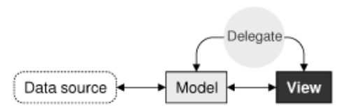

在 Qt 中，这个模型和它在经典的 MVC 中的行为是完全相同的。 Qt 使用的不是控制器，而是使用了一些稍微有些不同的抽象：委托（delegate）。委托用于对项的如何显示和如何编辑提供精细控制。Qt 对每种类型的视图都提供了默认的委托。对于绝大多数应用程序，这已经足够了，所以我们通常不需要注意它。

利用 Qt 的模型/视图架构，我们可以只从模型中获取实际在视图中显示所需要的数据。这样在处理非常大的数据集的时候，可以更加快速，而不至于降低性能。通过把一个模型注册到一个或者多个视图，就可让用户使用不同的方式查看数据以及和数据交互。Qt 对于多个视图会自动的保持同步，从而使对一个视图的改变会影响到全部视图，如下图所示。

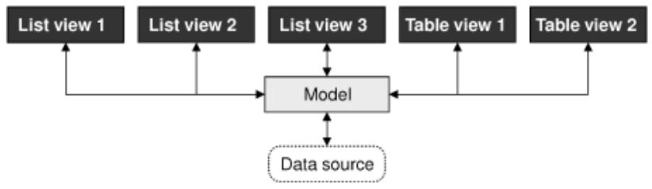

模型/视图的另外一个好处是：如果决定改变底层的数据集的存储方式，则只需要修改模型，而视图仍将能够继续正常工作。

在很多情况下，只需要把一小部分的项呈现给用户。在这些常见的例子中，可以使用 Qt 提供的那些方便的项视图类(QListWidget QTableWidget QTreeWidget) ,并且可以把它们和项直接组装起来。这些类和一些以前的 Qt 版本中提供的项视图类很相似。它们把数据存储在项中（eg： QTableWidget QTableWidgetItem）.实际上，在这些方便的类的内部，使用了自定义的模型，这样就可以让这些项在视图中变为可见的了。

对于大数据集，数据复制通常不是一个好方法。这是可以使用 Qt 的视图 (QListView QTableView QTreeView),把它们和一个数据模型连接，而这个模型即可以是自定义模型，也可以是 Qt 的预定义模型。例如，如果数据集被保存在一个数据库中，就可以把 QTableView 和 QSqlTableModel 组合在一起使用。

Qt 在线文档：
* [Model/View Programming](https://doc.qt.io/qt-5/model-view-programming.html)

## 使用项视图的简便类

使用 Qt 的项视图中那些方便的子类通常要比定义一个自定义模型简单得多，并且如果我们不需要由区分模型和视图所带来的好处时，这种方法也是比较合适的。

这一节将说明如何使用这些方便的项视图的子类来显示项。

### FlowChartSymbolPicker
eg1:一个只读的 QListWidget,流程图符号选择器应用程序，每个项都由一个图标、一段文本和一个唯一的 ID 组成：

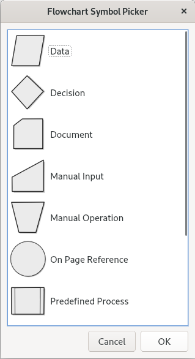

FlowChartSymbolPicker.h:
```c++
#ifndef FLOWCHARTSYMBOLPICKER_H
#define FLOWCHARTSYMBOLPICKER_H

#include <QDialog>
#include <QMap>

QT_BEGIN_NAMESPACE
class QDialogButtonBox;
class QIcon;
class QListWidget;
QT_END_NAMESPACE

class FlowChartSymbolPicker : public QDialog
{
    Q_OBJECT

public:
    FlowChartSymbolPicker(const QMap<int, QString> &symbolMap,
                          QWidget * parent = 0);

    // 获得一个选中的 ID （或者如果用户没有选中任何一项，就返回 -1）
    int selectedId() const { return id; }
    void done(int result) override;

private:
    QIcon iconForSymbol(const QString &symbolName);

    QListWidget * listWidget;
    QDialogButtonBox * buttonBox;
    int id;
};

#endif
```

FlowChartSymbolPicker.cpp:
```c++
#include <QtWidgets>

#include "FlowChartSymbolPicker.h"

FlowChartSymbolPicker::FlowChartSymbolPicker(
        const QMap<int, QString> &symbolMap, QWidget *parent)
    : QDialog(parent)
{
    // id 初始化为 -1
    id = -1;

    listWidget = new QListWidget;
    listWidget->setIconSize(QSize(60, 60));

    QMapIterator<int, QString> i(symbolMap);
    while (i.hasNext()) {
        i.next();
        QListWidgetItem * item = new QListWidgetItem(i.value(),
                                                    listWidget);
        item->setIcon(iconForSymbol(i.value()));

        // 把 ID 保存到 QListWidgetItem 中
        // QListWidgetItem 有几个角色(role)，每个角色都有一个关联的 QVariant。
        // 最常用的角色有 Qt::DisplayRole Qt::EditRole 和 Qt::IconRole ，
        // 并且这些角色都有方便的设置和获取函数[setText() 和 setIcon()],另外
        // 还有其他几个角色。通过指定一个大于等于 Qt::UserRole 的值，就可以
        // 定义自定义角色
        item->setData(Qt::UserRole, i.key());
    }

    buttonBox = new QDialogButtonBox(QDialogButtonBox::Ok
                                     | QDialogButtonBox::Cancel);

    connect(buttonBox, SIGNAL(accepted()), this, SLOT(accept()));
    connect(buttonBox, SIGNAL(rejected()), this, SLOT(reject()));

    QVBoxLayout * mainLayout = new QVBoxLayout;
    mainLayout->addWidget(listWidget);
    mainLayout->addWidget(buttonBox);
    setLayout(mainLayout);

    setWindowTitle(tr("Flowchart Symbol Picker"));
}

// 当用户单击 Ok 或者 Cancel 按钮时，就会调用它。
void FlowChartSymbolPicker::done(int result)
{
    id = -1;
    if (result == QDialog::Accepted) {
        QListWidgetItem * item = listWidget->currentItem();
        if (item)
            // 获取 ID
            id = item->data(Qt::UserRole).toInt();
            // 如果对项的文本感兴趣，则可以通过调用 item->data(Qt::DisplayRole).toString()
            // 或者更为方便的 item->text() 来获取文本
    }
    QDialog::done(result);
}

QIcon FlowChartSymbolPicker::iconForSymbol(const QString &symbolName)
{
    QString fileName = ":/images/" + symbolName.toLower();
    fileName.replace(' ', '-');
    return QIcon(fileName);
}
```

默认情况下，QListWidget 是只读的。如果想让用户编辑这些项，则可以使用 QAbstractItemView::setEditTriggers() 设置这个视图的编辑触发器。例如，QAbstractItemView::AnyKeyPressed 这个设置值的意思是：用户只要一开始输入就进入项的编辑状态。类似地，也可以提供一个 Edit 按钮（还可以提供 Add 和 Delete 按钮），同时使用信号-槽连接，这样就可以使用程序来控制编辑操作了。

### CoordinateSetter
eg2: 使用一个对话框，它显示的是用户可以编辑的一对(x,y) 坐标。

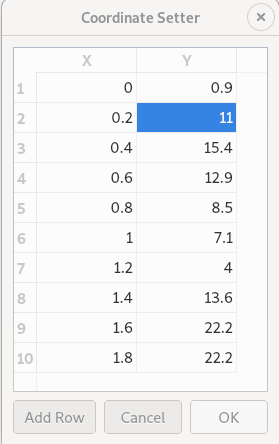

CoordinateSetter.h:
```c++
#ifndef COORDINATESETTER_H
#define COORDINATESETTER_H

#include <QDialog>
#include <QList>
#include <QPointF>

QT_BEGIN_NAMESPACE
class QDialogButtonBox;
class QTableWidget;
QT_END_NAMESPACE

class CoordinateSetter : public QDialog
{
    Q_OBJECT

public:
    CoordinateSetter(QList<QPointF> * coords, QWidget * parent = 0);

    void done(int result) override;

private slots:
    void addRow();

private:
    QTableWidget * tableWidget;
    QDialogButtonBox * buttonBox;
    QList<QPointF> * coordinates;
};

#endif
```

CoordinateSetter.cpp:
```c++
#include <QtWidgets>

#include "CoordinateSetter.h"

CoordinateSetter::CoordinateSetter(QList<QPointF> * coords,
                                   QWidget *parent)
    : QDialog(parent)
{
    coordinates = coords;

    tableWidget = new QTableWidget(0, 2);
    // 设置表窗口部件的水平表头项的文本
    tableWidget->setHorizontalHeaderLabels(
            QStringList() << tr("X") << tr("Y"));

    // 默认情况下，QTableWidget 会提供一个垂直表头，这个列的标签从 1 开始，
    // 这正是我们想要的，所以不需要手工设置垂直表头的标签。

    // 遍历，添加新行
    for (int row = 0; row < coordinates->count(); ++row) {
        QPointF point = coordinates->at(row);
        addRow();
        tableWidget->item(row, 0)->setText(QString::number(point.x()));
        tableWidget->item(row, 1)->setText(QString::number(point.y()));
    }

    // 默认情况下，QTableWidget 允许编辑。
    // 用户在这个视图所做的任何修改都会自动影响这些 QTableWidgetItem。
    // 为了防止编辑，可以调用 setEditTriggers(QAbstractItemView::NoEditTriggers)。

    buttonBox = new QDialogButtonBox(Qt::Horizontal);
    QPushButton * addRowButton = buttonBox->addButton(tr("&Add Row"),
            QDialogButtonBox::ActionRole);
    buttonBox->addButton(QDialogButtonBox::Ok);
    buttonBox->addButton(QDialogButtonBox::Cancel);

    connect(addRowButton, SIGNAL(clicked()), this, SLOT(addRow()));
    connect(buttonBox, SIGNAL(accepted()), this, SLOT(accept()));
    connect(buttonBox, SIGNAL(rejected()), this, SLOT(reject()));

    QVBoxLayout * mainLayout = new QVBoxLayout;
    mainLayout->addWidget(tableWidget);
    mainLayout->addWidget(buttonBox);
    setLayout(mainLayout);

    setWindowTitle(tr("Coordinate Setter"));
}

void CoordinateSetter::done(int result)
{
    if (result == QDialog::Accepted) {
        coordinates->clear();
        for (int row = 0; row < tableWidget->rowCount(); ++row) {
            double x = tableWidget->item(row, 0)->text().toDouble();
            double y = tableWidget->item(row, 1)->text().toDouble();
            coordinates->append(QPointF(x, y));
        }
    }
    QDialog::done(result);
}

void CoordinateSetter::addRow()
{
    int row = tableWidget->rowCount();

    tableWidget->insertRow(row);

    QTableWidgetItem * item0 = new QTableWidgetItem;
    item0->setTextAlignment(Qt::AlignRight | Qt::AlignVCenter);
    tableWidget->setItem(row, 0, item0);

    QTableWidgetItem * item1 = new QTableWidgetItem;
    item1->setTextAlignment(Qt::AlignRight | Qt::AlignVCenter);
    tableWidget->setItem(row, 1, item1);

    // 我们设置当前项，这样用户就可以开始编辑新的一行的第一项了
    tableWidget->setCurrentItem(item0);
}
```

### SettingsViewer
eg3:使用 QTreeWidget 显示 Qt 应用程序设置。QTreeWidget 默认是只读的。

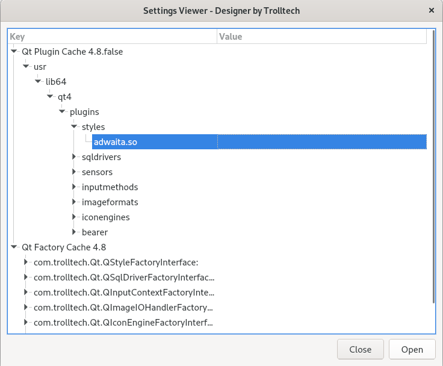

SettingsViewer.h:
```c++
#ifndef SETTINGSVIEWER_H
#define SETTINGSVIEWER_H

#include <QDialog>

QT_BEGIN_NAMESPACE
class QDialogButtonBox;
class QSettings;
class QTreeWidget;
class QTreeWidgetItem;
QT_END_NAMESPACE

class SettingsViewer : public QDialog
{
    Q_OBJECT

public:
    SettingsViewer(QWidget * parent = 0);

private slots:
    void open();

private:
    void readSettings();
    void addChildSettings(QSettings &settings, QTreeWidgetItem * item,
                          const QString &group);

    QTreeWidget * treeWidget;
    QDialogButtonBox * buttonBox;

    QString organization;
    QString application;
};

#endif
```

SettingsViewer.cpp:
```c++
#include <QtWidgets>

#include "SettingsViewer.h"

SettingsViewer::SettingsViewer(QWidget * parent)
    : QDialog(parent)
{
    // 为了访问应用程序的设置，必须使用组织名称和应用程序名称
    //作为参数创建 QSettings 对象。
    organization = "Trolltech";
    application = "Designer";

    treeWidget = new QTreeWidget;
    treeWidget->setColumnCount(2);

    treeWidget->setHeaderLabels(
            QStringList() << tr("Key") << tr("Value"));

    // 树形窗口部件的头视图控制了树形队列的大小
    // 设置两列的重定义模式为 Stretch。这就告诉了头视图总是确保列能够填充有用的空间。
    // 在这种模式下，用户或者程序都不能重新调整列的大小。
    treeWidget->header()->setSectionResizeMode(0, QHeaderView::Stretch); // replace setResizeMode()
    treeWidget->header()->setSectionResizeMode(1, QHeaderView::Stretch); // replace setResizeMode()

    buttonBox = new QDialogButtonBox(QDialogButtonBox::Open
                                     | QDialogButtonBox::Close);

    connect(buttonBox, SIGNAL(accepted()), this, SLOT(open()));
    connect(buttonBox, SIGNAL(rejected()), this, SLOT(close()));

    QVBoxLayout * mainLayout = new QVBoxLayout;
    mainLayout->addWidget(treeWidget);
    mainLayout->addWidget(buttonBox);
    setLayout(mainLayout);

    setWindowTitle(tr("Settings Viewer"));
    readSettings();
}

void SettingsViewer::open()
{
    QDialog dialog(this);

    QLabel * orgLabel = new QLabel(tr("&Organization:"));
    QLineEdit * orgLineEdit = new QLineEdit(organization);
    orgLabel->setBuddy(orgLineEdit);

    QLabel * appLabel = new QLabel(tr("&Application:"));
    QLineEdit * appLineEdit = new QLineEdit(application);
    appLabel->setBuddy(appLineEdit);

    QDialogButtonBox * buttonBox = new QDialogButtonBox(
            QDialogButtonBox::Ok | QDialogButtonBox::Cancel);

    connect(buttonBox, SIGNAL(accepted()), &dialog, SLOT(accept()));
    connect(buttonBox, SIGNAL(rejected()), &dialog, SLOT(reject()));

    QGridLayout * gridLayout = new QGridLayout;
    gridLayout->addWidget(orgLabel, 0, 0);
    gridLayout->addWidget(orgLineEdit, 0, 1);
    gridLayout->addWidget(appLabel, 1, 0);
    gridLayout->addWidget(appLineEdit, 1, 1);

    QVBoxLayout * mainLayout = new QVBoxLayout;
    mainLayout->addLayout(gridLayout);
    mainLayout->addWidget(buttonBox);
    dialog.setLayout(mainLayout);

    dialog.setWindowTitle(tr("Choose Settings"));

    if (dialog.exec()) {
        organization = orgLineEdit->text();
        application = appLineEdit->text();
        readSettings();
    }
}

void SettingsViewer::readSettings()
{
    QSettings settings(organization, application);

    treeWidget->clear();
    addChildSettings(settings, 0, "");

    treeWidget->sortByColumn(0);
    treeWidget->setFocus();
    setWindowTitle(tr("Settings Viewer - %1 by %2")
                   .arg(application).arg(organization));
}

// 用于创建所有的 QTreeWidgetItem
void SettingsViewer::addChildSettings(QSettings &settings,
        QTreeWidgetItem *parent, const QString &group)
{
    if (!parent)
        parent = treeWidget->invisibleRootItem();
    QTreeWidgetItem * item;

    settings.beginGroup(group);

    foreach (QString key, settings.childKeys()) {
        item = new QTreeWidgetItem(parent);
        item->setText(0, key);
        item->setText(1, settings.value(key).toString());
    }
    foreach (QString group, settings.childGroups()) {
        item = new QTreeWidgetItem(parent);
        item->setText(0, group);
        addChildSettings(settings, item, group);
    }
    settings.endGroup();
}
```

在这一节中所显示的项视图窗口部件允许我们使用和以前的 Qt 版本中类似的方式进行编程：读取要被设置到一个项视图窗口部件中的所有数据、使用项对象呈现数据元素并且回写数据源（如果这些项是可编辑的话）。在后面的几节中，我们将不再局限于这种简单的方式，并且会充分利用 Qt 模型/视图架构的所有好处。

## 使用预定义模型

Qt 提供了几种可以在视图类中使用的预定义模型：

|        预定义模型        |           功能          |
|:------------------------:|:-----------------------:|
|     [QStringListModel](https://doc.qt.io/qt-5/qstringlistmodel.html)     |    存储一个字符串列表   |
|    [QStandardItemModel](https://doc.qt.io/qt-5/qstandarditemmodel.html)    |  存储任意的分层次的数据 |
|         [QDirModel](https://doc.qt.io/qt-5/qdirmodel.html)        |     封装本地文件系统    |
|      [QSqlQueryModel](https://doc.qt.io/qt-5/qsqlquerymodel.html)      |   封装一个 SQL 结果集   |
|      [QSqlTableModel](https://doc.qt.io/qt-5/qsqltablemodel.html)      |     封装一个 SQL 表     |
| [QSqlRelationalTableModel](https://doc.qt.io/qt-5/qsqlrelationaltablemodel.html) | 利用外键封装一个 SQL 表 |
|   [QSortFilterProxyModel](https://doc.qt.io/qt-5/qsortfilterproxymodel.html)  | 排序和/或筛选另一个模型 |

这一节将看到如何使用 QStringListModel 、QDirModel 和 QSortFilterProxyModel 。 SQL 模型将会在第13章讲到。


### TeamLeadersDialog
eg：一个简单的对话框，用户可以使用它添加、删除和编辑一个 QStringList ，其中每个字符串都代表一个团队领导。

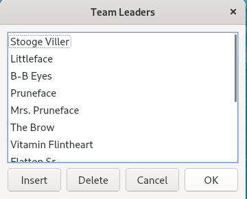

TeamLeadersDialog.h:
```c++
#ifndef TEAMLEADERSDIALOG_H
#define TEAMLEADERSDIALOG_H

#include <QDialog>

QT_BEGIN_NAMESPACE
class QDialogButtonBox;
class QListView;
class QStringListModel;
QT_END_NAMESPACE

class TeamLeadersDialog : public QDialog
{
    Q_OBJECT

public:
    TeamLeadersDialog(const QStringList &leaders, QWidget * parent = 0);

    QStringList leaders() const;

private slots:
    void insert();
    void del();

private:
    QListView * listView;
    QDialogButtonBox * buttonBox;
    QStringListModel * model;
};

#endif
```

TeamLeadersDialog.cpp:
```c++
#include <QtWidgets>

#include "TeamLeadersDialog.h"

TeamLeadersDialog::TeamLeadersDialog(const QStringList &leaders,
                                     QWidget *parent)
    : QDialog(parent)
{
    // 创建 QStringListModel
    model = new QStringListModel(this);
    model->setStringList(leaders);

    // 创建 QListView,并使用刚才创建的模型
    listView = new QListView;
    listView->setModel(model);

    // 允许用户简单地通过开始输入或者双击进入编辑字符串的状态
    // 默认情况下，QListView 中没有任何触发器，这样就使这个视图只读。
    listView->setEditTriggers(QAbstractItemView::AnyKeyPressed
                              | QAbstractItemView::DoubleClicked);

    buttonBox = new QDialogButtonBox();
    QPushButton * insertButton = buttonBox->addButton(tr("&Insert"),
            QDialogButtonBox::ActionRole);
    QPushButton * deleteButton = buttonBox->addButton(tr("&Delete"),
            QDialogButtonBox::ActionRole);
    buttonBox->addButton(QDialogButtonBox::Ok);
    buttonBox->addButton(QDialogButtonBox::Cancel);

    connect(insertButton, SIGNAL(clicked()), this, SLOT(insert()));
    connect(deleteButton, SIGNAL(clicked()), this, SLOT(del()));
    connect(buttonBox, SIGNAL(accepted()), this, SLOT(accept()));
    connect(buttonBox, SIGNAL(rejected()), this, SLOT(reject()));

    QVBoxLayout * mainLayout = new QVBoxLayout;
    mainLayout->addWidget(listView);
    mainLayout->addWidget(buttonBox);
    setLayout(mainLayout);

    setWindowTitle(tr("Team Leaders"));
}

QStringList TeamLeadersDialog::leaders() const
{
    return model->stringList();
}

void TeamLeadersDialog::insert()
{
    int row = listView->currentIndex().row();
    // 这个插入是在模型中完成的，并且模型会自动更新列表视图。
    model->insertRows(row, 1);

    // 模型中的每一项数据项都对应一个 “模型索引”，它是由一个 QModelIndex 对象表示的。
    // 索引有三个组成部分：行、列和它所属的模型的指针。
    // 在一个一维的列表视图中，列总是 0 。
    QModelIndex index = model->index(row);
    // 设置刚刚插入的空白行为列表视图的当前索引
    listView->setCurrentIndex(index);
    listView->edit(index);
}

void TeamLeadersDialog::del()
{
    // 因为我们只是想删除当前行，所以可以使用当前索引位置调用 removeRows()
    // 并且把要删除的行数设置为 1 .
    // 就像刚才的插入操作一样，我们需要依赖于模型才能够相应地更新这个视图。

    model->removeRows(listView->currentIndex().row(), 1);
}
```

### DirectoryViewer
eg2：一个实例，使用了 QDirModel 类，它封装了计算机的文件系统并且可以显示（或者隐藏）不同的文件属性。可以为这个模型设置应用过滤器，这样就可以根据自己的需要显示不同类型的文件系统条目，并且使用不同的方式对这些条目进行排序。

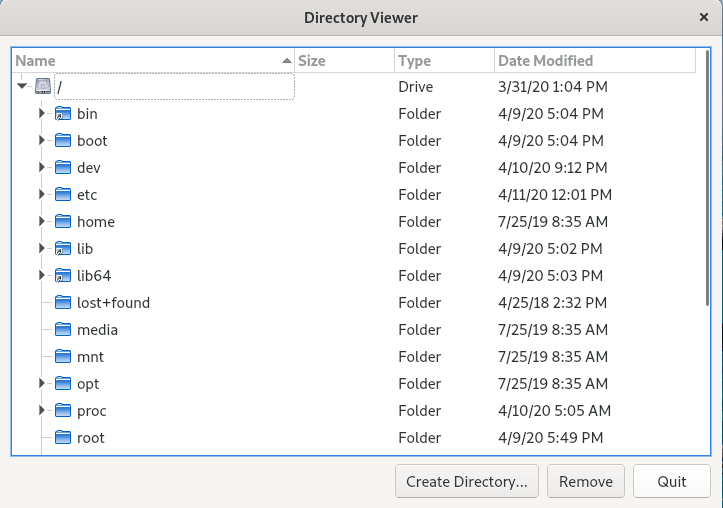

DirectoryViewer.h:
```c++
#ifndef DIRECTORYVIEWER_H
#define DIRECTORYVIEWER_H

#include <QDialog>

QT_BEGIN_NAMESPACE
class QDialogButtonBox;
class QDirModel;
class QTreeView;
QT_END_NAMESPACE

class DirectoryViewer : public QDialog
{
    Q_OBJECT

public:
    DirectoryViewer(QWidget * parent = 0);

private slots:
    void createDirectory();
    void remove();

private:
    QTreeView * treeView;
    QDirModel * model;
    QDialogButtonBox * buttonBox;
};

#endif
```

DirectoryViewer.cpp:
```c++
#include <QtWidgets>

#include "DirectoryViewer.h"

DirectoryViewer::DirectoryViewer(QWidget *parent)
    : QDialog(parent)
{
    model = new QDirModel;
    // 设置可编辑
    model->setReadOnly(false);
    // 设置不同的初始排序属性
    model->setSorting(QDir::DirsFirst | QDir::IgnoreCase | QDir::Name);

    treeView = new QTreeView;
    treeView->setModel(model);
    // 这个 QTreeView 的头可以用来提供用户控制的排序功能
    treeView->header()->setStretchLastSection(true);
    treeView->header()->setSortIndicator(0, Qt::AscendingOrder);
    treeView->header()->setSortIndicatorShown(true);
    // 让用户能够按它们所点击的列进行排序
    treeView->header()->setSectionsClickable(true); //setClickable(true);

    QModelIndex index = model->index(QDir::currentPath());
    // 如果需要就打开它的父对象一直到根节点
    treeView->expand(index);
    // 滚动到当前项
    treeView->scrollTo(index);
    // 确保第一列足够宽，可以显示它的所有条目，而不是使用省略号
    treeView->resizeColumnToContents(0);

    buttonBox = new QDialogButtonBox(Qt::Horizontal);
    QPushButton * mkdirButton = buttonBox->addButton(
            tr("&Create Directory..."), QDialogButtonBox::ActionRole);
    QPushButton * removeButton = buttonBox->addButton(tr("&Remove"),
            QDialogButtonBox::ActionRole);
    buttonBox->addButton(tr("&Quit"), QDialogButtonBox::AcceptRole);

    connect(mkdirButton, SIGNAL(clicked()),
            this, SLOT(createDirectory()));
    connect(removeButton, SIGNAL(clicked()), this, SLOT(remove()));
    connect(buttonBox, SIGNAL(accepted()), this, SLOT(accept()));

    QVBoxLayout * mainLayout = new QVBoxLayout;
    mainLayout->addWidget(treeView);
    mainLayout->addWidget(buttonBox);
    setLayout(mainLayout);

    setWindowTitle(tr("Directory Viewer"));
}

void DirectoryViewer::createDirectory()
{
    QModelIndex index = treeView->currentIndex();
    if (!index.isValid())
        return;

    QString dirName = QInputDialog::getText(this,
                              tr("Create Directory"),
                              tr("Directory name"));
    if (!dirName.isEmpty()) {
        if (!model->mkdir(index, dirName).isValid())
            QMessageBox::information(this, tr("Create Directory"),
                    tr("Failed to create the directory"));
    }
}

// 试图移除当前项所对应的文件或者目录。也可以使用 QDir 来完成这项操作，
// 但是 QDirModel 提供了一些对 QModelIndex 起作用的方便函数。
void DirectoryViewer::remove()
{
    QModelIndex index = treeView->currentIndex();
    if (!index.isValid())
        return;

    bool ok;
    if (model->fileInfo(index).isDir()) {
        ok = model->rmdir(index);
    } else {
        ok = model->remove(index);
    }
    if (!ok)
        QMessageBox::information(this, tr("Remove"),
                tr("Failed to remove %1").arg(model->fileName(index)));
}
```

### ColorNameDialog

一个实例用于显示如何使用 QSortFilterProxyModel。和其他预定义模型不同，这个模型封装了一个已经存在了的模型并且对在底层模型和视图之间的传递的数据进行操作。在我们的实例中，底层模型是一个由 Qt 所认识的颜色名称[通过调用 QColor::colorNames()得到]初始化的 QStringListModel。用户可以在 QLineEdit 中输入一个过滤器字符并且使用组合框指定这个字符串被如何解释（作为正则表达式、通配符模式或者固定字符串）。

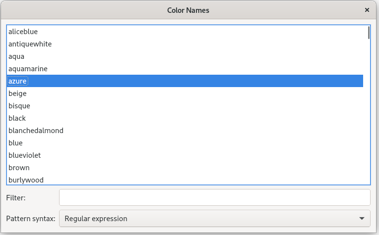


ColorNameDialog.h:
```c++
#ifndef COLORNAMESDIALOG_H
#define COLORNAMESDIALOG_H

#include <QDialog>

QT_BEGIN_NAMESPACE
class QComboBox;
class QLabel;
class QLineEdit;
class QListView;
class QSortFilterProxyModel;
class QStringListModel;
QT_END_NAMESPACE

class ColorNamesDialog : public QDialog
{
    Q_OBJECT

public:
    ColorNamesDialog(QWidget * parent = 0);

private slots:
    void reapplyFilter();

private:
    QStringListModel * sourceModel;
    QSortFilterProxyModel * proxyModel;
    QListView * listView;
    QLabel * filterLabel;
    QLabel * syntaxLabel;
    QLineEdit * filterLineEdit;
    QComboBox * syntaxComboBox;
};

#endif
```

ColorNameDialog.cpp:
```c++
#include <QtWidgets>

#include "ColorNamesDialog.h"

ColorNamesDialog::ColorNamesDialog(QWidget *parent)
    : QDialog(parent)
{
    sourceModel = new QStringListModel(this);
    sourceModel->setStringList(QColor::colorNames());

    proxyModel = new QSortFilterProxyModel(this);

    // 传递底层模型并且告诉这个代理过滤器并且告诉这个代理过滤器
    // 被应用在初始模型的第 0 列。
    proxyModel->setSourceModel(sourceModel);
    proxyModel->setFilterKeyColumn(0);

    listView = new QListView;
    listView->setModel(proxyModel);
    listView->setEditTriggers(QAbstractItemView::NoEditTriggers);

    filterLabel = new QLabel(tr("&Filter:"));
    filterLineEdit = new QLineEdit;
    filterLabel->setBuddy(filterLineEdit);

    syntaxLabel = new QLabel(tr("&Pattern syntax:"));
    syntaxComboBox = new QComboBox;
    // QComboBox::addItem() 函数接受一个类型为 QVariant 的可选“数据”参数。
    // 我们使用它存储和每一项文本对应的 QRegExp::PatternSyntax 值。
    syntaxComboBox->addItem(tr("Regular expression"), QRegExp::RegExp);
    syntaxComboBox->addItem(tr("Wildcard"), QRegExp::Wildcard);
    syntaxComboBox->addItem(tr("Fixed string"), QRegExp::FixedString);
    syntaxLabel->setBuddy(syntaxComboBox);

    connect(filterLineEdit, SIGNAL(textChanged(const QString &)),
            this, SLOT(reapplyFilter()));
    connect(syntaxComboBox, SIGNAL(currentIndexChanged(int)),
            this, SLOT(reapplyFilter()));

    QGridLayout * mainLayout = new QGridLayout;
    mainLayout->addWidget(listView, 0, 0, 1, 2);
    mainLayout->addWidget(filterLabel, 1, 0);
    mainLayout->addWidget(filterLineEdit, 1, 1);
    mainLayout->addWidget(syntaxLabel, 2, 0);
    mainLayout->addWidget(syntaxComboBox, 2, 1);
    setLayout(mainLayout);

    setWindowTitle(tr("Color Names"));
}

void ColorNamesDialog::reapplyFilter()
{
    QRegExp::PatternSyntax syntax =
            QRegExp::PatternSyntax(syntaxComboBox->itemData(
                    syntaxComboBox->currentIndex()).toInt());
    QRegExp regExp(filterLineEdit->text(), Qt::CaseInsensitive, syntax);
    // 会激活新的过滤器并且会自动更新视图
    proxyModel->setFilterRegExp(regExp);
}

```

## 实现自定义模型

Qt 的预定义模型为数据的处理和查看提供了很好的方法。但是有些数据源不能有效地和预定义模型一起工作，这是就需要创建自定义模型，以方便对底层数据源进行优化。

在介绍如何创建自定义模型之前，让我们先看看在 Qt 模型/视图架构中的的一些重要概念。在模型中，每一个数据元素都有一个模型索引和一套属性(attribute)，称为角色(role)，这些角色可以保存任意值。本章的前面部分中已看到过最常用的角色 Qt::DisplayRole 和 Qt::EditRole 。其他角色都是用来补充说明数据的 （例如，Qt::ToolTipRole  Qt::StatusTipRole  和 Qt::WhatsThisRole），还有一些是用来控制基本显示属性的(例如，Qt::FontRole Qt::TextAlignmentRole Qt::TextColorRole 和 Qt::BackgroundColorRole).

对于列表模型，唯一和索引部分相关的就是行号，可以通过 QModelIndex::row() 得到。对于表模型，与索引部分相关的就是行号和列号，分别可以通过 QModelIndex::row() 和 QModelIndex::column() 得到。对于列表模型和表模型，每个项的父对象都是根，通常由一个无效的 QModelIndex 表示。本节的前两个实例就是如何实现自定义模型。

树模型和表模型类似，但有如下不同之处：像表模型一样，最顶层的父对象是根(一个无效的 QModelIndex)，但是其他每一项的父对象都是继承树中的一些项。这些父对象可以通过 QModelIndex::parent() 得到。本节的最后一个例子将会讲述这一部分。

不同模型的示意图：

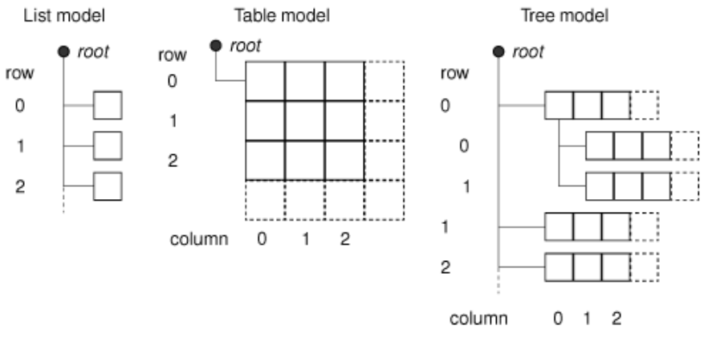

### CurrencyModel

一个显示各个货币之间汇率关系的只读表结构。

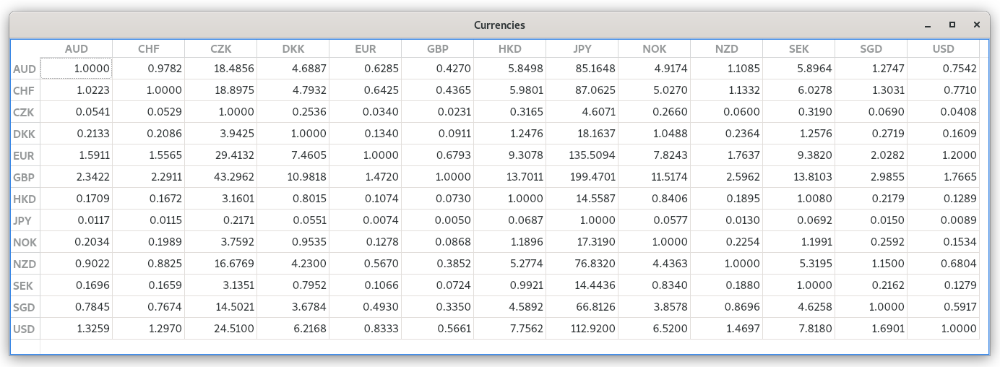

本可以用一个简单的表模型实现这个例子，但是我们想使用一个自定义模型，它可以使我们得到的数据的常用属性并且节省存储空间。如果要在一个表中存储 162 个货币单位之间的汇率，则需要存储 162 x 162 = 26 244 个值。利用本节的自定义 CurrencyModel 模型,只需要存储 162 个值（每一个货币和美元之前的汇率值）。

CurrencyModel 类将和一个标准的 QTableView 一同使用。CurrencyModel 由 QMap<QString, double> 组装而成，key - 货币编码 , value - 以美元为单位的货币值

```c++
    QMap<QString, double> currencyMap;
    currencyMap.insert("AUD", 1.3259);
    currencyMap.insert("CHF", 1.2970);
    currencyMap.insert("CZK", 24.510);
    currencyMap.insert("DKK", 6.2168);
    currencyMap.insert("EUR", 0.8333);
    currencyMap.insert("GBP", 0.5661);
    currencyMap.insert("HKD", 7.7562);
    currencyMap.insert("JPY", 112.92);
    currencyMap.insert("NOK", 6.5200);
    currencyMap.insert("NZD", 1.4697);
    currencyMap.insert("SEK", 7.8180);
    currencyMap.insert("SGD", 1.6901);
    currencyMap.insert("USD", 1.0000);

    CurrencyModel currencyModel;
    currencyModel.setCurrencyMap(currencyMap);

    QTableView tableView;
    tableView.setModel(&currencyModel);
    tableView.setAlternatingRowColors(true);
```


CurrencyModel.h:
```c++
#ifndef CURRENCYMODEL_H
#define CURRENCYMODEL_H

#include <QAbstractTableModel>
#include <QMap>

class CurrencyModel : public QAbstractTableModel
{
public:
    CurrencyModel(QObject * parent = 0);

    void setCurrencyMap(const QMap<QString, double> &map);
    int rowCount(const QModelIndex &parent) const override;
    int columnCount(const QModelIndex &parent) const override;
    QVariant data(const QModelIndex &index, int role) const override;
    QVariant headerData(int section, Qt::Orientation orientation,
                       int role) const override;

private:
    QString currencyAt(int offset) const;

    QMap<QString, double> currencyMap;
};

#endif
```

我们选择 [QAbstractTableModel](https://doc.qt.io/qt-5/qabstracttablemodel.html) 作为模型的基类这是因为它和数据源最为接近。Qt 提供个几种模型基类，其中包括 [QAbstractListModel](https://doc.qt.io/qt-5/qabstractlistmodel.html) 、 QAbstractTableModel 和 [QAbstractItemModel](https://doc.qt.io/qt-5/qabstractitemmodel.html).

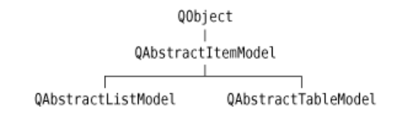

QAbstractItemModel 类用于支持多种模型，其中包括那些基于递归数据结构的模型，而 QAbstractListModel 和 QAbstractTableModel 两个类主要用于提供一维和二维数据集。


CurrencyModel.cpp:
```c++
#include <QtCore>

#include "CurrencyModel.h"

CurrencyModel::CurrencyModel(QObject *parent)
    : QAbstractTableModel(parent)
{
}

// 改变货币映射
void CurrencyModel::setCurrencyMap(const QMap<QString, double> &map)
{
    // because reset() was deprecated on Qt 5.0
	beginResetModel();
	currencyMap = map;
    endResetModel();
}

int CurrencyModel::rowCount(const QModelIndex & /* parent */) const
{
    return currencyMap.count();
}

int CurrencyModel::columnCount(const QModelIndex & /* parent */) const
{
    return currencyMap.count();
}

// 返回一个项的任意角色的值
// 对于表模型，QModelIndex 中有意义的部分是它的行号和列号
// ，可以通过 row() 和 column() 得到它们。
QVariant CurrencyModel::data(const QModelIndex &index, int role) const
{
    if (!index.isValid())
        return QVariant();

    if (role == Qt::TextAlignmentRole) {
      // 返回一个与数字相匹配的对齐方式
        return int(Qt::AlignRight | Qt::AlignVCenter);
    } else if (role == Qt::DisplayRole) {
      // 查找每一种货币对应的值并且计算出兑换汇率
        QString rowCurrency = currencyAt(index.row());
        QString columnCurrency = currencyAt(index.column());

        if (currencyMap.value(rowCurrency) == 0.0)
            return "####";

        double amount = currencyMap.value(columnCurrency)
                        / currencyMap.value(rowCurrency);

        // 可以返回 double 类型的计算结果，但是那样就无法控制显示的精度（除非使用的是一个自定义的委托）。
        // 所以我们返回字符串类型的值，这个字符串已经按照我们的想法进行了格式化。
        return QString("%1").arg(amount, 0, 'f', 4);
    }
    return QVariant();
}

// 当组装水平表头和垂直表头的时候，就会调用该函数。
// section 参数是指行号或者列号（这取决于实际方向）。
// 因为这里的行和列都是相同的货币代码，所以不需要考虑方向
// ，只需要简单地根据给定的序号返回对应货币的代码即可。
QVariant CurrencyModel::headerData(int section,
                                   Qt::Orientation /* orientation */,
                                   int role) const
{
    if (role != Qt::DisplayRole)
        return QVariant();
    return currencyAt(section);
}

QString CurrencyModel::currencyAt(int offset) const
{
    return (currencyMap.begin() + offset).key();
}
```

正如现在所看到的，依赖于底层数据的实际情况创建只读模型并不困难，而且具有良好设计的模型还可以节约内存，提升速度。

### CityModel
一个基于表的城市应用程序，但是这一次所有的数据都是由用户输入的。

这个应用程序用于存储任意两个城市之间的距离的值。

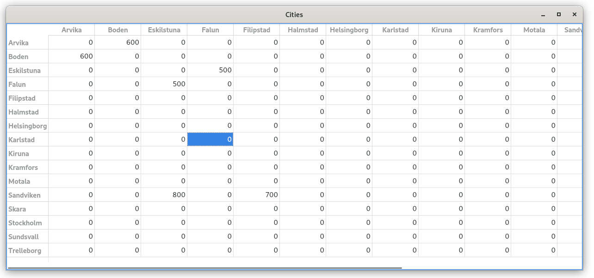

为了查看自定义模型和简单表之间的区别，我们假设有三个城市：A、B 和 C。如果为每一个组合存储一个值，就需要存储 9 个值。而一个仔细设计过的模型只需要 3 项：(A,B) (A,C) 和 (B,C);

建立并使用这一模型：
```c++
QStringList cities;
    cities << "Arvika" << "Boden" << "Eskilstuna" << "Falun"
           << "Filipstad" << "Halmstad" << "Helsingborg" << "Karlstad"
           << "Kiruna" << "Kramfors" << "Motala" << "Sandviken"
           << "Skara" << "Stockholm" << "Sundsvall" << "Trelleborg";

    CityModel cityModel;
    cityModel.setCities(cities);

    QTableView tableView;
    tableView.setModel(&cityModel);
    tableView.setAlternatingRowColors(true);
```

CityModel.h:
```c++
#ifndef CITYMODEL_H
#define CITYMODEL_H

#include <QAbstractTableModel>
#include <QStringList>
#include <QVector>

class CityModel : public QAbstractTableModel
{
    Q_OBJECT

public:
    CityModel(QObject * parent = 0);

    void setCities(const QStringList &cityNames);
    int rowCount(const QModelIndex &parent) const override;
    int columnCount(const QModelIndex &parent) const override;
    QVariant data(const QModelIndex &index, int role) const override;
    bool setData(const QModelIndex &index, const QVariant &value,
                 int role) override;
    QVariant headerData(int section, Qt::Orientation orientation,
                        int role) const override;
    Qt::ItemFlags flags(const QModelIndex &index) const override;

private:
    int offsetOf(int row, int column) const;

    // 保存了城市的名称
    QStringList cities;
    // 保存了每一对城市之间的距离
    QVector<int> distances;
};

#endif
```

为了使模型可以被编辑，还必须实现重新实现 setData() 和 flags().

CityModel.cpp:
```c++
#include <QtCore>

#include "CityModel.h"

CityModel::CityModel(QObject *parent)
    : QAbstractTableModel(parent)
{
}

void CityModel::setCities(const QStringList &cityNames)
{
    // because reset() was deprecated on Qt 5.0
   beginResetModel();
   cities = cityNames;
   distances.resize(cities.count() * (cities.count() - 1) / 2);
   distances.fill(0);
   endResetModel();
}

int CityModel::rowCount(const QModelIndex & /* parent */) const
{
    return cities.count();
}

int CityModel::columnCount(const QModelIndex & /* parent */) const
{
    return cities.count();
}

QVariant CityModel::data(const QModelIndex &index, int role) const
{
    if (!index.isValid())
        return QVariant();

    if (role == Qt::TextAlignmentRole) {
        return int(Qt::AlignRight | Qt::AlignVCenter);
    } else if (role == Qt::DisplayRole) {
        if (index.row() == index.column())
            // 对应当两个城市相同的时候的情况
            return 0;

        // 查找给定的行和列所对应的条目，并且返回这个特定城市对的距离
        int offset = offsetOf(index.row(), index.column());
        return distances[offset];
    }
    return QVariant();
}

// 当用户编辑一个项的时候，就会调用该函数
bool CityModel::setData(const QModelIndex &index,
                        const QVariant &value, int role)
{
    if (index.isValid() && index.row() != index.column()
            && role == Qt::EditRole) {
        int offset = offsetOf(index.row(), index.column());
        distances[offset] = value.toInt();

        // createIndex() 用户产生一个模型索引。我们需要使用它获得在主对角线另外一侧和
        // 当点正在被设置的项所对应项的模型索引，因为这两个项必须显示相同的数据。
        // createIndex() 函数中的参数顺序是在行号在列号之前。这里调换这两个参数，
        //这样就可以获得由 index 指定的项多对应的项的模型索引。
        QModelIndex transposedIndex = createIndex(index.column(),
                                                  index.row());

        emit dataChanged(index, index);
        emit dataChanged(transposedIndex, transposedIndex);
        return true;
    }
    return false;
}

// 水平表头和垂直表头一样
QVariant CityModel::headerData(int section,
                               Qt::Orientation /* orientation */,
                               int role) const
{
    if (role == Qt::DisplayRole)
        return cities[section];
    return QVariant();
}

// 模型会使用 flags() 函数得到该如何对一个项进行相关的操作（例如，是否可以编辑）。
// 在 QAbstractTableModel 中的默认实现是返回 Qt::ItemIsSelectable | Qt::ItemIsEnabled.
// 对于所有不在主对角线上的项（它们总是 0），都会添加这个 Qt::ItemIsEditable 标记。
Qt::ItemFlags CityModel::flags(const QModelIndex &index) const
{
    Qt::ItemFlags flags = QAbstractItemModel::flags(index);
    if (index.row() != index.column())
        flags |= Qt::ItemIsEditable;
    return flags;
}

// 用于计算给定的城市对在 distance 矢量中的索引。
int CityModel::offsetOf(int row, int column) const
{
    if (row < column)
        qSwap(row, column);
    return (row * (row - 1) / 2) + column;
}
```

城市、距离及其相应表模型之间的关系。

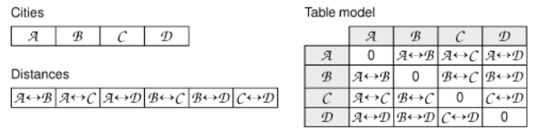

### Boolean Parser

一个显示给定布尔表达式的解析树的模型。

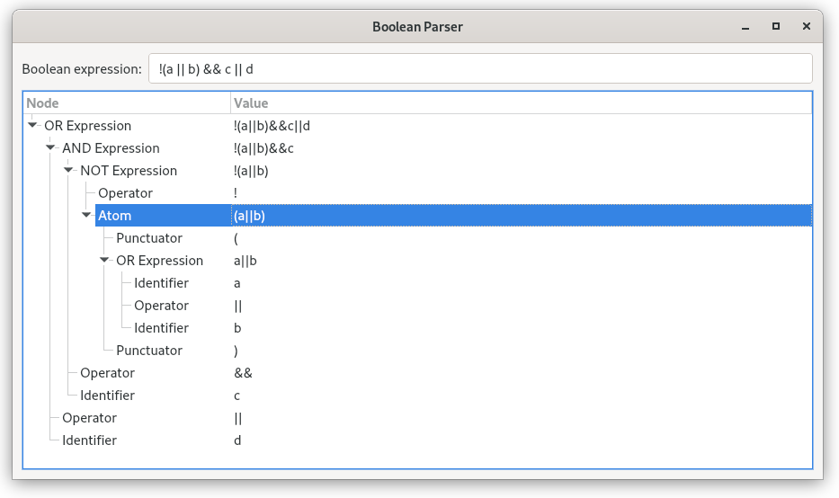

该应用程序由四个类组成：
* BooleanWindow 是一个让用户输入布尔表达式并且显示解析树的窗口
* BooleanParser 从一个布尔表达式生成一个解析树
* BooleanModel 是一个封装解析树的树模型
* Node 代表解析树中的一个节点

Node.h:

```c++
#ifndef NODE_H
#define NODE_H

#include <QList>
#include <QString>

class Node
{
public:
    enum Type { Root, OrExpression, AndExpression, NotExpression, Atom,
                Identifier, Operator, Punctuator };

    Node(Type type, const QString &str = "");
    ~Node();

    Type type;
    QString str;
    Node * parent;
    QList<Node * > children;
};

#endif
```

Node.cpp:

```c++
#include <QtCore>

#include "BooleanParser.h"

Node::Node(Type type, const QString &str)
{
    this->type = type;
    this->str = str;
    parent = 0;
}

Node::~Node()
{
    // 遍历一个容器的所有指针并且对每一个指针都调用 delete。但是它并不把这些指针设置为 null
    //,所以在一个析构函数外面使用这个函数时，通常在它之后需要调用 clear(),以清空这个容器中保存的所有指针。
    qDeleteAll(children);
}

```

现在我们已经定义了数据项（每一个都表示为一个 Node），已经为创建一个模型做好了准备：

BooleanModel.h:

```c++
#ifndef BOOLEANMODEL_H
#define BOOLEANMODEL_H

#include <QAbstractItemModel>

QT_BEGIN_NAMESPACE
class Node;
QT_END_NAMESPACE

class BooleanModel : public QAbstractItemModel
{
public:
    BooleanModel(QObject * parent = 0);
    ~BooleanModel();

    void setRootNode(Node * node);

    QModelIndex index(int row, int column,
                     const QModelIndex &parent) const override;
    QModelIndex parent(const QModelIndex &child) const override;

    int rowCount(const QModelIndex &parent) const override;
    int columnCount(const QModelIndex &parent) const override;
    QVariant data(const QModelIndex &index, int role) const override;
    QVariant headerData(int section, Qt::Orientation orientation,
                       int role) const override;

private:
    Node * nodeFromIndex(const QModelIndex &index) const;

    Node * rootNode;
};

#endif
```

这一次使用 QAbstractItemModel 作为基类，而不是它的方便的子类 QAbstractTableModel ，这是因为我们想创建一个分层模型。为了设置模型的数据，还有一个 setRootNode() 函数，调用这个函数的时候，必须使用解析树的根节点作为参数。

BooleanModel.cpp:

```c++
#include <QtCore>

#include "BooleanModel.h"
#include "BooleanParser.h"

BooleanModel::BooleanModel(QObject *parent)
    : QAbstractItemModel(parent)
{
    rootNode = 0;
}

BooleanModel::~BooleanModel()
{
    // 删除根节点。如果根节点有子对象，每一个子对象也都会被删除
    // ，并且依次递归往下删除，这是由 Node 的析构函数完成的。
    delete rootNode;
}

void BooleanModel::setRootNode(Node *node)
{
    // because reset() was deprecated on Qt 5.0
    beginResetModel();

    delete rootNode;
    rootNode = node;

    endResetModel();
}

// 只要模型或者视图需要为一个特定的子项（或者如果 parent 是 一个无效的 QModelIndex 时为顶级项）
// 创建一个 QModelIndex 的时候，这个函数就会被调用.对于表模型和列表模型，不需要重新实现这个函数，
// 因为 QAbstractListModel 和 QAbstractTableModel 默认的实现已经足够了
QModelIndex BooleanModel::index(int row, int column,
                                const QModelIndex &parent) const
{
    if (!rootNode || row < 0 || column < 0)
        return QModelIndex();

    // 根据给定的行和列以及一个 Node * 为被请求的子对象创建一个  QModelIndex。
    //对于层次模型，已知一个项相对于它的父对象的行和列并不能够唯一确定它，
    //还必须知道它的父对象是谁。为了解决这个问题，可以在 QModelIndex 中存储一个指向内部节点的指针。
    //除了行号和列号之外，QModelIndex 还为我们提供了存储一个 void * 或者 int 的选择。
    Node * parentNode = nodeFromIndex(parent);
    // 可以通过父节点的 children 列表获得子节点的 Node * 。
    Node * childNode = parentNode->children.value(row);
    if (!childNode)
        return QModelIndex();
    return createIndex(row, column, childNode);
}

QModelIndex BooleanModel::parent(const QModelIndex &child) const
{
    Node * node = nodeFromIndex(child);
    if (!node)
        return QModelIndex();
    Node * parentNode = node->parent;
    if (!parentNode)
        return QModelIndex();
    Node * grandparentNode = parentNode->parent;
    if (!grandparentNode)
        return QModelIndex();

    int row = grandparentNode->children.indexOf(parentNode);
    return createIndex(row, 0, parentNode);
}

// 一个给定项的行总数就是它有多少个子对象
int BooleanModel::rowCount(const QModelIndex &parent) const
{
    if (parent.column() > 0)
        return 0;
    Node * parentNode = nodeFromIndex(parent);
    if (!parentNode)
        return 0;
    return parentNode->children.count();
}

// 列总数被固定为 2. 第一列用来保存节点类型，第二列用来保存节点值。
int BooleanModel::columnCount(const QModelIndex & /* parent */) const
{
    return 2;
}

QVariant BooleanModel::data(const QModelIndex &index, int role) const
{
    if (role != Qt::DisplayRole)
        return QVariant();

    Node * node = nodeFromIndex(index);
    if (!node)
        return QVariant();

    if (index.column() == 0) {
        switch (node->type) {
        case Node::Root:
             return tr("Root");
        case Node::OrExpression:
            return tr("OR Expression");
        case Node::AndExpression:
            return tr("AND Expression");
        case Node::NotExpression:
            return tr("NOT Expression");
        case Node::Atom:
            return tr("Atom");
        case Node::Identifier:
            return tr("Identifier");
        case Node::Operator:
            return tr("Operator");
        case Node::Punctuator:
            return tr("Punctuator");
        default:
            return tr("Unknown");
        }
    } else if (index.column() == 1) {
        return node->str;
    }
    return QVariant();
}

// 我们返回合适的水平表头标签。再用于可视化层次模型的 QTreeView 类中，没有垂直表头，所以可以忽略它。
QVariant BooleanModel::headerData(int section,
                                  Qt::Orientation orientation,
                                  int role) const
{
    if (orientation == Qt::Horizontal && role == Qt::DisplayRole) {
        if (section == 0) {
            return tr("Node");
        } else if (section == 1) {
            return tr("Value");
        }
    }
    return QVariant();
}

//从模型索引中提取父节点
Node * BooleanModel::nodeFromIndex(const QModelIndex &index) const
{
    if (index.isValid()) {
        return static_cast<Node * >(index.internalPointer());
    } else {
        return rootNode;
    }
}
```

BooleanWindow.h:

```c++
#ifndef BOOLEANWINDOW_H
#define BOOLEANWINDOW_H

#include <QWidget>

QT_BEGIN_NAMESPACE
class QLabel;
class QLineEdit;
class QTreeView;
class BooleanModel;
QT_END_NAMESPACE

class BooleanWindow : public QWidget
{
    Q_OBJECT

public:
    BooleanWindow();

private slots:
    void booleanExpressionChanged(const QString &expr);

private:
    QLabel * label;
    QLineEdit * lineEdit;
    BooleanModel * booleanModel;
    QTreeView * treeView;
};

#endif
```

BooleanWindow.cpp:

```c++
#include <QtWidgets>

#include "BooleanModel.h"
#include "BooleanParser.h"
#include "BooleanWindow.h"

BooleanWindow::BooleanWindow()
{
    label = new QLabel(tr("Boolean expression:"));
    lineEdit = new QLineEdit;

    booleanModel = new BooleanModel(this);

    treeView = new QTreeView;
    treeView->setModel(booleanModel);

    connect(lineEdit, SIGNAL(textChanged(const QString &)),
            this, SLOT(booleanExpressionChanged(const QString &)));

    QGridLayout * layout = new QGridLayout;
    layout->addWidget(label, 0, 0);
    layout->addWidget(lineEdit, 0, 1);
    layout->addWidget(treeView, 1, 0, 1, 2);
    setLayout(layout);

    setWindowTitle(tr("Boolean Parser"));
}

void BooleanWindow::booleanExpressionChanged(const QString &expr)
{
    BooleanParser parser;
    Node * rootNode = parser.parse(expr);
    booleanModel->setRootNode(rootNode);
}
```

BooleanParser.h:

```c++
#ifndef BOOLEANPARSER_H
#define BOOLEANPARSER_H

#include "Node.h"

class BooleanParser
{
public:
    Node * parse(const QString &expr);

private:
    Node * parseOrExpression();
    Node * parseAndExpression();
    Node * parseNotExpression();
    Node * parseAtom();
    Node * parseIdentifier();
    void addChild(Node * parent, Node * child);
    void addToken(Node * parent, const QString &str, Node::Type type);
    bool matchToken(const QString &str) const;

    QString in;
    int pos;
};

#endif
```

BooleanParser.cpp:

```c++
#include <QtCore>

#include "BooleanParser.h"
#include "Node.h"

Node *BooleanParser::parse(const QString &expr)
{
    in = expr;
    in.replace(" ", "");
    pos = 0;

    Node * node = new Node(Node::Root);
    addChild(node, parseOrExpression());
    return node;
}

Node *BooleanParser::parseOrExpression()
{
    Node * childNode = parseAndExpression();
    if (matchToken("||")) {
        Node * node = new Node(Node::OrExpression);
        addChild(node, childNode);
        while (matchToken("||")) {
            addToken(node, "||", Node::Operator);
            addChild(node, parseAndExpression());
        }
        return node;
    } else {
        return childNode;
    }
}

Node *BooleanParser::parseAndExpression()
{
    Node * childNode = parseNotExpression();
    if (matchToken("&&")) {
        Node * node = new Node(Node::AndExpression);
        addChild(node, childNode);
        while (matchToken("&&")) {
            addToken(node, "&&", Node::Operator);
            addChild(node, parseNotExpression());
        }
        return node;
    } else {
        return childNode;
    }
}

Node *BooleanParser::parseNotExpression()
{
    if (matchToken("!")) {
        Node * node = new Node(Node::NotExpression);
        while (matchToken("!"))
            addToken(node, "!", Node::Operator);
        addChild(node, parseAtom());
        return node;
    } else {
        return parseAtom();
    }
}

Node *BooleanParser::parseAtom()
{
    if (matchToken("(")) {
        Node * node = new Node(Node::Atom);
        addToken(node, "(", Node::Punctuator);
        addChild(node, parseOrExpression());
        addToken(node, ")", Node::Punctuator);
        return node;
    } else {
        return parseIdentifier();
    }
}

Node *BooleanParser::parseIdentifier()
{
    int startPos = pos;
    while (pos < in.length() && in[pos].isLetterOrNumber())
        ++pos;

    if (pos > startPos) {
        return new Node(Node::Identifier,
                        in.mid(startPos, pos - startPos));
    } else {
        return 0;
    }
}

void BooleanParser::addChild(Node *parent, Node *child)
{
    if (child) {
        parent->children += child;
        parent->str += child->str;
        child->parent = parent;
    }
}

void BooleanParser::addToken(Node * parent, const QString &str,
                             Node::Type type)
{
    if (in.mid(pos, str.length()) == str) {
        addChild(parent, new Node(type, str));
        pos += str.length();
    }
}

bool BooleanParser::matchToken(const QString &str) const
{
    return in.mid(pos, str.length()) == str;
}
```

```c++

```

当实现像 BooleanModel 之类的树模型时，很容易出错，从而导致 QTreeView 出现奇怪的行为。为了帮助并解决自定义数据模型中的问题，Trolltech 实验室提供了一个 [ModelTest](https://wiki.qt.io/Model_Test) 类。这个对模型执行一系列的测试，以发现常见的错误。

在这一节中，我们已经看到了如何创建三种不同的自定义模型。很多模型要比这里显示的更为简单，只要在项和模型索引中做好一一对应即可。


## 实现自定义委托

委托(delegate)用来渲染和编辑视图中不同的项。在大多数情况下，视图中默认的委托已经足够了。如果想要更好地控制有关项的显示，通常可以使用自定义模型很简单地实现我们想要的：在 data() 重新实现中，我们可以处理 Qt::FontRole  Qt::TextAlignmentRole  Qt::TextColorRole 和 Qt::BackgroundColorRole ，并且它们会被默认的委托使用。例如，在之前所显示的城市和汇率例子中，我们已经为了得到向右对齐的效果处理了 Qt::TextAlignmentRole.

如果想要得到更多的控制，则可以创建自己的委托类并且把它设置在我们想要使用它的视图中。

下面显示的音轨编辑器对话框就使用了一个自定义委托，它显示了音轨的标题和持续时间。模型中保存的数据时非常简单的 QString(标题) 和 int(秒) ，但是持续时间会被分隔成分钟和秒两部分，并且会通过 [QTimeEdit](https://doc.qt.io/qt-5/qtimeedit.html) 来让它变得可以编辑。

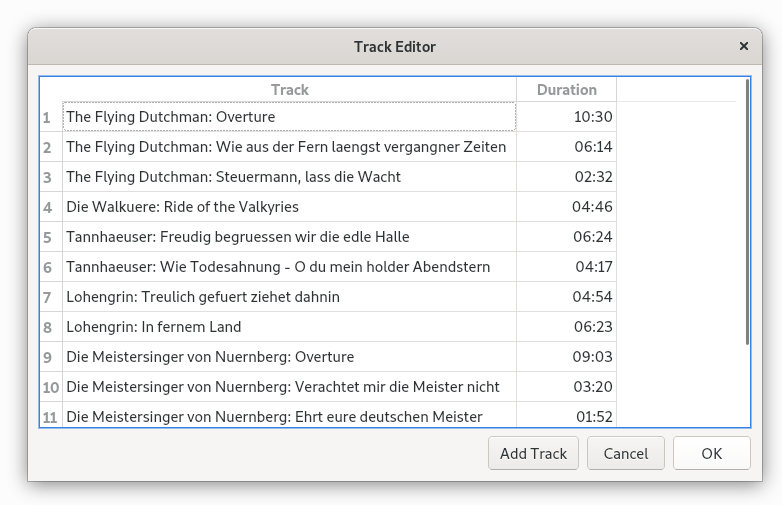

TrackEditor.h:
```c++
#ifndef TRACKEDITOR_H
#define TRACKEDITOR_H

#include <QDialog>
#include <QList>

QT_BEGIN_NAMESPACE
class QDialogButtonBox;
class QTableWidget;
QT_END_NAMESPACE

class Track
{
public:
    Track(const QString &title = "", int duration = 0);

    QString title;
    int duration;
};

class TrackEditor : public QDialog
{
    Q_OBJECT

public:
    TrackEditor(QList<Track> * tracks, QWidget * parent = 0);

    void done(int result) override;

private slots:
    void addTrack();

private:
    QTableWidget * tableWidget;
    QDialogButtonBox * buttonBox;
    QList<Track> * tracks;
};

#endif
```

TrackEditor.cpp:
```c++
#include <QtWidgets>

#include "TrackDelegate.h"
#include "TrackEditor.h"

Track::Track(const QString &title, int duration)
{
    this->title = title;
    this->duration = duration;
}

TrackEditor::TrackEditor(QList<Track> *tracks, QWidget *parent)
    : QDialog(parent)
{
    this->tracks = tracks;

    tableWidget = new QTableWidget(tracks->count(), 2);

    // 使用自定义委托 TrackDelegate,传递保存时间数据的列作为参数。
    tableWidget->setItemDelegate(new TrackDelegate(1));
    tableWidget->setHorizontalHeaderLabels(
            QStringList() << tr("Track") << tr("Duration"));

    for (int row = 0; row < tracks->count(); ++row) {
        Track track = tracks->at(row);

        QTableWidgetItem * item0 = new QTableWidgetItem(track.title);
        tableWidget->setItem(row, 0, item0);

        QTableWidgetItem * item1
             = new QTableWidgetItem(QString::number(track.duration));
        item1->setTextAlignment(Qt::AlignRight);
        tableWidget->setItem(row, 1, item1);
    }

    tableWidget->resizeColumnToContents(0);

    buttonBox = new QDialogButtonBox(QDialogButtonBox::Ok
                                     | QDialogButtonBox::Cancel);
    QPushButton * addTrackButton = buttonBox->addButton(tr("&Add Track"),
            QDialogButtonBox::ActionRole);

    connect(addTrackButton, SIGNAL(clicked()), this, SLOT(addTrack()));
    connect(buttonBox, SIGNAL(accepted()), this, SLOT(accept()));
    connect(buttonBox, SIGNAL(rejected()), this, SLOT(reject()));

    QVBoxLayout * mainLayout = new QVBoxLayout;
    mainLayout->addWidget(tableWidget);
    mainLayout->addWidget(buttonBox);
    setLayout(mainLayout);

    setWindowTitle(tr("Track Editor"));
}

void TrackEditor::done(int result)
{
    if (result == QDialog::Accepted) {
        tracks->clear();
        for (int row = 0; row < tableWidget->rowCount(); ++row) {
            QString title = tableWidget->item(row, 0)->text();
            QTableWidgetItem * item = tableWidget->item(row, 1);
            int duration = item ? item->text().toInt() : 0;
            tracks->append(Track(title, duration));
        }
    }
    QDialog::done(result);
}

void TrackEditor::addTrack()
{
    tableWidget->insertRow(tableWidget->rowCount());
}
```

TrackDelegate.h:
```c++
#ifndef TRACKDELEGATE_H
#define TRACKDELEGATE_H

#include <QItemDelegate>

class TrackDelegate : public QItemDelegate
{
    Q_OBJECT

public:
    TrackDelegate(int durationColumn, QObject * parent = 0);

    void paint(QPainter * painter, const QStyleOptionViewItem &option,
               const QModelIndex &index) const override;
    QWidget * createEditor(QWidget * parent,
                          const QStyleOptionViewItem &option,
                          const QModelIndex &index) const override;
    void setEditorData(QWidget * editor, const QModelIndex &index) const override;
    void setModelData(QWidget * editor, QAbstractItemModel * model,
                      const QModelIndex &index) const override;

private slots:
    void commitAndCloseEditor();

private:
    int durationColumn;
};

#endif
```

我们使用 [QItemDelegate](https://doc.qt.io/qt-5/qitemdelegate.html) 作为基类，所以可以从默认的委托实现中获益。如果想从头开始做，则可以使用 [QAbstractItemDelegate](https://doc.qt.io/qt-5/qabstractitemdelegate.html) 作为基类。为了提供一个可以编辑数据的委托，必须实现 createEditor() setEditorData() 和 setModelData() 。还要实现 paint() ，它用于改变持续时间这一列的显示。

TrackDelegate.cpp:
```c++
#include <QtWidgets>

#include "TrackDelegate.h"

// durationColumn 这个参数告诉这个委托，哪一列保存的是音轨的持续时间。
TrackDelegate::TrackDelegate(int durationColumn, QObject *parent)
    : QItemDelegate(parent)
{
    this->durationColumn = durationColumn;
}

// 因为我们想使用 "分钟：秒"的格式显示持续时间，所以需要重新实现这个 paint() 函数。
void TrackDelegate::paint(QPainter *painter,
                          const QStyleOptionViewItem &option,
                          const QModelIndex &index) const
{
    if (index.column() == durationColumn) {
        int secs = index.model()->data(index, Qt::DisplayRole).toInt();
        QString text = QString("%1:%2")
                       .arg(secs / 60, 2, 10, QChar('0'))
                       .arg(secs % 60, 2, 10, QChar('0'));

        //为了右对齐文本，我们复制了当前的风格选项并且覆盖默认的对齐方式。
        QStyleOptionViewItem myOption = option;
        myOption.displayAlignment = Qt::AlignRight | Qt::AlignVCenter;

        // 绘制这个文本，使用这个非常方便，特别是当使用了自定义的风格选项的时候。
        // 还可以使用绘图器直接绘制
        drawDisplay(painter, myOption, myOption.rect, text);
        // 如果当前项具有焦点，它就绘制一个焦点矩形，否则什么也不做
        drawFocus(painter, myOption, myOption.rect);
    } else{
        QItemDelegate::paint(painter, option, index);
    }
}

QWidget *TrackDelegate::createEditor(QWidget *parent,
        const QStyleOptionViewItem &option,
        const QModelIndex &index) const
{
    if (index.column() == durationColumn) {
        QTimeEdit * timeEdit = new QTimeEdit(parent);
        // 设置正确的显示格式
        timeEdit->setDisplayFormat("mm:ss");
        connect(timeEdit, SIGNAL(editingFinished()),
                this, SLOT(commitAndCloseEditor()));
        return timeEdit;
    } else {
      // 把有关编辑的处理传递给默认的委托
        return QItemDelegate::createEditor(parent, option, index);
    }
}

// 当用户初始化编辑的时候，视图会调用 createEditor() 创建一个编辑器
// ，然后利用这个项的当前数据调用 setEditorData() 来初始化编辑器。
void TrackDelegate::setEditorData(QWidget *editor,
                                  const QModelIndex &index) const
{
    if (index.column() == durationColumn) {
        // 按秒提取这个音轨的持续时间
        int secs = index.model()->data(index, Qt::DisplayRole).toInt();
        QTimeEdit * timeEdit = qobject_cast<QTimeEdit * >(editor);
        // 设置 QTimeEdit 的时间为相应的分钟数和秒数
        timeEdit->setTime(QTime(0, secs / 60, secs % 60));
    } else {
        // 使用默认委托处理这个初始化
        QItemDelegate::setEditorData(editor, index);
    }
}

// 如果用户完成了编辑（例如，在这个窗口部件的外部按下了鼠标左键,或者按下了 Enter or Esc），而不是取消编辑，模型就必须使用编辑器的数据进行更新。
void TrackDelegate::setModelData(QWidget *editor,
                                 QAbstractItemModel *model,
                                 const QModelIndex &index) const
{
    if (index.column() == durationColumn) {
        QTimeEdit * timeEdit = qobject_cast<QTimeEdit * >(editor);

        // 提取出分钟和秒数，并且设置数据为相应的秒数
        QTime time = timeEdit->time();
        int secs = (time.minute() * 60) + time.second();
        model->setData(index, secs);
    } else {
        QItemDelegate::setModelData(editor, model, index);
    }
}

// 如果用户按下 Enter 键或者把焦点移动到这个 QTimeEdit 之外（但不是按下 Esc键）
// ，editingFinished() 信号就会被发射并且会调用 commitAndCloseEditor() 槽。
void TrackDelegate::commitAndCloseEditor()
{
    // 编辑器可以使用 QObject::sender() 获得
    //，这个函数返回发射了触发这个槽的对象的信号的对象。
    QTimeEdit * editor = qobject_cast<QTimeEdit * >(sender());
    //通知视图用被编辑的数据替换已经存在的数据
    emit commitData(editor);
    //通知视图已经不再需要这个编辑器了，这时模型将会把它删除
    emit closeEditor(editor);
}
```

我们完全有可能创建一个可以很好地控制模型中任何一个项的编辑和显示的自定义委托，尽管在这种情况下不是必需的。我们已经选择控制特定的列，但是因为 QModelIndex 会被传递给重新实现的所有 QItemDelegate 的函数，所以可以按照行、列、矩形区域、父对象或者它们中的任意组合进行控制，如果需要还可以控制每一个单独的项。

在这一章中，我们已经为 Qt的模型/视图 搭建了一个总体的框架，演示了如何使用视图方便的子类、如何使用 Qt 预定义的模型和如何创建自定义模型和自定义委托。但是模型/视图架构是如此的丰富，以至于没有足够的空间讲解它所能做到的一切。例如，可以创建一个自定义视图，并把它的项呈现为列表、表和树以外的形式。 eg: [Chart Example](https://doc.qt.io/qt-5/qtwidgets-itemviews-chart-example.html),它显示了如何自定义一个把模型数据显示为饼状图形式的视图。

另外，也可以使用多个视图查看同一个模型，而不需要繁琐的工作。通过其中一个视图的任何编辑操作都会自动并且立即影响其他视图。在查看大型数据，当用户希望能够同时查看逻辑上截然不同的几个部分的数据时，这种功能非常有用。这种架构也支持选择：当两个或者多个视图正在使用同一个模型时，每一个视图都可以被设置为拥有自己独立的选择，或者可以在不同的视图中共享选择。


## Link
* [qt5-book-code/chap10/](https://github.com/mutse/qt5-book-code/tree/master/chap10)

[上一级](README.md)
[上一篇 -> 9. 拖放](9_drag.md)
[下一篇 -> 11. 容器类](11_container.md)
