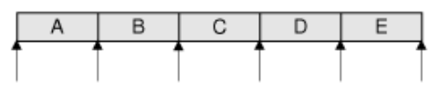
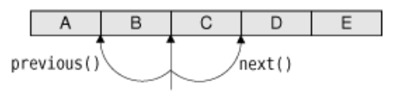
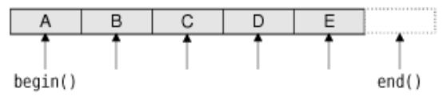
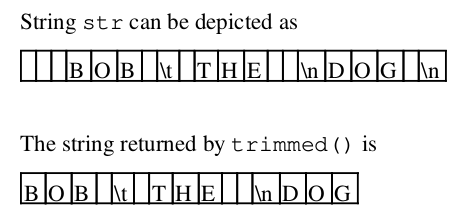
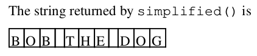

# 11. 容器类


<!-- @import "[TOC]" {cmd="toc" depthFrom=1 depthTo=6 orderedList=false} -->
<!-- code_chunk_output -->

- [11. 容器类](#11-容器类)
  - [连续容器](#连续容器)
    - [隐含共享是如何工作的](#隐含共享是如何工作的)
  - [关联容器](#关联容器)
  - [通用算法](#通用算法)
  - [字符串、字节数和 QVariant](#字符串-字节数和-qvariant)
    - [QString](#qstring)
    - [QByteArray](#qbytearray)
    - [QVariant](#qvariant)

<!-- /code_chunk_output -->


容器通常是用于在内存中存储给定类型的许多项的模板类。STL 中已经提供了很多容器。

Qt 提供了属于自己的容器类，所以在编写 Qt 时，即可以使用 Qt 容器也可以使用 STL 容器。Qt 容器的主要优点是它们在所有的平台上运行时都表现一致，并且它们都是隐含共享的。隐含共享（implicit sharing），或者称为“写时复制”，是一个能够把整个容器作为不需要太多运行成本的值来传递的最优化过程。Qt 容器的另一个主要特征就是易于使用的迭代器类，这是从 Java 中得到的灵感，它们可以利用 QDataStream 变成数据流，而且它们通常可以使可执行文件中的代码量比相应的 STL 类中的要少。最后，在 Qt/Embedded Linux 支持的一些硬件平台上，通常只能使用 Qt 容器。

Qt 既提供了诸如 [QVector<T>](https://doc.qt.io/qt-5/qvector.html)、 [QLinkedList<T>](https://doc.qt.io/qt-5/qlinkedlist.html) 、 [QList<T>](https://doc.qt.io/qt-5/qlist.html) 等的连续容器，也提供了诸如 [QMap<K,T>](https://doc.qt.io/qt-5/qmap.html) 、 [QHash<K,T>](https://doc.qt.io/qt-5/qhash.html) 等的关联容器。

Qt 还提供了在任意容器上执行相关操作的通用算法。

在这一章中，我们还将关注 [QString](https://doc.qt.io/qt-5/qstring.html) 、 [QByteArray](https://doc.qt.io/qt-5/qbytearray.html) 和 [QVariant](https://doc.qt.io/qt-5/qvariant.html) ,因为它们与容器有很多相似之处。QString 是贯穿 Qt 应用编程接口的一个 16 位 Unicode 字符串， QByteArray 是一个用来存储原始二进制数据的 8 位字符数组，QVariant 类则可以存储绝大多数 c++ 和 Qt 值类型。

## 连续容器

QVector<T>:
```c++
QVector<double> vect(3);
vect[0] = 1.0;
vect[1] = 0.540302;
vect[2] = -0.416147;

QVector<double> vect;
vect.append(1.0);
vect.append(0.540302);
vect.append(-0.416147);

//We can also use the << operator instead of append():
vect << 1.0 << 0.540302 << -0.416147;

double sum = 0.0;
for (int i = 0; i < vect.count(); ++i)
sum += vect[i];
```

Qt 还提供了 QLinkedList<T>,这是一种把项存储到内存中不相邻位置的数据结构。与常量不同，链表不支持快速随机访问，但它提供了“常量时间”的插入和删除。

链表并未提供 [] 操作符，所以必须使用迭代器来遍历项。

```c++
QLinkedList<QString> list;
list.append("Clash");
list.append("Ramones");
QLinkedList<QString>::iterator i = list.find("Ramones");
list.insert(i, "Tote Hosen");
```

QList<T> 连续容器是一个“数组列表”，结合了单一类 QVector 和 QLinkedList 的最重要的优点。它支持随机访问，而且它的接口与 QVector 的一样是基于索引的。在 QList 的任意一端插入或者移除项都是非常快速的，并且对含 1000 项以上的列表来说，在中间插入项也是很快的。除非我们想在一个极大的列表中执行插入或者要求列表中的元素都必须占据连续的内存地址，否则 QList 通常是最适合采用的多用途容器类。

[QStringList](https://doc.qt.io/qt-5/qstringlist.html) 类是被广泛用于 Qt 应用编程接口的 QList<QString> 的子类，且提供了一些特别的函数，以使得这种类对于字符串的处理方式更通用。

[QStack<T>](https://doc.qt.io/qt-5/qstack.html) 和 [QQueue<T>](https://doc.qt.io/qt-5/qqueue.html) 是这些方便的子类中的另外两个例子。

Qt 提供的两类迭代器用于遍历存储在容器中的项：
* Jave 风格的迭代器 - 易于使用
* STL 风格的迭代器 - 可以结合 Qt 和 STL 的一般算法而具有更加强大的功能。

对于每个容器类，都有两种 Java 风格的迭代器类型：
* 只读迭代器 - eg :[QVectorIterator<T>](https://doc.qt.io/qt-5/qvectoriterator.html) QLinkedListIterator<T> 和 QListIterator<T>
* 读-写迭代器（在其名字中都含有 “Mutable”字样），eg : [QMutableVectorIterator<T>](https://doc.qt.io/qt-5/qmutablevectoriterator.html)

Java 风格迭代器的有效位置



当使用 Java 风格的迭代器时，必须首先牢记的是：它们本身并不是直接指向项的，而是能够定位在第一项之前、最后一项之后或者是两项之间。eg：
```c++
QList<double> list;
...
QListIterator<double> i(list);
while (i.hasNext()) {
do_something(i.next());
}
```

向后迭代与此类似，但必须首先调用 toBack():
```c++
QListIterator<double> i(list);
i.toBack();
while (i.hasPrevious()) {
  do_something(i.previous());
}
```

previous() 和 next() 对 Java 风格迭代器的影响：



Mutable 迭代器（即 java 风格的读写迭代器）在遍历时提供了插入、修改以及删除项的函数。

```c++

// 删除
QMutableListIterator<double> i(list);
while (i.hasNext()) {
  if (i.next() < 0.0)
  i.remove();
}

QMutableListIterator<double> i(list);
i.toBack();
while (i.hasPrevious()) {
  if (i.previous() < 0.0)
  i.remove();
}

// 修改

QMutableListIterator<double> i(list);
while (i.hasNext()) {
  int val = i.next();
  if (val < 0.0)
  i.setValue(-val);
}
```

通过调用 insert() ，可以在当前迭代器位置插入一项。然后，迭代器就被提升到新的项和随后的项之间的位置。

除了 Java 风格的迭代器，每一个连续容器类 C<T> 都有两个 STL 风格的迭代器：
* C<T>::iterator
* C<T>::const_iterator

STL 风格迭代器的有效位置：



```c++
QList<double>::iterator i = list.begin();
while (i != list.end()) {
  * i = qAbs(*i);
  ++i;
}
```

一些函数放回一个容器。如果想使用 STL 风格的迭代器遍历某个函数的返回值，则必须复制此容器并且遍历这个副本。eg：
```c++
// 正确的方式
QList<int> list = splitter->sizes();
QList<int>::const_iterator i = list.begin();
while (i != list.end()) {
  do_something(*i);
  ++i;
}

// 错误的方式
QList<int>::const_iterator i = splitter->sizes().begin();
while (i != splitter->sizes().end()) {
  do_something(*i);
  ++i;
}

```

这是因为每次调用 splitter->sizes() 都返回一个新的 QList<int> 值。如果不存储这个返回值，则 C++ 在开始迭代之前就自动将其销毁，而只留下一个浮动迭代器。更糟糕的是，每次循环运行的时候，由于调用了 splitter->sizes().end(),splitter->sizes() 都必须生成一个新的列表的副本。总之，当使用 STL 风格的迭代器时，总是在返回的容器副本上进行遍历。

利用只读 Java 风格的迭代器，不必复制容器。这个迭代器在后台自动生成一个副本，以确保总是遍历首先返回的函数的数据。eg：
```c++
QListIterator<int> i(splitter->sizes());
while (i.hasNext()) {
  do_something(i.next());
}
```

像这样复制一个容器看起来似乎耗费比较大，实际上不然，这是由于采用了名为隐含共享的最优化过程。这意味着复制一个 Qt 容器的速度大致就像复制一个简单指针一样快。只有在复制项之一发生改变时，数据才会实际被复制，而且这一操作都可以在后台自动处理。由于这个原因，隐含共享（implicit sharing） 有时候也被称为“写时复制”。

隐含共享的优点在于它是一个我们不必考虑的最优化过程。它工作简单，不需要程序员的任何干预。同时，隐含共享提倡由值返回的对象的整洁的编程风格。eg：

```c++
QVector<double> sineTable()
{
  QVector<double> vect(360);
  for (int i = 0; i < 360; ++i)
  vect[i] = std::sin(i / (2 * M_PI));
  return vect;
}

QVector<double> table = sineTable();
```

比较起来，STL 鼓励我们将 vector 作为一个非常量参数来传递，以避免当函数返回值被存储于变量中时发生复制：
```c++
void sineTable(std::vector<double> &vect)
{
  vect.resize(360);
  for (int i = 0; i < 360; ++i)
  vect[i] = std::sin(i / (2 * M_PI));
}

// 调用就像这样
std::vector<double> table;
sineTable(table);
```

Qt 对所有的容器和许多其他类都使用隐含共享，包括 QByteArray QBrush QFont QImage QPixmap 和 QString。这使得这些类不论是作为函数参数还是函数返回值，都可以非常有效地传递。

隐含共享是 Qt 对不希望修改的数据绝不进行复制的保证。为了使隐含共享的作用发挥得最好，可以采用两个新的编程习惯。
1. 对于一个非常量 vector 或者 list 进行只读存取时，使用 at() 函数而不用 [] 操作符。因为 Qt 的容器类不能辨别 [] 操作符是否将出现在一个赋值的左边还是右边。，它假设最坏的情况出现并且强制执行深层复制，而 at() 函数则不被允许出现在一个赋值的左边。
2. 当使用 STL 风格迭代器遍历容器类的时候，类似的问题也将出现。只要在非常量的容器类上调用 begin() 或 end() 函数，并且如果数据是共享的，Qt 就会强制执行深层赋值。为了防止这种底效操作的发生，一种解决方法就是无论何时都尽可能地使用 const_iterator、 constBegin() 和 constEnd()。

Qt 还提供了最后一种在连续容器中遍历项的方式 - foreach 循环，eg：
```c++
QLinkedList<Movie> list;
...
foreach (Movie movie, list) {
  if (movie.title() == "Citizen Kane") {
    std::cout << "Found Citizen Kane" << std::endl;
    break;
  }
}
```

foreach 循环会在进入循环时自动复制一个容器，因此即使在迭代过程中修改了容器类，也不会影响到循环。break 和 continue 循环声明也是支持的。就如同 for 循环的声明语句一样，可以在循环体外定义迭代变量，eg：
```c++
QLinkedList<Movie> list;
Movie movie;
...
foreach (movie, list) {
  if (movie.title() == "Citizen Kane") {
    std::cout << "Found Citizen Kane" << std::endl;
    break;
  }
}
```

在循环体外定义迭代变量只对那些支持含有一个逗号的数据类型的容器类才适用（eg, QPair<QString,int>）。

### 隐含共享是如何工作的

这里以 QString 为例说明隐含共享的工作原理。

```c++
QString str1 = "Humpty";
QString str2 = str1;
```
我们设置 str1 为 "Humpty"并令 str2 等于 str1。在这一点上，QString 的两个对象都指向内存中相同的内部数据结构。与字符数据一起，数据结构保存一个引用计数，以指出有多少 QString 指向相同的数据结构。因为 str1 和 str2 都指向相同的数据，所以引用计数的值为 2.

```c++
str2[0] = 'D';
```

当修改 str2 时，它首先对数据进行深层复制，以确保 str1 和 st2 指向不同的数据结构，然后才将新数值应用于它所复制的数据。str1 的数据的引用计数变为 1,且把 str2 的数据的引用计数也设为 1.引用计数为 1 表示数据未被共享。

```c++
str2.truncate(4); // str2 = "Dump"
```
如果再次修改 str2 ，则由于 str2 数据的引用计数为 1,将不会发生数据复制。
```c++
str1 = str2;
```
当将 str2 赋给 str1 时， str1 的数据的引用计数将为 0 ，这意味着没有一个 QString 仍在使用 "Humpty" 数据。这样，这些数据就从内存中释放。两个 QString 都指向 "Dump" ,现在它的引用计数就是 2 了。

由于引用计数中的竞争情况，数据共享在多线程程序中通常只是作为一个选项而没有给与关注。使用 Qt，这并不是一个问题。在内部，容器类使用汇编语言指令执行基本的引用计数。通过 [QSharedData](https://doc.qt.io/qt-5/qshareddata.html) 和 [QSharedDataPointer](https://doc.qt.io/qt-5/qshareddatapointer.html) 类，Qt 的用户也可以使用这项技术。

## 关联容器

Qt 提供了两个主要的关联容器类： [QMap<K,T>](https://doc.qt.io/qt-5/qmap.html) 和 QHash<K,T>。

QMap<K,T> 是一个以升序键顺序存储键值对的数据结构。这种排列使它可以提供良好的查找和插入性能以及键序的迭代。

```c++
// 插入项
QMap<QString, int> map;
map.insert("eins", 1);
map.insert("sieben", 7);
map.insert("dreiundzwanzig", 23);

// or
map["eins"] = 1;
map["sieben"] = 7;
map["dreiundzwanzig"] = 23;
```
[] 操作符可以用于插入也可以用于检索。如果在非常量映射中使用 [] 为一个不存在的键检索值，则会用给定的键和空值创建一个新的项。为了避免意外地创建空值，可以使用 value() 函数替代 [] 操作符来获得项。

```c++
int val = map.value("dreiundzwanzig");
```

如果键不存在，则利用值类型的默认构造函数，将返回一个默认值，同时不会创建新的项。对于基本类型和指针类型，将返回 0 值。我们可以指定令一个默认值作为 value() 的第二个参数，eg：
```c++
int seconds = map.value("delay", 30);

// 等价于
int seconds = 30;
if (map.contains("delay"))
seconds = map.value("delay");
```

QMap<K,T> 有一对方便的函数 keys() 和 values() ，它们在处理小数据集时显得特别有用。它们分别返回映射键的 QList 和 映射值 QList。

通过使用 insertMulti() 函数或者 [QMultiMap](https://doc.qt.io/qt-5/qmultimap.html) 方便的子类，可以让多个键值对有相同的键。

```c++
QMultiMap<int, QString> multiMap;
multiMap.insert(1, "one");
multiMap.insert(1, "eins");
multiMap.insert(1, "uno");
QList<QString> vals = multiMap.values(1);
```

[QHash<K,T>](https://doc.qt.io/qt-5/qhash.html) 是一个在哈希表中存储键值对的数据结构。它的接口几乎与 QMap<K,T> 相同，但是与 QMap 相比，他对 K 的模板类型有不同的要求，而且它提供了比 QMap 更快的查找功能。

除了对存储在容器类的的所有值类型的一般要求，QHash<K,T> 中的 K 值类型还需要提供一个 operator== () ,并需要一个能够为键返回哈希值的 全局 qHash() 函数的支持。Qt 已经为 qHash() 函数提供了整形、指针型、QChar、QString以及 QByteArray。

可以通过调用 reserve() 或者 squeeze() 来指定或者压缩希望存储到哈希表中的项的数目，以进行性能调整。通常的做法时利用我们预期的最大的项的数目来调用 reserve() ，然后插入数据，最后如果有多多出的项，则调用 squeeze() 以使内存的使用减到最小。

同样可以使用 insertMulti() 或者 [QMultiHash](https://doc.qt.io/qt-5/qmultihash.html) ,也可以将多个值赋给同一个键。

除了 QHash 之外，Qt 还提供了一个用来高速缓存与键相关联的对象的 [QCache<K,T>](https://doc.qt.io/qt-5/qcache.html) 类以及 [QSet<K>](https://doc.qt.io/qt-5/qset.html) 。 在内部，它们都依赖于 QHash。

关联容器的 Java 风格的迭代器与连续容器在运作上有些差异。

```c++
QMap<QString, int> map;
...
int sum = 0;
QMapIterator<QString, int> i(map);
while (i.hasNext())
  sum += i.next().value();

QMapIterator<QString, int> i(map);
while (i.hasNext()) {
  i.next();
  if (i.value() > largestValue) {
    largestKey = i.key();
    largestValue = i.value();
  }
}

// Mutable 迭代器

QMutableMapIterator<QString, int> i(map);
while (i.hasNext()) {
  i.next();
  if (i.value() < 0.0)
  i.setValue(-i.value());
}
```

STL 风格的迭代器也提供了 key() 和 value() 函数。对于非常量迭代器类型，value() 返回一个允许在迭代时改动其数值的非常量参数。需要注意的是：尽管这些迭代器被称为 STL 风格，它们却与即于 std::pair<K,T> 的 std::map<K,T> 迭代器有很大差别。

foreach 循环也可以用在关联容器中，但是它仅对键值对上的值分量有效。如果同时需要项中的键和值，可以这样：
```c++
QMultiMap<QString, int> map;
...
foreach (QString key, map.keys()) {
  foreach (int value, map.values(key)) {
    do_something(key, value);
  }
}
```


## 通用算法

[\<QtAlgorithm\>](https://doc.qt.io/qt-5/qtalgorithms.html) 的头文件声明了在容器类上实现基本的一套全局模板函数。这些函数中的大部分都是在 STL 风格上的迭代器上工作的。

STL 的 <algorithm> 提供了一套更为完整的通用算法。如果 STL 的实现代码在所有平台上都可以得到，那么在没有对应的 Qt 算法时，就没有理由不使用 STL 算法。

这里不做过多的描述，详情请参考官方文档。

最后，被所有其他的 Qt 首部所包括的 <QtGlobal> 的头文件，为我们提供了一些有用的定义，其中包括返回参数绝对值的 aAbs() 函数，以及 qMain() , qMax() 函数。

## 字符串、字节数和 QVariant

### QString
c++ 本身提供了两种字符串：传统的 c 语言型的以 '\0' 结尾的字符数组和 std::string 类。与这两种字符串不同，[QString](https://doc.qt.io/qt-5/qstring.html) 支持 16 位 Unicode 值。Unicode 码以 ASCII 码和 Latin-1 码为子集，具有它们常用的数字值。但由于 QString 是 16 位的，它可以表示数千种其他字符以表达世界上绝大多数的语言。关于 Unicode 的更多细节，可以参考第 18 章。

从概念上来说，可以将 QString 看成 [QChar](https://doc.qt.io/qt-5/qchar.html) .QString 可以嵌入 ‘\0’字符。length() 函数会返回包括被嵌入的 '\0' 字符的整个字符串的大小。

```c++
QString str = "User: ";
str += userName + "\n";

str = "User: ";
str.append(userName);
str.append("\n");

// 这个函数支持与 c++ 库 sprintf() 函数相同的格式说明符
str.sprintf("%s %.1f%%", "perfect competition", 100.0);
```

从其他字符串或者数组来建立一个字符串的另一种方法是使用 arg():
```c++
str = QString("%1 %2 (%3s-%4s)")
.arg("permissive").arg("society").arg(1950).arg(1970);
```
arg() 的重载可以处理各种数据类型。对于控制字段长度、数值基数或者浮点精度等，一些重载有额外的参数。相较与 sprintf() 而言，arg() 通常是一个更好的解决方案，因为它是类型安全的，完全支持 Unicode 编码，并且允许译码器对 "%n"参数进行重新排序。

通过使用 QString::number() 静态函数，可以将数字转换为字符串：
```c++
str = QString::number(59.6);

//Or
str.setNum(59.6);
```

还可以使用 toInt() toLongLong() toDouble() ，从字符串转换为数字。
```c++
bool ok;
double d = str.toDouble(&ok);
```

这些函数接受一个任选的指向 bool 变量的指针，表示转换成功与否。如果转换没有完成，这些函数将返回 0。

mid() 函数返回在给定位置开始且达到给定长度的子串。

```c++
QString str = "polluter pays principle";
qDebug() << str.mid(9, 4); // "pay"
```
如果省略第二个参数，mid() 函数返回在给定位置开始到字符串末端结束的子串。

[left(int n)](https://doc.qt.io/qt-5/qstring.html#left)

[right(int n)](https://doc.qt.io/qt-5/qstring.html#right)

如果想查明一个字符串是否包含一个特定的字符、子串或者正则表达式，可以使用 indexOf(),eg:
```c++
QString str = "the middle bit";
int i = str.indexOf("middle");
```
这会将 i 设置为 4。在失败时，indexOf() 函数返回 -1，并且接收一个可以的开始位置和区分大小写的标记。

如果仅仅想要检查字符串是否以某个字符串开始或者结束，则可以使用 startsWith() 和 endsWith() 函数。

```c++
if (url.startsWith("http:") && url.endsWith(".png"))
...

// 这个代码，a...
if (url.left(5) == "http:" && url.right(4) == ".png")
...
```

== 操作符比较是区分大小写的。如果想比较哪种用户可见的字符串， [localeAwareCompare()](https://doc.qt.io/qt-5/qstring.html#localeAwareCompare-1);如果并不区分大小写，则可以使用 toUpper() 或者 toLower() 函数。

```c++
if (fileName.toLower() == "readme.txt")
...
```

如果想使用一个字符串代替另一个字符串中的一部分，可以使用 replace()
```c++
QString str = "a cloudy day";
str.replace(2, 6, "sunny"); // "a sunny day"

// 也可这样实现
str.remove(2, 6);
str.insert(2, "sunny");

// 另一个重载版本
str.replace("&", "&amp;");
```

我们经常需要删除一个字符串中空白处的空格（比如空格符、制表符、换行符等）。QString 有一个可以从字符串的两端删除空白处的空格的函数：
```c++
QString str = "   BOB \t THE \nDOG \n";
qDebug() << str.trimmed();
```



用简单的空格符代替字符串内部每一连续空白处的空格：
```c++
QString str = "BOB \t THE \nDOG \n";
qDebug() << str.simplified();
```



使用 [QString::split()](https://doc.qt.io/qt-5/qstring.html#split) 可以把一个字符串分成一些 QStringList 子串：
```c++
QString str = "polluter pays principle";
QStringList words = str.split(" ");
```
split() 函数有一个可选的第二个参数，用来指定是否空的子串应该被保留（默认为保留）还是被删除。
```c++
QString str = "a,,b,c";

QStringList list1 = str.split(',');
// list1: [ "a", "", "b", "c" ]

QStringList list2 = str.split(',', QString::SkipEmptyParts);
// list2: [ "a", "b", "c" ]
```

使用 [join()](https://doc.qt.io/qt-5/qstringlist.html#join) ,QStringList 中的项可以连接起来形成一个单一的字符串。在每一对被连接的字符串之间都要插入 join() 参数。

```c++
words.sort();
str = words.join("\n");
```

### QByteArray

为了明确将 const char * 转换为 QString ，可以只使用 QString 强制转换，或者调用 fromAscii() 或 fromLatin1()。

要将 QString 转换为 const char* ,可以使用 toAscii() or toLatin1() 函数，它们返回 QByteArray,而且利用 QByteArray::data() or QByteArray::constData() ，可以将 QByteArray 转换为 const char * .eg:
```c++
printf("User: %s\n", str.toAscii().data());

// Qt provides the qPrintable() macro that performs the same as the sequencetoAscii().constData():

printf("User: %s\n", qPrintable(str));
```

QByteArray 类有一个与 QString 很相似的应用程序编程接口。诸如 left() right() mid() toLower() toUpper() trimmed() simplified() 等函数，在 QByteArray 中的语义形式与在 QString 中的相同。QByteArray 对于存储原始的二进制数据即以 8 位编码的文本字符串非常有用。一般来说，我们推荐使用 QString 而不是 QByteArray 来存储文本，因为 QString 支持 Unicode 编码。

为方便起见，QByteArray 自动保证 "最后一个项之后的项”总是'\0'，这使得利用 const char* 可以很容易地将 QByteArray 传递给一个函数。QByteArray 还支持嵌入的 '\0' 字符，已允许我们存储任意的二进制数据。

### QVariant

在某些情况下，我们需要在同一个变量中存储不同类型的数据。一种方法是像 QByteArray 或 QString 一样，对数据进行编码。这些方法很灵活，但是它抛弃了 c++ 的一些优点，尤其是类型的安全性和效率。 Qt 提供了一个更加灵巧的方法，也就是 [QVariant](https://doc.qt.io/qt-5/qvariant.html),来处理那些能够支持不同数据类型的变量。

QVariant 类可以支持多种 Qt 类型的值，基本的 c++ 数字类型，qt 容器类。

通过容器类的嵌套值，可以利用 QVariant 创建任意复杂的数据结构：
```c++
QMap<QString, QVariant> pearMap;
pearMap["Standard"] = 1.95;
pearMap["Organic"] = 2.25;
QMap<QString, QVariant> fruitMap;
fruitMap["Orange"] = 2.10;
fruitMap["Pineapple"] = 3.85;
fruitMap["Pear"] = pearMap;
```

当遍历一个支持 QVariant 的映射时，需要使用 [type()](https://doc.qt.io/qt-5/qvariant.html#type) 来检查变量保存所支持的类型，以便做出适当的反应。

创建这样的数据结构是非常吸引人的，因为能够以任意方式组织数据。但是 QVariant 的便利性是以降低效率及可读性为代价的。通常，定义一个适当的 c++ 类来存储随时可能的数据，是值得的。

Qt 的元对象系统使用 QVariant ,因此它也是 QtCore 模块的一部分。

```c++
QIcon icon("open.png");
QVariant variant = icon;

QIcon icon = variant.value<QIcon>();
```
value<T>（）函数也可以用在非图形用户界面数据类型和 QVariant 之间进行转换，但实际上对于非图形用户界面类型，通常使用 to...() 作为非图形用户界面数据类型的转换（eg:toString()）.

如果自定义数据类型提供了默认的构造函数和拷贝构造函数的话，QVariant 也可以用来存储它们。为此，必须首先使用 [Q_DECLARE_METATYPE()](https://doc.qt.io/qt-5/qmetatype.html#Q_DECLARE_METATYPE) 宏注册数据类型，尤其是在类定义下的头文件中：
```c++
Q_DECLARE_METATYPE(BusinessCard)

BusinessCard businessCard;
QVariant variant = QVariant::fromValue(businessCard);
...
if (variant.canConvert<BusinessCard>()) {
BusinessCard card = variant.value<BusinessCard>();
...
}
```

由于编译器的局限性，在 MSVC 6 中，这些模板成员函数并不可用。如果需要用到这个编译器，可以用 qVariantFromValue()  qVariantValue<T>() 和 qVariantCanConvert<T>() 全局函数代替。


如果自定义数据类型采用 << 和 >> 操作符来完成从 QDataStream 的读写，就可以使用 [qRegisterMetaTypeStreamOperators<T>()](https://doc.qt.io/qt-5/qmetatype.html#qRegisterMetaTypeStreamOperators) 来注册这些自定义数据类型。这就可以利用 QSettings 在其他类型之中存储自定义数据类型的首选参数。

```c++
qRegisterMetaTypeStreamOperators<MyClass>("MyClass");

// The stream operators should have the following signatures:
QDataStream &operator<<(QDataStream &out, const MyClass &myObj);
QDataStream &operator>>(QDataStream &in, MyClass &myObj);
```

Qt 还提供了  
* [QPair<T1,T2>](https://doc.qt.io/qt-5/qpair.html) - 类似 std::pair<T1,T2>
* [QBitArray](https://doc.qt.io/qt-5/qbitarray.html) - The QBitArray class provides an array of bits
* [QVarLengthArray<T,Prealloc>](https://doc.qt.io/qt-5/qvarlengtharray.html) - 是 QVector<T> 的另一低级候选方案。因为其在堆栈中预分配内存空间且它不是隐含共享的，所以它的系统开销比 QVector<T> 更少，这使它更适合于紧凑的小循环。

[更多关于 Qt 容器类的信息](https://doc.qt.io/qt-5/containers.html)


[上一级](README.md)
[上一篇](10_itemViewClass.md)
[下一篇](12_inOut.md)
