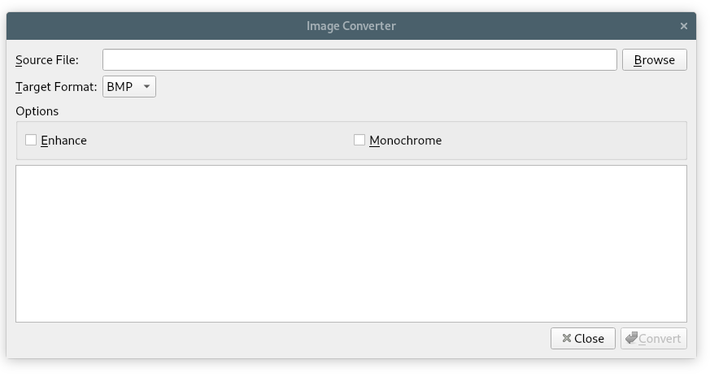

# 12. 输入与输出


<!-- @import "[TOC]" {cmd="toc" depthFrom=1 depthTo=6 orderedList=false} -->
<!-- code_chunk_output -->

- [12. 输入与输出](#12-输入与输出)
  - [读取和写入二进制数据](#读取和写入二进制数据)
  - [读取和写入文本](#读取和写入文本)
  - [遍历目录](#遍历目录)
  - [嵌入资源](#嵌入资源)
  - [进程间通信](#进程间通信)
  - [Link](#link)

<!-- /code_chunk_output -->


从文件或者其它设备读取或者写入数据几乎是每个应用程序共有的特点。Qt 通过 [QIODevice](https://doc.qt.io/qt-5/qiodevice.html) 为输入输出提供了极佳的支持。QIODevice 是一个封装能够读写字节块“设备”的强有力的提取器，其包括如下子类：


[QProcess](https://doc.qt.io/qt-5/qprocess.html)  [QTcpSocket](https://doc.qt.io/qt-5/qtcpsocket.html) [QUdpSocket](https://doc.qt.io/qt-5/qudpsocket.html) 和 [QSslSocket](https://doc.qt.io/qt-5/qsslsocket.html) 都是顺序存储设备，这意味着所存储的数据从第一个字节开始到最后一个字节为止只能被读取一次。 [QFile](https://doc.qt.io/qt-5/qfile.html) [QTemporaryFile](https://doc.qt.io/qt-5/qtemporaryfile.html) 和 [QBuffer](https://doc.qt.io/qt-5/qbuffer.html) 则随机存取设备，因此可以从任意位置多次读取字节位所存储的数据。这些随机存取设备还提供了 QIODevice::seek() 函数以重新配置文件指针。

除了设备类，Qt 还提供了两个更高级别的流类，使我们可以从任意的输入输出设备读取或写入数据： [QDataStream](https://doc.qt.io/qt-5/qdatastream.html) 用来读写二进制数据， [QTextStream](https://doc.qt.io/qt-5/qtextstream.html) 用来读写文本数据。这些类考虑了诸如字节顺序与文本编码等方面的问题，以保证运行在不同平台或者不同语言环境下的 Qt 应用程序可以相互读写文件。这就使得 Qt 的输入输出相较于对应的 STL 类来说，变得更加方便了，后者通常是将字节顺序与文本编码问题留给了程序员来处理的。

[QFile](https://doc.qt.io/qt-5/qfile.html)使存取单个文件变得简单，不论它们是在文件系统中还是作为资源嵌入在应用程序的可执行文件中。对于需要依靠整个文件组集一同运作的应用程序，Qt 提供了 [QDir](https://doc.qt.io/qt-5/qdir.html) 和 [QFileInfo](https://doc.qt.io/qt-5/qfileinfo.html) 类，它们分别用于处理目录地址和提供内部文件信息。

[QProcess](https://doc.qt.io/qt-5/qprocess.html) 类允许启动外部程序并通过标准输入、输出以及标准错误通道(cin cout and cerr) 与外部程序交互。可以设置外部程序的环境变量和工作目录。在默认情况下，交互的执行过程是异步的（不阻塞的），但是不排除在某些操作上发生阻塞的可能。

## 读取和写入二进制数据

Qt 中载入和保存 二进制数据的最简单方式是使用 QFile 和 QDataStream.

```c++
QImage image("philip.png");
QMap<QString, QColor> map;
map.insert("red", Qt::red);
map.insert("green", Qt::green);
map.insert("blue", Qt::blue);
QFile file("facts.dat");

if (!file.open(QIODevice::WriteOnly)) {
  std::cerr << "Cannot open file for writing: "
  << qPrintable(file.errorString()) << std::endl;
  return;
}

QDataStream out(&file);
// care it
out.setVersion(QDataStream::Qt_4_3);
out << quint32(0x12345678) << image << map;
```

为了确保数字 0x12345678 在所有平台上都是按照无符号 uint32 形式写入的，我们将它强制转换为 quint32。为了保证互通性，QDataStream 会默认将 big-ending 作为标准，这可以通过调用 [setByteOrder\(\)](https://doc.qt.io/qt-5/qdatastream.html#setByteOrder) 改变。

如果想检验数据是否被真正写入，可以调用 flush() 并检查其返回值（若返回值为 true,则表示成功写入数据）。


```c++
quint32 n;
QImage image;
QMap<QString, QColor> map;
QFile file("facts.dat");
if (!file.open(QIODevice::ReadOnly)) {
  std::cerr << "Cannot open file for reading: "
  << qPrintable(file.errorString()) << std::endl;
  return;
}
QDataStream in(&file);
// care it
in.setVersion(QDataStream::Qt_4_3);
in >> n >> image >> map;
```

当从 QDataStream 读取数据时，错误处理相当容易。流有一个 status() 值，可以是 QDataStream::Ok QDataStream::ReadPastEnd 或 QDataStream::ReadCorruptData。 如果错误发生，则 >> 操作符总是读取 0 值或者空值。这表示通常可以简单地读取一个文件而不用担心出错，并在最后检查 status() 值以确定读取的文件数据有效。

还可以通过重载  << 和 >> 操作符为用户的自定义类型增加支持。

```c++
class Painting
{
public:
  Painting() { myYear = 0; }
  Painting(const QString &title, const QString &artist, int year) {
    myTitle = title;
    myArtist = artist;
    myYear = year;
  }
  void setTitle(const QString &title) { myTitle = title; }
  QString title() const { return myTitle; }
  ...
private:
  QString myTitle;
  QString myArtist;
  int myYear;
};


QDataStream &operator<<(QDataStream &out, const Painting &painting)
{
  out << painting.title() << painting.artist()
  << quint32(painting.year());
  return out;
}

out << painting1 << painting2 << painting3;

QDataStream &operator>>(QDataStream &in, Painting &painting)
{
  QString title;
  QString artist;
  quint32 year;
  in >> title >> artist >> year;
  painting = Painting(title, artist, year);
  return in;
}
```

为自定义数据类型提供流操作符有一个好处。其中之一是允许流输出使用自定义类型的容器类。
```c++
QList<Painting> paintings = ...;
out << paintings;
QList<Painting> paintings;
in >> paintings;
```
为自定义数据类型提供流操作符的另一个好处是：可以将这些数据类型的值存储为 QVariant 的形式，这便于它们在更大的范围内使用，例如通过 QSettings。这些工作都是假设预先使用 qEegisterMetaTypeStreamOperators<T>() 注册了数据类型,如 第 11 章中所说明的。

QDataStream 对用户自定义应用程序文件格式和标准二进制数据格式都是有用处的。我们可以使用流式操作符或者 [readRawData()](https://doc.qt.io/qt-5/qdatastream.html#readRawData) 和 [writeRawData()](https://doc.qt.io/qt-5/qdatastream.html#writeRawData) 在基本数据类型上读取和写入标准二进制数据格式。如果 QDataStream 仅仅只用于读写基本 c++ 数据类型，甚至都不必调用 setVersion() 函数。

到目前为止，我们使用硬编码的流版本号 QDataStream::Qt_4_3 来载入和保存数据。这种方式是简单可靠的，但是它有一个小缺点：不能利用新的版本或者更新的格式。我们还可以这样：
```c++
QDataStream out(&file);
out << quint32(MagicNumber) << quint16(out.version());

quint32 magic;
quint16 streamVersion;
QDataStream in(&file);
in >> magic >> streamVersion;
if (magic != MagicNumber) {
  std::cerr << "File is not recognized by this application"
  << std::endl;
} else if (streamVersion > in.version()) {
  std::cerr << "File is from a more recent version of the "
  << "application" << std::endl;
  return false;
}
in.setVersion(streamVersion);
```

还可以这样：
```c++
QDataStream out(&file);
out.setVersion(QDataStream::Qt_4_3);
out << quint32(MagicNumber) << quint16(0x0103);

QDataStream in(&file);
in >> magic >> appVersion;
if (magic != MagicNumber) {
  std::cerr << "File is not recognized by this application"
  << std::endl;
  return false;
} else if (appVersion > 0x0103) {
  std::cerr << "File is from a more recent version of the "
  << "application" << std::endl;
  return false;
}
if (appVersion < 0x0103) {
  in.setVersion(QDataStream::Qt_3_0);
} else {
  in.setVersion(QDataStream::Qt_4_3);
}
```

总之：一共有三种处理 QDataStream 版本的策略：
* 硬编码的版本号
* 明确地写入并读取版本号
* 根据应用程序版本号使用不同的硬编码版本号

如果想一次读取或者写入一个文件，可以完全不用 QDataStream 而使用 [QIODevice](https://doc.qt.io/qt-5/qiodevice.html) 的 write() 和 readAll() 函数。
```c++
bool copyFile(const QString &source, const QString &dest)
{
  QFile sourceFile(source);
  if (!sourceFile.open(QIODevice::ReadOnly))
    return false;
  QFile destFile(dest);
  if (!destFile.open(QIODevice::WriteOnly))
    return false;
  destFile.write(sourceFile.readAll());
    return sourceFile.error() == QFile::NoError
        && destFile.error() == QFile::NoError;
}
```

在调用 readAll() 的那一行中，输入文件的所有内容都被读入到一个 QByteArray 中，然后将它传给 write() 函数以写到输出文件中。虽然获得 QByteArray 中的所有数据比逐项读取数据需要更多的内存，但是它也带来了一些方便。例如，在这之后可以使用 [qCompress()](https://doc.qt.io/qt-5/qbytearray.html#qCompress) 和 [qUncompress()](https://doc.qt.io/qt-5/qbytearray.html#qUncompress) 功能想当的另外一个不占内存的方法是使用 Qt 解决方案中的 [QtIOCompressor](https://docs.huihoo.com/qt/solutions/4/qtiocompressor/qtiocompressor.html)。 QtIOCompressor 压缩它写入的数据流，解压它要读入的数据流，而并不将整个文件存储在内存中。

其实还有比使用 QDataStream 更加适合的直接读取 QIODevice 的方案。除了一个字节都不能读的(unread) 的 ungetChar() 函数，QIODevice 还提供了 [peek()](https://doc.qt.io/qt-5/qiodevice.html#peek) 函数,它能在不移动设备位置时返回下一个数据字节。这不仅对随机存取设备（诸如文件）有效，同时也对顺序存储设备（诸如网络套接）有效。另外还有一个 [seek()](https://doc.qt.io/qt-5/qiodevice.html#seek) 函数用来设置设备的位置，它主要用以支持随机存取的设备。

二进制文件格式提供了数据存储最通用最紧凑的方式，而且 QDataStream 也使得存取二进制数据非常容易。

## 读取和写入文本

Qt 提供了 [QTextStream](https://doc.qt.io/qt-5/qtextstream.html) 类用于读写纯文本文件以及如 HTML XML 和 源代码等其他文本格式的文件。

QTextStream 考虑了 Unicode 编码与系统的本地编码或其他任意编码之间的转换问题，并且明确地处理了因使用不同操作系统而导致不同的行尾符之间的转换。QTextStream 使用 16 位 QChar 类型基本数据单元。除了字符和字符串之外，QTextStream 还支持 c++ 基本数字类型，它可以进行基本数字类型和字符串之间的转换。
```c++
QFile file("sf-book.txt");
if (!file.open(QIODevice::WriteOnly)) {
  std::cerr << "Cannot open file for writing: "
  << qPrintable(file.errorString()) << std::endl;
  return;
}
QTextStream out(&file);
out << "Thomas M. Disch: " << 334 << endl;
```

写入文本数据非常容易，但读取文本却是一个挑战。因为文本数据从根本上来说就是含糊而不确定的。

```c++
out << "Denmark" << "Norway";
// 写入数据 "DenmarkNorway"
```

我们真的不能期望下面的代码能够正确的读回数据：
```c++
in >> str1 >> str2;
// str1 "DenmarkNorway",而 str2 什么也没有得到
```
使用 QDataStream 则不会发生这个问题，因为它在字符串数据前面保存了每个字符串的长度。


对于一个处理全部文本的解析器，如果不考虑内存的使用大小或者已经知道所读的文件很小的话，可以使用 QTextStream::readAll() 一次读取整个文件。

在默认情况下， QTextStream 使用系统的本地编码进行读取和写入。当然这可以通过使用如下的 setCodec() 而改变：
```c++
stream.setCodec("UTF-8");
```

eg:
```c++
out << showbase << uppercasedigits << hex << 12345678;

// 等价于
out.setNumberFlags(QTextStream::ShowBase
| QTextStream::UppercaseDigits);
out.setIntegerBase(16);
out << 12345678;
```

在 QTextStream 流上设置以改变它的状态：


与 QDataStream 相似，QTextStream 也是在 QIODevice 子类上运作的，它可以是 QFile  QTemporaryFile QBuffer QProcess QTcpSocket QUdpSocket。此外，它还可以直接在 QString 上使用。
```c++
QString str;
QTextStream(&str) << oct << 31 << " " << dec << 25 << endl;
// 这种情况下，就不必再为流设置编码，因为 QString 总是 Unicode 编码。
```

```c++
QTextStream out(&file);
for (int row = 0; row < RowCount; ++row) {
for (int column = 0; column < ColumnCount; ++column) {
    QString str = formula(row, column);
    if (!str.isEmpty())
    out << row << " " << column << " " << str << endl;
  }
}

QTextStream in(&file);
while (!in.atEnd()) {
  QString line = in.readLine();
  QStringList fields = line.split(' ');
  if (fields.size() >= 3) {
    int row = fields.takeFirst().toInt();
    int column = fields.takeFirst().toInt();
    setFormula(row, column, fields.join(' '));
  }
}
```
QStringList::takeFirst() 函数去掉列表中第一项并返回被去掉的项。我们使用它来提取行和列的数据。我们并不执行任何错误检查，如果读入了一个非整数的行或列的值，QString::toInt() 就返回 0.


eg 2:

```c++
// 逐个字符读取文本并且输出到文本
// ，其间将去除每行行尾的空格并将所有制表符用空格代替
void tidyFile(QIODevice *inDevice, QIODevice *outDevice)
{
QTextStream in(inDevice);
QTextStream out(outDevice);
const int TabSize = 8;
int endlCount = 0;
int spaceCount = 0;
int column = 0;
QChar ch;
while (!in.atEnd()) {
  in >> ch;
  if (ch == '\n') {
    ++endlCount;
    spaceCount = 0;
    column = 0;
  } else if (ch == '\t') {
    int size = TabSize - (column % TabSize);
    spaceCount += size;
    column += size;
  } else if (ch == ' ') {
    ++spaceCount;
    ++column;
  } else {
    while (endlCount > 0) {
      out << endl;
      --endlCount;
      column = 0;
    }
    while (spaceCount > 0) {
        out << ' ';
        --spaceCount;
        ++column;
      }
      out << ch;
      ++column;
    }
  }
out << endl;
}
```


对于读取和写入纯 ASCII 文件或者 ISO 8859-1 (Latin-1) 文件，可以直接使用 QIODevice 的应用编程接口来代替使用 QTextStream.但这样做并不明智，因为大多数应用程序都会在某处需要对其他编码的支持，而只有 QTextStream 对这些编码提供了完全连续的无缝支持。如果仍想将文本直接写入 QIODevice，那么必须为 open() 函数明确地指定 QIODevice::Text 标记，eg：

```c++
file.open(QIODevice::WriteOnly | QIODevice::Text);

// When reading, the end-of-line terminators are translated to '\n'.
// When writing, the end-of-line terminators are translated to the local encoding,
//  for example '\r\n' for Win32.
```

## 遍历目录

[QDir](https://doc.qt.io/qt-5/qdir.html)  类提供了一种与平台无关的遍历目录并获得有关文件信息的方法。eg：计算一个特定目录以及这个目录下任意深度的子目录中所有图片所占用的空间。

```c++
#include <QtWidgets>
#include <iostream>

qlonglong imageSpace(const QString &path)
{
    QDir dir(path);
    qlonglong size = 0;

    QStringList filters;
    foreach (QByteArray format, QImageReader::supportedImageFormats())
    {
      filters += "\*." + format;
      // 这里应该没有 "\" 转义符号，但在 atom 编辑器中如果不加转义符号
      // ，后续的文本颜色将得不太正常，故多加了一个 "\"
    }


    foreach (QString file, dir.entryList(filters, QDir::Files))
        size += QFileInfo(dir, file).size();

    foreach (QString subDir, dir.entryList(QDir::Dirs
                                           | QDir::NoDotAndDotDot))
        size += imageSpace(path + QDir::separator() + subDir);

    return size;
}

int main(int argc, char * argv[])
{
    QCoreApplication app(argc, argv);
    QStringList args = QCoreApplication::arguments();

    QString path = QDir::currentPath();
    if (args.count() > 1)
        path = args[1];

    std::cout << "Space used by images in " << qPrintable(path)
              << " and its subdirectories is "
              << (imageSpace(path) / 1024) << " KB" << std::endl;

    return 0;
}
```

[QFileInfo](https://doc.qt.io/qt-5/qfileinfo.html) 类可以访问文件的属性，如文件的大小，权限、属主和时间戳等等。

[QDir::separator()](https://doc.qt.io/qt-5/qdir.html#separator) 返回分隔符。除了在 Windows 操作系统上认可 "\" 之外，QDir 在所有平台上都把 "\" 认作是目录分隔符。在把路径呈现给用户的时候，可以调用 QDir::convertSepatators() ,这个静态函数把斜线转换为针对具体平台的正确的分隔符。

QDir 类提供了其他一些与文件和目录相关的函数，如
* [entryInfoList()](https://doc.qt.io/qt-5/qdir.html#entryInfoList) Returns a list of QFileInfo objects for all the files and directories in the directory, ordered according to the name and attribute filters previously
* rename()
* exists()
* mkdir()
* rmdir()

QFile 类提供了一些方便的静态函数，包括 remove() 和 exists() 。同时， [QFileSystemWatcher](https://doc.qt.io/qt-5/qfilesystemwatcher.html) 可以通过发送 directoryChanged() 和 fileChanged() 信号，在目录或者文件发生任何改变时通知我们。


## 嵌入资源

到目前为止，本章已经讨论了如何在外部设备中存取数据，然而利用 Qt 还可以在应用程序的可执行文件中嵌入二进制数据或者文本。这可以通过使用 Qt 资源系统来实现。在其他章节中，将使用资源文件将图片嵌入到可执行文件中，当然也可以嵌入其他种类的文件。与文件系统中的普通文件一样，嵌入的文件也可以通过 QFile 读取。

通过 Qt 资源编译器 [rcc](https://doc.qt.io/qt-5/rcc.html) ，可以将资源转换为 c++ 代码。还可以通过把下面一行代码加到 .pro 文件中来告诉 qmake 包括专门的规则以运行 rcc：
```sh
RESOURCES = myresourcefile.qrc
# myresourcefile.qrc 文件是一个 XML 文件，它列出了所有嵌入到可执行文件中的文件。
```
假设我们正在编写一个保持联系细节信息的应用程序。考虑到用户使用的方便性，我们想在最后可执行文件中嵌入国际拨号代码。如果文件在应用程序所建目录的 datafiles 目录下，那么资源文件将会如下所示：
```xml
<RCC>
<qresource>
<file>datafiles/phone-codes.dat</file>
</qresource>
</RCC>
```
在应用程序中，资源是通过:/路径前缀识别的。在这个例子中，拨号代码文件的路径为:/datafiles/phone-code.dat ，它可以像其他任何文件一样通过 QFile 读取。
在可执行文件中的嵌入数据具有不易丢失的优点，而且也有利于创建真正独立的可执行文件（如果也采用了静态链接的话）。它的两个缺点：
* 如果需要改变嵌入数据，则整个可执行文件都要跟着替换
* 由于必须容纳被嵌入的数据，可执行文件本身将变得比较大

Qt 资源系统所具备并提供的特征远不止本例中所介绍的这些，它还包括对文件名别名的支持和本地化的支持。

[The Qt Resource System](https://doc.qt.io/qt-5/resources.html)

## 进程间通信

[QProcess](https://doc.qt.io/qt-5/qprocess.html) 类允许我们执行外部程序并且和它们进行交互。这个类是异步工作的，且它在后台完成它的工作，这样用户界面就可以始终保持响应。当外部进程得到数据或者已经完成时，QProcess 就会发出信号通知我们。

eg: ImageMagick 中的 convert 程序




convertdialog.h
```c++
#ifndef CONVERTDIALOG_H
#define CONVERTDIALOG_H

#include <QDialog>
#include <QProcess>

#include "ui_convertdialog.h"

// 这里私有继承 Ui::ConvertDialog 类，防止从外部窗口函数读取窗口控件
class ConvertDialog : public QDialog, private Ui::ConvertDialog
{
    Q_OBJECT

public:
    ConvertDialog(QWidget * parent = 0);

private slots:
    void on_browseButton_clicked();
    void convertImage();
    void updateOutputTextEdit();
    void processFinished(int exitCode, QProcess::ExitStatus exitStatus);
    void processError(QProcess::ProcessError error);

private:
    QProcess process;
    QString targetFile;
};

#endif
```

由于 Qt 设计师的自动关联机制，on_browseButton_clicked() 和 on_convertButton_clicked() 槽会被自动连接到 Browse 按钮的 clicked() 信号。

setupUi() 调用不仅创建并布置所有的窗体部件，还为 on_objectName_signalName() 槽建立了信号-槽的连接。

```c++
#include <QtWidgets>

#include "convertdialog.h"

ConvertDialog::ConvertDialog(QWidget *parent)
    : QDialog(parent)
{
    setupUi(this);

    QPushButton * convertButton =
            buttonBox->button(QDialogButtonBox::Ok);
    convertButton->setText(tr("&Convert"));
    convertButton->setEnabled(false);

    connect(convertButton, SIGNAL(clicked()),
            this, SLOT(convertImage()));
    connect(buttonBox, SIGNAL(rejected()), this, SLOT(reject()));
    connect(&process, SIGNAL(readyReadStandardError()),
            this, SLOT(updateOutputTextEdit()));
    connect(&process, SIGNAL(finished(int, QProcess::ExitStatus)),
            this, SLOT(processFinished(int, QProcess::ExitStatus)));
    connect(&process, SIGNAL(error(QProcess::ProcessError)),
            this, SLOT(processError(QProcess::ProcessError)));
}

// 通过 setupUi() ,Browse 按钮的 clicked() 信号被自动连接到 on_browseButton_clicked() 槽。
void ConvertDialog::on_browseButton_clicked()
{
    QString initialName = sourceFileEdit->text();
    if (initialName.isEmpty())
        initialName = QDir::homePath();
    QString fileName =
            QFileDialog::getOpenFileName(this, tr("Choose File"),
                                         initialName);
    fileName = QDir::toNativeSeparators(fileName);
    if (!fileName.isEmpty()) {
        sourceFileEdit->setText(fileName);
        buttonBox->button(QDialogButtonBox::Ok)->setEnabled(true);
    }
}

void ConvertDialog::convertImage()
{
    QString sourceFile = sourceFileEdit->text();
    // 复制源文件的名称并且根据目标文件格式改变它的扩展名
    targetFile = QFileInfo(sourceFile).path() + QDir::separator()
                 + QFileInfo(sourceFile).baseName() + "."
                 + targetFormatComboBox->currentText().toLower();

    // 避免用户意外启动多重转换
    buttonBox->button(QDialogButtonBox::Ok)->setEnabled(false);
    outputTextEdit->clear();

    QStringList args;
    if (enhanceCheckBox->isChecked())
        args << "-enhance";
    if (monochromeCheckBox->isChecked())
        args << "-monochrome";
    args << sourceFile << targetFile;

    // 启动 “convert” 程序，传递所需的参数
    process.start("convert", args);
}

// 只要外部进程向 cerr 写入，就会调用该方法
void ConvertDialog::updateOutputTextEdit()
{
    QByteArray newData = process.readAllStandardError();
    QString text = outputTextEdit->toPlainText()
                   + QString::fromLocal8Bit(newData);
    outputTextEdit->setPlainText(text);
}

void ConvertDialog::processFinished(int exitCode,
                                    QProcess::ExitStatus exitStatus)
{
    if (exitStatus == QProcess::CrashExit) {
        outputTextEdit->append(tr("Conversion program crashed"));
    } else if (exitCode != 0) {
        outputTextEdit->append(tr("Conversion failed"));
    } else {
        outputTextEdit->append(tr("File %1 created").arg(targetFile));
    }
    //激活 convert 按钮
    buttonBox->button(QDialogButtonBox::Ok)->setEnabled(true);
}

// 如果进程不能开启，QProcess 就会发出 error() 而不是 finished()。
// 我们将报告所有的错误并激活 convert 按钮。
void ConvertDialog::processError(QProcess::ProcessError error)
{
    if (error == QProcess::FailedToStart) {
        outputTextEdit->append(tr("Conversion program not found"));
        buttonBox->button(QDialogButtonBox::Ok)->setEnabled(true);
    }
}

```

这个例子异步地执行了文件的转换。当程序在后台运行时，这可以让用户界面始终保持响应。但在某些情况下，在自己的应用程序进一步执行前，必须先完成外部进程。这时需要同步操作。

利用用户首选的文本编辑器，支持纯文本编辑的应用程序，是一个需要用到同步状态的常见的例子。采用 QProcess 就可以直接实现。例如，假设在 QTextEdit 中有纯文本，并且提供用户可以点击的连接到 edit() 槽的 Edit 按钮。

```c++
void ExternalEditor::edit()
{
  QTemporaryFile outFile;
  if (!outFile.open())
  return;
  QString fileName = outFile.fileName();
  QTextStream out(&outFile);
  out << textEdit->toPlainText();
  //关闭文件，因为一些文本编辑器不能在已打开的文件中运行
  outFile.close();
  // QProcess::execute() 函数运行外部进程并当该外部进程完成时停止。
  // editor 参数是具有编辑器可执行文件名的 QString(例如，"gvim")。
  // 当用户关闭文本编辑器后，进程结束且 execute() 函数的调用也将返回
  QProcess::execute(editor, QStringList() << options << fileName);
  QFile inFile(fileName);
  if (!inFile.open(QIODevice::ReadOnly))
  return;
  QTextStream in(&inFile);
  textEdit->setPlainText(in.readAll());
}
```

当 QProcess 同步使用时，并不需要信号-槽之间的连接。如果需要比 execute() 静态函数所提供的更好的控制，可以使用另一种方式 - [Synchronous Process API](https://doc.qt.io/qt-5/qprocess.html#synchronous-process-api)

Calling these functions from the main thread (the thread that calls QApplication::exec()) may cause your user interface to freeze.

```c++
// The following example runs gzip to compress the string "Qt rocks!", without an event loop:
  QProcess gzip;
  gzip.start("gzip", QStringList() << "-c");
  if (!gzip.waitForStarted())
      return false;

  gzip.write("Qt rocks!");
  gzip.closeWriteChannel();

  if (!gzip.waitForFinished())
      return false;

  QByteArray result = gzip.readAll();
```

Notes for Windows Users：

Some Windows commands (for example, dir) are not provided by separate applications, but by the command interpreter itself. If you attempt to use QProcess to execute these commands directly, it won't work. One possible solution is to execute the command interpreter itself (cmd.exe on some Windows systems), and ask the interpreter to execute the desired command.

在本节中，使用了 QProcess 让我们有权使用先前已经存在的功能。使用已有的应用程序可以节省开发时间，同时也使我们远离了那些与主应用程序目的不太相关的细节问题。使用先前已经存在的功能的另一种方法时连接到一个提供这些功能的数据库。但若没有一个合适的数据库时，采用 QProcess 包装一个控制台应用程序也是很有用的。

QProcess 的另一个用处是：还可以启动其他的用户图形界面应用程序。然而，目标是建立在应用程序之间的关联，而不是简单地从一个应用程序中调用运行另一个，则最好采用 Qt 的网络类或其在 Windows 下的 ActiveQt 扩展程序，让应用程序之间能够更好地实现直接通信。而如果想启动用户喜欢地网页浏览器或者电子邮件客户端程序，仅仅只需要调用 [QDesktopServices::openUrl()](https://doc.qt.io/qt-5/qdesktopservices.html#openUrl)

## Link
* [qt5-book-code/chap12/](https://github.com/mutse/qt5-book-code/tree/master/chap12)

[上一级](README.md)
[上一篇](11_container.md)
[下一篇](13_database.md)
