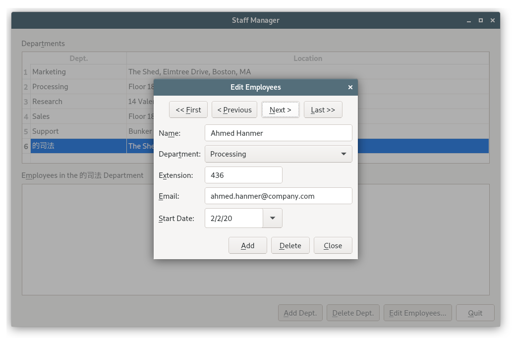

# 13. 数据库

<!-- @import "[TOC]" {cmd="toc" depthFrom=1 depthTo=6 orderedList=false} -->
<!-- code_chunk_output -->

- [13. 数据库](#13-数据库)
  - [连接和查询](#连接和查询)
  - [查看表](#查看表)
  - [使用窗体编辑记录](#使用窗体编辑记录)
  - [在表中显示数据](#在表中显示数据)
  - [other](#other)
    - [为有主键且具有 AUTOINCREMENT 的表添加行](#为有主键且具有-autoincrement-的表添加行)
    - [为 QSqlTableModel 添加数据库表中不存在的列](#为-qsqltablemodel-添加数据库表中不存在的列)
  - [Link](#link)

<!-- /code_chunk_output -->


[QtSql](https://doc.qt.io/qt-5/sql-programming.html) 提供了与平台及数据库种类无关的访问 SQL 数据库地接口。这个接口由利用 Qt 的模型/视图结构将数据库与用户界面集成的一套类来支持。

[QSqlDatabase](https://doc.qt.io/qt-5/qsqldatabase.html) 对象表征了数据库的关联。Qt 使用驱动程序与各种数据库的应用程序编程接口进行通信。Qt 的桌面版(Desktop Edition) 包括如下一些驱动程序：

| Driver Type |                 Description                 |
|:-----------:|:-------------------------------------------:|
|     QDB2    |                   IBM DB2                   |
|    QIBASE   |           Borland InterBase Driver          |
|    QMYSQL   |                 MySQL Driver                |
|     QOCI    |         Oracle Call Interface Driver        |
|    QODBC    | ODBC Driver (includes Microsoft SQL Server) |
|    QPSQL    |              PostgreSQL Driver              |
|   QSQLITE   |          SQLite version 3 or above          |
|   QSQLITE2  |               SQLite version 2              |
|     QTDS    |            Sybase Adaptive Server           |

对于那些习惯了 SQL 语法的用户， [QSqlQuery](https://doc.qt.io/qt-5/qsqlquery.html) 提供了一种直接执行任意的 SQL 语句并处理其结果的方式。对于那些喜欢更高级、更友好的数据库界面以避免 SQL 语法的用户， [QSqlTableModel](https://doc.qt.io/qt-5/qsqltablemodel.html) 和 [QSqlRelationalTableModel](https://doc.qt.io/qt-5/qsqlrelationaltablemodel.html) 提供了合适的抽象。这些类以与其他 Qt 模型类相同的方式来表示一个 SQL 表。它们可以被单独用来遍历和编辑程序代码中的数据，也可以添加最终用户能够查看并修改数据的视图。

Qt使对常见数据库特性的编程变得简单易懂，例如对主从数据库和下钻型(drill-down)数据库的编程；另外，Qt 也让利用窗体或图形用户界面中的表查看数据库表的过程变得简单易行。

## 连接和查询

为了执行 SQL 查询，首先必须建立与数据库的连接。eg：
```c++
bool createConnection()
{
  // 创建 QSqlDatabase 对象，这里指定使用 MySQL
  QSqlDatabase db = QSqlDatabase::addDatabase("QMYSQL");
  db.setHostName("mozart.konkordia.edu");
  db.setDatabaseName("musicdb");
  db.setUserName("gbatstone");
  db.setPassword("T17aV44");
  if (!db.open()) {
    QMessageBox::critical(0, QObject::tr("Database Error"),
    db.lastError().text());
    return false;
  }
  return true;
}
```

一旦连接建立，就可以使用 QSqlQuery 执行底层数据库支持的任何 SQL 语句了。eg：
```c++
QSqlQuery query;
query.exec("SELECT title, year FROM cd WHERE year >= 1998");

// 等价于

QSqlQuery query("SELECT title, year FROM cd WHERE year >= 1998");

//遍历查询的结果集

while (query.next()) {
  // value() 函数把字段作为 QVariant 返回
  QString title = query.value(0).toString();
  int year = query.value(1).toInt();
  std::cerr << qPrintable(title) << ": " << year << std::endl;
}
```
只要调用 next() 一次，就可以把这个 QSqlQuery 定位到结果集中的第一条记录。随后的 next() 调用，每次都会把记录指针前移一条记录，直到到达结尾时 next() 才返回 false。如果结果集为空（或查询失败），那么 next() 的第一次调用将返回 false。

QSqlQuery 提供了一些可以遍历结果集的函数：first() 、 last() 、 previous() 和 seek() 。这些函数都很方便，不过对于某些数据库，它们可能会比 next() 更慢或者更加耗费内存。在操作一个大数据集时，为了便于优化，可以在调用 exec() 之前调用 [QSqlQuery::setForwardOnly(true)](https://doc.qt.io/qt-5/qsqlquery.html#setForwardOnly),然后只使用 next() 遍历结果集。

我们可以通过对查询调用 isActive() 来检查是否有错误发生：
```c++
if (!query.isActive())
  QMessageBox::warning(this, tr("Database Error"),
          query.lastError().text());
```

执行 insert:
```c++
QSqlQuery query("INSERT INTO cd (id, artistid, title, year) "
        "VALUES (203, 102, 'Living in America', 2002)");
```
在这之后，[numRowsAffected()](https://doc.qt.io/qt-5/qsqlquery.html#numRowsAffected) - Returns the number of rows affected by the result's SQL statement, or -1 if it cannot be determined. Note that for SELECT statements, the value is undefined; use size() instead. If the query is not active, -1 is returned.

如果需要插入多条记录，或者想避免将数值转换成为字符串（并且正确地转义它们），可以使用 [prepare()](https://doc.qt.io/qt-5/qsqlquery.html#prepare) 来指定一个包含占位符的查询，然后赋值绑定想插入的数值。Qt 对所有的数据库都支持 Oracle 风格和 ODBC 风格的占位符语法，如果它们可用，就使用本地支持；如果不可用，就模拟它的功能。

Oracle 风格：
```c++
QSqlQuery query;
query.prepare("INSERT INTO cd (id, artistid, title, year) "
      "VALUES (:id, :artistid, :title, :year)");
query.bindValue(":id", 203);
query.bindValue(":artistid", 102);
query.bindValue(":title", "Living in America");
query.bindValue(":year", 2002);
query.exec();
```

ODBC 风格：

```c++
QSqlQuery query;
query.prepare("INSERT INTO cd (id, artistid, title, year) "
      "VALUES (?, ?, ?, ?)");
query.addBindValue(203);
query.addBindValue(102);
query.addBindValue("Living in America");
query.addBindValue(2002);
query.exec();
```

```c++

```

占位符通常用于指定二进制数据或者包含非 ASCII 码或者非 Latin 字符的字符串。在底层，Qt 对支持 Unicode 的数据库使用 Unicode 编码，而对于不支持 Unicode的，Qt 会明确地把字符串转换为合适的编码方式。

如果数据库中的 SQL 事务处理可用的话，Qt 就支持它。

eg:
```c++
// 开始事务
QSqlDatabase::database().transaction();
QSqlQuery query;
query.exec("SELECT id FROM artist WHERE name = 'Gluecifer'");
if (query.next()) {
  int artistId = query.value(0).toInt();
  query.exec("INSERT INTO cd (id, artistid, title, year) "
  "VALUES (201, " + QString::number(artistId)
  + ", 'Riding the Tiger', 1997)");
}
// 结束事务
QSqlDatabase::database().commit();
// 如果需要回滚操作，可调用 roolback()
```

QSqlDatabase::database() 返回一个表示在 createConnection() 中创建的 QSqlDatabase 对象。如果事务不能启动，QSqlDatabase::transaction() 就返回 false。一些数据库不支持事务处理。对于这类数据库，transaction() 、 commit() 和 roolback() 几个函数什么也不做。可以使用 [hasFeatrue()](https://doc.qt.io/qt-5/qsqldriver.html#hasFeature) 对数据库相关的 [QSqlDriver](https://doc.qt.io/qt-5/qsqldriver.html) 进行测试，看看这个数据库是不是支持事务处理。

```c++
QSqlDriver *driver = QSqlDatabase::database().driver();
if (driver->hasFeature(QSqlDriver::Transactions))
  ...
```

还可以测试其他的一些数据库特征(可见下表)，包括数据库是否支持 BLOB 、 Unicode 以及经过处理的查询。
|              Constant              | Value |                                                                                                       Description                                                                                                       |
|:----------------------------------:|:-----:|:-----------------------------------------------------------------------------------------------------------------------------------------------------------------------------------------------------------------------:|
|      QSqlDriver::Transactions      |   0   |                                                                                      Whether the driver supports SQL transactions.                                                                                      |
|        QSqlDriver::QuerySize       |   1   | Whether the database is capable of reporting the size of a query. Note that some databases do not support returning the size (i.e. number of rows returned) of a query, in which case QSqlQuery::size() will return -1. |
|          QSqlDriver::BLOB          |   2   |                                                                                 Whether the driver supports Binary Large Object fields.                                                                                 |
|         QSqlDriver::Unicode        |   3   |                                                                         Whether the driver supports Unicode strings if the database server does.                                                                        |
|     QSqlDriver::PreparedQueries    |   4   |                                                                                  Whether the driver supports prepared query execution.                                                                                  |
|    QSqlDriver::NamedPlaceholders   |   5   |                                                                                Whether the driver supports the use of named placeholders.                                                                               |
| QSqlDriver::PositionalPlaceholders |   6   |                                                                             Whether the driver supports the use of positional placeholders.                                                                             |
|      QSqlDriver::LastInsertId      |   7   |                                                                          Whether the driver supports returning the Id of the last touched row.                                                                          |
|     QSqlDriver::BatchOperations    |   8   |                                                                        Whether the driver supports batched operations, see QSqlQuery::execBatch()                                                                       |
|      QSqlDriver::SimpleLocking     |   9   |                                                             Whether the driver disallows a write lock on a table while other queries have a read lock on it.                                                            |
|   QSqlDriver::LowPrecisionNumbers  |   10  |                                                                         Whether the driver allows fetching numerical values with low precision.                                                                         |
|   QSqlDriver::EventNotifications   |   11  |                                                                                Whether the driver supports database event notifications.                                                                                |
|       QSqlDriver::FinishQuery      |   12  |                                                               Whether the driver can do any low-level resource cleanup when QSqlQuery::finish() is called.                                                              |
|   QSqlDriver::MultipleResultSets   |   13  |                                                        Whether the driver can access multiple result sets returned from batched statements or stored procedures.                                                        |
|       QSqlDriver::CancelQuery      |   14  |                                                                                  Whether the driver allows cancelling a running query.                                                                                  |


使用 [QSqlDriver::handle()](https://doc.qt.io/qt-5/qsqldriver.html#handle) 和 [QSqlResult::handle()](https://doc.qt.io/qt-5/qsqlresult.html#handle) 函数，还可以读取低级数据库驱动句柄和查询结果集的低级句柄。但如果不清楚其使用目的与细节的话，这两个函数的使用非常容易出错。

目前为止，在我们研究的实例中，都是假设应用程序使用的是单一的数据库连接。如果想创建多个连接，可以把数据库名作为第二个参数传递给 [addDatabase()](https://doc.qt.io/qt-5/qsqldatabase.html#addDatabase) 。eg
```c++
QSqlDatabase db = QSqlDatabase::addDatabase("QPSQL", "OTHER");
db.setHostName("saturn.mcmanamy.edu");
db.setDatabaseName("starsdb");
db.setUserName("hilbert");
db.setPassword("ixtapa7");
```
然后，可以通过把数据库名传递给 [QSqlDatabase::database()](https://doc.qt.io/qt-5/qsqldatabase.html#database) 得到指向 QSqlDatabase 对象的指针：
```c++
QSqlDatabase db = QSqlDatabase::database("OTHER");
```
为了使用其他连接执行查询，我们把 QSqlDatabase 对象传递给 QSqlQuery 的构造函数：
```c++
QSqlQuery query(db);
query.exec("SELECT id FROM artist WHERE name = 'Mando Diao'");
```
如果想一次执行多个事务处理，多重连接是很有用的，因为每一个连接只能处理一个有效的事务处理。当使用多个数据库连接时，还可以有一个命名的连接，而且如果没有具体指定的话，QSqlQuery 就会使用这个未命名的连接。

除了 QSqlQuery 之外，Qt 还提供了 [QSqlTableModel](https://doc.qt.io/qt-5/qsqltablemodel.html) 类作为一个高级界面接口，让我们不必使用原始的 SQL 语句来执行大多数常用的 SQL 操作(SELECT、INSERT、UPDATE 和 DELETE）。这个类可以用来独立处理数据库而不涉及到任何的图形用户界面，它也可以用作 QListView 或 QTableView 的数据源。

```c++
QSqlTableModel model;
model.setTable("cd");
model.setFilter("year >= 1998");
model.select();
```
等价于：
```sql
SELECT * FROM cd WHERE year >= 1998
```
利用 QSqlTableModel::record() 获得某一给定的记录，或者利用 value() 读取单独的字段，我们可以遍历这个结果集：
```c++
for (int i = 0; i < model.rowCount(); ++i) {
  QSqlRecord record = model.record(i);
  QString title = record.value("title").toString();
  int year = record.value("year").toInt();
  std::cerr << qPrintable(title) << ": " << year << std::endl;
}
```
QSqlRecord::value() 函数即可以接收字段名也可以接收字段索引。在对大数据集进行操作时，建议利用索引来指定字段。eg：
```c++
int titleIndex = model.record().indexOf("title");
int yearIndex = model.record().indexOf("year");
for (int i = 0; i < model.rowCount(); ++i) {
  QSqlRecord record = model.record(i);
  QString title = record.value(titleIndex).toString();
  int year = record.value(yearIndex).toInt();
  std::cerr << qPrintable(title) << ": " << year << std::endl;
}
```

为了在数据库表中插入记录，可调用 insertRow() 来创建一个新的空行（记录），然后使用 setData() 设置每一列（字段）的值：
```c++
QSqlTableModel model;
model.setTable("cd");
int row = 0;
model.insertRows(row, 1);
model.setData(model.index(row,0),113);
model.setData(model.index(row,1),"Shanghai My Heart");
model.setData(model.index(row,2),224);
model.setData(model.index(row,3),2003);
model.submitAll();
```
在调用 submitAll() 之后，记录可能会被移动到不同的行位置,这取决于表是如何排序的。如果插入失败，submitAll() 调用将返回 false。

SQL 模型与标准模型之间最大的区别在于：对于 SQL 模型，必须调用 submitAll() 以将发生的更改写入数据库。

更新记录：
```c++
QSqlTableModel model;
// 定位到要修改的记录上
model.setTable("cd");
model.setFilter("id = 125");
model.select();
if (model.rowCount() == 1) {
  QSqlRecord record = model.record(0);
  record.setValue("title", "Melody A.M.");
  record.setValue("year", record.value("year").toInt() + 1);
  // 用修改后的记录复写原始的记录
  model.setRecord(0, record);
  model.submitAll();
}
```

也可以使用 setData() 来执行更新.我们获得的模型索引都是针对给定的行与列的：
```c++
model.select();
if (model.rowCount() == 1) {
  model.setData(model.index(0, 1), "Melody A.M.");
  model.setData(model.index(0, 3),
  model.data(model.index(0, 3)).toInt() + 1);
  model.submitAll();
}
```
删除记录：
```c++
model.setTable("cd");
model.setFilter("year < 1990");
model.select();
if (model.rowCount() > 0) {
  // 删除所有与过滤器匹配的记录
  model.removeRows(0, model.rowCount());
  model.submitAll();
}
```

QSqlQuery 和 QSqlTableModel 这两个类提供了 Qt 和 SQL 数据库之间的接口。利用这些类，可以创建显示用户数据以及让用户插入、更新和删除记录的表单。

对于使用 SQL 类的应用程序，需要添加如下到 .pro 文件中：
```highLight
QT += sql
```
这将确保应用程序可以连接到 QtSql 库。

## 查看表
本节将展示如何使用在 QTableView 窗口部件显示 QSqlTableModel。

如图所示的  Scooters 应用程序，给出了踏板车(scooter)的型号表。该实例基于单一的 scooter 表：
```sql
CREATE TABLE scooter (
    id INTEGER PRIMARY KEY AUTOINCREMENT,
    name VARCHAR(40) NOT NULL,
    maxspeed INTEGER NOT NULL,
    maxrange INTEGER NOT NULL,
    weight INTEGER NOT NULL,
    description VARCHAR(80) NOT NULL);
```


scooterwindow.h:
```c++
#ifndef SCOOTERWINDOW_H
#define SCOOTERWINDOW_H

#include <QWidget>

QT_BEGIN_NAMESPACE
class QSqlTableModel;
class QTableView;
QT_END_NAMESPACE

enum {
    Scooter_Id = 0,
    Scooter_Name = 1,
    Scooter_MaxSpeed = 2,
    Scooter_MaxRange = 3,
    Scooter_Weight = 4,
    Scooter_Description = 5
};

class ScooterWindow : public QWidget
{
    Q_OBJECT

public:
    ScooterWindow();

private:
    QSqlTableModel * model;
    QTableView * view;
};

#endif
```

scooterwindow.cpp:
```c++
#include <QtWidgets>
#include <QtSql>

#include "scooterwindow.h"

ScooterWindow::ScooterWindow()
{
    model = new QSqlTableModel(this);
    model->setTable("scooter");
    // 指定排序
    model->setSort(Scooter_Name, Qt::AscendingOrder);
    model->setHeaderData(Scooter_Name, Qt::Horizontal, tr("Name"));
    model->setHeaderData(Scooter_MaxSpeed, Qt::Horizontal, tr("MPH"));
    model->setHeaderData(Scooter_MaxRange, Qt::Horizontal, tr("Miles"));
    model->setHeaderData(Scooter_Weight, Qt::Horizontal, tr("Lbs"));
    model->setHeaderData(Scooter_Description, Qt::Horizontal,
                         tr("Description"));
    // 利用 select() 将其以数据组装
    model->select();

    // 创建视图来显示
    view = new QTableView;
    view->setModel(model);
    view->setSelectionMode(QAbstractItemView::SingleSelection);
    view->setSelectionBehavior(QAbstractItemView::SelectRows);
    // 隐藏 ID 列，因为对于用户来说，ID 并无意义
    view->setColumnHidden(Scooter_Id, true);
    view->resizeColumnsToContents();
    // 设置只读
    view->setEditTriggers(QAbstractItemView::NoEditTriggers);

    QHeaderView * header = view->horizontalHeader();
    header->setStretchLastSection(true);

    QHBoxLayout * mainLayout = new QHBoxLayout;
    mainLayout->addWidget(view);
    setLayout(mainLayout);

    setWindowTitle(tr("Scooters"));
}
```

显示只读表的另一种方式是使用 QSqlTableModel 的基类 - [QSqlQueryModel](https://doc.qt.io/qt-5/qsqlquerymodel.html)。该类提供了 setQuery() 函数，因此它可以设置复杂的  SQL 查询以提供含一个或多个表的专门视图 - 例如，使用 SQL 表连接算法（join）。

```c++
   QSqlQueryModel *model = new QSqlQueryModel;
   model->setQuery("SELECT name, salary FROM employee");
   model->setHeaderData(0, Qt::Horizontal, tr("Name"));
   model->setHeaderData(1, Qt::Horizontal, tr("Salary"));

   QTableView *view = new QTableView;
   view->setModel(model);
   view->show();

   QSqlQueryModel model;
   model.setQuery("SELECT name, salary FROM employee");
   int salary = model.record(4).value("salary").toInt();
```

main.cpp:
```c++
#include <QtWidgets>
#include <QtSql>

#include "scooterwindow.h"

bool createConnection()
{
    QSqlDatabase db = QSqlDatabase::addDatabase("QSQLITE"); // QSQLITE
    db.setDatabaseName("scooters.dat");
    if (!db.open()) {
        QMessageBox::warning(0, QObject::tr("Database Error"),
                             db.lastError().text());
        return false;
    }
    return true;
}

void createFakeData()
{
    QSqlQuery query;
    query.exec("DROP TABLE scooter");

    query.exec("CREATE TABLE scooter ("
               "id INTEGER PRIMARY KEY AUTOINCREMENT, "
               "name VARCHAR(40) NOT NULL, "
               "maxspeed INTEGER NOT NULL, "
               "maxrange INTEGER NOT NULL, "
               "weight INTEGER NOT NULL, "
               "description VARCHAR(80) NOT NULL)");
    query.exec("INSERT INTO scooter (name, maxspeed, "
               "maxrange, weight, description) "
               "VALUES ('Mod-Rad 1500', 40, 35, 298, "
               "'Speedometer, odometer, battery meter, turn signal "
               "indicator, locking steering column')");
    query.exec("INSERT INTO scooter (name, maxspeed, "
               "maxrange, weight, description) "
               "VALUES ('Rad2Go Great White E36', 22, 12, 93, "
               "'10\" airless tires')");
    query.exec("INSERT INTO scooter (name, maxspeed, "
               "maxrange, weight, description) "
               "VALUES ('X-Treme X360', 21, 14, 59, "
               "'Cargo rack, foldable')");
    query.exec("INSERT INTO scooter (name, maxspeed, "
               "maxrange, weight, description) "
               "VALUES ('Vego SX 600', 20, , 76, "
               "'Two interchangeable batteries, foldable')");
    query.exec("INSERT INTO scooter (name, maxspeed, "
               "maxrange, weight, description) "
               "VALUES ('Sunbird E Bike', 18, 30, 118, '')");
    query.exec("INSERT INTO scooter (name, maxspeed, "
               "maxrange, weight, description) "
               "VALUES ('Leopard Shark', 16, 12, 63, "
               "'Battery indicator, removable seat, foldable')");
    query.exec("INSERT INTO scooter (name, maxspeed, "
               "maxrange, weight, description) "
               "VALUES ('Vego iQ 450', 15, 0, 60, "
               "'OUT OF STOCK')");
    query.exec("INSERT INTO scooter (name, maxspeed, "
               "maxrange, weight, description) "
               "VALUES ('X-Treme X-11', 15, 11, 38, "
               "'High powered brakes, foldable')");
    query.exec("INSERT INTO scooter (name, maxspeed, "
               "maxrange, weight, description) "
               "VALUES ('ZZ Cruiser', 14, 10, 46, "
               "'Two batteries, removable seat')");
    query.exec("INSERT INTO scooter (name, maxspeed, "
               "maxrange, weight, description) "
               "VALUES ('X-Treme X-010', 10, 10, 14, "
               "'Solid tires')");
    query.exec("INSERT INTO scooter (name, maxspeed, "
               "maxrange, weight, description) "
               "VALUES ('Q Electric Chariot', 10, 15, 60, "
               "'Foldable')");
    query.exec("INSERT INTO scooter (name, maxspeed, "
               "maxrange, weight, description) "
               "VALUES ('X-Treme X250', 15, 12, 0, "
               "'Solid aluminum deck')");
    query.exec("INSERT INTO scooter (name, maxspeed, "
               "maxrange, weight, description) "
               "VALUES ('Go MotorBoard 2000X', 15, 0, 20, "
               "'Foldable and carryable')");
    query.exec("INSERT INTO scooter (name, maxspeed, "
               "maxrange, weight, description) "
               "VALUES ('Goped ESR750 Sport Electric Scooter', "
               "20, 6, 45, " "'Foldable and carryable')");
}

int main(int argc, char *argv[])
{
    QApplication app(argc, argv);

    bool create = !QFile::exists("scooters.dat");

    if (!createConnection())
        return 1;
    if (create)
        createFakeData();

	ScooterWindow window;
	window.resize(600, 500);
    window.show();


    return app.exec();
}
```

与 Scooters 应用程序的数据库不同，大多数说数据库都存在着大量的表与外键关联（在关系数据库中，外键表示两表间的引用约束）。Qt 提供了 [QSqlRelationalTableModel](https://doc.qt.io/qt-5/qsqlrelationaltablemodel.html) ,它是一个可以利用外键来显示和编辑表的 QSqlTableModel 子类。除了可以为每一个外键将 QSqlTableModel 添加到模型以外， QSqlRelationalTableModel 与 QSqlTableModel 的功能非常相似。在许多情况下，外键有一个 ID 字段和一个命名字段。虽然在后台程序中相应的 ID 字段才是真正被使用的字段，但利用 QSqlRelationalTableModel ,可以确保用户能看到和更改外键的命名字段。为了让其有效运作，必须对用于显示模型的视图设置一个 QSqlRelationalDelegate 类（或者一个用户自定义的子类）。

在随后的两节中，将看到如何实现显示功能及外键更改，还将在本章的最后一节给出更多关于 QTableView 内容。

## 使用窗体编辑记录
在本节中，我们将看到如何创建一次只显示一条记录的对话窗体。这个对话框可以用于增加、编辑、删除单独的记录，也可以遍历表中的所有的记录。

我们将通过 Staff Manager 应用程序来阐明这些概念。该应用程序记录了雇员所属的部门、部门所处的位置以及雇员内部电话分机号码等一些基本信息。


应用程序使用了如下三个表：
```sql
CREATE TABLE location (
    id INTEGER PRIMARY KEY AUTOINCREMENT,
    name VARCHAR(40) NOT NULL));
CREATE TABLE department (
    id INTEGER PRIMARY KEY AUTOINCREMENT,
    name VARCHAR(40) NOT NULL,
    locationid INTEGER NOT NULL,
    FOREIGN KEY (locationid) REFERENCES location));
CREATE TABLE employee (
    id INTEGER PRIMARY KEY AUTOINCREMENT,
    name VARCHAR(40) NOT NULL,
    departmentid INTEGER NOT NULL,
    extension INTEGER NOT NULL,
    email VARCHAR(40) NOT NULL,
    startdate DATE NOT NULL,
    FOREIGN KEY (departmentid) REFERENCES department));
```
上述指定外键的语法主要针对 SQLite3 ，但可能会随数据库的不同而有所变化。


本节将重点关注雇员信息用的对话框 EmployeeForm 。下一节讨论的是 MainForm，它提供了部门和雇员的主从关系图。

EmployeeForm 类提供了一个从主窗体雇员概要信息到某一雇员的具体细节信息的下钻型视图。当调用该类时，如果给出了有效的雇员 ID，窗体将显示指定的雇员信息；否则显示第一个雇员的信息（窗体如下所示）。用户可以浏览查看所有雇员的信息，编辑或者删除现有雇员的信息，同时还可以添加新雇员的信息。



employeeform.h:
```c++
#ifndef EMPLOYEEFORM_H
#define EMPLOYEEFORM_H

#include <QDialog>

QT_BEGIN_NAMESPACE
class QComboBox;
class QDataWidgetMapper;
class QDateEdit;
class QDialogButtonBox;
class QLabel;
class QLineEdit;
class QPushButton;
class QSqlRelationalTableModel;
QT_END_NAMESPACE

enum {
    Employee_Id = 0,
    Employee_Name = 1,
    Employee_DepartmentId = 2,
    Employee_Extension = 3,
    Employee_Email = 4,
    Employee_StartDate = 5
};

class EmployeeForm : public QDialog
{
    Q_OBJECT

public:
    EmployeeForm(int id, QWidget * parent = 0);

    void done(int result) override;

private slots:
    void addEmployee();
    void deleteEmployee();

private:
    // 需要解析表之间的外键关系
    // QSqlRelationalTableModel 是允许将某一窗体中的窗口部件映射到数据模型中对应的列的类。
    QSqlRelationalTableModel * tableModel;
    QDataWidgetMapper * mapper;
    QLabel * nameLabel;
    QLabel * departmentLabel;
    QLabel * extensionLabel;
    QLabel * emailLabel;
    QLabel * startDateLabel;
    QLineEdit * nameEdit;
    QComboBox * departmentComboBox;
    QLineEdit * extensionLineEdit;
    QLineEdit * emailEdit;
    QDateEdit * startDateEdit;
    QPushButton * firstButton;
    QPushButton * previousButton;
    QPushButton * nextButton;
    QPushButton * lastButton;
    QPushButton * addButton;
    QPushButton * deleteButton;
    QPushButton * closeButton;
    QDialogButtonBox * buttonBox;
};

#endif

```

employeeform.cpp:
```c++
#include <QtWidgets>
#include <QtSql>

#include "employeeform.h"

EmployeeForm::EmployeeForm(int id, QWidget *parent)
    : QDialog(parent)
{
    nameEdit = new QLineEdit;

    nameLabel = new QLabel(tr("Na&me:"));
    nameLabel->setBuddy(nameEdit);

    departmentComboBox = new QComboBox;

    departmentLabel = new QLabel(tr("Depar&tment:"));
    departmentLabel->setBuddy(departmentComboBox);

    extensionLineEdit = new QLineEdit;
    // 确保 extension 行编辑器仅接受有效的分级号。
    extensionLineEdit->setValidator(new QIntValidator(0, 99999, this));

    extensionLabel = new QLabel(tr("E&xtension:"));
    extensionLabel->setBuddy(extensionLineEdit);

    emailEdit = new QLineEdit;

    emailLabel = new QLabel(tr("&Email:"));
    emailLabel->setBuddy(emailEdit);

    startDateEdit = new QDateEdit;
    // 提供一个弹出式的日历
    startDateEdit->setCalendarPopup(true);
    QDate today = QDate::currentDate();
    startDateEdit->setDateRange(today.addDays(-90), today.addDays(90));

    startDateLabel = new QLabel(tr("&Start Date:"));
    startDateLabel->setBuddy(startDateEdit);

    firstButton = new QPushButton(tr("<< &First"));
    previousButton = new QPushButton(tr("< &Previous"));
    nextButton = new QPushButton(tr("&Next >"));
    lastButton = new QPushButton(tr("&Last >>"));

    addButton = new QPushButton(tr("&Add"));
    deleteButton = new QPushButton(tr("&Delete"));
    closeButton = new QPushButton(tr("&Close"));

    buttonBox = new QDialogButtonBox;
    buttonBox->addButton(addButton, QDialogButtonBox::ActionRole);
    buttonBox->addButton(deleteButton, QDialogButtonBox::ActionRole);
    buttonBox->addButton(closeButton, QDialogButtonBox::AcceptRole);

    tableModel = new QSqlRelationalTableModel(this);
    tableModel->setTable("employee");
    //设立外键关联
    // setRelation() 函数获得一个外键字段索引及 QSqlRelation 索引。
    // QSqlRelation 构造函数则用表名(外键关系对应的表)
    //、外键字段名以及要显示的字段名来表示外键字段值。
    tableModel->setRelation(Employee_DepartmentId,
                            QSqlRelation("department", "id", "name"));
    tableModel->setSort(Employee_Name, Qt::AscendingOrder);
    tableModel->select();

    // QComboBox 与 QListWidget 很相似，因为它有一个内部模型去保存它的数据条目项。
    //我们可以用自己建的模型代替那个模型，这里需要做的
    //，就是给出 QSqlRelationalTableModel 使用的关系模型。
    QSqlTableModel * relationModel =
            tableModel->relationModel(Employee_DepartmentId);
    departmentComboBox->setModel(relationModel);
    // 这个关系模型有两列，所以必须指出组合框应该显示的是哪一列。
    // 我们使用 fieldIndex() 函数与字段名得到正确的标题索引
    departmentComboBox->setModelColumn(
            relationModel->fieldIndex("name"));

    // QDataWidgetMapper 将一个数据库记录字段反映到其映射的窗口部件中
    //，同时将窗口部件中所做出的更改反映回数据库。
    // 我们即可以自己负责提交这些更改，也可以让映射器自动完成这个工作，这里选择自动选项。
    mapper = new QDataWidgetMapper(this);
    mapper->setSubmitPolicy(QDataWidgetMapper::AutoSubmit);
    mapper->setModel(tableModel);
    // 让模型有效工作的映射器必须给定，对于含有外键的模型
    //，还需要给它一个 QSqlRelationalDelegate 委托基类。
    //这个委托基类可以确保用户看到的是 QSqlRelation 显示栏的值，而不是原始的 ID 号
    //，同时它也保证在用户开始编辑时，组合框会显示值，而映射
    //器则实际上将相应的索引值（外键）写回到数据库中。

    // 当外键引用约束含有大量记录的表的情况，最好创建自己的
    //委托基类并与搜索性能一起使用以显示“列表值”窗体，而
    //不是依靠 QSqlRelationalTableModel 的默认组合框。
    mapper->setItemDelegate(new QSqlRelationalDelegate(this));
    // 添加映射关系
    mapper->addMapping(nameEdit, Employee_Name);
    mapper->addMapping(departmentComboBox, Employee_DepartmentId);
    mapper->addMapping(extensionLineEdit, Employee_Extension);
    mapper->addMapping(emailEdit, Employee_Email);
    mapper->addMapping(startDateEdit, Employee_StartDate);


    if (id != -1) {
        for (int row = 0; row < tableModel->rowCount(); ++row) {
            QSqlRecord record = tableModel->record(row);
            if (record.value(Employee_Id).toInt() == id) {
                mapper->setCurrentIndex(row);
                break;
            }
        }
    } else {
        mapper->toFirst();
    }

    connect(firstButton, SIGNAL(clicked()), mapper, SLOT(toFirst()));
    connect(previousButton, SIGNAL(clicked()),
            mapper, SLOT(toPrevious()));
    connect(nextButton, SIGNAL(clicked()), mapper, SLOT(toNext()));
    connect(lastButton, SIGNAL(clicked()), mapper, SLOT(toLast()));
    connect(addButton, SIGNAL(clicked()), this, SLOT(addEmployee()));
    connect(deleteButton, SIGNAL(clicked()),
            this, SLOT(deleteEmployee()));
    connect(closeButton, SIGNAL(clicked()), this, SLOT(accept()));

    QHBoxLayout * topButtonLayout = new QHBoxLayout;
    topButtonLayout->setContentsMargins(20, 0, 20, 5);
    topButtonLayout->addStretch();
    topButtonLayout->addWidget(firstButton);
    topButtonLayout->addWidget(previousButton);
    topButtonLayout->addWidget(nextButton);
    topButtonLayout->addWidget(lastButton);
    topButtonLayout->addStretch();

    QGridLayout * mainLayout = new QGridLayout;
    mainLayout->addLayout(topButtonLayout, 0, 0, 1, 3);
    mainLayout->addWidget(nameLabel, 1, 0);
    mainLayout->addWidget(nameEdit, 1, 1, 1, 2);
    mainLayout->addWidget(departmentLabel, 2, 0);
    mainLayout->addWidget(departmentComboBox, 2, 1, 1, 2);
    mainLayout->addWidget(extensionLabel, 3, 0);
    mainLayout->addWidget(extensionLineEdit, 3, 1);
    mainLayout->addWidget(emailLabel, 4, 0);
    mainLayout->addWidget(emailEdit, 4, 1, 1, 2);
    mainLayout->addWidget(startDateLabel, 5, 0);
    mainLayout->addWidget(startDateEdit, 5, 1);
    mainLayout->addWidget(buttonBox, 7, 0, 1, 3);
    mainLayout->setRowMinimumHeight(6, 10);
    mainLayout->setRowStretch(6, 1);
    mainLayout->setColumnStretch(2, 1);
    setLayout(mainLayout);

    if (id == -1) {
        nextButton->setFocus();
    } else {
        nameEdit->setFocus();
    }

    setWindowTitle(tr("Edit Employees"));
}

void EmployeeForm::done(int result)
{
    mapper->submit();
    QDialog::done(result);
}

void EmployeeForm::addEmployee()
{
    // 先提交当前行，确保对当前记录的修改没有任何遗失，虽然已经设置了自动提交策略，仍必须手动提交。
    // 这是因为自动提交仅在用户改变光标焦点位置时才能使用 - 这样可以避免在每次用户插入或删除一个字符时，频繁
    // 地对数据库进行更新操作 - 因为用户有可能刚编辑完一个字段，但当单击 Add 按钮时光标焦点位置并没有跳出该字段。
    int row = mapper->currentIndex();
    mapper->submit();

    // 添加新行并让映射器导航浏览至该行
    tableModel->insertRow(row);
    mapper->setCurrentIndex(row);

    nameEdit->clear();
    extensionLineEdit->clear();
    startDateEdit->setDate(QDate::currentDate());
    nameEdit->setFocus();
}

void EmployeeForm::deleteEmployee()
{
    // 指明当前行开始，然后删除该行并提交。必须手动提交删除的更改，因为自动提交策略仅适用于对记录做出的更改。
    int row = mapper->currentIndex();
    tableModel->removeRow(row);
    mapper->submit();
    // 让映射器当前索引值指向被删除行的下一行。如果删除的是最后一行，则指向最后一行。
    mapper->setCurrentIndex(qMin(row, tableModel->rowCount() - 1));
}

```

[QDataWidgetMapper](https://doc.qt.io/qt-5/qdatawidgetmapper.html) 类使那些采用数据模型显示信息的数据可知型窗体的开发变得容易得多。在这个例子中，我们使用一个 QSqlRelationalTableModel 作为底层的数据模型，而 QDataWidgetMapper 则可以与任何数据模型一起使用，包括非 SQL 模型。另外一个可供选择的方式是直接使用 QSqlQuery 在窗体中填写数据，并更新数据库。这个方法要求更多的工作量，但也相应地更灵活一些。

下一节中，我们将看到 Staff Manager 应用程序的余下部分。

## 在表中显示数据

在许多情况下，以表格式的视图为用户显示数据集是最简单的方法。本节给出应用程序的主窗体，它由两个呈主-从关系的 QTableView 组成。主视图是单位部门的列表，从视图是当前部门中的雇员列表。两个视图都使用了 QSqlRelationalTableModel ，因为它们呈现出的数据库都有外键字段。

mainform.h:
```c++
#ifndef MAINFORM_H
#define MAINFORM_H

#include <QWidget>

QT_BEGIN_NAMESPACE
class QDialogButtonBox;
class QLabel;
class QModelIndex;
class QPushButton;
class QSplitter;
class QSqlRelationalTableModel;
class QTableView;
QT_END_NAMESPACE

enum {
    Department_Id = 0,
    Department_Name = 1,
    Department_LocationId = 2
};

class MainForm : public QWidget
{
    Q_OBJECT

public:
    MainForm();

private slots:
    // 为了设立主-从关系，必须确保当用户浏览到主视图中不同的记录（行）时，更新从视图中的表并显示相关的记录。
    void updateEmployeeView();
    void addDepartment();
    void deleteDepartment();
    void editEmployees();

private:
    void createDepartmentPanel();
    void createEmployeePanel();

    QSqlRelationalTableModel * departmentModel;
    QSqlRelationalTableModel * employeeModel;
    QWidget * departmentPanel;
    QWidget * employeePanel;
    QLabel * departmentLabel;
    QLabel * employeeLabel;
    QTableView * departmentView;
    QTableView * employeeView;
    QSplitter * splitter;
    QPushButton * addButton;
    QPushButton * deleteButton;
    QPushButton * editButton;
    QPushButton * quitButton;
    QDialogButtonBox * buttonBox;
};

#endif
```

mainform.cpp:

```c++
#include <QtWidgets>
#include <QtSql>

#include "employeeform.h"
#include "mainform.h"

MainForm::MainForm()
{
    createDepartmentPanel();
    createEmployeePanel();

    splitter = new QSplitter(Qt::Vertical);
    splitter->setFrameStyle(QFrame::StyledPanel);
    splitter->addWidget(departmentPanel);
    splitter->addWidget(employeePanel);

    addButton = new QPushButton(tr("&Add Dept."));
    deleteButton = new QPushButton(tr("&Delete Dept."));
    editButton = new QPushButton(tr("&Edit Employees..."));
    quitButton = new QPushButton(tr("&Quit"));

    buttonBox = new QDialogButtonBox;
    buttonBox->addButton(addButton, QDialogButtonBox::ActionRole);
    buttonBox->addButton(deleteButton, QDialogButtonBox::ActionRole);
    buttonBox->addButton(editButton, QDialogButtonBox::ActionRole);
    buttonBox->addButton(quitButton, QDialogButtonBox::AcceptRole);

    connect(addButton, SIGNAL(clicked()), this, SLOT(addDepartment()));
    connect(deleteButton, SIGNAL(clicked()),
            this, SLOT(deleteDepartment()));
    connect(editButton, SIGNAL(clicked()), this, SLOT(editEmployees()));
    connect(quitButton, SIGNAL(clicked()), this, SLOT(close()));

    QVBoxLayout * mainLayout = new QVBoxLayout;
    mainLayout->addWidget(splitter);
    mainLayout->addWidget(buttonBox);
    setLayout(mainLayout);

    setWindowTitle(tr("Staff Manager"));
    departmentView->setCurrentIndex(departmentModel->index(0, 0));
}

void MainForm::updateEmployeeView()
{
    QModelIndex index = departmentView->currentIndex();
    if (index.isValid()) {
        QSqlRecord record = departmentModel->record(index.row());
        int id = record.value("id").toInt();
        employeeModel->setFilter(QString("departmentid = %1").arg(id));
        employeeLabel->setText(tr("E&mployees in the %1 Department")
                               .arg(record.value("name").toString()));
    } else {
        employeeModel->setFilter("departmentid = -1");
        employeeLabel->setText(tr("E&mployees"));
    }
    employeeModel->select();
    // 设置标题是否可见
    employeeView->horizontalHeader()->setVisible(
            employeeModel->rowCount() > 0);
}

// 我们不必考虑为新记录创建独特的键，因为使用的是一个自动增加列。如果这个方法不能或者不适合使用，
// 则可以连接模型的 beforeInsert() 信号。这个信号在用户编辑后将发射，正好在数据库的插入发生之前。
// 这是放入 ID 或者处理用户数据的最佳时间。beforeDelete() 和 beforUpdate() 信号很类似
// ，它们对创建审计追踪非常有用。
void MainForm::addDepartment()
{
    int row = departmentModel->rowCount();
    departmentModel->insertRow(row);
    QModelIndex index = departmentModel->index(row, Department_Name);
    departmentView->setCurrentIndex(index);
    departmentView->edit(index);
}

void MainForm::deleteDepartment()
{
    QModelIndex index = departmentView->currentIndex();
    if (!index.isValid())
        return;

    // 执行级联删除以确保数据库的关系完整性。为了实现这个功能，特别是针对那些并不会为我们保证关系完整性的数据库
    //（如 SQLite3）,必须使用事务处理。
    QSqlDatabase::database().transaction();
    QSqlRecord record = departmentModel->record(index.row());
    int id = record.value(Department_Id).toInt();
    int numEmployees = 0;

    QSqlQuery query(QString("SELECT COUNT(*) FROM employee "
                            "WHERE departmentid = %1").arg(id));
    if (query.next())
        numEmployees = query.value(0).toInt();
    if (numEmployees > 0) {
        int r = QMessageBox::warning(this, tr("Delete Department"),
                    tr("Delete %1 and all its employees?")
                    .arg(record.value(Department_Name).toString()),
                    QMessageBox::Yes | QMessageBox::No);
        if (r == QMessageBox::No) {
            QSqlDatabase::database().rollback();
            return;
        }

        query.exec(QString("DELETE FROM employee "
                           "WHERE departmentid = %1").arg(id));
    }

    departmentModel->removeRow(index.row());
    departmentModel->submitAll();
    QSqlDatabase::database().commit();

    updateEmployeeView();
    departmentView->setFocus();
}

void MainForm::editEmployees()
{
    int employeeId = -1;
    QModelIndex index = employeeView->currentIndex();
    if (index.isValid()) {
        QSqlRecord record = employeeModel->record(index.row());
        employeeId = record.value(Employee_Id).toInt();
    }

    EmployeeForm form(employeeId, this);
    form.exec();
    // 使主窗体的从表视图自我刷新，因为此时雇员信息可能已经发生了更改。
    updateEmployeeView();
}

// 创建并设立部门模型和视图
void MainForm::createDepartmentPanel()
{
    departmentPanel = new QWidget;

    departmentModel = new QSqlRelationalTableModel(this);
    departmentModel->setTable("department");
    departmentModel->setRelation(Department_LocationId,
            QSqlRelation("location", "id", "name"));
    departmentModel->setSort(Department_Name, Qt::AscendingOrder);
    departmentModel->setHeaderData(Department_Name, Qt::Horizontal,
                                   tr("Dept."));
    departmentModel->setHeaderData(Department_LocationId,
                                   Qt::Horizontal, tr("Location"));
    departmentModel->select();

    departmentView = new QTableView;
    departmentView->setModel(departmentModel);
    departmentView->setItemDelegate(new QSqlRelationalDelegate(this));
    departmentView->setSelectionMode(
            QAbstractItemView::SingleSelection);
    departmentView->setSelectionBehavior(QAbstractItemView::SelectRows);
    departmentView->setColumnHidden(Department_Id, true);
    departmentView->resizeColumnsToContents();
    departmentView->horizontalHeader()->setStretchLastSection(true);

    departmentLabel = new QLabel(tr("Depar&tments"));
    departmentLabel->setBuddy(departmentView);

    connect(departmentView->selectionModel(),
            SIGNAL(currentRowChanged(const QModelIndex &,
                                     const QModelIndex &)),
            this, SLOT(updateEmployeeView()));

    QVBoxLayout * layout = new QVBoxLayout;
    layout->addWidget(departmentLabel);
    layout->addWidget(departmentView);
    departmentPanel->setLayout(layout);
}

// 创建并设立雇员的模型和视图
void MainForm::createEmployeePanel()
{
    employeePanel = new QWidget;

    employeeModel = new QSqlRelationalTableModel(this);
    employeeModel->setTable("employee");
    employeeModel->setRelation(Employee_DepartmentId,
            QSqlRelation("department", "id", "name"));
    employeeModel->setSort(Employee_Name, Qt::AscendingOrder);
    employeeModel->setHeaderData(Employee_Name, Qt::Horizontal,
                                 tr("Name"));
    employeeModel->setHeaderData(Employee_Extension, Qt::Horizontal,
                                 tr("Ext."));
    employeeModel->setHeaderData(Employee_Email, Qt::Horizontal,
                                 tr("Email"));

    employeeView = new QTableView;
    employeeView->setModel(employeeModel);
    employeeView->setSelectionMode(QAbstractItemView::SingleSelection);
    employeeView->setSelectionBehavior(QAbstractItemView::SelectRows);
    employeeView->setEditTriggers(QAbstractItemView::NoEditTriggers);
    employeeView->horizontalHeader()->setStretchLastSection(true);
    // 隐藏不需要的三列
    employeeView->setColumnHidden(Employee_Id, true);
    employeeView->setColumnHidden(Employee_DepartmentId, true);
    employeeView->setColumnHidden(Employee_StartDate, true);

    employeeLabel = new QLabel(tr("E&mployees"));
    employeeLabel->setBuddy(employeeView);

    QVBoxLayout * layout = new QVBoxLayout;
    layout->addWidget(employeeLabel);
    layout->addWidget(employeeView);
    employeePanel->setLayout(layout);
}
```
```c++

```
本章介绍了 Qt 的模型/视图类如何让 SQL 数据库中查看和编辑数据的操作变得尽可能简单。当我们想要使用一个窗体视图显示记录项时，可以利用 QDataWidgetMapper 将用户界面中的窗体部件映射到数据库记录的字段。主-从关系的设置也相当容易，仅仅要求一个信号-槽连接以及一个简单槽的实现。下钻型的窗口视图很直观，我们只需要导航到主窗体构造函数中被选中的记录，就可以在从视图中看到与其对应的具体信息。如果没有记录被选中，则直接看到的就是第一条记录。

## other
### 为有主键且具有 AUTOINCREMENT 的表添加行
```c++
QSqlRecord newRecord = model->record();
/* since the id field has the autoincrement attribute,
     * it is not necessary to indicate its value,
      * that is because this field of the request is removed.
*/
newRecord.remove(newRecord.indexOf("id"));
newRecord.setValue(newRecord.indexOf("time"),localTime);

// model 为 QSqlTableModel的实例
/*-1 is set to indicate that it will be added to the last row*/
if(model->insertRecord(-1,newRecord))
{
    //qDebug()<<"successful insertion";
    model->submitAll();
}
else
{
    qDebug()<<"insert is failed";
}
```

### 为 QSqlTableModel 添加数据库表中不存在的列
代码段示例：
```c++
//m_model 是 QSqlTableModel 的实例；
// m_tableview 是QTableView 的实例；

void Test::insertOtherColumns() {
 	m_model->insertColumns(Signal_Choice,1);
 	m_model->setHeaderData(Signal_Choice, Qt::Horizontal, QString::fromLocal8Bit("选择"));

	m_model->insertColumns(Signal_isRunning,1);
	m_model->setHeaderData(Signal_isRunning,Qt::Horizontal,QString::fromLocal8Bit("状态"));

	for (int i = 0; i < m_model->rowCount(); i++) {
		auto *cb = new QCheckBox;
		cb->setText(QString::number(i));
		m_tableview->setIndexWidget(m_model->index(i , 0), cb);
		connect(cb, SIGNAL(stateChanged(int)), this, SLOT(checkbox_IfClicked(int)));
		auto item = new QLabel(this);
		item->setPixmap(QPixmap (":/images/icons8_stop_16.png"));
		std::string key = "isRunning";
		item->setProperty(key.c_str(),false);
		m_tableview->setIndexWidget(m_model->index(i,Signal_isRunning),item);
	}
	setTableViewHide(true);
	m_tableview->resizeColumnsToContents();
}
```
修改行示例：
```c++ 
setTableViewHide(false); // 显示之前隐藏的列
m_model->submitAll();
insertOtherColumns();
```	
删除行示例：
```c++
QVector<int> needDeleteRow;
for (auto i=0;i < m_model->rowCount();++i) {
    auto *cb = dynamic_cast<QCheckBox*>(
         m_tableview->indexWidget(m_model->index(i, Signal_Choice)));
    if (cb->isChecked()) {
         needDeleteRow<<i;
    }	
}
setTableViewHide(false); //显示之前隐藏的列
m_model->submitAll(); // delete check box
for (auto i=0;i<needDeleteRow.size();++i)
{
    bool ret = m_model->removeRow(i);
    //qDebug()<<"removeRow ret is "<<ret;
}
m_model->submitAll();
insertOtherColumns();
```

## Link
* [qt5-book-code/chap13/](https://github.com/mutse/qt5-book-code/tree/master/chap13)


- [上一级](README.md)
- 上一篇 -> [12. 输入与输出](12_inOut.md)
- 下一篇 -> [14.多线程](14_multiThread.md)
