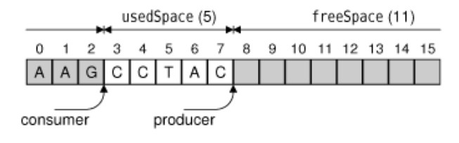

# 14.多线程


<!-- @import "[TOC]" {cmd="toc" depthFrom=1 depthTo=6 orderedList=false} -->
<!-- code_chunk_output -->

- [14.多线程](#14多线程)
  - [创建线程](#创建线程)
  - [同步线程](#同步线程)
    - [生产者-消费者](#生产者-消费者)
      - [使用信号量](#使用信号量)
      - [使用条件变量](#使用条件变量)
    - [线程本地存储](#线程本地存储)
  - [与主线程通信](#与主线程通信)
  - [在次线程中使用 Qt 的类](#在次线程中使用-qt-的类)
  - [Link](#link)

<!-- /code_chunk_output -->

传统的图形用户界面应用程序都只有一个执行线程，并且一次只执行一个操作。如果用户从用户界面调用一个比较耗时的操作，那么当执行这个操作时，虽然实际上该操作正在进行，但用户界面通常回冻结而不再响应。对于这个问题，第 7 章已经提供了一些解决方案。本章要讲述的多线程则是另外一种解决方案。

在多线程应用程序中，图形用户界面运行于它自己的线程中，而另外的事件处理过程则会发生在一个或多个其他线程中。当在一个单处理器上运行时，多线程应用程序系统可能会比实现同样功能的单线程应用程序运行得更慢一些，无法体现出其优势。但在目前多处理器系统越来越普及的情况下，多线程应用程序可以在不同的处理器中同时执行多个线程，从而获得更好的总体性能。

* [Threading Basics](http://doc.qt.io/qt-5/thread-basics.html)

多线程是一个很大的研究课题，有很多书籍专门介绍这一主题：例如
* Bil Lewis 和 Daniel J.Berg 编著的 [Threads Primer: A Guide to Multithreaded Programming](https://www.amazon.com/Threads-Primer-Guide-Multithreaded-Programming/dp/0134436989)
* Gregory Andrews 编著的 [Foundations of Multithreaded, Parallel, and Distributed Programming
](https://books.google.com.sg/books/about/Foundations_of_Multithreaded_Parallel_an.html?id=npRQAAAAMAAJ&redir_esc=y)

## 创建线程

在 Qt 应用程序中提供多线程是非常简单的：只需要子类化 [QThread](http://doc.qt.io/qt-5/qthread.html) 并且重新实现它的 run() 函数就可以了。可参考如下示例：


thread.h:
```c++
#ifndef THREAD_H
#define THREAD_H

#include <QThread>

class Thread : public QThread
{
    Q_OBJECT

public:
    Thread();

    void setMessage(const QString &message);
    void stop();

protected:
    void run() override;

private:
    QString messageStr;
	//volatile 拒绝编译器优化
    volatile bool stopped;
};

#endif
```

thread.cpp:
```c++
#include <QtCore>
#include <iostream>

#include "thread.h"

Thread::Thread()
{
    stopped = false;
}

void Thread::setMessage(const QString &message)
{
    messageStr = message;
}

// 当控制离开 run() 函数时，就会终止线程
void Thread::run()
{
    while (!stopped)
        std::cerr << qPrintable(messageStr);
    stopped = false;
    std::cerr << std::endl;
}

// 任何时候，stop() 函数都可以由任一线程调用。考虑到这个实例的目的，我们假定对 bool 的赋值
// 是一个原子操作。这是一个合理的假设，因为 bool 变量仅能有两种状态。在这一节的稍后部分
// ，将会看到如何使用 QMutex 确保对一个变量的赋值成为一个原子操作。
void Thread::stop()
{
    stopped = true;
}
```
在开始执行线程的时候，就会调用 run() 函数。

QThread 提供了一个 terminate() 函数，该函数可以在一个线程还在运行的时候就终止它的执行。我们不推荐使用 terminate() 方法，这是因为它可以随时停止线程执行而不给这个线程自我清空的机会。一种更为安全的方法是使用 stopped 变量和stop() 函数，就像这里所做的那样。

threaddialog.h:
```c++
#ifndef THREADDIALOG_H
#define THREADDIALOG_H

#include <QDialog>

#include "thread.h"

QT_BEGIN_NAMESPACE
class QPushButton;
QT_END_NAMESPACE

class ThreadDialog : public QDialog
{
    Q_OBJECT

public:
    ThreadDialog(QWidget * parent = 0);

protected:
    void closeEvent(QCloseEvent * event) override;

private slots:
    void startOrStopThreadA();
    void startOrStopThreadB();

private:
    Thread threadA;
    Thread threadB;
    QPushButton * threadAButton;
    QPushButton * threadBButton;
    QPushButton * quitButton;
};

#endif
```

threaddialog.cpp:
```c++
#include <QtWidgets>

#include "threaddialog.h"

ThreadDialog::ThreadDialog(QWidget *parent)
    : QDialog(parent)
{
    threadA.setMessage("A");
    threadB.setMessage("B");

    threadAButton = new QPushButton(tr("Start A"));
    threadBButton = new QPushButton(tr("Start B"));
    quitButton = new QPushButton(tr("Quit"));
    quitButton->setDefault(true);

    connect(threadAButton, SIGNAL(clicked()),
            this, SLOT(startOrStopThreadA()));
    connect(threadBButton, SIGNAL(clicked()),
            this, SLOT(startOrStopThreadB()));
    connect(quitButton, SIGNAL(clicked()), this, SLOT(close()));

    QHBoxLayout * mainLayout = new QHBoxLayout;
    mainLayout->addWidget(threadAButton);
    mainLayout->addWidget(threadBButton);
    mainLayout->addWidget(quitButton);
    setLayout(mainLayout);

    setWindowTitle(tr("Threads"));
}

void ThreadDialog::startOrStopThreadA()
{
    if (threadA.isRunning()) {
        threadA.stop();
        threadAButton->setText(tr("Start A"));
    } else {
        threadA.start(); // will call run() function
        threadAButton->setText(tr("Stop A"));
    }
}

void ThreadDialog::startOrStopThreadB()
{
    if (threadB.isRunning()) {
        threadB.stop();
        threadBButton->setText(tr("Start B"));
    } else {
        threadB.start(); // will call run() function
        threadBButton->setText(tr("Stop B"));
    }
}

void ThreadDialog::closeEvent(QCloseEvent *event)
{
	//等待线程结束
    threadA.stop();
    threadB.stop();
    threadA.wait();
    threadB.wait();
    event->accept();
}
```

## 同步线程
对于多线程应用程序，一个最基本的要求就是能实现几个线程的同步执行。Qt 提供了以下用于同步的类：
* [QMutex](http://doc.qt.io/qt-5/qmutex.html)
* [QReadWriteLock](http://doc.qt.io/qt-5/qreadwritelock.html)
* [QSemaphore](https://doc.qt.io/qt-5/qsemaphore.html)
* [QWaitCondition](https://doc.qt.io/qt-5/qwaitcondition.html).

Qt 提供了方便的 [QMutexLocker](http://doc.qt.io/qt-5/qmutexlocker.html) 类来简化对互斥量的处理。类似于 [std::lock_guard](https://en.cppreference.com/w/cpp/thread/lock_guard).

使用互斥量的一个问题在于：每次只能有一个线程可以访问同一变量。在程序中，可能会有许多线程同时访问读取某一变量（不是修改该变量），此时，互斥量可能会成为一个严重的性能瓶颈。在这种情况下，可以使用 QReadWriteLock ，它是一个同步类，允许同时执行多个读取访问而不会影响性能。
```c++
QReadWriteLock lock;

void ReaderThread::run()
{
    ...
    lock.lockForRead();
    read_file();
    lock.unlock();
    ...
}

void WriterThread::run()
{
    ...
    lock.lockForWrite();
    write_file();
    lock.unlock();
    ...
}
```

QSemaphore 是互斥量的另外一种泛化表示形式，但与 读-写 锁定不同，信号量可以用于保护一定数量的相同资源。下面两小段程序代码给出了 QSemaphore 和 QMutex 之间的对应关系：
```c++
// 把 1 传递给构造函数，就告诉这个信号量它控制一个单一资源。
// 使用信号量的优点是可以传递 1 之外的数字给构造函数，然后
// 可以多次调用 acquire() 来获取大量资源
QSemaphore semaphore(1);
semaphore.acquire();
semaphore.release();
```
```c++
QMutex mutex;
mutex.lock();
mutex.unlock();
```


### 生产者-消费者

一个典型的信号量应用程序是当两个线程间传递一定量的数据（data size） 时，这两个线程会使用某一特定大小(buffer size) 的共享环形缓冲器(circular buffer)；



在生产者 - 消费者 实例中对于同步的需求有两个部分：如果生产者线程生成数据的速度太快，那么将会把消费者线程还没有读取的数据覆盖掉；如果消费者线程读取数据的数度过快，那么它将会跃过生产者线程而读取一些垃圾数据。

解决这一问题的一个粗略的方法是让生产者线程填满缓冲器，然后等待线程消费者线程读取完缓冲器中全部数据为止。然而，在多处理器的机器上，让生产者和消费者两个线程分别同时操作缓冲器的两个部分则要比前面的方案快得多。
因此，解决这一问题的一个更为有效的方法是使用两个信号量。

#### 使用信号量
```c++
#include <QtCore>
#include <iostream>

const int DataSize = 100000;
const int BufferSize = 4096;
char buffer[BufferSize];

QSemaphore freeSpace(BufferSize);
QSemaphore usedSpace(0);

class Producer : public QThread
{
public:
    void run();
};

void Producer::run()
{
    for (int i = 0; i < DataSize; ++i) {
        freeSpace.acquire();
        buffer[i % BufferSize] = "ACGT"[uint(std::rand()) % 4];
        usedSpace.release();
    }
}

class Consumer : public QThread
{
public:
    void run();
};

void Consumer::run()
{
    for (int i = 0; i < DataSize; ++i) {
        usedSpace.acquire();
        std::cerr << buffer[i % BufferSize];
        freeSpace.release();
    }
    std::cerr << std::endl;
}

int main()
{
    Producer producer;
    Consumer consumer;
    producer.start();
    consumer.start();
    producer.wait();
    consumer.wait();
    return 0;
}
```
#### 使用条件变量
```c++
#include <QtCore>
#include <iostream>

const int DataSize = 100000;
const int BufferSize = 4096;
// 我们使用一个互斥量来保护所有对 usedSpace 变量的访问
char buffer[BufferSize];

QWaitCondition bufferIsNotFull;
QWaitCondition bufferIsNotEmpty;
QMutex mutex;
int usedSpace = 0;

class Producer : public QThread
{
public:
    void run();
};

void Producer::run()
{
    for (int i = 0; i < DataSize; ++i) {
        mutex.lock();
        while (usedSpace == BufferSize)
			// QWaitCondition::wait() 函数可以把锁定的互斥量作为它的第一个参数
			// ，在阻塞当前线程之前它会解锁，然后在返回之前它会锁定。
            bufferIsNotFull.wait(&mutex);
        buffer[i % BufferSize] = "ACGT"[uint(std::rand()) % 4];
        ++usedSpace;
        bufferIsNotEmpty.wakeAll();
        mutex.unlock();
    }
}

class Consumer : public QThread
{
public:
    void run();
};

void Consumer::run()
{
    for (int i = 0; i < DataSize; ++i) {
        mutex.lock();
        while (usedSpace == 0)
            bufferIsNotEmpty.wait(&mutex);
        std::cerr << buffer[i % BufferSize];
        --usedSpace;
        bufferIsNotFull.wakeAll();
        mutex.unlock();
    }
    std::cerr << std::endl;
}

int main()
{
    Producer producer;
    Consumer consumer;
    producer.start();
    consumer.start();
    producer.wait();
    consumer.wait();
    return 0;
}
```

对于这个实例，可以把下面的 while 循环：
```c++
while (usedSpace == BufferSize)
      bufferIsNotFull.wait(&mutex);
```
替换为
```c++
if (usedSpace == BufferSize) {
	mutex.unlock();
	bufferIsNotFull.wait();
	mutex.lock();
}
```

然而，一旦我们被允许使用多个生产者线程时，将会中断 if 语句，因为另外一个生产者可在 wait() 调用之后立即占用这个互斥量并且可使这个 “缓冲器非写满” 条件再次变为 false 值。

### 线程本地存储
在目前为止提到的所有实例中，我们的线程都已经访问了这些相同的全局变量。但在一些多线程应用程序中，需要有一个在不同线程中保存不同数值的全局变量。这种变量通常称为 线程本地存储 或者 线程特定数据。我们可以使用一个联通线程 ID 号【由 QThread::currentThread() 返回】的映射来模仿它，但是更好的方法是使用 [QThreadStorage\<T\>](http://doc.qt.io/qt-5/qthreadstorage.html)

QThreadStorage<T> 的一种常见用法是用于高速缓存中。通过在不同线程中拥有一个独立的高速缓存，就可以避免用于锁住、解锁和可能等待一个互斥量的计算开销。eg:
```c++
QThreadStorage<QCache<QString, SomeClass> > caches;

void cacheObject(const QString &key, SomeClass *object)
{
    caches.localData().insert(key, object);
}

void removeFromCache(const QString &key)
{
    if (!caches.hasLocalData())
        return;

    caches.localData().remove(key);
}
```

除了高速缓存之外， QThreadStorage<T> 还可以用于全局错误状态变量（与 errno 相似），这样可以确保对某一线程的修改不会影响到其他的线程。

## 与主线程通信
当 QT 应用程序开始执行时，只有主线程时在运行的。主线程是唯一允许创建 QApplication 或 QCoreApplication 对象，并且可以对创建的对象调用 exec() 的线程。在调用 exec() 后，这个线程或者等待一个事件，或者处理一个事件。

通过创建一些 QThread 子类对象，主线程可以开始一些新的线程。如果这些新的线程需要在它们之间进行通信，则可以使用含有互斥量、读写锁、信号或者等待条件的共享变量。但在这些技术中，没有任何一个可以用来与主线程进行通信，因为它们会锁住事件循环并且会冻结用户界面。

在次线程和主线程之间通信的一个解决方案是在线程之间使用信号-槽的连接。通常情况下，信号和槽可以同步操作，这就意味着在发射信号的时候，使用直接函数即可立刻调用连接到一个信号的多个槽。

然而，当连接位于不同线程中的对象时，这一机制就会变得不同步起来【这种状态可以通过修改 QObject::connect() 中的第 5 个可选参数而改变】。在底层，实际是通过置入一个事件来实现这些连接的。这个槽接着就会由线程的事件循环调用，而在该线程中存在着接收器对象。在默认情况下，QObject 存在与创建它的线程中，通过调用 QObject::moveToThread() 可以在任何时刻修改它。

eg: Image Pro 应用程序 - 一个基本的图像处理程序，允许用户旋转图片、重定义图片的大小以及图片的色彩深度。这个应用程序使用一个次线程在不锁住事件循环的情况下执行对图片的操作。在处理非常大的图片时，这样做会在效果上产生很大的差别。次线程具有一系列的任务，或者是“事务”，可以用来完成事件并发送事件给主窗口以报告进度。


imagewindow.h:
```c++
#ifndef IMAGEWINDOW_H
#define IMAGEWINDOW_H

#include <QMainWindow>

#include "transactionthread.h"

QT_BEGIN_NAMESPACE
class QAction;
class QLabel;
class QMenu;
QT_END_NAMESPACE

class ImageWindow : public QMainWindow
{
    Q_OBJECT

public:
    ImageWindow();

protected:
    void closeEvent(QCloseEvent * event);

private slots:
    void open();
    bool save();
    bool saveAs();
    void flipHorizontally();
    void flipVertically();
    void resizeImage();
    void convertTo32Bit();
    void convertTo8Bit();
    void convertTo1Bit();
    void about();
    void allTransactionsDone();

private:
    void createActions();
    void createMenus();
    bool okToContinue();
    void loadFile(const QString &fileName);
    void saveFile(const QString &fileName);
    void setCurrentFile(const QString &fileName);
    QString strippedName(const QString &fullFileName);
    void addTransaction(Transaction * transact);

    TransactionThread thread;
    QLabel * imageLabel;
    QByteArray imageFormat;
    QString curFile;

    QMenu * fileMenu;
    QMenu * editMenu;
    QMenu * convertToSubMenu;
    QMenu * helpMenu;
    QAction * openAction;
    QAction * saveAction;
    QAction * saveAsAction;
    QAction * exitAction;
    QAction * flipHorizontallyAction;
    QAction * flipVerticallyAction;
    QAction * rotateAction;
    QAction * resizeAction;
    QAction * convertTo32BitAction;
    QAction * convertTo8BitAction;
    QAction * convertTo1BitAction;
    QAction * aboutAction;
    QAction * aboutQtAction;
};

#endif
```

imagewindow.cpp:
```c++
#include <QtWidgets>

#include "imagewindow.h"
#include "ui_resizedialog.h"

ImageWindow::ImageWindow()
{
    imageLabel = new QLabel;
    imageLabel->setBackgroundRole(QPalette::Dark);
    imageLabel->setAutoFillBackground(true);
    imageLabel->setAlignment(Qt::AlignLeft | Qt::AlignTop);
    setCentralWidget(imageLabel);

    createActions();
    createMenus();

    statusBar()->showMessage(tr("Ready"), 2000);

    // care it
    connect(&thread, SIGNAL(transactionStarted(const QString &)),
            statusBar(), SLOT(showMessage(const QString &)));
    connect(&thread, SIGNAL(allTransactionsDone()),
            this, SLOT(allTransactionsDone()));

    setCurrentFile("");
}

void ImageWindow::closeEvent(QCloseEvent *event)
{
    if (okToContinue()) {
        event->accept();
    } else {
        event->ignore();
    }
}

void ImageWindow::open()
{
    if (okToContinue()) {
        QString fileName = QFileDialog::getOpenFileName(this);
        if (!fileName.isEmpty())
            loadFile(fileName);
    }
}

bool ImageWindow::save()
{
    if (curFile.isEmpty()) {
        return saveAs();
    } else {
        saveFile(curFile);
        return true;
    }
}

bool ImageWindow::saveAs()
{
    QString fileName = QFileDialog::getSaveFileName(this);
    if (QFile::exists(fileName)) {
        int r = QMessageBox::warning(this, tr("Image Pro"),
                        tr("File %1 already exists.\n"
                           "Do you want to overwrite it?")
                        .arg(QDir::toNativeSeparators(fileName)),
                        QMessageBox::Yes | QMessageBox::No);
        if (r == QMessageBox::No)
            return true;
    }
    if (!fileName.isEmpty())
        saveFile(fileName);
    return true;
}

// 横向翻转
void ImageWindow::flipHorizontally()
{
    addTransaction(new FlipTransaction(Qt::Horizontal));
}

// 竖向翻转
void ImageWindow::flipVertically()
{
    addTransaction(new FlipTransaction(Qt::Vertical));
}

void ImageWindow::resizeImage()
{
    QDialog dialog;
    Ui::ResizeDialog ui;
    ui.setupUi(&dialog);

    ui.widthSpinBox->setValue(imageLabel->pixmap()->width());
    ui.heightSpinBox->setValue(imageLabel->pixmap()->height());

    if (dialog.exec()) {
        QSize newSize(ui.widthSpinBox->value(),
                      ui.heightSpinBox->value());
        addTransaction(new ResizeTransaction(newSize));
    }
}

void ImageWindow::convertTo32Bit()
{
    addTransaction(new ConvertDepthTransaction(32));
}

void ImageWindow::convertTo8Bit()
{
    addTransaction(new ConvertDepthTransaction(8));
}

void ImageWindow::convertTo1Bit()
{
    addTransaction(new ConvertDepthTransaction(1));
}

// 向次线程的事务队列中添加一个事务
void ImageWindow::addTransaction(Transaction * transact)
{
    thread.addTransaction(transact);
    openAction->setEnabled(false);
    saveAction->setEnabled(false);
    saveAsAction->setEnabled(false);
}

void ImageWindow::about()
{
    QMessageBox::about(this, tr("About Image Pro"),
            tr("<h2>Image Pro 1.1</h2>"
               "<p>Copyright &copy; 2008 Software Inc."
               "<p>Image Pro is a small application that demonstrates "
               "signal-slot connections across threads."));
}

// 当 TransactionThread 的事务队列变为空时，就会调用这个 allTransactionsDone() 槽
void ImageWindow::allTransactionsDone()
{
    openAction->setEnabled(true);
    saveAction->setEnabled(true);
    saveAsAction->setEnabled(true);
    imageLabel->setPixmap(QPixmap::fromImage(thread.image()));
    setWindowModified(true);
    statusBar()->showMessage(tr("Ready"), 2000);
}

void ImageWindow::createActions()
{
    openAction = new QAction(tr("&Open..."), this);
    openAction->setShortcut(QKeySequence::Open);
    openAction->setStatusTip(tr("Open an existing image file"));
    connect(openAction, SIGNAL(triggered()), this, SLOT(open()));

    saveAction = new QAction(tr("&Save"), this);
    saveAction->setShortcut(QKeySequence::Save);
    saveAction->setStatusTip(tr("Save the image to disk"));
    connect(saveAction, SIGNAL(triggered()), this, SLOT(save()));

    saveAsAction = new QAction(tr("Save &As..."), this);
    saveAsAction->setStatusTip(tr("Save the image under a new name"));
    connect(saveAsAction, SIGNAL(triggered()), this, SLOT(saveAs()));

    exitAction = new QAction(tr("E&xit"), this);
    exitAction->setShortcut(tr("Ctrl+Q"));
    exitAction->setStatusTip(tr("Exit the application"));
    connect(exitAction, SIGNAL(triggered()), this, SLOT(close()));

    flipHorizontallyAction = new QAction(tr("Flip &Horizontally"),
                                         this);
    flipHorizontallyAction->setShortcut(tr("Ctrl+H"));
    flipHorizontallyAction->setStatusTip(tr("Flip the image "
                                            "horizontally"));
    connect(flipHorizontallyAction, SIGNAL(triggered()),
            this, SLOT(flipHorizontally()));

    flipVerticallyAction = new QAction(tr("Flip &Vertically"), this);
    flipVerticallyAction->setShortcut(tr("Ctrl+V"));
    flipVerticallyAction->setStatusTip(tr("Flip the image vertically"));
    connect(flipVerticallyAction, SIGNAL(triggered()),
            this, SLOT(flipVertically()));

    resizeAction = new QAction(tr("&Resize..."), this);
    resizeAction->setShortcut(tr("Ctrl+R"));
    resizeAction->setStatusTip(tr("Resize the image"));
    connect(resizeAction, SIGNAL(triggered()),
            this, SLOT(resizeImage()));

    convertTo32BitAction = new QAction(tr("32 Bit"), this);
    convertTo32BitAction->setStatusTip(tr("Convert to 32-bit image"));
    connect(convertTo32BitAction, SIGNAL(triggered()),
            this, SLOT(convertTo32Bit()));

    convertTo8BitAction = new QAction(tr("8 Bit"), this);
    convertTo8BitAction->setStatusTip(tr("Convert to 8-bit image"));
    connect(convertTo8BitAction, SIGNAL(triggered()),
            this, SLOT(convertTo8Bit()));

    convertTo1BitAction = new QAction(tr("1 Bit"), this);
    convertTo1BitAction->setStatusTip(tr("Convert to 1-bit image"));
    connect(convertTo1BitAction, SIGNAL(triggered()),
            this, SLOT(convertTo1Bit()));

    aboutAction = new QAction(tr("&About"), this);
    aboutAction->setStatusTip(tr("Show the application's About box"));
    connect(aboutAction, SIGNAL(triggered()), this, SLOT(about()));

    aboutQtAction = new QAction(tr("About &Qt"), this);
    aboutQtAction->setStatusTip(tr("Show the Qt library's About box"));
    connect(aboutQtAction, SIGNAL(triggered()), qApp, SLOT(aboutQt()));
}

void ImageWindow::createMenus()
{
    fileMenu = menuBar()->addMenu(tr("&File"));
    fileMenu->addAction(openAction);
    fileMenu->addAction(saveAction);
    fileMenu->addAction(saveAsAction);
    fileMenu->addSeparator();
    fileMenu->addAction(exitAction);

    editMenu = menuBar()->addMenu(tr("&Edit"));
    editMenu->addAction(flipHorizontallyAction);
    editMenu->addAction(flipVerticallyAction);
    editMenu->addAction(resizeAction);
    editMenu->addSeparator();

    convertToSubMenu = editMenu->addMenu(tr("&Convert to"));
    convertToSubMenu->addAction(convertTo32BitAction);
    convertToSubMenu->addAction(convertTo8BitAction);
    convertToSubMenu->addAction(convertTo1BitAction);

    menuBar()->addSeparator();

    helpMenu = menuBar()->addMenu(tr("&Help"));
    helpMenu->addAction(aboutAction);
    helpMenu->addAction(aboutQtAction);
}

bool ImageWindow::okToContinue()
{
    if (isWindowModified()) {
        int r = QMessageBox::warning(this, tr("Image Pro"),
                        tr("The image has been modified.\n"
                           "Do you want to save your changes?"),
                        QMessageBox::Yes | QMessageBox::No
                        | QMessageBox::Cancel);
        if (r == QMessageBox::Yes) {
            return save();
        } else if (r == QMessageBox::Cancel) {
            return false;
        }
    }
    return true;
}

void ImageWindow::loadFile(const QString &fileName)
{
    QImage newImage;

    QApplication::setOverrideCursor(Qt::WaitCursor);
    bool loaded = newImage.load(fileName);
    QApplication::restoreOverrideCursor();

    if (loaded) {
        thread.setImage(newImage);
        imageFormat = QImageReader::imageFormat(fileName);
        imageLabel->setPixmap(QPixmap::fromImage(newImage));
        setCurrentFile(fileName);
        statusBar()->showMessage(tr("File loaded"), 2000);
    } else {
        QMessageBox::warning(this, tr("Image Pro"),
                             tr("Error when loading image."));
        statusBar()->showMessage(tr("Loading canceled"), 2000);
    }
}

void ImageWindow::saveFile(const QString &fileName)
{
    QImage image = thread.image();

    QApplication::setOverrideCursor(Qt::WaitCursor);
    bool saved = image.save(fileName, imageFormat);
    QApplication::restoreOverrideCursor();

    if (saved) {
        setCurrentFile(fileName);
        statusBar()->showMessage(tr("File saved"), 2000);
    } else {
        QMessageBox::warning(this, tr("Image Pro"),
                             tr("Error when saving image."));
        statusBar()->showMessage(tr("Saving canceled"), 2000);
    }
}

void ImageWindow::setCurrentFile(const QString &fileName)
{
    curFile = fileName;
    setWindowModified(false);

    bool hasImage = !curFile.isEmpty();

    if (hasImage) {
        setWindowTitle(tr("%1[*] - %2").arg(strippedName(curFile))
                                       .arg(tr("Image Pro")));
    } else {
        setWindowTitle(tr("Image Pro"));
    }

    saveAction->setEnabled(hasImage);
    saveAsAction->setEnabled(hasImage);
    flipHorizontallyAction->setEnabled(hasImage);
    flipVerticallyAction->setEnabled(hasImage);
    resizeAction->setEnabled(hasImage);
    convertTo32BitAction->setEnabled(hasImage);
    convertTo8BitAction->setEnabled(hasImage);
    convertTo1BitAction->setEnabled(hasImage);
}

QString ImageWindow::strippedName(const QString &fullFileName)
{
    return QFileInfo(fullFileName).fileName();
}
```

transactionthread.h:
```c++
#ifndef TRANSACTIONTHREAD_H
#define TRANSACTIONTHREAD_H

#include <QImage>
#include <QMutex>
#include <QQueue>
#include <QThread>
#include <QWaitCondition>

class Transaction
{
public:
    virtual ~Transaction() { }

    virtual QImage apply(const QImage &image) = 0;
    virtual QString message() = 0;
};

class FlipTransaction : public Transaction
{
public:
    FlipTransaction(Qt::Orientation orientation);

    QImage apply(const QImage &image);
    QString message();

private:
    Qt::Orientation orientation;
};

class ResizeTransaction : public Transaction
{
public:
    ResizeTransaction(const QSize &size);

    QImage apply(const QImage &image);
    QString message();

private:
    QSize size;
};

class ConvertDepthTransaction : public Transaction
{
public:
    ConvertDepthTransaction(int depth);

    QImage apply(const QImage &image);
    QString message();

private:
    int depth;
};

class TransactionThread : public QThread
{
    Q_OBJECT

public:
    TransactionThread();
    ~TransactionThread();

    void addTransaction(Transaction *transact);
    void setImage(const QImage &image);
    QImage image();

signals:
    void transactionStarted(const QString &message);
    void allTransactionsDone();

protected:
    void run();

private:
	// 保存事务应用的图片
    QImage currentImage;
    QQueue<Transaction *> transactions;
    QWaitCondition transactionAdded;
    QMutex mutex;
};

#endif
```

transactionthread.cpp:
```c++
#include <QtWidgets>

#include "transactionthread.h"

Transaction * const EndTransaction = 0;

FlipTransaction::FlipTransaction(Qt::Orientation orientation)
{
    this->orientation = orientation;
}

QImage FlipTransaction::apply(const QImage &image)
{
    return image.mirrored(orientation == Qt::Horizontal,
                          orientation == Qt::Vertical);
}

QString FlipTransaction::message()
{
    if (orientation == Qt::Horizontal) {
        return QObject::tr("Flipping image horizontally...");
    } else {
        return QObject::tr("Flipping image vertically...");
    }
}

ResizeTransaction::ResizeTransaction(const QSize &size)
{
    this->size = size;
}

QString ResizeTransaction::message()
{
    return QObject::tr("Resizing image...");
}

QImage ResizeTransaction::apply(const QImage &image)
{
    return image.scaled(size, Qt::IgnoreAspectRatio,
                        Qt::SmoothTransformation);
}

ConvertDepthTransaction::ConvertDepthTransaction(int depth)
{
    this->depth = depth;
}

QImage ConvertDepthTransaction::apply(const QImage &image)
{
    QImage::Format format;

    switch (depth) {
    case 1:
        format = QImage::Format_Mono;
        break;
    case 8:
        format = QImage::Format_Indexed8;
        break;
    case 24:
    default:
        format = QImage::Format_RGB32;
    }

    return image.convertToFormat(format);
}

QString ConvertDepthTransaction::message()
{
    return QObject::tr("Converting image depth...");
}

TransactionThread::TransactionThread()
{
    start();
}

TransactionThread::~TransactionThread()
{
    {
        QMutexLocker locker(&mutex);
        while (!transactions.isEmpty())
            delete transactions.dequeue();

		// care it
        transactions.enqueue(EndTransaction);
        transactionAdded.wakeOne();
    }

    wait();
}

void TransactionThread::addTransaction(Transaction *transact)
{
    QMutexLocker locker(&mutex);
    transactions.enqueue(transact);
    transactionAdded.wakeOne();
}

void TransactionThread::run()
{
    Transaction * transact = 0;
    QImage oldImage;

    forever {
        {
            QMutexLocker locker(&mutex);

            if (transactions.isEmpty())
                transactionAdded.wait(&mutex);
            transact = transactions.dequeue();
            if (transact == EndTransaction)
                break;

            oldImage = currentImage;
        }

        emit transactionStarted(transact->message());
        QImage newImage = transact->apply(oldImage);
        delete transact;

        {
            QMutexLocker locker(&mutex);
            currentImage = newImage;
            if (transactions.isEmpty())
                emit allTransactionsDone();
        }
    }
}

void TransactionThread::setImage(const QImage &image)
{
    QMutexLocker locker(&mutex);
    currentImage = image;
}

QImage TransactionThread::image()
{
    QMutexLocker locker(&mutex);
    return currentImage;
}

```

Image Pro 应用程序展示了 Qt 的信号-槽机制是如何使主线程与次线程之间的通信变得简单易行的。实现次线程时要谨慎对待，因为必须使用互斥量来保护成员变量，而且必须使用一个等待条件以在适当的时候停止或者触发线程。

Qt Quarterly 中的 “Monitors and Wait Conditions in Qt” 给出了一些关于开发和测试那些使用互斥量和等待条件来保证同步的 QThread 子类的思想。
* [Monitors and Wait Conditions in Qt (Part 1)](https://doc.qt.io/archives/qq/qq21-monitors.html)
* [Monitors and Wait Conditions in Qt (Part 2)](https://doc.qt.io/archives/qq/qq22-monitors2.html)

## 在次线程中使用 Qt 的类
[c++并发/线程安全](../cpp/multiThread.md)

Qt 中线程安全的类有:
* QMutex
* QMutexLocker
* QReadWriteLock
* QReadLocker
* QWriterLocker
* QSemaphore
* QThreadStorage<T>
* QWaitCondition

此外，部分 QThread应用编程接口和其他某些函数也是线程安全的，特别是
* QObject::connect()
* QObject::disconnect()
* [QCoreApplication::postEvent()](https://doc.qt.io/qt-5/qcoreapplication.html#postEvent)
* [QCoreApplication::removePostedEvents()](https://doc.qt.io/qt-5/qcoreapplication.html#removePostedEvents)


绝大多数 Qt 的非图形用户界面类都符合一个并不太严格的要求：它们都必须是可重入的(reentrant)。如果类的不同实例可同时用于不同的线程，那么这个类就是可重入的。然而，在多个线程中同时访问同一个可重入对象是不安全的，而是应该使用一个互斥量来保护这个类的访问。一个类是否是可重入的，在 Qt 的参考文档中有标记。通常情况下，任何没有被全局引用或者被其他共享数据引用的 C++ 类都认为是可重入的。

[Reentrancy and Thread-Safety](https://doc.qt.io/qt-5/threads-reentrancy.html)

QObject 是可重入的，但必要记住它的三个约束条件：
1. QObject 的子对象必须在它的父对象线程中创建
特别需要说明的是，这一约束条件意味着在次线程中创建的对象永远不能将 QThread 对象作为创建他们的父对象，因为 QThread 对象在另外一个线程（主线程或者另外一个不同的次线程）中创建的。

2. 在删除对应的 QThread 对象之前，必须删除所有在次线程中创建的 QObject 对象
通过在 QThread::run()中的堆栈上创建这些对象，就可以完成这一点
3. 必须在创建 QObject 对象的线程中删除它们
如果需要删除一个存在于不同线程中的 QObject 对象，则必须调用线程安全的 [QObject::deleteLater()](http://doc.qt.io/qt-5/qobject.html#deleteLater) 函数，它可以置入一个“延期删除”(deferred later) 事件。
一些非图形用户界面的 QObject 子类，如 QTimer 、 QProcess ，以及用于网络方面的类都是可重入的。只要任意线程处于事件循环中，就可以在这个线程中使用它们。对于次线程，通过调用 [QThread::exec()](https://doc.qt.io/qt-5/qthread.html#exec) 或者其他方便的函数，如 QProcess::waitForFinished() 和 QAbstractSocket::waitForDisconnected() ，都可以启动一个这样的事件循环。

由于从那些为 Qt 的图形用户界面支持编译器的低级库上继承的局限性，QWidget 和它的子类都是不可重入的。这样造成的后果之一就是我们不能在一个来自次线程的窗口部件上直接调用函数。eg，如果想从次线程中修改一个 QLabel 中的文本，则可以发射一个连接到 QLabel::setText() 的信号，或者从该线程中调用 [QMetaObject::invokeMethod()](https://doc.qt.io/qt-5/qmetaobject.html#invokeMethod)

```c++
void MyThread::run()
{
	...
	QMetaObject::invokeMethod(label, SLOT(setText(const QString &)),
	Q_ARG(QString, "Hello"));
	...
}
```

很多 Qt 的非图形用户界面类，包括 QImage ，QString 和一些容器类，都使用了隐士共享作为一项优化技术。虽然这样的优化通常会让类变成不可重入的，但在 Qt 中这不是一个大问题，因为 Qt 使用原子汇编语言指令(atomic assembly language instruction) 来实现线程安全引用计数，这可以让 Qt 的隐式共享类变成可重入的。

Qt 的 QtSql 模块也可用于多线程的应用程序，但是它也有其约束条件，这个条件因数据库的不同而不同。有关的详细信息，请参考 [SQL Database Drivers](https://doc.qt.io/qt-5/sql-driver.html).


## Link
* [qt5-book-code/chap16/](https://github.com/mutse/qt5-book-code/tree/master/chap16)

---
- [上一级](README.md)
- 上一篇 -> [13. 数据库](13_database.md)
- 下一篇 -> [15. 网络](15_network.md)
