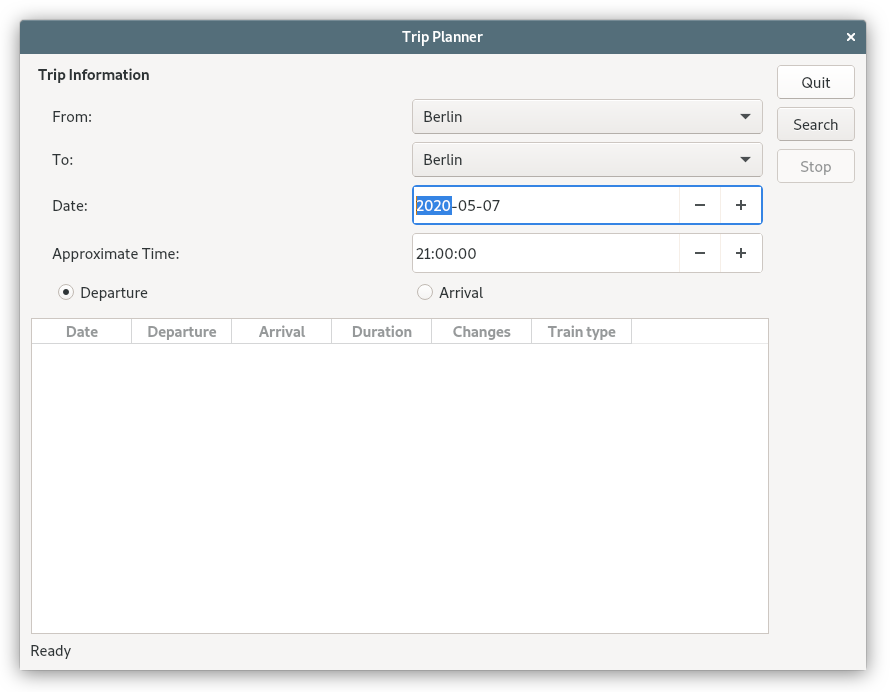
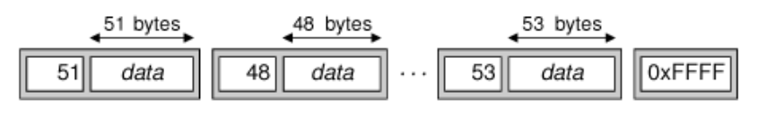
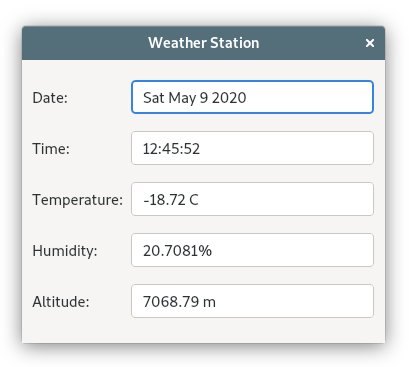

# 15. 网络

<!-- @import "[TOC]" {cmd="toc" depthFrom=1 depthTo=6 orderedList=false} -->
<!-- code_chunk_output -->

- [15. 网络](#15-网络)
  - [写 TCP 客户/服务器应用程序](#写-tcp-客户服务器应用程序)
    - [Trip Planner](#trip-planner)
    - [TripServer](#tripserver)
  - [发送和接收 UDP 数据报](#发送和接收-udp-数据报)
    - [Weather Balloon](#weather-balloon)
    - [Weather Station](#weather-station)
  - [Link](#link)

<!-- /code_chunk_output -->

Qt 提供了 [QFtp](https://doc.qt.io/archives/qt-4.8/qftp.html) 与 [QHttp](https://doc.qt.io/archives/qt-4.8/qhttp.html)

注: QFtp 和 QHttp 是 Qt4 的库，Qt 5 已不再支持这两个类，可改为使用 [QNetworkAccessManager](https://doc.qt.io/qt-5/qnetworkaccessmanager.html) ；

[QHttp in not available in Qt5](https://stackoverflow.com/questions/26180311/qhttp-in-not-available-in-qt5)

Qt 还提供了较低级的 [QTcpSocket](https://doc.qt.io/qt-5/qtcpsocket.html) 和 [QUdpSocket](https://doc.qt.io/qt-5/qudpsocket.html)。 若要创建服务器应用程序，还需要 [QTcpServer](https://doc.qt.io/qt-5/qtcpserver.html) 来处理引入的 TCP 连接。我们可以使用 [QSslSocket](https://doc.qt.io/qt-5/qsslsocket.html) 代替 QTcpSocket 来建立安全的 SSL/TLS 连接。

[Qt Network](https://doc.qt.io/qt-5/qtnetwork-index.html)


## 写 TCP 客户/服务器应用程序

QTcpSocket 和 QTcpServer 类可以用来实现 TCP 客户端和服务器。

TCP 是一个基于流的协议。对于应用程序，数据表现为一个长长的流，而不是一个大的平面文件。在 TCP 上建立的高层协议通常是基于行的或者基于块的。
* 基于行的协议把数据作为一行文本进行传输，每一数据行都以一个换行符结尾。
* 基于块的协议把数据作为二进制块来进行传输。每一数据块都是由一个大小字段及其包含的数据组成的。

QTcpSocket 可以使用 QDataStream 或者 QTextStream 来进行读取和写入。与从文件中读取相比，从网络上读取数据会有一个值得注意的差别：在使用 >> 操作符之前，必须确定已经从另一端接收了足够多的数据。如果没有接收到足够多的数据就使用 >> 操作符，通常会导致不确定的状态发生。

### Trip Planner
eg： Trip Planner,其使用了自定义的基于块的协议。



tripplanner.h:
```c++
#ifndef TRIPPLANNER_H
#define TRIPPLANNER_H

#include <QDialog>
#include <QTcpSocket>

#include "ui_tripplanner.h"

class QPushButton;

class TripPlanner : public QDialog, private Ui::TripPlanner
{
    Q_OBJECT

public:
    TripPlanner(QWidget * parent = 0);

private slots:
    void connectToServer();
    void sendRequest();
    void updateTableWidget();
    void stopSearch();
    void connectionClosedByServer();
    void error();

private:
    void closeConnection();

    QPushButton * searchButton;
    QPushButton * stopButton;
    QTcpSocket tcpSocket;
    // 在解析从服务器接收的数据块时，则会使用到 nextBlockSize;
    quint16 nextBlockSize;
};

#endif
```

tripplanner.cpp:
```c++
#include <QtWidgets>
#include <QtNetwork>

#include "tripplanner.h"

TripPlanner::TripPlanner(QWidget *parent)
    : QDialog(parent)
{
    setupUi(this);

    searchButton = buttonBox->addButton(tr("&Search"),
                                        QDialogButtonBox::ActionRole);
    stopButton = buttonBox->addButton(tr("S&top"),
                                      QDialogButtonBox::ActionRole);
    stopButton->setEnabled(false);
    buttonBox->button(QDialogButtonBox::Close)->setText(tr("&Quit"));

    QDateTime dateTime = QDateTime::currentDateTime();
    dateEdit->setDate(dateTime.date());
    timeEdit->setTime(QTime(dateTime.time().hour(), 0));

    progressBar->hide();
    progressBar->setSizePolicy(QSizePolicy::Preferred,
                               QSizePolicy::Ignored);

    tableWidget->verticalHeader()->hide();
    tableWidget->setEditTriggers(QAbstractItemView::NoEditTriggers);

    connect(searchButton, SIGNAL(clicked()),
            this, SLOT(connectToServer()));
    connect(stopButton, SIGNAL(clicked()), this, SLOT(stopSearch()));
    connect(buttonBox, SIGNAL(rejected()), this, SLOT(reject()));

    connect(&tcpSocket, SIGNAL(connected()), this, SLOT(sendRequest()));
    connect(&tcpSocket, SIGNAL(disconnected()),
            this, SLOT(connectionClosedByServer()));
    connect(&tcpSocket, SIGNAL(readyRead()),
            this, SLOT(updateTableWidget()));
    connect(&tcpSocket, SIGNAL(error(QAbstractSocket::SocketError)),
            this, SLOT(error()));
}

void TripPlanner::connectToServer()
{
  // connectToHost() 调用是异步的，它总是立即返回。连接通常会在稍后建立。
  //当连接建立起来并运行时，QTcpSocket 对象发射 connected() 信号；
  //如果连接失败，QTcpSocket 对象会发射 error(QAbstractSocket::SocketError) 信号
#if 1
    tcpSocket.connectToHost(QHostAddress::LocalHost, 6178);
#else
    tcpSocket.connectToHost("tripserver.zugbahn.de", 6178);
#endif

    tableWidget->setRowCount(0);
    searchButton->setEnabled(false);
    stopButton->setEnabled(true);
    statusLabel->setText(tr("Connecting to server..."));
    progressBar->show();

    nextBlockSize = 0;
}

void TripPlanner::sendRequest()
{
    QByteArray block;
    QDataStream out(&block, QIODevice::WriteOnly);
    out.setVersion(QDataStream::Qt_4_3);
    //一开始写入 0 值作为块的大小，以及其他数据。
    out << quint16(0) << quint8('S') << fromComboBox->currentText()
        << toComboBox->currentText() << dateEdit->date()
        << timeEdit->time();

    if (departureRadioButton->isChecked()) {
        out << quint8('D');
    } else {
        out << quint8('A');
    }

    // 重新移动到字节数组的开始处
    out.device()->seek(0);
    // 利用数据块的实际尺寸值覆盖最初写入的 0 值
    out << quint16(block.size() - sizeof(quint16));
    // 向服务器发送这个块
    tcpSocket.write(block);

    statusLabel->setText(tr("Sending request..."));
}
```

请求的二进制数据块格式如下：

|   Type  |                     Desc                     |
|:-------:|:--------------------------------------------:|
| quint16 |  Block size in bytes (excluding this field)  |
|  quint8 |           Request type (always 'S')          |
| QString |                Departure city                |
| QString |                 Arrival city                 |
|  QDate  |                Date of travel                |
|  QTime  |          Approximate time of travel          |
|  quint8 | Time is for departure ('D') or arrival ('A') |


```c++

// 该函数被连接到 QTcpSocket 的 readyRead() 信号
// ，只要 QTcpSocket 已经从服务器收到新数据，就会发射该信号
void TripPlanner::updateTableWidget()
{
    QDataStream in(&tcpSocket);
    in.setVersion(QDataStream::Qt_4_3);

    // forever 展开为 for(;;)
    forever {
        int row = tableWidget->rowCount();

        if (nextBlockSize == 0) {
            if (tcpSocket.bytesAvailable() < sizeof(quint16))
                break;
            in >> nextBlockSize;
        }

        if (nextBlockSize == 0xFFFF) {
            closeConnection();
            statusLabel->setText(tr("Found %1 trip(s)").arg(row));
            break;
        }

        // 查看是否有块的容量大小这么多字节可以读取；
        // 如果没有，就先在这里停止。
        // 当有更多数据可以读取的时候，readyRead()
        // 信号将会被再次发射，然后就可以再次尝试读取。
        if (tcpSocket.bytesAvailable() < nextBlockSize)
            break;

        // 一旦确认一个完整的块已经被读取到，就可以在 QDataStream 上安全地使用
        //  >> 操作符以提取一个旅行相关的信息
        QDate date;
        QTime departureTime;
        QTime arrivalTime;
        quint16 duration;
        quint8 changes;
        QString trainType;

        in >> date >> departureTime >> duration >> changes >> trainType;
        arrivalTime = departureTime.addSecs(duration * 60);

        tableWidget->setRowCount(row + 1);

        QStringList fields;
        fields << date.toString(Qt::LocalDate)
               << departureTime.toString(tr("hh:mm"))
               << arrivalTime.toString(tr("hh:mm"))
               << tr("%1 hr %2 min").arg(duration / 60)
                                    .arg(duration % 60)
               << QString::number(changes)
               << trainType;
        for (int i = 0; i < fields.count(); ++i)
            tableWidget->setItem(row, i,
                                 new QTableWidgetItem(fields[i]));

        // 重新将 nextBlockSize 变量设置为 0
        // ,以表示下一个块的大小是未知的并且需要读取
        nextBlockSize = 0;
    }
}
```
每一个匹配的旅行都作为一个单独的块发送，并且每一个块的开始都是块的大小尺寸值。这类数据块流如图所示：



因为我们不需要每次从服务器得到一整个块的数据，所以 forever 是循环是非常有必要的。我们也许只是收到一个完整的块、一个块的一部分、一个块和一个块的一部分，甚至还可能一次收到所有的块数据。

服务器使用一个大小为 0xFFFF 的值来表示没有更多的数据可以接收，所以如果读取到该值，就表明已经读取到数据块的末尾了。

从服务器上接收的块具有如下格式：

| Data type |                    Desc                    |
|:---------:|:------------------------------------------:|
|  quint16  | Block size in bytes (excluding this field) |
|   QDate   |               Departure date               |
|   QTime   |               Departure time               |
|  quint16  |            Duration (in minutes)           |
|   quint8  |              Number of changes             |
|  QString  |                 Train type                 |

```c++

void TripPlanner::stopSearch()
{
    statusLabel->setText(tr("Search stopped"));
    closeConnection();
}

// 被连接到 QTcpSocket 的 disconnected() 信号。
void TripPlanner::connectionClosedByServer()
{
    // 如果服务器关闭这个连接且我们还没有收到 0xFFFF 数据终止符，
    // 就告诉用户有一个错误发生了。
    if (nextBlockSize != 0xFFFF)
        statusLabel->setText(tr("Error: Connection closed by server"));
    closeConnection();
}

// 被连接到 QTcpSocket 的 error ( QAbstractSocket::SocketError) 信号
void TripPlanner::error()
{
    statusLabel->setText(tcpSocket.errorString());
    closeConnection();
}

void TripPlanner::closeConnection()
{
    tcpSocket.close();
    searchButton->setEnabled(true);
    stopButton->setEnabled(false);
    progressBar->hide();
}
```

main.cpp:
```c++
#include <QApplication>

#include "tripplanner.h"

int main(int argc, char *argv[])
{
    QApplication app(argc, argv);
    TripPlanner tripPlanner;
    tripPlanner.show();
    return app.exec();
}
```

### TripServer

服务器包括两个类：
* TripServer - 派生自 [QTcpServer](https://doc.qt.io/qt-5/qtcpserver.html),这是一个允许接收来访的 TCP 连接的类。
* ClientSocket - 派生自 QTcpSocket, 处理一个单独的连接。

在任何时候，在内存中 ClientSocket 对象的数量和正在被服务的客户端数量都是一样多的。

tripserver.h:
```c++
#ifndef TRIPSERVER_H
#define TRIPSERVER_H

#include <QTcpServer>

class TripServer : public QTcpServer
{
    Q_OBJECT

public:
    TripServer(QObject * parent = 0);

private:
    // 只要有一个客户端试图连接到服务器正监听的端口，这个函数就会被调用
    //void incomingConnection(int socketId) override;
    // for my Qt5.13.2
    void incomingConnection(qintptr socketId) override;
};

#endif
```

tripserver.cpp:
```c++
#include <QtCore>

#include "clientsocket.h"
#include "tripserver.h"

TripServer::TripServer(QObject *parent)
    : QTcpServer(parent)
{
}

//void TripServer::incomingConnection(int socketId)
//for my Qt5.13.2
void TripServer::incomingConnection(qintptr socketId)
{
    // 创建 ClientSocket 对象，并且 setSocketDescriptor.
    // 当连接终止时，ClientSocket 对象将自动删除
    ClientSocket * socket = new ClientSocket(this);
    socket->setSocketDescriptor(socketId);
}
```

clientsocket.h:
```c++
#ifndef CLIENTSOCKET_H
#define CLIENTSOCKET_H

#include <QTcpSocket>

class QDate;
class QTime;

class ClientSocket : public QTcpSocket
{
    Q_OBJECT

public:
    ClientSocket(QObject * parent = 0);

private slots:
    void readClient();

private:
    void generateRandomTrip(const QString &from, const QString &to,
                            const QDate &date, const QTime &time);

    quint16 nextBlockSize;
};

#endif
```

clientsocket.cpp:
```c++
#include <QtNetwork>

#include "clientsocket.h"

ClientSocket::ClientSocket(QObject *parent)
    : QTcpSocket(parent)
{
    connect(this, SIGNAL(readyRead()), this, SLOT(readClient()));
    // disconnect() 信号被连接到 deleteLater(),这是一个从 QObject 继承的函数
    //，当控制权返回到 Qt 的事件循环时，它会删除对象。
    // 这样就确保当关闭套接字连接时， ClientSocket 对象会被删除。
    connect(this, SIGNAL(disconnected()), this, SLOT(deleteLater()));

    nextBlockSize = 0;
}

void ClientSocket::readClient()
{
    QDataStream in(this);
    in.setVersion(QDataStream::Qt_4_3);

    if (nextBlockSize == 0) {
        if (bytesAvailable() < sizeof(quint16))
            return;
        in >> nextBlockSize;
    }

    if (bytesAvailable() < nextBlockSize)
        return;

    quint8 requestType;
    QString from;
    QString to;
    QDate date;
    QTime time;
    quint8 flag;

    in >> requestType;
    if (requestType == 'S') {
        in >> from >> to >> date >> time >> flag;

        std::srand(from.length() * 3600 + to.length() * 60
                   + time.hour());
        int numTrips = std::rand() % 8;
        for (int i = 0; i < numTrips; ++i)
            generateRandomTrip(from, to, date, time);

        // 我们直接在 QTcpSocket(this)对象上使用 QDataStream
        //,并且利用 >> 操作符来读取各个字段。
        QDataStream out(this);
        // 写入表示数据结束的标识
        out << quint16(0xFFFF);
    }

    close();
}

// 生成一个随机的旅行
void ClientSocket::generateRandomTrip(const QString & /* from */,
        const QString & /* to */, const QDate &date, const QTime &time)
{
    QByteArray block;
    QDataStream out(&block, QIODevice::WriteOnly);
    out.setVersion(QDataStream::Qt_4_3);
    quint16 duration = std::rand() % 200;
    out << quint16(0) << date << time << duration << quint8(1)
        << QString("InterCity");
    out.device()->seek(0);
    out << quint16(block.size() - sizeof(quint16));
    write(block);
}
```

main.cpp:
```c++
#include <QtWidgets>
#include <iostream>

#include "tripserver.h"

int main(int argc, char *argv[])
{
    QApplication app(argc, argv);
    TripServer server;
    if (!server.listen(QHostAddress::Any, 6178)) {
        std::cerr << "Failed to bind to port" << std::endl;
        return 1;
    }

    QPushButton quitButton(QObject::tr("&Quit"));
    quitButton.setWindowTitle(QObject::tr("Trip Server"));
    QObject::connect(&quitButton, SIGNAL(clicked()),
                     &app, SLOT(quit()));
    quitButton.show();
    return app.exec();
}
```

在程序开发中，使用 QPushButton 来代表服务器是非常方便的。然而一个配备过的服务器常运行于没有图形用户界面的情况下。为此，提供了 [qtservice](https://github.com/qtproject/qt-solutions/tree/master/qtservice) 来辅助实现这一功能。

现在我们完成了这个客户/服务器实例。在这个实例中，我们使用了一个基于块的协议，它允许使用 QDataStream 来读取和写入。如果想使用基于行的协议，最简单的方式是在一个连接到 readRead() 信号的槽中使用 QTcpSocket 的 canReadLine() 和 readLine() 函数：
```c++
QStringList lines;
while (tcpSocket.canReadLine()) {
  lines.append(tcpSocket.readLine());
}
```
然后，处理已经读取的每一行。至于发送数据，可以通过在 QTcpSocket 上使用 QTextStream 来完成。

这里使用的服务器实现，在同时有较多连接的时候，不能很好地并行工作。其原因在于：当处理一个请求时，并没有同时处理其他连接。一个更好地方式 [Threaded Fortune Server Example](https://doc.qt.io/qt-5/qtnetwork-threadedfortuneserver-example.html)

## 发送和接收 UDP 数据报

[QUdpSocket](https://doc.qt.io/qt-5/qudpsocket.html) 类可以用来发送和接收 UDP 数据报(datagram)。 UDP 是一种不可靠地，面向数据报地协议。一些应用层的协议使用 UDP ，因为它比 TCP 更加小巧轻便。采用 UDP ，数据是以包（数据报）的形式从一个主机发送到另一个主机的。这里并没有连接的概念，而且如果 UDP 包没有被成功投递，它不会向发送者报告任何错误。

### Weather Balloon
该应用程序模拟气象气球的功能，每2秒钟就发送一个包含当前天气情况的 UDP 数据报。

weatherballoon.h:
```c++
#ifndef WEATHERBALLOON_H
#define WEATHERBALLOON_H

#include <QPushButton>
#include <QTimer>
#include <QUdpSocket>

class WeatherBalloon : public QPushButton
{
    Q_OBJECT

public:
    WeatherBalloon(QWidget * parent = 0);

    double temperature() const;
    double humidity() const;
    double altitude() const;

private slots:
    void sendDatagram();

private:
    QUdpSocket udpSocket;
    QTimer timer;
};

#endif
```

weatherballoon.cpp:
```c++
#include <QtCore>
#include <QtNetwork>
#include <cstdlib>

#include "weatherballoon.h"

WeatherBalloon::WeatherBalloon(QWidget *parent)
    : QPushButton(tr("Quit"), parent)
{
    connect(this, SIGNAL(clicked()), this, SLOT(close()));
    connect(&timer, SIGNAL(timeout()), this, SLOT(sendDatagram()));

    timer.start(2 * 1000);

    setWindowTitle(tr("Weather Balloon"));
}

// 温度(摄氏度)
double WeatherBalloon::temperature() const
{
    return -20.0 + (2.0 * std::rand() / (RAND_MAX + 1.0));
}

// 湿度(%)
double WeatherBalloon::humidity() const
{
    return 20.0 + (2.0 * std::rand() / (RAND_MAX + 1.0));
}

// 高度(m)
double WeatherBalloon::altitude() const
{
    return 7000 + (100.0 * std::rand() / (RAND_MAX + 1.0));
}

void WeatherBalloon::sendDatagram()
{
    QByteArray datagram;
    QDataStream out(&datagram, QIODevice::WriteOnly);
    out.setVersion(QDataStream::Qt_4_3);
    out << QDateTime::currentDateTime() << temperature() << humidity()
        << altitude();

    // 发送 UDP 数据报
    udpSocket.writeDatagram(datagram, QHostAddress::LocalHost, 5824);
}
```

与 QTcpSocket::connectToHost() 不同，QUdpSocket::writeDatagram() 不接受主机名称，而只能使用主机地址。如果想再这里把主机名称解析成为它的IP地址，有两种选择：
1. 再查找发生时阻塞，然后使用 [QHostInfo::fromName()](https://doc.qt.io/qt-5/qhostinfo.html#fromName) 静态函数
2. 使用 [QHostInfo::lookupHost()](https://doc.qt.io/qt-5/qhostinfo.html#lookupHost) 静态函数。当查找完成时，它将立即返回，同时利用含有相应地址的 QHostInfo 对象传递而调用槽。

main.cpp:
```c++
#include <QApplication>
#include <QtWidgets>
#include "weatherballoon.h"

int main(int argc, char *argv[])
{
    QApplication app(argc, argv);
    WeatherBalloon balloon;
    balloon.show();
    return app.exec();
}
```


### Weather Station
接收模拟气象气球的数据并且使这些信息显示出来。



weatherstation.h:
```c++
#ifndef WEATHERSTATION_H
#define WEATHERSTATION_H

#include <QDialog>
#include <QUdpSocket>

class QLabel;
class QLineEdit;

class WeatherStation : public QDialog
{
    Q_OBJECT

public:
    WeatherStation(QWidget * parent = 0);

private slots:
    void processPendingDatagrams();

private:
    QUdpSocket udpSocket;

    QLabel * dateLabel;
    QLabel * timeLabel;
    QLabel * temperatureLabel;
    QLabel * humidityLabel;
    QLabel * altitudeLabel;
    QLineEdit * dateLineEdit;
    QLineEdit * timeLineEdit;
    QLineEdit * temperatureLineEdit;
    QLineEdit * humidityLineEdit;
    QLineEdit * altitudeLineEdit;
};

#endif
```

weatherstation.cpp:
```c++
#include <QtWidgets>
#include <QtNetwork>

#include "weatherstation.h"

WeatherStation::WeatherStation(QWidget *parent)
    : QDialog(parent)
{
    // 监听一个特定的 UDP 端口
    udpSocket.bind(5824);

    connect(&udpSocket, SIGNAL(readyRead()),
            this, SLOT(processPendingDatagrams()));

    dateLabel = new QLabel(tr("Date:"));
    timeLabel = new QLabel(tr("Time:"));
    temperatureLabel = new QLabel(tr("Temperature:"));
    humidityLabel = new QLabel(tr("Humidity:"));
    altitudeLabel = new QLabel(tr("Altitude:"));

    dateLineEdit = new QLineEdit;
    timeLineEdit = new QLineEdit;
    temperatureLineEdit = new QLineEdit;
    humidityLineEdit = new QLineEdit;
    altitudeLineEdit = new QLineEdit;

    dateLineEdit->setReadOnly(true);
    timeLineEdit->setReadOnly(true);
    temperatureLineEdit->setReadOnly(true);
    humidityLineEdit->setReadOnly(true);
    altitudeLineEdit->setReadOnly(true);

    QGridLayout * mainLayout = new QGridLayout;
    mainLayout->addWidget(dateLabel, 0, 0);
    mainLayout->addWidget(dateLineEdit, 0, 1);
    mainLayout->addWidget(timeLabel, 1, 0);
    mainLayout->addWidget(timeLineEdit, 1, 1);
    mainLayout->addWidget(temperatureLabel, 2, 0);
    mainLayout->addWidget(temperatureLineEdit, 2, 1);
    mainLayout->addWidget(humidityLabel, 3, 0);
    mainLayout->addWidget(humidityLineEdit, 3, 1);
    mainLayout->addWidget(altitudeLabel, 4, 0);
    mainLayout->addWidget(altitudeLineEdit, 4, 1);
    setLayout(mainLayout);

    setWindowTitle(tr("Weather Station"));
}

// 当接收到数据报时，就调用该槽函数
// QUdpSocket 将收到的数据报进行排队并让我们可以一次一个地读取它们。

void WeatherStation::processPendingDatagrams()
{
    QByteArray datagram;

    // 通常情况下，应该只有一个数据报，但是不能排除在发射 readyRead()
    // 信号前发送端连续发送一些数据报的可能性。
    // 如果是那样的话，可以忽略除最后一个以外的其他所有数据报，因为之前
    // 的数据报包含的只是过期的天气情况。
    // pendingDatagramSize() 返回第一个待处理的数据报的大小。
    // 从应用程序的角度来看，数据报总是作为一个单一的数据单元来发送和接收的。
    // 这意味着只要有任意字节的数据可用，就认为整个数据报都可以被读取。
    do {
        datagram.resize(udpSocket.pendingDatagramSize());
        // readDatagram() 把第一个待处理的数据报的内容复制到指定的
        // char* 缓冲区中（如果缓冲区空间太小，就直接截断数据），并且
        // 前移至下一个待处理的数据报。
        udpSocket.readDatagram(datagram.data(), datagram.size());
    } while (udpSocket.hasPendingDatagrams());

    // 将收到的数据更新到界面
    QDateTime dateTime;
    double temperature;
    double humidity;
    double altitude;

    QDataStream in(&datagram, QIODevice::ReadOnly);
    in.setVersion(QDataStream::Qt_4_3);
    in >> dateTime >> temperature >> humidity >> altitude;

    dateLineEdit->setText(dateTime.date().toString());
    timeLineEdit->setText(dateTime.time().toString());
    temperatureLineEdit->setText(tr("%1 C").arg(temperature));
    humidityLineEdit->setText(tr("%1%").arg(humidity));
    altitudeLineEdit->setText(tr("%1 m").arg(altitude));
}
```

main.cpp:
```c++
#include <QApplication>
#include <QtWidgets>
#include "weatherstation.h"

int main(int argc, char *argv[])
{
    QApplication app(argc, argv);
    WeatherStation station;
    station.show();
    return app.exec();
}
```

在绝大多数实际应用中，这两个应用程序都需要通过它们的套接字读取和写入。 QUdpSocket::writeDatagram() 函数可以传递主机地址和端口号，所以 QUdpSocket 可以从用 bind() 绑定的主机和端口读取数据，并且将其写入到其他的主机和端口。


## Link
* [qt5-book-code/chap15/](https://github.com/mutse/qt5-book-code/tree/master/chap15)

[上一级](README.md)
[上一篇](14_multiThread.md)
[下一篇](16_xml.md)
