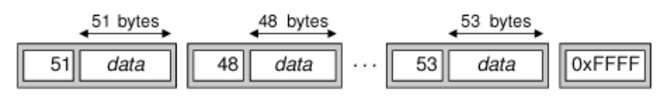

# 15. 网络

<!-- @import "[TOC]" {cmd="toc" depthFrom=1 depthTo=6 orderedList=false} -->
<!-- code_chunk_output -->

- [15. 网络](#15-网络)
  - [写 TCP 客户/服务器应用程序](#写-tcp-客户服务器应用程序)
    - [Trip Planner](#trip-planner)
  - [Link](#link)

<!-- /code_chunk_output -->

Qt 提供了 [QFtp](https://doc.qt.io/archives/qt-4.8/qftp.html) 与 [QHttp](https://doc.qt.io/archives/qt-4.8/qhttp.html)

注: QFtp 和 QHttp 是 Qt4 的库，Qt 5 已不再支持这两个类，可改为使用 [QNetworkAccessManager](https://doc.qt.io/qt-5/qnetworkaccessmanager.html) ；

[QHttp in not available in Qt5](https://stackoverflow.com/questions/26180311/qhttp-in-not-available-in-qt5)

Qt 还提供了较低级的 [QTcpSocket](https://doc.qt.io/qt-5/qtcpsocket.html) 和 [QUdpSocket](https://doc.qt.io/qt-5/qudpsocket.html)。 若要创建服务器应用程序，还需要 [QTcpServer](https://doc.qt.io/qt-5/qtcpserver.html) 来处理引入的 TCP 连接。我们可以使用 [QSslSocket](https://doc.qt.io/qt-5/qsslsocket.html) 代替 QTcpSocket 来建立安全的 SSL/TLS 连接。


## 写 TCP 客户/服务器应用程序

QTcpSocket 和 QTcpServer 类可以用来实现 TCP 客户端和服务器。

TCP 是一个基于流的协议。对于应用程序，数据表现为一个长长的流，而不是一个大的平面文件。在 TCP 上建立的高层协议通常是基于行的或者基于块的。
* 基于行的协议把数据作为一行文本进行传输，每一数据行都以一个换行符结尾。
* 基于块的协议把数据作为二进制块来进行传输。每一数据块都是由一个大小字段及其包含的数据组成的。

QTcpSocket 可以使用 QDataStream 或者 QTextStream 来进行读取和写入。与从文件中读取相比，从网络上读取数据会有一个值得注意的差别：在使用 >> 操作符之前，必须确定已经从另一端接收了足够多的数据。如果没有接收到足够多的数据就使用 >> 操作符，通常会导致不确定的状态发生。

### Trip Planner
eg： Trip Planner,其使用了自定义的基于块的协议。


tripplanner.h:
```c++
#ifndef TRIPPLANNER_H
#define TRIPPLANNER_H

#include <QDialog>
#include <QTcpSocket>

#include "ui_tripplanner.h"

class QPushButton;

class TripPlanner : public QDialog, private Ui::TripPlanner
{
    Q_OBJECT

public:
    TripPlanner(QWidget * parent = 0);

private slots:
    void connectToServer();
    void sendRequest();
    void updateTableWidget();
    void stopSearch();
    void connectionClosedByServer();
    void error();

private:
    void closeConnection();

    QPushButton * searchButton;
    QPushButton * stopButton;
    QTcpSocket tcpSocket;
    // 在解析从服务器接收的数据块时，则会使用到 nextBlockSize;
    quint16 nextBlockSize;
};

#endif
```

tripplanner.cpp:
```c++
#include <QtWidgets>
#include <QtNetwork>

#include "tripplanner.h"

TripPlanner::TripPlanner(QWidget *parent)
    : QDialog(parent)
{
    setupUi(this);

    searchButton = buttonBox->addButton(tr("&Search"),
                                        QDialogButtonBox::ActionRole);
    stopButton = buttonBox->addButton(tr("S&top"),
                                      QDialogButtonBox::ActionRole);
    stopButton->setEnabled(false);
    buttonBox->button(QDialogButtonBox::Close)->setText(tr("&Quit"));

    QDateTime dateTime = QDateTime::currentDateTime();
    dateEdit->setDate(dateTime.date());
    timeEdit->setTime(QTime(dateTime.time().hour(), 0));

    progressBar->hide();
    progressBar->setSizePolicy(QSizePolicy::Preferred,
                               QSizePolicy::Ignored);

    tableWidget->verticalHeader()->hide();
    tableWidget->setEditTriggers(QAbstractItemView::NoEditTriggers);

    connect(searchButton, SIGNAL(clicked()),
            this, SLOT(connectToServer()));
    connect(stopButton, SIGNAL(clicked()), this, SLOT(stopSearch()));
    connect(buttonBox, SIGNAL(rejected()), this, SLOT(reject()));

    connect(&tcpSocket, SIGNAL(connected()), this, SLOT(sendRequest()));
    connect(&tcpSocket, SIGNAL(disconnected()),
            this, SLOT(connectionClosedByServer()));
    connect(&tcpSocket, SIGNAL(readyRead()),
            this, SLOT(updateTableWidget()));
    connect(&tcpSocket, SIGNAL(error(QAbstractSocket::SocketError)),
            this, SLOT(error()));
}

void TripPlanner::connectToServer()
{
  // connectToHost() 调用是异步的，它总是立即返回。连接通常会在稍后建立。
  //当连接建立起来并运行时，QTcpSocket 对象发射 connected() 信号；
  //如果连接失败，QTcpSocket 对象会发射 error(QAbstractSocket::SocketError) 信号
#if 1
    tcpSocket.connectToHost(QHostAddress::LocalHost, 6178);
#else
    tcpSocket.connectToHost("tripserver.zugbahn.de", 6178);
#endif

    tableWidget->setRowCount(0);
    searchButton->setEnabled(false);
    stopButton->setEnabled(true);
    statusLabel->setText(tr("Connecting to server..."));
    progressBar->show();

    nextBlockSize = 0;
}

void TripPlanner::sendRequest()
{
    QByteArray block;
    QDataStream out(&block, QIODevice::WriteOnly);
    out.setVersion(QDataStream::Qt_4_3);
    //一开始写入 0 值作为块的大小，以及其他数据。
    out << quint16(0) << quint8('S') << fromComboBox->currentText()
        << toComboBox->currentText() << dateEdit->date()
        << timeEdit->time();

    if (departureRadioButton->isChecked()) {
        out << quint8('D');
    } else {
        out << quint8('A');
    }

    // 重新移动到字节数组的开始处
    out.device()->seek(0);
    // 利用数据块的实际尺寸值覆盖最初写入的 0 值
    out << quint16(block.size() - sizeof(quint16));
    // 向服务器发送这个块
    tcpSocket.write(block);

    statusLabel->setText(tr("Sending request..."));
}
```

请求的二进制数据块格式如下：

|   Type  |                     Desc                     |
|:-------:|:--------------------------------------------:|
| quint16 |  Block size in bytes (excluding this field)  |
|  quint8 |           Request type (always 'S')          |
| QString |                Departure city                |
| QString |                 Arrival city                 |
|  QDate  |                Date of travel                |
|  QTime  |          Approximate time of travel          |
|  quint8 | Time is for departure ('D') or arrival ('A') |


```c++

// 该函数被连接到 QTcpSocket 的 readyRead() 信号
// ，只要 QTcpSocket 已经从服务器收到新数据，就会发射该信号
void TripPlanner::updateTableWidget()
{
    QDataStream in(&tcpSocket);
    in.setVersion(QDataStream::Qt_4_3);

    // forever 展开为 for(;;)
    forever {
        int row = tableWidget->rowCount();

        if (nextBlockSize == 0) {
            if (tcpSocket.bytesAvailable() < sizeof(quint16))
                break;
            in >> nextBlockSize;
        }

        if (nextBlockSize == 0xFFFF) {
            closeConnection();
            statusLabel->setText(tr("Found %1 trip(s)").arg(row));
            break;
        }

        // 查看是否有块的容量大小这么多字节可以读取；
        // 如果没有，就先在这里停止。
        // 当有更多数据可以读取的时候，readyRead()
        // 信号将会被再次发射，然后就可以再次尝试读取。
        if (tcpSocket.bytesAvailable() < nextBlockSize)
            break;

        // 一旦确认一个完整的块已经被读取到，就可以在 QDataStream 上安全地使用
        //  >> 操作符以提取一个旅行相关的信息
        QDate date;
        QTime departureTime;
        QTime arrivalTime;
        quint16 duration;
        quint8 changes;
        QString trainType;

        in >> date >> departureTime >> duration >> changes >> trainType;
        arrivalTime = departureTime.addSecs(duration * 60);

        tableWidget->setRowCount(row + 1);

        QStringList fields;
        fields << date.toString(Qt::LocalDate)
               << departureTime.toString(tr("hh:mm"))
               << arrivalTime.toString(tr("hh:mm"))
               << tr("%1 hr %2 min").arg(duration / 60)
                                    .arg(duration % 60)
               << QString::number(changes)
               << trainType;
        for (int i = 0; i < fields.count(); ++i)
            tableWidget->setItem(row, i,
                                 new QTableWidgetItem(fields[i]));

        // 重新将 nextBlockSize 变量设置为 0
        // ,以表示下一个块的大小是未知的并且需要读取
        nextBlockSize = 0;
    }
}
```
每一个匹配的旅行都作为一个单独的块发送，并且每一个块的开始都是块的大小尺寸值。这类数据块流如图所示：



因为我们不需要每次从服务器得到一整个块的数据，所以 forever 是循环是非常有必要的。我们也许只是收到一个完整的块、一个块的一部分、一个块和一个块的一部分，甚至还可能一次收到所有的块数据。

服务器使用一个大小为 0xFFFF 的值来表示没有更多的数据可以接收，所以如果读取到该值，就表明已经读取到数据块的末尾了。

从服务器上接收的块具有如下格式：

| Data type |                    Desc                    |
|:---------:|:------------------------------------------:|
|  quint16  | Block size in bytes (excluding this field) |
|   QDate   |               Departure date               |
|   QTime   |               Departure time               |
|  quint16  |            Duration (in minutes)           |
|   quint8  |              Number of changes             |
|  QString  |                 Train type                 |

```c++

void TripPlanner::stopSearch()
{
    statusLabel->setText(tr("Search stopped"));
    closeConnection();
}

// 被连接到 QTcpSocket 的 disconnected() 信号。
void TripPlanner::connectionClosedByServer()
{
    // 如果服务器关闭这个连接且我们还没有收到 0xFFFF 数据终止符，
    // 就告诉用户有一个错误发生了。
    if (nextBlockSize != 0xFFFF)
        statusLabel->setText(tr("Error: Connection closed by server"));
    closeConnection();
}

// 被连接到 QTcpSocket 的 error ( QAbstractSocket::SocketError) 信号
void TripPlanner::error()
{
    statusLabel->setText(tcpSocket.errorString());
    closeConnection();
}

void TripPlanner::closeConnection()
{
    tcpSocket.close();
    searchButton->setEnabled(true);
    stopButton->setEnabled(false);
    progressBar->hide();
}
```

main.cpp:
```c++
#include <QApplication>

#include "tripplanner.h"

int main(int argc, char *argv[])
{
    QApplication app(argc, argv);
    TripPlanner tripPlanner;
    tripPlanner.show();
    return app.exec();
}
```

## Link
* [qt5-book-code/chap15/](https://github.com/mutse/qt5-book-code/tree/master/chap15)

[上一级](README.md)
[上一篇](14_multiThread.md)
[下一篇](16_xml.md)
