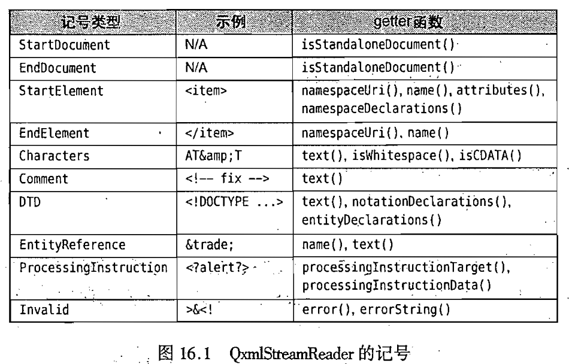
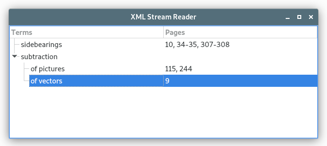
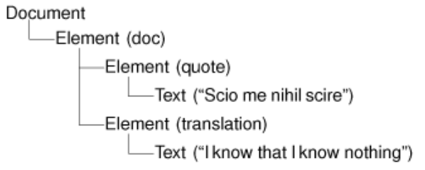
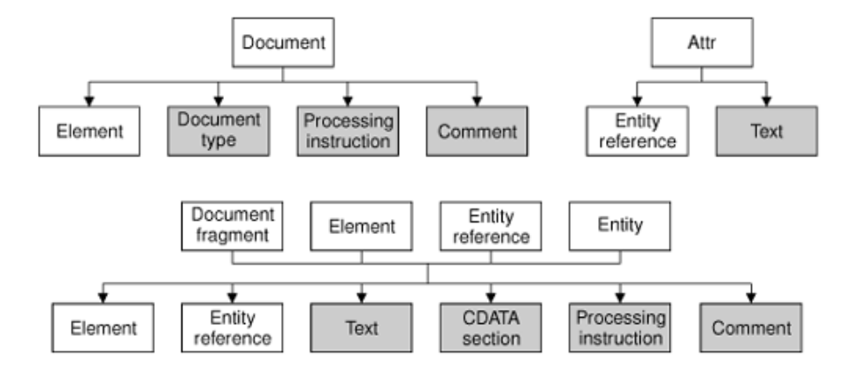
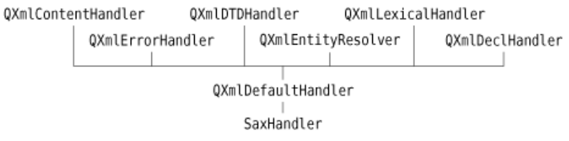

# 16. XML


<!-- @import "[TOC]" {cmd="toc" depthFrom=1 depthTo=6 orderedList=false} -->
<!-- code_chunk_output -->

- [16. XML](#16-xml)
  - [使用 QXmlStreamReader 读取 XML](#使用-qxmlstreamreader-读取-xml)
  - [用 DOM 读取 XML](#用-dom-读取-xml)
  - [使用 SAX 读取 XML](#使用-sax-读取-xml)
  - [写入 XML](#写入-xml)
    - [使用 QXmlStreamWriter](#使用-qxmlstreamwriter)
    - [DOM](#dom)
    - [手动生成](#手动生成)
  - [Link](#link)

<!-- /code_chunk_output -->

XML(可扩展标记语言)是普遍用户数据交换和数据存储的一种多用途文本文件格式。它的语法规则与 HTML 相似，不过 XML 是一种用于语言分析的语言，它并没有要求专门的标记符、属性或者条目。HTML 的 XML 兼容版称为 XHTML 。

[XML Tutorial](https://www.w3schools.com/xml/default.asp)

对于比较流行的 SVG （可标量化矢量图形） XML 格式， [QtSvg](https://doc.qt.io/qt-5/qtsvg-index.html) 模块提供了可用于载入并呈现 SVG 图像的类。对于使用 MathML(数学标记语言)XML 格式的绘制文档，可以使用 Qt Solutions 中的 [QtMmlWidget](https://docs.huihoo.com/qt/solutions/4/qtmmlwidget/qtmmlwidget.html).

[SVG Tutorial](https://www.w3schools.com/graphics/svg_intro.asp)

对于一般的 XML 数据处理，Qt 提供了 [QtXml](https://doc.qt.io/qt-5/qtxml-index.html) 模块，这是本章的主题。
QtXml 模块提供了三种截然不同的应用程序编程接口来读取 XML 文档：
* [QXmlStreamReader](https://doc.qt.io/qt-5/qxmlstreamreader.html) 是一个用于读取格式良好的 XML 文档的快速解析器。
* DOM(文档对象模型)把 XML 文档转换为应用程序可以遍历的树形结构。
* SAX(XML 简单应用程序编程接口)通过虚拟函数直接向应用程序报告“解析事件”。

QXmlStreamReader 类最快且最易于使用，它同时还提供了与其他 Qt 兼容的应用程序编程接口。它很适用于编写单通解析器。DOM 的主要优点是它能以任意顺序遍历 XML 文档的树形表示，同时可以实现多通解析算法。有一些应用程序甚至使用 DOM 树作为它们的基本数据结构。SAX 则因为一些历史原因而被得以沿用至今，使用 QXmlStreamReader 通常会有更加简单高效的编码。

对于 XML 文件的写入，Qt 也提供了三种可用的方法：
* 使用 [QXmlStreamWriter](https://doc.qt.io/qt-5/qxmlstreamwriter.html)
* 在内存中以 DOM 树的结构表示数据，并要求这个树型结构将自己写入到文件中
* 手动生成 XML

使用 QXmlStreamWriter 是目前最简单易行的方式，同时它也比手动生成 XML 文档更加可靠。使用 DOM 生成 XML 的方法，在 DOM 树已作为应用程序的基本数据结构时才真正有意义。

## 使用 QXmlStreamReader 读取 XML
因为解析器的工作能力是逐渐递增的，所以它尤其适用于诸如查找 XML 文档中一个给定标记符出现的次数、读取内存容纳不了的特大文件、组装定制的数据结构以反映 XML 文档的内容等。

QXmlStreamReader 解析器根据记号([token](https://doc.qt.io/qt-5/qxmlstreamreader.html#TokenType-enum))工作。每次只要调用 readNext() 函数，下一个记号就会被读取并变成当前的记号。当前记号的属性取决于记号的类型，可以使用表格列出的 getter 函数读取当前记号。



eg:
```xml
<doc>
  <quote>Einmal ist keinmal</quote>
</doc>
```

如果解析这个文档，则 readNext() 每调用一次都将生成一个新标记，若使用 getter 函数还会获得额外的信息：
```highLight
StartDocument
StartElement (name() == "doc")
StartElement (name() == "quote")
Characters (text() == "Einmal ist keinmal")
EndElement (name() == "quote")
EndElement (name() == "doc")
EndDocument
```

每次调用 readNext() 后，都可以使用 isStartElement()、isCharacters() 及类似的函数或者仅仅用 tokenType() 来测试当前记号的类型。

eg:使用 QXmlStreamReader 解析一个 XML 并在 QTreeWidget 显示其内容。所解析的是那种具有书刊索引目录且包含索引条目和子条目的文档格式。



```xml
<?xml version="1.0"?>
  <bookindex>
    <entry term="sidebearings">
      <page>10</page>
      <page>34-35</page>
      <page>307-308</page>
    </entry>
    <entry term="subtraction">
      <entry term="of pictures">
        <page>115</page>
        <page>244</page>
      </entry>
      <entry term="of vectors">
        <page>9</page>
      </entry>
    </entry>
  </bookindex>
```

main.cpp:
```c++
#include <QtWidgets>
#include <iostream>

#include "xmlstreamreader.h"

int main(int argc, char *argv[])
{
    QApplication app(argc, argv);
    QStringList args = QApplication::arguments();

    if (args.count() < 2) {
        std::cerr << "Usage: xmlstreamreader file1.xml..."
                  << std::endl;
        return 1;
    }

    QStringList labels;
    labels << QObject::tr("Terms") << QObject::tr("Pages");

    QTreeWidget treeWidget;
    treeWidget.setHeaderLabels(labels);
    treeWidget.header()->setSectionResizeMode(QHeaderView::Stretch);
    treeWidget.setWindowTitle(QObject::tr("XML Stream Reader"));
    treeWidget.show();

    XmlStreamReader reader(&treeWidget);
    for (int i = 1; i < args.count(); ++i)
        reader.readFile(args[i]);

    return app.exec();
}
```


xmlstreamreader.h:
```c++
#ifndef XMLSTREAMREADER_H
#define XMLSTREAMREADER_H

#include <QXmlStreamReader>

QT_BEGIN_NAMESPACE
class QTreeWidget;
class QTreeWidgetItem;
QT_END_NAMESPACE

class XmlStreamReader
{
public:
    XmlStreamReader(QTreeWidget * tree);

    bool readFile(const QString &fileName);

private:
    // 解析一个含有 0 或 0 个以上 <entry> 元素的
    // <bookindex> ... </bookindex> 元素
    void readBookindexElement();
    // 解析一个含有 0 个或者 0 个以上 <page> 元素的
    // <entry> ... </entry> 元素，以及嵌套任意层次的含有 0 或 0 个以上 <entry> 元素
    void readEntryElement(QTreeWidgetItem * parent);
    // 解析一个 <page> .. </page> 元素
    void readPageElement(QTreeWidgetItem * parent);
    // 跳过不能识别的元素
    void skipUnknownElement();

    QTreeWidget * treeWidget;
    QXmlStreamReader reader;
};

#endif
```

xmlstreamreader.cpp:
```c++
#include <QtWidgets>
#include <QtXml>
#include <iostream>

#include "xmlstreamreader.h"

XmlStreamReader::XmlStreamReader(QTreeWidget *tree)
{
    treeWidget = tree;
}

bool XmlStreamReader::readFile(const QString &fileName)
{
    QFile file(fileName);
    if (!file.open(QFile::ReadOnly | QFile::Text)) {
        std::cerr << "Error: Cannot read file " << qPrintable(fileName)
                  << ": " << qPrintable(file.errorString())
                  << std::endl;
        return false;
    }

    // 设置 QXmlStreamReader 的输入设备
    reader.setDevice(&file);

    reader.readNext();
    while (!reader.atEnd()) {
        if (reader.isStartElement()) {
            if (reader.name() == "bookindex") {
                readBookindexElement();
            } else {
                // 给出出错信息。下一次（在 while 循环条件下）调用 atEnd() 时，它将返还 true 值。
                // 这就确保了解析过程可以在遇到错误时能尽快停止
                reader.raiseError(QObject::tr("Not a bookindex file"));
            }
        } else {
            reader.readNext();
        }
    }

    // 当在书刊索引文件中检测到有错误时，也会立即返回一个类似的出错信息。
    // 其实，使用 raiseError() 通常会更加方便
    // ，因为它对低级的 XML 解析错误和与应用程序相关的错误使用了相同的错误报告机制
    //，而这些低级的 XML 解析错误会在 QXmlStreamReader 运行到无效的 XML 时就自动出现。

    file.close();
    if (reader.hasError()) {
        std::cerr << "Error: Failed to parse file "
                  << qPrintable(fileName) << ": "
                  << qPrintable(reader.errorString()) << std::endl;
        return false;
    } else if (file.error() != QFile::NoError) {
        std::cerr << "Error: Cannot read file " << qPrintable(fileName)
                  << ": " << qPrintable(file.errorString())
                  << std::endl;
        return false;
    }
    return true;
}

void XmlStreamReader::readBookindexElement()
{
    reader.readNext();
    while (!reader.atEnd()) {
        // 如果读取到了关闭标签，那么它只可能是 </bookindex> 标签
        //，否则 QXmlStreamReader 早就已经报告出错了
        (UnexpectedElementError)。
        if (reader.isEndElement()) {
            reader.readNext();
            break;
        }

        if (reader.isStartElement()) {
            if (reader.name() == "entry") {
                readEntryElement(treeWidget->invisibleRootItem());
            } else {
                skipUnknownElement();
            }
        } else {
            reader.readNext();
        }
    }
}

void XmlStreamReader::readEntryElement(QTreeWidgetItem *parent)
{
    QTreeWidgetItem * item = new QTreeWidgetItem(parent);
    item->setText(0, reader.attributes().value("term").toString());

    reader.readNext();
    while (!reader.atEnd()) {
        if (reader.isEndElement()) {
            reader.readNext();
            break;
        }

        if (reader.isStartElement()) {
            if (reader.name() == "entry") {
                readEntryElement(item);
            } else if (reader.name() == "page") {
                readPageElement(item);
            } else {
                skipUnknownElement();
            }
        } else {
            reader.readNext();
        }
    }
}

void XmlStreamReader::readPageElement(QTreeWidgetItem *parent)
{
    QString page = reader.readElementText();
    if (reader.isEndElement())
        reader.readNext();

    QString allPages = parent->text(1);
    if (!allPages.isEmpty())
        allPages += ", ";
    allPages += page;
    parent->setText(1, allPages);
}

// 当遇到未知的标签时，将继续读取，直到读取到也将跳过的未知未知元素的关闭标签为止。
// 这意味着我们将跳过那些具有良好形式但却无法识别的元素，并从 XML 文件中读取尽可能多的可识别的数据。
void XmlStreamReader::skipUnknownElement()
{
    reader.readNext();
    while (!reader.atEnd()) {
        if (reader.isEndElement()) {
            reader.readNext();
            break;
        }

        if (reader.isStartElement()) {
            skipUnknownElement();
        } else {
            reader.readNext();
        }
    }
}

```

这里给出的实例可以作为类似 XML 向下递归解析器的基础。然而，有时候实现这样一个解析器可能是相当棘手的，如果没有调用 readNext() 或者在不恰当的地方调用。一些程序员通过在代码中使用断言(assertion) 来强调这个问题。例如，在 readBookindexElement() 的开头，我们可以加上一行代码：
```c++
Q_ASSERT(reader.isStartElement() && "bookindex"  == reader.name);
```
也可以爱 readEntryElement() 和 readPageElement() 函数中使用类似的断言。对于 skipUnknownElement(),我们将仅声明存在一个开始元素。

QXmlStreamReader 可以从包括 QFile QBuffer QProcess 和 QTcpSocket 的任意 QIODevice 中获得输入。一些输入数据源可能无法在解析器需要的时候提供其所需要的数据，例如由于网络等待时间所造成。但在这种情况下仍可使用 QXmlStreamReader 。可参考 [Incremental Parsing](https://doc.qt.io/qt-5/qxmlstreamreader.html#incremental-parsing).

在这个应用程序中使用的 QXmlStreamReader 类是 QtXml 库中的一部分。如果想要建立应用程序和 QtXml 库的关联，必须在 .pro 文件中加入如下一行命令：
```c++
  QT += xml
```

## 用 DOM 读取 XML

DOM 是一种解析 XML 文档的标准应用程序编程接口。Qt 提供了一套用于读取、操作和编写 XML 文档的非验证型二级 DOM 实现。

DOM 把 XML 文件表示成内存中的一颗树 。我们可以按需要遍历这个 DOM 树，也可以修改这个树并把它作为 XML 文件保存到磁盘中。

```xml
<doc>
  <quote>Scio me nihil scire</quote>
  <translation>I know that I know nothing</translation>
</doc>
```

它对应如下所示的 DOM 树：



这个 DOM 树包含不同类型的节点。例如，Element 节点对应打开标签以及与它匹配的关闭标签。在这两个标签之间的内容则作为这个 Element 节点的子节点出现。在 Qt 中，节点类型（和其他所有与 DOM 有关的类一样）具有一个 QDom 前缀。因此， [QDomElement](https://doc.qt.io/qt-5/qdomelement.html) 就代表一个  Element 节点，而 [QDomText](https://doc.qt.io/qt-5/qdomtext.html) 就代表一个 Text 节点。

不同类型的节点可以具有不同种类的子节点。例如，一个 Element 节点可以包含其他 Element 节点，也可以包含 EntityReference、 Text 、 CDATASection 、 ProcessingInstruction 以及 Comment 节点。

下图给出了节点可以包含在的子节点的种类。图中显示为灰色的节点则不能拥有它自己的子节点。



为了演示如何使用 DOM 读取 XML 文件，我们将为前一节中提到的书刊索引文件格式编写一个解析器。

domparse.h
```c++
#ifndef DOMPARSER_H
#define DOMPARSER_H

QT_BEGIN_NAMESPACE
class QDomElement;
class QString;
class QTreeWidget;
class QTreeWidgetItem;
QT_END_NAMESPACE

class DomParser
{
public:
    DomParser(QTreeWidget * tree);

    bool readFile(const QString &fileName);

private:
    void parseBookindexElement(const QDomElement &element);
    void parseEntryElement(const QDomElement &element,
                           QTreeWidgetItem * parent);
    void parsePageElement(const QDomElement &element,
                          QTreeWidgetItem * parent);

    QTreeWidget * treeWidget;
};

#endif
```

[An Introduction to Qt XML Namespaces](https://doc.qt.io/qt-5/xml-namespaces.html)

domparse.cpp:
```c++
#include <QtWidgets>
#include <QtXml>
#include <iostream>

#include "domparser.h"

DomParser::DomParser(QTreeWidget *tree)
{
    treeWidget = tree;
}

bool DomParser::readFile(const QString &fileName)
{
    QFile file(fileName);
    if (!file.open(QFile::ReadOnly | QFile::Text)) {
        std::cerr << "Error: Cannot read file " << qPrintable(fileName)
                  << ": " << qPrintable(file.errorString())
                  << std::endl;
        return false;
    }

    QString errorStr;
    int errorLine;
    int errorColumn;

    QDomDocument doc;
    // 当对 DOM 文档调用 setContent() 函数时，由 QIODevice 提供的整个 XML 文档将被读取并解析。
    // 如果该文档还未打开，setContent() 函数将自动打开设备。
    // setContent() 的false 参数将禁用命名空间的处理。
    if (!doc.setContent(&file, false, &errorStr, &errorLine,
                        &errorColumn)) {
        std::cerr << "Error: Parse error at line " << errorLine << ", "
                  << "column " << errorColumn << ": "
                  << qPrintable(errorStr) << std::endl;
        return false;
    }

    // 调用 documentElement() 获得它唯一的 QDomElement 子对象，同时检查它是否为 <bookindex> 元素
    QDomElement root = doc.documentElement();
    if (root.tagName() != "bookindex") {
        std::cerr << "Error: Not a bookindex file" << std::endl;
        return false;
    }

    parseBookindexElement(root);
    return true;
}

// 使用向下递归的方法实现
void DomParser::parseBookindexElement(const QDomElement &element)
{
    QDomNode child = element.firstChild();
    while (!child.isNull()) {
        // QDomNode 类可以存储任何类型的节点。如果想要进一步处理一个节点，首先必须把它转换为正确的数据类型
        // 在这个实例中，我们仅仅关心 Element 节点，所以对 QDomNode 调用 toElement() 以把它转换成
        // QDomElement,然后调用 tagName() 来取得元素的标签名称
        //如果节点不是 Element 类型，那么 toElement() 函数就返回一个空 QDomElement 对象和一个空的标签

        if (child.toElement().tagName() == "entry")
            parseEntryElement(child.toElement(),
                              treeWidget->invisibleRootItem());
        child = child.nextSibling();
    }
}

void DomParser::parseEntryElement(const QDomElement &element,
                                  QTreeWidgetItem *parent)
{
    QTreeWidgetItem * item = new QTreeWidgetItem(parent);
    item->setText(0, element.attribute("term"));

    QDomNode child = element.firstChild();
    while (!child.isNull()) {
        if (child.toElement().tagName() == "entry") {
            parseEntryElement(child.toElement(), item);
        } else if (child.toElement().tagName() == "page") {
            parsePageElement(child.toElement(), item);
        }
        child = child.nextSibling();
    }
}

void DomParser::parsePageElement(const QDomElement &element,
                                 QTreeWidgetItem *parent)
{
    QString page = element.text();
    QString allPages = parent->text(1);
    if (!allPages.isEmpty())
        allPages += ", ";
    allPages += page;
    parent->setText(1, allPages);
}

```

main.cpp:
```c++
#include <QtWidgets>
#include <iostream>

#include "domparser.h"

int main(int argc, char *argv[])
{
    QApplication app(argc, argv);
    QStringList args = QApplication::arguments();

    if (args.count() < 2) {
        std::cerr << "Usage: domparser file1.xml..." << std::endl;
        return 1;
    }

    QStringList labels;
    labels << QObject::tr("Terms") << QObject::tr("Pages");

    QTreeWidget treeWidget;
    treeWidget.setHeaderLabels(labels);
    treeWidget.header()->setSectionResizeMode(QHeaderView::Stretch);
    treeWidget.setWindowTitle(QObject::tr("DOM Parser"));
    treeWidget.show();

    DomParser parser(&treeWidget);
    for (int i = 1; i < args.count(); ++i)
        parser.readFile(args[i]);

    return app.exec();
}
```

## 使用 SAX 读取 XML
SAX 事实上是公共领域中一种用于读取 XML 文档的标准应用程序编程接口。Qt 的 SAX 类是对基于 SAX2 的 Java 实现的模拟，只是在命名上有点不符合 Qt 的惯例。与 DOM 相比，SAX 更加底层但通常也更加快速。然而，由于在本章前面部分曾介绍过的 [QXmlSimpleReader](https://doc.qt.io/qt-5/qxmlsimplereader.html) 类提供了一个更接近 Qt 风格的应用程序编程接口，且比 SAX 解析器更加快速，因此 SAX 解析器的主要用户就是将使用 SAX 应用程序编程接口的代码导入 Qt 中。[SAX 详细信息](http://www.saxproject.org)

Qt 提供了一个名为 QXmlSimpleReader 的基于 SAX 的非验证型 XML 解析器。这个解析器能够识别具有良好格式的 XML 文档且支持 XML 文档的命名空间。当这个解析器遍历文档时，它调用注册的处理函数中的虚拟函数来表明解析事件。（这些 “解析事件” 和 Qt 事件并无关联，就像按键事件和鼠标事件一样）。我们假设这个解析器正在解析如下的 XML 文档：
```xml
<doc>
  <quote>Gnothi seauton</quote>
</doc>
```
解析器将会调用如下这些解析事件处理函数：
```c++
startDocument()
startElement("doc")
startElement("quote")
characters("Gnothi seauton")
endElement("quote")
endElement("doc")
endDocument()
```

上述的这些函数都是在 [QXmlContentHandler](https://doc.qt.io/qt-5/qxmlcontenthandler.html) 中声明过的。为了简单，我们省略了 StartElement() 和 EndElement() 中的一些参数。

QXmlContentHandler 只是可以和 QXmlSimpleReader 协作使用的众多处理程序类之一。其他的还有
* [QXmlEntityResolver](https://doc.qt.io/qt-5/qxmlentityresolver.html)
* [QXmlDTDHandler](https://doc.qt.io/qt-5/qxmldtdhandler.html)
* [QXmlErrorHandler](https://doc.qt.io/qt-5/qxmlerrorhandler.html)
* [QXmlDeclHandler](https://doc.qt.io/qt-5/qxmldeclhandler.html)
* [QXmlLexicalHandler](https://doc.qt.io/qt-5/qxmllexicalhandler.html)

这些类仅仅声明纯虚函数并且给出不同类型的解析事件的相关信息。对于绝大多数应用程序来说，只有 QXmlContentHandler 和 QXmlErrorHandler 是必要的。我们用到的类的层级关系如图所示



为了方便，Qt 还提供了 [QXmlDefaultHandler](https://doc.qt.io/qt-5/qxmldefaulthandler.html)。含有很多抽象处理程序类和一个具体子类的这种设计构思，在 Qt 中并不常用，这里他被用来密切关注模型的 Java 实现。

与使用 QXmlStreamReader 或者 DOM 应用程序编程接口相比，使用 SAX 应用编程接口最显著的区别在于：SAX 应用程序编程接口需要我们利用成员变量手动追踪解析器的状态，而其他两种采用向下递归的方法则不需要。

我们使用 SAX 重新实现解析前面部分提到的书刊索引文件格式的 xml 文档。

saxhandler.h:
```c++
#ifndef SAXHANDLER_H
#define SAXHANDLER_H

#include <QXmlDefaultHandler>

QT_BEGIN_NAMESPACE
class QTreeWidget;
class QTreeWidgetItem;
QT_END_NAMESPACE

class SaxHandler : public QXmlDefaultHandler
{
public:
    SaxHandler(QTreeWidget * tree);

    bool readFile(const QString &fileName);

protected:
  bool startElement(const QString &namespaceURI,
                    const QString &localName,
                    const QString &qName,
                    const QXmlAttributes &attributes) override;
  bool endElement(const QString &namespaceURI,
                  const QString &localName,
                  const QString &qName) override;
  bool characters(const QString &str) override;
  bool fatalError(const QXmlParseException &exception) override;

private:
    QTreeWidget * treeWidget;
    QTreeWidgetItem * currentItem;
    QString currentText;
};

#endif
```

saxhandler.cpp:
```c++
#include <QtWidgets>
#include <iostream>

#include "saxhandler.h"

SaxHandler::SaxHandler(QTreeWidget *tree)
{
    treeWidget = tree;
}

bool SaxHandler::readFile(const QString &fileName)
{
    currentItem = 0;

    QFile file(fileName);
    QXmlInputSource inputSource(&file);
    QXmlSimpleReader reader;
    // 设置阅读器内容
    reader.setContentHandler(this);
    // 设置阅读器错误处理程序
    reader.setErrorHandler(this);
    // 我们传递一个 QXmlInputSource,而不是一个简单的 QFile 对象给 parse() 函数。
    //这个类打开并读取给定的文件（考虑了 <?xml?>声明中指定的任意字符编码）给定的文件
    //，同时它还提供了一个解析器读取文件的接口
    return reader.parse(inputSource);
}

// 当阅读器遇到一个新的打开标签时，就会调用 startElement() 函数。
// 第三个参数是标签的名称（或者更加准确的说，是它的“限定名”）。
// 第四个参数是属性列表。
bool SaxHandler::startElement(const QString & /* namespaceURI */,
                              const QString & /* localName */,
                              const QString &qName,
                              const QXmlAttributes &attributes)
{
    if (qName == "entry") {
        currentItem = new QTreeWidgetItem(currentItem ?
                currentItem : treeWidget->invisibleRootItem());
        currentItem->setText(0, attributes.value("term"));
    } else if (qName == "page") {
        currentText.clear();
    }

    // 最后，我们返回 true 值让 SAX 继续解析这个文件。如果想把那些未知的标签也
    //作为错误报告，这时就需要返回 false 值。然后可以在 QXmlDefaultHandler
    //中重新实现 errorString(),以返回一个适当的出错信息。
    return true;
}

// 调用该函数报告 XML 文档中的字符数据
bool SaxHandler::characters(const QString &str)
{
    currentText += str;
    return true;
}

// 当阅读器遇到一个关闭标签时，就会调用 endElement() 函数
bool SaxHandler::endElement(const QString & /* namespaceURI */,
                            const QString & /* localName */,
                            const QString &qName)
{
    if (qName == "entry") {
        currentItem = currentItem->parent();
    } else if (qName == "page") {
        if (currentItem) {
            QString allPages = currentItem->text(1);
            if (!allPages.isEmpty())
                allPages += ", ";
            allPages += currentText;
            currentItem->setText(1, allPages);
        }
    }
    return true;
}

// 当阅读器解析 XML 文件失败时，就会调用 fatalError() 函数。
bool SaxHandler::fatalError(const QXmlParseException &exception)
{
    // 输出错误信息
    std::cerr << "Parse error at line " << exception.lineNumber()
              << ", " << "column " << exception.columnNumber() << ": "
              << qPrintable(exception.message()) << std::endl;
    return false;
}
```


## 写入 XML

能读取 XML 文件的大多数应用程序也需要写入 XML 文件。一般来说，主要有三种生成 XML 文件的方法：
* 使用 [QXmlStreamWriter](https://doc.qt.io/qt-5/qxmlstreamwriter.html)
* 构建 DOM 树并对它调用 save()
* 手动生成 XML

实际上，这三种方法的选取通常与是否使用 QXmlStreamReader 、 DOM 或 SAX 来读取 XML 文档并无关系，尽管数据保留在 DOM 树中时直接保存这个 DOM 树是完全说得通的。

### 使用 QXmlStreamWriter

利用 [QXmlStreamWriter](https://doc.qt.io/qt-5/qxmlstreamwriter.html) 类来写入 XML 文件非常容易，因为它将时刻为我们关注那些特殊的转义字符。eg:
```c++
bool writeXml(const QString &fileName, QTreeWidget *treeWidget)
{
    QFile file(fileName);
    if (!file.open(QFile::WriteOnly | QFile::Text)) {
        std::cerr << "Error: Cannot write file "
                  << qPrintable(fileName) << ": "
                  << qPrintable(file.errorString()) << std::endl;
        return false;
    }

    QXmlStreamWriter xmlWriter(&file);
    // 开启自动格式编辑功能，XML 文档将以更友好易读的格式输出，
    // 在每一行都有明确显示数据递归结构的缩进。
    xmlWriter.setAutoFormatting(true);
    // 写入 XML 文档首行
    // <?xml version="1.0" encoding="UTF-8"?>
    xmlWriter.writeStartDocument();
    // 生成一个 “bookindex” 开始标签
    xmlWriter.writeStartElement("bookindex");
    for (int i = 0; i < treeWidget->topLevelItemCount(); ++i)
        writeIndexEntry(&xmlWriter, treeWidget->topLevelItem(i));
    xmlWriter.writeEndDocument();

    file.close();
    if (file.error()) {
        std::cerr << "Error: Cannot write file "
                  << qPrintable(fileName) << ": "
                  << qPrintable(file.errorString()) << std::endl;
        return false;
    }
    return true;
}

void writeIndexEntry(QXmlStreamWriter *xmlWriter, QTreeWidgetItem *item)
{
    xmlWriter->writeStartElement("entry");
    xmlWriter->writeAttribute("term", item->text(0));
    QString pageString = item->text(1);
    if (!pageString.isEmpty()) {
        QStringList pages = pageString.split(", ");
        foreach (QString page, pages)
            {
              // 调用 writeTextElement() 以及将标签名以及开始和结束标签之间
              // 的文本传递给 writeTextElement() 来实现。
              xmlWriter->writeTextElement("page", page);
          }
    }
    for (int i = 0; i < item->childCount(); ++i)
        writeIndexEntry(xmlWriter, item->child(i));
    xmlWriter->writeEndElement();
}
```

### DOM

使用 QXmlStreamReader 是写入文档最容易、最安全的方式，但如果已经在一个 DOM 树中有 XML 文档的话，则只需要在 QDomDocument 对象上调用 save() 函数并要求这个 DOM 树输出相关的 XML 即可。默认情况下，save() 使用 UTF-8 作为所生成文件的编码方式。我们可以通过为 DOM 树预先进行 <?xml?> 声明，而使用其他种类的编码方式，例如：
```xml
<?xml version="1.0" encoding="ISO-8859-1">
```

代码可以这样写：
```c++
const int Indent = 4;

QDomDocument doc;
...
QTextStream out(&file);
QDomNode xmlNode = doc.createProcessingInstruction(
  "xml","version=\"1.0\" encoding=\"ISO-8859-1\"");
  doc.insertBefore(xmlNode,doc.firstChild());

  doc.save(out,Indent);
```

从 Qt 4.3 开始，一个替代的方法就是利用 setCodec() 对 QTextStream 设置编码，并将 QDomNode::EncodingFromTextStream 作为第三个参数传递给 save().

### 手动生成

手动生成 XML 文件，我们可以使用 QTextStream 并且写入字符串，就像写入其他任何文本文件一样。最需要慎重对待的部分就是转义在文本和属性值中的特殊字符。Qt::escape() 函数可以转义 "<" 、 ">" 、 和 "&" 等特殊字符。eg：
```c++
QTextStream out(&file);
out.setCodec("UTF-8");
out << "<doc>\n"
    << "    <quote>" << Qt::escape(quoteText) << "</quote>\n"
    << "    <translation>" << Qt::escape(translationText)
    << "</translation>\n"
    << "</doc>\n";
```

当采用这样的方式生成 XML 文件时，除了必须写入正确的 <?xml?> 声明并设置正确的编码外，还必须记得对写入的文本进行转义。如果使用了属性值，还必须转义其中的单引号或双引号。不过，使用 QXmlStreamWriter 就简单得多了，因为它将为我们处理上述所需注意的一切。


## Link
* [qt5-book-code/chap16/](https://github.com/mutse/qt5-book-code/tree/master/chap16)

---
- [上一级](README.md)
- 上一篇 -> [15. 网络](15_network.md)
- 下一篇 -> [17. 提供在线帮助](17_onlineHelp.md)
