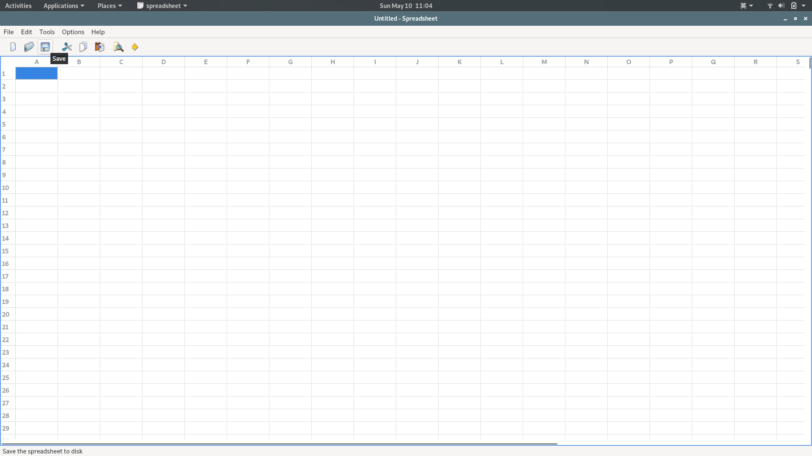
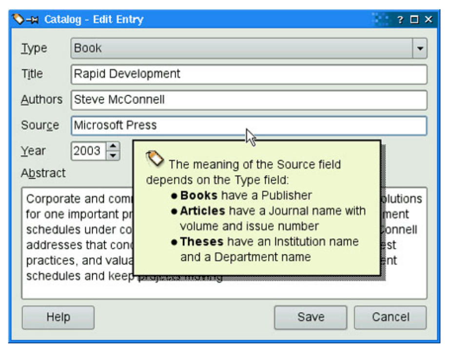

# 17. 提供在线帮助


<!-- @import "[TOC]" {cmd="toc" depthFrom=1 depthTo=6 orderedList=false} -->
<!-- code_chunk_output -->

- [17. 提供在线帮助](#17-提供在线帮助)
  - [工具提示、状态提示和 "What's This?"帮助](#工具提示-状态提示和-whats-this帮助)
  - [利用 Web 浏览器提供在线帮助](#利用-web-浏览器提供在线帮助)
  - [将 QTextBrowser 作为简单的帮助引擎](#将-qtextbrowser-作为简单的帮助引擎)
  - [使用 Qt Assistant 提供强大的在线帮助](#使用-qt-assistant-提供强大的在线帮助)

<!-- /code_chunk_output -->

绝大多数应用程序都为用户提供在线帮助。有一些帮助的内容是相当简短的，例如工具提示、状态提示和 “What's This?” 之类的帮助。Qt 自然都支持这类简单的帮助。其他帮助可以具有更多的扩展内容，例如包括很多页的文本。对于这种帮助，可以把 [QTextBrowser](https://doc.qt.io/qt-5/qtextbrowser.html) 作为一个简单的在线帮助浏览器来使用，也可以从应用程序调用 Qt Assistant 或者其他 HTML 浏览器。

## 工具提示、状态提示和 "What's This?"帮助
工具提示就是一小段文本，当鼠标在一个窗口部件上面停留一段事件后会显示。工具提示通常显示为黄色背景黑色文字，它的主要用途是为工具条按钮提供文本描述。

```c++
findButton->setToolTip(tr("Find nex"));

// or

newAction = new QAction(tr("&New"),this);
newAction->setToolTip(tr("New document"));
```

如果没有明确地设置工具提示，QAction 会自动使用这个动作的文本。

状态提示也是一小段描述性文本，通常会比工具提示长一点。当鼠标在工具条按钮或者菜单选项上停留一段时间时，状态提示将会出现在状态栏上。调用 setStatusTip() 可以为动作或窗口部件添加状态提示:
```c++
newAction->setStatusTip(tr("Create a new document"));
```

应用程序的工具提示和状态提示如下：



在某些情况下，如果能为窗口部件提供比工具提示和状态提示更多的信息，则是最好不过的了。例如，我们也许想为一个复杂对话框中的每一个字段提供说明性的文本，而不强制用户调用一个单独的帮助窗口。“What's This?”  模式是对这个问题的一个理想的解决方案。当窗口处于 “What's This?”  模式的时候，光标会变为的形式，而且用户可以在任何用户界面组件上单击来获得关于它的帮助文本。为了进入 “What's This?” 模式，用户即可以点击对话框标题栏（在 Windows 和 KDE中）中的 “？”按钮，也可以按下 Shift + F1 组合键。

eg:
```c++
dialog->setWhatsThis(tr(""
            "&nbsp;The meaning of the Source field depends "
            "on the Type field:"
            "<ul>"
            "<li><b>Books</b> have a Publisher"
            "<li><b>Articles</b> have a Journal name with "
            "volume and issue number"
            "<li><b>Theses</b> have an Institution name "
            "and a Department name"
            "</ul>"));  
```

可以使用 HTML 标签来对 “What's This?” 文本进行格式化。[Qt所支持的标签和属性](https://doc.qt.io/qt-5/richtext-html-subset.html).



当在动作上设置了 “What's This?” 文本，且用户在 “What's This?”  模式下单击这个菜单项或者工具栏按钮或者按下快捷键的时候，这个文本将会显示出来。当应用程序的主窗口的用户界面组件提供 “What's This?”  文本帮助时，通常的惯例是在 Help 菜单中提供一个 “What's This?”  选项以及一个对应的工具栏按钮。通过利用静态函数 [QWhatsThis::createAction()](https://doc.qt.io/qt-5/qwhatsthis.html#createAction) 创建一个 “What's This?” 动作并将它返回的动作添加到 Help 菜单和工具栏，就可以完成以上操作。 QWhatsThis 还提供了静态函数以有计划地进入和退出 “What's This?” 模式。

## 利用 Web 浏览器提供在线帮助

[Using a Web Browser to Provide Online Help](https://www.informit.com/articles/article.aspx?p=1405554&seqNum=2)

## 将 QTextBrowser 作为简单的帮助引擎

[Using QTextBrowser as a Simple Help Engine](https://www.informit.com/articles/article.aspx?p=1405554&seqNum=3)

## 使用 Qt Assistant 提供强大的在线帮助

[Using Qt Assistant for Powerful Online Help](https://www.informit.com/articles/article.aspx?p=1405554&seqNum=4)

[Qt Assistant Manual](https://doc.qt.io/qt-5/qtassistant-index.html)

除了使用 Web 浏览器、QTextBrowser或 Qt Assistant,还有一种方法就是使用与平台相关的方法来提供在线帮助。对于 Windows 应用程序，创建 [Windows HTML help](https://docs.microsoft.com/en-us/previous-versions/windows/desktop/htmlhelp/microsoft-html-help-1-4-sdk) 文件并且利用 Microsoft Internet Explorer 访问它们，也许是一种不错的选择。可以使用 Qt 的 QProcess 类或者 ActiveQt 框架来实现这一点。在 Mac OS X 系统上，Apple Help 也提供了与 Qt Assistant 相似的功能。


- [上一级](README.md)
- 上一篇 -> [16. XML](16_xml.md)
- 下一篇 -> [18. 国际化](18_unicode.md)
