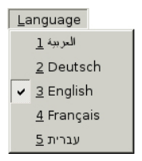
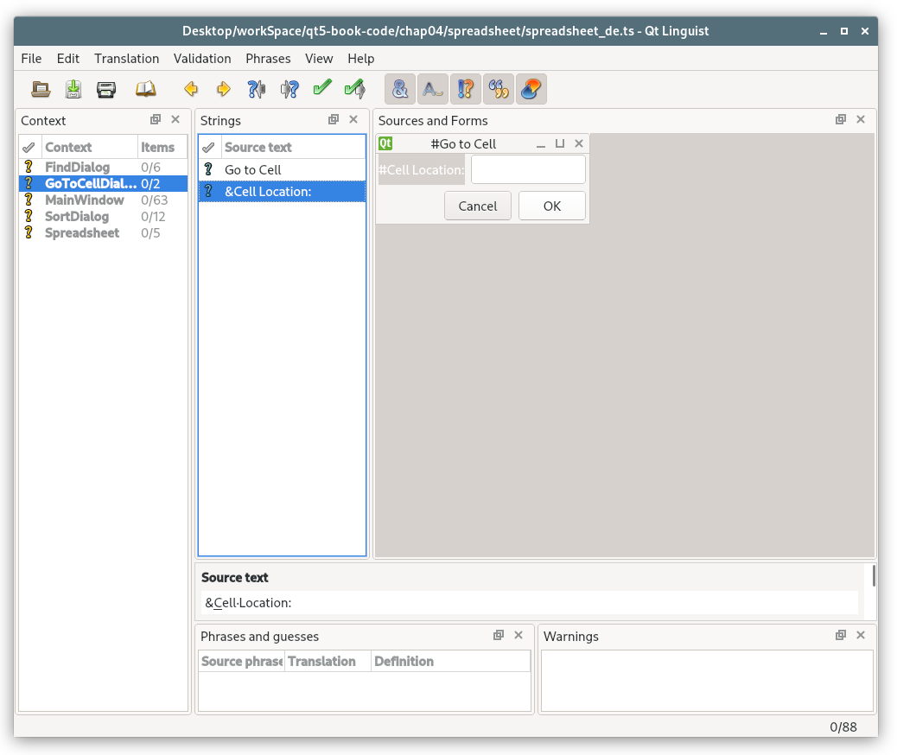

# 18. 国际化


<!-- @import "[TOC]" {cmd="toc" depthFrom=1 depthTo=6 orderedList=false} -->
<!-- code_chunk_output -->

- [18. 国际化](#18-国际化)
  - [使用 Unicode](#使用-unicode)
  - [让应用程序感知翻译](#让应用程序感知翻译)
    - [加载翻译文件](#加载翻译文件)
  - [动态切换语言](#动态切换语言)
  - [翻译应用程序](#翻译应用程序)
  - [一些常用的编码转换](#一些常用的编码转换)
  - [Link](#link)

<!-- /code_chunk_output -->

除了采用英语和许多欧洲语系中的拉丁字符之外，Qt 也为世界上其他的文字系统提供了广泛的支持：
* Qt 在整个应用程序编程接口及其内部都使用 Unicode。无论用户用于用户接口的是何种语言，应用程序都可以为所有的用户提供类似的支持。
* Qt 的文本引擎可以处理所有主要的非拉丁文文字系统，其中包括阿拉伯文、中文、西里尔文、希伯来文、日文、韩文、泰文和印度文。
* Qt 的布局引擎可以为从右到左的文本布局提供支持，比如对阿拉伯文和希伯来文的支持。
* 一些特定的语言在输入文本时要求使用特殊的输入法。比如像 QLineEdit 和 QTextEdit 这样的一些编辑器窗口部件，都可以与安装在用户系统中的任意输入法和谐地工作在一起。

通常情况下，只允许用户使用它们自己的本地语言输入文本是不够的，最好要让整个用户界面允许翻译才行。Qt 让这些变得非常简单：只需使用 tr(),并且使用 Qt 的支持工具为所需的语言准备相应的翻译文件即可。Qt 为翻译人员提供了 [Qt Linguist](https://doc.qt.io/qt-5/qtlinguist-index.html) 的图形用户界面工具。配上两个通常由开发人员运行的命令行语句 - lupdate 和 lrelease,Qt Linguist 就可以为翻译提供完美支持了。

对于大多数的应用程序，程序会在一开始启动的时候根据用户的本地设置载入所需的翻译文件。但是在少数情况下，对用户来说，要求程序在运行的时候根据也能切换语言，可能也是很有必要的。而利用 Qt,使这一切变得完全可能起来，虽然这的确还需要再做一些其他工作。在翻译文本的长度比原有文本的长度长的时候，也要多亏了 Qt 的布局系统，使得不同的用户接口部分会自动进行调整，从而可以为翻译文本腾出空间。


## 使用 Unicode
Unicode 是一种支持世界上绝大多数文字系统的字符编码标准。Unicode 最初的思想是在存储 Unicode 字符时使用 16 位而不是 8 位，这样它就可以大约具有 65000 个字符编码，而不是只有 256 个。 Unicode 在同样的编码位置以子集的形式包含了 ASCII 和 ISO 8859-1(Latin-1)。例如，字符 "A" 的 ASCII 、 Latin-1 编码和 Unicode 编码都是 0x41,而 字符 “？” 的 Latin-1 编码 和 Unicode 编码都是 0xD1.


Qt 中的 QString 类用于将字符串存储为 Unicode.在 QString 中的每一个字符都是一个 16 位 的 QChar ,而不是一个 8 位的 char。
```c++
str[0] = 'A';
// 等价于
str[0] = QChar(0x41);
```

如果源文件的编码格式是 Latin-1,那么指定 Latin-1 字符就非常简单：
```c++
str[0] = 'Ñ';
```
如果源文件中还使用了其他的编码格式，那么使用数字赋值的方式会更好些：
```c++
str[0] = QChar(0xD1);
```
我们可以使用任何一个 Unicode 字符的数字值来指定它。
```c++
str[0] = QChar(0x03A3);
str[0] = QChar(0x20AC);
```

[Unicode 所支持的所有字符的数值列表](https://www.unicode.org/standard/standard.html)。如果你很少需要非 Latin-1 的 Unicode 字符，在线查找这些字符就已经足够了。但是，为了在 Qt 程序中输入 Unicode 字符串，Qt 还是提供了很多简便的方法，正如我们在这一节的稍后部分将看到的那样。

使用 QChar 编程和使用 char 编程有一点点不同。为了获得一个 QChar 的数字值，可以对他调用 `unicode()` 。为了获得一个 QChar (作为一个 char)的 ASCII 或者 Latin-1 的值，则要求对他调用 `toLatin1()` 。对于那些非 Latin-1 的字符，`toLatin1()` 将会返回 "\0"。

如果我们知道一个程序中的所有字符都是 ASCII 字符，那么可以在 toLatin1() 的返回值上使用 `isalpha() 、 isdigit() 和 isspace()` 这样的标准 <cctype> 函数。然而，在执行这些操作使使用 QChar 的成员函数会是更好的方法，因为它们可用于任意的 Unicode 字符。QChar 提供的这些函数包括 `isPrint() isPunct() isSpace() isMark() isLetter() isNumber() isLetterOrNumber() isDigit() isSymbol() isLower() isUpper()` 。eg:
```c++
// 这个代码片段可以用于区分任意的大写或者小写格式的字母，包括 拉丁文、希腊文和西里尔文。
if (ch.isDigit() || ch.isUpper())
  ...
```

当读取和写入文本文件时，需要给予特殊的关注。文本文件可以使用很多种编码格式，并且通常很有可能需要从文本文件的内容来猜测它的编码格式。默认情况下， QTextStream 对于读取和写入通常都使用系统的本地 8 位 编码格式[这可以通过 [QTextCodec::codecForLocale()](https://doc.qt.io/qt-5/qtextcodec.html#codecForLocale) 函数获得]。对于美国和西欧的本地设置，这种做法通常获得的就是 Latin-1。

如果要设计自己的文件格式，并且希望能够读取和写入任意的 Unicode 字符，那么在开始写入 QTextStream 之前调用以下代码：
```c++
stream.setCodec("UTF-16");
stream.setGenerateByteOrderMark(true);
```

这些数据被保存为 UTF-16 ，这是一种每个字符都使用两个字节存储的格式，并且它会使用一个特殊的 16 位值（Unicode 字节序掩码，0xFFFE）作为前缀，用于识别该文件采用的是 Unicode 编码，它也用来存储格式是以高字节在前还是高字节在后。 UTF-16 格式和 QString 的内存表示形式一致，所以读取和写入 UTF-16 格式的 Unicode 字符串的速度非常块。另一方面，当我们把纯粹的 ASCII 数据保存为 UTF-16 格式的时候，总是会带来固有的开销，因为它存储每个字符的时候使用的是两个字节，而不是只用一个字节。

通过使用适当的 QTextCodec 来调用 `setCodec()` ，还可以指定其他的编码方法。QTextCodec 是一个可以在 Unicode 和给定编码格式之间进行转换的对象。Qt 在很大范围的上下文关系上都使用了 QTextCodec。在 Qt 内部，把它们用于对字体、输入法、剪贴板、拖放和文件名的支持中。但是当我们编写 Qt 应用程序的时候，也可以使用它们。

当读取文本文件时，如果这个文件是以字节顺序标记(Byte Order Mark,BOM)开始的，那么 QTextStream 就会自动检测到 UTF-16。通过调用 `setAutoDetectUnicode(false)` ，可以关闭这一行为。如果假定数据不是以字节顺序标记开始的，那么在读取开始之前最好能够使用 "UTF-16" 先调用一下 `setCodec()`。

Unicode 完全支持的另外一种编码格式是 UTF-8 。对于 UTF-16,它的主要优点在于：它是 ASCII 的一个超集。位于  0x00 和 0x7F 范围之内的任何字符都被表示为一个单一字节。而其他字符，包括位于 0x7F 以上的 Latin-1 字符，则都使用多字节序列进行表示。对于以 ASCII 为主的文本，UTF-8 占用的空间约为 UTF-16 占用空间的一半。为了在 QTextStream 中使用 UTF-8 ,在读取和写入之前，可以以 "UTF-8" 作为编码格式的名字先调用一下 setCodec()。

如果我们总是希望忽略用户的本地设置而读取或者输出 Latin-1 字符，则可以把 QTextStream 的编码格式设置为 "ISO 8859-1"。例如：
```c++
QTextStream in(&file);
in.setCodec("ISO 8859-1");
```

一些文本格式会在文件头指明它们所使用的编码格式。这个文件头通常是普通的 ASCII 编码，这样可以确保不管用什么样的编码格式（这里我们假设它是 ASCII 的一个超集），都可以正确地读取这个文件。eg: XML 文件格式。XML 文件通常编码为 UTF-8 或者 UTF-16 。读取它们的适当方式是使用带 “UTF-8” 的 setCodec() 调用。如果格式是 UTF-16，QTextStream 将会自动检测到该格式并且进行自我调整。XML 文件的 <?xml?> 样式的文件头有时会包含一个 encoding 参数，eg：
```xml
<?xml version="1.0" encoding="EUC-KR"?>
```

由于 QTextStream 不允许在开始读取字符之后再改变这个编码格式，因此，考虑到显式编码的问题，正确读取文件的方法应当是使用适当的编码格式[可以使用 [QTextCodec::codecForName()](https://doc.qt.io/qt-5/qtextcodec.html#codecForName) 获得] 重新开始读取文件。对于 XML 的这种情况，可使用 Qt 的 XML 类避免自己处理编码格式。


QTextCodec 的另外一种用法是用于指明在源代码中出现的字符串的编码方式。假设有这样一个例子，有一个日本的程序员团队正在编写一个主要面向日本家庭市场的应用程序。这些程序员喜欢使用编码方式为 EUC-JP 或者 Shift-JIS 的文本编辑器编写它们的源代码。这样的编辑器可以让他们方便地输入日文字符，所以，它们就可以输入像下面这样的程序代码：
```c++
QPushButton *button = new QPushButton(tr("こんにちは"));
```
默认情况下，Qt 会把 tr() 的参数当作 Latin-1 。为了改变这一点，可以调用静态函数 [QTextCodec::setCodecForTr()](https://doc.qt.io/archives/qt-4.8/qtextcodec.html#setCodecForTr) [注：qt5 不再支持]

例如：
```c++
QTextCodec::setCodecForTr(QTextCodec::codecForName("EUC-JP"));
```

这个调用必须在第一次对 tr() 调用之前完成。通常，应当在  main() 函数中来完成它，并且是在创建完 QApplication 对象之后就马上来做这项工作。

而在程序中给定的其他字符串仍将会当作 Latin-1 字符串。如果程序员想在以上情况下也输入日文字符，则可以使用 QTextCodec 明确将它们转换成为 Unicode:
```c++

QString text = japaneseCodec->toUnicode("シーフード料理");
```
作为选择，当在 const char * 和 QString 之间进行转换的时候，可以通过调用 [QTextCodec::setCodecForCStrings()](https://doc.qt.io/archives/qt-4.8/qtextcodec.html#setCodecForCStrings) [注：qt5 不再支持] 来让 Qt 使用某种特殊的编解码器：
```c++
QTextCodec::setCodecForCStrings(QTextCodec::codecForName("EUC-JP"));
```

在 Qt 5 中要注意这个：
* [QTextCodec中的setCodecForTr等终于消失了 (Qt5)](https://blog.csdn.net/dbzhang800/article/details/7325698)

[Qt 所支持的编码方式](https://doc.qt.io/qt-5/qtextcodec.html#details)

对于列出的所有这些编码方式，QTextCodec::codecForName() 总是可以返回一个有效的指针。通过对 QTextCodec 的子类化，也可以支持其他类型的编码方式。

## 让应用程序感知翻译

如果想让应用程序能使用多种语言，必须做两件事情：
* 确保每一个用户可见的字符串都使用了 tr() 函数
* 在应用程序启动的时候，载入了一个翻译文件(.qm)

[tr()](https://doc.qt.io/qt-5/qobject.html#tr) 是定义在 QObject 中的一个静态函数，并且可以在任何一个定义了  Q_OBJECT 宏的子类中使用。在编写 QObject 子类的代码时，可以不拒泥于任何形式而直接调用 tr() 。如果有可以使用的翻译，tr() 调用就会返回其翻译；否则，就返回其原本的文本内容。在不是 QObject 的类中，可以这样使用 `QObject::tr()`,也可以使用 `Q_DECLARE_TR_FUNCTIONS()` 宏把 tr() 函数添加到该类中，就像第 8 章所做的那样。

为了准备翻译文件，必须运行 Qt 的 lupdate 工具。这个工具会提取出现在 tr() 调用中的所有字符串文字并且产生一些翻译文件，其中包含了所有这些准备要翻译的字符串。然后，这些文件就可以发送给某个翻译者，由其添加翻译内容。

tr() 调用一般具有如下语法格式：
```c++
Context::tr(sourceText,commnet);
```
这里的 Context 部分就是使用 Q_OBJECT 宏定义的 QObject 子类的名字。如果我们从正在使用的类的一个成员函数中调用了 tr()函数，那就不需要指定这个 Context 部分。sourceText 部分是要翻译的字符串文字。commnet 部分是可选的，它可以用来向翻译者提供一些额外的信息。

```c++
RockyWidget::RockyWidget(QWidget *parent)
: QWidget(parent)
{
  QString str1 = tr("Letter");
  QString str2 = RockyWidget::tr("Letter");
  QString str3 = SnazzyDialog::tr("Letter");
  // 有备注说明
  QString str4 = SnazzyDialog::tr("Letter", "US paper size");
}
```

在不同上下文（类）中的字符串可以相互独立地翻译出来。翻译者通常每次只在一个上下文中进行翻译工作，通常会让应用程序运行并且显示要翻译的窗口部件或者对话框。

当从全局函数中调用 tr() 时，必须明确地指定上下文。在应用程序中，任何 QObject 的子类都可以用作上下文。如果没有一个合适，那么总是可以使用 QObject 自身来当作上下文。

```c++
int main(int argc, char *argv[])
{
  QApplication app(argc, argv);
  ...
  QPushButton button(QObject::tr("Hello Qt!"));
  button.show();
  return app.exec();
}
```

在目前为止的么一个例子中，上下文曾经都有一个类名。这是非常方便的，因为我们几乎可以总是忽略它。但是，并非所有的情况总是如此。在 Qt 中，翻译一个字符串的最常用的方法时使用 [QCoreApplication::translate](https://doc.qt.io/qt-5/qcoreapplication.html#translate) 函数。
例如，以下是翻译 "Hello Qt!" 的另外一种方式：
```c++
QCoreApplication::translate("Global Stuff", "Hello Qt!")
```
这一次，我们把要翻译的文本放到了 "Global Stuff" 的上下文中。

tr() 和 translate() 这两个函数都有一个双重用途：它们既都是 lupdate 用来找到用户可见字符串的标记符，同时又都是可以翻译文本的 c++ 函数。因此，这样对我们如何编写代码产生了一些影响。例如，下面的代码将无法工作：
```c++
// error
const char * appName = "OpenDrawer 2D";
QString translated = tr(appName);
```
这里的问题在于 lupdate 不能提取这个 "OpenDrawer 2D" 字符串文字，因为它没有出现在 tr() 函数的调用中。这就意味着翻译者将没有机会翻译这个字符串。在与动态字符串组合使用时，也会引起这个问题：
```c++
// error
statusBar()->showMessage(tr("Host "+ hostName + " found"));
```
在这个例子中，传递给 tr() 的字符串会根据 hostName 的值不同而不同，所以我们就不能想当然地期望 tr() 函数可以正确地翻译它。

这一问题的解决方法是使用 QString::arg():
```c++
statusBar->showMessage(tr("Host %1 found").arg(hostName));
```
注意它是如何工作的：传递给 tr() 字符串文本是 "Host %1 found"。假设加载的是一个法语翻译文件，那么 tr() 将会返回一个像 “Hôte %1 trouvé” 这样的字符串。然后，再使用 hostName 变量中的内容替换 "%1" 这个参数。

尽管对一个变量调用 tr() 通常是非常不明智的事情，但的确可以让它正常工作。在把一个字符串文字赋值给一个变量之前，为了能够翻译它，必须使用 [QT_TR_NOOP()](https://doc.qt.io/qt-5/qtglobal.html#QT_TR_NOOP) 宏先标记它。对于静态字符串数组来说，这样做是非常有用的。eg：
```c++
void OrderForm::init()
{
  static const char * const flowers[] = {
  QT_TR_NOOP("Medium Stem Pink Roses"),
  QT_TR_NOOP("One Dozen Boxed Roses"),
  QT_TR_NOOP("Calypso Orchid"),
  QT_TR_NOOP("Dried Red Rose Bouquet"),
  QT_TR_NOOP("Mixed Peonies Bouquet"),
  0
  };
  for (int i = 0; flowers[i]; ++i)
  comboBox->addItem(tr(flowers[i]));
}
```
QT_TR_NOOP() 宏只是简单地返回它的参数。但是 lupdate 将会提取所有包含在 QT_TR_NOOP() 中的字符串，这样就可以翻译它们了。当在使用这个变量时，就可以像平常那样来调用 tr() 来执行翻译。尽管已经给 tr() 传递了一个变量，但是翻译仍将可以继续执行。

还有一个 [QT_TRANSLATE_NOOP()](https://doc.qt.io/qt-5/qtglobal.html#QT_TRANSLATE_NOOP),它的工作方式就像 QT_TR_NOOP() 宏一样，只是它还带有一个上下文作为参数。当在类之外初始化它的变量时，这个宏就会显得非常有用：
```c++
static const char * const flowers[] = {
  QT_TRANSLATE_NOOP("OrderForm", "Medium Stem Pink Roses"),
  QT_TRANSLATE_NOOP("OrderForm", "One Dozen Boxed Roses"),
  QT_TRANSLATE_NOOP("OrderForm", "Calypso Orchid"),
  QT_TRANSLATE_NOOP("OrderForm", "Dried Red Rose Bouquet"),
  QT_TRANSLATE_NOOP("OrderForm", "Mixed Peonies Bouquet"),
  0
};
```
上下文参数必须与在后面的 tr() 或者 translate() 中所使用的上下文一致。

当在应用程序中使用 tr() 时，非常容易忘记对一些用户可见的字符串调用 tr() ，特别是在刚开始使用它的时候。这些遗漏的 tr() 调用最终可能会由翻译人员发现，或者甚至更糟，最终可能会由使用这个翻译过的应用程序的用户发现。为了避免这个问题，可以告诉 Qt 禁止从 const char * 到 QString 的隐含转换。通过在包含任意的 Qt 头文件之前预先定义 [QT_NO_CAST_FROM_ASCII](https://doc.qt.io/qt-5/qstring.html#QT_NO_CAST_FROM_ASCII) 预处理器符号，就可以实现这一点。要确保设置过的这个符号的最为简单的方式是在应用程序的 .pro 文件中添加如下一行代码：
```highLight
DEFINES += QT_NO_CAST_FROM_ASCII
```
这样就将会强制每一个字符串文字都需要使用 tr() 或者 [QLatin1String()](https://doc.qt.io/qt-5/qlatin1string.html) 的封装，这取决于它们是否应当翻译。没有正确封装的字符串将会在编译时产生错误，从而会强迫我们添加那些被遗漏的 tr() 或者 QLatin1String() 调用。

### 加载翻译文件
```c++
int main(int argc, char *argv[])
{
  QApplication app(argc, argv);
  ...
  QTranslator appTranslator;
  appTranslator.load("myapp_" + QLocale::system().name(), qmPath);
  app.installTranslator(&appTranslator);
  ...
  return app.exec();
}
```
这里的 [QLocale::system()](https://doc.qt.io/qt-5/qlocale.html#system) 函数会返回一个 QLocale 对象，对于提供用户的本地设置信息。习惯上，我们使用本地的名称作为 .qm 文件名的一部分。本地名称可以是更精确的，也可以是不太精确的；例如，fr 可以用来说明一个法语的本地设置，fr_CA 则可以用来说明一个法裔加拿大人的本地设置，fr_CA.ISO8859-15 则可以用来说明一个使用 ISO 8859-15 的编码方式的法裔加拿大人的本地设置。

假设本地设置是 fr_CA.ISO8859-15,则 [QTranslator::load()](https://doc.qt.io/qt-5/qtranslator.html#load) 函数将会按照这个顺序尝试加载文件，直到找到文件或者未找到文件
```highLight
myapp_fr_CA.ISO8859-15.qm -> myapp_fr_CA.qm -> myapp_fr.qm -> myapp.qm
```
通常，我们应当只提供一个 myapp_fr.qm ,其中包含着标准的法语翻译，但是如果需要为说法语的加拿大人提供一个不同的文件，则也可以提供一个 myapp_fr_CA.qm 文件，那么它将会应用到 fr_CA 的本地设置中。
QTranslator::load() 中的第二个参数表示我们希望 load() 到哪个目录中查找翻译文件的路径。

在 Qt 库中，包含了一些需要翻译的字符串。Trolltech 在 Qt 的 translations 目录下提供了法语、德语和简体中文的翻译文件。它还提供了其他的一些翻译语言，但它们是由 Qt 用户所贡献的，因而官方对它们不予支持。也可以使用如下方式加载 Qt 库中的翻译文件：
```c++
QTranslator qtTranslator;
qtTranslator.load("qt_" + QLocale::system().name(), qmPath);
app.installTranslator(&qtTranslator);
```

由于一个 QTranslator 对象每次只能保存一个翻译文件，所以我们为 Qt 的翻译使用了一个单独的 QTranslator 对象。让每一个翻译人员只使用一个文件不会是什么问题，因为可以按照需要安装足够多的翻译文件。当 QCoreApplication 要查找翻译文件的时候，它将会用到所有这些翻译文件。

一些文件，诸如阿拉伯文和希伯来文，它们都是从右向左而不是从左向右书写的。对于它们必须颠倒应用程序的整个布局，这可以通过调用 [QApplication::setLayoutDirection](https://doc.qt.io/qt-5/qwidget.html#layoutDirection-prop)(Qt::RightToLeft) 来完成。用于 Qt 中的翻译文件中包含了一个名为 "LTR" 的特殊标记，它可以告诉 Qt 这个语言的书写形式是从左向右还是从右向左的，所以通常并不需要我们亲自调用 setLayoutDirection().

如果通过 Qt 的资源系统把翻译文件嵌入到可执行文件中来改变应用程序，那么也许可以为用户提供更多的方便。此外，这样做不仅减少了作为发布产品一部分的文件数量，而且也避免了翻译文件丢失或者被意外删除的的风险。假设 .qm 文件放在 translations 子目录中，于时我们就应当有一个 myapp.qrc 文件，它具有如下所示的内容：
```xml
<RCC>
<qresource>
  <file>translations/myapp_de.qm</file>
  <file>translations/myapp_fr.qm</file>
  <file>translations/myapp_zh.qm</file>
  <file>translations/qt_de.qm</file>
  <file>translations/qt_fr.qm</file>
  <file>translations/qt_zh.qm</file>
</qresource>
</RCC>
```

.pro 文件将会包含如下一条：
```highLight
RESOURCES += myapp.qrc
```
最后，在main() 中，必须指明 ":/translations" 作为翻译文件的路径。

国际化程序还必须考虑使用本地的日期和事件格式、货币格式、数字格式以及字符串的结合顺序。Qt 包含了一个 [QLocale](https://doc.qt.io/qt-5/qlocale.html) 类，它可以用来提供本地化的数字和日期以及时间格式。要查询其他与本地相关的特定信息，可以使用 [std::setlocale](https://en.cppreference.com/w/cpp/locale/setlocale) 和 [std::localeconv](https://en.cppreference.com/w/cpp/locale/localeconv).

Qt 中的一些类和函数可以根据这些本地设置来调整它们的行为：
* [QString::localeAwareCompare()](https://doc.qt.io/qt-5/qstring.html#localeAwareCompare-1)使用与本地设置相关的方式比较两个字符串。在对用户的可见项进行排序的时候，它非常有用。
* 由 QDate、QTime和 QDateTime 提供的 toString() 函数，当使用 Qt::LocalDate 作为参数而调用它的时候,这个函数可以返回一个具有本地格式的字符串。
* 默认情况下，QDateEdit 和 QDateTimeEdit 窗口部件都使用本地格式来显示日期和时间。

最后，一个经过翻译的应用程序可能在某些特定的情况下需要使用和原有图标不同的图标。例如，web 浏览器上的 Back 和 Forward 按钮，在处理一种从右向左的语言时，它们上面的左右箭头就应该互换一下。可以使用如下的方法来完成这一工作：
```c++
if (QApplication::isRightToLeft()) {
  backAction->setIcon(forwardIcon);
  forwardAction->setIcon(backIcon);
} else {
  backAction->setIcon(backIcon);
  forwardAction->setIcon(forwardIcon);
}
```
通常情况下，对于包含字母字符的所有图标都需要翻译。例如，与文字处理软件中的倾斜 (Itaic) 字体选项关联在一起的工具条按钮上的字符 'I' ,在西班牙语中就应当被替换为 "C"(Cursivo),并且在丹麦语、荷兰语、德语、挪威语和瑞典语中就应该替换为 "K"(Kursiv).以下给出了实现这一点的简单做法：
```c++
if (tr("Italic")[0] == 'C') {
  italicAction->setIcon(iconC);
} else if (tr("Italic")[0] == 'K') {
  italicAction->setIcon(iconK);
} else {
  italicAction->setIcon(iconI);
}
```
还有另外一种方法，就是利用资源系统对多个本地设置提供支持的特性。在 .qrc 文件中，我们可以使用 lang 属性为一种资源文件指定一个本地化设置。例如：
```xml
<qresource>
  <file>italic.png</file>
</qresource>
<qresource lang="es">
  <file alias="italic.png">cursivo.png</file>
</qresource>
<qresource lang="sv">
  <file alias="italic.png">kursiv.png</file>
</qresource>
```
如果用户的本地设置是 es(Español),那么 ":/italic.png" 就成为 cursivo.png 的图片引用。如果本地设置是 sv(Svenska),那么就使用 kursiv.png 图片。对于其他情况，就会使用 italic.png 。

## 动态切换语言
对于绝大多数应用程序，在 main() 中检测用户的首选语言并为之加载适当的 .qm 文件，能够这样做是非常完美的事情。但在一些情况下，用户也许需要程序具有动态切换语言的功能。

让应用程序能够动态切换语言所需要的方法：
* 提供用户可以用来切换语言的一种方法
* 对于每一个窗口部件或者对话框，把它所有可翻译的字符串放在一个单独的函数[通常称为 retranslateUi()]中，并且当语言发生改变的时候调用这个函数。

eg： 呼叫中心应用程序相关部分的源代码。这个应用提供了一个 Language 菜单（如下图），允许用户在程序运行时设置它的语言。默认的语言是英语。



```c++
MainWindow::MainWindow()
{
  journalView = new JournalView;
  setCentralWidget(journalView);
  // appTranslator 对象存储应用程序的当前翻译
  qApp->installTranslator(&appTranslator);
  // qtTranslator 对象存储 Qt 的翻译
  qApp->installTranslator(&qtTranslator);
  createActions();
  createMenus();
  // 设置程序在第一次运行时用户可见的那些字符串
  retranslateUi();
}

// 创建了一些 QAction 对象，但是它没有设置任何文本。
// 这些工作将会在 retranslateUi() 中完成。
void MainWindow::createActions()
{
  newAction = new QAction(this);
  newAction->setShortcut(QKeySequence::New);
  connect(newAction, SIGNAL(triggered()), this, SLOT(newFile()));
  ...
  exitAction = new QAction(this);
  connect(exitAction, SIGNAL(triggered()), this, SLOT(close()));
  ...
  aboutQtAction = new QAction(this);
  connect(aboutQtAction, SIGNAL(triggered()), qApp, SLOT(aboutQt()));
}

// 创建了菜单，但是没有向菜单条中插入任何标题。
// 这些工作将会在 retranslateUi() 中完成。
void MainWindow::createMenus()
{
  fileMenu = new QMenu(this);
  fileMenu->addAction(newAction);
  fileMenu->addAction(openAction);
  fileMenu->addAction(saveAction);
  fileMenu->addAction(exitAction);
  editMenu = new QMenu(this);
  ...
  createLanguageMenu();
  helpMenu = new QMenu(this);
  helpMenu->addAction(aboutAction);
  helpMenu->addAction(aboutQtAction);
  menuBar()->addMenu(fileMenu);
  menuBar()->addMenu(editMenu);
  menuBar()->addMenu(reportsMenu);
  menuBar()->addMenu(languageMenu);
  menuBar()->addMenu(helpMenu);
}

// 该函数就是 MainWindow 类中所有出现tr() 调用的地方。
// 它是在 MainWindow 构造函数的最后部分得到调用的，
// 并且在用户每次使用 Language 菜单改变应用程序语言
// 的时候也会调用这个函数。
void MainWindow::retranslateUi()
{
  newAction->setText(tr("&New"));
  newAction->setStatusTip(tr("Create a new journal"));
  ...
  exitAction->setText(tr("E&xit"));
  exitAction->setShortcut(tr("Ctrl+Q"));
  ...
  aboutQtAction->setText(tr("About &Qt"));
  aboutQtAction->setStatusTip(tr("Show the Qt library's About box"));
  fileMenu->setTitle(tr("&File"));
  editMenu->setTitle(tr("&Edit"));
  reportsMenu->setTitle(tr("&Reports"));
  languageMenu->setTitle(tr("&Language"));
  helpMenu->setTitle(tr("&Help"));
  setWindowTitle(tr("Call Center"));
}

void MainWindow::createLanguageMenu()
{
  languageMenu = new QMenu(this);
  languageActionGroup = new QActionGroup(this);
  connect(languageActionGroup, SIGNAL(triggered(QAction * )),
  this, SLOT(switchLanguage(QAction * )));
  QDir qmDir = directoryOf("translations");
  QStringList fileNames =
  qmDir.entryList(QStringList("callcenter_*.qm"));
  for (int i = 0; i < fileNames.size(); ++i) {
    QString locale = fileNames[i];
    // ASCII 95 <==> 下划线
    locale.remove(0, locale.indexOf(static_cast<Qchar>(95)) + 1);
    locale.chop(3);
    QTranslator translator;
    translator.load(fileNames[i], qmDir.absolutePath());
    QString language = translator.translate("MainWindow","English");
    QAction * action = new QAction(tr("&%1 %2")
            .arg(i + 1).arg(language), this);
    action->setCheckable(true);
    action->setData(locale);
    languageMenu->addAction(action);
    languageActionGroup->addAction(action);
    if (language == "English")
    action->setChecked(true);
  }

}
```

为简单起见，我们假设英文也有一个 .qm 文件，当用户选择 English 的时候，还有一种方法本应当对这些 QTranslator 对象调用 clear() 。

这里存在一个特殊的困难，就是希望用一个漂亮的名字来表示每一个 .qm 文件所能提供的语言。如果只是基于每一个 .qm 文件的名字，既只为 "English" 显示一个 "en",或者只为 "Deutsch" 显示一个 "de"，这样的命名方法看起来就会显得有些过于简练，并且容易让用户产生困惑。在 createLanguageMenu() 中使用的解决方法就是在 "MainWindow" 的上下文中检查 "English" 这个字符串的翻译。这个字符串在德语的翻译中就应该被翻译为 "Deutsch"，而在一个法语翻译文件中就应该翻译为 "Francais",在一个日本语翻译文件中就应当翻译成 “日本语”。

```c++
// 当用户从 Language 菜单中选择一种语言的时候，就会调用该槽函数
void MainWindow::switchLanguage(QAction *action)
{
  QString locale = action->data().toString();
  QString qmPath = directoryOf("translations").absolutePath();
  appTranslator.load("callcenter_" + locale, qmPath);
  qtTranslator.load("qt_" + locale, qmPath);
  retranslateUi();
}
```

在 Windows 系统上，还有一种方法提供对 LocaleChange 事件做出响应的 Language 菜单，当 Qt 检测到环境的本地设置发生变化时，它就会发射一个这种类型的事件。Qt 在各个平台上都支持这种类型的事件，但是实际上只有在 Windows 上，当用户改变系统的本地设置的时候，才会产生这种事件（在控制面板种的 "地区和语言"选项中）。eg：
```c++
void MainWindow::changeEvent(QEvent *event)
{
  if (event->type() == QEvent::LocaleChange) {
    QString qmPath = directoryOf("translations").absolutePath();
    appTranslator.load("callcenter_"
              + QLocale::system().name(), qmPath);
    qtTranslator.load("qt_" + QLocale::system().name(), qmPath);
    retranslateUi();
  }
  QMainWindow::changeEvent(event);
}
```

JournalView(派生自 QTableWidget) 类的代码：
```c++
JournalView::JournalView(QWidget *parent)
: QTableWidget(parent)
{
  ...
  retranslateUi();
}

void JournalView::retranslateUi()
{
  QStringList labels;
  labels << tr("Time") << tr("Priority") << tr("Phone Number")
        << tr("Subject");
  setHorizontalHeaderLabels(labels);
}

void JournalView::changeEvent(QEvent *event)
{
  if (event->type() == QEvent::LanguageChange)
    retranslateUi();
  QTableWidget::changeEvent(event);
}
```
在安装到 QCoreApplication 中的当前 QTranslator 的内容发生变化时，Qt 就会产生一个 LanguageChange 事件。在应用程序中，当在 MainWindow::switchLanguage() 或者在 QMainWindow::changeEvent() 中对 appTranslator 或者 qtTranslator 调用 load() 时，就会发生这种情况。

不应当混淆 LanguageChange 事件和 LocaleChange 事件。 LocaleChange 事件由系统产生并且会高速应用程序：“也许应当加载一个新的翻译文件了”。Language 事件则是由 Qt 产生的，它会告诉应用程序的窗口部件：“应当重新翻译所有字符串了”。

当重新实现 MainWindow 时，不需要对 LanguageChange 做出响应。
## 翻译应用程序
翻译一个含有 tr() 调用的 Qt 应用程序就是一个由三步构成的过程：
1. 运行 lupdate ，从应用程序的源代码中提取所有用户可见的字符串。
2. 使用 Qt Linguist 翻译该应用程序。
3. 运行 lrelease ，生成二进制的 .qm 文件，应用程序可以使用 QTranslator 加载这个文件。

第一步和第三步由应用程序开发人员执行，第二步由翻译人员处理。根据这个应用程序的开发过程和使用周期的需要，可以多次重复这一循环过程。

这里我们以 第四章的 Spereadsheet 程序为例；
首先，必须稍微修改一下 spereadsheet.pro 文件，以便说明我们想要支持哪些语言。例如，如果想除了支持英语之外，还想支持德语和法语，则需要在 spereadsheet.pro 文件中添加：
```highLight
TRANSLATIONS = spreadsheet_de.ts \
                spreadsheet_fr.ts
```
这里给定了两个翻译文件：一个用于德语，另一个用于法语。当第一次运行 lupdate 时，将会创建这两个文件，并且在以后每次执行 lupdate 的时候，都会更新这两个文件。
这些文件通常都有一个 .ts 扩展名。它们都使用简单的 XML 格式，并且都没有像可由 QTranslator 理解的二进制 .qm 文件那样紧凑。把人们可读的 .ts 文件转换成高效率的机器可以理解的 .qm 文件则是 lrelease 的工作。
```highLight
.ts 文件的名字代表翻译源(translation source)
.qm 文件的名字代表 "Qt 消息"(Qt message)
```
Run lupdate in CMD:
```sh
lupdate -verbose spreadsheet.pro # -verbose 显示比平常更多的反馈信息。
```
输出结果：
```sh
Updating 'spreadsheet_de.ts'...
    Found 88 source text(s) (0 new and 88 already existing)
Updating 'spreadsheet_fr.ts'...
    Found 88 source text(s) (0 new and 88 already existing)
```
在应用程序源代码的每个 tr() 调用中所出现的每一个字符串，都会存储到这些 .ts 文件中，后面会跟一个空白翻译。应用程序的 .ui 文件中所出现的字符串也会包含在其中。

默认情况下，lupdate 工具会假设 tr() 中的参数都是 Latin-1 字符串。如果不是这种情况，那么就必须在 .pro 文件中添加 CODECFORTR.例如：
```highLight
CODECFORTR = EUC-JP
```
除了在应用程序的 mian() 函数中调用 QTextCodec::setCodecForTr() (qt5 不再支持) 之外，还必须完成这一点。
然后，就需要使用 Qt Linguist 把这些翻译添加到 spreadsheet_de.ts 和 spereadsheet_fr.ts 文件中。Qt Linguist 图示例：



在 Qt Linguist 主窗口的左侧一栏，显示的是一个树状视图。那些顶层项是要翻译的应用程序的上下文。

一旦有了一个翻译过的 .ts 文件，就需要把它转换成一个可以由 QTranslator 使用的二进制 .qm 文件。为了在 Qt Linguist 中完成这一点，可以单击 File->Release 。通常情况下，应当先只翻译几个字符串，并且让应用程序在运行的时候使用该 .qm 文件来确保一切都可以正常工作。
CMD 方式，可以：
```sh
lrelease -verbose spreadsheet.pro
```
这里翻译了2个德语字符串，输出如下信息：
```sh
Updating 'spreadsheet_de.qm'...
    Generated 2 translation(s) (2 finished and 0 unfinished)
    Ignored 86 untranslated source text(s)
Updating 'spreadsheet_fr.qm'...
    Generated 0 translation(s) (0 finished and 0 unfinished)
    Ignored 88 untranslated source text(s)
```
当应用程序运行的时候，还没有被翻译的字符串将会按最初的语言显示出来。lrelease 将会忽略 Done 标记，翻译人员可以用它来判断哪些翻译已经完成了，同时哪些还必须重新访问。

当修改应用程序源代码的时候，翻译文件就可能过时了。解决这个问题的方法就是再次运行 lupdate，这样就可以为新的字符串重新提供翻译，然后再重新生成这些 .qm 文件。一些开发团队发现经常运行 lupdate 是非常有用的，而其他一些开发团队则喜欢等到最终产品即将发布时才运行它。

lupdate 和 Qt Linguist 这些工具都非常智能。那些不再使用的翻译会仍旧保存在 .ts 文件中，因为很可能会在以后的发布中用到它们。在更新 .ts 文件的时候，lupdate 会使用一种智能的合并算法，它可以为翻译人员在处理那些不同上下文中具有相同或者相近文本的翻译时节省相当多的事件。

 [有关 Qt Linguist 、lupdate 和 lrelease 的更多信息](https://doc.qt.io/qt-5/qtlinguist-index.html)

## 一些常用的编码转换
```c++
// QString(Unicode) -> std::string (UTF8)
std::string unicodeToUtf8(const QString &s) {
  QByteArray arr = s.toUtf8();
  std::string ret = arr.data();
  return ret;
}

// std::string (UTF8) -> QString(Unicode)
QString utf8ToUnicode(const std::string &s) {
  return QString::fromUtf8(s.c_str());
}

// QString(Unicode) -> std::string (GBK)
std::string unicodeToGbk(const QString &s) {
  QTextCodec *pCodec = QTextCodec::codecForName("gb2312");
  if (!pCodec) {
    return "";
  }

  QByteArray arr = pCodec->fromUnicode(s);
  std::string ret = arr.data();
  return ret;
}

// std::string (GBK) -> QString(Unicode)
QString gbkToUnicode(const std::string &s) {
  QTextCodec *pCodec = QTextCodec::codecForName("gb2312");
  if (!pCodec) {
    return "";
  }

  QString ret = pCodec->toUnicode(s.c_str());
  return ret;
}

std::string gbkToUtf8(const std::string &s) {
  auto tmp = gbkToUnicode(s);
  return unicodeToUtf8(tmp);
}
```

## Link 
* [string与QString转换（string既可以是utf8，也可以是gbk）]([https://link](https://blog.csdn.net/lengyuezuixue/article/details/80697492))

[上一级](README.md)
[上一篇](17_onlineHelp.md)
[下一篇](19_cutomStyle.md)
