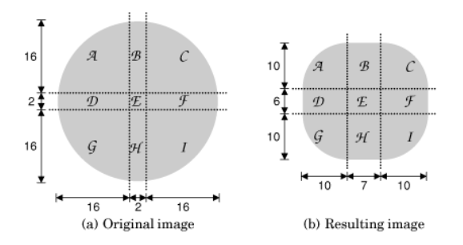

<!-- 19. 自定义外观 -->


<!-- @import "[TOC]" {cmd="toc" depthFrom=1 depthTo=6 orderedList=false} -->
<!-- code_chunk_output -->

- [使用 Qt 样式表](#使用-qt-样式表)
  - [Candy 样式](#candy-样式)
- [Link](#link)

<!-- /code_chunk_output -->


重新定义 Qt 内置窗口部件的外观：
* 子类化个别的窗口部件类，并且重新实现它的绘制和鼠标事件处理器。这给我们以完全的可控性，但需要付出大量的工作。这意味着必须遍历所有的代码和 Qt 设计师中的窗体，把 Qt 所有相关的类都改成子类。
* 子类化 [QStyle](https://doc.qt.io/qt-5/qstyle.html) 或者一个预定义的风格，例如 QWindowStyle 。这种方法很好用，Qt 本身就是用这种方法为它所支持的不同平台提供基于平台的外观的。
* 从 Qt 4.2 开始，可以使用 Qt 样式表，这是一种从 HTML CSS （层叠样式表） 获得灵感的机制。因为样式表是一种运行时解释的普通文本文件，使用它们不需要具备任何的编程知识。

第 5 章和第 7 章已经讲过第一种方法所需要的技术，然而我们强调的是自定义窗口部件。本章将介绍后两种方法。我们将展示两种自定义风格：
* Candy 风格，它通过样式表定义
* Bronze 风格，它通过 QStyle 的子类实现


## 使用 Qt 样式表

* [Qt Style Sheets](https://doc.qt.io/qt-5/stylesheet.html) - 描述了Qt 的样式表支持，提供 CSS 规范的链接。
* [Qt Style Sheets Reference](https://doc.qt.io/qt-5/stylesheet-reference.html)
* [Qt Style Sheets Examples](https://doc.qt.io/qt-5/stylesheet-examples.html)


样式表由影响窗口部件绘制的样式规则组成。这些规则是普通文本。由于在运行时会解析样式表，所以可以通过制定样式表的方式来尝试设计不同的 Qt 应用程序：使用 -stylesheet file.qss 命令行参数，使用 Qt 设计师的样式表编辑器，或者在开发应用程序时嵌入一个 QTextEdit。

样式表作用于上层的当前激活的 QStyle 上（例如，QWindowVistaStyle 或者 QPlastiqueStyle）。因为创建样式表不引入任何子类，所以它们适合对先有窗口部件做微小的定制。

```css
QLineEdit {
  background-color: yellow;
}
```

按照 CSS 的说法，QLineEdit 可以称为选择器(selector),background-color 就是属性，而 yellow 就是值。

对于这样的定制，使用样式表比修改窗口部件的调色板更可靠些。这是因为 QPalette 中的实体（Base、Button、Highlight，等等）在不同样式中的用法时不一样的。例如,QWindowStyle 用 Base 调色板填充只读组合框的背景，然而， QPlastiqueStyle 使用 Button 来完成这一功能。此外，有些样式使用硬编码的图像呈现某个元素，从而跳过了调色板。相反，样式表则保证了无论激活的是那种样式，都可以使用指定的颜色。

QApplication::setStyleSheet() 为整个应用程序设置一个样式表：
```c++
qApp->setStyleSheet("QLineEdit {background-color: yellow;}");
```
还可以使用 QWidget::setStyleSheet() 设置窗口部件以及其子窗口部件的样式表：
```c++
dialog->setStyleSheet("QLineEdit { background-color: yellow; }");
```
如果直接在 QLineEdit 上设置样式表，可以忽略 QLineEdit 选择器以及大括号：
```c++
lineEdit->setStyleSheet("background-color: yellow;");
```
在实践中，样式规则通常是组合的。eg：
```css
QCheckBox, QComboBox, QLineEdit, QListView, QRadioButton, QSpinBox {
  color: #050505;
  background-color: yellow;
}
```
颜色可以由名称、#RRGGBB格式的 HTML 样式的字符串、RGB或 RGBA 值指定：
```css
QLineEdit {
  color: rgb(0, 88, 152);
  background-color: rgba(97%, 80%, 9%, 50%);
}
```
当使用颜色名称时，可以使用任何能被 QColor::setNameColor() 函数识别的名字。对于 RGB 格式，必须指定红、绿、蓝部分，它们的取值范围是 0 - 255 ，或者 0% - 100% 区间的值。RGBA 额外需要指定一个透明度值作为颜色的第四部分，它对应着颜色的不透明性。除了统一的颜色，也可以指定调色板实体或者一个渐变：
```css
QLineEdit {
  color: palette(Base);
  background-color: qlineargradient(x1: 0, y1: 0, x2: 1, y2: 1,
  stop: 0 white, stop: 0.4 gray,
  stop: 1 green);
}
```
第 8 章介绍的三种渐变类型对应着qlineargradient() qradialgradient() qconicalgradient() 。语法可见 [Qt Style Sheets Reference](https://doc.qt.io/qt-5/stylesheet-reference.html)

使用 background-image 属性，可以指定一个图片作为背景：
```css
QLineEdit {
  color: rgb(0, 88, 152);
  background-image: url(:/images/yellow-bg.png);
}
```
默认情况下，背景图片从窗口部件的左上角（不包含使用 margin 指定的边缘区域）开始，并且向水平和竖直方向重复填充整个窗口部件。者可以通过使用 background-position 和 background-repeat 属性来进行设置。
```css
QLineEdit {
  background-image: url(:/images/yellow-bg.png);
  background-position: top right;
  background-repeat: repeat-y;
}
```
如果制定了背景图片和背景颜色，背景颜色将会在图片的半透明区域中折射出来。

目前为止，使用的所有的选择器都是类的名字。还有其他的一些可以使用的选择器，如下所示：

|  选择器  	|       实例      	|      可以匹配的窗口部件      	|
|:--------:	|:---------------:	|:----------------------------:	|
| 全局对象 	|        *        	|         任意窗口部件         	|
|   类型   	|      QDial      	|    给定类的实例，包括子类    	|
|    类    	|      .QDial     	|   给定类的实例，不包括子类   	|
|   标识   	| QDial # ageDial 	|    给定对象名称的窗口部件    	|
|  Qt 属性 	|  QDial[y = "0"] 	|   为某些属性赋值的窗口部件   	|
|  子对象  	|  QFrame > QDial 	| 给定窗口部件的直接子窗口部件 	|
| 子孙对象 	|   QFrame QDial  	|  给定窗口部件的子孙窗口部件  	|

eg：
```css
/* 给 Ok 和 Cancel 按钮指定前景颜色 */
QPushButton[text="OK"] {
  color: green;
}
QPushButton[text="Cancel"] {
  color: red;
}
```

这中选择器语法对任何的 Qt 属性都适用。尽管如此，必须记住，样式表不会注意到属性值的修改。选择器能以各种方式组合。例如，为了选择所有称做 "okButton" 的 QPushButton ,它们的 x 和 y 属性为 0 ，名为 “frame” 的 QFrame 直接子对象，可以这样写：
```css
QFrame#frame > QPushButton[x="0"][y="0"]#okButton {
...
}
```

在一个拥有大量窗体和编辑框、组合框的应用程序中，例如那些在各种机构中使用的，通常必选字段会使用 yellow 作为背景色。我们假设在应用程序中提供这一通用功能。首先，应该使用这个样式表：
```css
*[mandatoryField="true"] {
  background-color: yellow;
}
```
尽管在 Qt 中没有 mandatoryField 属性的定义，但可以通过 [QObject::setProperty()](https://doc.qt.io/qt-5/qobject.html#setProperty) 创建一个。从 Qt 4.2 开始，动态地设置一个不存在的属性的值可以创建这一属性。
```c++
nameLineEdit->setProperty("mandatoryField", true);
genderComboBox->setProperty("mandatoryField", true);
ageSpinBox->setProperty("mandatoryField", true);
```
样式表还可以用来对窗口部件元素的大小和位置进行调整。例如，下面的规则可以增加复选框和单选钮的状态指示器的大小为 20 x 20 像素，并且确保指示器和说明文字之间有 8 像素的间隙：
```css
QCheckBox::indicator, QRadioButton::indicator {
  width: 20px;
  height: 20px;
}
QCheckBox, QRadioButton {
  spacing: 8px;
}
```

注意第一个规则的选择器语法。如果写的是 QCheckBox,而不是 QCheckBox::indicator,就指定了整个窗口部件的尺寸，而非指示器了。第一个规则如图所示：


一些辅助控制器(subControl),如 ::indicator ,可以跟一些窗口部件一样使用。下标列出了 Qt 所支持的一些辅助控制器。

|    辅助控制器    	|                      说明                      	|
|:----------------:	|:----------------------------------------------:	|
|    ::indicator   	| 复选框、单选框、可选菜单项或可选群组框的指示器 	|
| ::menu-indicator 	|                按钮的菜单指示器                	|
|      ::item      	|             菜单、菜单栏或状态栏项             	|
|    ::up-button   	|            微调框或滚动条的向上按钮            	|
|   ::down-button  	|            微调框或滚动条的向下按钮            	|
|    ::up-arrow    	|   微调框、滚动条、标题视图或组合框的向上箭头   	|
|   ::drop-arrow   	|   微调框、滚动条、标题视图或组合框的向下箭头   	|
|    ::drop-down   	|                组合框的下拉箭头                	|
|      ::title     	|                  群组框的标题                  	|

* [Qt5 List of Sub-Controls](https://doc.qt.io/qt-5/stylesheet-reference.html#list-of-sub-controls)

除了辅助器，样式表还可以用来指定窗口部件的各个状态。例如，当鼠标在复选框的文本上悬停时，我们可能想用白色指定它的 `::hover` 状态：
```css
QCheckBox:hover {
  color: white;
}
```
状态由单个冒号决定，而辅助控制器由两个冒号指定。我们可以一个接一个地列出几个状态，它们彼此用冒号隔开。在这种情况下，当窗口部件满足所有的状态时，规则才会被使用。例如，下面的规则这有当鼠标在一个被选中的复选框上悬停时规则才被使用：
```css
QCheckBox:checked:hover {
  color: white;
}
```
如果希望在任何一个状态为 true 的情况下使用规则，则可以使用多个选择器，用逗号把它们隔开：
```css
QCheckBox:hover, QCheckBox:checked {
  color: white;
}
```
逻辑否可以用感叹号(!)表示：
```css
QCheckBox:!checked {
  color: blue;
}
```
状态可以与辅助控制器合用：
```css
QComboBox::drop-down:hover {
  image: url(:/images/downarrow_bright.png);
}
```
可用的样式表状态。

|      状态      	|            说明            	|
|:--------------:	|:--------------------------:	|
|    :disabled   	|        禁用窗口部件        	|
|    :enabled    	|        启用窗口部件        	|
|     :focus     	|     窗口部件有输入焦点     	|
|     :hover     	|    鼠标在窗口部件上悬停    	|
|    :pressed    	|    鼠标按键点击窗口部件    	|
|    :checked    	|        按钮已被选中        	|
|   :unchecked   	|        按钮未被选中        	|
| :indeterminate 	|       按钮被部分选中       	|
|      :open     	| 窗口部件位于打开或扩展状态 	|
|     :closed    	| 窗口部件位于关闭或销毁状态 	|
|       :on      	|    窗口部件的状态是 "on"   	|
|      :off      	|   窗口部件的状态是 "off"   	|

*  [Qt5 List of Pseudo-States](https://doc.qt.io/qt-5/stylesheet-reference.html#list-of-pseudo-states)

样式表也可以与其他的技术结合实现更复杂的自定义效果。例如，假设我们想在 QLineEdit 窗体中安放一个微型 "erase" 按钮，在 QLineEdit 文字的右边。这包括创建一个 EraseButton 类，把它放在 QLineEdit 的上方(例如使用布局管理器)，但也给按钮留一些空间，这样能够避免输入的文字与按钮的冲突。通过子类化 QStyle 实现这一功能是不方便的，因为我们可能需要子类化 Qt 中任何被此应用程序使用的样式 (QWindowVistaStyle、 QPlastiqueStyle 等)。使用样式表，下面的规则是一个窍门：
```css
QLineEdit {
  padding: 0px 15px 0px 0px;
}
```
padding 属性允许我们指定窗口部件的上边、右边、下边和左边的填充空间。填充的位置在 QLineEdit 的文字和窗体之间。为了更加方便，CSS 同时定义了 padding-top、padding-right、padding-bottom 和 padding-left,它们适用于只想设置一个填充值的情况，例如：
```css
QLineEdit {
  padding-right: 15px;
}
```
如同大多数的 Qt 窗口部件都可以使用样式表定制一样，QLineEdit 可以支持下图的盒子模式。此模型可指定 4 个影响布局的矩形，从而绘制一个自定义的窗口部件：


1. contents rectangle 是最里面的矩形。它是绘制窗口部件内容（例如文字或者图片）的地方。
2. padding rectangle 包围 contents rectangle。它是负责由 padding 属性指定填充操作。
3. border rectangle 包围 padding rectangle。它为边界预留空间。
4. margin rectangle 是最外边的矩形。它包围 border rectangle，负责任何指定的边缘空白区域。

对于没有 padding、 border 和 margin 的普通窗口部件，这 4 个矩形重合在一起。

### Candy 样式
Candy 样式使用上图的盒子模型为 QLineEdit 、 QListView、QPushButton 和 QComboBox 实现自定义的外观。


```css
QDialog {
  background-image: url(:/images/background.png);
}

QLabel {
  font: 9pt;
  color: rgb(0, 0, 127);
}

QLineEdit,
QListView {
  color: rgb(127, 0, 63);
  background-color: rgb(255, 255, 241);
  selection-color: white;
  selection-background-color: rgb(191, 31, 127);
  /* 指定了一个灰色、2像素宽的“凹槽”边框 */
  border: 2px groove gray;
  /* 边框的角设置为圆角 ,这里的半径为 10 像素*/
  border-radius: 10px;
  padding: 2px 4px;
}
```
为了使 QLineEdit 和 QListView 与众不同，我们需要为普通文本和选中的文本指定前景色和背景色。此外我们使用 border 属性指定了一个灰色、2像素宽的“凹槽”边框，可以分别设置为 border-width，border-style以及 border-color ，由其代替 border;下图提供了一个图示，它是修改窗口部件 border 和 padding 属性的效果图。为了保证窗口部件内容与边框的圆角不重合，我们指定了一个竖直方向 2 像素、水平方向 4 像素的内部填充区域。


对于 QListView，竖直方向的填充看起来不正确，因此可以用以下的方法覆盖它：
```css
QListView {
  padding: 5px 4px;
}
```
当一个属性被具有同一选择器的几个规则同时设置时，那么只有最后一个规则将起作用。

对于 QPushButton 的定制，我们将使用一种完全不同的方式。用一个准备好的图像作为背景，代替使用样式表规则绘制按钮的方法。同样，为了使按钮可以缩放，按钮的背景使用 CSS 的边界图 (border image) 机制定义。

与使用 background-image 定义的背景图像不同，边界图被分隔成 3 x 3 的小格，如图所示。当填充窗口背景部件时，4个角保持不变，其他 5 个格子被拉伸或者平铺，填充可用空间。


使用 border-image 属性可以指定各个边界图，它要求指定一个图像文件名和定义 9 个格子的 4 条 “切线”。切线用到上、右、下和左边缘的距离定义。 border.png 作为边界图，距离上、右、下和左边缘的切线为 4、8、12和16,应该这样：
```css
border-image: url(border.png) 4 8 12 16;
```
当使用边界图时，必须显式地设置 border-width 属性。一般情况下，border-width 应该与切线的位置一致；否则，为了与 border-width 相符合，角上的格子将被拉伸或缩短。对于 border.png 的例子，应该这样：

```highLight
border-width: 4px 8px 12px 16px;
```

绘制 Candy 风格的 QPushButton:
```css
QPushButton {
  color: white;
  font: bold 10pt;
  border-image: url(:/images/button.png) 16;
  border-width: 16px;
  padding: -16px 0px;
  /* 设置按钮尺寸的最小值。这里选定的值确保有足够的空间留给角上
  的边界图，并且确保 ok 按钮比需要的稍大一些，使得与 Cancel
  按钮相邻的效果看起来更好一些。 */
  min-height: 32px;
  min-width: 60px;
}
```
在 Candy 样式表中，QPushButton 边界图的 4 条切线位于距离 34 x 34 的边界图 16 像素的位置，如下图所示。因为 4 条切线是统一的，只需要用 "16" 定义切线，"16px" 定义边框宽度。


在上图所示的 QPushButton 例子中，对应于 d、e 和 f 的边界图的格子被丢弃了，因为缩小的按钮不足以显示，会水平拉伸格子 b 和 h，以便可以占用余下的宽度。

边界图的标准用途是在窗口部件周围提供一个边框，使得窗口部件在边框内。当我们推翻了边界图的这种机制，用它来创建窗口部件的背景。结果，格子 e 被丢弃了，填充矩形的高度变成了 0 。为了给按钮的文字留些空间，我们指定了一个 -16 像素的竖直填充空间。下图显示了这种情况。如果用边界图的机制定义一个实际的边框，我们可能不希望让它与文字冲突 - 因为我们使用它来创建一个可缩放的背景，想把文字放在它的上面而不是内部。


前面的 QPushButton 规则应用于所有的按钮。现在，我们将定义一些额外的规则，这些规则只在按钮处于特定的状态时才会用到。
```css
QPushButton:hover {
  border-image: url(:/images/button-hover.png) 16;
}
```
当鼠标的指针位于 QPushButton 的上方时，:hover 的状态变为 true ，指定的规则会覆盖具有较少规则选择器的其他规则。这里，我们使用这一技术指定一个更明亮的图像作为边界图，使其具有更好的悬停效果。前面指定的其他 QPushButton 的属性仍然适用，只有 border-image 的属性改变。

```css
QPushButton:pressed {
  color: lightgray;
  border-image: url(:/images/button-pressed.png) 16;
  padding-top: -15px;
  padding-bottom: -17px;
}
```

当用户单击按钮时，可以把前景色改为浅灰色，使用一个稍暗的边界图，并且把按钮中的文字下移一个像素，对填充区域做小的调整。

自定义 QComboBox 的外观。


* 定义 QLineEdit 的规则可以用来定义可编辑的组合框：
```css
QComboBox:editable,
QLineEdit,
QListView {
  color: rgb(127, 0, 63);
  background-color: rgb(255, 255, 241);
  selection-color: white;
  selection-background-color: rgb(191, 31, 127);
  border: 2px groove gray;
  border-radius: 10px;
  padding: 2px 4px;
}
```
* 定义 QPushButton 普通状态的规则可以扩展到定义只读组合框
```css
QComboBox:!editable,
QPushButton {
  color: white;
  font: bold 10pt;
  border-image: url(:/images/button.png) 16;
  border-width: 16px;
  padding: -16px 0px;
  min-height: 32px;
  min-width: 60px;
}
```
* 鼠标在只读组合框或者下拉按钮上悬停的规则可以修改背景图片，如在 QPushButton 上应用的规则：
```css
QComboBox:!editable:hover,
QComboBox::drop-down:editable:hover,
QPushButton:hover {
  border-image: url(:/images/button-hover.png) 16;
}
```
* 点击一个只读的按钮如同点击一个 QPushButton:
```css
QComboBox:!editable:on,
QPushButton:pressed {
  color: lightgray;
  border-image: url(:/images/button-pressed.png) 16;
  padding-top: -15px;
  padding-bottom: -17px;
}
```

定义下拉按钮的其他规则：
```css
/* 定义下拉按钮的规则 */
QComboBox::down-arrow {
  image: url(:/images/down-arrow.png);
}

/* 我们提供了自己的下拉箭头的图像，以便它可以比标准的箭头稍大一些 */
QComboBox::down-arrow:on {
  top: 1px;
}

/* 如果组合框是打开的，向下箭头将下移一个像素 */
QComboBox * {
  font: 9pt;
}

/* 当用户点击了组合框，它显示一个项的列表。确保组合框弹出的对象
（或者任何子窗口部件）没有继承上面的 QComboBox 规则中指定的
大字体 */
QComboBox::drop-down:!editable {
  /* 设置下拉箭头竖直居中，位于只读组合框的填充矩形的右侧。 */
  subcontrol-origin: padding;
  subcontrol-position: center right;

  /* 设置它的大小与按钮内容(11 x 6 像素的 down-arrow.png 图像)
  的大小相符，我们把背景设置为无，因为下拉按钮仅由下拉箭头组成。 */
  width: 11px;
  height: 6px;
  background: none;
}
```

```css
QComboBox:!editable {
  padding-right: 15px;
}
```

对于只读组合框，我们指定了一个右置的 15 像素的填充区域，确保组合框的显示文字与下拉箭头不重合。下图显示了这些元素彼此的位置关系。


对于可编辑组合框，需要配置下列按钮，使它看起来像一个微型按钮：
```css
QComboBox::drop-down:editable {
  border-image: url(:/images/button.png) 16;
  border-width: 10px;
  subcontrol-origin: margin;
  subcontrol-position: center right;
  width: 7px;
  height: 6px;
}
```

我们指定 button.png 作为边界图。然而，这次指定一个宽 10 像素的边框代替 16 像素，并按比例缩小图像，指定一个水平 7 像素竖直 6 像素的固定内容尺寸。



如果组合框打开，就使用一个不同的、暗色的图像作为下拉按钮：
```css
QComboBox::drop-down:editable:open {
  border-image: url(:/images/button-pressed.png) 16;
}
```

对于可编辑组合框，指定一个右置的 29 像素的区域为下拉按钮提供空间
```css
QComboBox:editable {
  margin-right: 29px;
}
```


现在就完成了 candy 样式表的创建。

使用样式表创建自定义样式需要不断摸索，特别是对那些以前没有用过 CSS 的人。使用样式表的主要挑战是 CSS 的冲突方案和层叠的处理比较抽象。详见 [Qt Style Sheets](https://doc.qt.io/qt-5/stylesheet.html),它描述了Qt 的样式表支持，提供 CSS 规范的链接。


## Link
* [qt5-book-code/chap19/](https://github.com/mutse/qt5-book-code/tree/master/chap19)

---
- [上一级](README.md)
- 上一篇 -> [18. 国际化](18_unicode.md)
- 下一篇 -> [20. 三维图形](20_3DGraphics.md)
