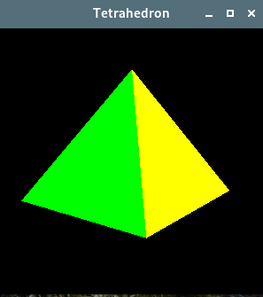

# 20. 三维图形

<!-- @import "[TOC]" {cmd="toc" depthFrom=1 depthTo=6 orderedList=false} -->

<!-- code_chunk_output -->

- [20. 三维图形](#20-三维图形)
  - [使用 OpenGL 绘图](#使用-opengl-绘图)

<!-- /code_chunk_output -->

[OpenGL](https://www.opengl.org//) 是绘制三维图形的标准 API 。Qt 应用程序可以使用 QtOpenGL 模块绘制三维图形，该模块依赖于系统的 OpenGL 库。Qt OpenGL 模块提供 [QGLWidget](https://doc.qt.io/qt-5/qglwidget.html),可以通过对它的子类化，并使用 OpenGL 命令开发出自己的窗口部件。当然对于 qt 5.4 以后的版本，应该使用 [QOpenGLWidget](https://doc.qt.io/qt-5/qopenglwidget.html)。

从 Qt 4 开始，可以在 QGLWidget 上使用 QPainter,尽管它还只是一个普通的窗口部件。好处是：

1. 可以高效的绘图，例如进行坐标转换和像素映射绘制。
2. 可使用其二维的高级 API ，并结合 OpenGL 调用来绘制三维图形。

使用 QGLWidget ，可以在场景中使用 OpenGL 作为后端绘制三维场景。为了在硬件加速的离屏表面上绘制，可以使用 pbuffer 和  framebuffer 对象进行扩展，它们分别在 [QGLPixelBuffer](https://doc.qt.io/qt-5/qglpixelbuffer.html) 和 [QGLFramebufferObject](https://doc.qt.io/qt-5/qglframebufferobject.html) 类中。

## 使用 OpenGL 绘图

示例： Tetrahedron 应用程序，该应用程序可以显示一个三维的三角锥(Tetrahedron),或者也可以称为四面体，它的每个面都具有不同的颜色。用户可以通过单击或拖动鼠标来旋转它。用户也可以通过双击某个面，从而弹出 QColorDialog 中选择一种颜色来设置这个面的颜色。



tetrahedron.h:

```c++
#ifndef TETRAHEDRON_H
#define TETRAHEDRON_H

#include <QtOpenGL>

class Tetrahedron : public QGLWidget
{
    Q_OBJECT

public:
    Tetrahedron(QWidget *parent = 0);

protected:
    void initializeGL() override;
    void resizeGL(int width, int height) override;
    void paintGL() override;
    void mousePressEvent(QMouseEvent *event) override;
    void mouseMoveEvent(QMouseEvent *event) override;
    void mouseDoubleClickEvent(QMouseEvent *event) override;

private:
    void draw();
    int faceAtPosition(const QPoint &pos);

    GLfloat rotationX;
    GLfloat rotationY;
    GLfloat rotationZ;
    QColor faceColors[4];
    QPoint lastPos;
};

#endif
```

tetrahedron.cpp:

```c++
#include <QtWidgets>

#include "tetrahedron.h"

Tetrahedron::Tetrahedron(QWidget *parent)
    : QGLWidget(parent)
{
    // 指定 OpenGL 的显示描述表
    setFormat(QGLFormat(QGL::DoubleBuffer | QGL::DepthBuffer));

    rotationX = -21.0;
    rotationY = -57.0;
    rotationZ = 0.0;
    faceColors[0] = Qt::red;
    faceColors[1] = Qt::green;
    faceColors[2] = Qt::blue;
    faceColors[3] = Qt::yellow;
}

// 该函数在调用 paintGL() 之前只被调用一次。
// 可以在这里设置 OpenGL 的绘图描述表，定义显示列表，以及执行其他初始化。
void Tetrahedron::initializeGL()
{
    qglClearColor(Qt::black);
    // 以下都是标准的 OpenGL
    glShadeModel(GL_FLAT);
    glEnable(GL_DEPTH_TEST);
    glEnable(GL_CULL_FACE);
}

// 在这里可以设置 OpenGL 视口、投影以及其他与窗口部件尺寸相关的设置。
void Tetrahedron::resizeGL(int width, int height)
{
    glViewport(0, 0, width, height);
    glMatrixMode(GL_PROJECTION);
    glLoadIdentity();
    GLfloat x = GLfloat(width) / height;
    glFrustum(-x, +x, -1.0, +1.0, 4.0, 15.0);
    glMatrixMode(GL_MODELVIEW);
}

//在窗口部件需要重绘时调用该函数。它与 QWidget::paintEvent() 类似。
void Tetrahedron::paintGL()
{
    glClear(GL_COLOR_BUFFER_BIT | GL_DEPTH_BUFFER_BIT);
    draw();
}

void Tetrahedron::mousePressEvent(QMouseEvent *event)
{
    lastPos = event->pos();
}

void Tetrahedron::mouseMoveEvent(QMouseEvent *event)
{
    GLfloat dx = GLfloat(event->x() - lastPos.x()) / width();
    GLfloat dy = GLfloat(event->y() - lastPos.y()) / height();

    if (event->buttons() & Qt::LeftButton) {
        rotationX += 180 * dy;
        rotationY += 180 * dx;
        // 重绘场景
        updateGL();
    } else if (event->buttons() & Qt::RightButton) {
        rotationX += 180 * dy;
        rotationZ += 180 * dx;
        updateGL();
    }
    lastPos = event->pos();
}

void Tetrahedron::mouseDoubleClickEvent(QMouseEvent *event)
{
    int face = faceAtPosition(event->pos());
    if (face != -1) {
        QColor color = QColorDialog::getColor(faceColors[face], this);
        if (color.isValid()) {
            faceColors[face] = color;
            updateGL();
        }
    }
}


// 绘制三角锥，应用 x、y和z轴的旋转以及保存在 faceColors 数组中的颜色。
void Tetrahedron::draw()
{
    static const GLfloat P1[3] = { 0.0, -1.0, +2.0 };
    static const GLfloat P2[3] = { +1.73205081, -1.0, -1.0 };
    static const GLfloat P3[3] = { -1.73205081, -1.0, -1.0 };
    static const GLfloat P4[3] = { 0.0, +2.0, 0.0 };

    static const GLfloat * const coords[4][3] = {
        { P1, P2, P3 }, { P1, P3, P4 }, { P1, P4, P2 }, { P2, P4, P3 }
    };

    glMatrixMode(GL_MODELVIEW);
    glLoadIdentity();
    glTranslatef(0.0, 0.0, -10.0);
    glRotatef(rotationX, 1.0, 0.0, 0.0);
    glRotatef(rotationY, 0.0, 1.0, 0.0);
    glRotatef(rotationZ, 0.0, 0.0, 1.0);

    for (int i = 0; i < 4; ++i) {
        glLoadName(i);
        glBegin(GL_TRIANGLES);
        qglColor(faceColors[i]);
        for (int j = 0; j < 3; ++j) {
            glVertex3f(coords[i][j][0], coords[i][j][1],
                       coords[i][j][2]);
        }
        glEnd();
    }
}

// 该函数返回窗口部件某位置所处的面的编号，如果没有面就返回 -1 。
int Tetrahedron::faceAtPosition(const QPoint &pos)
{
    const int MaxSize = 512;
    GLuint buffer[MaxSize];
    GLint viewport[4];

    // 确保我们正确地使用 OpenGL 描述表
    makeCurrent();

    glGetIntegerv(GL_VIEWPORT, viewport);
    glSelectBuffer(MaxSize, buffer);
    glRenderMode(GL_SELECT);

    glInitNames();
    glPushName(0);

    glMatrixMode(GL_PROJECTION);
    glPushMatrix();
    glLoadIdentity();
    /*gluPickMatrix(GLdouble(pos.x()), GLdouble(viewport[3] - pos.y()),
                  5.0, 5.0, viewport);*/
    GLfloat x = GLfloat(width()) / height();
    glFrustum(-x, x, -1.0, 1.0, 4.0, 15.0);
    draw();
    glMatrixMode(GL_PROJECTION);
    glPopMatrix();

    if (!glRenderMode(GL_RENDER))
        return -1;
    return buffer[3];
}
```

main.cpp:

```c++
#include <QApplication>
#include <iostream>

#include "tetrahedron.h"

int main(int argc, char *argv[])
{
    QApplication app(argc, argv);

    if (!QGLFormat::hasOpenGL()) {
        std::cerr << "This system has no OpenGL support" << std::endl;
        return 1;
    }

    Tetrahedron tetrahedron;
    tetrahedron.setWindowTitle(QObject::tr("Tetrahedron"));
    tetrahedron.resize(300, 300);
    tetrahedron.show();

    return app.exec();
}
```

为了正确连接 QtOpenGL 模块和系统的 OpenGL 库，需要在 .pro 文件中添加：

```pro
QT += opengl
```


- [上一级](README.md)
- 上一篇 -> [19. 自定义外观](19_cutomStyle.md)
- 下一篇 -> [21. 创建插件](21_createPlugin.md)
