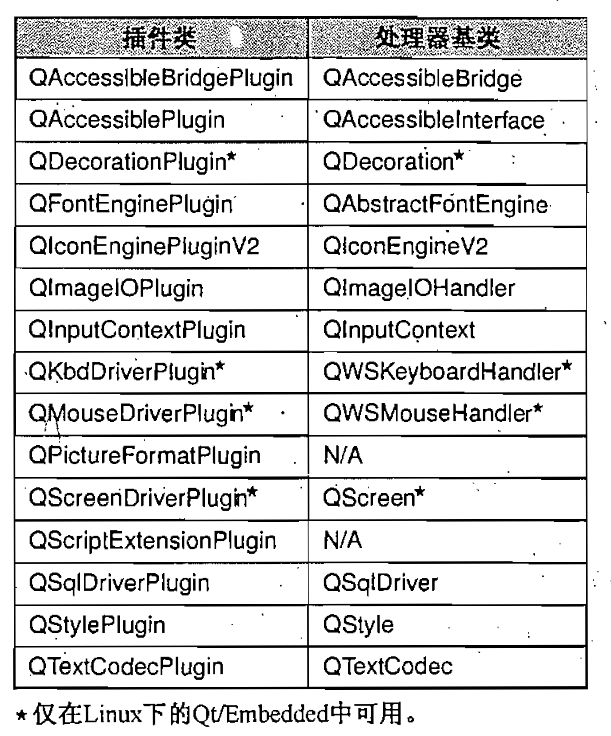

# 21. 创建插件

<!-- @import "[TOC]" {cmd="toc" depthFrom=1 depthTo=6 orderedList=false} -->
<!-- code_chunk_output -->

- [21. 创建插件](#21-创建插件)
  - [利用插件扩展 Qt](#利用插件扩展-qt)
  - [Link](#link)

<!-- /code_chunk_output -->

动态库（也称为共享库或者动态链接库）是存储在磁盘上一个单独文件中的独立模块，可以被多个应用程序访问。程序通常会在连接的时候指明它们所需动态库，在这种情况下，当该应用程序启动的时候，就会自动加载这些库。使用这种方式通常需要把这个库以及包含它的路径添加到应用程序的 .pro 文件中，并且需要在源程序文件中包含相应的头文件。eg：
```highLight
LIBS += -ldb_cxx
INCLUDEPATH += /usr/local/BerkeleyDB.4.2/include
```

另外一种方式是在需要的时候动态加载这个库，然后再解析这个库中希望使用的那些符号。Qt 提供的 QLibrary 类可以使用与一种平台无关的方式来实现这一点。只要给定一个库名字的词干，QLibrary 就会在该平台的标准位置搜索这个库，并查找适当的文件。eg:给定名字 mimetype ,in window ,search mimetype.dll;in linux ,search mimetype.so ;in Mac OS X ,search mimetype.dylib。

利用插件，通常就可以对现存的 GUI 应用程序进行扩展。插件就是一个动态库，它为可选的额外功能提供了一个特殊接口。例如，在第 5 章创建的 Qt designer 插件。

Qt 可以识别自己用于各域中的一套插件接口，这些域包含图像格式、数据库驱动程序、窗口部件风格、文本编码技术以及可访问性等。

为一些特殊的 Qt 应用程序创建与应用程序相关的插件也是可能的。通过 Qt 的插件框架可以很轻松地编写出这样地插件，这个框架在 QLibrary 之外添加了失效安全(crash safety)和易用性。


## 利用插件扩展 Qt

可以使用很多插件类型来扩展 Qt,其中最常用的就是数据库驱动、图像格式、窗口部件风格、文本编码解码器。对于每一种类型的插件，我们通常至少需要两个类：一个是插件封装器类，它实现了插件的通用 API 函数；另外一个是一个或者多个处理器类，每个处理器类都实现了一种用于特殊类型插件的 API 。通过封装器类才能访问这些处理器类。这些类如图所示：



## Link
* [qt5-book-code/chap21/](https://github.com/mutse/qt5-book-code/tree/master/chap21)


[上一级](README.md)
[上一篇](19_cutomStyle.md)
[下一篇](QtCreatorTips.md)
