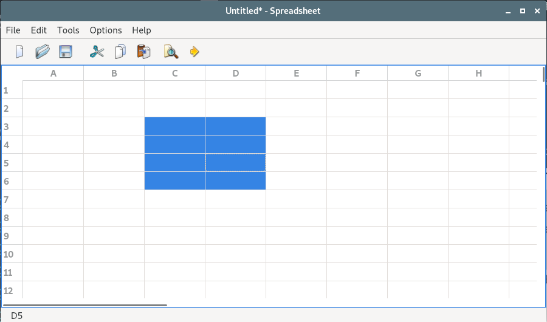
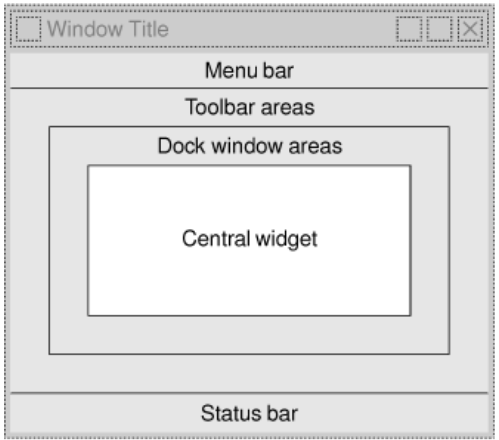

# 3. 创建主窗口

这一章讲解如何使用 Qt 创建主窗口。

Spreadsheet 应用程序：


## 子类化 QMainWindow
通过子类化 QMainWindow,可以创建一个应用程序的主窗口。
可以使用 Qt designer 创建应用程序的主窗口，但在这一章，将使用代码来完成所有的功能，


mainwindow.h:
```c++
#ifndef MAINWINDOW_H
#define MAINWINDOW_H

#include <QMainWindow>

class QAction;
class QLabel;
class FindDialog;
class Spreadsheet;

class MainWindow : public QMainWindow
{
    Q_OBJECT

public:
    MainWindow();

protected:
    // closeEvent 函数是 QWidget 类中的一个虚函数，当用户关闭窗口时，这个函数会被自动调用
    void closeEvent(QCloseEvent * event);

private slots:
    void newFile();
    void open();
    bool save();
    bool saveAs();
    void find();
    void goToCell();
    void sort();
    void about();
    void openRecentFile();
    void updateStatusBar();
    void spreadsheetModified();

private:
    void createActions();
    void createMenus();
    void createContextMenu();
    void createToolBars();
    void createStatusBar();
    void readSettings();
    void writeSettings();
    bool okToContinue();
    bool loadFile(const QString &fileName);
    bool saveFile(const QString &fileName);
    void setCurrentFile(const QString &fileName);
    void updateRecentFileActions();
    QString strippedName(const QString &fullFileName);

    Spreadsheet * spreadsheet;
    FindDialog * findDialog;
    QLabel * locationLabel;
    QLabel * formulaLabel;
    QStringList recentFiles;
    QString curFile;

    enum { MaxRecentFiles = 5 };
    QAction * recentFileActions[MaxRecentFiles];
    QAction * separatorAction;

    QMenu * fileMenu;
    QMenu * editMenu;
    QMenu * selectSubMenu;
    QMenu * toolsMenu;
    QMenu * optionsMenu;
    QMenu * helpMenu;
    QToolBar * fileToolBar;
    QToolBar * editToolBar;
    QAction * newAction;
    QAction * openAction;
    QAction * saveAction;
    QAction * saveAsAction;
    QAction * exitAction;
    QAction * cutAction;
    QAction * copyAction;
    QAction * pasteAction;
    QAction * deleteAction;
    QAction * selectRowAction;
    QAction * selectColumnAction;
    QAction * selectAllAction;
    QAction * findAction;
    QAction * goToCellAction;
    QAction * recalculateAction;
    QAction * sortAction;
    QAction * showGridAction;
    QAction * autoRecalcAction;
    QAction * aboutAction;
    QAction * aboutQtAction;
};

#endif
```

QMainWindow 中的区域分配：



图形用户界面(GUI) 应用程序通常会使用很多图片。为应用程序提供图片的方法有多种，下面是一些最常见的方法：
* 把图片保存到文件中，并且在运行时载入它们。
* 把 XPM 文件包含在源代码中。（这一方法之所以可行，是因为 XPM 文件也是有效的 C++ 文件）
* 使用 Qt 的资源机制（resource mechanism）.

这里使用了 Qt 的资源机制法，因为它比运行时载入文件的方法更方便，并且该方法使用于所支持的任意文件格式。

为了利用 Qt 的资源系统，必须创建一个资源文件，并且在识别该资源文件的 .pro 文件中添加一行代码。
eg:
```highLight
RESOURCE = spreadsheet.qrc
```

其中 “spreadsheet.qrc” 是资源文件名。
资源文件自身使用了一种简单的 XML 文件格式。比如：
```xml
<RCC>
<qresource>
    <file>images/icon.png</file>
    <file>images/new.png</file>
    <file>images/open.png</file>
    <file>images/save.png</file>
    <file>images/cut.png</file>
    <file>images/copy.png</file>
    <file>images/paste.png</file>
    <file>images/find.png</file>
    <file>images/gotocell.png</file>
</qresource>
</RCC>
```

当引用这些资源时，需要使用带路经前缀 ：/（冒号斜线） 的形式。资源可以时任意类型的文件（并非只是一些图像），并且可以在 Qt 需要文件名的大多数地方使用它们。

mainwindow.cpp:

```c++
#include <QtWidgets>

#include "finddialog.h"
#include "gotocelldialog.h"
#include "mainwindow.h"
#include "sortdialog.h"
#include "spreadsheet.h"

MainWindow::MainWindow()
{
  // 创建一个 Spreadsheet 窗口部件并且把它设置为这个主窗口的中央窗口部件。
  // Spreadsheet 类是 QTableWidget 类的一个子类，并且也具有一些电子制表软件的功能，
  // 如对电子制表软件公式的支持等。
    spreadsheet = new Spreadsheet;
    setCentralWidget(spreadsheet);

    createActions();
    createMenus();
    createContextMenu();
    createToolBars();
    createStatusBar();

    readSettings();

    findDialog = nullptr;

    setWindowIcon(QIcon(":/images/icon.png"));
    setCurrentFile("");
}

void MainWindow::closeEvent(QCloseEvent * event)
{
    if (okToContinue()) {
        writeSettings();
        event->accept();
    } else {
        event->ignore();
    }
}

void MainWindow::newFile()
{
    if (okToContinue()) {
        spreadsheet->clear();
        setCurrentFile("");
    }
}

void MainWindow::open()
{
    if (okToContinue()) {
        QString fileName = QFileDialog::getOpenFileName(this,
                                   tr("Open Spreadsheet"), ".",
                                   tr("Spreadsheet files (*.sp)"));
        if (!fileName.isEmpty())
            loadFile(fileName);
    }
}

bool MainWindow::save()
{
    if (curFile.isEmpty()) {
        return saveAs();
    } else {
        return saveFile(curFile);
    }
}

bool MainWindow::saveAs()
{
    QString fileName = QFileDialog::getSaveFileName(this,
                               tr("Save Spreadsheet"), ".",
                               tr("Spreadsheet files (*.sp)"));
    if (fileName.isEmpty())
        return false;

    return saveFile(fileName);
}

void MainWindow::find()
{
    if (!findDialog) {
      // 创建非模态(modeless) 对话框
        findDialog = new FindDialog(this);
        connect(findDialog, SIGNAL(findNext(const QString &,
                                            Qt::CaseSensitivity)),
                spreadsheet, SLOT(findNext(const QString &,
                                           Qt::CaseSensitivity)));
        connect(findDialog, SIGNAL(findPrevious(const QString &,
                                                Qt::CaseSensitivity)),
                spreadsheet, SLOT(findPrevious(const QString &,
                                               Qt::CaseSensitivity)));
    }

    // 调用 show() raise() 和 activateWindow()
    // 来确保窗口位于其他窗口之上并且是可见的和激活的。
    findDialog->show();
    findDialog->raise();
    findDialog->activateWindow();
}

void MainWindow::goToCell()
{
    // 如果对话框是通过 show() 调用的，那么它就是非模态对话框
    // (除非此后又调用了 setModal(),才会让它变为模态对话框)。
    // 但是，如果它是通过 exec() 调用的，那么该对话框就会是模态对话框。

    GoToCellDialog dialog(this);

    // 如果对话框被接受，函数 QDialog::exec() 可返回一个 true 值 (QDialog::Accepted),
    // 否则就会返回一个 false 值(QDialog::Rejected)。

    if (dialog.exec()) {
        QString str = dialog.lineEdit->text().toUpper();
        spreadsheet->setCurrentCell(str.mid(1).toInt() - 1,
                                    str[0].unicode() - 'A');
    }
}

void MainWindow::sort()
{
    SortDialog dialog(this);
    QTableWidgetSelectionRange range = spreadsheet->selectedRange();
    dialog.setColumnRange('A' + range.leftColumn(),
                          'A' + range.rightColumn());

    if (dialog.exec()) {
        SpreadsheetCompare compare;
        compare.keys[0] =
              dialog.primaryColumnCombo->currentIndex();
        compare.keys[1] =
              dialog.secondaryColumnCombo->currentIndex() - 1;
        compare.keys[2] =
              dialog.tertiaryColumnCombo->currentIndex() - 1;
        compare.ascending[0] =
              (dialog.primaryOrderCombo->currentIndex() == 0);
        compare.ascending[1] =
              (dialog.secondaryOrderCombo->currentIndex() == 0);
        compare.ascending[2] =
              (dialog.tertiaryOrderCombo->currentIndex() == 0);
        spreadsheet->sort(compare);
    }
}

void MainWindow::about()
{
    // 这个函数和 QMessageBox::warning() 形式非常相似，只是它使用了父窗口的图标，而不是标准的 “警告” 图标
    QMessageBox::about(this, tr("About Spreadsheet"),
            tr("<h2>Spreadsheet 1.1</h2>"
               "<p>Copyright &copy; 2008 Software Inc."
               "<p>Spreadsheet is a small application that "
               "demonstrates QAction, QMainWindow, QMenuBar, "
               "QStatusBar, QTableWidget, QToolBar, and many other "
               "Qt classes."));
}

void MainWindow::openRecentFile()
{
    if (okToContinue()) {
      // qobject_cast<T> 函数可在 Qt 的 moc 所生成的元信息基础上执行动态类型强制转换 (dynamic cast).
      // 它返回一个指向所需 QObject 子类的指针，或者是在该对象不能被转换成所需的哪种类型时返回 0。
      // 与 标准 C++ 的 dynamic_cast<T> 不同，Qt 的 qobject_cast<T>() 可正确地跨越动态库边界。

        QAction * action = qobject_cast<QAction * >(sender());
        if (action)
            loadFile(action->data().toString());
    }
}

void MainWindow::updateStatusBar()
{
    locationLabel->setText(spreadsheet->currentLocation());
    formulaLabel->setText(spreadsheet->currentFormula());
}

void MainWindow::spreadsheetModified()
{
    setWindowModified(true);
    updateStatusBar();
}

void MainWindow::createActions()
{
    newAction = new QAction(tr("&New"), this);
    newAction->setIcon(QIcon(":/images/new.png"));
    // 确保程序提供正确的快捷键，在不同系统中，快捷键可能不一样
    //，比如 windows,KDE,GNOME 中，New 动作的快捷键是 Ctrl + N,而在 Mac OS X 中则是 Command + N
    //通过使用适当的 QKeySequence::StandardKey 枚举值，就可以确保 Qt 能够为应用程序在其运行的平台上提供正确的快捷键

    newAction->setShortcut(QKeySequence::New);
    newAction->setStatusTip(tr("Create a new spreadsheet file"));
    connect(newAction, SIGNAL(triggered()), this, SLOT(newFile()));

    openAction = new QAction(tr("&Open..."), this);
    openAction->setIcon(QIcon(":/images/open.png"));
    openAction->setShortcut(QKeySequence::Open);
    openAction->setStatusTip(tr("Open an existing spreadsheet file"));
    connect(openAction, SIGNAL(triggered()), this, SLOT(open()));

    saveAction = new QAction(tr("&Save"), this);
    saveAction->setIcon(QIcon(":/images/save.png"));
    saveAction->setShortcut(QKeySequence::Save);
    saveAction->setStatusTip(tr("Save the spreadsheet to disk"));
    connect(saveAction, SIGNAL(triggered()), this, SLOT(save()));

    saveAsAction = new QAction(tr("Save &As..."), this);
    saveAsAction->setStatusTip(tr("Save the spreadsheet under a new "
                                  "name"));
    connect(saveAsAction, SIGNAL(triggered()), this, SLOT(saveAs()));

    for (int i = 0; i < MaxRecentFiles; ++i) {
        recentFileActions[i] = new QAction(this);
        recentFileActions[i]->setVisible(false);
        connect(recentFileActions[i], SIGNAL(triggered()),
                this, SLOT(openRecentFile()));
    }

    exitAction = new QAction(tr("E&xit"), this);
    exitAction->setShortcut(tr("Ctrl+Q"));
    exitAction->setStatusTip(tr("Exit the application"));
    connect(exitAction, SIGNAL(triggered()), this, SLOT(close()));

    cutAction = new QAction(tr("Cu&t"), this);
    cutAction->setIcon(QIcon(":/images/cut.png"));
    cutAction->setShortcut(QKeySequence::Cut);
    cutAction->setStatusTip(tr("Cut the current selection's contents "
                               "to the clipboard"));
    connect(cutAction, SIGNAL(triggered()), spreadsheet, SLOT(cut()));

    copyAction = new QAction(tr("&Copy"), this);
    copyAction->setIcon(QIcon(":/images/copy.png"));
    copyAction->setShortcut(QKeySequence::Copy);
    copyAction->setStatusTip(tr("Copy the current selection's contents "
                                "to the clipboard"));
    connect(copyAction, SIGNAL(triggered()), spreadsheet, SLOT(copy()));

    pasteAction = new QAction(tr("&Paste"), this);
    pasteAction->setIcon(QIcon(":/images/paste.png"));
    pasteAction->setShortcut(QKeySequence::Paste);
    pasteAction->setStatusTip(tr("Paste the clipboard's contents into "
                                 "the current selection"));
    connect(pasteAction, SIGNAL(triggered()),
            spreadsheet, SLOT(paste()));

    deleteAction = new QAction(tr("&Delete"), this);
    deleteAction->setShortcut(QKeySequence::Delete);
    deleteAction->setStatusTip(tr("Delete the current selection's "
                                  "contents"));
    connect(deleteAction, SIGNAL(triggered()),
            spreadsheet, SLOT(del()));

    selectRowAction = new QAction(tr("&Row"), this);
    selectRowAction->setStatusTip(tr("Select all the cells in the "
                                     "current row"));
    connect(selectRowAction, SIGNAL(triggered()),
            spreadsheet, SLOT(selectCurrentRow()));

    selectColumnAction = new QAction(tr("&Column"), this);
    selectColumnAction->setStatusTip(tr("Select all the cells in the "
                                        "current column"));
    connect(selectColumnAction, SIGNAL(triggered()),
            spreadsheet, SLOT(selectCurrentColumn()));

    selectAllAction = new QAction(tr("&All"), this);
    selectAllAction->setShortcut(QKeySequence::SelectAll);
    selectAllAction->setStatusTip(tr("Select all the cells in the "
                                     "spreadsheet"));                                 
    connect(selectAllAction, SIGNAL(triggered()),
            spreadsheet, SLOT(selectAll()));

    findAction = new QAction(tr("&Find..."), this);
    findAction->setIcon(QIcon(":/images/find.png"));
    findAction->setShortcut(QKeySequence::Find);
    findAction->setStatusTip(tr("Find a matching cell"));
    connect(findAction, SIGNAL(triggered()), this, SLOT(find()));

    goToCellAction = new QAction(tr("&Go to Cell..."), this);
    goToCellAction->setIcon(QIcon(":/images/gotocell.png"));
    goToCellAction->setShortcut(tr("Ctrl+G"));
    goToCellAction->setStatusTip(tr("Go to the specified cell"));
    connect(goToCellAction, SIGNAL(triggered()),
            this, SLOT(goToCell()));

    recalculateAction = new QAction(tr("&Recalculate"), this);
    recalculateAction->setShortcut(tr("F9"));
    recalculateAction->setStatusTip(tr("Recalculate all the "
                                       "spreadsheet's formulas"));
    connect(recalculateAction, SIGNAL(triggered()),
            spreadsheet, SLOT(recalculate()));

    sortAction = new QAction(tr("&Sort..."), this);
    sortAction->setStatusTip(tr("Sort the selected cells or all the "
                                "cells"));
    connect(sortAction, SIGNAL(triggered()), this, SLOT(sort()));

    showGridAction = new QAction(tr("&Show Grid"), this);
    showGridAction->setCheckable(true);
    showGridAction->setChecked(spreadsheet->showGrid());
    showGridAction->setStatusTip(tr("Show or hide the spreadsheet's "
                                    "grid"));
    connect(showGridAction, SIGNAL(toggled(bool)),
            spreadsheet, SLOT(setShowGrid(bool)));
#if QT_VERSION < 0x040102
    // workaround for a QTableWidget bug in Qt 4.1.1
    connect(showGridAction, SIGNAL(toggled(bool)),
            spreadsheet->viewport(), SLOT(update()));
#endif

    autoRecalcAction = new QAction(tr("&Auto-Recalculate"), this);
    autoRecalcAction->setCheckable(true);
    autoRecalcAction->setChecked(spreadsheet->autoRecalculate());
    autoRecalcAction->setStatusTip(tr("Switch auto-recalculation on or "
                                      "off"));
    connect(autoRecalcAction, SIGNAL(toggled(bool)),
            spreadsheet, SLOT(setAutoRecalculate(bool)));

    aboutAction = new QAction(tr("&About"), this);
    aboutAction->setStatusTip(tr("Show the application's About box"));
    connect(aboutAction, SIGNAL(triggered()), this, SLOT(about()));

    aboutQtAction = new QAction(tr("About &Qt"), this);
    aboutQtAction->setStatusTip(tr("Show the Qt library's About box"));
    connect(aboutQtAction, SIGNAL(triggered()), qApp, SLOT(aboutQt()));
}

void MainWindow::createMenus()
{
    // QMainWindow::menuBar() 函数返回一个指向 QMenuBar 的指针。
    // 菜单栏会在第一次调用 menuBar() 函数的时候就创建出来。
    fileMenu = menuBar()->addMenu(tr("&File"));
    fileMenu->addAction(newAction);
    fileMenu->addAction(openAction);
    fileMenu->addAction(saveAction);
    fileMenu->addAction(saveAsAction);
    // 添加间隔器
    separatorAction = fileMenu->addSeparator();
    for (int i = 0; i < MaxRecentFiles; ++i)
        fileMenu->addAction(recentFileActions[i]);
    fileMenu->addSeparator();
    fileMenu->addAction(exitAction);

    editMenu = menuBar()->addMenu(tr("&Edit"));
    editMenu->addAction(cutAction);
    editMenu->addAction(copyAction);
    editMenu->addAction(pasteAction);
    editMenu->addAction(deleteAction);

    selectSubMenu = editMenu->addMenu(tr("&Select"));
    selectSubMenu->addAction(selectRowAction);
    selectSubMenu->addAction(selectColumnAction);
    selectSubMenu->addAction(selectAllAction);

    editMenu->addSeparator();
    editMenu->addAction(findAction);
    editMenu->addAction(goToCellAction);

    toolsMenu = menuBar()->addMenu(tr("&Tools"));
    toolsMenu->addAction(recalculateAction);
    toolsMenu->addAction(sortAction);

    optionsMenu = menuBar()->addMenu(tr("&Options"));
    optionsMenu->addAction(showGridAction);
    optionsMenu->addAction(autoRecalcAction);

    menuBar()->addSeparator();

    helpMenu = menuBar()->addMenu(tr("&Help"));
    helpMenu->addAction(aboutAction);
    helpMenu->addAction(aboutQtAction);
}

// 任何 Qt 窗口部件都可以有一个与之相关联的 QAction 列表。
// 要为该应用程序提供一个上下文菜单，可以将所需要的动作添加到 Spreadsheet 窗口部件中，
// 并且将那个窗口部件的上下文菜单策略(context menu policy)
// 设置为一个显示这些动作的上下文菜单。
// 当用户在一个窗口部件上单击鼠标右键，或者是在键盘上按下与平台相关的按键时，
// 就可以激活这些上下文菜单。
//
// 一种更为高级的提供上下文菜单的方法时重新实现 QWidget::contextMenuEvent() 函数，
// 创建一个 QMenu 窗口部件，在其中添加所期望的那些动作，并且再对该窗口部件调用 exec() 函数。

void MainWindow::createContextMenu()
{
    spreadsheet->addAction(cutAction);
    spreadsheet->addAction(copyAction);
    spreadsheet->addAction(pasteAction);
    spreadsheet->setContextMenuPolicy(Qt::ActionsContextMenu);
}

void MainWindow::createToolBars()
{
    fileToolBar = addToolBar(tr("&File"));
    fileToolBar->addAction(newAction);
    fileToolBar->addAction(openAction);
    fileToolBar->addAction(saveAction);

    editToolBar = addToolBar(tr("&Edit"));
    editToolBar->addAction(cutAction);
    editToolBar->addAction(copyAction);
    editToolBar->addAction(pasteAction);
    editToolBar->addSeparator();
    editToolBar->addAction(findAction);
    editToolBar->addAction(goToCellAction);
}

void MainWindow::createStatusBar()
{
    // 为了避免对定位指示器连续不断地重定义大小，
    // 设置它的最小尺寸为它所能包含的最大字符数("W999")和一些空格的总大小。
    locationLabel = new QLabel(" W999 ");
    locationLabel->setAlignment(Qt::AlignHCenter);
    locationLabel->setMinimumSize(locationLabel->sizeHint());

    formulaLabel = new QLabel;
    // 添加一个缩进格式，以便让那些在它里面显示的文本能够与它的左侧边有一个小的偏移量。
    formulaLabel->setIndent(3);

    // QMainWindow::statusBar() 函数返回一个指向状态栏的指针。
    // （在第一次调用 statusBar() 函数的时候会创建状态栏）
    // 两个标签都有不同的空间需求。单元格定位指示器只需要非常小的空间，
    // 并且在重新定义窗口大小时，任何多余的空间都会分配给位于右侧的单元格公式指示器。
    // 这是通过在公式标签的 QStatusBar::addWidget()
    // 调用中指定一个伸展因子 1 而实现的。
    // 位置指示器的默认伸展因子为 0 这就意味着它不喜欢被伸展。
    statusBar()->addWidget(locationLabel);
    statusBar()->addWidget(formulaLabel, 1);

    connect(spreadsheet, SIGNAL(currentCellChanged(int, int, int, int)),
            this, SLOT(updateStatusBar()));
    connect(spreadsheet, SIGNAL(modified()),
            this, SLOT(spreadsheetModified()));

    updateStatusBar();
}

void MainWindow::readSettings()
{
    QSettings settings("Software Inc.", "Spreadsheet");

    restoreGeometry(settings.value("geometry").toByteArray());

    recentFiles = settings.value("recentFiles").toStringList();
    updateRecentFileActions();

    bool showGrid = settings.value("showGrid", true).toBool();
    showGridAction->setChecked(showGrid);

    bool autoRecalc = settings.value("autoRecalc", true).toBool();
    autoRecalcAction->setChecked(autoRecalc);
}

void MainWindow::writeSettings()
{
    QSettings settings("Software Inc.", "Spreadsheet");

    settings.setValue("geometry", saveGeometry());
    settings.setValue("recentFiles", recentFiles);
    settings.setValue("showGrid", showGridAction->isChecked());
    settings.setValue("autoRecalc", autoRecalcAction->isChecked());
}

bool MainWindow::okToContinue()
{
    if (isWindowModified()) {
      // 除了 warning 外，QMessageBox 还提供了
      // information(),question(),critical() 函数
        int r = QMessageBox::warning(this, tr("Spreadsheet"),
                        tr("The document has been modified.\n"
                           "Do you want to save your changes?"),
                        QMessageBox::Yes | QMessageBox::No
                        | QMessageBox::Cancel);
        if (r == QMessageBox::Yes) {
            return save();
        } else if (r == QMessageBox::Cancel) {
            return false;
        }
    }
    return true;
}

bool MainWindow::loadFile(const QString &fileName)
{
    if (!spreadsheet->readFile(fileName)) {
      // 在状态栏中显示一个消息 2 秒(2000 毫秒)
        statusBar()->showMessage(tr("Loading canceled"), 2000);
        return false;
    }

    setCurrentFile(fileName);
    statusBar()->showMessage(tr("File loaded"), 2000);
    return true;
}

bool MainWindow::saveFile(const QString &fileName)
{
    if (!spreadsheet->writeFile(fileName)) {
        statusBar()->showMessage(tr("Saving canceled"), 2000);
        return false;
    }

    setCurrentFile(fileName);
    statusBar()->showMessage(tr("File saved"), 2000);
    return true;
}

void MainWindow::setCurrentFile(const QString &fileName)
{
    curFile = fileName;

    // 每个 QWidget 都有一个 windowModified 属性，
    // 如果该窗口的文档存在没有保存的变化，则应当把他设置为 true,否则应当将其设置为 false;
    setWindowModified(false);

    QString shownName = tr("Untitled");
    if (!curFile.isEmpty()) {
        // strippedName() 函数移除文件名中的路径字符
        shownName = strippedName(curFile);
        recentFiles.removeAll(curFile);
        recentFiles.prepend(curFile);
        updateRecentFileActions();
    }


    // 在 Mac OS X 下，未保存的文档时通过窗口标题栏上关闭按钮中的一个点来表示的；
    // 在其他平台下，则是通过文件名字后跟一个星号来表示的。
    // Qt 会自动处理这一行为，只要始终让 windowModified 属性保持为当前最新状态
    // ，并且当需要显示星号的时候，把 “[ * ]” 标记放在窗口的标题栏上即可。
    setWindowTitle(tr("%1[*] - %2").arg(shownName)
                                   .arg(tr("Spreadsheet")));

    // QString::arg() 函数会使用自己的参数替换最小数字的 "%n" 参数
    // ，并且会用它的参数返回结果 “%n” 字符和最终的结果字符串。
    // 使用 arg() 函数可以为翻译人员提供更多的灵活性。
}

void MainWindow::updateRecentFileActions()
{
    QMutableStringListIterator i(recentFiles);
    while (i.hasNext()) {
        if (!QFile::exists(i.next()))
            i.remove();
    }

    for (int j = 0; j < MaxRecentFiles; ++j) {
        if (j < recentFiles.count()) {
            QString text = tr("&%1 %2")
                           .arg(j + 1)
                           .arg(strippedName(recentFiles[j]));
            recentFileActions[j]->setText(text);
            // 每一个动作都可以带一个与之相关的 QVariant 型 data 项。
            // QVariant 类型可以保存许多 c++ 和 Qt 型变量
            recentFileActions[j]->setData(recentFiles[j]);
            recentFileActions[j]->setVisible(true);
        } else {
            recentFileActions[j]->setVisible(false);
        }
    }
    separatorAction->setVisible(!recentFiles.isEmpty());
}

QString MainWindow::strippedName(const QString &fullFileName)
{
    return QFileInfo(fullFileName).fileName();
}
```

默认情况下，[QSettings](https://doc.qt.io/qt-5/qsettings.html) 会存储应用程序中与特定平台相关的一些设置信息。
* 在 windows 系统中，它使用的是系统注册表；
* 在 UNIX 系统中，它会把设置信息存储在文本文件中；
* 在 Mac OS X 中，它会使用 Core Foundation Preferences 的应用程序编程接口。

QSettings 把设置信息存储为键值对的形式。键 (key) 与文件系统的路径很相似。可以使用路径形式的语法(eg,findDialog/matchCase) 来指定子键(subkey) 的值，或者也可以使用 beginGroup() 和 endGroup() 的形式：
```c++
settings.beginGroup("findDialog");
settings.setValue("matchCase",caseCheckBox->isChecked());
settings.endGroup();
```

值（value） 可以是一个 int,bool,double,QString,QStringList 或者是 QVariant 所支持的其他任意类型，包括那些已经注册过的自定义类型。

## 程序启动画面

使用 [QSplashScreen](https://doc.qt.io/qt-5/qsplashscreen.html) 类，可以非常容易地为 Qt 应用程序添加一个程序启动画面。


```c++
int main(int argc, char *argv[])
{
    QApplication app(argc, argv);
    QPixmap pixmap(":/splash.png");
    QSplashScreen splash(pixmap);
    splash.show();
    app.processEvents();
    ...
    QMainWindow window;
    window.show();
    splash.finish(&window);
    return app.exec();
}
```

It is sometimes useful to update the splash screen with messages, for example, announcing connections established or modules loaded as the application starts up:
```c++
QPixmap pixmap(":/splash.png");
QSplashScreen *splash = new QSplashScreen(pixmap);
splash->show();

... // Loading some items
splash->showMessage("Loaded modules");

qApp->processEvents();

... // Establishing connections
splash->showMessage("Established connections");

qApp->processEvents();
```

## Link
* [qt5-book-code/chap03/](https://github.com/mutse/qt5-book-code/tree/master/chap03)


[上一级](README.md)
[上一篇](2_creat_dialog.md)
[下一篇](4_SpreadSheet.md)
