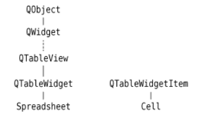
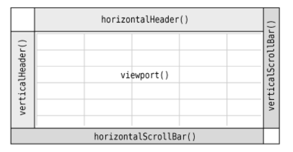
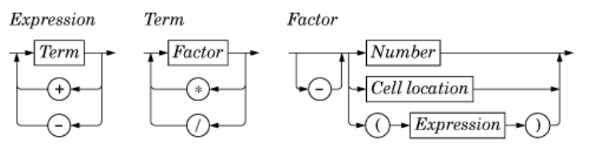

# 4. 实现应用程序的功能

前面说明了如何创建 Spreadsheet 应用程序的用户界面。在这一章，将通过编写它的底层功能函数来完成这个程序。

## 中央窗口部件

QMainWindow 的中央区域可以被任意种类的窗口部件所占用。比如：
1. 使用一个标准的 Qt 窗口部件
2. 使用一个自定义窗口部件
3. 使用一个带布局管理器的普通 QWidget
4. 使用切分窗口(splitter)    [QSplitter](https://doc.qt.io/qt-5/qsplitter.html)
多个窗口一起使用的另一种方法就是使用 QSplitter。 QSplitter 会在水平方向或者竖直方向上排列它的子窗口部件，用户可以利用切分条(splitter handle)来控制它们的尺寸大小。切分窗口可以包含所有类型的窗口部件，包括其他切分窗口。
```c++
// The following example will show a QListView, QTreeView
// , and QTextEdit side by side, with two splitter handles:
    QSplitter *splitter = new QSplitter(parent);
    QListView *listview = new QListView;
    QTreeView *treeview = new QTreeView;
    QTextEdit *textedit = new QTextEdit;
    splitter->addWidget(listview);
    splitter->addWidget(treeview);
    splitter->addWidget(textedit);
```
5. 使用多文档界面工作空间 [MDI Example](https://doc.qt.io/qt-5/qtwidgets-mainwindows-mdi-example.html)
如果应用程序使用的是多文档界面，那么它的中央区域就会被 QMdiArea 窗口部件所占据，并且每个多文档界面窗口都是它的一个子窗口部件。
布局、切分窗口和多文档界面工作空间都可以与标准的 Qt 窗口部件或者自定义窗口部件组合使用。

## 子类化 QTableWidget
类 Spreadsheet 派生自 [QTableWidget](https://doc.qt.io/qt-5/qtablewidget.html#details)。它可以在规定的维数内显示用户滚动到的任当用户在一个一单元格。当用户在一个空单元内输入一些文本的时候，QTableWidget 会自动创建一个用来存储这些文本的 [QTableWidgetItem](https://doc.qt.io/qt-5/qtablewidgetitem.html)。把数据存储为项(item)的方法也可用于 [QListWidget](https://doc.qt.io/qt-5/qlistwidget.html) 和 [QTreeWidget](https://doc.qt.io/qt-5/qtreewidget.html)。



QTableWidget 派生自 [QTableView](https://doc.qt.io/qt-5/qtableview.html) ,它是模型/视图类之一。

QTableWidget 单元格的属性，比如它的文本和对齐方式等，都存储在 QTableWidgetItem 中。 QTableWidgetItem 不是一个窗口部件类，而是一个纯粹的数据类。

QTableWidget 由多个子窗口部件构成。在它的顶部有一个水平的 [QHeaderView](https://doc.qt.io/qt-5/qheaderview.html),左侧有一个垂直的 QHeaderView,还有两个 [QScrollBar](https://doc.qt.io/qt-5/qscrollbar.html)。 在它的中间区域被一个名为视口(viewport) 的特殊窗口部件所占用，QTableWidget 可以在它上面绘制单元格。



## 用到的一些重要的类
* [QFile](https://doc.qt.io/qt-5/qfile.html)
* [QDataStream](https://doc.qt.io/qt-5/qdatastream.html) , 其功能非常齐全。即可以把它用于 QFile 中，也可以把它用于 [QBuffer](https://doc.qt.io/qt-5/qbuffer.html)、 [QProcess](https://doc.qt.io/qt-5/qprocess.html)、 [QTcpSocket](https://doc.qt.io/qt-5/qtcpsocket.html)、 [QUdpSocket](https://doc.qt.io/qt-5/qudpsocket.html)、 [QSslSocket](https://doc.qt.io/qt-5/qsslsocket.html)。 在读取和输出文本文件时，Qt 也提供了一个 [QTextStream](https://doc.qt.io/qt-5/qtextstream.html) 类，可以使用它代替 QDataStream;
* [QStringList](https://doc.qt.io/qt-5//qstringlist.html)
* [QString](https://doc.qt.io/qt-5/qstring.html)
* [QVariant](https://doc.qt.io/qt-5/qvariant.html): The QVariant class acts like a union for the most common Qt data types

## spreadsheet.h:
```c++
#ifndef SPREADSHEET_H
#define SPREADSHEET_H

#include <QTableWidget>

// 前置声明
QT_BEGIN_NAMESPACE
class Cell;
class SpreadsheetCompare;
QT_END_NAMESPACE

class Spreadsheet : public QTableWidget
{
    Q_OBJECT

public:
    Spreadsheet(QWidget * parent = 0);

    bool autoRecalculate() const { return autoRecalc; }
    QString currentLocation() const;
    QString currentFormula() const;
    QTableWidgetSelectionRange selectedRange() const;
    void clear();
    bool readFile(const QString &fileName);
    bool writeFile(const QString &fileName);
    void sort(const SpreadsheetCompare &compare);

public slots:
    void cut();
    void copy();
    void paste();
    void del();
    void selectCurrentRow();
    void selectCurrentColumn();
    void recalculate();
    void setAutoRecalculate(bool recalc);
    void findNext(const QString &str, Qt::CaseSensitivity cs);
    void findPrevious(const QString &str, Qt::CaseSensitivity cs);

signals:
    // 告知用户可能已经发生的任何变化
    void modified();

private slots:
    void somethingChanged();

private:
    enum { MagicNumber = 0x7F51C883, RowCount = 999, ColumnCount = 26 };

    Cell * cell(int row, int column) const;
    QString text(int row, int column) const;
    QString formula(int row, int column) const;
    void setFormula(int row, int column, const QString &formula);

    bool autoRecalc;
};

class SpreadsheetCompare
{
public:
    bool operator()(const QStringList &row1,
                    const QStringList &row2) const;

    enum { KeyCount = 3 };
    int keys[KeyCount];
    bool ascending[KeyCount];
};

#endif

```

## Spreadsheet.cpp

```c++
#include <QtWidgets>

#include "cell.h"
#include "spreadsheet.h"

Spreadsheet::Spreadsheet(QWidget *parent)
    : QTableWidget(parent)
{
    autoRecalc = true;

    // 在电子制表软件中，我们想利用将要创建的  Cell 项来代替 QTableWidgetItem。
    // 这可以通过在构造函数中调用 setItemPrototype() 来完成。
    // 实际上，QTableWidget 会在每次需要新项的时候把传递的项以原型的形式克隆出来。
    setItemPrototype(new Cell);

    // 我们将选择模式设置为 QAbstractItemView::ContiguousSelection ，从而允许简单矩形选择框方法。
    setSelectionMode(ContiguousSelection);

    connect(this, SIGNAL(itemChanged(QTableWidgetItem *)),
            this, SLOT(somethingChanged()));

    clear();
}

QString Spreadsheet::currentLocation() const
{
    return QChar('A' + currentColumn())
           + QString::number(currentRow() + 1);
}

// 返回当前单元格的公式
QString Spreadsheet::currentFormula() const
{
    return formula(currentRow(), currentColumn());
}


QTableWidgetSelectionRange Spreadsheet::selectedRange() const
{
    // 返回一个选择返回列表
    QList<QTableWidgetSelectionRange> ranges = selectedRanges();
    // 由于在构造函数中已经将选择模式设置为 QAbstractItemView::ContiguousSelection ，所以选择范围不可能再超过1。
    if (ranges.isEmpty())
        return QTableWidgetSelectionRange();
    return ranges.first();
}

void Spreadsheet::clear()
{
    // 我们原本使用 QTableWidget::clear() 来清空所有项和任意选择，但是那样做的话
    // ，这些标题将会以当前大小的而被留下。
    // 相反的是，我们要将表格向下调整 0 x 0。
    // 这样就可以完全清空整个表格，包括这些标题。
    setRowCount(0);
    setColumnCount(0);
    setRowCount(RowCount);
    setColumnCount(ColumnCount);

    for (int i = 0; i < ColumnCount; ++i) {
        QTableWidgetItem * item = new QTableWidgetItem;
        item->setText(QString(QChar('A' + i)));
        setHorizontalHeaderItem(i, item);
    }

    setCurrentCell(0, 0);
}

bool Spreadsheet::readFile(const QString &fileName)
{
    QFile file(fileName);
    if (!file.open(QIODevice::ReadOnly)) {
        QMessageBox::warning(this, tr("Spreadsheet"),
                             tr("Cannot read file %1:\n%2.")
                             .arg(file.fileName())
                             .arg(file.errorString()));
        return false;
    }

    QDataStream in(&file);
    in.setVersion(QDataStream::Qt_4_3);

    quint32 magic;
    in >> magic;
    if (magic != MagicNumber) {
        QMessageBox::warning(this, tr("Spreadsheet"),
                             tr("The file is not a Spreadsheet file."));
        return false;
    }

    clear();

    quint16 row;
    quint16 column;
    QString str;

    QApplication::setOverrideCursor(Qt::WaitCursor);
    while (!in.atEnd()) {
        in >> row >> column >> str;
        setFormula(row, column, str);
    }
    QApplication::restoreOverrideCursor();
    return true;
}


// 使用 QFile 和 QDataStream 来完成这一工作，由它们提供与平台无关的二进制数输入/输出接口。
bool Spreadsheet::writeFile(const QString &fileName)
{
    QFile file(fileName);
    if (!file.open(QIODevice::WriteOnly)) {
        QMessageBox::warning(this, tr("Spreadsheet"),
                             tr("Cannot write file %1:\n%2.")
                             .arg(file.fileName())
                             .arg(file.errorString()));
        return false;
    }


    // 因为 c++ 的基本类型在不同平台上可能会由不同的大小，所以把这些变量强制转换成
    // qint8,quint8,qint32,... 中的一个是最安全的做法，这样做可以确保它们能够获得应有的大小（按位计算）；
    QDataStream out(&file);

    // 设置版本号，避免出现任何可能的兼容性问题。
    out.setVersion(QDataStream::Qt_4_3);

    // MagicNumber 定义的一个随机数
    out << quint32(MagicNumber);

    QApplication::setOverrideCursor(Qt::WaitCursor);
    for (int row = 0; row < RowCount; ++row) {
        for (int column = 0; column < ColumnCount; ++column) {
            QString str = formula(row, column);
            if (!str.isEmpty())
                out << quint16(row) << quint16(column) << str;
        }
    }
    QApplication::restoreOverrideCursor();
    return true;
}

void Spreadsheet::sort(const SpreadsheetCompare &compare)
{
    QList<QStringList> rows;
    QTableWidgetSelectionRange range = selectedRange();
    int i;

    for (i = 0; i < range.rowCount(); ++i) {
        QStringList row;
        for (int j = 0; j < range.columnCount(); ++j)
            row.append(formula(range.topRow() + i,
                               range.leftColumn() + j));
        rows.append(row);
    }

    qStableSort(rows.begin(), rows.end(), compare);

    for (i = 0; i < range.rowCount(); ++i) {
        for (int j = 0; j < range.columnCount(); ++j)
            setFormula(range.topRow() + i, range.leftColumn() + j,
                       rows[i][j]);
    }

    clearSelection();
    somethingChanged();
}

void Spreadsheet::cut()
{
    copy();
    del();
}

void Spreadsheet::copy()
{
    QTableWidgetSelectionRange range = selectedRange();
    QString str;

    for (int i = 0; i < range.rowCount(); ++i) {
        if (i > 0)
            str += "\n";
        for (int j = 0; j < range.columnCount(); ++j) {
            if (j > 0)
                str += "\t";
            str += formula(range.topRow() + i, range.leftColumn() + j);
        }
    }
    QApplication::clipboard()->setText(str);
}

void Spreadsheet::paste()
{
    QTableWidgetSelectionRange range = selectedRange();
    QString str = QApplication::clipboard()->text();
    QStringList rows = str.split('\n');
    int numRows = rows.count();
    int numColumns = rows.first().count('\t') + 1;

    if (range.rowCount() * range.columnCount() != 1
            && (range.rowCount() != numRows
                || range.columnCount() != numColumns)) {
        QMessageBox::information(this, tr("Spreadsheet"),
                tr("The information cannot be pasted because the copy "
                   "and paste areas aren't the same size."));
        return;
    }

    for (int i = 0; i < numRows; ++i) {
        QStringList columns = rows[i].split('\t');
        for (int j = 0; j < numColumns; ++j) {
            int row = range.topRow() + i;
            int column = range.leftColumn() + j;
            if (row < RowCount && column < ColumnCount)
                setFormula(row, column, columns[j]);
        }
    }
    somethingChanged();
}

void Spreadsheet::del()
{
    QList<QTableWidgetItem * > items = selectedItems();
    if (!items.isEmpty()) {
        foreach (QTableWidgetItem *item, items)
            delete item;
        somethingChanged();
    }
}

void Spreadsheet::selectCurrentRow()
{
    selectRow(currentRow());
}

void Spreadsheet::selectCurrentColumn()
{
    selectColumn(currentColumn());
}

void Spreadsheet::recalculate()
{
    for (int row = 0; row < RowCount; ++row) {
        for (int column = 0; column < ColumnCount; ++column) {
            if (cell(row, column))
                // 调用 setDirty() 把他们标记为需要重新计算。
                cell(row, column)->setDirty();
        }
    }

    // 对这个视口调用 update() 来重新绘制整个电子制表软件。
    viewport()->update();
}

void Spreadsheet::setAutoRecalculate(bool recalc)
{
    autoRecalc = recalc;
    if (autoRecalc)
        recalculate();
}

// 向下查找文本
void Spreadsheet::findNext(const QString &str, Qt::CaseSensitivity cs)
{
    int row = currentRow();
    int column = currentColumn() + 1;

    while (row < RowCount) {
        while (column < ColumnCount) {
            if (text(row, column).contains(str, cs)) {
                clearSelection();
                setCurrentCell(row, column);
                activateWindow();
                return;
            }
            ++column;
        }
        column = 0;
        ++row;
    }

    // 让应用程序发出 beep 的一声来表明搜索已经结束。
    QApplication::beep();
}

// 向上查找文本
void Spreadsheet::findPrevious(const QString &str,
                               Qt::CaseSensitivity cs)
{
    int row = currentRow();
    int column = currentColumn() - 1;

    while (row >= 0) {
        while (column >= 0) {
            if (text(row, column).contains(str, cs)) {
                clearSelection();
                setCurrentCell(row, column);
                activateWindow();
                return;
            }
            --column;
        }
        column = ColumnCount - 1;
        --row;
    }
    QApplication::beep();
}

void Spreadsheet::somethingChanged()
{
    if (autoRecalc)
        recalculate();
    emit modified();
}

Cell *Spreadsheet::cell(int row, int column) const
{
    return static_cast<Cell * >(item(row, column));
}

// 把公式转换成值的任务是由 Cell 类完成的。
// 这时，要记住的事情是显式在单元格内的文本是公式的结果，而不是公式本身。
void Spreadsheet::setFormula(int row, int column,
                             const QString &formula)
{
    // 我们不需要担心随后对这个 Cell 对象的删除操作
    // ，因为 QTableWidget 会得到这个单元格的所有权，并且会在正确的时候自动将其删除。
    Cell * c = cell(row, column);
    if (!c) {
        c = new Cell;
        setItem(row, column, c);
    }
    c->setFormula(formula);
}

// 返回给定单元格中的公式
QString Spreadsheet::formula(int row, int column) const
{
    Cell * c = cell(row, column);
    if (c) {
        return c->formula();
    } else {
        return "";
    }
}

QString Spreadsheet::text(int row, int column) const
{
    Cell * c = cell(row, column);
    if (c) {
        return c->text();
    } else {
        return "";
    }
}

bool SpreadsheetCompare::operator()(const QStringList &row1,
                                    const QStringList &row2) const
{
    for (int i = 0; i < KeyCount; ++i) {
        int column = keys[i];
        if (column != -1) {
            if (row1[column] != row2[column]) {
                if (ascending[i]) {
                    return row1[column] < row2[column];
                } else {
                    return row1[column] > row2[column];
                }
            }
        }
    }
    return false;
}
```

## 子类化 QTableWidgetItem

Cell 类派生自 QTableWidgetItem 类。

### Cell.h

```c++
#ifndef CELL_H
#define CELL_H

#include <QTableWidgetItem>

class Cell : public QTableWidgetItem
{


public:
    Cell();

    QTableWidgetItem * clone() const;
    void setData(int role, const QVariant &value);
    QVariant data(int role) const;
    void setFormula(const QString &formula);
    QString formula() const;
    void setDirty();

private:
    QVariant value() const;
    QVariant evalExpression(const QString &str, int &pos) const;
    QVariant evalTerm(const QString &str, int &pos) const;
    QVariant evalFactor(const QString &str, int &pos) const;

    // cachedValue 把单元格的值缓存为 QVariant。
    mutable QVariant cachedValue;
    // 如果缓存的值不是最新的，那么就把 cacheIsDirty 设置为 true
    mutable bool cacheIsDirty;
};

#endif
```

我们注意到，在该类的定义中并没有使用 Q_OBJECT 宏。这是因为，Cell 是一个普通的 c++ 类，它没有使用任何信号或者槽。实际上，因为 QTableWidgetItem 不是从 QObject 派生而来的，所以就不能让 Cell 拥有信号和槽。为了使 Qt 的项 (item) 类的开销降到最低，它们就不是从 QObject 派生的。如果需要信号和槽，可以在包含项的窗口部件中实现它们，或者在特殊情况下，可以通过 QObject 进行多重继承的方式来实现它们。

### Cell.cpp
```c++
#include <QtWidgets>

#include "cell.h"

Cell::Cell()
{
    setDirty();
}

// 当 QTableWidget 需要创建一个新的单元格的时候，
// 例如，当用户在一个以前没有使用过的空白单元格中开始输入数据时，它就会调用 clone（） 函数。
// 传递给 QTableWidget::setItemPrototype() 中的实例就是需要克隆的的项。
QTableWidgetItem *Cell::clone() const
{
    return new Cell(*this);
}


// 每个 QTableWidgetItem 都可以保存一些数据，最多可以为每个数据“角色”分配一个 QVariant 变量。
// 最常用的角色是 Qt::EditRole 和 Qt::DisplayRole 。编辑角色用在那些需要编辑的数据上，而显式角色用在那些需要显示的数据上。
// 通常情况下，用于两者的数据是一样的，但在 Cell 类中，编辑角色对应于单元格的公式
// ，而显示角色对应于单元格的值（对公式求值后的结果。）
void Cell::setData(int role, const QVariant &value)
{
    QTableWidgetItem::setData(role, value);
    // 如果有一个新的公式，就可以把 cacheIsDirty 设置为 true,以确保在下一次调用 text() 的时候可以重新计算该单元格。
    if (role == Qt::EditRole)
        setDirty();
}

QVariant Cell::data(int role) const
{
    if (role == Qt::DisplayRole) {
        if (value().isValid()) {
            return value().toString();
        } else {
            return "####";
        }
    }  else if (role == Qt::TextAlignmentRole) {
        // 返回合适的对齐方式
        if (value().type() == QVariant::String) {
            return int(Qt::AlignLeft | Qt::AlignVCenter);
        } else {
            return int(Qt::AlignRight | Qt::AlignVCenter);
        }
    } else {
        return QTableWidgetItem::data(role);
    }
}

// 设置单元格的公式
void Cell::setFormula(const QString &formula)
{
    setData(Qt::EditRole, formula);
}

QString Cell::formula() const
{
    return data(Qt::EditRole).toString();
}

void Cell::setDirty()
{
    cacheIsDirty = true;
}

const QVariant Invalid;

QVariant Cell::value() const
{
    if (cacheIsDirty) {
        cacheIsDirty = false;

        QString formulaStr = formula();
        if (formulaStr.startsWith('\'')) {
            cachedValue = formulaStr.mid(1);
        } else if (formulaStr.startsWith('=')) {
            cachedValue = Invalid;
            QString expr = formulaStr.mid(1);
            expr.replace(" ", "");
            expr.append(QChar::Null);

            int pos = 0;
            cachedValue = evalExpression(expr, pos);
            if (expr[pos] != QChar::Null)
                cachedValue = Invalid;
        } else {
            // 通过给 toDouble() 一个 bool 指针，可以区分字符串转换中表示的是数字 0.0 还是表示的是转换错误。
            // 考虑到程序的性能和移植性因素，Qt 从来不使用 c++ 异常机制来报告错误。
            // 但是，如果你的编译器支持 c++ 异常，那么这也不会妨碍你在自己的 Qt 程序中使用它们。
            bool ok;
            double d = formulaStr.toDouble(&ok);
            if (ok) {
                cachedValue = d;
            } else {
                cachedValue = formulaStr;
            }
        }
    }
    return cachedValue;
}

// 解析表达式，返回一个电子制表软件表达式的值。
QVariant Cell::evalExpression(const QString &str, int &pos) const
{
    QVariant result = evalTerm(str, pos);
    while (str[pos] != QChar::Null) {
        QChar op = str[pos];
        if (op != '+' && op != '-')
            return result;
        ++pos;

        QVariant term = evalTerm(str, pos);
        if (result.type() == QVariant::Double
                && term.type() == QVariant::Double) {
            if (op == '+') {
                result = result.toDouble() + term.toDouble();
            } else {
                result = result.toDouble() - term.toDouble();
            }
        } else {
            result = Invalid;
        }
    }
    return result;
}

// 得到第一项的值
QVariant Cell::evalTerm(const QString &str, int &pos) const
{
    QVariant result = evalFactor(str, pos);
    while (str[pos] != QChar::Null) {
        QChar op = str[pos];
        if (op != '*' && op != '/')
            return result;
        ++pos;

        QVariant factor = evalFactor(str, pos);
        if (result.type() == QVariant::Double
                && factor.type() == QVariant::Double) {
            if (op == '*') {
                result = result.toDouble() * factor.toDouble();
            } else {
                // 避免除零
                // 尽管测试浮点数值是否相等通常并不明智，因为其中存在取舍问题
                //，但是在这个防止除零的问题上，这样的像等性测试已经足够了。
                if (factor.toDouble() == 0.0) {
                    result = Invalid;
                } else {
                    result = result.toDouble() / factor.toDouble();
                }
            }
        } else {
            result = Invalid;
        }
    }
    return result;
}

QVariant Cell::evalFactor(const QString &str, int &pos) const
{
    QVariant result;
    bool negative = false;

    if (str[pos] == '-') {
        negative = true;
        ++pos;
    }

    if (str[pos] == '(') {
        ++pos;
        result = evalExpression(str, pos);
        if (str[pos] != ')')
            result = Invalid;
        ++pos;
    } else {
        QRegExp regExp("[A-Za-z][1-9][0-9]{0,2}");
        QString token;

        while (str[pos].isLetterOrNumber() || str[pos] == '.') {
            token += str[pos];
            ++pos;
        }

        if (regExp.exactMatch(token)) {
            int column = token[0].toUpper().unicode() - 'A';
            int row = token.mid(1).toInt() - 1;

            Cell * c = static_cast<Cell * >(
                              tableWidget()->item(row, column));
            if (c) {
                result = c->value();
            } else {
                result = 0.0;
            }
        } else {
            bool ok;
            result = token.toDouble(&ok);
            if (!ok)
                result = Invalid;
        }
    }

    if (negative) {
        if (result.type() == QVariant::Double) {
            result = -result.toDouble();
        } else {
            result = Invalid;
        }
    }
    return result;
}
```

### evalExpression 函数说明
该函数的功能是：解析表达式，返回一个电子制表软件表达式的值。

表达式可以定义为 :一个或者多个通过许多 "+" 或者 "-" 操作符分隔而成的项。这些项可以定义为：由“*” 或者 "/" 操作符分隔而成的一个或者多个因子（factor）。通过把表达式分解成项，再把项分解成因子，就可以确保以正确的顺序来使用这些操作符了。

对于语法（表达式、项和因子）中的每一个符号，都对应一个解析它的成员函数，并且函数的结构严格遵循语法。通过这种方式写出的解析器称为 [递归渐降解析器（recursive-descent parser）](https://www.tutorialspoint.com/compiler_design/compiler_design_top_down_parser.htm)



## Link
* [qt5-book-code/chap04/](https://github.com/mutse/qt5-book-code/tree/master/chap04)

[上一级](README.md)
[上一篇](3_createMainWindow.md)
[下一篇](14_multiThread.md)
