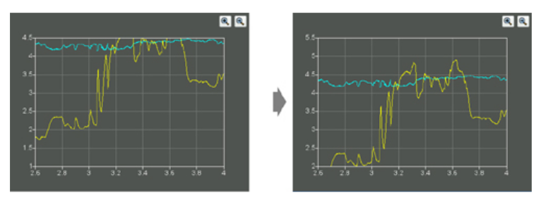

# 5. 创建自定义窗口部件


<!-- @import "[TOC]" {cmd="toc" depthFrom=1 depthTo=6 orderedList=false} -->
<!-- code_chunk_output -->

- [5. 创建自定义窗口部件](#5-创建自定义窗口部件)
  - [自定义 Qt 窗口部件](#自定义-qt-窗口部件)
    - [HexSpinBox.h](#hexspinboxh)
    - [HexSpinBox.cpp](#hexspinboxcpp)
  - [子类化 QWidget](#子类化-qwidget)
    - [IconEditor.h](#iconeditorh)
    - [IconEditor.cpp](#iconeditorcpp)
  - [在 Qt 设计师中集成自定义窗口部件](#在-qt-设计师中集成自定义窗口部件)
  - [双缓冲](#双缓冲)
    - [Plotter.h](#plotterh)
    - [Plotter.cpp](#plottercpp)
  - [Link](#link)

<!-- /code_chunk_output -->


这一章讲解如何使用 Qt 开发自定义窗口部件。通过对一个已经存在的 Qt 窗口部件进行子类化或者直接对 QWidget 进行子类化，就可以创建自定义窗口部件。本章将示范这两种方式，并且也会说明如何把自定义窗口部件集成到 Qt 设计师中，这样就可以像使用内置的 Qt 窗口部件一样来使用它们了。

## 自定义 Qt 窗口部件

对 Qt 窗口部件进行更多的自定义定制，一个简单而直接的解决方法就是对相关的窗口部件类进行子类化并且使它能够满足我们的需要。

比如一个十六进制的微调框。


### HexSpinBox.h
```c++
#ifndef HEXSPINBOX_H
#define HEXSPINBOX_H

#include <QSpinBox>

QT_BEGIN_NAMESPACE
class QRegExpValidator;
QT_END_NAMESPACE

class HexSpinBox : public QSpinBox
{
    Q_OBJECT

public:
    HexSpinBox(QWidget * parent = 0);

protected:
  QValidator::State validate(QString &text, int &pos) const override;
  int valueFromText(const QString &text) const override;
  QString textFromValue(int value) const override;

private:
    QRegExpValidator * validator;
};

#endif
```

### HexSpinBox.cpp
```c++
#include <QtWidgets>

#include "HexSpinBox.h"

HexSpinBox::HexSpinBox(QWidget *parent)
    : QSpinBox(parent)
{
    // 设置默认范围是从 0 - 255 (即从 0x00 - 0x FF)
    setRange(0, 255);
    // 严格控制用户输入的数据必须是合法的十六进制数字
    validator = new QRegExpValidator(QRegExp("[0-9A-Fa-f]{1,8}"), this);
}

// 这个函数由 QSpinBox 调用，用来检查目前为止用户输入文本的合法性。
// 有三种结果可能会出现：Invalid(无效，输入的文本与常规表达式不匹配)
// Intermediate(部分有效部分无效，输入的文本是一个有效值中似是而非的一部分)
// Acceptable （可以接受，输入的文本合法有效）
QValidator::State HexSpinBox::validate(QString &text, int &pos) const
{
    return validator->validate(text, pos);
}

// 当用户在微调框的编辑器部分输入一个值并且按下 Enter 时，QSpinBox 就会调用它
int HexSpinBox::valueFromText(const QString &text) const
{
    bool ok;
    return text.toInt(&ok, 16);
}

// 当用户按下微调框的向上或者向下箭头时，QSpinBox 会调用它来更新微调框的编辑器部分。
QString HexSpinBox::textFromValue(int value) const
{
    return QString::number(value, 16).toUpper();
}
```

## 子类化 QWidget

如果窗口部件本身没有任何信号和槽，并且它也没有重新实现任何虚函数，那么我们甚至还有可能通过对现有窗口部件的组合而不是通过子类化的方式来生成这样的窗口部件。比如第一章创建的 Age应用程序。

当手里没有任何一个 Qt 窗口部件能够满足任务要求，并且也没有办法通过组合现有窗口部件来满足所需的期望结果时，仍旧可以创建出我们想要的窗口部件来。要实现这一点，只需要通过子类化 QWidget ，并且通过重新实现一些用来绘制窗口部件和响应鼠标点击事件的事件处理器即可。这一方法给了我们定义并且控制自己的窗口部件的外观和行为的完全自由。

eg: 编写一个自定义窗口部件的 IconEditor 窗口部件。


### IconEditor.h

* [Q_PROPERTY](https://doc.qt.io/qt-5/properties.html) The Property System

```c++
#ifndef ICONEDITOR_H
#define ICONEDITOR_H

#include <QColor>
#include <QImage>
#include <QWidget>

class IconEditor : public QWidget
{
    Q_OBJECT

    // 使用 Q_PROPERTY 声明了三个自定义属性：penColor、iconImalge 和 zoomFactor.
    // 每个属性都有一个数据类型、一个 “读” 函数和一个作为可选项的 “写” 函数。
    // 例如：penColor 属性类型是 QColor,并且可以使用 penColor() 和 setPenColor() 函数对他进行读写。

    // 当我们在 Qt 设计师中使用这个窗口部件时，在 Qt 设计师属性编辑器里
    //，那些继承于 QWidget 的属性下面，将会显示这些自定义属性。
    // 这些属性可以是由 QVariant 所支持的任何类型。对于定义属性的类，Q_OBJECT 宏是必需的。

    Q_PROPERTY(QColor penColor READ penColor WRITE setPenColor)
    Q_PROPERTY(QImage iconImage READ iconImage WRITE setIconImage)
    Q_PROPERTY(int zoomFactor READ zoomFactor WRITE setZoomFactor)

public:
    IconEditor(QWidget * parent = 0);

    void setPenColor(const QColor &newColor);
    QColor penColor() const { return curColor; }
    void setZoomFactor(int newZoom);
    int zoomFactor() const { return zoom; }
    void setIconImage(const QImage &newImage);
    QImage iconImage() const { return image; }
    QSize sizeHint() const override;

protected:
  void mousePressEvent(QMouseEvent * event) override;
  void mouseMoveEvent(QMouseEvent * event) override;
  void paintEvent(QPaintEvent * event) override;

private:
    void setImagePixel(const QPoint &pos, bool opaque);
    QRect pixelRect(int i, int j) const;

    QColor curColor;
    QImage image;
    int zoom;
};

#endif

```

### IconEditor.cpp

* [QImage](https://doc.qt.io/qt-5/qimage.html) 使用一种与硬件无关的方式来存储图像。可以把它设置成使用 1 位、8位或者32位色深。一个具有32位色深的图像分别对每一个像素各使用 8 位来存储它的红、绿、蓝分量。剩余的8位存储这个像素的 alpha 分量（即不透明度）。
* [QColor](https://doc.qt.io/qt-5/qcolor.html) The QColor class provides colors based on RGB, HSV or CMYK values
* [QPainter](https://doc.qt.io/qt-5/qpainter.html) The QPainter class performs low-level painting on widgets and other paint devices


当产生一个绘制事件并且调用 paintEvent() 函数的时候，就会出现如下几种情况：
* 在窗口部件第一次显示时，系统会自动产生一个绘制事件，从而强制绘制这个窗口部件本身。
* 当重新调整窗口部件大小的时候，系统也会产生一个绘制事件。
* 当窗口部件被其他窗口部件遮挡，然后又再次显示出来的时候，就会对那些隐藏的区域产生一个绘制事件（除非这个窗口系统存储了整个区域）

也可以通过调用 QWidget::update() 或者 QWidget::repaint() 强制产生一个绘制事件。这两个函数之间的区别：
* repaint() 函数会强制产生一个即时的重绘事件
* update() 函数则是在 Qt 下一次处理事件时才简单地调用一个绘制事件（如果窗口部件在屏幕上是不可见地，那么这两个函数会什么都不做）。如果多次调用 update() , Qt 就会把连续多次的绘制事件压缩成一个单一的绘制事件，这样就可以避免闪烁现象。


对于 QPainter::drawLine() 的调用遵循这样的语法：
```c++
painter.drawLine(x1,y1,x2,y2);
```
Qt 窗口部件的左上角处的位置坐标是 (0,0) ,右下角的位置坐标是 (width()-1,height()-1)。
使用 QPainter 绘制一条线段如下。


每一个窗口部件都会配备一个调色板，由它来确定做什么事应该使用什么颜色。例如，对于窗口部件的背景色会有一个对应的调色板条目（通常是亮灰色），并且对于文本的背景色也会对应一个调色板条目（通常是黑色）。默认情况下，一个窗口部件的调色板会采用窗口系统的颜色主题。通过使用调色板中的这些颜色，可以确保 IconEditor 能够尊重用户的选择。

一个窗口部件的调色板由三个颜色组构成：激活组(Active)、非激活组(Inactive)和不可用组(Disabled)。应该使用哪一个颜色组取决于该窗口部件的当前状态：
* Active : 可用于当前激活窗口中的那些窗口部件。
* Inactive: 可用于其他窗口中的那些窗口部件。
* Disabled： 可用于任意窗口中的那些不可用窗口部件。

QWidget::palette() 函数可以返回窗口部件的调色板，它是一个 [QPalette](https://doc.qt.io/qt-5/qpalette.html) 型对象。

在构造函数中setAttribute(Qt::WA_StaticContents)，这个属性告诉 Qt,当重新改变窗口部件的大小时，这个窗口部件的内容并没有发生变化，而且它的内容仍旧保留从窗口部件左上角开始的特性。当重新定义窗口部件的大小时，通过使用这个信息，Qt 就可以避免对已经显示区域的重新绘制。

通常情况下，当重新定义一个窗口部件的大小时，Qt 会为窗口部件的整个可见区域生成一个绘制事件。但是如果该窗口部件在创建时使用了 Qt::WA_StaticContents 属性，那么绘制事件的区域就会被严格限定在之前没有被显示的像素部分上。这也就意味着，如果重新把窗口部件改变为比原来还要小的尺寸，那么就根本不会产生任何绘制事件。

```c++
#include <QtWidgets>

#include "IconEditor.h"

IconEditor::IconEditor(QWidget *parent)
    : QWidget(parent)
{
    //In the constructor, we set the Qt::WA_StaticContents attribute for the widget
    //, indicating that the widget contents are rooted to the top-left corner
    // and don't change when the widget is resized.
    // Qt uses this attribute to optimize paint events on resizes.
    // This is purely an optimization and should only be used for widgets whose
    // contents are static and rooted to the top-left corner.
    setAttribute(Qt::WA_StaticContents);

    // 调用 以 QSizePolicy::Minimum 为水平和垂直大小策略的 setSizePolicy(),
    // 会告诉负责管理这个窗口部件的任意布局管理器，这个窗口部件的大小提示就是它的最小尺寸大小。

    setSizePolicy(QSizePolicy::Minimum, QSizePolicy::Minimum);

    // 画笔的颜色被设置为黑色。
    curColor = Qt::black;

    // 缩放因子(zoom factor) 被设置为 8 ，也就是说，图表中的每一个像素都将会显示成一个 8 x 8 的正方形。
    zoom = 8;

    // 初始化为 16 x 16 的像素大小和 32 位的 ARGB 颜色格式，这种颜色格式可以支持半透明的效果。
    image = QImage(16, 16, QImage::Format_ARGB32);
    image.fill(qRgba(0, 0, 0, 0));
}

// Qt 提供了两种存储颜色的类型： QRgb 和 QColor 。
// 虽然 qRgb 仅仅是一个用在 QImage 中 32 位像素数据的类型别名，
// 但 QColor 则是一个具有许多有用函数并且在 Qt 中广泛用于存储颜色的类。
// 在 QIconEditor 窗口部件中，只有在处理 QImage 时，我们才使用 qRgb,
// 而对于其他任意东西，包括这里的 penColor 属性，我们都只使用 QColor.

void IconEditor::setPenColor(const QColor &newColor)
{
    curColor = newColor;
}

// 设置图像的缩放因子
void IconEditor::setZoomFactor(int newZoom)
{
    if (newZoom < 1)
        newZoom = 1;

    if (newZoom != zoom) {
        zoom = newZoom;
        // 重绘，通知布局变化
        update();
        updateGeometry();
    }
}

// 设置需要编辑的图像
void IconEditor::setIconImage(const QImage &newImage)
{
    if (newImage != image) {
        // 调用 convertToFormat（） 把它变成一个带 alpha 缓冲的 32 位图像。
        image = newImage.convertToFormat(QImage::Format_ARGB32);
        // 调用 QWidget::update() ，它会使用新的图像强制重绘这个窗口部件。
        update();
        // 告诉包含这个窗口部件的任意布局，这个窗口部件的大小提示已经发生改变了。
        // 于是，该布局将会自动适应这个新的大小提示。
        updateGeometry();
    }
}

// 返回窗口部件的理想大小
// 在和布局联合使用时，窗口部件的大小提示非常有用。
// 当 Qt 的布局管理器摆放一个窗体的子窗口部件时，它会尽可能多地考虑这些窗口部件的大小提示。
QSize IconEditor::sizeHint() const
{
    QSize size = zoom * image.size();
    if (zoom >= 3)
        // 额外增加一个像素，以便可以容纳一个网格线
        size += QSize(1, 1);
    return size;
}

// “鼠标按下”事件
void IconEditor::mousePressEvent(QMouseEvent *event)
{
    if (event->button() == Qt::LeftButton) {
        setImagePixel(event->pos(), true);
    } else if (event->button() == Qt::RightButton) {
        setImagePixel(event->pos(), false);
    }
}

// “鼠标移动”事件。默认情况下，只有当用户按住一个键不放的时候，才会产生这些事件。
// 通过调用 QWidget::setMouseTracking() 则有可能改变这一行为，但是在这个例子中不需要这样做。
void IconEditor::mouseMoveEvent(QMouseEvent *event)
{
    // 由于有可能会同时按下多个按键，所以最终结果实际是 QMouseEvent::buttons() 的返回值
    // 与鼠标的按键按照按位“或”（OR）运算之后的结果。可以使用"&" 来测试某个特定键是否按下了。
    if (event->buttons() & Qt::LeftButton) {
        setImagePixel(event->pos(), true);
    } else if (event->buttons() & Qt::RightButton) {
        setImagePixel(event->pos(), false);
    }
}

// 只要需要重新绘制窗口部件，就会调用它
void IconEditor::paintEvent(QPaintEvent *event)
{
    QPainter painter(this);

    if (zoom >= 3) {
        // 绘制构成网格的水平线段和垂直线段。
        // 使用窗口部件的调色板(palette)颜色来指定线段的颜色
        painter.setPen(palette().foreground().color());
        for (int i = 0; i <= image.width(); ++i)
            painter.drawLine(zoom * i, 0,
                             zoom * i, zoom * image.height());
        for (int j = 0; j <= image.height(); ++j)
            painter.drawLine(0, zoom * j,
                             zoom * image.width(), zoom * j);
    }

    for (int i = 0; i < image.width(); ++i) {
        for (int j = 0; j < image.height(); ++j) {
            // 调用返回一个 QRect,其中定义了需要重新绘制的区域
            // 作为简单的优化处理方法，我们没有对落在这个区域之外的像素进行重新绘制。
            QRect rect = pixelRect(i, j);
            if (!event->region().intersected(rect).isEmpty()) { // intersect(rect) not used in Qt5
                QColor color = QColor::fromRgba(image.pixel(i, j));

                // 如果该颜色并非完全不透明（它的 alalpha 通道小于 255），就会先绘制出一个白色的背景来
                if (color.alpha() < 255)   
                    // 绘制一个缩放后的像素。   
                    painter.fillRect(rect, Qt::white);
                // 绘制一个缩放后的像素。
                painter.fillRect(rect, color);
            }
        }
    }
}

void IconEditor::setImagePixel(const QPoint &pos, bool opaque)
{
    // 把鼠标的位置从窗口部件的坐标转换到图像的坐标。
    int i = pos.x() / zoom;
    int j = pos.y() / zoom;

    // 检查该点是否位于正确的范围之内。
    if (image.rect().contains(i, j)) {
        if (opaque) {
            image.setPixel(i, j, penColor().rgba());
        } else {
            image.setPixel(i, j, qRgba(0, 0, 0, 0));
        }

        // 对需要重新绘制的区域调用带 QRect 的 update()
        update(pixelRect(i, j));
    }
}

QRect IconEditor::pixelRect(int i, int j) const
{
  // QRect构造函数具有 QRect(x,y,width,height) 的语法形式
  // ，这里的 (x,y) 是这个矩形左上角的位置坐标，而 width x height 就是矩形的尺寸大小。
  // 如果缩放因子是 3 或者更大，则可以在矩形的水平和竖直方向大小上都减去一个像素
  //，以便在填充时不会覆盖那些网格线。
    if (zoom >= 3) {
        return QRect(zoom * i + 1, zoom * j + 1, zoom - 1, zoom - 1);
    } else {
        return QRect(zoom * i, zoom * j, zoom, zoom);
    }
}

```

## 在 Qt 设计师中集成自定义窗口部件
在 Qt 设计师中使用自定义窗口部件之前，我们必须让 Qt 设计师先察觉到它们的存在。有两种方法可以完成这一任务：
* 改进法([promotion](https://doc.qt.io/qt-5/designer-using-custom-widgets.html))
* 插件法([plugin](https://doc.qt.io/qt-5/designer-creating-custom-widgets.html))

改进法是最为快捷和简单的方法。这种方法包括：选择一个内置的 Qt 窗口部件，但该窗口部件要和我们自定义的窗口部件具有相类似的应用程序编程接口，并在 Qt 设计师的自定义窗口部件对话框中填写一些与这个窗口部件相关的信息。然后，这个自定义窗口部件就可用于由 Qt 设计师开发的窗体中，尽管在编辑或者预览该窗体时它有可能仍旧显示为与之相关的内置 Qt 窗口部件形式。


eg：在窗体中插入一个 HexSpinBox 窗口部件的步骤：
1. 从 Qt 设计师的窗口部件工具盒中拖动一个 QSpinBox 到窗体中，由此创建一个 QSpinBox 。
2. 右键单击这个微调框，并且从上下文菜单中选择 "Promte to Custom Widget"(改进成自定义窗口部件)。
3. 在弹出的对话框中，填入 "HexSpinBox"作为类的名字，填入 "HexSpinBox.h" 作为头文件的名字。

这三步就足够了。由 uic 生成的代码将会包含 HexSpinBox.h ,而不是 <QSpinBox> ,并且会生成一个 HexSpinBox 的实例。在 Qt 设计师中，将会用 QSpinBox 的图标来代表 HexSpinBox 窗口部件，从而允许我们设置 QSpinBox 的所有属性（例如，它的作用范围和当前值）。


改进法的缺点是：在 Qt 设计师中，无法对自定义窗口部件中的那些特定属性进行访问，并且也无法对这个窗口部件自身进行绘制。所有这两个问题都可以通过插件法得到解决。

插件法需要创建一个插件库，Qt 设计师可以在运行时加载这个库，并且可以利用该库创建窗口部件的实例。在对窗体进行编辑或者用于窗体预览时，Qt 设计师就会用到这个真正的窗口部件，这要归功于 Qt 的元对象系统，Qt 设计师才可以动态获取它的这些属性的列表。

eg： 将 IconEditor 集成为一个插件。

首先，必须对 [QDesignerCustomWidgetInterface](https://doc.qt.io/qt-5/qdesignercustomwidgetinterface.html) 进行子类化，并且需要重新实现一些虚函数。假定插件的源代码放在一个名为 iconEditotPlugin 的目录中，并且 IconEditor 的源代码放在与 iconEditotPlugin 目录同级的 iconEditor 目录中。

IconEditorPlugin.h:
```c++
#ifndef ICONEDITORPLUGIN_H
#define ICONEDITORPLUGIN_H

#include <QDesignerCustomWidgetInterface>

class IconEditorPlugin : public QObject,
                         public QDesignerCustomWidgetInterface
{
    Q_OBJECT
	Q_PLUGIN_METADATA(IID "org.qt-project.Qt.QDesignerCustomWidgetInterface" FILE "iconEditor.json")
    // 通知 moc:这里的第二个基类是一个插件接口
    Q_INTERFACES(QDesignerCustomWidgetInterface)

public:
    IconEditorPlugin(QObject * parent = 0);

    QString name() const override;
    QString includeFile() const override;
    QString group() const override;
    QIcon icon() const override;
    QString toolTip() const override;
    QString whatsThis() const override;
    bool isContainer() const override;
    QWidget * createWidget(QWidget * parent) override;
};

#endif
```

IconEditorPlugin.cpp:
```c++
#include <QtPlugin>

#include "../iconEditor/IconEditor.h"
#include "IconEditorPlugin.h"

IconEditorPlugin::IconEditorPlugin(QObject *parent)
    : QObject(parent)
{
}

// 返回由该插件提供的这个窗口部件的名字
QString IconEditorPlugin::name() const
{
    return "IconEditor";
}

// 返回由该插件封装的特定窗口部件的头文件名称。这个头文件会包含在由 uic 工具所生成的代码中。
QString IconEditorPlugin::includeFile() const
{
    return "IconEditor.h";
}

// 返回自定义窗口部件所应属于的窗口部件工具箱群组的名字。但如果以这个名字命名的窗口部件工具箱群组还没有使用到，那么 Qt 设计师将会为这个窗口部件创建一个新的群组。
QString IconEditorPlugin::group() const
{
    return tr("Image Manipulation Widgets");
}

// 返回一个图标，可以在 Qt 设计师窗口部件工具箱中用它来代表自定义窗口部件。这里，我们假定 IconEditorPlugin 有一个与之关联的 Qt resource file ，其中有适当的一项可作为图标。
QIcon IconEditorPlugin::icon() const
{
    return QIcon(":/images/iconEditor.png");
}

// 返回一个工具提示信息，可在鼠标悬停在 Qt 设计师窗口部件工具箱中的自定义窗口部件上时显示该信息。
QString IconEditorPlugin::toolTip() const
{
    return tr("An icon editor widget");
}

// 返回用于Qt设计师 "what is This?" 中显示的文本
QString IconEditorPlugin::whatsThis() const
{
    return tr("This widget is presented in Chapter 5 of <i>C++ GUI "
              "Programming with Qt 4</i> as an example of a custom Qt "
              "widget.");
}

// 如果窗口部件还可以包含其他窗口部件，就返回 true,否则，返回 false
bool IconEditorPlugin::isContainer() const
{
    return false;
}

// 利用给定的父对象创建该窗口部件类的一个实例
QWidget *IconEditorPlugin::createWidget(QWidget *parent)
{
    return new IconEditor(parent);
}

//Q_EXPORT_PLUGIN2(iconeditorplugin, IconEditorPlugin)

```

用于构建该插件的 .pro 文件看起来如下所示：
```highLight
TEMPLATE = lib
CONFIG += plugin
TARGET = IconEditorPlugin
DEPENDPATH += .
INCLUDEPATH += .

# Input
HEADERS += IconEditorPlugin.h ../iconEditor/IconEditor.h
SOURCES += IconEditorPlugin.cpp ../iconEditor/IconEditor.cpp
RESOURCES += IconEditorPlugin.qrc

QT += widgets designer

OTHER_FIFLES += iconEditor.json
```

当键入 make 或者 nmake 来构建该插件时，它就会自动把自己安装到 Qt 设计师的 plugins/designer 目录中。插件一旦构建完毕，在 Qt 设计师中就可以像其他内置的 Qt 窗口部件一样来使用 IconEditor 窗口部件。

## 双缓冲
双缓冲(double buffering) 是一种图形用户界面编程技术，它包括把一个窗口部件渲染到一个脱屏像素映射(off-screen pixmap) 中以及把这个像素映射复制到显示器上。在 Qt 的早期版本中，这种技术通常用于消除屏幕的闪烁以及为用户提供一个漂亮的用户界面。

在 Qt4 中，QWidget 会自动处理这些情况，所以我们很少需要考虑窗口部件的闪烁问题。尽管如此，但如果窗口部件的绘制非常复杂并且需要连续不断地重复绘制时，明确指定使用双缓冲则是非常有用的事情。于时就可以把这个窗口部件固定不变地存储成一个像素映射，这样就总可以为下一次绘制事件做好准备，并且一旦收到绘制事件，就可以把这个像素映射复制到窗口部件上。当我们想做一些小的修改时，比如一个橡皮筋选择框的绘制，此时并不需要对整个窗口部件进行重复绘制和计算，从而就显得特别有用。

eg：Plotter 自定义窗口部件。这个窗口部件使用了双缓冲技术，并且示范了 键盘事件处理、手动布局和坐标系统等。



对于需要具有一个图形处理或者图形测绘窗口部件的真正应用程序来说，最好还是使用那些可以获取的第三方窗口部件，而不是像这里所做的那样，去创建一个自定义窗口部件：
1. [GraphPak](http://www.ics.com) 收费
2. [KD Chart](https://www.kdab.com/) 收费
3. [Qwt](https://qwt.sourceforge.io/) 开源

Plotter 窗口部件可以按照给定的矢量坐标绘制一条或者多条曲线。用户可以在图像中拖拽一条橡皮筋选择框，并且 Plotter 将会对由这个橡皮筋选择框选定的区域进行放大。Qt 为绘制橡皮筋选择框提供了类([QRubberBand](https://doc.qt.io/qt-5/qrubberband.html))，但这里通过我们自己来绘制它，以提供更好的视觉控制效果，并且籍此说明双缓冲技术。

Plotter 窗口部件可以保存任意条曲线的数据。它会维护这一个 PlotSettings 堆栈对象，而这每一个堆栈对象都对应一个特定的缩放级别。

用到的一些类：
* [QPointF](https://doc.qt.io/qt-5/qpointf.html) The QPointF class defines a point in the plane using floating point precision
* [QPoint](https://doc.qt.io/qt-5/qpoint.html) The QPoint class defines a point in the plane using integer precision
* [QToolButton](https://doc.qt.io/qt-5/qtoolbutton.html) The QToolButton class provides a quick-access button to commands or options, usually used inside a QToolBar
* [QPixmap](https://doc.qt.io/qt-5/qpixmap.html) The QPixmap class is an off-screen image representation that can be used as a paint device.
* [QStylePainter](https://doc.qt.io/qt-5/qstylepainter.html) The QStylePainter class is a convenience class for drawing QStyle elements inside a widget
* [QStyle](https://doc.qt.io/qt-5/qstyle.html) The QStyle class is an abstract base class that encapsulates the look and feel of a GUI
* [QPolygonF](https://doc.qt.io/qt-5/qpolygonf.html) The QPolygonF class provides a vector of points using floating point precision

Qt 提供了两种用于控制光标形状的机制：
* 当鼠标悬停在某个特殊的窗口部件上时，QWidget::setCursor() 可以设置它所使用的光标形状。如果没有为窗口部件专门设置光标，那么就会使用它的父窗口部件中的光标。顶层窗口部件的默认光标时箭头光标。
* 对于整个应用程序中所使用的光标形状，可以通过 QApplication::setOverrideCursor()进行设置，它会把不同窗口部件中的光标形状全部覆盖掉，直到调用 restoreOverrideCursor()。


### Plotter.h
```c++
#ifndef PLOTTER_H
#define PLOTTER_H

#include <QMap>
#include <QPixmap>
#include <QVector>
#include <QWidget>

QT_BEGIN_NAMESPACE
class QToolButton;
class PlotSettings;
QT_END_NAMESPACE

class Plotter : public QWidget
{
    Q_OBJECT

public:
    Plotter(QWidget * parent = 0);

    void setPlotSettings(const PlotSettings &settings);

    // 我们把曲线的顶点存储为 QVector<QPointF>
    void setCurveData(int id, const QVector<QPointF> &data);
    void clearCurve(int id);
    QSize minimumSizeHint() const override;
    QSize sizeHint() const override;

public slots:
    void zoomIn();
    void zoomOut();

protected:
    void paintEvent(QPaintEvent * event);
    void resizeEvent(QResizeEvent * event);
    void mousePressEvent(QMouseEvent * event);
    void mouseMoveEvent(QMouseEvent * event);
    void mouseReleaseEvent(QMouseEvent * event);
    void keyPressEvent(QKeyEvent * event);
    void wheelEvent(QWheelEvent * event);

private:
    void updateRubberBandRegion();
    void refreshPixmap();
    void drawGrid(QPainter * painter);
    void drawCurves(QPainter * painter);

    // Margin 边白常量
    enum { Margin = 50 };

    QToolButton * zoomInButton;
    QToolButton * zoomOutButton;
    QMap<int, QVector<QPointF> > curveMap;

    // 保存不同的缩放级设置值
    QVector<PlotSettings> zoomStack;
    // 在这个 zoomStack 中保存 PlotSettings 的当前索引值
    int curZoom;
    bool rubberBandIsShown;
    QRect rubberBandRect;

    // 这个变量对整个窗口部件的绘制数据进行了复制保存
    //，这和屏幕上显示的图形时相同的。绘图区总是现在脱屏像素映射上绘制图形。
    // 然后，才把这一像素复制到窗口部件中。
    QPixmap pixmap;
};

// 给定了 x 轴和 y 轴的范围，以及在这些轴上刻度标记符的数量。
class PlotSettings
{
public:
    PlotSettings();

    void scroll(int dx, int dy);
    void adjust();
    double spanX() const { return maxX - minX; }
    double spanY() const { return maxY - minY; }

    double minX;
    double maxX;
    int numXTicks;
    double minY;
    double maxY;
    int numYTicks;

private:
    static void adjustAxis(double &min, double &max, int &numTicks);
};

#endif
```

### Plotter.cpp
```c++
#include <QtWidgets>
#include <cmath>

#include "Plotter.h"

Plotter::Plotter(QWidget *parent)
    : QWidget(parent)
{
    // 设置一种默认颜色
    setBackgroundRole(QPalette::Dark);
    // 设置自动填充背景
    // If enabled, this property will cause Qt to fill the background of
    // the widget before invoking the paint event
    setAutoFillBackground(true);
    // 告诉负责这个窗口布局的任意布局管理器，这个窗口部件可以放大，也可以缩小。
    setSizePolicy(QSizePolicy::Expanding, QSizePolicy::Expanding);
    //调用可以让窗口部件通过单击或者通过按下 Tab 按键而输入焦点。
    // 当 Plotter 获得焦点时，它将会接收由按键产生的事件。
    // Plotter 窗口部件可以处理一些按键：“+” 用来放大图形，“-” 用来缩小图形，
    // 以及还可以使用四个方向键来上、下、左、右地滚动图形。
    setFocusPolicy(Qt::StrongFocus);
    rubberBandIsShown = false;

    // 由于没有使用任何布局，所以必须通过对 QToolButton 的构造函数传递
    // 一个 this 指针来明确指定这些按钮所在的父对象。
    zoomInButton = new QToolButton(this);
    zoomInButton->setIcon(QIcon(":/images/zoomin.png"));
    // 可以把它们的大小设置成大小提示所给定的大小。
    zoomInButton->adjustSize();
    connect(zoomInButton, SIGNAL(clicked()), this, SLOT(zoomIn()));

    zoomOutButton = new QToolButton(this);
    zoomOutButton->setIcon(QIcon(":/images/zoomout.png"));
    zoomOutButton->adjustSize();
    connect(zoomOutButton, SIGNAL(clicked()), this, SLOT(zoomOut()));

    setPlotSettings(PlotSettings());
}


// 用于指定显示绘图区所用到的 PlotSettings
void Plotter::setPlotSettings(const PlotSettings &settings)
{
    zoomStack.clear();
    zoomStack.append(settings);
    curZoom = 0;
    zoomInButton->hide();
    zoomOutButton->hide();
    refreshPixmap();
}

// 图形放大后，可以使用这个 zoomOut() 槽进行缩小
void Plotter::zoomOut()
{
    if (curZoom > 0) {
        --curZoom;
        zoomOutButton->setEnabled(curZoom > 0);
        zoomInButton->setEnabled(true);
        zoomInButton->show();
        refreshPixmap();
    }
}

// 如果用户在此之前已经放大过图形并且又缩小了图形，那么用于下一缩放级数的 PlotSettings
// 将会放在这个缩放堆栈中，因而就可以放大图形
void Plotter::zoomIn()
{
    if (curZoom < zoomStack.count() - 1) {
        ++curZoom;
        zoomInButton->setEnabled(curZoom < zoomStack.count() - 1);
        zoomOutButton->setEnabled(true);
        zoomOutButton->show();
        refreshPixmap();
    }
}

// 设置了用于给定曲线 ID 中的数据
void Plotter::setCurveData(int id, const QVector<QPointF> &data)
{
    curveMap[id] = data;
    refreshPixmap();
}

// 从 curveMap 中移除一条给定的曲线
void Plotter::clearCurve(int id)
{
    curveMap.remove(id);
    refreshPixmap();
}

// 指定一个窗口部件理想的最小大小。
// 布局绝不会把一个窗口部件的大小修改为比它最小大小提示还要小的大小
QSize Plotter::minimumSizeHint() const
{
    // 返回的这个值，可以在 4 条边上留出一些空白区域，也可以为图形本身留出一些空间。
    // 如果小于这个大小，那么该绘图区就会显得太小了
    //，也就没有什么用处了
    return QSize(6 * Margin, 4 * Margin);
}

// 指定一个窗口部件的理想大小
QSize Plotter::sizeHint() const
{
    return QSize(12 * Margin, 8 * Margin);
}

void Plotter::paintEvent(QPaintEvent * /* event */)
{
    QStylePainter painter(this);
    // 在这里，图形区的所有绘制任务都在之前的 refreshPixmap() 中完成了
    //，所以只需简单的通过把该像素映射复制到窗口部件的 (0,0) 位置处来完成整个图形的绘制工作。
    painter.drawPixmap(0, 0, pixmap);

    if (rubberBandIsShown) {
        // 把橡皮筋选择框绘制在图形区的顶部

        // palette().light() 可以与 drak 形成很好的反差
        painter.setPen(palette().light().color());

        // 使用 QRect::normalized() 可以确保这个橡皮筋选择框的宽度和高度都是正值
        // adjust() 可以把矩形的大小减去一个像素，以允许它具有 1 像素的轮廓
        painter.drawRect(rubberBandRect.normalized()
                                       .adjusted(0, 0, -1, -1));
    }

    if (hasFocus()) {
        // 拥有焦点
        QStyleOptionFocusRect option;
        option.initFrom(this);
        option.backgroundColor = palette().dark().color();
        // 绘制焦点选择框
        painter.drawPrimitive(QStyle::PE_FrameFocusRect, option);
    }
}

// “重定义大小”事件
// 在 Plotter 的构造函数中，没有为按钮设置任何位置。
// 但这并不是什么问题，因为在窗口部件第一次显示之前，Qt 总是会自动产生一个重定义大小事件。
void Plotter::resizeEvent(QResizeEvent * /* event */)
{
    int x = width() - (zoomInButton->width()
                       + zoomOutButton->width() + 10);
    zoomInButton->move(x, 5);
    zoomOutButton->move(x + zoomInButton->width() + 5, 5);
    refreshPixmap();
}

void Plotter::mousePressEvent(QMouseEvent *event)
{
    QRect rect(Margin, Margin,
               width() - 2 * Margin, height() - 2 * Margin);

    if (event->button() == Qt::LeftButton) {
        if (rect.contains(event->pos())) {
            rubberBandIsShown = true;
            rubberBandRect.setTopLeft(event->pos());
            rubberBandRect.setBottomRight(event->pos());
            // 对橡皮筋选择框所覆盖的（最小）区域进行强制重绘
            updateRubberBandRegion();
            // 把鼠标光标修改成十字光标
            setCursor(Qt::CrossCursor);
        }
    }
}

void Plotter::mouseMoveEvent(QMouseEvent *event)
{
    if (rubberBandIsShown) {
        updateRubberBandRegion();
        rubberBandRect.setBottomRight(event->pos());
        updateRubberBandRegion();
    }
}

// 如果用户向上或者向左移动鼠标，那么 rubberBandRect 名义上的右下角看起来
// 就好像跑到左上角的上面或者左面。如果发生这种情况，那么这个 QRect 就会具有
// 一个负的宽度或者高度值。因此在 paintEvent() 使用 QRect::normalized()
// ，从而可以对它的左上角和右下角坐标进行调整，以确保能够获得非负的宽度或者高度值。


void Plotter::mouseReleaseEvent(QMouseEvent *event)
{
    if ((event->button() == Qt::LeftButton) && rubberBandIsShown) {
        // 擦除这个橡皮筋选择框
        rubberBandIsShown = false;
        updateRubberBandRegion();
        unsetCursor();

        QRect rect = rubberBandRect.normalized();

        // 或许是用户错误地点击了窗口部件，或者仅仅是为了让窗口部件获得焦点，所以什么也不做。
        if (rect.width() < 4 || rect.height() < 4)
            return;
        rect.translate(-Margin, -Margin);

        // 处理窗口部件坐标系和绘图区坐标系
        PlotSettings prevSettings = zoomStack[curZoom];
        PlotSettings settings;
        double dx = prevSettings.spanX() / (width() - 2 * Margin);
        double dy = prevSettings.spanY() / (height() - 2 * Margin);
        settings.minX = prevSettings.minX + dx * rect.left();
        settings.maxX = prevSettings.minX + dx * rect.right();
        settings.minY = prevSettings.maxY - dy * rect.bottom();
        settings.maxY = prevSettings.maxY - dy * rect.top();

        // 圆整这些数据，并且为每根坐标轴找出一个合适的刻度标记符个数
        settings.adjust();

        zoomStack.resize(curZoom + 1);
        zoomStack.append(settings);
        // 放大
        zoomIn();
    }
}

// 当用户按下一个键并且 Plotter 窗口部件拥有焦点时，就会调用 keyPressEvent() 函数。
void Plotter::keyPressEvent(QKeyEvent *event)
{
    switch (event->key()) {
    case Qt::Key_Plus:
        zoomIn();
        break;
    case Qt::Key_Minus:
        zoomOut();
        break;
    case Qt::Key_Left:
        zoomStack[curZoom].scroll(-1, 0);
        refreshPixmap();
        break;
    case Qt::Key_Right:
        zoomStack[curZoom].scroll(+1, 0);
        refreshPixmap();
        break;
    case Qt::Key_Down:
        zoomStack[curZoom].scroll(0, -1);
        refreshPixmap();
        break;
    case Qt::Key_Up:
        zoomStack[curZoom].scroll(0, +1);
        refreshPixmap();
        break;
    default:
        QWidget::keyPressEvent(event);
    }
}

// 当转动滚轮（wheel）时，就会产生滚轮事件。绝大多数鼠标只提供一个垂直滚轮
// ，但是也有一些鼠标还提供了另外一个水平滚轮。对这两种滚轮 Qt 都可以支持。
// 滚轮事件会到达那些拥有焦点的窗口部件。
void Plotter::wheelEvent(QWheelEvent *event)
{
    // delta() 函数可以返回一个距离，它等于滚轮旋转角度的 8 倍数。
    // 鼠标通常以 15 度作为步长。
    int numDegrees = event->delta() / 8;
    int numTicks = numDegrees / 15;

    if (event->orientation() == Qt::Horizontal) {
        zoomStack[curZoom].scroll(numTicks, 0);
    } else {
        zoomStack[curZoom].scroll(0, numTicks);
    }
    refreshPixmap();
}

// 用来擦除或者重新绘制橡皮筋选择框
void Plotter::updateRubberBandRegion()
{
    QRect rect = rubberBandRect.normalized();

    // 为橡皮筋选择框所覆盖的 4 个矩形区域调用一个绘制事件
    update(rect.left(), rect.top(), rect.width(), 1);
    update(rect.left(), rect.top(), 1, rect.height());
    update(rect.left(), rect.bottom(), rect.width(), 1);
    update(rect.right(), rect.top(), 1, rect.height());
}

// 为了更新显示， refreshPixmap() 调用是很有必要的。
//通常情况下，本可以调用 update() ，但是这里的做法将会稍微有些不同
// ，因为我们想让 QPixmap 在任意时刻都处于最新状态。在重新生成像素映射之后
// ， refreshPixmap() 会调用 update(),会把像素映射复制到窗口部件中。
void Plotter::refreshPixmap()
{
    // 把像素映射的大小调整为与窗口部件的大小一样
    pixmap = QPixmap(size());
    // 设置填充颜色
    pixmap.fill(Qt::black); // fill(const QPaintDevice*, const QPoint&) is deprecated
    //, ignored on Qt 5.0.2，使用后出现绘制雪花点的效果，oops

    // 创建一个 QPainter 在这个像素映射上进行绘制。
    QPainter painter(&pixmap);
    // 设置 painter 所使用的画笔、背景色和字体，这些都与 Plotter 窗口部件中的一样
    painter.initFrom(this);
    // 绘制
    drawGrid(&painter);
    drawCurves(&painter);
    // 为整个窗口部件预约一个绘制事件
    update();
}

// 绘制曲线和坐标轴后面的网格。绘制网格的区域时通过 rect 给定的。
// 如果窗口部件不够大，不能容纳下这个图形，就会立即返回
void Plotter::drawGrid(QPainter *painter)
{
    QRect rect(Margin, Margin,
               width() - 2 * Margin, height() - 2 * Margin);
    if (!rect.isValid())
        return;

    PlotSettings settings = zoomStack[curZoom];
    QPen quiteDark = palette().dark().color().light();
    QPen light = palette().light().color();

    // 绘制了网格的垂直线和沿 x 轴方向上的标记符
    for (int i = 0; i <= settings.numXTicks; ++i) {
        int x = rect.left() + (i * (rect.width() - 1)
                                 / settings.numXTicks);
        double label = settings.minX + (i * settings.spanX()
                                          / settings.numXTicks);
        painter->setPen(quiteDark);
        painter->drawLine(x, rect.top(), x, rect.bottom());
        painter->setPen(light);
        painter->drawLine(x, rect.bottom(), x, rect.bottom() + 5);

        // 对于 drawText() 的调用遵循下面的语法：
        // painter->drawText(x,y,width,height,alignment,text);
        // 另外一种具有更好适应性的方法或许应当是使用 QFontMetrics ，其中包含了文本边界框的计算。
        painter->drawText(x - 50, rect.bottom() + 5, 100, 20,
                          Qt::AlignHCenter | Qt::AlignTop,
                          QString::number(label));
    }

    // 绘制网格的水平线和沿 y 轴方向上的标记符
    for (int j = 0; j <= settings.numYTicks; ++j) {
        int y = rect.bottom() - (j * (rect.height() - 1)
                                   / settings.numYTicks);
        double label = settings.minY + (j * settings.spanY()
                                          / settings.numYTicks);
        painter->setPen(quiteDark);
        painter->drawLine(rect.left(), y, rect.right(), y);
        painter->setPen(light);
        painter->drawLine(rect.left() - 5, y, rect.left(), y);
        painter->drawText(rect.left() - Margin, y - 10, Margin - 5, 20,
                          Qt::AlignRight | Qt::AlignVCenter,
                          QString::number(label));
    }
    painter->drawRect(rect.adjusted(0, 0, -1, -1));
}

// 在网格上绘制这些曲线
void Plotter::drawCurves(QPainter *painter)
{
    static const QColor colorForIds[6] = {
        Qt::red, Qt::green, Qt::blue, Qt::cyan, Qt::magenta, Qt::yellow
    };
    PlotSettings settings = zoomStack[curZoom];
    QRect rect(Margin, Margin,
               width() - 2 * Margin, height() - 2 * Margin);
    if (!rect.isValid())
        return;

    // 它为包含这些曲线（边白和包围绘图区的框架除外）的矩形设置 QPainter 剪辑区。
    // 然后 QPainter 将会忽略在这个区域之外的像素绘制操作。
    painter->setClipRect(rect.adjusted(+1, +1, -1, -1));

    QMapIterator<int, QVector<QPointF> > i(curveMap);
    while (i.hasNext()) {
        i.next();

        int id = i.key();
        QVector<QPointF> data = i.value();
        QPolygonF polyline(data.count());

        // 把每个 QPointF 都从绘图区坐标系转换到窗口部件坐标系
        //，并且把它们保存到 polyline 变量中
        for (int j = 0; j < data.count(); ++j) {
            double dx = data[j].x() - settings.minX;
            double dy = data[j].y() - settings.minY;
            double x = rect.left() + (dx * (rect.width() - 1)
                                         / settings.spanX());
            double y = rect.bottom() - (dy * (rect.height() - 1)
                                           / settings.spanY());
            polyline[j] = QPointF(x, y);
        }
        painter->setPen(colorForIds[uint(id) % 6]);
        painter->drawPolyline(polyline);
    }
}

PlotSettings::PlotSettings()
{
    minX = 0.0;
    maxX = 10.0;
    numXTicks = 5;

    minY = 0.0;
    maxY = 10.0;
    numYTicks = 5;
}

void PlotSettings::scroll(int dx, int dy)
{
    double stepX = spanX() / numXTicks;
    minX += dx * stepX;
    maxX += dx * stepX;

    double stepY = spanY() / numYTicks;
    minY += dy * stepY;
    maxY += dy * stepY;
}

// 圆整成 “合适的”数值，并且用于决定每一个坐标轴上应当使用的标记符个数。
void PlotSettings::adjust()
{
    adjustAxis(minX, maxX, numXTicks);
    adjustAxis(minY, maxY, numYTicks);
}

// 把它的 min 和 max 参数转换成 “合适的”数值，
// 并且在给定的  [min,max] 内计算出合适的标记符个数(numTicks)
void PlotSettings::adjustAxis(double &min, double &max, int &numTicks)
{
    const int MinTicks = 4;
    // 先计算总步长
    double grossStep = (max - min) / MinTicks;
    // 找到一个小于或等于这个总步长并且形式为 10^n 的对应值。
    // 例如：如果总步长为 236,则计算 log(236) = 2.37291... 。
    // 然后对它取整得到整数 2 ，这样就可以得到 10 ^ 2 =100，
    // 也就是具有形式为 10 ^ n 的一个候选步长值
    double step = std::pow(10.0, std::floor(std::log10(grossStep)));

    // 一旦获得了第一个步长候选值，就可以使用它计算两外两种形式的候选值： 2 x 10^n 和 5 x 10^n 。
    if (5 * step < grossStep) {
        step = step * 5;
    } else if (2 * step < grossStep) {
        step = step * 2;
    }

    // 利用这个步长值，就可以很容易推算出 numTicks、min 和 max 的值。
    numTicks = int(std::ceil(max / step) - std::floor(min / step));
    if (numTicks < MinTicks)
        numTicks = MinTicks;
    min = std::floor(min / step) * step;
    max = std::ceil(max / step) * step;

    // 这种算法在有些情况下给出的并不是最佳结果。
    // 发表在 "Graphics Gems"(Morgan Kaufmann,1990)  上的
    // Paul S.Heckbert 的文章 "Nice Number for Graph Labels "中
    // ，描述了一个复杂的算法。
  }
```


## Link
* [qt5-book-code/chap05/](https://github.com/mutse/qt5-book-code/tree/master/chap05)

[上一级](README.md)
[上一篇 -> 4. 实现应用程序的功能](4_SpreadSheet.md)
[下一篇 -> 6. 布局管理](6_layoutManage.md)
