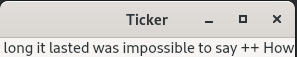

<!-- 7. 事件处理 -->


<!-- @import "[TOC]" {cmd="toc" depthFrom=1 depthTo=6 orderedList=false} -->
<!-- code_chunk_output -->

- [重新实现事件处理器](#重新实现事件处理器)
  - [Ticker.h](#tickerh)
  - [Ticker.cpp](#tickercpp)
- [安装事件过滤器](#安装事件过滤器)
- [处理密集时的响应保持](#处理密集时的响应保持)
- [Link](#link)

<!-- /code_chunk_output -->


事件 ([event](https://doc.qt.io/qt-5/events.html)) 是由窗口系统或者 Qt 自身产生的，用以响应所发生的各类事情。比如:键盘事件、鼠标事件、绘制事件等。大多数事件是作为用户动作的响应而产生的，但是也有一些例外，比如像定时器事件，则由系统独立产生的。

不应该混淆 "事件" 和 “信号” 这两个概念。一般情况下，在使用窗口部件的时候，信号是十分有用的；而在实现窗口部件时，事件则是十分有用的。

## 重新实现事件处理器

在 Qt 中，事件就是 [QEvent](https://doc.qt.io/qt-5/qevent.html) 子类的一个实例。Qt 处理的事件类型有一百多种，其中的每一种都可以通过一个枚举值来进行时别。例如， QEvent::type() 可以返回用于处理鼠标按键事件的 QEvent::MouseButtonPress。

通过继承 [QObject](https://doc.qt.io/qt-5/qobject.html) ，事件通过它们的 event() 函数来通知对象。在 QWidget 中的 event() 实现把绝大多数常用类型的事件提前传递给特定的事件处理器，比如 mousePressEvent() 、keyPressEvent() 以及 paintEvent().

再此将会回顾两种值得详述的常用事件类型：键盘事件和定时器事件。

通过重新实现 keyPressEvent() 和 keyReleaseEvent()，就可以处理键盘事件了。通常，我们只需要重新实现 keyPressEvent() 就可以了，因为用于表明释放重要性的键只有 Ctrl、Shift、和 Alt 这些修饰键，而这些键的状态可以在 keyPressEvent() 中使用 QKeyEvent::modifiers() 检测出来。例如，我们要区分按下的键是 Home 还是 Ctrl + Home ，它的 keyPressEvent() 函数中的部分内容看起来应该是这样的：
```c++
void CodeEditor::keyPressEvent(QKeyEvent *event)
{
  switch (event->key()) {
    case Qt::Key_Home:
    if (event->modifiers() & Qt::ControlModifier) {
      goToBeginningOfDocument();
    } else {
      goToBeginningOfLine();
      }
      break;
      case Qt::Key_End:
      ...
      default:
      QWidget::keyPressEvent(event);
    }
}
```

Tab 键 和 BackTab(Shift + Tab) 键是两种特殊情况。在窗口部件调用 keyPressEvent() 之前， QWidget::event() 会先处理它们，它所包含的语义就是用于把焦点传递给焦点序列中的下一个或者上一个窗口部件。如果我们想更改 Tab 键起到缩放文本行的作用，可以这样：
```c++
bool CodeEditor::event(QEvent *event)
{
if (event->type() == QEvent::KeyPress) {
    QKeyEvent * keyEvent = static_cast<QKeyEvent * >(event);
    if (keyEvent->key() == Qt::Key_Tab) {
      insertAtCurrentPosition('\t');
      return true;
    }
  }
  return QWidget::event(event);
}
```

实现键绑定的一种更为高级的方法是使用 [QAction](https://doc.qt.io/qt-5/qaction.html) 。 例如：
```c++
MainWindow::MainWindow()
{
  editor = new CodeEditor;
  setCentralWidget(editor);
  goToBeginningOfLineAction =
      new QAction(tr("Go to Beginning of Line"), this);
  goToBeginningOfLineAction->setShortcut(tr("Home"));
  connect(goToBeginningOfLineAction, SIGNAL(activated()),
      editor, SLOT(goToBeginningOfLine()));
  goToBeginningOfDocumentAction =
      new QAction(tr("Go to Beginning of Document"), this);
  goToBeginningOfDocumentAction->setShortcut(tr("Ctrl+Home"));
  connect(goToBeginningOfDocumentAction, SIGNAL(activated()),
      editor, SLOT(goToBeginningOfDocument()));
  ...
}
```
默认情况下，一旦把包含窗口部件的窗口激活，就可以在该窗口部件上使用 QAction 或 [QShortCut](https://doc.qt.io/qt-5/qshortcut.html) 来启用所设置的绑定键。但使用 QAction::setShortcutContext() 或者 QShortCut::setContext() 可以改变这一点。

另外一种常用的事件类型是定时器事件。eg：Ticker 窗口部件



### Ticker.h

```c++
#ifndef TICKER_H
#define TICKER_H

#include <QWidget>

class Ticker : public QWidget
{
    Q_OBJECT
    Q_PROPERTY(QString text READ text WRITE setText)

public:
    Ticker(QWidget * parent = 0);

    void setText(const QString &newText);
    QString text() const { return myText; }
    QSize sizeHint() const;

protected:
    void paintEvent(QPaintEvent * event) override;
    void timerEvent(QTimerEvent * event) override;
    void showEvent(QShowEvent * event) override;
    void hideEvent(QHideEvent * event) override;

private:
    QString myText;
    int offset;
    int myTimerId;
};

#endif
```

### Ticker.cpp
```c++
#include <QtWidgets>

#include "Ticker.h"

Ticker::Ticker(QWidget *parent)
    : QWidget(parent)
{
    offset = 0;
    // 定时器的 ID 通常是非零的，所以可以使用 0 来表示定时器还没有启动。
    myTimerId = 0;
}

void Ticker::setText(const QString &newText)
{
    myText = newText;
    // 强制执行一个重绘操作
    update();
    // 通知 Ticker 窗口部件负责的任意布局管理器，提示该窗口部件的大小发生了变化。
    updateGeometry();
}

// 以文本所需的空间大小作为窗口部件的理想尺寸
QSize Ticker::sizeHint() const
{
    return fontMetrics().size(0, text());
}

void Ticker::paintEvent(QPaintEvent * /* event */)
{
    QPainter painter(this);

    // 确定文本在水平方向上所需要的空间
    int textWidth = fontMetrics().width(text());
    if (textWidth < 1)
        return;

    // 多次绘制，直到能够填充整个窗口部件的宽度为止。
    int x = -offset;
    while (x < width()) {
        painter.drawText(x, 0, textWidth, height(),
                         Qt::AlignLeft | Qt::AlignVCenter, text());
        x += textWidth;
    }
}

void Ticker::showEvent(QShowEvent * /* event */)
{
    // 启动一个定时器，并返回定时器 ID
    myTimerId = startTimer(30); // 大约每30ms Qt 都会产生一个定时器事件。
    // 至于具体的时间精度，则取决于所在的操作系统
    // 我们本可以在构造函数中调用 startTimer(),但是在这里只有在窗口部件实际可见的时候
    // ，才有必要保存由 Qt 产生的定时器事件的那些资源
}

// 系统每隔一段时间，都会调用一次 timerEvent()
void Ticker::timerEvent(QTimerEvent *event)
{
    if (event->timerId() == myTimerId) {
        ++offset;
        if (offset >= fontMetrics().width(text()))
            offset = 0;
        // 把窗口部件的内容向左滚动一个像素
        scroll(-1, 0);
        // 本来也足可以调用 update() 代替 scroll(),
        // 但使用 scroll() 会更有效率，因为它只是简单地移动屏幕上已经存在的像素并且
        // 只对这个窗口部件的新显示区域（这里是 1 * width）产生一个绘制事件。
    } else {
        // 如果不是我们所关注的那个定时器，就可以把它传递给基类
        QWidget::timerEvent(event);
    }
}

void Ticker::hideEvent(QHideEvent * /* event */)
{
    // 停止定时器
    killTimer(myTimerId);
    myTimerId = 0;
}
```

定时器事件是一种低级事件，而且如果需要多个定时器时，保持对所有定时器 ID 的跟踪将会变得很麻烦。在这种情况下，通常更为简单的方式是为每一个定时器分别创建一个 [QTimer](https://doc.qt.io/qt-5/qtimer.html) 对象。QTimer 会在每个时间间隔发射 timeout() 信号。

```c++
// Example for a one second (1000 millisecond) timer
   QTimer *timer = new QTimer(this);
   connect(timer, &QTimer::timeout, this, QOverload<>::of(&AnalogClock::update));
   timer->start(1000);
```
QTimer 提供了非常方便的接口，可用于单触发定时器。
```c++
// You can set a timer to time out only once by calling setSingleShot(true).
//  You can also use the static QTimer::singleShot() function
//  to call a slot after a specified interval:
  QTimer::singleShot(200, this, SLOT(updateCaption()));
```

## 安装事件过滤器

Qt 的事件模式一个非常强大的功能是：QObject 实例在看到它自己的事件之前，可以通过设置另外一个 QObject 实例先监控这些事件。

假定有几个 QLineEdit 组成的 CustomerInfoDialog 窗口部件，并且我们想要使用 space 按键把光标移动到下一个 QLineEdit 中。一种更为直接的解决方案是子类化 QLineEdit 并且重新实现 keyPressEvent() ：
```c++
void MyLineEdit::keyPressEvent(QKeyEvent *event)
{
  if (event->key() == Qt::Key_Space) {
    focusNextChild();
  } else {
    QLineEdit::keyPressEvent(event);
  }
}
```
这个方法有一个主要的缺点：如果在窗体中使用了好几种不同类型的窗口部件，我们也必须对他们逐一子类化，以便让他们能够实现相同的行为。一个更好的解决方案是让 CustomerInfoDialog 监视它的子窗口部件中键的按下事件并且在监视代码中实现所需的行为。这种方法可以通过事件过滤器来实现。创建一个事件过滤器：
1. 通过对目标对象调用installEventFilter() 来注册监视对象。
2. 在监视对象的 evenFilter() 函数中处理目标对象的事件

eg:
```c++
CustomerInfoDialog::CustomerInfoDialog(QWidget *parent)
: QDialog(parent)
{
  ...
  firstNameEdit->installEventFilter(this);
  lastNameEdit->installEventFilter(this);
  cityEdit->installEventFilter(this);
  phoneNumberEdit->installEventFilter(this);
}
```

这个事件过滤器一旦注册，发送给 firstNameEdit、lastNameEdit、cityEdit 和 phoneNumberEdit 窗口部件的事件就会在它们达到目的地之前先发送给 CustomerInfoDialog 的 evenFilter() 函数。

```c++
bool CustomerInfoDialog::eventFilter(QObject *target, QEvent *event)
{
  if (target == firstNameEdit || target == lastNameEdit
    || target == cityEdit || target == phoneNumberEdit) {
      if (event->type() == QEvent::KeyPress) {
        QKeyEvent * keyEvent = static_cast<QKeyEvent * >(event);
        if (keyEvent->key() == Qt::Key_Space) {
          focusNextChild();
          return true;
        }
      }
    }
    // 这个目标窗口部件也可能是某个基类（比如 QDialog）正在监控的窗口部件。
    //（在 Qt4.3中，对于 QDialog 来说这不是什么问题。
    // 然而，其他的一些 Qt 窗口部件类，比如 QScrollArea
    // ,会因为各种各样的原因对他们自己的子窗口部件进行监控。）
  return QDialog::eventFilter(target, event);
}
```

Qt 提供了 5 个级别的事件处理和事件过滤方法：
1. 重新实现特殊的事件处理器(eg:mousePressEvent()...)
2. 重新实现 QObject::event().
当重新实现 event() 时，必须对那些没有明确处理的情况调用其基类的 event() 函数。
3. 在 QObject 中安装事件过滤器
对象一旦使用 installEventFilter() 注册过，对于目标对象的所有事件都会首先发送给这个监视对象的 evenFilter() 函数。如果在同一个对象上安装了多个事件处理器，那么就会按照安装顺序逆序，从最近安装的到最先安装的，依次激活这些事件处理器。
4. 在 QApplication 对象中安装事件过滤器
一旦在 qApp （唯一的 QApplication 对象）中注册了事件过滤器，那么应用程序中每个对象的每个事件都会在发送到其他事件过滤器之前，先发送给这个 evenFilter() 函数。这种处理方式对于调试是非常有用的。
5. 子类化 QApplication 并且重新实现 notify()
Qt 调用 QApplication::notify() 来发送一个事件。重新实现这个函数是在事件过滤器得到所有事件之前获得它们的唯一方式。事件过滤器通常更有用，因为可以同时有多个事件过滤器，而 notify() 函数却只能有一个。
很多事件类型，包括鼠标事件和按键事件，都可以对他们进行传递。如果在事件到达它的目标对象之前没有得到处理，或者也没有被它自己的目标对象处理，那么就会重复整个事件的过程，但这一次会把目标对象的父对象当作新的目标对象。这样一致继续下去，从父对象再到父对象的父对象，直到这个事件完全得到处理或者到达了最顶层的对象为止。


## 处理密集时的响应保持
当调用 QApplication::exec() 时，就启动了 Qt 的事件循环。在开始的时候，Qt 会发出一些事件命令来显示和绘制窗口部件。在这之后，事件循环就开始运行，它不断检查是否有事件发生并且把这些事件发送给应用程序中的 QObject。

当处理一个事件时，也可能会同时产生一些其他的事件并且会将其追加到Qt 的事件列表中。如果在处理一个特定事件上耗费的时间过多，那么用户界面就会变得无法响应。eg：应用完成一个耗时较长的文件保存。

在此情况下，一种解决方法就是使用多线程。
一种更为简单的解决方法是在文件保存的代码中频繁调用 QApplication::processEvent()。 这个函数告诉 Qt 处理所有那些还没有被处理的各类事件，然后再将控制权返还给调用者。实际上，QApplication::exec() 就是一个不停调用 processEvents() 函数的 while 循环。

```c++
bool Spreadsheet::writeFile(const QString &fileName)
{
  QFile file(fileName);
  ...
  QApplication::setOverrideCursor(Qt::WaitCursor);
  for (int row = 0; row < RowCount; ++row) {
    for (int column = 0; column < ColumnCount; ++column) {
      QString str = formula(row, column);
      if (!str.isEmpty())
      out << quint16(row) << quint16(column) << str;
    }
    qApp->processEvents();
  }
  QApplication::restoreOverrideCursor();
  return true;
}
```

使用这个方法存在一个潜在的问题，即用户也许在应用程序还在保存文件的时候就关闭了主窗口，或者甚至在保存文件的时候又一次单击了 File->Save ，这样就可能会产生不可预料的后果。对于这个问题，最简单的解决办法：
```c++
qApp->processEvents();
// 替换为
qApp->processEvents(QEventLoop::ExcludeUserInputEvents); // 忽略鼠标事件和键盘事件
```

通常情况下，当需要发生一个长时间运行的操作时，我们希望能够显示一个 [QProgressDialog](https://doc.qt.io/qt-5/qprogressdialog.html) 。 QProgressDialog 有一个进度条，它告诉用户应用程序中的这个操作目前的进度信息。QProgressDialog 还提供了一个 Cancel 按钮，它允许用户取消操作。

```c++
bool Spreadsheet::writeFile(const QString &fileName)
{
  QFile file(fileName);
  ...

  // 我们没有 对 QProgressDialog 调用 show(),
  // 这是因为进度对话框会自动调用它
  // 如果这个操作可以很快完成，QProgressDialog 就会检测到这个情况并且不再显示出来。

  QProgressDialog progress(this);
  progress.setLabelText(tr("Saving %1").arg(fileName));
  progress.setRange(0, RowCount);
  progress.setModal(true);

  for (int row = 0; row < RowCount; ++row) {
    progress.setValue(row);
    // 处理任意的重绘事件或者用户任意的鼠标单击或者按键事件（例如，要允许用户可以单击 Cancel）
    qApp->processEvents();

    if (progress.wasCanceled()) {
      file.remove();
      return false;
    }

    for (int column = 0; column < ColumnCount; ++column) {
      QString str = formula(row, column);
      if (!str.isEmpty())
      out << quint16(row) << quint16(column) << str;
    }
  }
  return true;
}
```

除使用多线程和 QProgressDialog 之外，还有一种处理长时间运行操作的完全不同的方法：不是在用户请求的时候执行处理，而是一直推迟到应用程序空闲下来的时候才处理。如果该处理可以被安全中断后继续，那么就可以使用这种方法了，因为我们并不能事先知道应用程序要多长时间后才能闲置下来。

在 Qt 中，通过使用一个 0 毫秒的定时器就可以实现这种方法。只要没有其他尚待处理的事件，就可以触发这个定时器。
```c++
void Spreadsheet::timerEvent(QTimerEvent *event)
{
  if (event->timerId() == myTimerId) {
    // 如果 hasPendingEvents() 的返回值是 true ,就停止处理并且把控制权交还给 Qt
    while (step < MaxStep && !qApp->hasPendingEvents()) {
      performStep(step);
      ++step;
    }
  } else {
    QTableWidget::timerEvent(event);
  }
}
```

## Link
* [qt5-book-code/chap07/](https://github.com/mutse/qt5-book-code/tree/master/chap07)

---
- [上一级](README.md)
- 上一篇 -> [6. 布局管理](6_layoutManage.md)
- 下一篇 -> [8. 二维图形](8_painter.md)
