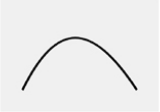

# 8. 二维图形


<!-- @import "[TOC]" {cmd="toc" depthFrom=1 depthTo=6 orderedList=false} -->
<!-- code_chunk_output -->

- [8. 二维图形](#8-二维图形)
  - [用 QPainter 绘图](#用-qpainter-绘图)
  - [坐标系统转换](#坐标系统转换)
    - [OvenTimer.h](#oventimerh)
    - [OvenTimer.cpp](#oventimercpp)
  - [用 QImage 高质量绘图](#用-qimage-高质量绘图)
  - [Link](#link)

<!-- /code_chunk_output -->

Qt 的二维图形引擎是基于 [QPainter](https://doc.qt.io/qt-5/qpainter.html)。 QPainter 即可以绘制几何形状（点、线、矩形、椭圆、弧形、弦型、饼状图、多边形和贝塞尔曲线），也可以绘制像素映射、图像和文字。此外，QPainter 还支持一些高级特性，例如反走样（针对文字和图形边缘）、像素混合、渐变填充和矢量路径等。QPainter 也支持线性变换，例如平移、旋转、错切和缩放。

QPainter 可以画在 “绘图设备”上，例如 QWidget、QPixmap、 [QImage](https://doc.qt.io/qt-5/qimage.html) 或者 [QSvgGenerator](https://doc.qt.io/qt-5/qsvggenerator.html)。 QPainter 也可以与 [QPrinter](https://doc.qt.io/qt-5/qprinter.html) 一起使用来打印文件和创建 PDF 文档。这意味着通常可以用相同的代码在屏幕上显示数据，也可以生成打印形式的报告。

重新实现 QWidget::paintEvent() 可用于定制窗口部件，并且随心所欲地控制它们地外观。定制预定义 Qt 窗口部件地外观，可以指定某一风格地表单或者创建一个 [QStyle](https://doc.qt.io/qt-5/qstyle.html) 的子类。

一项普通的需求是在二维画板上显示大量的、轻量级的、可与用户交互的、任意形状的项。Qt 4.2 围绕着 [QGraphicsView ](https://doc.qt.io/qt-5/qgraphicsview.html)、 [QGraphicsScene](https://doc.qt.io/qt-5/qgraphicsscene.html)和 [QGraphicsItem](https://doc.qt.io/qt-5/qgraphicsitem.html) 类引入了全新的 “图形视图”体系。这个体系提供了一个操作基于项的图形的高级接口，并且支持用户对项的操作，包括移动、选取、分组。项本身依然用 QPainter 画出，并且可以独立变换。本章稍后将会描述这一体系。

可以使用 [OpenGL](https://doc.qt.io/qt-5/qtopengl-index.html) 命令来代替 QPainter。 OpenGL 是一个绘制三维图形的标准库。后面章节再说。

## 用 QPainter 绘图
要想在绘图设备上绘图，只需创建一个 QPainter ，再将指针传递到该设备中。
```c++
void MyWidget::paintEvent(QPaintEvent *event)
{
  QPainter painter(this);
  ...
}
```
使用 QPainter 的 draw...() 函数，可以绘制各种各样的形状。

最重要的一些函数：


绘制的效果取决于 QPainter 的设置。主要的设置：
* 画笔 - 用来画线和边缘。它包含颜色、宽度、线型、拐点风格以及连接风格。


* 画刷 - 用来填充几何形状的图案。它一般由颜色和风格组成，但同时也可以是纹理（一个不断重复的图案）或者是一个渐变。


* 字体 - 用来绘制文字。字体有很多属性，包括字体族和磅值大小。

可以随时调用 [QPen](https://doc.qt.io/qt-5/qpen.html) 、 [QBrush]() 或者 [QFont](https://doc.qt.io/qt-5/qfont.html) 的 setPen() setBrush() setFont() 来修改这些设置。

绘制椭圆的代码：
```c++
  QPainter painter(this);
  // 启用反走样，它会告诉 QPainter 用不同的颜色强度绘制边框以减少视觉扭曲
  // ，这种扭曲一般会在边框转换为像素时发生。
  painter.setRenderHint(QPainter::Antialiasing, true);
  painter.setPen(QPen(Qt::black, 12, Qt::DashDotLine, Qt::RoundCap));
  painter.setBrush(QBrush(Qt::green, Qt::SolidPattern));
  painter.drawEllipse(80, 80, 400, 240);
```


绘制饼状图：
```c++
  QPainter painter(this);
  painter.setRenderHint(QPainter::Antialiasing, true);
  painter.setPen(QPen(Qt::black, 15, Qt::SolidLine, Qt::RoundCap,
  Qt::MiterJoin));
  painter.setBrush(QBrush(Qt::blue, Qt::DiagCrossPattern));
  // drawPie 的最后两个参数以 1/16 为单位
  painter.drawPie(80, 80, 400, 240, 60 * 16, 270 * 16);
```


绘制 “三次贝塞尔曲线”：
```c++
  QPainter painter(this);
  painter.setRenderHint(QPainter::Antialiasing, true);
  QPainterPath path;
  path.moveTo(80, 320);
  path.cubicTo(200, 80, 320, 80, 480, 320);
  painter.setPen(QPen(Qt::black, 8));
  painter.drawPath(path);
```



[QPainterPath](https://doc.qt.io/qt-5/qpainterpath.html) 类可以通过连接基本的图形元素来确定任意的矢量形状：直线、椭圆、多边形、弧形、贝塞尔曲线和其他绘制路径。绘制路径是最基本的图元。从这个意义上来说，任何图形或图形组合都可以用来绘制路径描述。

路径可以确定一个边缘，由边缘锁定的区域可以用画刷来填充。上面的例子中没有设置画刷，所以只能看见边缘。

这三个例子利用内置的画刷模式(Qt::SolidPattern、Qt::DiagCrossPattern 、 Qt::NoBrush） 。在现代应用中，渐变填充已成为单色填充的流行替代品。渐变填充利用颜色插值使得两个或更多颜色之间能够平滑过渡。它们常被用来创建三维效果 ,[Plastique](https://doc.qt.io/archives/qt-4.8/gallery-plastique.html) 和 [Cleanlooks](https://doc.qt.io/archives/qt-4.8/gallery-cleanlooks.html) 就是使用渐变来渲染 QPushButton的。

Qt 支持三种类型的渐变：线性渐变、锥形渐变和辐射渐变。下一节中的烤箱定时器的例子就是在一个独立的窗口部件上结合了这三种类型的渐变，从而看起来更加逼真。

* 线性渐变(linear gradient) 由两个控制点定义，连接这两个点的线上有一系列的颜色断点。 [QLinearGradient](https://doc.qt.io/qt-5/qlineargradient.html)
 例如：
```c++
  // 在两个控制点之间的不同位置指定三种颜色。位置用 0 和 1 之间的浮点数来指定
  //，0 对应第一个控制点，1 对应第二个控制点。两个指定断点之间的颜色由线性插值得出。
  QLinearGradient gradient(50, 100, 300, 350);
  gradient.setColorAt(0.0, Qt::white);
  gradient.setColorAt(0.2, Qt::green);
  gradient.setColorAt(1.0, Qt::black);
```


* 辐射渐变(radio gradient) 由一个中心点(xc,yc)、半径 r、一个焦点(xf,yf),以及颜色断点定义。中心点和半径定义一个圆。颜色从焦点向外扩散，焦点可以是中心点或者圆内的其他点。 [QRadialGradient](https://doc.qt.io/qt-5/qradialgradient.html)


* 锥形渐变(conical gradient)由一个中心点(xc,yc) 和一个角度 a 定义。颜色在中心点周围像钟表的秒针一样扩散。 [QConicalGradient](https://doc.qt.io/qt-5/qconicalgradient.html)


另外，QPainter 还有其他影响图形和文字绘制方式的设置：
* 当背景模式是 Qt::OpaqueMode(默认设置是 Qt::TransparentMode) 时，背景画刷可以用来填充几何图形的背景（画刷模式下）、文字或者位图。
* 画刷的原点是画刷模式的启动点，通常是窗口部件的左上角。
* 剪切区域是设备的绘图区域。在剪切区域以外绘图不起作用。
* 视图、窗口和世界矩阵决定了如何将 QPainter 的逻辑坐标映射到设备的物理绘图坐标。默认情况下，为了使逻辑坐标和物理坐标保持一致，这些是设置好的。下一节描述坐标系统。
* 复合模式指定新绘制的像素如何更绘图设备上已经显示的像素相互作用。默认方式是 "source over"，在这种情况下像素会被 alpha 混合在存在的像素上。只有特定的设备支持这种模式，本章稍后将描述这种模式。

可以通过调用 save() 而随时将设备的当前状态存入一个内部堆栈，稍后通过调用 restore() 恢复。这对我们如果想临时修改一些设备的设置然后恢复到以前的状态会很有用，会在下一节见到这种情况。

## 坐标系统转换

在 QPainter 的默认坐标体系中，点(0.0) 位于绘图设备的左上角，x 坐标向右增长，y坐标向下增长。默认坐标系的每个像素占 1*1 大小的区域。

理论上，像素的中心取决于半像素的坐标。例如，窗口部件的左上角像素覆盖了点(0,0)到点(1,1)的区域，它的中心点在 (0.5,0.5) 位置。如果告诉 QPainter 绘制一个像素，例如(100,100)，它会相应地在两个方向做 + 0.5 的偏移，使得像素地中心位置在(100.5,100.5)。

这一差别初看起来理论性很强，但他在实践中却很重要。首先，只有当反走样无效时（默认情况）才偏移 +0.5; 如果反走样有效，并且我们试图在 (100,100) 的位置绘制一个黑色像素，实际上 QPainter 会为 (99.5,99.5) (99.5,100.5) (100.5,99.5) (100.5,100.5) 四个像素点着浅灰色，给人的印象是一个像素正好位于四个像素的重合处。如果不需要这种效果，可以通过指定半像素坐标或者通过偏移 QPainter(+0.5,+0.5) 来避免这种效果。

当绘制图形时，例如线、矩形和椭圆，可以使用相似的规则。

未经反走样处理的 drawRect(2,2,6,5) 函数的绘制效果


反走样处理的 drawRect(2,2,6,5) 函数的绘制效果


反走样处理的 drawRect(2.5,2.5,6,5) 函数的绘制效果


窗口和视口密不可分。视口是物理坐标系下指定的任意矩形。窗口也是指同一矩形，只不过是在逻辑坐标系下。当绘制图形时，在逻辑坐标系下指定的点，这些坐标都是基于当前窗口-视口设定并以线性代数的方式转换为物理坐标的。

默认情况下，视口和窗口都被设置成设备的矩形。例如，如果设备是 320 x 200 的矩形，视口和窗口都是左上角为（0,0）的 320 x 200 的相同矩形。这种情况下，逻辑坐标和物理坐标系是一致的。

这种窗口 - 视口机制对于编写独立于绘制设备大小和分辨率的绘制代码是很有用的。例如，如果想让逻辑坐标从 (-50,-50) 到 (+50,+50),并且(0,0) 在中间，可以这样设置：
```c++
painter.setWindow(-50,-50,100,100);
```
(-50,-50)指定了原点，(100,100) 指定了宽和高。这意味着逻辑坐标(-50,-50)对应物理坐标(0,0)，而逻辑坐标(+50,+50) 对应物理坐标（320,200）。如图所示。这个例子没有改变视口。


现在来介绍世界变换。世界变换(world transform)是在 窗口 - 视口转换之外使用的变换矩阵。它允许移动、缩放、旋转或者拉伸绘制的项。 [Transformations Example](https://doc.qt.io/qt-5/qtwidgets-painting-transformations-example.html), [QTransform](https://doc.qt.io/qt-5/qtransform.html)
例如，如果想以 45度 角绘制文本，可以这样：
```c++
  QTransform transform;
  transform.rotate(+45.0);
  painter.setWorldTransform(transform);
  // 会被世界变换转换，然后使用 窗口 - 视口 设置映射到物理。
  painter.drawText(pos, tr("Sales"));
```
如果进行了多次变换，它们会按照给定的顺序生效。例如，如果想要使用点 （50,50） 作为旋转的中心点，可以移动窗口到(+50,+50)，执行旋转，然后在把窗口移回原来的初始位置。
```c++
  QTransform transform;
  transform.translate(+50.0, +50.0);
  transform.rotate(+45.0);
  transform.translate(-50.0, -50.0);
  painter.setWorldTransform(transform);
  painter.drawText(pos, tr("Sales"));
```

坐标转换的一种更为简单的方式是使用 QPainter 的 translate() 、 scale() 、 rotate() 和 shear() 这些简便函数。
```c++
  painter.translate(-50.0, -50.0);
  painter.rotate(+45.0);
  painter.translate(+50.0, +50.0);
  painter.drawText(pos, tr("Sales"));
```
如果想重复使用相同的变换，可以把他们保存到一个 QTransform 对象中，这样会更高效。在需要变换的时候，再把世界变换设置到绘制器上。

示例： OvenTimer 模仿烤箱的定时器。用户可以单击刻度来设置持续时间。转轮会自动地逆时针转到 0， OvenTimer 在一点发射 timeout() 信号。


### OvenTimer.h
```c++
#ifndef OVENTIMER_H
#define OVENTIMER_H

#include <QDateTime>
#include <QWidget>

QT_BEGIN_NAMESPACE
class QTimer;
QT_END_NAMESPACE

class OvenTimer : public QWidget
{
    Q_OBJECT

public:
    OvenTimer(QWidget * parent = 0);

    void setDuration(int secs);
    int duration() const;
    void draw(QPainter * painter);

signals:
    void timeout();

protected:
    void paintEvent(QPaintEvent * event) override;
    void mousePressEvent(QMouseEvent * event) override;

private:
    // 保存日期和时间，避免了由于当前时间是在午夜之前并且完成时间是在午夜之后
    // 而产生的折回缺陷(wrap-around bug)
    QDateTime finishTime;
    QTimer * updateTimer;
    QTimer * finishTimer;
};

#endif
```

### OvenTimer.cpp
```c++
#include <QtWidgets>
#include <cmath>

#ifndef M_PI
#define M_PI 3.14159265359
#endif

#include "OvenTimer.h"

const double DegreesPerMinute = 7.0;
const double DegreesPerSecond = DegreesPerMinute / 60;
const int MaxMinutes = 45;
const int MaxSeconds = MaxMinutes * 60;
const int UpdateInterval = 5;

OvenTimer::OvenTimer(QWidget *parent)
    : QWidget(parent)
{
    finishTime = QDateTime::currentDateTime();

    // 用来每隔 5 秒刷新窗口部件的外观
    updateTimer = new QTimer(this);
    connect(updateTimer, SIGNAL(timeout()), this, SLOT(update()));

    // 在定时器达到 0 时发射 timeout() 信号
    finishTimer = new QTimer(this);
    // 设置只执行一次
    finishTimer->setSingleShot(true);
    connect(finishTimer, SIGNAL(timeout()), this, SIGNAL(timeout()));
    // 当定时器停止运行时停止更新窗口部件
    connect(finishTimer, SIGNAL(timeout()), updateTimer, SLOT(stop()));

    QFont font;
    // 设置字体的磅值为 8
    font.setPointSize(8);
    setFont(font);
}

void OvenTimer::setDuration(int secs)
{
    secs = qBound(0, secs, MaxSeconds);
    // 使用qBound(),可以避免这样的代码
    // if (secs < 0) {
    //   secs = 0;
    // } else if (secs > MaxSeconds) {
    //   secs = MaxSeconds;
    // }

    // 得到结束时间
    finishTime = QDateTime::currentDateTime().addSecs(secs);

    if (secs > 0) {
        updateTimer->start(UpdateInterval * 1000);
        finishTimer->start(secs * 1000);
    } else {
        updateTimer->stop();
        finishTimer->stop();
    }
    // 重绘
    update();
}

// 返回定时器完成前剩余的秒数
int OvenTimer::duration() const
{
    int secs = QDateTime::currentDateTime().secsTo(finishTime);
    if (secs < 0)
        secs = 0;
    return secs;
}

void OvenTimer::mousePressEvent(QMouseEvent *event)
{
    // 找到离点击位置最近的刻度
    // 并且使用这个结果来设置新的持续时间
    // 然后安排一个重绘
    QPointF point = event->pos() - rect().center();
    double theta = std::atan2(-point.x(), -point.y()) * 180.0 / M_PI;
    setDuration(duration() + int(theta / DegreesPerSecond));
    update();
}

void OvenTimer::paintEvent(QPaintEvent * /* event */)
{
    QPainter painter(this);
    painter.setRenderHint(QPainter::Antialiasing, true);

    int side = qMin(width(), height());

    // 设置视口为正方形。如果没有的话，当窗口部件被缩放为非正方形的矩形时，烤箱定时器就会变成椭圆。
    // 为了避免这种变形，必须把视口和窗口设置成具有相同纵横比的矩形。
    painter.setViewport((width() - side) / 2, (height() - side) / 2,
                        side, side);

    // 设置窗口
    painter.setWindow(-50, -50, 100, 100);

    draw(&painter);
}

void OvenTimer::draw(QPainter *painter)
{
    static const int triangle[3][2] = {
        { -2, -49 }, { +2, -49 }, { 0, -47 }
    };
    QPen thickPen(palette().foreground(), 1.5);
    QPen thinPen(palette().foreground(), 0.5);
    QColor niceBlue(150, 150, 200);

    painter->setPen(thinPen);
    painter->setBrush(palette().foreground());
    // 在窗口部件顶部的 0 位置绘制一个小三角形
    painter->drawPolygon(QPolygon(3, &triangle[0][0]));

    // 绘制外面的圆，用锥形渐变填充。锥形的中心点位于 (0,0) ，角度是 -90 度。
    QConicalGradient coneGradient(0, 0, -90.0);
    coneGradient.setColorAt(0.0, Qt::darkGray);
    coneGradient.setColorAt(0.2, niceBlue);
    coneGradient.setColorAt(0.5, Qt::white);
    coneGradient.setColorAt(1.0, Qt::darkGray);

    painter->setBrush(coneGradient);
    painter->drawEllipse(-46, -46, 92, 92);

    // 用辐射渐变填充内部的圆。渐变的中心点和焦点都在 (0,0) 。渐变半径是 20.
    QRadialGradient haloGradient(0, 0, 20, 0, 0);
    haloGradient.setColorAt(0.0, Qt::lightGray);
    haloGradient.setColorAt(0.8, Qt::darkGray);
    haloGradient.setColorAt(0.9, Qt::white);
    haloGradient.setColorAt(1.0, Qt::black);

    painter->setPen(Qt::NoPen);
    painter->setBrush(haloGradient);
    painter->drawEllipse(-20, -20, 40, 40);

    QLinearGradient knobGradient(-7, -25, 7, -25);
    knobGradient.setColorAt(0.0, Qt::black);
    knobGradient.setColorAt(0.2, niceBlue);
    knobGradient.setColorAt(0.3, Qt::lightGray);
    knobGradient.setColorAt(0.8, Qt::white);
    knobGradient.setColorAt(1.0, Qt::black);

    // 旋转绘图器的坐标系统。
    // 在旧的坐标系统中， 0 minute 的标记在最上面；
    // 现在，这个标记移到了对应着剩余时间的位置
    painter->rotate(duration() * DegreesPerSecond);
    painter->setBrush(knobGradient);
    painter->setPen(thinPen);
    // 绘制矩形把手
    painter->drawRoundRect(-7, -25, 14, 50, 99, 49);

    // 绘制外面圆的边缘标记
    for (int i = 0; i <= MaxMinutes; ++i) {
      painter->save();
        if (i % 5 == 0) {
            painter->setPen(thickPen);
            painter->drawLine(0, -41, 0, -44);
            painter->drawText(-15, -41, 30, 30,
                              Qt::AlignHCenter | Qt::AlignTop,
                              QString::number(i));
        } else {
            painter->setPen(thinPen);
            painter->drawLine(0, -42, 0, -44);
        }
        painter->rotate(-DegreesPerMinute);
    }
    painter->restore();
}

// 添加 painter->save() 和 painter->restore() 为每次迭代保存和加载原始的矩阵。
// 为了避免浮点数的舍入误差不断累积，得到越来越不准确的世界变换。
```
实现烤箱定时器的另外一个办法是自己计算(x,y) 的位置，使用 sin() ,cos() 函数找到圆上的位置。但之后仍然需要利用移动和旋转并以一定的角度来绘制文本。


## 用 QImage 高质量绘图
绘图时，我们可能要面对速度和准确率折中的问题。例如，在 X11 和 Mac OS X 系统中，要在 QWidget 或 QPixmap 上绘图，需要依赖于平台自带的绘图引擎。在 X11 上，这保证了与 X 服务器的通信限制在一个最小集；仅仅发送绘图命令，而不是图像数据。这一方法的主要缺点是 Qt 受限与平台的内在支持：
* 在 X11 上，类似反走样以及对分数坐标的支持只有当 X 服务器上存在 X 渲染扩展时才有效。
* 在 Mac OS X 上，内置的走样绘图引擎使用与 X11 和 windows 不同的算法绘制多边形，绘制结果也稍有不同。

当准确率比效率更为重要的时候，我们可以画到一个 [QImage](https://doc.qt.io/qt-5/qimage.html) 上，然后把结果复制到屏幕上。这样可以总是使用 Qt 自己内置的绘图引擎，在所有平台上得到同样的结果。唯一的限制就是 QImage 在被创建时会用到 QImage::Format_RGB32 或者 QImage::Format_ARGB32_Premultiplied 参数。

预乘 ARGB32 格式与常规的 ARGB32 格式差不多是一样的，不同之处在于 红、绿和蓝通道自左乘 alpha(透明)通道。这意味着，RGB 通道的值，一般是从 0x00 到 0xFF ，变换为从 0x00 到透明通道的值。例如，50% 透明的蓝色用 ARGB32表示为 0x7F0000FF ,但预乘 ARGB32表示为 0x7F00007F。同样的 75% 透明的黑绿用 ARGB32表示为 0x3F008000 ,但预乘 ARGB32表示为 0x3F002000。

即设我们想应用反走样绘制一个窗口部件，并且想在没有 X 渲染扩展的 X11 系统上获得很好的结果。原始的 paintEvent() 处理器，反走样依赖于 X 渲染的代码类似于：
```c++
void MyWidget::paintEvent(QPaintEvent *event)
{
  QPainter painter(this);
  painter.setRenderHint(QPainter::Antialiasing, true);
  draw(&painter);
}
```
使用 Qt 的平台无关的绘图引擎重写窗口部件的 paintEvent() 函数：
```c++
// 这种方法在所有平台上产生同样高质量的结果，对于字体渲染，依赖于安装的字体库
void MyWidget::paintEvent(QPaintEvent *event)
{
  // 我们以预乘 ARGB32 格式创建一个跟窗口部件大小一致的 QImage
  // ,以及一个 QPainter 引用此图像。
  QImage image(size(), QImage::Format_ARGB32_Premultiplied);
  QPainter imagePainter(&image);
  // 初始化画笔背景和字体
  imagePainter.initFrom(this);
  imagePainter.setRenderHint(QPainter::Antialiasing, true);
  imagePainter.eraseRect(rect());
  draw(&imagePainter);
  imagePainter.end();
  QPainter widgetPainter(this);
  // 把图像复制到窗口部件上
  widgetPainter.drawImage(0, 0, image);
}
```

Qt 的图像引擎的一个特别强大的特性是它支持复合模式。这规范了源和目的像素如何在绘制时复合在一起。该模式可以用于所有绘制操作，包括画笔，画刷，渐变以及图像绘制。

默认的复合模式是 QImage::CompositionMode_sourceOver，这意味着源像素（正在绘制的像素）被混合在目的像素（已存在的像素）上，这样，源图像的透明部分给我们以透明效果。下图列举了应用不同模式在（玻璃钢化时的）风嘴印图像（目的图像）上绘制一个半透明的蝴蝶（源图像）的效果。


使用 QPainter::setCompositionMode() 可以设置各种复合模式。例如，下面就是如何设置蝴蝶和风嘴印图像 XOR 复合模式的代码：
```c++
  QImage resultImage = checkerPatternImage;
  QPainter painter(&resultImage);
  painter.setCompositionMode(QPainter::CompositionMode_Xor);
  painter.drawImage(0, 0, butterflyImage);
```
值得注意的是，QImage::CompositionMode_Xor 操作也会影响到透明通道。这意味着，如果白色(0xFFFFFFFF)对自己做 XOR 复合，会得到透明色(0x00000000),而不是黑色(0xFF000000)。

## Link
* [qt5-book-code/chap08/](https://github.com/mutse/qt5-book-code/tree/master/chap08)

[上一级](README.md)
[上一篇](7_event.md)
[下一篇](14_multiThread.md)
