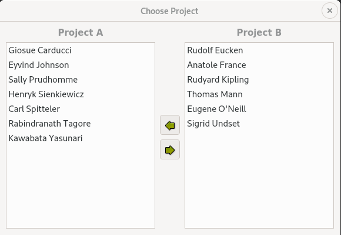

# 9. 拖放


<!-- @import "[TOC]" {cmd="toc" depthFrom=1 depthTo=6 orderedList=false} -->
<!-- code_chunk_output -->

- [9. 拖放](#9-拖放)
  - [使拖放生效](#使拖放生效)
  - [支持自定义拖动类型](#支持自定义拖动类型)
  - [剪贴板处理技术](#剪贴板处理技术)
  - [Link](#link)

<!-- /code_chunk_output -->

拖放是在一个应用程序内或者多个应用程序之间传递信息的一种直观的现代化操作方式。除了为剪贴板提供支持外，通常它还提供数据移动和复制的功能。

在这一章中，将首先介绍如何为 Qt 应用程序添加支持拖放的功能以及如何处理自定义格式。然后，将介绍如何复用拖动代码来实现对剪贴板的支持。之所以能够复用这些代码，是因为拖放与剪贴板的功能原理均以 [QMimeData](https://doc.qt.io/qt-5/qmimedata.html) 类为基础的，而 QMimeData 是一个可以提供不同格式数据的类。

## 使拖放生效

拖放操作包括两个截然不同的操作：拖动和放下。Qt 窗口部件可以作为拖动点(drag site)、放下点(drop site)或者同时作为拖动点和放下点。

eg：一个以 [QTextEdit](https://doc.qt.io/qt-5/qtextedit.html) 作为中央窗口部件的主窗口程序。当用户从桌面上或者从文件资源管理器中拖动一个文本文件并且在这个应用程序中放下时，该应用程序就会将文本文件载入到 QTextEdit 中。

```c++
class MainWindow : public QMainWindow
{
  Q_OBJECT
  public:
  MainWindow();
  protected:
  void dragEnterEvent(QDragEnterEvent * event) override;
  void dropEvent(QDropEvent * event) override;
  private:
  bool readFile(const QString &fileName);
  QTextEdit * textEdit;
};

MainWindow::MainWindow()
{
  textEdit = new QTextEdit;
  setCentralWidget(textEdit);
  textEdit->setAcceptDrops(false);
  setAcceptDrops(true);
  setWindowTitle(tr("Text Editor"));
}
```
默认情况下，QTextEdit 可以接受来自其他应用程序文本的拖动，并且如果用户在它上面放下一个文件，它将会把这个文件的名称插入到文本中。由于拖放事件是从子窗口部件传递到父窗口部件的，所以通过禁用 QTextEdit 上的放下操作以及器用主窗口上的放下操作，就可以在整个 MainWindow 窗口中获得放下事件。

```c++
void MainWindow::dragEnterEvent(QDragEnterEvent *event)
{
  if (event->mimeData()->hasFormat("text/uri-list"))
    event->acceptProposedAction();
}
```
当用户把一个对象拖动到这个窗口部件上时，就会调用 dragEnterEvent().如果对这个事件调用 acceptProposedAction()，就表明用户可以在这个窗口部件上拖放对象。默认情况下，窗口部件是不接受拖动的。Qt 会自动改变光标来向用户说明这个窗口部件是不是有效的放下点。

这里我们希望用户拖动的只能是文件，而非其他类型的东西。为了实现这一点我们可以检查拖动的 MIME 类型。MIME 类型中的 text/uri-list 用于存储一系列的统一资源标识符(universal Resource Identifier,URI) ，它们可以是文件名、统一资源定位器（Uniform Resource Locator，URL，如 HTTP或者 FTP 路径）,或者其他全局资源标识符。标准的 MIME 类型是由 IANA 定义的，它们由类型、子类型信息以及分隔两者的斜线组成。MIME 类通常由剪贴板和拖放系统使用，以识别不同类型的数据。 [MIME](http://www.iana.org/assignments/media-types/).

```c++
void MainWindow::dropEvent(QDropEvent *event)
{
  QList<QUrl> urls = event->mimeData()->urls();
  if (urls.isEmpty())
    return;
  QString fileName = urls.first().toLocalFile();
  if (fileName.isEmpty())
    return;
  if (readFile(fileName))
    setWindowTitle(tr("%1 - %2").arg(fileName)
          .arg(tr("Drag File")));
}
```
当用户在窗口部件上放下一个对象时，就会调用 dropEvent().我们调用 QMimeData::urls() 来获得 [QUrl](https://doc.qt.io/qt-5/qurl.html) 列表。通常，用户一次只拖动一个文件，但是通过拖动一个选择区域来同时拖动多个文件也是可能的。

QWidget 也提供了 dragMoveEvent() 和 dragLeaveEvent() 函数，但是在绝大多数应用程序中并不需要重新实现它们。


eg 2： 描绘如何初始化一个拖动并且接受一个放下。
Project Chooser app 为用户提供了两个由姓名组成的列表框。两个列表框分别代表一个项目。用户可以在两个项目列表框之间拖放这些姓名，将一个项目中的成员移动到另一个项目中。



ProjectListWidget.h:
```c++
#ifndef PROJECTLISTWIDGET_H
#define PROJECTLISTWIDGET_H

#include <QListWidget>

class ProjectListWidget : public QListWidget
{
    Q_OBJECT

public:
    ProjectListWidget(QWidget * parent = 0);

protected:
    void mousePressEvent(QMouseEvent * event) override;
    void mouseMoveEvent(QMouseEvent * event) override;
    void dragEnterEvent(QDragEnterEvent * event) override;
    void dragMoveEvent(QDragMoveEvent * event) override;
    void dropEvent(QDropEvent * event) override;

private:
    void performDrag();

    QPoint startPos;
};

#endif
```

ProjectListWidget.cpp:
```c++
#include <QtWidgets>

#include "ProjectListWidget.h"

ProjectListWidget::ProjectListWidget(QWidget *parent)
    : QListWidget(parent)
{
    // 使列表框上的放下生效
    setAcceptDrops(true);
}

void ProjectListWidget::mousePressEvent(QMouseEvent *event)
{
    if (event->button() == Qt::LeftButton)
        startPos = event->pos();
    QListWidget::mousePressEvent(event);
}

void ProjectListWidget::mouseMoveEvent(QMouseEvent *event)
{
    if (event->buttons() & Qt::LeftButton) {
        // 计算当前鼠标位置和原来鼠标左键按下的点之间的距离 - 这个 “曼哈顿长度” 其实
        // 是从坐标原点到该矢量长度快速计算的近似值。如果这个距离大于或者等于 QApplication
        // 推荐的拖动起始距离（通常是 4 个像素），那么就调用 performDrag() 以启用拖动操作。
        // 这可以避免用户因为手握鼠标抖动而产生拖动
        int distance = (event->pos() - startPos).manhattanLength();
        if (distance >= QApplication::startDragDistance())
            performDrag();
    }
    QListWidget::mouseMoveEvent(event);
}

// 接收拖动
void ProjectListWidget::dragEnterEvent(QDragEnterEvent *event)
{
    // QDragEnterEvent::source() 返回一个启动这个拖动的窗口部件的指针；
    // 否则，返回一个空指针。
    ProjectListWidget * source =
            qobject_cast<ProjectListWidget * >(event->source());
    if (source && source != this) {
        // 告诉 Qt 预备将该动作认为是一个移动操作
        event->setDropAction(Qt::MoveAction);
        event->accept();
    }
}

// 与 dragEnterEvent() 中编写的代码基本相同。这样是必要的
// ，因为需要重写 QListWidget 的函数实现。
void ProjectListWidget::dragMoveEvent(QDragMoveEvent *event)
{
    ProjectListWidget * source =
            qobject_cast<ProjectListWidget * >(event->source());
    if (source && source != this) {
        event->setDropAction(Qt::MoveAction);
        event->accept();
    }
}

void ProjectListWidget::dropEvent(QDropEvent *event)
{
    ProjectListWidget * source =
            qobject_cast<ProjectListWidget * >(event->source());
    if (source && source != this) {
        addItem(event->mimeData()->text());
        // 告诉源窗口部件现在可以删除原来的拖动项了
        event->setDropAction(Qt::MoveAction);
        event->accept();
    }
}

void ProjectListWidget::performDrag()
{
    QListWidgetItem * item = currentItem();
    if (item) {
        QMimeData * mimeData = new QMimeData;
        // QMimeData 提供了一些可用于处理最常用拖放类型（诸如图像、URL、颜色等等）的函数
        // ，同时也可以处理任意由 QByteArrays 表示的 MIME 类型。
        mimeData->setText(item->text());

        // 这个 QDrag 对象将数据存储在 QMimeData 对象中。
        QDrag * drag = new QDrag(this);
        drag->setMimeData(mimeData);
        // 实现在拖动发生时图标随光标移动
        drag->setPixmap(QPixmap(":/images/person.png"));

        // QDrag::exec() 调用启动并执行拖放操作，直到用户放下或者取消此次拖动操作才会停止。
        // 它把所有支持的 “拖放操作” （如 Qt::CopyAction,Qt::MoveAction 和 Qt::LinkAction）的组合作为其参数，
        // 并且返回被执行的拖放操作（如果没有执行任何动作，则返回 Qt::IgnoreAction）。至于执行的是哪个动作
        // ，取决于放下发生时源窗口部件是否允许、目标是否支持及按下了哪些组合键。
        //在 exec() 调用后，Qt 拥有拖放对象的所有权并且可以在不需要它的时候删除它。

        if (drag->exec(Qt::MoveAction) == Qt::MoveAction)
            delete item;
    }
}
```

拖放是在应用程序之间传递数据的有力机制。但是在某些情况下，有可能在执行拖放时并未使用 Qt 的拖放工具。如果只是想再一个应用程序的窗口部件中移动数据，通常只需要重新实现 mousePressEvent() 和 mouseReleaseEvent() 函数就可以了。

## 支持自定义拖动类型

目前为止所讲过的实例中，都是依靠 QMimeData 来支持通用的 MIME 类型。因此，我们调用 QMimeData::setText() 来创建一个文本拖动，并且使用 QMimeData::urls() 来重新找回 text/uri-list 拖动的内容。如果想拖动纯文本、超文本、图像、URL 甚至颜色，则可以只使用 QMimeData 类而不必采用其他手段。但如果想拖动的是自定义数据，则必须选择如下三种方式之一：
1. 使用 QMimeData::setData(),可以提供任意数据作为 QByteArray 的内容，并且在随后利用 QMimeData::data() 提取这些数据。
2. 可以通过子类化 QMimeData 并且重新实现 formats() 和 retrieveData() 来处理自定义数据类型。
3. 对于在简单应用程序中的拖放操作，可以子类化 QMimeData 并且利用我们所需要的任意数据结构来存储数据。

第一种方法虽不涉及到任何子类化，但它也有一些缺点：即使这个拖动没有被最后接收，仍需将数据结构转换为 QByteArray。另外，如果想提供几个 MIME 类型与应用程序在更广的范围内进行良好的交互，则必须对每一个 MIME 类型的数据进行存储。如果数据较大，这将不必要地减缓应用程序的运行速度。第二种和第三种方法则可以避免或者使这种问题的影响最小化，它们不仅将控制权完全交给用户，而且还可以一起使用。

为了说明这些方法是如何运作的，我们将给出一个如何给 QTableWidget 添加拖放功能的例子。拖动将支持以下的 MIME 类型： text/plain、 text/html 和 text/csv。 使用第一种方法，按如下的代码开始一个拖动：
```c++
void MyTableWidget::mouseMoveEvent(QMouseEvent *event)
{
  if (event->buttons() & Qt::LeftButton) {
    int distance = (event->pos() - startPos).manhattanLength();
    if (distance >= QApplication::startDragDistance())
      performDrag();
  }
  QTableWidget::mouseMoveEvent(event);  
}

// 可以拖拽出一个矩形选择框
void MyTableWidget::performDrag()
{
  QString plainText = selectionAsPlainText();
  if (plainText.isEmpty())
    return;
  QMimeData * mimeData = new QMimeData;
  mimeData->setText(plainText);
  mimeData->setHtml(toHtml(plainText));
  mimeData->setData("text/csv", toCsv(plainText).toUtf8());
  QDrag * drag = new QDrag(this);
  drag->setMimeData(mimeData);
  if (drag->exec(Qt::CopyAction | Qt::MoveAction) == Qt::MoveAction)
    deleteSelection();
}

QString MyTableWidget::toCsv(const QString &plainText)
{
  QString result = plainText;
  result.replace("\\", "\\\\");
  result.replace("\"", "\\\"");
  result.replace("\t", "\", \"");
  result.replace("\n", "\"\n\"");
  result.prepend("\"");
  result.append("\"");
  return result;
}
QString MyTableWidget::toHtml(const QString &plainText)
{
  // 为了转义 HTML 中的特殊字符
  QString result = Qt::escape(plainText);
  result.replace("\t", "<td>");
  result.replace("\n", "\n<tr><td>");
  result.prepend("<table>\n<tr><td>");
  result.append("\n</table>");
  return result;
}

// 尽管提供了三种不同格式的数据，但在这里只接受其中的两种格式。
// 如果用户从一个 QTableWidget 向某一 HTML 编辑器拖动单元格，
// 我们将会希望这些单元格被转换为一个 HTML 表格。但是用户从
// 任意的 HTML 向某一 QTableWidget 拖动，我们就不希望接受它。
void MyTableWidget::dropEvent(QDropEvent *event)
{
  if (event->mimeData()->hasFormat("text/csv")) {
    QByteArray csvData = event->mimeData()->data("text/csv");
    QString csvText = QString::fromUtf8(csvData);
    ...
    event->acceptProposedAction();
  } else if (event->mimeData()->hasFormat("text/plain")) {
    QString plainText = event->mimeData()->text();
    ...
    event->acceptProposedAction();
  }
}
```
为了完成这个例子，还需要在 MyTableWidget 构造函数中调用 setAcceptDrops(true) 和 setSelectionMode(ContiguousSelection)。

我们将重做这个实例，但是这次将子类化 QMimeData 以延迟或者避免 QTableWidgetItem 与 QByteArray之间（潜在耗时的）转换。

TableMimeData.h:
```c++
class TableMimeData : public QMimeData
{
  Q_OBJECT
public:
  TableMimeData(const QTableWidget * tableWidget,
  const QTableWidgetSelectionRange &range);
  const QTableWidget * tableWidget() const { return myTableWidget; }
  QTableWidgetSelectionRange range() const { return myRange; }
  QStringList formats() const override;
  protected:
  QVariant retrieveData(const QString &format,
  QVariant::Type preferredType) const override;
private:
  static QString toHtml(const QString &plainText);
  static QString toCsv(const QString &plainText);
  QString text(int row, int column) const;
  QString rangeAsPlainText() const;
  const QTableWidget *myTableWidget;

  // 取代存取实际的数据，其详细说明了正在拖动的是哪些单元格，
  // 并且会始终保持一个指向 QTableWidget 的指针

  QTableWidgetSelectionRange myRange;
  QStringList myFormats;
};
```

TableMimeData.cpp:
```c++
TableMimeData::TableMimeData(const QTableWidget * tableWidget,
const QTableWidgetSelectionRange &range)
{
  myTableWidget = tableWidget;
  myRange = range;
  myFormats << "text/csv" << "text/html" << "text/plain";
}

// 返回一个由 MIME 数据对象提供的 MIME 类型列表
// 各种格式之间的排列顺序通常是无关联的，但是把 “最好的”格式放在最前面是一种不错的习惯。
// 支持多种格式的应用程序有时将使用第一个与其匹配的格式。
QStringList TableMimeData::formats() const
{
  return myFormats;
}

// 为给定的 MIME 类型返回一个数据作为其 QVariant。
// format 参数的值通常是由 formats() 返回的字符串之一
// 但是我们并不能这样假设，因为并不是所有的应用程序都对照 formats()
// 来检查 MIME 类型。由 QMimeData 提供的获取函数，诸如 text()、html()
// 、urls()、imageData()、colorData() 以及 data(),都可以根据 retrieveData() 而重新实现。
// preferredType 参数提示我们在 qvariant 中应该插入哪种类型。此处，如果有必要的话，
// 我们将忽略 preferredType 参数而任由 QMimeData 将返回值转换为想要的类型。
QVariant TableMimeData::retrieveData(const QString &format,
QVariant::Type preferredType) const
{
  if (format == "text/plain") {
    return rangeAsPlainText();
  } else if (format == "text/csv") {
    return toCsv(rangeAsPlainText());
  } else if (format == "text/html") {
    return toHtml(rangeAsPlainText());
  } else {
    return QMimeData::retrieveData(format, preferredType);
  }
}
```

```c++
void MyTableWidget::dropEvent(QDropEvent *event)
{
  const TableMimeData * tableData =
  qobject_cast<const TableMimeData * >(event->mimeData());
  if (tableData) {
    const QTableWidget * otherTable = tableData->tableWidget();
    QTableWidgetSelectionRange otherRange = tableData->range();
    ...
    event->acceptProposedAction();
  } else if (event->mimeData()->hasFormat("text/csv")) {
    QByteArray csvData = event->mimeData()->data("text/csv");
    QString csvText = QString::fromUtf8(csvData);
    ...
    event->acceptProposedAction();
  } else if (event->mimeData()->hasFormat("text/plain")) {
    QString plainText = event->mimeData()->text();
    ...
    event->acceptProposedAction();
  }
  QTableWidget::mouseMoveEvent(event);
}
```
dropEvent() 函数与本节早先曾提到的那个相似，但是这次首先检查是否可以成功将 QMimeData 对象强制转换为 TableMimeData 来优化这个函数。

在这个例子中，我们利用 UTF-8 格式编码 CSV 文本。如果想确信使用了正确的编码方式，则可以利用 text/plain 的MIME 类型的 charset 参数来指定一个明确的编码方式。eg：

```highLight
text/plain;charset=US-ASCII
text/plain;charset=ISO-8859-1
text/plain;charset=Shift_JIS
text/plain;charset=UTF-8
```

## 剪贴板处理技术

多数应用程序都通过某一种或者几种方式来使用 Qt 内置剪贴板处理技术。例如，QTextEdit 类除了提供快捷键支持外，还提供了 cut()、copy() 和 paste() 槽，所以几乎不需要其他额外代码。

当编写自己的类时，可以通过 QApplication::clipboard() 访问剪贴板，它会返回一个指向应用程序 [QClipboard](https://doc.qt.io/qt-5/qclipboard.html) 对象的指针。处理系统剪贴板是很容易的：调用 setText() setImage() setPixmap() 把数据放到剪贴板中，并且调用 text() image() pixmap() 来重新获得数据即可。eg：

```c++
QClipboard *clipboard = QGuiApplication::clipboard();
QString originalText = clipboard->text();
...
clipboard->setText(newText);

void DropArea::paste()
{
    const QClipboard * clipboard = QApplication::clipboard();
    const QMimeData * mimeData = clipboard->mimeData();

    if (mimeData->hasImage()) {
        setPixmap(qvariant_cast<QPixmap>(mimeData->imageData()));
    } else if (mimeData->hasHtml()) {
        setText(mimeData->html());
        setTextFormat(Qt::RichText);
    } else if (mimeData->hasText()) {
        setText(mimeData->text());
        setTextFormat(Qt::PlainText);
    } else {
        setText(tr("Cannot display data"));
    }
}
```

对于某些程序仅仅使用内置的功能是不够的。例如，也许我们想提供的数据不是文本或者图像类型；或者也许我们想按几种不同的格式提供数据以最大限度地与其他应用程序进行协同工作。这个问题和之前在拖放中所遇到地问题一样，并且解决办法也很相似：必须子类化 QMimeData，并且重新实现一些虚函数。

在 X11 上，通常可以点击一个三键鼠标的中键来粘贴选项。这个操作可以使用一个单独的“选定”剪贴板完成。如果希望窗口部件像支持标准剪贴板一样也支持这种“选项”剪贴板，那么必须将 QClipboard::Selection 作为一个额外的参数传递给各种剪贴板的调用。例如，以下是如何在文本编辑器中重新执行 mouseReleaseEvent() 以支持鼠标中键粘贴功能的代码：
```c++
void MyTextEditor::mouseReleaseEvent(QMouseEvent *event)
{
  QClipboard * clipboard = QApplication::clipboard();
  // 在 X11 上， supportsSelection() 会返回 true,而在其他平台上，返回 false
  if (event->button() == Qt::MidButton
  && clipboard->supportsSelection()) {
    QString text = clipboard->text(QClipboard::Selection);
    pasteText(text);
  }
}
```

如果想在剪贴板中的内容发生改变时就立即得到通报，那么可以通过建立 QClipboard::dataChanged() 信号和自定义槽的连接来实现。

## Link
* [qt5-book-code/chap09/](https://github.com/mutse/qt5-book-code/tree/master/chap09)


[上一级](README.md)
[上一篇](8_painter.md)
[下一篇](14_multiThread.md)
