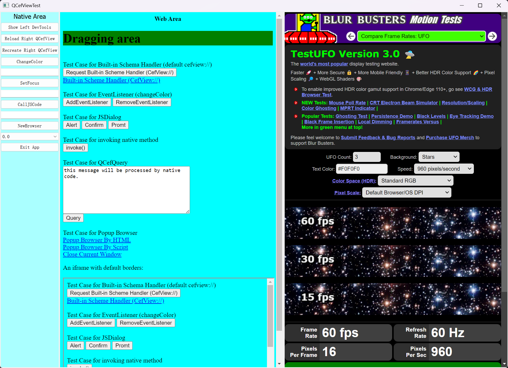
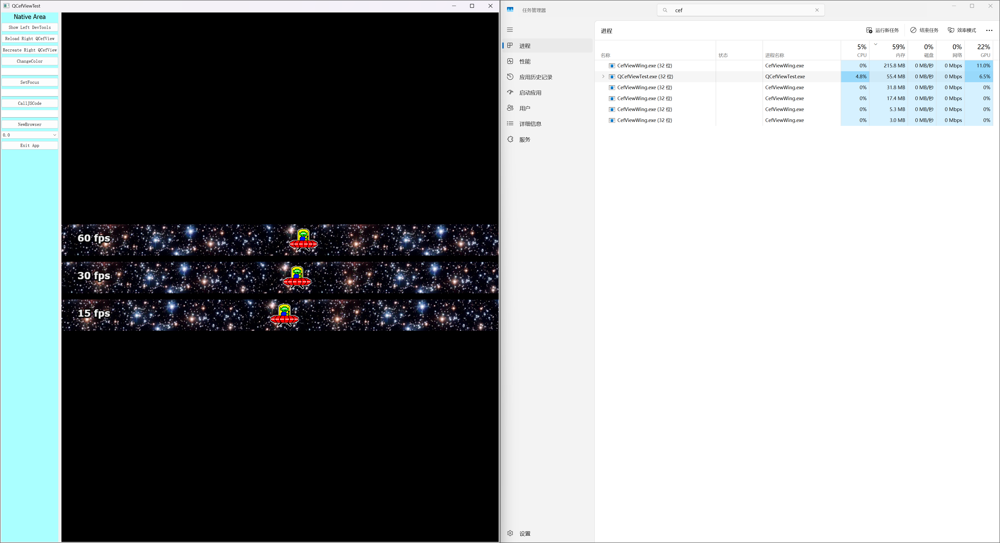
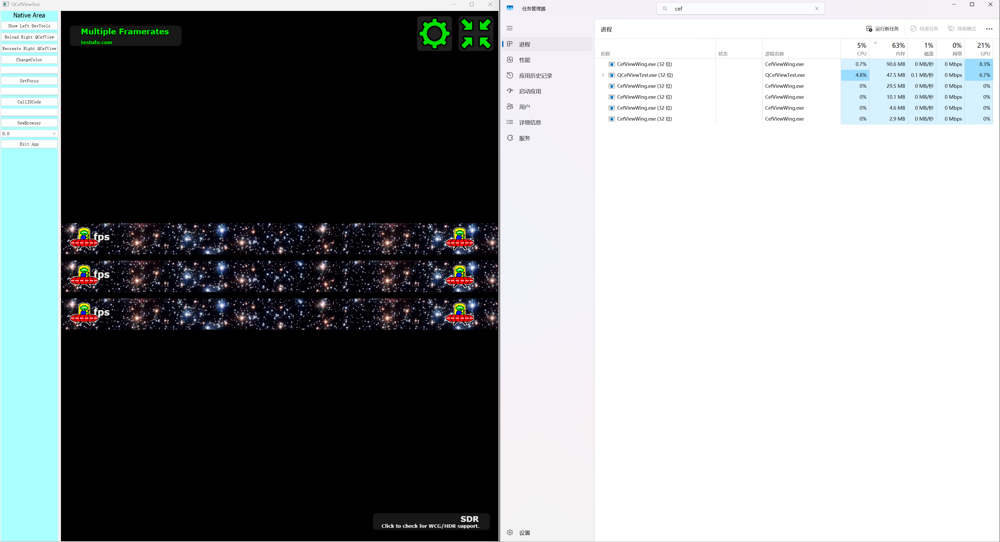

<!-- QCef 简单使用 -->

<!-- @import "[TOC]" {cmd="toc" depthFrom=1 depthTo=6 orderedList=false} -->

<!-- code_chunk_output -->

- [CEF 简介](#cef-简介)
- [QtWebEngine VS CEF 对比分析](#qtwebengine-vs-cef-对比分析)
- [QCef 简介](#qcef-简介)
- [为什么选择 QCefView 而不是 Electron？](#为什么选择-qcefview-而不是-electron)
- [QCefView 的应用场景](#qcefview-的应用场景)
- [构建 QCefView](#构建-qcefview)
  - [运行资源消耗](#运行资源消耗)
  - [额外信息](#额外信息)

<!-- /code_chunk_output -->

# CEF 简介

CEF (Chromium Embedded Framework) 是一个开源框架,用于将 Chromium 浏览器嵌入到第三方应用程序中。

**优点**

1. **成熟稳定的内核** - 基于 Chromium,拥有强大的渲染引擎和 JavaScript 执行能力；继承了 Chrome 浏览器的高性能和稳定性
2. **跨平台支持** - 支持 Windows、macOS、Linux 等多个平台
3. **Web 技术栈** - 可以使用 HTML5、CSS3、JavaScript 等 Web 技术开发桌面应用； 降低了桌面应用开发门槛,Web 前端开发者容易上手
4. **功能强大** - 支持现代 Web 标准和特性；提供丰富的 API 用于原生代码和 Web 页面交互；支持硬件加速、多媒体播放等高级功能

**缺点**

1. **体积庞大** - 编译后的库文件非常大(通常 100MB+)
2. **内存占用高** - 继承了 Chromium 的多进程架构；运行时内存消耗较大,对低配置设备不友好

**使用 CEF 的程序**

- Adobe -（[Adobe Acrobat](https://en.wikipedia.org/wiki/Adobe_Acrobat) 等）
- [Amazon Music Player](https://en.wikipedia.org/wiki/Amazon_Music#Amazon_Music_Player) - 亚马逊音乐播放器
- Bitdefender Safepay Browser - Bitdefender 互联网安全软件的一部分
- Battle.net App - [Battle.net](https://en.wikipedia.org/wiki/Battle.net) 官方客户端
- Epic Games Launcher - [Epic Games Store](https://en.wikipedia.org/wiki/Epic_Games_Store) 官方启动器
- [Foxmail](https://en.wikipedia.org/wiki/Foxmail) - [腾讯](https://en.wikipedia.org/wiki/Tencent)开发的免费电子邮件客户端
- [Google Web Designer](https://en.wikipedia.org/wiki/Google_Web_Designer) - 创建交互式 HTML5 网站和广告
- [MATLAB](https://en.wikipedia.org/wiki/MATLAB) - 在其 `uifigures` 中使用 CEF
- [OBS Studio](https://en.wikipedia.org/wiki/OBS_Studio) 浏览器插件 - 直播软件
- [Spotify](https://en.wikipedia.org/wiki/Spotify) 桌面客户端 - 流媒体音乐平台
- [StarUML](https://en.wikipedia.org/wiki/StarUML) - UML 模型编辑器
- [Steam client](https://en.wikipedia.org/wiki/Steam_(service)) - [Valve](https://en.wikipedia.org/wiki/Valve_Corporation) 公司 Steam 平台的官方客户端
- [腾讯 QQ](https://en.wikipedia.org/wiki/Tencent_QQ) 
- [Unity](https://en.wikipedia.org/wiki/Unity_(game_engine)) - 游戏引擎
- 网易云音乐桌面版

# QtWebEngine VS CEF 对比分析

**QtWebEngine** (基于Chromium，集成简单) 和 **CEF** (Chromium Embedded Framework，功能强大但集成复杂) 都是嵌入Chromium内核的方案，主要区别在于**易用性、性能稳定性、资源占用**。

- **QtWebEngine**：对Qt开发者更友好，易集成，但可能遇到特定显卡驱动导致崩溃问题
- **CEF**：功能全面，对硬件要求低，更稳定，适合复杂场景，但学习成本和工程量较大

---

***详细对比***

| **对比维度**   | **QtWebEngine (QWebEngineView)**                             | **CEF (Chromium Embedded Framework)**                        |
| -------------- | ------------------------------------------------------------ | ------------------------------------------------------------ |
| **易用性**     | ✅ 深度集成于Qt，接口友好，对Qt开发者友好，类似使用其他Qt控件 | ⚠️技术要求高                                                  |
| **开发效率**   | ✅ 快速开发，方便实现Web内容加载、页面控制等基础功能          | ⚠️ 开发、配置和维护比WebEngine复杂                            |
| **混合开发**   | ✅ 支持QWebChannel与QML/C++交互                               | ✅ 提供完整的Chromium功能，支持复杂网页应用                   |
| **性能稳定性** | ⚠️ 在某些环境下（如特定AMD显卡驱动）可能卡顿、崩溃            | ✅ 独立进程模型，对硬件要求低，解决WebEngine在特定环境下的崩溃问题，性能和稳定性通常更好 |
| **资源占用**   | ⚠️ 进程占用可能较高                                           | ⚠️ 最终安装包可能较大                                         |
| **环境依赖**   | ⚠️ 依赖特定硬件（如OpenGL 2.0+）和驱动                        | ✅ 对硬件要求低                                               |
| **功能完整性** | 🔶 基础功能完善，满足常规需求                                 | ✅ 提供完整的Chromium功能，支持复杂网页应用                   |
| **跨平台**     | ✅ Qt跨平台特性                                               | ✅ 核心功能稳定，适配性好                                     |

---

***选择建议***

**✅ 优先使用 QtWebEngine**
- 项目对兼容性要求不高
- 想快速实现带Web视图的程序
- 团队熟悉Qt开发
- 基础的Web内容展示需求

**✅ 考虑使用 CEF**
- WebEngine在特定客户机上崩溃
- 性能不达标，需要更稳定的方案
- 需要更底层、更完整的Chromium能力
- 对稳定性和兼容性要求极高
-  使用 **QCefView** 等Qt-CEF封装库，可以简化CEF集成，在稳定性和易用性之间取得平衡。

---

***总结***

- **快速开发首选**：QtWebEngine
- **稳定性优先**：CEF (或QCefView封装库)

# QCef 简介

[QCefView](https://github.com/CefView/QCefView) 是一个 Qt Widget,可以无缝集成 [Chromium嵌入式框架](https://github.com/chromiumembedded/cef)。它使您能够在熟悉的 Qt 生态系统中利用 CEF 的强大功能构建应用程序。

和 QCefView , 你可以:

- 使用熟悉的 Qt 开发应用程序。
- 实现 Web（JavaScript）和 Native（C++) 组件之间的直接互操作性。

# 为什么选择 QCefView 而不是 Electron？

QCefView 和 Electron 有不同的用途并迎合不同的开发风格。以下是比较:

| 特点     | QCefView | Electron                                |
| -------- | ------------------------------------------------------------ | --------------------------------------- |
| 范围     | Qt UI 组件                                                   | 综合应用框架                            |
| 目标受众 | Native（C++) 开发人员                                        | 前端开发人员                            |
| 主要语言 | C++                                                          | JavaScript                              |
| 互操作性 | 直接、直接的 Web/Native 通信                                 | 需要插件进行本机集成                    |
| 用例     | 在本机应用程序中嵌入 Web UI                                  | 主要利用 Web 技术构建跨平台桌面应用程序 |

本质上:

- **QCefView** 是 Qt 框架中的一个组件,非常适合使用基于 Web 的 UI 元素增强本机应用程序。
- **Electron** 是一个使用 Web 技术构建跨平台桌面应用程序的完整框架。

# QCefView 的应用场景

- **多媒体播放器:** 利用网络技术实现丰富、动态的用户界面。
- **游戏平台/启动器:** 为本机游戏引擎创建视觉上吸引人且具有交互性的前端。
- **工具类应用程序:** 构建具有复杂 UI 的功能丰富的工具,这些工具将受益于基于 Web 的渲染。
- **自定义嵌入式浏览器（有限制）:** 嵌入对渲染过程具有高度控制的 Web 内容。

在这些上下文驱动的应用程序中,Web 前端技术非常适合显示具有引人入胜效果的列表、表格和复杂页面。QCefView 充当 WebApp 容器,允许您托管 Web UI,同时将硬核业务逻辑保留为本机组件。使用 QCefView 可无缝弥合Web和原生应用程序。

# 构建 QCefView

- Qt version 5.14.2

- github 地址 - [QCefView](https://github.com/CefView/QCefView)

- git clone QCefView
- 使用 git tag - v2025.11.14
- 运行 generate-win-x86.bat 后将会在 ${QCEF_PROJECT}/\.build/windows.x86 目录里面生成 vs 工程
- 使用 vs 打开工程，编译运行提示 “错误 error C2220: 警告被视为错误”，参考 [错误 error C2220: 警告被视为错误 - 没有生成“object”](https://blog.csdn.net/kangdi7547/article/details/81556992) 即可解决
- 构建并运行 QCefViewTest 工程即可运行 demo

本机的硬件环境是：

- Inter i7 - 12700KF
- AMD - 6500XT

运行效果如下：

## 运行资源消耗

Debug 模式

	`CPU - 4.8%; GPU - 17.5 %; Memory - 328.7 MB;`

Release 模式

	`CPU - 5.5 %; GPU - 15 %; Memory - 185.2 MB;`

## 额外信息

|             信息             |          Debug 版本           |          Release 版本          |
| :--------------------------: | :---------------------------: | :----------------------------: |
|     libcef.dll 文件大小      |            255 MB             |             175MB              |
| 将 QCefViewTest 相关打包压缩 | 7-Zip - 119 MB ；zip - 166 MB | 7-Zip - 96.8 MB ；zip - 130 MB |

备注： 当前 [Inno Setup](https://jrsoftware.org/isinfo.php) 打包使用的  **`Compression=lzma`**: 使用 7-Zip LZMA，压缩率高，速度和内存消耗增加（默认级别 `max`），同上述图表中的 7-Zip 基本一致。

- [上一级](README.md)
- 上一篇 -> [23. 平台相关性](23_platformDependencies.md)
- 下一篇 -> [Qt Creator 使用](QtCreatorTips.md)
