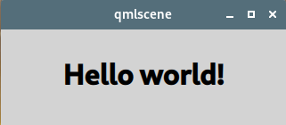

# QML Tutorial


<!-- @import "[TOC]" {cmd="toc" depthFrom=1 depthTo=6 orderedList=false} -->

<!-- code_chunk_output -->

- [QML Tutorial](#qml-tutorial)
  - [QML](#qml)
  - [Basic Types](#basic-types)
  - [QML Components](#qml-components)
  - [States and Transitions](#states-and-transitions)
  - [Link](#link)

<!-- /code_chunk_output -->


## QML 
QML (Qt Modeling Language) is a user interface markup language. It is a declarative language (similar to CSS and JSON) for designing user interface–centric applications. Inline JavaScript code handles imperative aspects. 

[QML wikipedia](https://en.wikipedia.org/wiki/QML)

## Basic Types

Here is the QML code for the application:
```css
 /* import the built-in QML types */
import QtQuick 2.0

 /* Paints a filled rectangle with an optional border */
Rectangle {
    /* Each object can be given a special unique 
    property called an id. Assigning an id 
    enables the object to be referred to by 
    other objects and scripts.  */
    id: page
    width: 320; height: 480
    color: "lightgray"

    /* We add a Text type as a child of the root
    Rectangle type that displays the text
    'Hello world!'. */
    Text {
        id: helloText
        text: "Hello world!"
        y: 30
        anchors.horizontalCenter: page.horizontalCenter
        font.pointSize: 24; font.bold: true
    }
}
```

QML type:
* [Rectangle](https://doc.qt.io/qt-5/qml-qtquick-rectangle.html)
* [Text](https://doc.qt.io/qt-5/qml-qtquick-text.html)

To view what you have created, run the [qmlscene](https://doc.qt.io/qt-5/qtquick-qmlscene.html) tool (located in the bin directory). For example,:
```sh
qmlscene $yourQmlFile
```



## QML Components
This chapter adds a color picker to change the color of the text.

Cell Component - Cell.qml:
```css
import QtQuick 2.0

Item {
    id: container
    /* We declare a cellColor property. This property is
    accessible from outside our component, this allows us
    to instantiate the cells with different colors. This
    property is just an alias to an existing 
    property - the color of the rectangle that
    compose the cell */
    property alias cellColor: rectangle.color
    signal clicked(cellColor: color)

    width: 40; height: 25

    Rectangle {
        id: rectangle
        border.color: "white"
        anchors.fill: parent
    }

    MouseArea {
        anchors.fill: parent
        /* We will use this signal to change the color 
        of the text in the main QML file later. */
        onClicked: container.clicked(container.cellColor)
    }
}
```

* [Property Binding](https://doc.qt.io/qt-5/qtqml-syntax-propertybinding.html)
* [Component QML Type](https://doc.qt.io/qt-5/qml-qtqml-component.html)
* [Item QML Type](https://doc.qt.io/qt-5/qml-qtquick-item.html)
* [Positioning with Anchors](https://doc.qt.io/qt-5/qtquick-positioning-anchors.html)
* [MouseArea QML Type](https://doc.qt.io/qt-5/qml-qtquick-mousearea.html)

The Main QML File - main.qml:
In our main QML file, we use our Cell component to create the color picker:
```css
import QtQuick 2.0

Rectangle {
    id: page
    width: 320; height: 480
    color: "lightgray"

    Text {
        id: helloText
        text: "Hello world!"
        y: 30
        anchors.horizontalCenter: page.horizontalCenter
        font.pointSize: 24; font.bold: true
    }

    Grid {
        id: colorPicker
        x: 4; anchors.bottom: page.bottom; anchors.bottomMargin: 4
        rows: 2; columns: 3; spacing: 3

        /* We create the color picker by putting 
        6 cells with different colors in a grid. */
        Cell { cellColor: "red"; onClicked: helloText.color = cellColor }
        Cell { cellColor: "green"; onClicked: helloText.color = cellColor }
        Cell { cellColor: "blue"; onClicked: helloText.color = cellColor }
        Cell { cellColor: "yellow"; onClicked: helloText.color = cellColor }
        Cell { cellColor: "steelblue"; onClicked: helloText.color = cellColor }
        Cell { cellColor: "black"; onClicked: helloText.color = cellColor }
    }
}
```
When the clicked signal of our cell is triggered, we want to set the color of the text to the cellColor passed as a parameter. We can react to any signal of our component through a property of the name 'onSignalName' (see [Signal Attributes](https://doc.qt.io/qt-5/qtqml-syntax-objectattributes.html#signal-attributes)).

预览界面：
```sh
qmlscene -I . main.qml
```


## States and Transitions

[QML Tutorial 3 - States and Transitions](https://doc.qt.io/qt-5/qml-tutorial3.html)

 
## Link
* [qt QML Tutorial](https://doc.qt.io/qt-5/qml-tutorial.html)

- [上一级](README.md)
- 上一篇 -> [Qt Creator 的一些配置](projectConfig.md)
- 下一篇 -> [《Qml Book》 - Meet Qt5 ](qmlBook_1_MeetQt5.md)
