# 《Qml Book》 - Particle Simulations

<!-- @import "[TOC]" {cmd="toc" depthFrom=1 depthTo=6 orderedList=false} -->

<!-- code_chunk_output -->

- [《Qml Book》 - Particle Simulations](#qml-book-particle-simulations)
  - [Concept](#concept)
  - [Simple Simulation](#simple-simulation)
  - [Particle Parameters](#particle-parameters)
  - [Directed Particles](#directed-particles)
  - [Particle Painters](#particle-painters)
  - [Affecting Particles](#affecting-particles)
    - [Age](#age)
    - [Attractor](#attractor)
    - [Friction](#friction)
    - [Gravity](#gravity)
    - [Turbulence](#turbulence)
    - [Wander](#wander)
  - [Particle Groups](#particle-groups)
  - [Summary](#summary)
  - [Source code](#source-code)

<!-- /code_chunk_output -->

注：该文档为 《Qml Book》的学习文档，详见 [Qml book - Particle Simulations](https://qmlbook.github.io/ch10-particles/particles.html)

Particles are a computer graphics techniques to visualize certain graphics effects. Typical effects could be falling leaves, fire, explosions, meteors, clouds, etc.

It differs from other graphics rendering as particles rendering is based on fuzzy aspects. The outcome is not exactly predictable on pixel-base. Parameters to the particle system describe the boundaries for the stochastic simulation. The phenomena rendered with particles is often difficult to visualize with traditional rendering techniques. The good thing is you can let QML elements interact with the particles systems. Also as parameters are expressed as properties they can be animated using the traditional animation techniques.

## Concept

In the heart of the particle simulation is the [ParticleSystem](https://doc.qt.io/qt-5/qml-qtquick-particles-particlesystem.html) which controls the shared timeline. A scene can have several particles systems, each of them with an independent time-line. A particle is emitted using an [Emitter](https://doc.qt.io/qt-5/qml-qtquick-particles-emitter.html) element and visualized with a [ParticlePainter](https://doc.qt.io/qt-5/qml-qtquick-particles-particlepainter.html), which can be an image, QML item or a shader item. An emitter provides also the direction for particle using a vector space. Particle ones emitted can’t be manipulated by the emitter anymore. The particle module provides the [Affector](https://doc.qt.io/qt-5/qml-qtquick-particles-affector.html), which allows manipulating parameters of the particle after it has been emitted.

Particles in a system can share timed transitions using the [ParticleGroup](https://doc.qt.io/qt-5/qml-qtquick-particles-particlegroup.html) element. By default, every particle is on the empty (‘’) group.

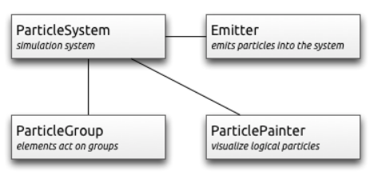

- [ParticleSystem](https://doc.qt.io/qt-5/qml-qtquick-particles-particlesystem.html) - manages shared time-line between emitters
- [Emitter](https://doc.qt.io/qt-5/qml-qtquick-particles-emitter.html) - emits logical particles into the system
- [ParticlePainter](https://doc.qt.io/qt-5/qml-qtquick-particles-particlepainter.html) - particles are visualized by a particle painter
- [Direction](https://doc.qt.io/qt-5/qml-qtquick-particles-direction.html) - vector space for emitted particles
- [ParticleGroup](https://doc.qt.io/qt-5/qml-qtquick-particles-particlegroup.html) - every particle is a member of a group
- [Affector](https://doc.qt.io/qt-5/qml-qtquick-particles-affector.html) - manipulates particles after they have been emitted

## Simple Simulation

Let us have a look at a very simple simulation to get started. Qt Quick makes it actually very simple to get started with particle rendering. For this we need:

- A `ParticleSystem` which binds all elements to a simulation
- An `Emitter` which emits particles into the system
- A `ParticlePainter` derived element, which visualizes the particles

```qml
import QtQuick 2.5
import QtQuick.Particles 2.0

Rectangle {
    id: root
    width: 480; height: 160
    color: "#1f1f1f"

    ParticleSystem {
        id: particleSystem
    }

    Emitter {
        id: emitter
        anchors.centerIn: parent
        width: 160; height: 80
        system: particleSystem
        emitRate: 10
        lifeSpan: 1000
        lifeSpanVariation: 500
        size: 16
        endSize: 32
        Tracer { color: 'green' }
    }

    ImageParticle {
        source: "assets/particle.png"
        system: particleSystem
    }
}
```

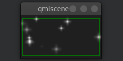

We start with dark rectangle as our root element and background. Therein we declare a `ParticleSystem`. This is always the first step as the system binds all other elements together. Typically the next element is the `Emitter`, which defines the emitting area based on it’s bounding box and basic parameters for them to be emitted particles. The emitter is bound to the system using the `system` property.

The emitter in this example emits 10 particles per second (`emitRate: 10`) over the area of the emitter with each a lifespan of 1000msec (`lifeSpan : 1000`) and a lifespan variation between emitted particles of 500 msec (`lifeSpanVariation: 500`). A particle shall start with a size of 16px (`size: 16`) and at the end of its life shall be 32px (`endSize: 32`).

The green bordered rectangle is a [tracer](https://doc-snapshots.qt.io/neptune3ui/qml-tracer.html) element to show the geometry of the emitter. This visualizes that also while the particles are emitted inside the emitters bounding box the rendering is not limited to the emitters bounding box. The rendering position depends upon life-span and direction of the particle. This will get more clear when we look into how to change the direction particles.

The emitter emits logical particles. A logical particle is visualized using a `ParticlePainter` in this example we use an [ImageParticle](https://doc.qt.io/qt-5/qml-qtquick-particles-imageparticle.html), which takes an image URL as the source property. The image particle has also several other properties, which control the appearance of the average particle.

- `emitRate`: particles emitted per second (defaults to 10 per second)
- `lifeSpan`: milliseconds the particle should last for (defaults to 1000 msec)
- `size, endSize`: size of the particles at the beginning and end of their life (defaults to 16 px)

Changing these properties can influence the result in a drastically way:

```qml
    Emitter {
        id: emitter
        anchors.centerIn: parent
        width: 20; height: 20
        system: particleSystem
        emitRate: 40
        lifeSpan: 2000
        lifeSpanVariation: 500
        size: 64
        sizeVariation: 32
        Tracer { color: 'green' }
    }
```

Besides increasing the emit rate to 40 and the lifespan to 2 seconds the size now starts at 64 pixels and decreases 32 pixels at the end of a particle lifespan.

Increasing the `endSize` even more would lead to a more or less white background. Please note also when the particles are only emitted in the area defined by the emitter the rendering is not constrained to it.

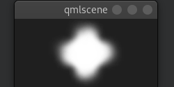

Increasing the `endSize` even more would lead to a more or less white background. Please note also when the particles are only emitted in the area defined by the emitter the rendering is not constrained to it.

## Particle Parameters

We saw already how to change the behavior of the emitter to change our simulation. The particle painter used allows us how the particle image is visualized for each particle.

```qml
import QtQuick 2.5
import QtQuick.Particles 2.0

Rectangle {
    id: root
    width: 480; height: 160
    color: "#1F1F1F"

    ParticleSystem {
        id: particleSystem
    }

    // M1>>
    ImageParticle {
        source: "assets/star.png"
        system: particleSystem
        // The particle shall be colorized in an gold color 
        //which varies from particle to particle by +/- 20%:
        color: '#FFD700'
        colorVariation: 0.2
        rotation: 0
        rotationVariation: 45
        // 旋转速度
        rotationVelocity: 15
        rotationVelocityVariation: 15
        entryEffect: ImageParticle.Scale
    }
    // <<M1


    Emitter {
        id: emitter
        anchors.fill: parent
        system: particleSystem
        lifeSpan: 8000
        size: 32
        endSize: 16
    }
}
```

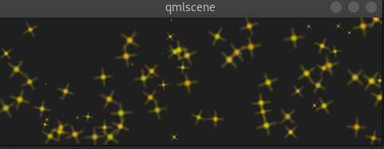

## Directed Particles

We have seen particles can rotate. But particles can also have a trajectory. The trajectory is specified as the velocity or acceleration of particles defined by a stochastic direction also named a vector space.

There are different vector spaces available to define the velocity or acceleration of a particle:

- [AngleDirection](https://doc.qt.io/qt-5/qml-qtquick-particles-angledirection.html) - a direction that varies in angle
- [PointDirection](https://doc.qt.io/qt-5/qml-qtquick-particles-pointdirection.html) - a direction that varies in x and y components
- [TargetDirection](https://doc.qt.io/qt-5/qml-qtquick-particles-targetdirection.html) - a direction towards the target point

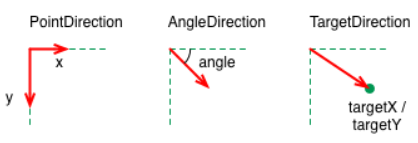

Let’s try to move the particles over from the left to the right side of our scene by using the velocity directions.

We first try the `AngleDirection`. For this we need to specify the `AngleDirection` as an element of the velocity property of our emitter.

The angle where the particles are emitted is specified using the angle property. The angle is provided as a value between 0..360 degree and 0 points to the right. For our example, we would like the particles to move to the right so 0 is already the right direction. The particles shall spread by +/- 5 degrees:

The magnitude is defined in pixels per seconds. As we have ca. 640px to travel 100 seems to be a good number. This would mean by an average lifetime of 6.4 secs a particle would cross the open space. To make the traveling of the particles more interesting we vary the magnitude using the `magnitudeVariation` and set this to the half of the magnitude:

```qml
    Emitter {
        id: emitter
        anchors.left: parent.left
        anchors.verticalCenter: parent.verticalCenter
        width: 1; height: 1
        system: particleSystem
        lifeSpan: 6400
        lifeSpanVariation: 400
        size: 32
        velocity: AngleDirection {
            angle: 0
            angleVariation: 15
            magnitude: 100
            magnitudeVariation: 50
        }
    }
```

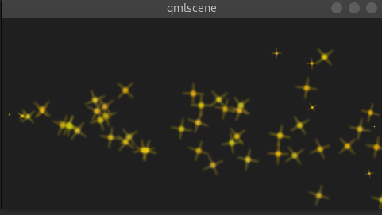

So what is then the acceleration doing? The acceleration adds an acceleration vector to each particle, which changes the velocity vector over time. For example, let’s make a trajectory like an arc of stars. For this we change our velocity direction to -45 degree and remove the variations, to better visualize a coherent arc:

```qml
velocity: AngleDirection {
    angle: -45
    magnitude: 100
}
```

The acceleration direction shall be 90 degrees (down direction) and we choose one-fourth of the velocity magnitude for this:

```qml
acceleration: AngleDirection {
    angle: 90
    magnitude: 25
}
```

The result is an arc going from the center-left to the bottom right.

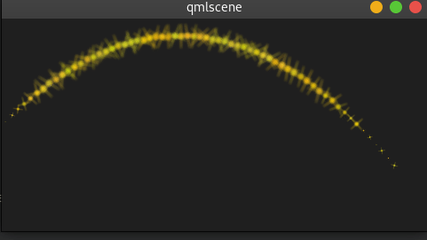

Here is the full code of our emitter.

```qml
    Emitter {
        id: emitter
        anchors.left: parent.left
        anchors.verticalCenter: parent.verticalCenter
        width: 1; height: 1
        system: particleSystem
        emitRate: 10
        lifeSpan: 6400
        lifeSpanVariation: 400
        size: 32
        velocity: AngleDirection {
            angle: -45
            angleVariation: 0
            magnitude: 100
        }
        acceleration: AngleDirection {
            angle: 90
            magnitude: 25
        }
    }
```

In the next example we would like that the particles again travel from left to right but this time we use the `PointDirection` vector space.

A `PointDirection` derived its vector space from an x and y component. For example, if you want the particles to travel in a 45-degree vector, you need to specify the same value for x and y.

In our case we want the particles to travel from left-to-right building a 15-degree cone. For this we specify a `PointDirection` as our velocity vector space.

To achieve a traveling velocity of 100 px per seconds we set our x component to 100. For the 15 degrees (which is 1/6th of 90 degrees) we specify an y variation of 100/6:

```qml
velocity: PointDirection {
    x: 100
    y: 0
    xVariation: 0
    yVariation: 100/6
}
```

The result should be particles traveling in a 15-degree cone from right to left.

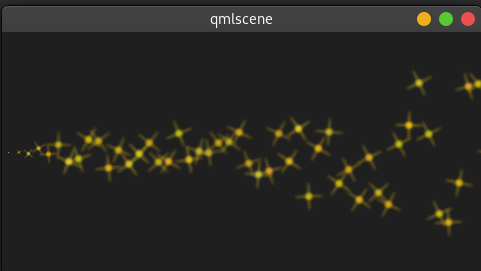

Now coming to our last contender, the `TargetDirection`. The target direction allows us to specify a target point as an x and y coordinate relative to the emitter or an item. When an item has specified the center of the item will become the target point. You can achieve the 15-degree cone by specifying a target variation of 1/6 th of the x target:

```qml
velocity: TargetDirection {
    targetX: 100
    targetY: 0
    targetVariation: 100/6
    magnitude: 100
}
```

Note

- Target direction are great to use when you have a specific x/y coordinate you want the stream of particles emitted towards.

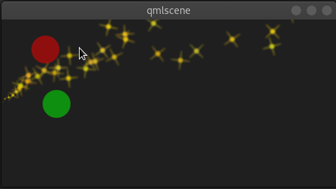

Full code:

```qml
import QtQuick 2.5
import QtQuick.Particles 2.0

Rectangle {
    id: root
    width: 480; height: 240
    color: "#1F1F1F"

    ParticleSystem {
        id: particleSystem
    }

    ImageParticle {
        source: "assets/star.png"
        system: particleSystem
        color: '#FFD700'
        colorVariation: 0.2
        rotation: 0
        rotationVariation: 45
        rotationVelocity: 15
        rotationVelocityVariation: 15
        entryEffect: ImageParticle.Scale
    }


    // M1>>
    Emitter {
        id: emitter
        anchors.left: parent.left
        anchors.verticalCenter: parent.verticalCenter
        width: 1; height: 1
        system: particleSystem
        emitRate: 10
        lifeSpan: 6400
        lifeSpanVariation: 400
        size: 32
        velocity: TargetDirection {
            targetItem: target1
            targetVariation: 20
            magnitude: 50
        }
        acceleration: TargetDirection {
            targetItem: target2
            targetVariation: 20
            magnitude: 50
        }
    }
    // <<M1

    Rectangle {
        id: target1
        width: 40; height: width
        radius: width/2
        color: '#FF0000'
        opacity: 0.5


        MouseArea {
            anchors.fill: parent
            drag.target: target1
        }
    }

    Rectangle {
        id: target2
        width: 40; height: width
        radius: width/2
        color: '#00FF00'
        opacity: 0.5


        MouseArea {
            anchors.fill: parent
            drag.target: target2
        }
    }

}
```

## Particle Painters

Till now we have only used the image based particle painter to visualize particles. Qt comes also with other particle painters:

- [ItemParticle](https://doc.qt.io/qt-5/qml-qtquick-particles-itemparticle.html): delegate based particle painter
- [CustomParticle](https://doc.qt.io/qt-5/qml-qtquick-particles-customparticle.html): shader based particle painter

The `ItemParticle` can be used to emit QML items as particles. For this, you need to specify your own delegate to the particle.

```qml
import QtQuick 2.5
import QtQuick.Particles 2.0

Rectangle {
    id: root
    width: 400; height: 400
    color: "#333333"

    property var images: [
        "box_blue.png",
        "box_red.png",
        "box_green.png",
        "circle_blue.png",
        "circle_red.png",
        "circle_green.png",
        "triangle_blue.png",
        "triangle_red.png",
        "triangle_green.png",

    ]

    // M1>>
    ParticleSystem {
        id: particleSystem
    }

    Emitter {
        id: emitter
        anchors.fill: root
        anchors.margins: 32
        system: particleSystem
        emitRate: 4
        lifeSpan: 2000
    }
    // <<M1


    // M2>>
    ItemParticle {
        id: particle
        system: particleSystem
        delegate: itemDelegate
    }
    // <<M2

    // M3>>
    Component {
        id: itemDelegate
        Item {
            id: container
            width: 32*Math.ceil(Math.random()*3); height: width
            Image {
                anchors.fill: parent
                anchors.margins: 4
                source: 'assets/'+images[Math.floor(Math.random()*9)]
            }
        }
    }
    // <<M3
}
```

We emit 4 images per second with a lifespan of 4 seconds each. The particles fade automatically in and out.

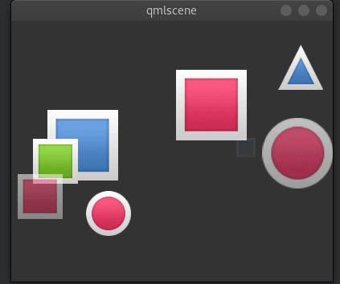

For more dynamic cases it is also possible to create an item on your own and let the particle take control of it with `take(item, priority)`. By this, the particle simulation takes control of your particle and handles the item like an ordinary particle. You can get back control of the item by using `give(item)`. You can influence item particles even more by halt their life progression using `freeze(item)` and resume their life using `unfreeze(item)`.

## Affecting Particles

Particles are emitted by the emitter. After a particle was emitted it can’t be changed any more by the emitter. The affectors allows you to influence particles after they have been emitted.

Each type of affector affects particles in a different way:

- [Age](https://doc.qt.io/qt-5/qml-qtquick-particles-age.html) - alter where the particle is in its life-cycle
- [Attractor](https://doc.qt.io/qt-5/qml-qtquick-particles-attractor.html) - attract particles towards a specific point
- [Friction](https://doc.qt.io/qt-5/qml-qtquick-particles-friction.html) - slows down movement proportional to the particle’s current velocity
- [Gravity](https://doc.qt.io/qt-5/qml-qtquick-particles-gravity.html) - set’s an acceleration in an angle
- [Turbulence](https://doc.qt.io/qt-5/qml-qtquick-particles-turbulence.html) - fluid like forces based on a noise image
- [Wander](https://doc.qt.io/qt-5/qml-qtquick-particles-wander.html) - randomly vary the trajectory
- [GroupGoal](https://doc.qt.io/qt-5/qml-qtquick-particles-groupgoal.html) - change the state of a group of a particle
- [SpriteGoal](https://doc.qt.io/qt-5/qml-qtquick-particles-spritegoal.html) - change the state of a sprite particle

### Age

Allows particle to age faster. the lifeLeft property specified how much life a particle should have left.

```qml
    Age {
        anchors.horizontalCenter: parent.horizontalCenter
        width: 240; height: 120
        system: particleSystem
        advancePosition: true
        lifeLeft: 1200
        once: true
        Tracer {}
    }
```

In the example, we shorten the life of the upper particles once when they reach the age of affector to 1200 msec. As we have set the advancePosition to true, we see the particle appearing again on a position when the particle has 1200 msecs left to live.

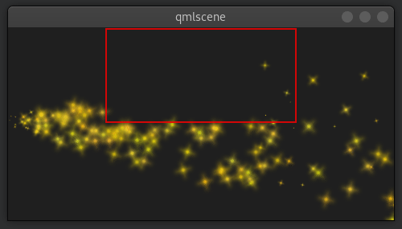

### Attractor

The attractor attracts particles towards a specific point. The point is specified using `pointX` and `pointY`, which is relative to the attractor geometry. The strength specifies the force of attraction. In our example we let particles travel from left to right. The attractor is placed on the top and half of the particles travel through the attractor. Affector only affect particles while they are in their bounding box. This split allows us to see the normal stream and the affected stream simultaneous.

```qml
    Attractor {
        anchors.horizontalCenter: parent.horizontalCenter
        width: 160; height: 120
        system: particleSystem
        pointX: 0
        pointY: 0
        strength: 1.0
        Tracer {}
    }
```

It’s easy to see that the upper half of the particles are affected by the attracted to the top. The attraction point is set to top-left (0/0 point) of the attractor with a force of 1.0.

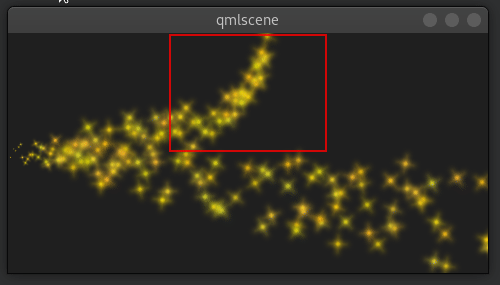

### Friction

The friction affector slows down particles by a factor until a certain threshold is reached.

```qml
    Friction {
        anchors.horizontalCenter: parent.horizontalCenter
        width: 240; height: 120
        system: particleSystem
        factor : 0.8
        threshold: 25
        Tracer {}
    }
```

In the upper friction area, the particles are slowed down by a factor of 0.8 until the particle reaches 25 pixels per seconds velocity. The threshold act’s like a filter. Particles traveling above the threshold velocity are slowed down by the given factor.


### Gravity

The gravity affector applies an acceleration In the example we stream the particles from the bottom to the top using an angle direction. The right side is unaffected, where on the left a gravity effect is applied. The gravity is angled to 90 degrees (bottom-direction) with a magnitude of 50.

```qml
    Gravity {
        width: 240; height: 240
        system: particleSystem
        magnitude: 50
        angle: 90
        Tracer {}
    }
```

Particles on the left side try to climb up, but the steady applied acceleration towards the bottom drags them into the direction of the gravity.

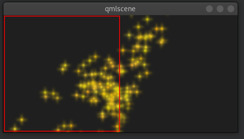

### Turbulence

The turbulence affector applies a chaos map of force vectors to the particles. The chaos map is defined by a noise image, which can be defined with the noiseSource property. The `strength` defines how strong the vector will be applied to the particle movements.

```qml
    Turbulence {
        anchors.horizontalCenter: parent.horizontalCenter
        width: 240; height: 120
        system: particleSystem
        strength: 100
        Tracer {}
    }
```

In the upper area of the example, particles are influenced by the turbulence. Their movement is more erratic. The amount of erratic deviation from the original path is defined by the strength.


### Wander

The wander manipulates the trajectory. With the property `affectedParameter` can be specified which parameter (`velocity`, `position` or `acceleration`) is affector by the wander. The pace property specifies the maximum of attribute changes per second. The `xVariance` and `yVariance` specify the influence on x and y component of the particle trajectory.

```qml
    Wander {
        anchors.horizontalCenter: parent.horizontalCenter
        width: 240; height: 120
        system: particleSystem
        affectedParameter: Wander.Position
        pace: 200
        yVariance: 240
        Tracer {}
    }
```

In the top wander affector particles are shuffled around by random trajectory changes. In this case, the position is changed 200 times per second in the y-direction.

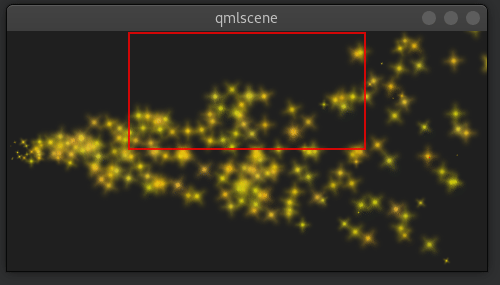

## Particle Groups

At the beginning of this chapter, we stated particles are in groups, which is by default the empty group (‘’). Using the `GroupGoal` affector is it possible to let the particle change groups. To visualize this we would like to create a small firework, where rockets start into space and explode in the air into a spectacular firework.

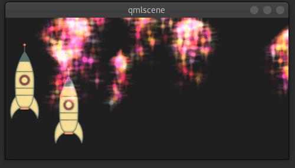

The example is divided into 2 parts. The 1st part called “Launch Time” is concerned to set up the scene and introduce particle groups and the 2nd part called “Let there be fireworks” focuses on the group changes.

Let’s get started!

Launch Time

To get it going we create a typical dark scene:

```qml
import QtQuick 2.5
import QtQuick.Particles 2.0

Rectangle {
    id: root
    width: 480; height: 240
    color: "#1F1F1F"
    property bool tracer: false
}
```

The tracer property will be used to switch the tracer scene wide on and off. The next thing is to declare our particle system:

```qml
ParticleSystem {
    id: particleSystem
}
```

And our two image particles (one for the rocket and one for the exhaust smoke):

```qml
ImageParticle {
    id: smokePainter
    system: particleSystem
    groups: ['smoke']
    source: "assets/particle.png"
    alpha: 0.3
    entryEffect: ImageParticle.None
}

ImageParticle {
    id: rocketPainter
    system: particleSystem
    groups: ['rocket']
    source: "assets/rocket.png"
    entryEffect: ImageParticle.None
}
```

You can see in on the images, they use the groups property to declare to which group the particle belongs. It is enough to just declare a name and an implicit group will be created by Qt Quick.

Now it’s time to emit some rockets into the air. For this, we create an emitter on the bottom of our scene and set the velocity in an upward direction. To simulate some gravity we set an acceleration downwards:

```qml
Emitter {
    id: rocketEmitter
    anchors.bottom: parent.bottom
    width: parent.width; height: 40
    system: particleSystem
    group: 'rocket'
    emitRate: 2
    maximumEmitted: 4
    lifeSpan: 4800
    lifeSpanVariation: 400
    size: 32
    velocity: AngleDirection { angle: 270; magnitude: 150; magnitudeVariation: 10 }
    acceleration: AngleDirection { angle: 90; magnitude: 50 }
    Tracer { color: 'red'; visible: root.tracer }
}
```

The emitter is in the group ‘rocket’, the same as our rocket particle painter. Through the group name, they are bound together. The emitter emits particles into the group ‘rocket’ and the rocket particle painter will pain them.

For the exhaust, we use a trail emitter, which follows our rocket. It declares an own group called ‘smoke’ and follows the particles from the ‘rocket’ group:

```qml
TrailEmitter {
    id: smokeEmitter
    system: particleSystem
    emitHeight: 1
    emitWidth: 4
    group: 'smoke'
    follow: 'rocket'
    emitRatePerParticle: 96
    velocity: AngleDirection { angle: 90; magnitude: 100; angleVariation: 5 }
    lifeSpan: 200
    size: 16
    sizeVariation: 4
    endSize: 0
}
```

The smoke is directed downwards to simulate the force the smoke comes out of the rocket. The `emitHeight` and `emitWidth` specify the are around the particle followed from where the smoke particles shall be emitted. If this is not specified then they are of the particle followed is taken but for this example, we want to increase the effect that the particles stem from a central point near the end of the rocket.

If you start the example now you will see the rockets fly up and some are even flying out of the scene. As this is not really wanted we need to slow them down before they leave the screen. A friction affector can be used here to slow the particles down to a minimum threshold:

```qml
Friction {
    groups: ['rocket']
    anchors.top: parent.top
    width: parent.width; height: 80
    system: particleSystem
    threshold: 5
    factor: 0.9
}
```

In the friction affector, you also need to declare which groups of particles it shall affect. The friction will slow all rockets, which are 80 pixels downwards from the top of the screen down by a factor of 0.9 (try 100 and you will see they almost stop immediately) until they reach a velocity of 5 pixels per second. As the particles have still an acceleration downwards applied the rockets will start sinking toward the ground after they reach the end of their life-span.

As climbing up in the air is hard work and a very unstable situation we want to simulate some turbulences while the ship is climbing:

```qml
Turbulence {
    groups: ['rocket']
    anchors.bottom: parent.bottom
    width: parent.width; height: 160
    system: particleSystem
    strength: 25
    Tracer { color: 'green'; visible: root.tracer }
}
```

Also, the turbulence needs to declare which groups it shall affect. The turbulence itself reaches from the bottom 160 pixels upwards (until it reaches the border of the friction). They also could overlap.

When you start the example now you will see the rockets are climbing up and then will be slowed down by the friction and fall back to the ground by the still applied downwards acceleration. The next thing would be to start the firework.

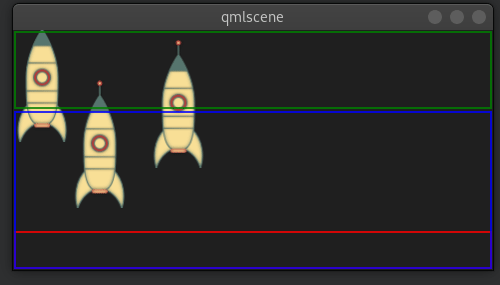

Note

- The image shows the scene with the tracers enabled to show the different areas. Rocket particles are emitted in the red area and then affected by the turbulence in the blue area. Finally, they are slowed down by the friction affector in the green area and start falling again, because of the steady applied downwards acceleration.

Let there be fireworks

To be able to change the rocket into a beautiful firework we need add a ParticleGroup to encapsulate the changes:

```qml
ParticleGroup {
    name: 'explosion'
    system: particleSystem
}
```

We change to the particle group using a `GroupGoal` affector. The group goal affector is placed near the vertical center of the screen and it will affect the group ‘rocket’. With the groupGoal property we set the target group for the change to ‘explosion’, our earlier defined particle group:

```qml
GroupGoal {
    id: rocketChanger
    anchors.top: parent.top
    width: parent.width; height: 80
    system: particleSystem
    groups: ['rocket']
    goalState: 'explosion'
    jump: true
    Tracer { color: 'blue'; visible: root.tracer }
}
```

The jump property states the change in groups shall be immediately and not after a certain duration.

Note

- In the Qt 5 alpha release we could the duration for the group change not get working. Any ideas?

As the group of the rocket now changes to our ‘explosion’ particle group when the rocket particle enters the group goal area we need to add the firework inside the particle group:

```qml
// inside particle group
TrailEmitter {
    id: explosionEmitter
    anchors.fill: parent
    group: 'sparkle'
    follow: 'rocket'
    lifeSpan: 750
    emitRatePerParticle: 200
    size: 32
    velocity: AngleDirection { angle: -90; angleVariation: 180; magnitude: 50 }
}
```

The explosion emits particles into the ‘sparkle’ group. We will define soon a particle painter for this group. The trail emitter used follows the rocket particle and emits per rocket 200 particles. The particles are directed upwards and vary by 180 degrees.

As the particles are emitted into the ‘sparkle’ group, we also need to define a particle painter for the particles:

```qml
ImageParticle {
    id: sparklePainter
    system: particleSystem
    groups: ['sparkle']
    color: 'red'
    colorVariation: 0.6
    source: "assets/star.png"
    alpha: 0.3
}
```

The sparkles of our firework shall be little red stars with an almost transparent color to allow some shine effects.

To make the firework more spectacular we also add a second trail emitter to our particle group, which will emit particles in a narrow cone downwards:

```qml
// inside particle group
TrailEmitter {
    id: explosion2Emitter
    anchors.fill: parent
    group: 'sparkle'
    follow: 'rocket'
    lifeSpan: 250
    emitRatePerParticle: 100
    size: 32
    velocity: AngleDirection { angle: 90; angleVariation: 15; magnitude: 400 }
}
```

Otherwise, the setup is similar to the other explosion trail emitter. That’s it.

Here is the final result.


Here is the full source code of the rocket firework.

```qml
import QtQuick 2.5
import QtQuick.Particles 2.0

Rectangle {
    id: root
    width: 480; height: 240
    color: "#1F1F1F"
    property bool tracer: false

    ParticleSystem {
        id: particleSystem
    }

    ImageParticle {
        id: smokePainter
        system: particleSystem
        groups: ['smoke']
        source: "assets/particle.png"
        alpha: 0.3
    }

    ImageParticle {
        id: rocketPainter
        system: particleSystem
        groups: ['rocket']
        source: "assets/rocket.png"
        entryEffect: ImageParticle.Fade
    }

    Emitter {
        id: rocketEmitter
        anchors.bottom: parent.bottom
        width: parent.width; height: 40
        system: particleSystem
        group: 'rocket'
        emitRate: 2
        maximumEmitted: 8
        lifeSpan: 4800
        lifeSpanVariation: 400
        size: 128
        velocity: AngleDirection { angle: 270; magnitude: 150; magnitudeVariation: 10 }
        acceleration: AngleDirection { angle: 90; magnitude: 50 }
        Tracer { color: 'red'; visible: root.tracer }
    }

    TrailEmitter {
        id: smokeEmitter
        system: particleSystem
        group: 'smoke'
        follow: 'rocket'
        size: 16
        sizeVariation: 8
        emitRatePerParticle: 16
        velocity: AngleDirection { angle: 90; magnitude: 100; angleVariation: 15 }
        lifeSpan: 200
        Tracer { color: 'blue'; visible: root.tracer }
    }

    Friction {
        groups: ['rocket']
        anchors.top: parent.top
        width: parent.width; height: 80
        system: particleSystem
        threshold: 5
        factor: 0.9

    }

    Turbulence {
        groups: ['rocket']
        anchors.bottom: parent.bottom
        width: parent.width; height: 160
        system: particleSystem
        strength:25
        Tracer { color: 'green'; visible: root.tracer }
    }


    ImageParticle {
        id: sparklePainter
        system: particleSystem
        groups: ['sparkle']
        color: 'red'
        colorVariation: 0.6
        source: "assets/star.png"
        alpha: 0.3
    }

    GroupGoal {
        id: rocketChanger
        anchors.top: parent.top
        width: parent.width; height: 80
        system: particleSystem
        groups: ['rocket']
        goalState: 'explosion'
        jump: true
        Tracer { color: 'blue'; visible: root.tracer }
    }

    ParticleGroup {
        name: 'explosion'
        system: particleSystem

        TrailEmitter {
            id: explosionEmitter
            anchors.fill: parent
            group: 'sparkle'
            follow: 'rocket'
            lifeSpan: 750
            emitRatePerParticle: 200
            size: 32
            velocity: AngleDirection { angle: -90; angleVariation: 180; magnitude: 50 }
        }

        TrailEmitter {
            id: explosion2Emitter
            anchors.fill: parent
            group: 'sparkle'
            follow: 'rocket'
            lifeSpan: 250
            emitRatePerParticle: 100
            size: 32
            velocity: AngleDirection { angle: 90; angleVariation: 15; magnitude: 400 }
        }
    }
}
```

## Summary

Particles are a very powerful and fun way to express graphical phenomena like smoke. firework, random visual elements. The extended API in Qt 5 is very powerful and we have just scratched the surface. There are several elements we haven’t yet played with like sprites, size tables or color tables. Also when the particles look very playful they have a great potential when used wisely to create some eye catcher in any user interface. Using too many particle effects inside a user interface will definitely lead to the impression towards a game. Creating games is also the real strength of the particles.

## Source code

[source code](https://qmlbook.github.io/assets/ch10-particles-assets.tgz)

---

- [上一级](README.md)
- 上一篇 -> [《Qml Book》 - Canvas Element](qmlBook_9_canvasElement.md)
- 下一篇 -> [《Qml Book》 - Multimedia](qmlBook_12_multimedia.md)
