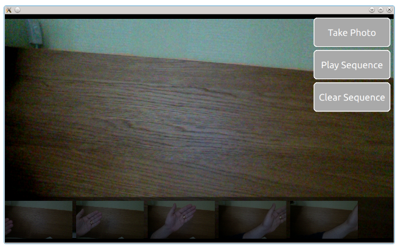

<!-- 《Qml Book》 - Multimedia -->

<!-- @import "[TOC]" {cmd="toc" depthFrom=1 depthTo=6 orderedList=false} -->

<!-- code_chunk_output -->

- [Playing Media](#playing-media)
- [Sound Effects](#sound-effects)
- [Video Streams](#video-streams)
- [Capturing Images](#capturing-images)
- [Advanced Techniques](#advanced-techniques)
  - [Using a Playlist](#using-a-playlist)
- [Summary](#summary)
- [Source code](#source-code)

<!-- /code_chunk_output -->

注：该文档为 《Qml Book》的学习文档，详见 [Qml book - Multimedia](https://qmlbook.github.io/ch12-multimedia/multimedia.html)

The multimedia elements in the [QtMultimedia](https://doc.qt.io/qt-5/qtmultimedia-index.html) makes it possible to playback and record media such as sound, video or pictures. Decoding and encoding are handled through platform-specific backends. For instance, the popular [GStreamer](https://en.wikipedia.org/wiki/GStreamer) framework is used on Linux, while [DirectShow](https://en.wikipedia.org/wiki/DirectShow) is used on Windows and [QuickTime](https://en.wikipedia.org/wiki/QuickTime) on OS X.

The multimedia elements are not a part of the Qt Quick core API. Instead, they are provided through a separate API made available by importing QtMultimedia 5.6 as shown below:

```qml
import QtMultimedia 5.6
```

## Playing Media

The most basic case of multimedia integration in a QML application is for it to playback media. This is done using the [MediaPlayer](https://doc.qt.io/qt-5/qml-qtmultimedia-mediaplayer.html) element, optionally in combination with a [VideoOutput](https://doc.qt.io/qt-5/qml-qtmultimedia-videooutput.html) element if the `source` is an image or video. The `MediaPlayer` element has a source property pointing at the media to play. When a media source has been bound, it is simply a matter of calling the `play` function to start playing.

If you want to play visual media, i.e. pictures or video, you must also set up a `VideoOutput` element. The `MediaPlayer` running the playback is bound to the video output through the `source` property.

In the example shown below, the `MediaPlayer` is given a file with video contents as `source`. A `VideoOutput` is created and bound to the media player. As soon as the main component has been fully initialized, i.e. at `Component.onCompleted`, the player’s `play` function is called.

```qml
import QtQuick 2.5
import QtMultimedia 5.6

Item {
    width: 1024
    height: 600

    MediaPlayer {
        id: player
        source: "trailer_400p.ogg"
    }

    VideoOutput {
        anchors.fill: parent
        source: player
    }

    Component.onCompleted: {
        player.play();
    }
}
```

Basic operations such as altering the volume when playing media are controlled through the `volume` property of the `MediaPlayer` element. There are other useful properties as well. For instance, the `duration` and `position` properties can be used to build a progress bar. If the `seekable` property is `true`, it is even possible to update the `position` when the progress bar is tapped. However, the `position` property is read-only, instead we must use the `seek` method. The example below shows how this is added to the basic playback example above.

```qml
    Rectangle {
        id: progressBar

        anchors.left: parent.left
        anchors.right: parent.right
        anchors.bottom: parent.bottom
        anchors.margins: 100

        height: 30

        color: "lightGray"

        Rectangle {
            anchors.left: parent.left
            anchors.top: parent.top
            anchors.bottom: parent.bottom

            width: player.duration>0?parent.width*player.position/player.duration:0

            color: "darkGray"
        }

        MouseArea {
            anchors.fill: parent

            onClicked: {
                if (player.seekable) {
                    player.seek(player.duration * mouse.x/width);
                }
            }
        }
    }
```

The `position` property is only updated once per second in the default case. This means that the progress bar will update in large steps unless the duration of the media is long enough, compared to the number of pixels that the progress bar is wide. This can, however, be changed through accessing the `mediaObject` property and its `notifyInterval` property. It can be set to the number of milliseconds between each position update, increasing the smoothness of the user interface.

```qml
    Connections {
        target: player
        onMediaObjectChanged: {
            if (player.mediaObject) {
                player.mediaObject.notifyInterval = 50;
            }
        }
    }
```

When using `MediaPlayer` to build a media player, it is good to monitor the `status` property of the player. It is an enumeration of the possible statuses, ranging from `MediaPlayer.Buffered` to `MediaPlayer.InvalidMedia`. The possible values are summarized in the bullets below:

- `MediaPlayer.UnknownStatus`. The status is unknown.
- `MediaPlayer.NoMedia`. The player has no media source assigned. Playback is stopped.
- `MediaPlayer.Loading`. The player is loading the media.
- `MediaPlayer.Loaded`. The media has been loaded. Playback is stopped.
- `MediaPlayer.Stalled`. The loading of media has stalled.
- `MediaPlayer.Buffering`. The media is being buffered.
MediaPlayer.Buffered. The media has been buffered, this means that the player can start playing the media.
- `MediaPlayer.EndOfMedia`. The end of the media has been reached. Playback is stopped.
- `MediaPlayer.InvalidMedia`. The media cannot be played. Playback is stopped.
As mentioned in the bullets above, the playback state can vary over time. Calling `play`, `pause` or `stop` alters the state, but the media in question can also have an effect. For example, the end can be reached, or it can be invalid, causing playback to stop. The current playback state can be tracked through the `playbackState` property. The values can be `MediaPlayer.PlayingState`, `MediaPlayer.PausedState` or `MediaPlayer.StoppedState`.

Using the `autoPlay` property, the `MediaPlayer` can be made to attempt go to the playing state as soon as the `source` property is changed. A similar property is the `autoLoad` causing the player to try to load the media as soon as the `source` property is changed. The latter property is enabled by default.

It is also possible to let the `MediaPlayer` to loop a media item. The `loops` property controls how many times the `source` is to be played. Setting the property to `MediaPlayer.Infinite` causes endless looping. Great for continuous animations or a looping background song.

## Sound Effects

When playing sound effects, the response time from requesting playback until actually playing becomes important. In this situation, the [SoundEffect](https://doc.qt.io/qt-5/qml-qtmultimedia-soundeffect.html) element comes in handy. By setting up the `source` property, a simple call to the `play` function immediately starts playback.

This can be utilized for audio feedback when tapping the screen, as shown below.

```qml
    SoundEffect {
        id: beep
        source: "beep.wav"
    }

    Rectangle {
        id: button

        anchors.centerIn: parent

        width: 200
        height: 100

        color: "red"

        MouseArea {
            anchors.fill: parent
            onClicked: beep.play()
        }
    }
```

The element can also be utilized to accompany a transition with audio. To trigger playback from a transition, the [ScriptAction](https://doc.qt.io/qt-5/qml-qtquick-scriptaction.html) element is used.

```qml
    SoundEffect {
        id: swosh
        source: "swosh.wav"
    }

    transitions: [
        Transition {
            ParallelAnimation {
                ScriptAction { script: swosh.play(); }
                PropertyAnimation { properties: "rotation"; duration: 200; }
            }
        }
    ]
```

In addition to the `play` function, a number of properties similar to the ones offered by `MediaPlayer` are available. Examples are `volume` and `loops`. The latter can be set to `SoundEffect.Infinite` for infinite playback. To stop playback, call the `stop` function.

Note

- When the PulseAudio backend is used, `stop` will not stop instantaneously, but only prevent further loops. This is due to limitations in the underlying API.

## Video Streams

The `VideoOutput` element is not limited to usage in combination with `MediaPlayer` elements. It can also be used directly with video sources to show a live video stream. Using a `Camera` element as `source` and the application is complete. The video stream from a `Camera` can be used to provide a live stream to the user. This stream works as the search view when capturing photos.

```qml
import QtQuick 2.5
import QtMultimedia 5.6

Item {
    width: 1024
    height: 600

    VideoOutput {
        anchors.fill: parent
        source: camera
    }

    Camera {
        id: camera
    }
}
```

## Capturing Images

One of the key features of the [Camera](https://doc.qt.io/qt-5/qml-qtmultimedia-camera.html) element is that is can be used to take pictures. We will use this in a simple stop-motion application. In it, you will learn how to show a viewfinder, snap photos and keep track of the pictures taken.

The user interface is shown below. It consists of three major parts. In the background, you will find the viewfinder, to the right, a column of buttons and at the bottom, a list of images taken. The idea is to take a series of photos, then click the Play Sequence button. This will play the images back, creating a simple stop-motion film.



The viewfinder part of the camera is simply a `Camera` element used as `source` in a `VideoOutput`. This will show the user a live video stream from the camera.

```qml
    VideoOutput {
        anchors.fill: parent
        source: camera
    }

    Camera {
        id: camera
    }
```

Note

- For more control over the camera behaviour, for instance to control exposure or focus settings, use the `exposure` and `focus` properties of the `Camera` object. These expose a whole range of settings made available through the [CameraExposure](https://doc.qt.io/qt-5/qml-qtmultimedia-cameraexposure.html) and [CameraFocus](https://doc.qt.io/qt-5/qml-qtmultimedia-camerafocus.html) elements.

The list of photos is a ListView oriented horizontally shows images from a ListModel called imagePaths. In the background, a semi-transparent black Rectangle is used.

```qml
    ListModel {
        id: imagePaths
    }

    ListView {
        id: listView

        anchors.left: parent.left
        anchors.right: parent.right
        anchors.bottom: parent.bottom
        anchors.bottomMargin: 10

        height: 100

        orientation: ListView.Horizontal
        spacing: 10

        model: imagePaths

        delegate: Image {
            height: 100
            source: path
            fillMode: Image.PreserveAspectFit
        }

        Rectangle {
            anchors.fill: parent
            anchors.topMargin: -10

            color: "black"
            opacity: 0.5
        }
    }
```

For the shooting of images, you need to know that the `Camera` element contains a set of sub-elements for various tasks. To capture still pictures, the `Camera.imageCapture` element is used. When you call the `capture` method, a picture is taken. This results in the `Camera.imageCapture` emitting first the `imageCaptured` signal followed by the `imageSaved` signal.

```qml
        Button {
            id: shotButton

            text: "Take Photo"
            onClicked: {
                camera.imageCapture.capture();
            }
        }
```

To intercept the signals of a sub-element, a [Connections](https://doc.qt.io/qt-5/qml-qtqml-connections.html) element is needed. In this case, we don’t need to show a preview image, but simply add the resulting image to the `ListView` at the bottom of the screen. Shown in the example below, the path to the saved image is provided as the `path` argument with the signal.

```qml
    Connections {
        target: camera.imageCapture

        onImageSaved: {
            imagePaths.append({"path": path})
            listView.positionViewAtEnd();
        }
    }
```

For showing a preview, connect to the `imageCaptured` signal and use the `preview` signal argument as `source` of an `Image` element. A `requestId` signal argument is sent along both the `imageCaptured` and `imageSaved`. This value is returned from the `capture` method. Using this, the capture of an image can be traced through the complete cycle. This way, the preview can be used first and then be replaced by the properly saved image. This, however, is nothing that we do in the example.

The last part of the application is the actual playback. This is driven using a `Timer` element and some JavaScript. The `_imageIndex` variable is used to keep track of the currently shown image. When the last image has been shown, the playback is stopped. In the example, the `root.state` is used to hide parts of the user interface when playing the sequence.

```qml
    property int _imageIndex: -1

    function startPlayback()
    {
        root.state = "playing";
        setImageIndex(0);
        playTimer.start();
    }

    function setImageIndex(i)
    {
        _imageIndex = i;

        if (_imageIndex >= 0 && _imageIndex < imagePaths.count)
            image.source = imagePaths.get(_imageIndex).path;
        else
            image.source = "";
    }

    Timer {
        id: playTimer

        interval: 200
        repeat: false

        onTriggered: {
            if (_imageIndex + 1 < imagePaths.count)
            {
                setImageIndex(_imageIndex + 1);
                playTimer.start();
            }
            else
            {
                setImageIndex(-1);
                root.state = "";
            }
        }
    }
```

## Advanced Techniques

### Using a Playlist

Since Qt 5.6 the QML multimedia API supports playlists. Simply assign a `Playlist` instance to the `playlist` property of your `MediaPlayer`. The [Playlist](https://doc.qt.io/qt-5/qml-qtmultimedia-playlist.html) element will then take care of setting the `source` of the `MediaPlayer`, while the play state is controlled via the player.

```qml
    MediaPlayer {
        id: player
        playlist: Playlist {
            PlaylistItem { source: "trailer_400p.ogg" }
            PlaylistItem { source: "trailer_400p.ogg" }
            PlaylistItem { source: "trailer_400p.ogg" }
        }
    }
```

To make the player start playing, simply set the playlist `currentIndex` and tell the `MediaPlayer` to start playing.

```qml
    Component.onCompleted: {
        player.playlist.currentIndex = 0;
        player.play();
    }
```

## Summary

The media API provided by Qt provides mechanisms for playing and capturing video and audio. Through the `VideoOutput` element and video, the source can be displayed in the user interface. Through the `MediaPlayer` element, most playback can be handled, even though the `SoundEffect` can be used for low-latency sounds. For capturing, or only showing a live video stream, the `Camera` element is used.

## Source code

[source code](https://qmlbook.github.io/assets/ch12-multimedia-assets.tgz)

---
- [上一级](README.md)
- 上一篇 -> [《Qml Book》 - Particle Simulations](qmlBook_10_particleSimulations.md)
- 下一篇 -> [《Qml Book》 - Networking](qmlBook_13_network.md)
