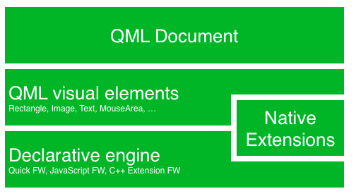
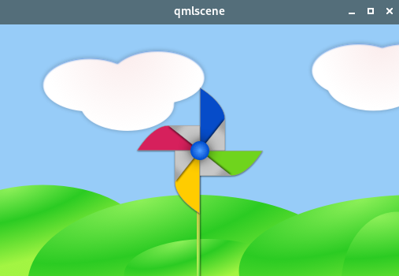

# 《Qml Book》 - Meet Qt5

<!-- @import "[TOC]" {cmd="toc" depthFrom=1 depthTo=6 orderedList=false} -->

<!-- code_chunk_output -->

- [《Qml Book》 - Meet Qt5](#qml-book-meet-qt5)
  - [Qt 5 Focus](#qt-5-focus)
  - [Qt 5 Introduction](#qt-5-introduction)
    - [Qt Quick](#qt-quick)
    - [Digesting a User Interface](#digesting-a-user-interface)
  - [Source code](#source-code)
  - [Qt Modules](#qt-modules)

<!-- /code_chunk_output -->

注：该文档为 《Qml Book》的学习文档，详见 [Qml book - Meet Qt 5](https://qmlbook.github.io/ch01-meetqt/meetqt.html)

## Qt 5 Focus

Qt 5 is a complete refreshing of the very successful Qt 4 release. With Qt 4.8, the Qt 4 release is almost 7 years old. It’s time to make an amazing toolkit even more amazing. Qt 5 is focused on the following:

- Outstanding Graphics: Qt Quick 2 is based on OpenGL (ES) using a scene graph implementation. The recomposed graphics stack allows a new level of graphics effects combined with an ease of use never seen before in this field.
- Developer Productivity: QML and JavaScript are the primary means for UI creation. The back-end will be driven by C++. The split between JavaScript and C++ allows a fast iteration for front-end developers concentrating on creating beautiful user interfaces and back-end C++ developers concentrating on stability, performance and extending the runtime.
- Cross-platform portability: With the consolidated Qt Platform Abstraction, it is now possible to port Qt to a wider range of platforms easier and faster. Qt 5 is structured around the concept of Qt Essentials and Add-ons, which allows OS developer to focus on the essentials modules and leads to a smaller runtime altogether.

## Qt 5 Introduction

### Qt Quick

Qt Quick is the umbrella term for the user interface technology used in Qt 5. Qt Quick itself is a collection of several technologies:

- QML - Markup language for user interfaces
- JavaScript - The dynamic scripting language
- Qt C++ - The highly portable enhanced c++ library



### Digesting a User Interface

Let’s create a simple user interface using Qt Quick, which showcases some aspects of the QML language.

eg:

```qml

import QtQuick 2.5
import QtGraphicalEffects 1.0

Image {
    /*  Using root as the id for the root-type is 
    a convention used in this book 
    to make referencing the top-most type predictable 
    in larger QML documents. */
    id: root
    source: "images/background.png"

    /* 模糊半径 */
    property int blurRadius: 0

    Image {
        id: pole
        /* Anchoring allows you to specify geometric 
        relations between parent and sibling objects.  */
        anchors.horizontalCenter: parent.horizontalCenter
        anchors.bottom: parent.bottom
        source: "images/pole.png"
    }


    Image {
        id: wheel
        anchors.centerIn: parent
        source: "images/pinwheel.png"
        /* We can achieve smooth movement using 
        animation.  An animation defines how a property
        change occurs over a period of time. To enable
        this, we use the Animation type’s property 
        called Behavior. The Behavior specifies an 
        animation for a defined property for every 
        change applied to that property. In other 
        words, whenever the property changes, the 
        animation is run. */
        Behavior on rotation {
            /* Now, whenever the wheel’s rotation 
            property changes, it will be animated using 
            a NumberAnimation with a duration of 250 ms. 
            So each 90-degree turn will take 250 ms, 
            producing a nice smooth turn. */
            NumberAnimation {
                duration: 250
            }
        }
        layer.effect: FastBlur {
            id: blur
            radius: root.blurRadius
            Behavior on radius {
                NumberAnimation {
                    duration: 250
                }
            }
        }
        layer.enabled: true
    }

    MouseArea {
        anchors.fill: parent
        /* The mouse area emits signals when the user 
        clicks inside the area it covers. You can 
        connect to this signal by overriding the 
        onClicked function. When a signal is connected,
        it means that the function (or functions) it 
        corresponds to are called whenever the signal 
        is emitted. */
        onPressed: {
            wheel.rotation += 90
            root.blurRadius = 16
        }
        onReleased: {
            root.blurRadius = 0
        }
    }
}
```

Note:
This technique works for every signal, with the naming convention being `on` + `SignalName` in title case. Also, all properties emit a signal when their value changes. For these signals, the naming convention is:

`on` + `PropertyName` + `Changed`
For example, if a `width` property is changed, you can observe it with `onWidthChanged: print(width)`.

Run it,show:


## Source code

[source code](https://qmlbook.github.io/assets/ch01-meetqt-assets.tgz)

## Qt Modules

-[All Modules](https://doc.qt.io/qt-5/qtmodules.html)

---
- [上一级](README.md)
- 上一篇 -> [《Qml Book》 - Multimedia](qmlBook_12_multimedia.md)
- 下一篇 -> [《Qml book》 - Quick Starter](qmlBook_4_quickStarter.md)
