<!-- 《Qml book》 - Quick Starter -->

<!-- @import "[TOC]" {cmd="toc" depthFrom=1 depthTo=6 orderedList=false} -->

<!-- code_chunk_output -->

- [QML Syntax](#qml-syntax)
  - [Properties](#properties)
  - [Scripting](#scripting)
- [Basic Elements](#basic-elements)
  - [Item Element](#item-element)
  - [Rectangle Element](#rectangle-element)
  - [Text Element](#text-element)
  - [Image Element](#image-element)
  - [MouseArea Element](#mousearea-element)
- [Components](#components)
- [Simple Transformations](#simple-transformations)
- [Positioning Elements](#positioning-elements)
  - [Column element](#column-element)
  - [Row element](#row-element)
  - [Grid element](#grid-element)
  - [Flow element](#flow-element)
  - [Repeater element](#repeater-element)
- [Layout Items](#layout-items)
- [Input Element](#input-element)
  - [TextInput](#textinput)
  - [FocusScope](#focusscope)
  - [TextEdit](#textedit)
  - [keys Element](#keys-element)
- [Advanced Techniques](#advanced-techniques)
  - [Performance of QML](#performance-of-qml)
- [Source code](#source-code)

<!-- /code_chunk_output -->

 注：该文档为 《Qml Book》的学习文档，详见 [Qml Book - Quick Starter](https://qmlbook.github.io/ch04-qmlstart/qmlstart.html#)

## QML Syntax

In its simplest way, QML is a hierarchy of elements. Child elements inherit the coordinate system from the parent. An x,y coordinate is always relative to the parent.

Let’s start with a simple example of a QML file to explain the different syntax.

```qml
// RectangleExample.qml

import QtQuick 2.5

// The root element is the Rectangle
Rectangle {
    // name this element root
    id: root

    // properties: <name>: <value>
    width: 120; height: 240

    // color property
    color: "#4A4A4A"

    // Declare a nested element (child of root)
    Image {
        id: triangle

        // reference the parent
        x: (parent.width - width)/2; y: 40

        source: 'assets/triangle_red.png'
    }

    // Another child of root
    Text {
        // un-named element

        // reference element by id
        y: triangle.y + triangle.height + 20

        // reference root element
        width: root.width

        color: 'white'
        horizontalAlignment: Text.AlignHCenter
        text: 'Triangle'
    }
}
```

- The `import` statement imports a module in a specific version.
- Comments can be made using `//` for single line comments or `/* */` for multi-line comments. Just like in C/C++ and JavaScript
- Every QML file needs to have exactly one root element, like HTML
- An element is declared by its type followed by `{ }`
- Elements can have properties, they are in the form `name: value`
- Arbitrary elements inside a QML document can be accessed by using their id (an unquoted identifier)
- Elements can be nested, meaning a parent element can have child elements. The parent element can be accessed using the parent keyword

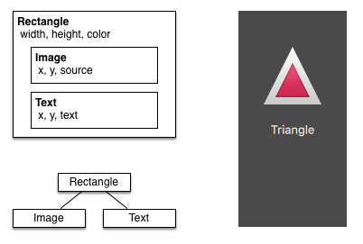

### Properties

Elements are declared by using their element name but are defined by using their properties or by creating custom properties. A property is a simple key-value pair, e.g. `width : 100, text: 'Greetings', color: '#FF0000'`. A property has a well-defined type and can have an initial value.

```qml
 Text {
        // (1) identifier
        id: thisLabel

        // (2) set x- and y-position
        x: 24; y: 16

        // (3) bind height to 2 * width
        height: 2 * width

        // (4) custom property
        property int times: 24

        // (5) property alias
        property alias anotherTimes: thisLabel.times

        // (6) set text appended by value
        text: "Greetings " + times

        // (7) font is a grouped property
        font.family: "Ubuntu"
        font.pixelSize: 24

        // (8) KeyNavigation is an attached property
        KeyNavigation.tab: otherLabel

        // (9) signal handler for property changes
        onHeightChanged: console.log('height:', height)

        // focus is need to receive key events
        focus: true

        // change color based on focus value
        color: focus?"red":"black"
    }
```

Let’s go through the different features of properties:

- `id` is a very special property-like value, it is used to reference elements inside a QML file (called “document” in QML). The `id` is not a string type but rather an identifier and part of the QML syntax. An id needs to be unique inside a document and it can’t be reset to a different value, nor may it be queried. (It behaves much like a reference in the C++ world.)
- A property can be set to a value, depending on its type. If no value is given for a property, an initial value will be chosen. You need to consult the documentation of the particular element for more information about the initial value of a property.
- A property can depend on one or many other properties. This is called binding. A bound property is updated when its dependent properties change. It works like a contract, in this case, the `height` should always be two times the `width`.
- Adding own properties to an element is done using the `property` qualifier followed by the type, the name and the optional initial value (`property <type> <name> : <value>`). If no initial value is given a system initial value is chosen.
- Another important way of declaring properties is using the `alias` keyword (`property alias <name>: <reference>`). The `alias` keyword allows us to forward a property of an object or an object itself from within the type to an outer scope. We will use this technique later when defining components to export the inner properties or element ids to the root level. A property alias does not need a type, it uses the type of the referenced property or object.
- The text property depends on the custom property `times` of type int. The `int` based value is automatically converted to a `string` type. The expression itself is another example of binding and results in the text being updated every time the `times` property changes.
- Some properties are grouped properties. This feature is used when a property is more structured and related properties should be grouped together. Another way of writing grouped properties is `font { family: "Ubuntu"; pixelSize: 24 }`.
- Some properties are attached to the element itself. This is done for global relevant elements which appear only once in the application (e.g. keyboard input). The writing is`<Element>.<property>: <value>`.
- For every property, you can provide a signal handler. This handler is called after the property changes. For example, here we want to be notified whenever the height changes and use the built-in console to log a message to the system.

### Scripting

QML and JavaScript are best friends. In the JavaScript chapter we will go into more detail on this symbiosis. Currently, we just want to make you aware of this relationship.

```qml
Text {
        id: label

        x: 24; y: 24

        // custom counter property for space presses
        property int spacePresses: 0

        text: "Space pressed: " + spacePresses + " times"

        // (1) handler for text changes
        onTextChanged: console.log("text changed to:", text)

        // need focus to receive key events
        focus: true

        // (2) handler with some JS
        Keys.onSpacePressed: {
            increment()
        }

        // clear the text on escape
        Keys.onEscapePressed: {
            label.text = ''
        }

        // (3) a JS function
        function increment() {
            spacePresses = spacePresses + 1
        }
    }
```

1. The text changed handler `onTextChanged` prints the current text every-time the text changed due to a space-bar key pressed
2. When the text element receives the space-bar key (because the user pressed the space-bar on the keyboard) we call a JavaScript function `increment()`.
3. Definition of a JavaScript function in the form of `function <name>(<parameters>) { ... }`, which increments our counter `spacePressed`. Every time `spacePressed` is incremented, bound properties will also be updated.

Note:
The difference between the QML `:` (binding) and the JavaScript `=` (assignment) is, that the binding is a contract and keeps true over the lifetime of the binding, whereas the JavaScript assignment (`=`) is a one time value assignment. The lifetime of a binding ends, when a new binding is set to the property or even when a JavaScript value is assigned is to the property.

## Basic Elements

Elements can be grouped into visual and non-visual elements:

- A visual element (like the `Rectangle`) has a geometry and normally presents an area on the screen.
- A non-visual element (like a `Timer`) provides general functionality, normally used to manipulate the visual elements.

Currently, we will focus on the fundamental visual elements, such as `Item`, `Rectangle`, `Text`, `Image` and `MouseArea`. However, by using the Qt Quick Controls 2 module, it is possible to create user interfaces built from standard platform components such as buttons, labels and sliders.

### Item Element

`Item` is the base element for all visual elements as such all other visual elements inherits from `Item`. It doesn’t paint anything by itself but defines all properties which are common across all visual elements:
|       Group       |                                                                                    Properties                                                                                     |
|:----------------: |:--------------------------------------------------------------------------------------------------------------------------------------------------------------------------------: |
|     Geometry      | `x` and `y` to define the top-left position, `width` and `height` for the expansion of the element and also the `z` stacking order to lift elements up or down from their natural ordering  |
|  Layout handling  |                       `anchors` (left, right, top, bottom, vertical and horizontal center) to position elements relative to other elements with their `margins`                       |
|   Key handling    |                     attached `Key` and `KeyNavigation` properties to control key handling and the input `focus` property to enable key handling in the first place                      |
|  Transformation   |                         `scale` and `rotate` transformation and the generic `transform` property list for x,y,z transformation and their `transformOrigin` point                          |
|      Visual       |       `opacity` to control transparency, `visible` to show/hide elements, `clip` to restrain paint operations to the element boundary and `smooth` to enhance the rendering quality       |
| State definition  |               `states` list property with the supported list of states and the current `state` property as also the `transitions` list property to animate state changes.               |

Note

The `Item` element is often used as a container for other elements, similar to the div element in HTML.

### Rectangle Element

The `Rectangle` extends `Item` and adds a fill color to it. Additionally it supports borders defined by `border.color` and `border.width`. To create rounded rectangles you can use the `radius` property.

```qml
    Rectangle {
        id: rect1
        x: 12; y: 12
        width: 76; height: 96
        color: "lightsteelblue"
    }
    Rectangle {
        id: rect2
        x: 112; y: 12
        width: 76; height: 96
        border.color: "lightsteelblue"
        border.width: 4
        radius: 8
    }
```

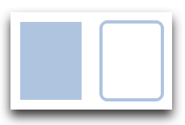

Besides a fill color and a border the rectangle also supports custom gradients.

```qml
    Rectangle {
        id: rect1
        x: 12; y: 12
        width: 176; height: 96
        gradient: Gradient {
            GradientStop { position: 0.0; color: "lightsteelblue" }
            GradientStop { position: 1.0; color: "slategray" }
        }
        border.color: "slategray"
    }
```

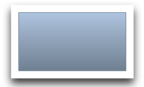

A gradient is defined by a series of gradient stops. Each stop has a position and a color. The position marks the position on the y-axis (0 = top, 1 = bottom). The color of the `GradientStop` marks the color at that position.

Note:

- A rectangle with no width/height set will not be visible. This happens often when you have several rectangles width (height) depending on each other and something went wrong in your composition logic. So watch out!
- It is not possible to create an angled gradient. For this, it’s better to use predefined images. One possibility would be to just rotate the rectangle with the gradient, but be aware the geometry of a rotated rectangle will not change and thus will lead to confusion as the geometry of the element is not the same as the visible area. From the authors perspective, it’s really better to use designed gradient images in that case.

### Text Element

To display text, you can use the `Text` element. Its most notable property is the text property of type `string`. The element calculates its initial width and height based on the given text and the font used. The font can be influenced using the font property group (e.g. `font.family`, `font.pixelSize`, …). To change the color of the text just use the color property.

```qml
    Text {
        text: "The quick brown fox"
        color: "#303030"
        font.family: "Ubuntu"
        font.pixelSize: 28
    }
```

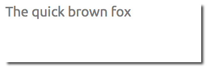

Text can be aligned to each side and the center using the `horizontalAlignment` and `verticalAlignment` properties.
To further enhance the text rendering you can use the `style` and `styleColor` property, which allows you render the text in outline, raised and sunken mode.
For longer text, you often want to define a break position like A very … long text, this can be achieved using the `elide` property. The `elide` property allows you to set the elide position to the left, right or middle of your text. In case you don’t want the ‘…’ of the elide mode to appear but still want to see the full text you can also wrap the text using the `wrapMode` property (works only when the width is explicitly set):

```qml
Text {
    width: 40; height: 120
    text: 'A very long text'
    // '...' shall appear in the middle
    elide: Text.ElideMiddle
    // red sunken text styling
    style: Text.Sunken
    styleColor: '#FF4444'
    // align text to the top
    verticalAlignment: Text.AlignTop
    // only sensible when no elide mode
    // wrapMode: Text.WordWrap
}
```

Note

- Be aware a `Text` initial width (height) is depending on the text string and on the font set. A `Text` element with no width set and no text will not be visible, as the initial width will be 0.
- Often when you want to layout `Text` elements you need to differentiate between aligning the text inside the `Text` element boundary box or to align the element boundary box itself. In the former, you want to use the `horizontalAlignment` and `verticalAlignment` properties and in the latter case, you want to manipulate the element geometry or use anchors.

### Image Element

An `Image` element is able to display images in various formats (e.g. PNG, JPG, GIF, BMP, WEBP). For the full list of supported image formats, please consult the Qt documentation. Besides the obvious `source` property to provide the image URL, it contains a `fillMode` which controls the resizing behavior.

```qml
    Image {
        x: 12; y: 12
        // width: 72
        // height: 72
        source: "assets/triangle_red.png"
    }
    Image {
        x: 12+64+12; y: 12
        // width: 72
        height: 72/2
        source: "assets/triangle_red.png"
        fillMode: Image.PreserveAspectCrop
        clip: true
    }
```


Note:

- A URL can be a local path with forward slashes ( “./images/home.png” ) or a web-link (e.g. “<http://example.org/home.png>”).
- `Image` elements using `PreserveAspectCrop` should also enable the clipping to avoid image data being rendered outside the `Image` boundaries. By default clipping is disabled (``clip: false``). You need to enable clipping (``clip: true``) to constrain the painting to the elements bounding rectangle. This can be used on any visual element.

Tip:

- Using C++ you are able to create your own image provider using [QQuickImageProvider](https://doc.qt.io/qt-5//qquickimageprovider.html). This allows you to create images on the fly and threaded image loading.

### MouseArea Element

To interact with these elements you often will use a `MouseArea`. It’s a rectangular invisible item in where you can capture mouse events. The mouse area is often used together with a visible item to execute commands when the user interacts with the visual part.

```qml
    Rectangle {
        id: rect1
        x: 12; y: 12
        width: 76; height: 96
        color: "lightsteelblue"
        MouseArea {
            id: area
            width: parent.width
            height: parent.height
            onClicked: rect2.visible = !rect2.visible
        }
    }

    Rectangle {
        id: rect2
        x: 112; y: 12
        width: 76; height: 96
        border.color: "lightsteelblue"
        border.width: 4
        radius: 8
    }
```

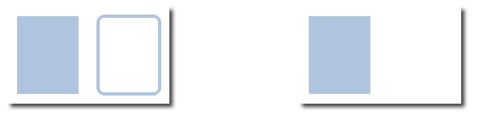

Note:

- For more complex interaction, [Qt Quick Input Handlers](https://doc.qt.io/qt-5/qtquickhandlers-index.html) where introduced with Qt 5.12. They are intended to be used instead of elements such as `MouseArea` and `Flickable` and offer greater control and flexibility. The idea is to handle one interaction aspect in each handler instance instead of centralizing the handling of all events from a given source in a single element, which was the case before.

## Components

A component is a reusable element and QML provides different ways to create components. Currently, we will look only at the simplest form - a file-based component. A file-based component is created by placing a QML element in a file and give the file an element name (e.g. `Button.qml`). You can use the component like every other element from the QtQuick module, in our case you would use this in your code as `Button` { ... }.

For example, let’s create a rectangle containing a text component and a mouse area. This resembles a simple button and doesn’t need to be more complicated for our purposes.

```qml
    Rectangle { // our inlined button ui
        id: button
        x: 12; y: 12
        width: 116; height: 26
        color: "lightsteelblue"
        border.color: "slategrey"
        Text {
            anchors.centerIn: parent
            text: "Start"
        }
        MouseArea {
            anchors.fill: parent
            onClicked: {
                status.text = "Button clicked!"
            }
        }
    }

    Text { // text changes when button was clicked
        id: status
        x: 12; y: 76
        width: 116; height: 26
        text: "waiting ..."
        horizontalAlignment: Text.AlignHCenter
    }
```

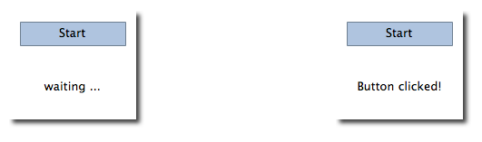

Our task is now to extract the button UI in a reusable component. For this, we shortly think about a possible API for our button. You can do this by imagining how someone else should use your button. Here’s what I came up with:

```qml
// minimal API for a button
Button {
    text: "Click Me"
    onClicked: { /* do something */ }
}
```

I would like to set the `text` using a text property and to implement my own click handler. Also, I would expect the button to have a sensible initial size, which I can overwrite (e.g. with `width: 240` for example).

To achieve this we create a `Button.qml` file and copy our button UI inside. Additionally, we need to export the properties a user might want to change on the root level.

```qml
// Button.qml

import QtQuick 2.5

Rectangle {
    id: root
    // export button properties
    property alias text: label.text
    signal clicked

    width: 116; height: 26
    color: "lightsteelblue"
    border.color: "slategrey"

    Text {
        id: label
        anchors.centerIn: parent
        text: "Start"
    }
    MouseArea {
        anchors.fill: parent
        onClicked: {
            root.clicked()
        }
    }
}

```

We have exported the text and clicked signal on the root level. Typically we name our root element root to make the referencing easier. We use the `alias` feature of QML, which is a way to export properties inside nested QML elements to the root level and make this available for the outside world. It is important to know, that only the root level properties can be accessed from outside this file by other components.

To use our new `Button` element we can simply declare it in our file. So the earlier example will become a little bit simplified.

```qml
    Button { // our Button component
        id: button
        x: 12; y: 12
        text: "Start"
        onClicked: {
            status.text = "Button clicked!"
        }
    }

    Text { // text changes when button was clicked
        id: status
        x: 12; y: 76
        width: 116; height: 26
        text: "waiting ..."
        horizontalAlignment: Text.AlignHCenter
    }
```

Note:

- If you want to, you could even go a step further and use an item as a root element. This prevents users to change the color of our designed button and provides us with more control about the exported API. The target should be to export a minimal API. Practically this means we would need to replace the root `Rectangle` with an `Item` and make the rectangle a nested element in the root item.

```qml
Item {
    id: root
    width: 116; height: 26

    property alias text: label.text
    signal clicked

    Rectangle {
        anchors.fill parent
        color: "lightsteelblue"
        border.color: "slategrey"
    }
    ...
}
```

## Simple Transformations

A transformation manipulates the geometry of an object. QML Items can, in general, be translated, rotated and scaled. There is a simple form of these operations and a more advanced way.

Let’s start with the simple transformations. Here is our scene as our starting point.

A simple translation is done via changing the `x,y` position. A `rotation` is done using the rotation property. The value is provided in degrees (0 .. 360). A scaling is done using the `scale` property and a value <1 means the element is scaled down and `>1` means the element is scaled up. The rotation and scaling do not change your geometry. The items `x,y` and `width/height` haven’t changed. Just the painting instructions are transformed.

Before we show off the example I would like to introduce a little helper: The `ClickableImage` element.

```qml
// ClickableImage.qml

// Simple image which can be clicked

import QtQuick 2.5

Image {
    id: root
    signal clicked

    MouseArea {
        anchors.fill: parent
        onClicked: root.clicked()
    }
}
```

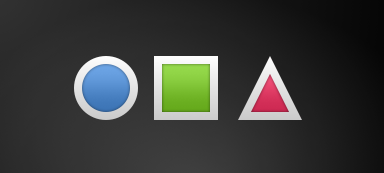

We use our clickable image to present three objects (box, circle, triangle). Each object performs a simple transformation when clicked. Clicking the background will reset the scene.

```qml
// transformation.qml


import QtQuick 2.5

Item {
    // set width based on given background
    width: bg.width
    height: bg.height

    Image { // nice background image
        id: bg
        source: "assets/background.png"
    }

    MouseArea {
        id: backgroundClicker
        // needs to be before the images as order matters
        // otherwise this mousearea would be before the other elements
        // and consume the mouse events
        anchors.fill: parent
        onClicked: {
            // reset our little scene
            circle.x = 84
            box.rotation = 0
            triangle.rotation = 0
            triangle.scale = 1.0
        }
    }

    ClickableImage {
        id: circle
        x: 84; y: 68
        source: "assets/circle_blue.png"
        antialiasing: true
        onClicked: {
            // increase the x-position on click
            x += 20
        }
    }

    ClickableImage {
        id: box
        x: 164; y: 68
        source: "assets/box_green.png"
        antialiasing: true
        onClicked: {
            // increase the rotation on click
            rotation += 15
        }
    }

    ClickableImage {
        id: triangle
        x: 248; y: 68
        source: "assets/triangle_red.png"
        antialiasing: true
        onClicked: {
            // several transformations
            rotation += 15
            scale += 0.05
        }
    }

    function _test_transformed() {
        circle.x += 20
        box.rotation = 15
        triangle.scale = 1.2
        triangle.rotation = -15
    }

    function _test_overlap() {
        circle.x += 40
        box.rotation = 15
        triangle.scale = 2.0
        triangle.rotation = 45
    }

}
```

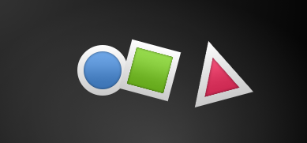

The circle increments the x-position on each click and the box will rotate on each click. The triangle will rotate and scale the image up on each click, to demonstrate a combined transformation. For the scaling and rotation operation we set `antialiasing: true` to enable anti-aliasing, which is switched off (same as the clipping property `clip`) for performance reasons. In your own work, when you see some rasterized edges in your graphics, then you should probably switch smoothly on.

Note:

- To achieve better visual quality when scaling images it is recommended to scale images down instead of up. Scaling an image up with a larger scaling factor will result in scaling artifacts (blurred image). When scaling an image you should consider using ``antialiasing: true`` to enable the usage of a higher quality filter.
- Elements which appear earlier in the code have a lower stacking order (called z-order). If you click long enough on `circle` you will see it moves below `box`. The z-order can also be manipulated by the `z-property` of an Item.

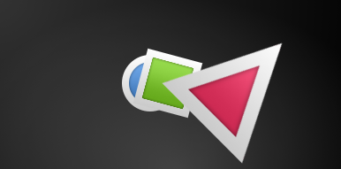

## Positioning Elements

There are a number of QML elements used to position items. These are called positioners and the following are provided in the QtQuick module `Row`, `Column`, `Grid` and `Flow`. They can be seen showing the same contents in the illustration below.

Before we go into details, let me introduce some helper elements.

```qml
// RedSquare.qml

import QtQuick 2.5

Rectangle {
    width: 48
    height: 48
    color: "#ea7025"
    //produce a lighter border color 
    //based on the fill color
    border.color: Qt.lighter(color)
}
```

### Column element

The [Column element](https://doc.qt.io/qt-5/qml-qtquick-column.html) arranges child items into a column by stacking them on top of each other. The `spacing` property can be used to distance each of the child elements from each other.

```qml
// column.qml

import QtQuick 2.5

DarkSquare {
    id: root
    width: 120
    height: 240

    Column {
        id: row
        anchors.centerIn: parent
        spacing: 8
        RedSquare { }
        GreenSquare { width: 96 }
        BlueSquare { }
    }
}
```

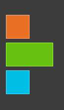

### Row element

The [Row element](https://doc.qt.io/qt-5/qml-qtquick-row.html) places its child items next to each other, either from the left to the right or from the right to the left, depending on the `layoutDirection` property. Again, `spacing` is used to separate child items.

```qml
// row.qml

import QtQuick 2.5

BrightSquare {
    id: root
    width: 400; height: 120

    Row {
        id: row
        anchors.centerIn: parent
        spacing: 20
        BlueSquare { }
        GreenSquare { }
        RedSquare { }
    }
}
```

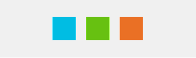

### Grid element

The [Grid element](https://doc.qt.io/qt-5/qml-qtquick-grid.html) arranges its children in a grid, by setting the `rows` and `columns` properties, the number of rows or columns can be constrained. By not setting either of them, the other is calculated from the number of child items. For instance, setting rows to 3 and adding 6 child items will result in 2 columns. The properties `flow` and `layoutDirection` are used to control the order in which the items are added to the grid, while `spacing` controls the amount of space separating the child items.

```qml
// grid.qml

import QtQuick 2.5

BrightSquare {
    id: root
    width: 160
    height: 160

    Grid {
        id: grid
        rows: 2
        columns: 2
        anchors.centerIn: parent
        spacing: 8
        RedSquare { }
        RedSquare { }
        RedSquare { }
        RedSquare { }
    }

}
```


### Flow element

[Flow element](https://doc.qt.io/qt-5/qml-qtquick-flow.html) adds its child items in a flow. The direction of the flow is controlled using `flow` and `layoutDirection`. It can run sideways or from the top to the bottom. It can also run from left to right or in the opposite direction. As the items are added in the flow, they are wrapped to form new rows or columns as needed. In order for a flow to work, it must have a width or a height. This can be set either directly, or though anchor layouts.

```qml
// flow.qml

import QtQuick 2.5

BrightSquare {
    id: root
    width: 160
    height: 160

    Flow {
        anchors.fill: parent
        anchors.margins: 20
        spacing: 20
        RedSquare { }
        BlueSquare { }
        GreenSquare { }
    }
}
```

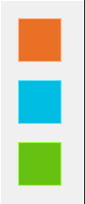

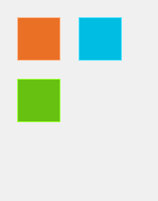

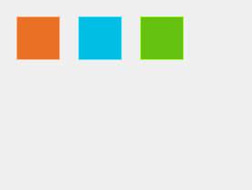

### Repeater element

[Repeater QML Type](https://doc.qt.io/qt-5/qml-qtquick-repeater.html) works like a for-loop and iterates over a model. In the simplest case a model is just a value providing the number of loops.

```qml
// repeater.qml

import QtQuick 2.5

DarkSquare {
    id: root
    width: 252
    height: 252
    property variant colorArray: ["#00bde3", "#67c111", "#ea7025"]


    Grid{
        anchors.fill: parent
        anchors.margins: 8
        spacing: 4
        Repeater {
            model: 16
            Rectangle {
                width: 56; height: 56
                //using JS math functions
                property int colorIndex: Math.floor(Math.random()*3)
                color: root.colorArray[colorIndex]
                border.color: Qt.lighter(color)
                Text {
                    anchors.centerIn: parent
                    color: "#f0f0f0"
                    text: "Cell " + index
                }
            }
        }
    }
}
```

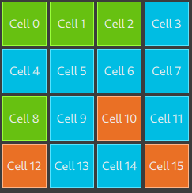

Note:

- More advanced handling of larger models and kinetic views with dynamic delegates is covered in an own model-view chapter. Repeaters are best used when having a small amount of static data to be presented.

## Layout Items

QML provides a flexible way to layout items using [anchors](https://doc.qt.io/qt-5/qtquick-positioning-anchors.html). The concept of anchoring is part of the `Item` fundamental properties and available to all visual QML elements. Anchors act like a contract and are stronger than competing geometry changes. Anchors are expressions of relativeness, you always need a related element to anchor with.

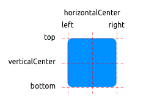

An element has 6 major anchor lines (top, bottom, left, right, horizontalCenter, verticalCenter). Additional there is the baseline anchor for text in Text elements. Each anchor line comes with an offset. In the case of the top, bottom left and right they are called margins. For horizontalCenter, verticalCenter and baseline they are called offsets.

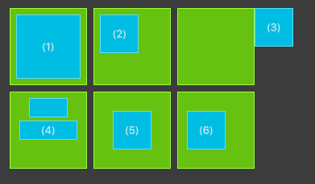

- An element fills a parent element

```qml
        GreenSquare {
            BlueSquare {
                width: 12
                anchors.fill: parent
                anchors.margins: 8
                text: '(1)'
            }
        }
```

- An element is left aligned to the parent

```qml
        GreenSquare {
            BlueSquare {
                width: 48
                y: 8
                anchors.left: parent.left
                anchors.leftMargin: 8
                text: '(2)'
            }
        }
```

- An element left side is aligned to the parent’s right side

```qml
        GreenSquare {
            BlueSquare {
                width: 48
                anchors.left: parent.right
                text: '(3)'
            }
        }
```

- Center-aligned elements. `Blue1` is horizontally centered on the parent. `Blue2` is also horizontal centered but on `Blue1` and it’s top is aligned to the `Blue1` bottom line.

```qml
        GreenSquare {
            BlueSquare {
                id: blue1
                width: 48; height: 24
                y: 8
                anchors.horizontalCenter: parent.horizontalCenter
            }
            BlueSquare {
                id: blue2
                width: 72; height: 24
                anchors.top: blue1.bottom
                anchors.topMargin: 4
                anchors.horizontalCenter: blue1.horizontalCenter
                text: '(4)'
            }
        }
```

- An element is centered on a parent element

```qml
        GreenSquare {
            BlueSquare {
                width: 48
                anchors.centerIn: parent
                text: '(5)'
            }
        }
```

- An element is centered with a left-offset on a parent element using horizontal and vertical center lines

```qml
        GreenSquare {
            BlueSquare {
                width: 48
                anchors.horizontalCenter: parent.horizontalCenter
                anchors.horizontalCenterOffset: -12
                anchors.verticalCenter: parent.verticalCenter
                text: '(6)'
            }
        }
```

Note:

- Our squares have been enhanced to enable dragging. Try the example and drag around some squares. You will see that (1) can’t be dragged as it’s anchored on all sides, sure you can drag the parent of (1) as it’s not anchored at all. (2) can be vertically dragged as only the left side is anchored. Similar applies to (3). (4) can only be dragged vertically as both squares are horizontally centered. (5) is centered on the parent and as such can’t be dragged, similar applies to (7). Dragging an element means changing their `x,y` position. As anchoring is stronger than geometry changes such as `x,y`, dragging is restricted by the anchored lines. We will see this effect later when we discuss animations.

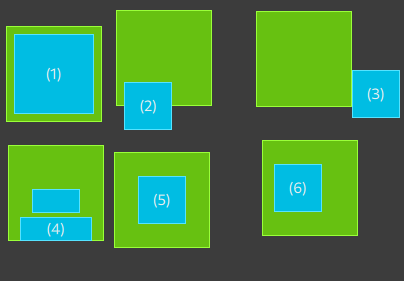

## Input Element

We have already used the [MouseArea](https://doc.qt.io/qt-5/qml-qtquick-mousearea.html) as a mouse input element. Next, we’ll focus on keyboard input. We start off with the text editing elements: [TextInput](https://doc.qt.io/qt-5/qml-qtquick-textinput.html) and [TextEdit](https://doc.qt.io/qt-5/qml-qtquick-textedit.html).

### TextInput

The [TextInput](https://doc.qt.io/qt-5/qml-qtquick-textinput.html) allows the user to enter a line of text. The element supports input constraints such as validator, inputMask, and echoMode.

```qml
// textinput.qml

import QtQuick 2.5

Rectangle {
    width: 200
    height: 80
    color: "linen"

    TextInput {
        id: input1
        x: 8; y: 8
        width: 96; height: 20
        focus: true
        text: "Text Input 1"
    }

    TextInput {
        id: input2
        x: 8; y: 36
        width: 96; height: 20
        text: "Text Input 2"
    }
}
```

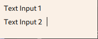

The user can click inside a `TextInput` to change the focus. To support switching the focus by keyboard, we can use the `KeyNavigation`(Tab按键导航) attached property.

```qml
// textinput2.qml

import QtQuick 2.5

Rectangle {
    width: 200
    height: 80
    color: "linen"

    TextInput {
        id: input1
        x: 8; y: 8
        width: 96; height: 20
        focus: true
        text: "Text Input 1"
        KeyNavigation.tab: input2
    }

    TextInput {
        id: input2
        x: 8; y: 36
        width: 96; height: 20
        text: "Text Input 2"
        KeyNavigation.tab: input1
    }
}
```

We move this piece of code into our own component called TLineEditV1 for reuse.

```qml
// TLineEditV1.qml

import QtQuick 2.5

Rectangle {
    width: 96; height: input.height + 8
    color: "lightsteelblue"
    border.color: "gray"

    property alias text: input.text
    property alias input: input

    TextInput {
        id: input
        anchors.fill: parent
        anchors.margins: 4
        focus: true
    }
}
```

Note

- If you want to export the `TextInput` completely, you can export the element by using `property alias input: input`. The first `input` is the property name, where the 2nd input is the element id.

We rewrite our `KeyNavigation` example with the new `TLineEditV1` component.

```qml
Rectangle {
    ...
    TLineEditV1 {
        id: input1
        ...
    }
    TLineEditV1 {
        id: input2
        ...
    }
}
```

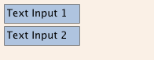

And try the tab key for navigation. You will experience the focus does not change to `input2`. The simple use of `focus: true` is not sufficient. The problem arises, that the focus was transferred to the `input2` element the top-level item inside the `TlineEditV1` (our `Rectangle`) received focus and did not forward the focus to the `TextInput`. To prevent this QML offers the `FocusScope`.

### FocusScope

A [focus scope](https://doc.qt.io/qt-5/qml-qtquick-focusscope.html#details) declares that the last child element with focus: true receives the focus if the focus scope receives the focus. So it’s forward the focus to the last focus requesting child element. We will create a 2nd version of our TLineEdit component called TLineEditV2 using the focus scope as the root element.

```qml
// TLineEditV2.qml

import QtQuick 2.5

FocusScope {
    width: 96; height: input.height + 8
    Rectangle {
        anchors.fill: parent
        color: "lightsteelblue"
        border.color: "gray"

    }

    property alias text: input.text
    property alias input: input

    TextInput {
        id: input
        anchors.fill: parent
        anchors.margins: 4
        focus: true
    }
}
```

Our example will now look like this:

```qml
Rectangle {
    ...
    TLineEditV2 {
        id: input1
        ...
    }
    TLineEditV2 {
        id: input2
        ...
    }
}
```

Pressing the tab key now successfully switches the focus between the 2 components and the correct child element inside the component is focused.

### TextEdit

The `TextEdit` is very similar to `TextInput` and support a multi-line text edit field. It doesn’t have the text constraint properties as this depends on querying the painted size of the text (`paintedHeight, paintedWidth`). We also create our own component called `TTextEdit` to provide an editing background and use the focus scope for better focus forwarding.

```qml
// TTextEdit.qml

import QtQuick 2.5

FocusScope {
    width: 96; height: 96
    Rectangle {
        anchors.fill: parent
        color: "lightsteelblue"
        border.color: "gray"

    }

    property alias text: input.text
    property alias input: input

    TextEdit {
        id: input
        anchors.fill: parent
        anchors.margins: 4
        focus: true
    }
}
```

You can use it like the TLineEdit component:

```qml
// textedit.qml

import QtQuick 2.5

Rectangle {
    width: 136
    height: 120
    color: "linen"

    TTextEdit {
        id: input
        x: 8; y: 8
        width: 120; height: 104
        focus: true
        text: "Text Edit"
    }
}
```

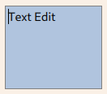

### keys Element

The attached property `keys` allows executing code based on certain key presses.For example,to move a square around and scale we can hook into the up,down,left and right keys to translate the element an the plus,minus key to scale the element.

```qml
// keys.qml

import QtQuick 2.5

DarkSquare {
    width: 400; height: 200

    GreenSquare {
        id: square
        x: 8; y: 8
    }
    focus: true
    Keys.onLeftPressed: square.x -= 8
    Keys.onRightPressed: square.x += 8
    Keys.onUpPressed: square.y -= 8
    Keys.onDownPressed: square.y += 8
    Keys.onPressed: {
        switch(event.key) {
            case Qt.Key_Plus:
                square.scale += 0.2
                break;
            case Qt.Key_Minus:
                square.scale -= 0.2
                break;
        }

    }
}
```

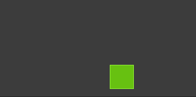

## Advanced Techniques


### Performance of QML

QML and Javascript are interpreted languages. This means that they do not have to be processed by a compiler before being executed. Instead, they are being run inside an execution engine. However, as interpretation is a costly operation various techniques are used to improved performance.

The QML engine uses just-in-time (JIT) compilation to improve performance. It also caches the intermediate output to avoid having to recompile. This works seamlessly for you as a developer. The only trace of this is that files ending with `qmlc` and `jsc` can be found next to the source files.

If you want to avoid the initial start-up penalty induced by the initial parsing you can also pre-compile your QML and Javascript. This requires you to put your code into a Qt resource file and is described in detail in the [Deploying QML Applications](https://doc.qt.io/qt-5/qtquick-deployment.html)#[Compiling QML Ahead of Time](https://doc.qt.io/qt-5/qtquick-deployment.html#ahead-of-time-compilation) chapter in the Qt documentation.

## Source code

[source code](https://qmlbook.github.io/assets/ch04-qmlstart-assets.tgz)

---
- [上一级](README.md)
- 上一篇 -> [《Qml Book》 - Meet Qt5](qmlBook_1_MeetQt5.md)
- 下一篇 -> [《Qml Book》 - Fluid Elements](qmlBook_5_FluidElements.md)
