# 《Qml Book》 - Fluid Elements

<!-- @import "[TOC]" {cmd="toc" depthFrom=1 depthTo=6 orderedList=false} -->

<!-- code_chunk_output -->

- [《Qml Book》 - Fluid Elements](#qml-book---fluid-elements)
  - [Animations](#animations)
    - [Animation Elements](#animation-elements)
    - [Applying Animations](#applying-animations)
    - [Easing Curves](#easing-curves)
    - [Grouped Animations](#grouped-animations)
  - [States and Transitions](#states-and-transitions)
    - [States](#states)
    - [Transitions](#transitions)
  - [Source code](#source-code)

<!-- /code_chunk_output -->

注：该文档为 《Qml Book》的学习文档，详见 [Qml book - Fluid Elements](https://qmlbook.github.io/ch05-fluid/fluid.html)

Till now, we have mostly looked at simple graphical elements and how to arrange and manipulate them. This chapter is about how to control these changes in a way that a value of a property not just changes instantly, it’s more how the value changes over time: an animation. This technology is one of the key foundations for modern slick user interfaces and can be extended with a system to describe your user interface using states and transitions. Each state defines a set of property changes and can be combined with animations on state changes, called transitions.

## Animations

Animations are applied to property changes. An animation defines the interpolation curve when for property value changes to create smooth transitions from one value to another. An animation is defined by a series of target properties to be animated, an easing curve for the interpolation curve and in the most cases a duration, which defines the time for the property change. All animations in Qt Quick are controlled by the same timer and are therefore synchronized. This improves the performance and visual quality of animations.

Note
- Animations control how property changes, i.e. value interpolation. This is a fundamental concept. QML is based on elements, properties, and scripting. Every element provides dozens of properties, each property is waiting to get animated by you. In the book, you will see this is a spectacular playing field. You will catch yourself at looking at some animations and just admire their beauty and for sure also your creative genius. Please remember then: Animations control property changes and every element has dozens of properties at your disposal.

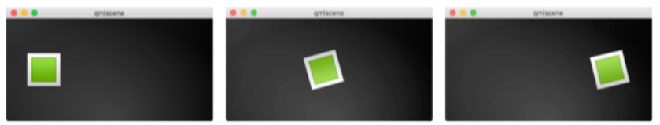


```qml
// animation.qml

import QtQuick 2.5

Image {
    id: root
    source: "assets/background.png"

    property int padding: 40
    property int duration: 4000
    property bool running: false

    Image {
        id: box
        x: root.padding;
        y: (root.height-height)/2
        source: "assets/box_green.png"

        NumberAnimation on x {
            to: root.width - box.width - root.padding
            duration: root.duration
            running: root.running
        }
        RotationAnimation on rotation {
            to: 360
            duration: root.duration
            running: root.running
        }
    }

    MouseArea {
        anchors.fill: parent
        onClicked: root.running = true
    }

}
```
The example above shows a simple animation applied on the `x` and `rotation` property. Each animation has a duration of 4000 milliseconds (msec) and loops forever. 

Now you can play around with the animation by changing the `to` and `duration` property or you could add another animation for example on the `opacity` or even the `scale`. Combining these it could look like the object is disappearing into the deep space. Try it out!

### Animation Elements

There are several types of animation elements, each optimized for a specific use case. Here is a list of the most prominent animations:
- [PropertyAnimation](https://doc.qt.io/qt-5/qml-qtquick-propertyanimation.html) - Animates changes in property values
- [NumberAnimation](https://doc.qt.io/qt-5/qml-qtquick-numberanimation.html) - Animates changes in qreal-type values
- [ColorAnimation](https://doc.qt.io/qt-5/qml-qtquick-coloranimation.html) - Animates changes in color values
- [RotationAnimation](https://doc.qt.io/qt-5/qml-qtquick-rotationanimator.html) - Animates changes in rotation values

Besides these basic and widely used animation elements, Qt Quick provides also more specialized animations for specific use cases:
- [PauseAnimation](https://doc.qt.io/qt-5/qml-qtquick-pauseanimation.html) - Provides a pause for an animation
- [SequentialAnimation](https://doc.qt.io/qt-5/qml-qtquick-sequentialanimation.html) - Allows animations to be run sequentially
- [ParallelAnimation](https://doc.qt.io/qt-5/qml-qtquick-parallelanimation.html) - Allows animations to be run in parallel
- [AnchorAnimation](https://doc.qt.io/qt-5/qml-qtquick-anchoranimation.html) - Animates changes in anchor values
- [ParentAnimation](https://doc.qt.io/qt-5/qml-qtquick-parentanimation.html) - Animates changes in parent values
- [SmoothedAnimation](https://doc.qt.io/qt-5/qml-qtquick-smoothedanimation.html) - Allows a property to smoothly track a value
- [SpringAnimation](https://doc.qt.io/qt-5/qml-qtquick-springanimation.html) - Allows a property to track a value in a spring-like motion
- [PathAnimation](https://doc.qt.io/qt-5/qml-qtquick-pathanimation.html) - Animates an item alongside a path
- [Vector3dAnimation](https://doc.qt.io/qt-5/qml-qtquick-vector3danimation.html) - Animates changes in QVector3d values

We will learn later how to create a sequence of animations. While working on more complex animations there comes up the need to change a property or to run a script during an ongoing animation. For this Qt Quick offers the action elements, which can be used everywhere where the other animation elements can be used:

- [PropertyAction](https://doc.qt.io/qt-5/qml-qtquick-propertyaction.html) - Specifies immediate property changes during animation
- [ScriptAction](https://doc.qt.io/qt-5/qml-qtquick-scriptaction.html) - Defines scripts to be run during an animation

### Applying Animations

Animation can be applied in several ways:

- Animation on property - runs automatically after the element is fully loaded
- Behavior on property - runs automatically when the property value changes
- Standalone Animation - runs when the animation is explicitly started using `start()` or `running` is set to true (e.g. by a property binding)
Later we see also how animations can be used inside state transitions.

To demonstrate the usage of animations we reuse our `ClickableImage` component from an earlier chapter and extended it with a text element.
```qml
// ClickableImageV2.qml
// Simple image which can be clicked

import QtQuick 2.5

Item {
    id: root
    width: container.childrenRect.width
    height: container.childrenRect.height
    property alias text: label.text
    property alias source: image.source
    signal clicked

    Column {
        id: container
        Image {
            id: image
        }
        Text {
            id: label
            width: image.width
            horizontalAlignment: Text.AlignHCenter
            wrapMode: Text.WordWrap
            color: "#ececec"
        }
    }

    MouseArea {
        anchors.fill: parent
        onClicked: root.clicked()
    }
}
```

animationtypes.qml:
```qml
// animationtypes.qml

import QtQuick 2.5

Item {
    id: root
    width: background.width; height: background.height

    Image {
        id: background
        source: "assets/background_medium.png"
    }


    //M4>>
    MouseArea {
        anchors.fill: parent
        onClicked: {
            greenBox.y = blueBox.y = redBox.y = 205
        }
    }
    //<<M4

    //M1>>
    ClickableImageV2 {
        id: greenBox
        x: 40; y: root.height-height
        source: "assets/box_green.png"
        text: "animation on property"
        NumberAnimation on y {
            to: 40; duration: 4000
        }
    }
    //<<M1

    //M2>>
    ClickableImageV2 {
        id: blueBox
        x: (root.width-width)/2; y: root.height-height
        source: "assets/box_blue.png"
        text: "behavior on property"
        Behavior on y {
            NumberAnimation { duration: 4000 }
        }

        onClicked: y = 40
        // random y on each click
//        onClicked: y = 40+Math.random()*(205-40)
    }
    //<<M2

    //M3>>
    ClickableImageV2 {
        id: redBox
        x: root.width-width-40; y: root.height-height
        source: "assets/box_red.png"
        onClicked: anim.start()
//        onClicked: anim.restart()

        text: "standalone animation"

        NumberAnimation {
            id: anim
            target: redBox
            properties: "y"
            to: 40
            duration: 4000
        }
    }
    //<<M3

}

```

- The first object travels using the `Animation on <property>` strategy. The animation starts immediately.When an object is clicked their y-position is reset to the start position, this applies to all objects. On the first object, the reset does not have any effect as long as the animation is running. It’s even disturbing as the y-position is set for a fraction of a second to a new value before the animation starts. Such competing property changes should be avoided.

- The second object travels using a `behavior on` animation. This behavior tells the property, every time the property value changes, it changes through this animation. The behavior can be disabled by `enabled : false` on the `Behavior` element. The object will start traveling when you click it (y-position is then set to 40). Another click has no influence as the position is already set. 

- The third object uses a `standalone animation`. The animation is defined as its own element and could be everywhere in the document. The click will start the animation using the animations function `start()`. Each animation has a `start()`, `stop()`, `resume()`, `restart()` function. The animation itself contains much more information than the other animation types earlier. We need to define the target and properties to declare the target element to be animated and which properties we want to animate. We need to define a `to` value and in this case, we define also a `from` value to allow a restart of the animation.

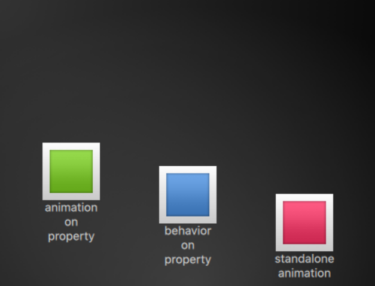

Note

- Another way to start/stop an animation is to bind a property to the `running` property of an animation. This is especially useful when the user-input is in control of properties:
```qml
NumberAnimation {
    ...
    // animation runs when mouse is pressed
    running: area.pressed
}
MouseArea {
    id: area
}
```
### Easing Curves

The value change of a property can be controlled by an animation. Easing attributes allows influencing the interpolation curve of a property change. All animations we have defined by now use a linear interpolation because the initial easing type of an animation is `Easing.Linear`. It’s best visualized with a small plot, where the y-axis is the property to be animated and the x-axis is the time (duration). A linear interpolation would draw a straight line from the `from` value at the start of the animation to the `to` value at the end of the animation. So the easing type defines the curve of change. Easing types are carefully chosen to support a natural fit for a moving object, for example when a page slides out. Initially, the page should slide out slowly and then gain the speed to finally slide out at high speed, similar to turning the page of a book.

Note

- Animations should not be overused. As other aspects of UI design also animations should be designed carefully and support the UI flow and not dominate it. The eye is very sensitive to moving objects and animations can easily distract the user.

In the next example, we will try some easing curves. Each easing curve is displayed by a click-able image and, when clicked, will set a new easing type on the `square` animation and then trigger a `restart()` to run the animation with the new curve.

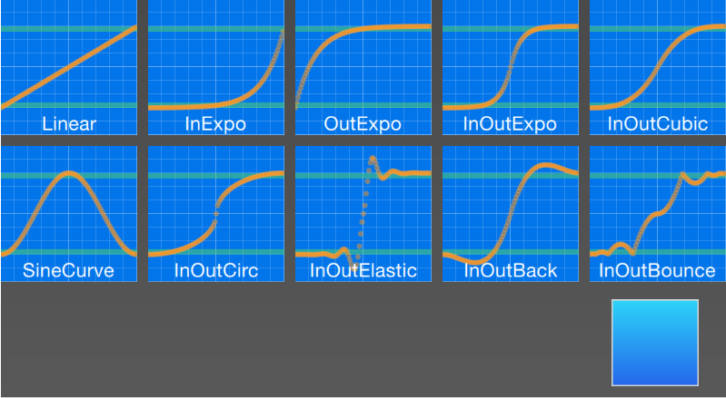

The code for this example was made a little bit more complicated. We first create a grid of `EasingTypes` and a `Box` which is controlled by the easing types. An easing type just displays the curve which the box shall use for its animation. When the user clicks on an easing curve the box moves in a direction according to the easing curve. The animation itself is a standalone-animation with the target set to the box and configured for x-property animation with a duration of 2 secs.

Note

- The internals of the [EasingType](https://doc.qt.io/qt-5/qml-qtquick-animator.html#easing-prop) renders the curve in real time and the interested reader can look it up in the EasingCurves example.

```qml
// EasingCurves.qml

import QtQuick 2.5
import QtQuick.Layouts 1.2

Rectangle {
    id: root
    width: childrenRect.width
    height: childrenRect.height

    color: '#4a4a4a'
    gradient: Gradient {
        GradientStop { position: 0.0; color: root.color }
        GradientStop { position: 1.0; color: Qt.lighter(root.color, 1.2) }
    }

    ColumnLayout {

        Grid {
            spacing: 8
            columns: 5
            EasingType {
                easingType: Easing.Linear
                title: 'Linear'
                onClicked: {
                    animation.easing.type = easingType
                    box.toggle = !box.toggle
                }
            }
            EasingType {
                easingType: Easing.InExpo
                title: "InExpo"
                onClicked: {
                    animation.easing.type = easingType
                    box.toggle = !box.toggle
                }
            }
            EasingType {
                easingType: Easing.OutExpo
                title: "OutExpo"
                onClicked: {
                    animation.easing.type = easingType
                    box.toggle = !box.toggle
                }
            }
            EasingType {
                easingType: Easing.InOutExpo
                title: "InOutExpo"
                onClicked: {
                    animation.easing.type = easingType
                    box.toggle = !box.toggle
                }
            }
            EasingType {
                easingType: Easing.InOutCubic
                title: "InOutCubic"
                onClicked: {
                    animation.easing.type = easingType
                    box.toggle = !box.toggle
                }
            }
            EasingType {
                easingType: Easing.SineCurve
                title: "SineCurve"
                onClicked: {
                    animation.easing.type = easingType
                    box.toggle = !box.toggle
                }
            }
            EasingType {
                easingType: Easing.InOutCirc
                title: "InOutCirc"
                onClicked: {
                    animation.easing.type = easingType
                    box.toggle = !box.toggle
                }
            }
            EasingType {
                easingType: Easing.InOutElastic
                title: "InOutElastic"
                onClicked: {
                    animation.easing.type = easingType
                    box.toggle = !box.toggle
                }
            }
            EasingType {
                easingType: Easing.InOutBack
                title: "InOutBack"
                onClicked: {
                    animation.easing.type = easingType
                    box.toggle = !box.toggle
                }
            }
            EasingType {
                easingType: Easing.InOutBounce
                title: "InOutBounce"
                onClicked: {
                    animation.easing.type = easingType
                    box.toggle = !box.toggle
                }
            }
        }
        Item {
            height: 80
            Layout.fillWidth: true
            Box {
                id: box
                property bool toggle
                x: toggle?20:root.width-width-20
                anchors.verticalCenter: parent.verticalCenter
                gradient: Gradient {
                    GradientStop { position: 0.0; color: "#2ed5fa" }
                    GradientStop { position: 1.0; color: "#2467ec" }
                }
                Behavior on x {
                    NumberAnimation {
                        id: animation
                        duration: 500
                    }
                }
            }
        }
    }
}
```

Please play with it, please observe the change of speed during an animation. Some animations feel more natural for the object and some feel irritating.

### Grouped Animations
Often animations will be more complex than just animating one property. You might want to run several animations at the same time or one after another or even execute a script between two animations. For this, the grouped animation offer you a possibility. As the named suggests it’s possible to group animations. Grouping can be done in two ways: parallel or sequential. You can use the [SequentialAnimation](https://doc.qt.io/qt-5/qml-qtquick-sequentialanimation.html) or the [ParentAnimation](https://doc.qt.io/qt-5/qml-qtquick-parentanimation.html) element, which act as animation containers for other animation elements. These grouped animations are animations themselves and can be used exactly as such.

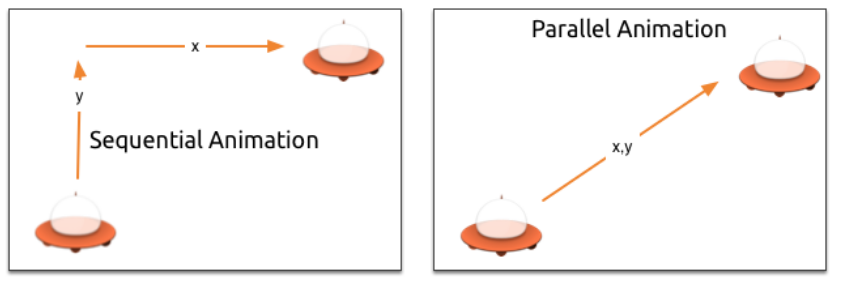

All direct child animations of a parallel animation will run in parallel when started. This allows you to animate different properties at the same time.

```qml
// parallelanimation.qml
import QtQuick 2.5

BrightSquare {
    id: root
    width: 600
    height: 400
    property int duration: 3000
    property Item ufo: ufo

    Image {
        anchors.fill: parent
        source: "assets/ufo_background.png"
    }


    ClickableImageV3 {
        id: ufo
        x: 20; y: root.height-height
        text: 'ufo'
        source: "assets/ufo.png"
        onClicked: anim.restart()
    }

    ParallelAnimation {
        id: anim
        NumberAnimation {
            target: ufo
            properties: "y"
            to: 20
            duration: root.duration
        }
        NumberAnimation {
            target: ufo
            properties: "x"
            to: 160
            duration: root.duration
        }
    }
}
```

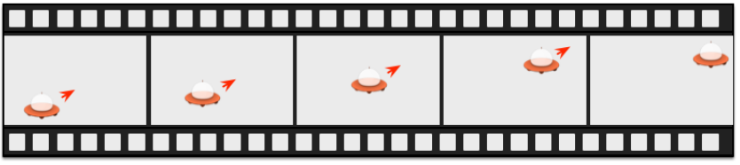

A sequential animation will first run the first child animation and then continue from there.

```qml
// SequentialAnimationExample.qml
import QtQuick 2.5

BrightSquare {
    id: root
    width: 600
    height: 400
    property int duration: 3000

    property Item ufo: ufo

    Image {
        anchors.fill: parent
        source: "assets/ufo_background.png"
    }

    ClickableImageV3 {
        id: ufo
        x: 20; y: root.height-height
        text: 'rocket'
        source: "assets/ufo.png"
        onClicked: anim.restart()
    }

    SequentialAnimation {
        id: anim
        NumberAnimation {
            target: ufo
            properties: "y"
            to: 20
            // 60% of time to travel up
            duration: root.duration*0.6
        }
        NumberAnimation {
            target: ufo
            properties: "x"
            to: 400
            // 40% of time to travel sideways
            duration: root.duration*0.4
        }
    }
}
```

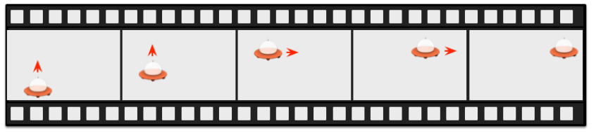

Grouped animation can also be nested, for example, a sequential animation can have two parallel animations as child animations, and so on. We can visualize this with a soccer ball example. The idea is to throw a ball from left to right an animate its behavior.

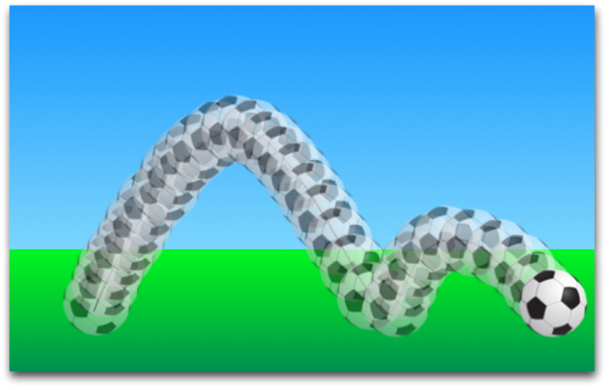

To understand the animation we need to dissect it into the integral transformations of the object. We need to remember animation do animate property changes. Here are the different transformations:

- An x-translation from left-to-right (X1)
- An y-translation from down to up (Y1) followed by a translation from up to down (Y2) with some bouncing
- A rotation over 360 over the whole animation duration (ROT1)

The whole duration of the animation should take three seconds.

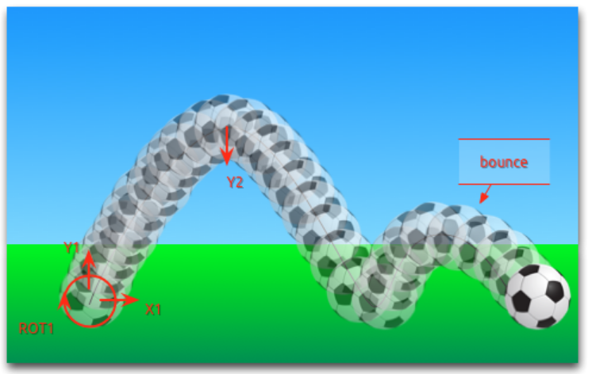

```qml
import QtQuick 2.5

Item {
    id: root
    width: 640
    height: 380
    property int duration: 3000

    // M1>>
    Rectangle {
        id: sky
        width: parent.width
        height: 200
        gradient: Gradient {
            GradientStop { position: 0.0; color: "#0080FF" }
            GradientStop { position: 1.0; color: "#66CCFF" }
        }
    }
    Rectangle {
        id: ground
        anchors.top: sky.bottom
        anchors.bottom: root.bottom
        width: parent.width
        gradient: Gradient {
            GradientStop { position: 0.0; color: "#00FF00" }
            GradientStop { position: 1.0; color: "#00803F" }
        }
    }
    // <<M1

    // M2>>
    Image {
        id: ball
        x: 0; y: root.height-height
        source: "assets/soccer_ball.png"

        MouseArea {
            anchors.fill: parent
            onClicked: {
                ball.x = 0;
                ball.y = root.height-ball.height;
                ball.rotation = 0;
                anim.restart()
            }
        }
    }
    // <<M2

    // M3>>
    ParallelAnimation {
        id: anim
        SequentialAnimation {
            NumberAnimation {
                target: ball
                properties: "y"
                to: 20
                duration: root.duration * 0.4
                //use a Easing.OutCirc curve as 
                //this should look more like a 
                //circular movement.
                easing.type: Easing.OutCirc
            }
            NumberAnimation {
                target: ball
                properties: "y"
                to: root.height-ball.height
                duration: root.duration * 0.6
                //using an Easing.OutBounce as
                //the ball should bounce and the 
                //bouncing should happen at the end 
                easing.type: Easing.OutBounce
            }
        }
        NumberAnimation {
            target: ball
            properties: "x"
            to: root.width-ball.width
            duration: root.duration
        }
        RotationAnimation {
            target: ball
            properties: "rotation"
            to: 720
            duration: root.duration
        }
    }
    // <<M3
}
```

## States and Transitions


Often parts of a user interface can be described in states. A state defines a set of property changes and can be triggered by a certain condition. Additional these state switches can have a transition attached which defines how these changes should be animated or any additional actions shall be applied. Actions can also be applied when a state is entered.

### States

You define states in QML with the [State](https://doc.qt.io/qt-5/qml-qtquick-state.html) element, which needs to be bound to the `states` array of any item element. A state is identified through a state name and consist, in its simplest form, of a series of property changes on elements. The default state is defined by the initial properties of the element and is named "" (the empty string).

```qml
Item {
    id: root
    states: [
        State {
            name: "go"
            PropertyChanges { ... }
        },
        State {
            name: "stop"
            PropertyChanges { ... }
        }
    ]
}
```

A state is changed by assigning a new state name to the `state` property of the element with the states defined.


Note

- Another way to switch states is using the `when` property of the `State` element. The `when` property can be set to an expression that evaluates to true when the state should be applied.

```qml
Item {
    id: root
    states: [
        ...
    ]

    Button {
        id: goButton
        ...
        onClicked: root.state = "go"
    }
}
```

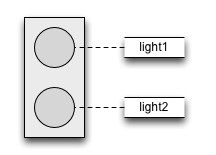

For example, a traffic light might have two signaling lights. The upper one signaling stop with a red color and the lower one signaling go with a green color. In this example, both lights should not shine at the same time. Let’s have a look at the state chart diagram.

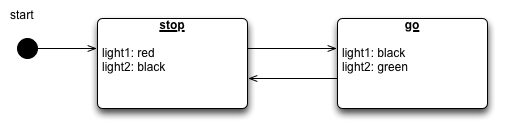


```qml
import QtQuick 2.5

Rectangle {
    id: root
    width: 150
    height: 250

    property color black: '#1f1f21'
    property color red: '#fc3d39'
    property color green: '#53d769'


    gradient: Gradient {
        GradientStop { position: 0.0; color: "#2ed5fa" }
        GradientStop { position: 1.0; color: "#2467ec" }
    }


    // M1>>
    Rectangle {
        id: light1
        x: 25; y: 15
        width: 100; height: width
        radius: width/2
        color: root.black
        border.color: Qt.lighter(color, 1.1)
    }

    Rectangle {
        id: light2
        x: 25; y: 135
        width: 100; height: width
        radius: width/2
        color: root.black
        border.color: Qt.lighter(color, 1.1)
    }
    // <<M1

    // M2>>
    state: "stop"

    states: [
        State {
            name: "stop"
            PropertyChanges { target: light1; color: root.red }
            PropertyChanges { target: light2; color: root.black }
        },
        State {
            name: "go"
            PropertyChanges { target: light1; color: root.black }
            PropertyChanges { target: light2; color: root.green }
        }
    ]
    // <<M2

    // M3>>
    MouseArea {
        anchors.fill: parent
        onClicked: parent.state = (parent.state == "stop"? "go" : "stop")
    }
    // <<M3

    // M4>>
    transitions: [
        Transition {
   //         from: "stop"; to: "go"
            from: "*"; to: "*"
            ColorAnimation { target: light1; properties: "color"; duration: 2000 }
            ColorAnimation { target: light2; properties: "color"; duration: 2000 }
        }
    ]
    // <<M4

}
```

### Transitions

A series of transitions can be added to every item. A [transition](https://doc.qt.io/qt-5/qml-qtquick-transition.html) is executed by a state change. You can define on which state change a particular transition can be applied using the `from:` and `to:` properties. These two properties act like a filter when the filter is true the transition will be applied. You can also use the wild-cast “*” which means “any state”. For example `from:"*"; to:"*"` means from any state to any other state and is the default value for `from` and `to`, which means the transition is applied to every state switch.

For this example, we would like to animate the color changes when switching state from “go” to “stop”.

We restrict the transition with the from and to properties to filter only the state change from “go” to “stop”. Inside the transition, we add two color animations for each light, which shall animate the property changes defined in the state description.

```qml
 transitions: [
        Transition {
   //         from: "stop"; to: "go"
            from: "*"; to: "*"
            ColorAnimation { target: light1; properties: "color"; duration: 2000 }
            ColorAnimation { target: light2; properties: "color"; duration: 2000 }
        }
    ]
```

You can change the state though clicking the UI. The state is applied immediately and will also change the state while a transition is running. So try to click the UI while the state is in the transition from “stop” to “go”. You will see the change will happen immediately.


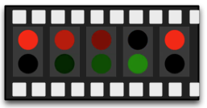

result:

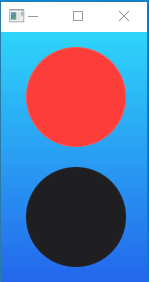

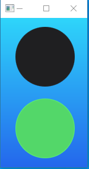

## Source code

[source code](https://qmlbook.github.io/assets/ch05-fluid-assets.tgz)

---
- [上一级](README.md)
- 上一篇 -> [《Qml book》 - Quick Starter](qmlBook_4_quickStarter.md)
- 下一篇 -> [qwt 简单使用](qwt.md)
