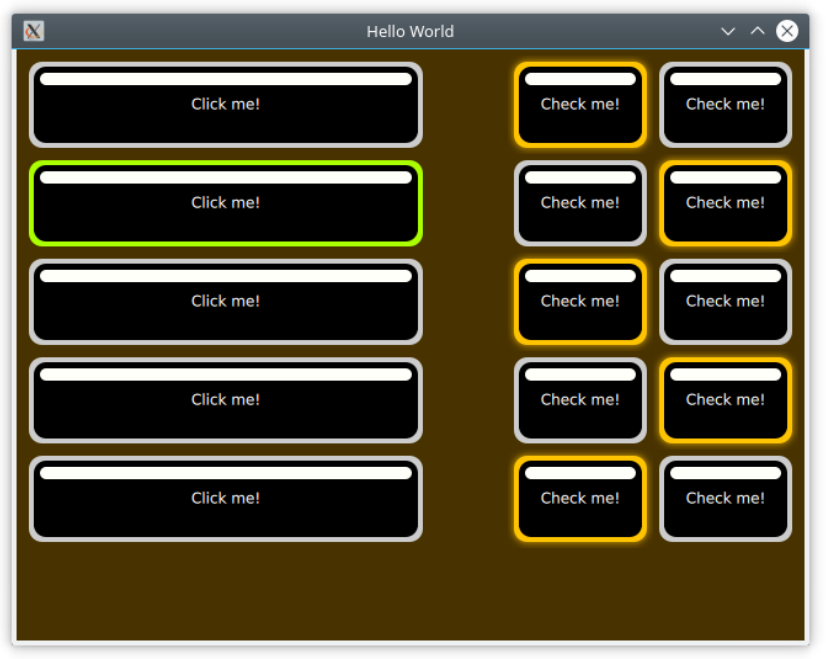

# 《Qml Book》 - Qt Quick Controls 2

<!-- @import "[TOC]" {cmd="toc" depthFrom=1 depthTo=6 orderedList=false} -->

<!-- code_chunk_output -->

- [《Qml Book》 - Qt Quick Controls 2](#qml-book-qt-quick-controls-2)
  - [Introduction to Controls](#introduction-to-controls)
  - [An Image Viewer](#an-image-viewer)
    - [The Desktop Version](#the-desktop-version)
  - [The Imagine Style](#the-imagine-style)
  - [Summary](#summary)
  - [Source code](#source-code)

<!-- /code_chunk_output -->

注：该文档为 《Qml Book》的学习文档，详见 [Qml book - Qt Quick Controls 2](https://qmlbook.github.io/ch06-controls/controls.html)

This chapter introduces how to use Qt Quick Controls 2 to create a user interface built from standard components such as `buttons`, `labels`, `sliders` and so on. We will look at how various styles can be used to move user interfaces between platforms before diving into custom styling.

## Introduction to Controls

Using Qt Quick from scratch gives you primited graphical and interaction elements from which you can build your user interfaces. Using [Qt Quick Controls 2](https://doc.qt.io/qt-5/qtquickcontrols-index.html) you start from a slightly more structured set of controls to build from. The [Qt Quick Controls QML Types](https://doc.qt.io/qt-5/qtquick-controls2-qmlmodule.html) range from simple text labels and buttons to more complex ones such as sliders and dials. These element are handy if you want to create a user interface based on classic interaction patterns as they provide a foundation to stand on.

The Qt Quick Controls 2 comes with a number of [styles](https://doc.qt.io/qt-5/qtquickcontrols2-styles.html) out of the box that are shown in the table below.

- The Default style is a basic flat style.
- The Universal style is based on the Microsoft Universal Design Guidelines
- Material is based on Google’s Material Design Guidelines
- Fusion style is a desktop oriented style.

Some of the styles can be tweaked by tweaking the used palette. The Imagine is a style based on image assets, this allows a graphical designer to create a new style without writing any code at all, not even for palette colour codes.

The Qt Quick Controls 2 is available from the `QtQuick.Controls` import module. In this module you will find the basic controls such as buttons, labels, checkboxes, sliders and so on. In addition to these controls, the following modules are also of interest:

|           Module            |                                                                 Description                                                                 |
|:--------------------------: |:------------------------------------------------------------------------------------------------------------------------------------------: |
|      [QtQuick.Controls](https://doc.qt.io/qt-5/qtquickcontrols-index.html)       |                                                             The basic controls.                                                             |
|      [QtQuick.Templates](https://doc.qt.io/qt-5/qtquicktemplates2-index.html)      |                                                Provides the non-visual part of the controls.                                                |
|       [QtQuick.Dialogs](https://doc.qt.io/qt-5/qtquickdialogs-index.html)       | Provides standard dialogs for showing messages, picking files, picking colours, and picking fonts, as well as the base for custom dialogs.  |
| [QtQuick.Controls.Universal](https://doc.qt.io/qt-5/qtquickcontrols2-universal.html)  |                                                      Universal style theming support.                                                       |
|  [QtQuick.Controls.Material](https://doc.qt.io/qt-5/qtquickcontrols2-material.html)  |                                                       Material style theming support.                                                       |
|      [Qt.labs.calendar](https://doc.qt.io/qt-5/qtlabscalendar-index.html)       |                                Controls for supporting date picking and other calendar related interactions.                                |
|      [Qt.labs.platform](https://doc.qt.io/qt-5/qtlabsplatform-index.html)       | Support for platform native dialogs for common tasks such as picking files, colours, etc, as well as system tray icons and standard paths.  |

Notice that the `Qt.labs` modules are experimental, meaning that their APIs can have breaking changes between Qt versions.

Note

- The QtQuick.Dialogs module is a Qt Quick Controls 1 module, but it is also the only way to do dialogs without depending on the QtWidgets module. See below for more details.

## An Image Viewer

Let’s look at a larger example of how Qt Quick Controls 2 is used. For this, we will create a simple image viewer.

### The Desktop Version

The desktop version is based around a classic application window with a menu bar, a tool bar and a document area. The application can be seen in action below.


```qml
import QtQuick 2.0
import QtQuick.Controls 2.4
import QtQuick.Dialogs 1.2

ApplicationWindow {
    
    // ...
    
    visible: true
    width: 640
    height: 480
    title: qsTr("Image Viewer")
    
    menuBar: MenuBar {
        Menu {
            title: qsTr("&File")
            MenuItem {
                text: qsTr("&Open...")
                icon.name: "document-open"
                onTriggered: fileOpenDialog.open()
            }
        }

        Menu {
            title: qsTr("&Help")
            MenuItem {
                text: qsTr("&About...")
                onTriggered: aboutDialog.open()
            }
        }
    }

    header: ToolBar {
        Flow {
            anchors.fill: parent
            ToolButton {
                text: qsTr("Open")
                icon.name: "document-open"
                onClicked: fileOpenDialog.open()
            }
        }
    }

    background: Rectangle {
        color: "darkGray"
    }

    Image {
        id: image
        anchors.fill: parent
        fillMode: Image.PreserveAspectFit
        asynchronous: true
    }

    FileDialog {
        id: fileOpenDialog
        title: "Select an image file"
        folder: shortcuts.documents
        nameFilters: [
            "Image files (*.png *.jpeg *.jpg)",
        ]
        onAccepted: {
            image.source = fileOpenDialog.fileUrl
        }
    }

    Dialog {
        id: aboutDialog
        title: qsTr("About")
        Label {
            anchors.fill: parent
            text: qsTr("QML Image Viewer\nA part of the QmlBook\nhttp://qmlbook.org")
            horizontalAlignment: Text.AlignHCenter
        }

        //we opt to use a standard Ok button to close the dialog
        standardButtons: StandardButton.Ok
    }

    // ...

}
```

- [ApplicationWindow QML Type](https://doc.qt.io/qt-5/qml-qtquick-controls2-applicationwindow.html)
- The `icon.name` is taken from the [freedesktop.org Icon Naming Specification](https://specifications.freedesktop.org/icon-naming-spec/icon-naming-spec-latest.html).

## The Imagine Style

One of the goals with Qt Quick Controls 2 is to separate the logic of a control from its appearance. For most of the styles, the implementation of the appearance consists of a mix of QML code and graphical assets. However, using the Imagine style, it is possible to customize the appearance of a Qt Quick Controls 2 based application using only graphical assets.

The imagine style is based on [9-patch images](https://developer.android.com/guide/topics/graphics/drawables#nine-patch). This allows the images to carry information on how they are stretched and what parts are to be considered as a part of the element and what is outside, e.g. a shadow. For each control, the style supports several elements, and for each element a large number of states are available. By providing assets for certain combinations of these elements and states, you can control the appearance of each control in detail.

The details of 9-patch images, and how each control can be styled is covered in great detail in the [Imagine style documentation](https://doc.qt.io/qt-5/qtquickcontrols2-imagine.html). Here, we will create a custom style to an imaginary device interface to demonstrate how the style is used.



```qml
import QtQuick 2.0
import QtQuick.Controls 2.0

ApplicationWindow {

    // ...

    visible: true
    width: 640
    height: 480
    title: qsTr("Hello World")

    Column {
        anchors.top: parent.top
        anchors.left: parent.left
        anchors.margins: 10

        width: parent.width/2

        spacing: 10

        // ...

        Repeater {
            model: 5
            delegate: Button {
                width: parent.width
                height: 70
                text: qsTr("Click me!")
            }
        }
    }

    Grid {
        anchors.top: parent.top
        anchors.right: parent.right
        anchors.margins: 10

        columns: 2

        spacing: 10

        // ...

        Repeater {
            model: 10

            delegate: Button {
                height: 70
                text: qsTr("Check me!")
                checkable: true
            }
        }
    }
}
```

- [Qt Quick Controls Configuration File](https://doc.qt.io/qt-5/qtquickcontrols2-configuration.html)

In the `qtquickcontrols2.conf` file shown below, you can see how we set the `Style` to Imagine, and then setup a `Path` for the style where it can look for the assets. Finally we set some palette properties as well. The available palette properties can be found on the [palette QML Basic Type](https://doc.qt.io/qt-5/qml-palette.html#qtquickcontrols2-palette) page.

```ini
[Controls]
Style=Imagine

[Imagine]
Path=:images/imagine

[Imagine\Palette]
Text=#ffffff
ButtonText=#ffffff
BrightText=#ffffff
```

The assets for the `Button` control are `button-background.9.png`, `button-background-pressed.9.png` and `button-background-checked.9.png`. These follow the control-element-state pattern. The stateless file, `button-background.9.png` is used for all states without a specific asset. According to the [Imagine style element reference table](https://doc.qt.io/qt-5/qtquickcontrols2-imagine.html#element-reference), a button can have the following states:

- disabled
- pressed
- checked
- checkable
- focused
- highlighted
- flat
- mirrored
- hovered


## Summary

In this chapter we have looked at the Qt Quick Controls 2. They offer set of elements that provide more high level concepts than the basic QML elements. For most scenarios, you will save memory and gain performance by using the Qt Quick Controls 2, as they are based around an optimized C++ logic instead of Javascript and QML.

Finally, we have looked at the Imagine style that allows you to completely customize the look of a QML application through the use of graphical assets. This way an application can be reskinned without any code change what so ever.More information can be found on [Customizing Qt Quick Controls](https://doc.qt.io/qt-5/qtquickcontrols2-customize.html).
## Source code

[source code](https://qmlbook.github.io/assets/ch06-controls-assets.tgz)

---

- [上一级](README.md)
- 上一篇 -> [《Qml Book》 - Fluid Elements](qmlBook_5_FluidElements.md)
- 下一篇 -> [《Qml Book》 - Model-View-Delegate](qmlBook_7_modelViewDelegate.md)
