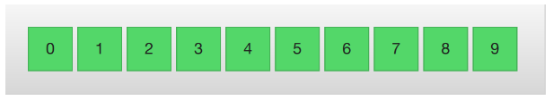

# 《Qml Book》 - Model-View-Delegate

<!-- @import "[TOC]" {cmd="toc" depthFrom=1 depthTo=6 orderedList=false} -->

<!-- code_chunk_output -->

- [《Qml Book》 - Model-View-Delegate](#qml-book-model-view-delegate)
  - [Concept](#concept)
  - [Basic Models](#basic-models)
  - [Dynamic Views](#dynamic-views)
    - [Orientation](#orientation)
    - [Keyboard Navigation and Highlighting](#keyboard-navigation-and-highlighting)
    - [Header and Footer](#header-and-footer)
    - [The GridView](#the-gridview)
  - [Delegate](#delegate)
    - [Animating Added and Removed Items](#animating-added-and-removed-items)
    - [Shape-Shifting Delegates](#shape-shifting-delegates)
  - [Advanced Techniques](#advanced-techniques)
    - [The PathView](#the-pathview)
    - [Table Models](#table-models)
    - [A Model from XML](#a-model-from-xml)
    - [Lists with Sections](#lists-with-sections)
    - [The ObjectModel](#the-objectmodel)
    - [Models with Actions](#models-with-actions)
    - [Tuning Performance](#tuning-performance)
  - [Summary](#summary)
  - [Source code](#source-code)

<!-- /code_chunk_output -->


注：该文档为 《Qml Book》的学习文档，详见 [Qml book - Model-View-Delegate](https://qmlbook.github.io/ch07-modelview/modelview.html)

In Qt Quick, data is separated from the presentation through a model-view separation. For each view, the visualization of each data element is separated into a delegate. Qt Quick comes with a set of predefined models and views. To utilize the system, one must understand these classes and know how to create appropriate delegates to get the right look and feel.

## Concept

One of the most important aspects when developing user interfaces is to keep the representation of the data separate from the visualization.

In QML, the model and view are joined by the delegate. The responsibilies are divided as follows. 


## Basic Models

The most basic way to separate the data from the presentation is to use the [Repeater](https://doc.qt.io/Qt-5/qml-qtquick-repeater.html) element. It is used to instantiate an array of items and is easy to combine with a positioner to populate a part of the user interface. A repeater uses a model, which can be anything from the number of items to instantiate, to a full-blown model gathering data from the Internet.

In its simplest form, the repeater can be used to instantiate a specified number of items. Each item will have access to an attached property, the variable `index`, that can be used to tell the items apart. In the example below, a repeater is used to create 10 instances of an item. The number of items is controlled using the `model` property. For each item, the `Rectangle` containing a `Text` element found inside the `Repeater` item, is instantiated. As you can tell, the `text` property is set to the `index` value, thus the items are numbered from zero to nine.


As nice as lists of numbered items are, it is sometimes interesting to display a more complex data set. By replacing the integer `model` value with a JavaScript array, we can achieve that. The contents of the array can be of any type, be it strings, integers or objects. In the example below, a list of strings is used. We can still access and use the `index` variable, but we also have access to `modelData` containing the data for each element in the array.

```qml
import QtQuick 2.5
import "../common"

Column {
    spacing: 2

    Repeater {
        model: ["Enterprise", "Columbia", "Challenger", "Discovery", "Endeavour", "Atlantis"]

        BlueBox {
            width: 100
            height: 32
            radius: 3

            text: modelData + ' (' + index + ')'
        }
    }
}
```


Being able to expose the data of an array, you soon find yourself in a position where you need multiple pieces of data per item in the array. This is where models enter the picture. One of the most trivial models and one of the most commonly used is the [ListModel](https://doc.qt.io/qt-5/qml-qtqml-models-listmodel.html). A list model is simply a collection of `ListElement` items. Inside each list element, a number of properties can be bound to values. For instance, in the example below, a name and a color are provided for each element.

The properties bound inside each element are attached to each instantiated item by the repeater. This means that the variables `name` and `surfaceColor` are available from within the scope of each `Rectangle` and `Text` item created by the repeater. This not only makes it easy to access the data, it also makes it easy to read the source code. The `surfaceColor` is the color of the circle to the left of the name, not something obscure as data from column `i` of row `j` .

```qml
import QtQuick 2.5
import "../common"

Column {
    spacing: 2

    Repeater {
        model: ListModel {
            ListElement { name: "Mercury"; surfaceColor: "gray" }
            ListElement { name: "Venus"; surfaceColor: "yellow" }
            ListElement { name: "Earth"; surfaceColor: "blue" }
            ListElement { name: "Mars"; surfaceColor: "orange" }
            ListElement { name: "Jupiter"; surfaceColor: "orange" }
            ListElement { name: "Saturn"; surfaceColor: "yellow" }
            ListElement { name: "Uranus"; surfaceColor: "lightBlue" }
            ListElement { name: "Neptune"; surfaceColor: "lightBlue" }
        }

        BlueBox {
            width: 120
            height: 32

            radius: 3
            text: name

            Box {
                anchors.left: parent.left
                anchors.verticalCenter: parent.verticalCenter
                anchors.leftMargin: 4

                width: 16
                height: 16

                radius: 8

                color: surfaceColor
            }
        }
    }
}
```


The contents of the repeater that is being instantiated for each item is actually what is bound to the default property, `delegate`. This means that the code of example [Example 01](#basic-models) is synonymous to the code shown below. Notice that the only difference is that the `delegate` property name is spelled out explicitly in the latter.

```qml
import QtQuick 2.5
import "../common"

Column {
    spacing: 2

    Repeater {
        model: 10

        delegate: BlueBox {
            width: 100
            height: 32
            text: index
        }
    }
}
```


## Dynamic Views

Repeaters work well for limited and static sets of data, but in the real world, models are commonly more complex – and larger. Here, a smarter solution is needed. For this, Qt Quick provides the [ListView](https://doc.qt.io/qt-5/qml-qtquick-listview.html) and [GridView](https://doc.qt.io/qt-5/qml-qtquick-gridview.html) elements. These are both based on a [Flickable](https://doc.qt.io/qt-5/qml-qtquick-flickable.html) area, so the user can move around in a larger dataset. At the same time, they limit the number of concurrently instantiated delegates. For a large model, that means fewer elements in the scene at once.


The two elements are similar in their usage. Thus, we will begin with the `ListView` and then describe the `GridView` with the former as the starting point of the comparison. Notice that the GridView places a list of items into a two-dimensional grid, left-to-right or top-to-bottom. If you want to show a table of data you need to use the [TableView](https://doc.qt.io/qt-5/qml-qtquick-tableview.html).

The `ListView` is similar to the `Repeater` element. It uses a `model`, instantiates a `delegate` and between the delegates, there can be `spacing`. The listing below shows how a simple setup can look.

```qml
import QtQuick 2.5
import "../common"

Background {
    width: 80
    height: 300

    ListView {
        anchors.fill: parent
        anchors.margins: 20

        clip: true

        model: 100

        delegate: numberDelegate
        spacing: 5
    }

    Component {
        id: numberDelegate

        GreenBox {
            width: 40
            height: 40
            text: index
        }
    }
}
```


If the model contains more data than can fit onto the screen, the `ListView` only shows part of the list. However, as a consequence of the default behavior of Qt Quick, the list view does not limit the screen area within which the delegates are shown. This means that delegates may be visible outside the list view and that the dynamic creation and destruction of delegates outside the list view is visible to the user. To prevent this, clipping must be activated on the `ListView` element by setting the `clip` property to `true`. The illustration below shows the result of this (left view), compared to when the `clip` property is `false` (right view).


To the user, the `ListView` is a scrollable area. It supports kinetic scrolling, which means that it can be flicked to quickly move through the contents. By default, it also can be stretched beyond the end of contents, and then bounces back, to signal to the user that the end has been reached.

The behavior at the end of the view is controlled using the [boundsBehavior](https://doc.qt.io/qt-5/qml-qtquick-flickable.html#boundsBehavior-prop) property.

This is an enumerated value and can be configured from the default behavior.
- `Flickable.DragAndOvershootBounds`, where the view can be both dragged and flicked outside its boundaries
- `Flickable.StopAtBounds`, where the view never will move outside its boundaries. 
- The middle ground, `Flickable.DragOverBounds` lets the user drag the view outside its boundaries, but flicks will stop at the boundary.

It is possible to limit the positions where a view is allowed to stop. This is controlled using the [snapMode](https://doc.qt.io/qt-5/qml-qtquick-listview.html#snapMode-prop) property.
- The default behavior, `ListView.NoSnap`, lets the view stop at any position.
- By setting the snapMode property to `ListView.SnapToItem`, the view will always align the top of an item with its top. 
- Finally, the `ListView.SnapOneItem`, the view will stop no more than one item from the first visible item when the mouse button or touch was released. The last mode is very handy when flipping through pages.

### Orientation

The list view provides a vertically scrolling list by default, but horizontal scrolling can be just as useful. The direction of the list view is controlled through the `orientation` property. It can be set to either the default value, `ListView.Vertical`, or to `ListView.Horizontal`. A horizontal list view is shown below.

```qml
import QtQuick 2.5
import "../common"

Background {
    width: 480
    height: 80

    ListView {
        anchors.fill: parent
        anchors.margins: 20
        spacing: 4
        clip: true
        model: 100
        orientation: ListView.Horizontal
        delegate: numberDelegate
    }

    Component {
        id: numberDelegate

        GreenBox {
            width: 40
            height: 40
            text: index
        }
    }
}
```



As you can tell, the direction of the horizontal flows from the left to the right by default. This can be controlled through the `layoutDirection` property, which can be set to either `Qt.LeftToRight` or `Qt.RightToLeft`, depending on the flow direction.

### Keyboard Navigation and Highlighting

When using a `ListView` in a touch-based setting, the view itself is enough. In a scenario with a keyboard, or even just arrow keys to select an item, a mechanism to indicate the current item is needed. In QML, this is called highlighting.

Views support a highlight delegate which is shown in the view together with the delegates. It can be considered an additional delegate, only that it is only instantiated once, and is moved into the same position as the current item.

In the example below this is demonstrated. There are two properties involved for this to work. First, the `focus` property is set to true. This gives the `ListView` the keyboard focus. Second, the `highlight` property is set to point out the highlighting delegate to use. The highlight delegate is given the `x`, `y` and `height` of the current item. If the width is not specified, the `width` of the current item is also used.

In the example, the `ListView.view.width` attached property is used for width. The attached properties available to delegates are discussed further in the delegate section of this chapter, but it is good to know that the same properties are available to highlight delegates as well.

```qml
import QtQuick 2.5
import "../common"

Background {
    width: 240
    height: 300

    ListView {
        id: view
        anchors.fill: parent
        anchors.margins: 20

        clip: true

        model: 100

        delegate: numberDelegate
        spacing: 5

        highlight: highlightComponent
        focus: true
    }

    Component {
        id: highlightComponent

        GreenBox {
            width: ListView.view.width
        }
    }

    Component {
        id: numberDelegate

        Item {
            width: ListView.view.width
            height: 40

            Text {
                anchors.centerIn: parent

                font.pixelSize: 10

                text: index
            }
        }
    }
}
```


When using a highlight in conjunction with a `ListView`, a number of properties can be used to control its behavior. The [highlightRangeMode](https://doc.qt.io/qt-5/qml-qtquick-listview.html#highlightRangeMode-prop) controls how the highlight is affected by what is shown in the view. 

- The default setting, `ListView.NoHighlightRange` means that the highlight and the visible range of items in the view not being related at all.
- The value `ListView.StrictlyEnforceRange` ensures that the highlight is always visible. If an action attempts to move the highlight outside the visible part of the view, the current item will change accordingly, so that the highlight remains visible.

- The middle ground is the `ListView.ApplyRange` value. It attempts to keep the highlight visible but does not alter the current item to enforce this. Instead, the highlight is allowed to move out of view if necessary.

In the default configuration, the view is responsible for moving the highlight into position. The speed of the movement and resizing can be controlled, either as a velocity or as a duration. The properties involved are `highlightMoveSpeed`, `highlightMoveDuration`, `highlightResizeSpeed` and `highlightResizeDuration`. By default, the speed is set to 400 pixels per second, and the duration is set to -1, indicating that the speed and distance control the duration. If both a speed and a duration is set, the one that results in the quickest animation is chosen.

To control the movement of the highlight more in detail, the `highlightFollowCurrentItem` property can be set to `false`. This means that the view is no longer responsible for the movement of the highlight delegate. Instead, the movement can be controlled through a `Behavior` or an animation.

In the example below, the y property of the highlight delegate is bound to the `ListView.view.currentItem.y` attached property. This ensures that the highlight follows the current item. However, as we do not let the view move the highlight, we can control how the element is moved. This is done through the `Behavior on y`. In the example below, the movement is divided into three steps: fading out, moving, before fading in. Notice how `SequentialAnimation` and `PropertyAnimation` elements can be used in combination with the `NumberAnimation` to create a more complex movement.

```qml
Component {
        id: highlightComponent

        Item {
            width: ListView.view.width
            height: ListView.view.currentItem.height

            y: ListView.view.currentItem.y

            Behavior on y {
                SequentialAnimation {
                    PropertyAnimation { target: highlightRectangle; property: "opacity"; to: 0; duration: 200 }
                    NumberAnimation { duration: 1 }
                    PropertyAnimation { target: highlightRectangle; property: "opacity"; to: 1; duration: 200 }
                }
            }

            GreenBox {
                id: highlightRectangle
                anchors.fill: parent
            }
        }
    }
```

### Header and Footer

At the end of the `ListView` contents, a `header` and a `footer` element can be inserted. These can be considered special delegates placed at the beginning or end of the list. For a horizontal list, these will not appear at the head or foot, but rather at the beginning or end, depending on the `layoutDirection` used.

The example below illustrates how a header and footer can be used to enhance the perception of the beginning and end of a list. There are other uses for these special list elements. For instance, they can be used to keep buttons to load more contents.

```qml
import QtQuick 2.5
import "../common"

Background {
    width: 240
    height: 300

    ListView {
        anchors.fill: parent
        anchors.margins: 20

        clip: true

        model: 4

        delegate: numberDelegate
        spacing: 2

        header: headerComponent
        footer: footerComponent
    }

    Component {
        id: headerComponent

        YellowBox {
            width: ListView.view.width
            height: 20
            text: 'Header'

        }
    }

    Component {
        id: footerComponent

        YellowBox {
            width: ListView.view.width
            height: 20
            text: 'Footer'
        }
    }

    Component {
        id: numberDelegate

        GreenBox {
            width: ListView.view.width
            height: 40
            text: 'Item #' + index
        }
    }
}
```
Note

- Header and footer delegates do not respect the `spacing` property of a `ListView`, instead they are placed directly adjacent to the next item delegate in the list. This means that any spacing must be a part of the header and footer items.


### The GridView

Using a `GridView` is very similar to using a `ListView`. The only real difference is that the grid view places the delegates in a two-dimensional grid instead of in a linear list.


Compared to a list view, the grid view does not rely on spacing and the size of its delegates. Instead, it uses the `cellWidth` and `cellHeight` properties to control the dimensions of the contents delegates. Each delegate item is then placed in the top left corner of each such cell.

```qml
import QtQuick 2.5
import "../common"

Background {
    width: 220
    height: 300

    GridView {
        id: view
        anchors.fill: parent
        anchors.margins: 20

        clip: true

        model: 100

        cellWidth: 45
        cellHeight: 45

        delegate: numberDelegate
    }

    Component {
        id: numberDelegate

        GreenBox {
            width: 40
            height: 40
            text: index
        }
    }
}
```

A `GridView` contains headers and footers, can use a highlight delegate and supports snap modes as well as various bounds behaviors. It can also be orientated in different directions and orientations.

The orientation is controlled using the `flow` property. It can be set to either `GridView.LeftToRight` or `GridView.TopToBottom`. The former value fills a grid from the left to the right, adding rows from the top to the bottom. The view is scrollable in the vertical direction. The latter value adds items from the top to the bottom, filling the view from left to right. The scrolling direction is horizontal in this case.

In addition to the `flow` property, the `layoutDirection` property can adapt the direction of the grid to left-to-right or right-to-left languages, depending on the value used.

## Delegate

When it comes to using models and views in a custom user interface, the delegate plays a huge role in creating a look. As each item in a model is visualized through a delegate, what is actually visible to the user are the delegates.

Each delegate gets access to a number of attached properties, some from the data model, others from the view. From the model, the properties convey the data for each item to the delegate. From the view, the properties convey state information related to the delegate within the view.

The most commonly used properties attached from the view are `ListView.isCurrentItem` and `ListView.view`. The first is a boolean indicating if the item is the current item, while the latter is a read-only reference to the actual view. Through access to the view, it is possible to create general, reusable delegates that adapt to the size and nature of the view in which they are contained. In the example below, the width of each delegate is bound to the `width` of the view, while the background `color` of each delegate depends on the attached `ListView.isCurrentItem` property.

```qml
import QtQuick 2.5

Rectangle {
    width: 120
    height: 300

    gradient: Gradient {
        GradientStop { position: 0.0; color: "#f6f6f6" }
        GradientStop { position: 1.0; color: "#d7d7d7" }
    }

    ListView {
        anchors.fill: parent
        anchors.margins: 20

        clip: true

        model: 100

        delegate: numberDelegate
        spacing: 5

        focus: true
    }

    Component {
        id: numberDelegate

        Rectangle {
            width: ListView.view.width
            height: 40

            color: ListView.isCurrentItem?"#157efb":"#53d769"
            border.color: Qt.lighter(color, 1.1)

            Text {
                anchors.centerIn: parent

                font.pixelSize: 10

                text: index
            }
        }
    }
}
```


If each item in the model is associated with an action, for instance, clicking an item acts upon it, that functionality is a part of each delegate. This divides the event management between the view, which handles the navigation between items in the view, and the delegate which handles actions on a specific item.

The most basic way to do this is to create a `MouseArea` within each delegate and act on the `onClicked` signal. This is demonstrated in the example in the next section of this chapter.

### Animating Added and Removed Items

In some cases, the contents shown in a view changes over time. Items are added and removed as the underlying data model is altered. In these cases, it is often a good idea to employ visual cues to give the user a sense of direction and to help the user understand what data is added or removed.

Conveniently enough, QML views attach two signals, `onAdd` and `onRemove`, to each item delegate. By connecting animations to these, it is easy to create the movement necessary to aid the user in identifying what is taking place.

The example below demonstrates this through the use of a dynamically populated `ListModel`. At the bottom of the screen, a button for adding new items is shown. When it is clicked, a new item is added to the model using the `append` method. This triggers the creation of a new delegate in the view, and the emission of the `GridView.onAdd` signal. The `SequentialAnimation` attached to the signal causes the item to zoom into view by animating the `scale` property of the delegate.

When a delegate in the view is clicked, the item is removed from the model through a call to the `remove` method. This causes the `GridView.onRemove` signal to be emitted, triggering another `SequentialAnimation`. This time, however, the destruction of the delegate must be delayed until the animation has completed. To do this, `PropertyAction` element is used to set the `GridView.delayRemove` property to `true` before the animation, and `false` after. This ensures that the animation is allowed to complete before the delegate item is removed.

```qml
import QtQuick 2.5

Rectangle {
    width: 480
    height: 300

    gradient: Gradient {
        GradientStop { position: 0.0; color: "#dbddde" }
        GradientStop { position: 1.0; color: "#5fc9f8" }
    }

    ListModel {
        id: theModel

        ListElement { number: 0 }
        ListElement { number: 1 }
        ListElement { number: 2 }
        ListElement { number: 3 }
        ListElement { number: 4 }
        ListElement { number: 5 }
        ListElement { number: 6 }
        ListElement { number: 7 }
        ListElement { number: 8 }
        ListElement { number: 9 }
    }

    Rectangle {
        anchors.left: parent.left
        anchors.right: parent.right
        anchors.bottom: parent.bottom
        anchors.margins: 20

        height: 40

        color: "#53d769"
        border.color: Qt.lighter(color, 1.1)

        Text {
            anchors.centerIn: parent

            text: "Add item!"
        }

        MouseArea {
            anchors.fill: parent

            onClicked: {
                theModel.append({"number": ++parent.count});
            }
        }

        property int count: 9
    }

    GridView {
        anchors.fill: parent
        anchors.margins: 20
        anchors.bottomMargin: 80

        clip: true

        model: theModel

        cellWidth: 45
        cellHeight: 45

        delegate: numberDelegate
    }

    Component {
        id: numberDelegate

        Rectangle {
            id: wrapper

            width: 40
            height: 40

            gradient: Gradient {
                GradientStop { position: 0.0; color: "#f8306a" }
                GradientStop { position: 1.0; color: "#fb5b40" }
            }

            Text {
                anchors.centerIn: parent

                font.pixelSize: 10

                text: number
            }

            MouseArea {
                anchors.fill: parent

                onClicked: {
                    theModel.remove(index);
                }
            }

            GridView.onRemove: SequentialAnimation {
                PropertyAction { target: wrapper; property: "GridView.delayRemove"; value: true }
                NumberAnimation { target: wrapper; property: "scale"; to: 0; duration: 250; easing.type: Easing.InOutQuad }
                PropertyAction { target: wrapper; property: "GridView.delayRemove"; value: false }
            }

            GridView.onAdd: SequentialAnimation {
                NumberAnimation { target: wrapper; property: "scale"; from: 0; to: 1; duration: 250; easing.type: Easing.InOutQuad }
            }
        }
    }
}
```


### Shape-Shifting Delegates

A commonly used mechanism in lists is that the current item is expanded when activated. This can be used to dynamically let the item expand to fill the screen to enter a new part of the user interface, or it can be used to provide slightly more information for the current item in a given list.

In the example below, each item is expanded to the full extent of the `ListView` containing it when clicked. The extra space is then used to add more information. The mechanism used to control this is a state `expanded` that each item delegate can enter, where the item is expanded. In that state, a number of properties are altered.

First of all, the `height` of the `wrapper` is set to the height of the `ListView`. The thumbnail image is then enlarged and moved down to make it move from its small position into its larger position. In addition to this, the two hidden items, the `factsView` and `closeButton` are shown by altering the `opacity` of the elements. Finally, the `ListView` is setup.

Setting up the `ListView` involves setting the `contentsY`, that is the top of the visible part of the view, to the y value of the delegate. The other change is to set `interactive` of the view to `false`. This prevents the view from moving. The user can no longer scroll through the list or change the current item.

As the item first is clicked, it enters the `expanded` state, causing the item delegate to fill the ListView and the contents to rearrange. When the close button is clicked, the state is cleared, causing the delegate to return to its previous state and re-enabling the `ListView`.

```qml
import QtQuick 2.5

Item {
    width: 300
    height: 480

    Rectangle {
        anchors.fill: parent
        gradient: Gradient {
            GradientStop { position: 0.0; color: "#4a4a4a" }
            GradientStop { position: 1.0; color: "#2b2b2b" }
        }
    }

    ListView {
        id: listView

        anchors.fill: parent

        delegate: detailsDelegate
        model: planets
    }

    ListModel {
        id: planets

        ListElement { name: "Mercury"; imageSource: "images/mercury.jpeg"; facts: "Mercury is the smallest planet in the Solar System. It is the closest planet to the sun. It makes one trip around the Sun once every 87.969 days." }
        ListElement { name: "Venus"; imageSource: "images/venus.jpeg"; facts: "Venus is the second planet from the Sun. It is a terrestrial planet because it has a solid, rocky surface. The other terrestrial planets are Mercury, Earth and Mars. Astronomers have known Venus for thousands of years." }
        ListElement { name: "Earth"; imageSource: "images/earth.jpeg"; facts: "The Earth is the third planet from the Sun. It is one of the four terrestrial planets in our Solar System. This means most of its mass is solid. The other three are Mercury, Venus and Mars. The Earth is also called the Blue Planet, 'Planet Earth', and 'Terra'." }
        ListElement { name: "Mars"; imageSource: "images/mars.jpeg"; facts: "Mars is the fourth planet from the Sun in the Solar System. Mars is dry, rocky and cold. It is home to the largest volcano in the Solar System. Mars is named after the mythological Roman god of war because it is a red planet, which signifies the colour of blood." }
    }

    Component {
        id: detailsDelegate

        Item {
            id: wrapper

            width: listView.width
            height: 30

            Rectangle {
                anchors.left: parent.left
                anchors.right: parent.right
                anchors.top: parent.top

                height: 30

                color: "#333"
                border.color: Qt.lighter(color, 1.2)
                Text {
                    anchors.left: parent.left
                    anchors.verticalCenter: parent.verticalCenter
                    anchors.leftMargin: 4

                    font.pixelSize: parent.height-4
                    color: '#fff'

                    text: name
                }
            }


            Rectangle {
                id: image

                width: 26
                height: 26

                anchors.right: parent.right
                anchors.top: parent.top
                anchors.rightMargin: 2
                anchors.topMargin: 2

                color: "black"


                Image {
                    anchors.fill: parent

                    fillMode: Image.PreserveAspectFit

                    source: imageSource
                }
            }

            MouseArea {
                anchors.fill: parent
                onClicked: parent.state = "expanded"
            }

            Item {
                id: factsView

                anchors.top: image.bottom
                anchors.left: parent.left
                anchors.right: parent.right
                anchors.bottom: parent.bottom

                opacity: 0

                Rectangle {
                    anchors.fill: parent

                    gradient: Gradient {
                        GradientStop { position: 0.0; color: "#fed958" }
                        GradientStop { position: 1.0; color: "#fecc2f" }
                    }
                    border.color: '#000000'
                    border.width: 2

                    Text {
                        anchors.fill: parent
                        anchors.margins: 5

                        clip: true
                        wrapMode: Text.WordWrap
                        color: '#1f1f21'

                        font.pixelSize: 12

                        text: facts
                    }
                }
            }

            Rectangle {
                id: closeButton

                anchors.right: parent.right
                anchors.top: parent.top
                anchors.rightMargin: 2
                anchors.topMargin: 2

                width: 26
                height: 26

                color: "#157efb"
                border.color: Qt.lighter(color, 1.1)

                opacity: 0

                MouseArea {
                    anchors.fill: parent
                    onClicked: wrapper.state = ""
                }
            }

            states: [
                State {
                    name: "expanded"

                    PropertyChanges { target: wrapper; height: listView.height }
                    PropertyChanges { target: image; width: listView.width; height: listView.width; anchors.rightMargin: 0; anchors.topMargin: 30 }
                    PropertyChanges { target: factsView; opacity: 1 }
                    PropertyChanges { target: closeButton; opacity: 1 }
                    PropertyChanges { target: wrapper.ListView.view; contentY: wrapper.y; interactive: false }
                }
            ]

            transitions: [
                Transition {
                    NumberAnimation {
                        duration: 200;
                        properties: "height,width,anchors.rightMargin,anchors.topMargin,opacity,contentY"
                    }
                }
            ]
        }
    }
}
```


The techniques demonstrated here to expand the delegate to fill the entire view can be employed to make an item delegate shift shape in a much smaller way. For instance, when browsing through a list of songs, the current item could be made slightly larger, accommodating more information about that particular item.

## Advanced Techniques

### The PathView

The [PathView](https://doc.qt.io/qt-5/qml-qtquick-pathview.html) element is the most powerful, but also the most complex, view provided in Qt Quick. It makes it possible to create a view where the items are laid out along an arbitrary path. Along the same path, attributes such as scale, opacity and more can be controlled in detail.

When using the `PathView`, you have to define a delegate and a path. In addition to this, the `PathView` itself can be customized through a range of properties. The most common being `pathItemCount`, controlling the number of visible items at once, and the highlight range control properties `preferredHighlightBegin`, `preferredHighlightEnd` and `highlightRangeMode`, controlling where along the path the current item is to be shown.

Before looking at the highlight range control properties in depth, we must look at the `path` property. The `path` property expects a `Path` element defining the path that the delegates follow as the `PathView` is being scrolled. The path is defined using the `startX` and `startY` properties in combinations with path elements such as `PathLine`, `PathQuad` and `PathCubic`. These elements are joined together to form a two-dimensional path.

When the path has been defined, it is possible to further tune it using `PathPercent` and `PathAttribute` elements. These are placed in between path elements and provide more fine-grained control over the path and the delegates on it. The `PathPercent` controls how large a portion of the path that has been covered between each element. This, in turn, controls the distribution of delegates along the path, as they are distributed proportionally to the percentage progressed.

This is where the `preferredHighlightBegin` and `preferredHighlightEnd` properties of the `PathView` enters the picture. They both expect real values in the range between zero and one. The end is also expected to be more or equal to the beginning. Setting both these properties too, for instance, 0.5, the current item will be displayed at the location fifty percent along the path.

In the `Path`, the `PathAttribute` elements are placed between elements, just as `PathPercent` elements. They let you specify property values that are interpolated along the path. These properties are attached to the delegates and can be used to control any conceivable property.


The example below demonstrates how the `PathView` element is used to create a view of cards that the user can flip through. It employs a number of tricks to do this. The path consists of three `PathLine` elements. Using `PathPercent` elements, the central element is properly centered and provided enough space not to be cluttered by other elements. Using `PathAttribute` elements, the rotation, size and `z`-value is controlled.

In addition to the `path`, the `pathItemCount` property of the `PathView` has been set. This controls how densely populated the path will be. The `preferredHighlightBegin` and `preferredHighlightEnd` the `PathView.onPath` is used to control the visibility of the delegates.

```qml
import QtQuick 2.5
import "../common"

Background {
    id: root

    width: 100
    height: 300
// M1>>
    PathView {
        anchors.fill: parent

        delegate: flipCardDelegate
        model: 100

        path: Path {
            startX: root.width/2
            startY: 0

            PathAttribute { name: "itemZ"; value: 0 }
            PathAttribute { name: "itemAngle"; value: -90.0; }
            PathAttribute { name: "itemScale"; value: 0.5; }
            PathLine { x: root.width/2; y: root.height*0.4; }
            PathPercent { value: 0.48; }
            PathLine { x: root.width/2; y: root.height*0.5; }
            PathAttribute { name: "itemAngle"; value: 0.0; }
            PathAttribute { name: "itemScale"; value: 1.0; }
            PathAttribute { name: "itemZ"; value: 100 }
            PathLine { x: root.width/2; y: root.height*0.6; }
            PathPercent { value: 0.52; }
            PathLine { x: root.width/2; y: root.height; }
            PathAttribute { name: "itemAngle"; value: 90.0; }
            PathAttribute { name: "itemScale"; value: 0.5; }
            PathAttribute { name: "itemZ"; value: 0 }
        }

        pathItemCount: 16

        preferredHighlightBegin: 0.5
        preferredHighlightEnd: 0.5
    }
// <<M1

// M2>>
    Component {
        id: flipCardDelegate

        BlueBox {
            id: wrapper

            width: 64
            height: 64
            antialiasing: true

            gradient: Gradient {
                GradientStop { position: 0.0; color: "#2ed5fa" }
                GradientStop { position: 1.0; color: "#2467ec" }
            }


            visible: PathView.onPath

            scale: PathView.itemScale
            z: PathView.itemZ

            property variant rotX: PathView.itemAngle
            transform: Rotation {
                axis { x: 1; y: 0; z: 0 }
                angle: wrapper.rotX;
                origin { x: 32; y: 32; }
            }
            text: index
        }
    }
// <<M2
}
```

The delegate, shown below, utilizes the attached properties `itemZ`, `itemAngle` and `itemScale` from the `PathAttribute` elements. It is worth noticing that the attached properties of the delegate only are available from the `wrapper`. Thus, the `rotX` property is defined to be able to access the value from within the `Rotation` element.

Another detail specific to `PathView` worth noticing is the usage of the attached `PathView.onPath` property. It is common practice to bind the visibility to this, as this allows the `PathView` to keep invisible elements for caching purposes. This can usually not be handled through clipping, as the item delegates of a `PathView` are placed more freely than the item delegates of `ListView` or `GridView` views.

When transforming images or other complex elements on in `PathView`, a performance optimization trick that is common to use is to bind the `smooth` property of the `Image` element to the attached property `PathView.view.moving`. This means that the images are less pretty while moving but smoothly transformed when stationary. There is no point spending processing power on smooth scaling when the view is in motion, as the user will not be able to see this anyway.

When using the `PathView` and changing the `currentIndex` programatically you might want to control the direction that the path moves in. You can do this using the `movementDirection` property. It can be set to `PathView.Shortest`, which is the default value. This means that the movement can be either direction, depending on which way is the closest way to move to the target value. The direction can instead be restricted by setting `movementDirection` to `PathView.Negative` or `PathView.Positive`.

### Table Models

All views discussed until now present an array of items one way or another. Even the `GridView` expects the model to provide a one dimensional list of items. For two dimensional tables of data you need to use the [TableView](https://doc.qt.io/qt-5/qml-qtquick-tableview.html) element.

The `TableView` is similar to other views in that it combines a `model` with a `delegate` to form a grid. If given a list oriented model, it displays a single column, making it very similar to the `ListView` element. However, it can also display two-dimensional models that explicitly define both columns and rows.

In the example below, we set up a simple `TableView` with a custom model exposed from C++. At the moment, it is not possible to create table oriented models directly from QML, but in the ‘Qt and C++’ chapter the concept is explained. The running example is shown in the figure below.


Before we can use the `TableView` element, we must make sure that the `2.12` version of QtQuick is imported. After that, we can set it up. In this example below, we set the `rowSpacing` and `columnSpacing` to control the horizontal and vertical gaps between delegates. The rest of the properties are set up as for any other type of view.

```qml
import QtQuick 2.12
```

```qml
TableView {
    id: view
    anchors.fill: parent
    anchors.margins: 20

    rowSpacing: 5
    columnSpacing: 5

    clip: true

    model: tableModel

    delegate: cellDelegate
}
```

The delegate itself can carry an implicit size through the `implicitWidth` and `implicitHeight`. This is what we do in the example below. The actual data contents, i.e. the data returned from the model’s `display` role.

```qml
Component {
    id: cellDelegate

    GreenBox {
        implicitHeight: 40
        implicitWidth: 40

        Text {
            anchors.centerIn: parent
            text: display
        }
    }
}
```

It is possible to provide delegates with different sizes depending on the model contents, e.g.:

```qml
GreenBox {
    implicitHeight: (1+row)*10
    // ...
}
```

Notice that both the width and the height must be greater than zero.

When providing an implicit size from the delegate, the tallest delegate of each row and the widest delegate of each column controls the size. This can create interesting behaviour if the width of items depend on the row, or if the height depends on the column. This is because not all delegates are instantiated at all times, so the width of a column might change as the user scrolls through the table.

To avoid the issues with specifying column widths and row heights using implicit delegate sizes, you can provide functions that calculate these sizes. This is done using the `columnWidthProvider` and `rowHeightProvider` . These functions return the size of the width and row respectively as shown below:

```qml
TableView {
    columnWidthProvider: function (column) { return 10*(column+1); }
    // ...
}
```

If you need to dynamically change the column widths or row heights you must notify the view of this by calling the `forceLayout` method. This will make the view re-calculate the size and position of all cells.

### A Model from XML

As XML is a ubiquitous data format, QML provides the [XmlListModel](https://doc.qt.io/qt-5/qml-qtquick-xmllistmodel-xmllistmodel.html) element that exposes XML data as a model. The element can fetch XML data locally or remotely and then processes the data using XPath expressions.

The example below demonstrates fetching images from an RSS flow. The `source` property refers to a remote location over HTTP, and the data is automatically downloaded.


When the data has been downloaded, it is processed into model items and roles. The `query` property is an XPath representing the base query for creating model items. In this example, the path is `/rss/channel/item`, so for every item tag, inside a channel tag, inside an RSS tag, a model item is created.

For every model item, a number of roles are extracted. These are represented by `XmlRole` elements. Each role is given a name, which the delegate can access through an attached property. The actual value of each such property is determined through the XPath query for each role. For instance, the `title` property corresponds to the `title/string()` query, returning the contents between the `<title>` and `</title>` tags.

The `imageSource` property extracts the value of an attribute of a tag instead of the contents of the tag. In this case, the `url` attribute of the `enclosure` tag is extracted as a string. The `@` is used to indicate that an attribute is requested. The `imageSource` property can then be used directly as the `source` for an `Image` element, which loads the image from the given URL.

```qml
import QtQuick 2.5
import QtQuick.XmlListModel 2.0
import "../common"

Background {
    width: 300
    height: 480

    Component {
        id: imageDelegate

        Box {
            width: listView.width
            height: 220
            color: '#333'

            Column {
                Text {
                    text: title
                    color: '#e0e0e0'
                }
                Image {
                    width: listView.width
                    height: 200
                    fillMode: Image.PreserveAspectCrop
                    source: imageSource
                }
            }
        }
    }

    XmlListModel {
        id: imageModel

        source: "https://www.nasa.gov/rss/dyn/image_of_the_day.rss"
        query: "/rss/channel/item"

        XmlRole { name: "title"; query: "title/string()" }
        XmlRole { name: "imageSource"; query: "enclosure/string(@url)" }
    }

    ListView {
        id: listView
        anchors.fill: parent
        model: imageModel
        delegate: imageDelegate
    }
}
```

### Lists with Sections

Sometimes, the data in a list can be divided into sections. It can be as simple as dividing a list of contacts into sections under each letter of the alphabet or music tracks under albums. Using a `ListView` it is possible to divide a flat list into categories, providing more depth to the experience.


In order to use sections, the `section.property` and `section.criteria` must be set up. The `section.property` defines which property to use to divide the contents into sections. Here, it is important to know that the model must be sorted so that each section consists of continuous elements, otherwise, the same property name might appear in multiple locations.

The `section.criteria` can be set to either `ViewSection.FullString` or `ViewSection.FirstCharacter`. The first is the default value and can be used for models that have clear sections, for example, tracks of music albums. The latter takes the first character of a property and means that any property can be used for this. The most common example being the last name of contacts in a phone book.

When the sections have been defined, they can be accessed from each item using the attached properties `ListView.section`, `ListView.previousSection` and `ListView.nextSection`. Using these properties, it is possible to detect the first and last item of a section and act accordingly.

It is also possible to assign a section delegate component to the `section.delegate` property of a `ListView`. This creates a section header delegate which is inserted before any items of a section. The delegate component can access the name of the current section using the attached property `section`.

The example below demonstrates the section concept by showing a list of spacemen sectioned after their nationality. The `nation` is used as the `section.property`. The `section.delegate` component, `sectionDelegate`, shows a heading for each nation, displaying the name of the nation. In each section, the names of the spacemen are shown using the `spaceManDelegate` component.

```qml
import QtQuick 2.5
import "../common"

Background {
    width: 300
    height: 290

    ListView {
        anchors.fill: parent
        anchors.margins: 20

        clip: true

        model: spaceMen

        delegate: spaceManDelegate

        section.property: "nation"
        section.delegate: sectionDelegate
    }

    Component {
        id: spaceManDelegate

        Item {
            width: ListView.view.width
            height: 20
            Text {
                anchors.left: parent.left
                anchors.verticalCenter: parent.verticalCenter
                anchors.leftMargin: 8
                font.pixelSize: 12
                text: name
                color: '#1f1f1f'
            }
        }
    }

    Component {
        id: sectionDelegate

        BlueBox {
            width: ListView.view.width
            height: 20
            text: section
            fontColor: '#e0e0e0'
        }
    }


    ListModel {
        id: spaceMen

        ListElement { name: "Abdul Ahad Mohmand"; nation: "Afganistan"; }
        ListElement { name: "Marcos Pontes"; nation: "Brazil"; }
        ListElement { name: "Alexandar Panayotov Alexandrov"; nation: "Bulgaria"; }
        ListElement { name: "Georgi Ivanov"; nation: "Bulgaria"; }
        ListElement { name: "Roberta Bondar"; nation: "Canada"; }
        ListElement { name: "Marc Garneau"; nation: "Canada"; }
        ListElement { name: "Chris Hadfield"; nation: "Canada"; }
        ListElement { name: "Guy Laliberte"; nation: "Canada"; }
        ListElement { name: "Steven MacLean"; nation: "Canada"; }
        ListElement { name: "Julie Payette"; nation: "Canada"; }
        ListElement { name: "Robert Thirsk"; nation: "Canada"; }
        ListElement { name: "Bjarni Tryggvason"; nation: "Canada"; }
        ListElement { name: "Dafydd Williams"; nation: "Canada"; }
    }
}
```

### The ObjectModel

In some cases you might want to use a list view for a large set of different items. You can solve this using dynamic QML and [Loader](https://doc.qt.io/qt-5/qml-qtquick-loader.html), but another options is to use an [ObjectModel](https://doc.qt.io/qt-5/qml-qtqml-models-objectmodel.html) from the `QtQml.Models` module. The object model is different from other models as it lets you put the actual visual elements side the model. That way, the view does not need any `delegate`.


In the example below we put three `Rectangle` elements into the `ObjectModel`. However, one rectangle has a `Text` element child while the last one has rounded corners. This would have resulted in a table-style model using something like a `ListModel`. It would also have resulted in empty `Text` elements in the model.

```qml
import QtQuick 2.0
import QtQml.Models 2.1

Rectangle {
    width: 320
    height: 320
    
    gradient: Gradient {
        GradientStop { position: 0.0; color: "#f6f6f6" }
        GradientStop { position: 1.0; color: "#d7d7d7" }
    }
    
    ObjectModel {
        id: itemModel
        
        Rectangle { height: 60; width: 80; color: "#157efb" }
        Rectangle { height: 20; width: 300; color: "#53d769" 
            Text { anchors.centerIn: parent; color: "black"; text: "Hello QML" }
        }
        Rectangle { height: 40; width: 40; radius: 10; color: "#fc1a1c" }
    }
    
    ListView {
        anchors.fill: parent
        anchors.margins: 10
        spacing: 5
        
        model: itemModel
    }
}
```

Another aspect of the `ObjectModel` is that is can be dynamically populated using the `get`, `insert`, `move`, `remove`, and `clear` methods. This way, the contents of the model can be dynamically generated from various sources and still easily shown in a single view.

### Models with Actions

Since 5.11, the `ListElement` type supports the binding of Javascript functions to properties. This means that you can put functions into a model. This is very useful when building menus with actions and similar constructs.

The example below demonstrates this by having a model of cities that greet you in different ways. The `actionModel` is a model of four cities, but the `hello` property is bound to functions. Each function takes an argument `value`, but you can have any number arguments.

In the delegate `actionDelegate`, the `MouseArea` calls the function `hello` as an ordinary function and this results a call to the corresponding `hello` property in the model.

```qml
import QtQuick 2.11

Rectangle {
    width: 120
    height: 300

    gradient: Gradient {
        GradientStop { position: 0.0; color: "#f6f6f6" }
        GradientStop { position: 1.0; color: "#d7d7d7" }
    }
    
    ListModel {
        id: actionModel
        
        ListElement {
            name: "Copenhagen"
            hello: function(value) { console.log(value + ": You clicked Copenhagen!"); }
        }
        ListElement {
            name: "Helsinki"
            hello: function(value) { console.log(value + ": Helsinki here!"); }
        }
        ListElement {
            name: "Oslo"
            hello: function(value) { console.log(value + ": Hei Hei fra Oslo!"); }
        }
        ListElement {
            name: "Stockholm"
            hello: function(value) { console.log(value + ": Stockholm calling!"); }
        }
    }

    ListView {
        anchors.fill: parent
        anchors.margins: 20

        clip: true

        model: actionModel

        delegate: actionDelegate
        spacing: 5

        focus: true
    }

    Component {
        id: actionDelegate

        Rectangle {
            width: ListView.view.width
            height: 40

            color: "#157efb"

            Text {
                anchors.centerIn: parent
                font.pixelSize: 10
                text: name
            }
            
            MouseArea {
                anchors.fill: parent
                onClicked: hello(index);
            }
        }
    }
}
```

### Tuning Performance

The perceived performance of a view of a model depends very much on the time needed to prepare new delegates. For instance, when scrolling downwards through a ListView, delegates are added just outside the view from the bottom and are removed just as they leave sight over the top of the view. This becomes apparent if the clip property is set to `false`. If the delegates take too much time to initialize, it will become apparent to the user as soon as the view is scrolled too quickly.

To work around this issue you can tune the margins, in pixels, on the sides of a scrolling view. This is done using the `cacheBuffer` property. In the case described above, vertical scrolling, it will control how many pixels above and below the ListView that will contain prepared delegates. Combining this with asynchronously loading `Image` elements can, for instance, give the images time to load before they are brought into view.

Having more delegates sacrifices memory for a smoother experience and slightly more time to initialize each delegate. This does not solve the problem of complex delegates. Each time a delegate is instantiated, its contents are evaluated and compiled. This takes time, and if it takes too much time, it will lead to a poor scrolling experience. Having many elements in a delegate will also degrade the scrolling performance. It simply costs cycles to move many elements.

To remedy the two latter issues, it is recommended to use `Loader` elements. These can be used to instantiate additional elements when they are needed. For instance, an expanding delegate may use a `Loader` to postpone the instantiation of its detailed view until it is needed. For the same reason, it is good to keep the amount of JavaScript to a minimum in each delegate. It is better to let them call complex pieced of JavaScript that resides outside each delegate. This reduces the time spent compiling JavaScript each time a delegate is created.

Note:

- Be aware that using a `Loader` to postpone initialization does just that - it postpones a performance issue. This means that the scrolling performance will be improved, but the actual contents will still take time to appear.

## Summary

In this chapter, we have looked at models, views, and delegates. For each data entry in a model, a view instantiates a delegate visualizing the data. This separates the data from the presentation.

A model can be a single integer, where the `index` variable is provided to the delegate. If a JavaScript array is used as a model, the `modelData` variable represents the data of the current index of the array, while `index` holds the index. For more complex cases, where multiple values need to be provided by each data item, a `ListModel` populated with `ListElement` items is a better solution.

For static models, a `Repeater` can be used as the view. It is easy to combine it with a positioner such as `Row`, `Column`, `Grid` or `Flow` to build user interface parts. For dynamic or large data models, a view such as `ListView`, `GridView`, or `TableView` is more appropriate. These create delegate instances on the fly as they are needed, reducing the number of elements live in the scene at once.

The difference between `GridView` and `TableView` is that the table view expects a table type model with multiple columns of data while the grid view shows a list type model in a grid.

The delegates used in the views can be static items with properties bound to data from the model, or they can be dynamic, with states depending on if they are in focus or not. Using the `onAdd` and `onRemove` signals of the view, they can even be animated as they appear and disappear.

## Source code

[source code](https://qmlbook.github.io/assets/ch07-modelview-assets.tgz)


- [上一级](README.md)
- 上一篇 -> [《Qml Book》 - Qt Quick Controls 2](qmlBook_6_quickCtl2.md)
- 下一篇 -> [《Qml Book》 - Canvas Element](qmlBook_9_canvasElement.md)
