# 《Qml Book》 - Canvas Element

<!-- @import "[TOC]" {cmd="toc" depthFrom=1 depthTo=6 orderedList=false} -->

<!-- code_chunk_output -->

- [《Qml Book》 - Canvas Element](#qml-book-canvas-element)
  - [Convenient API](#convenient-api)
  - [Gradients](#gradients)
  - [Shadows](#shadows)
  - [Images](#images)
  - [Transformation](#transformation)
  - [Composition Modes](#composition-modes)
  - [Pixel Buffers](#pixel-buffers)
  - [Canvas Paint](#canvas-paint)
  - [Porting from HTML5 Canvas](#porting-from-html5-canvas)
  - [Source code](#source-code)

<!-- /code_chunk_output -->

注：该文档为 《Qml Book》的学习文档，详见 [Qml book - Qt Canvas Element](https://qmlbook.github.io/ch09-canvas/canvas.html)

Early on when QML was introduced in Qt4 there were some discussions about if Qt Quick needs an ellipse. The problem with the ellipse is that others can argue other shapes need also be supported. So there is no ellipse in Qt Quick only rectangular shapes. If you needed one in Qt4 you would need to use an image or write your own C++ ellipse element.

To allow scripted drawings Qt 5 introduces the canvas element. The [canvas](https://doc.qt.io/qt-5/qml-qtquick-canvas.html) elements provide a resolution-dependent bitmap canvas, which can be used for graphics, games or to paint other visual images on the fly using JavaScript. The canvas element is based on the HTML5 canvas element.

The fundamental idea of the canvas element is to render paths using a context 2D object. The context 2D object, contains the necessary graphics functions, whereas the canvas acts as the drawing canvas. The 2D context supports strokes, fills gradients, text and a different set of path creation commands.

Let’s see an example of a simple path drawing:

```qml
import QtQuick 2.5

Canvas {
    id: root
    // canvas size
    width: 200; height: 200
    // handler to override for drawing
    onPaint: {
        // get context to draw with
        var ctx = getContext("2d")
        // setup the stroke
        ctx.lineWidth = 4
        ctx.strokeStyle = "blue"
        // setup the fill
        ctx.fillStyle = "steelblue"
        // begin a new path to draw
        ctx.beginPath()
        // top-left start point
        ctx.moveTo(50,50)
        // upper line
        ctx.lineTo(150,50)
        // right line
        ctx.lineTo(150,150)
        // bottom line
        ctx.lineTo(50,150)
        // left line through path closing
        ctx.closePath()
        // fill using fill style
        ctx.fill()
        // stroke using line width and stroke style
        ctx.stroke()
    }
}
```

This produces a filled rectangle with a starting point at 50,50 and a size of 100 and a stroke used as a border decoration.

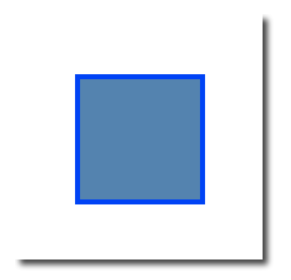

The stroke width is set to 4 and uses a blue color define by `strokeStyle`. The final shape is set up to be filled through the `fillStyle` to a “steel blue” color. Only by calling `stroke` or `fill` the actual path will be drawn and they can be used independently from each other. A call to `stroke` or `fill` will draw the current path. It’s not possible to store a path for later reuse only a drawing state can be stored and restored.

In QML the `Canvas` element acts as a container for the drawing. The 2D context object provides the actual drawing operation. The actual drawing needs to be done inside the `onPaint` event handler.

```qml
Canvas {
    width: 200; height: 200
    onPaint: {
        var ctx = getContext("2d")
        // setup your path
        // fill or/and stroke
    }
}
```

The canvas itself provides a typical two-dimensional Cartesian coordinate system, where the top-left is the (0,0) point. A higher y-value goes down and a hight x-value goes to the right.

A typical order of commands for this path based API is the following:

1. Setup stroke and/or fill
2. Create path
3. Stroke and/or fill

```qml
 onPaint: {
        var ctx = getContext("2d")

        // setup the stroke
        ctx.strokeStyle = "red"

        // create a path
        ctx.beginPath()
        ctx.moveTo(50,50)
        ctx.lineTo(150,50)

        // stroke path
        ctx.stroke()
    }
```

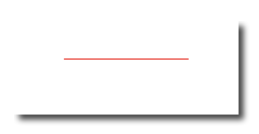

Note

- Typically you always want to set a start point when you reset your path, so the first operation after beginPath is often moveTo.

## Convenient API

For operations on rectangles, a convenience API is provided which draws directly and does need a stroke or fill call.

```qml
// convenient.qml

import QtQuick 2.5

Canvas {
    id: root
    width: 120; height: 120
    onPaint: {
        var ctx = getContext("2d")
        ctx.fillStyle = 'green'
        ctx.strokeStyle = "blue"
        ctx.lineWidth = 4

        // draw a filles rectangle
        ctx.fillRect(20, 20, 80, 80)
        // cut our an inner rectangle
        ctx.clearRect(30,30, 60, 60)
        // stroke a border from top-left to
        // inner center of the larger rectangle
        ctx.strokeRect(20,20, 40, 40)
    }
}
```

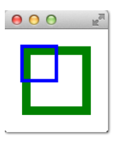

Note

- The stroke area extends half of the line width on both sides of the path. A 4 px lineWidth will draw 2 px outside the path and 2 px inside.

## Gradients

Canvas can fill shapes with color but also with gradients or images.

```qml
onPaint: {
        var ctx = getContext("2d")

        var gradient = ctx.createLinearGradient(100,0,100,200)
        gradient.addColorStop(0, "blue")
        gradient.addColorStop(0.5, "lightsteelblue")
        ctx.fillStyle = gradient
        ctx.fillRect(50,50,100,100)
    }
```

The gradient in this example is defined along the starting point (100,0) to the end point (100,200), which gives a vertical line in the middle of our canvas. The gradient-stops can be defined as a color from 0.0 (gradient start point) to 1.0 (gradient endpoint). Here we use a “blue” color at 0.0 (100,0) and a “lightsteelblue” color at the 0.5 (100,200) position. The gradient is defined as much larger than the rectangle we want to draw, so the rectangle clips gradient to it’s defined the geometry.

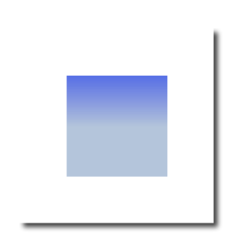

Note

- The gradient is defined in canvas coordinates not in coordinates relative to the path to be painted. A canvas does not have the concept of relative coordinates, as we are used to by now from QML.

## Shadows

A path can be visually enhanced using shadows with the 2D context object. A shadow is an area around the path with an offset, color and specified blurring. For this you can specify a `shadowColor`, `shadowOffsetX`, `shadowOffsetY` and a `shadowBlur`. All of this needs to be defined using the 2D context. The 2D context is your only API to the drawing operations.

A shadow can also be used to create a glow effect around a path. In the next example, we create a text “Canvas” with a white glow around. All this on a dark background for better visibility.

First, we draw the dark background:

```qml
        // setup a dark background
        ctx.strokeStyle = "#333"
        ctx.fillRect(0,0,canvas.width,canvas.height);
```

then we define our shadow configuration, which will be used for the next path:

```qml
        // setup a blue shadow
        ctx.shadowColor = "#2ed5fa";
        ctx.shadowOffsetX = 2;
        ctx.shadowOffsetY = 2;
        ctx.shadowBlur = 10;
```

Finally, we draw our “Canvas” text using a large bold 80px font from the Ubuntu font family.

```qml
        // render green text
        ctx.font = 'bold 80px Ubuntu';
        ctx.fillStyle = "#24d12e";
        ctx.fillText("Canvas!",30,180);
```

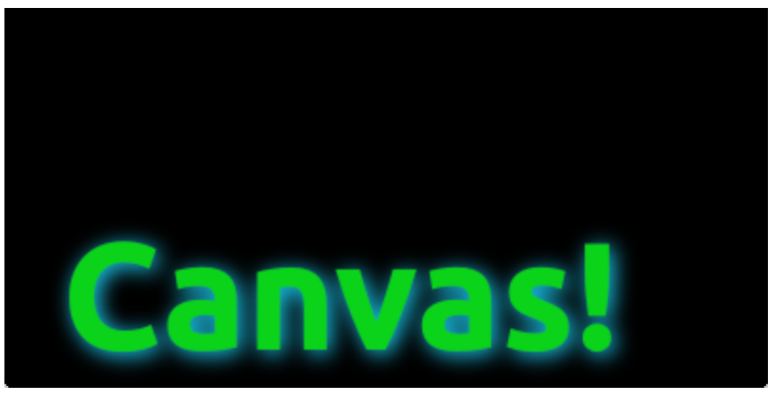

## Images

The QML canvas supports image drawing from several sources. To use an image inside the canvas the image needs to be loaded first. We will use the `Component.onCompleted` handler to load the image in our example.

```qml
    onPaint: {
        var ctx = getContext("2d")


        // draw an image
        ctx.drawImage('assets/ball.png', 10, 10)

        // store current context setup
        ctx.save()
        ctx.strokeStyle = '#ff2a68'
        // create a triangle as clip region
        ctx.beginPath()
        ctx.moveTo(110,10)
        ctx.lineTo(155,10)
        ctx.lineTo(135,55)
        ctx.closePath()
        // translate coordinate system
        ctx.clip()  // create clip from the path
        // draw image with clip applied
        ctx.drawImage('assets/ball.png', 100, 10)
        // draw stroke around path
        ctx.stroke()
        // restore previous context
        ctx.restore()

    }

    Component.onCompleted: {
        loadImage("assets/ball.png")
    }
```

The left shows our ball image painted at the top-left position of `10x10`. The right image shows the ball with a clipping path applied. Images and any other path can be clipped using another path. The clipping is applied by defining a path and calling the `clip()` function. All following drawing operations will now be clipped by this path. The clipping is disabled again by restoring the previous state or by setting the clip region to the whole canvas.

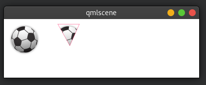

## Transformation

The canvas allows you to transform the coordinate system in several ways. This is very similar to the transformation offered by QML items. You have the possibility to `scale`, `rotate`, `translate` the coordinate system. Indifference to QML the transform origin is always the canvas origin. For example to scale a path around its center you would need to translate the canvas origin to the center of the path. It is also possible to apply a more complex transformation using the transform method.

```qml
// transform.qml

import QtQuick 2.5

Canvas {
    id: root
    width: 240; height: 120
    onPaint: {
            var ctx = getContext("2d");
            ctx.lineWidth = 4;
            ctx.strokeStyle = "blue";

            // translate x/y coordinate system
            ctx.translate(root.width/2, root.height/2);

            // draw path
            ctx.beginPath();
            ctx.rect(-20, -20, 40, 40);
            ctx.stroke();

            // rotate coordinate system
            ctx.rotate(Math.PI/4);
            ctx.strokeStyle = "green";

            // draw path
            ctx.beginPath();
            ctx.rect(-20, -20, 40, 40);
            ctx.stroke();
    }
}
```

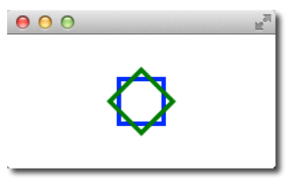

Besides translate the canvas allows also to scale using `scale(x,y)` around x and y-axis, to rotate using `rotate(angle)`, where the angle is given in radius (360 degree = 2*Math.PI) and to use a matrix transformation using the `setTransform(m11, m12, m21, m22, dx, dy)`.

Note:

- To reset any transformation you can call the resetTransform() function to set the transformation matrix back to the identity matrix:

```qml
ctx.resetTransform()
```

## Composition Modes

Composition allows you to draw a shape and blend it with the existing pixels. The canvas supports several composition modes using the `globalCompositeOperation(mode)` operation.

- source-over
- source-in
- source-out
- source-atop

```qml
    onPaint: {
        var ctx = getContext("2d")
        ctx.globalCompositeOperation = "xor"
        ctx.fillStyle = "#33a9ff"

        for(var i=0; i<40; i++) {
            ctx.beginPath()
            ctx.arc(Math.random()*400, Math.random()*200, 20, 0, 2*Math.PI)
            ctx.closePath()
            ctx.fill()
        }
    }
```

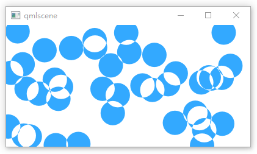

This little examples iterates over a list of composite modes and generates a rectangle with a circle.

```qml
    property var operation : [
        'source-over', 'source-in', 'source-over',
        'source-atop', 'destination-over', 'destination-in',
        'destination-out', 'destination-atop', 'lighter',
        'copy', 'xor', 'qt-clear', 'qt-destination',
        'qt-multiply', 'qt-screen', 'qt-overlay', 'qt-darken',
        'qt-lighten', 'qt-color-dodge', 'qt-color-burn',
        'qt-hard-light', 'qt-soft-light', 'qt-difference',
        'qt-exclusion'
        ]

    onPaint: {
        var ctx = getContext('2d')

        for(var i=0; i<operation.length; i++) {
            var dx = Math.floor(i%6)*100
            var dy = Math.floor(i/6)*100
            ctx.save()
            ctx.fillStyle = '#33a9ff'
            ctx.fillRect(10+dx,10+dy,60,60)
            // TODO: does not work yet
            ctx.globalCompositeOperation = root.operation[i]
            ctx.fillStyle = '#ff33a9'
            ctx.globalAlpha = 0.75
            ctx.beginPath()
            ctx.arc(60+dx, 60+dy, 30, 0, 2*Math.PI)
            ctx.closePath()
            ctx.fill()
            ctx.restore()
        }
    }
```

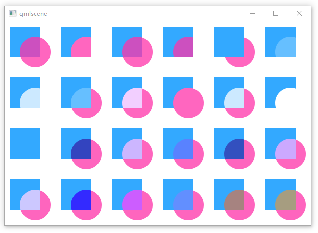

## Pixel Buffers

When working with the canvas you are able to retrieve pixel data from the canvas to read or manipulate the pixels of your canvas. To read the image data use `createImageData(sw,sh)` or `getImageData(sx,sy,sw,sh)`. Both functions return an `ImageData` object with a `width`, `height` and a `data` variable. The data variable contains a one-dimensional array of the pixel data retrieved in the RGBA format, where each value varies in the range of 0 to 255. To set pixels on the canvas you can use the `putImageData(imagedata, dx, dy)` function.

Another way to retrieve the content of the canvas is to store the data into an image. This can be achieved with the `Canvas` functions `save(path)` or` toDataURL(mimeType)`, where the later function returns an image URL, which can be used to be loaded by an `Image` element.

```qml
import QtQuick 2.5

Rectangle {
    width: 240; height: 120
    Canvas {
        id: canvas
        x: 10; y: 10
        width: 100; height: 100
        property real hue: 0.0
        onPaint: {
            var ctx = getContext("2d")
            var x = 10 + Math.random(80)*80
            var y = 10 + Math.random(80)*80
            hue += Math.random()*0.1
            if(hue > 1.0) { hue -= 1 }
            ctx.globalAlpha = 0.7
            ctx.fillStyle = Qt.hsla(hue, 0.5, 0.5, 1.0)
            ctx.beginPath()
            ctx.moveTo(x+5,y)
            ctx.arc(x,y, x/10, 0, 360)
            ctx.closePath()
            ctx.fill()
        }
        MouseArea {
            anchors.fill: parent
            onClicked: {
                var url = canvas.toDataURL('image/png')
                print('image url=', url)
                image.source = url
            }
        }
    }

    Image {
        id: image
        x: 130; y: 10
        width: 100; height: 100
    }

    Timer {
        interval: 1000
        running: true
        triggeredOnStart: true
        repeat: true
        onTriggered: canvas.requestPaint()
    }
}
```

In our little example, we paint every second a small circle on the left canvas. When the user clicks on the mouse area the canvas content is stored and an image URL is retrieved. On the right side of our example, the image is then displayed.

Note

- Retrieving image data seems not to work currently in the Qt 5 Alpha SDK.

## Canvas Paint

In this example, we would like to create a small paint application using the Canvas element.

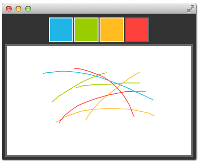

For this, we arrange four color squares on the top of our scene using a row positioner. A color square is a simple rectangle filled with a mouse area to detect clicks.

```qml
    Row {
        id: colorTools
        anchors {
            horizontalCenter: parent.horizontalCenter
            top: parent.top
            topMargin: 8
        }
        property variant activeSquare: red
        property color paintColor: "#33B5E5"
        spacing: 4
        Repeater {
            model: ["#33B5E5", "#99CC00", "#FFBB33", "#FF4444"]
            ColorSquare {
                id: red
                color: modelData
                active: parent.paintColor == color
                onClicked: {
                    parent.paintColor = color
                }
            }
        }
    }
```

The colors are stored in an array and the paint color. When one the user clicks in one of the squares the color of the square is assigned to the `paintColor` property of the row named colorTools.

To enable tracking of the mouse events on the canvas we have a `MouseArea` covering the canvas element and hooked up the pressed and position changed handlers.

```qml
    Canvas {
        id: canvas
        anchors {
            left: parent.left
            right: parent.right
            top: colorTools.bottom
            bottom: parent.bottom
            margins: 8
        }
        property real lastX
        property real lastY
        property color color: colorTools.paintColor

        onPaint: {
            var ctx = getContext('2d')
            ctx.lineWidth = 1.5
            ctx.strokeStyle = canvas.color
            ctx.beginPath()
            ctx.moveTo(lastX, lastY)
            lastX = area.mouseX
            lastY = area.mouseY
            ctx.lineTo(lastX, lastY)
            ctx.stroke()
        }
        MouseArea {
            id: area
            anchors.fill: parent
            onPressed: {
                canvas.lastX = mouseX
                canvas.lastY = mouseY
            }
            onPositionChanged: {
                canvas.requestPaint()
            }
        }
    }
```

A mouse press stores the initial mouse position into the lastX and lastY properties. Every change on the mouse position triggers a paint request on the canvas, which will result in calling the onPaint handler.

To finally draw the users stroke, in the onPaint handler we begin a new path and move to the last position. Then we gather the new position from the mouse area and draw a line with the selected color to the new position. The mouse position is stored as the new last position.


## Porting from HTML5 Canvas

- [Canvas tutorial - HTML5](https://developer.mozilla.org/en-US/docs/Web/API/Canvas_API/Tutorial)
- [Spirograph](https://en.wikipedia.org/wiki/Spirograph)

It is fairly easy to port an HTML5 canvas graphics over to use the QML canvas. From the thousands of examples, we picked one and tried it yourself.

**Spiro Graph**

We use a `spirograph` example from the Mozilla project as our foundation. The original HTML5 was posted as part of the [canvas tutorial](https://developer.mozilla.org/en-US/docs/Web/API/Canvas_API/Tutorial).

There were a few lines we needed to change:

- Qt Quick requires you to declare a variable, so we needed to add some var declarations

```JavaScript
for (var i=0;i<3;i++) {
    ...
}
```
- Adapted the draw method to receive the Context2D object

```JavaScript
function draw(ctx) {
    ...
}
```

- we needed to adapt the translation for each spiro due to different sizes

```JavaScript
ctx.translate(20+j*50,20+i*50);
```

Finally, we completed our `onPaint` handler. Inside we acquire a context and call our draw function.

```qml
    onPaint: {
        var ctx = getContext("2d");
        draw(ctx);
    }
```

Full code:

```qml
// spirograph.qml

import QtQuick 2.5

Canvas {
    id: root
    width: 300; height: 300

    // M1>>
    onPaint: {
        var ctx = getContext("2d");
        draw(ctx);
    }
    // <<M1

    function draw(ctx) {
        ctx.fillRect(0,0,300,300);
        for (var i=0;i<3;i++) {
            for (var j=0;j<3;j++) {
                ctx.save();
                ctx.strokeStyle = "#9CFF00";
                ctx.translate(20+j*50,20+i*50);
                drawSpirograph(ctx,20*(j+2)/(j+1),-8*(i+3)/(i+1),10);
                ctx.restore();
            }
        }
    }

    function drawSpirograph(ctx,R,r,O){
        var x1 = R-O;
        var y1 = 0;
        var i  = 1;
        ctx.beginPath();
        ctx.moveTo(x1,y1);
        do {
            if (i>20000) break;
            var x2 = (R+r)*Math.cos(i*Math.PI/72) - (r+O)*Math.cos(((R+r)/r)*(i*Math.PI/72))
            var y2 = (R+r)*Math.sin(i*Math.PI/72) - (r+O)*Math.sin(((R+r)/r)*(i*Math.PI/72))
            ctx.lineTo(x2,y2);
            x1 = x2;
            y1 = y2;
            i++;
        } while (x2 != R-O && y2 != 0 );
        ctx.stroke();
    }
}
```

The result is a ported spiro graph graphics running using the QML canvas

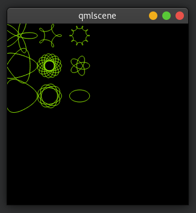

**Glowing Lines**

Here is another more complicated port from the W3C organization. The original [pretty glowing lines]() has some pretty nice aspects, which makes the porting more challenging.

html preview:

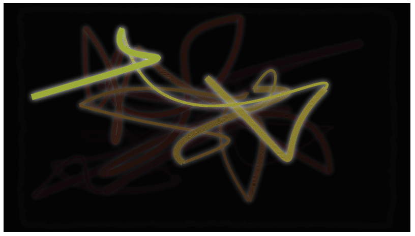


```html
<!DOCTYPE HTML>
<html lang="en">
<head>
    <title>Pretty Glowing Lines</title>
</head>
<body>

<canvas width="800" height="450"></canvas>
<script>
var context = document.getElementsByTagName('canvas')[0].getContext('2d');

// initial start position
var lastX = context.canvas.width * Math.random();
var lastY = context.canvas.height * Math.random();
var hue = 0;

// closure function to draw
// a random bezier curve with random color with a glow effect
function line() {

    context.save();

    // scale with factor 0.9 around the center of canvas
    context.translate(context.canvas.width/2, context.canvas.height/2);
    context.scale(0.9, 0.9);
    context.translate(-context.canvas.width/2, -context.canvas.height/2);

    context.beginPath();
    context.lineWidth = 5 + Math.random() * 10;

    // our start position
    context.moveTo(lastX, lastY);

    // our new end position
    lastX = context.canvas.width * Math.random();
    lastY = context.canvas.height * Math.random();

    // random bezier curve, which ends on lastX, lastY
    context.bezierCurveTo(context.canvas.width * Math.random(),
    context.canvas.height * Math.random(),
    context.canvas.width * Math.random(),
    context.canvas.height * Math.random(),
    lastX, lastY);

    // glow effect
    hue = hue + 10 * Math.random();
    context.strokeStyle = 'hsl(' + hue + ', 50%, 50%)';
    context.shadowColor = 'white';
    context.shadowBlur = 10;
    // stroke the curve
    context.stroke();
    context.restore();
}

// call line function every 50msecs
setInterval(line, 50);

function blank() {
    // makes the background 10% darker on each call
    context.fillStyle = 'rgba(0,0,0,0.1)';
    context.fillRect(0, 0, context.canvas.width, context.canvas.height);
}

// call blank function every 50msecs
setInterval(blank, 40);

</script>
</body>
</html>
```

In HTML5 the Context2D object can paint at any time on the canvas. In QML it can only point inside the `onPaint` handler. The timer in usage with `setInterval` triggers in HTML5 the stroke of the line or to blank the screen. Due to the different handling in QML, it’s not possible to just call these functions, because we need to go through the `onPaint` handler. Also, the color presentations need to be adapted. Let’s go through the changes on by one.

Everything starts with the canvas element. For simplicity, we just use the `Canvas` element as the root element of our QML file.

```qml
import QtQuick 2.5

Canvas {
   id: canvas
   width: 800; height: 450

   ...
}
```

To untangle the direct call of the functions through the `setInterval`, we replace the `setInterval` calls with two timers which will request a repaint. A `Timer` is triggered after a short interval and allows us to execute some code. As we can’t tell the paint function which operation we would like to trigger we define for each operation a bool flag request an operation and trigger then a repaint request.

Here is the code for the line operation. The blank operation is similar.

```qml
...
property bool requestLine: false

Timer {
    id: lineTimer
    interval: 40
    repeat: true
    triggeredOnStart: true
    onTriggered: {
        canvas.requestLine = true
        canvas.requestPaint()
    }
}

Component.onCompleted: {
    lineTimer.start()
}
...
```

Now we have an indication which (line or blank or even both) operation we need to perform during the `onPaint` operation. As we enter the `onPaint` handler for each paint request we need to extract the initialization of the variable into the canvas element.

```qml
Canvas {
    ...
    property real hue: 0
    property real lastX: width * Math.random();
    property real lastY: height * Math.random();
    ...
}
```

Now our paint function should look like this:

```qml
onPaint: {
    var context = getContext('2d')
    if(requestLine) {
        line(context)
        requestLine = false
    }
    if(requestBlank) {
        blank(context)
        requestBlank = false
    }
}
```

The line function was extracted for a canvas as an argument.

```qml
function line(context) {
    context.save();
    context.translate(canvas.width/2, canvas.height/2);
    context.scale(0.9, 0.9);
    context.translate(-canvas.width/2, -canvas.height/2);
    context.beginPath();
    context.lineWidth = 5 + Math.random() * 10;
    context.moveTo(lastX, lastY);
    lastX = canvas.width * Math.random();
    lastY = canvas.height * Math.random();
    context.bezierCurveTo(canvas.width * Math.random(),
        canvas.height * Math.random(),
        canvas.width * Math.random(),
        canvas.height * Math.random(),
        lastX, lastY);

    hue += Math.random()*0.1
    if(hue > 1.0) {
        hue -= 1
    }
    context.strokeStyle = Qt.hsla(hue, 0.5, 0.5, 1.0);
    // context.shadowColor = 'white';
    // context.shadowBlur = 10;
    context.stroke();
    context.restore();
}
```

The biggest change was the use of the QML `Qt.rgba()` and `Qt.hsla()` functions, which required to adopt the values to the used 0.0 … 1.0 range in QML.

Same applies to the blank function.

```qml
function blank(context) {
    context.fillStyle = Qt.rgba(0,0,0,0.1)
    context.fillRect(0, 0, canvas.width, canvas.height);
}
```

Full code:

```qml
import QtQuick 2.5

Canvas {
    id: canvas
    width: 800; height: 450

    property real hue: 0
    property real lastX: width * Math.random()
    property real lastY: height * Math.random()

    // M1>>
    property bool requestLine: false
    property bool requestBlank: false
    // <<M1

    // M2>>
    Timer {
        id: lineTimer
        interval: 40
        repeat: true
        triggeredOnStart: true
        onTriggered: {
            canvas.requestLine = true
            canvas.requestPaint()
        }
    }

    Timer {
        id: blankTimer
        interval: 50
        repeat: true
        triggeredOnStart: true
        onTriggered: {
            canvas.requestBlank = true
            canvas.requestPaint()
        }
    }
    // <<M2

    onPaint: {
        var context = getContext('2d')
        if(requestLine) {
            line(context)
            requestLine = false
        }
        if(requestBlank) {
            blank(context)
            requestBlank = false
        }
    }

    function line(context) {
        context.save()
        context.translate(canvas.width/2, canvas.height/2)
        context.scale(0.9, 0.9)
        context.translate(-canvas.width/2, -canvas.height/2)
        context.beginPath()
        context.lineWidth = 5 + Math.random() * 10
        context.moveTo(lastX, lastY)
        lastX = canvas.width * Math.random()
        lastY = canvas.height * Math.random()
        context.bezierCurveTo(canvas.width * Math.random(),
                              canvas.height * Math.random(),
                              canvas.width * Math.random(),
                              canvas.height * Math.random(),
                              lastX, lastY);

        hue += Math.random()*0.1
        if(hue > 1.0) {
            hue -= 1
        }
        context.strokeStyle = Qt.hsla(hue, 0.5, 0.5, 1.0)
        context.shadowColor = 'white';
        context.shadowBlur = 10;
        context.stroke()
        context.restore()
    }

    function blank(context) {
        context.fillStyle = Qt.rgba(0,0,0,0.1)
        context.fillRect(0, 0, canvas.width, canvas.height)
    }

    Component.onCompleted: {
        lineTimer.start()
        blankTimer.start()
    }

}
```

The final result will look similar to this.

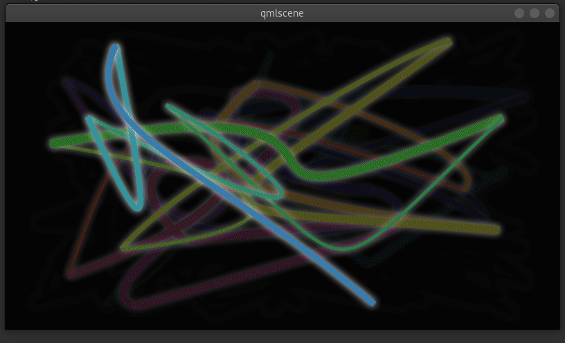


See also

- [W3C HTML Canvas 2D Context Specification](http://www.w3.org/TR/2dcontext/)
- [Mozilla Canvas Documentation](https://developer.mozilla.org/en/HTML/Canvas)
- [HTML5 Canvas Tutorial](http://www.html5canvastutorials.com/)

## Source code

[source code](https://qmlbook.github.io/assets/ch09-canvas-assets.tgz)

---

- [上一级](README.md)
- 上一篇 -> [《Qml Book》 - Model-View-Delegate](qmlBook_7_modelViewDelegate.md)
- 下一篇 -> [《Qml Book》 - Particle Simulations](qmlBook_10_particleSimulations.md)
