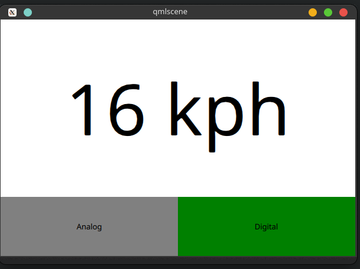
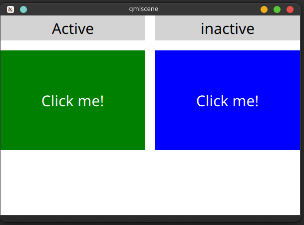

# 《Qml Book》 - Dynamic QML

<!-- @import "[TOC]" {cmd="toc" depthFrom=1 depthTo=6 orderedList=false} -->

<!-- code_chunk_output -->

- [《Qml Book》 - Dynamic QML](#qml-book-dynamic-qml)
  - [Loading Components Dynamically](#loading-components-dynamically)
    - [Connecting Indirectly](#connecting-indirectly)
    - [Binding Indirectly](#binding-indirectly)
  - [Source code](#source-code)

<!-- /code_chunk_output -->

注：该文档为 《Qml Book》的学习文档，详见 [Qml book - Dynamic QML](https://qmlbook.github.io/ch15-dynamicqml/dynamicqml.html)

Until now, we have treated QML as a tool for constructing a static set of scenes and navigating between them. Depending on various states and logic rules, a living and dynamic user interface is constructed. By working with QML and JavaScript in a more dynamic manner, the flexibility and possibilities expand even further. Components can be loaded and instantiated at run-time, elements can be destroyed. Dynamically created user interfaces can be saved to disk and later restored.

## Loading Components Dynamically

The easiest way to dynamically load different parts of QML is to use the [Loader](https://doc.qt.io/qt-5/qml-qtquick-loader.html) element. It serves as a placeholder to the item that is being loaded. The item to load is controlled through either the `source` property or the `sourceComponent` property. The former loads the item from a given URL, while the latter instantiates a component.

As the loader serves as a placeholder for the item being loaded, its size depends on the size of the item, and vice versa. If the `Loader` element has a size, either by having set `width` and `height` or through `anchoring`, the loaded item will be given the loader’s size. If the `Loader` has no size, it is resized in accordance to the size of the item being loaded.

The example described below demonstrates how two separate user interface parts can be loaded into the same space using a `Loader` element. The idea is to have a speed dial that can be either digital or analog, as shown in the illustration below. The code surrounding the dial is unaffected by which item that is loaded for the moment.




The first step in the application is to declare a `Loader` element. Notice that the `source` property is left out. This is because the `source` depends on which state the user interface is in.

```qml
Loader {
    id: dialLoader

    anchors.fill: parent
}
```

In the `states` property of the parent of `dialLoader` a set of `PropertyChanges` elements drives the loading of different QML files depending on the `state`. The `source` property happens to be a relative file path in this example, but it can just as well be a full URL, fetching the item over the web.

```qml
    states: [
        State {
            name: "analog"
            PropertyChanges { target: analogButton; color: "green"; }
            PropertyChanges { target: dialLoader; source: "Analog.qml"; }
        },
        State {
            name: "digital"
            PropertyChanges { target: digitalButton; color: "green"; }
            PropertyChanges { target: dialLoader; source: "Digital.qml"; }
        }
    ]
```

In order to make the loaded item come alive, it is `speed` property must be bound to the root `speed` property. This cannot be done as a direct binding as the item not always is loaded and changes over time. Instead, a `Binding` element must be used. The `target` property of the binding is changed every time the `Loader` triggers the `onLoaded` signal.

```qml
    Loader {
        id: dialLoader

        anchors.left: parent.left
        anchors.right: parent.right
        anchors.top: parent.top
        anchors.bottom: analogButton.top

        onLoaded: {
            binder.target = dialLoader.item;
        }
    }
    
    Binding {
        id: binder

        property: "speed"
        value: speed
    }
```

The `onLoaded` signal lets the loading QML act when the item has been loaded. In a similar fashion, the QML being loaded can rely on the `Component.onCompleted` signal. This signal is actually available for all components, regardless of how they are loaded. For instance, the root component of an entire application can use it to kick-start itself when the entire user interface has been loaded.

### Connecting Indirectly

When creating QML elements dynamically, you cannot connect to signals using the `onSignalName` approach used for static setup. Instead, the [Connections](https://doc.qt.io/qt-5/qml-qtqml-connections.html) element must be used. It connects to any number of signals of a `target` element.

Having set the `target` property of a `Connections` element, the signals can be connected, as usual, that is, using the `onSignalName` approach. However, by altering the `target` property, different elements can be monitored at different times.



In the example shown above, a user interface consisting of two clickable areas is presented to the user. When either area is clicked, it is flashed using an animation. The left area is shown in the code snippet below. In the `MouseArea`, the `leftClickedAnimation` is triggered, causing the area to flash.

```qml
        Rectangle {
            id: leftRectangle

            width: 290
            height: 200

            color: "green"

            MouseArea {
                id: leftMouseArea
                anchors.fill: parent
                onClicked: leftClickedAnimation.start();
            }

            Text {
                anchors.centerIn: parent
                font.pixelSize: 30
                color: "white"
                text: "Click me!"
            }
        }
```

In addition to the two clickable areas, a `Connections` element is used. This triggers the third animation when the active, i.e. the `target` of the element, is clicked.

```qml
    Connections {
        id: connections
        onClicked: activeClickedAnimation.start();
    }
```

To determine which `MouseArea` to target, two states are defined. Notice that we cannot set the `target` property using a `PropertyChanges` element, as it already contains a `target` property. Instead a `StateChangeScript` is utilized.

```qml
    states: [
        State {
            name: "left"
            StateChangeScript {
                script: connections.target = leftMouseArea
            }
        },
        State {
            name: "right"
            StateChangeScript {
                script: connections.target = rightMouseArea
            }
        }
    ]
```

When trying out the example, it is worth noticing that when multiple signal handlers are used, all are invoked. The execution order of these is, however, undefined.

When creating a `Connections` element without setting the `target` property, the property defaults to `parent`. This means that it has to be explicitly set to `null` to avoid catching signals from the `parent` until the `target` is set. This behavior does make it possible to create custom signal handler components based on a `Connections` element. This way, the code reacting to the signals can be encapsulated and re-used.

In the example below, the `Flasher` component can be put inside any `MouseArea`. When clicked, it triggers an animation, causing the parent to flash. In the same MouseArea the actual task being triggered can also be carried out. This separates the standardized user feedback, i.e. the flashing, from the actual action.

```qml
import QtQuick 2.5

Connections {
 onClicked: {
  // Automatically targets the parent
 }
}
```

To use the Flas`her, simply instantiate a Flasher within each MouseArea, and it all works.

```qml
import QtQuick 2.5

Item {
 // A background flasher that flashes the background of any parent MouseArea
}
```

When using a `Connections` element to monitor the signals of multiple types of target elements, you sometimes find yourself in a situation where the available signals vary between the targets. This results in the `Connections` element outputting run-time errors as signals are missed. To avoid this, the `ignoreUnknownSignal` property can be set to true. This ignores all such errors.

full code:

```qml
import QtQuick 2.5

Rectangle {
    id: container

    width: 600
    height: 400

    color: "white"

    Column {
        anchors.top: parent.top
        anchors.left: parent.left

        spacing: 20

        Rectangle {
            width: 290
            height: 50

            color: "lightGray"

            MouseArea {
                anchors.fill: parent
                onClicked: container.state = "left"
            }

            Text {
                anchors.centerIn: parent
                font.pixelSize: 30
                text: container.state==="left"?"Active":"inactive";
            }
        }

        // M1>>
        Rectangle {
            id: leftRectangle

            width: 290
            height: 200

            color: "green"

            MouseArea {
                id: leftMouseArea
                anchors.fill: parent
                onClicked: leftClickedAnimation.start();
            }

            Text {
                anchors.centerIn: parent
                font.pixelSize: 30
                color: "white"
                text: "Click me!"
            }
        }
        // <<M1
    }

    Column {
        anchors.top: parent.top
        anchors.right: parent.right

        spacing: 20

        Rectangle {
            width: 290
            height: 50

            color: "lightGray"

            MouseArea {
                anchors.fill: parent
                onClicked: container.state = "right"
            }

            Text {
                anchors.centerIn: parent
                font.pixelSize: 30
                text: container.state==="right"?"Active":"inactive";
            }
        }

        Rectangle {
            id: rightRectangle

            width: 290
            height: 200

            color: "blue"

            MouseArea {
                id: rightMouseArea
                anchors.fill: parent
                onClicked: rightClickedAnimation.start();
            }

            Text {
                anchors.centerIn: parent
                font.pixelSize: 30
                color: "white"
                text: "Click me!"
            }
        }
    }

    Text {
        id: activeText

        anchors.horizontalCenter: parent.horizontalCenter
        anchors.bottom: parent.bottom
        anchors.bottomMargin: 50

        font.pixelSize: 30
        color: "red"
        text: "Active area clicked!"

        opacity: 0
    }

    SequentialAnimation {
        id: leftClickedAnimation

        PropertyAction {
            target: leftRectangle
            property: "color"
            value: "white"
        }
        ColorAnimation {
            target: leftRectangle
            property: "color"
            to: "green"
            duration: 3000
        }
    }

    SequentialAnimation {
        id: rightClickedAnimation

        PropertyAction {
            target: rightRectangle
            property: "color"
            value: "white"
        }
        ColorAnimation {
            target: rightRectangle
            property: "color"
            to: "blue"
            duration: 3000
        }
    }

    SequentialAnimation {
        id: activeClickedAnimation

        PropertyAction {
            target: activeText
            property: "opacity"
            value: 1
        }
        PropertyAnimation {
            target: activeText
            property: "opacity"
            to: 0
            duration: 3000
        }
    }

    // M2>>
    Connections {
        id: connections
        onClicked: activeClickedAnimation.start();
    }
    // <<M2

    // M3>>
    states: [
        State {
            name: "left"
            StateChangeScript {
                script: connections.target = leftMouseArea
            }
        },
        State {
            name: "right"
            StateChangeScript {
                script: connections.target = rightMouseArea
            }
        }
    ]
    // <<M3

    Component.onCompleted: {
        state = "left";
    }
}

```

### Binding Indirectly

Just as it is not possible to connect to signals of dynamically created elements directly, nor it is possible to bind properties of a dynamically created element without working with a bridge element. To bind a property of any element, including dynamically created elements, the [Binding](https://doc.qt.io/qt-5/qml-qtqml-binding.html) element is used.

The `Binding` element lets you specify a `target` element, a `property` to bind and a `value` to bind it to. Through using a Binding` element, it is, for instance, possible to bind properties of a dynamically loaded element. This was demonstrated in the introductory example in this chapter, as shown below.

```qml
    Loader {
        id: dialLoader

        anchors.left: parent.left
        anchors.right: parent.right
        anchors.top: parent.top
        anchors.bottom: analogButton.top

        onLoaded: {
            binder.target = dialLoader.item;
        }
    }
    
    Binding {
        id: binder

        property: "speed"
        value: speed
    }
```

As the `target` element of a `Binding` not always is set, and perhaps not always has a given property, the `when` property of the `Binding` element can be used to limit the time when the binding is active. For instance, it can be limited to specific modes in the user interface.

The `Binding` element also comes with a `delayed` property. When this property is set to `true` the binding is not propagated to the target until the event queue has been emptied. In high load situations this can serve as an optimization as intermediate values are not pushed to the `target`.

## Source code

[source code](https://qmlbook.github.io/assets/ch15-dynamicqml-assets.tgz)

---

- [上一级](README.md)
- 上一篇 -> [《Qml Book》 - Canvas Element](qmlBook_9_canvasElement.md)
- 下一篇 -> [qwt 简单使用](qwt.md)
