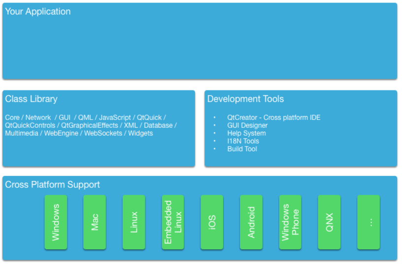
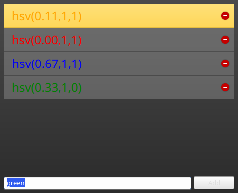

# 《Qml Book》 - Qt and C++

<!-- @import "[TOC]" {cmd="toc" depthFrom=1 depthTo=6 orderedList=false} -->

<!-- code_chunk_output -->

- [《Qml Book》 - Qt and C++](#qml-book-qt-and-c)
  - [The QObject](#the-qobject)
  - [Build Systems](#build-systems)
    - [QMake](#qmake)
    - [CMake](#cmake)
  - [Common Qt Classes](#common-qt-classes)
    - [QString](#qstring)
    - [Sequential Containers](#sequential-containers)
    - [Associative Containers](#associative-containers)
    - [File IO](#file-io)
    - [More Classes](#more-classes)
  - [Models in C++](#models-in-c)
    - [A simple model](#a-simple-model)
    - [More Complex Data](#more-complex-data)
    - [Dynamic Data](#dynamic-data)
  - [Source code](#source-code)

<!-- /code_chunk_output -->

注：该文档为 《Qml Book》的学习文档，详见 [Qml book - Qt and C++](https://qmlbook.github.io/ch17-qtcpp/qtcpp.html)

Qt is a C++ toolkit with an extension for QML and Javascript. There exist many language bindings for Qt, but as Qt is developed in C++, the spirit of C++ can be found throughout the classes. In this section, we will look at Qt from a C++ perspective to build a better understanding of how to extend QML with native plugins developed using C++. Through C++, it is possible to extend and control the execution environment provided to QML.

This chapter will, just as Qt, require the reader to have some basic knowledge of C++. Qt does not rely on advanced C++ features, and I generally consider the Qt style of C++ to be very readable, so do not worry if you feel that your C++ knowledge is shaky.

Approaching Qt from a C++ direction, you will find that Qt enriches C++ with a number of modern language features enabled through making introspection data available. This is made possible through the use of the `QObject` base class. Introspection data, or metadata, maintains information of the classes at run-time, something that ordinary C++ does not do. This makes it possible to dynamically probe objects for information about such details as their properties and available methods.

Qt uses this meta information to enable a very loosely bound callback concept using signals and slots. Each signal can be connected to any number of slots or even other signals. When a signal is emitted from an object instance, the connected slots are invoked. As the signal emitting object does not need to know anything about the object owning the slot and vice versa, this mechanism is used to create very reusable components with very few inter-component dependencies.

The introspection features are also used to create dynamic language bindings, making it possible to expose a C++ object instance to QML and making C++ functions callable from Javascript. Other bindings for Qt C++ exist and besides the standard Javascript binding, a popular one is the Python binding called [PyQt](http://www.riverbankcomputing.co.uk/software/pyqt/intro).

In addition to this central concept, Qt makes it possible to develop cross-platform applications using C++. Qt C++ provides a platform abstraction on the different operating systems, which allows the developer to concentrate on the task at hand and not the details of how you open a file on different operating systems. This means you can re-compile the same source code for Windows, OS X, and Linux and Qt takes care of the different OS ways of handling certain things. The end result is natively built applications with the look and feel of the target platform. As the mobile is the new desktop, newer Qt versions can also target a number of mobile platforms using the same source code, e.g. iOS, Android, Jolla, BlackBerry, Ubuntu Phone, Tizen.

When it comes to re-using, not only can source code be re-used but developer skills are also reusable. A team knowing Qt can reach out to far more platforms then a team just focusing on a single platform specific technology and as Qt is so flexible the team can create different system components using the same technology.



For all platform, Qt offers a set of basic types, e.g. strings with full Unicode support, lists, vectors, buffers. It also provides a common abstraction to the target platform’s main loop, and cross-platform threading and networking support. The general philosophy is that for an application developer Qt comes with all required functionality included. For domain-specific tasks such as to interface to your native libraries, Qt comes with several helper classes to make this easier.

In QtCore you have the most common classes used for an application, which are not UI dependent. Have a look at the [QtCore class list](http://doc.qt.io/qt-5/qtcore-module.html) or the [QtCore overview](http://doc.qt.io/qt-5/qtcore-index.html).

## The QObject

As described in the introduction, the [QObject](https://doc.qt.io/qt-5/qobject.html) is what enables Qt’s introspection. It is the base class of almost all classes in Qt. Exceptions are value types such as `QColor`, `QString` and `QList`.

A Qt object is a standard C++ object, but with more abilities. These can be divided into two groups:

- Introspection - a Qt object is aware of its class name, its relationship to other classes, as well as its methods and properties.
- Memory management - each Qt object can be the parent of child objects. The parent owns the children, and when the parent is destroyed, it is responsible for destroying its children.

The best way of understanding how the `QObject` abilities affect a class is to take a standard C++ class and Qt enables it. The class shown below represents an ordinary such class.

The person class is a data class with a name and gender properties. The person class uses Qt’s object system to add meta information to the c++ class. It allows users of a person object to connect to the slots and get notified when the properties get changed.

```c++
class Person : public QObject
{
    Q_OBJECT // enabled meta object abilities

    // property declarations required for QML
    Q_PROPERTY(QString name READ name WRITE setName NOTIFY nameChanged)
    Q_PROPERTY(Gender gender READ gender WRITE setGender NOTIFY genderChanged)

    // enables enum introspections
    Q_ENUMS(Gender)

public:
    // standard Qt constructor with parent for memory management
    Person(QObject *parent = 0);

    enum Gender { Unknown, Male, Female, Other };

    QString name() const;
    Gender gender() const;

public slots: // slots can be connected to signals
    void setName(const QString &);
    void setGender(Gender);

signals: // signals can be emitted
    void nameChanged(const QString &name);
    void genderChanged(Gender gender);

private:
    // data members
    QString m_name;
    Gender m_gender;
};
```

The constructor passes the parent to the superclass and initializes the members. Qt’s value classes are automatically initialized. In this case `QString` will initialize to a null string (`QString::isNull()`) and the gender member will explicitly initialize to the unknown gender.

```c++
Person::Person(QObject *parent)
    : QObject(parent)
    , m_gender(Person::Unknown)
{
}
```

The getter function is named after the property and is normally a simple `const` function. The setter emits the changed signal when the property really has changed. For this, we insert a guard to compare the current value with the new value. And only when the value differs we assign it to the member variable and emit the changed signal.

```c++
QString Person::name() const
{
    return m_name;
}

void Person::setName(const QString &name)
{
    if (m_name != name) // guard
    {
        m_name = name;
        emit nameChanged(m_name);
    }
}
```

Having a class derived from `QObject`, we have gained more meta object abilities we can explore using the [metaObject()](https://doc.qt.io/qt-5/qobject.html#metaObject) method. For example, retrieving the class name from the object.

```c++
Person* person = new Person();
person->metaObject()->className(); // "Person"
Person::staticMetaObject.className(); // "Person"
```

There are many more features which can be accessed by the QObject base class and the meta object. Please check out the [QMetaObject](https://doc.qt.io/qt-5/qmetaobject.html) documentation.

Note

- `QObject`, and the `Q_OBJECT` macro has a lightweight sibling: [Q_GADGET](https://doc.qt.io/qt-5/qobject.html#Q_GADGET). The `Q_GADGET` macro can be inserted in the private section of non-`QObject`-derived classes to expose properties and invokable methods. Beware that a `Q_GADGET` object cannot have signals, so the properties cannot provide a change notification signal. Still, this can be useful to provide a QML-like interface to data structures exposed from C++ to QML without invoking the cost of a fully fledged `QObject`.

## Build Systems

Building software reliably on different platforms can be a complex task. You will encounter different environments with different compilers, paths, and library variations. The purpose of Qt is to shield the application developer from these cross-platform issues. For this Qt introduced the `qmake` build file generator. `qmake` operates on a project file with the ending `.pro`. This project file contains instructions about the application and the sources to be used. Running `qmake` on this project file will generate a `Makefile` for you on Unix and MacOS and even under windows if the MinGW compiler toolchain is being used. Otherwise, it may create a visual studio project or an Xcode project.

A typical build flow in Qt under Unix would be:

```sh
edit myproject.pro
qmake // generates Makefile
make
```

Qt allows you also to use shadow builds. A shadow build is a build outside of your source code location. Assume we have a myproject folder with a `myproject.pro` file. The flow would be like this:

```sh
mkdir build
cd build
qmake ../myproject/myproject.pro
```

We create a build folder and then call qmake from inside the build folder with the location of our project folder. This will set up the makefile in a way that all build artifacts are stored under the build folder instead of inside our source code folder. This allows us to create builds for different qt versions and build configurations at the same time and also it does not clutter our source code folder which is always a good thing.

When you are using Qt Creator it does these things behind the scenes for you and you do not have to worry about these steps usually. For larger projects and for a deeper understanding of the flow, it is recommended that you learn to build your Qt project from the command line.

### QMake

QMake is the tool which reads your project file and generates the build file. A project file is a simplified write-down of your project configuration, external dependencies, and your source files. The simplest project file is probably this:

```qmake
// myproject.pro

SOURCES += main.cpp
```

Here we build an executable application which will have the name `myproject` based on the project file name. The build will only contain the `main.cpp` source file. And by default, we will use the QtCore and QtGui module for this project. If our project were a QML application we would need to add the QtQuick and QtQml module to the list:

```qmake
// myproject.pro

QT += qml quick

SOURCES += main.cpp
```

Now the build file knows to link against the QtQml and QtQuick Qt modules. QMake uses the concept of =, += and -= to assign, add, remove elements from a list of options, respectively. For a pure console build without UI dependencies you would remove the QtGui module:

```qmake
// myproject.pro

QT -= gui

SOURCES += main.cpp
```

When you want to build a library instead of an application, you need to change the build template:

```qmake
// myproject.pro
TEMPLATE = lib

QT -= gui

HEADERS += utils.h
SOURCES += utils.cpp
```

Now the project will build as a library without UI dependencies and used the `utils.h` header and the `utils.cpp` source file. The format of the library will depend on the OS you are building the project.

Often you will have more complicated setups and need to build a set of projects. For this, qmake offers the `subdirs` template. Assume we would have a mylib and a myapp project. Then our setup could be like this:

```sh
my.pro
mylib/mylib.pro
mylib/utils.h
mylib/utils.cpp
myapp/myapp.pro
myapp/main.cpp
```

We know already how the mylib.pro and myapp.pro would look like. The my.pro as the overarching project file would look like this:

```qmake
// my.pro
TEMPLATE = subdirs

subdirs = mylib \
    myapp

myapp.depends = mylib
```

This declares a project with two subprojects: `mylib` and `myapp`, where myapp depends on `mylib`. When you run qmake on this project file it will generate file a build file for each project in a corresponding folder. When you run the makefile for `my.pro`, all subprojects are also built.

Sometimes you need to do one thing on one platform and another thing on other platforms based on your configuration. For this qmake introduces the concept of scopes. A scope is applied when a configuration option is set to true.

For example, to use a Unix specific utils implementation you could use:

```qmake
unix {
    SOURCES += utils_unix.cpp
} else {
    SOURCES += utils.cpp
}
```

What it says is if the CONFIG variable contains a Unix option then apply this scope otherwise use the else path. A typical one is to remove the application bundling under mac:

```qmake
macx {
    CONFIG -= app_bundle
}
```

This will create your application as a plain executable under mac and not as a `.app` folder which is used for application installation.

QMake based projects are normally the number one choice when you start programming Qt applications. There are also other options out there. All have their benefits and drawbacks. We will shortly discuss these other options next.

References

- [QMake Manual](http://doc.qt.io/qt-5//qmake-manual.html) - Table of contents of the qmake manual
- [QMake Language](http://doc.qt.io/qt-5//qmake-language.html) - Value assignment, scopes and so like
- [QMake Variables](http://doc.qt.io/qt-5//qmake-variable-reference.html) - Variables like TEMPLATE, CONFIG, QT is explained here

### CMake

CMake is a tool created by Kitware. Kitware is very well known for their 3D visualization software VTK and also CMake, the cross-platform makefile generator. It uses a series of `CMakeLists.txt` files to generate platform-specific makefiles. CMake is used by the KDE project and as such has a special relationship with the Qt community.

The `CMakeLists.txt` is the file used to store the project configuration. For a simple hello world using QtCore the project file would look like this:

```cmake
// ensure cmake version is at least 3.0
cmake_minimum_required(VERSION 3.0)
// adds the source and build location to the include path
set(CMAKE_INCLUDE_CURRENT_DIR ON)
// Qt's MOC tool shall be automatically invoked
set(CMAKE_AUTOMOC ON)
// using the Qt5Core module
find_package(Qt5Core)
// create excutable helloworld using main.cpp
add_executable(helloworld main.cpp)
// helloworld links against Qt5Core
target_link_libraries(helloworld Qt5::Core)
```

This will build a helloworld executable using main.cpp and linked agains the external Qt5Core library. The build file can be modified to be more generic:

```cmake
// sets the PROJECT_NAME variable
project(helloworld)
cmake_minimum_required(VERSION 3.0)
set(CMAKE_INCLUDE_CURRENT_DIR ON)
set(CMAKE_AUTOMOC ON)
find_package(Qt5Core)

// creates a SRC_LIST variable with main.cpp as single entry
set(SRC_LIST main.cpp)
// add an executable based on the project name and source list
add_executable(${PROJECT_NAME} ${SRC_LIST})
// links Qt5Core to the project executable
target_link_libraries(${PROJECT_NAME} Qt5::Core)
```

You can see that CMake is quite powerful. It takes some time to get used to the syntax. In general, it is said that CMake is better suited for large and complex projects.

References :

- [CMake Help](http://www.cmake.org/documentation/) - available online but also as QtHelp format
- [Running CMake](http://www.cmake.org/runningcmake/)
- [KDE CMake Tutorial](https://techbase.kde.org/Development/Tutorials/CMake)
- [CMake Book](http://www.kitware.com/products/books/CMakeBook.html)
- [CMake and Qt](http://www.cmake.org/cmake/help/v3.0/manual/cmake-qt.7.html)

## Common Qt Classes

The `QObject` class forms the foundations of Qt, but there are many more classes in the framework. Before we continue looking at QML and how to extend it, we will look at some basic Qt classes that are useful to know about.

The code examples shown in this section are written using the Qt Test library. It offers a great way to explore the Qt API and store it for later reference. [QVERIFY](https://doc.qt.io/qt-5/qtest.html#QVERIFY), [QCOMPARE](https://doc.qt.io/qt-5/qtest.html#QCOMPARE) are functions provided by the test library to assert a certain condition. We will use `{}` scopes to avoid name collisions. So do not get confused.

### QString

In general, text handling in Qt is Unicode based. For this, you use the `QString` class. It comes with a variety of great functions which you would expect from a modern framework. For 8-bit data, you would use normally the `QByteArray` class and for ASCII identifiers the `QLatin1String` to preserve memory. For a list of strings you can use a `QList<QString>` or simply the `QStringList` class (which is derived from `QList<QString>`).

Here are some examples of how to use the `QString` class. QString can be created on the stack but it stores its data on the heap. Also when assigning one string to another, the data will not be copied - only a reference to the data. So this is really cheap and lets the developer concentrate on the code and not on the memory handling. `QString` uses reference counters to know when the data can be safely deleted. This feature is called [Implicit Sharing](http://doc.qt.io/qt-5//implicit-sharing.html) and it is used in many Qt classes.

```c++
    QString data("A,B,C,D"); // create a simple string
    // split it into parts
    QStringList list = data.split(",");
    // create a new string out of the parts
    QString out = list.join(",");
    // verify both are the same
    QVERIFY(data == out);
    // change the first character to upper case
    QVERIFY(QString("A") == out[0].toUpper());
```

Here we will show how to convert a number to a string and back. There are also conversion functions for float or double and other types. Just look for the function in the Qt documentation used here and you will find the others.

```c++
    // create some variables
    int v = 10;
    int base = 10;
    // convert an int to a string
    QString a = QString::number(v, base);
    // and back using and sets ok to true on success
    bool ok(false);
    int v2 = a.toInt(&ok, base);
    // verify our results
    QVERIFY(ok == true);
    QVERIFY(v = v2);
```

Often in a text, you need to have parameterized text. One option could be to use `QString("Hello" + name)` but a more flexible method is the `arg` marker approach. It preserves the order also during translation when the order might change.

```c++
    // create a name
    QString name("Joe");
    // get the day of the week as string
    QString weekday = QDate::currentDate().toString("dddd");
    // format a text using paramters (%1, %2)
    QString hello = QString("Hello %1. Today is %2.").arg(name).arg(weekday);
    // This worked on Monday. Promise!
    if(Qt::Monday == QDate::currentDate().dayOfWeek()) {
        QCOMPARE(QString("Hello Joe. Today is Monday."), hello);
    } else {
        QVERIFY(QString("Hello Joe. Today is Monday.") !=  hello);
    }
```

Sometimes you want to use Unicode characters directly in your code. For this, you need to remember how to mark them for the `QChar` and `QString` classes.

```c++
    // Create a unicode character using the unicode for smile :-)
    QChar smile(0x263A);
    // you should see a :-) on you console
    qDebug() << smile;
    // Use a unicode in a string
    QChar smile2 = QString("\u263A").at(0);
    QVERIFY(smile == smile2);
    // Create 12 smiles in a vector
    QVector<QChar> smilies(12);
    smilies.fill(smile);
    // Can you see the smiles
    qDebug() << smilies;
```

This gives you some examples of how to easily treat Unicode aware text in Qt. For non-Unicode, the `QByteArray` class also has many helper functions for conversion. Please read the Qt documentation for `QString` as it contains tons of good examples.

### Sequential Containers

A list, queue, vector or linked-list is a sequential container. The mostly used sequential container is the `QList` class. It is a template based class and needs to be initialized with a type. It is also implicit shared and stores the data internally on the heap. All container classes should be created on the stack. Normally you never want to use `new QList<T>()`, which means never use `new` with a container.

The `QList` is as versatile as the `QString` class and offers a great API to explore your data. Below is a small example of how to use and iterate over a list using some new C++ 11 features.

```c++
    // Create a simple list of ints using the new C++11 initialization
    // for this you need to add "CONFIG += c++11" to your pro file.
    QList<int> list{1,2};

    // append another int
    list << 3;

    // We are using scopes to avoid variable name clashes

    { // iterate through list using Qt for each
        int sum(0);
        foreach (int v, list) {
            sum += v;
        }
        QVERIFY(sum == 6);
    }
    { // iterate through list using C++ 11 range based loop
        int sum = 0;
        for(int v : list) {
            sum+= v;
        }
        QVERIFY(sum == 6);
    }

    { // iterate through list using JAVA style iterators
        int sum = 0;
        QListIterator<int> i(list);

        while (i.hasNext()) {
            sum += i.next();
        }
        QVERIFY(sum == 6);
    }

    { // iterate through list using STL style iterator
        int sum = 0;
        QList<int>::iterator i;
        for (i = list.begin(); i != list.end(); ++i) {
            sum += *i;
        }
        QVERIFY(sum == 6);
    }


    // using std::sort with mutable iterator using C++11
    // list will be sorted in descending order
    std::sort(list.begin(), list.end(), [](int a, int b) { return a > b; });
    QVERIFY(list == QList<int>({3,2,1}));


    int value = 3;
    { // using std::find with const iterator
        QList<int>::const_iterator result = std::find(list.constBegin(), list.constEnd(), value);
        QVERIFY(*result == value);
    }

    { // using std::find using C++ lambda and C++ 11 auto variable
        auto result = std::find_if(list.constBegin(), list.constBegin(), [value](int v) { return v == value; });
        QVERIFY(*result == value);
    }
```

### Associative Containers

A map, a dictionary, or a set are examples of associative containers. They store a value using a key. They are known for their fast lookup. We demonstrate the use of the most used associative container the `QHash` also demonstrating some new C++ 11 features.

```c++
    QHash<QString, int> hash({{"b",2},{"c",3},{"a",1}});
    qDebug() << hash.keys(); // a,b,c - unordered
    qDebug() << hash.values(); // 1,2,3 - unordered but same as order as keys

    QVERIFY(hash["a"] == 1);
    QVERIFY(hash.value("a") == 1);
    QVERIFY(hash.contains("c") == true);

    { // JAVA iterator
        int sum =0;
        QHashIterator<QString, int> i(hash);
        while (i.hasNext()) {
            i.next();
            sum+= i.value();
            qDebug() << i.key() << " = " << i.value();
        }
        QVERIFY(sum == 6);
    }

    { // STL iterator
        int sum = 0;
        QHash<QString, int>::const_iterator i = hash.constBegin();
        while (i != hash.constEnd()) {
            sum += i.value();
            qDebug() << i.key() << " = " << i.value();
            i++;
        }
        QVERIFY(sum == 6);
    }

    hash.insert("d", 4);
    QVERIFY(hash.contains("d") == true);
    hash.remove("d");
    QVERIFY(hash.contains("d") == false);

    { // hash find not successfull
        QHash<QString, int>::const_iterator i = hash.find("e");
        QVERIFY(i == hash.end());
    }

    { // hash find successfull
        QHash<QString, int>::const_iterator i = hash.find("c");
        while (i != hash.end()) {
            qDebug() << i.value() << " = " << i.key();
            i++;
        }
    }

    // QMap
    QMap<QString, int> map({{"b",2},{"c",2},{"a",1}});
    qDebug() << map.keys(); // a,b,c - ordered ascending

    QVERIFY(map["a"] == 1);
    QVERIFY(map.value("a") == 1);
    QVERIFY(map.contains("c") == true);

    // JAVA and STL iterator work same as QHash
```

### File IO

It is often required to read and write from files. `QFile` is actually a `QObject` but in most cases, it is created on the stack. `QFile` contains signals to inform the user when data can be read. This allows reading chunks of data asynchronously until the whole file is read. For convenience, it also allows reading data in blocking mode. This should only be used for smaller amounts of data and not large files. Luckily we only use small amounts of data in these examples.

Besides reading raw data from a file into a `QByteArray` you can also read data types using the `QDataStream` and Unicode string using the `QTextStream`. We will show you how.

```c++
    QStringList data({"a", "b", "c"});
    { // write binary files
        QFile file("out.bin");
        if(file.open(QIODevice::WriteOnly)) {
            QDataStream stream(&file);
            stream << data;
        }
    }
    { // read binary file
        QFile file("out.bin");
        if(file.open(QIODevice::ReadOnly)) {
            QDataStream stream(&file);
            QStringList data2;
            stream >> data2;
            QCOMPARE(data, data2);
        }
    }
    { // write text file
        QFile file("out.txt");
        if(file.open(QIODevice::WriteOnly)) {
            QTextStream stream(&file);
            QString sdata = data.join(",");
            stream << sdata;
        }
    }
    { // read text file
        QFile file("out.txt");
        if(file.open(QIODevice::ReadOnly)) {
            QTextStream stream(&file);
            QStringList data2;
            QString sdata;
            stream >> sdata;
            data2 = sdata.split(",");
            QCOMPARE(data, data2);
        }
    }
```

### More Classes

Qt is a rich application framework. As such it has thousands of classes. It takes some time to get used to all of these classes and how to use them. Luckily Qt has a very good documentation with many useful examples includes. Most of the time you search for a class and the most common use cases are already provided as snippets. Which means you just copy and adapt these snippets. Also, Qt’s examples in the Qt source code are a great help. Make sure you have them available and searchable to make your life more productive. Do not waste time. The Qt community is always helpful. When you ask, it is very helpful to ask exact questions and provide a simple example which displays your needs. This will drastically improve the response time of others. So invest a little bit of time to make the life of others who want to help you easier :-).

Here some classes whose documentation the author thinks are a must read: [QObject](http://doc.qt.io/qt-5//qobject.html), [QString](http://doc.qt.io/qt-5//qstring.html), [QByteArray](http://doc.qt.io/qt-5//qbytearray.html), [QFile](http://doc.qt.io/qt-5//qfile.html), [QDir](http://doc.qt.io/qt-5//qdir.html), [QFileInfo](http://doc.qt.io/qt-5//qfileinfo.html), [QIODevice](http://doc.qt.io/qt-5//qiodevice.html), [QTextStream](http://doc.qt.io/qt-5//qtextstream.html), [QDataStream](http://doc.qt.io/qt-5//qdatastream.html), [QDebug](http://doc.qt.io/qt-5//qdebug.html), [QLoggingCategory](http://doc.qt.io/qt-5//qloggingcategory.html), [QTcpServer](http://doc.qt.io/qt-5//qtcpserver.html), [QTcpSocket](http://doc.qt.io/qt-5//qtcpsocket.html), [QNetworkRequest](http://doc.qt.io/qt-5//qnetworkrequest.html), [QNetworkReply](http://doc.qt.io/qt-5//qnetworkreply.html), [QAbstractItemModel](http://doc.qt.io/qt-5//qabstractitemmodel.html), [QRegExp](http://doc.qt.io/qt-5//qregexp.html), [QList](http://doc.qt.io/qt-5//qlist.html), [QHash](http://doc.qt.io/qt-5//qhash.html), [QThread](http://doc.qt.io/qt-5//qthread.html), [QProcess](http://doc.qt.io/qt-5//qprocess.html), [QJsonDocument](http://doc.qt.io/qt-5//qjsondocument.html), [QJSValue](http://doc.qt.io/qt-5//qjsvalue.html).

## Models in C++

Models in QML serve the purpose of providing data to [ListViews](https://doc.qt.io/qt-5/qml-qtquick-listview.html), [PathViews](https://doc.qt.io/qt-5/qml-qtquick-pathview.html) and other views which take a model and create an instance of a delegate for each entry in the model. The view is smart enough to only create these instances which are visible or in the cache range. This makes it possible to have large models with tens of thousands of entries but still have a very slick user interface. The delegate acts like a template to be rendered with the model entries data. So in summary: a view renders entries from the model using a delegate as a template. The model is a data provider for views.

When you do not want to use C++ you can also define models in pure QML. You have several ways to provide a model for the view. For handling of data coming from C++ or a large amount of data, the C++ model is more suitable than this pure QML approach. But often you only need a few entries then these QML models are well suited.

```qml
ListView {
    // using a integer as model
    model: 5
    delegate: Text { text: 'index: ' + index }
}

ListView {
    // using a JS array as model
    model: ['A', 'B', 'C', 'D', 'E']
    delegate: Text { 'Char['+ index +']: ' + modelData }
}

ListView {
    // using a dynamic QML ListModel as model
    model: ListModel {
        ListElement { char: 'A' }
        ListElement { char: 'B' }
        ListElement { char: 'C' }
        ListElement { char: 'D' }
        ListElement { char: 'E' }
    }
    delegate: Text { 'Char['+ index +']: ' + model.char }
}
```

The QML views know how to handle these different models. For models coming from the C++ world, the view expects a specific protocol to be followed. This protocol is defined in an API (`QAbstractItemModel`) together with documentation for the dynamic behavior. The API was developed for the desktop widget world and is flexible enough to act as a base for trees, or multi-column tables as well as lists. In QML, we use either the list variant of the API (`QAbstractListModel`) or, for the `TableView` element, the table variant of the API (`QAbstractTableModel`). The API contains some mandatory functions to be implemented and some are optional. The optional parts mostly handle the dynamic use case of adding or removing of data.

### A simple model

A typical QML C++ model derives from `QAbstractListModel` and implements at least the `data` and `rowCount` function. In this example, we will use a series of SVG color names provided by the `QColor` class and display them using our model. The data is stored into a `QList<QString>` data container.

Our `DataEntryModel` is derived form `QAbstractListModel` and implements the mandatory functions. We can ignore the parent in `rowCount` as this is only used in a tree model. The `QModelIndex` class provides the row and column information for the cell, for which the view wants to retrieve data. The view is pulling information from the model on a row/column and role-based. The `QAbstractListModel` is defined in `QtCore` but `QColor` in `QtGui`. That is why we have the additional `QtGui` dependency. For QML applications it is okay to depend on `QtGui` but it should normally not depend on `QtWidgets`.

```c++
#ifndef DATAENTRYMODEL_H
#define DATAENTRYMODEL_H

#include <QtCore>
#include <QtGui>

class DataEntryModel : public QAbstractListModel
{
    Q_OBJECT
public:
    explicit DataEntryModel(QObject *parent = 0);
    ~DataEntryModel();

public: // QAbstractItemModel interface
    virtual int rowCount(const QModelIndex &parent) const;
    virtual QVariant data(const QModelIndex &index, int role) const;
private:
    QList<QString> m_data;
};

#endif // DATAENTRYMODEL_H
```

On the implementation side, the most complex part is the data function. We first need to make a range check. And then we check for the display role. The `Qt::DisplayRole` is the default text role a view will ask for. There is a small set of default roles defined in Qt which can be used, but normally a model will define its own roles for clarity. All calls which do not contain the display role are ignored at the moment and the default value `QVariant()` is returned.

```c++
#include "dataentrymodel.h"

DataEntryModel::DataEntryModel(QObject *parent)
    : QAbstractListModel(parent)
{
    // initialize our data (QList<QString>) with a list of color names
    m_data = QColor::colorNames();
}

DataEntryModel::~DataEntryModel()
{
}

int DataEntryModel::rowCount(const QModelIndex &parent) const
{
    Q_UNUSED(parent);
    // return our data count
    return m_data.count();
}

QVariant DataEntryModel::data(const QModelIndex &index, int role) const
{
    // the index returns the requested row and column information.
    // we ignore the column and only use the row information
    int row = index.row();

    // boundary check for the row
    if(row < 0 || row >= m_data.count()) {
        return QVariant();
    }

    // A model can return data for different roles.
    // The default role is the display role.
    // it can be accesses in QML with "model.display"
    switch(role) {
        case Qt::DisplayRole:
            // Return the color name for the particular row
            // Qt automatically converts it to the QVariant type
            return m_data.value(row);
    }

    // The view asked for other data, just return an empty QVariant
    return QVariant();
}
```

The next step would be to register the model with QML using the qmlRegisterType call. This is done inside the main.cpp before the QML file was loaded.

```c++
#include <QtGui>
#include <QtQml>

#include "dataentrymodel.h"

int main(int argc, char *argv[])
{
    QGuiApplication app(argc, argv);

    // register the type DataEntryModel
    // under the url "org.example" in version 1.0
    // under the name "DataEntryModel"
    qmlRegisterType<DataEntryModel>("org.example", 1, 0, "DataEntryModel");

    QQmlApplicationEngine engine;
    engine.load(QUrl(QStringLiteral("qrc:/main.qml")));

    return app.exec();
}
```

Now you can access the `DataEntryModel` using the QML import statement `import org.example 1.0` and use it just like other QML item `DataEntryModel {}`.

We use this in this example to display a simple list of color entries.

```qml
import org.example 1.0

ListView {
    id: view
    anchors.fill: parent
    model: DataEntryModel {}
    delegate: ListDelegate {
        // use the defined model role "display"
        text: model.display
    }
    highlight: ListHighlight { }
}
```

The `ListDelegate` is a custom type to display some text. The `ListHighlight` is just a rectangle. The code was extracted to keep the example compact.

The view can now display a list of strings using the C++ model and the display property of the model. It is still very simple, but already usable in QML. Normally the data is provided from outside the model and the model would act as an interface to the view.

Note

- To expose a table of data instead of a list, the `QAbstractTableModel` is used. The only difference compared to implementing a `QAbstractListModel` is that you must also provide the `columnCount` method.

### More Complex Data

In reality, the model data is often much more complex. So there is a need to define custom roles so that the view can query other data via properties. For example, the model could provide not only the color as a hex string but maybe also the hue, saturation, and brightness from the HSV color model as “model.hue”, “model.saturation” and “model.brightness” in QML.

```c++
#ifndef ROLEENTRYMODEL_H
#define ROLEENTRYMODEL_H

#include <QtCore>
#include <QtGui>

class RoleEntryModel : public QAbstractListModel
{
    Q_OBJECT
public:
    // Define the role names to be used
    enum RoleNames {
        NameRole = Qt::UserRole,
        HueRole = Qt::UserRole+2,
        SaturationRole = Qt::UserRole+3,
        BrightnessRole = Qt::UserRole+4
    };

    explicit RoleEntryModel(QObject *parent = 0);
    ~RoleEntryModel();

    // QAbstractItemModel interface
public:
    virtual int rowCount(const QModelIndex &parent) const override;
    virtual QVariant data(const QModelIndex &index, int role) const override;
protected:
    // return the roles mapping to be used by QML
    virtual QHash<int, QByteArray> roleNames() const override;
private:
    QList<QColor> m_data;
    QHash<int, QByteArray> m_roleNames;
};

#endif // ROLEENTRYMODEL_H
```

In the header, we added the role mapping to be used for QML. When QML tries now to access a property from the model (e.g. “model.name”) the listview will lookup the mapping for “name” and ask the model for data using the `NameRole`. User-defined roles should start with `Qt::UserRole` and need to be unique for each model.

```c++
#include "roleentrymodel.h"

RoleEntryModel::RoleEntryModel(QObject *parent)
    : QAbstractListModel(parent)
{
    // Set names to the role name hash container (QHash<int, QByteArray>)
    // model.name, model.hue, model.saturation, model.brightness
    m_roleNames[NameRole] = "name";
    m_roleNames[HueRole] = "hue";
    m_roleNames[SaturationRole] = "saturation";
    m_roleNames[BrightnessRole] = "brightness";

    // Append the color names as QColor to the data list (QList<QColor>)
    for(const QString& name : QColor::colorNames()) {
        m_data.append(QColor(name));
    }

}

RoleEntryModel::~RoleEntryModel()
{
}

int RoleEntryModel::rowCount(const QModelIndex &parent) const
{
    Q_UNUSED(parent);
    return m_data.count();
}

QVariant RoleEntryModel::data(const QModelIndex &index, int role) const
{
    int row = index.row();
    if(row < 0 || row >= m_data.count()) {
        return QVariant();
    }
    const QColor& color = m_data.at(row);
    qDebug() << row << role << color;
    switch(role) {
    case NameRole:
        // return the color name as hex string (model.name)
        return color.name();
    case HueRole:
        // return the hue of the color (model.hue)
        return color.hueF();
    case SaturationRole:
        // return the saturation of the color (model.saturation)
        return color.saturationF();
    case BrightnessRole:
        // return the brightness of the color (model.brightness)
        return color.lightnessF();
    }
    return QVariant();
}

QHash<int, QByteArray> RoleEntryModel::roleNames() const
{
    return m_roleNames;
}
```

The implementation now has changed only in two places. First in the initialization. We now initialize the data list with QColor data types. Additionally, we define our role name map to be accessible for QML. This map is returned later in the `::roleNames` function.

The second change is in the `::data` function. We extend the switch to cover the other roles (e.g hue, saturation, brightness). There is no way to return an SVG name from a color, as a color can take any color and SVG names are limited. So we skip this. Storing the names would require to create a structure `struct { QColor, QString }` to be able to identify the named color.

After registering the type we can use the model and its entries in our user interface.

```qml
ListView {
    id: view
    anchors.fill: parent
    model: RoleEntryModel {}
    focus: true
    delegate: ListDelegate {
        text: 'hsv(' +
              Number(model.hue).toFixed(2) + ',' +
              Number(model.saturation).toFixed() + ',' +
              Number(model.brightness).toFixed() + ')'
        color: model.name
    }
    highlight: ListHighlight { }
}
```

We convert the returned type to a JS number type to be able to format the number using fixed-point notation. The code would also work without the Number call (e.g. plain `model.saturation.toFixed(2)`). Which format to choose, depends how much you trust the incoming data.

### Dynamic Data

Dynamic data covers the aspects of inserting, removing and clearing the data from the model. The `QAbstractListModel` expect a certain behavior when entries are removed or inserted. The behavior is expressed in signals which need to be called before and after the manipulation. For example to insert a row into a model you need first to emit the signal `beginInsertRows`, then manipulate the data and then finally emit `endInsertRows`.

We will add the following functions to our headers. These functions are declared using `Q_INVOKABLE` to be able to call them from QML. Another way would be to declare them as public slots.

```c++
// inserts a color at the index (0 at begining, count-1 at end)
Q_INVOKABLE void insert(int index, const QString& colorValue);
// uses insert to insert a color at the end
Q_INVOKABLE void append(const QString& colorValue);
// removes a color from the index
Q_INVOKABLE void remove(int index);
// clear the whole model (e.g. reset)
Q_INVOKABLE void clear();
```

Additionally, we define a `count` property to get the size of the model and a `get` method to get a color at the given index. This is useful when you would like to iterate over the model content from QML.

```c++
// gives the size of the model
Q_PROPERTY(int count READ count NOTIFY countChanged)
// gets a color at the index
Q_INVOKABLE QColor get(int index);
```

The implementation for insert checks first the boundaries and if the given value is valid. Only then do we begin inserting the data.

```c++
void DynamicEntryModel::insert(int index, const QString &colorValue)
{
    if(index < 0 || index > m_data.count()) {
        return;
    }
    QColor color(colorValue);
    if(!color.isValid()) {
        return;
    }
    // view protocol (begin => manipulate => end]
    emit beginInsertRows(QModelIndex(), index, index);
    m_data.insert(index, color);
    emit endInsertRows();
    // update our count property
    emit countChanged(m_data.count());
}
```

Append is very simple. We reuse the insert function with the size of the model.

```c++
void DynamicEntryModel::append(const QString &colorValue)
{
    insert(count(), colorValue);
}
```

Remove is similar to insert but it calls according to the remove operation protocol.

```c++
void DynamicEntryModel::remove(int index)
{
    if(index < 0 || index >= m_data.count()) {
        return;
    }
    emit beginRemoveRows(QModelIndex(), index, index);
    m_data.removeAt(index);
    emit endRemoveRows();
    // do not forget to update our count property
    emit countChanged(m_data.count());
}
```

The helper function `count` is trivial. It just returns the data count. The `get` function is also quite simple.

```c++
QColor DynamicEntryModel::get(int index)
{
    if(index < 0 || index >= m_data.count()) {
        return QColor();
    }
    return m_data.at(index);
}
```

You need to be careful that you only return a value which QML understands. If it is not one of the basic QML types or types known to QML you need to register the type first with [qmlRegisterType](https://doc.qt.io/qt-5/qqmlengine.html#qmlRegisterType) or [qmlRegisterUncreatableType](https://doc.qt.io/qt-5/qqmlengine.html#qmlRegisterUncreatableType). You use qmlRegisterUncreatableType if the user shall not be able to instantiate its own object in QML.

Now you can use the model in QML and insert, append, remove entries from the model. Here is a small example which allows the user to enter a color name or color hex value and the color is then appended onto the model and shown in the list view. The red circle on the delegate allows the user to remove this entry from the model. After the entry is to remove the list view is notified by the model and updates its content.



And here is the QML code. You find the full source code also in the assets for this chapter. The example uses the QtQuick.Controls and QtQuick.Layout module to make the code more compact. These controls module provides a set of desktop related UI elements in QtQuick and the layouts module provides some very useful layout managers.

```qml
import QtQuick 2.5
import QtQuick.Window 2.2
import QtQuick.Controls 1.5
import QtQuick.Layouts 1.2

// our module
import org.example 1.0

Window {
    visible: true
    width: 480
    height: 480


    Background { // a dark background
        id: background
    }

    // our dyanmic model
    DynamicEntryModel {
        id: dynamic
        onCountChanged: {
            // we print out count and the last entry when count is changing
            print('new count: ' + count);
            print('last entry: ' + get(count-1));
        }
    }

    ColumnLayout {
        anchors.fill: parent
        anchors.margins: 8
        ScrollView {
            Layout.fillHeight: true
            Layout.fillWidth: true
            ListView {
                id: view
                // set our dynamic model to the views model property
                model: dynamic
                delegate: ListDelegate {
                    width: ListView.view.width
                    // construct a string based on the models proeprties
                    text: 'hsv(' +
                          Number(model.hue).toFixed(2) + ',' +
                          Number(model.saturation).toFixed() + ',' +
                          Number(model.brightness).toFixed() + ')'
                    // sets the font color of our custom delegates
                    color: model.name

                    onClicked: {
                        // make this delegate the current item
                        view.currentIndex = index
                        view.focus = true
                    }
                    onRemove: {
                        // remove the current entry from the model
                        dynamic.remove(index)
                    }
                }
                highlight: ListHighlight { }
                // some fun with transitions :-)
                add: Transition {
                    // applied when entry is added
                    NumberAnimation {
                        properties: "x"; from: -view.width;
                        duration: 250; easing.type: Easing.InCirc
                    }
                    NumberAnimation { properties: "y"; from: view.height;
                        duration: 250; easing.type: Easing.InCirc
                    }
                }
                remove: Transition {
                    // applied when entry is removed
                    NumberAnimation {
                        properties: "x"; to: view.width;
                        duration: 250; easing.type: Easing.InBounce
                    }
                }
                displaced: Transition {
                    // applied when entry is moved
                    // (e.g because another element was removed)
                    SequentialAnimation {
                        // wait until remove has finished
                        PauseAnimation { duration: 250 }
                        NumberAnimation { properties: "y"; duration: 75
                        }
                    }
                }
            }
        }
        TextEntry {
            id: textEntry
            onAppend: {
                // called when the user presses return on the text field
                // or clicks the add button
                dynamic.append(color)
            }

            onUp: {
                // called when the user presses up while the text field is focused
                view.decrementCurrentIndex()
            }
            onDown: {
                // same for down
                view.incrementCurrentIndex()
            }

        }
    }
}
```

Model view programming is one of the hardest tasks in Qt. It is one of the very few classes where you have to implement an interface as a normal application developer. All other classes you just use normally. The sketching of models should always start on the QML side. You should envision how your users would use your model inside QML. For this, it is often a good idea to create a prototype first using the ListModel to see how this best works in QML. This is also true when it comes to defining QML APIs. Making data available from C++ to QML is not only a technology boundary it is also a programming paradigm change from imperative to declarative style programming. So be prepared for some setbacks and aha moments :-).

## Source code

[source code](https://qmlbook.github.io/assets/ch17-qtcpp-assets.tgz)

---

- [上一级](README.md)
- 上一篇 -> [《Qml Book》 - JavaScript](qmlbook_16_javaScript.md)
- 下一篇 -> [《Qml Book》 - Extending QML with C++](qmlbook_18_extendingQmlWithc++.md)
