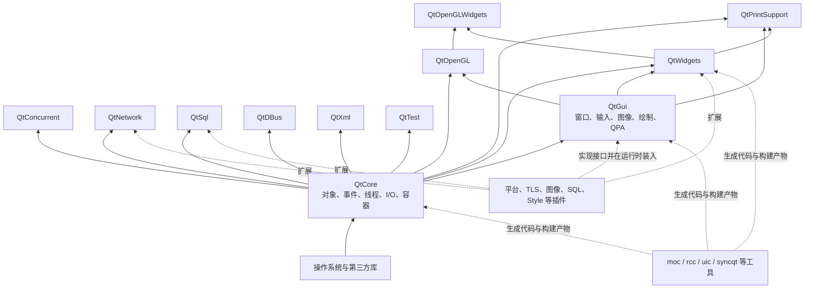
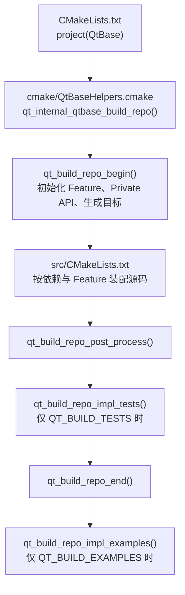

# 0. 建立 QtBase 整体地图

> 适用源码：QtBase 6.10.2（版本见 [`.cmake.conf`](../.cmake.conf)）<br>
> 本文定位：第一周的架构导航图。它不是逐目录 API 清单，而是后续研究 QObject、事件循环、线程、QPA、绘制、Widgets 和 Model/View 时反复使用的“坐标系”。

## 0.1 完成本阶段后，你应能回答什么

读完本文并完成末尾练习后，应能不依赖目录猜测，回答以下问题：

1. QtBase 和完整 Qt 的边界在哪里？
2. `Core → Gui → Widgets` 的依赖为何只能单向流动？
3. Network、Concurrent、SQL、DBus、OpenGL、PrintSupport、TestLib 位于哪一层？
4. 根 `CMakeLists.txt` 如何走到各模块、插件、测试和示例？
5. 普通公开头、`*_p.h` 私有头和 QPA 头的稳定性承诺有何不同？
6. `Q_DECLARE_PRIVATE`、`Q_D`、`Q_DECLARE_PUBLIC`、`Q_Q` 分别把哪个指针变成什么对象？
7. 面对一个行为问题，应该从哪个模块和哪条调用主线开始读？

建议先完整通读一次，再把本文当作索引使用。

---

## 0.2 先划边界：QtBase 是什么，不是什么

QtBase 是 Qt 的基础仓库。它提供对象模型、事件循环、线程、容器、文件与设备 I/O、网络、二维 GUI、传统桌面控件、平台抽象、插件基础设施、测试库和一组构建工具。它也是其他 Qt 仓库通常要依赖的地基。

当前仓库的 [`dependencies.yaml`](../dependencies.yaml) 为 `dependencies: {}`，表示 QtBase 在 Qt 仓库层面不依赖其他兄弟仓库。这不表示它没有操作系统库或第三方依赖；[`src/CMakeLists.txt`](../src/CMakeLists.txt) 仍会按 Feature 选择 PCRE2、zlib 等 bundled 或 system 实现。

### 属于本轮 QtBase 学习范围

- QtCore：对象模型、元对象、事件、线程、容器、文本、序列化、I/O、插件加载基础。
- QtConcurrent：基于 QtCore 的较高层并发任务 API。
- QtNetwork：Socket、TLS、HTTP 和异步网络访问。
- QtGui：窗口、屏幕、输入、字体、图像、绘制以及 QPA 平台抽象。
- QtWidgets：传统桌面控件、布局、样式、对话框、Item Views。
- QtTest：单元测试、数据驱动测试、Signal Spy 和 benchmark 支持。
- QtSql、QtDBus、QtXml、QtOpenGL、QtOpenGLWidgets、QtPrintSupport：围绕主干提供的独立或上层能力。
- 平台插件、图像格式插件、TLS 插件、SQL Driver、Style 插件等运行时扩展。
- `moc`、`rcc`、`uic`、`syncqt`、部署工具等构建期工具。

### 不属于 QtBase 主体

- Qt Quick、QML 引擎、QML 类型系统和 Scene Graph 主体位于 `qtdeclarative`。
- Multimedia、WebEngine、3D 等能力各自在其他 Qt 仓库。
- QML 应用最终会使用 QtCore/QtGui，但不应把 QML 实现混进 QtBase 第一轮源码阅读。

一个实用判断是：如果问题可以在 `QCoreApplication`、`QGuiApplication` 或 `QApplication` 这三层应用基类中定位，它大概率属于 QtBase；如果入口是 `QQmlEngine` 或 `QQuickItem`，则已跨到 `qtdeclarative`。

---

## 0.3 第一张图：模块依赖层次

下面的实线表示模块目标的公开链接依赖，依据各模块 `CMakeLists.txt` 中的 `PUBLIC_LIBRARIES`。虚线表示构建期或运行时参与，不表示普通应用的公开链接依赖。



注意两个容易画错的点：

- Network 不依赖 Gui。服务器、命令行工具和无界面服务可以只使用 Core + Network。
- QtTest 模块本身公开依赖 Core；某个 GUI 测试可以再链接 Gui 或 Widgets，但这不等于 QtTest 模块反向依赖它们。

### 模块目标速查表

| 模块目标 | 主要职责 | 公开依赖 | 首选源码入口 |
|---|---|---|---|
| `Qt::Core` | 值类型、QObject、事件循环、线程、I/O、插件基础 | 平台基础目标与系统库 | [`src/corelib`](../src/corelib) |
| `Qt::Concurrent` | Map/Filter/Run、Future、任务编排 | Core | [`src/concurrent`](../src/concurrent) |
| `Qt::Network` | Socket、TLS、HTTP、Network Access | Core | [`src/network`](../src/network) |
| `Qt::Sql` | 数据库连接、查询、SQL Models、Driver 接口 | Core | [`src/sql`](../src/sql) |
| `Qt::DBus` | D-Bus 消息、连接、适配器和接口 | Core | [`src/dbus`](../src/dbus) |
| `Qt::Xml` | DOM 兼容模块；流式 XML 主要已在 Core | Core | [`src/xml`](../src/xml) |
| `Qt::Gui` | 应用、窗口、输入、字体、图像、绘制、QPA、RHI | Core | [`src/gui`](../src/gui) |
| `Qt::OpenGL` | OpenGL 对象、上下文辅助和绘制后端 | Core + Gui | [`src/opengl`](../src/opengl) |
| `Qt::Widgets` | 控件、布局、Style、对话框、Item Views | Core + Gui | [`src/widgets`](../src/widgets) |
| `Qt::OpenGLWidgets` | `QOpenGLWidget` 对 Widgets/OpenGL 的桥接 | OpenGL + Widgets | [`src/openglwidgets`](../src/openglwidgets) |
| `Qt::PrintSupport` | 打印设备、打印引擎、打印对话框 | Core + Gui + Widgets | [`src/printsupport`](../src/printsupport) |
| `Qt::Test` | 测试执行、断言、数据驱动、Signal Spy、benchmark | Core | [`src/testlib`](../src/testlib) |

依赖证据可直接查看：Gui 的 [`PUBLIC_LIBRARIES`](../src/gui/CMakeLists.txt)、Widgets 的 [`PUBLIC_LIBRARIES`](../src/widgets/CMakeLists.txt)、Network 的 [`PUBLIC_LIBRARIES`](../src/network/CMakeLists.txt) 和 PrintSupport 的 [`PUBLIC_LIBRARIES`](../src/printsupport/CMakeLists.txt)。

### 为什么依赖不能反转

`Core → Gui → Widgets` 不只是构建顺序，而是能力逐层增加：

```text
QCoreApplication
    └── QGuiApplication
            └── QApplication

QObject + QEventLoop
    └── QWindow + 输入/字体/绘制/QPA
            └── QWidget + Layout + Style + Dialog + Item View
```

源码中的继承关系与模块关系一致：[`QGuiApplication`](../src/gui/kernel/qguiapplication.h) 继承 `QCoreApplication`，[`QApplication`](../src/widgets/kernel/qapplication.h) 继承 `QGuiApplication`，[`QWidget`](../src/widgets/kernel/qwidget.h) 同时继承 `QObject` 和 `QPaintDevice`。

如果反向依赖，会产生四类直接问题：

1. **循环链接**：Gui 已经链接 Core；Core 再链接 Gui 会形成模块环。
2. **能力污染**：命令行工具和服务器只需要事件、线程、I/O，却会被迫携带窗口系统、字体和图形依赖。
3. **引导失败**：构建 Qt 自己所需的 `moc`、`rcc` 等工具先依赖精简基础能力；底层若依赖上层，工具链无法逐级自举。
4. **平台扩展失效**：QPA 把稳定方向设计为“Gui 定义抽象，平台插件实现抽象”。若 Gui 直接依赖具体 Windows/Cocoa/XCB 实现，运行时替换和最小平台插件都失去意义。

所以这里使用的是“上层依赖下层抽象”，不是“下层知道所有上层”。插件虽然在运行时被 Gui 加载，但编译依赖仍是插件依赖 Gui/QPA 接口。

---

## 0.4 第二张图：源码目录不是模块图

根目录混合了源码、构建系统、测试、示例、工具输入和许可证信息。先按角色分类，再进入具体模块。

```text
qtbase/
├── CMakeLists.txt       顶层项目入口，只做版本/工程初始化并进入 QtBase 构建宏
├── .cmake.conf          QtBase 版本与 CMake 策略范围
├── configure(.bat)      面向人的配置入口，最终驱动 CMake
├── cmake/               Qt 自己的 CMake 构建框架与 Feature 处理
├── src/                 库、插件、工具和 bundled 第三方源码
├── tests/
│   ├── auto/            自动化行为与契约测试
│   ├── benchmarks/      性能测试
│   ├── manual/          需要人工观察或交互的测试
│   ├── baseline/        图形基线测试
│   └── libfuzzer/       模糊测试入口
├── examples/            面向使用者的可运行示例
├── doc/                 QtBase 文档工程与跨模块文档
├── mkspecs/             平台/编译器规格与 qmake 数据
├── qmake/               qmake 本身
├── config.tests/        配置阶段的能力探测小程序
├── util/                仓库维护和辅助脚本
└── LICENSES/            许可证文本
```

### `src/` 下的四种东西

不要把 `src/` 的每个一级目录都当作对等公开模块：

| 类别 | 目录 | 如何理解 |
|---|---|---|
| 公开库模块 | `corelib`、`gui`、`widgets`、`network`、`sql`、`dbus`、`xml` 等 | 通常由 `qt_internal_add_module(...)` 创建 `Qt::Xxx` 目标 |
| 内部支撑层 | `platformsupport`、`testinternal`、`entrypoint`、`assets` | 服务于其他模块或构建，不是普通应用首选的公开 Qt 模块 |
| 运行时扩展 | `plugins` | 平台、图片、TLS、SQL Driver、Style 等具体实现 |
| 构建期能力 | `tools`、`3rdparty`、`android` | 生成代码、部署、平台打包或提供 bundled 依赖 |

### 四个主模块内部的目录语义

```text
src/corelib/
  global      平台/编译器宏、导出、基础类型和全局设施
  tools       容器、共享数据、通用工具
  text        QString、QByteArray、Locale、正则等文本能力
  kernel      QObject、元对象、事件、事件循环、定时器
  thread      QThread、锁、线程池和 Future 底层
  io          QIODevice、文件、目录、资源、进程、设置
  itemmodels  QAbstractItemModel 与代理模型
  plugin      插件元数据与加载基础
  serialization / time / mimetypes / ipc ...

src/gui/
  kernel      QGuiApplication、QWindow、QScreen、输入与 QPA 接口
  painting    QPainter、QPaintEngine、Raster、Backing Store
  image       QImage、QPixmap、图片读写与格式处理
  text        字体、字形、文本布局
  rhi         Rendering Hardware Interface
  opengl / vulkan / platform / accessible ...

src/widgets/
  kernel      QApplication、QWidget、Layout、窗口容器
  widgets     按钮、输入框、菜单等控件
  itemviews   View 与 Delegate
  dialogs     标准对话框
  styles      QStyle、平台/融合样式、Style Sheet
  graphicsview / effects / accessible ...

src/network/
  socket      TCP/UDP/Local Socket 与 Socket Engine
  access      QNetworkAccessManager、Request、Reply、HTTP
  ssl         TLS 抽象、证书与后端接口
  kernel      HostInfo、Proxy、Interface、Datagram 等基础设施
```

因此，学习时不要执行“把 `src/corelib` 从头读到尾”这种目录驱动策略。正确做法是选一条行为链，然后跨越 public header、private header、`.cpp`、平台后端和测试。

---

## 0.5 第三张图：QtBase 如何被装配出来

### 顶层构建链



根 [`CMakeLists.txt`](../CMakeLists.txt) 的职责很小：读取版本、加载 `QtBaseHelpers.cmake`、建立 `project(QtBase)`，然后调用 `qt_internal_qtbase_build_repo()`。真正的仓库编排位于 [`cmake/QtBaseHelpers.cmake`](../cmake/QtBaseHelpers.cmake)。

### `src/CMakeLists.txt` 的关键顺序

[`src/CMakeLists.txt`](../src/CMakeLists.txt) 是理解模块装配的首要入口。它大致按以下顺序工作：

1. 提前计算 Core、Network、Gui 的 Feature，因为后续是否构建 bundled 第三方库依赖这些值。
2. 先加入 `syncqt`，再按需要构建 bootstrap 库、`moc`、`rcc`、trace 工具和 automoc parser。
3. 加入 entrypoint 和 Core 所需的 PCRE2、zlib 等第三方实现。
4. 构建 Core。
5. Core 可用后，再加入通用 3rdparty 和只依赖 Core 的 Concurrent、SQL、Network、XML、DBus。
6. 加入其余工具。
7. Feature `gui` 开启时加入 Gui、Assets、OpenGL、Widgets、OpenGLWidgets 和 PlatformSupport。
8. Feature `testlib` 开启时加入 TestInternal 和 TestLib；随后加入 PrintSupport。
9. 最后扫描插件目录，依据“目标是否存在 + Feature 是否开启”加入具体插件。
10. `src/` 完成后，仓库构建宏再按选项加入 `tests/` 与 `examples/`。

这个顺序本身就是一张可执行的依赖图。遇到“为什么此模块没生成”时，先看控制它的 `QT_FEATURE_xxx` 和前置 `TARGET Qt::Xxx`，不要先怀疑源文件丢失。

### 模块 `CMakeLists.txt` 中最值得认识的词

以 Widgets、Gui 或 Network 的 `CMakeLists.txt` 为例：

| 构建词 | 含义 | 阅读价值 |
|---|---|---|
| `qt_internal_add_module(Name ...)` | 声明一个 Qt 模块目标 | 找模块边界、源码总表、插件类型 |
| `SOURCES` | 参与模块构建并由 syncqt 分类的源文件/头文件 | 看模块实际拥有的类，不靠目录猜 |
| `PUBLIC_LIBRARIES` | 模块公开链接依赖 | 画公开模块依赖图的权威证据 |
| `LIBRARIES` | 实现内部使用的依赖 | 区分实现依赖与消费者可见依赖 |
| `PRIVATE_MODULE_INTERFACE` | Private 目标向其他 Private 目标暴露的依赖 | 研究 Qt 内部跨模块协作，普通应用不应使用 |
| `PLUGIN_TYPES` | 此模块定义/消费的插件类别 | 找运行时扩展点 |
| `qt_internal_extend_target(... CONDITION ...)` | 按平台或 Feature 增补源码、宏和库 | 找 Windows/Unix/macOS 后端的首选入口 |

例如 Core 的同一模块目标会按 `WIN32` 选择 `qeventdispatcher_win.cpp`、`qthread_win.cpp` 等实现，按 `UNIX` 选择对应 Unix 实现。公共 `QEventLoop`/`QThread` 契约不变，平台差异在构建时进入同一个 Core 模块。

### Feature 的三层心智模型

```text
用户配置输入
    configure / configure.bat / CMake -D...
        ↓
模块 configure.cmake 计算 QT_FEATURE_xxx
        ↓
src/CMakeLists.txt 决定是否加入模块
        ↓
模块 CMakeLists.txt 决定是否加入某组源码或依赖
        ↓
生成的 QT_CONFIG(feature) 控制 C++ 编译分支
```

研究一个 Feature 时，依次找：

1. `src/<module>/configure.cmake` 中的定义与条件；
2. `src/CMakeLists.txt` 是否控制整个模块；
3. `src/<module>/CMakeLists.txt` 是否只控制部分源文件；
4. C++ 中的 `QT_CONFIG(feature)` 如何改变 API 或实现。

---

## 0.6 Public、Private 与 QPA：三种稳定性边界

### 1. Public API

普通公开头通过模块入口使用，例如：

```cpp
#include <QObject>
#include <QGuiApplication>
#include <QWidget>
```

源码中常见 `Q_CORE_EXPORT`、`Q_GUI_EXPORT`、`Q_WIDGETS_EXPORT`。这些宏控制符号的导入导出和可见性。对学习者而言，它们也提示“这个类属于哪个二进制模块”。

Public API 仍可能随 Qt 的版本策略演进，但它是应用应依赖的契约面，也是二进制兼容性工作的主要对象。

### 2. Private API：`*_p.h`

`qobject_p.h`、`qwidget_p.h` 等私有头顶部明确警告：它们不是 Qt API，可能在任意版本变化或被删除。私有头对源码学习很重要，因为真实状态、缓存、内部连接和平台协作经常在这里；但应用代码不应把它们当稳定依赖。

正确姿势是：

- **学习实现时读它**：理解状态结构和不变量。
- **设计应用接口时避开它**：不要为了短期方便绑定内部布局。
- **升级 Qt 时重新验证**：Private API 的源码和 ABI 都没有稳定承诺。

### 3. QPA API

QPA（Qt Platform Abstraction，Qt 平台抽象）位于 Gui 和平台插件之间。它比普通 Private 头更像一组明确接口，但 [`qplatformintegration.h`](../src/gui/kernel/qplatformintegration.h) 同样声明它不面向应用，并可能造成未来版本源码或二进制不兼容。

可把三者理解为：

| 边界 | 主要使用者 | 稳定性预期 |
|---|---|---|
| Public API | 普通 Qt 应用和库 | 按 Qt 公开兼容策略维护 |
| Private API | Qt 自身模块、深度集成方 | 无稳定保证 |
| QPA API | Qt 平台插件和移植层 | 有清晰角色，但仍不承诺应用级兼容 |

### PIMPL 与 d/q 指针语法

PIMPL（Pointer to Implementation，实现指针）把公开对象与可变化的实现状态分开。Qt 的常见结构如下：

```text
公开类 Foo                         私有类 FooPrivate
┌─────────────────────┐           ┌──────────────────────────┐
│ public API           │           │ 可变化的内部状态          │
│ d_ptr ───────────────┼──────────▶│ q_ptr ────────────────────┼──┐
│ Q_DECLARE_PRIVATE    │           │ Q_DECLARE_PUBLIC          │  │
└─────────────────────┘           └──────────────────────────┘  │
          ▲                                                    │
          └────────────────────────────────────────────────────┘
```

宏定义位于 [`qtclasshelpermacros.h`](../src/corelib/global/qtclasshelpermacros.h)：

- `Q_DECLARE_PRIVATE(Foo)`：在公开类中生成 `d_func()`，把 `d_ptr` 解释为 `FooPrivate*`，并把 `FooPrivate` 设为 friend。
- `Q_D(Foo)`：在成员函数内创建局部变量 `FooPrivate * const d = d_func()`。
- `Q_DECLARE_PUBLIC(Foo)`：在私有类中生成 `q_func()`，把 `q_ptr` 转回 `Foo*`，并把公开类设为 friend。
- `Q_Q(Foo)`：在私有类成员函数内创建局部变量 `Foo * const q = q_func()`。

这套语法的价值不只是“隐藏成员”：

- 公开类的对象布局可以更稳定，内部成员变化更多落在私有对象中。
- 公开头减少对实现类型的包含，降低重编译扩散。
- 私有类可以反向访问公开对象，以发送信号、调用受保护流程或完成双向协作。

但不要把 PIMPL 理解为绝对 ABI 魔法。虚函数表、inline 函数、模板实例、基类和公开数据布局仍可能影响 ABI；使用 Private API 的代码也绕开了这层保护。

---

## 0.7 第四张图：五条运行时主干

模块图回答“代码属于哪里”，行为主干回答“运行时如何流动”。后续每个专题都应挂到下面至少一条主干上。

### 主干 A：应用与事件循环

```text
main()
  → QCoreApplication / QGuiApplication / QApplication
  → QCoreApplication::exec()
  → QEventLoop::exec()
  → QAbstractEventDispatcher::processEvents()
  → 平台 dispatcher 等待原生事件、timer、socket notifier
  → QCoreApplication::notifyInternal2()/notify()
  → QObject::event()
  → 具体 event handler
```

关键证据：[`QCoreApplication::exec()`](../src/corelib/kernel/qcoreapplication.cpp) 创建 `QEventLoop`；[`QEventLoop::exec()`](../src/corelib/kernel/qeventloop.cpp) 循环调用 dispatcher；不同平台 dispatcher 由 Core 的条件源码提供。

学习问题：同步 `sendEvent()` 与异步 `postEvent()` 在哪处分叉？事件归哪个线程队列？嵌套 `exec()` 如何增加 loop level？

### 主干 B：Gui 启动与 QPA

```text
QGuiApplicationPrivate::init()
  → createPlatformIntegration()
  → QPlatformIntegrationFactory::create(platformName, ...)
  → QFactoryLoader 在 platforms 插件目录选实现
  → Windows: QWindowsIntegrationPlugin::create()
  → QWindowsGdiIntegration
  → integration 创建 event dispatcher、screen、platform window 等对象
```

关键入口：

- [`qguiapplication.cpp`](../src/gui/kernel/qguiapplication.cpp)：平台名、插件路径、Integration 初始化。
- [`qplatformintegrationfactory.cpp`](../src/gui/kernel/qplatformintegrationfactory.cpp)：通过 `QFactoryLoader` 装入平台插件。
- [`src/plugins/platforms/windows/main.cpp`](../src/plugins/platforms/windows/main.cpp)：Windows 插件入口。
- [`src/plugins/platforms/minimal`](../src/plugins/platforms/minimal)：比 Windows 后端更小，适合先理解接口面。

### 主干 C：窗口创建与显示

```text
QWindow::show()/setVisible(true)
  → QWindowPrivate::create()
  → QPlatformIntegration::createPlatformWindow()
  → 具体 QPlatformWindow（如 QWindowsWindow）
  → native window
  → 原生消息经 QWindowSystemInterface 回到 Qt event
```

这条链展示 Bridge：`QWindow` 是跨平台公共抽象，`QPlatformWindow` 是平台桥接接口，Windows/Cocoa/XCB/Wayland 类是具体实现。

### 主干 D：绘制

```text
paint event / 主动绘制请求
  → QPainter::begin(QPaintDevice*)
  → QPaintDevice::paintEngine()
  → QPaintEngine::begin()
  → Raster / OpenGL / PDF / 其他具体 engine
  → backing store 或目标设备
```

[`QPainter::begin()`](../src/gui/painting/qpainter.cpp) 从设备取得 `paintEngine()`，这比只记“QPainter 是 Facade”更重要：实际后端选择由目标 `QPaintDevice` 参与决定。

### 主干 E：Widgets 与 Model/View

```text
QApplication::notify()
  → QWidget::event()
  → paintEvent / mouseEvent / keyEvent / ...
  → QPainter + Style + Layout

Model 变更
  → beginXxx()/内部状态变化/endXxx()
  → rowsInserted/dataChanged/... signals
  → View + SelectionModel + Delegate 更新
```

Widgets 不是独立窗口系统。它在 Gui 的 `QWindow`、输入、绘制和 QPA 之上实现控件树。Model 的核心抽象却在 Core 的 `itemmodels` 中，因此无 Widgets 环境也能持有和操作模型；具体 Item Views 位于 Widgets。

### Network 如何接入主干

Network 并不建立第二套事件循环。Socket engine 将 readiness 接入 Core 的 event dispatcher，Network 对象再以 signal、event 和状态机暴露异步结果。因此“Network 卡住”经常要同时检查：对象线程亲和性、目标线程事件循环、socket notifier、协议状态机和对象生命周期。

---

## 0.8 面对问题时，从哪里开始读

| 你要回答的问题 | 第一入口 | 第二跳 | 用测试确认 |
|---|---|---|---|
| QObject 生命周期、父子树 | `corelib/kernel/qobject.h/.cpp` | `qobject_p.h` | `tests/auto/corelib/kernel/qobject` |
| 信号槽调用/跨线程投递 | `qobject.cpp`、`qmetaobject.cpp` | `qobject_p.h`、`qthread_p.h` | QObject、QMetaObject 测试 |
| `exec()`、timer、posted event | `qcoreapplication.cpp`、`qeventloop.cpp` | 平台 event dispatcher | `tests/auto/corelib/kernel/qeventloop` |
| 线程亲和性、Worker Object | `thread/qthread.h/.cpp` | `qthread_p.h`、event dispatcher | `tests/auto/corelib/thread/qthread` |
| 文件/Socket 的共同抽象 | `io/qiodevice.h/.cpp` | QFile/QBuffer/QAbstractSocket | 对应 `tests/auto` |
| GUI 启动时选择哪个平台 | `qguiapplication.cpp` | integration factory、平台 plugin `main.cpp` | GUI kernel 与 QPA 测试 |
| `QWindow::show()` 如何落到原生窗口 | `qwindow.cpp` | `QPlatformWindow`、具体平台 window | GUI kernel/平台测试 |
| `QPainter` 如何选择后端 | `qpainter.cpp` | QPaintDevice、QPaintEngine | GUI painting 测试/benchmark |
| QWidget 为何重绘/布局异常 | `qwidget.cpp`、`qlayout.cpp` | repaint manager、style | Widgets kernel 测试 |
| Model/View 通知为什么错乱 | `qabstractitemmodel.*` | private、view、selection model | model tester 与 itemmodels 测试 |
| 插件为何未加载 | `qfactoryloader_p.h`、`qpluginloader.cpp` | 具体 plugin metadata/main | plugin 与对应模块测试 |

固定使用以下七步，而不是无限展开调用者：

1. 公开头：写出契约、线程要求、所有权和扩展点。
2. 私有头：列出状态、缓存、锁、队列和指针关系。
3. `.cpp` 中选一个具体行为，不读无关函数。
4. 找一个最小后端或子类，优先 `minimal` 而不是最大平台实现。
5. 找对应 `tests/auto`，提取至少三个不变量。
6. 必要时再读平台实现或 benchmark。
7. 用调试器验证一条真实调用栈，并把“预期图”和“实际图”对比。

---

## 0.9 第一周学习路线

### Day 1：边界与模块图

- 通读本文 0.2～0.4。
- 从 [`src/CMakeLists.txt`](../src/CMakeLists.txt) 手工抄出模块装配顺序。
- 不看本文模块图，自己重画一次 `Core → Gui → Widgets` 及外围模块。
- 解释 Network 为何不应依赖 Gui。

产物：一张模块依赖图，边上标注依赖证据所在的 `CMakeLists.txt`。

### Day 2：构建装配

- 阅读根 [`CMakeLists.txt`](../CMakeLists.txt)。
- 跟到 [`qt_internal_qtbase_build_repo()`](../cmake/QtBaseHelpers.cmake)。
- 回到 [`src/CMakeLists.txt`](../src/CMakeLists.txt)，标出 Core 前后的分界。
- 任选 `gui` 或 `network` Feature，按“配置 → 模块 → C++ 宏”追一遍。

产物：一张从 `configure` 到具体 `.cpp` 是否参与编译的决策链。

### Day 3：Public/Private/PIMPL

- 对照阅读 `qobject.h` 与 `qobject_p.h`。
- 展开 `Q_DECLARE_PRIVATE(QObject)` 和一次 `Q_D(QObject)`。
- 找出 `QObjectData`/`QObjectPrivate` 中哪些状态不适合放进公开类。
- 阅读一个 QPA 头部的兼容性警告。

产物：一页 API 边界笔记，明确哪些内容可依赖、哪些只能观察。

### Day 4：走通一条运行时主干

推荐先走事件循环：

```text
QCoreApplication::exec
  → QEventLoop::exec
  → QAbstractEventDispatcher::processEvents
```

然后在当前平台找到具体 dispatcher。只回答三个问题：谁创建它、谁持有它、谁反复调用它。

产物：一张不超过 12 个节点的调用图。

### Day 5：用测试校准理解

- 阅读 `tests/auto/corelib/kernel/qeventloop` 的目录和 CMake 入口。
- 任选 3 个测试，先写出它们验证的不变量，再看实现细节。
- 对照 `tests/benchmarks`，区分“行为正确”与“性能退化”两种证据。
- 为下一阶段“值语义、隐式共享与 ABI”选好入口文件。

产物：第一周总结，列出 5 个已确认事实、3 个仍需调试验证的假设。

---

## 0.10 三个必须亲手完成的练习

### 练习 1：从构建文件重建依赖图

不要复制本文。对每个模块只读取首次出现的 `PUBLIC_LIBRARIES`，生成表格：

```powershell
rg -n -A 8 "PUBLIC_LIBRARIES" src/gui/CMakeLists.txt `
  src/widgets/CMakeLists.txt src/network/CMakeLists.txt `
  src/opengl/CMakeLists.txt src/printsupport/CMakeLists.txt
```

验收：图中每条实线都能指向一个构建文件证据；插件关系必须画成运行时扩展，不能误画为 Core 对插件的反向编译依赖。

### 练习 2：展开一次 d/q 指针

任选一个 `Q_D(Class)` 调用点，手工改写为不使用宏的等价伪代码，并回答：

- `d_ptr` 存在哪里？
- `d_func()` 返回什么类型？
- `q_ptr` 的用途是什么？
- 哪些内部成员变化不要求改变公开类的数据成员列表？

验收：能解释 `Q_DECLARE_PRIVATE` 与 `Q_D` 的区别；不能把二者都笼统称为“获取私有指针”。

### 练习 3：验证应用三层继承

分别打开：

1. [`qcoreapplication.h`](../src/corelib/kernel/qcoreapplication.h)
2. [`qguiapplication.h`](../src/gui/kernel/qguiapplication.h)
3. [`qapplication.h`](../src/widgets/kernel/qapplication.h)

列出每层新增加的能力，并给出一个“不该下沉到前一层”的例子。

验收：能说明为什么 `QCoreApplication` 可以服务无 GUI 程序，为什么创建 QWidget 时必须使用 QApplication，而不是只说“因为文档要求”。

---

## 0.11 常见误区

### 误区 1：目录位置等于公开模块边界

反例：Core 中有 `itemmodels`，具体 Item Views 却在 Widgets；Gui 中有 QPA 接口，具体平台实现主要在 `src/plugins/platforms`。

### 误区 2：所有 `*.h` 都是稳定 API

文件可被包含不代表有兼容承诺。先看是否为 `*_p.h`、QPA 头，以及所属目标是 `Qt::Xxx` 还是 `Qt::XxxPrivate`。

### 误区 3：Qt 跨平台意味着没有平台代码

QtBase 有大量 `_win.cpp`、`_unix.cpp`、`.mm` 和平台插件。跨平台来自统一契约与隔离的具体实现，不是消除平台差异。

### 误区 4：插件加载意味着底层依赖插件

加载动作由底层框架发起，但编译期依赖方向仍是具体插件依赖抽象接口。这是依赖反转与运行时发现共同作用的结果。

### 误区 5：事件循环只属于 GUI

事件循环位于 Core。Console/Network 程序同样依赖它处理 queued invocation、timer、socket notifier 和 deferred delete。

### 误区 6：设计模式标签等于理解源码

说“QPA 是 Abstract Factory”还不够。必须继续问：工厂何时创建、key 从哪里来、对象归谁、失败怎样报告、平台事件如何回流、接口的稳定性是什么。

### 误区 7：第一次看到的实现就是全平台真相

`qt_internal_extend_target(... CONDITION ...)` 会替换或补充实现。研究平台相关行为时，必须确认当前构建实际选中了哪些源文件和 Feature。

---

## 0.12 阶段验收清单

完成以下项目，才算建立了可用的整体地图：

- [ ] 能在 3 分钟内解释 QtBase 与 qtdeclarative 的边界。
- [ ] 能默画 Core、Gui、Widgets 和至少 6 个外围模块的依赖方向。
- [ ] 图中每条公开依赖都有 `PUBLIC_LIBRARIES` 证据。
- [ ] 能从根 `CMakeLists.txt` 走到 `src/CMakeLists.txt`、tests 和 examples。
- [ ] 能解释 `QT_FEATURE_xxx` 如何影响模块、源文件和 C++ 分支。
- [ ] 能区分公开模块、内部支撑目录、插件和构建工具。
- [ ] 能解释 Public、Private、QPA 三类边界的兼容性差异。
- [ ] 能准确展开 `Q_DECLARE_PRIVATE`、`Q_D`、`Q_DECLARE_PUBLIC`、`Q_Q`。
- [ ] 至少走通过事件循环、QPA、绘制、Widgets 中的一条真实调用链。
- [ ] 至少从一个 `tests/auto` 用例提取了行为不变量。
- [ ] 已记录当前理解中的假设，并标明哪些需要调试器验证。

---

## 0.13 后续专题入口

整体地图建立后，按学习大纲继续：

1. 值语义、隐式共享与 ABI：从 `qshareddata.h`、`qarraydata.h`、`QString` 开始。
2. QObject 与元对象：从 `qobject.h/.cpp`、`qobject_p.h`、`qmetaobject.cpp` 开始。
3. 事件系统：沿本文主干 A 深挖。
4. 线程：把 thread affinity 接到事件队列和 queued connection。
5. I/O 与 Network：把 `QIODevice` 状态机接到 event dispatcher。
6. QPA：沿本文主干 B/C 深挖，并比较 minimal 与 Windows 后端。
7. 绘制：沿本文主干 D 深挖设备、状态与 engine。
8. Widgets 与 Model/View：沿本文主干 E 深挖控件树、布局和事务式通知。

返回总纲：[`qtbase-learning-outline.md`](qtbase-learning-outline.md)。

## 0.14 本文使用的源码证据索引

- 版本与构建要求：[`.cmake.conf`](../.cmake.conf)
- 顶层工程入口：[`CMakeLists.txt`](../CMakeLists.txt)
- 仓库构建宏：[`cmake/QtBaseHelpers.cmake`](../cmake/QtBaseHelpers.cmake)
- 模块装配顺序：[`src/CMakeLists.txt`](../src/CMakeLists.txt)
- 模块依赖：[`corelib`](../src/corelib/CMakeLists.txt)、[`gui`](../src/gui/CMakeLists.txt)、[`widgets`](../src/widgets/CMakeLists.txt)、[`network`](../src/network/CMakeLists.txt)、[`concurrent`](../src/concurrent/CMakeLists.txt)、[`testlib`](../src/testlib/CMakeLists.txt)、[`opengl`](../src/opengl/CMakeLists.txt)、[`printsupport`](../src/printsupport/CMakeLists.txt)
- d/q 指针宏：[`qtclasshelpermacros.h`](../src/corelib/global/qtclasshelpermacros.h)
- Private API 警告：[`qobject_p.h`](../src/corelib/kernel/qobject_p.h)、[`qwidget_p.h`](../src/widgets/kernel/qwidget_p.h)
- QPA 边界：[`qplatformintegration.h`](../src/gui/kernel/qplatformintegration.h)
- 事件循环：[`qcoreapplication.cpp`](../src/corelib/kernel/qcoreapplication.cpp)、[`qeventloop.cpp`](../src/corelib/kernel/qeventloop.cpp)、[`qabstracteventdispatcher.cpp`](../src/corelib/kernel/qabstracteventdispatcher.cpp)
- 平台插件选择：[`qguiapplication.cpp`](../src/gui/kernel/qguiapplication.cpp)、[`qplatformintegrationfactory.cpp`](../src/gui/kernel/qplatformintegrationfactory.cpp)、[`windows/main.cpp`](../src/plugins/platforms/windows/main.cpp)
- 绘制入口：[`qpainter.cpp`](../src/gui/painting/qpainter.cpp)
- 测试分层：[`tests/auto/CMakeLists.txt`](../tests/auto/CMakeLists.txt)、[`tests/benchmarks/CMakeLists.txt`](../tests/benchmarks/CMakeLists.txt)
