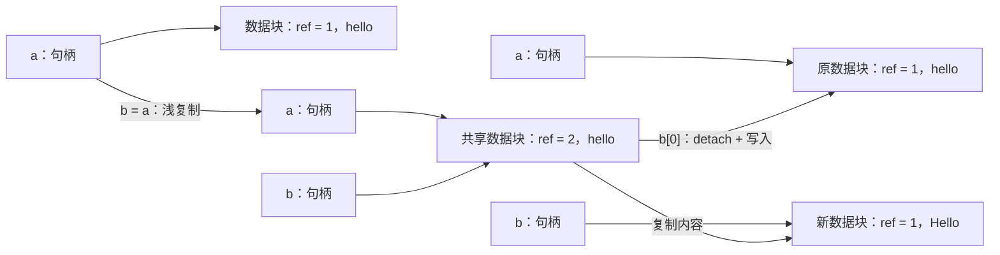

# 1. 值语义、隐式共享与 ABI

> 适用源码：QtBase 6.10.2（版本见 [`.cmake.conf`](https://github.com/qt/qtbase/blob/v6.10.2/.cmake.conf)）<br>
> 本文定位：第 2～3 周的机制主线。目标不是记住 `detach()` 的名字，而是能从一次复制、一次写入一路追到引用计数、内存分配和 ABI 边界。

## 1.1 完成本阶段后，你应能回答什么

读完本文并完成练习后，应能用源码解释：

1. “值语义”为什么是行为契约，而不是“对象一定存放在栈上”？
2. `QString b = a` 为什么通常不复制字符，而 `b[0] = u'X'` 又不会修改 `a`？
3. 为什么同一个 API 的 const 与 non-const 重载会决定是否发生 detach？
4. `QSharedDataPointer<T>`、`QArrayDataPointer<T>` 和 PIMPL 分别解决什么问题？
5. 原子引用计数保证了什么，又没有保证什么？
6. 移动语义已经存在，Qt 为什么仍需要隐式共享？
7. 公开类增加一个数据成员、调整虚函数顺序，为什么可能破坏 ABI？
8. d-pointer 如何让内部状态演进而不改变公开对象布局？
9. 为什么 `Q_DECLARE_SHARED(Type)` 并不会自动为一个类型实现 COW？
10. 什么场景应选值类型，什么场景必须保留 `QObject` 的身份语义？

建议先读 1.2～1.8 建立模型，再完成 1.9 的 `Person` 实验。最后用 1.13 的问题自测。

---

## 1.2 先分清四个容易混淆的概念

### 值语义：副本在行为上彼此独立

值语义关注的是“这个对象代表什么值”，而不是“它位于哪块内存”。一个类型具有良好值语义，通常意味着：

- 可以复制、赋值、返回和放入容器；
- 两个值相等时可相互替换，调用者不需要知道它们的存储身份；
- 修改副本不会在语义上修改原对象；
- 资源由对象生命周期自动管理。

`int`、`QString`、`QByteArray`、`QList<T>` 都按值使用。`QString` 内部指向堆内存并不妨碍它成为值类型，因为堆指针只是实现手段。

### 身份语义：关心“是不是同一个对象”

身份对象代表一个持续存在的实体。它的地址、生命周期、父子关系、线程亲和性或外部资源绑定都有意义。`QObject` 明确使用 [`Q_DISABLE_COPY(QObject)`](https://github.com/qt/qtbase/blob/v6.10.2/src/corelib/kernel/qobject.h)，因为复制一个对象时无法自然回答这些问题：

- 新副本是否复制信号槽连接？
- 两个对象是否共享 object name、动态属性和事件队列状态？
- 子对象归谁？
- 新对象属于哪个线程？

因此，`QObject` 通常按指针或引用传递；`QString` 则按值传递。二者不是“重量级与轻量级”的区别，而是语义不同。

### 共享所有权：多个句柄共同拥有同一对象

共享所有权只回答生命周期问题：“最后一个拥有者消失时删除资源”。`std::shared_ptr<T>`、`QSharedPointer<T>` 属于这一类。若两个共享指针指向同一可变对象，通过其中一个修改，另一个通常也能观察到修改。

### 隐式共享：共享存储，但保持值语义

隐式共享在复制时暂时共享存储，在某个副本准备写入时先复制数据块。它把下面两个目标组合起来：

- 外部行为仍像两个独立的值；
- 没有写入时只做浅复制，避免立即复制大块数据。

这就是 Copy-on-Write，简称 COW，也叫写时复制。

| 机制 | 复制后的存储 | 经一个副本修改 | 主要目的 |
|---|---|---|---|
| 普通深复制值类型 | 立即独立 | 只影响当前值 | 最直接的值语义 |
| 隐式共享值类型 | 暂时共享，写前分离 | 只影响当前值 | 值语义 + 延迟复制 |
| 共享所有权 | 继续共享同一对象 | 通常所有句柄可见 | 共同生命周期/共同身份 |
| `QObject` 指针 | 指向同一身份对象 | 所有观察者可见 | 身份、事件和生命周期协议 |

一个判断问题很有用：复制后调用 `setName()`，你期望原对象跟着改变吗？若不期望，倾向值语义；若期望，说明你可能需要共享身份，而不是 COW。

---

## 1.3 隐式共享的完整状态机

设 `a` 是一个非空 `QString`：

```cpp
QString a = QStringLiteral("hello");
QString b = a;
b[0] = u'H';
```

状态变化如下：



把它压缩成伪代码就是：

```cpp
void write(Value &self, Change change)
{
    if (self.data->refCount > 1) {
        Data *copy = new Data(*self.data);
        --self.data->refCount;
        self.data = copy;
    }
    change(*self.data);
}
```

这里有三个不变量：

1. **复制句柄必须增加引用计数。** 否则一个副本析构后会提前释放共享数据。
2. **写入前必须拥有独占数据。** 引用计数大于 1 时直接写会破坏值语义。
3. **最后一个句柄离开时释放数据。** 这是 RAII 在共享数据上的落点。

注意，detach 是写入路径的一部分，不等同于写入。一次 non-const 访问可能触发复制，即使调用者最后没有真的改数据。

---

## 1.4 第一条源码链：`QSharedDataPointer<T>`

### 1.4.1 数据块从 `QSharedData` 开始

[`QSharedData`](https://github.com/qt/qtbase/blob/v6.10.2/src/corelib/tools/qshareddata.h) 只有一个核心成员：

```cpp
mutable QAtomicInt ref;
```

默认构造和复制构造都把 `ref` 设为 0。复制数据对象时不应复制旧引用计数；新数据块随后由新的共享指针接管并把计数增加到 1。赋值运算符被删除，因为把一个活跃数据块的引用计数覆盖掉会破坏所有权协议。

### 1.4.2 读写入口由 const 性决定

[`QSharedDataPointer<T>`](https://github.com/qt/qtbase/blob/v6.10.2/src/corelib/tools/qshareddata.h) 的核心接口可归纳为：

| 表达式 | 返回 | 自动 detach |
|---|---|---:|
| `d->member`，`d` 可变 | `T *` | 是 |
| `(*d).member`，`d` 可变 | `T &` | 是 |
| `d.data()` / `d.get()`，`d` 可变 | `T *` | 是 |
| `d->member`，`d` 为 const | `const T *` | 否 |
| `d.constData()` | `const T *` | 否 |

关键代码不是在业务 setter 中硬编码，而是在 non-const `operator->()`、`operator*()` 和 `data()` 入口统一调用 `detach()`。这让自定义值类不容易漏掉写前分离。

### 1.4.3 复制、移动和析构分别做什么

从 [`qshareddata.h`](https://github.com/qt/qtbase/blob/v6.10.2/src/corelib/tools/qshareddata.h) 可以直接读出：

- 复制构造：复制 d-pointer，并执行 `ref.ref()`；
- 复制赋值：先增加新数据块计数，再减少旧数据块计数；
- 移动构造：转移 d-pointer，把源对象置空，不改引用计数；
- 析构：执行 `ref.deref()`，降为 0 时删除数据块。

因此，移动和隐式共享并不冲突：

- 移动解决“源对象马上不用了，直接转移句柄”；
- 隐式共享解决“源对象和副本都要继续存在，但可能长期只读”。

函数按值返回时，编译器可能使用返回值优化或移动；把一个已有值复制给另一个仍需保留的值时，隐式共享仍能避免立即深复制。

### 1.4.4 `detach_helper()` 的真实顺序

[`QSharedDataPointer<T>::detach_helper()`](https://github.com/qt/qtbase/blob/v6.10.2/src/corelib/tools/qshareddata.h) 的行为顺序是：

```text
clone()：new T(*oldData)
    ↓
新数据块 ref + 1
    ↓
旧数据块 ref - 1；若到 0 则删除
    ↓
当前句柄指向新数据块
```

默认 `clone()` 调用 `new T(*d)`，所以自定义数据类的复制构造函数决定深复制的具体含义。若数据类包含裸拥有指针，仅复制指针仍会制造两个数据块共同操作同一资源；这时必须为数据类实现正确的复制策略，或改用 RAII 成员。

### 1.4.5 显式共享不是隐式共享的“高级版”

[`QExplicitlySharedDataPointer<T>`](https://github.com/qt/qtbase/blob/v6.10.2/src/corelib/tools/qshareddata.h) 也有原子引用计数，但 non-const `operator->()` 不自动 detach。复制后的两个句柄默认观察同一份修改。它适合共享身份或共享可变状态，不应被误当作普通值类的省事实现。

| 选择 | non-const 解引用 | 复制后修改的语义 |
|---|---:|---|
| `QSharedDataPointer<T>` | 自动 detach | 修改当前值的副本 |
| `QExplicitlySharedDataPointer<T>` | 不自动 detach | 修改共同数据，除非手动 detach |

---

## 1.5 第二条源码链：`QString`、`QByteArray`、`QList<T>` 的数组存储

`QString` 等核心类型没有直接使用 `QSharedDataPointer<T>`。它们需要连续内存、容量管理、原始数据视图、前后扩容等更专门的能力，因此共享一套数组存储层：

```text
QString / QByteArray / QList<T>
            │
            ▼
QArrayDataPointer<T>
  d    -> QArrayData 头部
  ptr  -> 当前元素起点
  size -> 当前元素数
            │
            ▼
QArrayData
  ref_  原子引用计数
  flags CapacityReserved 等标志
  alloc 已分配容量
            │
            ▼
连续元素区 T T T T ...
```

### 1.5.1 `QArrayData` 负责共享头和容量

[`QArrayData`](https://github.com/qt/qtbase/blob/v6.10.2/src/corelib/tools/qarraydata.h) 保存 `ref_`、`flags` 和 `alloc`。两个判断尤其重要：

```cpp
bool isShared() const noexcept
{
    return ref_.loadRelaxed() != 1;
}

bool needsDetach() noexcept
{
    return ref_.loadRelaxed() > 1;
}
```

`isShared()` 和 `needsDetach()` 不是同义词。某些特殊数据可能不是“独占可写”状态，但也不能按普通共享块直接分离；读源码时应跟随具体调用者，而不是把所有非 1 引用计数都想成普通的“两份共享”。

`CapacityReserved` 则记录调用者通过 `reserve()` 表达的容量意图。detach 时若新尺寸更小，`detachCapacity()` 仍可保留已预留容量。这说明 COW 和容量策略不是两套互不相关的机制。

### 1.5.2 `QArrayDataPointer<T>` 负责句柄和元素生命周期

[`QArrayDataPointer<T>`](https://github.com/qt/qtbase/blob/v6.10.2/src/corelib/tools/qarraydatapointer.h) 的复制构造增加引用计数，析构在最后一个引用离开时销毁元素并释放头部。它还负责：

- `detach()`：共享时重新分配并复制；
- `detachAndGrow()`：把分离和扩容合成一次操作；
- `reallocateAndGrow()`：可重定位类型走更快的重新分配路径；
- `freeSpaceAtBegin()` / `freeSpaceAtEnd()`：支持前插和后插；
- `sliced() &&`：独占右值时可复用原缓冲区。

这比“引用计数 + memcpy”复杂得多，因为 `QList<T>` 还必须正确构造、移动和析构任意 `T`。

### 1.5.3 一次 `QString` 写入如何走到底层

对下面代码：

```cpp
QString a = QStringLiteral("hello");
QString b = a;
b[0] = u'H';
```

可沿源码得到这条路径：

```text
QString::operator[](qsizetype)          non-const 重载
    ↓
QString::data()
    ↓
QString::detach()
    ↓
d.needsDetach()
    ↓ true
QString::reallocData(size, KeepSize)
    ↓
分配新 QArrayData + 复制 UTF-16 数据
    ↓
返回独占 QChar*，完成写入
```

对应的只读路径则是：

```text
const QString &s
    ↓
s.at(i) / s[i] const / s.constData()
    ↓
直接读取 d.data()
    ↓
不 detach
```

[`QString::data()`](https://github.com/qt/qtbase/blob/v6.10.2/src/corelib/text/qstring.h) 的 non-const 重载先调用 `detach()`；const 重载只返回只读指针。[`QByteArray::data()`](https://github.com/qt/qtbase/blob/v6.10.2/src/corelib/text/qbytearray.h) 使用相同设计。[`QList<T>::data()`](https://github.com/qt/qtbase/blob/v6.10.2/src/corelib/tools/qlist.h) 也在 non-const 版本中先分离。

### 1.5.4 non-const 迭代器是常见的意外分离点

[`QList<T>::begin()`](https://github.com/qt/qtbase/blob/v6.10.2/src/corelib/tools/qlist.h) 的 non-const 重载会调用 `detach()`，因为它必须返回允许写入元素的 iterator。即使循环体只读，只要容器本身不是 const，调用 `begin()` 就可能复制整块数据：

```cpp
QList<QString> copy = original;

for (auto it = copy.begin(); it != copy.end(); ++it)
    qDebug() << *it;                 // begin() 已可能让 copy 分离
```

只读遍历应明确使用 const 路径：

```cpp
for (auto it = copy.cbegin(); it != copy.cend(); ++it)
    qDebug() << *it;

for (const QString &item : std::as_const(copy))
    qDebug() << item;
```

这里的重点不是机械地“永远用 `cbegin()`”，而是理解 API 必须根据它返回的能力做最保守的准备：返回可写引用或可写指针前，当前值必须先拥有独占存储。

### 1.5.5 `Q_DECLARE_SHARED` 到底做了什么

[`Q_DECLARE_SHARED(Type)`](https://github.com/qt/qtbase/blob/v6.10.2/src/corelib/global/qtclasshelpermacros.h) 只做两件关键事：

1. 提供基于成员 `swap()` 的 ADL `swap`；
2. 通过 `Q_DECLARE_TYPEINFO` 把类型标为 `Q_RELOCATABLE_TYPE`。

它不会添加引用计数，不会生成 d-pointer，也不会插入 detach。真正的 COW 必须由类型自身和 `QSharedDataPointer`/数组存储层实现。

---

## 1.6 const 正确性不是装饰，而是性能协议

隐式共享把 C++ 类型系统中的 const 直接变成运行时策略：

| 调用形态 | 调用者获得的能力 | Qt 必须做的准备 |
|---|---|---|
| 返回值/const 引用/const 指针 | 只能读 | 可以继续共享 |
| non-const 引用/指针/iterator | 可能写 | 必须先确保独占 |

由此得到三条实践规则：

### 规则 1：只读函数声明为 const

```cpp
QString Person::name() const
{
    return d->name;  // 调用 QSharedDataPointer 的 const operator->，不分离 PersonData
}
```

若把只读 getter 错写为 non-const，它内部的 `d->` 会选择可变重载并可能触发深复制。

### 规则 2：只读调用点保留 const

若一个容器只是读取，使用 const 引用、`cbegin()`、`constData()` 或 `std::as_const()`。去掉 const 不仅放宽权限，也可能改变复杂度。

### 规则 3：不要长期保存内部可写指针

`data()` 返回的指针会受到后续 detach、扩容、赋值、析构影响。把它缓存到对象之外，会把值类型的安全边界变成裸指针生命周期问题。确需与 C API 交互时，应限定指针作用域，并在调用期间避免使容器失效的操作。

---

## 1.7 线程安全：原子引用计数的准确边界

`QSharedData` 使用 `QAtomicInt`，`QArrayData` 也使用原子引用计数。这保证多个独立值对象共享同一数据块时，复制、析构和分离不会仅因引用计数竞争而破坏数据块生命周期。

它不保证以下代码安全：

```cpp
QString shared = QStringLiteral("hello");

// 线程 A
shared.append(u'!');

// 线程 B，同时执行
qDebug() << shared;
```

两个线程访问的是同一个 `QString` 句柄，且至少一个线程写入，仍然构成数据竞争。原子的是数据块引用计数，不是 `QString` 对象里的 `d/ptr/size` 三个字段，也不是字符内容。

较安全的模型是先形成两个独立句柄，再分别交给线程：

```cpp
QString left = source;
QString right = source;

// 之后 left 只在线程 A 使用，right 只在线程 B 使用。
// 任一线程写入自己的值时，会先 detach。
```

可记为：

- **不同值对象共享底层数据**：引用计数协议支持这种使用；
- **同一个值对象被并发读写**：仍需锁或消息传递；
- **底层数据含有自己指向的外部可变对象**：还要单独分析该对象的线程安全。

---

## 1.8 ABI：程序已经编译后，双方必须继续怎样“说话”

### 1.8.1 API 与 ABI 的区别

API 是源码层契约：名字、参数、返回值、语义。ABI 是编译产物层契约，包括但不限于：

- 类型大小和对齐；
- 数据成员偏移；
- 基类布局；
- 虚函数表槽位与 RTTI；
- 函数符号名、参数传递和调用约定；
- 异常、标准库、编译器运行库等工具链约定。

“旧应用不重新编译，替换动态库后仍能工作”要求 ABI 兼容。源码仍能重新编译通过，只说明 API/源兼容的一部分成立。

### 1.8.2 一个看似无害的成员为什么会破坏 ABI

假设公开头原来是：

```cpp
class WidgetConfig
{
public:
    int mode() const;
private:
    int mode_;
};
```

后来直接增加成员：

```cpp
private:
    int mode_;
    QString profile_;  // 改变 sizeof(WidgetConfig)
```

旧调用方在编译时已经把 `sizeof(WidgetConfig)`、数组步长、栈空间和成员偏移写进机器码。新动态库若按新布局访问旧调用方创建的对象，双方对同一地址的解释不同，结果可能是越界访问或内存破坏。

### 1.8.3 PIMPL 如何稳定公开对象布局

PIMPL 把可变状态移到单独分配的 private 对象中：

```cpp
class WidgetConfigPrivate;

class WidgetConfig
{
public:
    WidgetConfig();
    ~WidgetConfig();
    int mode() const;

private:
    std::unique_ptr<WidgetConfigPrivate> d_ptr;
};
```

以后给 `WidgetConfigPrivate` 增加 `QString profile`，公开 `WidgetConfig` 仍只保存一个固定大小的指针。旧调用方不知道 private 对象的布局，库内新实现可以按新布局分配和访问它。

Qt 的 [`Q_DECLARE_PRIVATE`](https://github.com/qt/qtbase/blob/v6.10.2/src/corelib/global/qtclasshelpermacros.h)、[`Q_D`](https://github.com/qt/qtbase/blob/v6.10.2/src/corelib/global/qtclasshelpermacros.h)、`Q_DECLARE_PUBLIC` 和 `Q_Q` 为这种双向关系提供统一语法：

```text
公开对象 q                           私有对象 d
┌──────────────────┐                ┌────────────────────┐
│ 稳定 public API   │                │ 可演进的内部成员     │
│ d_ptr ────────────┼───────────────▶│ q_ptr ──────────────┼──┐
│ d_func()          │                │ q_func()            │  │
└──────────────────┘                └────────────────────┘  │
         ▲                                                │
         └────────────────────────────────────────────────┘
```

[`QObject`](https://github.com/qt/qtbase/blob/v6.10.2/src/corelib/kernel/qobject.h) 的公开对象中保存 `QScopedPointer<QObjectData> d_ptr`，真实状态在 private 层演进。`QScopedPointer` 本身禁止复制和移动，表达独占所有权；它与用于值语义的 `QSharedDataPointer` 职责不同。

### 1.8.4 隐式共享和 PIMPL 的关系

二者都把数据放到间接存储中，但目的不同：

| 维度 | 隐式共享 | PIMPL |
|---|---|---|
| 首要目的 | 降低复制成本并保持值语义 | 隐藏实现、降低编译依赖、稳定公开布局 |
| 数据是否可被多个公开对象共享 | 是，写前分离 | 通常每个公开对象独占一个 private 对象 |
| 是否需要引用计数 | 通常需要 | 通常不需要 |
| 修改副本 | 不影响原值 | 取决于公开类是否允许复制及其复制实现 |
| 典型工具 | `QSharedDataPointer`、`QArrayDataPointer` | `Q_DECLARE_PRIVATE`、`Q_D`、独占 d-pointer |

一个自定义值类可以同时获得两种收益：公开类只保存 `QSharedDataPointer<Private>`，private 数据既隐藏在 `.cpp` 中，又通过 COW 降低复制成本。但公开类中那个共享指针自身的大小和布局仍是 ABI 的一部分，不能因此认为“以后任何改动都安全”。

### 1.8.5 PIMPL 不能保护的 ABI 变化

即使使用 d-pointer，下列变化仍需谨慎：

- 增加、删除或重排虚函数；
- 改变基类或多重继承顺序；
- 改变已有函数签名、noexcept、调用约定或导出状态；
- 改变 public/protected inline 函数的行为并假设旧调用方会自动获得新实现；
- 把 private 类型或标准库实现细节泄漏到公开 ABI；
- 改变公开枚举、位标志、结构体布局或元对象相关契约。

PIMPL 只隔离“放进 private 对象里的状态布局”。它不是对虚表、符号和语义兼容的豁免。

### 1.8.6 Public、Private 与 QPA 的承诺不同

源码中的 `*_p.h` 通常带有明确警告：它们不是稳定 Qt API。读 private header 是理解实现的必要手段，但应用绑定它们就主动放弃了常规兼容预期。

学习时可用下面的检查顺序：

1. 这是 public header、private header，还是 QPA header？
2. 类型是否跨动态库边界创建、销毁或按值传递？
3. 对象大小、虚表、导出符号、调用约定中哪些会被调用方固化？
4. 新状态能否放入现有 private 数据？
5. 是否存在 inline 代码，使旧调用方继续执行旧逻辑？
6. 是否必须同时重编译边界两侧才能安全？

---

## 1.9 实践：实现一个隐式共享 `Person` 值类

这个实验同时验证值语义、COW、移动语义和 PIMPL。把三个文件放入一个空目录。

### 1.9.1 `person.h`：公开头只前置声明数据类

```cpp
#pragma once

#include <QSharedDataPointer>
#include <QString>

class PersonData;

class Person
{
public:
    Person();
    Person(QString name, int age);
    Person(const Person &);
    Person(Person &&) noexcept;
    Person &operator=(const Person &);
    Person &operator=(Person &&) noexcept;
    ~Person();

    QString name() const;
    int age() const;

    void setName(QString name);
    void setAge(int age);

    // 仅供本实验观察存储共享；生产值类型通常不暴露表示身份。
    bool sharesStorageWith(const Person &other) const noexcept;

private:
    QSharedDataPointer<PersonData> d;
};
```

数据类只有前置声明，因此特殊成员函数在头里声明、在 `.cpp` 中定义。这样实例化 `QSharedDataPointer<PersonData>` 的删除/复制逻辑时，`PersonData` 已经是完整类型。

### 1.9.2 `person.cpp`：把可变状态放入共享数据块

```cpp
#include "person.h"

#include <QSharedData>
#include <utility>

class PersonData : public QSharedData
{
public:
    PersonData() = default;

    PersonData(QString name, int age)
        : name(std::move(name)), age(age)
    {}

    PersonData(const PersonData &) = default;

    QString name;
    int age = 0;
};

Person::Person()
    : d(new PersonData)
{}

Person::Person(QString name, int age)
    : d(new PersonData(std::move(name), age))
{}

Person::Person(const Person &) = default;
Person::Person(Person &&) noexcept = default;
Person &Person::operator=(const Person &) = default;
Person &Person::operator=(Person &&) noexcept = default;
Person::~Person() = default;

QString Person::name() const
{
    return d->name;
}

int Person::age() const
{
    return d->age;
}

void Person::setName(QString name)
{
    d->name = std::move(name); // non-const operator-> 在需要时自动 detach
}

void Person::setAge(int age)
{
    d->age = age;
}

bool Person::sharesStorageWith(const Person &other) const noexcept
{
    return d.constData() == other.d.constData();
}
```

`PersonData` 的默认复制构造会调用 `QSharedData` 的复制构造；后者把新数据块的引用计数重置为 0。随后 `detach_helper()` 接管新块并把计数增为 1。

### 1.9.3 `main.cpp`：观察浅复制和写时分离

```cpp
#include "person.h"

#include <QDebug>

int main()
{
    Person alice(QStringLiteral("Alice"), 30);
    Person copy = alice;

    Q_ASSERT(copy.sharesStorageWith(alice));
    Q_ASSERT(copy.name() == alice.name());

    copy.setAge(31);

    Q_ASSERT(!copy.sharesStorageWith(alice));
    Q_ASSERT(copy.age() == 31);
    Q_ASSERT(alice.age() == 30);

    qInfo() << alice.name() << alice.age();
    qInfo() << copy.name() << copy.age();
}
```

### 1.9.4 `CMakeLists.txt`：构建并运行

```cmake
cmake_minimum_required(VERSION 3.21)
project(shared_person LANGUAGES CXX)

find_package(Qt6 6.10 REQUIRED COMPONENTS Core)

qt_standard_project_setup()

qt_add_executable(shared_person
    main.cpp
    person.cpp
    person.h
)

target_link_libraries(shared_person PRIVATE Qt6::Core)
```

在已配置 Qt 6.10.2 环境的终端中运行：

```powershell
cmake -S . -B build -G Ninja
cmake --build build
./build/shared_person.exe
```

预期输出的年龄分别为 30 和 31；断言同时证明复制后先共享、写入后分离。

### 1.9.5 用调试器验证真实路径

依次在下面的位置设断点：

1. [`QSharedDataPointer<T>::detach()`](https://github.com/qt/qtbase/blob/v6.10.2/src/corelib/tools/qshareddata.h)
2. [`QSharedDataPointer<T>::detach_helper()`](https://github.com/qt/qtbase/blob/v6.10.2/src/corelib/tools/qshareddata.h)
3. `PersonData` 的复制构造函数
4. `Person::setAge()`

预期现象：

- `Person copy = alice` 只增加引用计数，不进入 `detach_helper()`；
- 第一次 `copy.setAge(31)` 进入 `detach_helper()` 并复制 `PersonData`；
- 分离后的下一次 `copy.setAge(32)` 仍会检查计数，但不会再次复制；
- `copy.name()` 是 const 路径，不应仅因读取触发 PersonData 分离。

---

## 1.10 对比实验：`QString`、`std::string` 与移动

不要只测“复制一百万次用了多少毫秒”。至少拆成三种负载：

1. 复制后全部只读；
2. 复制后每个副本都修改；
3. 通过返回值或右值移动，不保留源对象。

可用下面的 QtTest benchmark 骨架：

```cpp
void Bench::copyQStringReadOnly()
{
    const QString source(100'000, u'x');
    QBENCHMARK {
        QString copy = source;
        QTest::setBenchmarkResult(copy.size(), QTest::Events);
    }
}

void Bench::copyQStringThenWrite()
{
    const QString source(100'000, u'x');
    QBENCHMARK {
        QString copy = source;
        copy[0] = u'y';
        QTest::setBenchmarkResult(copy.size(), QTest::Events);
    }
}
```

对 `std::string` 使用等价数据量和操作，再观察分配次数、总字节数与耗时。解释结果时要注明：

- 现代 `std::string` 通常不采用 COW；复制长字符串通常建立独立值；
- 小字符串优化可能让短字符串完全不分配堆内存；
- `QString` 的只读复制有原子引用计数成本；
- 如果每个副本马上写，COW 只是把深复制推迟到第一次写；
- 若编译器能消除工作，微基准会得出错误结论；必须消费结果并使用同一构建类型。

因此，不存在“隐式共享永远比 STL 快”的结论。它优化的是特定使用分布：大数据、复制频繁、只读副本多、实际写入少。

---

## 1.11 设计自己的 Qt 值类型时的决策表

### 适合普通直接成员

- 数据很小，复制便宜；
- 布局不会跨需要长期兼容的动态库边界；
- 不需要隐藏实现；
- 修改频率高，几乎每次复制后都会写。

### 适合 `QSharedDataPointer`

- 类型按值使用；
- 数据较大或复制频繁；
- 多数副本只读；
- 希望隐藏 private 数据；
- 可以为数据类定义可靠的复制语义。

### 适合普通独占 PIMPL

- 需要隐藏实现或稳定公开布局；
- 对象不复制，或复制本来就应立即深复制；
- 不希望承担原子引用计数和 detach 分支成本。

### 适合 `QObject`

- 对象具有身份和可观察生命周期；
- 需要信号槽、属性、事件、父子对象或线程亲和性；
- 复制语义无法自然定义，调用者应共享同一实体。

### 适合显式共享

- 多个句柄本来就应观察同一可变状态；
- 共享身份比值独立性更重要；
- API 会清晰说明并发和修改规则。

---

## 1.12 常见误区与源码反证

### 误区 1：“值语义就是所有字段内嵌”

反证：`QString` 公开对象只保存 `QArrayDataPointer<char16_t>`，字符在间接存储中，但副本行为仍是独立值。

### 误区 2：“引用计数等于线程安全”

反证：原子计数只保护共享数据块的拥有关系；同一个 `QString` 句柄的字段和字符写入并未因此变成原子操作。

### 误区 3：“调用 setter 才会 detach”

反证：non-const `data()`、`operator[]`、`begin()` 需要返回可写访问能力，可能在真正写入前就分离。

### 误区 4：“`Q_DECLARE_SHARED` 会生成隐式共享”

反证：宏定义只生成 `swap` 并声明类型可重定位。引用计数和 detach 仍要由类型实现。

### 误区 5：“移动语义让 COW 过时了”

反证：移动要求源对象可被放弃；COW 处理源对象和副本都继续存在的情形。二者覆盖不同数据流。

### 误区 6：“有 d-pointer 就绝对 ABI 安全”

反证：虚表、基类、导出符号、inline 代码和调用约定仍暴露在 private 数据之外。

### 误区 7：“隐式共享复制是 O(1)，所以所有操作都便宜”

反证：第一次写可能复制全部元素；non-const 迭代器也可能让一个看似只读的循环承担 O(n) 分离成本。

---

## 1.13 自测题与答案要点

### 问题 1

`QString b = a;` 后执行 `b.constData()`，为何通常不分离？执行 `b.data()` 又为何可能分离？

<details>
<summary>答案要点</summary>

`constData()` 只暴露只读指针，共享数据仍能维持值语义；non-const `data()` 暴露可写指针，Qt 无法知道调用者会不会写，因此返回前必须确保 `b` 独占数据。

</details>

### 问题 2

为什么 `QSharedData` 的复制构造不复制引用计数？

<details>
<summary>答案要点</summary>

引用计数描述的是当前数据块被多少句柄拥有，不是业务数据。clone 出的新数据块尚未被共享指针接管，应从 0 开始，再由接管者增加到 1。

</details>

### 问题 3

两个线程各自持有由同一 `QString` 复制出的对象，各自修改自己的副本，和两个线程修改同一个 `QString` 对象有何不同？

<details>
<summary>答案要点</summary>

前者的句柄状态独立，底层引用计数支持安全分离；后者同时读写同一对象的 `d/ptr/size` 和内容，仍是数据竞争，需要同步。

</details>

### 问题 4

为什么给使用 d-pointer 的公开类增加 private 数据成员通常比直接给公开类增加成员更安全？

<details>
<summary>答案要点</summary>

private 数据由库实现分配，旧调用方不知道其大小。公开对象仍保持一个 d-pointer 的布局，旧机器码中的 `sizeof` 和成员偏移不变。

</details>

### 问题 5

什么时候 `QExplicitlySharedDataPointer` 比 `QSharedDataPointer` 更符合语义？

<details>
<summary>答案要点</summary>

当多个句柄应表示同一个实体、任一处修改都应被其他句柄看到时。它是共享身份语义，不是独立值语义。

</details>

---

## 1.14 推荐源码阅读顺序

按下面顺序读，能从通用协议逐步进入优化细节：

1. [`src/corelib/doc/src/implicit-sharing.qdoc`](https://github.com/qt/qtbase/blob/v6.10.2/src/corelib/doc/src/implicit-sharing.qdoc)：先确认 Qt 对外描述的行为契约。
2. [`src/corelib/tools/qshareddata.h`](https://github.com/qt/qtbase/blob/v6.10.2/src/corelib/tools/qshareddata.h)：读完整个 `QSharedDataPointer` 复制、移动、析构和 detach 实现。
3. [`src/corelib/tools/qshareddata.cpp`](https://github.com/qt/qtbase/blob/v6.10.2/src/corelib/tools/qshareddata.cpp)：读自定义共享类的官方说明和隐式/显式共享边界。
4. [`src/corelib/tools/qrefcount.h`](https://github.com/qt/qtbase/blob/v6.10.2/src/corelib/tools/qrefcount.h)：理解静态、独占、共享引用计数状态。
5. [`src/corelib/tools/qarraydata.h`](https://github.com/qt/qtbase/blob/v6.10.2/src/corelib/tools/qarraydata.h)：理解数组数据头和容量标志。
6. [`src/corelib/tools/qarraydatapointer.h`](https://github.com/qt/qtbase/blob/v6.10.2/src/corelib/tools/qarraydatapointer.h)：跟 `detach()`、`detachAndGrow()`、`reallocateAndGrow()`。
7. [`src/corelib/text/qstring.h`](https://github.com/qt/qtbase/blob/v6.10.2/src/corelib/text/qstring.h)：对比 `data()`、`constData()`、`operator[]` 的 const/non-const 重载。
8. [`src/corelib/text/qbytearray.h`](https://github.com/qt/qtbase/blob/v6.10.2/src/corelib/text/qbytearray.h)：验证相同存储思想如何复用。
9. [`src/corelib/tools/qlist.h`](https://github.com/qt/qtbase/blob/v6.10.2/src/corelib/tools/qlist.h)：重点看 iterator、元素生命周期和扩容。
10. [`src/corelib/global/qtclasshelpermacros.h`](https://github.com/qt/qtbase/blob/v6.10.2/src/corelib/global/qtclasshelpermacros.h)：拆解 d/q 指针和 `Q_DECLARE_SHARED` 宏。
11. [`src/corelib/kernel/qobject.h`](https://github.com/qt/qtbase/blob/v6.10.2/src/corelib/kernel/qobject.h)：对比身份对象、禁止复制和独占 d-pointer。
12. [`tests/auto/corelib/tools/qlist/tst_qlist.cpp`](https://github.com/qt/qtbase/blob/v6.10.2/tests/auto/corelib/tools/qlist/tst_qlist.cpp) 与 [`tests/auto/corelib/text/qbytearray/tst_qbytearray.cpp`](https://github.com/qt/qtbase/blob/v6.10.2/tests/auto/corelib/text/qbytearray/tst_qbytearray.cpp)：把 `isDetached()`、`isSharedWith()` 和 non-const 访问行为当作可执行设计文档。

建议调试两条调用链并各画一张图：

```text
QString copy → non-const operator[] → data → detach → reallocData
QList copy   → non-const begin      → detach → QArrayDataPointer::detach
```

完成后，用一句话总结本阶段：

> Qt 把“值在行为上独立”和“数据在物理上暂时共享”分开实现，再用 const 重载、原子引用计数、写时分离与 d-pointer 把性能和 ABI 演进组合起来。
