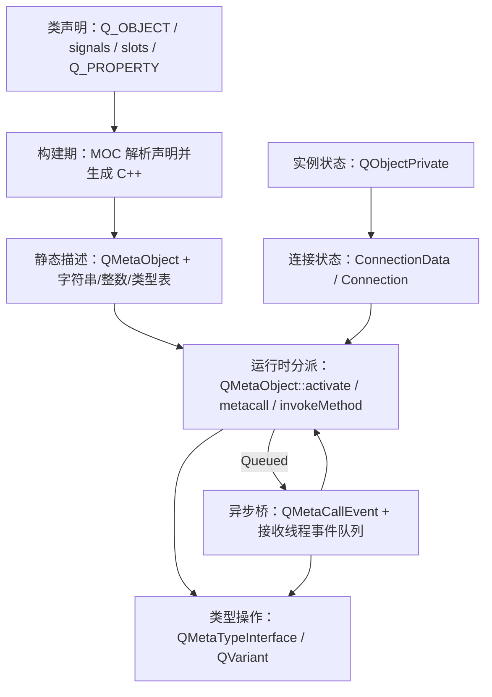
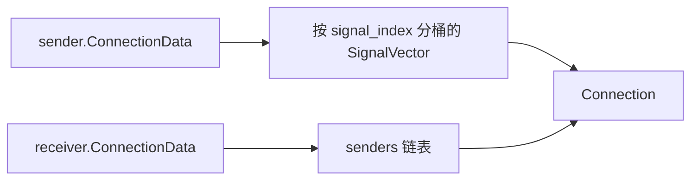

# 2. QObject、MOC 与元对象系统

> 适用源码：QtBase 6.10.2（版本见 [`.cmake.conf`](https://github.com/qt/qtbase/blob/v6.10.2/.cmake.conf)）<br>
> 本文定位：第 4～5 周的机制主线。目标不是会写 `connect()`，而是能从 `Q_OBJECT`、MOC 生成物一路追到连接表、信号激活、跨线程事件和运行时类型操作。

## 2.1 完成本阶段后，你应能回答什么

读完本文并完成实验后，应能用源码解释：

1. `QObject` 为什么不能复制，父子关系为什么不只是一个便利的所有权容器？
2. `Q_OBJECT` 宏向类声明了什么，MOC 又补上了哪些定义？
3. Qt 6.10.2 的 `moc_*.cpp` 为什么与旧文章里的 `qt_meta_data_*` 长得不同？
4. `staticMetaObject`、`metaObject()`、`qt_static_metacall()`、`qt_metacall()` 各负责什么？
5. 本类方法索引、继承后的绝对方法索引和信号索引为什么不能混用？
6. 一次类型安全的 `connect()` 如何变成双方对象上的连接节点？
7. `emit valueChanged(42)` 为什么是普通函数调用，又如何进入 `QMetaObject::activate()`？
8. Direct、Queued、BlockingQueued 和 Auto 到底按什么条件分流？
9. 跨线程信号槽为什么要求参数可复制，事件循环又在哪一步参与？
10. sender、receiver 或 context 销毁时，连接和已排队调用分别怎样处理？
11. `QMetaObject::invokeMethod()`、`QMetaProperty`、`QVariant` 和 `QMetaType` 如何组成运行时调用与类型擦除？
12. `QProperty`/`QBindable` 的依赖跟踪与传统 NOTIFY 信号有什么不同？

建议先读 2.2～2.9 建立完整调用模型，再做 2.12 的实验。最后用 2.15 的问题自测。

---

## 2.2 先建立总图：Qt 在标准 C++ 之外补了什么

标准 C++ 已有虚函数、RTTI、模板和函数指针，但它没有直接提供 Qt 所需的整套运行时协议：

- 按名称枚举和调用方法；
- 按名称读写属性；
- 把一个对象的通知连接到另一个对象或可调用对象；
- 在接收者线程中延迟执行调用；
- 在对象销毁时自动切断连接；
- 让一个保存任意类型的容器知道如何复制、移动和销毁该值。

Qt 把这些职责分成三层，而不是塞进 `QObject` 一个类中：



最重要的边界是：

- **MOC 不修改 C++ 语言。** 它读取 Qt 标记并生成另一份普通 C++ 源文件。
- **元对象主要是类级静态描述。** 每个普通实例不会复制一整份方法表。
- **连接是对象级运行时状态。** 同一个类的两个实例可以拥有完全不同的连接关系。
- **跨线程调用最终是事件。** 元对象负责描述“调用什么”，事件循环负责决定“何时在目标线程执行”。

这也是 Qt 信号槽比传统 Observer 更完整的原因：它同时规定类型、生命周期、线程切换和分派方式。

---

## 2.3 `QObject` 是身份对象，也是生命周期协议

### 2.3.1 为什么禁止复制

[`QObject`](https://github.com/qt/qtbase/blob/v6.10.2/src/corelib/kernel/qobject.h) 使用 `Q_DISABLE_COPY(QObject)`。复制它无法给出一致答案：

- 新对象是否复制原对象的连接？
- 子对象应转移、复制，还是继续归原对象？
- 已投递给原对象的事件是否也投递给副本？
- 新对象属于哪个线程？
- `QPointer`、动态属性、定时器和 object name 如何处理？

这些状态描述“同一个持续存在的实体”，不是一个可替换的值。`QObject *` 的地址和生命周期因此具有语义；这与上一章的 `QString` 值语义正好相反。

### 2.3.2 父子树是 Composite，也是单一所有权协议

构造时传入 parent 或调用 `setParent()` 后，子对象进入 parent 的 `children` 列表。parent 析构时，[`QObjectPrivate::deleteChildren()`](https://github.com/qt/qtbase/blob/v6.10.2/src/corelib/kernel/qobject.cpp) 逐个删除子对象。

实现没有直接使用 `qDeleteAll(children)`。删除某个 child 时，child 的析构函数可能删除兄弟对象；Qt 会先记录 `currentChildBeingDeleted`，并把已处理位置置空，从而避免重复删除。测试 [`childDeletesItsSibling()`](https://github.com/qt/qtbase/blob/v6.10.2/tests/auto/corelib/kernel/qobject/tst_qobject.cpp) 专门覆盖了这个重入边界。

父子关系同时约束线程：

- parent 与 child 必须拥有相同线程亲和性；
- 有 parent 的对象不能单独 `moveToThread()`；
- 移动一个无 parent 对象时，它的 QObject 子树一起移动；
- 普通 C++ 成员不会自动成为 QObject child，必须显式建立 parent 关系。

因此，对象树不是任意引用图。它表达“谁负责删除谁”和“哪些对象必须一起迁移线程”。非 owning 关系应使用普通指针、`QPointer` 或连接，而不是滥用 parent。

### 2.3.3 析构时实际清理什么

[`QObject::~QObject()`](https://github.com/qt/qtbase/blob/v6.10.2/src/corelib/kernel/qobject.cpp) 的主路径可以压缩为：

```text
标记 wasDeleted，清理属性绑定状态
    ↓
使 QWeakPointer/QPointer 观察到对象失效
    ↓
即使 blockSignals(true)，仍允许发出 destroyed(this)
    ↓
断开本对象作为 sender 的所有连接
    ↓
断开本对象作为 receiver/context 的所有连接
    ↓
令当前连接代号失效，使正在进行的 activate 跳过失效节点
    ↓
删除 children，从 parent 中移除自己
    ↓
QObjectPrivate 析构时移除该对象尚未处理的 posted events
```

几个实践结论：

1. sender、receiver 或带 context 的 functor 中任一生命周期结束，相关连接会失效。
2. `destroyed()` 不受 `blockSignals()` 抑制。
3. 销毁 receiver 会移除发给它、尚未执行的 posted events。
4. **仅调用 `disconnect()` 不会撤回已经入队的 `QMetaCallEvent`。** [`disconnectQueuedConnection_pendingEventsAreDelivered()`](https://github.com/qt/qtbase/blob/v6.10.2/tests/auto/corelib/kernel/qobject/tst_qobject.cpp) 明确验证：先 emit、再 disconnect，已入队调用仍会执行。
5. 在事件处理或跨线程场景中，`deleteLater()` 通常比立即 `delete` 安全，因为它把销毁放在对象所属线程的 DeferredDelete 事件上。

---

## 2.4 `Q_OBJECT` 与 MOC：声明、生成、链接

### 2.4.1 宏本身并没有生成元数据

Qt 6.10.2 的宏位于 [`qtmetamacros.h`](https://github.com/qt/qtbase/blob/v6.10.2/src/corelib/kernel/qtmetamacros.h)。`Q_OBJECT` 主要向类中声明：

```cpp
static const QMetaObject staticMetaObject;
virtual const QMetaObject *metaObject() const;
virtual void *qt_metacast(const char *);
virtual int qt_metacall(QMetaObject::Call, int, void **);
static void qt_static_metacall(QObject *, QMetaObject::Call, int, void **);
```

它还声明生成 constexpr 元数据所需的模板成员和 `QPrivateSignal`。真正的定义由 MOC 写进生成文件。

其他宏的分工：

| 标记 | C++ 编译器看到什么 | MOC 记录什么 |
|---|---|---|
| `Q_OBJECT` | 元对象函数和静态成员声明 | 这是 QObject 派生类，生成完整实例元对象支持 |
| `Q_GADGET` | 静态元对象相关声明，无 QObject 虚接口 | 为普通值类生成枚举、属性、方法等静态元数据 |
| `Q_PROPERTY(...)` | 通常是编译器注解或空标记 | 属性名、类型、READ/WRITE/NOTIFY/BINDABLE 等 |
| `Q_SIGNALS` / `signals` | `public` 加注解 | 后续函数属于信号列表 |
| `Q_SLOTS` / `slots` | 访问说明符加注解 | 后续函数属于槽列表 |
| `Q_INVOKABLE` | 函数注解 | 方法可通过元对象调用 |
| `Q_ENUM` | 注解并生成查找 metaobject/name 的友元 | 枚举键和值进入元数据 |
| `emit` / `Q_EMIT` | 展开为空 | 不参与运行时，主要表达意图 |

`emit` 展开为空意味着 `emit valueChanged(v);` 在 C++ 层面就是 `valueChanged(v);`。信号函数的函数体不是你写的，而是 MOC 生成的。

### 2.4.2 构建链

使用 CMake `AUTOMOC` 时，构建链是：

```text
扫描 target 源文件和头文件
    ↓
发现 Q_OBJECT / Q_GADGET 等标记
    ↓
moc 预处理并解析类声明
    ↓
生成 moc_Class.cpp 或包含式的 source.moc
    ↓
把生成文件作为普通 C++ 编译
    ↓
与业务目标一起链接
```

若链接时报 `undefined reference to vtable for ...`、`unresolved external symbol ...::staticMetaObject`，通常不是虚函数本身有问题，而是 MOC 没运行、生成文件没加入目标，或声明 `Q_OBJECT` 的头文件没有被 target 看见。

### 2.4.3 Qt 6.10.2 生成物的时代差异

旧文章常展示：

```cpp
qt_meta_stringdata_MyObject_t
qt_meta_data_MyObject[]
```

Qt 6.10.2 的 [`Generator::generateCode()`](https://github.com/qt/qtbase/blob/v6.10.2/src/tools/moc/generator.cpp) 已主要生成：

```cpp
QtMocHelpers::StringRefStorage qt_stringData { ... };
QtMocHelpers::UintData qt_methods { ... };
QtMocHelpers::UintData qt_properties { ... };
return QtMocHelpers::metaObjectData<...>(...);
```

随后以 constexpr 内容初始化 `staticMetaObject`。概念没有变：仍是字符串表、整数描述表、元类型表和分派函数；变化的是生成代码把更多布局工作交给 [`qtmochelpers.h`](https://github.com/qt/qtbase/blob/v6.10.2/src/corelib/kernel/qtmochelpers.h) 在编译期完成。阅读旧资料时应迁移概念，不要机械寻找已改名的数组。

---

## 2.5 一份 `moc_*.cpp` 的解剖图

对一个含信号、槽和属性的类，生成物可按五块理解。

### 2.5.1 constexpr 描述表

`qt_create_metaobjectdata<Tag>()` 构造：

- 类名、方法名、参数名等字符串；
- 信号、槽、普通 invokable 的条目；
- 属性和枚举条目；
- 参数及属性对应的 `QMetaType` 接口。

MOC 会先放信号，再放槽和普通方法，因为信号需要一段紧凑、稳定的类内信号编号空间。

### 2.5.2 `staticMetaObject`

其核心内容可概括为：

```text
superdata        → 父类 staticMetaObject
stringdata       → 名称字符串
data             → 方法/属性/枚举的整数描述
static_metacall  → 本类的静态分派入口
relatedMetaObjects
metaTypes        → 参数和属性的运行时类型操作
dynamicMetaObjectData
```

`staticMetaObject` 描述“这个类是什么”。普通对象的 `metaObject()` 通常返回它；若对象挂有动态元对象，则先返回动态描述。

### 2.5.3 `qt_static_metacall()`

它把“调用类别 + 本类局部索引 + `void **` 参数数组”翻译成真正的 C++ 调用：

```cpp
switch (_id) {
case 0: _t->valueChanged((*reinterpret_cast<int *>(_a[1]))); break;
case 1: _t->setValue((*reinterpret_cast<int *>(_a[1]))); break;
default: break;
}
```

同一个入口也处理 `ReadProperty`、`WriteProperty`、`BindableProperty`、`IndexOfMethod` 等 `QMetaObject::Call`。它是生成代码与运行时通用算法之间的适配层。

### 2.5.4 `qt_metacall()` 与继承索引

生成的 `qt_metacall()` 先把调用交给父类：

```text
_id = Super::qt_metacall(call, _id, argv)
    ↓
若 _id < 0，父类已处理
    ↓
若落在本类区间，qt_static_metacall(this, call, localId, argv)
    ↓
减去本类条目数，把剩余 id 交给更派生层
```

由此要分清三种编号：

| 编号 | 含义 | 常见获得方式 |
|---|---|---|
| 本类局部方法 id | 仅在当前 MOC 生成的 switch 中有效 | `qt_static_metacall()` 的 `_id` |
| 绝对 method index | 把所有父类方法计入后的索引 | `indexOfMethod()`、`QMetaMethod::methodIndex()` |
| 内部 signal index | 面向连接表的紧凑信号编号 | `signalOffset()` 与内部转换函数 |

`methodOffset()` 是父类方法总数，`methodCount()` 是继承链上可见方法总数。不要把 `indexOfSignal()` 的返回值直接当作 `qt_static_metacall()` 的局部 switch 编号。

### 2.5.5 信号函数

MOC 为每个信号生成真实函数体。它把参数地址放进 `void *` 数组，再调用 `QMetaObject::activate()`：

```text
MyObject::valueChanged(int value)
    ↓
argv = { return-slot/null, &value }
    ↓
QMetaObject::activate(this, &staticMetaObject, localSignalIndex, argv)
```

到这里，编译期生成部分结束；之后进入 QObject 的运行时连接系统。

---

## 2.6 `connect()`：从类型检查到双向连接节点

推荐使用函数指针语法：

```cpp
QObject::connect(sender, &Sender::valueChanged,
                 receiver, &Receiver::setValue,
                 Qt::AutoConnection);
```

模板层先在编译期检查：

- sender 类有 `Q_OBJECT`；
- signal 参数不少于 slot 所需参数；
- 参数和返回类型兼容；
- `UniqueConnection` 的目标必须可比较，普通 lambda 不满足该约束。

随后 [`QObject::connectImpl()`](https://github.com/qt/qtbase/blob/v6.10.2/src/corelib/kernel/qobject.cpp) 通过生成的 `IndexOfMethod` 分支找到 signal 的类内编号，再转换为继承链上的内部信号编号。真正分配节点的是 [`QObjectPrivate::connectImpl()`](https://github.com/qt/qtbase/blob/v6.10.2/src/corelib/kernel/qobject.cpp)。

一个 `Connection` 记录的核心状态包括：

```text
sender
receiver（原子指针）
receiverThreadData
signal_index
connectionType
slotObj 或 static metacall + method offset/relative id
queued 参数类型表
single-shot / unique 相关状态
引用计数和链表指针
```

同一节点同时参与两套索引：



- sender 侧按信号查找，服务高频 emit；
- receiver 侧反向列出所有入边，服务 receiver 析构时自动断开。

连接修改需要同时考虑 sender 和 receiver。实现用固定顺序获取双方的 signal-slot mutex，避免两个线程交叉 connect/disconnect 时产生锁顺序死锁。移除的节点先进入 orphaned 列表，待没有激活过程引用旧连接表时再清理。

连接默认按建立顺序遍历。`doActivate()` 在开始时记录 `highestConnectionId`，本次 emit 期间新增的连接不会被本次信号“顺便”调用；在 slot 中断开或删除对象时，原子 receiver 指针和延迟回收让遍历继续保持有效。

---

## 2.7 `emit` 到 slot 的完整同步主链

以 `emit sender.valueChanged(42)` 为例：

```text
MOC 生成的 Sender::valueChanged(42)
    ↓
QMetaObject::activate(sender, signalIndex, argv)
    ↓
doActivate()
    ↓
检查 blockSignals、声明式连接和 signal spy
    ↓
定位 sender 的 signal-specific ConnectionList
    ↓
逐个读取 Connection，检查 receiver 是否仍有效
    ↓
按 connectionType 和接收者线程分流
    ├─ Direct：SlotObject::call / static_metacall / metacall
    ├─ Queued：queued_activate → QMetaCallEvent → postEvent
    └─ BlockingQueued：postEvent → semaphore.acquire
```

Direct 路径没有事件循环。slot 在 emit 所在线程、emit 的调用栈中同步执行。因此：

- slot 执行完成前，emit 不返回；
- slot 可以重入 sender；
- slot 可以断开连接、删除 receiver，甚至删除 sender；
- 异常不应穿过 Qt 的事件边界；
- 若强制 Direct 调用另一个线程亲和对象的方法，线程安全责任完全由调用者承担。

`QObject::sender()` 依赖激活期间临时安装的 `QObjectPrivate::Sender` 上下文。它只适合局部诊断或兼容代码，不适合长期保存；嵌套 emit、跨线程和对象销毁都会改变其有效上下文。

---

## 2.8 四种连接类型：判定依据和失败方式

| 类型 | slot 在哪里执行 | emit 是否等待 | 是否依赖目标事件循环 | 主要风险 |
|---|---|---:|---:|---|
| `DirectConnection` | 当前发射线程 | 是 | 否 | 跨线程直接访问、重入、长 slot 阻塞 sender |
| `QueuedConnection` | receiver 所属线程 | 否 | 是 | 参数复制、延迟、目标线程不跑循环时永不执行 |
| `BlockingQueuedConnection` | receiver 所属线程 | 是 | 是 | 同线程必然死锁；目标线程阻塞/退出也会卡住 |
| `AutoConnection` | emit 时动态选择 Direct 或 Queued | 动态 | 动态 | 误以为它只比较 sender/receiver affinity |

### 2.8.1 Auto 比较的是“当前发射线程”和 receiver

[`doActivate()`](https://github.com/qt/qtbase/blob/v6.10.2/src/corelib/kernel/qobject.cpp) 读取 `QThread::currentThreadId()`，再与 receiver 的 `threadData->threadId` 比较：

```text
当前 emit 所在线程 == receiver 所属线程 → Direct
当前 emit 所在线程 != receiver 所属线程 → Queued
```

它不是简单比较 `sender->thread() == receiver->thread()`。测试 [`autoConnectionBehavior()`](https://github.com/qt/qtbase/blob/v6.10.2/tests/auto/corelib/kernel/qobject/tst_qobject.cpp) 故意从第三个线程调用 sender 的 signal：即使 sender 与 receiver 亲和性相同，只要当前发射线程不同，Auto 仍排队。

这解释了一个常见现象：同一条连接在 receiver `moveToThread()` 后会改变执行方式，因为 Auto 在每次 emit 时重新判断。

### 2.8.2 Queued 为什么必须复制参数

emit 返回后，原调用栈上的参数可能立刻失效。`queued_activate()` 因而：

1. 取得每个参数的 `QMetaType`；
2. 分配 `QMetaCallEvent`；
3. 用 `QMetaType::create()` 把参数复制进事件拥有的存储；
4. `postEvent(receiver, event)`；
5. receiver 线程处理 `QEvent::MetaCall` 时调用 `placeMetaCall()`；
6. 事件析构时按对应元类型销毁副本。

所以 queued 参数必须拥有可用的运行时类型描述和复制语义。非 const 引用无法表达“稍后修改发射方栈变量”，队列调用应使用值、const 值视图的拥有型替代物，或明确共享对象协议。

### 2.8.3 BlockingQueued 不是“更可靠的 Queued”

BlockingQueued 只是在线程间加入一个 semaphore：sender 投递事件后等待，receiver 执行完调用再释放。它适合极少数必须同步取得结果的线程边界，不适合作为默认 RPC。

绝对不要在 receiver 与当前线程相同的情况下使用。源码会报警，但仍进入等待路径，结果是死锁。目标线程没有运行事件循环、正在等待 sender，或已经准备退出，也会形成等待环。

---

## 2.9 生命周期、排队与重入的精确边界

把常见情况分开判断：

| 时刻/动作 | 后续结果 |
|---|---|
| emit 前 receiver/context 已销毁 | 连接已自动断开，不调用 |
| Direct slot 执行中 receiver 删除自己 | 当前调用可返回，后续遍历跳过失效连接；业务代码不能再访问该对象 |
| Queued 事件入队前 receiver 被断开 | 不再创建新事件 |
| Queued 事件已入队，随后仅 disconnect | 已入队事件通常仍执行 |
| Queued 事件已入队，随后 receiver 析构 | QObjectPrivate 析构移除发给该对象的 posted events |
| emit 期间新增连接 | `highestConnectionId` 使它从下一次 emit 才生效 |
| emit 期间移除连接 | 当前遍历通过 receiver 空指针/孤儿节点机制跳过 |
| contextless lambda 捕获外部裸指针 | Qt 无法推断被捕获对象生命周期，容易悬空 |

建议为 lambda 提供 context：

```cpp
connect(source, &Source::ready, owner,
        [owner] { owner->consume(); });
```

这样 `owner` 销毁会使连接失效，并决定 Auto/Queued 的目标线程。context 不是装饰参数，而是 functor 的生命周期锚点和线程锚点。

若“取消”必须撤销已排队工作，仅 disconnect 不够。可使用 generation/token，在 slot 开始时检查是否仍为最新任务；或者销毁专用 receiver，让其 posted events 一并被移除。

---

## 2.10 运行时反射：`QMetaObject`、`QMetaMethod` 与 `invokeMethod()`

### 2.10.1 查询接口

```cpp
const QMetaObject *mo = object->metaObject();
qInfo() << mo->className();

for (int i = mo->methodOffset(); i < mo->methodCount(); ++i) {
    const QMetaMethod method = mo->method(i);
    qInfo() << method.methodIndex() << method.methodSignature()
            << method.methodType();
}
```

从 `methodOffset()` 开始只列本类新增方法；从 0 开始会包含继承方法。属性、枚举和 class info 也分别有 offset/count 与索引查询接口。

`qobject_cast<T *>` 通过 `qt_metacast()` 和元对象继承链识别 QObject 类型，不依赖标准 C++ RTTI 的开启状态。它仍要求目标 QObject 类正确包含 `Q_OBJECT`。

### 2.10.2 调用接口

Qt 6 可按名称、成员函数指针或 functor 调用：

```cpp
QString result;
bool ok = QMetaObject::invokeMethod(
    worker,
    "describe",
    Qt::DirectConnection,
    qReturnArg(result),
    QStringLiteral("job-42"));
```

名称式调用会查找签名并进入 `QMetaMethod::invoke()`；模板/functor 重载可在编译期保存更强的类型信息。最终仍按 connection type 分流：

- Direct：立即执行 callable 或 metacall；
- Queued：复制参数，投递 `QMetaCallEvent`；
- BlockingQueued：投递后等待 semaphore。

Queued 调用不能把返回值异步写回一个已经离开作用域的地址，因此源码明确拒绝 queued return value。若需要异步结果，使用返回信号、回调 context、`QPromise/QFuture`，或设计请求/响应消息。

### 2.10.3 `void **argv` 不是无类型乱传

元调用边界使用 `void **`，但描述表同时给出参数的 `QMetaType`。生成的 `qt_static_metacall()` 知道每个位置应恢复成什么 C++ 类型。这里的 type erasure 是“把具体类型操作放进描述对象”，不是放弃类型规则。

---

## 2.11 `QMetaType` 与 `QVariant`：类型擦除的运行时底座

[`QMetaTypeInterface`](https://github.com/qt/qtbase/blob/v6.10.2/src/corelib/kernel/qmetatype.h) 为每个类型保存：

- revision、size、alignment、flags 和 type id；
- 类型名称和可选的 `QMetaObject`；
- 默认构造、复制构造、移动构造、析构函数指针；
- equals、less-than、debug stream 和 data stream 函数指针。

可把它理解为一张按类型生成的手工虚表：

```text
未知 T 的地址 + QMetaTypeInterface(T)
    ↓
知道占多少字节、如何对齐
知道如何复制/移动/销毁
知道是否能比较、打印、序列化
知道是否关联 QObject/Gadget 元对象
```

`QVariant` 再把“类型描述 + 值存储”组合起来。小且适合的值可内联存放，其他值放在独立存储中；无论位置如何，构造和销毁都经元类型接口完成。

自定义类型常见步骤：

```cpp
struct Reading {
    int channel;
    double value;
};
Q_DECLARE_METATYPE(Reading)
```

`Q_DECLARE_METATYPE` 让模板系统知道如何取得该类型的元类型。按字符串进行运行时查找、旧式连接或某些跨模块场景还需要在启动阶段调用 `qRegisterMetaType<Reading>("Reading")`。Qt 6 的许多模板 API 会自动注册完整类型，但这不消除两个前提：类型必须在实例化点完整，queued 传值必须可复制。

把职责分开记：

- `QMetaObject` 描述某个类有哪些方法、属性和枚举；
- `QMetaType` 描述某个值类型如何在不知道 `T` 的代码中生存；
- `QVariant` 是一个实际持有任意已知元类型值的容器；
- `QMetaCallEvent` 用元类型复制并持有一次延迟调用的参数。

---

## 2.12 `Q_PROPERTY`、`QProperty` 与 `QBindable`

### 2.12.1 传统元属性

```cpp
Q_PROPERTY(int value READ value WRITE setValue NOTIFY valueChanged)
```

MOC 把声明写入元数据。`QMetaProperty::read()`/`write()` 最终经 `qt_static_metacall()` 调用 getter/setter。NOTIFY 只是关联一个变化信号；Qt 不会替普通成员自动判断值是否改变，setter 应自行避免无效通知：

```cpp
void setValue(int value)
{
    if (m_value == value)
        return;
    m_value = value;
    emit valueChanged(m_value);
}
```

`QObject::setProperty()` 返回 `true` 表示写中了已有元属性；返回 `false` 也可能已经成功设置动态属性。动态属性存于实例的额外数据中，并同步发送 `QDynamicPropertyChangeEvent`，不能把返回 `false` 一律解释为失败。

### 2.12.2 响应式绑定

`QProperty<T>` 把值、binding 和 observer 协议组合起来：

```cpp
QProperty<int> width(10);
QProperty<int> height(20);
QProperty<int> area;

area.setBinding([&] { return width.value() * height.value(); });
```

绑定求值期间，Qt 在当前线程的 binding evaluation state 中记录“正在计算 area”。读取 width/height 时，[`registerDependency_helper()`](https://github.com/qt/qtbase/blob/v6.10.2/src/corelib/kernel/qproperty.cpp) 把它们登记为依赖；依赖变化后，observer 链触发重新求值。

```text
求值 area binding
    ↓
读取 width、height → 自动登记依赖边
    ↓
width 变化 → 通知 observer
    ↓
area binding 重新求值
    ↓
area 值变化 → 继续通知下游
```

`QBindable<T>` 是面向属性的类型安全句柄，可查询/替换 binding、订阅变化，并让 `QMetaProperty` 通过 BINDABLE 访问属性。QObject 属性通常用 `Q_OBJECT_BINDABLE_PROPERTY`、`Q_OBJECT_COMPAT_PROPERTY` 等宏把旧式 setter/NOTIFY 语义与 binding storage 接起来。

重要边界：

- 手工给 `QProperty` 赋值通常会移除其现有 binding；
- binding 依赖是求值时动态捕获的，条件分支改变时依赖集合也会变化；
- 循环 binding 会产生 binding error，而不是合法的反馈回路；
- 属性绑定不是通用跨线程同步机制。源码使用线程局部求值状态，并刻意避免把另一个线程的读取错误登记为当前 binding 依赖。

信号槽适合离散事件和对象间消息；property binding 适合“这个值由哪些值计算得出”。不要用每次点击信号重建一个属性图，也不要用层层 NOTIFY 手工模拟纯计算依赖。

---

## 2.13 实践：生成 MOC 文件并观察四种调用路径

本实验会得到三个可见结果：MOC 生成代码、元对象枚举输出，以及 Direct/Queued/Auto 的执行顺序。

### 2.13.1 `probe.h`

```cpp
#pragma once

#include <QObject>
#include <QString>
#include <utility>

class Probe final : public QObject
{
    Q_OBJECT
    Q_PROPERTY(int value READ value WRITE setValue NOTIFY valueChanged)

public:
    explicit Probe(QString name, QObject *parent = nullptr)
        : QObject(parent), m_name(std::move(name)) {}

    int value() const { return m_value; }

    Q_INVOKABLE QString describe(const QString &prefix) const
    {
        return prefix + QLatin1Char(':') + m_name
               + QLatin1Char(':') + QString::number(m_value);
    }

public slots:
    void setValue(int value);
    void observe(int value);

signals:
    void valueChanged(int value);

private:
    QString m_name;
    int m_value = 0;
};
```

### 2.13.2 `probe.cpp`

```cpp
#include "probe.h"

#include <QDebug>
#include <QThread>

void Probe::setValue(int value)
{
    if (m_value == value)
        return;
    m_value = value;
    qInfo() << "emit thread" << QThread::currentThreadId() << value;
    emit valueChanged(value);
}

void Probe::observe(int value)
{
    qInfo() << objectName() << "slot thread"
            << QThread::currentThreadId() << value;
}
```

### 2.13.3 `main.cpp`

```cpp
#include "probe.h"

#include <QCoreApplication>
#include <QDebug>
#include <QMetaMethod>
#include <QThread>

int main(int argc, char *argv[])
{
    QCoreApplication app(argc, argv);

    Probe source(QStringLiteral("source"));
    source.setObjectName(QStringLiteral("source"));

    Probe local(QStringLiteral("local"));
    local.setObjectName(QStringLiteral("local"));

    QObject::connect(&source, &Probe::valueChanged,
                     &local, &Probe::observe, Qt::DirectConnection);
    QObject::connect(&source, &Probe::valueChanged,
                     &local, &Probe::observe, Qt::QueuedConnection);

    qInfo() << "before setValue";
    source.setValue(1);
    qInfo() << "after setValue, before processEvents";
    QCoreApplication::processEvents();
    qInfo() << "after processEvents";

    const QMetaObject *mo = source.metaObject();
    qInfo() << "class" << mo->className()
            << "methodOffset" << mo->methodOffset()
            << "methodCount" << mo->methodCount();
    for (int i = mo->methodOffset(); i < mo->methodCount(); ++i)
        qInfo() << i << mo->method(i).methodSignature();

    QString description;
    const bool invoked = QMetaObject::invokeMethod(
        &source, "describe", Qt::DirectConnection,
        qReturnArg(description), QStringLiteral("state"));
    qInfo() << "invoke" << invoked << description;

    QThread workerThread;
    auto *remote = new Probe(QStringLiteral("remote"));
    remote->setObjectName(QStringLiteral("remote"));
    remote->moveToThread(&workerThread);
    QObject::connect(&workerThread, &QThread::finished,
                     remote, &QObject::deleteLater);
    QObject::connect(&source, &Probe::valueChanged,
                     remote, &Probe::observe, Qt::AutoConnection);

    workerThread.start();
    source.setValue(2); // Auto：当前线程 != remote 所属线程，因此排队

    // 作为队列屏障：前面的 observe 执行后，这个阻塞调用才返回。
    QMetaObject::invokeMethod(remote, [] {
        qInfo() << "worker barrier" << QThread::currentThreadId();
    }, Qt::BlockingQueuedConnection);

    workerThread.quit();
    workerThread.wait();
    return 0;
}
```

### 2.13.4 `CMakeLists.txt`

```cmake
cmake_minimum_required(VERSION 3.21)
project(qobject_lab LANGUAGES CXX)

set(CMAKE_CXX_STANDARD 20)
set(CMAKE_CXX_STANDARD_REQUIRED ON)
set(CMAKE_AUTOMOC ON)

find_package(Qt6 6.10 REQUIRED COMPONENTS Core)

add_executable(qobject_lab
    main.cpp
    probe.cpp
    probe.h
)
target_link_libraries(qobject_lab PRIVATE Qt6::Core)
```

### 2.13.5 构建与检查

```powershell
cmake -S . -B build -G Ninja -DCMAKE_PREFIX_PATH=C:\Qt\6.10.2\msvc2022_64
cmake --build build --verbose
.\build\qobject_lab.exe
```

找到生成文件：

```powershell
Get-ChildItem -Recurse build -Filter 'moc_probe.cpp'
```

打开它后逐项定位：

1. `qt_create_metaobjectdata` 中的字符串、方法和属性描述；
2. `Probe::staticMetaObject` 的父对象链接；
3. `qt_static_metacall()` 中 signal、slot、invokable 和 property 分支；
4. `qt_metacall()` 先调用 `QObject::qt_metacall()`，再减去本类条目数；
5. `Probe::valueChanged(int)` 调用 `QMetaObject::activate()`。

运行顺序应体现：Direct slot 出现在 `after setValue` 之前，Queued slot 在 `processEvents()` 中出现，remote 的 Auto slot 在 worker 线程出现。线程 id 的具体数值每次运行可能不同。

### 2.13.6 调试断点

按顺序设置断点：

```text
Probe::valueChanged
QMetaObject::activate / doActivate
queued_activate
QCoreApplication::postEvent
QObject::event（QEvent::MetaCall 分支）
QMetaCallEvent::placeMetaCall
Probe::observe
```

再分别切换 `DirectConnection`、`QueuedConnection`、`AutoConnection`。BlockingQueued 只在 remote 位于已运行的 worker 线程时测试，绝不要改成 local。

---

## 2.14 设计取舍与常见误区

### 误区 1：“MOC 是另一个 C++ 编译器”

MOC 只识别 Qt 所需的一部分声明并生成 C++。最终语义仍由普通编译器、链接器和 Qt 运行库完成。

### 误区 2：“`emit` 把消息放进队列”

`emit` 是空宏。是否入队由每条连接在 `doActivate()` 中独立决定；一个 signal 的不同 receiver 可以同时走 Direct 和 Queued。

### 误区 3：“Auto 比较 sender 和 receiver 是否属于同一线程”

它比较 emit 当前线程与 receiver 所属线程。测试从第三个线程发射信号就是为了防止这个错误模型。

### 误区 4：“disconnect 能取消所有未执行 slot”

它阻止未来创建调用，但已入队的 `QMetaCallEvent` 已拥有 callable 和参数副本，仍可能执行。需要业务取消令牌或销毁接收对象。

### 误区 5：“QObject parent 等于 shared ownership”

parent 是单向删除协议。它不增加引用计数，也不允许多个 owner。观察者若需要自动失效指针，应使用 `QPointer`；共享所有权需另行设计。

### 误区 6：“Queued 让任意参数自动线程安全”

Queued 只复制参数并切换执行线程。若参数内部共享可变对象或裸指针，副本仍可能指向同一状态，数据竞争并不会消失。

### 误区 7：“BlockingQueued 能保证调用一定成功”

它只保证等待 receiver 执行完成。receiver 不处理事件、等待 sender 或已经停止时，保证会退化成死锁或无限等待。

### 误区 8：“有 `Q_OBJECT` 就自动有属性”

`Q_OBJECT` 提供元对象入口；属性还需 `Q_PROPERTY` 或动态属性。普通 getter/setter 不会自动进入 `QMetaObject`。

### 误区 9：“`Q_PROPERTY NOTIFY` 就是响应式绑定”

NOTIFY 只声明变化信号。`QProperty` binding 还会在求值期间捕获依赖、维护 observer 链并重新计算，两者抽象层次不同。

### 误区 10：“元对象索引就是函数在源码中的顺序”

MOC 会先排列信号，继承又引入 offset；局部 id、绝对 method index、signal index 也各有用途。应通过 API 查询，不要硬编码数字。

---

## 2.15 自测题与答案要点

### 问题 1

为什么同一个 sender 和 receiver 的 AutoConnection，可能因为信号从第三个线程发射而从 Direct 变成 Queued？

<details>
<summary>答案要点</summary>

Auto 在每次 emit 时比较当前发射线程 id 与 receiver 的线程 id，不比较 sender affinity。第三线程与 receiver 不同，因此入队。

</details>

### 问题 2

为什么 queued 调用不能安全传递 `T &` 并期望稍后修改原变量？

<details>
<summary>答案要点</summary>

emit 返回后原变量可能离开作用域。Queued 必须把参数复制进事件拥有的存储；非 const 引用所表达的别名和回写语义无法跨越这个时间边界。

</details>

### 问题 3

为什么 receiver 析构可以自动断开所有 sender，而只在 sender 侧按信号存连接不够？

<details>
<summary>答案要点</summary>

连接节点同时挂入 receiver 的 senders 链。receiver 析构可枚举所有入边，到对应 sender 的连接表中移除节点，而不必扫描全局对象。

</details>

### 问题 4

`disconnect()` 后为什么一个 queued slot 仍可能执行，而 receiver 析构后通常不会？

<details>
<summary>答案要点</summary>

已创建的 `QMetaCallEvent` 已经独立持有 callable 和参数。disconnect 只移除连接；QObjectPrivate 析构还会从对象所属线程的 posted-event 列表移除发给该对象的未处理事件。

</details>

### 问题 5

`QMetaObject` 和 `QMetaType` 的核心差别是什么？

<details>
<summary>答案要点</summary>

前者描述一个类的可反射成员和继承关系；后者描述一个具体值类型的大小、对齐及构造、复制、销毁等操作。一次元调用需要二者协作。

</details>

### 问题 6

MOC 为什么要让生成的 `qt_metacall()` 先调用父类，再对 id 做减法？

<details>
<summary>答案要点</summary>

这样一个绝对索引可以沿继承链逐层路由。父类消费自己的区间并返回负数，或把减去父类条目数后的局部候选 id 交给派生类。

</details>

---

## 2.16 推荐源码阅读顺序

按下面顺序读，可以从生成契约逐步进入运行时并发细节：

1. [`src/corelib/kernel/qtmetamacros.h`](https://github.com/qt/qtbase/blob/v6.10.2/src/corelib/kernel/qtmetamacros.h)：展开 `Q_OBJECT`、signals/slots、`Q_PROPERTY` 和 `emit`。
2. [`src/corelib/kernel/qobject.h`](https://github.com/qt/qtbase/blob/v6.10.2/src/corelib/kernel/qobject.h)：确认 QObject 的 public API、禁止复制、connect 模板与属性入口。
3. [`src/tools/moc/generator.cpp`](https://github.com/qt/qtbase/blob/v6.10.2/src/tools/moc/generator.cpp)：跟 `generateCode()`、`generateMetacall()`、`generateStaticMetacall()` 和 `generateSignal()`。
4. [`src/corelib/kernel/qtmochelpers.h`](https://github.com/qt/qtbase/blob/v6.10.2/src/corelib/kernel/qtmochelpers.h)：理解 Qt 6.10 constexpr 元数据布局。
5. 自己生成的 `moc_probe.cpp`：把生成器逻辑映射到一个小类。
6. [`src/corelib/kernel/qmetaobject.cpp`](https://github.com/qt/qtbase/blob/v6.10.2/src/corelib/kernel/qmetaobject.cpp)：读 offset/count、索引查询、`metacall()` 和 `invokeMethodImpl()`。
7. [`src/corelib/kernel/qobject_p_p.h`](https://github.com/qt/qtbase/blob/v6.10.2/src/corelib/kernel/qobject_p_p.h)：画出 `Connection`、`SignalVector`、`ConnectionData`、`Sender` 的关系。
8. [`src/corelib/kernel/qobject.cpp`](https://github.com/qt/qtbase/blob/v6.10.2/src/corelib/kernel/qobject.cpp)：跟 `connectImpl()` → `doActivate()` → `queued_activate()` → `QMetaCallEvent::placeMetaCall()`。
9. 同文件的 `QObject::~QObject()`、`deleteChildren()`、`setParent_helper()`：校准生命周期与重入边界。
10. [`src/corelib/kernel/qmetatype.h`](https://github.com/qt/qtbase/blob/v6.10.2/src/corelib/kernel/qmetatype.h) 与 [`qmetatype.cpp`](https://github.com/qt/qtbase/blob/v6.10.2/src/corelib/kernel/qmetatype.cpp)：读 `QMetaTypeInterface`、construct/destroy/convert。
11. [`src/corelib/kernel/qvariant.cpp`](https://github.com/qt/qtbase/blob/v6.10.2/src/corelib/kernel/qvariant.cpp)：观察类型描述如何管理实际值存储。
12. [`src/corelib/kernel/qproperty.h`](https://github.com/qt/qtbase/blob/v6.10.2/src/corelib/kernel/qproperty.h)、[`qproperty.cpp`](https://github.com/qt/qtbase/blob/v6.10.2/src/corelib/kernel/qproperty.cpp) 与 [`qproperty_p.h`](https://github.com/qt/qtbase/blob/v6.10.2/src/corelib/kernel/qproperty_p.h)：跟 binding 求值、依赖登记和 observer 通知。
13. [`tests/auto/corelib/kernel/qobject/tst_qobject.cpp`](https://github.com/qt/qtbase/blob/v6.10.2/tests/auto/corelib/kernel/qobject/tst_qobject.cpp)：重点读 `autoConnectionBehavior`、`blockingQueuedConnection`、`connectFunctorWithContext`、`childDeletesItsSibling` 和 queued-disconnect 测试。
14. [`tests/auto/corelib/kernel/qmetaobject/tst_qmetaobject.cpp`](https://github.com/qt/qtbase/blob/v6.10.2/tests/auto/corelib/kernel/qmetaobject/tst_qmetaobject.cpp)：重点读 queued/blocking invoke、method index、signal offset 和继承测试。
15. [`tests/auto/corelib/kernel/qproperty/tst_qproperty.cpp`](https://github.com/qt/qtbase/blob/v6.10.2/tests/auto/corelib/kernel/qproperty/tst_qproperty.cpp)：重点读 basic/multiple dependencies、deleted dependency、binding loop 和 thread safety 测试。

建议最终画三张图：

```text
Q_OBJECT → moc → staticMetaObject → qt_static_metacall
connect → ConnectionData → emit → doActivate → slot
Queued → QMetaType::create → QMetaCallEvent → postEvent → receiver event loop
```

完成后，用一句话总结本阶段：

> Qt 用 MOC 把类声明编译成可查询、可分派的静态协议，再用 QObject 的双向连接与生命周期状态、QMetaType 的值操作和事件循环，把普通 C++ 调用扩展成生命周期感知且可跨线程投递的对象通信系统。
