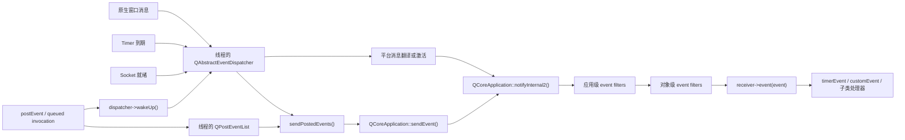
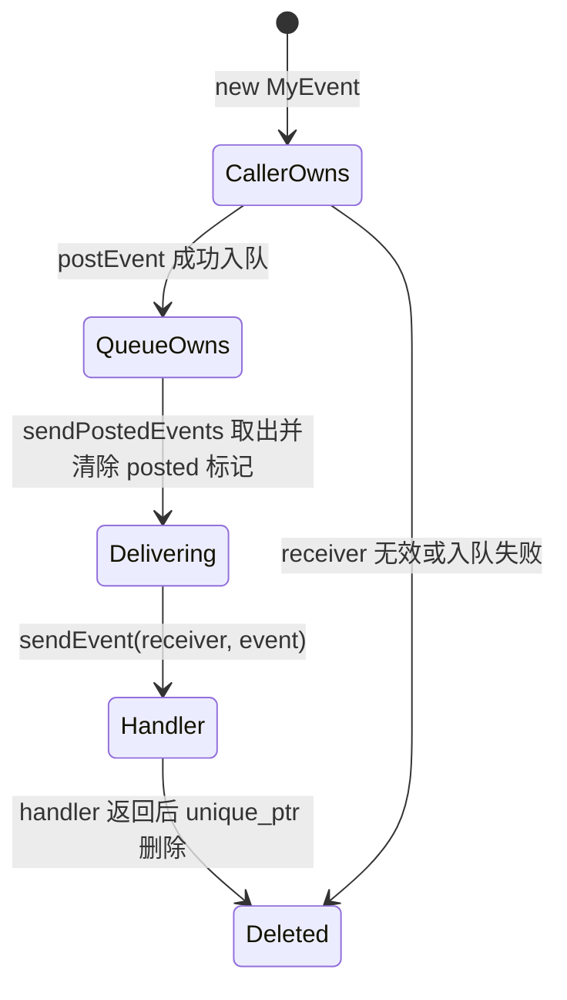

# 3. 事件循环与事件分发

> 适用源码：QtBase 6.10.2（版本见 [`.cmake.conf`](../.cmake.conf)）<br>
> 本文定位：第 6～7 周的机制主线。目标不是只会调用 `app.exec()`，而是能从一个原生消息、定时器、Socket 就绪或 `postEvent()` 一路追到目标对象的 `event()`，并能判断所有权、线程、顺序、重入和销毁边界。<br>
> 路径校正：学习大纲中的 `src/corelib/kernel/qevent.cpp` 在本版本不存在；`QEvent` 的 Core 实现位于 [`qcoreevent.cpp`](../src/corelib/kernel/qcoreevent.cpp)，Gui 事件类型另见 `src/gui/kernel/qevent.cpp`。

## 3.1 完成本阶段后，你应能回答什么

读完本文并完成实验后，应能用 QtBase 6.10.2 源码解释：

1. `QCoreApplication::exec()`、`QEventLoop::exec()` 和 `QAbstractEventDispatcher::processEvents()` 分别负责什么？
2. 为什么说 Qt 每个线程有自己的 dispatcher 和 posted-event queue，而不是全进程共用一个队列？
3. `sendEvent()` 为什么是同步调用，`postEvent()` 为什么必须接收堆对象并取得所有权？
4. posted event 如何按优先级排序，同优先级事件如何保持先入先出？
5. 事件处理过程中再次 `postEvent()`，新事件为什么通常不会在当前投递批次中无限递归？
6. 应用级 event filter、对象级 event filter、`QObject::event()` 的调用顺序是什么？
7. event filter 返回值、`QObject::event()` 返回值和 `QEvent::accept()` 为什么不是一回事？
8. Timer、Socket Notifier 和平台消息如何汇合到同一事件循环？
9. `QTimer` 为什么只能从对象所属线程启动，并且要求该线程存在 dispatcher？
10. 嵌套事件循环为什么会引入重入，而不只是“临时等待一下”？
11. Qt 6.10.2 的三个 `processEvents()` 重载在“函数执行期间新投递的事件”上有什么差异？
12. `deleteLater()` 如何使用 `DeferredDelete`、`loopLevel` 和 `scopeLevel` 避免过早删除？
13. 为什么跨线程 queued signal、`invokeMethod(..., QueuedConnection)` 和 posted event 最终会共享事件分发机制？

建议先读 3.2～3.7 建立主链，再读 3.8～3.13 理解边界。随后完成 3.14 的实验，并按 3.15 的断点顺序观察真实调用栈。

---

## 3.2 先建立一张完整地图

事件系统不是一个类，而是四层协作：

| 层次 | 代表 | 主要职责 | 关键状态 |
|---|---|---|---|
| 事件数据 | `QEvent` 及其子类 | 描述“发生了什么” | type、accepted、spontaneous、posted |
| 投递与通知 | `QCoreApplication` | 同步发送、异步入队、过滤并通知对象 | receiver、priority、posted event list |
| 循环控制 | `QEventLoop` | 决定循环何时进入、等待和退出 | `inExec`、`exit`、return code、loop level |
| 平台调度 | `QAbstractEventDispatcher` 子类 | 等待原生事件源并激活 Timer、Socket、posted event | OS handle、timer registry、wake-up primitive |

把各种事件源放到一张图中：



这张图包含两个容易忽略的事实：

- `postEvent()` 不负责“稍后直接调用 `event()`”。它只负责把事件放进**接收者所属线程**的队列并唤醒该线程的 dispatcher。
- dispatcher 不等于 posted-event queue。它还负责等待 OS 消息、Timer 和 Socket；posted queue 只是它每轮要处理的一类来源。

---

## 3.3 主事件循环如何真正转起来

### 3.3.1 `QCoreApplication::exec()` 只是主循环入口

[`QCoreApplication::exec()`](../src/corelib/kernel/qcoreapplication.cpp) 的核心逻辑很短：

```text
检查 QCoreApplication 实例存在
    ↓
确认在 application 所属主线程调用
    ↓
确认主事件循环尚未运行
    ↓
创建栈上的 QEventLoop
    ↓
eventLoop.exec(QEventLoop::ApplicationExec)
    ↓
退出后清理 DeferredDelete
```

因此，`QCoreApplication` 并没有实现另一套循环。它创建一个 `QEventLoop`，再把 `ApplicationExec` 内部标志传入。`QApplication::exec()` 最终也沿这条主线运行，只是 GUI 层的 `notify()` 会处理 QWidget 特有的传播规则。

`QCoreApplication::exec()` 只能从主线程调用。它还拒绝在主 application loop 已运行时再次进入；局部嵌套循环则通常由另一个 `QEventLoop` 实例创建。

### 3.3.2 `QEventLoop::exec()` 维护循环栈

[`QEventLoop::exec()`](../src/corelib/kernel/qeventloop.cpp) 进入时：

1. 检查线程是否已收到整体退出请求 `quitNow`。
2. 拒绝同一个 `QEventLoop` 实例递归调用自己的 `exec()`。
3. 设置 `inExec = true`，清除自己的 exit 标志。
4. 增加 `QThreadData::loopLevel`。
5. 把当前 loop 压入 `QThreadData::eventLoops` 栈。
6. 循环调用 `processEvents(flags | WaitForMoreEvents | EventLoopExec)`。
7. `exit()` 设置退出标志并调用 dispatcher 的 `interrupt()` 后，循环退出。
8. 当前 loop 出栈并减少 `loopLevel`。

核心循环可以压缩成：

```cpp
while (!d->exit.loadAcquire())
    processEvents(flags | WaitForMoreEvents | EventLoopExec);
```

真正等待 OS 的不是这个 `while`，而是 dispatcher 的 `processEvents()`。`WaitForMoreEvents` 告诉 dispatcher：当前没有工作时可以阻塞，不要让外层循环空转占满 CPU。

### 3.3.3 每个有事件循环的线程都有自己的 dispatcher

`QEventLoop` 构造时通过当前 `QThreadData` 确保 dispatcher 存在。`QAbstractEventDispatcher::instance(thread)` 也从对应线程的 `QThreadData` 读取 dispatcher。

可以把线程内状态画成：

```text
QThreadData（每线程）
├── eventDispatcher ──▶ QEventDispatcherWin32 / UNIX / Glib / CF / ...
├── postEventList    ──▶ 当前线程对象的 posted events
├── eventLoops       ──▶ 当前嵌套 loop 栈
├── loopLevel        ──▶ exec() 嵌套深度
├── scopeLevel       ──▶ 当前事件投递调用作用域深度
├── quitNow
└── canWait
```

没有运行事件循环的线程可以拥有 `QObject`，但投递给该对象的普通事件不会自己得到处理；Timer 和 Socket Notifier 也要求线程存在 dispatcher 并实际处理事件。

### 3.3.4 `ProcessEventsFlags` 的真实边界

[`qeventloop.h`](../src/corelib/kernel/qeventloop.h) 中公开相关标志为：

| 标志 | 行为 |
|---|---|
| `AllEvents` | 不额外排除事件；`DeferredDelete` 仍有自己的特殊规则 |
| `ExcludeUserInputEvents` | 暂缓用户输入，不丢弃，后续不排除时再处理 |
| `ExcludeSocketNotifiers` | 暂缓 Socket Notifier 激活，不丢弃 |
| `WaitForMoreEvents` | 无待处理事件时允许 dispatcher 阻塞等待 |
| `X11ExcludeTimers` | 内部/平台兼容标志；当前源码测试表明主要由 UNIX/Glib dispatcher 支持 |

`EventLoopExec`、`DialogExec`、`ApplicationExec` 也在枚举中，但文档将其隐藏；它们用于 Qt 内部区分循环上下文，不应当作为普通应用控制策略。

---

## 3.4 Event Dispatcher 如何桥接操作系统

`QAbstractEventDispatcher` 是事件循环与平台等待机制之间的抽象边界。公共纯虚接口要求后端提供：

- `processEvents(flags)`：处理或等待一轮事件；
- `registerSocketNotifier()` / `unregisterSocketNotifier()`；
- Timer 注册、注销、查询；
- `wakeUp()`：使可能阻塞的循环尽快醒来；
- `interrupt()`：打断当前事件处理/等待；
- 原生 event filter 支持；
- `aboutToBlock()` 和 `awake()` 观测点。

### 3.4.1 Windows：消息队列 + 隐藏窗口

[`QEventDispatcherWin32::processEvents()`](../src/corelib/kernel/qeventdispatcher_win.cpp) 的主干是：

```text
emit awake()
    ↓
sendPostedEvents()，每轮先处理一次 posted events
    ↓
PeekMessage() 取 Win32 MSG
    ↓
按 flags 暂存用户输入或 Socket 消息
    ↓
filterNativeEvent()
    ↓ 未拦截
TranslateMessage() + DispatchMessage()
    ↓
没有工作且允许等待时
MsgWaitForMultipleObjectsEx(..., INFINITE, ...)
```

Windows 后端创建一个内部隐藏窗口 `internalHwnd`：

- `wakeUp()` 用 `PostMessage(..., WM_QT_SENDPOSTEDEVENTS, ...)` 唤醒目标线程；
- WinSock readiness 通过 `WSAAsyncSelect` 变成窗口消息，再发送 `QEvent::SockAct` / `SockClose`；
- 普通 Timer 可使用 `SetCoalescableTimer` / `SetTimer`，高精度路径可能使用 multimedia timer；
- 0ms Timer 优化为内部 posted event；
- `WM_QUIT` 最终触发 Qt application 的 `quit()`。

`wakeUps` 原子状态避免同一时刻重复塞入大量唤醒消息。唤醒只表示“有工作，请别继续睡”，不等于每个 posted event 都对应一个原生唤醒消息。

### 3.4.2 UNIX：poll + 唤醒管道

[`QEventDispatcherUNIX::processEvents()`](../src/corelib/kernel/qeventdispatcher_unix.cpp) 先处理 posted events，再根据 flags 组装 Socket fd 集合和 Timer deadline，随后调用 `qt_safe_poll()`：

```text
sendPostedEvents()
    ↓
计算最近 Timer deadline
    ↓
Socket fd + threadPipe
    ↓
qt_safe_poll(..., deadline)
    ↓
threadPipe 唤醒 / Socket 激活
    ↓
激活到期 Timer
```

Windows 隐藏窗口消息和 UNIX pipe 都在解决同一个问题：另一个线程刚刚 `postEvent()`，而目标线程正阻塞在原生等待函数中，怎样让它立即醒来。

### 3.4.3 设计模式不应只贴标签

这里确实能看到 Reactor 和 Dispatcher：

- Reactor 负责等待多个事件源就绪；
- dispatcher 把就绪事实转换成目标对象能理解的 Qt 事件或信号；
- `QAbstractEventDispatcher` 把“处理一轮”的协议与 Win32、poll、Glib、CFRunLoop 等实现分离。

更重要的设计收益是：上层 `QEventLoop` 不需要知道 Windows 的 `MSG` 或 UNIX 的 `pollfd`，Timer 和 Socket 的线程/生命周期约束也能在统一接口上实现。

---

## 3.5 同步路径：`sendEvent()` 到 `QObject::event()`

### 3.5.1 完整调用链

对一个普通 Core `QObject`，[`QCoreApplication::sendEvent()`](../src/corelib/kernel/qcoreapplication.cpp) 的路径为：

```text
QCoreApplication::sendEvent(receiver, event)
    ↓ 设置 event->spontaneous = false
QCoreApplication::notifyInternal2(receiver, event)
    ↓ 建立 QScopedScopeLevelCounter
qApp->notify(receiver, event)
    ↓
doNotify(receiver, event)
    ↓ Debug 下检查 receiver 属于当前线程
QCoreApplicationPrivate::notify_helper(receiver, event)
    ↓
application event filters
    ↓ 未消费
receiver object event filters
    ↓ 未消费
receiver->event(event)
```

`sendEvent()` 在当前调用栈中完成整个过程。函数返回时，目标 handler 已经运行完，或者事件已被 filter 消费。

### 3.5.2 所有权与线程规则

`sendEvent()` **不删除事件**。典型用法是栈对象：

```cpp
QEvent event(QEvent::User);
const bool handled = QCoreApplication::sendEvent(receiver, &event);
```

发送者必须保证事件在同步调用期间有效。不要把一个栈上事件交给 `postEvent()`。

Qt 的通知路径要求事件发送到当前线程中的对象；Debug 构建会在 `checkReceiverThread()` 检查。若要跨线程执行，请使用 `postEvent()`、queued connection 或带接收者 context 的 queued `invokeMethod()`，而不是从线程 A 直接 `sendEvent()` 给线程 B 的对象。

### 3.5.3 spontaneous 只描述来源

`sendEvent()` 把 `spontaneous` 设为 false；平台系统生成的路径可通过内部 `sendSpontaneousEvent()` 标记为 true。它表示事件是否来自应用之外的原生系统，不代表事件是否同步，也不代表它是否已被接受。

---

## 3.6 异步路径：`postEvent()`、队列与唤醒

### 3.6.1 `postEvent()` 的所有权状态机

[`QCoreApplication::postEvent()`](../src/corelib/kernel/qcoreapplication.cpp) 的契约要求事件在堆上创建：

```cpp
QCoreApplication::postEvent(receiver, new MyEvent);
```

所有权变化为：



一旦调用 `postEvent()`，调用者就不能读取、修改或删除 event。即使接收者为空或正在销毁，Qt 也会删除传入事件以避免泄漏。

### 3.6.2 队列属于接收者当前线程

`lockThreadPostEventList(receiver)` 读取接收者的 `threadData`，锁住该线程的 `postEventList.mutex`，并在锁定后再次确认对象没有同时 `moveToThread()`。如果线程亲和性恰好变化，它会跟随新的 `threadData` 重试。

这带来三个结论：

1. `postEvent()` 是 thread-safe，可以从其他线程调用。
2. 事件不是进入“主线程全局队列”，而是进入 receiver 所属线程的队列。
3. 目标线程必须继续处理事件；否则事件只会留在队列中，直到对象/线程销毁或循环启动。

### 3.6.3 优先级：降序；同优先级稳定

内部 [`QPostEventList::addEvent()`](../src/corelib/thread/qthread.cpp) 保持队列按 priority 降序排列。使用 `std::upper_bound` 插入同优先级事件，确保同优先级仍按投递顺序处理。

```text
投递顺序： A(priority 0), B(priority 10), C(priority 0), D(priority -2)
处理顺序： B, A, C, D
```

priority 可以从 `INT_MIN` 到 `INT_MAX`。高优先级不意味着实时保证：如果线程正在执行一个长 handler，它仍然必须等当前调用栈返回；持续投递高优先级事件还可能让低优先级事件长期饥饿。

### 3.6.4 为什么新投递事件不会让当前批次活锁

`sendPostedEvents()` 开始一轮发送时，把 `insertionOffset` 设为当前队列长度。循环到达这个边界就停止。因此，某个 handler 在处理事件 A 时又投递的事件 B，通常留给下一轮，而不是让当前循环无限追逐新事件。

发送前，Qt 会：

1. 把事件的 `m_posted` 清为 false；
2. 减少 receiver 的 posted event 计数；
3. 把队列项的 event 指针置空；
4. 解开队列 mutex；
5. 用局部 `unique_ptr` 接管事件；
6. 调用同步 `sendEvent(receiver, event)`；
7. handler 返回后删除事件。

解锁后才调用用户代码非常重要。handler 可能再次投递、进入嵌套循环、移动对象甚至销毁对象；如果队列锁仍被持有，很容易死锁。

Qt 6.10.2 的 [`tst_QCoreApplication::postEvent()`](../tests/auto/corelib/kernel/qcoreapplication/tst_qcoreapplication.cpp) 直接验证了优先级、同批次边界和递归 `sendPostedEvents()` 的顺序。

### 3.6.5 事件压缩意味着“一次 post 不一定一次 delivery”

Core 层的 `QCoreApplicationPrivate::compressEvent()` 会压缩：

- 同一接收者、同一 timer id 的重复 `QEvent::Timer`；
- 同一接收者的重复 `QEvent::Quit`。

GUI 层还可扩展其他压缩行为。因此，不要用“post 次数”推导 handler 必定执行同样次数。事件队列是调度协议，不是无损业务消息队列；需要逐条可靠传输时，应设计明确的数据队列和确认机制。

### 3.6.6 queued signal 与 posted event 的关系

跨线程 queued connection 会构造 `QMetaCallEvent` 并投递到接收者线程。`QObject::event()` 遇到 `QEvent::MetaCall` 后调用 `placeMetaCall(this)`，最终执行 slot 或 functor。

所以它们共享下面的后半程：

```text
emit / invokeMethod(QueuedConnection)
    ↓
QMetaCallEvent
    ↓
目标线程 postEventList
    ↓
dispatcher 唤醒
    ↓
QObject::event(QEvent::MetaCall)
    ↓
slot / functor
```

这也是“queued slot 为什么要求目标线程运行事件循环”的源码原因。

---

## 3.7 Event Filter：两级拦截链

### 3.7.1 Qt 事件的调用顺序

对主线程中的普通 receiver，Core 通知顺序是：

```text
最后安装的 application filter
    ↓ false
更早的 application filters
    ↓ 都 false
最后安装到 receiver 的 object filter
    ↓ false
更早的 object filters
    ↓ 都 false
receiver->event(event)
```

任意 filter 返回 true，后续 filter 和 receiver 的 `event()` 都不会再收到该事件。`QObject::installEventFilter()` 使用 `prepend()`；重复安装同一 filter 会先移除再放到最前面，所以是“最后安装，最先调用”。

### 3.7.2 线程亲和性约束

filter 与被监视对象安装时必须在同一线程。若安装后其中一个对象移走，filter 不会被删除，但两者线程不同期间不会被调用；回到同一线程后可恢复。

应用级 filters 只在主线程的事件通知路径运行。它们适合全局快捷键、诊断或策略拦截，不应被当成跨所有工作线程的无条件探针。

### 3.7.3 删除 receiver 时必须返回 true

如果 `eventFilter()` 删除了 receiver，必须返回 true。返回 false 会让通知链继续执行 `receiver->event(event)`，此时 receiver 已失效。

更常见的安全做法是：

- 尽量在 filter 中调用 `deleteLater()`；
- 用 `QPointer` 观察可能被回调删除的对象；
- 若发生立即删除，立刻返回 true，不再访问 receiver 或 event 的派生数据。

### 3.7.4 native event filter 是另一层

`QAbstractNativeEventFilter` 处理尚未转换成 Qt `QEvent` 的平台消息。Windows dispatcher 在 `TranslateMessage()` / `DispatchMessage()` 前调用 `filterNativeEvent()`；返回 true 会阻止原生消息继续进入常规平台处理。

不要混淆：

| 机制 | 输入 | 所在层 | 典型用途 |
|---|---|---|---|
| `QAbstractNativeEventFilter` | `MSG*`、平台特定消息指针 | dispatcher / 原生层 | 必须观察或拦截平台协议 |
| `QObject::eventFilter()` | `QEvent*` | Qt 对象通知层 | 跨对象复用 Qt 事件策略 |
| 重写 `QObject::event()` | `QEvent*` | 目标对象 | 定义对象自己的事件行为 |

能用 Qt 事件解决时，优先留在 Qt 层；native filter 会直接绑定平台类型和平台插件行为。

---

## 3.8 `QObject::event()`：统一入口与 Template Method

[`QObject::event()`](../src/corelib/kernel/qobject.cpp) 根据 type 分派 Core 事件：

| type | 默认动作 |
|---|---|
| `QEvent::Timer` | 调用 `timerEvent()` |
| `ChildAdded` / `ChildPolished` / `ChildRemoved` | 调用 `childEvent()` |
| `DeferredDelete` | `delete this` |
| `MetaCall` | 执行 queued slot / functor |
| `ThreadChange` | 迁移对象 Timer 注册 |
| `type >= QEvent::User` | 调用 `customEvent()` |
| 其他未识别 Core 事件 | 返回 false |

它体现 Template Method：框架固定“统一入口和类型分派”，子类通过重写 `event()` 或专用 handler 定制步骤。

常见选择：

- 只处理 Timer：重写 `timerEvent()`；
- 处理一个自定义事件族：重写 `customEvent()`；
- 需要在专用 handler 之前统一观察或改变多种事件：重写 `event()`，未处理分支调用基类；
- 需要把策略复用于多个对象：使用 event filter。

### 三个布尔值不要混在一起

| 值 | 谁返回/设置 | 含义 |
|---|---|---|
| event filter 返回 true | filter | 立即停止过滤链和目标投递 |
| `event()` 返回 true | receiver | 该对象识别并处理了事件 |
| `event->isAccepted()` | 具体事件 handler | 接收者接受该事件；某些 GUI 事件据此决定是否继续向父对象传播 |

`QEvent` 默认 accepted 为 true，但派生事件构造函数可以清除它。因此不要把 `sendEvent()` 的返回值当作 `isAccepted()`，也不要认为 `ignore()` 必然让 `QObject::event()` 返回 false。

---

## 3.9 自定义事件的类型与实现

### 3.9.1 类型选择

用户事件范围为 `QEvent::User`（1000）到 `QEvent::MaxUser`（65535）。单一封闭模块可以约定 `QEvent::User + N`；多个独立组件或插件可能冲突时，应使用线程安全的 `QEvent::registerEventType()`：

```cpp
int traceEventType()
{
    static const int value = QEvent::registerEventType();
    Q_ASSERT(value != -1);
    return value;
}
```

hint 只有在合法且尚未占用时才会被采用；否则 Qt 分配另一个可用值。所有用户类型耗尽或程序关闭时返回 -1。

### 3.9.2 事件对象承载一次投递的数据

```cpp
class TraceEvent final : public QEvent
{
public:
    explicit TraceEvent(QString text)
        : QEvent(static_cast<QEvent::Type>(traceEventType())),
          text(std::move(text))
    {}

    QString text;
};
```

如果事件只用于当前进程内投递，数据成员应尽量使用 RAII 值类型。不要让事件携带没有明确生命周期的裸拥有指针。跨线程投递时，构造完成后不得再修改事件对象；把它视为所有权已转移的消息。

### 3.9.3 在 `event()` 中处理

```cpp
bool Receiver::event(QEvent *event)
{
    if (event->type() == traceEventType()) {
        const auto *trace = static_cast<TraceEvent *>(event);
        consume(trace->text);
        return true;
    }
    return QObject::event(event);
}
```

未处理事件必须交给基类，否则 Timer、DeferredDelete、MetaCall、ThreadChange 等基础协议可能被意外截断。

---

## 3.10 Timer 与 Socket Notifier 如何进入同一循环

### 3.10.1 `QTimer` 不是后台线程

[`QTimer::start()`](../src/corelib/kernel/qtimer.cpp) 最终调用：

```text
QTimer::start()
    ↓
QObject::startTimer(interval, timerType)
    ↓
当前线程 dispatcher->registerTimer(..., this)
    ↓ 到期
dispatcher 构造 QTimerEvent
    ↓
QCoreApplication::sendEvent(target, &timerEvent)
    ↓
QObject::event(QEvent::Timer)
    ↓
QTimer::timerEvent()
    ↓
emit timeout()
```

`QObject::startTimer()` 明确检查：

- 对象所属线程必须有 dispatcher；
- 必须从对象所属线程启动；
- 负 interval 在 Qt 6.10.2 被警告并修正为 1ms；
- 返回的 timer id 由 dispatcher 注册层分配。

Timer 到期只是让 handler 有资格在事件线程运行。它不是硬实时保证；若线程正在执行长 handler，timeout 只能延后。重复 Timer 事件还可能被压缩。

0 interval 表示事件队列空闲时尽快运行，但持续的 zero timer 容易让 UI 行为抖动。Qt 6.10.2 文档更推荐用 0ns `QChronoTimer` 表达 idle processing。

### 3.10.2 `QSocketNotifier` 把 fd readiness 变成 Qt 事件

`QSocketNotifier::setEnabled(true)` 向当前线程 dispatcher 注册 notifier。平台后端观察 fd 就绪后向 notifier 发送 `QEvent::SockAct` 或 `SockClose`；[`QSocketNotifier::event()`](../src/corelib/kernel/qsocketnotifier.cpp) 再发出 `activated()`。

它与 Timer 的共同点是：

- 都依赖对象的线程亲和性；
- 都依赖该线程 dispatcher；
- 回调在对象所属线程执行；
- handler 太慢会阻塞该线程的所有其他事件源。

写 notifier 通常应在写完当前缓冲区后禁用，否则“socket 仍可写”可能持续触发并造成忙循环。

---

## 3.11 嵌套事件循环为何危险

### 3.11.1 嵌套循环改变的是调用栈可重入性

假设事件 A 的 handler 尚未返回，却调用局部 `QEventLoop::exec()`：

```text
主循环投递 A
└── Receiver::event(A)
    ├── 修改一半内部状态
    ├── localLoop.exec()
    │   └── 嵌套循环投递 B
    │       └── Receiver::event(B) 再次进入同一对象
    ├── localLoop 返回
    └── A handler 继续
```

事件 B 不是在 A 之后运行，而是在 A 的调用栈中间运行。这就是重入。

### 3.11.2 常见失败模式

1. **半更新状态被观察。** A 已改字段 1、尚未改字段 2，B 看见不变量被破坏。
2. **对象在栈中途被删除。** B 或 signal handler 调用 `deleteLater()`/立即删除；A 恢复后继续访问 `this`。
3. **同一操作重复启动。** 按钮事件在 modal loop 中再次到达，第二次启动与第一次共享状态。
4. **顺序假设失效。** 调用者以为函数返回前“外界不会再调用我”，但 nested loop 已处理其他事件。
5. **锁与 BlockingQueuedConnection 死锁。** 当前栈持锁等待事件，而事件处理又需要同一锁。

### 3.11.3 模态对话框为什么能工作但仍需警惕

模态组件经常通过局部事件循环维持界面响应。Qt 对这种场景做了大量处理，但它不能替应用维护业务不变量。进入 modal API 前应假设：任意允许的 signal、Timer、posted event 和对象销毁都可能发生。

更稳妥的设计是异步状态机：发起操作后返回事件循环，通过 finished/error/cancel 信号推进下一状态，而不是在业务函数内部同步等待。

---

## 3.12 `processEvents()`：看似让界面响应，实际开放重入窗口

Qt 6.10.2 明确不鼓励用 `QCoreApplication::processEvents()` 维持长任务。优先把长任务移到工作线程，或把任务切成由 Timer/queued invocation 驱动的小步骤。

### 3.12.1 三个重载的差异

| 调用 | 处理范围 | 函数运行时新 post 的事件 |
|---|---|---|
| `processEvents(flags)` | 调用线程；处理调用前已可用的一轮事件 | 普通 posted event 留到后续轮次 |
| `processEvents(flags, int ms)` | 转为 deadline 重载 | 会在内部后续轮次处理 |
| `processEvents(flags, QDeadlineTimer)` | 循环处理到无事件或 deadline | 会在函数尚未返回时处理；deadline 前已入队事件即使超时也要处理完 |

deadline 重载会清除 `WaitForMoreEvents`，因为它的语义是“把当前可用工作处理到空或超时”，不是持续阻塞等待。

### 3.12.2 排除用户输入也不能消除重入

```cpp
QCoreApplication::processEvents(QEventLoop::ExcludeUserInputEvents);
```

只排除了部分用户输入。Timer、queued slot、Socket、posted event、销毁、网络完成等仍可能运行。若当前函数的状态不允许任意这些回调进入，排除鼠标键盘并不安全。

### 3.12.3 如果不得不用

最低限度应做到：

- 在调用前建立完整不变量，不暴露“改了一半”的状态；
- 用 guard 标记并拒绝同一操作重入；
- 所有跨回调对象引用使用 `QPointer` 或明确拥有关系；
- 不持有可能被回调再次请求的 mutex；
- 明确选择 flags 和重载；
- 测试在 event processing 中取消、删除和再次触发的路径。

---

## 3.13 `deleteLater()`：延迟到正确的循环边界

### 3.13.1 它投递的是特殊事件

[`QObject::deleteLater()`](../src/corelib/kernel/qobject.cpp) 不直接删除对象，而是：

1. 在对象线程的 post-event mutex 下去重 `deleteLaterCalled`；
2. 记录当前 `loopLevel` 和 `scopeLevel`；
3. 投递带这两个深度的 `QDeferredDeleteEvent`；
4. `QObject::event(QEvent::DeferredDelete)` 最终执行 `delete this`。

重复调用只保留一个 deferred delete 请求。

### 3.13.2 为什么不能把它理解为“下一轮必删”

`sendPostedEvents()` 对 `DeferredDelete` 有额外条件。大意是：删除应在控制流回到发出请求的事件循环层级后发生，不能因为当前 handler 手动调用了一次普通 `processEvents()` 就提前销毁它仍可能访问的对象。

关键边界：

- 在 `exec()` 前调用：主循环启动后删除；
- 主循环停止后调用：不会再由已停止的主循环删除；
- 对象线程没有运行 loop：线程结束时处理销毁；
- 从某层 loop 调用：通常要返回该层 loop 后删除；
- 已有外层 loop 运行时又进入更深 nested loop：Qt 会依据记录的深度决定何时允许删除，而不是简单等待“所有嵌套循环都结束”。

### 3.13.3 安全观察

```cpp
QPointer<QObject> guard = object;
object->deleteLater();

// 不能在这里假设已经删除。
// 后续事件回调中检查 guard.isNull()。
```

`destroyed()` 发出前 `QPointer` 已被清空。若代码在回调后继续使用可能自删的对象，应在调用前创建 `QPointer` 并在每个可重入边界后重新检查。

---

## 3.14 实践：观察同步、异步、优先级、filter 与延迟删除

这个实验是一份可独立构建的 Core 程序。它验证：

- `sendEvent()` 在返回前完成；
- 最后安装的 filter 最先运行；
- `postEvent()` 返回时 handler 尚未执行；
- 高优先级先于普通优先级；
- 同优先级保持投递顺序；
- `deleteLater()` 在事件循环边界删除对象。

### 3.14.1 `main.cpp`

```cpp
#include <QCoreApplication>
#include <QEvent>
#include <QPointer>
#include <QStringList>
#include <QTimer>
#include <QDebug>

#include <utility>

class TraceEvent final : public QEvent
{
public:
    static int registeredType()
    {
        static const int value = QEvent::registerEventType();
        Q_ASSERT(value != -1);
        return value;
    }

    explicit TraceEvent(QString label)
        : QEvent(static_cast<QEvent::Type>(registeredType())),
          label(std::move(label))
    {}

    QString label;
};

static const TraceEvent *asTraceEvent(QEvent *event)
{
    if (event->type() != TraceEvent::registeredType())
        return nullptr;
    return static_cast<TraceEvent *>(event);
}

class TraceFilter final : public QObject
{
public:
    explicit TraceFilter(QString name) : name_(std::move(name)) {}

protected:
    bool eventFilter(QObject *watched, QEvent *event) override
    {
        Q_UNUSED(watched);
        if (const auto *trace = asTraceEvent(event))
            qInfo().noquote() << QStringLiteral("filter-%1: %2").arg(name_, trace->label);
        return false;
    }

private:
    QString name_;
};

class Receiver final : public QObject
{
public:
    QStringList labels;

protected:
    bool event(QEvent *event) override
    {
        if (const auto *trace = asTraceEvent(event)) {
            labels.append(trace->label);
            qInfo().noquote() << QStringLiteral("receiver: %1").arg(trace->label);
            return true;
        }
        return QObject::event(event);
    }
};

int main(int argc, char *argv[])
{
    QCoreApplication app(argc, argv);

    Receiver receiver;
    TraceFilter older(QStringLiteral("older"));
    TraceFilter newer(QStringLiteral("newer"));
    receiver.installEventFilter(&older);
    receiver.installEventFilter(&newer);

    qInfo().noquote() << "--- sendEvent";
    TraceEvent synchronous(QStringLiteral("sync"));
    Q_ASSERT(QCoreApplication::sendEvent(&receiver, &synchronous));
    Q_ASSERT(receiver.labels == QStringList{QStringLiteral("sync")});
    qInfo().noquote() << "after sendEvent";

    qInfo().noquote() << "--- postEvent";
    QCoreApplication::postEvent(&receiver, new TraceEvent(QStringLiteral("normal-a")));
    QCoreApplication::postEvent(&receiver, new TraceEvent(QStringLiteral("high")),
                                int(Qt::HighEventPriority));
    QCoreApplication::postEvent(&receiver, new TraceEvent(QStringLiteral("normal-b")));
    Q_ASSERT(receiver.labels.size() == 1);
    qInfo().noquote() << "after postEvent";

    QPointer<QObject> guard;

    QTimer::singleShot(0, &app, [&] {
        const QStringList expected{
            QStringLiteral("sync"),
            QStringLiteral("high"),
            QStringLiteral("normal-a"),
            QStringLiteral("normal-b")
        };
        Q_ASSERT(receiver.labels == expected);

        auto *doomed = new QObject;
        guard = doomed;
        QObject::connect(doomed, &QObject::destroyed, &app, [&] {
            Q_ASSERT(guard.isNull());
            qInfo().noquote() << "deleteLater delivered";
            app.quit();
        });

        doomed->deleteLater();
        Q_ASSERT(!guard.isNull());
        qInfo().noquote() << "deleteLater scheduled";
    });

    QTimer failSafe;
    failSafe.setSingleShot(true);
    QObject::connect(&failSafe, &QTimer::timeout, &app, [&] {
        qCritical() << "experiment timed out";
        app.exit(2);
    });
    failSafe.start(1000);

    return app.exec();
}
```

### 3.14.2 `CMakeLists.txt`

```cmake
cmake_minimum_required(VERSION 3.21)
project(event_dispatch_lab LANGUAGES CXX)

find_package(Qt6 6.10 REQUIRED COMPONENTS Core)

qt_standard_project_setup()

qt_add_executable(event_dispatch_lab main.cpp)
target_link_libraries(event_dispatch_lab PRIVATE Qt6::Core)
```

### 3.14.3 构建与预期输出

在 Qt 6.10.2 已安装且可由 CMake 找到的终端中运行：

```powershell
cmake -S . -B build -G Ninja
cmake --build build
./build/event_dispatch_lab.exe
```

关键输出顺序应为：

```text
--- sendEvent
filter-newer: sync
filter-older: sync
receiver: sync
after sendEvent
--- postEvent
after postEvent
filter-newer: high
filter-older: high
receiver: high
filter-newer: normal-a
filter-older: normal-a
receiver: normal-a
filter-newer: normal-b
filter-older: normal-b
receiver: normal-b
deleteLater scheduled
deleteLater delivered
```

不同平台可能插入框架诊断输出，但自定义消息与断言的相对关系不应改变。

### 3.14.4 扩展实验

1. 让 `newer` 对 `high` 返回 true，验证 `older` 和 receiver 都看不到它。
2. 把 `normal-b` 改成 low priority，验证它仍最后处理。
3. 在 receiver 处理 `normal-a` 时再 post 一个 `generated`，观察它进入后续 dispatcher 轮次。
4. 在 filter 中立即删除 receiver 并故意返回 false，仅在 AddressSanitizer 测试程序中观察错误；随后改为返回 true。
5. 把 receiver 移入一个没有调用 `exec()` 的线程，观察 posted event 不会自动执行；再启动线程事件循环。

---

## 3.15 用调试器跟四条真实调用链

### 3.15.1 主循环

依次设置断点：

1. [`QCoreApplication::exec()`](../src/corelib/kernel/qcoreapplication.cpp)
2. [`QEventLoop::exec()`](../src/corelib/kernel/qeventloop.cpp)
3. `QEventLoop::processEvents()`
4. 当前平台的 `QEventDispatcherWin32::processEvents()`、`QEventDispatcherUNIX::processEvents()` 或其他后端
5. dispatcher 的阻塞等待调用

记录每次进入时的 `QThread::currentThread()`、`loopLevel`、flags 和 dispatcher 实际类型。

### 3.15.2 `sendEvent()`

```text
QCoreApplication::sendEvent
→ notifyInternal2
→ QCoreApplication::notify
→ doNotify
→ notify_helper
→ sendThroughApplicationEventFilters
→ sendThroughObjectEventFilters
→ Receiver::event
```

观察所有函数都在同一调用栈、同一线程完成。

### 3.15.3 `postEvent()`

投递侧：

```text
QCoreApplication::postEvent
→ lockThreadPostEventList
→ QPostEventList::addEvent
→ QAbstractEventDispatcher::wakeUp
```

接收侧：

```text
dispatcher::processEvents
→ QCoreApplicationPrivate::sendPostedEvents
→ QCoreApplication::sendEvent
→ notify/event 链
```

对比两个调用栈是否由同一线程产生。跨线程实验中，投递侧和接收侧应不同。

### 3.15.4 Timer

```text
QTimer::start
→ QObject::startTimer
→ dispatcher::registerTimer
→ 平台等待返回
→ dispatcher 发送 QTimerEvent
→ QObject::event
→ QTimer::timerEvent
→ QTimer::timeout
```

在 timeout handler 中故意阻塞 500ms，再观察同线程其他 Timer 和 posted events 的延迟。

### 3.15.5 对应自动测试

把测试当作可执行设计文档：

| 行为 | 测试入口 |
|---|---|
| loop 的 exec/reexec/同实例递归保护 | [`tst_qeventloop.cpp`](../tests/auto/corelib/kernel/qeventloop/tst_qeventloop.cpp) 的 `exec()`、`reexec()` |
| nested loop 不应卡死 | 同文件 `nestedLoops()` |
| flags 排除 Socket/Timer | 同文件 `processEventsExcludeSocket()`、`processEventsExcludeTimers()` |
| 跨线程投递保持定义顺序 | 同文件 `deliverInDefinedOrder()` |
| priority、同批次边界、递归发送 | [`tst_qcoreapplication.cpp`](../tests/auto/corelib/kernel/qcoreapplication/tst_qcoreapplication.cpp) 的 `postEvent()` |
| processEvents 能处理已投递事件 | 同文件 `processEventsAlwaysSendsPostedEvents()` |
| filter 同线程约束与 LIFO 顺序 | [`tst_qobject.cpp`](../tests/auto/corelib/kernel/qobject/tst_qobject.cpp) 的 `installEventFilter()`、`installEventFilterOrder()` |
| deleteLater 与 dispatcher 阻塞边界 | 同文件 `deleteLaterInAboutToBlockHandler()` |
| zero timer、活锁、递归、饥饿 | [`tst_qtimer.cpp`](../tests/auto/corelib/kernel/qtimer/tst_qtimer.cpp) 的 `zeroTimer()`、`livelock()`、`timerInfiniteRecursion()`、`postedEventsShouldNotStarveTimers()` |

---

## 3.16 常见误区与源码反证

### 误区 1：“事件循环就是不断遍历 Qt event queue”

反证：dispatcher 还等待原生窗口消息、Timer deadline、Socket readiness 和跨线程 wake-up；不同平台使用完全不同的等待原语。

### 误区 2：“所有对象共享主线程事件队列”

反证：`postEvent()` 锁定 receiver 的 `QThreadData::postEventList`，每个处理事件的线程都有自己的 dispatcher、queue 和 loop stack。

### 误区 3：“`postEvent()` 会复制事件，所以栈对象也可以”

反证：队列保存传入的原始 `QEvent*` 并取得所有权；handler 返回后删除。传入栈地址会导致非法释放。

### 误区 4：“高优先级事件能打断正在执行的低优先级 handler”

反证：单线程 handler 是协作式运行。priority 只决定队列取出顺序，不能抢占当前 C++ 调用栈。

### 误区 5：“filter 返回 false 表示事件没处理”

反证：false 只表示“这个 filter 不拦截，请继续”；后续 filter 或 receiver 仍可处理。

### 误区 6：“event() 返回 true 就等于 event.accept()”

反证：一个是 handler 返回值，一个是事件对象状态；它们服务于不同层的控制协议。

### 误区 7：“`QTimer` 自己开线程等待”

反证：`QTimer::start()` 向当前线程 dispatcher 注册；到期事件也在对象所属线程分发。

### 误区 8：“`processEvents(ExcludeUserInputEvents)` 可以安全避免重入”

反证：Timer、Socket、queued slot、posted event 和销毁仍可运行。

### 误区 9：“`deleteLater()` 就是下一轮无条件 delete”

反证：`DeferredDelete` 携带 loop/scope 深度，`sendPostedEvents()` 根据当前循环层级决定是否允许删除。

### 误区 10：“每次 post 都必定收到一次 event”

反证：Timer、Quit 以及 GUI 层的某些事件可被压缩；接收者销毁时未处理事件也会被移除并删除。

---

## 3.17 自测题与答案要点

### 问题 1

线程 A 调用 `postEvent(worker, event)`，worker 属于线程 B。队列锁和 `wakeUp()` 分别针对哪个线程？

<details>
<summary>答案要点</summary>

`lockThreadPostEventList(worker)` 跟随 worker 当前的 `threadData`，锁线程 B 的 posted-event list；入队后调用线程 B 的 dispatcher `wakeUp()`。调用发生在线程 A，但接收和 handler 运行在线程 B。

</details>

### 问题 2

为什么 `sendPostedEvents()` 在调用 receiver handler 前要解开队列 mutex？

<details>
<summary>答案要点</summary>

用户 handler 可以再次 post、移动或销毁对象、进入 nested loop，甚至递归处理 posted events。持锁调用会造成死锁或让队列不变量在重入时无法维护。Qt 先从队列逻辑上摘除事件，再用局部 `unique_ptr` 保证事件生命周期。

</details>

### 问题 3

两个相同 priority 的事件 A、B 依次投递，随后投递高 priority 的 C，处理顺序是什么？为什么？

<details>
<summary>答案要点</summary>

C、A、B。队列按 priority 降序；同 priority 使用 upper-bound 插入以保持投递顺序。

</details>

### 问题 4

对象 filter 删除 receiver 后返回 false，风险是什么？

<details>
<summary>答案要点</summary>

通知链会继续调用后续 filters 或 `receiver->event()`，产生 use-after-free。立即删除 receiver 时必须返回 true；更稳妥时可使用 `deleteLater()` 和 `QPointer`。

</details>

### 问题 5

为什么在长循环中每 100 次调用一次 `processEvents()` 仍不是一个可靠的异步设计？

<details>
<summary>答案要点</summary>

它人为打开重入窗口，回调只能在这些离散点运行，延迟取决于循环速度；取消、销毁、错误、再次启动等状态会侵入当前栈。工作线程或事件驱动分片让主循环持续拥有调度权，状态边界更明确。

</details>

### 问题 6

为什么 queued connection 的 receiver 线程没有事件循环时，slot 通常不会执行？

<details>
<summary>答案要点</summary>

queued connection 通过 `QMetaCallEvent` 进入 receiver 线程的 posted-event list。没有 dispatcher/loop 去调用 `sendPostedEvents()`，事件就不会到达 `QObject::event(QEvent::MetaCall)`，slot 也不会执行。

</details>

### 问题 7

在事件 A 的 handler 中调用 `deleteLater()`，随后普通无 deadline 的 `processEvents()`，为什么 Qt 要避免立刻删除当前对象？

<details>
<summary>答案要点</summary>

A 的调用栈还会从 `processEvents()` 返回并继续访问对象。`deleteLater()` 记录 loop/scope 深度，DeferredDelete 只在合适的循环边界投递，避免当前作用域尚未结束时过早销毁。

</details>

---

## 3.18 推荐源码阅读顺序

按下面顺序读，能从公共契约逐步进入平台细节：

1. [`src/corelib/kernel/qeventloop.h`](../src/corelib/kernel/qeventloop.h)：先理解 flags、`exec()`、`exit()` 和 `wakeUp()` 的公开协议。
2. [`src/corelib/kernel/qeventloop.cpp`](../src/corelib/kernel/qeventloop.cpp)：跟 `exec()` 如何维护 loop stack 和 `loopLevel`。
3. [`src/corelib/kernel/qcoreevent.h`](../src/corelib/kernel/qcoreevent.h)：看 event type、accepted、spontaneous 和用户类型范围。
4. [`src/corelib/kernel/qcoreevent.cpp`](../src/corelib/kernel/qcoreevent.cpp)：看事件生命周期与 `registerEventType()`。
5. [`src/corelib/kernel/qcoreapplication.h`](../src/corelib/kernel/qcoreapplication.h)：区分 send/post/process/notify 的公共契约。
6. [`src/corelib/kernel/qcoreapplication.cpp`](../src/corelib/kernel/qcoreapplication.cpp)：定向跟 `notifyInternal2()`、filter 链、`postEvent()` 和 `sendPostedEvents()`。
7. [`src/corelib/thread/qthread_p.h`](../src/corelib/thread/qthread_p.h) 与 [`qthread.cpp`](../src/corelib/thread/qthread.cpp)：理解 `QPostEvent`、`QPostEventList` 和 priority 排序。
8. [`src/corelib/kernel/qobject.cpp`](../src/corelib/kernel/qobject.cpp)：读 `event()`、filter 安装顺序、Timer 注册和 `deleteLater()`。
9. [`src/corelib/kernel/qabstracteventdispatcher.h`](../src/corelib/kernel/qabstracteventdispatcher.h)：确认平台后端必须实现的抽象接口。
10. [`src/corelib/kernel/qeventdispatcher_win.cpp`](../src/corelib/kernel/qeventdispatcher_win.cpp)：在 Windows 上跟隐藏窗口、消息等待、Timer 和 Socket。
11. [`src/corelib/kernel/qeventdispatcher_unix.cpp`](../src/corelib/kernel/qeventdispatcher_unix.cpp)：对比 poll、deadline 和 thread pipe。
12. [`src/corelib/kernel/qtimer.cpp`](../src/corelib/kernel/qtimer.cpp) 与 [`qsocketnotifier.cpp`](../src/corelib/kernel/qsocketnotifier.cpp)：看统一循环如何向上还原成信号。
13. `tests/auto/corelib/kernel/qeventloop`、`qcoreapplication`、`qobject`、`qtimer`：用测试确认顺序、重入和平台差异。

建议最终画出四张自己的图：

```text
QCoreApplication::exec → QEventLoop::exec → dispatcher::processEvents
sendEvent → notify → filters → QObject::event
postEvent → per-thread queue → wakeUp → sendPostedEvents → sendEvent
QTimer::start → registerTimer → native wait → QTimerEvent → timeout
```

完成后，用一句话总结本阶段：

> Qt 把“事件数据”“每线程队列”“循环控制”和“平台等待”拆成独立层，再通过同步通知链把原生消息、Timer、Socket、queued invocation 与 posted event 汇合到对象的 `event()`；这种统一带来跨平台异步能力，也要求调用者严格管理线程亲和性、所有权、重入和延迟销毁。
