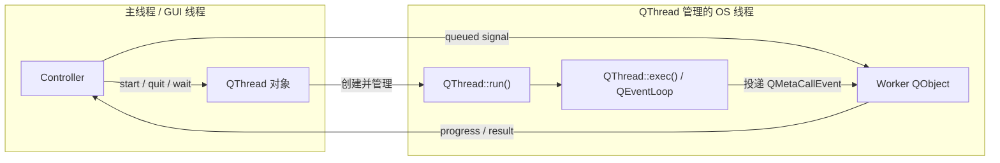

# 4. QThread 与并发模型

> 适用源码：QtBase 6.10.2（版本见 [`.cmake.conf`](../.cmake.conf)）<br>
> 本文定位：第 8 周的线程与任务主线。目标不是只会“把函数放进线程”，而是能判断对象归属、执行上下文、事件循环、数据同步、取消协议和销毁时序，并能在 `QThread`、`QThreadPool` 与 Qt Concurrent 之间做出有依据的选择。<br>
> 前置知识：建议先完成 [`02-qobject-moc-metaobject-system.md`](02-qobject-moc-metaobject-system.md) 和 [`03-event-loop-and-event-dispatch.md`](03-event-loop-and-event-dispatch.md)。跨线程 queued invocation 本质上仍依赖 QObject、元对象和每线程事件队列。

## 4.1 完成本阶段后，你应能回答什么

读完本文并完成实验后，应能用 QtBase 6.10.2 源码解释：

1. 为什么一个 `QThread` 对象和它管理的操作系统线程不是同一个概念？
2. `QThread::start()`、平台线程入口、`run()`、`exec()` 和 `finished()` 的真实顺序是什么？
3. 为什么把槽直接写进 `QThread` 子类，通常不会让槽在新线程执行？
4. `QObject::moveToThread()` 移动的是什么，为什么它只能把对象从当前线程“推”出去？
5. 父子对象、posted events、Timer 和连接的 receiver thread data 在迁移时如何处理？
6. `AutoConnection` 在 connect 时还是 emit 时判断同步/异步？
7. queued connection 为什么要求参数可复制，并最终变成 `QMetaCallEvent`？
8. `BlockingQueuedConnection` 为什么可能死锁，即使 sender 和 receiver 看起来属于不同线程？
9. `quit()`、`exit()`、`requestInterruption()`、`terminate()` 和 `wait()` 分别改变什么？
10. 为什么向一个正在执行长循环的 Worker 排队 `cancel()` 槽，取消可能永远得不到处理？
11. `worker->deleteLater()`、`thread->quit()`、`thread->finished()` 和 `thread->wait()` 应如何组合？
12. 消息传递与共享内存并发模型各自把复杂度放在了哪里？
13. `QMutex`、`QReadWriteLock`、`QWaitCondition`、`QSemaphore` 和原子变量分别适合保护什么？
14. `QThreadPool` 如何排队、复用和淘汰线程，为什么它的 Worker 默认没有 Qt 事件循环？
15. `QRunnable::autoDelete()` 的所有权规则和 ABA 风险是什么？
16. `QFuture`、`QPromise`、`QFutureWatcher` 和 `QtConcurrent::run()` 如何分工？
17. basic-mode `QtConcurrent::run()` 与 promise-mode 在取消和进度上有什么本质差异？
18. 什么任务应选专用线程，什么任务应选线程池，什么任务根本不应开线程？

建议先读 4.2～4.9 建立对象、线程和事件循环的主链，再读 4.10～4.14 建立取消、同步和任务抽象。最后完成 4.15 的实验，并按 4.17 的断点顺序观察真实调用栈。

---

## 4.2 先分清三个经常被混为一谈的实体

一个典型 Worker Object 程序至少包含三个独立实体：

| 实体 | 它是什么 | 通常创建于 | 代码在哪里执行 |
|---|---|---|---|
| `QThread` 对象 | 管理线程生命周期的 `QObject` 控制器 | 主线程 | 它自己的 queued slots 通常在主线程 |
| 操作系统线程 | Win32 thread、pthread 等执行资源 | `QThread::start()` 创建 | 从平台入口进入 `QThread::run()` |
| Worker `QObject` | 承载业务状态与槽的 Active Object | 常在主线程构造，再迁移 | queued slot 在 Worker 的 affinity thread |

把关系画成两条正交轴：



最关键的不变量是：

```text
QThread 对象的 QObject::thread()
    ≠
QThread::run() 当前执行的线程
```

Qt 自己的测试 [`tst_qthread.cpp`](../tests/auto/corelib/thread/qthread/tst_qthread.cpp) 会同时检查：

- `QThread` 实例仍属于创建它的测试线程；
- `run()` 内的 `QThread::currentThread()` 返回该 `QThread` 实例；
- `run()` 内的 native thread id 与测试线程不同。

因此，不要用“对象在哪个线程”代替“当前函数在哪个线程执行”。前者由 affinity 决定，后者由调用方式和当前调用栈决定。

---

## 4.3 `start()` 到 `finished()` 的真实生命周期

### 4.3.1 公共契约与平台实现分开

公共接口位于 [`qthread.h`](../src/corelib/thread/qthread.h)，通用状态和文档位于 [`qthread.cpp`](../src/corelib/thread/qthread.cpp)，真正创建 native thread 的实现位于：

- Windows：[`qthread_win.cpp`](../src/corelib/thread/qthread_win.cpp)
- UNIX/pthread：[`qthread_unix.cpp`](../src/corelib/thread/qthread_unix.cpp)

`qthread.cpp` 末尾还能看到 `QT_CONFIG(thread)` 关闭时的占位实现。阅读时不要误把那组空 `run()`、返回 0 的 `exec()` 当成正常启用线程功能时的实现。

### 4.3.2 Windows 路径

在当前 Windows 源码中，主链可以压缩为：

```text
创建 QThread 对象（仍属于调用线程）
    ↓
QThread::start(priority)
    ↓
锁住 QThreadPrivate::mutex
    ↓
设置 Running、清理 exited/returnCode/interruptionRequested
    ↓
CreateThread / _beginthreadex(CREATE_SUSPENDED)
    ↓
设置 native priority
    ↓
ResumeThread
    ↓
QThreadPrivate::start(void *)                 ← 新 OS 线程
    ↓
安装当前线程的 QThreadData 与 threadId
    ↓
ensureEventDispatcher() + startingUp()
    ↓
emit QThread::started()
    ↓
QThread::run()
    ↓ 默认实现
QThread::exec()
    ↓
QEventLoop::exec()
    ↓ quit/exit 或 run() 返回
QThreadPrivate::finish()
    ↓
emit QThread::finished()
    ↓
处理该线程的 DeferredDelete
    ↓
清理 TLS、dispatcher，状态变为 Finished
```

Windows 先以 suspended 状态创建线程，再设置优先级并恢复，避免一个本应低优先级的新线程在默认优先级下抢先运行。UNIX 路径使用 `pthread_create()`，但上层生命周期协议相同。

### 4.3.3 `started()` 和 `finished()` 的发射线程

这两个信号都由 associated thread 发射，而 `QThread` 对象本身通常仍属于创建线程。因此：

- receiver 在 Worker 线程时，`started()` 的 `AutoConnection` 可能直接调用 receiver；
- receiver 在主线程时，通常排队回主线程；
- `finished()` 发射时普通事件循环已经停止，但 `QThreadPrivate::finish()` 随后会专门处理 DeferredDelete；
- 使用 `terminate()` 时，`finished()` 从哪个线程发射不再有稳定保证。

不要用“信号属于哪个对象”推断“信号从哪个线程发射”。应看执行 `emit` 的当前调用栈。

### 4.3.4 `finished()` 不完全等于 OS 线程所有清理都结束

`isFinished()` 的定义是 `run()` 已返回且 `finished()` 已发射。但某些平台仍可能继续执行 `thread_local` 析构等尾部清理。若需要与线程的全部副作用同步，应调用 `wait()` 并检查返回值。

---

## 4.4 `run()`、`exec()` 与“线程有没有事件循环”

### 4.4.1 默认 `run()` 只做一件事

启用线程功能时，[`QThread::run()`](../src/corelib/thread/qthread.cpp) 的默认实现等价于：

```cpp
void QThread::run()
{
    (void) exec();
}
```

`exec()` 创建局部 `QEventLoop` 并进入该线程的 dispatcher。因此一个普通 `QThread` 在 `start()` 后可以处理：

- 投递给该线程内 QObject 的 queued signals；
- `QMetaObject::invokeMethod(..., QueuedConnection)`；
- posted events 与 `deleteLater()`；
- 属于该线程的 Timer 和 Socket Notifier。

### 4.4.2 重写 `run()` 后不会自动保留事件循环

如果子类重写 `run()`：

```cpp
void HashThread::run()
{
    calculateHashes();
}
```

那么 `calculateHashes()` 返回后线程直接结束；除非子类显式调用 `exec()`，否则没有 Qt event loop。此模型适合一个明确的、顺序执行后退出的任务，不适合需要持续接收 queued commands、Timer 或异步 socket 事件的对象。

### 4.4.3 两种合法模式

| 模式 | 适合 | 事件循环 | 主要风险 |
|---|---|---|---|
| Worker Object + 默认 `QThread::run()` | 长期服务、多个异步命令、Timer/Socket | 默认有 | 生命周期和取消协议需要设计 |
| 子类化 `QThread::run()` | 单一算法、明确开始和结束、无需 QObject 事件 | 默认无 | 构造函数与 `run()` 跨两个线程访问成员 |

“永远不要子类化 `QThread`”并不准确。准确规则是：不要因为想让普通槽运行在新线程，就把槽写到 `QThread` 子类；仅当你确实要定义线程入口本身时才重写 `run()`。

---

## 4.5 为什么 `QThread` 子类的槽通常仍在旧线程执行

一个 `QThread` 实例继承 `QObject`，它在构造时获得创建线程的 affinity。`start()` 创建新 OS 线程并在那里调用虚函数 `run()`，但不会自动执行：

```cpp
threadObject->moveToThread(threadObject);
```

因此：

```text
主线程创建 RenderThread 对象
    ├── RenderThread 构造函数：主线程
    ├── RenderThread queued slot：主线程
    ├── 直接调用 renderThread.someMethod()：调用者线程
    └── RenderThread::run()：新 OS 线程
```

这也解释了一个数据竞争来源：构造函数写成员，`run()` 在另一个线程读写同一成员，而主线程可能继续调用这个对象的方法。只要同一状态跨线程访问，就必须建立不可变交接、消息传递或同步协议。

不要把 `QThread` 对象移动到它自己管理的线程来规避这个事实。那会把生命周期控制器和执行资源缠在一起，并使 `start()`、`quit()`、析构和 queued slots 的责任更难判断。

---

## 4.6 `moveToThread()` 到底迁移了什么

### 4.6.1 迁移的是 QObject affinity，不是当前调用栈

[`QObject::moveToThread()`](../src/corelib/kernel/qobject.cpp) 改写对象私有数据中的 `threadData`。调用返回后，当前函数仍在原线程继续执行；只有后续由事件系统投递的调用才会根据新的 affinity 进入目标线程。

迁移过程包括：

1. 向对象及其子对象同步发送 `QEvent::ThreadChange`。
2. 清理并重新关联 binding storage。
3. 同时锁住源线程和目标线程的 posted-event list。
4. 把该对象尚未处理的 posted events 移到目标队列。
5. 更新以该对象为 receiver 的连接所保存的 `receiverThreadData`。
6. 更新对象及全部子对象的 `threadData`。
7. 若目标 dispatcher 存在且迁移了事件，唤醒目标线程。

所以，源码支持的是“对象树与其待处理事件一起迁移”，不是只改一个表面指针。

### 4.6.2 成功条件

QtBase 6.10.2 会拒绝：

- 有 parent 的对象；父对象迁移时子对象会整体迁移，不能单独拆走 child；
- QWidget；GUI 对象必须留在 GUI 线程；
- 包含 binding 或被 binding 使用的对象；
- 从任意第三方线程“拉取”一个有 affinity 的对象。

正常规则是：调用者必须就是对象当前所属线程，即只能从当前线程把对象“推”到目标线程。例外是无 affinity 的对象可以被当前线程“拉入”。Qt 6.7 起该函数返回 `bool`，应检查失败而不是只依赖警告。

### 4.6.3 Timer 与迁移

对象的 active timers 会在旧线程停止并在新线程以相同 interval 重启。反复迁移会不断重置计时起点，可能让 timer 事件长期延后。

### 4.6.4 构造顺序

Worker 常在主线程构造，但不要在构造函数中创建“无 parent、却必须跟随 Worker”的 QObject 成员指针。它不会自动成为对象树的一部分，也不会自动迁移。可选做法：

- 把辅助 QObject 的 parent 设为 Worker；
- 在 Worker 已进入目标线程后的初始化槽中创建它；
- 对值类型资源使用清晰的线程内创建/销毁协议。

---

## 4.7 跨线程信号槽的实际执行模型

### 4.7.1 `AutoConnection` 在 emit 时判断

[`doActivate()`](../src/corelib/kernel/qobject.cpp) 在每次发射时读取：

- 当前正在执行 emit 的 native thread id；
- receiver 当前 `threadData` 中的 thread id；
- connection type。

决策可以写成：

```text
AutoConnection 且 receiver 不在当前线程
    → queued_activate()

QueuedConnection
    → queued_activate()

BlockingQueuedConnection
    → post QMetaCallEvent + sender 等待 semaphore

其他情况
    → 当前调用栈直接执行 slot
```

判断依据是 emit 的当前线程与 receiver 当前 affinity，不是 sender 对象的 affinity，也不是 connect 发生时的线程。

### 4.7.2 queued invocation 如何落地

[`queued_activate()`](../src/corelib/kernel/qobject.cpp) 会：

1. 获取信号参数的 `QMetaType` 信息。
2. 创建 `QMetaCallEvent`。
3. 为每个参数分配存储并复制构造。
4. 再次确认 receiver/connection 在解锁期间没有失效。
5. `QCoreApplication::postEvent(receiver, event)`。
6. 由 receiver 所在线程的 event loop 最终调用 `QMetaCallEvent::placeMetaCall()`。

因此 queued connection 是消息传递：sender 的栈参数不会被 receiver 直接借用。自定义参数必须能被元类型系统识别并可复制/移动到事件对象中。

### 4.7.3 `DirectConnection` 不等于“在 receiver 线程调用”

Direct 只表示当前调用栈立即执行槽。无论 receiver 属于哪里，slot 都在 emit 的线程运行。如果槽访问 receiver 的非线程安全状态，强制 Direct 跨线程调用会绕过 affinity 保护。

### 4.7.4 排队调用依赖目标事件循环

目标线程没有运行 event loop 时，事件仍可进入它的队列，但不会自动执行。典型症状是：

- connect 成功；
- emit 也发生了；
- slot 永远没有日志；
- `deleteLater()` 也迟迟不删除。

此时应先检查目标线程是否进入 `exec()`，而不是先怀疑 MOC。

---

## 4.8 `BlockingQueuedConnection` 的死锁模型

BlockingQueuedConnection 的实现是：sender 向 receiver 投递 `QMetaCallEvent`，然后在一个 `QSemaphore` 上阻塞，直到 receiver 执行完调用事件并释放 semaphore。

最直接的死锁是 sender 和 receiver 实际处于同一线程：sender 阻塞后，没有线程可以处理它刚投递的事件。源码会打印 deadlock warning，但警告本身不能解除等待。

更隐蔽的是等待环：


还可能出现：

- GUI 线程 blocking 调 Worker，而 Worker 回调 GUI；
- A blocking 调 B，B blocking 调 C，C 又等待 A；
- receiver event loop 已停止，sender 永久等待；
- receiver 的槽需要 sender 当前持有的任何锁或资源。

默认选择应是异步请求 + 异步结果。只有在能证明等待图无环、receiver event loop 活跃、且不持有跨线程依赖资源时，才考虑 BlockingQueuedConnection。

---

## 4.9 Worker Object 的生命周期协议

### 4.9.1 推荐的所有权与时序

一个可审计的 one-shot Worker 生命周期是：

```text
主线程构造 QThread 与 Worker
    ↓
worker.moveToThread(&thread)
    ↓
建立 start/progress/result/finished 连接
    ↓
thread.start()
    ↓
queued start command 到 Worker
    ↓
Worker 完成或协作式取消
    ↓
Worker 发出 finished
    ├── 请求 thread.quit()
    └── 主线程停止 timeout、更新 UI
    ↓
QThread::run()/exec() 返回
    ↓
QThread::finished
    ├── worker.deleteLater()
    └── 通知 Controller 已彻底结束
    ↓
QThreadPrivate::finish() 处理 DeferredDelete
    ↓
必要时 Controller 析构调用 wait()
```

Qt 自身的 [`connectThreadFinishedSignalToObjectDeleteLaterSlot`](../tests/auto/corelib/thread/qthread/tst_qthread.cpp) 测试验证了：对象移入线程后，把 `QThread::finished` 连接到对象的 `deleteLater()`，在线程完成时对象会被删除。

### 4.9.2 删除 `QThread` 不会自动停止普通线程

普通 `QThread` 若仍在运行，析构会触发 fatal error。Qt 6.3 起，`QThread::create()` 返回的特殊线程对象允许在运行时删除；其析构会请求 interruption、调用 quit 并等待。但这不是普通 `QThread` 的通用行为。

Controller 析构的保底顺序应是：

```cpp
requestCooperativeCancel();
thread.quit();
thread.wait();
```

这里的 `wait()` 不是正常 UI 流程的首选，而是确保成员 `QThread` 不会在仍运行时被析构的最后一道生命周期屏障。正常流程应通过 signals 完成，不阻塞 GUI 线程。

### 4.9.3 不要依赖 `terminate()` 做常规关闭

`terminate()` 可能在任意指令点杀死线程。线程可能正：

- 持有 mutex；
- 修改容器不变量；
- 执行文件写入；
- 构造或析构对象；
- 处于第三方库内部。

结果可能是永久锁、资源泄漏或损坏数据。它只能作为进程即将放弃一致性时的极端手段，不能替代取消协议。

---

## 4.10 停止线程：五个 API，五种语义

| API | 实际作用 | 是否停止正在运行的普通函数 | 典型用途 |
|---|---|---:|---|
| `quit()` | 等价于 `exit(0)`，让线程内 event loops 退出 | 否 | 结束 Worker event loop |
| `exit(code)` | 设置退出码并让所有已登记 event loops 退出 | 否 | 需要返回码的循环退出 |
| `requestInterruption()` | 设置协作式原子标志 | 否，任务必须检查 | 长算法取消 |
| `terminate()` | 强制终止 native thread | 是，但不安全 | 极端故障兜底 |
| `wait(deadline)` | 阻塞调用者等待线程结束 | 否 | 析构屏障、测试、非 GUI join |

### 4.10.1 `quit()` 不是任务取消

如果 Worker 正在一个 10 秒循环里计算，线程 event loop 此时没有机会处理其他事件。`quit()` 只是让下一次/当前的 event loop 退出；它不会打断当前 C++ 函数。

### 4.10.2 “queued cancel slot”陷阱

下面的设计看似符合 QObject 模型，实际可能无法取消：

```cpp
connect(controller, &Controller::cancelRequested,
        worker, &Worker::cancel); // Auto/Queued
```

如果 `Worker::runLongLoop()` 正占用 Worker 线程，`cancel()` 调用事件只能排在同一队列里，必须等长循环结束后才执行。此时取消已失去意义。

可行方案有三类：

1. 把任务切成短片段，每段完成后把控制权还给 event loop。
2. 使用线程安全的取消 token，例如 `std::atomic_bool`，计算循环直接轮询。
3. 使用 `QPromise` 的 `isCanceled()` / `suspendIfRequested()` 协作点。

不要在长循环中调用 `processEvents()` 伪造响应性；那会引入难以控制的重入。应让任务天然可分段或显式检查取消状态。

### 4.10.3 超时也是取消请求，不是瞬间终止证明

主线程 QTimer 到期只能表示“预算耗尽”。它应：

- 标记 timed out；
- 设置取消 token；
- 可选调用 `requestInterruption()`；
- 等待 Worker 到达下一个协作点并报告停止。

所以 UI 上应区分“已请求取消”和“任务已经停止”。只有收到 Worker 结束/线程结束信号后，才能宣称资源已安全释放。

---

## 4.11 两种并发模型：消息传递与共享内存

### 4.11.1 消息传递

每份可变状态只由一个线程拥有，其他线程通过 queued messages 请求操作：

```text
GUI owns view state
Worker owns parser state

GUI -- immutable request --> Worker
GUI <-- immutable result  -- Worker
```

优点：

- 状态所有权清楚；
- 大多数业务字段不需要 mutex；
- 调用边界可观测，容易记录进度、错误和取消；
- 与 QObject 生命周期和 event loop 自然结合。

代价：

- 参数需要复制、移动或共享不可变数据；
- 结果有排队延迟；
- 背压必须显式设计，不能无限向 Worker 队列灌入任务。

### 4.11.2 共享内存

多个线程直接访问同一状态，再用同步原语建立互斥和 happens-before：

```text
Thread A ──┐
           ├── mutex / atomic / condition ── shared state
Thread B ──┘
```

优点是可以避免大对象复制并实现低延迟协作；代价是锁顺序、可见性、虚假唤醒、生命周期和异常路径都进入正确性证明。

### 4.11.3 Qt 同步原语选择

| 原语 | 适用问题 | 关键规则 |
|---|---|---|
| `QMutex` + `QMutexLocker` | 一个短临界区的互斥读写 | 用 RAII；不要持锁跨 signal、I/O 或未知回调 |
| `QRecursiveMutex` | 同一线程确实需要递归获得同一锁 | 优先重构；递归锁常掩盖职责问题 |
| `QReadWriteLock` | 读远多于写、读临界区足够大 | 写饥饿与切换成本可能抵消收益 |
| `QWaitCondition` | 等待“受 mutex 保护的谓词成立” | 必须在 `while (!predicate)` 中等待 |
| `QSemaphore` | 有 N 个许可/资源，或明确的一次握手 | 它不是任意共享状态的替代锁 |
| `std::atomic` / Qt atomics | 标志、计数器、简单无锁状态 | 原子只保护该值，不自动保护相关对象图 |

标准 condition-loop 形态：

```cpp
QMutexLocker locker(&mutex);
while (queue.isEmpty() && !stopping)
    notEmpty.wait(&mutex);
```

`wait()` 会原子地释放 mutex 并睡眠，醒来后重新持有 mutex。必须重新检查谓词，因为唤醒可能是虚假的，或者另一个消费者已经先取走资源。

### 4.11.4 三条锁设计规则

1. 先写出所有共享状态及其唯一保护锁。
2. 若需要多把锁，定义全局锁顺序并始终遵守。
3. 持锁时不发射会调用未知代码的 signal，不执行 blocking queued call，不等待另一个线程。

---

## 4.12 `QThreadPool` 与 `QRunnable`：任务模型

### 4.12.1 线程池解决什么

为大量短任务反复创建/销毁 OS 线程成本较高。`QThreadPool` 把“任务”与“线程资源”分离：调用者提交 `QRunnable` 或 callable，线程池决定立即执行、排队、复用等待线程或重启过期线程。

公共接口见 [`qthreadpool.h`](../src/corelib/thread/qthreadpool.h)，实现见 [`qthreadpool.cpp`](../src/corelib/thread/qthreadpool.cpp)。默认：

- `maxThreadCount` 取创建时的 `QThread::idealThreadCount()`；
- 即使 max 小于等于 0，也至少允许一个 Worker；
- idle 线程 30 秒后过期；
- `globalInstance()` 提供进程级共享池；
- 析构会阻塞，直到全部 runnables 完成。

### 4.12.2 排队与复用主链

```text
QThreadPool::start(task, priority)
    ↓
QThreadPoolPrivate::tryStart(task)
    ├── 无线程：创建 QThreadPoolThread
    ├── 有 waiting thread：入队并 wakeOne
    ├── 有 expired thread：wait 后重启
    ├── 可增加线程：创建新 thread
    └── 达到上限：按 priority 入队

QThreadPoolThread::run()
    ↓
取 runnable
    ↓
runnable->run()
    ↓
按 autoDelete 决定删除
    ↓
继续取队列 / 等待新任务 / expiry 后退出
```

队列按整数 priority 排序；priority 只影响尚未开始的队列顺序，不能抢占已经运行的任务。

### 4.12.3 池线程默认不是 QObject 服务线程

[`QThreadPoolThread::run()`](../src/corelib/thread/qthreadpool.cpp) 自己实现“取任务 + wait condition”循环，没有调用 `QThread::exec()`。因此普通 `QRunnable::run()` 不应假设：

- 当前池线程会处理 queued QObject calls；
- 可以把长期 QObject 服务移动进去；
- Timer 或 Socket Notifier 会自然工作；
- runnable 返回后下次仍由同一线程执行。

池线程适合无 affinity 的任务函数，不适合依赖持久 event loop 的 Active Object。

### 4.12.4 `autoDelete` 与所有权

[`QRunnable`](../src/corelib/thread/qrunnable.h) 默认 `autoDelete == true`。线程池在 `run()` 返回后删除它。规则是：

- 必须在提交前设置 `setAutoDelete()`；提交后修改是未定义行为；
- auto-delete task 提交后，调用者不能再解引用；
- 同一个 auto-delete runnable 多次 `start()` 存在竞争，不推荐；
- `tryTake()` 对 auto-delete runnable 存在地址复用导致的 ABA 风险，建议只用于不自动删除的 runnable；
- `clear()` 只清理尚未开始的队列任务，不会中止正在执行的任务。

优先使用 callable overload 可以减少手工所有权代码：

```cpp
QThreadPool::globalInstance()->start([] {
    performIndependentWork();
});
```

如果需要结果、进度、continuation 或取消协议，再提升到 `QFuture`/Qt Concurrent。

---

## 4.13 `QFuture`、`QPromise`、`QFutureWatcher` 与 Qt Concurrent

### 4.13.1 四层职责

| 类型 | 角色 | 主要能力 |
|---|---|---|
| `QPromise<T>` | producer 端 | 报告 started/finished、结果、进度、异常，检查取消/挂起 |
| `QFuture<T>` | consumer 端共享状态句柄 | 查询状态/结果、请求取消/挂起、continuation |
| `QFutureWatcher<T>` | QObject 适配层 | 把 future 状态变成 signals，适合 GUI/event loop |
| `QtConcurrent` | 算法与调度层 | 把函数/map/filter/reduce 任务提交到线程池 |

源码入口：

- [`qpromise.h`](../src/corelib/thread/qpromise.h)
- [`qfuture.h`](../src/corelib/thread/qfuture.h)
- [`qfuturewatcher.cpp`](../src/corelib/thread/qfuturewatcher.cpp)
- [`qtconcurrentrun.h`](../src/concurrent/qtconcurrentrun.h)
- [`qtconcurrentrunbase.h`](../src/concurrent/qtconcurrentrunbase.h)

### 4.13.2 basic-mode `QtConcurrent::run()`

```cpp
QFuture<QByteArray> future = QtConcurrent::run([path] {
    return hashFile(path);
});
```

它适合“输入值 → 一个返回值”的函数。参数在提交时复制/保存，任务通过默认或指定 `QThreadPool` 执行。`result()` 会阻塞；GUI 中应使用 `QFutureWatcher` 或 continuation。

basic mode 的正在运行函数没有拿到协作接口，因此调用 `future.cancel()` 不能令普通函数在中途自动停下。取消是否生效取决于背后的 computation 是否实现取消。

### 4.13.3 promise-mode `QtConcurrent::run()`

```cpp
void generate(QPromise<int> &promise, int count)
{
    promise.setProgressRange(0, count);
    for (int i = 0; i < count; ++i) {
        promise.suspendIfRequested();
        if (promise.isCanceled())
            return;
        promise.addResult(expensiveValue(i));
        promise.setProgressValue(i + 1);
    }
}

QFuture<int> future = QtConcurrent::run(generate, 100);
```

promise mode 要求第一个参数为 `QPromise<T> &`，函数返回 `void`。它可以报告多个结果、进度，并在显式协作点响应 suspend/cancel。QtConcurrent 会负责围绕函数调用报告 started/finished，不需要任务自己再次调用 `start()`/`finish()`。

### 4.13.4 `QFutureWatcher` 仍依赖事件循环

Watcher 通过内部 call-out events 把 future 状态转成 `started()`、`progressValueChanged()`、`resultReadyAt()`、`canceled()`、`finished()` 等信号。因此：

- watcher 应属于有 event loop 的线程，GUI 中通常属于主线程；
- 应先连接 signals，再 `setFuture()`，避免完成过快造成观察竞态；
- progress signal 会节流，不保证每个 producer progress value 都逐一呈现；
- `setPendingResultsLimit()` 可对大量待投递结果施加节流。

### 4.13.5 `QtConcurrent::task()` builder

Qt 6 还提供 [`QtConcurrent::task()`](../src/concurrent/qtconcurrenttask.h) builder，可通过 `withArguments()`、`onThreadPool()`、`withPriority()` 配置后 `spawn()`。它与 `run()` 共用底层 task resolver 和 thread-pool 调度，适合希望把配置与启动分开的调用点，不会改变取消必须协作这一原则。

---

## 4.14 如何选择并发工具

先问：任务是在等待外部事件，还是持续占用 CPU？

| 场景 | 首选 | 原因 | 不推荐 |
|---|---|---|---|
| 异步网络、进程、socket | 主线程或专用线程内的异步 QObject | 等待由 dispatcher 驱动，不必为每个 I/O 占一个线程 | 用线程包装一个已经异步的 API |
| 长期 Worker，接收多种命令，有 Timer/Socket | Worker Object + 专用 `QThread` | 需要稳定 affinity 与 event loop | `QThreadPool` runnable |
| 单个长算法，明确开始/结束，不需要 event loop | `QThread::create()` 或重写 `run()` | 生命周期简单，执行入口清楚 | 把槽堆进 QThread 子类 |
| 大量短小独立任务，无结果 | `QThreadPool::start(callable)` | 复用线程，所有权简单 | 每任务创建 `QThread` |
| 函数任务，需要一个结果 | basic `QtConcurrent::run()` | `QFuture` 获取结果/continuation | GUI 中直接 `future.result()` |
| 任务需要进度、多结果、协作取消/挂起 | promise-mode `QtConcurrent::run()` | producer 明确拥有协作点 | 期待 basic mode 自动中止函数 |
| 容器并行 map/filter/reduce | Qt Concurrent 对应算法 | 已包含分片、调度、合并策略 | 手写共享索引与锁 |
| 高频极短操作 | 先保持同步并测量 | 调度、排队和缓存失效可能比工作更贵 | 为“看起来并行”而开线程 |

再检查四个约束：

1. 是否需要 QObject affinity/event loop？
2. 是否需要持久线程本地状态？
3. 取消点在哪里，最长停止延迟是多少？
4. 结果如何回到 GUI，谁保证接收者仍存活？

---

## 4.15 实践：支持进度、手动取消、超时和安全销毁的后台任务

这个实验刻意使用 Worker Object，而不是为了计算本身选择的最短 API。目的是一次观察完整线程协议。

### 4.15.1 `main.cpp`

```cpp
#include <QCoreApplication>
#include <QThread>
#include <QTimer>
#include <QDebug>

#include <atomic>
#include <memory>

class Worker final : public QObject
{
    Q_OBJECT
public:
    explicit Worker(std::shared_ptr<std::atomic_bool> cancelToken,
                    QObject *parent = nullptr)
        : QObject(parent), m_cancelToken(std::move(cancelToken))
    {
    }

public slots:
    void run(int totalSteps)
    {
        if (totalSteps <= 0) {
            emit failed(QStringLiteral("totalSteps must be positive"));
            emit finished();
            return;
        }

        for (int step = 1; step <= totalSteps; ++step) {
            const bool canceledByToken =
                    m_cancelToken->load(std::memory_order_relaxed);
            const bool interrupted =
                    QThread::currentThread()->isInterruptionRequested();
            if (canceledByToken || interrupted) {
                emit canceled();
                emit finished();
                return;
            }

            // 代表一个不可再细分的计算片段。真实代码应让片段足够短，
            // 从而把“取消请求 → 实际停止”的最坏延迟控制在预算内。
            QThread::msleep(80);
            emit progress(step, totalSteps);
        }

        emit completed();
        emit finished();
    }

signals:
    void progress(int current, int total);
    void completed();
    void canceled();
    void failed(const QString &message);
    void finished();

private:
    std::shared_ptr<std::atomic_bool> m_cancelToken;
};

class TaskController final : public QObject
{
    Q_OBJECT
public:
    explicit TaskController(QObject *parent = nullptr)
        : QObject(parent),
          m_cancelToken(std::make_shared<std::atomic_bool>(false)),
          m_worker(new Worker(m_cancelToken))
    {
        m_timeout.setSingleShot(true);
        m_worker->moveToThread(&m_thread);

        connect(this, &TaskController::startRequested,
                m_worker, &Worker::run);

        connect(m_worker, &Worker::progress,
                this, &TaskController::progress);

        connect(m_worker, &Worker::completed, this, [this] {
            m_timeout.stop();
            emit completed();
        });
        connect(m_worker, &Worker::canceled, this, [this] {
            m_timeout.stop();
            emit canceled();
        });
        connect(m_worker, &Worker::failed, this,
                [this](const QString &message) {
            m_timeout.stop();
            emit failed(message);
        });

        // 在 Worker 线程直接请求其 event loop 退出，不依赖主线程先处理
        // 一个 queued quit，避免主线程析构时 wait() 造成相互等待。
        connect(m_worker, &Worker::finished, m_worker, [this] {
            m_thread.quit();
        });

        // QThreadPrivate::finish() 发出 finished 后会处理 DeferredDelete。
        connect(&m_thread, &QThread::finished,
                m_worker, &QObject::deleteLater);

        connect(&m_thread, &QThread::finished, this, [this] {
            m_running = false;
            m_worker = nullptr;
            emit allDone();
        });

        connect(&m_timeout, &QTimer::timeout, this, [this] {
            if (!m_running)
                return;
            emit timedOut();
            cancel();
        });
    }

    ~TaskController() override
    {
        // 析构是最后的同步屏障；正常路径通过 allDone() 异步完成。
        cancel();
        m_thread.quit();
        m_thread.wait();
    }

    void start(int totalSteps, int timeoutMs)
    {
        if (m_started) {
            emit failed(QStringLiteral("TaskController is one-shot"));
            return;
        }

        m_started = true;
        m_running = true;
        m_cancelToken->store(false, std::memory_order_relaxed);
        m_timeout.start(timeoutMs);
        m_thread.start();

        // receiver 已属于 Worker 线程，因此这里会排队；待 exec() 运行后处理。
        emit startRequested(totalSteps);
    }

public slots:
    void cancel()
    {
        if (!m_running)
            return;

        // 不把 cancel 排队给忙碌的 Worker；直接设置线程安全 token。
        m_cancelToken->store(true, std::memory_order_relaxed);
        m_thread.requestInterruption();
    }

signals:
    void startRequested(int totalSteps);
    void progress(int current, int total);
    void completed();
    void canceled();
    void timedOut();
    void failed(const QString &message);
    void allDone();

private:
    QThread m_thread;
    QTimer m_timeout;
    std::shared_ptr<std::atomic_bool> m_cancelToken;
    // 非 owning；只在构造阶段用于建连，启动后不再解引用。
    Worker *m_worker = nullptr;
    bool m_started = false;
    bool m_running = false;
};

int main(int argc, char **argv)
{
    QCoreApplication app(argc, argv);
    TaskController task;

    QObject::connect(&task, &TaskController::progress,
                     [](int current, int total) {
        qInfo() << "progress" << current << "/" << total;
    });
    QObject::connect(&task, &TaskController::completed,
                     [] { qInfo() << "completed"; });
    QObject::connect(&task, &TaskController::canceled,
                     [] { qInfo() << "canceled"; });
    QObject::connect(&task, &TaskController::timedOut,
                     [] { qInfo() << "timeout requested cancellation"; });
    QObject::connect(&task, &TaskController::failed,
                     [](const QString &message) { qWarning() << message; });
    QObject::connect(&task, &TaskController::allDone,
                     &app, &QCoreApplication::quit);

    if (app.arguments().contains(QStringLiteral("--manual-cancel"))) {
        QTimer::singleShot(350, &task, &TaskController::cancel);
    }

    task.start(40, 650);
    return app.exec();
}

#include "main.moc"
```

### 4.15.2 `CMakeLists.txt`

```cmake
cmake_minimum_required(VERSION 3.21)
project(qthread_concurrency_lab LANGUAGES CXX)

find_package(Qt6 6.10 REQUIRED COMPONENTS Core)

qt_standard_project_setup()

qt_add_executable(qthread_concurrency_lab main.cpp)
target_link_libraries(qthread_concurrency_lab PRIVATE Qt6::Core)
```

### 4.15.3 构建与预期输出

在 Qt 6.10.2 已安装且可由 CMake 找到的终端中运行：

```powershell
cmake -S . -B build -G Ninja
cmake --build build
./build/qthread_concurrency_lab.exe
```

默认路径由 650ms timeout 发起取消。因为每个计算片段约 80ms，输出通常类似：

```text
progress 1 / 40
progress 2 / 40
...
timeout requested cancellation
progress 8 / 40
canceled
```

timeout 后仍可能多出现一个 progress，这正是协作式取消延迟：请求可能发生在 `msleep()`/计算片段中，Worker 到下一轮检查点才停止。

手动取消路径：

```powershell
./build/qthread_concurrency_lab.exe --manual-cancel
```

它应在约 350ms 请求取消，停止 timeout，并最终输出 `canceled`。两个路径都应正常退出，且不出现：

```text
QThread: Destroyed while thread is still running
QObject::killTimer: Timers cannot be stopped from another thread
QObject::~QObject: Timers cannot be stopped from another thread
```

### 4.15.4 为什么示例这样设计

- `m_worker` 是非 owning 指针，只在启动线程前用于建连；启动后不跨线程解引用，实际销毁由 `QThread::finished → deleteLater()` 协议负责。
- shared atomic token 的生命周期覆盖 Controller 与 Worker，取消方不必解引用可能正被删除的 Worker。
- `requestInterruption()` 提供 Qt 线程级协作标志；token 则能独立表达任务取消并避免 queued-cancel 陷阱。
- Worker 的 `finished` 在 Worker 线程直接调用线程的 thread-safe `quit()`。
- `QThread::finished → worker.deleteLater()` 利用 finish 阶段对 DeferredDelete 的专门处理。
- Controller 析构仍 `wait()`，保证成员 `QThread` 不会带着运行中的 native thread 被销毁。
- Controller 声明为 one-shot，因为 Worker 会在线程结束时删除；可复用任务管理器应为每次运行创建新的 Worker，或让线程持续运行并显式重置状态机。

### 4.15.5 扩展实验

1. 把取消改成 queued `Worker::cancel()`，保持 `run()` 为长循环，验证 cancel 槽直到任务结束才执行。
2. 把单步工作从 80ms 改为 500ms，测量 timeout 请求到 `canceled` 的最坏延迟。
3. 把任务拆成由 `QTimer::singleShot(0, ...)` 驱动的短 step，取消改回 queued command，比较响应性与状态机复杂度。
4. 在 Worker 内创建一个 `QTimer`，验证它的 timeout 在 Worker 线程；再错误地在主线程直接启动它，观察警告。
5. 把 `m_thread.wait()` 移到正常 GUI 操作路径，观察主 event loop 被阻塞，理解为什么正常完成应使用 signal。
6. 用 promise-mode `QtConcurrent::run()` 重写相同任务，对比生命周期代码量与专用线程控制能力。

---

## 4.16 常见失败状态机

### 4.16.1 启动竞态

不要用固定 sleep 等待线程“应该已经启动”。`start()` 返回只表示启动已发起。需要依赖 Worker 初始化完成时，应让 Worker 发射 `ready()`，Controller 收到后再发送业务命令。

### 4.16.2 完成、取消与超时同时到达

把结果状态设计为一次性终态：

```text
Idle → Starting → Running
                    ├── Completed
                    ├── Canceled
                    ├── TimedOutThenCanceled
                    └── Failed
```

使用一个受主线程独占或原子 compare-exchange 保护的终态转换，保证 UI 只收到一次最终结果。timeout 是原因，canceled/finished 才是资源停止事实。

### 4.16.3 receiver 提前销毁

使用带 context 的 functor connect，让 context 销毁时自动断开。不要在无 context 的 lambda 中捕获裸 GUI 指针。跨线程结果到达时，receiver 可能已经关闭窗口。

### 4.16.4 队列无限增长

queued connection 没有自动业务背压。高频 producer 向慢 consumer 发消息会增加内存和延迟。可选策略：

- 合并进度，只保留最新值；
- 设置有界业务队列；
- producer 在达到水位线后暂停；
- 使用 `QFutureWatcher::setPendingResultsLimit()`；
- 把大结果批量化，而不是每项一个 signal。

---

## 4.17 用调试器跟五条真实调用链

### 4.17.1 创建与启动

Windows 断点：

```text
QThread::start                         qthread_win.cpp
QThreadPrivate::start                 qthread_win.cpp
QThreadData::ensureEventDispatcher    qthread_p.h / 相关实现
QThread::run                           qthread.cpp
QThread::exec                          qthread.cpp
QEventLoop::exec                       qeventloop.cpp
```

记录每个断点的 native thread id，并观察 `QThread` 对象的 `thread()` 始终指向哪里。

### 4.17.2 Worker 启动调用

```text
TaskController::start
QMetaObject::activate / doActivate
queued_activate
QCoreApplication::postEvent
目标线程 sendPostedEvents
QMetaCallEvent::placeMetaCall
Worker::run
```

重点观察 emit 发生时 receiver thread id 的判断，以及参数如何进入 `QMetaCallEvent`。

### 4.17.3 `moveToThread()`

```text
QObject::moveToThread
QObjectPrivate::moveToThread_helper
QObjectPrivate::setThreadData_helper
QAbstractEventDispatcher::wakeUp
```

在移动前先 post 一个自定义事件，验证它从源 `postEventList` 被搬到目标队列。

### 4.17.4 正常退出与删除

```text
Worker::finished
QThread::quit / exit
QEventLoop::exit
QThread::run 返回
QThreadPrivate::finish
QThread::finished
QObject::deleteLater
sendPostedEvents(... DeferredDelete ...)
Worker::~Worker
```

重点确认 `finished()` 发射、DeferredDelete 和 `wait()` 返回不是同一个瞬时动作。

### 4.17.5 线程池任务

```text
QThreadPool::start
QThreadPoolPrivate::tryStart
QThreadPoolPrivate::enqueueTask / startThread
QThreadPoolThread::run
QRunnable::run
```

观察连续提交短任务时 native thread id 是否复用，以及改变 priority 是否只影响尚未开始的任务。

---

## 4.18 对应自动测试

源码测试是边界条件最可靠的可执行说明。建议定向阅读：

| 测试 | 文件 | 观察点 |
|---|---|---|
| `currentThreadId` / `currentThread` | [`tst_qthread.cpp`](../tests/auto/corelib/thread/qthread/tst_qthread.cpp) | QThread 对象 affinity 与 run 执行线程的差异 |
| `exit` / `exec` / `exitAndExec` | 同上 | quitNow、return code、多次 event loop |
| `connectThreadFinishedSignalToObjectDeleteLaterSlot` | 同上 | finish 阶段删除线程内对象 |
| `wait2` / `wait3_slowDestructor` | 同上 | deadline 与 finished 槽仍可能阻塞线程尾部 |
| `create` / `createDestruction` | 同上 | `QThread::create()` 的一次启动和析构特例 |
| `moveToThread` | [`tst_qobject.cpp`](../tests/auto/corelib/kernel/qobject/tst_qobject.cpp) | 子对象、posted events、Timer、Socket 一起迁移 |
| `threadRecycling` / `expiryTimeout` | [`tst_qthreadpool.cpp`](../tests/auto/corelib/thread/qthreadpool/tst_qthreadpool.cpp) | 池线程复用与过期 |
| `priorityStart` / `setMaxThreadCount` | 同上 | 队列优先级和并发上限 |
| `clear` / `tryTake` | 同上 | 尚未开始任务的清理与所有权 |
| promise cancellation cases | [`tst_qtconcurrentrun.cpp`](../tests/auto/concurrent/qtconcurrentrun/tst_qtconcurrentrun.cpp) | `QPromise::isCanceled()` 的协作时机 |

如果已有 QtBase 测试构建目录，可定向运行对应测试；具体可执行文件和配置名取决于本地构建布局。不要为了学习一个行为先跑完整 QtBase 测试集。

---

## 4.19 常见误区与源码反证

### 误区 1：“QThread 对象在新线程里”

反证：对象 affinity 保持在创建线程；只有平台线程入口调用的 `run()` 在新线程。

### 误区 2：“把槽写进 QThread 子类就会在新线程执行”

反证：queued slot 按 receiver affinity 投递，QThread 子类对象仍属于旧线程。

### 误区 3：“`moveToThread()` 会把当前函数瞬移到目标线程”

反证：它只修改 affinity 和队列归属；当前调用栈继续在调用线程执行。

### 误区 4：“AutoConnection 由 sender 和 receiver 的 affinity 决定”

反证：`doActivate()` 比较 emit 当前线程与 receiver 当前线程。

### 误区 5：“queued signal 只是稍后直接调用槽”

反证：参数被复制到 `QMetaCallEvent`，再通过目标线程 posted-event queue 投递。

### 误区 6：“调用 `quit()` 会立即停止 Worker 的长函数”

反证：quit 退出 event loop，不抢占当前函数。

### 误区 7：“给 Worker 排队 cancel 槽就一定能及时取消”

反证：长函数占住同一个线程时，cancel event 排在它后面。

### 误区 8：“`requestInterruption()` 会抛异常或自动返回”

反证：它只设置 advisory flag；任务必须主动检查并决定退出。

### 误区 9：“线程发出 `finished()` 后可以立刻假定所有 TLS 清理结束”

反证：完整同步边界是成功返回的 `wait()`。

### 误区 10：“删除 QThread 会自动停止普通线程”

反证：普通运行中 QThread 析构会 fatal；`QThread::create()` 是有专门析构协议的例外。

### 误区 11：“线程池里的 runnable 可以依赖事件循环”

反证：`QThreadPoolThread::run()` 是任务/condition 循环，没有调用 `exec()`。

### 误区 12：“QThreadPool priority 能抢占低优先级任务”

反证：priority 只影响队列页顺序，已运行任务不会被抢占。

### 误区 13：“`clear()` 或 `tryTake()` 可以取消正在执行的 runnable”

反证：它们只处理尚在队列中的任务。

### 误区 14：“任何 QFuture 都能取消背后的函数”

反证：取消能力由 computation 实现；basic `QtConcurrent::run()` 函数没有自动协作点，promise mode 才能显式检查。

### 误区 15：“加一把 mutex 就线程安全了”

反证：还需证明所有访问都使用同一协议、生命周期覆盖访问、锁顺序无环、回调不在持锁区重入。

---

## 4.20 自测题与答案要点

### 问题 1

主线程创建 `MyThread : QThread`，然后通过 queued connection 调用 `MyThread::doWork()`。`doWork()` 默认在哪执行？

答案要点：`MyThread` 对象仍属于主线程，因此 queued slot 在主线程。只有 `run()` 在 associated OS thread。

### 问题 2

Worker 已移入线程 B，但信号由一个属于线程 A、实际却在 B 的直接调用栈中发射。AutoConnection 如何判断？

答案要点：比较 emit 的当前 native thread 与 receiver 当前 thread data，不使用 sender affinity 代替当前线程。

### 问题 3

为什么 queued connection 不能安全传递指向 sender 栈局部对象的裸指针？

答案要点：事件稍后执行时局部对象可能已销毁；虽然指针值可被复制，指向对象的生命周期没有被延长。应传值、智能指针或有明确所有权的不可变数据。

### 问题 4

为什么 `thread.quit(); thread.wait();` 可能仍要等很久？

答案要点：quit 不打断当前函数；线程要等函数返回、event loop 退出和尾部清理完成。任务必须有协作取消点。

### 问题 5

Worker 的 `finished` 为什么可以连接 `QThread::finished → worker.deleteLater()`，即使普通 event loop 已停止？

答案要点：`QThreadPrivate::finish()` 发射 `finished()` 后专门调用 `sendPostedEvents(..., DeferredDelete, threadData)`。

### 问题 6

何时 `QWaitCondition` 应替换为 `QSemaphore`？

答案要点：等待的是可计数的许可/资源时用 semaphore；等待受 mutex 保护的复杂谓词时用 condition，并在 while 中复查。

### 问题 7

为什么把长期 QObject 服务放入 QThreadPool 不合适？

答案要点：池任务没有稳定线程身份，池 Worker 默认不运行 Qt event loop，并且线程会复用/过期。

### 问题 8

basic-mode `QtConcurrent::run()` 返回的 future 收到 cancel 后，已经运行的函数为什么可能继续？

答案要点：普通函数没有 `QPromise` 协作接口；future 的取消请求不能任意抢占 C++ 函数。

### 问题 9

timeout 信号已经发出，能否立即释放 Worker 使用的文件或设备？

答案要点：不能仅凭 timeout；它只是取消原因/请求。要等 Worker 报告终止并完成线程生命周期同步。

### 问题 10

什么情况下应完全不使用线程？

答案要点：已有异步 API、任务很短、并发开销超过收益、共享状态证明成本过高，或 GUI 更新必须在主线程且计算不足以阻塞时。

---

## 4.21 推荐源码阅读顺序

第一轮只追主链：

1. [`qthread.h`](../src/corelib/thread/qthread.h)：公共契约与可调用范围。
2. [`qthread.cpp`](../src/corelib/thread/qthread.cpp)：类文档、`run()`、`exec()`、exit、interruption、析构。
3. [`qthread_win.cpp`](../src/corelib/thread/qthread_win.cpp)：`start()`、native entry、`finish()`、`wait()`。
4. [`qobject.cpp`](../src/corelib/kernel/qobject.cpp)：`moveToThread()`、`queued_activate()`、`doActivate()`。
5. [`tst_qthread.cpp`](../tests/auto/corelib/thread/qthread/tst_qthread.cpp) 与 [`tst_qobject.cpp`](../tests/auto/corelib/kernel/qobject/tst_qobject.cpp)：验证 affinity、迁移和销毁不变量。

第二轮进入任务抽象：

6. [`qrunnable.h`](../src/corelib/thread/qrunnable.h)：任务接口与 auto-delete。
7. [`qthreadpool.cpp`](../src/corelib/thread/qthreadpool.cpp)：队列、Worker 循环、复用和过期。
8. [`qfuture.h`](../src/corelib/thread/qfuture.h)、[`qpromise.h`](../src/corelib/thread/qpromise.h)、[`qfuturewatcher.cpp`](../src/corelib/thread/qfuturewatcher.cpp)：共享状态与 QObject 观察层。
9. [`qtconcurrentrunbase.h`](../src/concurrent/qtconcurrentrunbase.h) 与 [`qtconcurrentrun.cpp`](../src/concurrent/qtconcurrentrun.cpp)：任务提交、异常、basic/promise mode。
10. [`tst_qthreadpool.cpp`](../tests/auto/corelib/thread/qthreadpool/tst_qthreadpool.cpp) 与 [`tst_qtconcurrentrun.cpp`](../tests/auto/concurrent/qtconcurrentrun/tst_qtconcurrentrun.cpp)：并发上限、取消和竞态边界。

每读完一条行为链，都画四张小图：

```text
对象所有权图
线程 affinity 图
调用/事件时序图
停止与销毁状态图
```

如果这四张图不能同时自洽，就还没有真正理解该并发设计。
