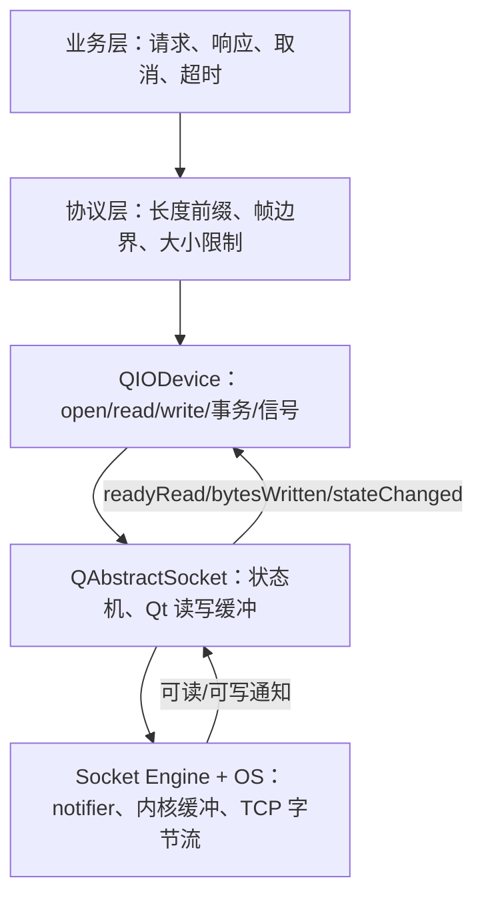
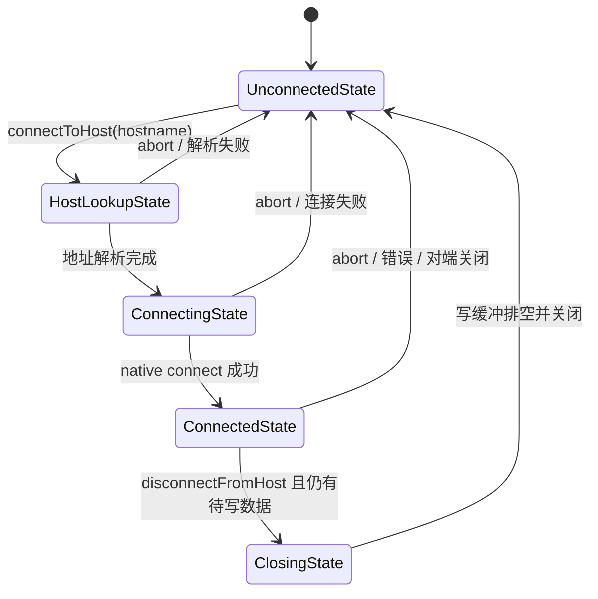

# 5. QIODevice 与异步网络

> 适用源码：QtBase 6.10.2（版本见 [`.cmake.conf`](../.cmake.conf)）  
> 本文定位：第 9 周的异步 I/O 与网络主线。目标不是只会连接 `readyRead()`，而是能从 `QIODevice` 契约、内部缓冲、事件循环、Socket 状态机和应用协议五个层次解释数据何时可读、何时真正写出，以及超时、取消和销毁为何会竞争。  
> 前置知识：建议先完成 [`03-event-loop-and-event-dispatch.md`](03-event-loop-and-event-dispatch.md) 和 [`04-qthread-and-concurrency-model.md`](04-qthread-and-concurrency-model.md)。异步 Socket 依赖线程事件循环，跨线程使用又受 QObject 线程亲和性约束。

## 5.1 完成本阶段后，你应能回答什么

读完本文并完成实验后，应能用 QtBase 6.10.2 源码解释：

1. `QIODevice` 如何用少量虚函数统一 `QFile`、`QBuffer`、`QTcpSocket` 和 `QNetworkReply`？
2. `read()`、内部缓冲与子类 `readData()` 的真实调用顺序是什么？
3. 顺序设备和随机访问设备在 `pos()`、`size()`、`seek()`、EOF 与事务回滚上有什么差异？
4. 为什么一次 `readyRead()` 既不代表一条完整消息，也不保证以后还会为缓冲中的旧数据再次发射？
5. `read()` 返回 `0`、`-1` 和正数分别意味着什么，为什么不能把一次短读当成 EOF？
6. `write()` 返回成功为什么仍不等于字节已经到达网卡或对端？
7. `bytesWritten(n)` 的 `n` 为什么不能直接映射到某一条业务消息？
8. 如何用长度前缀正确处理 TCP 的半包、粘包和一次到达多帧？
9. `QIODevice` 读事务如何在顺序设备上实现“试读失败后回滚”？
10. `QAbstractSocket` 如何把 native socket notifier 转换成 `readyRead()`？
11. `setReadBufferSize()` 为什么既是内存限制，也是读取侧背压的一部分？
12. `disconnectFromHost()`、`close()` 和 `abort()` 分别保留或丢弃什么？
13. `QNetworkAccessManager`、`QNetworkRequest`、`QNetworkReply` 的职责和所有权如何划分？
14. `QNetworkReply::close()` 为什么不会取消仍在进行的上传？
15. 连接超时、传输停滞超时、业务响应超时为什么应分开建模？
16. `finished()`、`errorOccurred()`、超时回调和用户取消同时到达时，如何保证只完成一次？
17. 为什么异步对象通常应在其归属线程创建、使用和销毁？
18. 如何为发送侧设置高水位，避免“异步写入”变成无界内存队列？

建议先读 5.2～5.9 建立 `QIODevice` 数据路径，再读 5.10～5.15 建立 Socket 与 HTTP 生命周期。最后完成 5.16 的客户端并按 5.18 的断点顺序观察真实调用栈。

---

## 5.2 先建立五层模型

异步网络问题经常来自把五个层次压成一个“收发数据”概念：



每层只承诺自己的事实：

| 层次 | 能承诺 | 不能承诺 |
|---|---|---|
| TCP | 有序、可靠的字节流（连接存续期间） | 消息边界、业务成功 |
| `QAbstractSocket` | 状态、缓冲、可读/已写出一批字节通知 | 一次信号对应一条消息 |
| `QIODevice` | 统一读写接口和错误返回约定 | 所有子类都异步，也不保证线程安全 |
| 帧协议 | 从字节流恢复消息边界 | 消息语义正确 |
| 业务层 | 请求身份、超时、取消、幂等与最终结果 | 底层信号自动替你解决竞争 |

因此看到 `readyRead()` 时，最准确的翻译是：**当前读通道出现了新的可读字节，请继续推进解析状态机。**

---

## 5.3 `QIODevice` 的抽象边界：公共算法包住最小虚函数

公共接口位于 [`qiodevice.h`](../src/corelib/io/qiodevice.h)，通用算法位于 [`qiodevice.cpp`](../src/corelib/io/qiodevice.cpp)，内部状态位于 [`qiodevice_p.h`](../src/corelib/io/qiodevice_p.h)。

### 5.3.1 子类最少实现什么

`QIODevice` 把公开的便利接口固定在基类中，把真实介质访问下沉给子类：

```cpp
protected:
    virtual qint64 readData(char *data, qint64 maxlen) = 0;
    virtual qint64 writeData(const char *data, qint64 len) = 0;

    virtual qint64 readLineData(char *data, qint64 maxlen);
    virtual qint64 skipData(qint64 maxSize);
```

这是一种 Template Method（模板方法）结构：

```text
调用者
  │
  ├─ read / readAll / readLine / getChar / peek / skip
  │       │
  │       ├─ 检查 open mode、长度和错误
  │       ├─ 处理 QIODevice 内部缓冲与事务
  │       ├─ 处理 Text 模式
  │       └─ 调用子类 readData / readLineData / skipData
  │
  └─ write / putChar
          │
          ├─ 检查可写状态
          └─ 调用子类 writeData
```

子类不需要各自重写 `readAll()`、`peek()` 和事务逻辑。统一算法还保证了访问模式检查、错误返回和缓冲行为大体一致。

但“统一接口”不等于“相同执行模型”：

| 子类 | 典型介质 | 通常是顺序设备 | 异步通知 |
|---|---|---:|---|
| `QFile` | 文件系统 | 否 | 普通文件通常按调用同步读写 |
| `QBuffer` | `QByteArray` | 否 | 写入后的信号通过 queued invocation 合并发射 |
| `QTcpSocket` | TCP 字节流 | 是 | 依赖事件 dispatcher 与 socket notifier |
| `QProcess` | 子进程管道 | 是 | 依赖进程与管道通知 |
| `QNetworkReply` | HTTP 等请求的响应体 | 是 | 由网络访问后端推进 |

### 5.3.2 `open()` 建立能力，不代表介质已经完成某个动作

`QIODeviceBase::OpenMode` 常用标志包括：

| 标志 | 含义 | 容易误解的点 |
|---|---|---|
| `ReadOnly` | 允许读 | 不代表现在已有数据 |
| `WriteOnly` | 允许写 | 单独使用不必然等于截断；看具体子类契约 |
| `ReadWrite` | 同时允许读写 | 不会自动解决读写位置或并发问题 |
| `Append` | 写入位置在末尾 | `QIODevice::open()` 会把初始位置设到 `size()` |
| `Truncate` | 打开时截断 | 需要子类实际支持 |
| `Text` | 进行文本换行转换 | 不适合二进制协议 |
| `Unbuffered` | 请求绕过缓冲 | 子类也必须尊重；平台可能存在限制 |

`QIODevice::open(mode)` 主要设置通道、位置、访问模式和错误状态。对 Socket 而言，连接建立还要等待 `connected()`；对 HTTP 而言，调用 `get()` 后得到的 Reply 已可作为设备观察，但请求远未结束。

---

## 5.4 `read()` 的真实路径：先缓冲，再设备

[`QIODevicePrivate::read()`](../src/corelib/io/qiodevice.cpp) 是理解基类的核心。QtBase 6.10.2 的路径可压缩为：

```text
QIODevice::read(data, maxSize)
    ↓ 检查可读、参数与 open mode
QIODevicePrivate::read(data, maxSize, peeking=false)
    ↓
先从当前 read channel 的 QRingBuffer 取数据
    ↓ 仍需要更多？
判断 sequential / random-access、buffered / unbuffered、transaction / peek
    ↓
大块且无需保留：直接 q->readData(调用者缓冲区)
小块或需要保留：先 q->readData(QRingBuffer)，再从缓冲复制/窥视
    ↓
Text 模式过滤 '\r'
    ↓
更新 pos、devicePos 或 transactionPos
```

私有对象默认把 `readBufferChunkSize` 设为 `16384`。这不是对所有读取都固定读 16 KiB：当调用者请求足够大的块且无需为 peek/事务保留数据时，基类可以直接读进调用者缓冲，避免中间复制。

### 5.4.1 三个位置变量为什么同时存在

`QIODevicePrivate` 维护：

- `pos`：公开逻辑位置；
- `devicePos`：底层设备当前真实位置；
- `transactionPos`：事务试读推进到的位置。

随机访问设备可能因为预读而出现 `devicePos > pos`。下一次操作若要从逻辑位置读取，基类可以先消费缓冲，或调用 `seek(pos)` 重新对齐。顺序设备不能 seek，所以事务必须保留已读字节，让 `transactionPos` 在缓冲中移动。

### 5.4.2 返回值必须逐层解释

`QIODevice::read(char *, qint64)` 的契约是：

| 返回值 | 含义 | 上层应做什么 |
|---:|---|---|
| `> 0` | 本次取得的字节数 | 累积并继续解析；短于请求长度仍可能只是暂时数据不足 |
| `0` | 当前没有更多可读数据 | 对异步顺序设备，等待下一次新数据通知 |
| `-1` | 错误，或流已关闭且不可能再有数据 | 结合设备状态与 `errorString()` 处理终止 |

“请求 4 字节只读到 2 字节”不是异常，也不是 TCP 半包的特殊现象；它只是流式 I/O 的正常返回。

---

## 5.5 顺序设备与随机访问设备

### 5.5.1 随机访问设备

普通文件和 `QBuffer` 具有起点、大小和当前位置，通常支持：

```text
size()  pos()  seek(n)  reset()
```

`QBuffer::readData()` 只需从 `QByteArray` 的 `pos()` 复制；`writeData()` 必要时扩容，再写到当前位置。它还会合并同一轮写入，并用 queued invocation 稍后发射 `bytesWritten()` 与 `readyRead()`，说明“内存设备”也可以遵守异步风格的通知契约。

### 5.5.2 顺序设备

Socket、管道和部分特殊文件没有稳定的“第 n 字节位置”：

- `size()` 和 `pos()` 通常没有随机访问意义；
- `seek()` 不可用；
- 数据只能按到达顺序消费；
- 当前没数据不代表永远结束；
- 读过的数据若未主动保留，无法回头再读。

因此不要写出这种判断：

```cpp
// 错误：对顺序设备，size() 不是“最终消息长度”。
if (socket.size() < expectedSize)
    return;
```

应根据 `bytesAvailable()`、自己的帧头和累计缓冲判断是否足够。

### 5.5.3 `atEnd()` 也需要设备语义

随机访问设备通常在 `pos() >= size()` 且缓冲为空时到达末尾。异步顺序设备在“当前无数据但未来可能到达”时不能简单等同于永久 EOF。网络代码应优先根据 `disconnected()`、`readChannelFinished()`、错误和协议状态判断终止，而不是只轮询 `atEnd()`。

---

## 5.6 `readyRead()` 是边沿提示，不是消息事件

[`qiodevice.cpp`](../src/corelib/io/qiodevice.cpp) 对 `readyRead()` 的契约非常具体：每当**新数据**进入当前读通道时发射一次；只因旧缓冲仍未读完，不应反复发射。

这带来四条规则：

1. 收到信号后尽量读取当前可用数据，放入应用接收缓冲。
2. 解析器必须允许 0 帧、1 帧或多帧产出。
3. 不要等待“一条消息对应的下一次 `readyRead()`”；剩余字节可能已经在当前缓冲中。
4. 不要把信号次数计为消息数。

### 5.6.1 TCP 允许的三种到达方式

发送方连续发送两帧：

```text
[len=5][hello][len=5][world]
```

接收方都可能合法地观察到：

```text
情况 A：一次 readyRead → [len=5][hello][len=5][world]
情况 B：两次 readyRead → [len=5][hello] / [len=5][world]
情况 C：多次 readyRead → [le] / [n=5][he] / [llo][len=5][world]
```

TCP 不认识你的 `write()` 调用边界。所谓“粘包”与“半包”不是 TCP 出错，而是应用把消息模型错误投射到字节流上。

### 5.6.2 `readyRead()` 防递归，但槽仍然允许重入其他逻辑

`QAbstractSocketPrivate::emitReadyRead()` 使用 `QScopedValueRollback<bool>` 和 `emittedReadyRead` 防止同一信号递归发射；`QIODevice` 文档也明确说，在该槽中进入嵌套事件循环或调用 `waitForReadyRead()`，`readyRead()` 不会递归重发。

这并不使槽天然安全：槽可以直接触发其他信号、删除对象、启动嵌套事件循环，或让业务状态发生重入。解析时应避免持有跨 `emit` 仍假定不变的裸指针和临时引用。

---

## 5.7 部分写入、`bytesToWrite()` 与背压

### 5.7.1 `write()` 成功只表示设备接受了一批字节

对缓冲 Socket，典型路径是：

```text
socket.write(data)
    ↓
复制/追加到 Qt 写缓冲
    ↓ 返回已接受字节数
事件循环获得 native socket 可写通知
    ↓
Qt 把一批字节交给 OS
    ↓
emit bytesWritten(batchSize)
```

此时仍不能证明：

- 对端应用已经读取；
- 对端已经解析；
- 对端业务已成功；
- 数据已落盘。

这些确认必须由应用协议显式返回。

### 5.7.2 `bytesWritten(n)` 不是“第 n 条消息完成”

Qt 和 OS 可以合并或拆分写入。一条 1 MiB 消息可能产生多个 `bytesWritten()`，多个小帧也可能在一次底层写中推进。若业务需要逐请求完成确认，应在帧中携带 request id，并等待对端响应，而不是累计信号次数。

### 5.7.3 高水位与低水位

异步 API 很容易制造生产者快于网络消费者的情况：

```text
业务持续 send
    ↓
应用队列 + QAbstractSocket 写缓冲持续增长
    ↓
内存上涨、延迟扩大、取消成本增加
```

推荐维护两个限制：

- **单帧上限**：拒绝异常大的业务消息；
- **总排队上限**：应用待写数据加 `bytesToWrite()` 不得无限增长。

达到高水位后可以拒绝新任务、暂停上游读取，或等待降到低水位再恢复。不要用 `bytesWritten()` 槽立刻无条件生产更多数据，否则只是把无限队列藏在回调中。

---

## 5.8 协议分帧：长度前缀与读取事务

本文实践采用 4 字节大端长度前缀：

```text
0                   31
+--------------------+----------------------+
| payload length (BE)| payload bytes ...    |
+--------------------+----------------------+
```

解码必须按状态推进：

```text
缓冲不足 4 字节？等待
    ↓ 否
读取 payloadLength
    ↓
长度超过上限？协议错误并断开
    ↓ 否
缓冲不足 4 + payloadLength？等待
    ↓ 否
取出一帧，继续解析下一帧
```

长度上限是安全边界。若在验证前就执行 `QByteArray(payloadLength, ...)`，恶意对端可用 4 字节头触发巨大分配。

### 5.8.1 手动累计缓冲

最直观的方式是 `rxBuffer += socket.readAll()`，然后循环解析完整帧。优点是状态清晰，适合加入最大累计缓冲、校验和与协议版本；代价是要控制复制和 `remove(0, n)` 的频率。

### 5.8.2 `QIODevice` 事务

另一种方式是试读后回滚：

```cpp
device->startTransaction();

// 试读 header 和 payload。
// 若不完整：
device->rollbackTransaction();

// 若完整且合法：
device->commitTransaction();
```

QtBase 6.10.2 的实现差异是：

- 随机访问设备保存起始位置，回滚时重新定位缓冲；
- 顺序设备在事务期间不释放已读的 `QRingBuffer` 数据，只推进 `transactionPos`；
- commit 时顺序设备才释放事务已消费的数据；
- 事务不能嵌套。

`QDataStream::startTransaction()`/`commitTransaction()` 是结构化二进制读取的常用上层入口，但协议仍必须自己验证长度、版本和枚举值。事务解决“不完整”，不解决“不可信”。

---

## 5.9 `QFile`、`QBuffer` 与 Socket：同接口，不同代价

| 维度 | `QFile` | `QBuffer` | `QTcpSocket` |
|---|---|---|---|
| 访问模型 | 随机访问为主 | 随机访问 | 顺序访问 |
| `seek()` | 常规文件支持 | 支持 | 不支持 |
| 读取等待 | 调用通常同步访问文件 | 内存复制 | 数据异步到达 |
| `readyRead()` | 普通文件不是典型用法 | 写入后可异步合并通知 | 核心读取通知 |
| `write()` 后 | 通常已交给文件层，但未必持久化 | 已写入字节数组 | 多数只是进入发送缓冲 |
| 主要风险 | 阻塞、文件位置、持久化 | 外部 `QByteArray*` 生命周期、扩容 | 状态机、背压、断线、超时 |

统一抽象的价值在于解析器可面向 `QIODevice *`：单元测试用 `QBuffer`，生产环境接 `QTcpSocket`。但解析器不能偷偷依赖 `seek()`，否则测试设备可用、真实顺序设备失败。

---

## 5.10 `QAbstractSocket` 状态机

公共接口位于 [`qabstractsocket.h`](../src/network/socket/qabstractsocket.h)，状态与缓冲逻辑位于 [`qabstractsocket.cpp`](../src/network/socket/qabstractsocket.cpp)，平台 socket engine 位于 `src/network/socket/` 的私有实现中。

典型连接路径：



不要只在 `errorOccurred()` 中判断状态。`RemoteHostClosedError` 是常见断开原因；状态可能在信号发射前后继续迁移。把最终完成规则集中到一个幂等函数更可靠。

### 5.10.1 从 native notifier 到 `readyRead()`

读链路可压缩为：

```text
OS 报告 socket 可读
    ↓
QAbstractSocketEngine 的 read notification
    ↓
QAbstractSocketPrivate::canReadNotification()
    ↓ buffered 模式
readFromSocket() → QIODevicePrivate::buffer
    ↓ 有新增数据
emitReadyRead()
    ↓ 防止 readyRead 递归
应用槽读取并解析
```

当设置了 `readBufferMaxSize` 且内部缓冲已满，`canReadNotification()` 会关闭 read notification。应用读走数据并腾出空间后，通知才有条件恢复。这就是从应用消费速度向 socket 读取端传播的背压。

### 5.10.2 默认读缓冲上限是 0，但含义是无限

`setReadBufferSize(0)` 表示不限制 Qt 内部读缓冲，不是“禁止缓冲”。对不受信任或持续流式输入，应该结合协议帧上限、累计缓冲上限和消费速度设计限制。

---

## 5.11 关闭不是一个动作：`disconnectFromHost()`、`close()`、`abort()`

| API | 意图 | 待写数据 | 常见用途 |
|---|---|---|---|
| `disconnectFromHost()` | 优雅关闭连接 | 等待 Qt/engine 写缓冲排空，再断开 | 正常会话结束 |
| `close()` | 关闭设备；Socket 实现最终进入断开流程 | 取决于 Socket 状态与实现路径 | 不再使用读写接口 |
| `abort()` | 立即复位连接 | 丢弃待写数据 | 超时、用户强制取消、协议错误 |

源码中 `disconnectFromHost()` 若发现待写数据，会进入 `ClosingState`、打开写通知并返回；排空后才切到 `UnconnectedState`。`abort()` 设置 `abortCalled`、清空写通道并走 `close()`，目标是立即丢弃。

因此超时回调若要求“现在停止”，通常调用 `abort()`；若要求“把已排队消息尽量发完再关”，调用 `disconnectFromHost()`，同时还要设置一个关闭期限，避免永远卡在 `ClosingState`。

---

## 5.12 阻塞等待函数：可以用，但不要混淆模型

`QAbstractSocket` 重写：

- `waitForConnected()`；
- `waitForReadyRead()`；
- `waitForBytesWritten()`；
- `waitForDisconnected()`。

它们让无事件循环或专用工作线程也能使用同步式控制流，但有三个边界：

1. 在 GUI 线程调用会冻结界面；
2. 在信号槽里调用会引入重入和难以推理的信号顺序；
3. 同一对象上不要让一部分代码按异步状态机、另一部分按阻塞循环争夺数据。

Qt 自己的 `tst_qtcpsocket.cpp` 专门覆盖 `recursiveReadyRead`、`waitForReadyReadInASlot` 和 `readyReadSignalsAfterWaitForReadyRead`，说明这些边界不是理论问题。

推荐选择一种主模型：GUI/服务对象使用信号驱动；短命令行工具或没有 event loop 的专用线程才考虑 wait 系列。

---

## 5.13 `QNetworkAccessManager` 与 `QNetworkReply`

入口：

- [`qnetworkaccessmanager.h`](../src/network/access/qnetworkaccessmanager.h)
- [`qnetworkaccessmanager.cpp`](../src/network/access/qnetworkaccessmanager.cpp)
- [`qnetworkreply.h`](../src/network/access/qnetworkreply.h)
- [`qnetworkreply.cpp`](../src/network/access/qnetworkreply.cpp)
- [`qnetworkrequest.h`](../src/network/access/qnetworkrequest.h)

### 5.13.1 三层职责

| 类型 | 职责 | 生命周期要点 |
|---|---|---|
| `QNetworkRequest` | URL、headers、attributes、redirect/timeout 等请求配置 | 值类型，可复制 |
| `QNetworkAccessManager` | 创建和调度请求，持有连接、cookie、cache、proxy 等共享策略 | 通常长期存在，每个线程单独使用 |
| `QNetworkReply` | 一次操作的状态、响应头、错误和响应体 `QIODevice` | 指针对象，完成后仍需销毁 |

调用 `manager.get(request)` 立即返回一个打开供读取的 `QNetworkReply *`。后续元数据、数据、进度、重定向、错误和完成通过信号到达。

```text
QNetworkAccessManager::get(request)
    ↓
createRequest(GetOperation, request, nullptr)
    ↓ 应用 manager 默认策略与 request attributes
创建具体 QNetworkReply 实现
    ↓
readyRead / metaDataChanged / downloadProgress / errorOccurred
    ↓
QNetworkReply::finished
    ↓ 同步发射
QNetworkAccessManager::finished(reply)
```

### 5.13.2 `finished()` 不等于成功

`finished()` 表示网络操作结束。槽中仍要检查：

```cpp
if (reply->error() == QNetworkReply::NoError) {
    const QByteArray body = reply->readAll();
    // 还应检查 HTTP status 和业务响应。
}
```

HTTP 4xx/5xx、网络错误和业务错误是不同层次。不要只凭 `finished()` 当成功，也不要只凭“拿到 body”忽略状态码。

### 5.13.3 `close()` 与 `abort()` 在 Reply 上不同

`QNetworkReply::close()` 只关闭响应体读取并丢弃未读数据；网络资源会继续到操作结束，正在上传的数据尤其会继续发送。要取消网络操作必须调用具体 Reply 的 `abort()`。

### 5.13.4 销毁 Reply

Qt 文档明确要求不要在 `QNetworkAccessManager::finished(reply)` 槽中直接 `delete reply`，应使用 `deleteLater()`。可选策略：

```cpp
connect(reply, &QNetworkReply::finished, reply, &QObject::deleteLater);
```

或启用 manager 的 `setAutoDeleteReplies(true)`。源码 `_q_replyFinished()` 会在 manager 的 `finished(reply)` 发射后，以 queued invocation 安排 `deleteLater()`。

启用自动删除后，任何跨事件循环保存的裸 `QNetworkReply *` 都更危险；需要延后观察时使用 `QPointer<QNetworkReply>`。

### 5.13.5 上传设备的寿命

`post(request, QIODevice *)`、`put()` 和自定义请求要求上传设备已打开可读，并至少存活到 Reply 发出 `finished()`。若传入临时局部 `QBuffer`，函数返回后设备销毁，异步上传将读到悬空对象。

---

## 5.14 超时不是一个数字

至少区分：

| 超时 | 起点与终点 | 到期动作 |
|---|---|---|
| DNS/连接超时 | `connectToHost()` 到 `connected()` | `abort()`，报告连接阶段失败 |
| 写入停滞超时 | 有待写数据，但长期无 `bytesWritten()` 进展 | `abort()` 或降级 |
| 首字节超时 | 请求发出到第一批响应字节 | 取消请求 |
| 空闲传输超时 | 两次字节进展之间 | 取消停滞传输 |
| 总期限 | 整个业务操作的绝对截止时间 | 终止所有子步骤 |
| 优雅关闭期限 | `disconnectFromHost()` 到 `disconnected()` | 到期转 `abort()` |

`QNetworkAccessManager::setTransferTimeout()`/`QNetworkRequest::setTransferTimeout()` 的语义是：在指定时间内没有字节交换则中止传输。它不是整个请求的绝对总时长。manager 默认值为 0，表示禁用；request 的非零值覆盖 manager。

### 5.14.1 单完成门

超时、错误、用户取消、正常完成可能在相邻事件中到达。所有路径都应进入同一个幂等完成函数：

```cpp
void Operation::finishOnce(Result result)
{
    if (finished_)
        return;
    finished_ = true;
    timeout_.stop();
    // 断开或忽略晚到信号，发布唯一结果。
}
```

“先到者获胜”后，其他事件只能做清理，不能覆盖对外结果。

---

## 5.15 线程亲和性与对象寿命

网络对象是 `QObject`，应遵守：

- 在归属线程调用其普通成员；
- 异步 Socket 所在线程必须运行事件循环；
- 要迁移一个包含 Socket 和 Timer 的服务对象，让这些对象成为它的 children，随父对象一起迁移；
- 不要一边在主线程直接 `write()`，一边在工作线程处理 `readyRead()`；
- 销毁前让取消/断开在对象线程发生，跨线程使用 queued invocation；
- 回调捕获外部 QObject 时使用 context connection 或 `QPointer`。

一个安全的所有权形状是：

```text
NetworkClient QObject（工作线程）
    ├─ QTcpSocket child
    ├─ QTimer connectDeadline child
    └─ QTimer writeStallDeadline child
```

这样 `NetworkClient` 的状态机、Socket 和 Timer 在同一线程串行推进。线程安全来自“单线程所有权 + 消息传递”，不是来自 `QTcpSocket` 自身可被任意线程同时调用。

---

## 5.16 实践：length-prefixed TCP 客户端

本例包含：

- 4 字节大端长度前缀；
- 半包、粘包和多帧循环；
- 1 MiB 单帧限制；
- 4 MiB 总发送排队限制；
- 256 KiB 写入高水位；
- 连接超时与写停滞超时；
- 优雅断开和立即取消；
- 唯一 fatal error 门。

### 5.16.1 `main.cpp`

```cpp
#include <QByteArray>
#include <QByteArrayView>
#include <QCommandLineParser>
#include <QCoreApplication>
#include <QDebug>
#include <QTimer>
#include <QTcpSocket>
#include <QtEndian>

#include <limits>

class LengthPrefixedClient final : public QObject
{
    Q_OBJECT

public:
    explicit LengthPrefixedClient(QObject *parent = nullptr)
        : QObject(parent), socket_(new QTcpSocket(this)),
          connectDeadline_(new QTimer(this)), writeStallDeadline_(new QTimer(this))
    {
        connectDeadline_->setSingleShot(true);
        writeStallDeadline_->setSingleShot(true);

        connect(socket_, &QTcpSocket::connected, this, [this] {
            connectDeadline_->stop();
            emit connected();
            pumpWrites();
        });
        connect(socket_, &QTcpSocket::readyRead,
                this, &LengthPrefixedClient::onReadyRead);
        connect(socket_, &QTcpSocket::bytesWritten, this, [this](qint64) {
            if (socket_->state() == QAbstractSocket::ConnectedState) {
                pumpWrites();
            } else if (socket_->state() == QAbstractSocket::ClosingState) {
                if (socket_->bytesToWrite() > 0)
                    writeStallDeadline_->start(5000);
                else
                    writeStallDeadline_->stop();
            }
        });
        connect(socket_, &QTcpSocket::disconnected, this, [this] {
            connectDeadline_->stop();
            writeStallDeadline_->stop();
            emit disconnected();
        });
        connect(socket_, &QTcpSocket::errorOccurred, this,
                [this](QAbstractSocket::SocketError) {
            fail(socket_->errorString());
        });

        connect(connectDeadline_, &QTimer::timeout, this, [this] {
            fail(QStringLiteral("connection timeout"));
        });
        connect(writeStallDeadline_, &QTimer::timeout, this, [this] {
            fail(QStringLiteral("write stalled"));
        });
    }

    void connectToHost(const QString &host, quint16 port)
    {
        if (socket_->state() != QAbstractSocket::UnconnectedState)
            socket_->abort();

        failed_ = false;
        closeRequested_ = false;
        rxBuffer_.clear();
        txBuffer_.clear();
        txOffset_ = 0;
        socket_->connectToHost(host, port);
        connectDeadline_->start(5000);
    }

    bool sendMessage(QByteArrayView payload)
    {
        if (failed_ || socket_->state() != QAbstractSocket::ConnectedState)
            return false;
        if (payload.size() > kMaxPayload)
            return fail(QStringLiteral("payload exceeds 1 MiB"));

        const qint64 pending = (txBuffer_.size() - txOffset_) + socket_->bytesToWrite();
        if (pending + 4 + payload.size() > kMaxQueuedBytes)
            return fail(QStringLiteral("send queue exceeds 4 MiB"));

        char header[4];
        qToBigEndian<quint32>(quint32(payload.size()), header);
        txBuffer_.append(header, sizeof(header));
        txBuffer_.append(payload.data(), payload.size());
        pumpWrites();
        return true;
    }

    void disconnectGracefully()
    {
        if (socket_->state() == QAbstractSocket::ConnectedState) {
            closeRequested_ = true;
            pumpWrites();
        } else {
            socket_->disconnectFromHost();
        }
    }

    void cancel()
    {
        if (failed_)
            return;
        failed_ = true;
        connectDeadline_->stop();
        writeStallDeadline_->stop();
        socket_->abort();
        emit canceled();
    }

signals:
    void connected();
    void frameReceived(const QByteArray &payload);
    void disconnected();
    void canceled();
    void fatalError(const QString &message);

private:
    static constexpr qsizetype kMaxPayload = 1024 * 1024;
    static constexpr qint64 kWriteHighWater = 256 * 1024;
    static constexpr qint64 kMaxQueuedBytes = 4 * 1024 * 1024;

    bool fail(const QString &message)
    {
        if (failed_)
            return false;
        failed_ = true;
        connectDeadline_->stop();
        writeStallDeadline_->stop();
        socket_->abort();
        emit fatalError(message);
        return false;
    }

    void onReadyRead()
    {
        rxBuffer_.append(socket_->readAll());

        qsizetype consumed = 0;
        while (rxBuffer_.size() - consumed >= 4) {
            const auto *header = reinterpret_cast<const uchar *>(
                rxBuffer_.constData() + consumed);
            const quint32 payloadSize = qFromBigEndian<quint32>(header);
            if (payloadSize > quint32(kMaxPayload)) {
                fail(QStringLiteral("peer sent an oversized frame"));
                return;
            }

            const qsizetype frameSize = 4 + qsizetype(payloadSize);
            if (rxBuffer_.size() - consumed < frameSize)
                break;

            const QByteArray payload = rxBuffer_.sliced(consumed + 4,
                                                        qsizetype(payloadSize));
            consumed += frameSize;
            emit frameReceived(payload);
            if (failed_)
                return;
        }

        if (consumed)
            rxBuffer_.remove(0, consumed);
        if (rxBuffer_.size() > kMaxPayload + 4)
            fail(QStringLiteral("receive buffer invariant violated"));
    }

    void pumpWrites()
    {
        if (failed_ || socket_->state() != QAbstractSocket::ConnectedState)
            return;

        while (txOffset_ < txBuffer_.size()
               && socket_->bytesToWrite() < kWriteHighWater) {
            const qint64 budget = kWriteHighWater - socket_->bytesToWrite();
            const qint64 remaining = txBuffer_.size() - txOffset_;
            const qint64 chunk = qMin(budget, remaining);
            const qint64 accepted = socket_->write(txBuffer_.constData() + txOffset_,
                                                   chunk);
            if (accepted < 0) {
                fail(socket_->errorString());
                return;
            }
            if (accepted == 0)
                break;
            txOffset_ += accepted;
        }

        if (txOffset_ == txBuffer_.size()) {
            txBuffer_.clear();
            txOffset_ = 0;
        }

        if (closeRequested_ && txBuffer_.isEmpty())
            socket_->disconnectFromHost();

        if (txOffset_ < txBuffer_.size() || socket_->bytesToWrite() > 0)
            writeStallDeadline_->start(5000);
        else
            writeStallDeadline_->stop();
    }

    QTcpSocket *socket_;
    QTimer *connectDeadline_;
    QTimer *writeStallDeadline_;
    QByteArray rxBuffer_;
    QByteArray txBuffer_;
    qsizetype txOffset_ = 0;
    bool failed_ = false;
    bool closeRequested_ = false;
};

int main(int argc, char **argv)
{
    QCoreApplication app(argc, argv);
    QCoreApplication::setApplicationName(QStringLiteral("length-client"));

    QCommandLineParser parser;
    parser.addHelpOption();
    parser.addPositionalArgument(QStringLiteral("host"), QStringLiteral("Server host"));
    parser.addPositionalArgument(QStringLiteral("port"), QStringLiteral("Server port"));
    parser.process(app);

    const QStringList args = parser.positionalArguments();
    if (args.size() != 2)
        parser.showHelp(2);
    bool ok = false;
    const uint parsedPort = args.at(1).toUInt(&ok);
    if (!ok || parsedPort == 0 || parsedPort > std::numeric_limits<quint16>::max())
        parser.showHelp(2);

    LengthPrefixedClient client;
    QObject::connect(&client, &LengthPrefixedClient::connected, &client, [&client] {
        qInfo() << "connected";
        client.sendMessage(QByteArrayView("hello Qt"));
    });
    QObject::connect(&client, &LengthPrefixedClient::frameReceived,
                     &client, [&client](const QByteArray &payload) {
        qInfo() << "frame:" << payload;
        client.disconnectGracefully();
    });
    QObject::connect(&client, &LengthPrefixedClient::disconnected,
                     &app, &QCoreApplication::quit);
    QObject::connect(&client, &LengthPrefixedClient::fatalError,
                     &app, [&app](const QString &message) {
        qCritical() << message;
        app.exit(1);
    });

    client.connectToHost(args.at(0), quint16(parsedPort));
    return app.exec();
}

#include "main.moc"
```

### 5.16.2 `CMakeLists.txt`

```cmake
cmake_minimum_required(VERSION 3.21)
project(length_client LANGUAGES CXX)

set(CMAKE_AUTOMOC ON)
set(CMAKE_CXX_STANDARD 17)
set(CMAKE_CXX_STANDARD_REQUIRED ON)

find_package(Qt6 6.10 REQUIRED COMPONENTS Core Network)

qt_add_executable(length_client main.cpp)
target_link_libraries(length_client PRIVATE Qt6::Core Qt6::Network)
```

### 5.16.3 本地 echo server

保存为 `echo_server.py`：

```python
import asyncio
import struct

MAX_PAYLOAD = 1024 * 1024

async def handle(reader, writer):
    peer = writer.get_extra_info("peername")
    print("connected:", peer)
    try:
        while True:
            header = await reader.readexactly(4)
            size = struct.unpack(">I", header)[0]
            if size > MAX_PAYLOAD:
                print("oversized frame:", size)
                return
            payload = await reader.readexactly(size)
            print("frame:", payload)
            writer.write(header + payload)
            await writer.drain()
    except asyncio.IncompleteReadError:
        pass
    finally:
        writer.close()
        await writer.wait_closed()

async def main():
    server = await asyncio.start_server(handle, "127.0.0.1", 45454)
    async with server:
        await server.serve_forever()

asyncio.run(main())
```

在一个终端运行：

```powershell
python .\echo_server.py
```

在另一个终端配置、构建并运行客户端：

```powershell
cmake -S . -B build -DCMAKE_PREFIX_PATH="<Qt-6.10.2-install-prefix>"
cmake --build build --config Debug
.\build\Debug\length_client.exe 127.0.0.1 45454
```

单配置生成器的可执行文件可能位于 `build\length_client.exe`。预期客户端输出：

```text
connected
frame: "hello Qt"
```

### 5.16.4 为什么示例这样设计

1. 接收缓冲与协议帧分离，`readyRead()` 只负责推进解析。
2. 先验证长度，再等待/提取 payload，避免大分配攻击。
3. 一次循环解析所有完整帧，避免缓冲中已有第二帧却等待不会到来的新信号。
4. 每轮解析结束只 `remove()` 一次，避免每帧移动整个数组。
5. 应用发送队列与 Socket 写缓冲都计入总上限。
6. 高水位只控制向 Qt 缓冲灌入的速度，不声称对端已处理。
7. `fail()` 是单完成门，晚到的 error/timeout 不会重复发布 fatal result。
8. Socket 和 Timer 都是 Client 的 children，线程归属和销毁顺序一致。

### 5.16.5 仍需扩展的生产能力

示例刻意没有假装覆盖所有协议需求。生产代码通常还要加入：

- 协议 magic、版本、消息类型与 request id；
- checksum/MAC，必要时使用 TLS；
- 响应期限和请求表；
- 重连退避与是否允许重放；
- 日志中的敏感数据脱敏；
- 接收队列对业务消费者的背压；
- 优雅关闭期限；
- 对 `RemoteHostClosedError` 与正常对端关闭的业务区分。

---

## 5.17 建议实验

### 实验 1：强制半包

修改 Python server，把回写拆成 header 前 2 字节、后 2 字节和 payload，并在每段之间 `await asyncio.sleep(0.1)`。客户端仍应只产生一帧。

### 实验 2：强制粘包

server 收到一帧后连续写两份 `header + payload` 再 `drain()`。客户端应在一次或少数几次 `readyRead()` 中产生两帧，不能只解析第一帧。

### 实验 3：超大长度

server 只发送 `struct.pack(">I", MAX_PAYLOAD + 1)`。客户端应立即报协议错误，不分配对应 payload。

### 实验 4：写入背压

让 server 接受连接后暂时不读；客户端循环发送大帧。观察 `bytesToWrite()`、应用队列和 4 MiB 上限，确认内存不会无限增长。

### 实验 5：优雅关闭与立即取消

分别在存在待写数据时调用 `disconnectGracefully()` 和 `cancel()`，记录 `stateChanged()`、`bytesWritten()`、`disconnected()` 的差别。

### 实验 6：事务解析器

用一个顺序型测试 `QIODevice` 分段提供 header/payload。先 `startTransaction()` 试读，不完整时 rollback；完整时 commit。确认 rollback 后相同字节可再次读到。

---

## 5.18 用调试器跟六条真实调用链

### 5.18.1 通用读取

断点：

```text
QIODevice::read
QIODevicePrivate::read
具体子类::readData
```

观察 `buffer.size()`、`pos`、`devicePos`、`transactionPos` 和 `readBufferChunkSize`。

### 5.18.2 Socket 数据到达

断点：

```text
QAbstractSocketPrivate::canReadNotification
QAbstractSocketPrivate::readFromSocket
QAbstractSocketPrivate::emitReadyRead
你的 readyRead 槽
```

分别在缓冲无限、缓冲达到 `readBufferMaxSize` 时观察 notifier 开关。

### 5.18.3 Socket 写入

断点：

```text
QIODevice::write
QAbstractSocket::writeData
QAbstractSocketPrivate::canWriteNotification
QAbstractSocketPrivate::emitBytesWritten
```

记录 `writeBuffer.size()` 和 `socketEngine->bytesToWrite()`，区分 Qt 缓冲与 OS 层。

### 5.18.4 优雅断开

断点：

```text
QAbstractSocket::disconnectFromHost
QAbstractSocketPrivate::canWriteNotification
QAbstractSocketPrivate::resetSocketLayer
```

带待写数据和空写缓冲各运行一次。

### 5.18.5 事务

断点：

```text
QIODevice::startTransaction
QIODevicePrivate::read
QIODevice::rollbackTransaction
QIODevice::commitTransaction
```

对 `QBuffer` 和顺序测试设备比较回滚方式。

### 5.18.6 HTTP Reply 完成与删除

断点：

```text
具体 QNetworkReply 实现的 finished 发射点
QNetworkAccessManagerPrivate::_q_replyFinished
QObject::deleteLater
```

打开/关闭 `AutoDeleteReplyOnFinishAttribute`，观察 manager signal 与 deferred delete 的先后顺序。

---

## 5.19 对应自动测试

测试是边界条件的可执行说明：

| 主题 | 测试文件与用例 |
|---|---|
| peek、skip、readLine、事务 | [`tst_qiodevice.cpp`](../tests/auto/corelib/io/qiodevice/tst_qiodevice.cpp) 的 `peekAndRead`、`skipAfterPeek`、`readLineInto`、`transaction` |
| `QBuffer` open/seek/信号 | [`tst_qbuffer.cpp`](../tests/auto/corelib/io/qbuffer/tst_qbuffer.cpp) 的 `openWriteOnlyDoesNotTruncate`、`seekTest`、`signalTest` |
| TCP 部分读取与递归 | [`tst_qtcpsocket.cpp`](../tests/auto/network/socket/qtcpsocket/tst_qtcpsocket.cpp) 的 `partialRead`、`recursiveReadyRead`、`waitForReadyReadInASlot` |
| TCP 缓冲与强制关闭 | 同文件的 read buffer size 相关用例、`abortiveClose` |
| Reply buffer/line | [`tst_qnetworkreply.cpp`](../tests/auto/network/access/qnetworkreply/tst_qnetworkreply.cpp) 的 `getFromHttpIntoBufferCanReadLine` |
| HTTP 取消与关闭 | 同文件的 `httpAbort`、`closeDuringDownload`、`abortAndError` |
| Reply 自动删除 | 同文件的 `autoDeleteRepliesAttribute`、`autoDeleteReplies` |
| 传输超时 | 同文件的 `requestWithTimeout` |
| 压缩流与通知 | 同文件的 `compressedReadyRead` |

阅读测试时重点记录：测试如何制造分段、如何等待信号、何时允许 0/1/多次发射，以及对象是否在槽返回后才删除。

---

## 5.20 常见误区与源码反证

### 误区 1：“一次 `readyRead()` 就是一条消息”

反证：信号只对应新字节到达；TCP 是字节流。必须自行分帧。

### 误区 2：“没有再次收到 `readyRead()`，说明没有剩余数据”

反证：旧数据仍在缓冲时不会因此重复发射。槽应读完当前可用数据并循环解析。

### 误区 3：“短读表示 EOF”

反证：异步顺序设备短读通常只是当前可用字节少于请求量。

### 误区 4：“`write()` 返回长度，数据就到对端了”

反证：对缓冲 Socket 通常只是进入 Qt 写缓冲。

### 误区 5：“`bytesWritten()` 表示业务请求成功”

反证：它只表示一批字节推进到设备层，业务确认需要协议响应。

### 误区 6：“`bytesAvailable()` 是完整消息长度”

反证：它只是当前 QIODevice 缓冲与子类可用数据量。

### 误区 7：“`setReadBufferSize(0)` 表示关闭读缓冲”

反证：0 表示无限制，是默认值。

### 误区 8：“`disconnectFromHost()` 会立即断开”

反证：有待写数据时进入 `ClosingState` 等待排空。

### 误区 9：“`QNetworkReply::close()` 会取消请求”

反证：它关闭读取并丢弃未读响应，但上传等网络操作可继续；取消用 `abort()`。

### 误区 10：“`finished()` 就是请求成功”

反证：错误和 abort 也会结束；必须检查 network error、HTTP status 和业务状态。

### 误区 11：“Reply 有 manager 负责，所以永远不用删除”

反证：默认情况下调用者仍需 `deleteLater()`，除非显式启用自动删除策略。

### 误区 12：“一个总超时可以覆盖所有需求”

反证：连接、停滞、首字节、业务响应和总期限的起止条件不同。

### 误区 13：“异步 API 不会阻塞也不会占内存”

反证：解析槽可做阻塞工作；无界读写队列仍会耗尽内存。

### 误区 14：“Socket 是异步的，所以可从任意线程调用”

反证：它仍是有线程亲和性的 QObject，应由所属线程串行使用。

---

## 5.21 自测题与答案要点

### 问题 1

为什么 `QIODevice` 只要求子类实现 `readData()` 和 `writeData()`，却能提供 `peek()`、`readLine()` 和事务？

答案要点：公共算法集中在基类；内部 `QRingBuffer` 负责缓存与保留；虚函数只访问具体介质，属于模板方法结构。

### 问题 2

为什么顺序设备事务比随机访问设备事务更耗内存？

答案要点：随机设备可保存位置并 seek；顺序设备无法回退，只能保留事务期间读过的字节直到 commit/rollback。

### 问题 3

收到一次 `readyRead()` 后，解析器发现一帧完整、第二帧也完整，应怎么做？

答案要点：在同一轮循环继续解析第二帧，直到剩余数据不足一帧；不能等下一次信号。

### 问题 4

为什么长度前缀解析必须先做最大值检查？

答案要点：前缀来自不可信对端；先分配会造成内存耗尽，甚至整数溢出。

### 问题 5

`disconnectFromHost()` 后为什么可能长时间不发 `disconnected()`？

答案要点：它等待待写缓冲排空；网络不再前进时需要额外的关闭期限，必要时转 `abort()`。

### 问题 6

为什么 `bytesWritten(4096)` 不能证明某个 4096 字节消息已送达？

答案要点：写批次与消息边界无关；只证明设备层推进，未证明对端读取或业务处理。

### 问题 7

HTTP Reply 发出 `finished()` 后应检查哪三层结果？

答案要点：`QNetworkReply::error()`、HTTP status/headers、业务 body/status。

### 问题 8

为什么 `QNetworkReply::close()` 不能当取消？

答案要点：只停止读取并丢弃未读响应，底层操作尤其上传可继续；取消契约由 `abort()` 提供。

### 问题 9

应用层背压至少要统计哪些字节？

答案要点：尚未交给 Socket 的应用队列，以及 `socket.bytesToWrite()` 中的 Qt 待写数据；还应限制单帧。

### 问题 10

超时和正常完成几乎同时发生，如何避免两次回调？

答案要点：所有终止路径进入幂等单完成门；第一条路径设置 finished flag、停 timer、清理连接，晚到事件只退出。

---

## 5.22 推荐源码阅读顺序

1. [`qiodevice.h`](../src/corelib/io/qiodevice.h)：先记住公共契约和最小虚函数面。
2. [`qiodevice_p.h`](../src/corelib/io/qiodevice_p.h)：理解 ring buffer、位置、通道和事务状态。
3. [`qiodevice.cpp`](../src/corelib/io/qiodevice.cpp)：定向阅读 `read()`、`QIODevicePrivate::read()`、`write()` 和事务。
4. [`qbuffer.cpp`](../src/corelib/io/qbuffer.cpp)：看最简单随机访问子类如何落地。
5. [`qfile.cpp`](../src/corelib/io/qfile.cpp) 与 `qfiledevice.cpp`：看文件语义和平台引擎边界。
6. [`qabstractsocket.h`](../src/network/socket/qabstractsocket.h)：整理状态、错误、signals 和 wait 系列。
7. [`qabstractsocket.cpp`](../src/network/socket/qabstractsocket.cpp)：跟 `canReadNotification()`、`readData()`、`writeData()` 和关闭路径。
8. `src/network/socket/*socketengine*`：理解 event dispatcher 与 native socket 的桥接。
9. [`qnetworkaccessmanager.cpp`](../src/network/access/qnetworkaccessmanager.cpp)：跟 `createRequest()` 与 `_q_replyFinished()`。
10. [`qnetworkreply.cpp`](../src/network/access/qnetworkreply.cpp)：区分设备状态、网络状态和元数据。
11. 5.19 列出的自动测试：用边界条件校正自己的模型。

完成本阶段后，再进入 QPA 前，建议画出两张图：

- 一张“OS 可读通知 → `readyRead()` → 帧解析”的时序图；
- 一张“发送排队 → `bytesWritten()` → 优雅断开/超时取消”的状态图。

如果图中仍把 signal 当成 message、把 write accepted 当成 peer acknowledged，说明还需要回到 5.6～5.8 重做实验。
