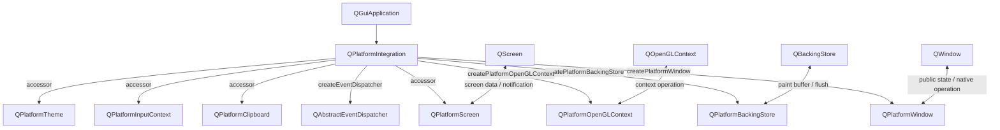
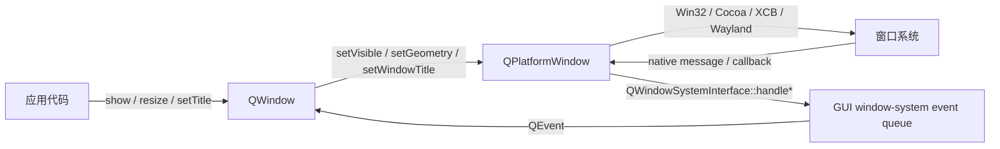
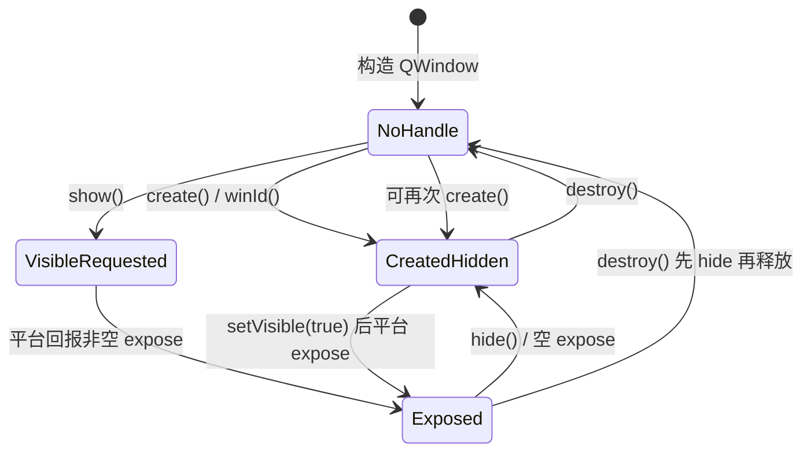
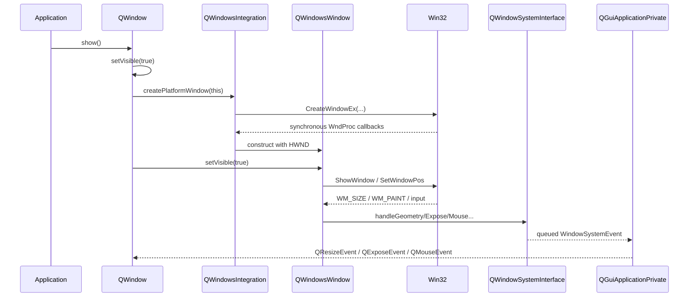

# 6. QPA 与跨平台设计

> 适用源码：QtBase 6.10.2（版本见 [`.cmake.conf`](https://github.com/qt/qtbase/blob/v6.10.2/.cmake.conf)）<br>
> 本文定位：第 10 周的平台抽象主线。目标不是记住一批 `QPlatform*` 类，而是能从应用启动、平台插件选择、窗口创建、原生消息回流、能力协商和资源销毁六个方向解释 Qt 如何隔离操作系统差异。<br>
> 前置知识：建议先完成 [`00-qtbase-overall-map.md`](sourceStudy_00-qtbase-overall-map.md) 和 [`03-event-loop-and-event-dispatch.md`](sourceStudy_03-event-loop-and-event-dispatch.md)。QPA 的输入事件最终仍要进入 GUI 线程事件分发；下一阶段的 `QPainter`、Backing Store 和 RHI 也会继续使用 QPA 提供的后端对象。

## 6.1 完成本阶段后，你应能回答什么

读完本文并完成实验后，应能用 QtBase 6.10.2 源码解释：

1. QPA 解决的边界是什么，为什么它不是一套给普通应用使用的稳定公共 API？
2. `QGuiApplication` 何时选择平台插件，`-platform`、`QT_QPA_PLATFORM` 和编译期默认值如何覆盖？
3. `QPlatformIntegrationPlugin`、`QPlatformIntegrationFactory` 与 `QPlatformIntegration` 各自承担什么职责？
4. 为什么 `QPlatformIntegration` 同时具有 Abstract Factory 和 Facade 特征？
5. `QWindow` 与 `QPlatformWindow` 为什么是 Bridge，而不是简单的“基类与子类”？
6. 为什么构造一个 `QWindow` 通常不会立即创建原生窗口，而 `show()`、`create()`、`winId()` 会触发创建？
7. Windows 下 `QWindow::show()` 如何一路到达 `CreateWindowEx()` 和 `ShowWindow()`？
8. 为什么 `CreateWindowEx()` 尚未返回时，Qt 已经可能收到 `WM_GETMINMAXINFO`、move 和 resize 消息？
9. Win32 消息如何转换为 `QWindowSystemInterface` 事件，再变成 `QMouseEvent`、`QResizeEvent` 或 `QExposeEvent`？
10. 平台事件默认同步还是异步，什么情况下会强制 flush？
11. `hasCapability()` 为什么比在通用代码中散布 `#ifdef Q_OS_WIN` 更可扩展？
12. Capability、Style Hint、Theme、Native Interface 分别表达哪一种平台差异？
13. `QPlatformSurfaceEvent::SurfaceCreated` 与 `SurfaceAboutToBeDestroyed` 对图形资源生命周期有什么意义？
14. 逻辑坐标、native pixel、窗口 frame/client geometry 为什么必须在 QPA 边界明确转换？
15. `minimal` 平台插件为什么是理解 QPA 最好的起点，却不能代表真实桌面平台的全部约束？
16. 遇到“平台插件找到了但无法加载”“窗口已 visible 但未 exposed”“原生消息没有变成 Qt 事件”时，应如何分层定位？

建议先读 6.2～6.8 建立启动和窗口创建主链，再读 6.9～6.14 建立事件回流、能力协商与生命周期模型。最后完成 6.16 的观察程序和 6.17 的 Windows 断点实验。

---

## 6.2 先建立正确边界：QPA 是什么，不是什么

QPA 是 Qt Platform Abstraction，即 Qt GUI 与具体窗口系统之间的内部平台抽象层。它把“Qt 想做什么”和“操作系统具体怎样做”隔开：

```text
应用 / Widgets / Qt Quick
        ↓ 使用稳定公共 API
QGuiApplication、QWindow、QScreen、QBackingStore、QOpenGLContext
        ↓ 委托平台工作
QPA 接口：QPlatformIntegration、QPlatformWindow、QPlatformScreen、...
        ↓ 平台插件实现
Windows / Cocoa / XCB / Wayland / EGLFS / offscreen / minimal
        ↓
Win32、AppKit、X11/XCB、Wayland protocol、设备 framebuffer
```

QPA 的价值不是“消灭平台差异”，而是把差异压缩到一组明确的接缝中：

- 向下的命令：创建窗口、改变几何、显示、设置光标、创建 backing store。
- 向上的事件：鼠标、键盘、触摸、窗口几何、屏幕、焦点、expose。
- 能力协商：某个后端是否支持窗口 mask、foreign window、线程化 OpenGL 等。
- 原生逃生口：确实需要平台特性时，显式进入 native interface。

### 6.2.1 QPA 不是稳定公共 API

[`qplatformintegrationplugin.h`](https://github.com/qt/qtbase/blob/v6.10.2/src/gui/kernel/qplatformintegrationplugin.h) 的文件头直接警告：它属于 QPA API，不面向应用；使用它可能导致未来 Qt 版本的源码和二进制不兼容。这个边界很重要：

| 层 | 典型类型 | 稳定性预期 | 普通应用是否应直接依赖 |
|---|---|---|---|
| Public Qt API | `QWindow`、`QScreen`、`QBackingStore` | Qt 兼容政策覆盖 | 是 |
| QPA API | `QPlatformWindow`、`QPlatformIntegration` | 可随 Qt 内部演进 | 通常否 |
| 平台插件内部 | `QWindowsWindow`、`QXcbWindow`、`QCocoaWindow` | 实现细节 | 否 |
| 原生 OS API | `HWND`、`NSWindow`、`xcb_window_t` | 由平台定义 | 仅在确有需要时 |

因此，“Qt 支持写平台插件”不等于“应用应链接 QtGuiPrivate 并随意调用 QPA”。QPA 更像 Qt 自己的内部端口协议。

### 6.2.2 跨平台不是所有平台行为完全相同

Qt 提供的是统一语义和可查询差异，不保证所有窗口管理器产生完全相同的时序。例如：

- 有的平台允许应用决定顶层窗口位置，有的平台由 compositor 决定。
- 有的平台有稳定的全局坐标，有的平台刻意不暴露。
- `show()` 表示请求显示，不等于调用返回时窗口已经 exposed。
- 激活窗口通常是请求，窗口管理器可以拒绝。
- 原生 frame、阴影、安全区域和 DPI 策略不同。

正确的跨平台代码应依赖 Qt 契约、异步状态和 capability，而不是把某个平台的一次观察当成全局真理。

---

## 6.3 QPA 的对象地图：一个根工厂，多组双向桥

QPA 不是一个类，而是一组按职责拆开的平台对象。根入口是 `QPlatformIntegration`：



### 6.3.1 `QPlatformIntegration` 的三个角色

从 [`qplatformintegration.h`](https://github.com/qt/qtbase/blob/v6.10.2/src/gui/kernel/qplatformintegration.h) 可以看到三类接口：

1. **Abstract Factory**：`createPlatformWindow()`、`createPlatformBackingStore()`、`createPlatformOpenGLContext()`、`createEventDispatcher()`。
2. **Facade**：字体数据库、剪贴板、拖放、输入法、辅助功能、服务和主题从同一个平台入口取得。
3. **Capability Provider**：`hasCapability()`、`styleHint()`、`defaultWindowState()` 报告运行时差异。

它不是所有平台功能的“上帝对象实现”。它是平台子系统的装配根：负责创建或暴露职责更窄的对象。

### 6.3.2 create 与 accessor 的所有权约定

[`qplatformintegration.cpp`](https://github.com/qt/qtbase/blob/v6.10.2/src/gui/kernel/qplatformintegration.cpp) 的类文档说明：

- 名称以 `create` 开头的函数返回新对象，integration 不拥有它们。
- 非 `create` 的 accessor 通常返回 integration 管理或共享的成员。

例如 `QWindowPrivate::create()` 保存 `createPlatformWindow()` 的结果，并在销毁窗口时删除；而 `clipboard()` 更像平台服务入口，不随单个窗口销毁。

### 6.3.3 为什么拆成多组小桥

窗口、屏幕、绘制缓冲、OpenGL context、剪贴板的生命周期和性能约束完全不同。如果只定义一个巨大的 `Platform` 接口：

- 每次新增能力都会扩大所有后端的实现面。
- 单个窗口的状态会污染全局平台对象。
- 测试替身难以只替换一个职责。
- 无法清晰表达每种资源的所有权。

QPA 用根工厂装配多个窄接口，既保持统一入口，也避免把所有差异塞进一个类。

---

## 6.4 启动链：平台插件在什么时候被选中

平台 integration 必须在创建 GUI 事件分发器、屏幕和窗口之前确定。核心路径位于 [`qguiapplication.cpp`](https://github.com/qt/qtbase/blob/v6.10.2/src/gui/kernel/qguiapplication.cpp)：

```text
QGuiApplication 构造 / QCoreApplicationPrivate::init
    → QGuiApplicationPrivate::createPlatformIntegration()
        → 解析平台名、插件路径、主题和参数
        → init_platform(...)
            → QPlatformIntegrationFactory::keys(...)
            → QPlatformIntegrationFactory::create(...)
                → QFactoryLoader 在 platforms 子目录找插件
                → QPlatformIntegrationPlugin::create(...)
                → 返回具体 QPlatformIntegration
    → platformIntegration->createEventDispatcher()
    → eventDispatcherReady()
        → platformIntegration->initialize()
```

### 6.4.1 平台名的来源与覆盖顺序

Qt 6.10.2 的主要来源按“后者覆盖前者”理解：

1. 编译期 `QT_QPA_DEFAULT_PLATFORM_NAME`。
2. Unix 桌面根据 `DISPLAY`、`WAYLAND_DISPLAY`、`XDG_SESSION_TYPE` 组织候选顺序。
3. 环境变量 `QT_QPA_PLATFORM` 覆盖当前候选。
4. 命令行 `-platform name[:options]` 再覆盖环境变量。

插件搜索路径可由 `QT_QPA_PLATFORM_PLUGIN_PATH` 或 `-platformpluginpath` 指定；主题可由 `QT_QPA_PLATFORMTHEME` 或 `-platformtheme` 指定。

Windows 示例：

```powershell
$env:QT_QPA_PLATFORM = 'windows:verbose=2'
& .\qpa_trace.exe

# 命令行选择会覆盖上面的环境选择
& .\qpa_trace.exe -platform minimal
```

多个候选以分号分隔，单个平台的参数以冒号继续分隔。`init_platform()` 会按顺序尝试候选，创建成功后停止。

### 6.4.2 插件发现与插件实例化是两件事

[`qplatformintegrationfactory.cpp`](https://github.com/qt/qtbase/blob/v6.10.2/src/gui/kernel/qplatformintegrationfactory.cpp) 用 `QFactoryLoader` 扫描 `platforms` 插件目录。以 Windows 插件为例：

```text
windows.json
    Keys = ["windows"]

QWindowsIntegrationPlugin
    Q_PLUGIN_METADATA(... FILE "windows.json")
    create("windows", params, argc, argv)
        → new QWindowsGdiIntegration(params)
```

“Available platform plugins 包含 windows”只证明元数据被发现，不证明插件能完成动态加载和初始化。依赖 DLL 缺失、Debug/Release 或架构不匹配，都可能造成“found but could not load”。

### 6.4.3 平台插件和主题插件不要混为一谈

平台插件负责窗口系统主干；主题负责 palette、字体、图标和平台 UI hint。`init_platform()` 先创建 integration，再按以下顺序选择主题：

1. 显式平台主题名。
2. 某些 Unix sandbox 的 portal 主题。
3. integration 推荐的主题名。
4. 主题插件 factory。
5. integration 自己的 `createPlatformTheme()`。
6. 内建空主题兜底。

主题创建失败通常不等于平台窗口系统创建失败，因为存在 null theme fallback。

---

## 6.5 插件层：Factory、Plugin 与 Integration 不要混成一个概念

| 层 | Windows 代表 | 解决的问题 |
|---|---|---|
| 元数据与动态加载 | `windows.json`、`QFactoryLoader` | 哪个库声称支持 key `windows` |
| 插件适配器 | `QWindowsIntegrationPlugin` | 由 key 和参数创建 integration |
| 平台装配根 | `QWindowsIntegration` / `QWindowsGdiIntegration` | 创建窗口、backing store、dispatcher，提供服务和能力 |
| 单资源后端 | `QWindowsWindow`、`QWindowsBackingStore` | 落地一个窗口或绘制缓冲的 native 行为 |

这样分层有两个收益：

- 加载机制不需要知道 Win32、Cocoa 或 XCB 类型。
- 通用 GUI 代码只保存 `QPlatformIntegration*` 和 `QPlatformWindow*`，不依赖具体平台类。

设计模式标签只是起点：

- Factory 解决“运行时选哪个实现”。
- Abstract Factory 解决“被选中的平台怎样创建一族相容对象”。
- Plugin 解决“实现怎样独立部署和发现”。
- Bridge 解决“公共抽象怎样把每个对象的操作委托给平台实现”。

如果只说“QPA 使用工厂模式”，会漏掉对象族一致性、双向事件和资源生命周期三件更重要的事。

---

## 6.6 `QWindow` / `QPlatformWindow`：真正的 Bridge

`QWindow` 是应用可见的公共抽象，保存平台无关状态和 Qt 事件入口；`QPlatformWindow` 是该窗口的 native 实现端。它们一一关联，但职责方向不同：



### 6.6.1 两边都不能替代另一边

`QWindow` 负责：

- Qt 属性、信号和对象生命周期。
- logical geometry、visibility、window state。
- `event()`、`exposeEvent()`、`mousePressEvent()` 等公共事件入口。
- 持有 `QPlatformWindow*`，并决定何时创建/销毁。

`QPlatformWindow` 负责：

- 原生 handle、frame margins、native geometry。
- 显示、隐藏、移动、缩放、激活、抓取等平台操作。
- 把 native 状态变化报告回 Qt GUI。

这不是继承关系，而是组合桥接。公共抽象和平台实现可以沿各自维度变化。

### 6.6.2 handle 是延迟创建的边界

`QWindowPrivate::platformWindow` 初始为 `nullptr`。以下操作会触发平台资源创建：

- `QWindow::create()`：显式创建，但不显示。
- `show()` / `setVisible(true)`：需要显示时隐式创建。
- `winId()`：需要原生 ID，因此会隐式创建。
- 其他要求平台资源的接口也可能触发创建。

不要为了“看看 HWND 是多少”过早调用 `winId()`，因为这会改变被观察对象的生命周期和后续事件顺序。

---

## 6.7 `QWindow::show()` 到原生窗口：通用主链

先看不带平台细节的调用链：

```text
QWindow::show()
    → platformIntegration->defaultWindowState(flags)
    → showNormal() / showMaximized() / showFullScreen()
        → setVisible(true)
            → QWindowPrivate::setVisible(true)
                → 更新 Qt visible / visibility 并发信号
                → 若 handle 不存在：QWindow::create()
                    → QWindowPrivate::create()
                        → 必要时先创建 parent
                        → platformIntegration->createPlatformWindow(q)
                        → platformWindow->initialize()
                        → 同步发送 SurfaceCreated
                → 同步发送 QShowEvent
                → platformWindow->setVisible(true)
```

几个容易错的点：

1. `visible == true` 是 Qt 的请求状态，不等于窗口已经 exposed。
2. 隐藏一个尚未创建的窗口不会为了隐藏而创建 native handle。
3. child window 可因 parent 尚未创建而延迟创建。
4. 创建 child 的 handle 时会先创建 parent；只创建 parent 不会无条件创建所有 child。
5. `SurfaceCreated` 在 `QPlatformWindow` 已存在时同步发送。

[`tst_qwindow.cpp`](https://github.com/qt/qtbase/blob/v6.10.2/tests/auto/gui/kernel/qwindow/tst_qwindow.cpp) 对这些不变量都有直接断言，包括 lazy create、parent/child 创建顺序、hide 不创建 handle 和 platform surface 事件时序。

### 6.7.1 `show()` 不是固定等价于 `showNormal()`

顶层窗口先询问 `QPlatformIntegration::defaultWindowState()`。某些平台或窗口类型可以默认全屏或最大化；child window 才直接走 `showNormal()`。这再次说明通用代码应询问平台策略，而不是硬编码桌面 Windows 的观察。

### 6.7.2 Show、Resize、Expose 的边界

Qt 自动测试对常规场景验证：

```text
QEvent::Show < QEvent::Resize < QEvent::Expose
```

但源码也明确提醒：平台层在 native 创建过程中可能同步产生 resize/expose，因此创建期存在重入窗口。不要把“所有平台任何情况下都绝不提前产生 native 消息”当成契约。

---

## 6.8 Windows 落地：从工厂到 `CreateWindowEx()`

Windows 分支从 [`qwindowsintegration.cpp`](https://github.com/qt/qtbase/blob/v6.10.2/src/plugins/platforms/windows/qwindowsintegration.cpp) 进入：

```text
QWindowPrivate::create()
    → QWindowsIntegration::createPlatformWindow(QWindow*)
        → 收集 flags、logical geometry、自定义 margins
        → QHighDpi 转成 native pixel geometry
        → QWindowsWindowData::create(...)
            → WindowCreationData::fromWindow(...)
            → WindowCreationData::create(...)
                → 注册 window class，WndProc = qWindowsWndProc
                → 建立 QWindowCreationContext
                → CreateWindowEx(...)
                → 收集实际 geometry / frame margins
            → initialize(...)
        → createPlatformWindowHelper(...)
        → new QWindowsWindow(...)
```

显示阶段则继续：

```text
QWindowPrivate::setVisible(true)
    → QWindowsWindow::setVisible(true)
        → show_sys()
            → ShowWindow / SetWindowPos 等 Win32 操作
        → layered window 必要时主动产生 full expose
```

### 6.8.1 为什么创建前要保存 `QWindowCreationContext`

Win32 的 `CreateWindowEx()` 不是“创建完再发事件”的纯函数。在它返回 `HWND` 之前，系统就可能同步调用已注册的 WndProc，例如询问最小/最大尺寸、non-client area、初始 move/resize。

此时存在一个鸡生蛋问题：

```text
尚未取得 HWND
    → 无法完成 HWND → QWindowsWindow 的注册映射
    → 但 WndProc 已收到与该窗口有关的消息
```

Qt 用临时 `QWindowCreationContext` 解决：

- 保存正在创建的 `QWindow`、screen、请求 geometry、style 和 margins。
- 在正式 `QWindowsWindow` 尚不存在时回答 `WM_GETMINMAXINFO` 等消息。
- 收集系统修正后的初始 position 和 size。
- `QWindowsWindow` 建立后清除 creation context，后续消息走正常 handle 映射。

这是一个典型的“构造期间重入”协议。它提醒你：只要调用的 native API 可能回调，构造和注册顺序就必须按可重入路径设计。

### 6.8.2 请求 geometry 不等于实际 geometry

平台可能因为以下原因修正窗口几何：

- frame 和 custom margins。
- 系统最小尺寸。
- DPI 和 per-monitor scaling。
- RTL child position 镜像。
- 窗口管理器布局策略。
- 默认位置 `CW_USEDEFAULT`。

因此 Windows 创建路径同时保存 requested 与 obtained 数据，而不是假设 `CreateWindowEx()` 原样接受输入。

---

## 6.9 反向主链：原生事件如何回到 `QWindow`

QPA 必须是双向的。以 Windows 鼠标消息为例：

```text
QEventDispatcherWin32::processEvents()
    → PeekMessage()
    → TranslateMessage()
    → DispatchMessage()
        → qWindowsWndProc(HWND, message, ...)
            → windowsEventType(...)
            → QWindowsContext::windowsProc(...)
                → HWND 查找 QWindowsWindow
                → native event filters
                → QWindowsPointerHandler::translateMouseEvent(...)
                    → 坐标、按键、设备、来源归一化
                    → QWindowSystemInterface::handleMouseEvent(...)
                        → native pixel 转 logical position
                        → 入 GUI window-system event queue
                            → GUI dispatcher 唤醒
                            → sendWindowSystemEvents()
                                → QGuiApplicationPrivate::processWindowSystemEvent()
                                    → processMouseEvent()
                                    → QMouseEvent
                                    → QWindow / focus object
```

注意这里有两条不同的队列：

- Win32 message queue：`MSG`、`PeekMessage()`、`DispatchMessage()`。
- Qt GUI window-system event queue：`QWindowSystemInterfacePrivate::WindowSystemEvent`。

它们不是 QObject 的普通 posted event queue，但都由同一个 GUI event dispatcher 周期协调处理。

### 6.9.1 WndProc 的三段职责

[`qwindowscontext.cpp`](https://github.com/qt/qtbase/blob/v6.10.2/src/plugins/platforms/windows/qwindowscontext.cpp) 中的路径可概括为：

1. **识别**：把 `UINT message` 归类成 Qt Windows 内部事件类型。
2. **路由**：由 `HWND` 找 `QWindowsWindow`，先运行应用级和窗口级 native event filter。
3. **翻译**：键盘、鼠标、窗口几何、焦点、close、expose 分派给专用 handler；未处理消息交回 `DefWindowProc()`。

这比在一个巨型 switch 中直接构造所有 `QEvent` 更易维护：各 handler 能保留设备状态、合成事件和平台 bug workaround。

### 6.9.2 native handled 与 Qt event accepted 不完全相同

WndProc 返回“是否由 Qt 平台插件处理”，决定是否调用 `DefWindowProc()`；Qt event 的 `accepted` 表示接收者是否接受某个 Qt 语义事件。两者处于不同层，不能直接等同。

例如某些 non-client mouse 事件会先报告给 Qt，同时返回 false 让 Windows 继续默认处理标题栏行为。

---

## 6.10 `QWindowSystemInterface`：平台到 Qt GUI 的协议边界

[`qwindowsysteminterface.h`](https://github.com/qt/qtbase/blob/v6.10.2/src/gui/kernel/qwindowsysteminterface.h) 提供平台插件向上报告事件的统一入口，包括：

- `handleMouseEvent()`、`handleKeyEvent()`、`handleTouchEvent()`。
- `handleGeometryChange()`、`handleExposeEvent()`、`handleCloseEvent()`。
- 屏幕添加、移除、geometry、DPI、orientation 变化。
- focus、application state、theme 等变化。

平台插件不应直接调用某个 `QWindow::mousePressEvent()`。它先提交规范化的 window-system event，再由 `QGuiApplicationPrivate` 完成 Qt 级别的路由、状态维护、事件合成与发送。

### 6.10.1 默认异步投递

Qt 6.10.2 的默认路径是：

```text
handle*()
    → new WindowSystemEvent
    → append 到全局 GUI window-system event queue
    → GUI event dispatcher wakeUp()
    → 稍后 sendWindowSystemEvents()
```

这样做有三个目的：

- 让来自其他线程或 native callback 的事件在 GUI 线程统一处理。
- 把平台采集与 Qt 对象分发解耦。
- 允许 event dispatcher 根据 `ExcludeUserInputEvents` 等 flags 选择队列项。

### 6.10.2 同步投递与 flush

QPA 也支持 synchronous delivery：

- 若当前就在 GUI 主线程，可立即调用 `processWindowSystemEvent()` 并返回 accepted 状态。
- 若来自其他线程，会先异步入队，再阻塞等待 GUI 线程 flush。

`flushWindowSystemEvents()` 跨线程时使用专门的 `FlushEventsEvent` 和 wait condition。它不是廉价的普通函数调用；错误使用会扩大重入或死锁风险。

Windows 对额外鼠标按钮有一个具体例子：为了让未处理的 `WM_XBUTTONDOWN` 继续产生 `WM_APPCOMMAND`，handler 需要同步知道 Qt 是否接受，于是会 flush。

### 6.10.3 事件转换不只是改类型名

`QGuiApplicationPrivate::processWindowSystemEvent()` 还负责：

- 维护 focus、mouse buttons、window geometry 和 exposed 状态。
- 根据平台能力在 expose 与 paint 之间合成事件。
- 处理高 DPI 坐标。
- 生成 enter/leave、双击、触摸与鼠标之间的必要语义。
- 找到最终 focus object 或目标 window。

因此，平台插件应报告原始但规范化的事实，Qt GUI 核心负责公共语义。

---

## 6.11 Capability：把“平台是谁”改写成“平台能做什么”

错误的通用层设计常长这样：

```cpp
#ifdef Q_OS_WIN
    useStaticBackingStoreOptimization();
#elif defined(Q_OS_LINUX)
    ...
#endif
```

问题是“Linux”可以是 XCB、Wayland、EGLFS、linuxfb、VNC；同一个平台插件在不同驱动或配置下能力也可能不同。平台身份不是行为能力的可靠代理。

QPA 改为：

```cpp
if (integration->hasCapability(QPlatformIntegration::BackingStoreStaticContents))
    useStaticBackingStoreOptimization();
```

[`qplatformintegration.h`](https://github.com/qt/qtbase/blob/v6.10.2/src/gui/kernel/qplatformintegration.h) 中的 capability 覆盖：

| 类别 | 示例 | 通用层据此决定什么 |
|---|---|---|
| 并发绘制 | `ThreadedPixmaps`、`ThreadedOpenGL` | 是否允许某类绘制离开 GUI 线程 |
| 窗口系统 | `WindowMasks`、`ForeignWindows`、`WindowActivation` | API 是否可兑现或应降级 |
| 绘制模型 | `PaintEvents`、`BackingStoreStaticContents` | 谁产生 paint、能否复用旧像素 |
| 图形后端 | `OpenGL`、`RhiBasedRendering`、`OffscreenSurface` | 是否创建硬件图形资源或走替代后端 |
| 窗口管理 | `NonFullScreenWindows`、`WindowManagement` | 是否允许常规窗口和位置/状态控制 |

### 6.11.1 Capability 是协议，不是装饰性描述

例如 `PaintEvents`：

- capability 为 false 时，Qt 会从 expose event 合成 paint event。
- capability 为 true 时，平台必须显式发送 paint event。
- 平台发送 paint event 却没有声明能力，源码会触发断言。

因此 capability 的两端必须一致：平台声明什么，通用层就按相应协议执行。

### 6.11.2 Capability 仍不能解决所有差异

当差异不是布尔能力时，需要其他抽象：

- 返回一个数值或策略：`styleHint()`、`defaultWindowState()`。
- 返回服务对象：clipboard、drag、input context、services。
- 暴露平台特有 API：native interface。
- 编译期根本不存在的 OS 类型：小范围 `#ifdef`。

目标不是消灭条件分支，而是让条件出现在表达力正确、范围最小的边界。

---

## 6.12 四种跨平台差异表达方式

| 差异类型 | 首选机制 | 例子 |
|---|---|---|
| 同一语义，不同实现 | 虚函数/Bridge | `QPlatformWindow::setVisible()` |
| 能做或不能做 | Capability | `WindowActivation` |
| 同一问题，不同策略值 | Style Hint / Theme Hint | 双击间隔、默认窗口状态 |
| Qt 公共 API 不覆盖的平台特性 | Native Interface | 原生 context、display、screen handle |

### 6.12.1 选择顺序

写应用或扩展 Qt 时，按以下顺序问：

1. 公共 Qt API 能否表达需求？能就停在公共层。
2. 是否只是需要检测能力并提供降级？使用公共 capability 或行为探测。
3. 是否存在受支持的 `QNativeInterface` 类型？优先类型化接口。
4. 是否只能取得 native handle 或安装 native event filter？把代码封装进窄平台适配器。
5. 是否准备直接依赖 QPA private API？先确认你能承担每个 Qt 版本重编和适配成本。

### 6.12.2 Native Interface 是显式逃生口

Native interface 的好处是平台耦合变得可见：调用点明确承认“从这里开始不是通用 Qt 语义”。但它也带来代价：

- 需要平台条件编译。
- handle 生命周期依赖对应 Qt 对象和 native 资源。
- Wayland、X11、Windows 之间没有可替换的共同语义。
- 某些接口属于 `QNativeInterface::Private`，稳定性不等于公共接口。

把 native 调用集中在一个 adapter 中，比在业务层到处取 `winId()` 和强转 handle 更容易测试与移植。

---

## 6.13 高 DPI 与 geometry：跨平台边界也是坐标边界

Qt 公共 API 通常使用 device-independent pixel（设备无关像素）；原生窗口系统往往使用 native pixel。QPA 必须在进入和离开平台层时转换：

```text
QWindow logical geometry
    → QHighDpi::toNativePixels / toNativeWindowGeometry
    → QPlatformWindow / native API geometry
    → OS 回报 native geometry
    → QWindowSystemInterface
    → QHighDpi::fromNative...
    → QWindow logical geometry / QEvent position
```

Windows 创建路径在 `QWindowsIntegration::createPlatformWindow()` 中把顶层窗口 geometry 转为 native pixel；鼠标事件在 `QWindowSystemInterface::handleMouseEvent()` 中转回 logical position。

### 6.13.1 三种 geometry 不要混用

| 几何 | 含义 | 常见使用者 |
|---|---|---|
| Client geometry | 可绘制客户区，不含系统 frame | `QWindow::geometry()` 的主要语义 |
| Frame geometry | 包含标题栏、边框等装饰 | 窗口定位、保存外框位置 |
| Native geometry | 平台坐标和 native pixel 表示 | `QPlatformWindow` 与 OS API |

还要区分：

- 顶层窗口坐标与 child 的 parent-local 坐标。
- logical size 与 native size。
- requested geometry 与窗口系统最终接受的 geometry。
- window screen 与跨屏移动后的新 screen。

### 6.13.2 为什么 DPI 变化是事件，不只是一次乘法

窗口跨屏后 device pixel ratio 可能变化。已有 backing store、OpenGL surface、缓存图像和输入坐标都要在一致边界更新。QPA 会报告 screen/DPR 变化；Qt GUI 在 expose 前还会做一次 fail-safe 检查，并在发现缓存 DPR 过期时发出警告。

正确心智模型是：

```text
DPI 是窗口生命周期中的动态状态
而不是应用启动时读取一次的全局常量
```

---

## 6.14 平台资源生命周期：`QWindow` 活着不等于 native surface 一直活着

`QWindow` 是 Qt 对象；`QPlatformWindow` 和 native handle 是可创建、销毁、重建的平台资源。两者生命周期不同：



### 6.14.1 创建协议

`QWindowPrivate::create()` 的关键顺序：

1. 确保 parent native window 已创建。
2. 根据 foreign window property 选择 `createForeignWindow()` 或 `createPlatformWindow()`。
3. 保存 `QPlatformWindow*`。
4. 调用 `initialize()`。
5. 处理可见 child 和 parent 关系。
6. 同步发送 `QPlatformSurfaceEvent::SurfaceCreated`。
7. 更新 DPR，恢复丢失的 update request。

图形资源应在 `SurfaceCreated` 后绑定到 surface，而不是只看 `QWindow` 构造完成。

通过 `fromWinId()` 等方式包装的 foreign window 是例外：Qt 不拥有外部 native window，`QWindow::destroy()` 不会按普通自有窗口路径删除它。

### 6.14.2 销毁协议

`QWindowPrivate::destroy()` 的关键顺序：

1. 递归销毁 child platform windows。
2. 记录此前 visibility，调用 `setVisible(false)`。
3. 同步发送 `SurfaceAboutToBeDestroyed`，让图形资源先清理。
4. 先把 `platformWindow` 交换为 `nullptr`，再 delete 旧指针。
5. 修正 focus、mouse、tablet 等全局状态引用。

“先清空成员再 delete”是为防止平台析构过程中收到回调，又通过 `QWindow` 递归访问正在销毁的 platform window。

### 6.14.3 `close()`、`hide()`、`destroy()` 不是同义词

| 操作 | Qt visible | Native handle | 可否再次显示 |
|---|---|---|---|
| `hide()` | false | 通常保留 | 可以，成本较低 |
| `close()` | 同步请求 close；接收者可拒绝 | 接受后实际进入 `destroy()`；事件处理也可能删除对象 | 拒绝时保持；接受后若对象仍在可重建 |
| `destroy()` | 先隐藏 | 释放 platform resources | 可以再次 `create()` |
| 析构 `QWindow` | 对象结束 | 必须释放 | 不可以 |

不要用 `isVisible()` 推断 handle 存在，也不要用 `handle() != nullptr` 推断窗口已 exposed。

---

## 6.15 `minimal` 插件：用最小实现看清强制接口与默认行为

[`src/plugins/platforms/minimal`](https://github.com/qt/qtbase/tree/v6.10.2/src/plugins/platforms/minimal) 是最适合第一轮阅读的平台插件。它把平台系统压缩到几个必要部件：

```text
QMinimalIntegrationPlugin
    → QMinimalIntegration
        → createPlatformWindow(): new QPlatformWindow(window)
        → createPlatformBackingStore(): new QMinimalBackingStore(window)
        → createEventDispatcher(): Win32 或 Unix dispatcher
        → hasCapability(): 少量覆盖
```

`QMinimalIntegration::createPlatformWindow()` 甚至直接创建基类 `QPlatformWindow`。基类 `setVisible()` 会同步报告 expose 并 flush，所以即使没有真实桌面窗口，也能让上层继续运行部分 GUI 逻辑。

### 6.15.1 它告诉你什么

- 一个平台插件最少必须创建哪些对象。
- `QPlatformIntegration` 的默认实现能提供哪些 fallback。
- Backing store 怎样与一个没有真实窗口系统的后端配合。
- 为什么 Qt 的自动测试和命令行 GUI 工具可在 headless 环境运行。

### 6.15.2 它不能告诉你什么

- 真实窗口管理器的异步确认和拒绝。
- native callback 的创建期重入。
- 多屏、DPI、输入法、剪贴板和拖放的完整状态机。
- 平台合成器、GPU surface 和窗口装饰的约束。

正确阅读顺序是先用 minimal 看接口骨架，再用 Windows/XCB/Cocoa/Wayland 中的一条真实行为链校准复杂度。

---

## 6.16 实践一：写一个 QPA 可观察窗口

这个程序不依赖 QPA private header。它从公共层观察：

- 平台插件名。
- `QWindow` 的 lazy handle creation。
- `PlatformSurface`、Show、Resize、Expose、Hide 的顺序。
- Windows native message 与 Qt event 的相邻关系。

### 6.16.1 `main.cpp`

```cpp
#include <QAbstractNativeEventFilter>
#include <QEvent>
#include <QGuiApplication>
#include <QMouseEvent>
#include <QPlatformSurfaceEvent>
#include <QTimer>
#include <QWindow>
#include <QDebug>

#ifdef Q_OS_WIN
#  include <qt_windows.h>
#endif

class NativeTraceFilter final : public QAbstractNativeEventFilter
{
public:
    bool nativeEventFilter(const QByteArray &eventType,
                           void *message,
                           qintptr *result) override
    {
        Q_UNUSED(result);
#ifdef Q_OS_WIN
        if (eventType == "windows_generic_MSG") {
            const auto *msg = static_cast<const MSG *>(message);
            switch (msg->message) {
            case WM_SHOWWINDOW:
            case WM_SIZE:
            case WM_MOVE:
            case WM_PAINT:
            case WM_MOUSEMOVE:
            case WM_LBUTTONDOWN:
            case WM_LBUTTONUP:
                qInfo().nospace()
                    << "native message=0x" << Qt::hex << msg->message
                    << " hwnd=" << msg->hwnd << Qt::dec;
                break;
            default:
                break;
            }
        }
#else
        Q_UNUSED(eventType);
        Q_UNUSED(message);
#endif
        return false; // 只观察，不截断平台默认处理
    }
};

class TracingWindow final : public QWindow
{
public:
    using QWindow::QWindow;

protected:
    bool event(QEvent *event) override
    {
        const char *name = nullptr;
        switch (event->type()) {
        case QEvent::PlatformSurface: {
            const auto *surfaceEvent =
                static_cast<QPlatformSurfaceEvent *>(event);
            name = surfaceEvent->surfaceEventType()
                    == QPlatformSurfaceEvent::SurfaceCreated
                ? "SurfaceCreated"
                : "SurfaceAboutToBeDestroyed";
            break;
        }
        case QEvent::Show: name = "Show"; break;
        case QEvent::Hide: name = "Hide"; break;
        case QEvent::Resize: name = "Resize"; break;
        case QEvent::Move: name = "Move"; break;
        case QEvent::Expose: name = "Expose"; break;
        case QEvent::MouseButtonPress: name = "MouseButtonPress"; break;
        case QEvent::MouseButtonRelease: name = "MouseButtonRelease"; break;
        case QEvent::Close: name = "Close"; break;
        default: break;
        }

        if (name) {
            qInfo().nospace()
                << "Qt event=" << name
                << " visible=" << isVisible()
                << " exposed=" << isExposed()
                << " hasHandle=" << (handle() != nullptr)
                << " geometry=" << geometry();
        }
        return QWindow::event(event);
    }
};

int main(int argc, char **argv)
{
    QGuiApplication app(argc, argv);
    NativeTraceFilter nativeFilter;
    app.installNativeEventFilter(&nativeFilter);

    qInfo() << "platform=" << QGuiApplication::platformName();

    TracingWindow window;
    window.setTitle(QStringLiteral("QPA trace"));
    window.resize(640, 360);

    qInfo() << "before show: hasHandle=" << (window.handle() != nullptr);
    window.show();
    qInfo() << "after show: hasHandle=" << (window.handle() != nullptr)
            << "winId=" << window.winId();

    QTimer::singleShot(8000, &window, [&window] {
        // 在派生对象仍完整时释放平台资源，确保重写的 event() 能观察销毁事件。
        window.destroy();
        QCoreApplication::quit();
    });
    return app.exec();
}
```

`nativeEventFilter()` 必须返回 false，因为本实验只观察消息。返回 true 会改变窗口系统行为，让实验从 tracing 变成 interception。

退出前要显式调用 `window.destroy()`。若只退出事件循环并等待栈对象析构，`QWindow` 基类析构阶段才会释放平台资源；此时派生类的 `event()` 已不再参与虚分派，`TracingWindow` 就记录不到 `SurfaceAboutToBeDestroyed`。

### 6.16.2 `CMakeLists.txt`

```cmake
cmake_minimum_required(VERSION 3.22)
project(qpa_trace LANGUAGES CXX)

find_package(Qt6 6.10 REQUIRED COMPONENTS Gui)

qt_add_executable(qpa_trace main.cpp)
target_link_libraries(qpa_trace PRIVATE Qt6::Gui)
target_compile_features(qpa_trace PRIVATE cxx_std_17)
```

### 6.16.3 构建和运行

使用已构建或已安装的 Qt 6.10.2。下面的 `qt-cmake.bat` 路径应替换成你的 Qt 构建目录或安装前缀：

```powershell
& 'C:\path\to\Qt-6.10.2\bin\qt-cmake.bat' -S . -B build
cmake --build build --config Debug

$env:QT_LOGGING_RULES = 'qt.qpa.plugin=true;qt.qpa.window=true;qt.qpa.events=true'
& .\build\Debug\qpa_trace.exe -platform windows:verbose=2
```

如果使用单配置生成器，可执行文件可能位于 `build\qpa_trace.exe`，而不是 `build\Debug`。

### 6.16.4 你应观察什么

不要死记每条日志的绝对顺序；记录以下不变量：

1. `before show` 时 handle 为 false。
2. `show()` 返回前通常已创建 platform surface，因此 `after show` 有 handle。
3. `isVisible()` 可先变 true；`isExposed()` 要等待平台回报 expose。
4. native `WM_*` 与 Qt event 之间隔着平台翻译和 window-system event queue。
5. 八秒退出时，surface 销毁事件发生在 handle 释放前。

再对比运行：

```powershell
& .\build\Debug\qpa_trace.exe -platform minimal
```

`minimal` 没有真实 Win32 window，所以不会出现同样的 native message；但基类 `QPlatformWindow` 仍会生成 expose 语义。这正是“相同公共契约，不同后端机制”。

### 6.16.5 扩展实验

1. 在 `show()` 前调用 `create()`，观察 SurfaceCreated 与 Show 分离。
2. 在 `show()` 前调用 `winId()`，证明它也强制创建 handle。
3. 在定时器中依次 `hide()`、`show()`，确认 handle 通常复用。
4. 调用 `destroy()` 后再次 `show()`，观察 platform surface 重建。
5. 创建 parent/child 两个 `QWindow`，分别改变创建和显示顺序。
6. 把窗口拖到不同 DPI 的屏幕，记录 logical geometry 与事件。
7. 在 event handler 内调用 `hide()`，观察重入和后续 expose/hide。

---

## 6.17 实践二：Windows 下跟踪一次 `QWindow::show()`

### 6.17.1 调试准备

需要 QtBase 6.10.2 的 Debug 构建和对应 PDB。为避免插件加载噪声掩盖主链，可先只打开窄日志：

```powershell
$env:QT_DEBUG_PLUGINS = '1'
$env:QT_LOGGING_RULES = 'qt.qpa.plugin=true;qt.qpa.window=true;qt.qpa.events=false'
& .\qpa_trace.exe -platform windows:verbose=1
```

确认加载的是你正在阅读的 6.10.2 `qwindows` 插件，而不是系统中另一套 Qt。

### 6.17.2 第一组断点：平台选择

按顺序设置：

```text
QGuiApplicationPrivate::createPlatformIntegration
init_platform
QPlatformIntegrationFactory::create
QWindowsIntegrationPlugin::create
QWindowsIntegration::QWindowsIntegration
QWindowsIntegration::createEventDispatcher
QWindowsIntegration::initialize
```

观察：

- `platformName` 最终来自默认值、环境还是命令行。
- `platformPluginPath` 指向哪里。
- `paramList` 是否含 `verbose=...` 等参数。
- integration constructor 与 `initialize()` 为什么分成两个阶段。

### 6.17.3 第二组断点：窗口创建

```text
QWindow::show
QWindowPrivate::setVisible
QWindowPrivate::create
QWindowsIntegration::createPlatformWindow
QWindowsWindowData::create
WindowCreationData::create
CreateWindowExW / CreateWindowEx
QWindowsWindow::QWindowsWindow
QWindowsWindow::setVisible
```

重点记录五个值：

```text
QWindow logical geometry
requested native geometry
Win32 style / exStyle
CreateWindowEx 返回的 HWND
obtained geometry / fullFrameMargins
```

### 6.17.4 第三组断点：创建期回调

```text
qWindowsWndProc
QWindowsContext::windowsProc
QWindowCreationContext::applyToMinMaxInfo
QWindowsGeometryHint::handleCalculateSize
```

当断点在 `CreateWindowEx()` 尚未返回时命中，检查：

- `findPlatformWindow(hwnd)` 是否仍为空。
- `m_creationContext` 是否非空。
- 哪些消息由临时 context 处理。
- obtained position/size 何时被写回。

这是本章最值得亲手验证的调用栈。

### 6.17.5 第四组断点：鼠标事件回流

```text
QEventDispatcherWin32::processEvents
qWindowsWndProc
QWindowsContext::windowsProc
QWindowsPointerHandler::translateMouseEvent
QWindowSystemInterface::handleMouseEvent
QWindowSystemHelper<AsynchronousDelivery>::handleEvent
QWindowSystemInterface::sendWindowSystemEvents
QGuiApplicationPrivate::processWindowSystemEvent
QGuiApplicationPrivate::processMouseEvent
TracingWindow::event
```

记录每层数据如何变化：

- `WM_LBUTTONDOWN` 与 `MSG.pt`。
- `HWND → QWindowsWindow → QWindow`。
- native local/global position。
- high-DPI 转换后的 logical position。
- `WindowSystemEvent` 的目标、button、buttons、modifiers、device。
- 最终 `QMouseEvent` 的 receiver。

### 6.17.6 一张可提交的调用序列图

完成断点后，不要只保存 IDE 截图。写成可 diff 的序列：



---

## 6.18 如何设计自己的跨平台层

QPA 的思想可以迁移到业务项目，但不要照抄所有 `QPlatform*` 类。先识别差异形状。

### 6.18.1 推荐分层

```text
业务层
    ↓ 只表达产品语义
公共端口接口
    ↓
运行时选择 / 依赖注入
    ↓
WindowsAdapter / MacAdapter / LinuxAdapter
    ↓
原生 API
```

设计时遵循：

1. 公共接口描述“要完成的语义”，不要泄漏 `HWND` 或 `NSView*`。
2. 工厂选择一族相容实现，而不是每个对象独立随机选后端。
3. 向下调用与向上事件使用不同接口，避免平台层直接回调业务私有函数。
4. 用 capability 表达可选行为，并定义不支持时的降级。
5. 把原生 escape hatch 单独标记，限制调用范围。
6. 明确 create/accessor 返回值的所有权。
7. 把创建期回调、异步确认和销毁期回调纳入状态机。

### 6.18.2 一个小型示意接口

```cpp
class DesktopIntegration
{
public:
    enum class Capability {
        GlobalShortcut,
        WindowCapture,
        NativeNotifications
    };

    virtual ~DesktopIntegration() = default;
    virtual std::unique_ptr<DesktopWindow> createWindow(WindowSpec) = 0;
    virtual bool hasCapability(Capability) const = 0;
    virtual DesktopServices &services() = 0; // accessor，不转移所有权
};
```

仍需继续定义：

- `DesktopWindow` 的事件如何回流。
- `WindowSpec` 中哪些是请求、哪些是强约束。
- `createWindow()` 期间能否同步回调。
- 对象销毁前如何通知 GPU/外部资源。
- capability 为 false 时调用者如何降级。

接口长得像 QPA 并不代表设计已经完成；协议和失败路径才是核心。

### 6.18.3 何时不值得抽象

如果某个功能：

- 只服务一个平台；
- 原生语义根本没有跨平台共同点；
- 未来没有第二实现；
- 抽象只会把一个 native API 机械改名；

那么窄平台模块加清晰条件编译可能比伪通用接口更诚实。QPA 的启发是把真实共同语义抽象出来，不是强迫所有差异拥有同一个名字。

---

## 6.19 故障定位：沿六个边界逐层排查

### 6.19.1 平台插件找不到或无法加载

先收集：

```powershell
$env:QT_DEBUG_PLUGINS = '1'
$env:QT_LOGGING_RULES = 'qt.qpa.plugin=true'
& .\your_app.exe -platform windows
```

分层判断：

1. **没有发现 key**：检查 `platforms` 目录、library paths、部署结构。
2. **发现但 load 失败**：检查依赖 DLL、架构、编译器 runtime、Debug/Release 配对。
3. **create 返回 null**：检查 key 和平台参数。
4. **integration 初始化失败**：检查显示服务器、输入/图形依赖和平台日志。

不要只把 `qwindows.dll` 复制到 exe 同级。QFactoryLoader 的插件类型目录和依赖解析同样重要。

### 6.19.2 `isVisible()` 为 true，但窗口没显示

依次检查：

```text
QWindow visible request
    → handle 是否创建
    → QPlatformWindow::setVisible 是否执行
    → native API 是否成功
    → 是否收到非空 expose
    → screen 是否有效
    → 是否被父窗口、modal、window manager 状态阻挡
```

`visible`、native visible、exposed 是三个状态。把它们压成一个布尔值会误诊。

### 6.19.3 收到 native 消息但没有 Qt event

检查：

1. native filter 是否返回 true 截断了处理。
2. `HWND` 是否能映射到 `QWindowsWindow`。
3. handler 是否因透明输入、capture、合成来源而丢弃。
4. 是否调用 `QWindowSystemInterface::handle*()`。
5. event 是否仍在 window-system queue。
6. GUI dispatcher 是否运行、是否排除了用户输入。
7. `processWindowSystemEvent()` 是否改变了 target 或合成策略。

### 6.19.4 窗口几何与预期不一致

同时记录：

- logical requested geometry。
- native requested geometry。
- frame margins/custom margins。
- obtained native geometry。
- 当前 screen 和 DPR。
- window manager 是否允许应用定位。

只打印 `QWindow::geometry()` 不足以证明是 Qt、QPA 还是窗口管理器改了值。

### 6.19.5 headless 测试偶发失败

确认测试是在 `minimal`、`offscreen` 还是真实平台插件上运行。它们的 exposed、activation、screen grabbing、paint/expose 协议并不完全相同。测试应：

- 先用 capability 判断前提。
- 使用 `QTest::qWaitForWindowExposed()` 等异步等待。
- 不把固定 sleep 当作窗口系统确认。
- 对确实不支持的能力明确 skip，而不是让断言随机失败。

---

## 6.20 自动测试如何充当 QPA 契约

优先阅读 [`tst_qwindow.cpp`](https://github.com/qt/qtbase/blob/v6.10.2/tests/auto/gui/kernel/qwindow/tst_qwindow.cpp) 的以下测试：

| 测试 | 验证的不变量 |
|---|---|
| `create()` | lazy handle、parent/child 创建顺序 |
| `setVisible()` | 显示触发创建，隐藏 parent 时 child 可延迟 |
| `setVisibleThenCreate()` | 同一个 surface 不重复发 Created |
| `setVisibleFalseDoesNotCreateWindow()` | hide 不应创建 native handle |
| `eventOrderOnShow()` | 常规 Show、Resize、Expose 顺序 |
| `platformSurface()` | surface 事件同步，且事件期间 handle 状态有效 |
| `isExposed()` | visible 与 exposed 状态分离 |
| `isActive()` | capability 不支持时测试跳过 |
| `testInputEvents()` | `QWindowSystemInterface` 到 QWindow 的输入语义 |

测试中大量使用 `QTRY_*` 和 `qWaitForWindowExposed()`，本身就在表达：窗口系统的最终状态通常异步到达。

### 6.20.1 测试 QPA 代码时的四层策略

1. **纯转换单元测试**：flags、geometry、键值、DPI 转换。
2. **假平台/最小平台测试**：验证通用层协议和生命周期。
3. **真实平台自动测试**：验证窗口、输入、屏幕和 backing store。
4. **人工/设备测试**：多屏不同 DPI、窗口管理器策略、输入法、GPU、远程桌面。

只在 minimal 插件通过不能证明真实 Windows 创建期重入安全；只在开发机 Windows 通过也不能证明 Wayland 语义正确。

---

## 6.21 常见误区与源码反证

### 误区 1：“QPA 是一个跨平台窗口类”

反证：它包含 integration、window、screen、backing store、OpenGL context、event dispatcher、input context、clipboard 等一族对象。

### 误区 2：“`QWindow` 构造时就有 HWND”

反证：`platformWindow` 初始为空；`tst_QWindow::create()` 明确验证 lazy initialization。

### 误区 3：“`show()` 返回就代表用户已经看到窗口”

反证：`visible` 是请求状态，`isExposed()` 要等平台 expose。测试使用异步等待。

### 误区 4：“`winId()` 只是无副作用查询”

反证：handle 不存在时，`winId()` 会调用 `create()`。

### 误区 5：“跨平台代码完全不应有条件编译”

反证：原生类型和真正平台特有能力需要窄条件编译；问题是不能把平台分支散布在通用语义中。

### 误区 6：“Linux 后端行为相同，所以判断 `Q_OS_LINUX` 足够”

反证：XCB、Wayland、EGLFS、linuxfb、VNC 的窗口管理、全局坐标和能力不同。

### 误区 7：“Capability 只是给日志看的”

反证：Qt 根据 `PaintEvents` 决定是否合成 paint，根据 `BackingStoreStaticContents` 决定优化协议，并对声明不一致做断言。

### 误区 8：“平台插件直接向 QWindow 发送鼠标事件”

反证：正常路径先进入 `QWindowSystemInterface`，再由 GUI 核心维护状态、选择 target 和构造公共事件。

### 误区 9：“Win32 message queue 就是 Qt posted event queue”

反证：Win32 `MSG`、GUI window-system event、QObject posted event 是不同队列，由 dispatcher 协调。

### 误区 10：“`CreateWindowEx()` 返回前不会执行 Qt 代码”

反证：Win32 会同步调用 WndProc；Qt 专门使用 `QWindowCreationContext` 处理这段时期。

### 误区 11：“requested geometry 就是最终 geometry”

反证：平台创建路径同时保存 requested 和 obtained geometry，并处理 frame、DPI、系统约束和窗口管理器修正。

### 误区 12：“hide 会释放原生窗口”

反证：hide 通常保留 platform window；`destroy()` 才释放平台资源。

### 误区 13：“QPA 是公开扩展点，所以可以跨 Qt 小版本保持二进制兼容”

反证：QPA header 明确声明可能发生源码和二进制不兼容。

### 误区 14：“minimal 能跑，就说明桌面平台行为正确”

反证：minimal 没有真实 window manager、创建期 callback、多屏输入和完整 native 状态机。

### 误区 15：“native event filter 返回 true 只代表我看到了消息”

反证：true 表示事件已处理，会阻止后续平台默认路径；纯观察 filter 必须返回 false。

---

## 6.22 自测题与答案要点

### 问题 1

为什么 `QPlatformIntegration` 既是 Abstract Factory，又有 Facade 特征？

答案要点：它创建 window/backing store/context/dispatcher 等相容平台对象族，同时集中暴露 clipboard、input、theme、services 等平台子系统入口。

### 问题 2

环境变量指定 `minimal`，命令行指定 `windows`，最终用哪个？

答案要点：命令行 `-platform` 在解析时覆盖环境变量选择，最终尝试 windows。

### 问题 3

为什么“插件 key 被列出”不能证明平台插件可用？

答案要点：元数据发现与动态库加载/依赖解析/实例创建是不同阶段；库可被发现但依赖缺失或入口创建失败。

### 问题 4

`QWindow window;` 后 `window.handle()` 为空，是否异常？

答案要点：正常，platform window 延迟创建；`create()`、`show()`、`winId()` 等才触发。

### 问题 5

`window.isVisible()` 为 true 而 `window.isExposed()` 为 false，是否矛盾？

答案要点：不矛盾；visible 是 Qt 请求状态，exposed 是平台确认窗口有可见区域。

### 问题 6

为什么 Win32 创建路径不能等 `CreateWindowEx()` 返回后再准备所有消息处理状态？

答案要点：CreateWindowEx 内会同步调用 WndProc；返回前已可能收到尺寸和 non-client 消息，需要 creation context。

### 问题 7

为什么平台插件不直接调用 `QWindow::mousePressEvent()`？

答案要点：GUI 核心还要统一线程、队列、坐标、设备、focus、合成、accepted 状态和最终 target；QWSI 是协议边界。

### 问题 8

什么情况下 capability 优于平台宏？

答案要点：同一 OS 可有多个后端，能力还可能取决于运行时配置；调用者关心行为能否兑现，不关心平台名字。

### 问题 9

为什么 `destroy()` 在 delete platform window 前先把成员置空？

答案要点：平台析构可能触发原生回调；先清空可阻止回调通过 QWindow 再次进入正在销毁的 platform resource。

### 问题 10

`QNativeInterface` 的正确使用边界是什么？

答案要点：公共 API 无法表达且需求确实平台特有时使用；封装在窄 adapter，明确条件编译、生命周期和降级，不散布到业务层。

### 问题 11

为什么同一个鼠标操作可能经过 Win32 queue 和 QWSI queue 两次排队？

答案要点：前者是操作系统消息传递，后者把规范化事件切换到 GUI 核心协议和线程边界；职责不同。

### 问题 12

如何证明一个跨平台窗口测试不是“在开发机上碰巧通过”？

答案要点：写出 capability 前提和异步等待，分别在 fake/minimal 与真实平台运行，并补充多 DPI、窗口管理器或设备级验证。

---

## 6.23 推荐源码阅读顺序

第一轮只追启动和抽象骨架：

1. [`qplatformintegration.h`](https://github.com/qt/qtbase/blob/v6.10.2/src/gui/kernel/qplatformintegration.h)：根工厂、服务入口、capability。
2. [`qplatformintegrationplugin.h`](https://github.com/qt/qtbase/blob/v6.10.2/src/gui/kernel/qplatformintegrationplugin.h)：插件接口与不稳定性警告。
3. [`qplatformintegrationfactory.cpp`](https://github.com/qt/qtbase/blob/v6.10.2/src/gui/kernel/qplatformintegrationfactory.cpp)：`QFactoryLoader` 和 `platforms` 搜索子目录。
4. [`qguiapplication.cpp`](https://github.com/qt/qtbase/blob/v6.10.2/src/gui/kernel/qguiapplication.cpp)：`createPlatformIntegration()`、`init_platform()`、dispatcher 与 initialize 时序。
5. [`minimal/main.cpp`](https://github.com/qt/qtbase/blob/v6.10.2/src/plugins/platforms/minimal/main.cpp) 与 [`qminimalintegration.cpp`](https://github.com/qt/qtbase/blob/v6.10.2/src/plugins/platforms/minimal/qminimalintegration.cpp)：最小插件骨架。

第二轮追窗口创建和销毁：

6. [`qwindow.cpp`](https://github.com/qt/qtbase/blob/v6.10.2/src/gui/kernel/qwindow.cpp)：`setVisible()`、`create()`、`show()`、`destroy()`。
7. [`qplatformwindow.cpp`](https://github.com/qt/qtbase/blob/v6.10.2/src/gui/kernel/qplatformwindow.cpp)：平台窗口默认行为。
8. [`windows/main.cpp`](https://github.com/qt/qtbase/blob/v6.10.2/src/plugins/platforms/windows/main.cpp)：Windows plugin adapter 与 metadata。
9. [`qwindowsintegration.cpp`](https://github.com/qt/qtbase/blob/v6.10.2/src/plugins/platforms/windows/qwindowsintegration.cpp)：factory 落地、capability、dispatcher。
10. [`qwindowswindow.cpp`](https://github.com/qt/qtbase/blob/v6.10.2/src/plugins/platforms/windows/qwindowswindow.cpp)：style/geometry、creation context、`CreateWindowEx()`、visible 和 expose。

第三轮追事件反向路径：

11. [`qeventdispatcher_win.cpp`](https://github.com/qt/qtbase/blob/v6.10.2/src/corelib/kernel/qeventdispatcher_win.cpp)：Win32 queue、`DispatchMessage()` 与阻塞等待。
12. [`qwindowscontext.cpp`](https://github.com/qt/qtbase/blob/v6.10.2/src/plugins/platforms/windows/qwindowscontext.cpp)：WndProc、handle 映射、native filters、消息分类。
13. [`qwindowspointerhandler.cpp`](https://github.com/qt/qtbase/blob/v6.10.2/src/plugins/platforms/windows/qwindowspointerhandler.cpp)：鼠标设备状态和 `handleMouseEvent()`。
14. [`qwindowsysteminterface.cpp`](https://github.com/qt/qtbase/blob/v6.10.2/src/gui/kernel/qwindowsysteminterface.cpp)：同步/异步 window-system event 协议。
15. 再回到 [`qguiapplication.cpp`](https://github.com/qt/qtbase/blob/v6.10.2/src/gui/kernel/qguiapplication.cpp)：`processWindowSystemEvent()` 与具体 Qt event。

最后用测试校准：

16. [`tst_qwindow.cpp`](https://github.com/qt/qtbase/blob/v6.10.2/tests/auto/gui/kernel/qwindow/tst_qwindow.cpp)：lazy create、visible/exposed、surface、input、geometry。
17. [`tst_qguiapplication.cpp`](https://github.com/qt/qtbase/blob/v6.10.2/tests/auto/gui/kernel/qguiapplication/tst_qguiapplication.cpp)：capability、platform name、native interface 和应用状态。
18. [`tst_qscreen.cpp`](https://github.com/qt/qtbase/blob/v6.10.2/tests/auto/gui/kernel/qscreen/tst_qscreen.cpp) 与 [`tst_qhighdpi.cpp`](https://github.com/qt/qtbase/blob/v6.10.2/tests/auto/gui/kernel/qhighdpi/tst_qhighdpi.cpp)：screen 与 DPI 边界。

每追一条路径，都画五张小图：

```text
插件/对象装配图
公共对象与平台对象所有权图
向下 native command 调用图
向上 window-system event 时序图
logical/native 坐标转换图
```

如果一条解释只有类继承图，没有事件反向路径、所有权和失败状态，就还没有真正理解 QPA。

---

## 6.24 本章源码证据索引

| 结论 | QtBase 6.10.2 证据入口 |
|---|---|
| QPA 非稳定应用 API | [`qplatformintegrationplugin.h`](https://github.com/qt/qtbase/blob/v6.10.2/src/gui/kernel/qplatformintegrationplugin.h) 文件头 |
| integration 是平台功能单一入口和对象工厂 | [`qplatformintegration.h`](https://github.com/qt/qtbase/blob/v6.10.2/src/gui/kernel/qplatformintegration.h)、[`qplatformintegration.cpp`](https://github.com/qt/qtbase/blob/v6.10.2/src/gui/kernel/qplatformintegration.cpp) |
| 平台选择覆盖顺序和候选加载 | [`qguiapplication.cpp`](https://github.com/qt/qtbase/blob/v6.10.2/src/gui/kernel/qguiapplication.cpp) 的 `createPlatformIntegration()`、`init_platform()` |
| 插件在 `platforms` 子目录按 key 加载 | [`qplatformintegrationfactory.cpp`](https://github.com/qt/qtbase/blob/v6.10.2/src/gui/kernel/qplatformintegrationfactory.cpp) |
| Windows key 与 plugin create | [`windows/main.cpp`](https://github.com/qt/qtbase/blob/v6.10.2/src/plugins/platforms/windows/main.cpp)、[`windows.json`](https://github.com/qt/qtbase/blob/v6.10.2/src/plugins/platforms/windows/windows.json) |
| `QWindow` lazy create 和 Bridge 委托 | [`qwindow.cpp`](https://github.com/qt/qtbase/blob/v6.10.2/src/gui/kernel/qwindow.cpp) 的 `QWindowPrivate::create()`、`setVisible()` |
| Windows 原生窗口创建 | [`qwindowsintegration.cpp`](https://github.com/qt/qtbase/blob/v6.10.2/src/plugins/platforms/windows/qwindowsintegration.cpp)、[`qwindowswindow.cpp`](https://github.com/qt/qtbase/blob/v6.10.2/src/plugins/platforms/windows/qwindowswindow.cpp) |
| `CreateWindowEx()` 返回前的回调处理 | [`qwindowswindow.cpp`](https://github.com/qt/qtbase/blob/v6.10.2/src/plugins/platforms/windows/qwindowswindow.cpp) 的 `QWindowCreationContext`、[`qwindowscontext.cpp`](https://github.com/qt/qtbase/blob/v6.10.2/src/plugins/platforms/windows/qwindowscontext.cpp) 的 `windowsProc()` |
| Win32 消息泵 | [`qeventdispatcher_win.cpp`](https://github.com/qt/qtbase/blob/v6.10.2/src/corelib/kernel/qeventdispatcher_win.cpp) 的 `processEvents()` |
| Windows 鼠标翻译 | [`qwindowspointerhandler.cpp`](https://github.com/qt/qtbase/blob/v6.10.2/src/plugins/platforms/windows/qwindowspointerhandler.cpp) 的 `translateMouseEvent()` |
| QPA 事件默认异步入 GUI 队列 | [`qwindowsysteminterface.cpp`](https://github.com/qt/qtbase/blob/v6.10.2/src/gui/kernel/qwindowsysteminterface.cpp) 的 `QWindowSystemHelper` |
| window-system event 转 Qt event | [`qguiapplication.cpp`](https://github.com/qt/qtbase/blob/v6.10.2/src/gui/kernel/qguiapplication.cpp) 的 `processWindowSystemEvent()` |
| capability 影响真实绘制协议 | [`qguiapplication.cpp`](https://github.com/qt/qtbase/blob/v6.10.2/src/gui/kernel/qguiapplication.cpp) 的 expose/paint 处理、[`qbackingstore.cpp`](https://github.com/qt/qtbase/blob/v6.10.2/src/gui/painting/qbackingstore.cpp) |
| platform resource 创建/销毁事件 | [`qwindow.cpp`](https://github.com/qt/qtbase/blob/v6.10.2/src/gui/kernel/qwindow.cpp) 的 `create()`、`destroy()` |
| 最小平台实现 | [`minimal/main.cpp`](https://github.com/qt/qtbase/blob/v6.10.2/src/plugins/platforms/minimal/main.cpp)、[`qminimalintegration.cpp`](https://github.com/qt/qtbase/blob/v6.10.2/src/plugins/platforms/minimal/qminimalintegration.cpp) |
| 窗口生命周期契约测试 | [`tst_qwindow.cpp`](https://github.com/qt/qtbase/blob/v6.10.2/tests/auto/gui/kernel/qwindow/tst_qwindow.cpp) |
