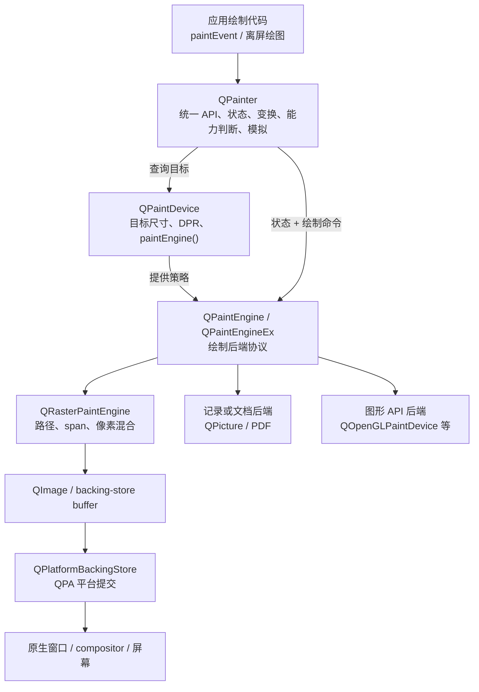
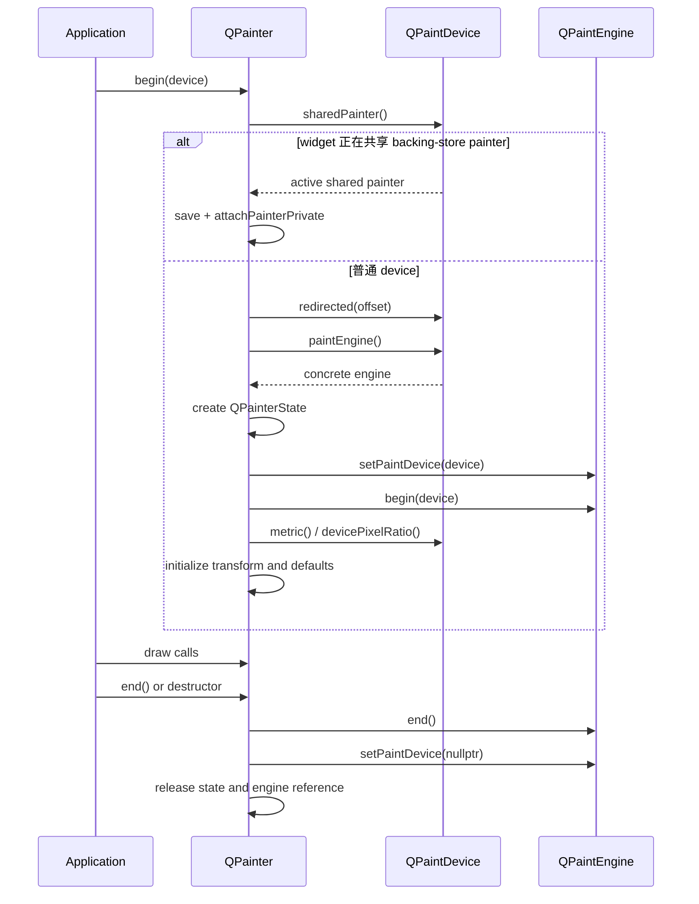
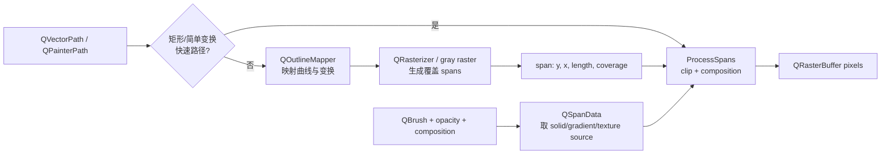
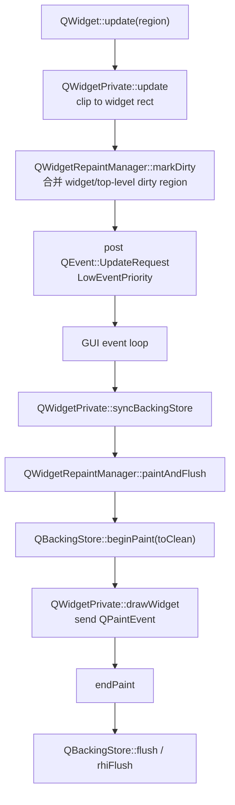

# 7. QPainter 绘制架构

> 适用源码：QtBase 6.10.2（版本见 [`.cmake.conf`](https://github.com/qt/qtbase/blob/v6.10.2/.cmake.conf)）<br>
> 本文定位：第 11 周的绘制系统主线。目标不是只会调用 `drawLine()`，而是能从一次 `QWidget::update()` 一直追到 backing store、`QPainter` 状态、Raster Engine、span 混合函数和 QPA flush，并能解释坐标变换、裁剪、合成与局部刷新的真实边界。<br>
> 前置知识：建议先理解 [`03-event-loop-and-event-dispatch.md`](sourceStudy_03-event-loop-and-event-dispatch.md) 的 posted event、[`06` 阶段](sourceStudy_qtbase-learning-outline.md#6-qpa-与跨平台设计)的 QPA 抽象，以及 `QImage` 的隐式共享语义。

## 7.1 完成本阶段后，你应能回答什么

读完本文并完成实验后，应能用 QtBase 6.10.2 源码解释：

1. `QPainter`、`QPaintDevice`、`QPaintEngine` 分别拥有哪一类职责，为什么三者不能合并？
2. `QPainter::begin()` 如何从目标设备取得后端，为什么同一设备不能同时被两个 painter 绘制？
3. 为什么在 `QImage`、`QWidget`、`QPicture`、PDF 或 OpenGL 设备上可以使用近似相同的绘制 API？
4. `QPaintEngine::PaintEngineFeature` 为什么不仅是“能力说明”，还决定 QPainter 直达、降级或拒绝操作？
5. `QPainterState` 中保存了哪些状态，普通 `QPaintEngine` 与 `QPaintEngineEx` 如何接收状态变化？
6. `save()`/`restore()` 为什么不是只保存一个矩阵，clip 为什么需要重放？
7. logical、world、window/viewport、redirect、device pixel ratio 几层坐标如何组合？
8. 用户裁剪、widget 可见区域和 paint engine system clip 有什么区别？
9. `drawPath()` 如何从公共 API 进入 `QVectorPath`、fill/stroke、outline mapper、rasterizer 和 span blender？
10. Raster Engine 为什么有大量矩形、单像素、平移、缩放、旋转和图像格式快速路径？
11. `CompositionMode_SourceOver` 与 `CompositionMode_Source` 在透明清除场景中为什么结果完全不同？
12. 为什么 `Format_ARGB32_Premultiplied` 通常比非预乘格式适合软件混合？
13. SIMD 优化位于哪一层，为什么 QPainter API 不需要知道 SSE2、AVX2、NEON 或 LSX？
14. `QWidget::update()` 为什么通常比 `repaint()` 更合适，它们何时进入异步/同步更新路径？
15. dirty region 如何合并、扣除不需要绘制的区域，并最终控制 `paintEvent()` 和 flush 的范围？
16. backing store、Raster Engine 和 RHI compositor 各自做什么，为什么“使用 RHI flush”不等于整个 QWidget 都由 GPU QPainter 绘制？
17. 哪些性能问题来自状态切换，哪些来自几何光栅化，哪些来自像素带宽和窗口提交？

建议先读 7.2～7.9 建立抽象、生命周期和状态主链，再读 7.10～7.15 理解 Raster 与 backing store。最后完成 7.16 的自绘控件实验，并按 7.18 的断点顺序观察真实调用栈。

---

## 7.2 一张图建立完整心智模型

Qt 绘制系统至少包含四层，不能把“画图”和“把窗口内容显示到屏幕”视为同一步：



四层职责可压缩为：

| 层 | 解决的问题 | 典型状态 | 不负责什么 |
|---|---|---|---|
| `QPainter` | 给调用者稳定 API，维护绘制上下文，决定直达还是模拟 | pen、brush、font、matrix、clip、opacity、composition、render hints | 不拥有窗口，不定义某个平台如何提交像素 |
| `QPaintDevice` | 描述“画到哪里”，提供尺寸/DPI/DPR，并返回后端 | width、height、depth、logical/physical DPI、devicePixelRatio | 不统一实现所有绘制算法 |
| `QPaintEngine` | 把公共绘制命令映射到具体后端 | engine state、feature flags、system clip | 不决定 widget 何时需要重绘 |
| repaint/backing-store/QPA | 调度何时画、画哪些区域、何时提交到窗口系统 | dirty region、UpdateRequest、backing buffer、flush region | 不定义 `QPainter::drawPath()` 的公共语义 |

这是一组相互协作的模式，而不是一个 GoF 标签：

- `QPainter` 对应用是 Facade。
- `QPaintDevice` 与 `QPaintEngine` 分离目标和算法，具有 Bridge/Strategy 特征。
- `paintEngine()` 让设备选择后端，具有 Factory Method 特征。
- `PaintEngineFeature` 形成能力协商协议。
- `QPainterState` + `save()`/`restore()` 是显式状态栈。
- `QWidgetRepaintManager` 把多次无效区域请求合并成批处理。

最重要的不变量是：

```text
QPainter 描述“画什么、以什么状态画”
QPaintEngine 决定“如何实现这条命令”
QPaintDevice 决定“结果落在哪里”
RepaintManager / BackingStore 决定“何时把哪些结果提交到窗口”
```

---

## 7.3 三个公共契约与一个内部扩展层

### 7.3.1 `QPainter`：有状态绘制门面

公共接口位于 [`qpainter.h`](https://github.com/qt/qtbase/blob/v6.10.2/src/gui/painting/qpainter.h)，主要分为五组：

| 接口组 | 代表接口 | 核心语义 |
|---|---|---|
| 生命周期 | 构造函数、`begin()`、`end()`、`isActive()` | 把一个 painter 绑定到一个 device/engine 会话 |
| 状态 | `setPen()`、`setBrush()`、`setFont()`、`setOpacity()` | 修改后续命令使用的上下文 |
| 状态栈 | `save()`、`restore()` | 对整个 painter state 做成对压栈/出栈 |
| 坐标与裁剪 | `setTransform()`、`translate()`、`setWindow()`、`setViewport()`、`setClip*()` | 把逻辑几何映射并限制到设备区域 |
| 绘制命令 | `drawPath()`、`drawImage()`、`drawText()`、`fillRect()` 等 | 请求后端执行 primitive/path/image/text 操作 |

`QPainter` 是有状态命令接口。下面两段并不等价：

```cpp
painter.setOpacity(0.5);
painter.drawImage(target, image);

painter.drawImage(target, image);
painter.setOpacity(0.5); // 只影响后续命令
```

### 7.3.2 `QPaintDevice`：目标、度量和后端入口

公共接口位于 [`qpaintdevice.h`](https://github.com/qt/qtbase/blob/v6.10.2/src/gui/painting/qpaintdevice.h)。最关键的扩展点是：

```cpp
virtual QPaintEngine *paintEngine() const = 0;
```

设备还通过 `metric()` 提供：

- 像素宽高和位深；
- 毫米尺寸与 logical/physical DPI；
- `devicePixelRatio` 及其编码形式。

常见 paint device 包括 `QImage`、`QPixmap`、`QWidget`、`QPicture`、`QPdfWriter`、`QPrinter` 和 `QOpenGLPaintDevice`。它们共享“可被 painter 绘制”的契约，但存储、记录和提交方式并不相同。

`QImage::paintEngine()` 位于 [`qimage.cpp`](https://github.com/qt/qtbase/blob/v6.10.2/src/gui/image/qimage.cpp)：它先允许 `QPlatformIntegration::createImagePaintEngine()` 提供平台实现；没有平台实现时创建 `QRasterPaintEngine`。这说明“设备选择后端”是真实的运行时扩展点，不是只存在于类图上的抽象。

### 7.3.3 `QPaintEngine`：最小后端协议

公共接口位于 [`qpaintengine.h`](https://github.com/qt/qtbase/blob/v6.10.2/src/gui/painting/qpaintengine.h)。一个最小自定义 engine 至少需要实现：

```cpp
bool begin(QPaintDevice *) override;
bool end() override;
void updateState(const QPaintEngineState &) override;
void drawPixmap(const QRectF &, const QPixmap &, const QRectF &) override;
QPaintEngine::Type type() const override;
```

其他 primitive 有默认实现，因此后端可以从较小的核心集合起步。但默认实现可能把一种 primitive 转成另一种，不能假定每个虚函数都对应一次原生后端调用。

`PaintEngineFeature` 声明后端是否支持：

- primitive/pattern/pixmap/perspective transform；
- pattern、gradient、alpha blend、Porter-Duff、扩展 blend mode；
- painter path、antialiasing、brush stroke、constant opacity；
- raster-op 和 paint-event 外绘制等能力。

调用者不应只按 `type()` 猜能力。正确设计是查询 feature，因为同类后端在目标格式、平台插件和构建配置下可能具有不同限制。

### 7.3.4 `QPaintEngineEx`：Qt 内部的向量路径协议

[`qpaintengineex_p.h`](https://github.com/qt/qtbase/blob/v6.10.2/src/gui/painting/qpaintengineex_p.h) 是私有头文件，不承诺源码兼容。它把许多公共 primitive 汇聚为：

```text
QVectorPath
    ├── fill(path, brush)
    └── stroke(path, pen)
```

同时把状态变化拆成 `penChanged()`、`brushChanged()`、`transformChanged()`、`clipEnabledChanged()` 等回调。`QRasterPaintEngine` 继承 `QPaintEngineEx`，因此 QPainter 可以直接通知它某一类状态已改变，而不必每次传递整份状态。

这层的取舍是：Qt 内部后端得到更高效、更细粒度的协议，但应用不能把它当稳定 public API。

---

## 7.4 `QPainter::begin()` 到 `end()` 的真实生命周期

`QPainter::begin()` 位于 [`qpainter.cpp`](https://github.com/qt/qtbase/blob/v6.10.2/src/gui/painting/qpainter.cpp)。主链可以压缩为：



### 7.4.1 激活前的拒绝条件

`begin()` 会拒绝或警告这些状态：

- `pd->painters > 0`：设备已有活动 painter；
- 当前 painter 已有 engine：同一个 painter 已激活；
- device 返回空 engine；
- null pixmap/null image；
- `QImage::Format_Indexed8` 或 `Format_CMYK8888` 作为直接绘制目标；
- concrete engine 的 `begin()` 返回 false。

这不是简单的“线程安全检查”。即使在同一线程，两个 painter 同时修改同一目标也会让状态、detach、clip 和后端缓存失去唯一会话边界。

### 7.4.2 为什么 `QImage`/`QPixmap` 在 begin 时 detach

`begin()` 对 pixmap/image 调用 `detach()`。原因是绘制必然修改像素，必须先打破隐式共享。若仍共享底层数据，一个对象上的绘制会悄悄改变其他值副本。

因此：

```text
复制 QImage          通常共享数据
QPainter::begin      触发写语义边界
后续 raster 写入     只修改已分离的目标
```

### 7.4.3 初始化 state、engine 和设备度量

取得 engine 后，`begin()`：

1. 创建 `QPainterState` 或由 extended engine 创建专用 state；
2. 把 state 先安装到 engine；
3. 调用 `engine->begin(device)`；
4. 从 widget 或 device 复制字体等属性；
5. 用 `systemRect()` 或 `metric()` 初始化 window/viewport；
6. 合入 redirection offset、engine coordinate offset 和 DPR；
7. 默认打开 `TextAntialiasing`；
8. 增加 `device->painters`。

“先安装 state，再调用后端”是重要细节：后端的 `begin()` 可以读取已经建立的状态对象。

### 7.4.4 `end()` 是提交边界还是释放边界

`end()` 调用 `engine->end()`、解除 active paint device、检查未平衡的 saved states，并释放 painter state。它是一次绘制会话的结束边界，但不保证 QWidget 内容已经显示到屏幕。

对于 widget，后面还可能需要：

```text
backingStore.endPaint()
    → repaintManager.flush()
    → QBackingStore::flush() / rhiFlush()
    → QPlatformBackingStore
    → 原生窗口系统
```

所以 `QPainter` 析构只说明绘制命令已结束，不等于显示服务器或 compositor 已完成呈现。

---

## 7.5 Painter State：为什么状态变化通常是延迟同步

### 7.5.1 `QPainterState` 里有什么

私有定义位于 [`qpainter_p.h`](https://github.com/qt/qtbase/blob/v6.10.2/src/gui/painting/qpainter_p.h)，包括：

- `pen`、`brush`、`font`、background brush/mode；
- `opacity`、`composition_mode`、render hints；
- world matrix、combined matrix、window/viewport；
- clip region/path、clip operation 和 clip 操作历史；
- redirection matrix、layout direction；
- `dirtyFlags`、`changeFlags` 和 emulation specifier。

这解释了为什么 painter 是“有状态命令流”，而不是一组纯函数。

### 7.5.2 普通 `QPaintEngine`：dirty flags 批量同步

以 `setOpacity()` 为例：普通 engine 路径只修改 state，并置 `DirtyOpacity`。绘制命令到来时，`QPainterPrivate::updateStateImpl()` 才调用：

```text
setter 修改 QPainterState
    ↓
dirtyFlags |= DirtyXxx
    ↓ 下一条需要后端状态的绘制命令
engine->updateState(state)
    ↓
clearDirty(AllDirty)
```

这样连续多个 setter 可以折叠为一次后端状态同步：

```cpp
p.setPen(pen);
p.setBrush(brush);
p.setOpacity(0.7);
p.setTransform(transform);
p.drawPath(path); // 在这里统一同步
```

这不是所有 setter 的绝对规则。clip 操作需要保留严格的操作顺序，`setClipRect()` 等路径会立即调用 `updateState()`；begin、save/restore 和共享 painter 切换也可能形成同步边界。应按具体 setter 的源码判断，而不是假定所有状态都延迟到下一次 draw。

### 7.5.3 Extended engine：细粒度 changed callback

`QPaintEngineEx` 路径不同。setter 修改 state 后直接调用对应 callback：

```text
setOpacity()          → opacityChanged()
setCompositionMode()  → compositionModeChanged()
setRenderHints()      → renderHintsChanged()
updateMatrix()        → transformChanged()
```

Raster state 再把变化拆成更贴近执行的数据：

- `strokeFlags`：pen/stroke 相关缓存失效；
- `fillFlags`：brush/fill 相关缓存失效；
- `pixmapFlags`：图像路径相关缓存失效；
- `dirty`：matrix、fast text 等公共派生状态失效；
- `flags.fast_pen`、`fast_text`、`bilinear`、`fast_images`：快速路径判定。

### 7.5.4 `DirtyFlag` 是增量同步协议

[`qpaintengine.h`](https://github.com/qt/qtbase/blob/v6.10.2/src/gui/painting/qpaintengine.h) 中的 dirty bits 覆盖 pen、brush、font、transform、clip、hints、composition 和 opacity。它们解决的是：

> 公共状态很多，但一次 setter 不应迫使所有后端缓存全部重建。

代价是后端必须正确维护派生缓存。漏处理某个 dirty bit 会造成“状态看似已设置，某类 primitive 却仍使用旧状态”的隐蔽错误，因此相关测试必须覆盖状态切换和 save/restore。

---

## 7.6 `save()`/`restore()`：复制状态、记录变化、重放裁剪

### 7.6.1 `save()` 不只压入矩阵

`QPainter::save()` 创建当前 state 的副本，让新 state 成为活动状态，并把旧 state 压入 `savedStates`。对 extended engine，state 由 `createState()` 创建并通过 `setState()` 安装；普通 engine 则先同步旧 state，再复制。

因此一个 save scope 同时隔离：

```text
pen / brush / font
opacity / composition / hints
world + view transforms
clip enable + clip operations
background / layout direction
```

推荐始终按结构化 scope 使用：

```cpp
painter.save();
painter.translate(center);
painter.rotate(angle);
painter.setClipPath(localClip);
drawLocalObject(painter);
painter.restore();
```

### 7.6.2 `changeFlags` 为什么存在

进入新 state 后发生的变化会累计到 `changeFlags`。restore 切回旧 state 时，这些位告诉 engine：“刚才哪些后端状态可能被改变，需要恢复”。

如果没有这层记录，restore 只能把所有状态标为 dirty，或者逐字段比较两份 state。前者会浪费后端重建，后者代价高且容易漏掉派生状态。

### 7.6.3 clip 为什么需要重放

clip 不是始终能用单个矩形表示。连续的 replace/intersect 操作可能带着各自创建时的 transform：

```text
setClipRect(A, ReplaceClip) under M1
setClipPath(B, IntersectClip) under M2
save()
setClipRegion(C, IntersectClip) under M3
restore()
```

普通 engine 的 restore 在 clip 发生变化时，会先发出 `NoClip`，再按 `clipInfo` 保存的“形状 + operation + matrix”重放旧 clip 链。只恢复最终 bounding rect 会丢掉曲线边界、整数 region 精度和操作顺序。

不平衡的 `restore()` 会警告，`end()` 时仍有 saved states 也会警告。不要把析构时的清理当成正常配对机制。

---

## 7.7 坐标系统：从逻辑点到物理像素

### 7.7.1 四类变换

QPainter 内部的完整设备矩阵来自：

```text
world transform
    × view transform(window → viewport)
    × redirection transform(widget → backing store)
    × device-pixel-ratio scale
```

源码中的 `QPainterPrivate::updateMatrix()` 先组合 world 和 view，再乘 redirection，通知 engine transform changed，最后乘 DPR scale。`combinedTransform()` 对外返回 world × view × DPR；真正 engine state 还可能包含内部 redirection。

注意：Qt 的矩阵乘法与点映射约定决定代码中的乘法顺序。不要凭其他图形库的 column-vector 习惯反推，应直接用 `QTransform::map()` 做小实验。

### 7.7.2 window/viewport 解决“逻辑画布映射”

`setWindow()` 定义逻辑矩形，`setViewport()` 定义设备侧目标矩形。view transform 的主要参数是：

```text
scaleW = viewport.width  / window.width
scaleH = viewport.height / window.height
translate = viewport.origin - window.origin × scale
```

它适合把固定逻辑坐标映射到可变窗口，而 world transform 更适合对象自身的平移、旋转和缩放。

### 7.7.3 DPR 为什么必须进入 engine matrix

高 DPI 下，应用常使用 device-independent pixels，而 backing image 可能按 2× 或 1.5× 分配物理像素。DPR scale 进入矩阵后，同一份逻辑几何才能覆盖正确数量的物理像素。

`QBackingStore::beginPaint()` 还会在 fractional/high-DPI 情况下创建共享数据的 `QImage` 视图并设置 DPR，避免把只面向绘制端的 DPR 反向传播给平台插件持有的原图对象。

### 7.7.4 变换类型决定快速路径

Raster Engine 频繁检查 `QTransform::TransformationType`：

```text
TxNone / TxTranslate
    → 很多操作可直接移动指针或整数坐标
TxScale
    → 可使用专用 scale 函数
TxRotate / TxShear
    → 需要更一般的几何或图像变换
TxProject
    → 需要透视路径，限制最多
```

因此两个视觉上相似的操作，若一个可表达为纯 translate/scale，另一个进入一般 projective transform，性能路径可能完全不同。

---

## 7.8 裁剪不是一层：user clip 与 system clip

### 7.8.1 用户裁剪

应用通过 `setClipRect()`、`setClipRegion()`、`setClipPath()` 建立 user clip。clip 记录创建时的 matrix，因此后续改变 transform 不会把旧 clip 简单当成当前坐标下的同一几何。

### 7.8.2 设备/system clip

widget 绘制还有 Qt 内部设置的 system clip，用来限制：

- `QPaintEvent::region()`；
- widget 可见区域和 mask；
- 父子 widget、opaque sibling/child 遮挡关系；
- backing store 当前允许清理的区域；
- paint device 的物理边界。

`QWidgetPrivate::drawWidget()` 在发送 paint event 前通过 paint engine private state 设置 system clip。应用 painter 的 user clip 最终与 system clip 相交，但 `QPainter::clipRegion()` 不应被理解为“所有实际裁剪的完整可见结果”。

### 7.8.3 Region clip 与 path clip 的取舍

| 裁剪形式 | 优点 | 代价 |
|---|---|---|
| `QRect` | 快速、边界简单 | 只能表达矩形 |
| `QRegion` | 适合多个整数矩形和脏区 | 旋转/透视映射可能损失精度或膨胀 |
| `QPainterPath` | 可表达曲线和任意形状 | 需要 outline/raster 化，成本更高 |

Raster Engine 区分 rect clip 与 complex clip，并在 antialiasing 变化时更新 clipping，因为覆盖率计算方式会改变。

### 7.8.4 一个重要优化原则

先在应用层排除明显不可见对象，再让 QPainter clip 负责像素级边界。clip 能阻止最终写像素，但不一定能消除生成复杂 path、stroker outline、glyph layout 或大图变换的全部前置成本。

---

## 7.9 一条 `drawPath()` 命令如何路由

### 7.9.1 QPainter 层

`QPainter::drawPath()` 的分支是：

```text
检查 painter active
    ↓
extended engine?
    ├── 是：extended->drawPath(path)
    └── 否：同步 state
            ↓
            engine 支持 PainterPaths 且无需模拟？
            ├── 是：engine->drawPath(path)
            └── 否：QPainterPrivate::draw_helper(path)
```

### 7.9.2 Extended engine 层

`QPaintEngineEx::drawPath()` 把 `QPainterPath` 转成内部 `QVectorPath`。`draw()` 再按当前 state 拆成：

```text
brush != NoBrush → fill(path, brush)
pen   != NoPen   → stroke(path, pen)
```

这一步非常重要：一个 `drawPath()` 可能产生两条完全不同的执行管线。fill 处理面覆盖，stroke 还要处理 pen 宽度、join、cap、dash 和 cosmetic semantics。

### 7.9.3 能力不足时的 emulation

如果后端不支持当前 gradient、brush、opaque background、transform 或 path 组合，QPainter 可以：

- 把 primitive/path 转成后端支持的其他 primitive；
- 用 `QEmulationPaintEngine` 包装真实 extended engine；
- 在临时 `Format_ARGB32_Premultiplied` 图像中用 Raster Engine 绘制，再把结果 `drawImage()` 到真实 engine。

这保证了跨后端语义的一致性，但代价可能是临时图像分配、额外光栅化和一次大块图像传输。看到 API 调用成功，不代表当前后端原生支持该组合。

调试 fallback 可关注源码中的 `QT_PAINT_FALLBACK_OVERLAY`：Debug 构建下它能给某些 fallback 结果叠加可视标记。

---

## 7.10 Raster Engine：从向量几何到 spans

Raster 后端的核心文件是：

- [`qpaintengine_raster.cpp`](https://github.com/qt/qtbase/blob/v6.10.2/src/gui/painting/qpaintengine_raster.cpp)：后端策略和快速路径；
- [`qpaintengine_raster_p.h`](https://github.com/qt/qtbase/blob/v6.10.2/src/gui/painting/qpaintengine_raster_p.h)：Raster state/private data；
- [`qoutlinemapper_p.h`](https://github.com/qt/qtbase/blob/v6.10.2/src/gui/painting/qoutlinemapper_p.h)：路径到 outline；
- [`qrasterizer_p.h`](https://github.com/qt/qtbase/blob/v6.10.2/src/gui/painting/qrasterizer_p.h)：几何到覆盖 spans；
- [`qdrawhelper.cpp`](https://github.com/qt/qtbase/blob/v6.10.2/src/gui/painting/qdrawhelper.cpp)：brush/image fetch、composition、像素格式和 SIMD 分派；
- [`qcompositionfunctions.cpp`](https://github.com/qt/qtbase/blob/v6.10.2/src/gui/painting/qcompositionfunctions.cpp)：合成函数实现与表。

### 7.10.1 begin：把 device 变成 raster buffer

`QRasterPaintEngine::begin()`：

1. 若目标是 raster/blitter pixmap，取得其 buffer；否则直接使用 device；
2. 断言目标最终是 `QImage` 或 custom raster device；
3. 初始化 device/system state 和 device rect；
4. 给 pen/brush `QSpanData` 绑定 `QRasterBuffer`；
5. 默认 composition mode 设为 SourceOver；
6. 根据目标格式选择 glyph cache format；
7. 激活 engine。

### 7.10.2 fill 主链

一般 path fill 可画成：



span 可理解为同一扫描线上的连续像素段，带有 coverage。几何阶段只需输出“哪些水平区间被覆盖多少”，像素阶段再决定 source color、clip 和 composition。这种分层让同一个 rasterizer 可以服务 solid、gradient 和 texture brush。

### 7.10.3 stroke 主链

`QRasterPaintEngine::stroke()` 有三类路径：

1. `fast_pen`：1 像素 cosmetic pen，使用 `QCosmeticStroker`；
2. non-complex line：直接把 line 映射后交给 rasterizer，dash 逐段处理；
3. 一般 pen/path：交给 `QPaintEngineEx::stroke()` 和通用 stroker，把笔画轮廓转成可填充 path。

因此 pen 的这些属性可能把命令从快速线段切到一般 outline：

- 非 1 像素宽度；
- complex transform；
- dash pattern；
- join/cap；
- brush-based pen；
- antialiasing。

### 7.10.4 outline、coverage 和 blend 是三个不同问题

排查绘制错误时先分类：

| 现象 | 优先怀疑层 |
|---|---|
| 路径边界/连接形状错误 | stroker、outline mapper、transform |
| 边缘锯齿或 coverage 不一致 | rasterizer、AA、clip |
| 颜色/透明度错误 | source fetch、premultiply、composition |
| 某些格式或 CPU 才出错 | format dispatch、SIMD implementation |
| 屏幕不刷新但离屏图正确 | repaint/backing store/QPA flush |

不要看到“像素错了”就直接钻进 `qdrawhelper.cpp`；错误可能在更上游的几何或更下游的提交层。

---

## 7.11 快速路径、函数表与 SIMD

### 7.11.1 快速路径不是旁支，而是 Raster Engine 的主体设计

`QRasterPaintEngine::drawImage()` 在进入通用 texture span 路径前，会尝试：

- 单像素 source 转为 solid fill；
- 纯 90/180/270 度旋转使用 memory rotate；
- 特定格式与 Source/SourceOver 使用直接 blit；
- 简单 scale 使用 `qScaleFunctions`；
- 一般 transform 使用 `qTransformFunctions`；
- clip 为单矩形时使用更直接的循环；
- 不满足条件时才构造 texture filler/path fallback。

一个条件改变就可能切换路径。例如开启 antialiasing、复杂 clip、非 256 opacity、非常大的坐标或不匹配的 pixel format，都可能让专用函数失效。

### 7.11.2 函数表把分派移出像素内循环

绘制初始化阶段选择函数指针：

```text
destination format
    × source format
    × transform category
    × composition mode
    × CPU feature
        ↓
具体 blend / scale / transform / fetch 函数
```

这样每个像素不必重新执行一串虚调用和多层 switch。外层先选一次函数，内层处理连续内存。

### 7.11.3 `qInitDrawhelperFunctions()` 做什么

[`qdrawhelper.cpp`](https://github.com/qt/qtbase/blob/v6.10.2/src/gui/painting/qdrawhelper.cpp) 中的初始化先建立 C 基线表，再按构建目标和运行时 CPU 能力替换部分槽位。QtBase 6.10.2 源码中可见 SSE2/SSSE3/AVX2、ARM NEON、LoongArch LSX/LASX 等实现。

这体现三层降级：

```text
正确的通用 C 实现
    ↓ 有架构支持
编译期 SIMD 实现
    ↓ 运行时检测到更强 CPU
更高指令集实现覆盖函数表
```

公共 API 不暴露 SIMD，是为了让正确性语义稳定，让硬件优化保持可替换。

### 7.11.4 如何做可信性能分析

不要只测 `paintEvent()` 总耗时。至少分开：

1. path 构建；
2. state change；
3. rasterize；
4. source fetch/composition；
5. backing-store flush；
6. compositor/vsync 等待。

Qt 自带 [`tests/benchmarks/gui/painting/qpainter`](https://github.com/qt/qtbase/tree/v6.10.2/tests/benchmarks/gui/painting/qpainter) 覆盖 begin/end、save/restore、line、image、composition、clip 和 transformed primitive，可用作实验模板。

---

## 7.12 Composition Mode 与预乘 Alpha

### 7.12.1 SourceOver 的直觉和公式

默认 `CompositionMode_SourceOver` 表示 source 覆盖在 destination 上。使用预乘颜色时，可简化理解为：

```text
out.rgb = src.rgb + dst.rgb × (1 - src.a)
out.a   = src.a   + dst.a   × (1 - src.a)
```

这里 `src.rgb` 已经乘过 `src.a`。预乘格式把混合循环中反复需要的乘法前置，并让透明像素的颜色处理更一致，所以 Qt 文档和 Raster 快速路径优先 `Format_ARGB32_Premultiplied`。

### 7.12.2 Source 与 SourceOver 的清除差异

假设用完全透明色覆盖目标：

```cpp
p.fillRect(rect, Qt::transparent);
```

- SourceOver：透明 source 对 destination 基本没有影响，旧像素仍在；
- Source：destination 被 source 替换，区域变为透明。

因此“挖透明洞”常需要：

```cpp
p.save();
p.setCompositionMode(QPainter::CompositionMode_Source);
p.fillRect(hole, Qt::transparent);
p.restore();
```

`QWidgetPrivate::drawWidget()` 处理 render-to-texture widget 时也使用这一思路清空 backing-store 对应区域。

### 7.12.3 bounded 与 unbounded 操作

某些 composition mode 的影响不只限于 source 几何真正覆盖的像素。若用一个带透明边界的 path/image 操作，整个传入 primitive 的 bounding area 可能参与运算。

因此排查“透明区域外也被清掉”时，应同时检查：

- composition mode 的定义；
- 传给 draw/fill 的 bounding rectangle；
- source image 的透明边界；
- clip 是否足够严格。

### 7.12.4 目标格式决定能力

`QRasterPaintEngine::init()` 会根据目标 image format 是否使用 alpha 来调整 Porter-Duff capability。没有 alpha 的目标不可能保存某些透明结果，即使计算过程接受了透明 source。

不要把“QColor 有 alpha”与“目标能保留 alpha”混为一谈。

---

## 7.13 QWidget 为什么通常画进 Backing Store

### 7.13.1 `QWidget::paintEngine()` 返回空并不矛盾

QtBase 6.10.2 中默认 `QWidget::paintEngine()` 会警告并返回 `nullptr`。正常 widget 绘制不是让每个 widget 各自拥有一个原生 paint engine，而是由顶层窗口的 repaint manager 提供共享/重定向绘制上下文。

`QWidgetPrivate::drawWidget()` 会：

1. 计算实际需要绘制的 region；
2. 把 widget 重定向到 backing-store paint device；
3. 设置 engine system rect/clip；
4. 必要时绘制背景；
5. 同步发送 `QPaintEvent`；
6. 绘制子 widget；
7. 标记对应区域需要 flush；
8. 恢复 redirection 和 system clip。

因此在 `paintEvent()` 中构造 `QPainter(this)` 时，`QPainter::begin()` 可能走 `sharedPainter()`/`redirected()`，复用正在操作 backing store 的 engine 和 state scope。

### 7.13.2 backing store 解决什么

Backing store 是顶层窗口内容的离屏像素存储。它带来：

- 多个 child widget 可合成到同一缓冲区；
- 只重绘 dirty region；
- resize/scroll 时可保留或移动 static contents；
- 绘制完成后批量提交，减少闪烁；
- 应用绘制与平台窗口提交解耦。

它不是永久 scene graph。Qt 仍需要在 dirty region 中重放 widget 的 `paintEvent()` 来重新生成像素。

### 7.13.3 beginPaint/paintDevice/endPaint/flush

`QBackingStore` 的典型协议是：

```cpp
store->beginPaint(region);
QPaintDevice *device = store->paintDevice();
// QWidget tree draws into device
store->endPaint();
store->flush(region, window, offset);
```

`beginPaint()` 把 region 和 DPR 转换到 native 坐标，并通知 `QPlatformBackingStore`。`flush()` 再把 region/offset 转换到 native 坐标；fractional DPR 下还会修正最多一个像素的舍入偏差。

### 7.13.4 RHI flush 不是 Raster Engine 的反义词

当 widget 子树包含 render-to-texture/RHI 内容时，`QWidgetRepaintManager::flush()` 可调用 `QPlatformBackingStore::rhiFlush()`，把 raster backing-store texture 与其他 texture 合成。

典型混合路径是：

```text
普通 QWidget paintEvent
    → QRasterPaintEngine 写 backing image

QRhiWidget / texture child
    → 产生 GPU texture

rhiFlush
    → compositor 合成 backing texture + child textures
    → present
```

所以看到 RHI compositor 不应得出“普通 QPainter primitive 已全部变成 GPU 绘制”的结论。要分别跟踪 paint device 的 engine 和最终 flush 路径。

---

## 7.14 `update()` 与 `repaint()` 的真实差别

### 7.14.1 `update()`：合并请求后再画

`QWidgetPrivate::update()`：

1. 检查 visible/updatesEnabled；
2. 与 widget rect 相交；
3. 若正在 paint event 内，投递 `QUpdateLaterEvent`，避免递归重绘；
4. 否则调用 repaint manager `markDirty(..., UpdateLater)`。

`markDirty()` 合并区域，并通常向顶层 widget 投递低优先级 `QEvent::UpdateRequest`。`QApplicationPrivate::compressEvent()` 还会压缩重复 UpdateRequest，并合并 UpdateLater 的 region。

主链是：



连续调用：

```cpp
update(QRect(0, 0, 20, 20));
update(QRect(10, 10, 20, 20));
```

通常只产生一次 paintEvent，其 region 是合并后的区域，而不是严格两次回调。

### 7.14.2 `repaint()`：请求 UpdateNow

`QWidgetPrivate::repaint()` 调用 `markDirty(..., UpdateNow)`，repaint manager 通过同步 `sendEvent(UpdateRequest)` 尽快进入 sync。

但“同步”不等于无条件立即 present：

- 当前调用栈仍可能受可见性、updatesEnabled 和平台状态限制；
- render-to-texture 场景会为避免每次等待 vsync，把过密的 UpdateNow 降为 UpdateLater；
- flush 后 compositor/显示器仍有自己的异步时序。

### 7.14.3 为什么默认选 `update()`

`update()` 给 Qt 一个合并窗口，可减少：

- 重复 paintEvent；
- 重复 backing-store composition；
- 重复 flush；
- 每次 repaint 都等待 vsync 的风险。

只在确实需要当前调用流程尽快完成 widget 重画，而且已经评估重入和吞吐代价时使用 `repaint()`。

### 7.14.4 不要在 `paintEvent()` 中直接 `repaint()`

`drawWidget()` 会设置 `WA_WState_InPaintEvent` 并检测 recursive repaint。`update()` 在 paint event 内会转成 `QUpdateLaterEvent`；`repaint()` 则更容易形成递归或持续重画。

动画应由 timer/animation driver 改变状态并调用 `update()`，而不是由 `paintEvent()` 自己无条件安排下一次同步重画。

---

## 7.15 Dirty Region 如何减少工作

`QWidgetRepaintManager::paintAndFlush()` 不只是把所有 dirty rect 相加。它还会：

- 在 resize 时根据 `WA_StaticContents` 和平台 capability 决定保留或全重绘；
- 把 widget-local dirty region 映射到顶层坐标；
- 与 clip rect/mask 相交；
- 扣除 opaque siblings/children；
- 把无重叠 opaque widget 单独直绘；
- 处理 graphics effect 和 render-to-texture child；
- 在真正绘制前清空旧 dirty 状态，使 paintEvent 内的新 `update()` 留给下一轮；
- 只把 `toClean` 传给 `beginPaint()`；
- 绘制完成后只 flush 需要提交的 native widget region。

### 7.15.1 opaque 属性为什么是性能契约

当 widget 能保证 paintEvent 覆盖全部像素，可设置 `WA_OpaquePaintEvent`。repaint manager 才能更大胆地扣除其下方区域，避免父 widget 和兄弟 widget重复绘制。

若声明 opaque 却留下未绘制像素，结果不是“稍慢”，而是视觉残留或脏内容。优化属性同时也是正确性承诺。

### 7.15.2 `QPaintEvent::region()` 是重要输入

自绘控件不一定每次都要遍历全部数据。可以先用 event region/bounding rect 做可见对象筛选：

```cpp
void Plot::paintEvent(QPaintEvent *event)
{
    QPainter p(this);
    const QRect exposed = event->region().boundingRect();
    for (const Segment &segment : segmentsIn(exposed))
        p.drawLine(segment.line);
}
```

但 region 的矩形数量过多时，逐矩形处理也有成本。应通过 profile 决定使用完整 region、bounding rect 还是空间索引。

### 7.15.3 dirty region 不等于最终呈现 region

至少有三种 region：

```text
widget-local dirty region
    ↓ 映射、遮挡、effect、child 合并
top-level toClean region
    ↓ native child / DPR / offset 转换
platform flush region
```

调试局部刷新时必须记录每一层坐标系，不能只打印一个 `QRegion` 就断言 Qt 多画或少画。

---

## 7.16 实践：缩放、旋转、裁剪和透明合成的自绘控件

这个实验提供可见结果，并能对比 `update()` 与 `repaint()`。按 U/R 键分别触发异步和同步请求，滚轮改变缩放，空格切换 SourceOver/Plus。

### 7.16.1 `main.cpp`

```cpp
#include <QApplication>
#include <QDebug>
#include <QElapsedTimer>
#include <QKeyEvent>
#include <QPainter>
#include <QPainterPath>
#include <QPaintEvent>
#include <QWheelEvent>
#include <QWidget>
#include <QtMath>

class PaintLab final : public QWidget
{
public:
    PaintLab()
    {
        setWindowTitle(QStringLiteral("QPainter architecture lab"));
        setFocusPolicy(Qt::StrongFocus);
        setAttribute(Qt::WA_OpaquePaintEvent);
        resize(760, 520);
    }

protected:
    void paintEvent(QPaintEvent *event) override
    {
        QElapsedTimer timer;
        timer.start();

        QPainter p(this);
        p.fillRect(event->region().boundingRect(), QColor(24, 27, 33));
        p.setRenderHints(QPainter::Antialiasing
                         | QPainter::SmoothPixmapTransform);

        p.save();
        p.translate(rect().center());
        p.scale(scale_, scale_);
        p.rotate(angle_);

        QPainterPath clip;
        clip.addRoundedRect(QRectF(-190, -125, 380, 250), 42, 42);
        p.setClipPath(clip, Qt::IntersectClip);

        QLinearGradient background(-190, -125, 190, 125);
        background.setColorAt(0.0, QColor(34, 112, 184));
        background.setColorAt(1.0, QColor(16, 42, 67));
        p.fillPath(clip, background);

        p.setOpacity(0.72);
        p.setCompositionMode(plusMode_
                             ? QPainter::CompositionMode_Plus
                             : QPainter::CompositionMode_SourceOver);

        p.setPen(Qt::NoPen);
        p.setBrush(QColor(255, 84, 112, 210));
        p.drawEllipse(QPointF(-62, 0), 105, 105);
        p.setBrush(QColor(72, 214, 160, 210));
        p.drawEllipse(QPointF(62, 0), 105, 105);

        p.setOpacity(1.0);
        p.setCompositionMode(QPainter::CompositionMode_SourceOver);
        p.setPen(QPen(Qt::white, 3));
        p.setBrush(Qt::NoBrush);
        p.drawPath(clip);
        p.restore();

        p.setPen(Qt::white);
        p.drawText(QRect(18, 18, width() - 36, 90),
                   Qt::AlignLeft | Qt::AlignTop,
                   QStringLiteral(
                       "Wheel: scale  U: update()  R: repaint()  "
                       "Space: composition\n"
                       "scale=%1  angle=%2  mode=%3  paint #%4")
                       .arg(scale_, 0, 'f', 2)
                       .arg(angle_, 0, 'f', 1)
                       .arg(plusMode_ ? QStringLiteral("Plus")
                                      : QStringLiteral("SourceOver"))
                       .arg(++paintCount_));

        qInfo().nospace()
            << "paint #" << paintCount_
            << " region=" << event->region()
            << " elapsed=" << timer.nsecsElapsed() / 1000 << " us";
    }

    void wheelEvent(QWheelEvent *event) override
    {
        const qreal steps = event->angleDelta().y() / 120.0;
        scale_ = qBound(0.35, scale_ * qPow(1.12, steps), 2.8);
        // 变换后的图形可能超出原始逻辑矩形；更新整个控件，避免旧像素残留。
        update();
        event->accept();
    }

    void keyPressEvent(QKeyEvent *event) override
    {
        switch (event->key()) {
        case Qt::Key_U:
            angle_ += 7.5;
            // 连续多次调用，观察它们通常合并成一次 paintEvent。
            update();
            update();
            break;
        case Qt::Key_R:
            angle_ += 7.5;
            repaint();
            break;
        case Qt::Key_Space:
            plusMode_ = !plusMode_;
            update();
            break;
        default:
            QWidget::keyPressEvent(event);
            break;
        }
    }

private:
    qreal scale_ = 1.0;
    qreal angle_ = 18.0;
    bool plusMode_ = false;
    quint64 paintCount_ = 0;
};

int main(int argc, char **argv)
{
    QApplication app(argc, argv);
    PaintLab widget;
    widget.show();
    return app.exec();
}
```

### 7.16.2 `CMakeLists.txt`

```cmake
cmake_minimum_required(VERSION 3.16)
project(qpainter_architecture_lab LANGUAGES CXX)

find_package(Qt6 REQUIRED COMPONENTS Widgets)
qt_standard_project_setup()

qt_add_executable(qpainter_architecture_lab
    main.cpp
)

target_link_libraries(qpainter_architecture_lab PRIVATE Qt6::Widgets)
```

### 7.16.3 构建

在已配置 Qt 6.10.2 开发环境的终端中：

```powershell
cmake -S . -B build -G Ninja
cmake --build build
./build/qpainter_architecture_lab.exe
```

若使用多配置生成器，可改为：

```powershell
cmake -S . -B build
cmake --build build --config Debug
./build/Debug/qpainter_architecture_lab.exe
```

### 7.16.4 观察清单

1. 连续快速按 U，比较 key 次数和 paint count，确认 update 合并。
2. 按 R，观察 paint log 是否在键盘事件返回前出现。
3. 缩小窗口或让其他窗口遮挡，再暴露窗口，观察 paint region。
4. 切换 Plus/SourceOver，观察重叠区颜色。
5. 注释 `Antialiasing`，观察曲线边缘和耗时。
6. 把 `WA_OpaquePaintEvent` 去掉，同时只清 event bounding rect，观察父背景/系统擦除差异。
7. 把 `fillRect(event->region().boundingRect(), ...)` 改为 `fillRect(rect(), ...)`，比较局部更新时的像素工作量。

### 7.16.5 第二个离屏实验：目标格式影响

把同一组半透明图形分别画到：

```cpp
QImage premul(size, QImage::Format_ARGB32_Premultiplied);
QImage straight(size, QImage::Format_ARGB32);
```

使用 `QElapsedTimer` 重复绘制足够多次，先 warm up，再比较多轮中位数。不要用一次微秒级测量得出结论；CPU frequency、cache、Debug build 和窗口 flush 都会污染结果。

---

## 7.17 性能分析：先判断瓶颈属于哪一层

### 7.17.1 状态切换

大量交替设置 pen/brush/composition/clip 会使后端缓存反复失效。能在不破坏绘制顺序的前提下按状态分组时，可减少更新：

```text
差：每个对象 setPen(A/B/A/B) + draw
好：先画所有 A，再画所有 B
```

但透明 composition 往往依赖严格顺序，不能为了批处理改变视觉语义。

### 7.17.2 几何复杂度

大 path、复杂 stroker、dash、曲线、self-intersection 和 projective transform 会增加 outline/raster 成本。可分别测：

- path element count；
- fill only 与 stroke only；
- cosmetic/simple pen 与 complex pen；
- AA on/off；
- clip rect 与 clip path。

### 7.17.3 像素带宽

大面积半透明 layer 即使几何简单，也要读取 destination、读取/生成 source、混合并写回。4K 窗口的 full repaint 常受内存带宽影响，而不是 C++ 虚函数调用。

优先减少实际覆盖面积、layer 数量和不必要格式转换。

### 7.17.4 dirty/flush 频率

若每个输入事件都 `repaint()`，瓶颈可能是多次 composition/vsync，而不是 painter primitive。记录：

- 每秒 paintEvent 次数；
- 每次 event region 面积；
- 每秒 flush 次数；
- raster time 与 flush time；
- 是否存在 texture child/RHI composition。

### 7.17.5 图片格式与转换

Raster 文档明确建议优先 `Format_ARGB32_Premultiplied`、`Format_RGB32` 或 `Format_RGB16`。其他格式可能在每次 drawImage 时触发转换或较慢 generic fetch/store。

先把长期复用的资源转成目标友好的格式，不要在每一帧 paintEvent 内重复 `convertToFormat()`、scale 或构造 gradient stop table。

---

## 7.18 用调试器跟六条真实调用链

### 7.18.1 QImage painter 激活

断点顺序：

```text
QPainter::begin
QImage::paintEngine
QRasterPaintEngine::QRasterPaintEngine
QRasterPaintEngine::begin
QPainter::end
QRasterPaintEngine::end
```

观察：device detach、engine 缓存、state 创建、image format、device rect、DPR。

### 7.18.2 path fill/stroke

```text
QPainter::drawPath
QPaintEngineEx::drawPath
QPaintEngineEx::draw
QRasterPaintEngine::fill
QRasterPaintEngine::stroke
QRasterPaintEnginePrivate::rasterize
```

分别用 NoPen/NoBrush 验证 fill 和 stroke 分支。

### 7.18.3 state 与 save/restore

```text
QPainter::save
QPainter::setCompositionMode
QRasterPaintEngine::compositionModeChanged
QPainter::setClipRect
QPainter::restore
```

观察 `savedStates`、`changeFlags`、`clipInfo`、Raster `strokeFlags/fillFlags/dirty`。

### 7.18.4 图像快速路径

```text
QPainter::drawImage
QRasterPaintEngine::drawImage
QRasterPaintEnginePrivate::canUseImageBlitting
QRasterPaintEnginePrivate::canUseFastImageBlending
qBlendFunctions / qScaleFunctions / qTransformFunctions
```

依次改变 transform、opacity、clip、source/destination format，记录分支切换。

### 7.18.5 update 到 paintEvent

```text
QWidget::update
QWidgetPrivate::update<T>
QWidgetRepaintManager::markDirty<T>
QWidgetRepaintManager::sendUpdateRequest
QWidget::event(QEvent::UpdateRequest)
QWidgetPrivate::syncBackingStore
QWidgetRepaintManager::paintAndFlush
QWidgetPrivate::drawWidget
QWidgetPrivate::sendPaintEvent
PaintLab::paintEvent
```

观察 update 请求发生时、paint event 发生时和 dirty state 被清空时的调用栈不同。

### 7.18.6 backing store flush

```text
QBackingStore::beginPaint
QBackingStore::paintDevice
QBackingStore::endPaint
QWidgetRepaintManager::flush
QBackingStore::flush 或 QPlatformBackingStore::rhiFlush
平台插件 QPlatformBackingStore::flush
```

记录 logical region、native region、offset、DPR 和实际平台后端。

Windows 上可继续进入对应平台插件的 backing store；Linux/XCB、Wayland 和 macOS 路径不同，但 `QBackingStore → QPlatformBackingStore` 协议相同。

---

## 7.19 对应自动测试与 benchmark

### 7.19.1 `tst_QPainter`

[`tests/auto/gui/painting/qpainter/tst_qpainter.cpp`](https://github.com/qt/qtbase/blob/v6.10.2/tests/auto/gui/painting/qpainter/tst_qpainter.cpp) 是主测试入口，优先阅读：

- `saveAndRestore`、`stateResetBetweenQPainters`；
- `combinedTransform`、`setWindow`；
- `setClipRect`、`clipRectSaveRestore`、`clipStateSaveRestore`、`transformedClip`；
- `setOpacity`、`porterDuff_warning`、`checkCompositionMode`、`extendedBlendModes`；
- `drawPath`、`drawImage`、`imageBlending`；
- `painterBegin`、`inactivePainter`、`paintOnNullPixmap`；
- FPE、large coordinate 和 rasterizer regression tests。

### 7.19.2 `tst_QPaintEngine`

[`tests/auto/gui/painting/qpaintengine/tst_qpaintengine.cpp`](https://github.com/qt/qtbase/blob/v6.10.2/tests/auto/gui/painting/qpaintengine/tst_qpaintengine.cpp) 定义最小 `MyPaintEngine`，适合理解 public engine 的最低实现契约和 get/set 行为。

### 7.19.3 `tst_QWidgetRepaintManager`

[`tests/auto/widgets/kernel/qwidgetrepaintmanager/tst_qwidgetrepaintmanager.cpp`](https://github.com/qt/qtbase/blob/v6.10.2/tests/auto/widgets/kernel/qwidgetrepaintmanager/tst_qwidgetrepaintmanager.cpp) 覆盖：

- basic update/repaint；
- child/opaque child；
- static contents 和 scroll；
- paint-on-screen；
- RHI recreation/flush；
- overlapped region 和 fast move。

它揭示 repaint manager 的正确性不只是“发出 paintEvent”，还包括遮挡、移动、滚动和 native child 的区域维护。

### 7.19.4 benchmark

[`tests/benchmarks/gui/painting/qpainter`](https://github.com/qt/qtbase/tree/v6.10.2/tests/benchmarks/gui/painting/qpainter) 可用于比较：

- begin/end 与 save/restore；
- clipped/antialiased line；
- pixmap/image/tiled pixmap；
- composition modes；
- 10/100/1000 primitives；
- transformed rounded rect 和大路径。

新增优化前应先找到匹配 workload 的 benchmark；没有代表性数据，不应只凭“少一次函数调用”判断变快。

---

## 7.20 常见误区与源码反证

### 误区 1：“QPainter 自己完成所有绘制”

反证：`begin()` 从 device 取得 `QPaintEngine`，draw API 主要维护状态、能力判断和命令路由。

### 误区 2：“每种 QPaintDevice 都有自己的完整绘制算法”

反证：device 主要提供目标度量和 engine；多个设备可复用 Raster Engine，平台也可覆盖 image engine。

### 误区 3：“QWidget::paintEngine() 返回 raster engine”

反证：QtBase 6.10.2 默认返回空；正常 widget paintEvent 通过 shared painter/redirection 画进顶层 backing store。

### 误区 4：“调用 setter 会立即把全部状态同步到后端”

反证：普通 engine 使用 dirty flags 延迟同步；extended engine 使用细粒度 changed callback 和后端缓存失效位。

### 误区 5：“save/restore 只保存 transform”

反证：`QPainterState` 还包含 pen、brush、font、clip、opacity、composition、hints 等；clip 甚至可能需要重放操作历史。

### 误区 6：“`clipRegion()` 就是最终允许写入的全部区域”

反证：widget/repaint manager 还设置 engine system clip，最终裁剪是多层协议。

### 误区 7：“开启 Antialiasing 总能提高所有内容质量”

反证：它主要影响矢量边缘，并可能关闭某些快速路径；图片缩放主要受 `SmoothPixmapTransform` 控制。

### 误区 8：“透明色 fill 一定能清空目标”

反证：SourceOver 下全透明 source 不会替换旧 destination；清除常需 Source/Clear 模式和支持 alpha 的目标。

### 误区 9：“ARGB32 与 ARGB32_Premultiplied 只是存储顺序不同”

反证：预乘格式改变 RGB 与 alpha 的数值约束，并直接对应 Raster composition 快速路径。

### 误区 10：“update() 每调用一次就产生一次 paintEvent”

反证：dirty region、UpdateRequest 和 QApplication event compression 都会合并请求。

### 误区 11：“repaint() 等于像素已经出现在显示器上”

反证：它更快进入 sync/paint，但 backing-store flush、平台 compositor 和 vsync 仍有后续阶段。

### 误区 12：“脏区越碎越精确，因此一定越快”

反证：复杂 `QRegion` 的合并、映射、遮挡计算和多 clip span 也有成本；小矩形过多可能不如适度扩大 bounding rect。

### 误区 13：“用了 RHI flush，QPainter 就不再走 Raster Engine”

反证：普通 widget 可先 raster 到 backing image，再由 RHI compositor 与 texture child 合成。

### 误区 14：“所有后端都原生支持全部 QPainter 语义”

反证：feature negotiation 和 `QPainterPrivate::draw_helper()` 明确存在模拟/fallback。

### 误区 15：“性能优化应从 SIMD 内循环开始”

反证：多余 full repaint、重复 flush、大面积透明 layer 或 complex path 往往比单个像素循环更先决定总成本。

---

## 7.21 自测题与答案要点

### 问题 1

为什么 `QPainter` 构造函数接受 `QPaintDevice *`，却不直接 switch device type 完成绘制？

答案要点：device 通过 `paintEngine()` 提供后端，QPainter 只依赖统一 engine 协议和 feature，降低目标类型与算法的组合爆炸。

### 问题 2

对 `QImage a` 复制出 `b` 后，在 `b` 上构造 painter，为什么通常不会改变 `a`？

答案要点：`QPainter::begin()` 对 image 调用 detach，绘制建立写边界。

### 问题 3

连续 setPen、setBrush、setOpacity 后只 draw 一次，普通 engine 如何避免三次完整状态同步？

答案要点：setter 累加 dirty flags，绘制边界通过一次 `updateState()` 传递整份 state 和 dirty bits。

### 问题 4

为什么 clip restore 不能只保存一个最终 `QRegion`？

答案要点：clip 可由 rect/region/path 在不同 matrix 下按 replace/intersect 组合；转换为整数 region 可能丢失曲线和变换精度。

### 问题 5

为什么旋转后的 drawImage 可能突然比平移慢很多？

答案要点：transform category 改变，直接 blit/scale 快速路径失效，进入 rotate/transform 或一般 texture span 路径；clip、opacity、format 还会共同决定分支。

### 问题 6

`WA_OpaquePaintEvent` 为什么既是优化又是正确性契约？

答案要点：repaint manager 可扣除下方区域；若 widget 没覆盖全部像素，下方又未重画，会留下错误内容。

### 问题 7

为什么 `update()` 在 paintEvent 内会投递 `QUpdateLaterEvent`？

答案要点：避免当前绘制栈递归；新区域留到事件循环后续轮次，并可继续合并。

### 问题 8

怎样证明一次 QWidget 绘制使用的是 Raster Engine，而最终提交使用了 RHI？

答案要点：分别在 `QPainter::begin/QRasterPaintEngine::begin` 与 `QWidgetRepaintManager::flush/QPlatformBackingStore::rhiFlush` 断点；二者属于不同阶段。

### 问题 9

SourceOver 下用透明色 fillRect 为什么不能可靠清空旧内容？

答案要点：source alpha 为 0 时 SourceOver 保留 destination；要替换成透明通常使用 Source 或 Clear，且目标需有 alpha。

### 问题 10

优化一个慢自绘控件时，第一轮应记录什么？

答案要点：paint/flush 频率、dirty area、primitive/path 数量、state/clip/transform、目标和 source format、raster 与 flush 分段耗时，再决定优化层。

---

## 7.22 推荐源码阅读顺序

第一轮只追公共抽象和一条 QImage 路径：

1. [`qpainter.h`](https://github.com/qt/qtbase/blob/v6.10.2/src/gui/painting/qpainter.h)：公共状态和绘制 API。
2. [`qpaintdevice.h`](https://github.com/qt/qtbase/blob/v6.10.2/src/gui/painting/qpaintdevice.h)：device metric 与 `paintEngine()` 契约。
3. [`qpaintengine.h`](https://github.com/qt/qtbase/blob/v6.10.2/src/gui/painting/qpaintengine.h)：feature、dirty flags、primitive virtual API。
4. [`qpainter.cpp`](https://github.com/qt/qtbase/blob/v6.10.2/src/gui/painting/qpainter.cpp)：`begin()`、`end()`、state、`drawPath()`、fallback。
5. [`qimage.cpp`](https://github.com/qt/qtbase/blob/v6.10.2/src/gui/image/qimage.cpp)：`QImage::paintEngine()` 如何选择 Raster Engine。

第二轮进入 Raster：

6. [`qpaintengineex_p.h`](https://github.com/qt/qtbase/blob/v6.10.2/src/gui/painting/qpaintengineex_p.h) 与 [`qpaintengineex.cpp`](https://github.com/qt/qtbase/blob/v6.10.2/src/gui/painting/qpaintengineex.cpp)：primitive 到 QVectorPath/fill/stroke。
7. [`qpaintengine_raster_p.h`](https://github.com/qt/qtbase/blob/v6.10.2/src/gui/painting/qpaintengine_raster_p.h)：Raster state、flags、span data 和 private components。
8. [`qpaintengine_raster.cpp`](https://github.com/qt/qtbase/blob/v6.10.2/src/gui/painting/qpaintengine_raster.cpp)：begin、fill、stroke、drawImage 快速路径。
9. [`qrasterizer_p.h`](https://github.com/qt/qtbase/blob/v6.10.2/src/gui/painting/qrasterizer_p.h) 和 [`qoutlinemapper_p.h`](https://github.com/qt/qtbase/blob/v6.10.2/src/gui/painting/qoutlinemapper_p.h)：geometry → outline → spans。
10. [`qdrawhelper.cpp`](https://github.com/qt/qtbase/blob/v6.10.2/src/gui/painting/qdrawhelper.cpp) 与 [`qcompositionfunctions.cpp`](https://github.com/qt/qtbase/blob/v6.10.2/src/gui/painting/qcompositionfunctions.cpp)：source fetch、format dispatch、composition、SIMD。

第三轮进入 QWidget 更新与提交：

11. [`qwidget.cpp`](https://github.com/qt/qtbase/blob/v6.10.2/src/widgets/kernel/qwidget.cpp)：update/repaint、drawWidget、paint event redirection。
12. [`qwidgetrepaintmanager.cpp`](https://github.com/qt/qtbase/blob/v6.10.2/src/widgets/kernel/qwidgetrepaintmanager.cpp)：markDirty、UpdateRequest、paintAndFlush。
13. [`qbackingstore.cpp`](https://github.com/qt/qtbase/blob/v6.10.2/src/gui/painting/qbackingstore.cpp)：DPR、paint device 和 flush。
14. [`qplatformbackingstore.h`](https://github.com/qt/qtbase/blob/v6.10.2/src/gui/painting/qplatformbackingstore.h)：QPA 提交契约。
15. 当前平台插件的 backing-store 实现：把统一 flush 落到原生窗口系统。

第四轮用测试锁定不变量：

16. [`tst_qpainter.cpp`](https://github.com/qt/qtbase/blob/v6.10.2/tests/auto/gui/painting/qpainter/tst_qpainter.cpp)。
17. [`tst_qpaintengine.cpp`](https://github.com/qt/qtbase/blob/v6.10.2/tests/auto/gui/painting/qpaintengine/tst_qpaintengine.cpp)。
18. [`tst_qwidgetrepaintmanager.cpp`](https://github.com/qt/qtbase/blob/v6.10.2/tests/auto/widgets/kernel/qwidgetrepaintmanager/tst_qwidgetrepaintmanager.cpp)。
19. [`tests/benchmarks/gui/painting/qpainter`](https://github.com/qt/qtbase/tree/v6.10.2/tests/benchmarks/gui/painting/qpainter)。

每追一条绘制行为链，都画五张小图：

```text
目标设备与 engine 选择图
painter state / save-restore 图
logical → device 坐标变换图
geometry → spans → pixels 图
dirty region → backing store → platform flush 图
```

如果只画出了 `QPainter → QPaintEngine`，还没有解释 widget 为什么会重画；如果只画出了 `update → paintEvent`，也还没有解释像素如何产生。五张图能同时闭合，才算真正理解 QPainter 绘制架构。
