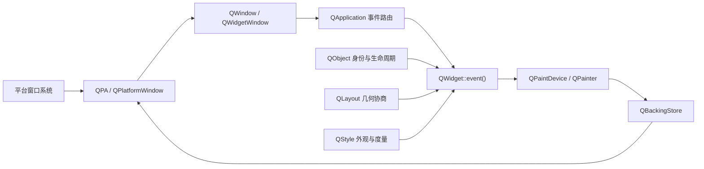
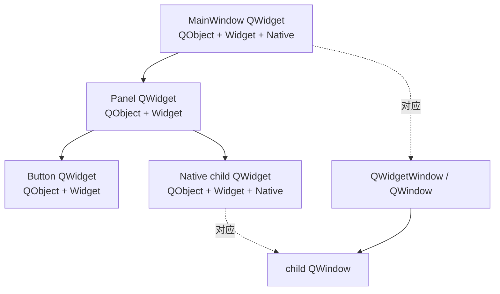
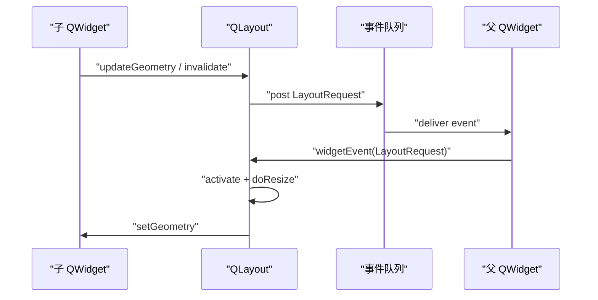
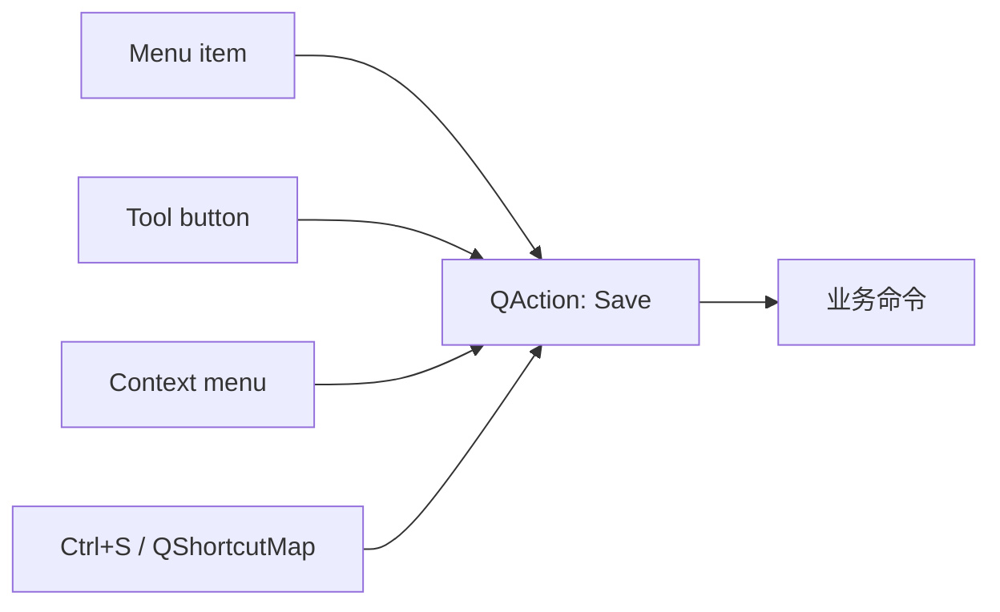

# 8. QWidget 体系

> 适用源码：QtBase 6.10.2（版本见 [`.cmake.conf`](https://github.com/qt/qtbase/blob/v6.10.2/.cmake.conf)）<br>
> 本文定位：第 12～13 周的 Widgets 主线。目标不是记忆控件 API，而是建立一套能解释“对象如何组成、窗口何时创建、事件如何到达、布局如何协商、脏区如何绘制、输入状态如何路由”的运行时模型。<br>
> 前置知识：建议先完成 [`02-qobject-moc-metaobject-system.md`](sourceStudy_02-qobject-moc-metaobject-system.md)、[`03-event-loop-and-event-dispatch.md`](sourceStudy_03-event-loop-and-event-dispatch.md) 和大纲中的 QPA、QPainter 主题。QWidget 把这几条主线汇合到传统桌面 UI。

## 8.1 完成本阶段后，你应能回答什么

读完本文并完成实验后，应能用 QtBase 6.10.2 源码解释：

1. `QWidget` 为什么同时继承 `QObject` 和 `QPaintDevice`？
2. QObject 对象树、Widget 逻辑树、`QWindow`/原生窗口树为什么可能不同？
3. 没有 `WA_NativeWindow` 的子控件如何在没有独立原生句柄的情况下接收输入并绘制？
4. `show()` 为什么不是简单地把一个布尔值设为 `true`？
5. `QWidget::create()`、`QWidgetPrivate::create()`、`QWindow::create()` 和 QPA 的职责如何分层？
6. 一个平台鼠标事件如何选中目标 QWidget，并最终进入 `mousePressEvent()`？
7. 为什么通常应重写专用事件处理器，而不是重写整个 `event()`？
8. `geometry()`、`rect()`、`frameGeometry()` 和各类 `mapTo*()` 坐标分别属于哪个空间？
9. `sizeHint()`、`minimumSizeHint()`、`QSizePolicy`、显式最小/最大尺寸和 stretch 如何共同决定几何？
10. `updateGeometry()` 为什么不等于立即重新布局？
11. `update()` 与 `repaint()` 的同步性、合并能力和重入风险有何不同？
12. `QWidgetRepaintManager`、`QBackingStore`、`QPaintEvent` 和 `QPainter` 如何串成一次绘制？
13. `WA_OpaquePaintEvent`、`WA_NoSystemBackground`、`autoFillBackground` 和 `WA_StyledBackground` 各改变哪一步？
14. `QStyle`、`QStyleOption`、`QStylePainter`、Style Sheet 和 `QProxyStyle` 如何分工？
15. 为什么 `QAction` 比“按钮被点击时直接执行函数”更接近 Command？
16. Focus Widget、Focus Proxy、Focus Chain、Active Window 和 Focus Reason 分别是什么？
17. 隐式鼠标抓取、显式 Mouse Grab、Popup Grab 和 Modal Blocking 有何区别？
18. `setParent()` 为什么可能导致隐藏、原生窗口重建、焦点链调整和坐标语义变化？
19. 如何设计一个既能正确布局、绘制、换肤、键盘操作，又不产生重绘风暴的复合控件？

建议先读 8.2～8.9 建立主链，再读 8.10～8.15 理解样式、命令与输入状态，最后完成 8.16 的可运行实验，并按 8.19 的断点顺序观察真实调用栈。

---

## 8.2 一张总图：QWidget 是六条机制的汇合点

[`QWidget`](https://github.com/qt/qtbase/blob/v6.10.2/src/widgets/kernel/qwidget.h#L98) 的声明直接给出第一条线索：

```cpp
class Q_WIDGETS_EXPORT QWidget : public QObject, public QPaintDevice
```

这不是为了“多继承展示能力”，而是把两种完全不同的语义放到一个 UI 节点上：

| 基类 | QWidget 获得的核心语义 | 典型问题 |
|---|---|---|
| `QObject` | 身份、父子所有权、事件、属性、信号槽、线程亲和性 | 谁拥有它？事件发给谁？销毁时连接如何处理？ |
| `QPaintDevice` | 可被 `QPainter` 绘制的目标及设备度量 | 像素密度是多少？由哪个 Paint Engine 执行？ |

但一个真正可用的 QWidget 还同时依赖四套协作机制：

- `QLayout`：把子项的尺寸意愿转成几何分配。
- `QStyle`：提供平台/主题相关的绘制、尺寸和交互度量策略。
- `QApplication`：在 `QGuiApplication` 之上增加 Widget 事件路由、焦点、Popup 和 Modal 状态。
- `QWidgetWindow` + `QWindow` + QPA：把顶层或原生子 Widget 接到平台窗口系统。



源码阅读时不要把 QWidget 当成一个类读完。应围绕行为链在以下文件间跳转：

- Widget 状态与事件：[`qwidget.cpp`](https://github.com/qt/qtbase/blob/v6.10.2/src/widgets/kernel/qwidget.cpp)、[`qwidget_p.h`](https://github.com/qt/qtbase/blob/v6.10.2/src/widgets/kernel/qwidget_p.h)
- 应用级路由：[`qapplication.cpp`](https://github.com/qt/qtbase/blob/v6.10.2/src/widgets/kernel/qapplication.cpp)
- 平台窗口桥：[`qwidgetwindow.cpp`](https://github.com/qt/qtbase/blob/v6.10.2/src/widgets/kernel/qwidgetwindow.cpp)
- 布局：[`qlayout.cpp`](https://github.com/qt/qtbase/blob/v6.10.2/src/widgets/kernel/qlayout.cpp)、[`qlayoutitem.cpp`](https://github.com/qt/qtbase/blob/v6.10.2/src/widgets/kernel/qlayoutitem.cpp)
- 重绘管理：[`qwidgetrepaintmanager.cpp`](https://github.com/qt/qtbase/blob/v6.10.2/src/widgets/kernel/qwidgetrepaintmanager.cpp)
- 样式：[`qstyle.cpp`](https://github.com/qt/qtbase/blob/v6.10.2/src/widgets/styles/qstyle.cpp)、[`qproxystyle.cpp`](https://github.com/qt/qtbase/blob/v6.10.2/src/widgets/styles/qproxystyle.cpp)
- 命令与快捷键：[`qaction.cpp`](https://github.com/qt/qtbase/blob/v6.10.2/src/gui/kernel/qaction.cpp)、[`qshortcutmap.cpp`](https://github.com/qt/qtbase/blob/v6.10.2/src/gui/kernel/qshortcutmap.cpp)

---

## 8.3 三棵树：对象树、Widget 树、原生窗口树

### 8.3.1 对象树：所有权和销毁顺序

把 `parent` 传给 QWidget 构造函数，首先建立的是 QObject 父子关系。父对象析构时会删除子对象；`findChild()`、事件传播中的部分父链判断、样式与字体继承也会沿这条关系工作。

对象树回答的是：

```text
谁拥有谁？
谁随谁销毁？
动态属性、事件过滤器和 QObject API 从哪里观察？
```

### 8.3.2 Widget 逻辑树：坐标、裁剪、可见性和输入命中

对于普通子 Widget，`parentWidget()` 给出逻辑父控件。子控件的 `geometry()` 位于父控件坐标系中；父控件隐藏、禁用或被裁剪时，子控件的有效状态也会受影响。

Widget Tree 是 Composite，但它不只是“容器包含控件”。父节点还承担：

- 把自己的坐标空间变成子节点的局部坐标空间；
- 为非原生子节点提供共同的顶层 Backing Store；
- 决定裁剪、Z 顺序、命中测试和事件传播边界；
- 传播字体、调色板、布局方向、语言和窗口激活变化；
- 为 Layout 提供可分配的 `contentsRect()`。

### 8.3.3 原生窗口树：平台资源

并非每个 QWidget 都有独立 `QWindow` 或原生窗口句柄。默认情况下：

- 顶层 QWidget 是窗口，会创建 `QWidgetWindow/QWindow` 并经 QPA 创建平台窗口；
- 普通子 QWidget 通常是 alien widget，即没有独立原生句柄；
- 设置 `Qt::WA_NativeWindow`、调用某些原生互操作 API，或使用特殊控件时，子 Widget 可能被提升为 native widget；
- `Qt::WA_DontCreateNativeAncestors` 会改变“为原生子控件补齐原生祖先”的默认行为；
- 应用属性 `Qt::AA_NativeWindows` 可以让所有 Widgets 倾向原生化。

[`QWidget::create()`](https://github.com/qt/qtbase/blob/v6.10.2/src/widgets/kernel/qwidget.cpp#L1163) 明确处理了这组规则：原生子控件若没有原生父级，默认会促使祖先创建句柄；而 [`QWidgetPrivate::create()`](https://github.com/qt/qtbase/blob/v6.10.2/src/widgets/kernel/qwidget.cpp#L1288) 对既非顶层又未设置 `WA_NativeWindow` 的控件直接返回。



这解释了一个常见误区：`winId()` 不是无副作用的“查询普通字段”。它可能迫使原本 alien 的 Widget 创建原生资源，从而改变窗口层级、绘制、裁剪和性能特征。相关入口见 [`QWidget::winId()`](https://github.com/qt/qtbase/blob/v6.10.2/src/widgets/kernel/qwidget.cpp#L2388)。

### 8.3.4 三棵树什么时候会重新对齐

[`QWidgetPrivate::setParent_sys()`](https://github.com/qt/qtbase/blob/v6.10.2/src/widgets/kernel/qwidget.cpp#L10961) 展示了 reparent 的真实成本：

1. 更新 QObject parent；
2. 判断顶层转子控件时是否需要销毁旧窗口；
3. 重新挂接当前 Widget 及后代的 `QWindow`；
4. 重置 Created、Visible、Hidden 等状态位；
5. 必要时重新创建原生句柄；
6. 记录目标屏幕并恢复显式隐藏语义。

所以 `setParent()` 不是普通容器操作。若控件已显示或已原生化，应把它视为一次窗口状态迁移。

---

## 8.4 从构造到显示：`show()` 的真实生命周期

### 8.4.1 构造完成不等于平台窗口已创建

Widget 构造阶段主要建立 C++ 对象、私有状态、父子关系和初始属性。平台窗口资源通常延迟到真正需要时创建。这种 lazy creation 有三个收益：

- 构造 UI 树时不必为每个节点同步访问平台窗口系统；
- 显示前可以集中设置 flags、geometry、screen、format 和属性；
- 普通子 Widget 可始终留在共享 Backing Store 中，不创建独立句柄。

### 8.4.2 `show()` 只是公开入口

[`QWidget::show()`](https://github.com/qt/qtbase/blob/v6.10.2/src/widgets/kernel/qwidget.cpp#L7943) 对普通子控件调用 `setVisible(true)`；对窗口还会询问平台默认窗口状态，可能转入全屏或最大化路径。

可把主链概括为：

```text
QWidget::show()
    → QWidget::setVisible(true)
    → QWidgetPrivate::setVisible(true)
    → 必要时 create()/polish/activate layout
    → QWidgetPrivate::show_helper()
        → 发送 pending Move/Resize
        → 设置 WA_WState_Visible
        → 递归处理 children
        → 发送 QShowEvent
        → show_sys()
        → 顶层/原生路径进入 QWindow/QPA
        → Popup、Focus、Accessibility 等收尾
```

[`QWidgetPrivate::show_helper()`](https://github.com/qt/qtbase/blob/v6.10.2/src/widgets/kernel/qwidget.cpp#L8046) 中一个容易忽略的顺序是：先让对象进入 visible 状态，再递归显示孩子；`QShowEvent` 在 `show_sys()` 前同步发送。这里的 Show Event 表示 Widget 生命周期通知，不等于“像素已经出现在屏幕上”。平台 expose、Backing Store 绘制和 flush 仍可能发生在之后。

### 8.4.3 `isVisible()`、`isHidden()` 与显式隐藏

必须区分三种问题：

| 问题 | API/状态 | 含义 |
|---|---|---|
| 调用者是否显式要求隐藏 | `isHidden()` / `WA_WState_Hidden` | 即使父控件以后显示，也不会自动显示它 |
| 当前沿父链是否有效可见 | `isVisible()` | 父级隐藏会让子控件不可见 |
| 平台窗口是否已真正暴露 | `QWindow::isExposed()` 等 | 与窗口系统映射、遮挡和平台事件有关 |

因此“`!isVisible()` 等价于 `isHidden()`”是错误的。一个没有显式隐藏的子 Widget，在父 Widget 未显示时也可以同时满足 `!isVisible()` 与 `!isHidden()`。

### 8.4.4 Polish：延迟完成样式初始化

[`QWidget::event()`](https://github.com/qt/qtbase/blob/v6.10.2/src/widgets/kernel/qwidget.cpp#L8945) 对 `PolishRequest` 调用 `ensurePolished()`；处理 `Polish` 时调用 `style()->polish(this)`，设置 `WA_WState_Polished`，并解析应用字体和调色板。

Polish 允许样式在构造之后、首次使用之前补充初始化。实践中不要在 Widget 构造函数早期假定所有样式派生尺寸、字体和父链状态都已稳定。需要依赖最终样式信息时，可在 `showEvent()`、`changeEvent()` 或布局查询阶段重新计算，并在尺寸意愿变化时调用 `updateGeometry()`。

---

## 8.5 事件进入 QWidget：分发层、路由层、处理层

### 8.5.1 `QApplicationPrivate::notify_helper()` 的顺序

[`QApplicationPrivate::notify_helper()`](https://github.com/qt/qtbase/blob/v6.10.2/src/widgets/kernel/qapplication.cpp#L3261) 给出通用 Widget 事件交付顺序：

```text
Application event filters
    → QWidget 特有的应用级预处理
        → Enter/Leave 更新 WA_UnderMouse
        → QLayout::widgetEvent()
    → receiver 的 object event filters
    → receiver->event(event)
```

这说明 Layout 可以在 Widget 自己的 `resizeEvent()` 之前看到 Resize 事件并调整子项；事件过滤器的层级也不是一条模糊的“责任链”，而是有明确顺序和作用域。

### 8.5.2 `QWidget::event()` 是分派器，不是业务逻辑仓库

[`QWidget::event()`](https://github.com/qt/qtbase/blob/v6.10.2/src/widgets/kernel/qwidget.cpp#L8945) 约 500 行，核心职责是把通用 `QEvent` 分派给专用虚函数或内部状态机：

- Mouse → `mouseMoveEvent()`、`mousePressEvent()`、`mouseReleaseEvent()`；
- Key → 先处理 Tab/Backtab 焦点移动，再进入 `keyPressEvent()`；
- Paint → `paintEvent()`；
- Move/Resize → 专用事件并更新 Widget transform；
- Show/Hide/Close → 生命周期处理器；
- Focus → `focusInEvent()` / `focusOutEvent()`；
- Change 类事件 → `changeEvent()`；
- `UpdateRequest` → 同步 Backing Store；
- `UpdateLater` → 重新登记脏区；
- Action 变更 → `actionEvent()`；
- 未识别事件 → `QObject::event()`。

只有需要拦截多个事件类型、处理自定义事件或改变 Tab 行为时，才值得重写 `event()`。即使重写，也通常应把未处理事件交回基类：

```cpp
bool Inspector::event(QEvent *e)
{
    if (e->type() == MyEventType) {
        handleMyEvent(static_cast<MyEvent *>(e));
        return true;
    }
    return QWidget::event(e);
}
```

若直接返回 `true` 却不调用基类，可能悄悄切断 Polish、LayoutRequest、Focus、StyleChange、UpdateRequest 等内部协议。

### 8.5.3 accept/ignore 与返回值不是同一个维度

事件对象的 accepted 状态常用于传播决策；`event()` 的返回值表示 receiver 是否处理了事件。具体事件族可能赋予二者更专门的语义。不要建立“一律 `accept()` 就不会传播”这样的全局规则，应沿目标事件的 QApplication/QWidgetWindow 路径确认。

特别是键盘、鼠标、Wheel、Context Menu、Drag/Drop、Touch 和 Shortcut 的传播规则并不完全相同。

### 8.5.4 Disabled Widget 的输入行为

`QWidget::event()` 在入口处拒绝 Disabled Widget 的 Mouse、Tablet、Touch、Context Menu、Key 和 Wheel 等输入事件，但仍允许生命周期、布局、绘制和状态变更事件继续处理。`setEnabled(false)` 不是“停止接收所有事件”。

---

## 8.6 几何与坐标：先说清空间，再讨论数值

### 8.6.1 四个最常用矩形

| API | 坐标空间 | 是否含窗口边框 | 常见用途 |
|---|---|---|---|
| `rect()` | Widget 自身局部坐标，通常从 `(0,0)` 开始 | 不含 | `paintEvent()`、命中测试 |
| `geometry()` | 相对 `parentWidget()` 的坐标 | 顶层语义需谨慎 | 布局分配、子控件定位 |
| `frameGeometry()` | 顶层窗口相对桌面的 frame 几何 | 含平台窗口边框 | 保存/恢复窗口位置 |
| `contentsRect()` | Widget 局部坐标扣除 contents margins | 不含 | Layout 可用区域 |

不要把 `pos()` 与屏幕坐标混用，也不要对顶层窗口同时用 `geometry()` 和 `frameGeometry()` 做简单差值后假设所有平台一致。窗口 frame 由平台决定，且创建前后可能不同。

### 8.6.2 坐标转换优先用映射 API

典型映射关系：

```text
child local
    ↕ mapToParent / mapFromParent
parent local
    ↕ mapTo(window) / mapFrom(window)
top-level client coordinates
    ↕ mapToGlobal / mapFromGlobal
global coordinates
```

在高 DPI、多屏、原生子窗口和嵌套 Widget 下，手工累加 `x()/y()` 很容易遗漏边界。用 `mapToGlobal()`、`mapFromGlobal()`、`mapTo()` 等 API 让 Qt 处理树关系。

### 8.6.3 Geometry 变化是一组协议

`setGeometry()` 不只是写入矩形。它可能触发：

- Move/Resize Event；
- Backing Store 的暴露区与脏区变化；
- 子 Layout 重排；
- 原生窗口几何同步；
- 输入法微焦点、效果缓存和变换更新。

因此不要在 `resizeEvent()` 中无条件再次 `resize()` 自己，也不要在布局管理的子 Widget 上持续手动 `setGeometry()`，否则会与 Layout 形成反馈环。

---

## 8.7 布局不是“算一个矩形”：它是双向约束协商

### 8.7.1 四层角色

| 层 | 代表 | 职责 |
|---|---|---|
| Widget 意愿 | `sizeHint()`、`minimumSizeHint()`、min/max、`QSizePolicy` | 描述希望多大、能否扩张/收缩 |
| Layout Item 适配 | `QWidgetItem`、`QSpacerItem`、子 `QLayout` | 把 Widget/Spacer/Layout 统一成 `QLayoutItem` |
| 布局算法 | `QBoxLayout`、`QGridLayout`、`QFormLayout` | 汇总约束并分配几何 |
| 父 Widget 约束 | `contentsRect()`、Layout `SizeConstraint` | 提供可用空间并接受反向最小/最大约束 |

Layout 不是单向调用 `child->resize()`。子项先提供尺寸意愿，父布局汇总，窗口约束与可用空间再反过来影响分配。

### 8.7.2 尺寸来源的优先关系

可用下面的心智模型理解，而不要把它当成一个固定公式：

```text
显式 minimum/maximum/fixed size
        与
sizeHint/minimumSizeHint/heightForWidth
        与
QSizePolicy、stretch、spacing、margins、style metrics
        与
父级最终可用 contentsRect
共同求解
```

几个关键点：

- `sizeHint()` 是意愿，不是命令；无效 hint 表示没有推荐值。
- `minimumSizeHint()` 可能被显式 `minimumSize` 覆盖。
- `QSizePolicy` 描述沿水平/垂直方向接受扩张或收缩的策略。
- stretch 解决的是多余空间在同类项间如何分配。
- `heightForWidth()` 引入跨轴依赖，典型于自动换行内容。
- Style 的 `layoutSpacing()`、Pixel Metrics 和控件类型会影响最终间距。

### 8.7.3 `updateGeometry()` 是失效通知

[`QWidget::updateGeometry()`](https://github.com/qt/qtbase/blob/v6.10.2/src/widgets/kernel/qwidget.cpp#L10572) 只进入 `QWidgetPrivate::updateGeometry_helper()`。它的语义是：“我的尺寸意愿变了，请让上层布局重新考虑我”，不是立即改变几何。

当以下内容变化时应调用它：

- 自定义 `sizeHint()` 依赖的数据变化；
- `heightForWidth()` 的输入模型变化；
- 自定义控件的内部内容导致最小尺寸变化；
- Size Policy 之外的自定义尺寸约束变化。

若只是像素内容变化而尺寸意愿不变，调用 `update()` 即可，不要用 `updateGeometry()` 制造无意义布局。

### 8.7.4 从 invalidate 到 LayoutRequest

[`QLayout::update()`](https://github.com/qt/qtbase/blob/v6.10.2/src/widgets/kernel/qlayout.cpp#L939) 沿嵌套 Layout 向上把 activated 清为 false，并向顶层布局所属 Widget 投递 `QEvent::LayoutRequest`。这允许多次尺寸失效被事件循环合并。

[`QApplicationPrivate::notify_helper()`](https://github.com/qt/qtbase/blob/v6.10.2/src/widgets/kernel/qapplication.cpp#L3261) 会先把事件交给 Widget 的 Layout；[`QLayout::widgetEvent()`](https://github.com/qt/qtbase/blob/v6.10.2/src/widgets/kernel/qlayout.cpp#L509) 在父 Widget 可见时对 `LayoutRequest` 调用 `activate()`，在 Resize 时直接重排或激活。



### 8.7.5 `QLayout::activate()` 做了什么

[`QLayout::activate()`](https://github.com/qt/qtbase/blob/v6.10.2/src/widgets/kernel/qlayout.cpp#L963) 的主线是：

1. 跳到 top-level Layout；
2. 递归激活子 Layout；
3. 根据水平/垂直 `SizeConstraint` 计算总 size hint、minimum、maximum；
4. 必要时反向更新父 Widget 的 min/max/fixed size；
5. `doResize()` 分配实际几何；
6. 恢复显式尺寸标记；
7. 对父 Widget 调用 `updateGeometry()`，继续向外传播意愿变化。

Qt 6.10.2 支持水平和垂直方向分别设置 Size Constraint。阅读这段代码时要注意其中为兼容旧行为保留的分支：未受约束的方向可能刻意保持旧值，而不是每次全部重置。

---

## 8.8 绘制主链：从 `update()` 到平台 flush

### 8.8.1 推荐入口是 `update()`

[`QWidgetPrivate::update()`](https://github.com/qt/qtbase/blob/v6.10.2/src/widgets/kernel/qwidget.cpp#L11328) 的关键逻辑：

1. 不可见或 updates disabled 时返回；
2. 把请求区域裁剪到 `rect()`；
3. 若正在 Paint Event 中，投递 `QUpdateLaterEvent`，避免递归绘制；
4. 找到顶层 Widget 的 Backing Store 与 Repaint Manager；
5. 调用 `markDirty()` 登记脏区。

`update()` 的价值在于“延迟 + 合并 + 裁剪”。同一轮事件循环中的多个小更新可以合并成更少的 Paint Event 和平台 flush。

### 8.8.2 `repaint()` 为什么通常不推荐

`repaint()` 走 UpdateNow 风格的立即路径，减少合并机会，并更容易导致：

- 在输入处理或状态变更栈内同步重绘；
- 重复绘制相邻区域；
- Paint Event 内再次 repaint 形成递归；
- UI 线程被大量小绘制占满。

只有确实需要立即视觉反馈且已评估重入和性能时才使用。动画和频繁状态变化通常仍应使用 `update()`，由帧节奏或事件循环聚合。

### 8.8.3 Repaint Manager 与 Backing Store

[`QWidgetRepaintManager::markDirty()`](https://github.com/qt/qtbase/blob/v6.10.2/src/widgets/kernel/qwidgetrepaintmanager.cpp#L168) 把 Widget 局部脏区登记到顶层窗口。随后 Update Request 触发同步：

```text
QWidget::update(region)
    → QWidgetPrivate::update
    → QWidgetRepaintManager::markDirty
    → post/schedule UpdateRequest
    → QWidget::event(UpdateRequest)
    → QWidgetPrivate::syncBackingStore
    → Repaint Manager 合并 dirty widgets/regions
    → QWidgetPrivate::drawWidget
    → QPaintEvent → paintEvent
    → QBackingStore::flush
    → QPlatformBackingStore / 平台合成
```

普通 alien children 共用顶层 Backing Store。它们并不需要各自持有一张完整窗口位图；Repaint Manager 把局部坐标转换到顶层并管理遮挡、opaque children、flush 区域和绘制顺序。

### 8.8.4 `drawWidget()` 的内部阶段

[`QWidgetPrivate::drawWidget()`](https://github.com/qt/qtbase/blob/v6.10.2/src/widgets/kernel/qwidget.cpp#L5490) 是理解 Widget 绘制最有价值的函数之一。其主阶段是：

1. 计算真正需要绘制的区域并扣除 opaque children；
2. 设置 `WA_WState_InPaintEvent`，检测递归 repaint；
3. 设置 Paint Engine 的系统裁剪；
4. 按属性决定是否绘制背景；
5. 发送 `QPaintEvent`，进入用户/控件的 `paintEvent()`；
6. 标记需要 flush 的区域；
7. 恢复 redirected device、clip 和状态位；
8. 若请求递归绘制，再按 Z 顺序处理 children。

这也解释了为什么在 `paintEvent()` 外长期保留一个针对 QWidget 的活动 `QPainter` 是危险的：Widget 的绘制设备、系统 clip 和 Backing Store 重定向只在框架建立的绘制窗口内有效。

### 8.8.5 四个常混淆的背景属性

| 机制 | 意图 | 风险/注意点 |
|---|---|---|
| `autoFillBackground` | 用 Palette 的 Window Brush 自动填充背景 | 适合简单不透明背景 |
| `WA_StyledBackground` | 让普通 QWidget 也按 Style/Style Sheet 背景语义绘制 | 自定义 QWidget 使用 Style Sheet 时常需要 |
| `WA_OpaquePaintEvent` | 声明 Paint Event 会覆盖收到的整个脏区 | 声明错误会留下未更新像素 |
| `WA_NoSystemBackground` | 禁止系统/Qt 自动擦背景 | 必须确保自绘路径正确覆盖 |

Opaque 是一种正确性承诺，也是优化提示。只有当控件在每次 Paint Event 中确实覆盖整个事件区域时才设置。

### 8.8.6 Paint Event 中的正确边界

推荐：

- 只绘制 `event->region()` 涉及的内容，或至少让 clip 生效；
- 让绘制成为当前状态的纯投影，避免在 Paint Event 中修改业务状态；
- 不调用 `repaint()`；需要后续帧时调用 `update()`；
- 不执行网络、磁盘、长计算；
- 不假设 Paint Event 次数与 `update()` 次数一一对应。

---

## 8.9 Style：外观策略，也是几何与交互策略

### 8.9.1 `QStyle` 不只负责画颜色

QStyle 的职责至少包含四类：

| 类别 | 典型 API | 作用 |
|---|---|---|
| 绘制 | `drawPrimitive()`、`drawControl()`、`drawComplexControl()` | 画边框、按钮、滚动条等 |
| 几何 | `subElementRect()`、`subControlRect()`、`sizeFromContents()` | 计算内容区和子控件区 |
| 度量 | `pixelMetric()`、`layoutSpacing()` | 边距、图标尺寸、滚动条宽度等 |
| 行为提示 | `styleHint()` | 平台/主题相关交互偏好 |

所以 Style 是 Strategy，但策略对象返回的不只是“皮肤”，还会改变 Size Hint、Layout spacing、命中区域和交互细节。

### 8.9.2 `QStyleOption` 是一次绘制快照

控件先把当前状态编码进 `QStyleOption`：rect、enabled、active、focus、hover、pressed、checked、方向、调色板等。Style 根据这个值对象绘制，而不需要知道控件的全部私有状态。

```text
Widget state
    → initStyleOption(QStyleOption*)
    → QStyle::drawControl(...)
    → 当前 Style 后端
```

这是一种窄接口的状态投影，也有利于测试和代理。

### 8.9.3 `QProxyStyle` 是可叠加的代理/装饰

[`QProxyStyle::drawControl()`](https://github.com/qt/qtbase/blob/v6.10.2/src/widgets/styles/qproxystyle.cpp#L169) 默认确保 base style 存在，然后直接转发。自定义代理只需覆盖少数点，其余行为仍交给 base style：

```cpp
class DenseStyle final : public QProxyStyle
{
public:
    using QProxyStyle::QProxyStyle;

    int pixelMetric(PixelMetric metric,
                    const QStyleOption *option,
                    const QWidget *widget) const override
    {
        if (metric == PM_LayoutHorizontalSpacing
            || metric == PM_LayoutVerticalSpacing)
            return 4;
        return QProxyStyle::pixelMetric(metric, option, widget);
    }
};
```

必须通过 `QProxyStyle::pixelMetric()` 继续代理，而不是随意调用某个全局 Style，否则可能绕过当前代理链或 Style Sheet 代理。

### 8.9.4 Style Sheet 不是 QStyle 的替代世界

应用或 Widget 设置 Style Sheet 后，Qt 会使用内部 Style Sheet 代理包装原 Style。它仍通过 QStyle 接口参与 polish、绘制、尺寸和属性解析。

Style Sheet 很适合局部产品样式，但要注意：

- 复杂 selector 与频繁动态属性变化会增加重新 polish 和重绘成本；
- Style Sheet 改变 padding/border 后也会影响 Size Hint 和内容矩形；
- 自定义 QWidget 若希望 Style Sheet 背景生效，应走 `QStyleOption + drawPrimitive(PE_Widget)` 的绘制路径；
- `QProxyStyle` 与 Style Sheet 同时存在时，要验证实际代理层级，而不是假定调用顺序。

### 8.9.5 Theme/Style/Palette/Font 变化要进入失效协议

自定义控件缓存以下内容时，应在 `changeEvent()` 中处理相应事件：

- `QEvent::StyleChange`
- `QEvent::PaletteChange`
- `QEvent::FontChange`
- `QEvent::ThemeChange`
- `QEvent::ApplicationPaletteChange`
- `QEvent::ApplicationFontChange`

若缓存影响像素，调用 `update()`；若影响 `sizeHint()`，还要调用 `updateGeometry()`。

---

## 8.10 QAction：把“用户意图”从具体控件中抽离

### 8.10.1 为什么是 Command

同一个“保存”意图可能同时出现在 Menu、Tool Button、Context Menu 和快捷键中。若每个入口分别维护 text、icon、enabled、checked 和回调，状态很快分叉。

`QAction` 把这些共同状态和触发语义集中到一个对象：



Command 特征不在于“有一个 triggered 信号”，而在于：

- 意图有独立身份和生命周期；
- 多个 presentation 共享同一 enabled/visible/checkable 状态；
- 触发来源与命令执行解耦；
- Shortcut Context 限制命令在哪个 UI 上下文有效；
- QActionGroup 可以表达互斥或排他选择协议。

### 8.10.2 `activate()` 的状态机

[`QAction::activate()`](https://github.com/qt/qtbase/blob/v6.10.2/src/gui/kernel/qaction.cpp#L1084) 在 Trigger 时先检查显式 disabled 和 group 状态；对于 checkable action，处理 exclusive group 不能取消当前唯一选中项的规则，然后切换 checked 并发出 `triggered(checked)`。代码使用 `QPointer` 防止信号回调删除 action 后继续访问悬空对象。

这段短代码同时体现三件事：状态迁移、组约束、回调期间生命周期防护。

### 8.10.3 Shortcut 不是 KeyPress 的简单 if

快捷键由 [`QShortcutMap`](https://github.com/qt/qtbase/blob/v6.10.2/src/gui/kernel/qshortcutmap.cpp) 注册、匹配和分发，并受 Shortcut Context、窗口激活、Widget 可见/启用状态及歧义匹配影响。应用还会先发送 Shortcut Override，让控件有机会把某个组合键保留给文本编辑等局部语义。

选择 context 时先问“命令在哪个作用域成立”：

| Context | 适用场景 |
|---|---|
| `WidgetShortcut` | 只有该 Widget 有焦点 |
| `WidgetWithChildrenShortcut` | Widget 或其后代获得焦点 |
| `WindowShortcut` | 所在窗口激活，默认常用值 |
| `ApplicationShortcut` | 应用内全局，但仍需处理歧义和平台习惯 |

---

## 8.11 Focus：不是一个指针，而是一组相关状态

### 8.11.1 五个概念分开记

| 概念 | 问题 |
|---|---|
| Focus Policy | 这个 Widget 允许通过哪些方式获得焦点？ |
| Focus Widget | QApplication 当前把键盘输入交给谁？ |
| Focus Proxy | 一个复合控件把焦点委托给哪个内部控件？ |
| Focus Chain | Tab/Backtab 按什么环形顺序移动？ |
| Active Window | 哪个顶层窗口当前有资格持有应用级键盘焦点？ |

`setFocus()` 不是无条件改全局指针。[`QWidget::setFocus()`](https://github.com/qt/qtbase/blob/v6.10.2/src/widgets/kernel/qwidget.cpp#L6555) 会：

1. 拒绝 Disabled Widget；
2. 沿 Focus Proxy 找到最深目标；
3. 若窗口 active，处理输入法提交和 FocusAboutToChange；
4. 更新沿父链的 focus child；
5. 进入 [`QApplicationPrivate::setFocusWidget()`](https://github.com/qt/qtbase/blob/v6.10.2/src/widgets/kernel/qapplication.cpp#L1506)；
6. 按顺序发送 FocusOut、FocusIn 和 `focusChanged`；
7. 若窗口未 active，先记录 focus child，等待窗口激活。

### 8.11.2 Focus Reason 是协议信息

`TabFocusReason`、`BacktabFocusReason`、`MouseFocusReason`、`ShortcutFocusReason`、`PopupFocusReason` 等允许控件和 Style 判断焦点来源。例如键盘导航得到焦点时通常需要绘制 focus rect，而鼠标点击得到焦点时某些平台可能采用不同视觉策略。

不要在自定义 Focus Event 中丢掉 reason，也不要把所有 `setFocus()` 都写成无理由调用。

### 8.11.3 Tab 在 `event()` 中先于普通 KeyPress 处理

`QWidget::event()` 对 Tab/Shift+Tab 先调用 `focusNextPrevChild()`；只有无法移动或不是 Tab 时才进入 `keyPressEvent()`。若复合控件要把 Tab 留给内部编辑语义，需要明确重写 `event()` 或 `focusNextPrevChild()`，并保持其他 Key Event 的默认路径。

### 8.11.4 Focus Proxy 适合复合控件

例如一个带标签和 `QLineEdit` 的 `AddressEditor`，外部布局和表单把整体视为一个控件，但键盘输入应进入 line edit。此时 `setFocusProxy(lineEdit)` 比在每次 FocusIn 中手工转移更符合协议，也能让 `hasFocus()`、Tab Chain 和 Focus Policy 保持一致。

---

## 8.12 鼠标路由与 Grab：目标不一定是光标下的 Widget

### 8.12.1 普通命中

平台 Mouse Event 先到 `QWindow/QWidgetWindow`，QApplication 根据全局/窗口坐标、Widget Tree、可见性、mask、透明命中属性、Popup 和 Modal 状态选择 receiver。随后把坐标转换为 receiver 局部坐标并发送 QMouseEvent。

[`QApplicationPrivate::sendMouseEvent()`](https://github.com/qt/qtbase/blob/v6.10.2/src/widgets/kernel/qapplication.cpp#L2302) 还维护 last mouse receiver、Enter/Leave、button-down receiver、alien/native widget 差异以及 Popup 状态。

### 8.12.2 隐式 Grab

鼠标按钮按下后，接收 Press 的 Widget 通常会继续接收后续 Move/Release，直到最后一个按钮释放。这样拖动操作不会因为光标暂时移出控件就丢失 Release。

隐式 Grab 是 Mouse Press 序列的一部分，不需要手工调用 `grabMouse()`。

### 8.12.3 显式 Grab

`grabMouse()` 强制后续鼠标事件定向到指定 Widget，直到 `releaseMouse()` 或状态被系统/Qt 打断。它适合少数跨区域交互，但风险很高：

- 忘记 release 会让其他 UI 看起来“失去鼠标”；
- 窗口失活、Popup、Modal、销毁都可能打断 Grab；
- 平台对全局 Grab 的能力和限制不同。

优先依赖 Press 带来的隐式 Grab；只有明确需要在无按钮按下时持续截获鼠标，才考虑显式 Grab。

### 8.12.4 `WA_TransparentForMouseEvents`

设置后，命中测试会跳过该 Widget 及相关路径，让下层 Widget 成为候选。它与“事件到达后 `ignore()`”不同：前者改变 receiver 选择，后者发生在事件已送到当前 receiver 之后。

---

## 8.13 Popup、Modal 与嵌套事件循环

### 8.13.1 Popup 是输入路由状态

Popup 不只是带某个 Window Flag 的窗口。`show_helper()` 会关闭不兼容的现有 Popup、raise 新 Popup，并在显示后加入 QApplication 的 Popup 栈。Popup 还可能申请平台/应用级 Grab，以确保点击外部时能关闭菜单。

因此 Popup 活跃时，事件目标选择会优先考虑 active popup。源码中的 [`QApplicationPrivate::tryModalHelper()`](https://github.com/qt/qtbase/blob/v6.10.2/src/widgets/kernel/qapplication.cpp#L2221) 甚至先判断 active popup，再判断 modal blocking。

### 8.13.2 Modal 是“哪些窗口被阻塞”的关系

Application Modal 与 Window Modal 的关键差异不是对话框样式，而是阻塞集合：

- Application Modal 阻塞应用中的其他顶层窗口；
- Window Modal 阻塞其父窗口链相关窗口；
- Popup 通常仍有自己的优先输入规则。

Modal 不等于程序线程暂停。事件循环仍需运行，以便对话框接收输入、绘制和处理异步事件。

### 8.13.3 `exec()` 带来的重入风险

`QDialog::exec()` 通过嵌套事件循环保持界面响应。这意味着调用栈尚未返回时，其他 posted events、signals、timers、deferred delete 和网络回调可能执行。

现代代码优先考虑 `open()` + finished 信号的异步流程。若必须使用 `exec()`，要审计：

- 外层对象能否在嵌套循环中被删除；
- 当前函数持有的引用/指针是否仍有效；
- 同一命令能否被再次触发；
- 状态机是否允许重入。

---

## 8.14 生命周期：父子所有权不等于所有 UI 资源都自动安全

### 8.14.1 常规所有权

把 child Widget 的 parent 指向容器，通常即可让 parent 负责销毁。Layout 并不替代 QObject 所有权；把 Widget 加入 Layout 时，Layout 会把它纳入父 Widget 管理。

但以下对象需要分别判断：

- `QAction`：通常以窗口或相关业务对象为 parent；可被多个 Widget 关联。
- `QLayoutItem`/Spacer：由 Layout 管理，不是 QObject 子对象语义。
- `QWindow` 容器与原生资源：同时受 QObject、Widget reparent 和平台窗口生命周期影响。
- 顶层窗口：没有 parent Widget 时不会由普通容器自动删除，需明确所有权/关闭策略。

### 8.14.2 回调可删除当前对象

Widget 事件、信号槽、Action trigger、Style 回调和事件过滤器都可能同步执行用户代码。用户代码可以关闭窗口、reparent、删除 receiver，甚至启动嵌套事件循环。

源码大量使用 `QPointer` guard，例如 `QAction::activate()` 和 Focus 事件发送路径。写自定义控件时也应在“调用外部代码后继续访问 QObject”之前重新验证生命周期。

### 8.14.3 `deleteLater()` 与 GUI 线程

Widget 必须在 GUI 线程使用。`deleteLater()` 把销毁推迟到对象线程的事件循环；它适合避免在事件处理栈中直接删除对象，但仍要求目标事件循环能继续处理 DeferredDelete。

不要把 QWidget `moveToThread()` 到 Worker 线程。耗时工作放到 Worker Object，结果通过 queued signal 回到 GUI 线程更新 Widget。

---

## 8.15 自定义控件的三种层级

### 8.15.1 复合控件

用现有 Widgets + Layout 组合新语义。优点是可访问性、Style、输入和布局协议大多复用现有实现。业务 UI 首选此层。

### 8.15.2 自绘控件

重写 `paintEvent()`，并按需实现 Size Hint、输入、Focus 和可访问性。适合图表、时间线、波形、画布等现有控件难以表达的内容。

### 8.15.3 完整自定义交互控件

同时自绘、命中、键盘导航、状态机、拖拽、Focus、Style Option、Accessibility、IME。成本远高于“画出来”。在选择这一层前先问：能否通过 Delegate、Proxy Style、复合控件或现有 View 实现？

一个成熟控件至少要回答：

- 没有鼠标能否操作？
- Focus 如何进入、显示和离开？
- 高 DPI、RTL、主题切换、字体放大是否正确？
- Disabled、Hover、Pressed、Checked 状态如何表达？
- 内容变化后调用 `update()` 还是 `updateGeometry()`？
- 屏幕阅读器能否获得 role、name、value 和 action？

---

## 8.16 实践教程：构建一个可布局、可换肤、可键盘操作的 MetricCard

这个实验在一个控件中串起 Composite、Layout、Paint、Style、Action、Shortcut 和 Focus。运行后：点击卡片或按 Space 增加数值，按 `Ctrl+R` 复位；切换焦点时绘制 Style 提供的 Focus Rect。

### 8.16.1 `main.cpp`

```cpp
#include <QAction>
#include <QApplication>
#include <QKeyEvent>
#include <QKeySequence>
#include <QLabel>
#include <QMouseEvent>
#include <QPainter>
#include <QProgressBar>
#include <QSizePolicy>
#include <QStyle>
#include <QStyleOption>
#include <QString>
#include <QVBoxLayout>
#include <QWidget>

#include <utility>

class MetricCard final : public QWidget
{
    Q_OBJECT

public:
    explicit MetricCard(QString title, QWidget *parent = nullptr)
        : QWidget(parent)
    {
        setObjectName("metricCard");
        setAttribute(Qt::WA_StyledBackground);
        setFocusPolicy(Qt::StrongFocus);
        setSizePolicy(QSizePolicy::Preferred, QSizePolicy::Fixed);

        auto *titleLabel = new QLabel(std::move(title), this);
        QFont titleFont = titleLabel->font();
        titleFont.setBold(true);
        titleLabel->setFont(titleFont);

        valueLabel_ = new QLabel(this);
        valueLabel_->setAlignment(Qt::AlignCenter);

        progress_ = new QProgressBar(this);
        progress_->setRange(0, 100);
        progress_->setTextVisible(false);

        auto *layout = new QVBoxLayout(this);
        layout->addWidget(titleLabel);
        layout->addWidget(valueLabel_);
        layout->addWidget(progress_);

        resetAction_ = new QAction(tr("&Reset"), this);
        resetAction_->setShortcut(QKeySequence(Qt::CTRL | Qt::Key_R));
        resetAction_->setShortcutContext(Qt::WidgetWithChildrenShortcut);
        addAction(resetAction_);

        connect(resetAction_, &QAction::triggered, this, [this] {
            setValue(0);
        });

        setValue(35);
    }

    QSize sizeHint() const override
    {
        return QSize(320, 150);
    }

    QSize minimumSizeHint() const override
    {
        return QSize(220, 110);
    }

    void setValue(int value)
    {
        value = qBound(0, value, 100);
        if (value_ == value)
            return;

        value_ = value;
        valueLabel_->setText(tr("%1%").arg(value_));
        progress_->setValue(value_);
        update(); // 像素状态变化，尺寸意愿没有变化
    }

protected:
    void paintEvent(QPaintEvent *) override
    {
        QStyleOption background;
        background.initFrom(this);

        QPainter painter(this);
        style()->drawPrimitive(QStyle::PE_Widget,
                               &background,
                               &painter,
                               this);

        if (hasFocus()) {
            QStyleOptionFocusRect focus;
            focus.initFrom(this);
            focus.rect = rect().adjusted(3, 3, -3, -3);
            focus.state |= QStyle::State_KeyboardFocusChange;
            style()->drawPrimitive(QStyle::PE_FrameFocusRect,
                                   &focus,
                                   &painter,
                                   this);
        }
    }

    void mousePressEvent(QMouseEvent *event) override
    {
        if (event->button() == Qt::LeftButton) {
            setFocus(Qt::MouseFocusReason);
            setValue(value_ + 5);
            event->accept();
            return;
        }
        QWidget::mousePressEvent(event);
    }

    void keyPressEvent(QKeyEvent *event) override
    {
        if (event->key() == Qt::Key_Space) {
            setValue(value_ + 5);
            event->accept();
            return;
        }
        QWidget::keyPressEvent(event);
    }

    void changeEvent(QEvent *event) override
    {
        QWidget::changeEvent(event);
        switch (event->type()) {
        case QEvent::StyleChange:
        case QEvent::PaletteChange:
        case QEvent::FontChange:
            updateGeometry();
            update();
            break;
        default:
            break;
        }
    }

private:
    QLabel *valueLabel_ = nullptr;
    QProgressBar *progress_ = nullptr;
    QAction *resetAction_ = nullptr;
    int value_ = -1;
};

int main(int argc, char **argv)
{
    QApplication app(argc, argv);

    QWidget window;
    window.setWindowTitle(QStringLiteral("QWidget system lab"));

    auto *layout = new QVBoxLayout(&window);
    layout->addWidget(new MetricCard(QStringLiteral("CPU load"), &window));
    layout->addWidget(new MetricCard(QStringLiteral("Memory"), &window));

    window.setStyleSheet(R"(
        #metricCard {
            background: palette(base);
            border: 1px solid palette(mid);
            border-radius: 8px;
            padding: 8px;
        }
    )");

    window.show();
    return app.exec();
}

#include "main.moc"
```

这个类虽然没有自定义 signal/property，但使用了 `tr()`。加入 `Q_OBJECT` 后，翻译上下文是 `MetricCard`，而不是继承 `QWidget` 的上下文。因为类定义位于 `main.cpp`，示例在文件末尾包含 `main.moc`，并在 CMake 中启用 AUTOMOC。

### 8.16.2 `CMakeLists.txt`

```cmake
cmake_minimum_required(VERSION 3.21)
project(qwidget_system_lab LANGUAGES CXX)

set(CMAKE_CXX_STANDARD 17)
set(CMAKE_CXX_STANDARD_REQUIRED ON)

find_package(Qt6 6.10 REQUIRED COMPONENTS Widgets)

qt_standard_project_setup()

qt_add_executable(qwidget_system_lab
    main.cpp
)

target_link_libraries(qwidget_system_lab PRIVATE Qt6::Widgets)
```

### 8.16.3 构建与运行

使用已经构建/安装的 Qt 6.10.2，在 Developer PowerShell 中执行：

```powershell
cmake -S . -B build -G Ninja -DCMAKE_PREFIX_PATH="<Qt-6.10.2-prefix>"
cmake --build build
./build/qwidget_system_lab.exe
```

若使用多配置生成器，运行路径可能是 `build/Debug/qwidget_system_lab.exe`。

### 8.16.4 验收行为

1. 窗口首次显示时两张卡片由 Layout 自动获得几何。
2. 点击卡片后 Focus Rect 出现，数值增加 5。
3. 卡片有焦点时按 Space，数值增加。
4. 卡片或其子控件位于焦点上下文时按 `Ctrl+R`，对应 Action 触发并复位。
5. 调整系统主题或修改 Style Sheet 后，背景、边框和 Focus 绘制更新。
6. 连续快速点击时，`update()` 请求可被合并，不应出现同步 repaint 递归警告。

### 8.16.5 这个实验刻意展示的设计边界

- Child Labels/ProgressBar 使用 Composite + Layout，不手算几何。
- 卡片背景使用 Style 入口，使 Style Sheet 能参与绘制。
- 值变化只影响像素，所以调用 `update()`；Style/Font 变化可能影响尺寸，所以同时 `updateGeometry()`。
- 同一 Reset 意图由 QAction 表示，而不是把 Ctrl+R 写进 `keyPressEvent()`。
- Mouse 与 Keyboard 都能操作，Focus Reason 保留输入来源。

---

## 8.17 六个递进实验

### 实验 1：证明三棵树不同

创建一个顶层 Widget、两个普通子 Widget和一个设置 `WA_NativeWindow` 的子 Widget，打印：

```cpp
qDebug() << child->parentWidget()
         << child->window()
         << child->windowHandle()
         << child->internalWinId();
```

注意：不要为了观察而调用 `winId()`，它可能改变被观察对象。比较 `windowHandle()`/`internalWinId()` 在 show 前后的变化。

### 实验 2：记录 Show 与 Paint 的时间线

在自定义 Widget 中记录 Constructor、Polish、Show、Resize、Paint、Expose 相关事件。验证：

- Show Event 不证明屏幕已出现像素；
- 首次 show 前可能先收到 Resize；
- 多个 update 可只产生一次 Paint；
- hide 后普通 update 不会立即绘制。

### 实验 3：测量 Layout 协议

让 `sizeHint()`、`minimumSizeHint()`、`heightForWidth()` 每次调用都打印参数和返回值。动态改变内容后分别只调用 `update()` 与调用 `updateGeometry()`，观察父 Layout 是否重新查询尺寸。

### 实验 4：比较 `update()` 与 `repaint()`

用 `QElapsedTimer` 统计一秒内调用 1000 次小区域更新时 Paint Event 次数。分别测试：

- `update(QRect(...))`
- `repaint(QRect(...))`
- Paint Event 内再次调用二者

预期是 `update()` 显著合并；Paint Event 内 `update()` 转为 UpdateLater；递归 repaint 可能出现警告或重入风险。

### 实验 5：Focus Proxy 与 Shortcut Context

做一个包含 `QLineEdit` 的复合控件，设置 `setFocusProxy(lineEdit)`。为它添加四个不同 Shortcut Context 的 Action，在两个窗口和多个子控件之间切换焦点，记录实际触发范围。

### 实验 6：Popup 与 Modal 重入

在 Action handler 中打开非阻塞 `QDialog::open()` 和阻塞 `exec()` 两个版本，同时投递 Timer、deleteLater 和第二次 Action trigger。画出两种版本的时序，确认嵌套事件循环允许哪些外层状态提前变化。

---

## 8.18 性能与正确性检查表

### 绘制

- 是否用 `update(region)` 限制并合并脏区？
- Paint Event 是否只读状态、无 I/O、无长计算？
- 是否错误声明 `WA_OpaquePaintEvent`？
- 是否在 Paint Event 外保留针对 Widget 的 QPainter？
- 透明叠层、Graphics Effect 或过多 native children 是否扩大合成成本？

### 布局

- 内容变化后究竟需要 `update()` 还是 `updateGeometry()`？
- `sizeHint()` 是否稳定且足够便宜？
- 是否在 `resizeEvent()` 与 Layout 之间形成 setGeometry 反馈环？
- 是否滥用 fixed size，破坏字体放大、翻译文本和高 DPI？
- height-for-width 是否可能造成重复昂贵计算，是否需要合法缓存？

### 输入

- Disabled、Hidden、Popup、Modal、Grab 时事件目标是否符合预期？
- 是否保留默认基类处理，特别是 Tab、Shortcut Override、Wheel 和 Context Menu？
- 是否提供键盘等价操作和可见 Focus？
- 自定义 Drag 是否保证 Release/Cancel/窗口失活时清理状态？

### 生命周期

- 同步信号或事件处理器是否可能删除当前对象？
- Reparent 后是否重新验证 window handle、screen、focus 和 visibility？
- 顶层窗口由谁销毁？Close 是否等于 delete？
- Worker 结果回调是否保证在 GUI 线程更新 Widget？

---

## 8.19 用调试器跟七条真实调用链

### 8.19.1 首次显示

建议断点：

```text
QWidget::show
QWidget::setVisible
QWidgetPrivate::setVisible
QWidgetPrivate::show_helper
QWidget::create
QWidgetPrivate::create
QWindow::create
QWidgetPrivate::show_sys
```

记录哪些步骤只在顶层/原生 Widget 发生，Show Event 与平台 show 的先后顺序是什么。

### 8.19.2 鼠标按下

```text
QWidgetWindow::handleMouseEvent
QApplicationPrivate::sendMouseEvent
QApplicationPrivate::notify_helper
QWidget::event
你的 Widget::mousePressEvent
```

记录 native widget、alien widget、receiver、局部坐标、global position、button-down receiver。

### 8.19.3 布局失效

```text
QWidget::updateGeometry
QWidgetPrivate::updateGeometry_helper
QLayout::invalidate / update
QCoreApplication::postEvent(LayoutRequest)
QLayout::widgetEvent
QLayout::activate
QLayoutPrivate::doResize
```

### 8.19.4 延迟重绘

```text
QWidget::update
QWidgetPrivate::update
QWidgetRepaintManager::markDirty
QWidgetRepaintManager::sendUpdateRequest
QWidget::event(UpdateRequest)
QWidgetPrivate::syncBackingStore
QWidgetPrivate::drawWidget
QWidgetPrivate::sendPaintEvent
你的 Widget::paintEvent
QBackingStore::flush
```

### 8.19.5 Focus 转移

```text
QWidget::setFocus
QWidgetPrivate::deepestFocusProxy
QApplicationPrivate::setFocusWidget
旧 Widget::focusOutEvent
新 Widget::focusInEvent
QApplication::focusChanged
```

### 8.19.6 Shortcut 触发 QAction

```text
QShortcutMap::tryShortcut
QShortcutMap::dispatchEvent
QAction::event(QShortcutEvent)
QAction::activate
QAction::triggered
```

### 8.19.7 Reparent

```text
QWidget::setParent
QWidgetPrivate::setParent_sys
QObjectPrivate::setParent_helper
QWidgetPrivate::reparentWidgetWindows
QWidget::destroy / createWinId（按条件）
```

调试时同时观察以下状态：

```text
WA_WState_Created
WA_WState_Visible
WA_WState_Hidden
WA_WState_InPaintEvent
WA_NativeWindow
QApplicationPrivate::focus_widget
QApplication::activePopupWidget()
QApplication::activeModalWidget()
```

---

## 8.20 对应自动测试：把边界条件当作可执行设计文档

优先阅读这些测试：

| 主题 | 测试入口 | 值得观察的边界 |
|---|---|---|
| QWidget 综合行为 | [`tst_qwidget.cpp`](https://github.com/qt/qtbase/blob/v6.10.2/tests/auto/widgets/kernel/qwidget/tst_qwidget.cpp) | visibility、geometry、update/repaint、focus、native child、reparent |
| QWidget 与 QWindow 桥 | [`tst_qwidget_window.cpp`](https://github.com/qt/qtbase/blob/v6.10.2/tests/auto/widgets/kernel/qwidget_window/tst_qwidget_window.cpp) | show/hide、window handle、expose、window state、focus object |
| Layout | [`tst_qlayout.cpp`](https://github.com/qt/qtbase/blob/v6.10.2/tests/auto/widgets/kernel/qlayout/tst_qlayout.cpp) | invalidate、Size Hint、删除 child、约束传播 |
| QStyle | [`tst_qstyle.cpp`](https://github.com/qt/qtbase/blob/v6.10.2/tests/auto/widgets/styles/qstyle/tst_qstyle.cpp) | Style Option、Pixel Metric、Proxy 行为 |
| Style Sheet | [`tst_qstylesheetstyle.cpp`](https://github.com/qt/qtbase/blob/v6.10.2/tests/auto/widgets/styles/qstylesheetstyle/tst_qstylesheetstyle.cpp) | selector、代理、绘制与尺寸交互 |
| QAction | [`tst_qaction.cpp`](https://github.com/qt/qtbase/blob/v6.10.2/tests/auto/gui/kernel/qaction/tst_qaction.cpp) | enabled/visible、checkable、group、standard keys |

在 `tst_qwidget.cpp` 中特别关注：

- `update()`：验证脏区、不可见状态和更新合并；
- `doubleRepaint()`：验证重复 repaint 行为；
- `immediateRepaintAfterInvalidateBackingStore()`：验证立即绘制与 Backing Store 失效；
- `repaintWhenChildDeleted()`：验证子控件删除后的暴露区；
- `nativeWindowAttribute()`、`nativeChildFocus()`：验证原生子控件边界。

在 `tst_qwidget_window.cpp` 中特别关注：

- `nativeShow()`、`showHideWindowHandle()`；
- `tst_paintEventOnSecondShow()`；
- `tst_resize_count()`、`tst_showhide_count()`；
- `resetFocusObjectOnDestruction()`。

阅读测试时固定做三件事：先写出你预测的不变量，再看测试如何制造边界，最后回到实现寻找保护该不变量的分支。

---

## 8.21 常见误区与源码反证

### 误区 1：“每个 QWidget 都对应一个原生窗口”

普通子 Widget 默认是 alien widget；只有顶层、显式 Native 或特殊路径才创建独立 `QWindow/handle`。

### 误区 2：“调用 `winId()` 只是读取 ID”

它可能触发原生窗口创建，改变被观察对象和祖先的资源结构。

### 误区 3：“`showEvent()` 后像素一定已显示”

Show Event 在 `show_sys()` 前发送；平台 expose、Paint 和 flush 仍可能在后面。

### 误区 4：“`!isVisible()` 就是 `isHidden()`”

父级未显示时，子控件可以不可见但没有被显式隐藏。

### 误区 5：“重写 `event()` 比重写专用 handler 更强，所以更好”

错误的通用拦截会切断 Polish、LayoutRequest、Focus、UpdateRequest 等内部协议。

### 误区 6：“`update()` 会立刻调用一次 `paintEvent()`”

它登记脏区并允许合并；Paint Event 的次数和区域由 Repaint Manager 决定。

### 误区 7：“`repaint()` 能让 UI 更流畅”

立即绘制减少合并并增加重入风险，频繁使用通常更慢。

### 误区 8：“`sizeHint()` 决定最终大小”

它只是约束协商的一项输入，还受 min/max、Size Policy、stretch、Style 和父级空间影响。

### 误区 9：“内容改变后一律调用 `updateGeometry()`”

只有尺寸意愿变化才需要；纯像素变化调用 `update()`。

### 误区 10：“Style 只控制颜色和边框”

Style 还提供内容尺寸、子控件矩形、Layout spacing 和行为提示。

### 误区 11：“Style Sheet 绕过 QStyle”

Qt 使用 Style Sheet 代理继续走 QStyle 接口，代理层级和 polish 仍然重要。

### 误区 12：“按钮就是命令，直接连接 clicked 足够”

多入口共享状态、Shortcut Context、checkable/group 语义更适合集中在 QAction。

### 误区 13：“`setFocus()` 后该 Widget 立刻成为 Focus Widget”

它可能委托给 Focus Proxy；窗口未 active 时只先记录 focus child。

### 误区 14：“鼠标事件总发给光标下的 Widget”

隐式/显式 Grab、Popup、Modal、button-down receiver 都可能改变目标。

### 误区 15：“`setParent()` 只改变所有权”

它还可能重挂或销毁原生窗口、重置显示状态、改变屏幕和 Focus Chain。

### 误区 16：“父 Widget 删除即可覆盖所有生命周期问题”

同步回调可删除对象，顶层窗口、Action、多重关联和原生资源仍需单独审计。

### 误区 17：“QWidget 可以放到 Worker Thread，只要加锁”

Widgets 属于 GUI 线程；加锁不能让平台窗口和事件路由变成跨线程安全。

---

## 8.22 自测题与答案要点

### 问题 1

为什么 QWidget 要同时继承 QObject 与 QPaintDevice？

答案要点：QObject 提供身份、生命周期、事件和元对象协议；QPaintDevice 提供绘制目标和设备度量。两者分别解决“UI 节点是谁”和“像素画到哪里”。

### 问题 2

Widget 没有 `windowHandle()`，为什么仍能显示和接收鼠标？

答案要点：它可作为 alien child 共用顶层 Backing Store；QApplication 在 Widget Tree 中命中并转换坐标，不要求每个 child 有平台句柄。

### 问题 3

`showEvent()` 能否作为“窗口已显示到屏幕”的证明？

答案要点：不能。Show Event 是 Widget 生命周期通知，在 `show_sys()` 前发送；仍需平台 expose、Paint 和 flush。

### 问题 4

自定义内容文本改变后，什么时候只调用 `update()`，什么时候还要 `updateGeometry()`？

答案要点：像素变而 Size Hint 不变，只 update；文本导致推荐/最小尺寸变化时，还要 updateGeometry 通知父 Layout。

### 问题 5

为什么 Paint Event 内调用 `update()` 比 `repaint()` 安全？

答案要点：`update()` 检测 InPaintEvent 并投递 UpdateLater；`repaint()` 立即路径更容易递归重绘。

### 问题 6

LayoutRequest 为什么用 posted event，而不是每次 invalidate 立刻 activate？

答案要点：允许同一事件循环中的多次尺寸变化合并，避免重复求解和几何反馈。

### 问题 7

`QProxyStyle` 覆盖一个 Pixel Metric 时，为何其余情况应调用基类代理？

答案要点：保持 base style/代理链，包括 Style Sheet 代理；直接选另一个 Style 可能绕过当前组合。

### 问题 8

QAction 的 Command 价值体现在哪里？

答案要点：独立意图、共享状态、多 presentation、Shortcut Context、checkable/group 状态机和触发来源解耦。

### 问题 9

按下鼠标后拖出 Widget，为什么它通常仍收到 Release？

答案要点：Press 建立隐式 Mouse Grab/button-down receiver，直到最后一个按钮释放。

### 问题 10

为什么 Modal Dialog 仍可能引发外层代码重入？

答案要点：`exec()` 运行嵌套事件循环；外层栈未返回时，其他事件、信号、Timer 和 DeferredDelete 可执行。

### 问题 11

把顶层 Widget reparent 成普通 child，可能发生哪些变化？

答案要点：对象 parent、Window Flags、原生 QWindow 关系、旧平台资源、Created/Visible/Hidden、坐标、screen 和 Focus Chain 都可能变化。

### 问题 12

如何判断一个自绘 Widget 已达到“可交付控件”而不只是“能画出来”？

答案要点：布局协议、键盘与 Focus、Style/Palette/Font/RTL/高 DPI、状态机、可访问性、失效策略和生命周期都需成立。

---

## 8.23 推荐源码阅读顺序

第一轮按一条可见行为链阅读：

1. [`qwidget.h`](https://github.com/qt/qtbase/blob/v6.10.2/src/widgets/kernel/qwidget.h)：公开契约、属性、事件虚函数。
2. [`qwidget.cpp`](https://github.com/qt/qtbase/blob/v6.10.2/src/widgets/kernel/qwidget.cpp) 的 `show()`、`create()`、`event()`、`update()`。
3. [`qwidget_p.h`](https://github.com/qt/qtbase/blob/v6.10.2/src/widgets/kernel/qwidget_p.h)：Widget data、extra、top-level extra 和状态位。
4. [`qwidgetwindow.cpp`](https://github.com/qt/qtbase/blob/v6.10.2/src/widgets/kernel/qwidgetwindow.cpp)：QWindow Event 到 QApplication Widget 路由。
5. [`qapplication.cpp`](https://github.com/qt/qtbase/blob/v6.10.2/src/widgets/kernel/qapplication.cpp)：notify、Mouse、Focus、Popup、Modal。
6. [`qwidgetrepaintmanager.cpp`](https://github.com/qt/qtbase/blob/v6.10.2/src/widgets/kernel/qwidgetrepaintmanager.cpp)：Dirty Region、Backing Store、flush。
7. [`qlayout.cpp`](https://github.com/qt/qtbase/blob/v6.10.2/src/widgets/kernel/qlayout.cpp) 与一个具体 Layout，例如 [`qboxlayout.cpp`](https://github.com/qt/qtbase/blob/v6.10.2/src/widgets/kernel/qboxlayout.cpp)。
8. [`qstyle.cpp`](https://github.com/qt/qtbase/blob/v6.10.2/src/widgets/styles/qstyle.cpp)、[`qproxystyle.cpp`](https://github.com/qt/qtbase/blob/v6.10.2/src/widgets/styles/qproxystyle.cpp) 与一个具体 Style。
9. [`qaction.cpp`](https://github.com/qt/qtbase/blob/v6.10.2/src/gui/kernel/qaction.cpp)、[`qshortcutmap.cpp`](https://github.com/qt/qtbase/blob/v6.10.2/src/gui/kernel/qshortcutmap.cpp)。
10. 对应 `tests/auto`，用边界测试校准理解。

第二轮按问题定向阅读：

```text
显示问题     → show/setVisible/create/QWidgetWindow/QPA
绘制问题     → update/RepaintManager/drawWidget/BackingStore
布局问题     → sizeHint/QSizePolicy/invalidate/LayoutRequest/activate
样式问题     → polish/QStyleOption/ProxyStyle/StyleSheetStyle
鼠标问题     → QWidgetWindow/pick receiver/sendMouseEvent/grab
键盘问题     → focus chain/ShortcutOverride/QShortcutMap/QAction
重入问题     → notify/event/signal/Popup/Modal/deleteLater
```

---

## 8.24 本文使用的源码证据索引

| 结论 | QtBase 6.10.2 源码位置 |
|---|---|
| QWidget 的双重继承 | [`qwidget.h:98`](https://github.com/qt/qtbase/blob/v6.10.2/src/widgets/kernel/qwidget.h#L98) |
| 原生 Widget 创建条件、祖先原生化、Repaint Manager 创建 | [`qwidget.cpp:1163`](https://github.com/qt/qtbase/blob/v6.10.2/src/widgets/kernel/qwidget.cpp#L1163) |
| QWidgetPrivate 接入 QWidgetWindow/QWindow/QBackingStore | [`qwidget.cpp:1288`](https://github.com/qt/qtbase/blob/v6.10.2/src/widgets/kernel/qwidget.cpp#L1288) |
| `show()` 平台默认窗口状态 | [`qwidget.cpp:7943`](https://github.com/qt/qtbase/blob/v6.10.2/src/widgets/kernel/qwidget.cpp#L7943) |
| Show Event、children、Popup 与 Focus 的显示顺序 | [`qwidget.cpp:8046`](https://github.com/qt/qtbase/blob/v6.10.2/src/widgets/kernel/qwidget.cpp#L8046) |
| QWidget 主事件分派器 | [`qwidget.cpp:8945`](https://github.com/qt/qtbase/blob/v6.10.2/src/widgets/kernel/qwidget.cpp#L8945) |
| `update()` 在 Paint Event 中转为 UpdateLater | [`qwidget.cpp:11328`](https://github.com/qt/qtbase/blob/v6.10.2/src/widgets/kernel/qwidget.cpp#L11328) |
| 背景、Paint Event、children 的实际绘制 | [`qwidget.cpp:5490`](https://github.com/qt/qtbase/blob/v6.10.2/src/widgets/kernel/qwidget.cpp#L5490) |
| Reparent 对对象树和窗口树的同步 | [`qwidget.cpp:10961`](https://github.com/qt/qtbase/blob/v6.10.2/src/widgets/kernel/qwidget.cpp#L10961) |
| QApplication event filter、Layout 与 receiver event 顺序 | [`qapplication.cpp:3261`](https://github.com/qt/qtbase/blob/v6.10.2/src/widgets/kernel/qapplication.cpp#L3261) |
| Mouse receiver、Enter/Leave 与 implicit grab 状态 | [`qapplication.cpp:2302`](https://github.com/qt/qtbase/blob/v6.10.2/src/widgets/kernel/qapplication.cpp#L2302) |
| Focus Widget 切换和事件顺序 | [`qapplication.cpp:1506`](https://github.com/qt/qtbase/blob/v6.10.2/src/widgets/kernel/qapplication.cpp#L1506) |
| LayoutRequest 的 posted event 合并 | [`qlayout.cpp:939`](https://github.com/qt/qtbase/blob/v6.10.2/src/widgets/kernel/qlayout.cpp#L939) |
| Layout 对 Resize/ChildRemoved/LayoutRequest 的处理 | [`qlayout.cpp:509`](https://github.com/qt/qtbase/blob/v6.10.2/src/widgets/kernel/qlayout.cpp#L509) |
| Layout constraint 求解与几何分配 | [`qlayout.cpp:963`](https://github.com/qt/qtbase/blob/v6.10.2/src/widgets/kernel/qlayout.cpp#L963) |
| Dirty Region 登记 | [`qwidgetrepaintmanager.cpp:168`](https://github.com/qt/qtbase/blob/v6.10.2/src/widgets/kernel/qwidgetrepaintmanager.cpp#L168) |
| QProxyStyle 默认转发到 base style | [`qproxystyle.cpp:169`](https://github.com/qt/qtbase/blob/v6.10.2/src/widgets/styles/qproxystyle.cpp#L169) |
| QAction Trigger/checkable/exclusive group 状态机 | [`qaction.cpp:1084`](https://github.com/qt/qtbase/blob/v6.10.2/src/gui/kernel/qaction.cpp#L1084) |

完成本阶段后，下一步进入 Model/View。此时应继续沿用本文的六条问题线：对象身份、事件路由、布局几何、绘制失效、命令输入和生命周期。Model/View 不是另一套孤立 UI 框架，而是在 QWidget 基础上把“大量结构化数据的状态、选择与绘制”进一步解耦。
