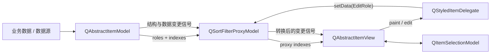

# 9. Model/View 架构

> 适用源码：QtBase 6.10.2（版本见 [`.cmake.conf`](https://github.com/qt/qtbase/blob/v6.10.2/.cmake.conf)）<br>
> 本文定位：第 14～15 周的 Model/View 主线。目标不是只会把 `QStringListModel` 交给 `QTreeView`，而是能独立设计树模型、证明索引与结构通知的正确性、理解代理映射和选择状态，并用 `QAbstractItemModelTester` 把模型契约变成自动检查。<br>
> 前置知识：建议先完成 [`02-qobject-moc-metaobject-system.md`](sourceStudy_02-qobject-moc-metaobject-system.md)、[`03-event-loop-and-event-dispatch.md`](sourceStudy_03-event-loop-and-event-dispatch.md) 和后续的 QWidget 专题。Model/View 的更新传播依赖信号槽、事件循环、绘制和 Widget 输入状态。

## 9.1 完成本阶段后，你应能回答什么

读完本文并完成实验后，应能用 QtBase 6.10.2 源码解释：

1. Qt 的 Model/View 为什么不是把经典 MVC 三个词换成三个类？
2. Model、View、Delegate、Selection Model 各自拥有哪类状态？
3. `QModelIndex` 内部保存什么，为什么它不是数据对象，也不拥有 `internalPointer()`？
4. 为什么树模型的 `index()` 与 `parent()` 必须满足往返不变量？
5. 为什么通常只有第 0 列能拥有子节点？
6. `Qt::DisplayRole`、`Qt::EditRole`、`flags()` 和 `setData()` 如何形成编辑契约？
7. `QAbstractItemView::setModel()` 实际连接了哪些模型信号？
8. 为什么 `beginInsertRows()` 必须在改底层容器之前调用，`endInsertRows()` 必须在之后调用？
9. `beginMoveRows()` 的 `destinationChild` 为什么在同父节点向下移动时容易算错？
10. 普通 `QModelIndex` 与 `QPersistentModelIndex` 的生命周期承诺有什么差异？
11. 排序或重排时为什么要配合 `layoutAboutToBeChanged()`、`changePersistentIndexList()` 和 `layoutChanged()`？
12. 何时发 `dataChanged()`，何时用行移动，何时只能 reset？
13. current item 与 selected items 为什么是两套状态？
14. 多个 View 如何共享一个 `QItemSelectionModel`？
15. Delegate 的 paint、size hint、editor 创建、提交和关闭路径如何协作？
16. `QSortFilterProxyModel` 如何维护 source/proxy 双向行列映射？
17. 代理链上为什么必须在每一层显式 `mapToSource()` 或 `mapFromSource()`？
18. `dynamicSortFilter`、递归过滤与 `autoAcceptChildRows` 各自改变什么？
19. Qt 6.9 引入的 `beginFilterChange()` 与 Qt 6.10 引入的 `endFilterChange()` 共同解决什么问题？
20. `canFetchMore()` / `fetchMore()` 如何与 View 的可见区域联动？
21. 后台线程为什么不能直接修改一个连接到 View 的模型？
22. `QAbstractItemModelTester` 能发现哪些错误，不能替代哪些业务测试？

建议先读 9.2～9.10，建立索引、通知与持久索引这条主链；再读 9.11～9.16，理解选择、Delegate、Proxy 和 Lazy Fetch；最后按 9.18～9.22 完成源码实验、断点跟踪与测试。

---

## 9.2 先建立总图：这里有五类角色

Qt Widgets 的 item views 至少涉及五类角色：

| 角色 | 代表类 | 拥有的状态 | 不应承担的职责 |
|---|---|---|---|
| Model | `QAbstractItemModel` 子类 | 业务数据或对业务数据的投影、层级、角色、编辑与结构变更协议 | 像素布局、选中颜色、编辑器控件 |
| View | `QListView`、`QTableView`、`QTreeView` | viewport、滚动、展开、可见项几何、输入状态、编辑器实例 | 业务数据所有权、过滤规则 |
| Delegate | `QStyledItemDelegate` | 单元格绘制和编辑策略，通常尽量无状态 | 保存业务数据、维护全局选择 |
| Selection Model | `QItemSelectionModel` | current index、选中范围、选择命令合并 | 数据本身、单元格绘制 |
| Proxy Model | `QAbstractProxyModel`、`QSortFilterProxyModel` | source/proxy 映射、排序过滤投影及其缓存 | 复制一份无同步协议的源数据 |



这套结构不等于教科书式 MVC：

- View 负责显示和用户输入，但单元格显示策略被进一步拆给 Delegate；
- Selection Model 把 current/selection 从 View 中分离，使多个 View 可以共享选择；
- Proxy 本身仍是 Model，可继续串接另一个 Proxy；
- Model 不必拥有原始数据，它可以只是数据库、文件系统或其他对象图的适配层。

所以比“这是 MVC”更准确的描述是：**Model 提供索引化查询和事务式变更协议，View/Delegate/Selection/Proxy 都是这个协议的协作者。**

---

## 9.3 `QAbstractItemModel` 的最小契约

公共接口见 [`qabstractitemmodel.h`](https://github.com/qt/qtbase/blob/v6.10.2/src/corelib/itemmodels/qabstractitemmodel.h)。一个只读树模型最少需要实现：

```cpp
QModelIndex index(int row, int column,
                  const QModelIndex &parent = {}) const override;
QModelIndex parent(const QModelIndex &child) const override;
int rowCount(const QModelIndex &parent = {}) const override;
int columnCount(const QModelIndex &parent = {}) const override;
QVariant data(const QModelIndex &index,
              int role = Qt::DisplayRole) const override;
```

这五个函数共同描述一张虚拟树，而不是五个互不相关的回调。

### 9.3.1 四个结构不变量

对任意有效的 `parent`、合法的 `row` 和 `column`：

```text
child = index(row, column, parent)

child.isValid() == true
child.model() == this
child.row() == row
child.column() == column
parent(child) == parent
```

反方向也必须成立：

```text
p = parent(child)
index(child.row(), child.column(), p) == child
```

`QAbstractItemModelTesterPrivate::checkChildren()` 就会递归检查这些关系，并验证连续两次查询同一位置得到相等索引。实现树模型时，先证明这组不变量，再写编辑和动态更新。

### 9.3.2 为什么通常只有第 0 列有子节点

Qt 的树由“父索引”定义。如果同一行第 0、1 列都返回相同子树，树的父子身份会变得含糊。常见实现是：

```cpp
int TreeModel::rowCount(const QModelIndex &parent) const
{
    if (parent.isValid() && parent.column() != 0)
        return 0;
    // 返回 parent 对应节点的孩子数
}
```

Qt 自带 [`simpletreemodel`](https://github.com/qt/qtbase/blob/v6.10.2/examples/widgets/itemviews/simpletreemodel/treemodel.cpp) 和 model tester 都把这条规则当作树模型的常见契约。除非你的数据确实定义了“不同列拥有不同子树”，否则不要让非第 0 列返回孩子。

### 9.3.3 `hasIndex()` 是边界守门员

`index()` 开头通常调用：

```cpp
if (!hasIndex(row, column, parent))
    return {};
```

它基于 `rowCount(parent)` 和 `columnCount(parent)` 检查边界。仍要注意：这只能证明坐标落在模型声明的范围内，不能证明你的 `internalPointer` 或底层节点一定存在。

---

## 9.4 `QModelIndex`：一个短期定位句柄

Qt 6.10.2 的 [`QModelIndex`](https://github.com/qt/qtbase/blob/v6.10.2/src/corelib/itemmodels/qabstractitemmodel.h) 实质上保存四项：

```text
row        int
column     int
internal   quintptr
model      const QAbstractItemModel *
```

默认构造把 row/column 设为 -1、model 设为空，因此索引无效。`isValid()` 只检查 row、column 和 model，不会替你验证 `internalPointer()` 指向的对象仍然存活。

### 9.4.1 它为什么不是数据对象

`QModelIndex::data(role)` 最终仍回调 `model()->data(*this, role)`。索引没有复制业务数据，只携带“向哪个模型、哪个位置、带哪个内部标识查询”的上下文。

因此：

- 复制 `QModelIndex` 很便宜；
- `QModelIndex` 不拥有 Model；
- `internalPointer()` 不拥有节点；
- 索引不能作为跨任意结构变更的长期缓存；
- 不要把它跨线程传给会在另一线程访问 Model 的代码。

### 9.4.2 `createIndex()` 的两种内部标识

Model 子类只能通过受保护的 `createIndex()` 创建属于自己的索引：

```cpp
createIndex(row, column, nodePointer);
createIndex(row, column, stableIntegerId);
```

二者共用同一个 `quintptr` 存储槽。读取时必须与创建方式匹配，不能把整数 id 当指针解引用。

### 9.4.3 Internal Pointer 的生命周期约束

官方树模型把 `TreeItem *` 存入索引。这个方案成立的前提是：

1. 节点对象的地址在索引使用期间稳定；
2. 父节点拥有子节点，删除整棵子树时遵守 remove/reset 通知协议；
3. 容器移动的是 `unique_ptr`，不是会因扩容而搬家的节点对象本身；
4. Model 销毁后不再使用其索引。

下面的设计危险：

```cpp
std::vector<Node> nodes;
return createIndex(row, column, &nodes[row]);
```

`vector` 扩容可能移动所有 `Node`，现存索引里的裸指针立即悬空。可改为 `std::vector<std::unique_ptr<Node>>`、稳定地址容器，或使用由 Model 解析的整数 id。

### 9.4.4 不要从 `internalPointer()` 推导 row

节点的 row 由它在父节点孩子序列中的当前位置决定。插入、删除、排序后 row 会变化；节点地址却可能不变。正确方式是让 `TreeItem::row()` 在父节点的孩子集合中查找自身，或者维护一套随结构操作同步更新的位置索引。

---

## 9.5 `index()` 与 `parent()`：树模型最关键的双向映射

官方 [`simpletreemodel`](https://github.com/qt/qtbase/blob/v6.10.2/examples/widgets/itemviews/simpletreemodel/treemodel.cpp) 的主链可以压缩为：

```text
index(row, column, parentIndex)
    → 从 parentIndex.internalPointer() 取 parentItem
    → parentItem->child(row)
    → createIndex(row, column, childItem)

parent(childIndex)
    → 从 childIndex.internalPointer() 取 childItem
    → childItem->parentItem()
    → 若为隐藏 root，返回无效索引
    → 否则 createIndex(parentItem->row(), 0, parentItem)
```

隐藏 root node 是常见技巧：它保存表头或顶层节点容器，但不暴露为有效 `QModelIndex`。因此：

```text
QModelIndex()        代表逻辑根
rootItem             是实现内部的隐藏节点
顶层 item 的 parent  返回 QModelIndex()
```

### 常见错误

- `parent()` 返回子节点自己的 row；
- 父索引的 column 不是 0；
- 顶层节点 parent 返回了隐藏 root 的有效索引；
- `index()` 用 source 模型节点创建了 proxy 模型索引，或反之；
- 删除节点后仍从旧索引解引用 `internalPointer()`。

调试时先打印：

```cpp
qDebug() << index
         << index.model()
         << index.row()
         << index.column()
         << index.internalPointer()
         << index.parent();
```

然后验证“向下取 child，再向上取 parent”是否回到同一个索引。

---

## 9.6 Roles、Flags 与编辑协议

Model 不是只返回一段显示文本。View 和 Delegate 使用 role 查询同一索引的不同语义：

| Role | 常见值 | 消费者 |
|---|---|---|
| `Qt::DisplayRole` | 文本、数字、日期 | Delegate 显示文本 |
| `Qt::EditRole` | 原始可编辑值 | Editor 初始化与提交 |
| `Qt::DecorationRole` | `QIcon`、`QPixmap`、`QImage`、颜色 | Delegate 图标区域 |
| `Qt::CheckStateRole` | `Qt::CheckState` | 勾选指示器 |
| `Qt::FontRole` | `QFont` | 字体 |
| `Qt::ForegroundRole` / `BackgroundRole` | `QBrush` | 前景与背景 |
| `Qt::TextAlignmentRole` | `Qt::Alignment` | 对齐 |
| `Qt::SizeHintRole` | `QSize` | 单元格尺寸建议 |
| `Qt::UserRole + n` | 业务字段 | Proxy、Delegate、业务代码 |

### 9.6.1 一个完整的可编辑单元格

可编辑至少需要三部分同时成立：

```cpp
Qt::ItemFlags flags(const QModelIndex &index) const override
{
    if (!index.isValid())
        return Qt::NoItemFlags;
    return QAbstractItemModel::flags(index) | Qt::ItemIsEditable;
}

QVariant data(const QModelIndex &index, int role) const override
{
    if (role == Qt::DisplayRole || role == Qt::EditRole)
        return valueAt(index);
    return {};
}

bool setData(const QModelIndex &index, const QVariant &value, int role) override
{
    if (!index.isValid() || role != Qt::EditRole)
        return false;
    if (!storeValue(index, value))
        return false;
    emit dataChanged(index, index, {Qt::DisplayRole, Qt::EditRole});
    return true;
}
```

只加 `ItemIsEditable` 不实现 `setData()`，会出现编辑器能打开但提交失败；只实现 `setData()` 不加 flag，View 默认不会启动编辑。

### 9.6.2 `dataChanged()` 的 roles 不是装饰

第三个参数为空表示所有 role 可能变化。能精确列出 role 时应列出，它允许 View、Delegate 和 Proxy 缩小重算范围。`topLeft` 与 `bottomRight` 必须：

- 都有效；
- 属于同一 Model；
- 拥有同一个 parent；
- 范围顺序合法；
- 没有越过当前 row/column count。

`QAbstractItemModelTester` 会检查这些边界。

### 9.6.3 `multiData()` 是角色批量查询路径

Qt 6 的 Delegate 会通过 `QModelIndex::multiData()` 一次请求 Font、Alignment、Foreground、CheckState、Decoration、Display、Background 等 role。默认实现仍可逐个回调 `data()`；当远程数据源、数据库适配或 role 计算昂贵时，可重写 `multiData()` 合并查询，但必须填充调用者请求的每个 role。

---

## 9.7 View 如何观察 Model

[`QAbstractItemView::setModel()`](https://github.com/qt/qtbase/blob/v6.10.2/src/widgets/itemviews/qabstractitemview.cpp) 并不复制数据。它断开旧模型后，连接新模型的：

- `dataChanged`、`headerDataChanged`；
- 行列插入、删除、移动信号；
- `modelReset`、`layoutChanged`；
- Model 的 `destroyed`。

随后它创建新的 `QItemSelectionModel`、调用 `setSelectionModel()`，最后 `reset()` 清编辑器、根索引并重新布局。

这解释了三个常见现象：

1. 直接修改底层容器但不发信号，View 不知道发生了什么；
2. 调用 `setModel()` 会替换此前设置的 Selection Model；
3. View 默认不取得 Model 所有权，因为一个 Model 可以供多个 View 使用。

### 9.7.1 通知不仅为了 repaint

结构信号会影响：

- View 的几何和滚动条；
- current/selection；
- 打开的 editor 与 persistent editor；
- Proxy 的映射缓存；
- `QPersistentModelIndex`；
- accessibility 表格事件；
- 其他自定义观察者。

所以“改完数据后 `viewport()->update()`”不能替代正确的 Model 通知。

---

## 9.8 结构修改是事务式协议

插入一批行的正确顺序是：

```cpp
bool TreeModel::insertRows(int position, int count, const QModelIndex &parent)
{
    Node *parentNode = nodeForIndex(parent);
    if (!parentNode || position < 0 || count <= 0
        || position > parentNode->childCount())
        return false;

    beginInsertRows(parent, position, position + count - 1);
    parentNode->insertChildren(position, count);
    endInsertRows();
    return true;
}
```

时序图：

```text
旧结构仍可查询
    ↓
beginInsertRows(parent, first, last)
    ├─ 记录 Change 到内部栈
    ├─ emit rowsAboutToBeInserted
    └─ 收集将受影响的 persistent indexes
    ↓
修改底层容器
    ↓
endInsertRows()
    ├─ 从内部栈取回 Change
    ├─ 调整 persistent indexes 的 row
    └─ emit rowsInserted
    ↓
新结构可查询
```

### 9.8.1 为什么不能先改容器再 begin

`rowsAboutToBeInserted` 的观察者必须看到旧结构，才能记录插入点前后的索引、编辑器和选择状态。Qt 内部也会在 begin 阶段扫描现存持久索引。如果底层容器已经变成新结构，观察者拿到的是“声称还没插入，实际已经插入”的矛盾快照。

### 9.8.2 为什么 begin/end 必须严格配对

Qt 将结构变更压入 `changes` 栈，end 再 pop。因此：

- 漏掉 end 会让后续通知落在错误事务中；
- end 多一次会从空栈取数据；
- first/last 必须为包含两端的区间；
- 插入数量必须等于 `last - first + 1`；
- 不要在 begin/end 之间发出与实际状态矛盾的其他通知或让异常越过 end。

Qt 本身不使用 C++ 异常；如果你的容器操作可能失败，应在 begin 之前完成可失败的准备，或确保 begin 后的变更不会抛出。

### 9.8.3 删除比插入多一个生命周期风险

`beginRemoveRows()` 必须在节点销毁前调用。观察者可能需要读取即将删除项的数据、关闭 editor、移动 current index。`endRemoveRows()` 后，被删除子树中的 `QPersistentModelIndex` 会失效，后续兄弟的 row 会下移。

### 9.8.4 Move 的 destination 是“插入前位置”

同一父节点把第 2 行移到第 4 行之后，调用通常是：

```cpp
beginMoveRows(parent, 2, 2, parent, 5);
```

`destinationChild` 表示“移动块将插到该行之前”，并基于移动前坐标。同父节点向下移动时，移除源行后坐标会收缩，这是最常见的 off-by-one 来源。`beginMoveRows()` 会拒绝目标位于 `[sourceFirst, sourceLast + 1]` 的无效或空操作；返回 `false` 时必须中止底层移动，也不能调用 `endMoveRows()`。

---

## 9.9 选择正确的变更通知

| 实际变化 | 首选协议 | 对持久索引/选择的影响 |
|---|---|---|
| 单元格值或角色变化 | `dataChanged()` | 索引结构不变 |
| 表头变化 | `headerDataChanged()` | 项索引结构不变 |
| 连续插入/删除行列 | begin/end insert/remove | Qt 自动平移或失效相关持久索引 |
| 可描述的连续行列移动 | begin/end move | Qt 自动更新相关持久索引 |
| 项集合不变，只重排布局 | layout about-to/change + persistent remap | 应保留可保留的选择和持久索引 |
| 数据源或结构整体替换，无法映射 | begin/end reset | 所有旧索引、current、selection 失效 |

### 9.9.1 Reset 是最强但最有损的工具

[`endResetModel()`](https://github.com/qt/qtbase/blob/v6.10.2/src/corelib/itemmodels/qabstractitemmodel.cpp) 会使全部 persistent indexes 失效、调用 `resetInternalData()` 并发出 `modelReset`。View 会重新查询，但用户通常丢失：

- 当前项；
- 选择；
- 展开状态；
- 已打开编辑器；
- 滚动上下文。

“不确定发什么信号就 reset”能掩盖结构协议错误，却会制造明显的交互退化。只有无法建立旧结构到新结构的可靠映射时才 reset。

### 9.9.2 Layout change 不是通用 dataChanged

排序或内部重排时，推荐顺序：

```cpp
emit layoutAboutToBeChanged({}, QAbstractItemModel::VerticalSortHint);

const QModelIndexList oldIndexes = persistentIndexList();
QModelIndexList newIndexes;
// 重排底层数据，并为每个旧索引计算新索引
changePersistentIndexList(oldIndexes, newIndexes);

emit layoutChanged({}, QAbstractItemModel::VerticalSortHint);
```

如果可以表示成连续 move，优先用 begin/end move；它提供更精确的语义并自动维护持久索引。

---

## 9.10 `QPersistentModelIndex` 如何跟随结构变化

普通索引只是四字段值。持久索引则指向 `QPersistentModelIndexData`，其中保存当前 `QModelIndex` 和原子引用计数；Model 私有数据还维护从索引到这些 data 对象的集合。

插入前，Qt 找出同 parent 下 row 不小于 first 的持久索引；插入后，用 Model 的 `index()` 重新构造它们并增加 row。删除前，Qt 区分：

- 删除区间之后的兄弟：删除后 row 下移；
- 删除子树中的索引：删除后变成无效索引。

这也是 begin 必须看到旧结构、end 必须看到新结构的另一层原因。

### 9.10.1 Persistent 不等于永久有效

它只承诺在 Model 能描述的结构变化中跟随逻辑项：

- 项被删除后应失效；
- Model reset 后全部失效；
- Model 销毁后失效；
- 自定义 layout change 未调用 `changePersistentIndex*()` 时可能指向错误项；
- `internalPointer` 已悬空时，persistent 也无法修复你的节点生命周期。

### 9.10.2 不要滥用 Persistent

Model 每次结构变更都要扫描和维护已注册的 persistent indexes。把海量索引长期放入容器会放大插入、删除和排序成本。长期业务身份优先保存稳定业务 id，需要显示时再映射到 Model；只有确实要跟随 Model 结构的 UI 状态才使用 `QPersistentModelIndex`。

---

## 9.11 `QItemSelectionModel`：current 与 selection 是两层状态

[`qitemselectionmodel.h`](https://github.com/qt/qtbase/blob/v6.10.2/src/corelib/itemmodels/qitemselectionmodel.h) 明确区分：

- current index：键盘导航、焦点提示、编辑目标；
- selection：一个或多个选中范围。

一个 current item 可以未选中，选中集合也可以包含 current 之外的许多项。

### 9.11.1 Selection 以范围保存

`QItemSelection` 是 `QItemSelectionRange` 列表，不是简单的索引集合。范围能紧凑表示矩形选择；`select()` 根据 `Select`、`Deselect`、`Toggle`、`Clear`、`Current`、`Rows`、`Columns` 合并和拆分范围，最后只发出新增与取消的差集。

常用命令：

```cpp
selectionModel->setCurrentIndex(index,
    QItemSelectionModel::ClearAndSelect
    | QItemSelectionModel::Rows);
```

### 9.11.2 多个 View 共享选择

```cpp
treeView->setModel(proxy);
tableView->setModel(proxy);
tableView->setSelectionModel(treeView->selectionModel());
```

两个 View 必须面向同一个 Model 实例或同一个 Proxy 层。source index 与 proxy index 即使指向同一业务项，也属于不同 Model，不能直接放进同一个 Selection Model。

注意所有权：`setSelectionModel()` 不负责删除旧 Selection Model；`setModel()` 又会创建并安装新的 Selection Model。若你要共享，先给每个 View 设置 Model，再安装共享 Selection Model。

---

## 9.12 Delegate：把显示和编辑策略从 View 拆出来

[`QStyledItemDelegate`](https://github.com/qt/qtbase/blob/v6.10.2/src/widgets/itemviews/qstyleditemdelegate.cpp) 的显示路径：

```text
View 决定 index 的矩形与状态
    ↓
Delegate::paint(painter, option, index)
    ↓
initStyleOption()
    ↓ multiData() 查询多个 role
填充 font / text / icon / check state / brushes
    ↓
QStyle::drawControl(CE_ItemViewItem)
```

它不是为每个单元格常驻一个 QWidget。普通显示只绘制；只有进入编辑状态时才创建 editor widget。

### 9.12.1 编辑路径

```text
View 检查 flags + edit trigger
    ↓
Delegate::createEditor()
    ↓
Delegate::setEditorData()      ← index.data(EditRole)
    ↓ 用户编辑
commitData(editor)
    ↓
Delegate::setModelData()       → model->setData(index, value, EditRole)
    ↓
closeEditor(editor)
```

默认 `QStyledItemDelegate` 使用 `QItemEditorFactory` 按 `EditRole` 的元类型创建编辑器，并通过 editor 的 Qt user property 读写值。

### 9.12.2 自定义显示的安全骨架

```cpp
void SeverityDelegate::initStyleOption(QStyleOptionViewItem *option,
                                       const QModelIndex &index) const
{
    QStyledItemDelegate::initStyleOption(option, index);

    if (index.data(Qt::UserRole + 1).toInt() >= 3) // 3 代表 Critical
        option->palette.setColor(QPalette::Text, QColorConstants::Svg::crimson);
}
```

优先重写 `initStyleOption()` 并继续复用基类 `paint()`，能保留当前平台 Style 的 selection、focus、高 DPI 和 disabled 状态。完全自绘时要 `save()` / `restore()` painter，并尊重 `option.rect`、`option.state` 和 `option.palette`。

---

## 9.13 Proxy Model：Model 上的可组合投影

[`QAbstractProxyModel`](https://github.com/qt/qtbase/blob/v6.10.2/src/corelib/itemmodels/qabstractproxymodel.h) 仍继承 `QAbstractItemModel`，并新增两个核心纯虚函数：

```cpp
virtual QModelIndex mapToSource(const QModelIndex &proxyIndex) const = 0;
virtual QModelIndex mapFromSource(const QModelIndex &sourceIndex) const = 0;
```

默认的 `data()`、`setData()`、`flags()`、`fetchMore()` 等会先把 proxy index 映射到 source，再转发调用。具体 Proxy 还必须把 source 的结构和数据变更转换成自己的通知。

### 9.13.1 `QSortFilterProxyModel` 的双向映射

Qt 6.10.2 为每个 source parent 缓存一份 `Mapping`：

```text
source_rows       proxy row → source row
source_columns    proxy col → source col
proxy_rows        source row → proxy row，过滤掉时为 -1
proxy_columns     source col → proxy col，过滤掉时为 -1
mapped_children   已建立映射的子 parent
source_parent     本映射所属 source parent
```

创建映射时先调用 `filterAcceptsRow/Column()` 收集可见行列，再排序 source rows，最后建立反向数组。`mapToSource()` 用 proxy row 查 `source_rows`；`mapFromSource()` 用 source row 查 `proxy_rows`，若结果为 -1 则返回无效索引。

这说明 Proxy 不是“每次 data() 临时算一下 row”。它维护结构缓存，因此 source 模型错误或缺失的结构通知会直接破坏映射。

### 9.13.2 代理链的索引归属

```text
SourceModel
   ↑ mapToSource
FilterProxy
   ↑ mapToSource
Sort/PresentationProxy
   ↑
View index
```

每个 `QModelIndex` 都带 `model()`。要从最外层 index 到 Source，必须逐层映射；不能拿外层 index 直接调用中间或源 Model。反向同理。可封装明确的转换函数，并在 Debug 版断言每一层 `index.model()`。

---

## 9.14 深入 `QSortFilterProxyModel`

Qt 6.10.2 的关键默认值：

| 属性 | 默认值 | 含义 |
|---|---|---|
| `filterKeyColumn` | 0 | 只检查 source 第 0 列；设为 -1 时检查所有列 |
| `filterRole` | `Qt::DisplayRole` | 过滤读取的 role |
| `sortRole` | `Qt::DisplayRole` | 排序读取的 role |
| filter/sort case sensitivity | `Qt::CaseSensitive` | 默认大小写敏感 |
| `dynamicSortFilter` | true | source 变化时动态维护排序过滤 |
| `recursiveFilteringEnabled` | false | 默认不会因后代匹配而保留祖先 |
| `autoAcceptChildRows` | false | 默认不会因父行匹配而自动接纳全部孩子 |

### 9.14.1 自定义 filter 的正确更新协议

Qt 6.9 先引入 `beginFilterChange()`；Qt 6.10 再加入带方向参数的 `endFilterChange()`，形成方向明确的过滤变更协议：

```cpp
void LogFilterProxy::setMinimumSeverity(int severity)
{
    if (m_minimumSeverity == severity)
        return;
    beginFilterChange();
    m_minimumSeverity = severity;
    endFilterChange(QSortFilterProxyModel::Direction::Rows);
}
```

`filterAcceptsRow()` 收到的是 source row 和 source parent，内部必须构造 source index：

```cpp
bool LogFilterProxy::filterAcceptsRow(int sourceRow,
                                      const QModelIndex &sourceParent) const
{
    const QModelIndex severityIndex =
        sourceModel()->index(sourceRow, SeverityColumn, sourceParent);
    return severityIndex.data(SeverityRole).toInt() >= m_minimumSeverity;
}
```

如果参数同时影响行列，`endFilterChange(Direction::Both)`；只影响行就用 `Rows`，避免无谓重建列映射。

### 9.14.2 递归过滤的两个方向

- `recursiveFilteringEnabled=true`：某个后代匹配时，祖先可保留，使树路径可见；
- `autoAcceptChildRows=true`：某行自己匹配时，它的孩子可自动保留。

二者方向相反，不是同一个开关。大树上递归过滤会访问更多节点，应测量 `filterAcceptsRow()`、`rowCount()` 和 `data()` 的调用量。

### 9.14.3 Dynamic Sort/Filter 的写入陷阱

源码文档明确提醒：`dynamicSortFilter=true` 时，不要依赖“通过 Proxy 插入后仍停留在原 row”的写法；写入可能立刻改变排序/过滤映射。编辑完成后若还需定位同一业务项，应保存业务 id 或 `QPersistentModelIndex`，再重新映射，不要缓存 row。

---

## 9.15 Lazy Fetch：可见性驱动的增量加载

默认 `canFetchMore()` 返回 false，`fetchMore()` 什么也不做。增量模型应维护“已暴露数量”和“总可用数量”：

```cpp
bool FileListModel::canFetchMore(const QModelIndex &parent) const
{
    return !parent.isValid() && m_visibleCount < m_allFiles.size();
}

void FileListModel::fetchMore(const QModelIndex &parent)
{
    if (parent.isValid())
        return;

    const int first = m_visibleCount;
    const int count = qMin(100, int(m_allFiles.size()) - first);
    if (count <= 0)
        return;

    beginInsertRows({}, first, first + count - 1);
    m_visibleCount += count;
    endInsertRows();
}
```

Qt 自带实现见 [`fetchmore/filelistmodel.cpp`](https://github.com/qt/qtbase/blob/v6.10.2/examples/widgets/itemviews/fetchmore/filelistmodel.cpp)。`QAbstractItemView` 会在以下时机触发检查：

- 更新几何后用 0ms timer 延迟检查；
- 滚动条到末端；
- current 到最后一行；
- 已有最后一行仍与 viewport 相交。

### 9.15.1 `canFetchMore()` 必须最终变成 false

如果 `fetchMore()` 不增加 `rowCount()`，而 `canFetchMore()` 永远为 true，View 和 tester 可能反复调用，形成忙循环。每次 fetch 应取得可观察进展，或记录 in-flight 状态并暂时返回 false。

### 9.15.2 异步加载的两阶段设计

```text
GUI 线程：canFetchMore/fetchMore 发起请求，标记 in-flight
    ↓ queued request
后台线程：读取/解析，生成纯值结果
    ↓ queued result
GUI 线程：beginInsertRows → 合并结果 → endInsertRows → 清 in-flight
```

不要在后台线程调用 `beginInsertRows()`、修改与 View 同时读取的容器或发出模型结构信号。

---

## 9.16 线程边界：Model API 不是线程安全接口

Qt 的 [`models.qdocinc`](https://github.com/qt/qtbase/blob/v6.10.2/src/corelib/doc/src/includes/models.qdocinc) 明确规定：`QAbstractItemModel` 是 QObject 子类，不是线程安全类；所有 Model 相关 API 只能从 Model 所在线程调用。连接到 Widget View 的 Model 通常必须在 GUI 线程，因为 View 会在 GUI 线程同步调用 `rowCount()`、`index()` 和 `data()`。

安全边界是：

```text
后台线程可以：
    读取外部数据、解析、排序纯值副本、生成 diff

后台线程不可以：
    直接调用 model->setData()
    直接 begin/end insert/remove/reset
    一边改容器，一边让 GUI 线程 data() 读取

GUI 线程负责：
    应用 diff
    发出 Model 通知
    维护节点和索引生命周期
```

Queued Connection 只解决“把应用更新的函数投到 Model 线程”，不会自动让共享容器线程安全。最好让后台结果是有所有权的不可变值，由 Model 线程独占合并。

---

## 9.17 性能模型：优化调用次数和失效范围

View、Delegate、Proxy 和 Tester 会高频调用 Model API。性能分析不要只看 `data()` 单次耗时，还要看调用次数。

### 9.17.1 常见热点

- `rowCount()` / `columnCount()`：树遍历和布局会反复查询；
- `index()` / `parent()`：导航、展开、Proxy 映射都会调用；
- `data()` / `multiData()`：每次绘制、排序、过滤会调用；
- `filterAcceptsRow()`：过滤失效时可能遍历大量节点；
- `lessThan()`：排序比较次数约为 O(n log n)，昂贵转换会被放大；
- `TreeItem::row()`：若每次线性查找兄弟，深树和宽树上会变贵；
- persistent indexes：结构变更时需要扫描与重映射。

### 9.17.2 优化顺序

1. 先缩小通知范围，避免无差别 reset 和空 roles 的 `dataChanged()`；
2. 让 `rowCount()`、`index()`、`parent()` 只做内存定位，不做 I/O；
3. 把过滤/排序用的数据放在专用 role，避免重复格式化显示文本；
4. 对多个 role 的昂贵查询重写 `multiData()`；
5. 使用 Lazy Fetch 控制首屏数量；
6. 测量 Proxy 链层数和映射成本；
7. 最后再做节点 row 缓存，并用所有结构操作测试其一致性。

### 9.17.3 正确性优先于缓存

缓存 row、parent index、格式化字符串或过滤结果都会新增失效协议。Model/View 最难的 bug 往往不是慢，而是“插入后偶现指向另一项”。每新增缓存，都要明确由哪些 data/structure/layout/reset 事件使其失效。

---

## 9.18 实践项目：从官方树模型扩展到完整工作台

本实践不从空白复制一套未经验证的模型。以 Qt 6.10.2 自带的两个例子为基线：

- [`simpletreemodel`](https://github.com/qt/qtbase/tree/v6.10.2/examples/widgets/itemviews/simpletreemodel)：只读树、稳定节点地址、model tester；
- [`editabletreemodel`](https://github.com/qt/qtbase/tree/v6.10.2/examples/widgets/itemviews/editabletreemodel)：编辑、动态增删行列和精确通知。

### 9.18.1 第一步：运行只读树并建立断点

若已有可用的 Qt 6.10.2 安装前缀：

```powershell
cmake -S examples/widgets/itemviews/simpletreemodel `
      -B build-study/simpletreemodel `
      -DCMAKE_PREFIX_PATH=<Qt-6.10.2-prefix>
cmake --build build-study/simpletreemodel --config Debug
ctest --test-dir build-study/simpletreemodel -C Debug --output-on-failure
```

启动 `simpletreemodel`，在以下函数下断点：

```text
TreeModel::index
TreeModel::parent
TreeModel::rowCount
TreeModel::data
QAbstractItemView::setModel
QStyledItemDelegate::paint
```

首次结果不晚于第 2 步：View 出现树后，展开一层并观察 `rowCount → index → data → paint` 的重复调用。

### 9.18.2 第二步：加入编辑和动态增删

参考 [`editabletreemodel/treemodel.cpp`](https://github.com/qt/qtbase/blob/v6.10.2/examples/widgets/itemviews/editabletreemodel/treemodel.cpp) 实现：

- `flags()` 增加 `ItemIsEditable`；
- `data()` 同时支持 DisplayRole 与 EditRole；
- `setData()` 修改节点并发 `dataChanged()`；
- `insertRows()` / `removeRows()` 使用 begin/end；
- UI 上增加“添加同级”“添加子项”“删除”动作。

每个动作都验证：

```text
操作前 rowCount
about-to signal 中 rowCount 仍为旧值
操作后 rowCount 精确增减
未受影响项的数据未改变
current/selection 落到合理位置
QPersistentModelIndex 跟随或失效符合预期
```

### 9.18.3 第三步：加入排序过滤 Proxy

```cpp
auto *proxy = new QSortFilterProxyModel(&window);
proxy->setSourceModel(&treeModel);
proxy->setFilterKeyColumn(-1);
proxy->setFilterCaseSensitivity(Qt::CaseInsensitive);
proxy->setRecursiveFilteringEnabled(true);
proxy->setDynamicSortFilter(true);

view.setModel(proxy);
view.setSortingEnabled(true);
view.sortByColumn(0, Qt::AscendingOrder);
```

所有 UI 操作得到的是 proxy index。删除源节点前先映射：

```cpp
const QModelIndex proxyIndex = view.currentIndex();
const QModelIndex sourceIndex = proxy->mapToSource(proxyIndex);
treeModel.removeRow(sourceIndex.row(), sourceIndex.parent());
```

### 9.18.4 第四步：加入自定义 Delegate

先只根据自定义 role 改文字颜色，复用 `QStyledItemDelegate::paint()`；再增加专用 editor。验证：

- selection/focus 状态仍由当前 Style 正确绘制；
- editor 的值来自 EditRole；
- commit 后 Model 收到 `setData(..., EditRole)`；
- Proxy 排序可能导致编辑项改变 row，但业务身份未丢失。

### 9.18.5 第五步：加入 Lazy Fetch

任选一个大节点，只先暴露 100 个孩子。滚动到末端时再增加一批。记录：

- `canFetchMore()` 的返回状态；
- `fetchMore()` 是否只在 Model 线程运行；
- 插入区间是否与新增数量完全一致；
- 过滤 Proxy 下 source/proxy 可见数量是否合理。

---

## 9.19 用 `QAbstractItemModelTester` 验证契约

最小测试沿用 Qt 自带 [`simpletreemodel/test.cpp`](https://github.com/qt/qtbase/blob/v6.10.2/examples/widgets/itemviews/simpletreemodel/test.cpp) 的做法。这个示例模型是只读模型，因此这里只构造真实数据并让 tester 检查其静态契约：

```cpp
void TestTreeModel::modelContract()
{
    TreeModel model(QStringLiteral("Title\n  Child"));
    QAbstractItemModelTester tester(
        &model,
        QAbstractItemModelTester::FailureReportingMode::QtTest);

    QCOMPARE(model.rowCount(), 1);
    QCOMPARE(model.rowCount(model.index(0, 0)), 1);
}
```

`simpletreemodel` 没有重写 `insertRows()` / `removeRows()`，基类实现会返回 false。要验证动态插入和删除，应改用 `editabletreemodel` 或自己的可变模型，并让 tester 的生命周期覆盖所有待测变更。链接目标仍为 `Qt6::Test`。

### 9.19.1 它会检查什么

- 无效 parent/index 的基本行为；
- row/column count 非负且与 `hasIndex()` 一致；
- `index()` 可重复，row/column/model 字段正确；
- `parent(index)` 与创建 index 时的 parent 往返一致；
- 树递归最多检查一定深度；
- persistent index 在遍历子树后仍指向同一项；
- insert/remove 前后数量和邻接项符合声明区间；
- 同一时刻结构 change 类型按协议配对；
- layout change 前后的 persistent index 可回查；
- `dataChanged()` 和 `headerDataChanged()` 范围合法；
- 默认可选择是否调用 `fetchMore()`。

### 9.19.2 它不会替你证明什么

- 每个业务 role 的值是否正确；
- 删除、移动和编辑的业务权限；
- Proxy 过滤语义是否符合产品要求；
- Delegate 的像素结果和 editor 交互；
- 大数据性能；
- 跨线程结果合并的竞态；
- 业务 id 与节点生命周期是否长期一致。

因此至少再写：角色表测试、每种结构操作的 signal spy 测试、persistent index 测试、Proxy 双向映射测试和真实 View 冒烟测试。

---

## 9.20 用调试器跟六条真实调用链

### 9.20.1 View 安装 Model

```text
QTreeView::setModel
    → QAbstractItemView::setModel
    → 连接 Model 信号
    → new QItemSelectionModel
    → setSelectionModel
    → reset
```

观察 View 没有取得 Model 所有权，以及重复 setModel 时旧 Selection Model 如何处理。

### 9.20.2 首次绘制一个单元格

```text
View layout/paint
    → model->rowCount/index
    → delegate->sizeHint/paint
    → QStyledItemDelegate::initStyleOption
    → index.multiData
    → model->multiData/data
    → QStyle::drawControl
```

### 9.20.3 插入一行

```text
TreeModel::insertRows
    → QAbstractItemModel::beginInsertRows
    → rowsAboutToBeInserted
    → 调整底层节点容器
    → QAbstractItemModel::endInsertRows
    → 更新 persistent indexes
    → rowsInserted
    → Proxy 更新 Mapping
    → View 更新几何与 editor
```

### 9.20.4 编辑提交

```text
View::edit
    → Delegate::createEditor
    → Delegate::setEditorData
    → commitData
    → Delegate::setModelData
    → Proxy::setData
    → SourceModel::setData
    → dataChanged
    → Proxy 转发/重排
    → View repaint
```

### 9.20.5 过滤变化

```text
自定义 setter
    → beginFilterChange
    → 修改过滤参数
    → endFilterChange(Rows)
    → filter_changed
    → filterAcceptsRow
    → 增删 proxy rows / 更新双向映射
    → View 接收 proxy 结构信号
```

### 9.20.6 Lazy Fetch

```text
View 更新几何或滚动到末端
    → QAbstractItemViewPrivate::fetchMore
    → model->canFetchMore(root)
    → model->fetchMore(root)
    → begin/endInsertRows
    → View 再次布局
```

---

## 9.21 常见误区与源码反证

### 误区 1：“QModelIndex 保存了那一项的数据”

反证：它只保存 row、column、internal id/pointer 和 model；`data()` 仍回调 Model。

### 误区 2：“internalPointer 交给 Qt 后由 Qt 释放”

反证：索引不拥有指针；节点生命周期完全由 Model 实现负责。

### 误区 3：“只要指针地址没变，普通 QModelIndex 就能永久保存”

反证：row、parent、Model 结构语义仍可能变化；长期跟踪应使用 persistent index 或业务 id。

### 误区 4：“beginInsertRows 只是帮我发两个信号”

反证：它还记录 change、协调嵌套操作，并参与持久索引维护。

### 误区 5：“改完容器后 begin/end 也一样”

反证：about-to 观察者和 Qt 私有实现必须看到旧结构，end 观察者必须看到新结构。

### 误区 6：“插入三个孩子要为每个后代都发插入信号”

反证：插入带整棵子树的父项，只为父项所在层的行发通知；子树随父项一起进入模型。

### 误区 7：“View 没刷新，调用 viewport()->update() 就够了”

反证：Proxy 映射、Selection、Editor、Persistent Index 和 Accessibility 都依赖 Model 通知，不只是绘制。

### 误区 8：“current item 一定属于 selection”

反证：`QItemSelectionModel` 分开保存 current 与 ranges；命令是否包含 Select 决定是否同时选中。

### 误区 9：“Selection Model 可以混用 source index 和 proxy index”

反证：每个 Selection Model 绑定一个 Model；不同层索引的 `model()` 不同。

### 误区 10：“Delegate 是每个单元格里的 QWidget”

反证：常态只绘制；进入编辑时才临时创建 editor，persistent editor 是显式例外。

### 误区 11：“过滤只改变 data，不改变结构”

反证：被过滤项在 Proxy 中不存在，`mapFromSource()` 返回无效索引，Proxy row count 和结构信号都会变化。

### 误区 12：“recursiveFilteringEnabled 与 autoAcceptChildRows 是同义词”

反证：前者因后代匹配保留祖先，后者因父项匹配接纳孩子，传播方向相反。

### 误区 13：“reset 最安全，任何变更都用它”

反证：reset 使全部旧索引、current 和 selection 失效，并重建 View/Proxy 状态；它是有损的最后手段。

### 误区 14：“后台线程只改底层 vector，不调用 Model API就安全”

反证：GUI 线程可能正在 `data()` / `rowCount()` 中读同一容器，仍然是数据竞争；结果应排队回 Model 线程合并。

### 误区 15：“Model Tester 通过就说明业务模型完全正确”

反证：Tester 验证通用结构契约，不知道你的业务角色、权限、排序规则和性能目标。

---

## 9.22 自测题与答案要点

### 问题 1

为什么 `QModelIndex::isValid()` 为 true 仍可能崩溃？

答案要点：它只检查 row/column/model，不验证 internal pointer 生命周期，也不验证当前 row/parent 仍属于 Model。

### 问题 2

树模型使用 `std::vector<std::unique_ptr<Node>>` 时，vector 扩容为什么通常不破坏 node pointer？

答案要点：扩容移动的是 `unique_ptr` 对象，堆上 Node 地址不变；但删除对应 unique_ptr 后指针仍会悬空，必须遵守删除通知和索引生命周期。

### 问题 3

`beginInsertRows(parent, 3, 5)` 后底层实际只增加两行会怎样？

答案要点：通知声称增加三行，View/Proxy/Tester 的 row 映射与真实 rowCount 冲突；Tester 会比较新旧数量发现错误。

### 问题 4

为什么排序时只发 `layoutChanged()` 不够？

答案要点：观察者需要 about-to 边界保存状态；Model 还需用 `changePersistentIndex*()` 把旧逻辑项映射到新位置。

### 问题 5

何时应选择 begin/end move 而不是 layout change？

答案要点：连续行列移动能精确描述时优先 move，它自动维护持久索引并给观察者更强语义；全局复杂重排才用 layout + 手动 remap。

### 问题 6

两个 View 展示同一 Source，但各自使用不同 Filter Proxy，能否直接共享 Selection Model？

答案要点：不能直接共享，因为 Selection Model 绑定具体 Model，两个 Proxy 是不同实例且索引空间不同。应以业务 id 或 source selection 做双向映射同步。

### 问题 7

为何编辑后不能继续用旧的 proxy row 定位同一项？

答案要点：`dynamicSortFilter` 可能因数据变化立即重排或过滤。保存业务 id 或 persistent index，并重新映射。

### 问题 8

Lazy Fetch 正在后台请求时，`canFetchMore()` 应如何设计？

答案要点：通常在 in-flight 时返回 false，避免重复请求；结果回 GUI/Model 线程后用 begin/end insert 合并，再根据剩余数据恢复 true。

### 问题 9

`dataChanged(index, index, {})` 与列出 roles 有何差异？

答案要点：空 roles 表示所有 role 可能变化，观察者可能重算更多状态；精确 roles 能缩小 repaint、过滤和排序重算。

### 问题 10

为何 Model Tester 要在构造后继续存活？

答案要点：构造时只完成当前结构的基础检查；它还连接所有结构、layout、reset 和 data 信号，只有覆盖后续操作才能检查事务配对和数量变化。

---

## 9.23 阶段验收清单

- [ ] 能画出 Model、View、Delegate、Selection Model、Proxy 的状态所有权图。
- [ ] 能从 `QModelIndex` 四个字段解释它为何是短期句柄。
- [ ] 自定义树模型通过 `index ↔ parent` 往返检查。
- [ ] 节点地址在结构变更期间稳定，删除路径无悬空 internal pointer。
- [ ] 编辑同时实现 flags、EditRole、setData 与精确 dataChanged。
- [ ] 插入、删除、移动严格使用正确的 begin/end 顺序和区间。
- [ ] 能解释普通索引和 persistent index 在插入、删除、move、layout、reset 下的结果。
- [ ] current 与 selection 行为分别有测试。
- [ ] source/proxy 双向映射对可见和被过滤项都有测试。
- [ ] 自定义过滤参数使用 Qt 6.9 的 `beginFilterChange()` 与 Qt 6.10 的 `endFilterChange()`。
- [ ] Delegate 保留 selection、focus、Style 与高 DPI 行为。
- [ ] Lazy Fetch 能终止，不会重复并发请求，结构更新发生在 Model 线程。
- [ ] `QAbstractItemModelTester` 覆盖所有动态操作的生命周期。
- [ ] 至少运行一次真实 `QTreeView + Proxy + Delegate` 冒烟实验。
- [ ] 用调试器记录一次插入、一轮过滤和一次 editor commit 的真实调用栈。

---

## 9.24 推荐源码阅读顺序

第一轮只追 Model 契约和树索引：

1. [`qabstractitemmodel.h`](https://github.com/qt/qtbase/blob/v6.10.2/src/corelib/itemmodels/qabstractitemmodel.h)：`QModelIndex` 字段、纯虚接口、信号和 protected 事务 API。
2. [`simpletreemodel/treemodel.cpp`](https://github.com/qt/qtbase/blob/v6.10.2/examples/widgets/itemviews/simpletreemodel/treemodel.cpp) 与 [`treeitem.cpp`](https://github.com/qt/qtbase/blob/v6.10.2/examples/widgets/itemviews/simpletreemodel/treeitem.cpp)：`internalPointer`、隐藏 root、index/parent 往返。
3. [`qabstractitemmodel.cpp`](https://github.com/qt/qtbase/blob/v6.10.2/src/corelib/itemmodels/qabstractitemmodel.cpp)：begin/end insert/remove/move/reset。
4. [`qabstractitemmodel_p.h`](https://github.com/qt/qtbase/blob/v6.10.2/src/corelib/itemmodels/qabstractitemmodel_p.h)：change 栈和 persistent index 数据结构。
5. [`qabstractitemmodeltester.cpp`](https://github.com/qt/qtbase/blob/v6.10.2/src/testlib/qabstractitemmodeltester.cpp)：把隐含不变量变成可执行检查。

第二轮进入协作者：

6. [`qabstractitemview.cpp`](https://github.com/qt/qtbase/blob/v6.10.2/src/widgets/itemviews/qabstractitemview.cpp)：`setModel()`、结构信号响应、fetch-more 触发点。
7. [`qitemselectionmodel.h`](https://github.com/qt/qtbase/blob/v6.10.2/src/corelib/itemmodels/qitemselectionmodel.h) 与 [`qitemselectionmodel.cpp`](https://github.com/qt/qtbase/blob/v6.10.2/src/corelib/itemmodels/qitemselectionmodel.cpp)：range merge、current/selection、reset 竞态防护。
8. [`qstyleditemdelegate.cpp`](https://github.com/qt/qtbase/blob/v6.10.2/src/widgets/itemviews/qstyleditemdelegate.cpp)：multiData、Style 绘制和 editor user property。
9. [`qabstractproxymodel.cpp`](https://github.com/qt/qtbase/blob/v6.10.2/src/corelib/itemmodels/qabstractproxymodel.cpp)：转发接口与 source 连接。
10. [`qsortfilterproxymodel.cpp`](https://github.com/qt/qtbase/blob/v6.10.2/src/corelib/itemmodels/qsortfilterproxymodel.cpp)：Mapping 缓存、source/proxy 双向数组、动态更新和过滤变更协议。

第三轮用测试校准边界：

11. [`tst_qabstractitemmodel.cpp`](https://github.com/qt/qtbase/blob/v6.10.2/tests/auto/corelib/itemmodels/qabstractitemmodel/tst_qabstractitemmodel.cpp)：基础模型与 persistent index 边界。
12. [`tst_qitemselectionmodel.cpp`](https://github.com/qt/qtbase/blob/v6.10.2/tests/auto/corelib/itemmodels/qitemselectionmodel/tst_qitemselectionmodel.cpp)：选择范围、current 与结构变化。
13. [`tst_qsortfilterproxymodel.cpp`](https://github.com/qt/qtbase/blob/v6.10.2/tests/auto/corelib/itemmodels/qsortfilterproxymodel/tst_qsortfilterproxymodel.cpp)：过滤、排序、映射、动态变化与 fetch more。
14. [`tst_qabstractitemview.cpp`](https://github.com/qt/qtbase/blob/v6.10.2/tests/auto/widgets/itemviews/qabstractitemview/tst_qabstractitemview.cpp)：View 与 Model/Selection/Editor 的协作。
15. [`tst_qitemdelegate.cpp`](https://github.com/qt/qtbase/blob/v6.10.2/tests/auto/widgets/itemviews/qitemdelegate/tst_qitemdelegate.cpp)：item delegate 的 role、editor、Style 和事件边界。

每完成一条行为链，都画四张小图：

```text
索引空间图：source / proxy / persistent 分别属于谁
节点所有权图：谁拥有 Node，何时销毁
变更时序图：about-to / 修改 / completed
UI 状态图：current / selection / editor / expansion 如何变化
```

如果这四张图不能同时自洽，就还没有真正掌握 Model/View 的结构协议。

---

## 9.25 本文使用的源码证据索引

| 结论 | QtBase 6.10.2 证据 |
|---|---|
| `QModelIndex` 保存 row、column、internal id、model | [`qabstractitemmodel.h`](https://github.com/qt/qtbase/blob/v6.10.2/src/corelib/itemmodels/qabstractitemmodel.h) |
| begin/end 记录 change、发信号并维护 persistent indexes | [`qabstractitemmodel.cpp`](https://github.com/qt/qtbase/blob/v6.10.2/src/corelib/itemmodels/qabstractitemmodel.cpp)、[`qabstractitemmodel_p.h`](https://github.com/qt/qtbase/blob/v6.10.2/src/corelib/itemmodels/qabstractitemmodel_p.h) |
| reset 会使全部 persistent indexes 失效 | [`QAbstractItemModel::endResetModel`](https://github.com/qt/qtbase/blob/v6.10.2/src/corelib/itemmodels/qabstractitemmodel.cpp) |
| View 通过模型信号观察数据与结构 | [`QAbstractItemView::setModel`](https://github.com/qt/qtbase/blob/v6.10.2/src/widgets/itemviews/qabstractitemview.cpp) |
| Selection 分开保存 current 与 ranges | [`qitemselectionmodel.h`](https://github.com/qt/qtbase/blob/v6.10.2/src/corelib/itemmodels/qitemselectionmodel.h)、[`qitemselectionmodel.cpp`](https://github.com/qt/qtbase/blob/v6.10.2/src/corelib/itemmodels/qitemselectionmodel.cpp) |
| Delegate 用 multiData 填充 Style Option | [`QStyledItemDelegate::initStyleOption`](https://github.com/qt/qtbase/blob/v6.10.2/src/widgets/itemviews/qstyleditemdelegate.cpp) |
| Sort/Filter Proxy 缓存 source/proxy 双向映射 | [`qsortfilterproxymodel.cpp`](https://github.com/qt/qtbase/blob/v6.10.2/src/corelib/itemmodels/qsortfilterproxymodel.cpp) |
| Qt 6.9 引入 beginFilterChange，Qt 6.10 加入带方向参数的 endFilterChange | [`qsortfilterproxymodel.h`](https://github.com/qt/qtbase/blob/v6.10.2/src/corelib/itemmodels/qsortfilterproxymodel.h) |
| View 会根据可见区域调用 fetchMore | [`qabstractitemview.cpp`](https://github.com/qt/qtbase/blob/v6.10.2/src/widgets/itemviews/qabstractitemview.cpp) |
| Model API 只能从 Model 所在线程调用 | [`models.qdocinc`](https://github.com/qt/qtbase/blob/v6.10.2/src/corelib/doc/src/includes/models.qdocinc) |
| Tester 检查结构往返和事务前后数量 | [`qabstractitemmodeltester.cpp`](https://github.com/qt/qtbase/blob/v6.10.2/src/testlib/qabstractitemmodeltester.cpp) |
