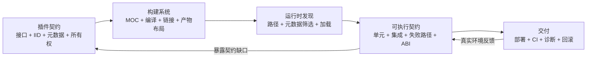
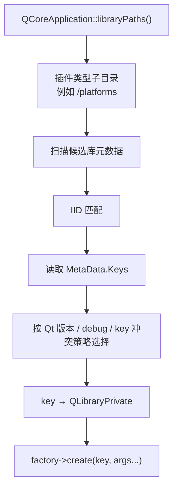
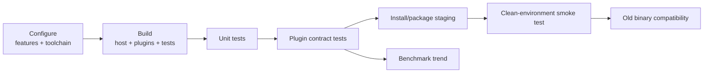

# 10. 插件、测试和工程化

> 适用源码：QtBase 6.10.2（版本见 [`.cmake.conf`](https://github.com/qt/qtbase/blob/v6.10.2/.cmake.conf)）<br>
> 本文定位：第 16 周的扩展边界、质量保障与交付主线。目标不是只会写 `Q_PLUGIN_METADATA` 或 `QVERIFY`，而是能设计一个可发现、可验证、可部署、可演进的插件协议，并用自动测试、基准测试和 CMake/CTest 把这些约束变成持续执行的工程系统。<br>
> 前置知识：建议先完成 [`01-value-semantics-implicit-sharing-abi.md`](sourceStudy_01-value-semantics-implicit-sharing-abi.md)、[`02-qobject-moc-metaobject-system.md`](sourceStudy_02-qobject-moc-metaobject-system.md) 和 [`03-event-loop-and-event-dispatch.md`](sourceStudy_03-event-loop-and-event-dispatch.md)。插件依赖元对象和 ABI，异步测试依赖事件循环。

## 10.1 完成本阶段后，你应能回答什么

读完本文并完成实验后，应能用 QtBase 6.10.2 源码解释：

1. `Q_DECLARE_INTERFACE`、`Q_INTERFACES` 和 `Q_PLUGIN_METADATA` 分别解决什么问题？
2. IID 是 C++ 类型名、插件名，还是一份可版本化的运行时协议标识？
3. JSON 元数据如何被 MOC 编入插件，宿主为什么能在不执行插件代码时读取它？
4. `QPluginLoader::instance()` 为什么会隐式调用 `load()`？返回对象由谁拥有？
5. 为什么一个插件库通常只有一个 root component 实例？
6. `qobject_cast<Interface *>()` 如何越过动态库边界找到接口？
7. `QPluginLoader` 和 Qt 内部的 `QFactoryLoader` 有什么职责差异？
8. QPA、图片格式等“按 key 选择实现”的插件为何需要 Factory/Registry 层？
9. 动态插件和静态插件的发现、注册、实例化路径分别是什么？
10. 为什么“能加载 DLL”不等于“插件兼容”？
11. 修改纯虚接口、元数据 schema、所有权约定分别属于哪种兼容性变化？
12. 为什么热卸载比热加载难得多？哪些对象、回调或线程会阻止安全卸载？
13. 插件搜索路径为什么同时是部署问题和安全边界？
14. `QTEST_MAIN` 最终如何通过元对象枚举并调用 private slots？
15. `_data()`、`QTest::addColumn()`、`newRow()` 和 `QFETCH()` 如何形成数据驱动测试？
16. `initTestCase()`、`init()`、测试函数、`cleanup()`、`cleanupTestCase()` 的真实顺序是什么？
17. `QSignalSpy` 如何截获任意信号参数，为什么参数类型必须能进入元类型系统？
18. `QTRY_VERIFY`/`QTRY_COMPARE` 为什么通常优于固定 `qWait()`？
19. `tests/auto`、`tests/benchmarks`、`tests/manual`、`tests/baseline` 和 `tests/libfuzzer` 分别保护什么？
20. 正确性测试和性能基准为什么必须分开设计？
21. 如何让 CMake 同时构建宿主、插件和测试，并把插件的真实产物路径交给测试？
22. 如何把插件协议、错误诊断、部署布局和 ABI 约束纳入 CI 门禁？

建议先读 10.2～10.10 建立插件主链，再读 10.11～10.16 理解 QtTest，最后完成 10.17 的综合实验，并按 10.20 的断点顺序验证真实行为。

---

## 10.2 先把三个主题连成一个闭环

“插件、测试、工程化”不是三个松散知识点，而是一条完整反馈回路：



插件系统的核心问题不是“怎样打开动态库”，而是：

```text
宿主与第三方实现如何在彼此独立编译、独立发布的前提下，
对类型、版本、能力、所有权、线程、错误和生命周期形成一致理解？
```

测试把这种理解变成可重复执行的证据；构建和 CI 再保证每次变更都重新验证这些证据。

---

## 10.3 Qt 插件契约的四层结构

一个最小插件体系通常有四层：

| 层 | 典型元素 | 作用 |
|---|---|---|
| C++ 接口层 | 纯虚类、虚析构、参数与返回类型 | 定义二进制调用约定 |
| Qt 类型识别层 | `Q_DECLARE_INTERFACE`、`Q_INTERFACES` | 让 `qobject_cast` 识别非 QObject 接口 |
| 插件导出层 | `Q_OBJECT`、`Q_PLUGIN_METADATA` | 让 MOC 生成元数据和标准实例入口 |
| 业务协议层 | JSON schema、能力、版本、优先级 | 在实例化前完成选择与兼容判断 |

### 10.3.1 接口声明

```cpp
#pragma once

#include <QString>
#include <QStringView>
#include <QtPlugin>

class TextTransformer
{
public:
    virtual ~TextTransformer() = default;

    virtual QString key() const = 0;
    virtual QString transform(QStringView input) = 0;
};

#define TextTransformer_iid "org.example.TextTransformer/1.0"
Q_DECLARE_INTERFACE(TextTransformer, TextTransformer_iid)
```

`Q_DECLARE_INTERFACE` 建立“C++ 接口类型 ↔ IID”的映射。它不会创建插件，不会导出动态库，也不会自动保证 ABI 兼容。

IID 应被当作协议标识，而不是随手填写的字符串。推荐包含反向域名、接口名和不兼容版本，例如：

```text
org.example.TextTransformer/1.0
```

若宿主必须调用一个旧插件不存在的新虚函数，应定义新接口和新 IID，而不是悄悄改写旧接口。

### 10.3.2 插件实现

```cpp
#include "texttransformer.h"

#include <QObject>

#include <algorithm>

class ReversePlugin final : public QObject, public TextTransformer
{
    Q_OBJECT
    Q_PLUGIN_METADATA(IID TextTransformer_iid FILE "reverse.json")
    Q_INTERFACES(TextTransformer)

public:
    QString key() const override { return QStringLiteral("reverse"); }
    QString transform(QStringView input) override
    {
        QList<uint> codePoints = input.toString().toUcs4();
        std::reverse(codePoints.begin(), codePoints.end());
        return QString::fromUcs4(codePoints.constData(), codePoints.size());
    }
};
```

这个示例按 Unicode code point 反转，能保持代理项组成的补充平面字符完整，但仍不等于按用户感知的 grapheme cluster 反转。若契约面向自然语言文本，还应把组合附加符和 ZWJ emoji 加入数据矩阵，并明确真正的分段语义。

三个宏不可互相替代：

- `Q_OBJECT`：为实现类生成元对象能力。
- `Q_PLUGIN_METADATA`：声明这是插件 root class，并让 MOC 生成插件元数据与实例导出入口。
- `Q_INTERFACES`：告诉元对象系统该 QObject 实现了哪些由 `Q_DECLARE_INTERFACE` 声明的接口。

插件实例仍必须是 `QObject`；业务接口本身不必继承 `QObject`。这种“双基类”结构把生命周期/元对象能力与业务契约分开。

### 10.3.3 MOC 生成的不是装饰代码

阅读 [`qplugin.h`](https://github.com/qt/qtbase/blob/v6.10.2/src/corelib/plugin/qplugin.h) 和 [`generator.cpp`](https://github.com/qt/qtbase/blob/v6.10.2/src/tools/moc/generator.cpp) 时，重点观察 MOC 最终生成的两类能力：

```text
qt_plugin_query_metadata...   → 返回编入二进制的元数据
qt_plugin_instance...         → 返回插件 root QObject
```

动态插件导出固定入口；静态插件则生成可由 `Q_IMPORT_PLUGIN` 注册的 `QStaticPlugin` 描述。插件协议因此不是依赖平台特有的任意 symbol name，而是由 Qt 统一封装。

---

## 10.4 元数据：先筛选，再加载

示例 `reverse.json` 可以写成：

```json
{
  "Keys": ["reverse"],
  "api": 1,
  "capabilities": ["unicode-code-point", "stateless"],
  "priority": 100
}
```

`Q_PLUGIN_METADATA(FILE ...)` 引用的 JSON 会在构建时被 MOC 读取并嵌入插件。Qt 内部元数据还包含 IID、实现类名、Qt 版本、架构要求和 debug/release 信息；私有解析结构见 [`qplugin_p.h`](https://github.com/qt/qtbase/blob/v6.10.2/src/corelib/plugin/qplugin_p.h)。FILE 中的自定义 JSON 会出现在 `QPluginLoader::metaData()` 返回对象的 `MetaData` 字段下。

推荐的发现顺序是：

```text
枚举候选文件
    ↓
QPluginLoader(candidate).metaData()       ← 尚不执行插件业务代码
    ↓
检查 IID / api / capabilities / 平台条件
    ↓
记录“接受”或“拒绝”的明确原因
    ↓
instance()                                ← 通过筛选后才加载并构造
    ↓
qobject_cast<TextTransformer *>()
```

[`QPluginLoader::metaData()`](https://github.com/qt/qtbase/blob/v6.10.2/src/corelib/plugin/qpluginloader.cpp) 直接读取已经解析的插件元数据，不要求先调用 `load()`。这使元数据成为一个“低副作用选择平面”。但要注意：

- 元数据来自外部二进制，仍是不可信输入；字段必须做类型、范围和缺失检查。
- 元数据只能声明能力，不能证明实现真的正确；还需要契约测试。
- 不要为了读版本号先执行插件构造函数。
- schema 自身也要版本化，未知的必需字段应导致可诊断拒绝。

可把兼容性判断写成分层结果，而不是一个 `bool`：

| 层 | 典型失败 | 诊断示例 |
|---|---|---|
| 文件层 | 不是库、损坏、错误架构 | `not-a-library`、`wrong-arch` |
| Qt 层 | Qt major/minor 或构建模式不兼容 | `qt-version-mismatch` |
| 接口层 | IID 不匹配、cast 失败 | `unsupported-iid` |
| 协议层 | schema/api 不支持 | `metadata-api-too-new` |
| 能力层 | 缺少宿主必需能力 | `missing-capability:streaming` |
| 策略层 | 重复 key、签名不可信、路径不允许 | `duplicate-key`、`untrusted-origin` |

---

## 10.5 `QPluginLoader` 动态加载主链

公共入口位于 [`qpluginloader.h`](https://github.com/qt/qtbase/blob/v6.10.2/src/corelib/plugin/qpluginloader.h)，实现位于 [`qpluginloader.cpp`](https://github.com/qt/qtbase/blob/v6.10.2/src/corelib/plugin/qpluginloader.cpp)，底层库与元数据检查位于 [`qlibrary.cpp`](https://github.com/qt/qtbase/blob/v6.10.2/src/corelib/plugin/qlibrary.cpp)。主链可压缩为：

```text
QPluginLoader::setFileName(path)
    ↓
定位/规范化插件路径
    ↓
QLibraryPrivate::findOrCreate(path)
    ↓
扫描二进制中的 Qt 插件元数据
    ↓
检查 Qt major/minor、debug/release、架构要求
    ↓
QPluginLoader::load()
    ↓
QLibraryPrivate::loadPlugin()
    ↓
解析 qt_plugin_instance 导出入口
    ↓
QPluginLoader::instance()
    ↓
pluginInstance() 创建或返回 root QObject
    ↓
qobject_cast<BusinessInterface *>()
```

### 10.5.1 `instance()` 隐式加载

当前实现先检查 `isLoaded()`，必要时调用 `load()`，然后调用底层 `pluginInstance()`。因此正常代码通常无需先手工 `load()`；显式 `load()` 适合预热或把“加载失败”单独放在某个启动阶段。

### 10.5.2 root component 的所有权

MOC 生成的 `Q_PLUGIN_INSTANCE` 使用静态 `QPointer` 缓存 root instance：

- 首次请求时创建实现对象；
- 对象仍活着时重复返回同一对象；
- 若对象已销毁，后续请求可重新创建；
- 库最终卸载时 root component 会被删除。

不要手工 `delete loader.instance()`。宿主应把接口指针视为“借用引用”，其有效期不能超过插件已加载的时期。

### 10.5.3 版本检查不是“完全相等”

[`QLibraryPrivate::updatePluginState()`](https://github.com/qt/qtbase/blob/v6.10.2/src/corelib/plugin/qlibrary.cpp) 的通用检查要求 Qt major 相同，并拒绝使用更高 Qt minor 构建的插件；patch 版本不参与这一判断。在要求更严的专用体系中还可能叠加规则。例如 [`QFactoryLoader`](https://github.com/qt/qtbase/blob/v6.10.2/src/corelib/plugin/qfactoryloader.cpp) 对 QPA IID 额外要求 Qt major.minor 精确匹配。

在 Windows/MSVC 上还要匹配 debug/release；源码对 MinGW 和 Unix 有不同处理。工程上不要把“同为 Qt 6”当作充分兼容证明。

---

## 10.6 `QFactoryLoader`：Qt 内部的 keyed plugin registry

[`qfactoryloader_p.h`](https://github.com/qt/qtbase/blob/v6.10.2/src/corelib/plugin/qfactoryloader_p.h) 是私有头，应用代码不应依赖它；它适合用来学习 Qt 自己如何组织平台、图片格式等插件。

`QPluginLoader` 解决“给定一个文件，加载它”；`QFactoryLoader` 解决“在若干标准目录中，找到声明某个 IID 和 key 的最佳实现”。



源码中的关键不变量：

- `update()` 遍历 `QCoreApplication::libraryPaths()` 与插件类型 suffix。
- `updateSinglePath()` 先读 IID 和 `MetaData.Keys`，不会无条件实例化所有插件。
- 同一 key 的多个实现会按构建配置和 Qt 版本适配度选择。
- 被选中的动态库设置 `PreventUnloadHint`，反映 Qt 内部工厂更偏向进程期稳定实例，而不是热卸载。
- `instance(index)` 统一处理动态插件和静态插件。
- `qLoadPlugin<PluginInterface, FactoryInterface>()` 先按 key 找 factory，再调用 factory 的 `create()`。

这也是 Factory 与 Plugin 两种模式的组合：插件只交付“工厂对象”，具体产品对象由 factory 根据 key 和参数创建。

应用层若需要类似能力，应基于公共 `QPluginLoader` 自己建立 registry，不要包含 `qfactoryloader_p.h`。私有头没有源码或 ABI 稳定承诺。

---

## 10.7 静态插件与动态插件

| 维度 | 动态插件 | 静态插件 |
|---|---|---|
| 产物 | 独立 DLL/.so/.dylib | 链入可执行文件或静态库 |
| 发现 | 目录扫描或显式路径 | 链接 + 注册 |
| 更新 | 可独立替换，但兼容风险高 | 随宿主一起发布 |
| 启动 | 运行时装载 | 代码已在进程映像中 |
| 部署 | 易漏文件、路径复杂 | 产物集中，但体积/链接配置更复杂 |
| 安全 | 必须控制外部候选来源 | 候选在构建期确定 |

静态插件的典型路径：

```cpp
Q_IMPORT_PLUGIN(ReversePlugin)
```

`Q_IMPORT_PLUGIN` 触发静态初始化注册 `QStaticPlugin`；随后可通过 `QPluginLoader::staticPlugins()` 读取描述，通过 `staticInstances()` 获得实例。CMake 中还必须把静态插件 target 链到宿主，否则只有宏声明而没有实现符号。

实验时建议把同一个插件分别构建为 `SHARED` 与 `STATIC`，比较：

1. 可执行文件依赖与大小。
2. `QPluginLoader::staticPlugins()` 的结果。
3. 删除外部插件目录后的运行行为。
4. 部署脚本需要复制的文件集合。
5. 插件替换和回滚策略。

---

## 10.8 生命周期：热卸载为什么危险

`QPluginLoader::unload()` 只有在所有使用同一插件的 loader 都请求卸载时才可能真正卸载。还要注意：从 Qt 5.7 起，`QPluginLoader::loadHints` 默认包含 `QLibrary::PreventUnloadHint`。如果实验确实要求观察物理卸载，必须在首次加载前显式清除此 hint：

```cpp
auto hints = loader.loadHints();
hints.setFlag(QLibrary::PreventUnloadHint, false);
loader.setLoadHints(hints); // 必须发生在 load()/instance() 之前
```

清除 hint 只表示“允许尝试卸载”，不代表热卸载已经安全。真正困难的不是引用计数，而是证明插件代码已经不可能再次执行。

卸载前至少要证明：

```text
没有插件创建的 QObject 仍存活
没有 queued signal / posted event 指向插件代码
没有 QTimer、socket notifier 或 native callback 仍注册
没有线程仍在执行插件函数或持有其函数地址
没有宿主缓存接口裸指针、factory、deleter 或 std::function
没有插件类型的异常、RTTI、元类型或静态对象仍被外部使用
所有由一侧分配的内存都按约定在正确一侧释放
```

一个更稳健的管理器应：

1. 不向外暴露长期存活的接口裸指针；改为 manager 上的操作方法或受控 handle。
2. 进入 `Stopping` 状态后拒绝新请求。
3. 发起协作式停止并等待插件任务完成。
4. 断开回调，排空或作废异步结果。
5. 销毁产品对象，再销毁 root instance。
6. 最后调用 `unload()` 并记录结果。

如果无法证明这些条件，进程期常驻通常比“看起来高级”的热卸载更可靠。`QPluginLoader` 的默认 hint 以及 Qt 内部工厂对 `PreventUnloadHint` 的使用，正体现了这种取舍。

---

## 10.9 ABI 与协议演进

### 10.9.1 至少区分五种兼容性

| 类型 | 问题 | 例子 |
|---|---|---|
| 源码兼容 | 旧源码能否重新编译 | 参数改名通常兼容；删除方法不兼容 |
| 二进制兼容 | 旧二进制能否不重编译运行 | 改虚函数布局、对象大小可能破坏 ABI |
| 行为兼容 | 相同调用是否保持语义 | 错误码、线程回调时机改变 |
| 元数据兼容 | 旧宿主能否理解新 schema | 必需字段含义变化 |
| 部署兼容 | 新产物能否被找到并装载 | 目录、文件名、依赖库变化 |

### 10.9.2 插件接口设计规则

- 接口必须有虚析构；所有权必须写进契约。
- 不要跨边界暴露 Qt 私有类型或 `*_p.h`。
- 避免暴露可变数据成员；优先纯虚接口或 opaque handle。
- 不要默认不同编译器、C++ 标准库、运行库或编译选项之间的 STL ABI 一致。
- 明确字符串编码、错误表示、线程上下文和重入规则。
- “在接口末尾增加一个 virtual”也会让旧实现缺少新槽位；需要调用它时必须升级 IID/接口。
- 对可选能力优先使用 capability 查询或独立小接口，避免不断膨胀一个万能接口。
- 跨模块释放最好回到分配方，例如接口提供 `destroy()`/QObject ownership，或双方严格使用同一运行库和约定。
- 若公共契约包含非纯虚辅助类并由独立共享库提供，使用正确 Export Macro；仅插件 root 的 MOC 导出不能替代共享契约库的符号导出。

### 10.9.3 版本协商建议

```text
IID major：二进制/调用契约不兼容时升级
metadata api：元数据 schema 演进
capabilities：可选特性集合
pluginVersion：插件自身发布版本
minHostVersion：业务协议的最低宿主版本（若确实需要）
```

不要只保留一个含义模糊的 `version` 字段，让它同时承担 ABI、schema、产品版本和最低宿主版本。

---

## 10.10 搜索路径、部署与安全

Qt 的标准插件发现会参考 `QCoreApplication::libraryPaths()`。路径可能来自应用目录、Qt 安装路径、`qt.conf`、环境和运行时 API；具体平台还存在 bundle/APK 等布局。学习时重点不是背诵所有默认值，而是让生产程序能够打印“最终路径集合”和“每个候选的拒绝原因”。

诊断时可启用：

```powershell
$env:QT_DEBUG_PLUGINS = "1"
./plugin_host.exe
```

源码中的日志类别位于 [`qlibrary.cpp`](https://github.com/qt/qtbase/blob/v6.10.2/src/corelib/plugin/qlibrary.cpp)。它能帮助观察候选文件、元数据和加载错误，但生产日志仍应补充业务 IID、schema、key 与选择策略。

### 10.10.1 安全边界

Qt 动态插件是进程内原生代码，不是沙箱：加载后拥有宿主进程的权限和地址空间。因此：

- 不要扫描当前工作目录或任意用户可写目录后自动加载所有文件。
- 使用固定目录、allowlist、签名或受信任包来源。
- 先校验 canonical path，防止路径穿越与符号链接绕过。
- 元数据筛选不能代替二进制来源验证。
- 对第三方不可信扩展，优先考虑独立进程 + IPC，而不是 in-process plugin。
- 失败日志避免泄露敏感绝对路径，但应保留可关联的候选 ID 与错误类别。

### 10.10.2 部署验收

至少覆盖：

1. 干净机器，不依赖开发机的 `PATH`、`QT_PLUGIN_PATH` 或 Qt 安装目录。
2. Debug/Release 与目标架构分别验证。
3. 插件自己的传递依赖缺失时，错误可诊断。
4. 应用目录含同名旧插件时，选择策略符合预期。
5. 路径包含空格和非 ASCII 字符。
6. 插件目录只读、不可写。
7. 升级失败后可以回滚宿主和插件的兼容组合。

---

## 10.11 QtTest 的执行模型

入口可从 [`qtest.h`](https://github.com/qt/qtbase/blob/v6.10.2/src/testlib/qtest.h) 和 [`qtestcase.cpp`](https://github.com/qt/qtbase/blob/v6.10.2/src/testlib/qtestcase.cpp) 开始。`QTEST_MAIN(TestClass)` 大致展开为：

```text
构造 QApplication / QGuiApplication / QCoreApplication
    ↓
构造 TestClass
    ↓
QTest::qExec(&testObject, argc, argv)
    ↓
qInit()：解析参数、日志、环境、黑名单
    ↓
qRun()
    ↓
通过 TestClass 的 QMetaObject 找测试 slots
    ↓
initTestCase_data? → initTestCase?
    ↓
对每个测试函数及每个数据行执行
    init? → testFunction → cleanup?
    ↓
cleanupTestCase?
    ↓
qCleanup()：结束日志并返回失败数
```

QtTest 使用元对象发现测试函数，所以测试类必须继承 `QObject` 并包含 `Q_OBJECT`，测试函数通常放在 `private slots`。这是一种 Convention over Configuration：命名和元对象信息替代手写注册表。

### 10.11.1 三种 main 宏

| 宏 | 创建的应用对象 | 适用 |
|---|---|---|
| `QTEST_MAIN` | 根据链接模块选择 QApplication/QGuiApplication/QCoreApplication | 普通默认选择 |
| `QTEST_GUILESS_MAIN` | QCoreApplication | 命令行、Core/Network、需要事件循环 |
| `QTEST_APPLESS_MAIN` | 不创建应用对象 | 纯算法，不应依赖事件循环/应用全局状态 |

不要为了少几毫秒启动时间使用 `QTEST_APPLESS_MAIN`，然后在测试里依赖 queued events、`QTimer` 或 `QCoreApplication::libraryPaths()`。

### 10.11.2 fixture 生命周期

```text
initTestCase()       整个测试对象一次
    ├── init()       每个 data row 前一次
    ├── test()       当前 row
    └── cleanup()    每个 data row 后一次
cleanupTestCase()    整个测试对象一次
```

数据行不是一个测试函数内部的普通循环。QtTest 会为每行建立独立的当前 data tag、失败/跳过状态、init/cleanup 和日志身份，这使失败能够精确定位到 `function:row`。

---

## 10.12 Data-driven test 是契约矩阵

```cpp
class tst_TextTransformer final : public QObject
{
    Q_OBJECT

private slots:
    void transform_data();
    void transform();
};

void tst_TextTransformer::transform_data()
{
    QTest::addColumn<QString>("input");
    QTest::addColumn<QString>("expected");

    QTest::newRow("empty") << QString() << QString();
    QTest::newRow("ascii") << QStringLiteral("abc") << QStringLiteral("cba");
    QTest::newRow("unicode") << QStringLiteral("甲乙丙") << QStringLiteral("丙乙甲");
}

void tst_TextTransformer::transform()
{
    QFETCH(QString, input);
    QFETCH(QString, expected);
    QCOMPARE(transformer.transform(input), expected);
}
```

内部主链位于 [`qtestcase.cpp`](https://github.com/qt/qtbase/blob/v6.10.2/src/testlib/qtestcase.cpp)、[`qtesttable.cpp`](https://github.com/qt/qtbase/blob/v6.10.2/src/testlib/qtesttable.cpp) 和 [`qtestdata.cpp`](https://github.com/qt/qtbase/blob/v6.10.2/src/testlib/qtestdata.cpp)：

```text
找到 transform()
    ↓
按约定查找 transform_data()
    ↓
addColumn 建立带 QMetaType 的列 schema
    ↓
newRow 建立带 tag 的 QTestData
    ↓
逐行设置 current test data
    ↓
QFETCH 按列名和类型取值
    ↓
每行独立执行 init → transform → cleanup
```

高价值测试矩阵不只列正常输入，还应覆盖边界：

- 空值与极值。
- Unicode、组合字符、无效编码策略。
- 缺字段、未知字段、错误字段类型。
- 旧 schema、当前 schema、过新 schema。
- 重复 key 与优先级冲突。
- 可恢复失败与永久失败。
- 每个平台/构建模式的差异。

测试行名应描述行为条件，例如 `api-too-new`，不要只写 `case1`。

---

## 10.13 断言、跳过和预期失败

| 工具 | 用途 | 注意 |
|---|---|---|
| `QVERIFY(expr)` | 验证布尔条件 | 失败信息通常不如比较具体 |
| `QCOMPARE(actual, expected)` | 比较并打印双方 | 优先用于值相等 |
| `QFAIL(message)` | 无条件失败 | 表达不可到达分支 |
| `QSKIP(reason)` | 环境确实不支持时跳过 | 不能用来隐藏产品缺陷 |
| `QEXPECT_FAIL(tag, reason, mode)` | 已知缺陷的可见预期失败 | 意外通过也应引起关注 |
| `QWARN`/消息捕获 | 验证诊断 | 不要只测日志而忽略状态 |

测试失败应回答三个问题：

```text
哪个契约被破坏？
实际值与期望值是什么？
输入条件/数据行/插件候选是什么？
```

避免把十几个无关行为塞进一个测试函数；前一个断言失败会阻止后续证据生成。

---

## 10.14 异步测试与 `QSignalSpy`

[`QSignalSpy`](https://github.com/qt/qtbase/blob/v6.10.2/src/testlib/qsignalspy.h) 本身是一个保存 `QList<QVariant>` 参数列表的容器。其实现 [`qsignalspy.cpp`](https://github.com/qt/qtbase/blob/v6.10.2/src/testlib/qsignalspy.cpp) 会：

1. 验证目标方法确实是 signal。
2. 读取每个参数的 `QMetaType`。
3. 通过底层 `QMetaObject::connect` 建立 DirectConnection 到私有接收对象。
4. 在 `qt_metacall()` 中把发射参数复制成 QVariant 列表。
5. 若 `wait()` 正在运行，则退出内部等待循环。

典型用法：

```cpp
QSignalSpy loadedSpy(&manager, &PluginManager::pluginLoaded);
QSignalSpy rejectedSpy(&manager, &PluginManager::pluginRejected);

manager.load(pluginPath);

QCOMPARE(loadedSpy.size(), 1);
QCOMPARE(loadedSpy.takeFirst().at(0).toString(), QStringLiteral("reverse"));
QCOMPARE(rejectedSpy.size(), 0);
```

自定义参数需要能被元类型系统识别；否则 spy 无法可靠地构造 QVariant 参数副本。

### 10.14.1 不要用固定 sleep 猜异步完成

不推荐：

```cpp
manager.startAsyncLoad();
QTest::qWait(500);
QCOMPARE(spy.size(), 1);
```

推荐：

```cpp
manager.startAsyncLoad();
QTRY_COMPARE_WITH_TIMEOUT(spy.size(), 1, 2s);
```

`QTRY_*` 会反复检查谓词并让事件得到处理，通常能更快完成，也减少“机器快慢决定结果”的脆弱性。超时仍应来自行为预算，而不是任意放大到掩盖卡死。

`QSignalSpy::wait()` 适合等待“下一次信号”；若信号可能已经同步发射，应先检查 `spy.size()`，或在触发动作前先创建 spy。

---

## 10.15 QtBase 测试目录是一张质量地图

| 目录 | 目标 | 典型特点 |
|---|---|---|
| [`tests/auto`](https://github.com/qt/qtbase/tree/v6.10.2/tests/auto) | 可自动判定的正确性与回归 | CI 主体、稳定断言、平台条件化 |
| [`tests/benchmarks`](https://github.com/qt/qtbase/tree/v6.10.2/tests/benchmarks) | 性能测量与趋势 | `QBENCHMARK`、多轮测量、关注噪声 |
| [`tests/manual`](https://github.com/qt/qtbase/tree/v6.10.2/tests/manual) | 难自动化的人机/平台观察 | 需要明确操作和期望，不能冒充自动覆盖 |
| [`tests/baseline`](https://github.com/qt/qtbase/tree/v6.10.2/tests/baseline) | 渲染等基线比较 | 像素/图像差异与容差 |
| [`tests/libfuzzer`](https://github.com/qt/qtbase/tree/v6.10.2/tests/libfuzzer) | 非预期输入空间探索 | crash、越界、解析器鲁棒性 |
| [`tests/testserver`](https://github.com/qt/qtbase/tree/v6.10.2/tests/testserver) | 测试配套服务 | 为网络/协议测试提供可控环境 |

读 QtBase 机制时，应把对应测试当作“可执行设计文档”。例如：

- [`tst_qpluginloader.cpp`](https://github.com/qt/qtbase/blob/v6.10.2/tests/auto/corelib/plugin/qpluginloader/tst_qpluginloader.cpp)：加载、卸载、损坏二进制、静态插件、版本与路径。
- [`tst_qfactoryloader.cpp`](https://github.com/qt/qtbase/blob/v6.10.2/tests/auto/corelib/plugin/qfactoryloader/tst_qfactoryloader.cpp)：key map、静态实例和 factory 选择。
- [`tst_qplugin.cpp`](https://github.com/qt/qtbase/blob/v6.10.2/tests/auto/corelib/plugin/qplugin/tst_qplugin.cpp)：元数据解析与非法插件。
- [`tst_qsignalspy.cpp`](https://github.com/qt/qtbase/blob/v6.10.2/tests/auto/testlib/qsignalspy/tst_qsignalspy.cpp)：参数捕获、等待和跨线程信号。
- [`selftests`](https://github.com/qt/qtbase/tree/v6.10.2/tests/auto/testlib/selftests)：QtTest 自己的日志、data、skip、expected failure 和 benchmark 行为。

阅读顺序应是“某个具体测试函数 → 被保护的契约 → 对应实现”，而不是从一个巨大测试文件第 1 行顺序读到底。

---

## 10.16 Benchmark 不是把单元测试包进计时器

正确性测试回答“结果对不对”，基准测试回答“在可控条件下，这个操作的成本分布是否发生有意义变化”。入口见 [`qbenchmark.h`](https://github.com/qt/qtbase/blob/v6.10.2/src/testlib/qbenchmark.h)、[`qbenchmark.cpp`](https://github.com/qt/qtbase/blob/v6.10.2/src/testlib/qbenchmark.cpp) 和 [`tests/benchmarks`](https://github.com/qt/qtbase/tree/v6.10.2/tests/benchmarks)。

```cpp
void tst_TransformerBenchmark::reverseMediumText()
{
    const QString input(4096, u'x');
    QString output;

    QBENCHMARK {
        output = transformer.transform(input);
    }

    QCOMPARE(output.size(), input.size());
}
```

真实基准应注意：

- 把输入准备、插件发现和被测操作分开，除非目标就是测冷启动全链路。
- 先用正确性断言证明输出有效，避免优化掉或测量错误路径。
- 区分冷加载、首次实例化、热调用和卸载；它们不是同一个指标。
- 固定输入规模与构建配置，记录 CPU、操作系统、编译器和 Qt 配置。
- 使用多轮统计和趋势阈值，不以单次墙钟值作为硬门禁。
- 性能失败应提供历史基线、波动范围和变化比例。
- 调试日志、杀毒软件、动态频率和其他进程都会污染短基准。

插件实验可建立四个独立指标：

```text
metadata scan latency
first load + root construction latency
steady-state transform throughput
graceful stop + unload latency
```

---

## 10.17 综合实验：可版本化文本转换插件

目标：实现一个动态 `reverse` 插件、宿主管理器和自动测试。实验重点是契约与工程闭环，不是字符串反转算法。

### 10.17.1 目录结构

```text
plugin-lab/
├── CMakeLists.txt
├── contract/
│   └── texttransformer.h
├── plugins/reverse/
│   ├── reverseplugin.h
│   ├── reverseplugin.cpp
│   └── reverse.json
├── host/
│   ├── pluginmanager.h
│   ├── pluginmanager.cpp
│   └── main.cpp
└── tests/
    └── tst_pluginlab.cpp
```

### 10.17.2 顶层 CMake

```cmake
cmake_minimum_required(VERSION 3.21)
project(qt_plugin_lab LANGUAGES CXX)

find_package(Qt6 6.10 REQUIRED COMPONENTS Core Test)

qt_standard_project_setup()
include(CTest)

qt_add_plugin(reverse_plugin
    SHARED
    CLASS_NAME ReversePlugin
    plugins/reverse/reverseplugin.cpp
    plugins/reverse/reverseplugin.h
    plugins/reverse/reverse.json
    contract/texttransformer.h
)
target_include_directories(reverse_plugin PRIVATE contract)
target_link_libraries(reverse_plugin PRIVATE Qt6::Core)

qt_add_executable(plugin_host
    host/main.cpp
    host/pluginmanager.cpp
    host/pluginmanager.h
    contract/texttransformer.h
)
target_include_directories(plugin_host PRIVATE contract host)
target_link_libraries(plugin_host PRIVATE Qt6::Core)

if(BUILD_TESTING)
    qt_add_executable(tst_pluginlab
        tests/tst_pluginlab.cpp
        host/pluginmanager.cpp
        host/pluginmanager.h
        contract/texttransformer.h
    )
    target_include_directories(tst_pluginlab PRIVATE contract host)
    target_link_libraries(tst_pluginlab PRIVATE Qt6::Core Qt6::Test)
    target_compile_definitions(tst_pluginlab PRIVATE
        TEST_PLUGIN_PATH="$<TARGET_FILE:reverse_plugin>"
    )
    add_dependencies(tst_pluginlab reverse_plugin)
    add_test(NAME tst_pluginlab COMMAND tst_pluginlab)
endif()
```

关键点：测试通过 `$<TARGET_FILE:reverse_plugin>` 获得真实插件文件，不猜测 `Debug/`、后缀或平台目录。`add_dependencies` 只保证构建顺序；传递真实路径解决的是运行时定位，两者职责不同。

### 10.17.3 管理器状态模型

不要让管理器只返回一个裸指针。让它拥有 loader，并对外提供受控调用：

```text
Discovered
    ├── Rejected(reason)
    └── Accepted
           ↓
        Loaded
           ↓
        Active
           ↓ stop requests
        Stopping
           ├── Unloaded
           └── Resident(reason)
```

建议接口：

```cpp
#include <QPluginLoader>

#include <memory>
#include <optional>
#include <vector>

class PluginManager final : public QObject
{
    Q_OBJECT
public:
    explicit PluginManager(QObject *parent = nullptr);
    ~PluginManager() override;

    bool loadFile(const QString &fileName);
    std::optional<QString> transform(const QString &key, QStringView input);
    QStringList keys() const;

signals:
    void pluginLoaded(const QString &key);
    void pluginRejected(const QString &fileName, const QString &reason);

private:
    struct Entry {
        std::unique_ptr<QPluginLoader> loader;
        TextTransformer *interface = nullptr; // borrowed; bounded by loader state
    };
    std::vector<Entry> m_entries;
};
```

`loadFile()` 至少按以下顺序处理：

1. canonicalize path，并检查允许的根目录。
2. 创建 loader，读取 `metaData()`。
3. 验证顶层 IID。
4. 验证 `MetaData.api`、`Keys`、capabilities 类型与范围。
5. 应用重复 key 策略；不要依赖目录枚举顺序。
6. 调 `instance()`，失败时记录 `errorString()`。
7. `qobject_cast<TextTransformer *>()`，失败则拒绝。
8. 校验接口报告的 key 与元数据 key 一致。
9. 把 loader 和借用接口一起存入 Entry，最后才发 `pluginLoaded`。

### 10.17.4 自动测试骨架

```cpp
#include "pluginmanager.h"

#include <QSignalSpy>
#include <QTest>

class tst_PluginLab final : public QObject
{
    Q_OBJECT

private slots:
    void metadataCanBeReadBeforeLoad();
    void loadAndTransform_data();
    void loadAndTransform();
    void missingFileIsRejected();
    void duplicateKeyHasDeterministicPolicy();
    void managerOwnsPluginLifetime();
};

void tst_PluginLab::loadAndTransform_data()
{
    QTest::addColumn<QString>("input");
    QTest::addColumn<QString>("expected");

    QTest::newRow("empty") << QString() << QString();
    QTest::newRow("ascii") << QStringLiteral("abc") << QStringLiteral("cba");
    QTest::newRow("cjk") << QStringLiteral("甲乙丙") << QStringLiteral("丙乙甲");
    QTest::newRow("supplementary-plane")
            << QStringLiteral("A😀B") << QStringLiteral("B😀A");
}

void tst_PluginLab::loadAndTransform()
{
    QFETCH(QString, input);
    QFETCH(QString, expected);

    PluginManager manager;
    QSignalSpy loaded(&manager, &PluginManager::pluginLoaded);

    QVERIFY2(manager.loadFile(QString::fromLocal8Bit(TEST_PLUGIN_PATH)),
             "the built plugin should satisfy the contract");
    QCOMPARE(loaded.size(), 1);

    const auto result = manager.transform(QStringLiteral("reverse"), input);
    QVERIFY(result.has_value());
    QCOMPARE(*result, expected);
}

QTEST_GUILESS_MAIN(tst_PluginLab)
#include "tst_pluginlab.moc"
```

测试本身还不完整。继续增加“错误插件”targets：

- IID 错误。
- metadata api 过新。
- 缺少 `Keys`。
- 声明接口但 `Q_INTERFACES` 遗漏。
- 重复 key 且不同 priority。
- 构造失败或返回空实例。
- 插件启动线程后拒绝停止。

只有真实坏插件二进制才能验证 MOC、元数据、加载器、cast 和部署的整条边界；用 mock 替代所有插件只能覆盖 manager 的一小部分逻辑。

### 10.17.5 构建与运行

```powershell
cmake -S . -B build -G Ninja -DCMAKE_BUILD_TYPE=Debug
cmake --build build
ctest --test-dir build --output-on-failure
```

多配置生成器可使用：

```powershell
cmake -S . -B build-vs
cmake --build build-vs --config Debug
ctest --test-dir build-vs -C Debug --output-on-failure
```

不要把单配置和多配置命令混用后，看到“找不到插件”就误判为插件代码错误。

---

## 10.18 插件系统的分层测试矩阵

| 层 | 测什么 | 是否需要真实插件二进制 |
|---|---|---:|
| 接口单元测试 | 纯算法、key、错误映射 | 否，可直接构造实现 |
| 元数据契约测试 | IID、schema、Keys、capability | 是 |
| Loader 集成测试 | load/instance/cast/errorString | 是 |
| Registry 测试 | 重复 key、priority、确定性选择 | 最好是 |
| 生命周期测试 | start/stop、对象销毁、卸载 | 是 |
| 部署测试 | 最终目录、传递依赖、干净环境 | 是，使用安装产物 |
| ABI 兼容测试 | 旧插件二进制 + 新宿主 | 必须保存旧二进制 fixture |
| 安全测试 | 非法路径、损坏文件、伪造元数据 | 是/生成语料 |
| 性能测试 | scan/load/hot call/unload | 是 |

ABI 测试的关键是“不重编译旧插件”。如果测试时总用当前头文件重新构建插件，只能证明源码兼容，不能证明二进制兼容。

推荐保存一个小型 compatibility corpus：

```text
fixtures/
├── v1-release-valid/
├── v1-debug-valid/
├── iid-unknown/
├── metadata-api-too-new/
├── corrupted/
└── wrong-architecture/
```

二进制 fixture 需要记录来源版本、编译器、架构、Qt 版本和 hash，避免测试资产本身不可审计。

---

## 10.19 CMake、CTest 与 CI 门禁

QtBase 自身使用内部函数如 `qt_internal_add_test()`、`qt_internal_add_benchmark()`；这些是构建 Qt 自己时的基础设施。普通应用应使用公共 CMake API、`qt_add_executable()`、`qt_add_plugin()` 与标准 CTest。公共插件辅助逻辑可阅读 [`QtPublicPluginHelpers.cmake`](https://github.com/qt/qtbase/blob/v6.10.2/cmake/QtPublicPluginHelpers.cmake)，但不要复制内部实现作为应用 API。

### 10.19.1 推荐流水线



### 10.19.2 每个门禁应产出证据

- configure：Qt 版本、编译器、架构、feature 状态。
- build：宿主与所有插件 target 成功，MOC/JSON 依赖有效。
- tests：CTest XML/JUnit、失败 data tag、随机种子（若有）。
- package：安装清单和 hash，不从源码树“顺手找到”插件。
- smoke：清理 `QT_PLUGIN_PATH`/开发环境后，从 staging 目录启动。
- ABI：旧 fixture 未重编译且加载成功，或输出明确不兼容原因。
- benchmark：硬件与历史基线可关联，性能变化超过噪声才告警。

### 10.19.3 可复现性细节

- 测试使用 target path/generator expression，不硬编码 `.dll` 或配置目录。
- 不依赖当前工作目录；CTest 可以从不同目录启动测试。
- 每个外部依赖都通过 target/link/install 关系表达。
- JSON 元数据应作为 target source，使变更触发正确的 MOC/重建。
- 并行测试不得共享同一个可写插件目录或固定端口。
- 临时目录由每个测试独占并在失败时保留必要诊断。
- 平台差异用 feature/condition 表达，并为 skip 提供真实原因。

---

## 10.20 用调试器跟六条真实调用链

### 10.20.1 MOC 生成插件入口

```text
解析 Q_PLUGIN_METADATA
    → 读取 FILE JSON
    → 生成 metadata payload
    → QT_MOC_EXPORT_PLUGIN / Q_PLUGIN_INSTANCE
```

先打开构建目录中的 `moc_reverseplugin.cpp`，再对照 [`qplugin.h`](https://github.com/qt/qtbase/blob/v6.10.2/src/corelib/plugin/qplugin.h) 和 [`generator.cpp`](https://github.com/qt/qtbase/blob/v6.10.2/src/tools/moc/generator.cpp)。

### 10.20.2 只读取元数据

```text
QPluginLoader::setFileName
QLibraryPrivate::findOrCreate
QLibraryPrivate::updatePluginState
QPluginParsedMetaData::parse
QPluginLoader::metaData
```

确认此时 `ReversePlugin` 构造函数尚未执行。

### 10.20.3 首次实例化

```text
QPluginLoader::instance
QPluginLoader::load
QLibraryPrivate::loadPlugin
QLibraryPrivate::pluginInstance
qt_plugin_instance
ReversePlugin::ReversePlugin
qobject_cast<TextTransformer *>
```

第二次调用 `instance()`，确认返回缓存 root object。

### 10.20.4 Factory key 选择

```text
QFactoryLoader::update
QFactoryLoader::Private::updateSinglePath
读取 IID / MetaData.Keys
QFactoryLoader::indexOf
QFactoryLoader::instance
qLoadPlugin → FactoryInterface::create
```

这是 Qt 内部机制实验，不要把私有类带入产品代码。

### 10.20.5 Data-driven test

```text
QTest::qExec
QTest::qRun
TestMethods::invokeTests
TestMethods::invokeTest
调用 function_data()
QTest::addColumn / newRow
TestMethods::invokeTestOnData
QFETCH
```

设置两个 data rows，观察 `init()` 和 `cleanup()` 各执行两次。

### 10.20.6 `QSignalSpy`

```text
QSignalSpy::QSignalSpy
QMetaObject::connect(... DirectConnection)
业务对象 emit
QSignalSpyPrivate::qt_metacall
QSignalSpy::appendArgs
QSignalSpy::wait / QTestEventLoop
```

观察参数如何由原始 `void **argv` 复制为 QVariant。

---

## 10.21 常见误区与源码反证

### 误区 1：“`Q_DECLARE_INTERFACE` 会导出插件”

反证：它只建立接口类型与 IID 的关联；root class 仍需要 `Q_OBJECT`、`Q_PLUGIN_METADATA` 和构建为插件 target。

### 误区 2：“IID 就是插件文件名”

反证：多个插件可以实现同一 IID，文件名也可改变；IID 标识接口协议。

### 误区 3：“读 `metaData()` 会执行插件构造函数”

反证：元数据被编入二进制，可在实际加载业务代码前读取。

### 误区 4：“DLL 能被操作系统加载就说明 Qt 插件兼容”

反证：Qt 还检查插件元数据、major/minor、构建模式和架构；业务层还需检查 IID/schema/capability。

### 误区 5：“`instance()` 每次 new 一个实现”

反证：MOC 生成的实例函数缓存 root QObject；对象仍存活时重复返回同一实例。

### 误区 6：“loader 是局部变量也没关系，拿到接口指针就能一直用”

反证：接口指针有效性受库与 root object 生命周期约束。管理器必须显式拥有 loader/handle，并限制指针逃逸。

### 误区 7：“调用 `unload()` 成功就无需停止插件线程”

反证：正确顺序相反；必须先证明不再执行插件代码，再卸载其代码段。

### 误区 8：“增加纯虚函数是向后兼容扩展”

反证：旧插件的 vtable 没有新调用契约。需要新接口/IID或独立 capability interface。

### 误区 9：“应用可以直接使用 `QFactoryLoader`”

反证：它位于 `_p.h`，是 Qt 私有实现。应用应在公共 `QPluginLoader` 上构建自己的 registry。

### 误区 10：“`QTEST_APPLESS_MAIN` 更轻，所以总是更好”

反证：它不创建应用对象，依赖事件循环、插件路径或应用全局状态的测试会失去前提。

### 误区 11：“一个 data-driven test 就是函数里写 for 循环”

反证：QtTest 为每个 row 建立独立 tag、fixture 生命周期、日志与失败身份。

### 误区 12：“异步测试 sleep 足够久就稳定”

反证：固定等待同时造成慢测试与竞态；`QTRY_*`/信号驱动等待表达的是完成条件。

### 误区 13：“测试重新编译旧插件就验证了 ABI”

反证：那只能证明旧源码可用当前契约重新编译。ABI 验证必须使用未重编译的旧二进制。

### 误区 14：“基准变快一次就说明优化有效”

反证：需要多轮统计、固定环境、正确性前提和历史趋势；单点墙钟差异常属于噪声。

### 误区 15：“插件是扩展机制，所以可以加载任何第三方文件”

反证：Qt 插件是同进程原生代码，没有安全隔离。可信来源与路径策略是系统边界的一部分。

---

## 10.22 自测题与答案要点

### 问题 1

为什么插件实现类既继承 QObject，又继承业务接口？

答案要点：QObject 提供元对象、实例生命周期和插件 root 要求；独立业务接口定义跨边界调用契约。`Q_INTERFACES` 把两者关联给 qobject_cast。

### 问题 2

宿主看到 `MetaData.api == 1` 后能否断言插件一定实现正确？

答案要点：不能。元数据是声明和筛选依据，不是实现证明；仍需 instance/cast、契约测试和运行时错误处理。

### 问题 3

为什么 QPA 插件的 Qt 版本策略比通用插件更严格？

答案要点：QPA 深度依赖 Qt Gui 私有平台接口，跨 minor 的私有 ABI 风险更高；QFactoryLoader 对其 IID 额外要求 major.minor 精确匹配。

### 问题 4

为什么 manager 不应把 `TextTransformer *` 长期返回给任意调用者？

答案要点：调用者可能跨越卸载/停止边界继续使用借用指针，管理器将无法证明安全卸载。应提供受控调用或带生命周期的 handle。

### 问题 5

旧插件二进制能加载，但 `qobject_cast` 返回空，优先检查什么？

答案要点：IID 是否一致、接口是否 `Q_DECLARE_INTERFACE`、实现类是否 `Q_INTERFACES`、实际 root object 是否实现同一契约、宿主/插件是否使用了相同契约头定义。

### 问题 6

为什么重复 key 不能简单采用“最后扫描到的赢”？

答案要点：目录枚举顺序可能跨平台/文件系统变化，导致不可复现选择。应定义显式 priority、版本、来源和冲突拒绝策略。

### 问题 7

`QSignalSpy::wait()` 为什么可能漏掉同步信号？

答案要点：如果先触发动作、后创建 spy 或调用 wait，信号已发生。必须先安装 spy，并先检查已有 count；wait 语义更接近等待新增发射。

### 问题 8

为什么每个 data row 都会执行 `init()`/`cleanup()`？

答案要点：每行被 QtTest 当成独立用例身份，需要隔离 fixture 和失败状态，而不是一个函数内部循环。

### 问题 9

如何同时验证插件的源码兼容和 ABI 兼容？

答案要点：源码兼容用旧源码针对新头重新构建；ABI 兼容用旧工具链产出的未重编译二进制直接交给新宿主运行。

### 问题 10

什么时候应放弃 in-process plugin，改用独立进程？

答案要点：扩展来源不可信、需要故障隔离/资源限制、ABI/运行库差异过大、插件崩溃不能拖垮宿主，或需要独立升级回滚时。

---

## 10.23 推荐源码阅读顺序

第一轮只追插件公共主链：

1. [`qplugin.h`](https://github.com/qt/qtbase/blob/v6.10.2/src/corelib/plugin/qplugin.h)：接口声明、静态注册和 MOC 导出宏。
2. [`qpluginloader.h`](https://github.com/qt/qtbase/blob/v6.10.2/src/corelib/plugin/qpluginloader.h)：公共契约、instance/load/unload/metaData。
3. [`qpluginloader.cpp`](https://github.com/qt/qtbase/blob/v6.10.2/src/corelib/plugin/qpluginloader.cpp)：root instance 和 loader 引用语义。
4. [`qlibrary.cpp`](https://github.com/qt/qtbase/blob/v6.10.2/src/corelib/plugin/qlibrary.cpp)：二进制扫描、版本/构建模式检查和平台装载。
5. [`qplugin_p.h`](https://github.com/qt/qtbase/blob/v6.10.2/src/corelib/plugin/qplugin_p.h)：只为理解内部 CBOR/metadata keys，不作为应用依赖。
6. [`tst_qpluginloader.cpp`](https://github.com/qt/qtbase/blob/v6.10.2/tests/auto/corelib/plugin/qpluginloader/tst_qpluginloader.cpp)：用错误路径和损坏插件反推契约边界。

第二轮进入 Factory/Registry：

7. [`qfactoryloader_p.h`](https://github.com/qt/qtbase/blob/v6.10.2/src/corelib/plugin/qfactoryloader_p.h)：key → factory 模板入口。
8. [`qfactoryloader.cpp`](https://github.com/qt/qtbase/blob/v6.10.2/src/corelib/plugin/qfactoryloader.cpp)：路径扫描、IID/Keys、重复实现选择和静态插件统一。
9. [`Windows 平台插件入口`](https://github.com/qt/qtbase/blob/v6.10.2/src/plugins/platforms/windows/main.cpp) 与 [`minimal`](https://github.com/qt/qtbase/blob/v6.10.2/src/plugins/platforms/minimal/main.cpp)：观察 QPA factory 落地。
10. [`tst_qfactoryloader.cpp`](https://github.com/qt/qtbase/blob/v6.10.2/tests/auto/corelib/plugin/qfactoryloader/tst_qfactoryloader.cpp)：静态/动态 factory 行为。

第三轮进入 QtTest：

11. [`qtest.h`](https://github.com/qt/qtbase/blob/v6.10.2/src/testlib/qtest.h)：main 宏。
12. [`qtestcase.cpp`](https://github.com/qt/qtbase/blob/v6.10.2/src/testlib/qtestcase.cpp)：qExec、方法发现、fixture、data rows 和 watchdog。
13. [`qtesttable.cpp`](https://github.com/qt/qtbase/blob/v6.10.2/src/testlib/qtesttable.cpp) 与 [`qtestdata.cpp`](https://github.com/qt/qtbase/blob/v6.10.2/src/testlib/qtestdata.cpp)：data-driven 存储。
14. [`qsignalspy.cpp`](https://github.com/qt/qtbase/blob/v6.10.2/src/testlib/qsignalspy.cpp)：动态参数捕获和等待。
15. [`qbenchmark.cpp`](https://github.com/qt/qtbase/blob/v6.10.2/src/testlib/qbenchmark.cpp)：测量状态与结果聚合。
16. [`tests/auto/testlib/selftests`](https://github.com/qt/qtbase/tree/v6.10.2/tests/auto/testlib/selftests)：把 QtTest 自身当作被测框架阅读。

每完成一条主链，产出五张表/图：

```text
插件接口与所有权图
发现/选择/加载时序图
兼容性与拒绝原因矩阵
测试层级与 fixture 矩阵
构建产物与部署目录图
```

如果只能演示“成功加载一次”，却无法解释拒绝原因、生命周期、旧二进制兼容和干净机器部署，就还没有完成插件系统的工程化学习。
