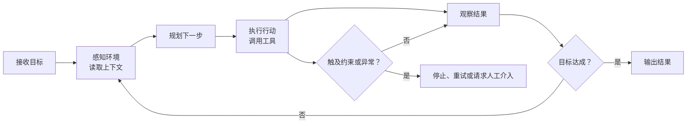

# 第一章：初识 Agent

## Agent 基本概念

Agent（智能体）是一个在给定目标、约束和工具的条件下，能根据当前状态选择下一步行动、执行后利用反馈继续调整，直至满足停止条件的 AI 系统。

它通常能理解指令、调用工具（如搜索、代码、数据库），并根据结果调整行动。其核心不是“完全自主”，而是“决策 → 行动 → 反馈”的闭环。

Agent 的基本循环是：观察 → 决策 → 行动 → 反馈；如下图所示。这里的“决策”指模型选择下一步，而不意味着要向用户展示模型内部的思维过程。



实际系统还会为 Agent 设置最大执行步数、时间或费用预算、工具权限等约束，避免它在失败路径中无限循环或执行越权操作。


## Chatbot、Workflow、Agent、Multi-agent 的区别

关键区别在两条轴线上：**谁决定流程**，以及**有几个负责决策的智能体**。

| 概念 | 谁控制流程 | 是否动态选工具/步骤 | 核心特点 |
| --- | --- | --- | --- |
| **Chatbot** | 通常是预设对话逻辑或一次模型回答 | 通常较少 | 面向对话的交互界面；不必能完成任务 |
| **Workflow** | 开发者用代码预先定义关键路径 | 可以有条件分支，但路径主要预先确定 | 可预测、易测试；适合稳定且可拆解的流程 |
| **Agent** | LLM 根据目标和环境反馈决定关键路径 | 可以在运行时选择工具和下一步 | 反复“决策 → 调工具 → 观察结果 → 继续/停止”，适合开放任务 |
| **Multi-agent** | 多个 Agent 分工协作 | 是，且可委派/交接 | 用于单 Agent 的指令或工具复杂度已难管理的场景 |

```text
Chatbot：用户 ──► 对话回答
                  （交互形态，不等于智能体）

Workflow：用户 ──► 步骤 A ──► 步骤 B ──► 步骤 C
                  （代码预先规定路径）

Agent：用户 ──► LLM ──► 选工具 ──► 看结果 ──┐
                   ▲                        │
                   └──────── 决定下一步 ────┘

Multi-agent：用户 ──► 经理 Agent ──► 研究 Agent
                           ├────► 写作 Agent
                           └────► 审核 Agent
```

### 容易混淆的点

- **Chatbot 是产品交互形态**。一个普通客服聊天机器人可能只是“检索后回答”；也可以在聊天窗口背后运行真正的 Agent。
- **Workflow 可以调用 LLM**，也可以根据规则动态分支；只要关键路径由代码预先编排，例如“先分类、再查询、再生成”，它仍是 workflow。
- **Agent 不等于多智能体**。大多数场景应先做好单 Agent；当任务可并行、需要隔离不同上下文或评审标准，或单 Agent 持续混淆复杂指令和相似工具时，再考虑拆分为 multi-agent。
- **Multi-agent 也不必完全自主**。多个专业模型按固定顺序协作，仍可视为多智能体 workflow。
- **Multi-agent 并非天然更好**。它会增加协调成本、延迟和排错难度，只有分工收益明显时才值得采用。

### 简单选择

- 只需回答问题：Chatbot。
- 步骤明确、稳定、合规要求高：Workflow。
- 步骤无法预先确定，需要查询和行动后再决定下一步：Agent。
- 任务跨多个专业领域，单 Agent 的提示或工具集已难维护：Multi-agent。

### 判断练习

- **“从报销单中提取字段并写入系统”**：字段、校验规则和处理顺序稳定，适合 Workflow。
- **“根据用户预算和偏好，查询资料、比较方案并规划行程”**：每一步依赖前一步的查询结果，更适合 Agent；涉及下单等高风险行动时，应加入人工确认。

## 本章延伸阅读

- [Anthropic -《Building Effective Agents》中文总结](./Anthropic-有效构建AI智能体-中文总结.md)
- [OpenAI - 《A Practical Guide to Building Agents》中文总结](./OpenAI-构建AI智能体实用指南-中文总结.md)

# 第二章：构建最小 Agent Loop

这一章把上一章的“观察 → 决策 → 行动 → 反馈”落到一段可运行的 Python 代码中。目标不是实现一个万能助手，而是保留 Agent 最关键的闭环：模型决定要不要用工具；Python 执行它选择的工具；工具结果回传给模型；模型再给出最终回答。

本章对应下面六个学习目标：

- 用一个 LLM API 完成普通对话。
- 用 JSON Schema 描述工具及其参数；模型的工具参数也是 JSON。
- 定义并安全执行本地工具。
- 解析模型的 tool call，把工具结果作为 `role: tool` 消息回传。
- 给循环设置最大步数、总超时、单请求超时和错误处理。
- 打印中间过程，观察模型如何选择工具和利用反馈。

## 2.1 运行前准备

项目中的 [`code/.env.example`](./code/.env.example) 是配置模板。复制为 `code/.env` 后，填写 API 密钥、模型名和 OpenAI 兼容服务地址；真实密钥不要提交到 Git。

```bash
python3 -m venv .venv
.venv/bin/pip install -r requirements.txt
cp code/.env.example code/.env
# 编辑 code/.env，填写 OPENAI_API_KEY、OPENAI_BASE_URL 和 MODEL
.venv/bin/python code/minimal_agent.py "现在上海几点？并计算 (18 + 6) * 3。"
```

例如，使用 DeepSeek 的 OpenAI 兼容接口时，配置可以是：

```dotenv
OPENAI_BASE_URL=https://api.deepseek.com
MODEL=deepseek-v4-flash
VERBOSE=true
```

`OpenAI()` 客户端接收 `base_url`，因此只要服务商实现了 Chat Completions 的工具调用格式，就可以替换为相应的兼容地址与模型。`VERBOSE=true` 用于学习时打印中间过程；生产环境通常应改为 `false`。

## 2.2 完整代码

下面的代码位于 [`code/minimal_agent.py`](./code/minimal_agent.py)，该文件是代码的唯一事实来源；本章代码块会随它同步更新。它只提供两个无副作用工具：安全计算表达式和读取指定时区的当前时间。示例刻意不提供任意命令执行、任意文件写入等高风险工具。

```python
import argparse
import ast
import json
import math
import operator
import os
import time
from datetime import datetime
from pathlib import Path
from zoneinfo import ZoneInfo

from dotenv import load_dotenv
from openai import APIError, APIStatusError, APITimeoutError, OpenAI

# 从 code/.env 读取本地配置；已有的系统环境变量不会被覆盖。
load_dotenv(Path(__file__).with_name(".env"))
MODEL = os.getenv("MODEL", "gpt-4o-mini")
MAX_STEPS = int(os.getenv("AGENT_MAX_STEPS", "6"))
TOTAL_TIMEOUT_SECONDS = float(os.getenv("AGENT_TOTAL_TIMEOUT", "60"))
REQUEST_TIMEOUT_SECONDS = float(os.getenv("OPENAI_API_TIMEOUT", "20"))
VERBOSE = os.getenv("VERBOSE", "true").lower() in {"1", "true", "yes"}
SYSTEM_PROMPT = "你是简洁、准确的中文助手。根据工具结果直接回答；不用 Markdown 标题、LaTeX、表格或表情符号。数学式使用普通文本，例如“(18 + 6) × 3 = 72”。"

TOOLS = [
    {
        "type": "function",
        "function": {
            "name": "calculate",
            "description": "计算一个只含数字与 + - * / ** 括号的数学表达式。",
            "parameters": {
                "type": "object",
                "properties": {"expression": {"type": "string", "description": "例如 (18 + 6) * 3"}},
                "required": ["expression"],
                "additionalProperties": False,
            },
        },
    },
    {
        "type": "function",
        "function": {
            "name": "get_current_time",
            "description": "获取指定 IANA 时区的当前时间；默认 Asia/Shanghai。",
            "parameters": {
                "type": "object",
                "properties": {"timezone": {"type": "string", "description": "例如 Asia/Shanghai"}},
                "required": ["timezone"],
                "additionalProperties": False,
            },
        },
    },
]

OPERATORS = {
    ast.Add: operator.add,
    ast.Sub: operator.sub,
    ast.Mult: operator.mul,
    ast.Div: operator.truediv,
    ast.Pow: operator.pow,
    ast.USub: operator.neg,
    ast.UAdd: operator.pos,
}


def calculate(expression: str) -> float:
    """用 AST 白名单计算表达式，绝不对用户输入使用 eval。"""
    if len(expression) > 100:
        raise ValueError("表达式过长")

    def visit(node):
        if isinstance(node, ast.Constant) and type(node.value) in (int, float):
            return node.value
        if isinstance(node, ast.UnaryOp) and type(node.op) in OPERATORS:
            return OPERATORS[type(node.op)](visit(node.operand))
        if isinstance(node, ast.BinOp) and type(node.op) in OPERATORS:
            left, right = visit(node.left), visit(node.right)
            if isinstance(node.op, ast.Pow) and abs(right) > 10:
                raise ValueError("指数绝对值不能超过 10")
            return OPERATORS[type(node.op)](left, right)
        raise ValueError("只允许数字、+、-、*、/、** 和括号")

    value = visit(ast.parse(expression, mode="eval").body)
    if not math.isfinite(value):
        raise ValueError("计算结果不是有限数字")
    return value


def get_current_time(timezone: str) -> str:
    return datetime.now(ZoneInfo(timezone)).isoformat(timespec="seconds")


FUNCTIONS = {"calculate": calculate, "get_current_time": get_current_time}


def log(message: str) -> None:
    if VERBOSE:
        print(message)


def execute_tool(name: str, arguments_json: str) -> str:
    """解析模型的 JSON 参数、调用白名单工具，并统一返回 JSON 字符串。"""
    try:
        arguments = json.loads(arguments_json)
        function = FUNCTIONS.get(name)
        if function is None:
            raise ValueError(f"未知工具：{name}")
        return json.dumps({"ok": True, "result": function(**arguments)}, ensure_ascii=False)
    except (json.JSONDecodeError, TypeError, ValueError, ZeroDivisionError) as error:
        return json.dumps({"ok": False, "error": str(error)}, ensure_ascii=False)


def run_agent(question: str) -> str:
    if not os.getenv("OPENAI_API_KEY"):
        raise RuntimeError("请先设置环境变量 OPENAI_API_KEY")

    base_url = os.getenv("OPENAI_BASE_URL")
    client = OpenAI(base_url=base_url, timeout=REQUEST_TIMEOUT_SECONDS, max_retries=1)
    messages = [
        {"role": "system", "content": SYSTEM_PROMPT},
        {"role": "user", "content": question},
    ]
    deadline = time.monotonic() + TOTAL_TIMEOUT_SECONDS
    log(f"开始执行 Agent：模型={MODEL}，最大步数={MAX_STEPS}")

    for step in range(1, MAX_STEPS + 1):
        if time.monotonic() >= deadline:
            raise TimeoutError(f"Agent 超过总超时 {TOTAL_TIMEOUT_SECONDS:g} 秒")
        try:
            log(f"\n[第 {step} 步] 请求模型决定下一步…")
            response = client.chat.completions.create(model=MODEL, messages=messages, tools=TOOLS)
        except APITimeoutError as error:
            raise TimeoutError(f"第 {step} 步 API 请求超时") from error
        except APIStatusError as error:
            raise RuntimeError(
                f"第 {step} 步 API 调用失败：HTTP {error.status_code}；模型={MODEL}，地址={base_url}"
            ) from error
        except APIError as error:
            raise RuntimeError(f"第 {step} 步 API 调用失败：{error}") from error

        message = response.choices[0].message
        messages.append(message)
        calls = message.tool_calls or []
        if not calls:
            log(f"[第 {step} 步] 模型不再调用工具，准备输出最终答案。")
            return message.content or "模型没有返回最终文本。"

        for call in calls:
            log(f"[第 {step} 步] 模型选择工具：{call.function.name}")
            log(f"  参数：{call.function.arguments}")
            tool_result = execute_tool(call.function.name, call.function.arguments)
            log(f"  工具结果：{tool_result}")
            messages.append({
                "role": "tool",
                "tool_call_id": call.id,
                "content": tool_result,
            })

    raise RuntimeError(f"Agent 超过最大步数 {MAX_STEPS}，已停止以避免无限循环")


if __name__ == "__main__":
    parser = argparse.ArgumentParser(description="最小 OpenAI 工具调用 Agent")
    parser.add_argument("question", nargs="?", default="现在上海几点？并计算 (18 + 6) * 3。")
    args = parser.parse_args()
    try:
        print(run_agent(args.question))
    except (RuntimeError, TimeoutError) as error:
        raise SystemExit(f"Agent 失败：{error}") from error
```

## 2.3 代码如何形成 Agent Loop

### 1. 配置把代码与服务商解耦

`load_dotenv(...)` 从脚本同目录加载 `.env`，随后从环境变量读取模型、兼容地址和超时参数。业务代码不需要知道具体服务商；切换服务时，只需改配置而不是修改循环逻辑。

`OpenAI(base_url=base_url, ...)` 使用 Python OpenAI SDK 的 Chat Completions 接口。这里选择 Chat Completions，是因为许多 OpenAI 兼容服务商都支持它的工具调用格式。

> 接口选择：本章演示的是 Chat Completions 的工具调用，工具结果通过 `role: tool` 和 `tool_call_id` 回传。另一类常见接口是 Responses API，它同样能构成 Agent Loop，但工具调用和回传对象的字段不同；迁移接口时应先改消息格式，再复用本章的工具白名单、循环与保护逻辑。

### 2. `TOOLS` 是模型可见的能力说明书

`TOOLS` 不是工具的实现，而是给模型看的 JSON Schema。每个工具包含名称、描述和参数结构。例如，模型若要调用计算器，应返回类似下面的结构化参数：

```json
{"expression": "(18 + 6) * 3"}
```

`required` 和 `additionalProperties: false` 表达了 `expression` 必填、且不应携带未声明字段的**期望契约**。在未启用服务商严格模式的兼容接口中，它们不等于运行时强制校验，所以 `execute_tool(...)` 仍必须解析参数、查找白名单并捕获异常。清晰、窄范围的工具描述有助于模型在合适时机选择正确工具。

### 3. 工具实现必须由程序控制

模型只能提出“调用哪个工具、传什么参数”的请求，不能直接执行 Python 函数。`FUNCTIONS` 是允许执行的白名单，`execute_tool(...)` 负责三件事：

1. 用 `json.loads` 解析模型给出的 JSON 参数。
2. 从白名单中找到对应函数并调用。
3. 无论成功或失败，都返回统一的 JSON 字符串，例如 `{"ok": true, "result": 72}`。

计算器尤其需要注意安全性：示例没有使用 `eval`，而是先将表达式解析成 AST，再只允许数字和指定的运算符。这样，`calculate` 不会把模型或用户提供的字符串当作任意 Python 代码执行。

### 4. 主循环完成“决策 → 行动 → 反馈”

`run_agent(...)` 中的每轮循环可以对应为：

| 阶段 | 代码 | 含义 |
| --- | --- | --- |
| 决策 | `client.chat.completions.create(...)` | 模型根据问题、历史消息和工具定义，决定直接回答或发起工具调用。 |
| 观察请求 | `message.tool_calls or []` | 程序读取模型返回的零个、一个或多个工具请求。 |
| 行动 | `execute_tool(...)` | 本地 Python 执行被白名单允许的工具。 |
| 反馈 | `messages.append({"role": "tool", ...})` | 工具结果和对应的 `tool_call_id` 一起放回消息历史。 |
| 完成 | `if not calls: return message.content` | 模型不再请求工具时，把它的文本作为最终答案。 |

注意 `messages.append(message)` 的顺序：必须先把模型发起工具调用的 assistant 消息加入历史，再追加每个 `role: tool` 结果。下一轮模型才能把某个结果和对应调用关联起来。

模型的一次响应可能包含零个、一个或多个工具调用。本例为了便于观察，使用 `for call in calls` **顺序执行**多个工具；它适合当前两个轻量、只读工具。生产环境若要并行执行彼此独立的工具，还需要额外处理超时、执行顺序、共享状态和结果汇总。

### 5. 停止条件与错误处理不可省略

即使是最小 Agent，也需要边界：

- `MAX_STEPS`：超过最大轮数就终止，避免模型反复调用工具。
- `TOTAL_TIMEOUT_SECONDS`：整个循环使用 `time.monotonic()` 计时，超过总时长就终止。
- `REQUEST_TIMEOUT_SECONDS`：限制单次 API 请求的等待时间。
- `APITimeoutError`、`APIStatusError`、`APIError`：把超时、HTTP 状态错误和其他 API 错误转换为含步骤信息的可读报错。
- 工具异常：例如 JSON 不合法、未知工具、除零或非法时区，都会转换成 `{"ok": false, "error": "..."}` 回传给模型，而不是让整个进程直接崩溃。

### 6. 中间日志只适合受控的学习环境

`log(...)` 集中控制中间打印；将 `.env` 中的 `VERBOSE` 设为 `false` 后，程序只输出最终答案。当前示例的参数与结果没有敏感信息，适合学习；将来加入搜索、文件、数据库或用户资料工具时，不应直接记录完整参数和返回值，应先脱敏、截断或只记录工具名和调用标识。

### 7. 用验证清单确认自己理解了循环

| 场景 | 操作 | 预期观察 |
| --- | --- | --- |
| 多工具调用 | 运行本章的“时间 + 计算”问题 | 第 1 步收到两个工具调用；第 2 步基于结果输出答案。 |
| 工具错误 | 询问 `1 / 0` 的计算结果 | `calculate` 返回 `ok: false` 的 JSON，进程不会因除零直接崩溃。 |
| 最大步数保护 | 设置 `AGENT_MAX_STEPS=1` 后运行需要工具的问题 | 工具执行后若仍未得到最终答案，循环主动终止并报出最大步数错误。 |
| 安静模式 | 设置 `VERBOSE=false` 后运行 | 不显示“第 N 步”等中间日志，只保留最终回答。 |

## 2.4 一次运行结果

下面是执行 `.venv/bin/python code/minimal_agent.py "现在上海几点？并计算 (18 + 6) * 3。"` 的一次真实输出。前半部分是程序打印的中间过程，最后一行才是模型的最终回答。

```text
开始执行 Agent：模型=deepseek-v4-flash，最大步数=6

[第 1 步] 请求模型决定下一步…
[第 1 步] 模型选择工具：get_current_time
  参数：{"timezone": "Asia/Shanghai"}
  工具结果：{"ok": true, "result": "2026-07-11T16:04:27+08:00"}
[第 1 步] 模型选择工具：calculate
  参数：{"expression": "(18 + 6) * 3"}
  工具结果：{"ok": true, "result": 72}

[第 2 步] 请求模型决定下一步…
[第 2 步] 模型不再调用工具，准备输出最终答案。
现在上海时间是 2026年7月11日 16:04:27（北京时间）。(18 + 6) × 3 = 72。
```

这段日志说明了一个重要事实：工具不是由人写死调用顺序的。程序只把两个工具暴露给模型；第 1 步中模型在同一轮请求了“读取时间”和“计算”两个工具，Python 再依次执行它们；第 2 步模型拿到两项结果后决定停止调用工具并组织答案。这正是最小 Agent 与固定 Workflow 的分界。

## 2.5 下一步练习

1. 增加一个只读的 `read_file` 工具，并限制只能读取 `code/` 目录。
2. 故意输入 `1 / 0`，观察工具错误如何以 JSON 形式回传给模型。
3. 将 `MAX_STEPS` 改为 `1`，理解为什么循环会在尚未生成最终答案前被保护机制终止。

## 本章延伸阅读

- [OpenAI - Function Calling 中文总结](./OpenAI-Function%20Calling-中文总结.md)
