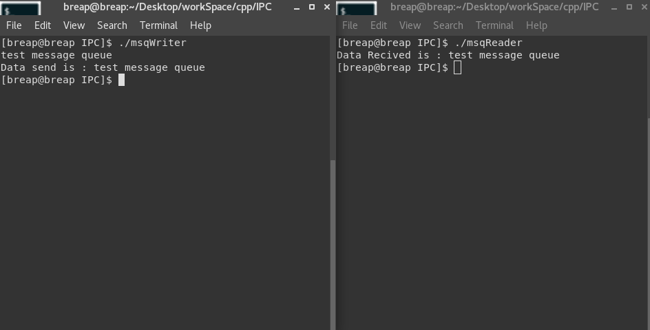

# 进程间通信

<!-- @import "[TOC]" {cmd="toc" depthFrom=1 depthTo=6 orderedList=false} -->
<!-- code_chunk_output -->

* [进程间通信](#进程间通信)
	* [管道](#管道)
		* [pipe 示例 1](#pipe-示例-1)
		* [pipe 示例 2](#pipe-示例-2)
		* [函数popen和pclose](#函数popen和pclose)
		* [popen 示例](#popen-示例)
	* [FIFO](#fifo)
		* [FIFO 用途](#fifo-用途)
		* [FIFO 示例](#fifo-示例)
	* [XSI IPC](#xsi-ipc)
		* [标识符和键](#标识符和键)
		* [权限结构](#权限结构)
		* [结构限制](#结构限制)
		* [优点和缺点](#优点和缺点)
	* [消息队列](#消息队列)
		* [msgget 函数](#msgget-函数)
		* [msgctl 函数](#msgctl-函数)
		* [msgsnd 函数](#msgsnd-函数)
		* [msgrcv 函数](#msgrcv-函数)
		* [消息队列示例](#消息队列示例)

<!-- /code_chunk_output -->


经典的IPC：
* 管道
* FIFO
* 消息队列
* 信号量
* 共享存储

## 管道

管道是unix系统IPC的最古老的形式，所有的unix系统都提供此种通信机制。

管道有以下两种局限性：
1. 历史上，他们是半双工的（即数据只能在一个方向上流动）。现在，某些系统提供全双工管道，但是为了最佳的可移植性，我们绝不预先假设系统支持全双工管道。

2. 管道只能在具有公共祖先的两个进程之间使用。

管道可以通过pipe函数创建。
```c
#include <unistd.h>
int pipe(int fd[2]);
```
fd[0]为读打开，fd[1]为写打开。fd[1]的输出是fd[0]的输入。


单个进程中的管道几乎没有任何用处。通常，进程会先调用 pipe，接着调用 fork，从而创建父进程到子进程的 IPC 通道，反之依然。


fork 之后做什么取决于我们想要的数据流的方向。对于从父进程到子进程的管道，父进程关闭管道的读端，子进程关闭写端。


对于一个从子进程到父进程的管道，父进程关闭 fd[1],子进程关闭 fd[0].
当管道的一端被关闭后，下列两条规则起作用：
1. 当 读(read) 一个写段已被关闭的管道时，在所有数据都被读取后，read 返回0，表示文件结束
2. 如果 写(write) 一个读端已被关闭的管道，则产生信号 SIGPIPE 。如果该信号或者捕捉信号并从处理程序返回，则write 返回 -1，errno 设置为 EPIPE

### pipe 示例 1
创建了一个从父进程到子进程的管道，并且父进程经由该管道向子进程传送数据。

```c
#include "apue.h"

int main(int argc, char const *argv[]) {
  int n;
  int fd[2];
  pid_t pid;
  char line[MAXLINE];

  if (pipe(fd) < 0)
    err_sys("pipe error");
  if ((pid = fork()) < 0)
    err_sys("fork error");
  else if (pid > 0) {
    close(fd[0]);
    write(fd[1], "hello world\n", 12);
  } else {
    close(fd[1]);
    n = read(fd[0], line, MAXLINE);
    write(STDOUT_FILENO, line, n);
  }

  return 0;
}
```

### pipe 示例 2
编写一个程序，其功能是每次一页地显示已产生的输出，该例可以使用 more 这个分页程序。

[strrchr() function](http://www.cplusplus.com/reference/cstring/strrchr/)

```c
#include "apue.h"
#include <sys/wait.h>

#define DEF_PAGER "/bin/more"

int main(int argc, char const *argv[]) {
  int n;
  int fd[2];
  pid_t pid;
  char * pager, * argv0;
  char line[MAXLINE];
  FILE * fp;

  if (argc != 2)
    err_quit("usage: a.out <pathname>");
  if ((fp = fopen(argv[1], "r")) == NULL)
    err_sys("can't open %s", argv[1]);

  if (pipe(fd) < 0)
    err_sys("pipe error");

  if ((pid = fork()) < 0)
    err_sys("fork error");
  else if (pid > 0) { // parent
    close(fd[0]);     // close read end

    // parent copies argv[1] to pipe
    while (fgets(line, MAXLINE, fp) != NULL) {
      n = strlen(line);
      if (write(fd[1], line, n) != n)
        err_sys("write error to pipe");
    }

    if (ferror(fp))
      err_sys("fgets error");

    close(fd[1]);
    // close write end of pipe for reader

    if (waitpid(pid, NULL, 0) < 0)
      err_sys("waitpid error");
    // 等待组 ID 等于调用进程组 ID 的任一子进程

    exit(0);
  }

  else {          // child
    close(fd[1]); // close write end
    if (fd[0] != STDIN_FILENO) {
      if (dup2(fd[0], STDIN_FILENO) != STDIN_FILENO)
        err_sys("dup2 error to stdin");
      close(fd[0]);
      // don't need this after dup2
    }

    // get arguments for execl()
    if ((pager = getenv("PAGER")) == NULL)
      pager = DEF_PAGER;

    if ((argv0 = strrchr(pager, '/')) != NULL)
      argv0++; // step past rightmost slash
    else
      argv0 = pager; // no slash in pager

    if (execl(pager, argv0, (char *)0) < 0)
      err_sys("execl error for %s", pager);
  }
  return 0;
}
```

Run it:


### 函数popen和pclose

常见的操作是创建一个连接到另一个进程的管道，然后读其输出或向其输入端发送数据，为此，标准I/O库提供了popen和pclose。这两个函数实现的操作是：创建一个管道，fork一个自进程，关闭未使用的管道端，执行一个shell运行命令，然后等待命令终止。
```c
#include "stdio.h"

FILE * popen(const char *cmdstring,const char *type);
// 若成功，返回文件指针；若出错，返回 NULL

int pclose(FILE *fp);
// 若成功，返回 cmdstring的终止状态；若出错，返回 -1
```


eg:
```c
fp=popen("ls *.c","r");
```

### popen 示例
用 popen 重写之前分页的例子
```c
#include "apue.h"
#include <sys/wait.h>

#define PAGER "${PAGER:-more}"
// 如果 shell 变量 PAGER 已经定义，且其值为非空，则使用其值，否则使用字符串 more

int main(int argc, char const *argv[]) {
  char line[MAXLINE];
  FILE * fpin, * fpout;

  if (argc != 2)
    err_quit("usage: a.out <pathname>");

  if ((fpin = fopen(argv[1], "r")) == NULL)
    err_sys("can't open %s", argv[1]);

  if ((fpout = popen(PAGER, "w")) == NULL)
    err_sys("popen error");

  while (fgets(line, MAXLINE, fpin) != NULL) {
    if (fputs(line, fpout) == EOF)
      err_sys("fputs error to pipe");
  }

  if (ferror(fpin))
    err_sys("fgets error");
  if (pclose(fpout) == -1)
    err_sys("pclose error");

  return 0;
}
```

使用 popen 减少了需要编写的代码量

## FIFO

FIFI 有时被称为命名管道。未命名的管道只能在两个相关的进程之间使用，而且这两个相关的进程还要有一个共同创建了他们的祖先进程。但是，通过 FIFO ，不相关的进程也能够交换数据。

FIFO 是一种文件类型。通过 [stat 结构](https://linux.die.net/man/2/stat) 的 st_mode 成员的编码可以知道文件是否是 FIFO 类型。可以用 S_ISFIFO 宏对此进行测试

创建 FIFO 类似于创建文件。确实，FIFO 的路径名存在于文件系统中。


```c
#include <sys/stat.h>

int mkfifo(const char *path,mode_t mode);
int mkfifoat(int fd,const char *path,mode_t mode);

// 两个函数的返回值：若成功，返回0；若出错，返回 -1
```

mkfifo 函数中的 mode 参数的规格说明与 open 函数中 mode 相同。

mkfifo 函数和 mkfifoat 函数相似，但是 mkfifoat 函数可以被用来在 fd 文件描述符表示的目录相关位置创建一个 FIFO 。像其它 \*at 函数一样，这里有三种情况：
1. 如果 path 参数指定的是绝对路径名，则 fd 参数会被忽略掉，并且 mkfifoat 函数的行为和 mkfifo 类似
2. 如果 path 参数制定的是相对路径名，则 fd 参数是一个打开目录的有效文件描述符，路径名和目录有关
3. 如果 path 参数指定的是相对路径名，并且 fd 参数有一个特殊值 AT_FDCWD，则路径名以当前目录开始，mkfifoat 和 mkfifo 类似

当我们用 mkfifo 或者 mkfifoat 创建 FIFO 时，要用 open 来打开它。确实，正常的文件 I/O 函数 (eg: close,read,write,unlink) 都需要 FIFO

当 open 一个 FIFO 时，非阻塞标志 (O_NONBLOCK) 会产生下列影响：
* 在一般情况下 （没有指定 O_NONBLOCK ），只读 open 要阻塞到某个其他进程为写而打开这个 FIFO 为止。类似地，只写 open 要阻塞到某个其他进程为读而打开它为止
* 如果指定了 O_NONBLOCK ，则只读 open 立即返回。但是，如果没有进程为读而打开一个 FIFO，那么只写 open 将返回 -1，并将 errno 设置为 ENXIO

类似于管道，若 write 一个尚无进程为读而打开的 FIFO ，则产生信号 SIGPIPE。若某个 FIFO 的最后一个写进程关闭了该 FIFO，则将为该 FIFO 的读进程产生一个文件结束标志。

一个给定的 FIFO 有多个写进程是常见的。这就意味着，如果不希望多个进程所写的数据交叉，则必须考虑原子写操作。和管道一样，常量 PIPE_BUF 说明了可被原子地写到 FIFO 的最大数据量。


### FIFO 用途

* shell 命令使用 FIFO 将数据从一条管道传送到另一条时，无需创建中间临时文件
* client - server 应用程序中，FIFO 用作汇聚点，在客户进程和服务器进程二者之间传递数据

### FIFO 示例
```c++
#include <cstdio>
#include <cstring>
#include <fcntl.h>
#include <sys/stat.h>
#include <sys/types.h>
#include <unistd.h>

int main(int argc, char const *argv[]) {
  int fd;

  char * myfifo = "/tmp/myfifo";

  mkfifo(myfifo, 0666);

  char arr1[80], arr2[80];

  while (true) {
    fd = open(myfifo, O_WRONLY);

    fgets(arr2, 80, stdin);

    write(fd, arr2, strlen(arr2) + 1);

    close(fd);

    fd = open(myfifo, O_RDONLY);
    read(fd, arr1, sizeof(arr1));

    printf("User2: %s\n", arr1);
    close(fd);
  }
  return 0;
}
```

[geeksforgeeks.org/named-pipe-fifo-example](https://www.geeksforgeeks.org/named-pipe-fifo-example-c-program/)

## XSI IPC

有3种 称作 XSI IPC 的 IPC：消息队列、信号量、共享存储器。本节先介绍他们之间有相似的之处。

XSI IPC 不使用文件系统命名空间，而是构造了他们自己的命名空间。

### 标识符和键

每个内核中的 IPC 结构都用一个非负整数的标识符加以引用。

标识符时 IPC 对象的内部名。为使多个合作进程能够在同一 IPC 对象上汇聚，需要提供一个外部命名方案。为此，每个 IPC 对象都与一个键 （key） 相关联，将这个键作为该对象的外部名。

无论何时创建 IPC 结构，都应指定一个键。这个键的数据类型时 key_t ，通常在 <sys/types.h> 中定义为长整型。这个键由内核变换成标识符。

可以使用 ftok 产生一个 键：
```c
#include <sys/ipc.h>

key_t ftok(const char *path,int id);

// if success return key_t,else return (key_t) -1
```

### 权限结构

XSI IPC 为每一个 IPC 结构关联了一个 ipc_perm 结构：
```c
struct ipc_perm{
	uid_t uid; // owner's effective user id
	gid_t gid; // owner's effective group id
	uid_t cuid; // creator's effective user id
	gid_t cgid; // creator's effective group id
	mode_t mode; // access mode
}
```

在创建 IPC 结构时，对所有字段赋初值。以后，可以调用 msgctl,semctl,shmctl 修改 uid、gid、mode 字段。为了修改这些值i，调用进程必须是 IPC 结构的创建者或超级用户。

mode 字段 类似 文件 的 mode，但是对于任何 IPC 结构都不存在执行权限。另外，消息队列和共享存储使用术语 “读” 和 “写”，而信号量使用术语 “读” 和 “更改” 。

XSI IPC 权限：

| 权限            | 位    |
|-----------------|-------|
| 用户读          | 0400  |
|  用户写（更改） |  0200 |
| 组读            | 0040  |
|  组写（更改）   | 0020  |
| 其他读          | 0004  |
|  其他写（更改） |  0002 |

### 结构限制
所有 3 中形式的 XSI IPC 都有内置限制。大多数限制都可以通过重新配置内核来改变。

在 linux 中，可以运行 ipcs -l 来显示 IPC 相关的限制。

```sh
[breap@breap ~]$ ipcs -l

------ Messages Limits --------
max queues system wide = 32000
max size of message (bytes) = 8192
default max size of queue (bytes) = 16384

------ Shared Memory Limits --------
max number of segments = 4096
max seg size (kbytes) = 18014398509465599
max total shared memory (kbytes) = 18014398509481980
min seg size (bytes) = 1

------ Semaphore Limits --------
max number of arrays = 32000
max semaphores per array = 32000
max semaphores system wide = 1024000000
max ops per semop call = 500
semaphore max value = 32767
```


### 优点和缺点
缺点：
* IPC 结构时在系统范围内起作用的，没有引用计数
* 这些 IPC 结构在文件系统中没有名字。我们不能用 文件 I/O、文件和目录 函数来访问或修改他们的属性。为此，内核中增加了十几个全新的系统调用
* 这些形式的 IPC 不使用文件描述符，我们不能对他们使用多路转接 I/O 函数。

优点：
* 他们是可靠的、流控制的以及面向记录的
* 他们可以用非先进先出次序处理

注：
* 流控制：如果系统资源短缺，或者如果接受进程不能再接收更多的消息，则发送进程就要休眠。当流控制条件消失时，发送进程应自动唤醒
## 消息队列

消息队列是消息的链接表，存储在内核中，由消息队列标识符标识。在本节中，我们把消息队列简称为队列，其标识符简称为队列 ID。

msgget 用于创建一个新队列或打开一个现有队列。msgsnd 将新消息添加到队列尾端。每个消息包含一个正的长整形类型的字段，一个非负的长度以及实际数据字节数（对应于长度），所有这些都在将消息添加到队列时，传送给 msgsnd 。 msgrcv 用于从队列中取消息。我们并不一定要以先进先出次序取消息，也可以按消息的类型字段取消息。

每个队列都有一个 msqid_ds 结构与其相关联：
```c
struct msqid_ds{
	struct ipc_perm msg_perm;
	msgqnum_t msg_qnum; // # of message on queue
	msglen_t msg_qbytes; // max # of bytes on queue
	pid_t msg_lspid; // pid of last msgsnd()
	pid_t msg_lrpid; // pid of last msgrcv()
	time_t msg_stime; // last-msgsnd() time
	time_t msg_rtime; // last-msgrcv() time
	time_t msg_ctime; // last-change time
}
```

此结构定义了队列的当前状态。结构中所示的各成员是由 Single UNIX Specification 定义的。具体实现可能包括标准中没有定义的另一些字段。

消息队列受到系统限制的影响。

### msgget 函数
打开一个现有队列或创建一个新队列

```c
#include <sys/msg.h>

int msgget(key_t key,int flag);

// 返回值：若成功，返回消息队列 ID； 若出错，返回 -1
```

### msgctl 函数
该函数可以对队列执行多种操作

```c
#include <sys/msg.h>

int msgctl(int msgid,int cmd,struct msqid_ds *buf);

// if success return 0,else return -1
```

cmd 参数指定对 msqid 指定的队列要执行的操作：
* IPC_STAT 取此队列的 msqid_ds 结构，并将它存放在 buf 指向的结构中。
* IPC_SET 将字段 msg_perm.uid,msg_perm.gid,msg_perm.mode 和 msg_qbytes 从指向的结构父知道与这个队列相关的 msqid_ds 结构中。此命令只能由下列两种进程执行：一种是其有效用户 ID 等于 msg_perm.cuid 或 msg_perm.uid,另一种是具有超级用户特权的进程。只有超级用户才能增加 msg_qbytes 的值。
* IPC_RMID 从系统中删除该消息队列以及仍在该队列中的所有数据。这种删除立即生效。仍在使用这一消息队列的其他进程在它们下一次试图对此队列进行操作时，将得到 EIDRM 错误。此命令只能由下列两种进程执行：一种是其有效用户 ID 等于 msg_perm.cuid 或 msg_perm.uid,另一种是具有超级用户特权的进程。

这三条命令（IPC_STAT,IPC_SET,IPC_RMID）也可以用于信号量和共享存储

### msgsnd 函数
将数据发送到消息队列

```c
#include <sys/msg.h>

int msgsnd(int msqid,const void *ptr,size_t nbytes,int flag);

// if success return 0,else return -1
```

参数 flag 的值可以指定为 IPC_NOWAIT。这类似于文件 I/O 的非阻塞 I/O 标志。若消息队列已满（或者队列中的消息总数等于系统限制值，或队列中的字节总数等于系统限制值），则指定 IPC_NOWAIT 使得 msgsnd 立即出错返回 EAGAIN。如果没有指定 IPC_NOWAIT，则进程会一直阻塞到： 有空间可以容纳要发送的消息；或者从系统中删除了此队列；或者捕捉到一个信号，并从信号处理程序返回。在第二种情况下，会返回 EIDRM 错误，最后一种情况则返回 EINTR 错误。

注意，对删除消息队列的处理不是很完善。因为每个消息队列并没有维护引用计数器（打开文件有这种计数器）。

当 msgsnd 返回成功时，消息队列相关的 msqid_ds 结构会随之更新。

### msgrcv 函数

从队列中取用消息

```c
#include <sys/msg.h>

ssize_t msgrcv(int msqid,void *ptr,size_t nbytes,long type,int flag);

// if success return 消息数据部分的长度，else return -1
```

若返回的消息长度大于 nbytes，而且在 flag 中设置了 MSG_NOERROR 位，则该消息会被截断（在这种情况下，没有通知告诉我们消息截断了，消息被截取的部分被丢弃）。如果没有设置这一个标志，而消息又太长，则出错返回 E2BIG（消息仍留在队列中）。

参数 type 可以指定想要哪一种消息：
* type == 0 返回队列中的第一个消息
* type > 0 返回队列中消息类型为 type 的第一个消息
* type < 0 返回队列中消息类型小于等于 type 绝对值的消息，如果这种消息有若干个，则取类型值最小的消息
type 值为非 0 用于以非先进先出次序读消息。

可以将 flag 值指定为  IPC_NOWAIT，使操作不阻塞，这样，如果没有所指定类型的消息可用，则 msgrcv 返回 -1，error 设置为 ENOMSG 。如果没有指定 IPC_NOWAIT，则进程会一直阻塞到： 有空间可以容纳要发送的消息；或者从系统中删除了此队列；或者捕捉到一个信号，并从信号处理程序返回。在第二种情况下，会返回 EIDRM 错误，最后一种情况则返回 EINTR 错误。

当 msgrcv 返回成功时，消息队列相关的 msqid_ds 结构会随之更新。

### 消息队列示例


```c++
// message queue writer process
#include <iostream>
#include <sys/ipc.h>
#include <sys/msg.h>

// structure for message queue
struct mesg_buffer {
  long mesg_type;
  char mesg_text[100];
};

int main(int argc, char const *argv[]) {
  key_t key;
  int msgid;

  // ftok  to generate unique key
  key = ftok("progfile", 65);

  mesg_buffer message;

	// msgget creates a message queue and returns identifier
  msgid = msgget(key, 0666 | IPC_CREAT);
  message.mesg_type = 1;

  std::cin.getline(message.mesg_text, 100);

 // msgsnd to send message
  msgsnd(msgid, &message, sizeof(message), 0);

  std::cout << "Data send is : " << message.mesg_text << '\n';
  return 0;
}
```

```c++
// message queue reader process
#include <iostream>
#include <sys/ipc.h>
#include <sys/msg.h>

// structure for message queue
struct mesg_buffer {
  long mesg_type;
  char mesg_text[100];
};

int main(int argc, char const *argv[]) {
  key_t key;
  int msgid;
  mesg_buffer message;
	// ftok to generate unique key
  key = ftok("progfile", 65);

  // msgget creates a message queue and returns identifier
  msgid = msgget(key, 0666 | IPC_CREAT);

  // msgrcv to receive message
  msgrcv(msgid, &message, sizeof(message), 1, 0);

  std::cout << "Data Recived is : " << message.mesg_text << '\n';

  // to destroy the message queue
  msgctl(msgid, IPC_RMID, NULL);

  return 0;
}
```

Run it:




[上一级](base.md)
[下一篇](pthread.md)
