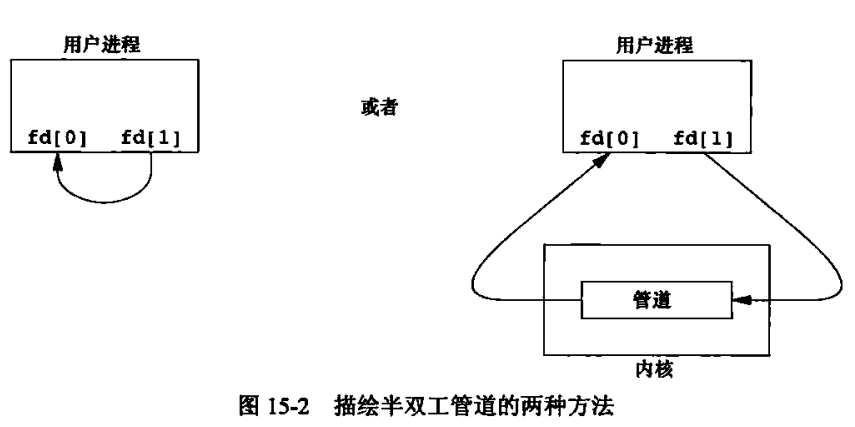

# 进程间通信

<!-- @import "[TOC]" {cmd="toc" depthFrom=1 depthTo=6 orderedList=false} -->
<!-- code_chunk_output -->

* [进程间通信](#进程间通信)
	* [管道](#管道)
		* [函数popen和pclose](#函数popen和pclose)

<!-- /code_chunk_output -->


经典的IPC：
* 管道
* FIFO
* 消息队列
* 信号量
* 共享存储

## 管道

管道是unix系统IPC的最古老的形式，所有的unix系统都提供此种通信机制。

管道有以下两种局限性：
1. 历史上，他们是半双工的（即数据只能在一个方向上流动）。现在，某些系统提供全双工管道，但是为了最佳的可移植性，我们绝不预先假设系统支持全双工管道。

2. 管道只能在具有公共祖先的两个进程之间使用。

管道可以通过pipe函数创建。
```c
#include <unistd.h>
int pipe(int fd[2]);
```
fd[0]为读打开，fd[1]为写打开。fd[1]的输出是fd[0]的输入。



单个进程中的管道几乎没有任何用处。通常，进程会先调用 pipe，接着调用 fork，从而创建父进程到子进程的 IPC 通道，反之依然。


fork 之后做什么取决于我们想要的数据流的方向。对于从父进程到子进程的管道，父进程关闭管道的读端，子进程关闭写端。


对于一个从子进程到父进程的管道，父进程关闭 fd[1],子进程关闭 fd[0].
当管道的一端被关闭后，下列两条规则起作用：
1. 当 读(read) 一个写段已被关闭的管道时，在所有数据都被读取后，read 返回0，表示文件结束
2. 如果 写(write) 一个读端已被关闭的管道，则产生信号 SIGPIPE 。如果该信号或者捕捉信号并从处理程序返回，则write 返回 -1，errno 设置为 EPIPE

示例：
创建了一个从父进程到子进程的管道，并且父进程经由该管道向子进程传送数据。

```c
#include "apue.h"

int main(int argc, char const *argv[]) {
  int n;
  int fd[2];
  pid_t pid;
  char line[MAXLINE];

  if (pipe(fd) < 0)
    err_sys("pipe error");
  if ((pid = fork()) < 0)
    err_sys("fork error");
  else if (pid > 0) {
    close(fd[0]);
    write(fd[1], "hello world\n", 12);
  } else {
    close(fd[1]);
    n = read(fd[0], line, MAXLINE);
    write(STDOUT_FILENO, line, n);
  }

  return 0;
}
```

示例 2：
编写一个程序，其功能是每次一页地显示已产生的输出，该例可以使用 more 这个分页程序。

[strrchr() function](http://www.cplusplus.com/reference/cstring/strrchr/)

```c
#include "apue.h"
#include <sys/wait.h>

#define DEF_PAGER "/bin/more"

int main(int argc, char const *argv[]) {
  int n;
  int fd[2];
  pid_t pid;
  char * pager, * argv0;
  char line[MAXLINE];
  FILE * fp;

  if (argc != 2)
    err_quit("usage: a.out <pathname>");
  if ((fp = fopen(argv[1], "r")) == NULL)
    err_sys("can't open %s", argv[1]);

  if (pipe(fd) < 0)
    err_sys("pipe error");

  if ((pid = fork()) < 0)
    err_sys("fork error");
  else if (pid > 0) { // parent
    close(fd[0]);     // close read end

    // parent copies argv[1] to pipe
    while (fgets(line, MAXLINE, fp) != NULL) {
      n = strlen(line);
      if (write(fd[1], line, n) != n)
        err_sys("write error to pipe");
    }

    if (ferror(fp))
      err_sys("fgets error");

    close(fd[1]);
    // close write end of pipe for reader

    if (waitpid(pid, NULL, 0) < 0)
      err_sys("waitpid error");
    // 等待组 ID 等于调用进程组 ID 的任一子进程

    exit(0);
  }

  else {          // child
    close(fd[1]); // close write end
    if (fd[0] != STDIN_FILENO) {
      if (dup2(fd[0], STDIN_FILENO) != STDIN_FILENO)
        err_sys("dup2 error to stdin");
      close(fd[0]);
      // don't need this after dup2
    }

    // get arguments for execl()
    if ((pager = getenv("PAGER")) == NULL)
      pager = DEF_PAGER;

    if ((argv0 = strrchr(pager, '/')) != NULL)
      argv0++; // step past rightmost slash
    else
      argv0 = pager; // no slash in pager

    if (execl(pager, argv0, (char *)0) < 0)
      err_sys("execl error for %s", pager);
  }
  return 0;
}
```

Run it:


### 函数popen和pclose

常见的操作是创建一个连接到另一个进程的管道，然后读其输出或向其输入端发送数据，为此，标准I/O库提供了popen和pclose。这两个函数实现的操作是：创建一个管道，fork一个自进程，关闭未使用的管道端，执行一个shell运行命令，然后等待命令终止。
```c
#include "stdio.h"

FILE * popen(const char *cmdstring,const char *type);
// 若成功，返回文件指针；若出错，返回 NULL

int pclose(FILE *fp);
// 若成功，返回 cmdstring的终止状态；若出错，返回 -1
```


eg:
```c
fp=popen("ls *.c","r");
```

示例：
用 popen 重写之前分页的例子
```c
#include "apue.h"
#include <sys/wait.h>

#define PAGER "${PAGER:-more}"
// 如果 shell 变量 PAGER 已经定义，且其值为非空，则使用其值，否则使用字符串 more

int main(int argc, char const *argv[]) {
  char line[MAXLINE];
  FILE * fpin, * fpout;

  if (argc != 2)
    err_quit("usage: a.out <pathname>");

  if ((fpin = fopen(argv[1], "r")) == NULL)
    err_sys("can't open %s", argv[1]);

  if ((fpout = popen(PAGER, "w")) == NULL)
    err_sys("popen error");

  while (fgets(line, MAXLINE, fpin) != NULL) {
    if (fputs(line, fpout) == EOF)
      err_sys("fputs error to pipe");
  }

  if (ferror(fpin))
    err_sys("fgets error");
  if (pclose(fpout) == -1)
    err_sys("pclose error");

  return 0;
}
```

使用 popen 减少了需要编写的代码量


[上一级](base.md)
[下一篇](pthread.md)
