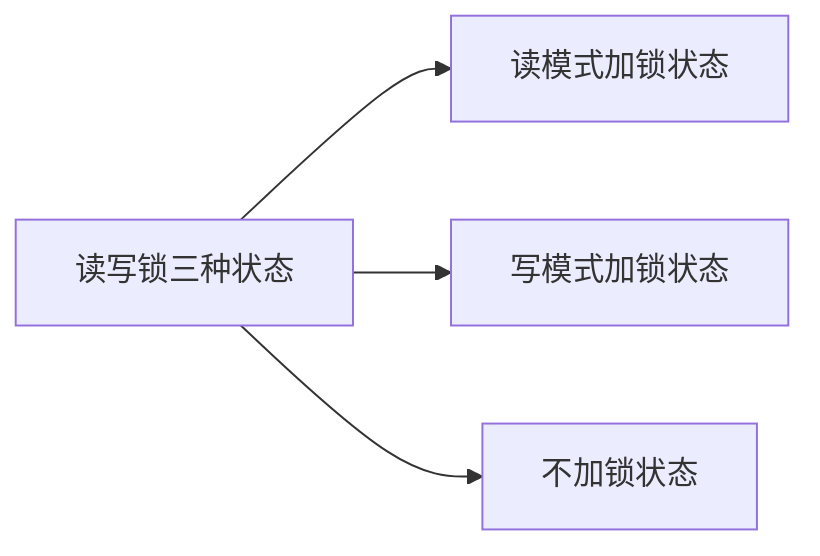

# 线程

<!-- @import "[TOC]" {cmd="toc" depthFrom=1 depthTo=6 orderedList=false} -->
<!-- code_chunk_output -->

* [线程](#线程)
	* [第11章 线程](#第11章-线程)
		* [11.2 线程概念](#112-线程概念)
		* [11.4 线程创建](#114-线程创建)
		* [11.5 线程终止](#115-线程终止)

<!-- /code_chunk_output -->

## 第11章 线程

### 11.2 线程概念
即使程序运行在单处理器上，也能得到多线程编程模型的好处。处理器的数量并不影响程序结构，所以不管处理器的个数多少，程序都能够通过线程得以简化。

### 11.4 线程创建
线程创建时并不能够保证那个线程先运行：是新创建的线程，还是调用线程

### 11.5 线程终止
 1.pthread_join function 可以等待指定的线程终止
 2.在默认的情况下，线程的终止状态会保存直到该线程调用pthread_join。如果线程已经被分离。线程的底层存储资源可以在线程终止时立即被回收。在线程被分离后，我们不能用pthread_join来等待它的终止状态，因为对分离状态的线程调用pthread_join会产生未定义的行为。可以调用pthread_detach分离线程。

 ### 11.6 线程同步
1.互斥量从本质上来说是一把锁，在访问共享资源前对互斥量进行设置（加锁），在访问完成后释放（解锁）互斥量。对互斥量加锁后，任何其他试图再次对互斥量加锁的线程都会被阻塞直到当前的线程释放该互斥量。
示例：
```c
//使用互斥量保护数据
#include <../apue.h>

struct foo{
  int f_count;
  pthread_mutex_t f_lock;
  int f_id;
};

struct foo * foo_alloc(int id)
{
struct foo *fp;
if ((fp=malloc(sizeof(struct foo)))!=NULL)
{
  fp->f_count=1;
  fp->f_id=id;
  if(pthread_mutex_init(f->f_lock,NULL)!=0)
  free(fp);
  return NULL;
}
//continue init
return fp;

}

void foo_hold(struct foo *fp)
{
  pthread_mutex_lock(&fp->f_lock);
  fp->f_count++;
  pthread_mutex_unlock(&fp->f_lock);
}

void foo_rele(struct foo *fp)
{
  pthread_mutex_lock(&fp->f_lock);
  if(--fp->f_count==0)
  {
    pthread_mutex_unlock(&fp->f_lock);
    pthread_mutex_destory(&fp->f_lock);
    free(fp);
  }
  pthread_mutex_unlock(&fp->f_lock);
}

```

2，读写锁与互斥量类似，不过读写锁允许更高的并行性。


当读写锁是写状态时，在这个锁被解锁之前，所有试图对这个锁加锁的线程都会被阻塞。当读写锁是读状态时，所有试图以读模式对它进行加锁的线程都可以得到访问权，但是任何希望以写模式对此锁进行加锁的线程都会被阻塞。
示例：
```c
#include "../apue.h"


struct job
{
  struct job *j_next;
  struct job *j_prev;
  pthread_t j_id;
};

struct queue
{

  struct job *q_head;
  struct job *q_tail;
  pthread_rwlock_t q_lock;
};


int queue_init(struct queue *qp)
{
  int err;
  qp->q_head=NULL;
  qp->q_tail=NULL;
  err=pthread_rwlock_init(&qp->q_lock,NULL);
  if(err!=0)
  {
    return err;
  }
  return 0;
}
//insert a job at the head of the queue;
void job_insert(struct queue *qp,struct job *jp)
{
  pthread_rwlock_wrlock(&qp->q_lock);
  jp->j_next=qp->q_head;
  jp->j_prev=NULL;
  if(qp->q_head!=NULL)
  qp->q_head->j_prev=jp;
  else
  qp->q_tail=jp;
  qp->q_head=jp;
  pthread_rwlock_unlock(&qp->q_lock);

}

//apppend a job on the tail of the queue
//

void job_apped(struct queue *qp,struct job *jp)
{
  pthread_rwlock_wrlock(&qp->q_lock);
  jp->j_next=NULL;
  jp->j_prev=qp->q_tail;
  if(ap->q_tail !=NULL)
  {
    qp->q_tail->j_next=jp;

  }
  else
  qp->q_head=jp;
  qp->tail=jp;
  pthread_rwlock_unlock(&qp->q_lock);
}

// remove the given job from a queue

void job_remove(struct queue *qp,struct job *jp)
{
  pthread_rwlock_wrlock(&qp->q_lock);
  if(jp==qp->head)
  {
    qp->q_head=jp->j_next;
    if(qp->q_tail ==jp)
    {
      qp->q_tail=NULL;
    }
    else
    jp->j_next->j_prev=jp->j_prev;
  }
  else if(jp==qp->q_tail)
  {
    qp->q_tail=jp->j_prev;
    jp->j_prev->j_next=jp->j_next;
  }
  else
  {
    jp->j_prev->j_next=jp->j_next;
    jp->j_next->j_prev=jp->j_prev;
  }
  pthread_rwlock_unlock(&qp->q_lock);
}

// find a job for the given thread id

struct job * job_find(struct queue *qp,pthread_t id)
{
  struct job *jp;
  if(pthread_rwlock_rdlock(&qp->q_lock)!=0)
  {
    return NULL;
  }
  struct job *jp;
  for (jp=qp->q_head;jp!=NULL,jp=jp->j_next)
  {
    if (pthread_equal(jp->j_id,id))
    {
      pthread_rwlock_unlock(&qp->q_lock);
    return jp;
  }
  }
  pthread_rwlock_unlock(&qp->q_lock);
  return NULL;
}

```

3，条件变量与互斥量一起使用时，允许线程以无竞争的方式等待特定的条件发生。条件本身是由互斥量保护的。线程在改变条件状态之前必须首先锁住互斥量。其他线程在获得互斥量之前不会察觉到这种改变，因为互斥量必须在锁定后才能计算条件。
示例：
```c
#include "../apue.h"

struct msg
{
  struct msg *m_next;
  // more stuff here
}

struct msg *workq;

pthread_cond_t qready=PTHREAD_COND_INITIALIZER;

pthread_mutex_t qlock=PTHREAD_MUTEX_INITIALIZER;

void process_msg(void)
{
  struct msg *mp;

  for(;;)
  {
    pthread_mutex_lock(&qlock);
    while(workq==NULL)
    pthread_cond_wait(&qready,&qlock);
    mp=workq;
    workq=mp->m_next;
    pthread_mutex_unlock(&qlock);
    //now process the message mp
  }
}

void enqueue_msg (struct msg *mp)
{
  pthread_mutex_lock(&qlock);
  mp->m_next=workq;
  workq=mp;
  pthread_rwlock_unlock(&qlock);
  pthread_cond_signal(&qready);
}

```

4.自旋锁与互斥量类似，但它不是通过休眠来使进程阻塞，而是在获取锁之前一直处于忙等（自旋）阻塞状态。自旋锁可用于以下情况：锁被持有的时间断开，而且线程并不希望在重新调度上花费太多的成本。需要注意的是，不要调用在持有自旋锁情况下可能会进入休眠状态的函数。如果调用了这些函数，会浪费cpu资源，因为其他线程需要获取自旋锁需要的等待时间就延长了。
5，屏障（barrier）是用户协调多个线程并行工作的同步机制。屏障允许每个线程等待，直到所有的合作线程都达到某一点，然后从该点继续执行。屏障的对象的概念更广，它们允许任意数量的线程等待，直到所有的线程完成处理工作，而线程不需要退出。所有线程达到屏障后可以接着工作。

```c
#include <pthread.h>

int pthread_barrier_init(pthread_barrier_t *restrict barrier,const pthread_barrierattr_t * restrict attr,
unsigned int count);

int pthread_barrier_destroy(pthread_barrier_t *barrier);

int pthread_barrier_wait(pthread_barrier_t * barrier);
//调用pthread_barrier_wait的线程在屏障计数未满足条件是，会进入休眠状态。如果该线程是最后一个调用pthread_barrier_wait的线程，就满足了屏障计数，所有的线程都被唤醒。
//对于一个任意线程，pthread_barrier_wait函数返回了PTHREAD_BARRIER_SERIAL_THREAD。剩下的线程看到的返回值是0；
```         


[上一级](README.md)
[上一篇](IPC.md)
[下一篇](pthread_control.md)
