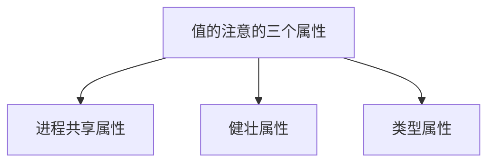
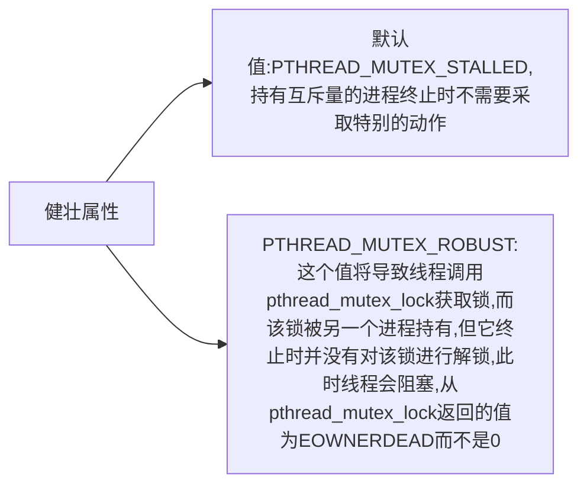

# 线程控制

[toc]

## 线程限制

Single UNIX Specification定义了与线程操作有关的一些限制。与其他的系统限制一样，这些限制也可以通过sysconf函数进行查询，这些限制的使用是为了增强应用程序在不同操作系统实现之间的可移植性。

```c
#include <unistd.h>
long sysconf(int name);
```

## 线程属性

pthread接口允许我们通过设置每个对象关联的不同属性来细调线程和同步对象的行为。

```c
#include <pthread.h>
int pthread_attr_init(pthread_attr_t *attr);
int pthread_attr_destroy(pthread_attr_t *attr);
```
### 分离状态属性
若在创建线程时就知道不需要了解线程的终止状态，可以修改pthread_attr_t结构中的detachstate线程属性，让线程从一开始就处于分离状态。可以使用pthread_attr_setdetachstate函数把线程属性detachstate设置成以下合法值之一： 1.PTHREAD_CREATE_DETACHED,以分离状态启动线程； 2.PTHREAD_CREATE_JOINABLE，正常启动线程。

```c
int pthread_attr_getdetachstate(const pthread_attr_t * restrict attr,
int *detachstate);
int pthread_attr_setdetachstate(const pthread_attr_t * restrict attr,
int * detachstate);
```
example:以分离状态创建线程
```c
#include <pthread.h>
#include "../apue.h"


// void *fuc()
// {
//   printf("create pthread successful\n");
//   //system("echo \"test\" >>testfile");
//   return ((void*)0);
// }
//
// int main(int argc, char const *argv[]) {
//   pthread_t tid;
//   pthread_attr_t attr;
//   pthread_attr_init(&attr);
//   pthread_attr_setdetachstate(&attr,PTHREAD_CREATE_DETACHED);
//   pthread_create(&tid,&attr,fuc,NULL);
//   pthread_attr_destroy(&attr);
//   sleep(3);
//   return 0;
// }

void* testFunction(void *attr) {

    attr=(pthread_attr_t *)attr;
    int chk,rc;
pthread_attr_getdetachstate(attr, &chk);

if(chk == PTHREAD_CREATE_DETACHED )
    printf("Detached\n");
else if (chk == PTHREAD_CREATE_JOINABLE)
    printf("Joinable\n");

// printf("create pthread successful\n");
return NULL;
}


int main (int argc, const char * argv[]) {

pthread_t thread1;
pthread_attr_t attr;

int rc;

rc = pthread_attr_init(&attr);

printf("attr_init: %d\n",rc);
rc = pthread_attr_setdetachstate(&attr, PTHREAD_CREATE_DETACHED);
printf("attr_setdetachedstate: %d\n",rc);

rc = pthread_create(&thread1, &attr, testFunction, &attr);
printf("attr_create: %d\n",rc);
pthread_attr_destroy(&attr);
sleep(4);

//pthread_cancel(thread1);

return 0;
}

```
注意：此例忽略了pthread_attr_destroy调用的返回值。在这个示例中，我们对线程属性进行了合理的初始化，因此pthread_attr_destroy应该不会失败。但是，如果pthread_attr_destroy确实出现失败的情况，将难以清理：必须销毁刚刚创建的线程，也许这个线程可能已经运行，并且与pthread_attr_destroy函数可能是异步执行的。
### 线程栈属性
可以使用pthread_attr_getstack和pthread_attr_setstack对线程栈属性进行管理。
```c
int pthread_attr_getstack(const pthread_attr_t * restrict attr,void ** restrict stackddr,size_t *restrict stacksize);
int pthread_attr_setstack(const pthread_attr_t *restrict attr,void ** restrict stackaddr,size_t stacksize);
```
对于进程来说，虚地址空间的大小是固定的。因为进程中只有一个栈，所以他的大小通常不是问题。但对于线程来说，同样大小的虚地址空间必须被所有的线程共享。
stackaddr 线程属性被定义为栈的最低内存地址，但这并不一定是栈的开始位置。对于一个给定的处理器结构来说，如果栈是从高地址向底地址方向增长的，那么stackaddr线程属性是栈的结尾位置。
### 线程栈属性stacksize
如果希望改变默认的栈的大小，但又不想自己处理线程栈的分配问题，这时使用pthread_attr_setstacksize函数就非常有用。
```c
int pthread_attr_getstacksize(const pthread_attr_t * restrict attr,size_t *restrict stacksize);
int pthread_attr_setstacksize(pthread_attr_t *attr,size_t stacksize);
```
### 线程栈末尾的警戒缓冲区大小
线程属性guardsize控制着线程栈末尾之后用以避免栈溢出的扩展内存的大小。这个属性默认是由具体实现定义的，通常是系统页大小。可以把guardsize线程属性设置为0，这是不提供警戒缓冲区。同样，若修改了线程属性stackaddr，系统就认为我们将自己管理栈，进而使栈警戒缓冲区机制无效，这等同于guardsize线程属性设置为0。
```c
int pthread_attr_getguardsize(const pthrad_attr_t *restrict attr,size_t *restrict guardsize);
int pthread_attr_setguardsize(pthread_attr_t *attr,size_t guardsize);
```
若线程guardsize属性被修改了，操作系统可能会把它取为页大小的整数倍。如果i线程的栈指针溢出到警戒区域，应用程序就可以通过信号接受到出错信息。

## 线程同步属性
就像线程具有属性一样，线程的同步对象也有属性。
### 互斥量属性
```c
int pthread_mutexattr_init(pthread_mutexattr_t *attr);
int pthread_mutexattr_destroy(pthread_mutexattr_t *attr);
```
pthread_mutexattr_init function将使用默认的互斥量属性初始化pthread_mutexattr_t结构。

### 进程共享属性
在进程中，多个线程可以访问同一个同步对象。正如11章所看到的，这是默认的行为。在这种情况下，进程共享互斥量属性需要设置为PTHREAD_PROCESS_PRIVATE.
后面14，15章将看到，存在u这样的机制：允许相互独立的多个线程把同一个内存数据块映射到他们独自的地址空间中。就像多个线程访问共享数据一样，多个进程访问共享数据通常也需要同步。如果进程共享互斥量属性设置为PTHREAD_PROCESS_SHARED，从多个进程彼此之间共享的内存数据块中分配的互斥量就可以用于这些进程的同步。
```c
int pthread_mutexattr_getpshared(const pthread_mutexattr_t *restrict attr,int *restrict pshared);
int pthread_mutexattr_setpshared(pthread_mutexattr_t *attr,int pshared);
```
### 健壮属性
互斥量健壮属性与多个进程间共享的互斥量有关。
```c
int pthread_mutexattr_getrobust(const pthread_mutexattr_t *restrict attr,int * restrict robust);
int pthread_mutexattr_setrobust(const pthread_mutexattr_t *aatr,int robust);
```

如果应用状态无法恢复，在线程对互斥量解锁后，该互斥量将处于永久不可用的状态。为了避免这个问题，线程可以调用pthread_mutex_consistent函数，指明与互斥量相关的状态在互斥量解锁之前是一致的。
```c
int pthread_mutex_consistent(pthread_mutex_t *mutex);
```
如果线程没有先调用pthread_mutex_consistent就对互斥量进行解锁，那个其他试图获取该互斥量的阻塞线程就会得到错误码ENOTRECOVERABLE。如果发生这种情况，互斥量将不再可用。
### 类型属性
1. PTHREAD_MUTEX_NORMAL 一种标准互斥量类型，不做任何特殊的错我检查或死锁检查
2. PTHREAD_MUTEX_ERRORCHECK  此互斥量类型提供错误检查
3. PTHREAD_MUTEX_RECURSIVE 此互斥量类型允许同一线程在互斥量解锁之前对该互斥量进行多次加锁。递归互斥量维护锁的计数，在解锁次数和加锁次数不相同的情况下，不会释放锁。
4. PTHREAD_MUTEX_DEFAULT 此互斥量类型可以提供默认特性和行为。
```c
int pthread_mutexattr_gettype(const pthread_mutexattr_t *restrict attr,int *restrict type);
int pthread_mutexattr_settype(pthread_mutexattr_t *attr,int type);
```
#### 使用递归互斥量
示例
```c
#include "../apue.h"

int makethread(void *(*fn)(void *),void *arg)
{
  pthread_t thread1;
pthread_attr_t attr;

int rc;

rc = pthread_attr_init(&attr);

printf("attr_init: %d\n",rc);
rc = pthread_attr_setdetachstate(&attr, PTHREAD_CREATE_DETACHED);
printf("attr_setdetachedstate: %d\n",rc);

rc = pthread_create(&thread1, &attr, fn,arg);
printf("attr_create: %d\n",rc);
pthread_attr_destroy(&attr);
return rc;
}

struct to_info{
void (*to_fn)(void *);
void *to_arg;
struct timespec to_wait;
};

#define SECTONSEC 1000000000
#if !defined(CLOCK_REALTIME) || defined(BSD)
#define clock_nanosleep(ID,FL,REQ,REM) nanosleep((REQ),(REM))
#endif

#ifndef CLOCK_REALTIME
#define CLOCK_REALTIME 0
#define USECTONSEC 1000

void clock_gettime(int id,struct timespec *tsp)
{
  struct timeval tv;
  gettimeofday(&tv,NULL);
  tsp->tv_sec=tv.tv_sec;
  tsp->tv_nsec=tv.tv_usec* USECTONSEC;
}
#endif

void *timeout_helper(void *arg)
{
  struct to_info *tip;
  tip=(struct to_info *) arg;
  clock_nanosleep(CLOCK_REALTIME,0,&tip->to_wait,NULL);
  (*tip->to_fn)(tip->to_arg);
  free(arg);
  return 0;
}

void timeout(const struct timespec *when,void (*func)(void *),void *arg)
{
  struct timespec now;
  struct to_info *tip;
  int err;

  clock_gettime(CLOCK_REALTIME,&now);
  if ((when->tv_sec>now.tv_sec) ||
(when->tv_sec ==now.tv_sec && when->tv_nsec>now.tv_nsec) )
{
  tip=malloc(sizeof(struct to_info));
  if (tip !=NULL)
  {
    tip->to_fn=func;
    tip->to_arg=arg;
    tip->to_wait.tv_sec=when->tv_sec-now.tv_sec;
    if (when->tv_nsec >=now.tv_nsec)
    {
      tip->to_wait.tv_nsec=when->tv_nsec - now.tv_nsec;
    }
    else{
      tip->to_wait.tv_sec--;
      tip->to_wait.tv_nsec=SECTONSEC-now.tv_nsec+when->tv_nsec;
    }
    err=makethread(timeout_helper,(void *)tip);
    if (err==0)
    return;
    else
    free(tip);
  }
}
(*func)(arg);
}

pthread_mutexattr_t attr;
pthread_mutex_t mutex;

void retry(void *arg)
{
  pthread_mutex_lock(&mutex);
//perform retry steps
pthread_mutex_unlock(&mutex);
}

int main(int argc, char const *argv[]) {
  int err,condition,arg;
  struct timespec when;

  if((err=pthread_mutexattr_init(&attr))!=0)
  err_exit("err","ptharead_mutexattr init failed");
  if ((err=pthread_mutexattr_settype(&attr,PTHREAD_MUTEX_RECURSIVE))!=0)
  err_exit("err","pthread_mutexattr_settype failed");
  if ((err=pthread_mutex_init(&mutex,&attr))!=0)
  err_exit("err","can not create recursive lock");

  //continue process

  pthread_mutex_lock(&mutex);
//check condition under the protection of a lock to make the check and the call to timeout atomic;
condition=1;
arg=1;
  if (condition)
  {
    //calculate the absolute time when we want to retry;
    clock_gettime(CLOCK_REALTIME,&when);
    when.tv_sec+=10;
    timeout(&when,retry,(void *)((unsigned long)arg));

  }
  pthread_mutex_unlock(&mutex );
  //continue process
  return 0;
}

```
如果我们不能够创建线程，或者安排函数运行的时间以过，这是问题就出现了。在这些情况下，我们只需在当前上下文中调用之前请求运行的函数。因为函数要获取的锁和我们现在占有的锁是同一个，所以除非该锁是递归的，否则就会出现死锁。

### 读写锁属性
```c
int pthread_rwlockattr_init(pthread_rwlockattr_t *attr);
int pthread_rwlocakattr_destory(pthread_rwlockattr_t *attr);
```
读写锁支持的唯一属性是进程共享属性。它与互斥量的进程共享属性是相同的。就像互斥量的进程共享属性一样，有一对函数用于读取和设置读写锁的进程共享属性。
```c
int pthread_rwlockattr_getpshared(const pthread_rwlockattr_t *restrict attr,int *restrict pshared);
int pthread_rwlockattr_setpshared(pthread_rwlockattr_t *attr,int pshared);
```
虽然POSIX只定义了一个读写锁属性，但不同平台的实现可以自由地定义额外的、非标准的属性。


### 条件变量属性
```c
int pthread_condattr_init(pthread_condattr_t *attr);
int pthread_condattr_destroy(pthread_condattr_t * attr);
```
进程共享属性和时钟属性。

#### 进程共享属性:
```c
int pthread_condattr_getshared(const pthread_condattr_t *restrict attr,int *restrict pshared);
int pthread_condattr_setshared(pthread_condattr_t *attr,int pshared);
```

#### 时钟属性：
时钟属性控制计算pthread_cond_timedwait函数的超时参数时采用的哪个时钟。合法值取自下图列出的时钟ID。


|标示符 | 选项    | 说明|
| :- | :- |:-|
|  CLOCK_REALTIME |       | 实时系统时间 |
| CLOCK_MONOTONIC |_POSIX_MONOTONIC_CLOCK|不带负跳数的实时系统时间
|CLOCK_PROCESS_CPUTIME_ID|_POSIX_CPUTIME|调用进程的CPU时间
|CLOCK_THREAD_CPUTIME_ID|_POSIX_THREAD_CPUTIME|调用线程的CPU时间

```c
int pthread_condattr_getclock(const pthread_condattr_t *restrict attr,clockid_t *restrict clock_id);
int pthread_condattr_setclock(pthread_condattr_t * attr,clockid_t clock_id);
```

### 屏障属性
```c
int pthread_barrierattr_init(pthread_barrierattr_t * att);
int pthread_barrierattr_destroy(pthread_barrierattr_t *attr);
```
目前定义的屏障属性只有
#### 进程共享属性
```c
int pthread_barrierattr_getpshared(const pthread_barrierattr_t * restrict attr,int *restrict pshared);     
int pthread_barrierattr_setpshared(pthread_barrierattr_t *attr,int pshared);
```


## 重入
如果一个函数在相同的时间点可以被多个线程安全的调用，就称该函数是线程安全的。很多函数并不是线程安全的，因为他们返回的数据存放在静态的内存缓冲区中。通过修改接口，要求调用者自己提供缓冲区可以使函数变为线程安全。如果一个函数对多个线程来说是可重入的，就说这个函数就是线程安全的。但这并不说明对信号处理程序来说该函数也是可重入的。如果函数对异步信号处理程序的重入是安全的，那么就可以说函数是异步信号安全的。
getenv非可重入的一个可能实现版本
```c
#include <limits.h>
#include <string.h>

#define MAXSTRINGSZ 4096

static char envbuf[MAXSTRINGSZ]
extern char **environ;

char * getenv(const char *name)
{
  int i,len;
  len=strlen(name);
  for (i=0;environ[i]!=NULL;i++)
  {
    if ((strncmp(name,environ[i],len)==0) &&
  (environ[i][len]=='=') )
  {
    strncpy(envbuf,&environ[i][len+1],MAXSTRINGSZ-1);
    return (envbuf);
  }
  }
  return (NULL);
}
```
getenv的可重入（线程安全）版本
```c
#include <string.h>
#include <errno.h>
#include <pthread.h>
#include <stdlib.h>

extern char **environ;

pthread_mutex_t env_mutex;

static pthread_once_t init_done=PTHREAD_ONCE_INIT;

staic void thread_init(void)
{
  pthread_mutexattr_t attr;

  pthread_mutexatr_init(&attr);
  //使用互斥量递归锁，避免死锁
  pthread_mutexattr_settype(&attr,PTHREAD_MUTEX_RECURSIVE);
  pthread_mutex_init(&env_mutex,&attr);
  pthread_mutexattr_destroy(&attr);
}

int getenv_r(const char *name,char *buf,int buflen)
{
  int i,len,olen;

  pthread_once(&init_done,thread_init);
  len=strlen(name);
  pthread_mutex_lock(&env_mutex);

  for (i=0;environ[i]!=NULL;i++)
  {
    if ((strncmp(name,environ[i],len)==0) &&
  (environ[i][len]=='=') )
  {
    olen=strlen(&environ[i][len+1]);
    if(olen>=buflen)
    {
      pthread_mutex_unlock(&env_mutex);
      return (ENOSPC);
    }
    strcpy(envbuf,&environ[i][len+1]);
    pthread_mutex_unlock(&env_mutex);
    return (0);
  }
  }
  pthread_mutex_unlock(&env_mutex);
  return (ENOENT);
}
```

要使getenv_r可重入，需要改变接口，调用者必须提供他自己的缓冲区，这样每个线程可以使用各自不同的缓冲区避免其他线程的干扰。但是，注意，要想使getenv_r成为线程安全的，这样做还不够，需要在搜索请求的字符时保护环境不被修改。


## 线程特定数据
线程特定数据，也称为线程私有数据，是存储和查看某个特定线程相关数据的一种机制。（我们希望没个线程可以访问它自己单独的数据副本，而不需要担心与其他线程的同步访问问题）

为什么有人想在这样的模型中促进阻止共享的接口呢?
1，有时候需要维护基于每个线程的数据。
2，它提供了让基于进程的接口适应多线程环境的机制。

一个进程中的所有线程都可以访问这个进程的整个地址空间。除了使用寄存器以外，一个线程没有办法阻止另一个线程访问它的数据。线程特定数据也不例外。虽然底层的实现部分并不能阻止这种访问能力，但管理特定数据的函数可以提高线程间的数据独立性，使得线程不太容易访问到其他线程的线程特定数据。

在分配线程特定数据之前，需要创建与该数据关联的键。这个键将用于u获取对线程特定数据的访问。
```c
int pthread_key_create(pthread_key_t *keyp,void  (*destructor)(void *));
//prhtead_key_create可以为该键关联一个可选择的析构函数destructor。
```

创建的键存储在keyp指向的内存单元中，这个键可以被进程中的所用线程使用，但每个线程把这个建与不同的线程特定数据地址进行关联。

对所用的线程，我们都可以调用pthread_key_delete来取消键与线程特定数据值之间的关联关系。
```c
int pthread_key_delete(pthread_key_t key);
```
注意，调用pthread_key_delete并不会激活与键关联的析构函数。要释放任何关联的线程特定数据值的内存，需要在应用程序中采取额外的操作。

保证初始化例程只调用一次。
```c
pthread_once_t initflag=PTHREAD_ONCE_INIT;
//initflag必须是一个非本地变量（如全局变量或静态变量），必须初始化为PTHREAD_ONCE_INIT
pthread_once(pthread_once_t *initflag,void (*initfn)(void));
```


eg:
```c
void destructor(void *);
pthread_key_t key;
pthread_once_t init_done=PTHREAD_ONCE_INIT;
void thread_init(void) {
  err =pthread_key_create(&key,destructor);
}

int threadfunc(void * arg)
{
  pthread_once(&init_done,thread_init);
}
```

键一旦创建后，就可以通过调用pthread_setspecific函数把键和线程特定的数据关联起来。可以通过pthread_getspecific函数获取线程特定数据的地址。
```c
void *pthread_getspecific(pthread_key_t key);
//若没有线程特定的数据与键关联，pthread_getspecific将返回NULL pointer
int pthread_setspecific(ptherad_key_t key,const void *value);
```

下面给出了用线程特定数据的getenv的假设实现。

```c
#include <limits.h>
#include <string.h>
#include <pthread.h>
#include <stdlib.h>

#define MAXSTRINGSZ 4096
static pthread_key_t key;
static pthread_once_t init_done=PTHREAD_ONCE_INIT;
pthread_mutex_t env_mutex=PTHREAD_MUTEX_INITALIZER;

 extern char ** environ;

 static void thread_init(void) {
   pthread_key_create(&key,free);
 }

 char * getenv(const char *name)
 {
   int i,len;
   char *envbuf;

   pthread_once(&init_done,thread_init);
   pthread_mutex_lock(&env_mutex);
   envbuf=(char *)pthread_getspecific(key);
   if(envbuf==NULL)
   {
     envbuf=malloc(MAXSTRINGSZ);
     if (envbuf==NULL)
     {
       pthread_mutex_unlock(&env_mutex);
       return (NULL);
     }
     pthread_setspecific(key,envbuf);
   }
   len=strlen(name);
   for(int i=0;environ[i]!=NULL;i++)
   {
     if ((strncmp(name,environ[i],len)==0) &&
   (environ[i][len] == '='))
   {
     strncpy(envbuf,&environ[i][len+1],MAXSTRINGSZ-1);
     pthread_mutex_unlock(&env_mutex);
     return (envbuf);
   }
   }
   pthread_mutex_unlock(&env_mutex);
   return (NULL);
 }
```
注意，这个版本的getenv是线程安全的，但他并不是异步信号安全的。因为它调用了malloc，这个函数本身并不是异步信号安全的。

## 取消选项
有两个线程属性并没有包含在pthread_attr_t结构中，他们是可取消状态和可取消类型。这两个属性影响着线程在响应pthread_cancel函数调用时所呈现出的行为。

可取消状态属性可以是：
1，PTHREAD_CANCEL_ENABLE
2，PTHREAD_CANCEL_DISABLE
可通过调用pthread_setcancelstate来修改可取消状态。
```c
int pthread_setcancelstate(int state,int *oldstate);
```
ptheread_cancel调用并不等待线程终止。在默认的情况下，线程在取消请求发出以后还是继续运行，直到到达某个取消点。取消点是线程检查它是否被取消的一个位置，如果取消了，则按照请求行事。

可以调用pthread_testcancel函数添加自己的取消点。
```c
void pthread_testcancel(void);
```

我们所描述的默认的取消类型为推迟取消。调用pthread_cancel后，在线程到达取消点之前，并不会出现真正的取消。可以通过pthread_setcanceltype来修改取消类型。
```c
int pthread_setcanceltype(int type,int *oldtype);
```

取消类型：
1，PTHREAD_CANCEL_DEFERRED ,推迟取消。
2,PTHREAD_CANCEL_ASYNCHRONOUS，异步取消。
使用异步取消时，线程可以在任意时间撤销，不是非得遇到取消点才能被取消。


## 线程和信号

每个线程都有自己的信号屏蔽字，但是信号的处理是进程中所有线程共享的，这意味着单个线程可以阻止某些信号，但当某个线程修改了与某个信号相关的处理行为后，所有的线程必须共享这个处理行为的改变。

阻止信号发送：
```c
int pthread_sigmask(int how,const sigset_t *restrict set,sigset_t *restrict oset);
```
how 参数：
1. SIG_BLOCK,把信号集添加到线程屏蔽字中
2. SIG_SETMASK，用信号集替换线程的信号屏蔽字
3. SIG_UMBLOCK，从线程信号屏蔽字中移除信号集

线程可以通过sigwait来等待一个或多个信号出现

```c
int sigwait(const sigset_t *restrict set,int *restrict signop);
```
set参数指定了线程等待的信号集，返回时，signop指向的整数将包含发送信号的编号。
如果多个线程在sigwait的调用中因等待同一个信号而阻塞，那么在信号递送的时候，就只有一个线程可以从sigwait中返回。

把信号发送给线程

```c
int pthread_kill (pthread_t thread,int signo);
```
注意，闹钟定时器是共享资源，并且所有的线程共享相同的闹钟。所以，进程中的多个线程不可能互不干扰（或互不合作）地使用闹钟定时器。

sample：
```c
#include "apue.h"
#include <pthread.h>

int quitflag;
sigset_t mask;

pthread_mutex_t lock=PTHREAD_MUTEX_INITALIZER;
pthread_cond_t waitloc=PTHREAD_COND_INITALIZER;

void * thr_fn(void *arg)
{
  int err,signo;

  while(1)
  {
    err=sigwait(&mask,&signo);
    if (err!=0)
    err_exit(err,"sigwait failed");

    switch (signo)
    {
      case SIGINT:
      printf("\ninterrupt\n");
      break;
      case SIGQUIT:
      pthread_mutex_lock(&lock);
      quitflag=1;
      pthread_mutex_unlock(&lock);
      ptheread_cond_signal(&waitloc);
      return (0);
      default:
      printf("unexpected signal &d\n",signo );
      exit(1);
    }
  }
}

int main(int argc, char const *argv[]) {
  int err;
  sigset_t  oldmask;
  pthread_t tid;

sigemptyset(&mask);
sigaddset(&mask,SIGQUIT);
sigaddset(&mask,SIGINT);

if ((err=pthread_sigmask(SIG_BLOCK,&mask,&oldmask))!=0)
err_exit(err,"SIG_BLOCK error");
err=pthread_create(&tid,NULL,thr_fn,0);
if (err!=0)
err_exit(err,"can not create thread";

pthread_mutex_lock(&lock));
while(quitflag==0)
{
  pthread_cond_wait(&waitloc,&lock);
}
pthread_mutex_unlock(&lock);

quitflag=0;

if (sigprocmask(SIG_SETMASK,&oldmask,NULL)<0)
err_sys("SIG_SETMASK ERROR");
  return 0;
}
```
注意，在主线程开始阻塞SIGINT和SIGQUIT 。当创建线程进行信号处理时，新建线程继承了现有的信号屏蔽字。因为sigwait会解除信号的阻塞状态，所以只有一个线程可以用于信号的接收。这可以使我们对主线程进行编码时不必担心来自这些信号的中断。

运行这个程序得到的结果：
```
./a.out
^?   输入中断字符
interrupt
^?   输入中断字符
interrupt
^?   输入中断字符
interrupt
^\$  现在用退出符终止
```

## 线程和fork

当线程调用fork时，就为子进程创建了整个进程地址空间的副本。

子进程通过继承整个地址空间的副本，还从父进程那儿继承了每个互斥量、读写锁和条件变量的状态。如果父进程包含一个以上的线程，子进程在fork返回以后，如果不是马上调用exec的化，就需要清理锁的状态了。
在子进程内部，只存在一个线程，它是由父进程中调用fork的线程的副本构成的。如果父进程中的线程占有锁，子进程将同样占有这些锁。问题是子进程并不包含占有锁的线程的副本，所以子进程没有办法知道他占有了那些锁、需要释放哪些锁。
要清除锁的状态，可以通过调用pthread_atfork函数建立fork处理程序。
```c
int pthread_atfork（void (*prepare)(void),void (*parent) (void) ,void (*child) (void)）;
```
用pthread_atfork函数最多可以安装3个帮助清理锁的函数。
prepare fork处理程序由父进程在fork创建子进程之前调用。这个fork处理程序的任务是获取父进程定义的所有锁。
parent fork处理程序是在fork创建子进程以后、返回之前在父进程上下文中调用的。这个fork处理程序的任务是对prepare fork处理程序获取的所有锁进行解锁。
child fork处理序是在返回之前在子进程上下文中调用的。与parent fork处理程序一样，child fork处理程序也必须释放prepare fork 处理程序的所有锁。

注意，并不会出现加锁一次解锁两次的情况。父进程和子进程对不同的内存单元的重复的锁都进行了解锁操作。

可以通过多次调用pthread_atfork函数从而设置多套fork处理程序。如果不需要使用其中某个处理程序，可以给特定的处理程序参数传入空指针。使用多个fork处理程序时，处理程序的调用顺序并不相同。parent和child fork处理程序时以他们注册时的顺序进行调用的，而prepare fork理程序时与他们注册时的顺序相反。

取决于操作系统的实现，条件变量可能并不需要做任何清理。但有些操作系统实现把锁作为条件变量实现的一部分，这种就需要清理。问题是目前不存在允许清理锁状态的接口。如果锁是嵌入到条件变量的数据结构中的，那么在调用fork之后就不能使用条件变量，因为没有可移植的方法对锁进行状态清理。

```c
#include "apue.h"
#include <pthread.h>

pthread_mutex_t lock1=PTHREAD_MUTEX_INITALIZER;
pthread_mutex_t lock2=PTHREAD_MUTEX_INITALIZER;

void prepare(void)
{
  int err;
  printf("preparing locks ...\n" );
  if((err=pthread_mutex_lock(&lock1))!=0)
  err_cont(err,"can not lock lock1 in prepare handler");
  if((err=pthread_mutex_lock(&lock2))!=0)
  err_cont(err,"can not lock lock2 in prepare handler");
}


void parent(void )
{
  int err;
  printf("parent unlocking locks ...\n" );
  if ((err=pthread_mutex_unlock(&lock1))!=0)
  err_cont(err,"can not unlock lock1 in parent handler");
  if ((err=pthread_mutex_unlock(&lock2))!=0)
  err_cont(err,"can not unlock lock2 in parent handler");
}

void child(void )
{
  int err;
  printf("child unlocking locks ...\n" );
  if ((err=pthread_mutex_unlock(&lock1))!=0)
  err_cont(err,"can not unlock lock1 in child handler");
  if ((err=pthread_mutex_unlock(&lock2))!=0)
  err_cont(err,"can not unlock lock2 in child handler");
}


void * thr_fn(void *arg)
{
  printf("thread started ...\n");
  pause();
  return (0);
}

int main(int argc, char const *argv[]) {
  int err;
  pid_t pid;
  pthread_t tid;

  if((err=pthread_atfork(prepare,parent,child))!=0)
  err_exit(err,"can not install fork handler");
  if((err=pthread_create(&tid,NULL,thr_fn,0))!=0)
  err_exit(err,"can not create thread");
  sleep(2);
  printf("parent about to fork...\n" );

  if((pid=fork())<0)
  err_quit("fork failed");
  else if (pid==0) {
    printf("child returned from fork\n" );  
  }
  else
  printf("parent returned from fork\n" );
  return 0;
}
```


虽然pthread_atfork机制的意图是使fork之后的锁状态保持一致，但它还是存在一些不足之处，只能在有限的情况下可用。
. 没有很好的办法对较复杂的同步对象。
. 某些错误检查的互斥量不能实现在child fork处理程序试图对被父程序加锁的互斥量进行解锁时会产生错误。
. 递归互斥量不能在child frok中清理，因为无法确定该互斥量被加锁的次数。
. 如果子进程只允许调用异步安全的函数，child fork就不可能清理同步对象，因为用于操作清理的所有函数都不是异步信号安全的。
. 如果应用程序在信号处理程序中调用了fork，pthread_atfork注册的fork处理程序就只能够调用异步信号安全的函数，否则结果将是未定义的。

## 线程和I/O

可以使用pread和pwrite来解决并发线程对同一文件进行读、写操作的问题。


[上一级](base.md)
[上一篇](pthread.md)
