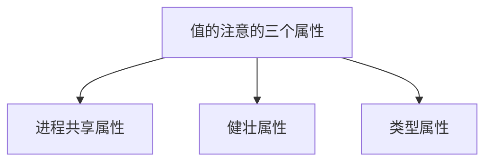
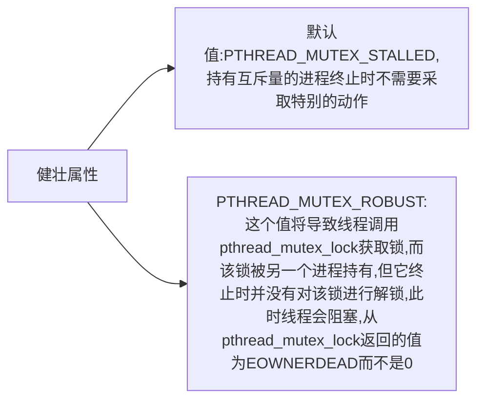

# 线程控制

[toc]

## 线程限制

Single UNIX Specification定义了与线程操作有关的一些限制。与其他的系统限制一样，这些限制也可以通过sysconf函数进行查询，这些限制的使用是为了增强应用程序在不同操作系统实现之间的可移植性。

```c
#include <unistd.h>
long sysconf(int name);
```

## 线程属性

pthread接口允许我们通过设置每个对象关联的不同属性来细调线程和同步对象的行为。

```c
#include <pthread.h>
int pthread_attr_init(pthread_attr_t *attr);
int pthread_attr_destroy(pthread_attr_t *attr);
```
### 分离状态属性
若在创建线程时就知道不需要了解线程的终止状态，可以修改pthread_attr_t结构中的detachstate线程属性，让线程从一开始就处于分离状态。可以使用pthread_attr_setdetachstate函数把线程属性detachstate设置成以下合法值之一： 1.PTHREAD_CREATE_DETACHED,以分离状态启动线程； 2.PTHREAD_CREATE_JOINABLE，正常启动线程。

```c
int pthread_attr_getdetachstate(const pthread_attr_t * restrict attr,
int *detachstate);
int pthread_attr_setdetachstate(const pthread_attr_t * restrict attr,
int * detachstate);
```
example:以分离状态创建线程
```c
#include <pthread.h>
#include "../apue.h"


// void *fuc()
// {
//   printf("create pthread successful\n");
//   //system("echo \"test\" >>testfile");
//   return ((void*)0);
// }
//
// int main(int argc, char const *argv[]) {
//   pthread_t tid;
//   pthread_attr_t attr;
//   pthread_attr_init(&attr);
//   pthread_attr_setdetachstate(&attr,PTHREAD_CREATE_DETACHED);
//   pthread_create(&tid,&attr,fuc,NULL);
//   pthread_attr_destroy(&attr);
//   sleep(3);
//   return 0;
// }

void* testFunction(void *attr) {

    attr=(pthread_attr_t *)attr;
    int chk,rc;
pthread_attr_getdetachstate(attr, &chk);

if(chk == PTHREAD_CREATE_DETACHED )
    printf("Detached\n");
else if (chk == PTHREAD_CREATE_JOINABLE)
    printf("Joinable\n");

// printf("create pthread successful\n");
return NULL;
}


int main (int argc, const char * argv[]) {

pthread_t thread1;
pthread_attr_t attr;

int rc;

rc = pthread_attr_init(&attr);

printf("attr_init: %d\n",rc);
rc = pthread_attr_setdetachstate(&attr, PTHREAD_CREATE_DETACHED);
printf("attr_setdetachedstate: %d\n",rc);

rc = pthread_create(&thread1, &attr, testFunction, &attr);
printf("attr_create: %d\n",rc);
pthread_attr_destroy(&attr);
sleep(4);

//pthread_cancel(thread1);

return 0;
}

```
注意：此例忽略了pthread_attr_destroy调用的返回值。在这个示例中，我们对线程属性进行了合理的初始化，因此pthread_attr_destroy应该不会失败。但是，如果pthread_attr_destroy确实出现失败的情况，将难以清理：必须销毁刚刚创建的线程，也许这个线程可能已经运行，并且与pthread_attr_destroy函数可能是异步执行的。
### 线程栈属性
可以使用pthread_attr_getstack和pthread_attr_setstack对线程栈属性进行管理。
```c
int pthread_attr_getstack(const pthread_attr_t * restrict attr,void ** restrict stackddr,size_t *restrict stacksize);
int pthread_attr_setstack(const pthread_attr_t *restrict attr,void ** restrict stackaddr,size_t stacksize);
```
对于进程来说，虚地址空间的大小是固定的。因为进程中只有一个栈，所以他的大小通常不是问题。但对于线程来说，同样大小的虚地址空间必须被所有的线程共享。
stackaddr 线程属性被定义为栈的最低内存地址，但这并不一定是栈的开始位置。对于一个给定的处理器结构来说，如果栈是从高地址向底地址方向增长的，那么stackaddr线程属性是栈的结尾位置。
### 线程栈属性stacksize
如果希望改变默认的栈的大小，但又不想自己处理线程栈的分配问题，这时使用pthread_attr_setstacksize函数就非常有用。
```c
int pthread_attr_getstacksize(const pthread_attr_t * restrict attr,size_t *restrict stacksize);
int pthread_attr_setstacksize(pthread_attr_t *attr,size_t stacksize);
```
### 线程栈末尾的警戒缓冲区大小
线程属性guardsize控制着线程栈末尾之后用以避免栈溢出的扩展内存的大小。这个属性默认是由具体实现定义的，通常是系统页大小。可以把guardsize线程属性设置为0，这是不提供警戒缓冲区。同样，若修改了线程属性stackaddr，系统就认为我们将自己管理栈，进而使栈警戒缓冲区机制无效，这等同于guardsize线程属性设置为0。
```c
int pthread_attr_getguardsize(const pthrad_attr_t *restrict attr,size_t *restrict guardsize);
int pthread_attr_setguardsize(pthread_attr_t *attr,size_t guardsize);
```
若线程guardsize属性被修改了，操作系统可能会把它取为页大小的整数倍。如果i线程的栈指针溢出到警戒区域，应用程序就可以通过信号接受到出错信息。

## 线程同步属性
就像线程具有属性一样，线程的同步对象也有属性。
### 互斥量属性
```c
int pthread_mutexattr_init(pthread_mutexattr_t *attr);
int pthread_mutexattr_destroy(pthread_mutexattr_t *attr);
```
pthread_mutexattr_init function将使用默认的互斥量属性初始化pthread_mutexattr_t结构。

### 进程共享属性
在进程中，多个线程可以访问同一个同步对象。正如11章所看到的，这是默认的行为。在这种情况下，进程共享互斥量属性需要设置为PTHREAD_PROCESS_PRIVATE.
后面14，15章将看到，存在u这样的机制：允许相互独立的多个线程把同一个内存数据块映射到他们独自的地址空间中。就像多个线程访问共享数据一样，多个进程访问共享数据通常也需要同步。如果进程共享互斥量属性设置为PTHREAD_PROCESS_SHARED，从多个进程彼此之间共享的内存数据块中分配的互斥量就可以用于这些进程的同步。
```c
int pthread_mutexattr_getpshared(const pthread_mutexattr_t *restrict attr,int *restrict pshared);
int pthread_mutexattr_setpshared(pthread_mutexattr_t *attr,int pshared);
```
### 健壮属性
互斥量健壮属性与多个进程间共享的互斥量有关。
```c
int pthread_mutexattr_getrobust(const pthread_mutexattr_t *restrict attr,int * restrict robust);
int pthread_mutexattr_setrobust(const pthread_mutexattr_t *aatr,int robust);
```

如果应用状态无法恢复，在线程对互斥量解锁后，该互斥量将处于永久不可用的状态。为了避免这个问题，线程可以调用pthread_mutex_consistent函数，指明与互斥量相关的状态在互斥量解锁之前是一致的。
```c
int pthread_mutex_consistent(pthread_mutex_t *mutex);
```
如果线程没有先调用pthread_mutex_consistent就对互斥量进行解锁，那个其他试图获取该互斥量的阻塞线程就会得到错误码ENOTRECOVERABLE。如果发生这种情况，互斥量将不再可用。
### 类型属性
1. PTHREAD_MUTEX_NORMAL 一种标准互斥量类型，不做任何特殊的错我检查或死锁检查
2. PTHREAD_MUTEX_ERRORCHECK  此互斥量类型提供错误检查
3. PTHREAD_MUTEX_RECURSIVE 此互斥量类型允许同一线程在互斥量解锁之前对该互斥量进行多次加锁。递归互斥量维护锁的计数，在解锁次数和加锁次数不相同的情况下，不会释放锁。
4. PTHREAD_MUTEX_DEFAULT 此互斥量类型可以提供默认特性和行为。
```c
int pthread_mutexattr_gettype(const pthread_mutexattr_t *restrict attr,int *restrict type);
int pthread_mutexattr_settype(pthread_mutexattr_t *attr,int type);
```
#### 使用递归互斥量
示例
```c
#include "../apue.h"

int makethread(void *(*fn)(void *),void *arg)
{
  pthread_t thread1;
pthread_attr_t attr;

int rc;

rc = pthread_attr_init(&attr);

printf("attr_init: %d\n",rc);
rc = pthread_attr_setdetachstate(&attr, PTHREAD_CREATE_DETACHED);
printf("attr_setdetachedstate: %d\n",rc);

rc = pthread_create(&thread1, &attr, fn,arg);
printf("attr_create: %d\n",rc);
pthread_attr_destroy(&attr);
return rc;
}

struct to_info{
void (*to_fn)(void *);
void *to_arg;
struct timespec to_wait;
};

#define SECTONSEC 1000000000
#if !defined(CLOCK_REALTIME) || defined(BSD)
#define clock_nanosleep(ID,FL,REQ,REM) nanosleep((REQ),(REM))
#endif

#ifndef CLOCK_REALTIME
#define CLOCK_REALTIME 0
#define USECTONSEC 1000

void clock_gettime(int id,struct timespec *tsp)
{
  struct timeval tv;
  gettimeofday(&tv,NULL);
  tsp->tv_sec=tv.tv_sec;
  tsp->tv_nsec=tv.tv_usec* USECTONSEC;
}
#endif

void *timeout_helper(void *arg)
{
  struct to_info *tip;
  tip=(struct to_info *) arg;
  clock_nanosleep(CLOCK_REALTIME,0,&tip->to_wait,NULL);
  (*tip->to_fn)(tip->to_arg);
  free(arg);
  return 0;
}

void timeout(const struct timespec *when,void (*func)(void *),void *arg)
{
  struct timespec now;
  struct to_info *tip;
  int err;

  clock_gettime(CLOCK_REALTIME,&now);
  if ((when->tv_sec>now.tv_sec) ||
(when->tv_sec ==now.tv_sec && when->tv_nsec>now.tv_nsec) )
{
  tip=malloc(sizeof(struct to_info));
  if (tip !=NULL)
  {
    tip->to_fn=func;
    tip->to_arg=arg;
    tip->to_wait.tv_sec=when->tv_sec-now.tv_sec;
    if (when->tv_nsec >=now.tv_nsec)
    {
      tip->to_wait.tv_nsec=when->tv_nsec - now.tv_nsec;
    }
    else{
      tip->to_wait.tv_sec--;
      tip->to_wait.tv_nsec=SECTONSEC-now.tv_nsec+when->tv_nsec;
    }
    err=makethread(timeout_helper,(void *)tip);
    if (err==0)
    return;
    else
    free(tip);
  }
}
(*func)(arg);
}

pthread_mutexattr_t attr;
pthread_mutex_t mutex;

void retry(void *arg)
{
  pthread_mutex_lock(&mutex);
//perform retry steps
pthread_mutex_unlock(&mutex);
}

int main(int argc, char const *argv[]) {
  int err,condition,arg;
  struct timespec when;

  if((err=pthread_mutexattr_init(&attr))!=0)
  err_exit("err","ptharead_mutexattr init failed");
  if ((err=pthread_mutexattr_settype(&attr,PTHREAD_MUTEX_RECURSIVE))!=0)
  err_exit("err","pthread_mutexattr_settype failed");
  if ((err=pthread_mutex_init(&mutex,&attr))!=0)
  err_exit("err","can not create recursive lock");

  //continue process

  pthread_mutex_lock(&mutex);
//check condition under the protection of a lock to make the check and the call to timeout atomic;
condition=1;
arg=1;
  if (condition)
  {
    //calculate the absolute time when we want to retry;
    clock_gettime(CLOCK_REALTIME,&when);
    when.tv_sec+=10;
    timeout(&when,retry,(void *)((unsigned long)arg));

  }
  pthread_mutex_unlock(&mutex );
  //continue process
  return 0;
}

```
如果我们不能够创建线程，或者安排函数运行的时间以过，这是问题就出现了。在这些情况下，我们只需在当前上下文中调用之前请求运行的函数。因为函数要获取的锁和我们现在占有的锁是同一个，所以除非该锁是递归的，否则就会出现死锁。

### 读写锁属性
```c
int pthread_rwlockattr_init(pthread_rwlockattr_t *attr);
int pthread_rwlocakattr_destory(pthread_rwlockattr_t *attr);
```
读写锁支持的唯一属性是进程共享属性。它与互斥量的进程共享属性是相同的。就像互斥量的进程共享属性一样，有一对函数用于读取和设置读写锁的进程共享属性。
```c
int pthread_rwlockattr_getpshared(const pthread_rwlockattr_t *restrict attr,int *restrict pshared);
int pthread_rwlockattr_setpshared(pthread_rwlockattr_t *attr,int pshared);
```
虽然POSIX只定义了一个读写锁属性，但不同平台的实现可以自由地定义额外的、非标准的属性。


### 条件变量属性
```c
int pthread_condattr_init(pthread_condattr_t *attr);
int pthread_condattr_destroy(pthread_condattr_t * attr);
```
进程共享属性和时钟属性。

#### 进程共享属性:
```c
int pthread_condattr_getshared(const pthread_condattr_t *restrict attr,int *restrict pshared);
int pthread_condattr_setshared(pthread_condattr_t *attr,int pshared);
```

#### 时钟属性：
时钟属性控制计算pthread_cond_timedwait函数的超时参数时采用的哪个时钟。合法值取自下图列出的时钟ID。


|标示符 | 选项    | 说明|
| :- | :- |:-|
|  CLOCK_REALTIME |       | 实时系统时间 |
| CLOCK_MONOTONIC |_POSIX_MONOTONIC_CLOCK|不带负跳数的实时系统时间
|CLOCK_PROCESS_CPUTIME_ID|_POSIX_CPUTIME|调用进程的CPU时间
|CLOCK_THREAD_CPUTIME_ID|_POSIX_THREAD_CPUTIME|调用线程的CPU时间

```c
int pthread_condattr_getclock(const pthread_condattr_t *restrict attr,clockid_t *restrict clock_id);
int pthread_condattr_setclock(pthread_condattr_t * attr,clockid_t clock_id);
```

### 屏障属性
```c
int pthread_barrierattr_init(pthread_barrierattr_t * att);
int pthread_barrierattr_destroy(pthread_barrierattr_t *attr);
```
目前定义的屏障属性只有
#### 进程共享属性：
```c
int pthrad_barrierattr_getpshared(const pthread_barrierattr_t * restrict attr,int *restrict pshared);
int pthread_barrierattr_setpshared(pthread_barrierattr_t *attr,int pshared);
```


[上一级](base.md)
[上一篇](pthread.md)
