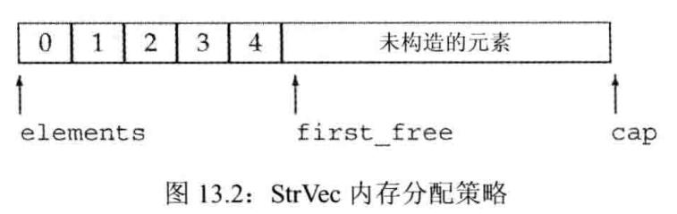

# 再探 c++ primer


<!-- @import "[TOC]" {cmd="toc" depthFrom=1 depthTo=6 orderedList=false} -->
<!-- code_chunk_output -->

* [再探 c++ primer](#再探-c-primer)
	* [变量和基本类型](#变量和基本类型)
		* [基本内置类型](#基本内置类型)
		* [列表初始化](#列表初始化)
		* [默认初始化](#默认初始化)
		* [变量声明和定义的关系](#变量声明和定义的关系)
		* [引用](#引用)
		* [指针](#指针)
		* [const限定符](#const限定符)
			* [顶层 const](#顶层-const)
			* [constexpr 和常量表达式](#constexpr-和常量表达式)
	* [字符串、向量、和数组](#字符串-向量-和数组)
		* [标准库类型 vector](#标准库类型-vector)
			* [值初始化](#值初始化)
		* [数组](#数组)
			* [定义和初始化内置数组](#定义和初始化内置数组)
		* [访问数组元素](#访问数组元素)
			* [检查下标的值](#检查下标的值)
		* [指针和数组](#指针和数组)
			* [指针也是迭代器](#指针也是迭代器)
			* [标准库函数 begin 和 end](#标准库函数-begin-和-end)
			* [指针运算](#指针运算)
		* [与旧代码的接口](#与旧代码的接口)
			* [混用 std::string 对象和 c 风格字符串](#混用-stdstring-对象和-c-风格字符串)
			* [使用数组初始化 vector 对象](#使用数组初始化-vector-对象)
		* [多维数组](#多维数组)
			* [多维数组初始化](#多维数组初始化)
			* [使用范围 for 语句处理多维数组](#使用范围-for-语句处理多维数组)
			* [类型别名简化多维数组的指针](#类型别名简化多维数组的指针)
	* [表达式](#表达式)
		* [基础](#基础)
			* [基本概念](#基本概念)
				* [左值和右值](#左值和右值)
		* [算术运算符](#算术运算符)
			* [警惕溢出和其他算术运算异常](#警惕溢出和其他算术运算异常)
		* [逻辑和关系运算符](#逻辑和关系运算符)
		* [赋值运算符](#赋值运算符)
			* [赋值运算符优先级较低](#赋值运算符优先级较低)
			* [复合赋值运算符](#复合赋值运算符)
		* [递增和递减运算符](#递增和递减运算符)
		* [逗号运算符](#逗号运算符)
		* [类型转换](#类型转换)
			* [其他隐式类型](#其他隐式类型)
			* [显式转换](#显式转换)
				* [旧式的强制类型转换](#旧式的强制类型转换)
		* [C++ 运算符优先级表](#c-运算符优先级表)
		* [注意](#注意)
	* [语句](#语句)
		* [范围 for 语句](#范围-for-语句)
		* [标准异常](#标准异常)
	* [函数](#函数)
		* [函数基础](#函数基础)
			* [形参和实参](#形参和实参)
		* [参数传递](#参数传递)
			* [含有可变形参的函数](#含有可变形参的函数)
		* [返回类型和 return 语句](#返回类型和-return-语句)
			* [不要返回局部对象的引用或指针](#不要返回局部对象的引用或指针)
			* [返回数组指针](#返回数组指针)
		* [函数重载](#函数重载)
			* [重载和 const 形参](#重载和-const-形参)
			* [重载与作用域](#重载与作用域)
		* [特殊用途语言特性](#特殊用途语言特性)
			* [默认实参](#默认实参)
			* [内联函数和 constexpr 函数](#内联函数和-constexpr-函数)
				* [内联函数可避免函数调用的开销](#内联函数可避免函数调用的开销)
				* [constexpr函数](#constexpr函数)
				* [把内联函数和 constexpr函数放在头文件内](#把内联函数和-constexpr函数放在头文件内)
			* [调试帮助](#调试帮助)
				* [NDEBUG 预处理变量](#ndebug-预处理变量)
		* [函数匹配](#函数匹配)
			* [候选函数和可行函数](#候选函数和可行函数)
			* [实参类型转换](#实参类型转换)
				* [函数匹配和 const 实参](#函数匹配和-const-实参)
		* [函数指针](#函数指针)
	* [类](#类)
		* [定义抽象数据类型](#定义抽象数据类型)
			* [构造函数](#构造函数)
				* [委托构造函数](#委托构造函数)
				* [聚合类](#聚合类)
		* [访问与封装](#访问与封装)
			* [使用 class 或 struct 关键字](#使用-class-或-struct-关键字)
			* [友元](#友元)
			* [返回 * this 的成员函数](#返回-this-的成员函数)
				* [从 const 成员函数返回 * this](#从-const-成员函数返回-this)
			* [类的声明](#类的声明)
		* [类的作用域](#类的作用域)
		* [类的静态成员](#类的静态成员)
			* [静态成员能用于某些场景，而普通成员不能](#静态成员能用于某些场景而普通成员不能)
		* [小结](#小结)
	* [IO 类](#io-类)
		* [IO 类](#io-类-1)
			* [IO 对象无拷贝或赋值](#io-对象无拷贝或赋值)
			* [条件状态](#条件状态)
			* [管理输出缓冲](#管理输出缓冲)
		* [文件输入输出](#文件输入输出)
			* [文件模式](#文件模式)
		* [string 流](#string-流)
	* [顺序容器](#顺序容器)
		* [顺序容器概述](#顺序容器概述)
		* [容器库概览](#容器库概览)
			* [使用 assign (仅顺序容器)](#使用-assign-仅顺序容器)
			* [使用 swap](#使用-swap)
			* [关系运算符](#关系运算符)
		* [顺序容器操作](#顺序容器操作)
			* [使用 emplace 操作](#使用-emplace-操作)
			* [访问元素](#访问元素)
			* [删除元素](#删除元素)
			* [特殊的 forward_list 操作](#特殊的-forward_list-操作)
			* [改变容器大小](#改变容器大小)
			* [容器操作可能使迭代器失效](#容器操作可能使迭代器失效)
				* [编写改变容器的循环程序](#编写改变容器的循环程序)
				* [不要保存 end 返回的迭代器](#不要保存-end-返回的迭代器)
		* [vector 对象是如何增长的](#vector-对象是如何增长的)
		* [额外的 string 操作](#额外的-string-操作)
			* [构造函数的其他方法](#构造函数的其他方法)
				* [substr 操作](#substr-操作)
			* [改变 string 的其他方法](#改变-string-的其他方法)
			* [string 搜索操作](#string-搜索操作)
			* [compare 函数](#compare-函数)
			* [数值转换](#数值转换)
		* [容器适配器](#容器适配器)
			* [栈适配器](#栈适配器)
			* [deque](#deque)
			* [priority_queue](#priority_queue)
	* [泛型算法](#泛型算法)
		* [概述](#概述)
		* [初识泛型算法](#初识泛型算法)
			* [只读算法](#只读算法)
			* [写容器元素的算法](#写容器元素的算法)
			* [重排容器元素的算法](#重排容器元素的算法)
		* [定制操作](#定制操作)
			* [向算法传递函数](#向算法传递函数)
			* [lambda 表达式](#lambda-表达式)
			* [lambda 捕获和返回](#lambda-捕获和返回)
			* [参数绑定](#参数绑定)
		* [再探迭代器](#再探迭代器)
			* [插入迭代器](#插入迭代器)
			* [iostream 迭代器](#iostream-迭代器)
			* [反向迭代器](#反向迭代器)
		* [泛型算法结构](#泛型算法结构)
			* [5 类迭代器](#5-类迭代器)
			* [算法形参模式](#算法形参模式)
			* [算法命名规范](#算法命名规范)
		* [特定容器算法](#特定容器算法)
	* [关联容器](#关联容器)
		* [关联容器概述](#关联容器概述)
			* [关键字类型的要求](#关键字类型的要求)
			* [pair 类型](#pair-类型)
		* [关联容器操作](#关联容器操作)
			* [关联容器迭代器](#关联容器迭代器)
			* [添加元素](#添加元素)
			* [删除元素](#删除元素-1)
			* [map 的下标操作](#map-的下标操作)
			* [访问元素](#访问元素-1)
		* [无序容器](#无序容器)
	* [动态内存](#动态内存)
		* [动态内存与智能指针](#动态内存与智能指针)
			* [shared_ptr 类](#shared_ptr-类)
			* [直接管理内存](#直接管理内存)
			* [shared_ptr 和 new 结合使用](#shared_ptr-和-new-结合使用)
			* [智能指针和异常](#智能指针和异常)
			* [unique_ptr](#unique_ptr)
			* [weak_ptr](#weak_ptr)
		* [动态数组](#动态数组)
			* [new 和数组](#new-和数组)
			* [allocator 类](#allocator-类)
	* [拷贝控制](#拷贝控制)
		* [拷贝、赋值与销毁](#拷贝-赋值与销毁)
			* [拷贝构造函数](#拷贝构造函数)
			* [拷贝赋值运算符](#拷贝赋值运算符)
			* [析构函数](#析构函数)
			* [三/五法则](#三五法则)
			* [使用 = default](#使用-default)
			* [阻止拷贝](#阻止拷贝)
		* [拷贝控制和资源管理](#拷贝控制和资源管理)
			* [行为像值的类](#行为像值的类)
			* [定义行为像指针的类](#定义行为像指针的类)
		* [交换操作](#交换操作)
		* [拷贝控制示例](#拷贝控制示例)
		* [动态内存管理类](#动态内存管理类)
		* [对象移动](#对象移动)
			* [右值引用](#右值引用)
			* [移动构造函数和移动赋值运算符](#移动构造函数和移动赋值运算符)
			* [右值引用和成员函数](#右值引用和成员函数)
	* [重载运算与类型转换](#重载运算与类型转换)
		* [输入和输出运算符](#输入和输出运算符)
			* [重载输出运算符 <<](#重载输出运算符)
			* [重载输入运算符 >>](#重载输入运算符)
		* [算术和关系运算符](#算术和关系运算符)
			* [相等运算符](#相等运算符)
	* [面向对象编程](#面向对象编程)
		* [OOP : 概述](#oop-概述)
		* [定义基类和派生类](#定义基类和派生类)
			* [定义派生类](#定义派生类)
			* [类型转换与继承](#类型转换与继承)
		* [虚函数](#虚函数)
		* [抽象基类](#抽象基类)
		* [访问控制与继承](#访问控制与继承)
		* [继承中的类作用域](#继承中的类作用域)
		* [构造函数与拷贝控制](#构造函数与拷贝控制)
			* [虚析构函数](#虚析构函数)
			* [合成拷贝控制与继承](#合成拷贝控制与继承)
			* [派生类的拷贝控制成员](#派生类的拷贝控制成员)
			* [继承的构造函数](#继承的构造函数)
		* [容器与继承](#容器与继承)
	* [Link](#link)

<!-- /code_chunk_output -->

## 变量和基本类型

### 基本内置类型
c++ 定义了一套包括算术类型([arithmetic type](https://en.cppreference.com/w/c/language/arithmetic_types))和 空类型(void) 在内的基本数据类型。
* 其中算术类型包含了字符、整型数、布尔值和浮点数。
* 空类型不对应具体的值，仅用于一些特殊的场合。

### 列表初始化

c++ 语言定义了初始化的好几种不同的形式，例如：
```c++
int units_sold=0;
int units_sold={0};
int units_sold{0};
int units_sold(0);
```

作为 c++ 11 新标准的一部分，用花括号来初始化变量（列表初始化）得到了全面应用，而在此之前，这种初始化的形式仅在某些受限的场合下才使用。现在，无论是初始化对象还是某些时候为对象赋新值，都可以使用这样一组由花括号括起来起来的初始值了。


```highLight
当用于内置类型的变量时，这种初始化形式有一个重要的特点：如果我们使用列表初始化且初始值存在丢失信息的风险，则编译器将报错。
```

```c++
long double ld=3.1415926536;
int a{ld},b={ld}; //错误：转换未执行，因为存在丢失信息的危险
int c(ld),d=ld; //正确：转换执行，且丢失了部分值
```

### 默认初始化
如果定义变量时没有指定初值，则变量被默认初始化（ default initialized),此时变量被赋予了 "默认值"。默认值到底是什么由变量类型决定，同时定义变量的位置也会对此有影响。

```highLight
如果是内置类型的变量未被显式初始化，它的值由定义的位置决定。
* 定义于任何函数体之外的变量被初始化为 0。
* 定义在函数体内部的内置类型变量将 不被初始化(uninitialized)。一个未被初始化的内置变量的值是未定义的。
```

每个类各自决定其初始化对象的方式。而且，是否允许不经初始化就定义对象也由类自己决定。如果类允许这种行为，他将决定对象的初始值到底是什么。

绝大多数类都支持无须显式初始化而定义对象，这样的类提供了一个合适的默认值。

### 变量声明和定义的关系
为了支持分离式编译， c++ 语言将声明和定义区分开来。声明使得名字为程序所知，一个文件如果想使用别处定义的名字则必须包含对这个名字的声明。而定义负责创建与名字关联的实体。

如果想声明一个变量而非定义它，就在变量名前添加关键字 extern ，而且不要显式地初始化变量：
```c++
extern int  i; //声明 i而非定义 i  
int j; //声明并定义 j
extern int k=5; //定义
```

变量能且只能被定义一次，但是可以被多次声明。


### 引用

```highLight
c++ 11 新增了一种引用：所谓的右值引用 (rvalue refefence),这种引用主要用于内置类。严格来说，当我们使用术语 "引用 (refefence)" 时，指的其实是“左值引用(lvalue refefence)”。
```

引用 (refefence) 为对象起了另外一个名字，引用类型引用 (refers to) 另外一种类型。

一般在初始化变量时，初始值会被拷贝到新建的对象中。然而定义引用时，程序把引用和它的初始值 ```绑定(bind)``` 在一起，而不是将初始值拷贝给引用。一旦初始化完成，引用将和他的初始值对象一直绑定在一起。因为无法令引用重新绑定到另外一个对象，因此引用必须初始化。

```c++
int val=1024;
int &refVal=val; //refVal 指向 val
int &refVal2; //error，引用必须被初始化
int &refVal3=10; //error，引用类型的初始值必须是一个对象

double val1=3.14;
int &refVal4=val1; //error,此处引用类型的初始值必须是 int 型对象
```

引用即别名，只是定义需要特别注意，后面使用就跟直接使用相应的对象是一样的。

### 指针
过去的程序还会用到一个名为 NULL 的预处理变量来给指针赋值，这个变量在头文件 cstdlib 中定义，他的值就是 0。

在新标准下，现在的 c++ 程序最好使用 nullptr,同时尽量避免使用 NULL 。

把 int 变量直接赋给指针是错误的操作，即使 int 变量的值恰好等于 0 也不行。

```c++
int zero=0;
int *ptr=zero; //error，不能把 int 变量直接赋给指针
```

```sh
#g++
error: invalid conversion from ‘int’ to ‘int*’ [-fpermissive]
 int *ptr=zero;
```

建议：
* 初始化所有指针
* 在试图使用一个指针之前代码可以首先检查它是否为空
* 释放指针所指向的对象后应将指针赋为 nullptr

给定指针 P，你能知道它是否指向了一个合法的对象吗？ (不能)
[给定一个指针，如何判断这个指针是否已经指向一个合法的对象？](https://www.zhihu.com/question/24331527)

### const限定符
[const限定符](const.md)

#### 顶层 const
对于 const 和指针的组合：
* 顶层 const (top-level const) 表示指针本身是个常量。
* 底层 const (low-level const) 表示指针所指的对象是一个常量。

#### constexpr 和常量表达式
常量表达式 ([const expresion](https://en.cppreference.com/w/cpp/language/constant_expression))是指不会改变并且在编译过程就能得到计算结果的表达式。
一个对象（或表达式）是不是常量表达式由它的数据类型和初始值共同决定的，例如：
```c++
const int maxFiles=20 ; // const expresion
const int limit=maxFiles + 1; //const expresion
int staffSize=27; //not const expresion
const int size=getSize(); //not const expresion
```

c++11 新标准规定，允许将变量声明为 constexpr 类型以便由编译器来验证变量的值是否是一个常量表达式。声明为 constexpr 的变量一定是一个常量，而且必须用常量表达式初始化.
```c++
constexpr int mf=20; //20 是常量表达式
constexpr int limit=mf+1; //const expresion
constexpr int size=size(); //只有当 size 是一个 constexpr 函数时才是一条正确的声明语句
```
```highLight
一般来说，如果你认定变量是一个常量表达式，那就把它声明为 constexpr 类型
```

* 字面值类型
	字面值类型：这些类型一般比较简单，值也显而易见、容易得到。比如，算术类型、引用和指针都属于字面值类型。自定义类、IO库、string类型则不属于字面值类型。

	尽管指针和引用都能定义成 constexpr,但他们的初始值却受到严格限制。一个 constexpr 指针的初始值必须时 nullptr 或者 0，或者是存储在某个固定地址中的对象。

* 指针和 constexpr
	必须明确一点，在 constexpr 声明中如果定义了一个指针，限定符 constexpr 仅对指针有效，与指针所指的对象无关：
	```c++
	const int * p=nullptr; //p 是一个指向整型常量的指针
	constexpr int * q=nullptr; //q 是一个指向整数的常量指针
	```

注意，下面代码是不合法的：
```c++
#include <iostream>

int main(int argc, char const *argv[]) {
  int null=0,* p=null;
  return 0;
}
```
Run it:
```sh
error: invalid conversion from ‘int’ to ‘int*’ [-fpermissive]
   int null=0,*p=null;
```

## 字符串、向量、和数组

### 标准库类型 vector
#### 值初始化
通常情况下，可以只提供 vector 对象容纳的元素数量而略去初始值。此时库会创建一个 值初始化(value-initialized) 元素初值，并把它赋给容器中的所有元素。这个初值由 vector 对象中元素的类型决定。

### 数组
#### 定义和初始化内置数组
数组是一种复合类型。数组的声明形如 a[d],其中 a 是数组的名字， d 是数组的维度。维度说明了数组中元素的个数，因此必须大于0。数组中元素的个数也属于数组类型的一部分，编译的时候应该是已知的。也就是说，维度必须是一个常量表达式：
```c++
const int arrSize=10; // 常量表达式
int arr[arrSize];
int arr1[10];
```

* 显式初始化数组元素
```c++
const unsigned size=3;
int a1[size]={0,1,2};
int a2[]={0,1,2};
int a3[5]={0,1,2}; //等价于 a3[]={0,1,2,0,0}
std::string a4[3]={"hi","bye"}; //等价于 a4[]={"hi","bye",""}
int a5[2]={0,1,2}; //error
```

* 字符数组的特殊性
当使用这种方式时，一定要注意字符串字面值的结尾处还有一个空字符，这个空字符也会像字符串的其他字符一样被拷贝到字符数组中去：
```c++
char a1[]={'c','+','+'}; // 没有空字符,维度为3
char a2[]={'c','+','+','\0'}; //含有显式的空字符
char a3[]="c++"; // 自动添加表示字符串结束的空字符
const char a4[6]="Daniel"; //error
```
* 不允许拷贝和赋值
```c++
int a[]={0,1,2};
int a2[]=a; //error
a2=a; //error
```
注意，一些编译器支持数组的赋值，这就是所谓的编译器扩展。但一般来说，最好避免使用非标准特性，因为含有非标准特性的程序很可能在其他编译器上无法正常工作。

* 理解复杂的数组声明
```c++
int * ptrs[10]; //ptrs 是含有10个整型指针的数组
int &ref[10]=/* ?*/; //error ，不存在引用的数组
int (* parray)[10]=&arr; // parray 指向一个含有 10 个整数的数组
int (&arrRef)[10]=arr; //arrRef 引用一个含有 10 个整数的数组
```
默认情况下，类型修饰符从右到左依次绑定。对于 ptrs 来说，从右向左理解其含义比较简单：首先知道我们定义的是一个大小为 10 的数组，它的名字是 ptrs,然后知道数组中存放的是指向 int 的指针。

但是对于 parray 来说，从右向左理解就不太合理了。因为数组的维度是紧跟着被声明的名字，所以就数组而言，由内向外阅读要比从右向左好多了。
* 首先是圆括号括起来的部分，* parray 意味着 parray 是个指针
* 接下来观察右边，可知道 parray 是个指向大小为 10 的数组的指针
* 最后观察左边，知道数组中的元素是 int。
这样最终的含义就明白无误了，parray 是一个指针，它指向一个 int 数组，数组中包含 10 个元素。同理，(&arrRef) 表示 arrRef 是一个引用，它引用的对象是一个大小为 10 的数组，数组中元素的类型是 int。
```c++
int *(&arry)[10]; //arry 是数组的引用，该数组含有 10 个指针
```
* Tips：
要想理解数组声明的含义，最好的办法是从数组的名字开始按照由内向外的顺序阅读。

sample:
```c++
#include <iostream>
#include <string>

std::string arr1[10];
int arr2[10];

int main(int argc, char const *argv[]) {
  std::string arr3[10];
  int arr4[10];

  std::cout << "arr1: ";
  for(auto i:arr1)
  {
    std::cout << i<<",";
  }
  std::cout << '\n';

  std::cout << "arr2: ";
  for(auto i:arr2)
  {
    std::cout << i<<",";
  }
  std::cout << '\n';

  std::cout << "arr3: ";
  for(auto i:arr3)
  {
    std::cout << i<<",";
  }
  std::cout << '\n';

  std::cout << "arr4: ";
  for(auto i:arr4)
  {
    std::cout << i<<",";
  }
  std::cout << '\n';
  return 0;
}
```

Run it:
```sh
arr1: ,,,,,,,,,,
arr2: 0,0,0,0,0,0,0,0,0,0,
arr3: ,,,,,,,,,,
arr4: -678078112,32527,-678074624,32527,-678079712,32527,1635824384,1054802016,-678078496,32527,
```

### 访问数组元素
#### 检查下标的值
数组的下标是否在合理范围之内由程序员负责检查，所谓合理就是说下标应该 >=0 and < arr.size();

* 大多数常见的安全问题都源于缓冲区溢出错误。当数组或其他类似数据结构的下标越界并试图访问非法内存区域时，就会产生此类错误。

### 指针和数组
#### 指针也是迭代器
你可以这样：
```c++
int arr[10]={0,1,2,3,4,5,6,7,8,9};
int * end=&arr[10];

for(int * b=arr;b!=end;++b)
{
	std::cout<<* b<<std::endl;
}
```

#### 标准库函数 begin 和 end
尽管能计算得到尾后指针，但这种用法极易出错。为了让指针的使用更简单、更安全，c++ 11 新标准引入了两个名为 [std::begin(std::valarray)](https://en.cppreference.com/w/cpp/iterator/begin) 和 [std::end(std::valarray)](https://en.cppreference.com/w/cpp/iterator/end) 的函数。
就像这样：
```c++
int arr[]={0,1,2,3,4,5};
int * begin=std::begin(arr);
int * end=std::end(arr);
```

#### 指针运算
将两个指针相加不但是非法的，而且也没什么意义。
```c++
int arr[5]={0,1,2,3,4};
auto n=std::end(arr)-std::begin(arr); //n is 5
```
两个指针相减的结果的类型是一种名为 [ptrdiff_t](https://en.cppreference.com/w/cpp/types/ptrdiff_t) 的标准库类型，ptrdiff_t 是一种带符号类型。

* 练习 3.34:假定 p1 和 p2 指向同一个数组中的元素，则下面程序的功能是什么？什么情况下该程序是非法的？
```c++
p1+=p2-p1;
```
答：功能是将 p1 指向的位置变更到 p2 指向的位置；该程序非法的情况见下程序：
```c++
#include <iostream>
int main(int argc, char const *argv[]) {
  int arr[3]={0};
  int * const p1=arr;
  int * p2=arr+1;
  p1+=p2-p1;
  return 0;
}
```
Compile it:
```sh
arr3_34.cpp: In function ‘int main(int, const char**)’:
arr3_34.cpp:7:10: error: assignment of read-only variable ‘p1’
   p1+=p2-p1;
```

### 与旧代码的接口
#### 混用 std::string 对象和 c 风格字符串
std::string 专门提供了一个名为 c_str 的成员函数：
```c++
std::string s("Hello world");
char * str=s; //error
const char *str=s.c_str();
```
不过请注意：
```c++
#include <string>
#include <iostream>

int main(int argc, char const *argv[]) {
  const char * str=nullptr;
  std::string s("test");
  str=s.c_str();
  std::cout << "str val :"<<str << '\n';
  s="test1";
  std::cout << "str val :"<<str << '\n';
  return 0;
}
```
Run it:
```sh
str val :test
str val :test1
```
#### 使用数组初始化 vector 对象
你可以这样：
```c++
int arr[]={0,1,2,3,4,5};
std::vector<int> v(std::begin(arr),std::end(arr));
```

### 多维数组
#### 多维数组初始化
```c++
int arr[3][4]={
	{0,1,2,3},
	{4,5,6,7},
	{8,9,10,11}
};
```
例如下面的初始化语句，形式上更为简洁，完成的功能和上面这段代码完全一样：
```c++
int arr[3][4]={0,1,2,3,4,5,6,7,8,9,10,11};
```

```c++
int (&row)[4]=arr[1]; //把 row 绑定到 arr 的第二个  4 元素数组上
```
#### 使用范围 for 语句处理多维数组
```c++
size_t cnt=0;
for(auto &row:arr)
	for (auto &col:row)
	{
		col=cnt;
		++cnt;
	}
```
看下面的这个例子：
```c++
for(auto &row:arr)
	for (auto col:row)
	{
	std::cout << col << '\n';
	}
```
这个循环中并没有任何写操作，可是我们还是将外层循环的控制变量声明成了引用类型，这是为了避免数组被自动转换为指针。假设采用下面形式：
```c++
// error，无法通过编译
for(auto row:arr)
	for (auto col:row)
```
程序将无法通过编译。这是因为，像之前一样第一个循环遍历 arr 的所有元素，注意这些元素实际上是大小为 4 的数组。因为 row 不是引用类型，所以编译器初始化row时会自动将这些数组形式的元素转换成指向该数组首元素的指针。这样得到的 row 的类型就是 int * ,显然内层的循环就不合法了，编译器将试图在一个 int * 内遍历，这显然和程序的初衷相去甚远。

* Note
要使用范围 for 语句处理多维数组，除了最内层的循环外，其他所有循环的控制变量都应该时引用类型。

#### 类型别名简化多维数组的指针
```c++
using int_array=int[4]; //新标准下类型别名的声明
typdef int int_array[4]; //等价的 typedef 声明
```

## 表达式

### 基础
#### 基本概念
c++ 定义了 一元运算符(unary operator)和 二元运算符(binary operator)。除此之外，还有一个作用于三个运算对象的三元运算符 `？：`。函数调用也是一种特殊的运算符，它对运算对象的数量没有限制。
* 作用于一个运算对象的运算符是一元运算符，如 `取地址(&) 解引用(*)`;
* 作用于两个运算对象的运算符是二元运算符，如 `相等运算符(==) 乘法运算符(*)`

当然一些符号既能作为一元运算符也能作为二元运算符。比如 `*`。一个符号到底是一元运算符还是二元运算符由它的上下文决定的。

##### 左值和右值
c++ 的表达式要不然是右值(rvalue)，要不然是左值(lvalue)。这两个名词是从c语言继承过来的，原本是为了帮助记忆；左值可以位于赋值语句的左侧，右值则不能。

在 C++ 中，两者的区别就没那么简单了。一个左值表达式的求值结果是一个对象或者一个函数，然而以常量对象为代表的某些左值实际上不能作为赋值语句的左侧运算对象。 此外，虽然某些表达式的求值结果是对象，但他们是右值而非左值。可以做一个简单的归纳：`当一个对象被用作右值的时候，用的是对象的值（内容）；当对象被用作左值的时候，用的是对象的身份（在内存中的位置）。`

不同的运算符对运算对象的要求各不相同，有的需要左值运算对象、有的需要右值运算对象；返回值也有差异，有的得到左值结果、有的得到右值结果。一个重要的原则是在需要右值的地方可以用左值来代替，但是不能把右值当作左值（也就是位置）使用。当一个左值被当作右值使用时，实际使用的是它的内容（值）。到目前为止，已经有几种我们熟悉的运算符是要用到左值的。
* 赋值运算符需要一个（非常量）左值为其左侧运算对象，得到的结果也仍然是一个左值。
* 取地址符作用于一个左值运算对象，返回一个指向该运算对象的指针，这个指针是一个右值。
* 内置解引用运算符、下标运算符、迭代器解引用运算符、string和 vector 的下标运算符的求值结果都是左值。
* 内置类型和迭代器的递增递减运算符作用于左值运算对象，其前置版本所得的结果也是左值。

使用关键字 decltype 的时候，左值和右值也有所不同。如果表达式的求值结果是左值， decltype 作用于该表达式得到一个引用类型。
```c++
int * p;
decltype(* p); //因为解引用运算符生成左值，所以结果为 int &
decltype(& p); //因为取地址运算符生成右值，所以结果为 int **
```

### 算术运算符
算术运算符（左结合律）。
运算符 `%`，参与取余运算的运算对象必须是整数类型；

#### 警惕溢出和其他算术运算异常
```c++
#include <iostream>
#include <limits>

int main(int argc, char const *argv[]) {
  short val=std::numeric_limits<short>::max();
  std::cout << "val : "<<val << '\n';
  ++val;
  std::cout << "val : "<<val << '\n';
  ++val;
  std::cout << "val : "<<val << '\n';
  return 0;
}
```
Run it:
```sh
val : 32767
val : -32768
val : -32767
```

### 逻辑和关系运算符
逻辑与和逻辑或运算符，左结合律；
逻辑非，右结合律；
关系运算符，左结合律；

### 赋值运算符
赋值运算符满足右结合律，这一点和其他二元运算符不太一样。
#### 赋值运算符优先级较低
考虑如下代码：
```c++
int i=get_value();
while (i !=42) {
	...
}
```
但如果这样写，显然不是我们想要的：
```c++
//error
int i=0;
while (i = get_value() != 42) {
	...
}
```

* Note:
因为赋值运算符的优先级低于关系运算符的优先级，所以在条件语句中，赋值部分通常应该加上括号。

#### 复合赋值运算符
```c++
+= 	 -=    *=	/=  %= //算术运算符
<<=	 >>=   &=	^=  |= // 位运算符
```

### 递增和递减运算符
建议：
1. `除非必须，否则不用递增递减运算符的后置版本。`

	前置版本的递增运算符避免了不必要的工作，它把值加 1 后直接返回改变了的运算对象。与之相比，后置版本需要将原始值存储下来以便于返回这个未修改的内容。如果我们不需要修改前的值，那么后置版本的的操作就是一种浪费。
	对于整数和指针类型来说，编译器可能对这种额外的工作进行一定的优化；但是对于相对复杂的迭代器类型，这种额外的工作就消耗巨大了。建议养成使用前置版本的习惯，这样不仅不需要担心性能的问题，而且更重要的是写出的代码会更符合编程的初衷。

2. `简洁可以成为一种美德`

	比如这样：
	```c++
	std::cout << * iter << '\n';
	++iter;
	```
	可以写成这样，更为简洁，也更少出错
	```c++
	std::cout << * iter++ << '\n';
	```

### 逗号运算符
逗号运算符含有两个运算对象，按照从左向右的顺序依次求值。
让我们看下面的例子:
```c++
#include <iostream>

int main(int argc, char const *argv[]) {
  int x=3;
  int y=5;

  int val= (++x,++y);
  std::cout << "x: "<<x << '\n';
  int val1=(--x,--y);
  std::cout << "x: "<<x << '\n';

  std::cout << "val: "<<val << '\n';
  std::cout << "val1: "<<val1 << '\n';
  return 0;
}
```
Run it:
```sh
x: 4
x: 3
val: 6
val1: 5
```

### 类型转换
```c++
int val=3.541+3; // 编译器可能会警告该运算损失了精度
```
上述的类型转换是自动执行的，无须程序员的介入，有时甚至不需要程序员了解。因此，它们被称作隐式转换。

* 何时发生隐式转换
	在下面这些情况下，编译器会自动的转换运算对象的类型：
	* 在大多数表达式中，比 int 类型小的整型值首先提升为较大的整数类型。
	* 在条件中，非布尔值转换成布尔类型。
	* 初始化过程中，初始值转换成变量的类型；在赋值语句中，右侧运算对象转换成左侧运算对象的类型。
	* 如果算术运算或关系运算的运算对象有多种类型，需要转换成同一种类型。
	* 函数调用时也会发生类型转换。

#### 其他隐式类型
除了算术转换之外还有几种隐式类型转换：
* 数组转换成指针
* 指针的转换： nullptr/0 -> 任意指针类型；任意指针类型与 void * ，const void * 的转换。
* 转换成布尔类型
* 转换成常量
* 类类型定义的类型
```c++
std::string s,t="a value"; //字符串字面值转换成 string 类型
while(cin>>s) // while 的条件部分把 cin 转换成布尔值
```

#### 显式转换
有时我们希望显式地将对象强制转换成另外一种类型。例如，如果想在下面的代码中执行浮点数除法：
```c++
int i=0,j=0;
double slope=i/j;
```
就要使用某种方法将 i 和 j 显式地转换成 double，这种方法称为 强制类型转换(cast)。

* 命名的强制类型转换
	* [static_cast](https://en.cppreference.com/w/cpp/language/static_cast) 任何具有明确定义的类型转换，只要不包含底层 const ，都可以使用 static_cast。
	* [dynamic_cast](https://en.cppreference.com/w/cpp/language/dynamic_cast) ,支持运行时类型时别。
	* [const_cast](https://en.cppreference.com/w/cpp/language/const_cast) 只能改变运算对象的底层 const 。
	* [reinterpret_cast](https://en.cppreference.com/w/cpp/language/reinterpret_cast) 通常为运算对象的位模式提供较低层次上的重新解释。
		使用 reinterpret_cast 是非常危险的，比如这样
		```c++
		#include <iostream>
		#include <string>

		int main(int argc, char const *argv[]) {
			int * p=nullptr;
			char * p1=reinterpret_cast<char * >(p);

			std::string str(p1);
			std::cout << str << '\n';
			return 0;
		}
		```
		Run it:

		```sh
		terminate called after throwing an instance of \'std::logic_error\'
		what():  basic_string::_M_construct null not valid
		(core dumped)
		```
		reinterpret_cast 本质上依赖于机器。要想安全的使用 reinterpret_cast ，必须对涉及的类型和编译器实现转换的过程都非常了解。

建议：`避免强制类型转换`
强制类型转换干扰了正常的类型检查，因此我们强烈建议程序员避免使用强制类型转换。这个建议对于 reinterpret_cast 尤其适用，因为此类类型转换总是充满了风险。在有重载函数的上下文中使用 const_cast 无可厚非；但是在其他情况下使用 const_cast 也就意味着程序存在某种设计缺陷。其他强制类型转换，比如 static_cast 和 dynamic_cast,都不应该频繁使用。每次书写一次强制类型转换语句，都应该反复斟酌能否以其他方式实现相同目标。就算实在无法避免，也应该尽量限制类型转换值的作用域，并且记录对相关类型的所有假定，这样可以减少错误发生的机会 。

##### 旧式的强制类型转换
在早期版本中的 c++ 语言中，显式地进行强制类型转换包含两种形式：
```highLight
type (expr); // 函数形式的强制类型转换
(type) expr; // c 语言风格的强制类型转换
```
根据所涉及的类型不同，旧式的强制类型转换分别具有 const_cast、static_cast、reinterpret_cast 相似的行为。当我们在某处执行旧式的强制类型转换时，如果 const_cast 和 static_cast 也合法，则其行为与对应的命名转换一致。如果替换后不合法，则旧式强制类型转换执行 reinterpret_cast 类似的功能：
```c++
char * p2=(char * )p; //同 reinterpret_cast 效果一样
```
建议：使用命名的强制类型转换，不要用旧式的强制类型转换

### C++ 运算符优先级表
[C++ 运算符优先级表](https://zh.cppreference.com/w/cpp/language/operator_precedence)

### 注意
大多数运算符并不明确规定运算对象的求值顺序：编译器有权自由选择先对左侧运算对象求值还是先对右侧对象求值。一般来说，运算对象的求值顺序对表达式的最终结果没有影响。但是，如果两个运算对象指向同一个对象而且其中一个改变了对象的值，就会导致程序出现不易发现的严重缺陷。

## 语句

### 范围 for 语句
c++ 11 新标准引入了一种更简单的 for 语句，这种语句可以遍历容器或其他序列的所有元素。范围 for 语句 (range for statement) 的语法形式是：
```c++
for (declaration: expression)
	statement
```
比如这个：
```c++
std::vector<int> v{0,1,2,3,4,5};

for(auto &r:v)
{
	r*=2;
}
```
范围 for 语句的定义来源于与之等价的传统 for 语句：
```c++
for(auto beg=v.bein(),end=v.end();beg!=end();++beg)
{
	auto &r=* beg;
	r*=2;
}
```

### 标准异常
c++ STL 定义了一组类，用于报告标准库函数遇到的问题。这些异常类也可以在用户编写的程序中使用，他们分别定义在 4 个头文件中：
* exception 头文件定义了最通用的异常类 exception。它只报告异常的发生，不提供任何额外信息。
* stdexcept 头文件定义了几种常用的异常类，详细信息见下表
* new 头文件中定义了 bad_alloc 异常类型。
* type_info 头文件中定义了 bad_cast 异常类型。

\<stdexcept\> 定义的异常类

| exception        | 最常见的问题                                   |
|------------------|------------------------------------------------|
| runtime_error    | 只有在运行时才能检测的问题                     |
| range_error      | 运行时错误：生成的结果超出了有意义的值域范围   |
| overflow_errror  | 运行时错误：计算上溢                           |
| underflow_error  | 运算错误：计算下溢                             |
| logic_error      | 程序逻辑错误                                   |
| domain_error     | 逻辑错误：参数对应的结果值不存在               |
| invalid_argument | 逻辑错误：无效参数                             |
| length_error     | 逻辑错误：试图创建一个超出该类型最大长度的对象 |
| out_of_range     | 逻辑错误：使用一个超出有效范围的值             |

我们只能以默认初始化的方式初始化 exception bad_cast bad_alloc 对象，不允许为这些对象提供初始值。
其他异常类型的行为则恰好相反：应该使用 string 对象或者 C 风格字符串初始化这些类型的对象，但是不允许使用默认初始化的方式。当创建此类对象时，必须提供初始值，该初始值含有错误相关的信息。

## 函数

### 函数基础

#### 形参和实参
实参是形参的初时值。第一个实参初始化第一个形参，第二个实参初始化第二个形参，以此类推。尽管实参和形参存在对应关系，但是并没有规定实参的求值顺序。

### 参数传递
* 传递多维数组：
```c++
void print(int (*matrix)[10],int rowSize)
{}
//or
void print(int matrix[][10],int rowSize)
{}
```

#### 含有可变形参的函数
为了编写能处理不同数量实参的函数，c++ 11 新标准提供了两种主要的方法：
* 如果所有的实参类型相同，可以传递一个名为 [std::initializer_list](https://en.cppreference.com/w/cpp/utility/initializer_list)
* 如果实参类型不同，我们可以编写一种特殊的函数，也就是所谓的可变参数模板 [Parameter pack](https://en.cppreference.com/w/cpp/language/parameter_pack)

C++ 还有一种特殊的形参类型（即省略符），可以用它传递可变数量的实参。不过请注意，这种功能一般只用于与 c 函数交互的接口程序：
* `省略符形参应该仅仅用于 c 和 c++ 通用的类型。特别应该注意的是，大多数类类型的对象在传递给省略符形参时都无法正确拷贝。`

一个简单的 initializer_list 示例：
```c++
#include <iostream>
#include <initializer_list>
#include <string>

void errorMsg(int errorCode,std::initializer_list<std::string> par)
{
  std::cout << "errorCode:"<<errorCode<<", ";
  for(auto i:par)
  std::cout << i << " ";
  std::cout << '\n';
}

int main(int argc, char const *argv[]) {
  errorMsg(-1,{"functionX","is","error"});
  return 0;
}
```

### 返回类型和 return 语句

* 主函数 main 的返回值
如果函数的返回类型不是 void ,那么它必须返回一个值。但是这条规则有个例外：我们允许 main 函数没有 return 语句直接结束。如果控制到达了 main 函数的结尾而且没有 return 语句，编译器将隐式地插入一条返回 0 的 return 语句。（返回 0 表示执行成功，返回其他值表示执行失败，其中非 0 值的具体含义依机器而定）

#### 不要返回局部对象的引用或指针
```c++
//严重错误

const std::string &manip()
{
	std::string ret;
	if(!ret.empty())
	  return ret;
	else
	  return "Empty";
}
```

#### 返回数组指针
因为数组不能被拷贝，所以函数不能返回数组。不过，函数可以返回数组的指针或引用。

* 声明一个返回数组指针的函数
	举个例子：
	```c++
	int (* func(int i))[10];
	```

* 使用尾置返回类型
在 c++ 11 新标准中还有一种可以简化上述 func 声明的方法，就是使用尾置返回类型([trailing return type](https://arne-mertz.de/2016/11/trailing-return-types-everywhere/))
上面的函数，你可以这么写：
	```c++
	auto func(int i)->int( * )[10];
	```
* 使用 decltype
	eg:
	```c++
	int odd[]={1,3,5,7,9};
	int even[]={0,2,4,6,8};
	// 返回一个指针，该指针指向含有 5 个 整数的数组
	decltype(odd) *arrPtr(int i)
	{
		return (i%2) ? &odd : &even;
	}
	```

### 函数重载
如果同一作用域内的几个函数名字相同但形参列表不同，我们称之为重载([overloaded](https://www.geeksforgeeks.org/function-overloading-c/)) 函数。
eg:
```c++
#include <iostream>
using namespace std;

void print(int i) {
	cout << " Here is int " << i << endl;
}
void print(double f) {
	cout << " Here is float " << f << endl;
}
void print(char const *c) {
	cout << " Here is char* " << c << endl;
}

int main() {
print(10);
print(10.10);
print("ten");
return 0;
}
```
不过请注意：
```highLight
main 函数不能重载。
```

#### 重载和 const 形参
如 6.2.3 介绍的，顶层 const 不能影响传入函数的对象。一个拥有顶层 const 形参无法和另一个没有顶层 const 的形参区分开来：
```c++
Record lookup(Phone);
Record lookup(const Phone); //重复声明了 Record lookup(Phone);

Record lookup(Phone*);
Record lookup(Phone* const);//重复声明了 Record lookup(Phone*);
```

另一方面，如果形参时某种类型的指针或引用，则通过区分其指向的是常量对象还是非常量对象可以实现函数重载，此时 const 是底层：
```c++
Record lookup(Account &);
Record lookup(const Account&); //两个不同的函数

Record lookup(Account *);
Record lookup(const Account*); //两个不同的函数
```

#### 重载与作用域
```highLight
一般来说，将函数声明置于局部作用域内不是一个明智的选择。但是为了说明作用域和重载的相互关系，我们暂时违反这一原则而使用局部函数声明。
```
在不同的作用域中无法重载函数名：
```c++
std::string read();
void print(const std::string &);
void print(double);
void fooBar(int val)
{
	bool read=false; // 新作用域：隐藏了外层 read
	std::string s=read(); //错误： read 是一个布尔值，而非函数
	//不好的习惯：通常来说，在局部作用域中声明函数不是一个好的选择
	void print(int); //新作用域：隐藏了之前的 print
	print("Value: ");//错误，print(const std::string&)被隐藏掉了
	print(val); //正确，当前 作用域内的 print(int) 可见
	print(3.14); //正确，调用 作用域内的 print(int); 外面的print(double) 被隐藏掉了
}
```
```highLight
在 c++ 中，名字查找发生在类型检查之前
```
假设我们这样，将其放在同一作用域中，则它将成为另一种重载形式
:
```c++
void print(const std::string &);
void print(double);
void print(int);

void fooBar2(int val)
{
	print("Value ");
	print(val);
	print(3.14);
}
```

### 特殊用途语言特性
本节主要介绍三种函数相关的语言特性：
* 默认实参
* 内联函数和 constexpr函数
* 程序调试过程中常用的一些功能

#### 默认实参
[default argument](https://en.cppreference.com/w/cpp/language/default_arguments)

#### 内联函数和 constexpr 函数
在大多数机器上，一次函数调用其实包含着一系列工作：
* 调用前要先保存寄存器，并在返回时恢复;
* 可能需要拷贝实参；
* 程序转向一个新的位置继续执行；

##### 内联函数可避免函数调用的开销
将函数指定为 内联函数 （inline）,通常就是将它每个调用点上 “内联地”展开。
```c++
const std::string &shorterString(const std::string &s1,const std::string &s2)
{
	return s1.size() <= s2.size() ? s1:s2;
}
```
假设我们把 shorterString 函数定义成内联函数，
```c++
inline const std::string &shorterString(const std::string &s1,const std::string &s2)
{
	return s1.size() <= s2.size() ? s1:s2;
}
```
则如下调用
```c++
std::cout << shorterString(s1,s2) << '\n';
```
将在编译过程中展开成类似于下面的形式：
```c++
std::cout << (s1.size() <= s2.size() ? s1:s2) << '\n';
```
从而消除了 shorterString 函数的运行时开销。

Note:
* 内联说明只是向编译器发出一个请求，编译器可以选择忽略这个请求。

一般来说，内联机制用于优化规模较小、流程直接、频繁调用的函数。很多编译器都不支持内联递归函数，而且一个 75 行的函数也不大可能在调用点内联的展开。

##### constexpr函数
constexpr函数（constexpr function）是指用于常量表达式的函数。
定义 constexpr函数 与其他函数类似，不过要遵循几项约定：
* 函数的返回类型及所有形参的类型都得是字面值类型
* 函数体中必须有且只有一条 return 语句

为了能在编译过程中随时展开，constexpr函数被隐式地指定为内联函数。

constexpr函数体内也可以包含其他语句，只要这些语句在运行时不执行任何操作就行。例如，constexpr函数中可以由空语句、类型别名以及 using 声明。
```c++
constexpr size_t scale(size_t cnt)
{
	return 3*cnt;
}
```
当 scale 的实参是常量表达式时，它的返回值也是常量表达式；反之则不然：
```c++
int arr[scale(2)]; //正确
int i=2;
int a2[scale(i)]; //error，scale(i) 不是常量表达式
```

Note:
* constexpr函数不一定返回常量表达式。

##### 把内联函数和 constexpr函数放在头文件内
对于某个给定的内联函数或者 constexpr函数来说，它的多个定义必须完全一致。基于这个原因，内联函数和 constexpr 函数通常定义在头文件中。

#### 调试帮助

##### NDEBUG 预处理变量
assert 的行为依赖于一个名为 NDEBUG 的预处理变量。如果定义了 NDEBUG ,则 assert 什么也不做。默认状态下没有定义 NDEBUG,此时 assert 将执行运行时检查。

除了用于 assert 外，也可以使用 NDEBUG 编写自己的条件调试代码。
```c++
void print(const int arr[],size_t size)
{
	#ifndef NDEBUG
		std::cerr << __func__ <<": array size is "<<size<< '\n';
	#endif
}
```

预处理器还定义了另外 4 个对于程序调试很有用的名字：
* \_\_FILE\_\_ 存放文件名的字符串字面值
* \_\_LINE\_\_ 存放当前行号的整型字面值
* \_\_TIME\_\_ 存放文件编译时间的字符串字面值
* \_\_DATE\_\_ 存放文件编译日期的字符串字面值

### 函数匹配
eg：
```c++
void f();
void f(int);
void f(int,int);
void f(double,double=3.14);
f(5.6); //use f(double,double);
```

#### 候选函数和可行函数
函数匹配的第一步是选定本次调用对应的重载函数集，集合中的函数称为候选函数(candidate function)。候选函数具有的特征：
* 与被调用的函数同名
* 其声明在调用点可见

第二步考察本次调用提供的实参，然后从候选函数中选出能被这组实参调用的函数，这些新选出来的函数称为可行函数 (viable function)。可行函数的特征：
* 其形参数量与本次调用提供的实参数量相等
* 每个实参的类型与对应的形参类型相同，或者能够转换成形参的类型。

要注意：
```c++
f(42,2.56);
//error,
//对第一个实参 42 来说，f(int,int)是更好的匹配
//对第二个实参 2.56 来说，f(double,double)是更好的匹配
```
use gcc:
```sh
error: call of overloaded ‘f(int, double)’ is ambiguous
 f(42,2.56);
```
同理：
```c++
f(2.56,42); //error
```

编译器最终将因为这个调用具有二义性而拒绝其请求。

Note:
```highLight
调用重载函数时应尽量避免强制类型转换。如果在实际应用中确实需要强制类型转换，则说明我们设计的形参集合不合理。
```

Test code:
```c++
#include <iostream>

void f()
{
  std::cout << "f()" << '\n';
}

void f(int i)
{
  std::cout << "f(int)" << '\n';
}

void f(int i,int j)
{
  std::cout << "f(int,int)" << '\n';
}

void f(double i,double j)
{
  std::cout << "f(double,double)" << '\n';
}

int main(int argc, char const *argv[]) {
 //f(42,2.56);
 //f(2.56,42);
 f(42);
 f(42,0);
 f(2.56,3.14);
 return 0;
}
```

#### 实参类型转换
为了确定最佳匹配，编译器将实参类型到形参类型的转换划分为几个等级，具体排序如下所示：
1. 精确匹配：
	* 实参类型和形参类型相同
	* 实参从数组类型或函数类型转换成对应的指针类型
	* 向实参添加顶层 const 或者从实参中删除顶层 const
2. 通过 const 转换实现的匹配
3. 通过类型提升实现的匹配
4. 通过算术类型转换实现的匹配
5. 通过类类型转换实现的匹配

Warning:
```highLight
内置类型的提升和转换可能在函数匹配时产生意想不到的结果，但幸运的是，在设计良好的系统中函数很少会含有与下面例子类似的形参。
```
分析函数调用前，我们应该知道小整型一般会被提升到 int 类型或更大的整数类型。

有时候即使实参是一个很小的整数值，也会直接将它提升成 int 类型；比如
```c++
void ff(int);
void ff(short);
ff('a'); //char 提升成 int ；调用 f(int)
```
所有算术类型转换的级别都一样。例如，从 int 向 unsigned int 的转换并不比从 int 向 double 的转换级别高。比如
```c++
void manip(long);
void manip(float);
manip(3.14); //错误，二义性调用
```

##### 函数匹配和 const 实参
如果重载函数的区别在与它们的引用类型的形参是否引用了 const，或者指针类型的形参是否指向 const,则当调用发生时编译器通过实参是否是常量来决定选择哪个函数：
eg:
```c++
Record lookup(Account&);
Record lookup(const Account&);

const Account a;
Account b;

lookup(a); //use Record lookup(const Account&);
lookup(b); //use Record lookup(Account&);
```

### 函数指针
eg:
```c++
#include <iostream>
#include <string>

using namespace std;
bool lengthCompare(const string & str1,const string & str2)
{
  if (str1.size() == str2.size()) {
    return true;
  }
  else
    return false;
}

bool (* pf)(const string &,const string &);

int main(int argc, char const * argv[]) {
  pf=lengthCompare; //pf 指向 lengthCompare 函数,等价与 pf=&lengthCompare;取地址符是可选的
  bool sizeIsEqual=pf("hello","goodbye");
  std::cout << sizeIsEqual << '\n';
  return 0;
}
```

* 返回指向函数的指针
eg：
使用类型别名：
```c++
using F=int(int * ,int); //F 是函数类型，不是指针
using PF=int(* )(int * ,int); //PF 是指针类型

PF f1(int); //PF 是指向函数的指针，f1 返回指向函数的指针
F f1(int); //error,F 是函数类型
F *f1(int); //正确，显式地指定返回类型是指向函数的指针
```
当然，我们也可以这样：
```c++
int (* f1(int))（int *,int);
```
还可以这样：
```c++
auto f1(int)->int ( * )(int * ,int);
```

## 类
类的基本思想是数据抽象(data abstraction) 和 封装(encapsulation)。 数据抽象是一种依赖于接口(interface) 和 实现(implementation) 分离的编程(以及设计)技术。

封装实现了类的接口和实现的分离。封装后的类隐藏了它的实现细节。

类要想实现数据抽象和封装，需要首先定义一个抽象数据类型 (abstract data type，封装了实现细节的数据结构)。在抽象数据类型中，由类的设计者负责考虑类的实现过程；使用该类的程序员只需要抽象地思考类型做了什么，而无须了解类型的工作细节。

### 定义抽象数据类型

```highLight
定义在类内部的函数是隐式的 inline 函数。
```

```highLight
常量对象，以及常量对象的引用或指针都只能调用常量成员函数。
```

#### 构造函数
编译器创建的构造函数又被称为 合成的默认构造函数 (synthesized default constructor)。对于大多数类来说，这个合成的默认构造函数将按照如下规则初始化类的数据成员：
* 如果存在类内的初始值，用它来初始化成员。
* 否则，[默认初始化](#默认初始化) 该成员。

```highLight
只有当类没有声明任何构造函数时，编译器才会自动的生成默认构造函数。
```

```highLight
如果类包含有内置类型或者复合类型的成员，则只有当这些成员全都被赋予了类内的初始值时，这个类才适合于使用合成的默认构造函数。
```

* `=default` 的含义
我们定义这构造函数的目的仅仅是因为我们既需要其他形式的构造函数，也需要默认的构造函数。我们希望这个函数的作用完全等同于之前使用的合成默认构造函数。

[Default constructors](https://en.cppreference.com/w/cpp/language/default_constructor)

```highLight
如果你的编译器支持类内初始值,当我们提供一个类内初始值时，必须以符号 = 或者 花括号 表示。
```

```highLight
如果你的编译器不支持类内初始值，那么你的默认构造函数就应该使用构造函数初始值列表来初始化类的每个成员。
```

构造函数初始值列表([constructor initialized list](https://en.cppreference.com/w/cpp/language/initializer_list))

c++11 新标准规定，可以为数据成员提供一个类内初始值 ([in-class initializer](https://stackoverflow.com/questions/13662441/c11-allows-in-class-initialization-of-non-static-and-non-const-members-what-c)).

Sample:
```c++
#include <iostream>
#include <string>

using namespace std;

class test {
private:
 const std::string a="hello";
public:
  void print()
  {
    std::cout << a << '\n';
  }
};

int main(int argc, char const *argv[]) {
  test tmp;
  tmp.print();
  return 0;
}
```

Run it:
```sh
hello
```

```highLight
如果成员是 const、引用，或者属于某种未提供默认构造函数的类类型，我们必须通过构造函数初始值列表为这些成员提供初值。
```

```highLight
最好令构造函数初始值的顺序与成员声明的顺序保持一致。而且如果可能的话，尽量避免使用某些成员初始化其他成员。
```

##### 委托构造函数
c++ 11 新标准扩展了构造函数初始值的功能，使得我们可以定义所谓的 委托构造函数 ([delegating constructors](https://www.geeksforgeeks.org/constructor-delegation-c/))。一个委托构造函数使用它所属类的其他构造函数执行它自己的初始化过程，或者说它把它自己的一些（或者全部）职责委托给其他构造函数。

Sample:
```c++
// Program to demonstrate constructor delegation
// in C++
#include <iostream>
using namespace std;
class A {
	int x, y, z;

public:
	A()
	{
		x = 0;
		y = 0;
		z = 0;
	}

	// Constructor delegation
	A(int z) : A()
	{
		this->z = z; // Only update z
	}

	void show()
	{
		cout << x << '\n'
			<< y << '\n'
			<< z;
	}
};
int main()
{
	A obj(3);
	obj.show();
	return 0;
}
```
Run it:
```sh
0
0
3
```

* 对于 c++ 新手程序员来说有一种常犯的错误，它们试图以如下的形式声明一个用默认构造函数初始化的对象。
```c++
Sales_data obj(); // 错误，声明了一个函数而非对象
Sales_data obj2; //正确，obj2 是一个对象而非函数
```

* 抑制构造函数定义的隐式转换

	* 我们可以通过将构造函数声明为 [explicit](https://en.cppreference.com/w/cpp/language/explicit) 来阻止类类型的隐式转换。
	* explicit 构造函数只能用于直接初始化，不能将 explicit 构造函数用于拷贝形式的初始化过程

##### 聚合类
聚合类 ([aggregate class](http://www.enseignement.polytechnique.fr/informatique/INF478/docs/Cpp/en/cpp/language/aggregate_initialization.html))使得用户可以直接访问其成员，并且具有特殊的初始化语法形式。当一个类满足如下条件时，我们说它是聚合的：
* 所有成员都是 public
* 没有定义任何构造函数
* 没有类内初始值
* 没有基类，也没有 virtual 函数

Sample:
```c++
struct Data{
	int val;
	string s;
};
```
我们可以提供一个花括号括起来的成员初始值列表，并用它初始化聚合类的数据成员：
```c++
Data val1={0,"hello"};
```
当然，初始值的顺序必须与声明的顺序一致。与初始化数组元素的规则一样，如果初始值列表中的元素个数少于类的成员数量，则靠后的成员被值初始化。初始值列表的元素个数绝对不能超过类的成员数量。

### 访问与封装

在 c++ 语言中，我们使用 访问说明符 ([access specifiers](https://stackoverflow.com/questions/5447498/what-are-access-specifiers-should-i-inherit-with-private-protected-or-public)) 加强类的封装性；

封装有两个重要的优点：
* 确保用户代码不会无意间破坏封装对象的状态。
* 被封装的类的具体实现细节可以随时改变，而无须调整用户级别的代码

#### 使用 class 或 struct 关键字
使用 `class` 和 `struct` 定义类唯一的区别就是默认的访问权限。

#### 友元
[Friend class and function in C++](https://www.geeksforgeeks.org/friend-class-function-cpp/)

```highLight
一般来说，最好在类定义开始或结束前的位置集中声明友元。
```

```c++
class Screen{
	friend class Window_mgr;
};
```
必须要注意的一点是，友元关系并不存在传递性。也就是说，如果 Window_mgr 有它自己的友元，则这些友元并不能理所当然的具有访问 Screen 的特权。

```highLight
每个类控制自己的友元类或友元函数。
```

[When should you use 'friend' in C++?](https://stackoverflow.com/questions/17434/when-should-you-use-friend-in-c)

#### 返回 * this 的成员函数

##### 从 const 成员函数返回 * this
`一个 const 成员函数如果以引用的形式返回 * this ，那么它的返回类型将是常量引用。`

#### 类的声明
就像可以把函数的声明和定义分离开来一样，我们也能仅仅声明类而暂时不定义它：
```c++
class Screen; // Screen 类的声明
```
这种声明有时被称作前向声明 (forward declaration)，它向程序中引入名字 Screen 并且指明 Screen 是一种类类型。对于类型 Screen 来说，在它声明之后定义之前是一个不完全类型 (incomplete type)，也就是说，此时我们已知 Screen 是一个类类型，但是不清楚它到底包含哪些成员。

一旦一个类的名字出现后，他就被认为是声明过了（但尚未定义），因此类允许包含指向它自身类型的引用或指针:
```c++
class Link_screen{
	Screen window;
	Link_screen * next;
	Link_screen * prev;
};
```

### 类的作用域
```highLight
编译器处理完类中的全部声明后才会处理成员函数的定义。
```

```c++
// 不建议这样写
void Screen::dummy_fcn(pos height)
{
	cursor=width * this->height; // 成员 height
	// 另一种表示该成员的方式
	cursor=width * Screen::height; //成员 height
}
```
```highLight
尽管类的成员被隐藏了，但我们仍然可以通过加上类的名字或显式地使用 this 指针来强制访问成员。
```

如果我们需要的是外层作用域中的名字，可以显式地通过作用域运算符来进行请求:
```c++
//不建议的写法
void Screen::dummy_fcn(pos height)
{
	cursor=width * ::height; //那个 height? 不是成员 height,而是全局的 height
}
```
```highLight
尽管外层的对象被隐藏掉了，但我们仍然可以用作用域运算符访问它。
```

### 类的静态成员
```c++
class Account{
public:
	void calculate() {amount += amount * interestRate;}
	static double rate() {return interestRate;}
	static void rate(double);
private:
	std::string owner;
	double amount;
	static double interestRate;
	static double initRate();
};
```
类的静态成员存在于任何对象之外，对象中不包含任何与静态数据有关的数据。类似的，静态成员函数也不与任何对象绑定在一起，它们不包含 this 指针。作为结果，静态成员函数不能声明成 const ，而且我们也不能再 static 函数体内使用 this 指针。这一限制适用于 this 的显式使用，也对调用非静态成员的隐式使用有效。

使用类的静态成员
```c++
double r = Account::rate(); // 使用作用域运算符访问静态成员
```
虽然静态成员不属于类的某个对象，但是我们仍然可以使用类的对象、引用或者指针来访问静态成员：
```c++
Account ac1;
Account * ac2=&ac1;
// 调用静态成员函数 rate 的等价形式
r = ac1.rate();
r = ac2->rate();
```
成员函数不用通过作用域运算符就能直接使用静态成员：
```c++
class Account{
public:
	void calculate() {amount += amount * interestRate;}
private:
	static double interestRate;
	//其他成员与之前的版本一致
};

// 当在类的外部定义静态成员时，不能重复 static 关键字，该关键字只出现在类内部的声明语句：
void Account::rate(double newRate)
{
	interestRate=newRate;
}
```

Note:
* `和类的所有成员一样，当我们指向类外部的静态成员时，必须指明成员所属的类名。staic 关键字则只出现在类内部的声明语句中`。

```c++
double Account::interestRate=initRate();
//和其他成员的定义一样， interestRate 的定义也可以访问类的私有成员
```

Tips:
* `要想确保对象只定义一次，最好的办法是把静态数据成员的定义与其他非内联函数的定义放在同一个文件中。`

静态成员的类内初始化
通常情况下，类的静态成员不应该在类的内部初始化。然而，我们可以为静态成员提供 const 整数类型的类内初始值，不过要求静态成员必须是字面值常量类型的 constexpr。
```c++
class Account{
public:
	static double rate(){return interestRate;}
	static void rate(double);
private:
	static constexpr int period = 30; // period 是常量表达式
	double daily_tbl[period];
};

// 即使一个常量静态数据成员在类内部被初始化了，通常情况下也应该在类的外部定义一下该成员。
constexpr int Account::period;
```

如果某个静态成员的应用场景仅限于编译器可以替换它的值的情况，则一个初始化的 const 或 constexpr static 不需要分别定义。相反，如果我们将它用于值不能替换的场景中，则该成员必须有一条定义语句。

#### 静态成员能用于某些场景，而普通成员不能
```c++
class Bar{
public:
	// ...
private:
	static Bar mem1; // 正确，静态成员可以是不完全类型
	Bar * mem2; //正确，指针成员可以是不完全类型
	Bar mem3; //错误，数据成员必须是完全类型
};
```

静态成员和普通成员的另外一个区别就是我们可以使用静态成员作为默认实参
```c++
class Screen{
public:
	// bkground 表示一个在类中稍后定义的静态成员
	Screen& clear(char = bkground);
private:
	static const char bkground;
};
```
非静态数据成员不能作为默认实参，因为它的值本身属于对象的一部分，这么做的结果是无法真正提供一个对象以便从中获取成员的值，最终将引发错误。

Exercise 7.58
```c++
// example.h
class Example {
public:
    static double rate = 6.5;
    static const int vecSize = 20;
    static vector<double> vec(vecSize);
};

// example.C
#include "example.h"
double Example::rate;
vector<double> Example::vec;
```

```c++
static double rate = 6.5;
                ^
            rate should be a constant expression.

static vector<double> vec(vecSize);
                            ^
            we may not specify an in-class initializer inside parentheses.
```

Fixed:
```c++
// example.h
class Example {
public:
    static constexpr double rate = 6.5;
    static const int vecSize = 20;
    static vector<double> vec;
};

// example.C
#include "example.h"
constexpr double Example::rate;
vector<double> Example::vec(Example::vecSize);
```

### 小结
类有两项基本能力：
1. 数据抽象，即定义数据成员和函数成员的能力
2. 封装，即保护类的成员不被随意访问的能力。通过将类的实现细节设为 private ，我们就能完成类的封装。

## IO 类
[cplusplus/Input/output library](http://www.cplusplus.com/reference/iolibrary/)
[cppreference/Input/output library](https://en.cppreference.com/w/cpp/io)

### IO 类

#### IO 对象无拷贝或赋值
```c++
ofstream out1,out2;
out1=out2; //error
ofstream print(ofstream); //error
out2=print(out2); //error
```
由于不能拷贝 IO 对象，因此我们也不能将形参或返回类型设置为流类型。进行 IO 操作的函数通常以引用方式传递和返回流。读写一个 IO 对象会改变其状态，因此传递和返回的引用不能是 const 的。

#### 条件状态
[std::basic_ios](https://en.cppreference.com/w/cpp/io/basic_ios)
[std::ios_base::iostate](https://en.cppreference.com/w/cpp/io/ios_base/iostate)

下面是一个 IO 错误的例子：
```c++
int val;
cin >> val;
```
如果我们在标准输入上键入 Boo,读操作就会失败。代码中的输入运算符期待读取一个 int ，但却得到了一个字符 B。这样，cin 会进入错误状态。类似的，如果我们输入一个文件结束标识，cin 也会进入错误状态。

一个流一旦发生错误，其上后续的 IO 操作都会失败。确定一个流对象的最简单的方法将它当作一个条件来使用：
```c++
while (cin >> word) {
	// ok: 读操作成功 ...
}
```
我们可以使用 good() 或 fail() 来确定流的总体状态。

管理条件状态,eg:
```c++
auto oldState=cin.rdstate(); // 记住 cin 的当前状态
cin.clear(); //使 cin 有效
processInput(cin); //使用 cin
cin.setstate(oldState); // 将 cin 置为原有状态
```

#### 管理输出缓冲
每个输出流都管理一个缓冲区，用来保存程序读写的数据。例如
```c++
os << "please enter a value: ";
```
文本串可能立即打印出来，但也有可能被操作系统保存在缓冲区中，随后再打印。`有了缓冲机制，操作系统就可以将程序的多个输出操作组合成单一的系统级写操作。由于设备的写操作可能很耗时，允许操作系统将多个输出操作组合为单一的设备写操作可以带来很大的性能提升。`

一个输出流可能被关联到另一个流。在这种情况下，当读写被关联的流时，关联到的流的缓冲区会被刷新。例如，默认情况下，cin 和 cerr 都被关联到 cout。 因此，读 cin 或 写 cerr 都会导致 cout 的缓冲区被刷新。

[std::flush](https://en.cppreference.com/w/cpp/io/manip/flush)

[std::unitbuf, std::nounitbuf](https://en.cppreference.com/w/cpp/io/manip/unitbuf),如果想在每次输出操作后都刷新缓冲区，我们可以使用 unitbuf 操作符，eg:
```c++
cout<<unitbuf; // 所有输出操作后都会立即刷新缓冲区
//任何输出都立即刷新，无缓冲
cout<< nounitbuf; //回到正常的缓冲方式
```

警告：`如果程序崩溃，输出缓冲区不会被刷新`

关联输入和输出流
当一个输入流被关联到一个输出流时，任何试图从输入流读取数据的操作都会先刷新关联的输出流。标准库将 cout 和 cin 关联在一起，因此下面语句：
```c++
cin >> val;
```
导致 cout 的缓冲区被刷新。

Note：`交互式系统通常应该关联输入流和输出流。这意味着所有输出，包括用户提示信息，都会在读操作之前被打印出来。`

将一个给定的流关联到一个新的流，我们可以使用[std::basic_ios::tie](https://en.cppreference.com/w/cpp/io/basic_ios/tie)

### 文件输入输出

#### 文件模式
[openmode](https://en.cppreference.com/w/cpp/io/ios_base/openmode)

以 out 模式打开文件会丢弃已有数据

```c++
ofstream out("file1"); //隐含以输出模式打开文件并截断文件
// 为了保留文件内容，我们必须显式指定 app 模式
ofstream app("file2",ofstream::app);
```

Warning:`保留被 ofstream 打开的文件中已有数据的唯一方法是显式指定 app 或 in 模式`

### string 流
[stringstream in C++ and its applications](https://www.geeksforgeeks.org/stringstream-c-applications/)

## 顺序容器
一个容器就是一些特定类型对象的集合。顺序容器(sequential container) 为程序员提供了控制元素存储和访问顺序的能力。这种顺序不依赖于元素的值，而是与元素加入容器时的位置相对应。

* [std::vector](https://en.cppreference.com/w/cpp/container/vector)
* [std::array](https://en.cppreference.com/w/cpp/container/array)
* [std::deque](https://en.cppreference.com/w/cpp/container/deque)
* [std::forward_list](https://en.cppreference.com/w/cpp/container/forward_list)

### 顺序容器概述
下表列出了标准库中的顺序容器。但是，这些容器在以下方面都有不同的性能折中：
* 向容器添加或从容器中删除元素的代价
* 非顺序访问容器中元素的代价

|    vector    |    可变大小数组。支持快速随机访问。在尾部之外的位置插入或删除元素可能很慢   |
|:------------:|:---------------------------------------------------------------------------:|
|     deque    |           双端队列。支持快速随机访问。在头尾位置插入/删除速度很快           |
|     list     | 双向链表。只支持双向顺序访问。在 list 中任何位置进行插入/删除操作速度都很快 |
| forward_list |   单向链表。只支持单向顺序访问。在链表任何位置进行插入/删除操作速度都很快   |
|     array    |             固定大小数组。支持快速随机访问。不能添加或删除元素。            |
|    string    | 与 vector 相似的容器，但专门用于保存字符。随机访问快。在尾部插入/删除速度快 |

除了固定大小的 array 外，其他容器都提供高效、灵活的内存管理。我们可以添加和删除元素，扩张和收缩容器的大小。容器保存元素的策略对容器操作的效率有着固有的，有时是重大的影响。在某些情况下，存储策略还会影响特定容器是否支持特定操作。

例如，string 和 vector 将元素保存在连续的内存空间中。由于元素是连续存储的，由元素的下标来计算其地址是非常快速的。但是，在这两种容器的中间位置添加或删除元素就会非常耗时：在一次插入或删除操作后，需要移动插入/删除位置之后的所有元素，来保持连续存储。而且，添加一个元素有时可能还需要分配额外的存储空间。在这种情况下，每个元素都必须移动到新的存储空间中。

list 和 forward_list 两个容器的设计目的是令容器任何位置的添加和删除操作都很快速。作为代价，这两个容器不支持元素的随机访问：为了访问一个元素，我们只能遍历整个容器。而且，与 vector 、 deque 和 array 相比，这两个容器的额外内存开销也很大。

deque 是一个更为复杂的数据结构。与 string 和 vector 一样，在 deque 的中间位置添加或删除元素的代价（可能）很高。但是，在 deque 的两端添加或删除元素都是很快的，与 list 或 forward_list 添加删除元素的速度相当。

forward_list 和 array 是 c++11 增加的类型。与内置数组相比， array 是一种更安全、更容易使用的数组类型。与内置数组类似， array 对象的大小是固定的。forward_list 的设计目标是达到与最好的手写的单向链表数据结构相当的性能。因此， forward_list 没有 size 操作，因为保存或计算其大小就会比手写链表多出额外的开销。对其他容器而言，size 保证是一个快速的常量时间的操作。

Tips：`通常，使用 vector 是最好的选择，除非你有很好的理由选择其他容器`

[Choosing the Right Container: Sequential Containers](https://embeddedartistry.com/blog/2017/9/11/choosing-the-right-stl-container-sequential-containers)

### 容器库概览

```c++
// 假定 noDefault 是一个没有默认构造函数的类型
std::vector<noDefault> v1(10,init); //正确，提供了元素初始化器
std::vector<noDefault> v2(10); // 错误，必须提供一个元素初始化器
```

迭代器范围：`[begin,end)`

Note:`只有顺序容器的构造函数才接受大小参数，关联容器并不支持`

#### 使用 assign (仅顺序容器)
[std::vector::assign](https://en.cppreference.com/w/cpp/container/vector/assign)

赋值运算符要求左边和右边的运算对象具有相同的类型。它将右边运算符对象中所有元素拷贝到左边运算对象中。顺序容器（array 除外）还定义了一个名为 assign 的成员，允许我们从一个不同但相容的类型赋值，或者从容器的一个子序列赋值。例如：
```c++
list<string> names;
std::vector<const char *> oldstyle;
names = oldstyle; //错误，容器类型不匹配
// 正确，可以将 const char * 转换为 string
names.assign(oldstyle.cbegin(),oldstyle.cend());
```

Warning:`由于其旧元素被替换，因此传递给 assign 的迭代器不能指向调用 assign 的容器`。

#### 使用 swap
swap 操作交换两个相同类型容器的内容。调用 swap 之后，两个容器中的元素将会交换：
```c++
std::vector<string> v1(10);
std::vector<string> v2(24);
std::swap(v1,v2);
```
除 array 外，交换两个容器内容的操作保证会很快`（元素本身并未交换，swap 只是交换了两个容器的内部数据结构）`

Note：`除 array 外，swap 不对任何元素进行拷贝、删除或插入操作，因此可以保证在常数时间内完成.`

除 string 外，指向容器的迭代器、引用和指针在 swap 操作之后都不会失效。它们仍指向 swap 操作之前所指向的那些元素。但是，在 swap 之后，这些元素已经属于不同的容器了。例如，假定 iter 在 swap 之前指向  v1[3] 的 string ,那么在 swap 之后它指向  v2[3] 的元素。

与其他容器不同，swap 两个 array 会真正交换它们的元素。因此，交换两个 array 所需的时间与 array 中元素的数目成正比。

#### 关系运算符

容器的关系运算符使用元素的关系运算符完成比较
Note：`只有当其元素类型也定义了相应的比较运算符时，我们才可以使用关系运算符来比较两个容器。`


### 顺序容器操作

Warning:`向一个 vector,string 或 deque 插入元素会使所有指向容器的迭代器、引用和指针失效`

当我们使用这些操作时，必须记得不同容器使用不同的策略来分配元素空间，而这些策略直接影响性能。在一个 vector 或 string 的尾部之外的任何位置，或是一个 deque 的首尾之外的任何位置添加元素，都需要移动元素。而且，像一个 vector 或 string 添加元素可能引起整个对象存储空间的重新分配。重新分配一个对象的存储空间需要分配新的内存，并将元素从旧的空间移动到新的空间中。

Warning:`将元素插入到 vector、deque 和 string 中的任何位置都是合法的。然而，这样做可能很耗时。`

插入范围内元素，eg:
```c++
svec.insert(svec.end(),10,"Anna");

std::vector<string> v={"quasi","simba","frollo","scar"};
slist.insert(slist.end(),v.end()-2,v.end());
slist.insert(slist.end(),{"these","words","will",
	"go","at","the","end"});
```

```c++
slist.insert(slist.begin(),slist.begin(),slist.end());
//运行时错误，迭代器表示要拷贝的范围，不能指向与目的位置相同的容器
```
如果我们传递给 insert 一对迭代器，它们不能指向添加元素的目标容器。

使用 insert 的返回值,eg:
```c++
list<string> lst;
auto iter=lst.begin();
while(cin>>word)
	iter=lst.insert(iter,word); // 等价于调用push_front
```

#### 使用 emplace 操作
[std::vector::emplace](https://en.cppreference.com/w/cpp/container/vector/emplace)

新标准引入了三个新成员 - emplace_front, emplace 和 emplace_back ,这些操作构造而不是拷贝元素。这些操作分别对应 push_front,insert 和 push_back,允许我们将元素放置在容器头部、一个指定的位置之前或容器尾部。
当调用 push 或 insert 成员函数时，我们将元素类型的对象传递给它们，这些对象被拷贝到容器中。而当我们调用一个 emplace 成员函数时，则是将参数传递给元素类型的构造函数。 emplace 成员使用这些参数在容器管理的内存空间中直接构造元素。

[vector emplace() function in C++ STL](https://www.geeksforgeeks.org/vector-emplace-function-in-c-stl/)

Note:`emplace 函数在容器中直接构造元素。传递给 emplace 函数的参数必须与元素类型的构造函数相匹配。`

练习 9.22:假定 iv 是一个 int 的 vector ，下面的程序存在什么错误？你将如何修改？
```c++
vector<int>::iterator iter = iv.begin(), mid = iv.begin() + iv.size()/2;
while (iter != mid)
    if (* iter == some_val)
        iv.insert(iter, 2 * some_val);
```
Fixed:
```c++
#include <iostream>
#include <vector>

void double_and_insert(std::vector<int>& v, int some_val)
{
    auto mid = [&]{ return v.begin() + v.size() / 2; };
    for (auto curr = v.begin(); curr != mid(); ++curr)
        if (*curr == some_val)
            ++(curr = v.insert(curr, 2 * some_val));
}

int main()
{
    std::vector<int> v{ 1, 9, 1, 9, 9, 9, 1, 1 };
    double_and_insert(v, 1);

    for (auto i : v)
        std::cout << i << std::endl;
}
```
[Exercise 9.22:](https://github.com/Mooophy/Cpp-Primer/tree/master/ch09#exercise-922)

#### 访问元素
Warning:`对一个空容器调用 front 和 back ，就像使用一个越界的下标一样，是一个严重的程序设计错误。`

在容器中访问元素的成员函数（即，front,back,下标和 at）返回的都是引用。

#### 删除元素
Warning:`删除 deque 中除首尾位置之外的任何元素都会使所有迭代器、引用和指针失效。指向 vector 或 string 中删除点之后位置的迭代器、引用和指针都会失效。`

Warning:`删除元素的成员函数并不检查其参数。在删除元素之前，程序员必须确保它们是存在的。`

例如，下面的循环删除一个list 中的所有奇数元素：
```c++
list<int> lst={0,1,2,3,4,5,6,7,8,9};
auto it=lst.begin();
while (it!=lst.end()) {
	if(*it%2) // 若元素为奇数
		it=lst.erase(it); //删除此元素
	else
		++it;
}
```

练习 9.26: 使用下面代码定义的 ia，将 ia 拷贝到一个 vector 和一个 list 中。使用单迭代器版本的 erase 从 list 中删除奇数元素，从 vector 中删除偶数元素。
```highLight
int ia[] = { 0, 1, 1, 2, 3, 5, 8, 13, 21, 55, 89 };
```
```c++
#include <iostream>
#include <vector>
#include <list>

using std::vector; using std::list; using std::cout; using std::endl; using std::end;

int main()
{
    int ia[] = { 0, 1, 1, 2, 3, 5, 8, 13, 21, 55, 89 };

    // init
    vector<int> vec(ia, end(ia));
    list<int> lst(vec.begin(), vec.end());

    // remove odd value
    for(auto it = lst.begin();  it != lst.end(); )
        if(*it & 0x1) it = lst.erase(it);
        else ++it;

    // remove even value
    for(auto it = vec.begin();  it != vec.end(); )
        if(! (*it & 0x1)) it = vec.erase(it);
        else ++it;

    // print
    cout << "list : ";
    for(auto i : lst)   cout << i << " ";
    cout << "\nvector : ";
    for(auto i : vec)   cout << i << " ";
    cout << std::endl;

    return 0;
}
```
[Cpp-Primer/ch09/ex9_26.cpp](https://github.com/Mooophy/Cpp-Primer/blob/master/ch09/ex9_26.cpp)

#### 特殊的 forward_list 操作
[std::forward_list](https://en.cppreference.com/w/cpp/container/forward_list)

当在 forward_list 中添加或删除元素时，我们必须关注两个迭代器-一个指向我们要处理的元素，另一个指向其前驱。例如，可以改写之前从list 中删除奇数元素的循环程序，将其改为从 forward_list 中删除元素：
```c++
forward_list<int> flst={0,1,2,3,4,5,6,7,8,9};
auto prev=flst.before_begin(); // 表示 flst 的“首前元素”
auto curr=flst.begin();
while (curr!=flst.end()) {
	if(*curr % 2)
		curr=flst.erase_after(prev); //删除并移动 curr
	else
	{
		prev=curr; // 移动迭代器 curr,指向下一个元素，prev 指向
		++curr; // curr 之前的元素
	}
}
```

#### 改变容器大小
我们可以使用 resize 来增大或缩小容器，与往常一样， array 不支持 resize。如果当前大小大于所要求的大小，容器后部的元素会被删除；如果当前大小小于新大小，会将新元素添加到容器后部；
```c++
c.resize(n); // 调整 c 的大小为 n 个元素。
c.resize(n,t); //调整 c 的大小为 n 个元素。任何新添加的元素都被初始化为 t
```
Warning:`如果 resize 缩小容器，则指向被删除元素的迭代器、引用和指针都会失效；对 vector string deque 进行 resize 可能导致迭代器、指针和引用失效。`

#### 容器操作可能使迭代器失效
向容器中添加元素和从容器中删除元素的操作可能会使指向容器元素的指针、引用或迭代器失效。一个失效的指针、引用或迭代器将不再表示任何元素。使用失效的指针、引用或迭代器是一种严重的程序设计错误，很可能引起与使用未初始化指针一样的问题。

在向容器添加元素后：
* 如果容器是 vector 或 string ，且存储空间被重新分配，则指向容器的迭代器、指针和引用都会失效。如果存储空间未重新分配，指向插入位置之前的元素迭代器、指针和引用仍有效，但指向插入位置之后元素的迭代器、指针和引用将会失效。
* 对于 deque ,插入到除首尾位置之外的任何位置都会导致迭代器、指针和引用失效。如果在首尾位置添加元素，迭代器会失效，但指向存在的元素的引用和指针不会失效。
* 对于 list 和 forward_list ，指向容器的迭代器（包括尾后迭代器和首前迭代器）、指针和引用仍有效。

当我们从一个容器中删除元素后，指向被删除元素的迭代器、指针和引用会失效，这应该不会令人惊讶。毕竟，这些元素都已经被销毁了。当我们删除一个元素后：
* 对于 list 和 forward_list ，指向容器其他位置的迭代器（包括尾后迭代器和首前迭代器）、引用和指针仍有效。
* 对于 deque,如果在首尾之外的任何位置删除元素，那么指向被删除元素外其他元素的迭代器、引用或指针也会失效。如果是删除 deque 的尾元素，则尾后迭代器也会失效，但其他迭代器、引用和指针不受影响；如果是删除首元素，这些也不会受影响。
* 对于 vector 和 string ，指向被删元素之前元素的迭代器、引用和指针仍有效。注意：当我们删除元素时，尾后迭代器总是会失效。

Warning:`使用失效的迭代器、指针或引用时严重的运行时错误。`

建议：管理迭代器
`当你使用迭代器（或指向容器元素的引用或指针）时，最小化要求迭代器必须保持有效的程序片段是一个好的方法。
由于向迭代器添加元素和从迭代器删除元素的代码可能会使迭代器失效，因此必须保证每次改变容器的操作之后都正确地重新定位迭代器。这个建议对 vector string 和 deque 尤为重要。`

##### 编写改变容器的循环程序
添加/删除 vector string 或 deque 元素的循环程序必须考虑迭代器、引用和指针可能失效的问题。程序必须保证每个循环步中都更新迭代器、引用或指针。如果循环中调用的是 insert 或 erase ，那么更新迭代器很容易。这些操作都返回迭代器，我们可以用来更新：
```c++
//傻瓜循环，删除偶数元素，复制每个奇数元素
std::vector<int> vi={0,1,2,3,4,5,6,7,8,9};
auto iter=vi.begin();
while (iter != vi.end()) {
	if(*iter % 2)
	{
		iter=vi.insert(iter,*iter); // 复制当前元素
		iter+=2; // 向前移动迭代器，跳过当前元素以及插入到它之前的元素
	}else
		iter=vi.erase(iter); //删除偶数元素
		//不应向前移动迭代器，iter 指向我们删除的元素之后的元素
}
```
在调用 erase 后，不必递增迭代器，因为 erase 返回的迭代器已经指向序列中下一个元素。调用 insert 后，需要递增迭代器两次。记住，insert 在给定位置之前插入新元素，然后返回指向新插入元素的迭代器。因此，在调用 insert 后，iter 指向新插入元素，位于我们正在处理的元素之前。我们将迭代器递增两次，恰好越过了新添加的元素和正在处理的元素，指向下一个未处理的元素。

##### 不要保存 end 返回的迭代器
当我们添加/删除 vector 或 string 的元素后，或在 deque 中首元素之外任何位置添加/删除元素后，原来 end 返回的迭代器总会失效。因此，添加或删除元素的循环程序必须反复调用 end ,而不能在循环之前保存 end 返回的迭代器，一直当作容器末尾使用。通常 c++ STL 实现中 end() 操作都很快，部分就是因为这个原因。
```c++
// 灾难： 此循环的行为是未定义的
auto begin=v.begin(),end=v.end(); // 保存尾迭代器的值是一个坏主意
while (begin!=end) {
	// 做一些处理
	//插入新值，对 begin 重新赋值，否则的话它就会失效
	++begin; //向前移动 begin,因为我们想在此元素之后插入元素
	begin=v.insert(begin,42); //向前移动 begin 跳过我们刚刚加入的元素
	++begin;
}
```
此代码的行为是未定义的。在很多标准库实现上，此代码会导致无限循环。

Tips:`如果在一个循环中插入/删除 deque string 或 vector 中的元素，不要缓存 end 返回的迭代器。`

必须在每次插入操作后重新调用end()，而不能在循环开始前保存它返回的迭代器：
```c++
// 更安全的方法：在每个循环步添加/删除元素后都重新计算 end
while (begin!=v.end()) {
	// 做一些处理
	++begin;  //向前移动 begin,因为我们想在此元素之后插入元素
	begin=v.insert(begin,42);
	++begin; //向前移动 begin 跳过我们刚刚加入的元素
}
```

### vector 对象是如何增长的
为了支持快速随机访问，vector 将元素连续存储。

为了避免每次添加新元素都重新分配容器内存空间，STL 实现者采用了可以减少容器重新分配次数的策略。当不得不获取新的内存空间时，vector 和 string 的实现通常会分配比新的空间需求更大的内存空间。其实际性能也表现的足够好-虽然 vector 在每次重新分配内存空间时都要移动所有元素，但使用此策略后，其扩张操作通常比 list 和 deque 还要快。

管理容量的成员函数：
* [std::vector::shrink_to_fit](https://en.cppreference.com/w/cpp/container/vector/shrink_to_fit) 请将 capacity() 减少为与 size() 相同大小
* [std::vector::capacity](https://en.cppreference.com/w/cpp/container/vector/capacity) 不重新分配内存空间的话，可以保存多少元素
* [std::vector::reserve](https://en.cppreference.com/w/cpp/container/vector/reserve) 分配至少能容纳 n 个元素的内存空间

shrink_to_fit 只适用于 vector string 和 deque
capacity 和 reserve 只适用于 vector 和 string

Note:`reserve 并不改变容器中元素的数量，它仅影响 vector 预先分配多大的内存空间。`

只有当需要的内存空间超过当前容量时，reserve 调用才会改变容器的容量。
我们可以调用 shrink_to_fit 来要求容器退回不需要的内存空间。但是具体的实现可以选择忽略此请求。也就是说，调用 shrink_to_fit 也不保证一定退回内存空间。
下面是一个简单的示例:
```c++
#include <vector>
#include <iostream>

using namespace std;

void showInfo(const std::vector<int> &v)
{
  std::cout << "v: size: "<< v.size()
    << " capacity: "<< v.capacity() << '\n';
}

int main(int argc, char const *argv[]) {
  std::vector<int> v;
  showInfo(v);

  // add 24 item
  std::cout << "add 24 item" << '\n';
  for(vector<int>::size_type i=0;i!=24;++i)
    v.push_back(i);
  showInfo(v);

  std::cout << "reserve(50)" << '\n';
  v.reserve(50); //将 capacity 至少设定为50，可能会更大
  showInfo(v);

  // 用光这些预留空间
  std::cout << "use all" << '\n';
  while (v.size() != v.capacity()) {
    v.push_back(0);
  }
  showInfo(v);

  //再添加一个新的元素，vector 就不得不重新分配空间：
  std::cout << "add one item,vector must resize " << '\n';
  v.push_back(12);
  showInfo(v);

  // 用光这些预留空间
  std::cout << "use all" << '\n';
  while (v.size() != v.capacity()) {
    v.push_back(0);
  }
  showInfo(v);

  //再添加一个新的元素，vector 就不得不重新分配空间：
  std::cout << "add one item,vector must resize " << '\n';
  v.push_back(12);
  showInfo(v);

  std::cout << "use shrink_to_fit function" << '\n';
  v.shrink_to_fit();
  showInfo(v);
  return 0;
}
```
Run:
```sh
v: size: 0 capacity: 0
add 24 item
v: size: 24 capacity: 32
reserve(50)
v: size: 24 capacity: 50
use all
v: size: 50 capacity: 50
add one item,vector must resize
v: size: 51 capacity: 100
use all
v: size: 100 capacity: 100
add one item,vector must resize
v: size: 101 capacity: 200
use shrink_to_fit function
v: size: 101 capacity: 101
```
vector的实现策略似乎是在每次需要分配新内存空间时将当前容量翻倍。

Note:`每个 vector 实现都可以选择自己的内存分配策略。但是必须遵守的一条原则是：只有当迫不得已时才可以分配新的内存空间。`

虽然不同的实现可以采用不同的分配策略，但所有实现都应遵循一个原则：确保用 push_back 向 vector 添加元素的操作有高效率。从技术角度说，就是通过再一个初始为空的 vector 上调用n次 push_back 来创建一个 n 个元素的 vector,所花费的时间不能超过 n 的常数倍。

练习 9.38: 编写程序，探究在你的标准库实现中，vector 是怎样增长的.
```c++
#include <vector>
#include <iostream>

using namespace std;

int main(int argc, char const *argv[]) {
  std::vector<int> v;
  std::cout << "v: size: "<< v.size()
    << " capacity: "<< v.capacity() << '\n';
  v.push_back(1);

  for (size_t i = 0; i < 10; i++) {
    while (v.size() != v.capacity()) {
      v.push_back(0);
    }
    v.push_back(1);
    std::cout << "v: size: "<< v.size()
      << " capacity: "<< v.capacity() << '\n';
  }
  return 0;
}
```
Run:
```sh
v: size: 0 capacity: 0
v: size: 2 capacity: 2
v: size: 3 capacity: 4
v: size: 5 capacity: 8
v: size: 9 capacity: 16
v: size: 17 capacity: 32
v: size: 33 capacity: 64
v: size: 65 capacity: 128
v: size: 129 capacity: 256
v: size: 257 capacity: 512
v: size: 513 capacity: 1024
```

### 额外的 string 操作
[std::basic_string](https://en.cppreference.com/w/cpp/string/basic_string)
除了顺序容器的共同操作之外，string 类型还提供了一些额外的操作。
#### 构造函数的其他方法
* string s(cp,n) s 是 cp 指向的数组中前 n 个字符的拷贝。此数组至少应该包含 n 个字符
* string s(s2,pos) s 是 string s2 从下标 pos2 开始的字符的拷贝。若 pos2 > s2.size() ，构造函数的行为未定义
* string s(s2,pos2,len2) s 是 string s2 从下标 pos2 开始 len2 个字符的拷贝。若 pos2>s2.size(), 构造函数的行为未定义。不管 len2 的值是多少，构造函数至多拷贝 s2.size()-pos2 个字符。
* n,len2,pos2 都是无符号值。
##### substr 操作
* [std::basic_string::substr](https://en.cppreference.com/w/cpp/string/basic_string/substr)

#### 改变 string 的其他方法
* [std::basic_string::insert](https://en.cppreference.com/w/cpp/string/basic_string/insert)
* [std::basic_string::erase](https://en.cppreference.com/w/cpp/string/basic_string/erase)
* [std::basic_string::assign](https://en.cppreference.com/w/cpp/string/basic_string/assign)
* [std::basic_string::append](https://en.cppreference.com/w/cpp/string/basic_string/append)
* [std::basic_string::replace](https://en.cppreference.com/w/cpp/string/basic_string/replace)

string 类型支持顺序容器的赋值运算符以及 assign,insert,erase 操作。除此之外，它还定义了额外的 insert 和 erase 版本。

除了接受迭代器的 insert 和 erase 版本外， string 还提供了接受下标的版本。下标指出了开始删除的位置，或是 insert 到给定值之前的位置：
```c++
s.insert(s.size(),5,'!'); //在 s 末尾插入 5 个感叹号
s.erase(s.size()-5,5); //从 s 删除最后 5 个字符
```
STL string 类型还提供了接受 c 风格字符数组的 insert 和 assign 版本。
```c++
const char *cp="Stately,Plump Buck";
s.assign(cp,7); //s == "Stately"
s.insert(s.size(),cp+7); //s == "Stately,Plump Buck"
```
我们也可以指定将来自其他 string 或 子字符串的字符插入到当前 string 中赋予当前 string:
```c++
string s="some string",s2="some other string";
s.insert(0,s2); //再 s 中位置 0 之前插入 s2 的拷贝
s.insert(0,s2,0,s2.size()); //在 s[0] 之前插入 s2 中 s2[0] 开始的 s2.size() 个字符
```

append 操作是在 string 末尾进行插入操作的一种简写形式：
```c++
string s("C++ Primer"),s2=s;
s.insert(s.size()," 4th Ed.");
s2.append(" 4th Ed.");
```
replace 操作是调用 erase 和 insert 的一种简写形式：
```c++
// 将 "4th" 替换为"5th" 的等价方法
s.erase（11，3）；
s.insert(11,"5th");
// equal
s2.replace(11,3,"5th"); // s==s2
```
此例中调用 replace 时，插入的文本恰好与删除的文本一样长。这不是必须的，可以插入一个更长或更短的 string：
```c++
s.replace(11,3,"Fifth"); //s == "C++ Primer Fifth Ed."
```

#### string 搜索操作
* [std::basic_string::find(args)](https://en.cppreference.com/w/cpp/string/basic_string/find) 查找 s 中 args 第一次出现的位置
* [std::basic_string::rfind(args)](https://en.cppreference.com/w/cpp/string/basic_string/rfind) 查找 s 中 args 最后一次出现的位置
* [std::basic_string::find_first_of(args)](https://en.cppreference.com/w/cpp/string/basic_string/find_first_of) 在 s 中查找 args 中任何一个字符第一次出现的位置
* [std::basic_string::find_first_not_of(args)](https://en.cppreference.com/w/cpp/string/basic_string/find_first_not_of) 在 s 中 查找第一个不在 args 中的字符
* [std::basic_string::find_last_of(args)](https://en.cppreference.com/w/cpp/string/basic_string/find_last_of) 在 s 中查找 args 中任何一个字符最后一次出现的位置
* [std::basic_string::find_last_not_of(args)](https://en.cppreference.com/w/cpp/string/basic_string/find_last_not_of) 在 s 中 查找最后一个不在 args 中的字符

每个搜索操作都返回一个 string::size_type 值，表示匹配发生位置的下标。如果搜索失败，则返回一个名为 string::npos 的 static 成员。STL 将 npos 定义为一个 const string::size_type 类型，并初始化为 -1。由于 npos 是一个 unsigned 类型，此初时值意味着 npos 等于任何 string 最大的可能大小。

Warning:`用一个 int 或其他带符号类型来保存 搜索函数的返回值不是一个好主意`

指定在哪里开始搜索：
```c++
string::size_type pos=0;
//每步循环查找 name 中下一个数
while ((pos= name.find_first_of(number,pos)!= string::npos)) {
	std::cout << "found number at index:"<< pos
	<< " element is "<< name[pos] << '\n';
	++pos;
}
```

逆向搜索：
```c++
string river("Mississippi");
auto first_pos=river.find("is"); //return 1
auto last_pos=river.rfind("is") //return 4
```
#### compare 函数
* [std::basic_string::compare](https://en.cppreference.com/w/cpp/string/basic_string/compare)

STL string 类型还提供了一组 compare 函数，这些函数与 c 标准库的 strcmp 函数很相似。类似 strcmp,根据 s 是 等于、大于还是小于参数指定的字符串，s.compare 返回0，正数或负数。

#### 数值转换
* [std::stoi, std::stol, std::stoll](https://en.cppreference.com/w/cpp/string/basic_string/stol)
* [std::stoul, std::stoull](https://en.cppreference.com/w/cpp/string/basic_string/stoul)
* [std::stof, std::stod, std::stold](https://en.cppreference.com/w/cpp/string/basic_string/stof)
* [std::to_string](https://en.cppreference.com/w/cpp/string/basic_string/to_string)
* [std::to_wstring](https://en.cppreference.com/w/cpp/string/basic_string/to_wstring)

Note:`如果 string 不能转换为一个数值，这些函数抛出一个 invalid_argument 异常。如果转换得到的数值无法用任何类型来表示，则抛出一个 out_of_range 异常。`

```c++
#include <iostream>

int main(int argc, char const *argv[]) {
  std::size_t index=0;
  float j=std::stof("+0.9_fjdsk",&index);
  std::cout << "val:"<< j <<",invaild index:"<<index <<'\n';
  int k=std::stoi("0x66",&index,16); //or 0X66
  std::cout << "val:"<< k <<",invaild index:"<<index <<'\n';
  return 0;
}
```
Run :
```sh
val:0.9,invaild index:4
val:102,invaild index:4
```

### 容器适配器
除了顺序容器外，STL 还定义了三个顺序容器适配器：stack queue 和 priority_queue。适配器是 STL 中的一个通用概念。容器、迭代器和函数都有适配器。本质上，一个适配器是一个机制，能使某种事物的行为看起来像另外一种事物一样。一个适配器接受一种已有的容器类型，使其行为看起来像一种不同的类型。例如，stack适配器接受一个顺序容器（除 array 或 forward_list外），并使其操作起来像一个 stack 一样。

所有容器适配器都支持的操作和类型：

|       size_type      |                     一种类型，足以保存当前类型的最大对象的大小                     |
|:--------------------:|:----------------------------------------------------------------------------------:|
|      value_type      |                                      元素类型                                      |
|    container_type    |                              实现适配器的底层容器类型                              |
|         A a;         |                              创建一个名为 a 的空适配器                             |
|        A a(c);       |                   创建一个名为 a 的适配器，带有容器 c 的一个拷贝                   |
|      关系运算符      | 每个适配器都支持关系运算符：==、！=、<、<=、>、>= 这些运算符返回底层容器的比较结果 |
|       a.empty()      |                                   适配器是否为空                                   |
|       a.size()       |                                 返回 a 中的元素数目                                |
| swap(a,b)  a.swap(b) |       交换a 和 b 的内容，a 和 b 必须有相同的类型，包括底层容器类型也必须相同       |

定义一个适配器:
默认情况下，stack 和 queue 是基于 deque 实现的，priority_queue 是在 vector 之上实现的。我们可以创建一个适配器时将一个命名的顺序容器作为第二个类型参数，来重载默认容器类型。
```c++
deque<int> deq;
stack<int> stk(deq); //从 deq 拷贝元素到 stk

// 在vector 上实现的空栈
stack<string,vector<string>> str_stk;
// str_stk2 在 vector 上实现，初始化时保存 svec的拷贝
stack<string,vector<string>> str_stk2(svec);
```

对于一个给定的适配器，可以使用哪些容器是有限制的。
* 所有适配器都要求容器具有添加和删除元素的能力。因此，适配器不能构造在 array 之上。类似的，我们也不能用 forward_list 来构造适配器，因为所有适配器要求容器具有添加、删除以及访问尾元素的能力。
* stack 只要求 push_back pop_back 和 back 操作，因此可以使用除 array 和 forward_list 之外的任何容器类型来构造 stack。
* queue 适配器要求 back push_back front 和 push_front,因此它可以构造于 list 或 deque 之上，但不能基于 vector 构造。
* priority_queue 除了 front push_back 和 pop_back 操作之外还要求随机访问能力，因此它可以构造于 vector 和 deque 之上，但不能基于 list 构造。

#### 栈适配器
* [std::stack](https://en.cppreference.com/w/cpp/container/stack)

```c++
stack<int> intStack;
for(size_t i=0;i!=10;++i)
	intStack.push(i);
while (!intStack.empty) {
	int value=intStack.top();
	// 使用栈顶值的代码
	intStack.pop(); // 弹出栈顶元素，继续循环
}
```

#### deque
* [std::queue](https://en.cppreference.com/w/cpp/container/queue)

#### priority_queue
* [std::priority_queue](https://en.cppreference.com/w/cpp/container/priority_queue)

priority_queue 允许我们为队列中的元素建立优先级。新加入的元素会排在所有优先级比它低的已有元素之前。

```c++
#include <functional>
#include <queue>
#include <vector>
#include <iostream>

template<typename T> void print_queue(T& q) {
    while(!q.empty()) {
        std::cout << q.top() << " ";
        q.pop();
    }
    std::cout << '\n';
}

int main() {
    std::priority_queue<int> q;

    for(int n : {1,8,5,6,3,4,0,9,7,2})
        q.push(n);

    print_queue(q);

    std::priority_queue<int, std::vector<int>, std::greater<int> > q2;

    for(int n : {1,8,5,6,3,4,0,9,7,2})
        q2.push(n);

    print_queue(q2);

    // Using lambda to compare elements.
    auto cmp = [](int left, int right) { return (left ^ 1) < (right ^ 1);};
    std::priority_queue<int, std::vector<int>, decltype(cmp)> q3(cmp);

    for(int n : {1,8,5,6,3,4,0,9,7,2})
        q3.push(n);

    print_queue(q3);

}
```
Run:
```sh
9 8 7 6 5 4 3 2 1 0
0 1 2 3 4 5 6 7 8 9
8 9 6 7 4 5 2 3 0 1
```
练习 9.52: 使用 stack 处理括号化的表达式。当你看到一个左括号，将其记录下来。当你在一个左括号之后看到一个右括号，从 stack 中 pop 对象，直到遇到左括号，将左括号也一起弹出栈。然后将一个值（括号内的运算结果）push 到栈中，表示一个括号化的（子）表达式已经处理完毕，被其运算结果所替代。
[Cpp-Primer/ch09/ex9_52.cpp](https://github.com/Mooophy/Cpp-Primer/blob/master/ch09/ex9_52.cpp)

## 泛型算法
我们可以想象用户可能还希望做其他很多有用的操作：查找特定元素、替换或删除一个特定值、重排元素的顺序等。
STL 并未给每个容器都定义成员函数来实现这些操作，而是定义了一组 泛型算法(generic algorithm):称他们为“算法”，是因为它们实现了一些经典算法的公共接口，如排序和搜索；称它们是“泛型的”，是因为它们可以用于不同类型的元素和多种容器类型。

### 概述
* [Algorithms library](https://en.cppreference.com/w/cpp/algorithm)

大多数算法都定义在头文件 algorithm 中。 STL 还在头文件 numeric 中定义了一组泛型算法。
一般情况下，这些算法并不直接操作容器，而是遍历由两个迭代器指定的一个元素范围来进行操作。通常情况下，算法遍历范围，对其中每个元素进行一些处理。

迭代器范围：
```c++
int ia[]={27,210,12,47,109,83};
// 从 ia[1] 开始，直至（但不包含） ia[4] 的范围内查找元素
auto result = find(ia+1,ia+4,83);
```

迭代器令算法不依赖于容器,......，但算法依赖于元素类型的操作：
大多数算法都使用了一个（或多个）元素类型上的操作。例如，find 用元素类型的 == 运算符完成每个元素与给定值的比较。其他算法可能要求元素类型支持 < 运算符。不过，大多数算法提供了一种方法，允许我们使用自定义的操作来代替默认的运算符。

关键概念：
`1. 泛型算法本身不会执行容器的操作，它们只会运行于迭代器之上，执行迭代器的操作。泛型算法运行于迭代器之上而不会执行容器操作的特性带来了一个令人惊讶但非常必要的编程假定：算法永远不会改变底层容器的大小。算法可能改变容器中保存的元素的值，也可能在容器内移动元素，但永远不会直接添加或删除元素。`
`2. STL 定义了一类特殊的迭代器，称为插入器(inserter)。与普通迭代器只能遍历所绑定的容器相比，插入器能做更多的事情。当给这类迭代器赋值时，它们会在底层的容器上执行插入操作。因此，当一个算法操作一个这样的迭代器时，迭代器可以完成向容器添加元素的效果，但算法自身永远不会做这样的操作。`

### 初识泛型算法
理解算法的最基本的方法就是了解它们是否读取元素、改变元素或是重排元素顺序。

#### 只读算法
一些算法只会读取其输入范围内的元素，而从不改变元素。find 就是这样的一种算法，count 函数也是如此。

另一个只读算法 [std::accumulate](https://en.cppreference.com/w/cpp/algorithm/accumulate)

accumulate 函数接受三个参数，前两个指出了需要求和的元素的范围，第三个参数是和的初值。假定 vec 是一个整数序列，则：
```c++
int sum = accumulate(vec.cbegin(),vec.cend(),0);
```

Note:`accumulate 的第三个参数的类型决定了函数中使用哪个加法运算符以及返回值的类型。`

```c++
// v 是一个 string 序列
string num = accumulate(v.cbegin(),v.cend(),string(""));
```
将空串当作一个字符串字面值传递给第三个参数是不可以的，会导致一个编译错误：
```c++
// 错误 ： const char * 上没有定义 + 运算符
string num = accumulate(v.cbegin(),v.cend(),"");
```

Best practices:`对于只读取而不改变元素的算法，通常最好使用 cbegin（） 和 cend() 。但是，如果你计划使用算法返回的迭代器来改变元素的值，就需要使用 begin() 和 end() 的结果作为参数。`

操作两个序列的算法
另一个只读算法是 [std::equal](https://en.cppreference.com/w/cpp/algorithm/equal), 用于确定两个序列是否保存相同的值。他将第一个序列中的每个元素与第二个序列中的对应元素进行比较。此算法接受三个迭代器：前两个（与以往一样）表示第一个序列中的元素的范围，第三个表示第二个序列的首元素：
```c++
// roster2 中的元素数目应该至少与 roster1 一样多
equal(roster1.cbegin(),roster1().cend(),roster2.cbegin());
```
由于 equal 利用迭代器完成操作，因此我们可以通过调用 equal 来比较两个不同类型的容器中的元素。而且，元素类型也不必一样，只要我们能用 == 来比较两个元素类型即可。

但是，equal 基于一个非常重要的假设：它假定第二个序列至少与第一个序列一样长。此算法要处理第一个序列中的每个元素，它假定每个元素在第二个序列中都有一个与之对应的元素。

Warning:`那些只接受一个单一迭代器来表示第二个序列的算法，都假定第二个序列至少与第一个序列一样长。`

练习 10.4 ： 假定 v 是一个 vector<double> ，那么调用 accumulate(v.cbegin(),v.cend(),0) 是否会有错误？
```c++
// 没有错误
std::vector<double> v{1.2,3.4,5.6};
auto sum = accumulate(v.cbegin(),v.cend(),0);
std::cout<<sum<<std::endl;
```
```highLight
上面的运行结果是 9 , 而不是 10.2 哦
```

#### 写容器元素的算法
一些算法将新值赋予序列中的元素。当我们使用这类算法时，必须注意确保序列原大小至少不小于我们要求算法写入的元素数目。记住，算法不会执行容器操作，因此它们自身不可能改变容器的大小。

例如，算法 [std::fill](https://en.cppreference.com/w/cpp/algorithm/fill) 接受一对迭代器表示一个范围，还接受一个值作为第三个参数。fill 将给定的这个值赋予输入序列中的每个元素。
```c++
fill(vec.begin(),vec.end(),0);
```

算法不检查写操作：
我们可以用 [std::fill_n](https://en.cppreference.com/w/cpp/algorithm/fill_n) 将一个新值赋予 vector 中的元素。
```c++
vector<int> vec;
fill_n(vec.begin(),vec.size(),0);
```
函数 fill_n 假定写入指定个元素是安全的。
一个初学者非常容易犯的错误是在一个空容器上调用 fill_n （或类似的写元素的算法）:
```c++
vector<int> vec;
// 灾难： 修改  vec 中的 10 个 （不存在）元素
fill_n(vec.begin(),10,0);
```
这一调用是一场灾难。这条语句的结果是未定义的。

Warning:`向目的位置迭代器写入数据的算法假定目的位置足够大，能容纳要写入的元素。`

介绍 back_inserter ：
一种保证算法有足够元素空间来容纳输出数据的方法是使用 插入迭代器 (insert iterator)。插入迭代器是一种向容器中添加元素的迭代器。通常情况，当我们通过一个迭代器向容器元素赋值时，值被赋予迭代器指向的元素。而当我们通过一个插入迭代器赋值时，一个与赋值号右侧值相等的元素被添加到容器中。

为了展示如何用算法向容器写入数据，我们现将使用 [std::back_inserter](https://en.cppreference.com/w/cpp/iterator/back_inserter) .

back_inserter 接受一个指向容器的引用，返回一个与该容器绑定的插入迭代器。当我们通过此迭代器赋值时，赋值运算符会调用 push_back 将一个具有给定值的元素添加到容器中：
```c++
vector<int> vec;
auto it = back_inserter(vec); // 通过它赋值会将元素添加到 vec 中
* it = 42;
```
我们常常使用 back_inserter 来创建一个迭代器，作为算法的目的位置来使用。例如：
```c++
std::vector<int> vec;
// 正确： back_inserter 创建一个插入迭代器，可用来向 vec 添加元素
fill_n(back_inserter(vec),10,0); // 添加 10 个元素到 vec
```

拷贝算法：
拷贝(copy)算法是另一个向目的位置迭代器指向的输出序列中的元素写入数据的算法。
* [std::copy](https://en.cppreference.com/w/cpp/algorithm/copy)
```c++
int a1[]={0,1,2,3,4,5,6,7,8,9};
int a2[sizeof(a1)/sizeof(* a1)];
auto ret = copy(begin(a1),end(a1),a2);
```
多个算法都提供所谓的 “拷贝”版本。这些算法计算新元素的值，但不会将它们放置在输入序列的末尾，而是创建一个新序列保存这些结果。

例如,[std::replace](https://en.cppreference.com/w/cpp/algorithm/replace) 算法读入一个序列，并将其中所有等于给定值的元素都改为另一个值。
```c++
replace(ilst.begin(),ilst.end(),0,42);
```
此调用将序列中所有的 0 都替换为 42。如果我们希望保留原序列不变，可以调用 [std::replace_copy](https://en.cppreference.com/w/cpp/algorithm/replace_copy), 此算法接受额外第三个迭代器参数，指出调整后序列的保存位置:
```c++
// 使用 back_inserter 按需要増长目标序列
replace_copy(ilst.begin(),ilst.end(),
back_inserter(ivec),0,42);
```
此调用后，ilst 并未改变，ivec 包含 ilst 的一份拷贝，不过原来在 ilst 中值为 0 的元素在 ivec 中都变为 42。

#### 重排容器元素的算法
某些算法会重排容器中元素的顺序，一个明显的例子是 [std::sort](https://en.cppreference.com/w/cpp/algorithm/sort) 。调用 sort 会重排输入序列的元素，使之有序，它是利用元素类型的 < 运算符来实现排序的。

假定已有一个 vector ，保存了多个故事的文本。我们希望化简这个 vector，使得每个单词只出现一次，而不管单词在任意给定文档中到底出现了多少次。

我们可以先排序，然后调用 [std::unique](https://en.cppreference.com/w/cpp/algorithm/unique) 使得不重复的元素出现在 vector 的开始部分。由于算法不能执行容器的操作，我们将使用 vector 的 erase 成员来完成真正的删除操作：
```c++
void elimdups(vector<string>& words)
{
	sort(words.begin(),words.end());
	// unique 重排输入范围，使得每个单词只出现一次
	// 排列在范围的前部，返回指向不重复区域之后一个位置的迭代器
	auto end_unique = unique(words.begin(),words.end());
	// 删除重复的单词
	words.erase(end_unique,words.end());
}
```

Note:`STL 算法对迭代器而不是容器进行操作。因此，算法不能（直接）添加或删除元素。`

练习 10.10: 你认为算法不改变容器大小的原因是什么？
```highLight
@Mooophy: The aim of this design is to separate the algorithms and the operation provided by member function.
STL 算法对迭代器而不是容器进行操作。因此，算法不能（直接）添加或删除元素。
```

### 定制操作
很多算法都会比较输入序列中的元素。默认情况下，这类算法使用元素类型的 < 或 == 运算符完成比较。STL 还为这些算法定义了额外的版本，允许我们提供自己定义的操作来代替默认运算符。

#### 向算法传递函数
作为一个例子，假定希望在调用 elimdups 后答应 vector 的内容。此外还假定希望单词按其长度排序，大小相同的再按字典排序。为了按长度重排 vector ，我们将使用 sort 的另一个版本，它接受第三个参数，此参数是一个谓词 (predicate)。

谓词：
谓词是一个可调用的表达式，其返回结果是一个能用做条件的值。STL 算法所使用的谓词分为两类：一元谓词(unary predicate，意味着它们只接受单一参数)和二元谓词(binary predicate，意味着它们有两个参数)。接受谓词参数的算法对输入序列中的元素调用谓词。因此，元素类型必须能转换为谓词的参数类型。

```c++
bool isShorter(const string& s1,const string& s2)
{
	return s1.size() < s2.size();
}
// 按长度由短至长排序 words
sort(words.begin(),words.end(),isShorter);
```

排序算法：
在我们将 words 按大小重排的同时，还希望具有相同长度的元素按字典排序。为了保持相同长度的单词按字典序排列，可以使用 [std::stable_sort](https://en.cppreference.com/w/cpp/algorithm/stable_sort) 算法。这种稳定排序算法维持相等元素的原有顺序。

```c++
elimdups(words); //将 words 按字典序重排，并消除重复单词
// 按照长度重新排序，长度相同的单词维持字典序
stable_sort(words.begin(),words.end(),isShorter);
```

#### lambda 表达式
根据算法接受一元谓词还是二元谓词，我们传递给算法的谓词必须严格接受一个或两个参数。

介绍 lambda:
我们可以向一个算法传递任何类别的可调用对象 (callable object)。对于一个对象或者一个表达式，如果可以对其使用调用运算符，则称为它为可调用的。即，如果 e 是一个可调用的表达式，则我们可以编写代码 e(args),其中 args 是一个逗号分隔的一个或多个参数的列表。

到目前为止，我们使用过的仅有两种可调用对象是函数和函数指针。还有其他两种可调用对象：重载了函数调用运算符的类，以及 lambda 表达式 (lambda expresion)。

一个 lambda 表达式表示一个可调用的代码单元。我们可以将其理解为一个未命名的内联函数。与任何函数类似，一个 lambda 具有一个返回类型、一个参数列表和一个函数体。但与函数不同， lambda 可能定义在函数内部。一个 lambda 表达式具有如下形式：
```c++
[capture list](parameter list) -> return type {function body}
```
其中 ， capture list 是一个 lambda 所在函数中定义的局部变量的列表（通常为空）;return type,parameter list 和 function body 与任何普通函数一样，分别表示返回类型、参数列表和函数体。但是，与普通函数不同， lambda 必须使用 尾置返回 来指定返回类型。

```c++
auto f = [] {return 42;};
cout<< f() << endl;
```

Note:`如果 lambda 的函数包含任何单一 return 语句之外的内容，且未指定返回类型，则返回 void 。`

向 lambda 传递参数：
与一个普通函数调用类似，调用一个 lambda 时给定的实参被用来初始化 lambda 的形参。通常，实参和形参的类型必须匹配。但与普通函数不同， lambda 不能有默认参数。因此，一个 lambda 调用的实参数目永远和形参数目相等。一旦形参初始化完毕，就可以执行函数体了。
```c++
stable_sort(words.begin(),words.end(),
[](const string& a,const string& b)
{
	return a.size() < b.size();
});
```

使用捕获列表：
```c++
std::size_t sz=5;
[sz](const string& a)
{
	return a.size() >= sz;
}

// 错误
[](const string& a)
{
	return a.size() >= sz;
}
```

Note:`一个 lambda 只有在其捕获列表中捕获一个它所在函数中的局部变量，才能在函数体中使用该变量。`

[std::for_each](https://en.cppreference.com/w/cpp/algorithm/for_each) 算法：
```c++
for_each(words.begin(),words.end(),
[](const string& s){cout<<s<<"";});
```

Note:`捕获列表只用于局部非 static 变量，lambda 可以直接使用局部 static 变量和在它所在函数之外声明的名字。`

#### lambda 捕获和返回
当定义一个 lambda 时，编译器生成一个与 lambda 对应的新的（未命名的）类类型。目前，可以这样理解，当向一个函数传递一个 lambda 时，同时定义了一个新类型和该类型的一个对象：传递的参数就是此编译器生成的类类型的未命名对象。

默认情况下，从 lambda 生成的类都包含一个对应该 lambda 所捕获的变量的数据成员。类似任何普通类的数据成员， lambda 的数据成员也在 lambda 对象创建时被初始化。

值捕获：
到目前为止，我们的 lambda 采用值捕获的方式。与传值参数类似，采采用值捕获的前提是变量可以拷贝。与参数不同，被捕获的变量的值是在 lambda 创建时拷贝，而不是调用时拷贝：
```c++
void fcn1()
{
	size_t v1= 42;
	auto f = [v1] {return v1;};
	v1 =0;
	auto j=f(); //j 为 42; f 保存了我们创建它时 v1 的拷贝
}
```

引用捕获：
```c++
void fcn2()
{
	size_t v1= 42;
	auto f = [&v1] {return v1;};
	v1 =0;
	auto j=f(); // j 为 0； f2 保存 v1 的引用，而非拷贝
}
```

我们也可以从一个函数返回 lambda 。函数可以直接返回一个可调用对象，或者返回一个类对象，该类含有可调用对象的数据成员。如果函数返回一个 lambda ，则与函数不能返回一个局部变量的引用类似，此 lambda 也不能包含引用捕获。

Warning:`当以引用方式捕获一个变量时，必须保证在 lambda 执行时变量是存在的。`

建议：`尽量保持 lambda 的变量捕获简单化
一般来说，我们应该尽量减少捕获的数据量，来避免潜在的捕获导致的问题。而且，如果可能的话，应该避免捕获指针或引用。`

隐式捕获：
除了显式列出我们希望使用的来自所在函数的变量之外，还可以让编译器根据 lambda 体中的代码来推断我们要使用哪些变量。为了指示编译器推断捕获列表，应在捕获列表中写一个 `&` 或 `=` 。
* `&` 告诉编译器采用引用捕获方式
* `=` 告诉编译器采用值捕获方式

```c++
wc = find_if(words.begin(),words.end(),
[=](const string& s){return s.size() >= sz;});

void biggies(vector<string>& words,
vector<string>::size_type sz,
ostream& os=cout,char c=' ')
{
	// os 隐式 引用捕获 ， c 显式 值捕获
	for_each(words.begin(),words.end(),
[&,c](const stirng& s){os<<s<<c;});

// os 显式 引用捕获 ， c 隐式 值捕获
for_each(words.begin(),words.end(),
[=,&os](const string& s){os<<s<<c;});
}
```

当混合使用隐式和显式捕获时，显式捕获的变量必须与隐式捕获不同的方式。即，如果隐式捕获是引用方式，则显式捕获命名变量必须采用值方式，因此不能在其名字前使用 & 。类似的，如果隐式捕获采用的是值方式，则显式捕获命名变量必须采用引用方式，即，在名字前使用 &。

lambda 值捕获列表：
* [] 空捕获列表。lambda 不能使用所在函数中的变量。一个 lambda 只有捕获后才能使用它们
* [names] names 是一个逗号分隔的名字列表，这些名字都是 lambda 所在函数的局部变量。默认情况下，捕获列表中的变量都被拷贝。名字前如果使用了 &，则采用引用捕获方式
* [&] 隐式捕获列表，采用引用捕获方式。 lambda 体中所使用的来自所在函数的实体都采用引用方式使用
* [=] 隐式捕获列表，采用值捕获方式。 lambda 体将拷贝所使用的来自所在函数的实体的值
* [&,identifier_list] identifier_list 是一个逗号分隔的列表。这些变量采用值捕获方式，而任何隐式捕获的变量都采取引用方式捕获。 identifier_list 中地名字前面不能使用 &
* [=,identifier_list] identifier_list 中的变量都采用引用方式捕获，而任何隐式捕获的变量都采取值捕获方式。identifier_list 中的名字不能包括 this ,且只写名字之前必须使用 &

可变 lambda:
默认情况下，对于一个值被拷贝的变量，lambda 不会改变其值。如果我们希望能改变一个被捕获的变量的值，就必须在参数列表首加上关键字 mutable。因此，可变 lambda 能省略参数列表：
```c++
void fcn3()
{
	size_t v1=42;
	auto f = [v1]() mutable { return ++v1;};
	v1 = 0;
	auto j = f(); // j 为 43
}

void fcn4()
{
	size_t v1 = 42;
	auto f2 = [&v1] {return ++v1;};
	v1 = 0;
	auto j = f2(); //j 为 1
}
```

指定 lambda 返回类型:
到目前为止，我们所编写的 lambda 都只包含单一的 return 语句。因此，我们还未遇到必须指定返回类型的情况。默认情况下，如果一个 lambda 体包含 return 之外的任何语句，则编译器假定此 lambda 返回 void 。 与其他返回 void 的函数类似，被推断返回 void 的 lambda 不能返回值。

下面给出了一个简单的例子，我们可以使用 STL [std::transform](https://en.cppreference.com/w/cpp/algorithm/transform) 算法和一个 lambda 来将一个序列中的每个负数替换为其绝对值：

```c++
transform(vi.begin(),vi.end(),vi.begin(),[](int i){
	return i<0 ? -i : i;
});
```
但是，如果我们将程序改写为看起来是等价的 if 语句，就会产生编译错误：
```c++
transform(vi.begin(),vi.end(),vi.begin(),[](int i){
	if (i < 0) return -i;
	else
	return i;
});
```
编译器推断这个版本的 lambda 返回类型为 void ，但它返回了一个 int 值。
当我们需要为一个 lambda 定义返回类型时，必须使用尾置返回类型：
```c++
transform(vi.begin(),vi.end(),vi.begin(),
[](int i) -> int {
	if (i < 0) return -i;
	else
	return i;
});
```

#### 参数绑定
对于那种只在一两个地方使用的简单操作， lambda 表达式是最有用的。如果我们需要在很多地方使用相同的操作，通常应该定义一个函数，而不是多次编写相同的 lambda 表达式。类似的，如果一个操作需要很多语句才能完成，通常使用函数更好。

如果 lambda 的捕获列表为空，通常可以用函数来代替它。
但是，对于捕获局部变量的 lambda，用函数来替换它就不是那么容易了。例如，我们用在 find_if 调用中的 lambda 比较一个 string 和一个给定大小。我们可以很容易地编写一个完成同样工作的函数：
```c++
bool check_size(const string& s,string::size_type sz)
{
	return s.size() >= sz;
}
```
但是，我们不能用这个函数作为 find_if 的一个参数。find_if 接受一个一元谓词，因此传递给 find_if 的可调用对象必须接受单一参数。biggies 传递给 find_if 的 lambda 使用捕获列表来保存 sz 。为了用 check_size 来代替此 lambda,必须解决如何向 sz 形参传递一个参数的问题。

标准库 bind 函数
* [std::bind](https://en.cppreference.com/w/cpp/utility/functional/bind)

我们可以解决向 check_size 传递一个长度参数的问题，方法是使用一个新的名为 bind 的函数，它定义在头文件 functional 中。可以将 bind 函数看做一个通用的函数适配器，它接受一个可调用对象，生成一个新的可调用对象来 “适应” 原对象的参数列表。

调用 bind 的一般形式为：
```c++
auto newCallable = bind(callable,arg_list);
```
其中，newCallable 本身是一个可调用对象，arg_list 是一个逗号分隔的参数列表，对应给定的 callable 的参数。即，当我们调用 newCallable 时， newCallable 会调用 callable ，并传递给他 arg_list 中的参数。
arg_list 中的参数可能包含形如 \_n 的名字,其中 n 是一个整数。这些参数是“占位符”，表示 newCallable 的参数，它们占据了传递给 newCallable 的参数的 “位置”。数值 n 表示生成的可调用对象中参数的位置：\_1 为 newCallable 的第一个参数， \_2 为第二个参数，依次类推。

绑定 check_size 的 sz 参数:
```c++
// check6 是一个可调用对象，接受一个 string 类型的参数
// 并用此 string 和值 6 来调用 check_size
auto check6 = bind(check_size,_1,6);
```
使用 bind ，我们可以将原来基于 lambda 的 find_if 调用：
```c++
auto wc = find_if(words.begin(),words.end(),
[sz](const string& a))
```
替换为：
```c++
auto wc = find_if(words.begin(),words.end(),
bind(check_size,_1,sz));
```

使用 placeholders 名字
名字 \_n 都定义在一个名为 placeholders 的命名空间中，而这个命名空间本身定义在 std 命名空间中。
为了使用 \_n 可以使用：
```c++
using namespace std::placeholders;
```

bind 的参数：
如前文所述，我们可以用 bind 修正参数的值。更一般的，可以用 bind 绑定给定可调用对象中的参数或重新安排其顺序。例如，假定 f 是一个可调用对象，它有 5 个参数，则下面的 bind 调用：
```c++
auto g = bind(f,a,b,_2,c,_1);
```

实际上，这个 bind 调用会将
```c++
g(_1,_2);
```
映射为
```c++
f(a,b,_2,c,_1);
```
例如，调用 g(X,Y) 会调用
```c++
f(a,b,Y,c,X);
```

用 bind 重排参数顺序：
我们可以用 bind 颠倒 isShorter 的含义：
```c++
// 按 单词长度由短至长排序
sort(words.begin(),words.end(),isShorter);
// 按单词长度由长至短排序
sort(words.begin(),words.end(),bind(isShorter,_2,_1));
```

绑定引用参数：
默认情况下，bind 的那些不是占位符的参数被拷贝到 bind 返回的可调用对象中。但是，与 lambda 类似，有时对有些绑定的参数我们希望以引用的方式传递，或是要绑定参数的类型无法拷贝。
```c++
// os 是一个局部变量，引用一个输出流
// c 是一个局部变量，类型为 char
for_each(words.begin(),words.end(),
[&os,c](const string& s){os << s << c;});
```

可以很容易地编写一个函数，完成相同地工作：
```c++
ostream & print(ostream& os,const string& s,char c)
{
	return os<<s<<c;
}
```
但是，不能直接用 bind 来代替对 os 地捕获：
```c++
// 错误： 不能拷贝 os
for_each(words.begin(),words.end(),bind(print,os,_1,' '));
```
原因在于 bind 拷贝其参数，而我们不能拷贝一个 ostream 。如果我们希望传递给 bind 一个对象而又不拷贝它，就必须使用 STL [std::ref](https://en.cppreference.com/w/cpp/utility/functional/ref) 函数：
```c++
for_each(words.begin(),words.end(),bind(print,ref(os),_1,' '));
```
标准库中还有一个 cref 函数，生成一个保存 const 引用的类。与 bind 一样，函数 ref 和 cref 也定义在头文件 functional 中。

### 再探迭代器
除了为每个容器定义的迭代器之外，STL 在头文件 iterator 中定义了额外几种容器。这些迭代器包括以下几种：
* [插入迭代器 (insert iterator)](https://en.cppreference.com/w/cpp/iterator/insert_iterator)： 这些迭代器被绑定到一个容器上，可用来向容器插入元素。
* [流迭代器 (stream iterator)](https://en.cppreference.com/w/cpp/iterator/istream_iterator): 这些迭代器被绑定到输入或输出流上，可用来遍历所关联的 IO 流。
* [反向迭代器 (reverse iterator)](https://en.cppreference.com/w/cpp/iterator/reverse_iterator): 这些迭代器向后而不是向前移动。除了 forward_list 之外的 STL 容器都有反向迭代器。
* [移动迭代器 (move iterator)](https://en.cppreference.com/w/cpp/iterator/move_iterator): 这些专用的迭代器不是拷贝其中的元素，而是移动它们。

#### 插入迭代器
插入器是一种迭代器适配器，它接受一个容器，生成一个迭代器，能实现向给定容器添加元素。当我们通过一个插入迭代器进行赋值时，该迭代器调用容器操作来向给定容器的指定位置插入一个元素。

插入迭代器操作：
* it = t 在 it 指定的当前位置插入值 t 。假定 c 是 it 绑定的的容器，依赖于插入迭代器的不同种类，此赋值会分别调用 c.push_back(t)、c.push_front(t) 或 c.insert(t,p), 其中 p 为传递给 inserter 的迭代器位置。
* \*it,++it,it++ 这些操作虽然存在，但不会对 it 做任何事情。每个操作都返回 it
插入器有三种类型，差异在于元素插入的位置：
* back_inserter 创建一个使用 push_back 的迭代器。
* front_inserter 创建一个使用 push_front 的迭代器。
* inserter 创建一个使用 insert 的迭代器。此函数接受第二个参数，这个参数必须是一个指向给定容器的迭代器。元素将被插入到给定迭代器所表示的元素之前。

Note:`只有在容器支持 push_front 的情况下，我们才可以使用 front_inserter。 类似的，只有在容器支持 push_back 的情况下，我们才能使用 back_inserter。`

理解插入器的工作过程是很重要的：当调用 inserter(c,iter) 时，我们得到一个迭代器，接下来使用它时，会将元素插入到 iter 原来所指向的元素之前的位置。即，如果 it 是由 inserter 生成的迭代器，则下面这样的赋值语句：
```c++
* it = val;
```
等同于：
```c++
it = c.insert(it,val); //it 指向新加入的元素
++it; //递增 it 使他指向原来的元素
```

front_inserter 生成的迭代器的行为与 inserter 生成的迭代器完全不一样。当我们使用 front_inserter 时，元素总是插入到容器第一个元素之前。即使我们传递给 inserter 的位置原来指向第一个元素，只要我们再此元素之前插入一个新元素，此元素就不再是容器的首元素了：
```c++
list<int> lst ={1,2,3,4};
list<int> lst2,lst3; // 空 list
//拷贝完成后，lst2 包含 4 3 2 1
copy(lst.cbegin(),lst.cend(),front_inserter(lst2));
// 拷贝完成后， lst3 包含 1 2 3 4
copy(lst.cbegin(),lst.cend(),inserter(lst3,lst3.begin()));
```

#### iostream 迭代器
虽然 iostream 类型不是容器，但 STL 定义了可以用于这些 IO 类型对象的迭代器。 istream_iterator 读取输入流，ostream_iterator 向一个输出流写数据。这些迭代器将它们对应的流当作一个特定类型的元素序列来处理。通过使用流迭代器，我们可以用泛型算法从流对象读取数据以及向其写入数据。

istream_iterator 操作：
当创建一个流迭代器时，必须指定迭代器将要读写的对象类型。一个 istream_iterator 使用 >> 来读取流。因此，istream_iterator 要读取的类型必须定义了输入运算符。
```c++
istream_iterator<int> int_it(cin); //从 cin 读取 int
istream_iterator<int> int_eof; // 尾后迭代器
ifstream in("afile");
istream_iterator<string> str_int(in); // 从 “afile” 读取字符串
```

下面是一个用 istream_iterator 从标准输入读取数据，存入一个 vector 的例子：
```c++
istream_iterator<int> int_iter(cin); //从 cin 读取 int
istream_iterator<int> eof; //istream_iterator 尾后迭代器
while (int_iter != eof) {
	// 解引用迭代器，获得从流读取的前一个值
	vec.push_back(*int_iter++);
}
```
我们还可以写成这样，这体现了 istream_iterator 更有用的地方：
```c++
istream_iterator<int> in_ter(cin),eof; //从 cin 读取 int
std::vector<int> vec(in_iter,eof); //从迭代器范围构造 vec
```

istream_iterator 操作：
* istream_iterator<T> in(is); in 从输入流 is 读取类型为 T 的值
* istream_iterator<T> end; 尾后迭代器
* in1 == in2; in1 != in2;   ::  in1 和 in2 必须读取相同类型。如果它们都是尾后迭代器、或者绑定到相同的输入，则两者相等
* \* 返回从流中读取的值
* in->mem 与 (*in).mem 的含义相同
* ++in,in++ 使用元素类型所定义的 >> 运算符从输入流中读取下一个值。

使用算法操作流迭代器：
由于算法使用迭代器操作来处理数据，而流迭代器又至少支持某些迭代器操作，因此我们至少可以用某些算法来操作流迭代器。后面会看到如何分辨哪些算法可以用于流迭代器。例子：
```c++
istream_iterator<int> in(cin),eof;
cout << accumulate(in,eof,0) << endl;
```
istream_iterator 允许使用懒惰求值：
当我们将一个 istream_iterator 绑定到一个流时，STL 并不保证迭代器立即从流读取数据。具体实现可以推迟从流中读取数据，直到我们使用迭代器时才真正读取。STL 中的实现所保证的是，在我们第一次解引用迭代器之前，从流中读取数据的操作已经完成了。对于大多数程序来说，立即读取还是推迟读取没什么差别。但是，如果我们创建了一个 istream_iterator,没有使用就销毁了，或者我们正在从两个不同的对象同步读取同一个流，那么何时读取可能就很重要了。

ostream_iterator 操作：
我们可以对任何具有输出运算符(<< 运算符)的类型定义 ostream_iterator。当创建一个 ostream_iterator 时，我们可以提供（可选的）第二参数，它是一个字符串，在输出每个元素后都会打印此字符串。此字符串必须是一个 c 风格字符串(即，一个字符串字面常量或者一个指向以空字符结尾的字符数组的指针)。必须将 ostream_iterator 绑定到一个指定的流，不允许空的表示尾后位置的 ostream_iterator。

* ostream_iterator<T> out(os); out 将类型为 T 的值写到输出流 os 中
* ostream_iterator<T> out(os,d); out 将类型为 T 的值写到输出流 os 中，每个值后面都输出一个 d 。d 指向一个空字符结尾的字符数组
* out = val; 用 << 运算符将 val 写入到 out 所绑定的 ostream 中。val 的类型必须与 out 可写的类型兼容
* \* out,++out,out++; 这些运算符是存在的，但不对 out 做任何事情。每个运算符都返回 out。

我们可以用 ostream_iterator 来输出值的序列：
```c++
ostream_iterator<int> out_iter(cout," ");
for(auto e:vec)
{
	* out_iter++ = e; // 赋值语句实际上将元素写到 cout
}
cout<<std::endl;
```
值得注意的是，我们可以写成这样：
```c++
ostream_iterator<int> out_iter(cout," ");
for(auto e:vec)
{
	* out_iter = e; // 赋值语句将元素写到 cout
}
cout<<std::endl;
```
但是，推荐第一种形式。在这种写法中，流迭代器的使用与其他迭代器的使用保持一致。如果想将此循环改为操作其他迭代器类型，修改起来非常容易。而且，对于读者来说，此循环的行为也更为清晰。

```c++
copy(vec.begin(),vec.end(),out_iter);
cout<<endl;
```

练习 10.30:使用流迭代器、sort和 copy 从标准输入读取一个整数序列，将其排序，并将结果写到标准输出：
```c++
#include <vector>
#include <iostream>
#include <algorithm>
#include <iterator>

using namespace std;

int main(int argc, char const * argv[]) {
  istream_iterator<int> inIter(cin),eof;
  std::vector<int> v(inIter,eof);
  sort(v.begin(),v.end());
  ostream_iterator<int> outIter(cout," ");
  copy(v.begin(),v.end(),outIter);
  cout<<endl;
  return 0;
}
```

#### 反向迭代器
反向迭代器就是在容器中从尾元素向首元素反向移动的迭代器。对于反向迭代器，递增(以及递减)操作的含义会颠倒过来。

除了 forward_list 之外，其他容器都支持反向迭代器。我们可以通过调用 rbegin，rend,crbegin 和 crend 成员函数来获得反向迭代器。

eg:
```c++
std::vector<int> vec={0,1,2,3,4,5,6,7,8,9};

// 从尾元素到首元素的反向迭代器
for(auto r_iter = vec.crbegin(); r_iter != vec.crend(); ++r_iter)
cout<<* r_iter <<endl; // 打印 9,8,7,...0
```

我们还可以通过向 sort 传递一对反向迭代器来将 vector 整理为递减序：
```c++
sort(vec.begin(),vec.end()); //按 “正常序” 排序 vec
// 按逆序排序: 从大到小
sort(vec.rbegin(),bec.rend());
```

反向迭代器需要递减运算符：
除了 forward_list外，标准容器上的其他迭代器都既支持递增运算又支持递减运算。但是，流迭代器不支持递减运算，因为不可能在一个流中反向移动。因此，不可能从一个 forward_list 或一个流迭代器创建反向迭代器。

反向迭代器和其他迭代器的关系：

如果我们希望打印最后一个单词，可以改用反向迭代器：
```c++
string line("FIRST,MIDDLE,LAST");
// 在一个逗号分隔的列表中查找最后一个元素
auto rcomma = find(line.crbegin(),line.crend(),',');
```

当我们试图打印找到的单词时，最有意思的部分来了。看起来下面的代码是显然的方法：
```c++
cout << string(line.crbegin(),rcomma) << endl;
```
这条语句会打印：
```highLight
TSAL
```
我们可以将 rcomma 转换回一个普通迭代器，能在 line 中正向移动。我们通过调用 reverse_iterator 的 base 成员函数来完成这一转换，此成员函数会返回其对应的普通迭代器。
```c++
// 正确： 得到一个正向迭代器，从逗号开始读取字符直到 line 末尾
cout << string(rcomma.base(),line.cend()) << endl;
```
从技术上来讲，普通迭代器与反向迭代器的关系反映了左闭合区间的特性。关键点在于 `[line.crbegin(),rcomma)` 和 `[rcomma.base(),line.cend())` 指向 line 中相同的元素范围。为了实现这一点，rcomma 和 rcomma.base() 必须生成相邻位置而不是相同位置，crbegin() 和 cend() 也是如此。

Note:`反向迭代器的目的是表示元素范围，而这些范围是不对称的，这导致了一个重要的结果：当我们从一个普通迭代器初始化一个反向迭代器，或是给一个反向迭代器赋值时，结果迭代器与原迭代器指向的并不是相同的元素。`


### 泛型算法结构
任何算法的最基本特性是它要求其迭代器提供哪些操作。某些算法，如 find ,只要求通过迭代器访问元素、递增迭代器以及比较两个迭代器是否相等这些能力。其他一些算法，如 sort ，还要求读、写和随机访问元素的能力。算法所要求的迭代器操作可以分为 5 个迭代器类别 ([Iterator categories](https://en.cppreference.com/w/cpp/iterator) ),如下所示：
* 输入迭代器 只读，不写；单遍扫描，只能递增
* 输出迭代器 只写，不读；单遍扫描，只能递增
* 前向迭代器 可读写；多遍扫描，只能递增
* 双向迭代器 可读写；多遍扫描，可递增递减
* 随机访问迭代器 可读写；多遍扫描，支持全部迭代器运算

#### 5 类迭代器
类似容器，迭代器也定义了一组公共操作。一些操作所有迭代器都支持，另外一些只有特定类别的迭代器才支持。例如，ostream_iterator 只支持递增、解引用和赋值。vector、 string 和 deque 的迭代器除了这些操作外，还支持递减、关系和算术运算。

迭代器是按照他们所提供的操作来分类的，而这种分类形成了一种层次。除了输出迭代器之外，一个高层类别的迭代器支持底层类别迭代器的所有操作。

c++ 标准库指明了泛型和数值算法的每个迭代器参数的最小类别。例如，find 算法在一个序列上进行一遍扫描，对每个元素进行只读操作，因此至少需要输入迭代器。replace 函数需要一对迭代器，至少是前向迭代器。类似的,replace_copy 的前两个迭代器参数也要求至少是前向迭代器。其第三个参数表示目的位置，必须至少是输出迭代器。其他的例子类似。对每个迭代器参数来说，其能力必须与规定的最小类别至少相当。向算法传递一个能力更差的迭代器会产生错误。

Warning:`对于向一个算法传递错误类别的迭代器的问题，很多编译器不会给出任何警告或提示。`

迭代器类别：

输入迭代器(input iterator): 可以读取序列中的元素。一个输入迭代器必须支持：
* 用于比较两个迭代器是否相等 == !=
* 用于推进迭代器的前置和后置运算 (++)
* 用于读取元素的解引用运算符 (*)：解引用只会出现在赋值运算符的右侧
* 箭头运算符 (->) ，等价于 (*it).member

输入迭代器只用于顺序访问。对于一个输入迭代器，* it++ 保证有效的，但递增它可能导致所有其他指向流的迭代器实效。其结果就是，不能保证输入迭代器的状态可以保存下来并用来访问元素。因此，输入迭代器只能用于单遍扫描算法。算法 find 和 accumulate 要求输入迭代器；而 istream_iterator 是一种输入迭代器。

输出迭代器 (output iterator):可以看作输入迭代器功能上的补集-只写而不读元素。输出迭代器必须支持
* 用于推进迭代器的前置和后置运算 (++)
* 解引用运算符 (*)：只出现在赋值运算符的左侧

我们只能向一个输出迭代器赋值一次。类似输入迭代器，输出迭代器只能用于单遍扫描算法。用作目的位置的迭代器通常都是输出迭代器。例如，copy 函数的第三个参数就是输出迭代器。 ostream_iterator 类型也是输出迭代器。

前向迭代器(forward iterator):可以读写元素。这类迭代器只能在序列中沿一个方向移动。前向迭代器支持所有输入和输出迭代器的操作，而且可以多次读写同一元素。因此，我们可以保存前向迭代器的状态，使用前向迭代器可以对序列进行多遍扫描。算法 replace 要求前向迭代器，forward_list 上的迭代器是前向迭代器。

双向迭代器(bidirectional iterator): 可以正向/反向读写序列中的元素。除了支持所有前向迭代器的操作之外，双向迭代器还支持前置和后置递减运算符(--) 。算法 reverse 要求双向迭代器，除了 forward_list 外，其他标准库都提供符合双向迭代器要求的迭代器。

随机访问迭代器(random-access iterator): 提供在常量时间内访问序列中任意元素的能力。此类迭代器支持双向迭代器的所有功能，此外还支持：
* 用于比较两个迭代器相对位置的关系运算符(<,<=,>和 >=)
* 迭代器和一个整数值的加减运算(+,+=,-,-=)，计算结果是迭代器在序列中前进(或后退)给定整数个元素后的位置。
* 用于两个迭代器上的减法运算符(-)，得到两个迭代器的距离
* 下标运算符 (iter[n]),与 *(iter[n]) 等价

算法 sort 要求随机迭代器。array、deque、string 和 vector 的迭代器都是随机访问迭代器，用于访问内置数组元素的指针也是。

#### 算法形参模式
在任何其他算法分类之上，还有一组参数规范。大多数算法具有如下四种形式之一：
```c++
alg(beg,end,other args);
alg(beg,end,dest,other args);
alg(beg,end,beg2,other args);
alg(beg,end,beg2,end2,other args);
```
其中 alg 是算法的名字，beg 和 end 表示算法所操作的输入范围。beg,end,beg2,end2,dest 是迭代器，other args 是额外的、非迭代器的特定参数。

接受单个目标迭代器的算法：
dest 参数是一个表示算法可以写入的目的位置的迭代器。算法假定(assume):按其需要写入数据，不管写入多少个元素都是安全的。

Warning:`向输出迭代器写入数据的算法都假定目标空间足够容纳写入的数据。`

接受第二个输入序列的算法：
接受单独的 beg2 或是接受 beg2 和 end2 的算法用这些迭代器来表示第二个输入范围。这些算法通常使用第二个范围中的元素与第一个输入范围结合来进行一些运算。

如果一个算法接受 beg2 和 end2,这两个迭代器表示第二个范围。这类算法接受两个完整指定的范围：[beg,end) 表示的范围和 [beg2,end) 表示的第二个范围。

只接受单独的 beg2(不接受 end2 )的算法将 beg2 作为第二个输入范围中的首元素。此范围的结束位置未指定，这些算法假定从 beg2 开始的范围与 beg 和 end 所表示的范围至少一样大。

Warning:`接受单独的 beg2 的算法假定从 beg2 开始的序列与 beg 和 end 所表示的范围至少一样大。`

#### 算法命名规范
除了参数规范，算法还遵循一套命名和重载规范。

* 一些算法使用重载形式传递一个谓词

比如：
```c++
unique(beg,end); // 使用 == 运算符比较元素
unique(beg,end,comp); // 使用 comp 比较元素
```
* _if 版本的算法

接受一个元素值的算法通常有另外一个不同名的（不是重载的）版本，该版本接受一个谓词代替元素值。接受谓词参数的算法都有附加的 _if 前缀：
```c++
find(beg,end,val); // 查找输入范围中 val 第一次出现的位置
find_if(beg,end,pred); //查找第一个令 pred 为真的元素
```
这两个算法提供了命名上差异的版本，而非重载版本，因为两个版本的算法都接受相同数目的参数。因此可能产生重载歧义，虽然很罕见，但为了避免任何可能的歧义，标准库选择提供不同名字的版本而不是重载。

* 区分拷贝元素的版本和不拷贝的版本

默认情况下，重排元素的算法将重排后的元素写回给定的输入序列中。这些算法还提供另一个版本，将元素写到一个指定的输出目的位置。如我们所见，写到额外目的空间的算法都在名字后面附加一个 _copy 。
```c++
reverse(beg,end); // 反转输入范围中元素的顺序
reverse(beg,end,dest); // 将元素按逆序拷贝到 dest
```
一些算法同时提供 _copy 和 _if 版本。这些版本接受一个目的位置迭代器和一个谓词：
```c++
// 从 v1 中删除奇数元素
remove_if(v1.begin(),v1.end(),
[](int i){return i%2;});

// 将偶数元素从 v1 拷贝到 v2；v1 不变
remove_copy_if(v1.begin(),v1.end(),back_inserter(v2),
[](int i){return i%2;});
```

### 特定容器算法
与其他容器不同，连彪类型 list 和 forward_list 定义了几个成员函数形式的算法。特别是，他们定义了独有的 sort merge remove reverse 和 unique 。通用版本的 sort 要求随机访问迭代器，因此不能用于 list 和 forward_list,因为这两个类型分别提供双向迭代器和前向迭代器。

链表类型定义的其他算法的通用版本可以用于链表，但代价太高。这些算法需要交换输入序列中的元素。一个链表可以通过改变元素间的链接而不是真的交换他们的值来快速“交换”元素。因此，这些链表版本的算法性能比对应的通用版本好得多。

Best practices:`对于 list 和 forward_list ,应该优先使用成员函数版本的算法而不是通用算法。`

list 和 forward_list 成员函数版本的算法，这些操作都返回 void :
* lst.merge(lst2), lst.merge(lst2,comp) 将来自 lst2 的元素合并入 lst。 lst 和  lst2 都必须是有序的。元素将从 lst2 中删除。在合并之后， lst2 变为空。第一个版本使用 `<` 运算符；第二个版本使用给定的比较操作
* lst.remove(val),lst.remove_if(pred) 调用 erase 删除掉与给定值相等 (==) 或令一元谓词为真的每个元素
* lst.reverse() 反转 lst 中元素的顺序
* lst.sort(),lst.sort(comp) 使用 `<` 或给定比较操作排序元素
* lst.unique(),lst.unique(pred) 调用 erase 删除同一个值的连续拷贝。第一个版本使用 == ;第二个版本使用给定的二元谓词

[std::list::splice](https://doc.bccnsoft.com/docs/cppreference2015/en/cpp/container/list/splice.html) 成员

链表还定义了 plice 算法。此算法是链表数据结构所特有的，因此不需要通用版本。

list 和 forward_list 的 splice 成员函数的参数：
lst.splice(args) 或 flst.splice_after(args)
* (p,lst2) p 是一个指向 lst 中元素的迭代器，或一个指向 flst 首前位置的迭代器。函数将 lst2 的所有元素移动到 lst 中 p 之前的位置或是 flst 中 p 之后的位置。将元素从 lst2 中删除。lst2 的类型必须与 lst 或 flst 相同，且不能是同一个链表。
* (p,lst2,p2) p2 是一个指向 lst2 中位置的有效的迭代器。将 p2 指向的元素移动到 lst 中，或将 p2 之后的元素移动到 flst 中。lst2 可以是与 lst 或 flst 相同的链表
* (p,lst2,b,e) b 和 e 必须表示 lst2 中的合法范围。将给定范围中的元素从 lst2 移动到 lst 或 flst。lst2 与 lst （或 flst） 可以是相同的链表，但 p 不能指向给定范围中元素

```c++
#include <iostream>
#include <list>

std::ostream& operator<<(std::ostream& ostr, const std::list<int>& list)
{
    for (auto &i : list) {
        ostr << " " << i;
    }
    return ostr;
}

int main ()
{
    std::list<int> list1 = { 1, 2, 3, 4, 5 };
    std::list<int> list2 = { 10, 20, 30, 40, 50 };

    auto it = list1.begin();
    std::advance(it, 2);

    list1.splice(it, list2);

    std::cout << "list1: " << list1 << "\n";
    std::cout << "list2: " << list2 << "\n";

    list2.splice(list2.begin(), list1, it, list1.end());

    std::cout << "list1: " << list1 << "\n";
    std::cout << "list2: " << list2 << "\n";
}
```

Run it:
```highLight
list1:  1 2 10 20 30 40 50 3 4 5
list2:
list1:  1 2 10 20 30 40 50
list2:  3 4 5
```

链表特有的操作会改变容器：

多数链表特有的算法都与其通用版本很相似，但不完全相同。链表特有版本与通用版本间的一个至关重要的区别是链表版本会改变底层的容器。例如，remove 的链表版本会删除指定的元素。unique 的链表版本会删除第二个和后继的重复元素。


## 关联容器
关联容器和顺序容器有着根本的不同：关联容器中的元素是按照关键字来保存和访问的。与之相对，顺序容器中的元素时按它们在容器中的位置来顺序保存和访问的。

关联容器类型：
* [std::map](https://en.cppreference.com/w/cpp/container/map)
* [std::set](https://en.cppreference.com/w/cpp/container/set)
* [std::multimap](https://en.cppreference.com/w/cpp/container/multimap)
* [std::multiset](https://en.cppreference.com/w/cpp/container/multiset)
* [std::unordered_map](https://en.cppreference.com/w/cpp/container/unordered_map)
* [std::unordered_set](https://en.cppreference.com/w/cpp/container/unordered_set)
* [std::unordered_multimap](https://en.cppreference.com/w/cpp/container/unordered_multimap)
* [std::unordered_multiset](https://en.cppreference.com/w/cpp/container/unordered_multiset)

注：其中 unordered_* 是由哈希实现的。

### 关联容器概述
关联容器不支持顺序容器的位置相关的操作，例如 push_front 或 push_back。 原因是关联容器中元素是根据关键字存储的，这些操作对关联容器没有意义。而且，关联容器也不支持构造函数或插入操作这些接受一个元素值和一个数量值的操作。

除了与顺序容器相同的操作之外，关联容器还支持一些顺序容器不支持的操作和类型别名。此外，无序容器还提供一些用来调整哈希性能的操作。

关联容器的迭代器是双向的。
#### 关键字类型的要求
对于有序容器--map、multimap、set以及 multiset,关键字类型必须定义元素比较的方法。默认情况下，STL 使用关键字类型的 < 运算符来比较两个关键字。在集合类型中，关键字类型就是元素类型；在映射类型中，关键字类型是元素的第一部分的类型。

Note:`传递给排序算法的可调用对象必须满足与关联容器中关键字一样的类型要求`

有序容器的关键字类型：
可以向一个算法提供我们自己定义的比较类型，与之类似，也可以提供自己定义的操作来代替关键字上的 < 运算符。所提供的操作必须在关键字类型上定义一个严格弱序（strict weak ordering）。可以将严格弱序看作“小于等于”。如果两个关键字是等价的（即，任何一个都不“小于等于”另一个），那么容器将它们视为相等来处理。
Note:`在实际编程中，重要的是，如果一个类型定义了“行为正常”的 < 运算符，则它可以用作关键字类型。`
eg:
```c++
bool compareIsbn(const Sales_data &lhs,const Sales_data &rhs)
{
	return lhs.isbn() < rhs.isbn();
}

multiset<Sales_data,decltype(compareIsbn) *> bookstore(compareIsbn);
```
此处，我们使用 decltype 来指出自定义操作的类型。记住，当用 decltype 来获得一个函数指针类型时，必须加上一个 * 来指出我们要使用一个给定函数类型的指针。这里可以用 compareIsbn 代替 &compareIsbn 作为构造函数的参数，因为当我们使用一个函数的名字时，在需要的情况下它会自动转换为一个指针。当然，使用 &compareIsbn 的效果也是一样的。

练习 11.11:不使用 decltype 重新定义 bookstore;
```c++
using compareIsbn1=bool (* )(const Sales_data &,const Sales_data &);
std::multiset<Sales_data, compareIsbn1> bookstore(compareIsbn1);
```

#### pair 类型
创建 pair 对象的函数
想象由一个函数需要返回一个pair。在新标准下，我们可以对返回值进行列表初始化：
```c++
pair<string,int> process(vector<string> &v)
{
	if (!v.empty()) {
		return {v.back(),v.back().size()}; //列表初始化
	}
	else
		return pair<string,int> ();//隐式构造函数
}
```
在较早的 c++ 版本中，不允许用花括号包围的初始化器来返回 pair 这种类型的对象，必须显式构造返回值：
```c++
if(!v.empty())
{
	return make_pair(v.back(),v.back().size());
	//or
	return pair<string,int>(v.back(),v.back().size());
}
```

### 关联容器操作
关联容器额外的类型别名：
* key_type 此容器类型的关键字类型
* mapped_type 每个关键字关联的类型；只适用于 map(unordered_map unordered_multimap multimap map)
* value_type 对于 set ，与 key_type 相同；对于 map ，为 pair<const key_type,mapped_type>

#### 关联容器迭代器

Note:`必须记住，一个 map 的 value_type 是一个 pair,我们可以改变 pair 的值，但不能改变关键字成员的值。`

set 的迭代器是 const的：
* 虽然 set 类型同时定义了 iterator 和 const_iterator 类型，但两种类型都只允许访问 set 中的元素。与不能改变一个 map 元素的关键字一样，一个 set 中的关键字也是 const 的。可以用一个 set 迭代器来读取元素的值，但不能修改。

关联容器和算法：
* 我们通常不对关联容器使用泛型算法。关键字 const 这一特性意味着不能将关联容器传递给修改或重排容器元素的算法，因为这类算法需要向元素写入值，而 set 类型中的元素是 const 的，map 中的元素是 pair，其第一个成员是 const 的。
* 关联容器可用于只读取元素的算法。但是，很多这类算法都要搜索序列。由于关联容器中的元素不能通过它们的关键字进行（快速）查找，因此对其使用泛型搜索算法几乎总是个坏主意。我们可以使用泛型 find 算法来查找一个元素，但此算法会进行顺序搜索。使用关联容器定义的专用的 find 成员会比调用泛型 find 快得多。
* 在实际编程中，如果我们真要对一个关联容器使用算法，要么是将它作为一个源序列，要么当作一个目的位置。

#### 添加元素

向 map 添加元素：
```c++
map<string,size_t> word_count;
// 向 word_count 插入 word 的 4 种方法
word_count.insert({word,1});
word_count.insert(make_pair(word,1));
word_count.insert(pair<string,size_t>(word,1));
word_count.insert(map<string,size_t>::value_type(word,1));
```
如我们所见，在新标准下，创建一个 pair 最简单的方法是在参数列表中使用花括号初始化。

关联容器还提供 `c.insert(p,v)、c.emplace(p,args) : 类似 insert(v)（或 emplace(args)）,但将迭代器 p 作为一个提示，指出从那里开始搜索新元素应该存储的位置。返回一个迭代器，指向具有给定关键字的元素 `

检测 inset 的返回值
insert(或 emplace) 返回的值依赖于容器类型和参数。对于不包含重复关键字的容器，添加单一元素的 insert 和 emplace 版本返回一个 pair，告诉我们插入操作是否成功。pair 的 first 成员是一个迭代器，指向具有给定关键字的元素；second 成员是一个 bool 值，指出元素是插入成功还是已经存在于容器中。如果关键字已在容器中，则 insert 什么事情也不做，且返回值中的 bool 部分为 false 。如果关键字不存在，元素被插入容器中，且 bool 值为 true。
eg:
```c++
map<string,size_t> word_count;
string word;
while (cin>>word) {
	//插入一个元素，关键字等于 word，值为 1；
	//若 word 已经在 word_count 中， insert 什么也不做
	auto ret=word_count.insert({word,1});
	if (!ret.second) { // word 已经在 word_count 中
		++ret.first->second; //递增计数器
	}
}
```

#### 删除元素
* [std::map::erase](https://en.cppreference.com/w/cpp/container/map/erase)

从关联容器删除元素：
* c.erase(k) 从 c 中删除每个关键字为 k 的元素，返回一个 size_type 值，指出删除的元素的数量
* c.erase(p) 从 c 中删除迭代器 p 指定的元素，p 必须指向 c 中一个真实元素， 不能等于 c.end() 。返回一个指向 p 之后元素的迭代器，若 p 指向 c 中的尾元素，则返回 c.end()
* c.erase(b,e) 删除迭代器对 b 和 e 所表示的范围中的元素。返回 e

#### map 的下标操作
map 和 unordered_map 容器提供了下标运算符和一个对应的 at 函数。set 类型不支持下标，因为 set 中没有与关键字相关联的“值”。元素本身就是关键字。因此“获取与一个关键字相关联的值”的操作就没有意义了。我们不能对一个 multimap 或一个 unordered_multimap 进行下标操作，因为这些容器中可能有多个值与一个关键字相关联。

类似我们用过的其他下标运算符，map下标运算符接受一个索引，获取与此关键字相关联的值。但是，与其它下标运算符不同的是，如果关键字并不在 map 中，会为它创建一个元素并插入到 map 中，关联值将进行值初始化。

eg:
```c++
map<string,size_t> word_count; //empty map
// 插入一个关键字为 Anna 的元素，关联值进行值初始化；然后将 1 赋予它
word_count["Anna"]=1;
```

由于下标运算符可能插入一个新元素，我们只可以对非 const 的 map 使用下标操作。
Note:`对一个map 使用下标操作，其行为与数组或 vector 上的下标操作很不相同：使用一个不再容器中的关键字作为下标，会添加一个具有此关键字的元素到 map 中。`

Note:`与 vector 与 string 不同，map 的下标运算符返回的类型与解引用 map 迭代器得到的类型不同。`

如果关键字还未在 map 中，下标运算符会添加一个新元素，这一特性允许我们编写出异常简洁的程序。另一方面，有是只是想直到一个元素是否在 map 中，但在不存在时并不想添加元素。在这种情况下，就不能使用下标运算符。

#### 访问元素

在一个关联容器中查找元素的操作：
* c.find(k) 返回一个迭代器，指向第一个关键字为 k 的元素，若k 不在容器中，则返回尾后迭代器
* c.count(k) 返回关键字等于 k 的元素的数量。对于不允许重复关键字的容器，返回值永远是 0 或 1
* c.lower_bound(k) 返回一个迭代器，指向第一个关键字不小于 k 的元素
* c.upper_bound(k) 返回一个迭代器，指向第一个关键字大于 k 的元素
* c.equal_range(k) 返回一个迭代器 pair,表示关键字等于 k 的元素的范围，若 k 不存在，pair 的两个成员均等于 c.end()

注意： lower_bound 和 upper_bound 不适用于无序容器。下标和 at 操作只适用与非 const 的 map 和  unordered_map。

在 multimap 或 multiset 中查找元素：
对于允许重复关键字的容器来说，查找一个元素要更为复杂：在容器中可能有很多元素具有给定的关键字。如果一个 multimap 或 multiset 中有多个元素具有给定关键字，则这些元素在容器中会相邻存储。

例如，给定一个从作者到著作题目的影射，我们可能想打印一个特定作者的所有著作。可以用三种不同方法来解决这个问题。最直观的方法是使用 find 和 count：
```c++
string search_item("Alain de Botton"); //要查找的作者
auto entries = authors.count(search_item);
auto iter=authors.find(search_item);

while (entries) {
	std::cout << iter->second << '\n';
	++iter;
	--entries;
}
```
Note:`当我们遍历一个 multimap 或 multiset 时，保证可以得到序列中所有具有给定关键字的元素。`

使用 lower_bound 和 upper_bound 操作，我们可以重写前面的程序：
```c++
// authors 和 search_item 的定义，与前面的程序一样
// beg 和 end 表示对应此作者的元素的范围

for (auto beg =authors.lower_bound(search_item),
	end = authors.upper_bound(search_item);
	beg != end; ++beg)
	{
		std::cout << beg->second << '\n';
	}
```

Note:`lower_bound 返回的迭代器可能指向一个具有给定关键字的元素，但也可能不指向。如果关键字不在容器中，则 lower_bound 会返回关键字的第一个安全插入点-不影响容器中元素顺序的插入位置。 如果 lower_bound 和 upper_bound 返回相同的迭代器，则给定关键字不在容器中`

我们也可以直接调用 equal_range 函数,我们可以重写之前的程序：
```c++
// authors 和 search_item 的定义，与前面的程序一样
// pos 保存迭代器对，表示与关键字匹配的元素范围

for(auto pos=authors.equal_range(search_item);
	pos.first != pos.second;++pos.first)
	{
		std::cout << pos.first->second << '\n';
	}
```

### 无序容器
新标准定义了 4 个无序关联容器(unordered associative container)。这些容器不是使用比较运算符来组织元素，而是使用一个哈希函数(hash function) 和关键字类型的 == 运算符。在关键字类型的元素没有明显的序关系的情况下，无序容器是非常有用的。在某些应用中，维护元素的序代价非常高昂，此时无序容器也很有用。

虽然理论上哈希技术能获得更好的平均性能，但在实际中想要达到很好的效果还需要进行一些性能测试和调优工作。因此，使用无序容器通常通常更为简单（通常也会有更好的性能）。

Tips:`如果关键字类型固有就是无序的，或者性能测试发现问题可以用哈希技术解决，就可以使用无序容器。`

管理桶：
* 无序容器在存储上组织为一组桶，每个桶保存 0 个或多个元素。无序容器使用一个哈希函数将元素映射到桶。为了访问一个元素，容器首先计算元素的哈希值，它指出应该搜索哪个桶。`容器将具有一个特定哈希值的所有元素保存在相同的桶中。`如果容器允许重复关键字，所有具有相同关键字的元素也都会在同一个桶中。因此，无序容器的性能依赖于哈希函数的质量和桶的数量和大小。
* 对于相同的参数，哈希函数必须总是产生相同的结果。理想情况下，哈希函数还能将每个特定值映射到唯一的桶。但是，将不同关键字的元素映射到相同的桶也是允许的。当一个桶保存多个元素时，需要顺序搜索这些元素来查找我们想要的那个。计算一个元素的哈希值和在桶中搜索通常都是很快的操作。但是，如果一个桶中保存了很多元素，那么查找一个特定元素就需要大量比较操作。

无序容器提供了一组管理桶的函数。这些成员函数允许我们查询容器的状态以及在必要时强制容器进行重组。

无序容器管理操作：
* 桶接口
	* c.bucket_count 正在使用的桶的数目
	* c.max_bucket_count()  容器能容纳的最多的桶的数量
	* c.bucket_size(n) 第n个桶中有多少个元素
	* c.bucket(k) 关键字为 k 的元素在哪个桶中
* 桶迭代
	* local_iterator 可以用来访问桶中元素的迭代器类型
	* const_local_iterator 桶迭代器的 const 版本
	* c.begin(n),c.end(n) 桶 n 的首元素迭代器和尾后迭代器
	* c.cbegin(n),c.cend(n) 与前两个函数类似，但返回 const_local_iterator
* 哈希策略
 	* c.load_factor() 每个桶的平均元素数量，返回 float 值
	* c.max_load_factor() c 试图维护的平均桶大小，返回 float值。c 会在需要时添加新的桶，以使得 load_factor<=max_load_factor
	* c.rehash(n) 重组存储，使得 bucket_count>=n 且 bucket_count > size/max_load_factor
	* c.reserve(n) 重组存储，使得 c 可以保存 n 个元素且不必 rehash

无序容器对关键字类型的要求
默认情况下，无序容器使用关键字类型的 == 运算符来比较元素，它们还使用一个 hash<key_type> 类型的对象来生成每个元素的哈希值。STL 为内置类型（包括指针）提供了 [std::hash](https://en.cppreference.com/w/cpp/utility/hash) 模板。还为一些 STL 类型，包括 string 和智能指针类型定义了 hash。因此，我们可以直接定义关键字是内置类型（包括指针类型）、string还是智能指针类型的无序容器。

但是，我们不能直接定义关键字类型为自定义类类型的无序容器。与容器不同，不能直接使用哈希模板，而必须提供我们自己的 hash 模板版本。我们将在 16.4 中介绍如何做到这一点。

eg:
```c++
// 提供 == 运算符 和 哈希函数
size_t hasher(const Sales_data &sd)
{
	return hash<string>() (sd.isbn());
}
bool eqOp(const Sales_data& lhs, const Sales_data& rhs)
{
	return lhs.isbn() == rhs.isbn();
}

using SD_multiset=unordered_multiset<Sales_data,decltype(hasher) *,decltype(eqOp) *>;
SD_multiset bookstore(42,hasher,eqOp);
```

## 动态内存
除了静态内存和栈内存，每个程序还拥有一个内存池。这部分内存被称作自由空间(free store)或堆(heap)。程序使用堆来存储动态分配(dynamically allocate)的对象-即，那些在程序运行时分配的对象。动态对象的生存期由程序来控制，也就是说，当动态对象不再使用时，我们的代码必须显式地销毁它们。

Warning:`虽然使用动态内存有时是必要的，但众所周知，正确地管理动态内存是非常棘手的。`

### 动态内存与智能指针
为了更容易（同时也更安全）地使用动态内存，新的标准库提供了两种智能指针类型来管理动态对象。新标准提供的这两种智能指针的区别在于管理底层指针的方式：shared_ptr 允许多个指针指向同一个对象；unique_ptr 则“独占”所指向的对象。STL 还定义了一个名为 weak_ptr 的伴随类，它是一种弱引用，指向 shared_ptr 所管理的对象。这三种类型都定义在 memory 头文件中。

#### shared_ptr 类
* [std::shared_ptr](https://en.cppreference.com/w/cpp/memory/shared_ptr)

shared_ptr 和 unique_ptr 都支持的操作：
* shared_ptr<T> sp ， unique_ptr<T> up ：空智能指针，可以指向类型为 T 的对象
* p ：将 p 用作一个条件判断，若 p 指向一个对象，则为 true
* \* p : 解引用 p，获得它所指向的对象
* p->mem :等价于 (* p).mem
* p.get() ： 返回 p 中保存的指针，要小心使用，若智能指针释放了其对象，返回的指针所指向的对象也就消失了
* swap(p,q)， p.swap(q) : 交换 p 和 q 的指针

shared_ptr 独有的操作：
* make_shared<T>(args) : 返回一个 shared_ptr,指向一个动态分配的类型为 T 的对象。使用 args 初始化此对象
* shared_ptr<T>p(q) ：p 是 shared_ptr q 的拷贝；此操作会递增 q 中的计数器。q 中的指针必须能转换为 T*
* p=q : p 和 q 都是 shared_ptr,所保存的指针必须能相互转换。此操作会递减 p 的引用计数，递增 q 的引用计数；若 p 的引用计数变为 0，则将其管理的原内存释放
* p.unique() : 若 p.use_count() 为 1，返回 true；否则返回 false
* p.use_count() ：返回与 p 共享对象的智能指针数量；可能很慢，主要用于调试

make_shared 函数：
```c++
shared_ptr<int> p=make_shared<int>();
// 如果我们不传递任何参数，对象就会进行值初始化
```

shared_ptr 的拷贝和赋值：
当进行拷贝或赋值操作时，每个 shared_ptr 都会记录有多少个其他 shared_ptr 指向相同的对象：
```c++
auto p = make_shared<int>(42); // p 指向的对象只有只有 p 一个引用者
auto q(p); //p 和 q 指向相同对象，此对象有两个引用者
```
我们可以认为每个 shared_ptr 都有一个关联的计数器，通常称其为引用计数（refefence count）。无论何时我们拷贝一个 shared_ptr ,计数器都会递增。当我们给 shared_ptr 赋予一个新值或是 shared_ptr 被销毁（例如一个局部的 shared_ptr 离开其作用域）时，计数器就会递减。
一旦一个 shared_ptr 的计数器变为 0，它就会自动释放自己所管理的对象：
```c++
auto r = make_shared<int>(42); //r 指向的 int 只有一个引用者
r = q； //给 r 赋值，令他指向另一个地址，递增 q 指向的对象的引用计数，递减 r 原来指向的对象的引用计数，r 原来指向的对象已没有引用者，会自动释放
```
此例中我们分配了一个 int，将其指针保存在 r 中。接下来，我们将一个新值赋予 r。在此情况下，r 是唯一指向此 int 的 shared_ptr，在把 q 赋值给 r 的过程中，此 int 被自动释放。

Note:`到底是用一个计数器还是其他数据结构来记录有多少指针共享对象，完全由 STL 的具体实现来决定。关键是智能指针类能记录有多少个 shared_ptr 指向相同的对象，并能在恰当的时候自动释放对象。`

Note:`如果你将 shared_ptr 存放于一个容器中，而后不再需要全部元素，而只使用其中一部分，要记得用 erase 删除不再需要的那些元素。`

使用了动态生存期的资源的类:

程序使用动态内存出于以下三种原因之一：
1. 程序不知道自己需要使用多少对象
2. 程序不知道所需对象的准确类型
3. 程序需要在多个对象间共享数据

容器类是出于第一种原因而使用动态内存的典型例子。一般而言，如果两个对象共享底层的数据，当某个对象被销毁时，我们不能单方面地销毁底层数据：
```c++
Blob<string> b1; // 空 Blob
{ // 新作用域
	Blob<string> b2={"a","an","the"};
	b1 = b2; //b1 和 b2 共享相同的元素
} // b2 被销毁了，但 b2 中的元素不能销毁
// b1 指向最初由 b2 创建的元素
```

定义 StrBlob 类
```c++
#include <string>
#include <vector>
#include <iostream>
#include <memory>

using namespace std;

class StrBlob{
public:
	typedef std::vector<std::string>::size_type size_type;
	StrBlob();
	StrBlob(std::initializer_list<std::string> il);
	size_type size() const {return data->size();}
  bool empty() const {return data->empty();}

	//添加和删除元素
	void push_back(const std::string &t)
	{
		data->push_back(t);
	}
	void pop_back();
	//元素访问
	std::string& front();b,c}; //错误：括号中只能有单个初始化器
	std::string& back();
private:
	std::shared_ptr<std::vector<std::string>> data;
	//如果 data[i]不合法，抛出一个异常
	void check(size_type i,const std::string &msg) const;
};

StrBlob::StrBlob():data(make_shared<vector<string>>()){}
StrBlob::StrBlob(initializer_list<string> il):data(make_shared<vector<string>>(il)){}

void StrBlob::check(size_type i,const string &msg) const
{
	if(i >= data->size())
		throw out_of_range(msg);
}

string& StrBlob::front()
{
	check(0,"front on empty StrBlob");
	return data->front();
}

string& StrBlob::back()
{
	check(0,"back on empty StrBlob");
	return data->back();
}

void StrBlob::pop_back()
{
	check(0,"pop_back on empty StrBlob");
	data->pop_back();
}

// StrBlob 使用默认版本的拷贝、赋值和销毁成员函数来对此类型的对象进行这些操作。

int main(int argc, char const * argv[]) {
  StrBlob b1;
  {
    StrBlob b2={"a","an","the"};
    b1=b2;
    b2.push_back("about");
    std::cout << "b1 size:"<< b1.size() << '\n';
    std::cout << "b2 size:"<< b2.size() << '\n';
  }
  return 0;
}
```
Run it:
```sh
b1 size:4
b2 size:4
```

#### 直接管理内存
c++ 语言定义了两个运算符来分配和释放动态内存。运算符 new 分配内存，delete 释放 new 分配的内存。
相对于智能指针，使用这两个运算符管理内存非常容易出错。

使用 new 动态分配和初始化对象
在自由空间分配的内存时无名的，因此 new 无法为其分配的对象命名，而是返回一个指向该对象的指针。默认情况下，动态分配的对象时默认初始化的，这意味着内置类型或组合类型的对象的值将是未定义的，而类类型将用默认构造函数进行初始化。

Best practices:`由于与变量初始化相同的原因，对动态分配的对象进行初始化通常是个好主意。`

如果我们提供了一个括号包围额初始化器，就可以使用 auto 从此初始化器来推断我们想要分配的对象的类型。但是，由于编译器要用初始化器的类型来推断要分配的类型，只有当括号中仅有单一初始化器才可以使用 auto:

```c++
auto p1 = new auto(obj); //p 指向一个与 obj 类型相同的对象，该对象用 obj 进行初始化
auto p2 = new auto{a,b,c}; //错误：括号中只能有单个初始化器
```

动态分配的 const 对象：
用 new 分配 const 对象是合法的：
```c++
const int * pci = new const int(1024);
const string * pcs = new const string;
```

内存耗尽：
虽然现代计算机通常都配备大容量内存，但是自由空间被耗尽的情况还是有可能发生。一旦一个程序用光了它所可用的的内存， new 表达式就会失败。默认情况下，如果 new 不能分配所要求的内存空间，它会抛出一个类型为 bad_alloc 的异常。我们可以改变使用 new 的方式来阻止它抛出异常：
```c++
//如果分配失败，new 返回一个空指针
int * p1 = new int; // 如果分配失败，new 抛出 bad_alloc
int * p2 = new (nothrow) int; //如果分配失败，new 返回一个空指针
```
我们称这种形式的 new 为 定位new(placement new)，定位 new 表达式允许我们向 new 传递额外的参数。在此例中，我们传递给它由 STL 定义的名为 nothrow 的对象。


释放动态内存：
我们通过 delete 表达式来将动态内存归还给系统。
```c++
delete p;
```
与 new 类型类似，delete 表达式也执行两个动作：销毁给定的指针指向的对象；释放对应的内存。

指针值和 delete
我们传递给 delete 的指针必须指向动态分配的内存，或者是一个空指针。释放一块并非 new 分配的内存，或者将相同的指针值释放多次，其行为是未定义的：
```c++
int i,* pi1=&i, * pi2=nullptr;
double * pd=new double(33),* pd2=pd;
delete i; // 错误，i 不是指针
delete pi1; //未定义：pi1 指向一个局部变量
delete pd; // 正确
delete pd2; // 未定义： pd2 指向的内存已经被释放了
delete pi2; // 正确：释放一个空指针总是没有错误的
```

Warning:`由内置指针（而不是智能指针）管理的动态内存在被显式释放前一直都会存在。`

小心：动态内存的管理非常容易出错：
`使用 new 和 delete 管理动态内存存在三个常见的问题：1. 忘记delete 内存；2. 使用已经释放掉的对象；3. 同一块内存释放两次`

delete 之后重置指针值 ......
当我们 delete 一个指针后，指针值就变得无效了。虽然指针已经无效，但在很多机器上指针仍旧保存着（已经释放了的）动态内存的地址。在 delete 之后，指针就变成人们所说的 空悬指针(dangling pointer),即，指向一块曾经保存数据对象但现在已经无效的内存的指针。
未初始化指针的所有缺点空悬指针也都有。

...... 这只是提供了有限的保护
动态内存的一个基本问题是可能有多个指针指向相同的内存。在 delete 内存之后重置指针的方法只对这个指针有效，对其他任何指向（已释放的）内存的指针是没有作用的。例如：
```c++
int *p (new int(42));
auto q=p;
delete p;
p=nullptr;
```
但是，重置 p 对 q 没有任何作用，在我们释放 p 所指向的内存时，q 也变为无效了。在实际系统中，查找指向相同内存的所有指针是异常困难的。

#### shared_ptr 和 new 结合使用
shared_ptr 接受指针参数的智能指针的构造函数是 explicit 的。因此，我们不能将一个内置指针隐式转换为一个智能指针，必须使用直接初始化形式来初始化一个智能指针：
```c++
shared_ptr<int> p1=new int(1024); //error
shared_ptr<int> p2(new int(1024)); //正确

// 一个返回 shared_ptr 的函数不能在其返回语句中隐式转换一个普通指针：
shared_ptr<int> clone(int p)
{
	return new int(p); //error
}
//我们必须将 shared_ptr 显式绑定到一个想要返回的指针上：
shared_ptr<int> clone(int p)
{
	return shared_ptr(new int(p));
}
```

定义和改变 shared_ptr 的其他方法：
* shared_ptr<T> p(q): p 管理内置指针 q 所指向的对象；q 必须指向 new 分配的内存，且能够转换为 T* 类型
* shared_ptr<T> p(u): p 从 unique_ptr u 那里接管了对象的所有权；将 u 置为空
* shared_ptr<T> p(q,d):p 接管了内置指针 q 所指向的对象的所有权；q 必须能转换为 T* 类型。p 将使用可调用对象 d 来代替 delete
* shared_ptr<T> p(p2,d): p 是 shared_ptr p2 的拷贝，唯一的区别是 p 将用可调用对象 d 来代替 delete
* p.reset()，p.reset(q)，p.reset(q,d): 若 p 是唯一指向其对象的 shared_ptr,reset 会释放此对象。若传递了可选的参数内置指针 q，会令 p 指向 q，否则会将 p 置为空。若还传递了参数 d ，将会调用 d 而不是 delete 来释放 q

不要混合使用普通指针和智能指针 ......
```c++
void process(shared_ptr<int> ptr)
{
	//use ptr
} // ptr 离开作用域，被销毁

//正确使用
shared_ptr<int> p(new int(42)); //引用计数为 1
process(p); // 拷贝会递增它的引用计数；在 process 中引用计数为 2
int i = *p; //正确，引用计数值为 1

//错误的使用
int * x(new int(42)); // 危险，x 是一个普通指针，而不是一个智能指针
process(x); //错误：不能将 int * 转换为一个 shared_ptr<int>
process(shared_ptr<int>(x)); // 合法的，但内存会被释放
int j=* x;// 未定义的: x 是一个空悬指针
```

...... 也不要使用 get 初始化另一个智能指针或为智能指针赋值

```c++
shared_ptr<int> p(new int(42));
int * q=p.get();
{
	shared_ptr<int>(q);
}// 程序块结束，q 被销毁，它指向的内存被释放
int foo = * p; // 未定义： p 指向的内存已经被释放了
```
Warning:`get 用来将指针的访问权限传递给代码，你只有在确定代码不会 delete 指针的情况下，才能使用 get。特别是，永远不要用 get 初始化另一个智能指针或为另一个智能指针赋值`

其他 shared_ptr 操作：
我们可以用 reset 来将一个新的指针赋予一个 shared_ptr:
```c++
p = new int(1024);  //错误：不能将一个指针赋予 shared_ptr
p.reset(new int(1024)); // 正确：p指向一个新对象
```
与赋值类似，reset 会更新引用计数，如果需要的话，会释放 p 指向的对象。reset 成员经常与 unique 一起使用，来控制多个 shared_ptr 共享的对象。在改变底层对象之前，我们检查自己是否是当前对象仅有的用户。如果不是，在改变之前要制作一份新的拷贝：
```c++
if (!p.unique()) {
	p.reset(new string(*p));// 我们不是唯一用户；分配新的拷贝
}
* p+=newVal; //现在我们知道自己是唯一的用户，可以改变对象的值
```

#### 智能指针和异常
```c++
void f()
{
	shared_ptr<int> sp(new int(42)); //分配一个新对象
	//这段代码抛出一个异常，且在 f 中未被捕获
} // 在函数结束时 shared_ptr 自动释放内存
```

智能指针和哑类：
与管理动态内存类似，我们通常可以使用类似的技术用来管理不具有良好定义的析构函数的类。例如，假定我们正在使用一个 c 和 c++ 都使用的网络库，使用这个库的代码可能是这样的：
```c++
struct destination; // 表示我们正在连接什么
struct connection; // 使用连接所需的信息
connection connect(destination *); // 打开连接
void disconnect(connection); //关闭给定的连接
void f(destination &d /* 其他参数 */)
{
	// 获得一个连接；记住使用完后要关闭它
	connection c= connect(&d);
	// 使用连接
	// 如果我们在 f 退出前忘记调用 disconnect,就无法关闭 c 了
}
```

使用我们自己的释放操作：
```c++
void end_connection(connection * p)
{
	disconnect(* p);
}

void f(destination &d /* 其他参数 */)
{
	connection c= connect(&d);
	shared_ptr<connection> p(&c,end_connection);
	// 使用连接
	// 当 f 退出时（即使是由于异常而退出），connection 会被正确关闭
}

// 改为使用 lambda ，可以这样写
shared_ptr<connection> p(&c,[](connection * ptr){
	disconnect(* ptr);
});
```

注意：智能指针陷阱：
智能指针可以提供对动态分配的内存安全而又方便的管理，但这建立在正确使用前提下。为了正确使用智能指针，我们必须坚持一些基本规范：
* 不使用相同的内置指针值初始化（或 reset）多个智能指针。
* 不 delete get（） 返回的指针。
* 不使用 get() 初始化或 reset 另一个指针
* 如果你使用 get() 返回的指针，记住当最后一个对应的智能指针销毁后，你的指针就变为无效了。
* 如果你使用智能指针管理的资源不是 new 分配的内存，记住传递给它一个删除器。

#### unique_ptr
一个 unique_ptr "拥有" 它所指向的对象。与 shared_ptr 不同，某个时刻只能有一个 unique_ptr 指向一个给定对象。当 unique_ptr 被销毁时，它所指向的对象也被销毁。
与 shared_ptr 不同，没有类似 make_shared 的标准库函数返回一个 unique_ptr。当我们定义一个 unique_ptr 时，需要将其绑定到一个 new 返回的指针上。类似 shared_ptr ,初始化 unique_ptr 必须采用直接初始化形式：
```c++
unique_ptr<double> p1;
unique_ptr<int> p2(new int(42));
// 由于一个 unique_ptr 拥有它指向的对象，因此 unique_ptr 不支持普通的拷贝或赋值操作：

unique_ptr<string> p1(new string("Stegosaurus"));
unique_ptr<string> p2(p1); //error
unique_ptr<string> p3;
p3=p2; //error
```

unique_ptr 操作：
* unique_ptr<T> u1 : 空 unique_ptr,可以指向类型为 T 的对象。u1 会使用 delete 来释放它的指针；
* unique_ptr<T,D> u2 :  u2 会使用一个类型为 D 的可调用对象来释放它的指针
* unique_ptr<T,D> u(d) : 空 unique_ptr,指向类型为 T 的对象，用类型为 D 的对象 d 代替 delete
* u =nullptr: 释放 u 指向的对象，将 u 置为空
* u.release() : u 放弃对指针的控制权，返回指针，并将 u 置为空
* u.reset() : 释放 u 指向的对象
* u.reset(q),u.reset(nullptr) :如果提供了内置指针 q ，令 u 指向这个对象；否则将 u 置为空

我们可以通过调用 release 或 reset 将指针的所有权从一个（非 const） unique_ptr 转移给另一个 unique_ptr：
```c++
unique_ptr<string> p2(p1.release()); // release 将 p1  置为空
unique_ptr<string> p3(new string("Trex"));
p2.reset(p3.release()); //reset 释放了 p2 原来指向的内存
```

调用 release 会切断 unique_ptr 和它原来管理的对象间的联系。在本例中，管理内存的责任简单地从一个智能指针转移给另一个。但是，如果我们不用另一个智能指针来保存 release 返回的指针，我们的程序就要负责资源的释放：
```c++
p2.release(); //错误： p2 不会释放内存，而且我们丢失了指针
auto p = p2.release(); // 正确，但我们必须记得 delete(p)
```

传递 unique_ptr 参数和返回 unique_ptr:
不能拷贝 unique_ptr 的规则有一个例外：我们可以拷贝或赋值一个将要被销毁的 unique_ptr。最常见的例子是从函数返回一个 unique_ptr:
```c++
unique_ptr<int> clone(int p)
{
	return unique_ptr<int>(new int(p));
}
```
还可以返回一个局部对象的拷贝：
```c++
unique_ptr<int> clone(int p)
{
	unique_ptr<int> ret(new int(p));
	// ...
	return ret;
}
```
对于两段代码，编译器都知道要返回的对象将要被销毁。在此情况下，编译器执行一种特殊的“拷贝”- 移动操作。

向后兼容： auto_ptr
`STL 的较早版本包含了一个名为 auto_ptr 的类，它具有 unique_ptr 的部分特性，但不是全部。特别是，我们不能在容器中保存 auto_ptr,也不能从函数中返回 auto_ptr。
虽然 auto_ptr 仍然是标准库中的一部分，但编写程序应该使用 unique_ptr。`

向 unique_ptr 传递删除器：
unique_ptr 管理删除器的方式与 shared_ptr 不同。重载一个 unique_ptr 中的删除器会影响到 unique_ptr 类型以及如何构造（或 reset）该类型的对象。与重载关联容器的比较操作类似，我们必须在尖括号中 unique_ptr 指向类型之后提供删除器类型。在创建或reset一个这种 unique_ptr 类型的对象时，必须提供一个指定类型的可调用对象（删除器）：
```c++
unique_ptr<objT,delT> p(new objT,fcn);
```
我们重写连接程序，用 unique_ptr 代替 shared_ptr:
```c++
void f(destination &d /* 其他参数 */)
{
	connection c= connect(&d);
	unique_ptr<connection,decltype(end_connection)* > p(&c,end_connection);
	// 使用连接
	// 当 f 退出时（即使是由于异常而退出），connection 会被正确关闭
}
```

#### weak_ptr
weak_ptr 是一种不控制所指向对象生存期的智能指针，它指向由一个 shared_ptr 管理的对象。将一个 weak_ptr 绑定到一个 shared_ptr 不会改变 shared_ptr 的引用计数。一旦最后一个指向对象的 shared_ptr 被销毁，对象就会被销毁。即使有 weak_ptr 指向对象，对象也还是会被释放，因此， weak_ptr 的名字抓住了这种智能指针“弱”共享对象的特点。

weak_ptr:
* weak_ptr<T> w : 空 weak_ptr
* weak_ptr<T> w(sp) : 与 shared_ptr sp 指向相同对象的 weak_ptr。 T 必须能转换为 sp 指向的类型
* w = p : p 可以是一个 shared_ptr 或一个 weak_ptr。赋值后 w 与 p 共享对象
* w.reset() : 将 w 置为空
* w.use_count() ：与 w 共享对象的 shared_ptr 的数量
* w.expired() : 若 w.use_count 为 0，返回 true,否则返回 false
* w.lock() : 如果 expired 为 true，返回一个空 shared_ptr；否则返回一个指向 w 的对象的 shared_ptr

当我们创建一个 weak_ptr 时，要用一个 shared_ptr 来初始化它：
```c++
auto p=make_shared<int>(42);
weak_ptr<int> wp(p); //wp 弱共享p； p 的引用计数未改变
```
由于对象可能不存在，我们不能使用 weak_ptr 直接访问对象，而必须调用 lock。此函数检查 weak_ptr 指向的对象是否存在。与其他 shared_ptr 类似，只要此 shared_ptr 存在，它所指向的底层对象也就会一直存在。例如：
```c++
if (shared_ptr<int> np = wp.lock()) { //如果 np 不为空则条件成立
	// 在 if 中 ，np 与 p 共享对象
}
```

StrBlobPtr.h:
```c++
#include <string>
#include <vector>
#include <iostream>
#include <memory>

class StrBlobPtr; //对于 StrBlob 中的友元声明来说，此前置声明是必要的
class StrBlob{
public:
	friend class StrBlobPtr;
	StrBlobPtr begin();
	StrBlobPtr end();
public:
	typedef std::vector<std::string>::size_type size_type;
	StrBlob();
	StrBlob(std::initializer_list<std::string> il);
	size_type size() const {return data->size();}
  bool empty() const {return data->empty();}

	//添加和删除元素
	void push_back(const std::string &t)
	{
		data->push_back(t);
	}
	void pop_back();
	//元素访问
	std::string& front();
	std::string& back();
private:
	std::shared_ptr<std::vector<std::string>> data;
	//如果 data[i]不合法，抛出一个异常
	void check(size_type i,const std::string &msg) const;
};

class StrBlobPtr{
public:
  StrBlobPtr():curr(0) {}
  StrBlobPtr(StrBlob &a,size_t sz=0):
  wptr(a.data),curr(sz){}
  std::string& deref() const;
  StrBlobPtr& incr(); //前缀递增
	bool operator!=(const StrBlobPtr& p)
	{ return p.curr != curr; }
private:
  std::shared_ptr<std::vector<std::string>>
  check(std::size_t i,const std::string& msg) const ;
  std::weak_ptr<std::vector<std::string>> wptr;
  std::size_t curr;
};
```

StrBlobPtr.cpp:
```c++
#include "StrBlobPtr.h"

using namespace std;

std::shared_ptr<std::vector<std::string>>
StrBlobPtr::check(std::size_t i,const std::string& msg) const
{
  auto ret = wptr.lock();
  if (!ret) {
    throw std::runtime_error("unbound StrBlobPtr");
  }
  if (i>= ret->size()) {
    throw std::out_of_range(msg);
  }
  return ret;
}

std::string& StrBlobPtr::deref() const
{
  auto p =check(curr,"dereference past end");
  return (* p)[curr]; //(* p) 是对象所指向的 vector
}

StrBlobPtr& StrBlobPtr::incr()
{
  check(curr,"increment past end of StrBlobPtr");
  ++curr;
  return * this;
}

StrBlobPtr StrBlob::begin()
{
	return StrBlobPtr(* this);
}
StrBlobPtr StrBlob::end()
{
	auto ret = StrBlobPtr(* this,data->size());
	return ret;
}

StrBlob::StrBlob():data(make_shared<vector<string>>()){}
StrBlob::StrBlob(initializer_list<string> il):data(make_shared<vector<string>>(il)){}

void StrBlob::check(size_type i,const string &msg) const
{
	if(i >= data->size())
		throw out_of_range(msg);
}

string& StrBlob::front()
{
	check(0,"front on empty StrBlob");
	return data->front();
}

string& StrBlob::back()
{
	check(0,"back on empty StrBlob");
	return data->back();
}

void StrBlob::pop_back()
{
	check(0,"pop_back on empty StrBlob");
	data->pop_back();
}

int main(int argc, char const *argv[]) {
  StrBlob b1;
  {
    StrBlob b2={"a","an","the"};
    b1=b2;
    b2.push_back("about");
    std::cout << "b1 size:"<< b1.size() << '\n';
    std::cout << "b2 size:"<< b2.size() << '\n';
  }

	for(auto i(b1.begin()),e(b1.end());i!=e;i.incr())
	{
		std::cout << "val:"<< i.deref() << '\n';
	}
  return 0;
}
```
Run it:
```sh
b1 size:4
b2 size:4
val:a
val:an
val:the
val:about
```

### 动态数组
STL 中包含一个名为 allocator 的类，允许我们将分配和初始化分离。使用 allocate 通常会提供更好的性能和更灵活的内存管理能力。

#### new 和数组
```c++
int * pia = new int[get_size()]; //pia 指向第一个 int
```
方括号中的大小必须是整形，但不必是常量。
还可以这样：
```c++
typedef int arrT[42];
int * p = new arrT; //分配一个 42 个 int 的数组； p 指向第一个 int
// 编译器执行如下形式：
// int * p = new int[42];
```

分配一个数组会得到一个元素类型的指针：
虽然我们通常称 new T[] 分配的内存为“动态数组”，但这种叫法某种程度上有些误导。当用 new 分配一个数组时，我们并未得到一个数组类型的对象，而是得到一个数组元素类型的指针。即使我们使用类型别名定义了数组类型，new 也不会分配一个数组类型的对象。在上例中，我们正在分配一个数组的事实甚至都是不可见的  -- 连 [num] 都没有。new 返回的是一个元素类型的指针。
由于分配的内存并不是一个数组类型，因此不能对动态数组调用 begin 或 end。这些函数使用数组维度来返回指向首元素和尾后元素的指针。出于相同的原因，也不能用范围 for 语句来处理（所谓的）动态数组中的元素。

Warning:`要记住我们所说的动态数组并不是数组类型，这点很重要的。`

初始化动态分配对象的数组：
默认情况下，new 分配的对象，不管是单个分配的还是数组中的，都是默认初始化的。可以对数组中的元素进行值初始化，方法是在大小之后跟一对空括号：
```c++
int * pia = new int[10]; //10 个未初始化的 int
int * pia2 = new int[10](); //10 个值初始化为 0 的 int
int * p = new int[1](6); // 错误：
```
当然在新标准中，我们还可以提供一个元素初始化器的花括号列表。

虽然我们用空括号对数组中元素进行值初始化，但不能在括号中给出初始化器，这意味着不能用 auto 分配数组。

动态分配一个空数组是合法的
```c++
size_t n = get_size();
int * p = new int[n];
for(int * q = p;q != p+n;++q)
// 处理数组
;
```
```c++
char arr[0]; //错误：不能定义长度为 0 的数组
char * cp = new char[0]; //正确：但 cp 不能解引用
```
当我们用 new 分配一个大小为 0 的数组时，new 返回一个合法的非空指针。此指针保证与 new 返回的其他任何指针都不相同。对于零长度的数组来说，此指针就像尾后指针一样，我们可以像使用尾后迭代器一样使用这个指针。

释放动态数组：
```c++
delete [] pa; // pa 必须指向一个动态分配的数组或为空
```
销毁 pa 指向的数组中的元素，并释放对应的内存。数组中的元素按逆序销毁，即最后一个元素首先被销毁，然后是倒数第二个，依次类推。
如果我们在 delete 一个指向数组的指针时忽略了方括号（或者在 delete 一个指向单一对象的指针时使用了方括号），其行为是未定义的。
```c++
typedef int arrT[42];
int * p = new arrT;
delete [] p;// 方括号是必须的
```

Warning:`如果我们在 delete 一个数组指针时忘记了方括号，或者在 delete 一个单一对象的指针时使用了方括号，编译器很可能不会给出警告。我们的程序可能在执行过程中在在没有任何警告的情况下行为异常。`

#### allocator 类
当分配一大块内存时，我们通常计划在这块内存上按需构造对象。在此情况下，我们希望将内存分配和对象构造分离。这意味着我们可以分配大块内存，但只在真正需要时才真正执行对象创建操作（同时付出一定开销）。
一般情况下，将内存和对象构造组合在一起可能会导致不必要的浪费。例如:
```c++
string * const p =new string[n];
string s;
string * q=p;
while (cin>>s && q!=p+n) {
	* q++=s;
}
const size_t size =q-p;
delete [] p;
```
new 表达式分配并初始化了 n 个 string 。但是，我们可能不需要 n 个 string，少量 string 可能就足够了。这样，我们就创建了一些永远也用不到的对象。

[std::allocator](https://en.cppreference.com/w/cpp/memory/allocator)，它帮助我们将内存分配和对象构造分离开来。它提供了一种类型感知的内存分配方法，它分配的内存是原始的、未构造的。

STL allocator 类及其算法：
* allocator<T> a 定义了一个名为 a 的 allocator 对象，它可以为类型 T 的对象分配内存
* a.allocate(n) 分配一段原始的、未构造的内存，保存 n 个类型为 T 的对象
* a.deallocate(p,n) 释放从 T* 指针 p 中地址开始的内存，这块内存保存了 n 个类型为 T 的对象；p 必须是一个先前由 allocate 返回的指针，且 n 必须是 p 创建时所要求的大小。在调用 deallocate 之前，用户必须对每个在这块内存中创建的对象调用 destroy
* a.construct(p,args) p 必须是一个类型为 T* 的指针，指向一块原始内存；arg 被传递给类型为 T 的构造函数，用来在 p 指向的内存中构造一个对象
* a.destroy(p) p 为 T* 类型的指针，此算法对 p 所指向的对象执行析构函数

```c++
allocator<string> alloc;
auto const p = alloc.allocate(n); //分配 n 个未初始化的 string
auto q =p;
alloc.construct(q++); //* q 为空字符串
alloc.construct(q++,10,'c'); //*q 为 cccccccccc
alloc.construct(q++,"hi"); //* q 为 hi
```
还未构造对象的情况下就使用原始内存是错误的：
```c++
cout<<* p<<endl; // 正确：使用string 的输出运算符
cout<<* q<<endl; // 灾难：q 指向未构造的内存
```

Warning:`为了使用 allocate 返回的内存，我们必须用 construct 构造对象。使用未构造的内存，其行为是未定义的。`

```c++
while (q!=p) {
	alloc.destroy(--q); //释放我们真正构造的 string
}
```
Warning:`我们只能对真正构造了的元素进行 destroy 操作。`

```c++
alloc.deallocate(p,n); //释放内存
```

拷贝和填充未初始化内存的算法：
* [std::uninitialized_copy](https://en.cppreference.com/w/cpp/memory/uninitialized_copy)
* [std::uninitialized_copy_n](https://en.cppreference.com/w/cpp/memory/uninitialized_copy_n)
* [std::uninitialized_fill](https://en.cppreference.com/w/cpp/memory/uninitialized_fill)
* [std::uninitialized_fill_n](https://en.cppreference.com/w/cpp/memory/uninitialized_fill_n)

## 拷贝控制
一个类通过定义五种特殊的成员函数来控制这些操作：
* 拷贝构造函数 (copy constructor)
* 拷贝赋值运算符 (copy-assignment operator)
* 移动构造函数 (move constructor)
* 移动赋值运算符 ([move-assignment operator](https://en.cppreference.com/w/cpp/language/move_assignment))
* 析构函数 (destructor)

如果一个类没有定义所有这些拷贝控制成员，编译器会自动为它定义缺失的操作。因此，很多类会忽略这些拷贝控制操作。但是，对一些类来说，依赖这些操作的默认定义会导致灾难。通常，实现拷贝控制操作最困难的地方是首先认识到什么时候需要定义这些操作。

Warning:`在定义任何 c++ 类时，拷贝控制操作都是必要部分。对初学 c++ 的程序员来说，必须定义对象拷贝、移动、赋值或销毁时做什么，这常常令他们感到困惑。这种困惑很复杂，因为如果我们不显式定义这些操作，编译器也会为我们定义，但编译器定义的版本的行为可能并非我们所想。`

### 拷贝、赋值与销毁

#### 拷贝构造函数
如果一个构造函数的第一个参数是自身类类型的引用，且任何额外参数都有默认值，则此构造函数是拷贝构造函数。

```c++
class FOO{
public:
	FOO(); // 默认构造函数
	FOO(const FOO&); // 拷贝构造函数
	// ...
};
```
拷贝构造函数的第一个参数必须是一个引用类型，原因稍后解释。虽然我们可以定义一个接受非 const 引用的拷贝构造函数，但此参数几乎总是一个 const 引用。拷贝构造函数在几种情况下都会被隐式地使用。因此，拷贝构造函数通常不应该是 explicit 的。

合成拷贝构造函数：

如果我们没有为一个类定义拷贝构造函数，编译器会为我们定义一个。与合成默认构造函数不同，即使我们定义了其他构造函数，编译器也会为我们合成一个拷贝构造函数。

对某些类来说，合成拷贝构造函数 (synthesized copy constructor) 可用来阻止我们拷贝该类类型的对象。而一般情况，合成的拷贝构造函数会将其参数的成员逐个拷贝到正在创建的对象中。编译器从给定对象中依次将每个非 static 成员拷贝到正在创建的对象中。

作为一个例子，我们的 Sales_data 类的合成拷贝构造函数等价于：
```c++
class Sales_data{
public:
	// 其他成员和构造函数的定义，如前
	// 与合成的拷贝构造函数等价的拷贝构造函数的声明
	Sales_data(const Sales_data&);
private:
	std::string bookNo;
	int units_sold= 0;
	double revenue = 0.0;
};

//与 Sales_data 的合成的拷贝构造函数等价
Sales_data::Sales_data(const Sales_data& orig):
bookNo(orig.bookNo),
units_sold(orig.units_sold),
revenue(orig.revenue)
{}
```

拷贝初始化：
现在，我们或许可以完全理解直接初始化和拷贝初始化之间的差异了：
```c++
string dots(10,'.'); // 直接初始化
string s(dots); // 直接初始化
string s2 = dots; // 拷贝初始化
string null_book = "9-999-99999-9"; // 拷贝初始化
string nines = string(100,'9'); // 拷贝初始化
```
当使用直接初始化时，我们实际上是要求编译器使用普通的函数匹配来选择与我们提供的参数最匹配的构造函数。当我们使用 拷贝初始化 (copy initialization) 时，我们要求编译器将右侧运算对象拷贝到正在创建的对象中，如果需要的话还要进行类型转换。

拷贝初始化通常使用拷贝构造函数来完成。但是，如果一个类有一个移动构造函数，则拷贝初始化有时会使用移动构造函数而非拷贝构造函数来完成。但现在，我们只需了解拷贝初始化何时发生，以及拷贝初始化是依靠拷贝构造函数或移动构造函数来完成的就可以了。

拷贝初始化不仅在我们用 = 定义变量时会发生，在下列情况下也会发生：
* 将一个对象作为实参传递给一个非引用类型的形参
* 从一个返回类型为非引用类型的函数返回一个对象
* 用花括号列表初始化一个数组中的元素或一个聚合类中的成员

某些类类型还会对他们所分配的对象使用拷贝初始化。例如，当我们初始化标准库容器或是调用其 insert 或 push 成员时，容器会对其元素进行拷贝初始化。与之相对，用 emplace 成员创建的元素都进行直接初始化。

参数和返回值：
在函数调用过程中，具有非引用类型的参数要进行拷贝初始化。类似的，当一个函数具有非引用的返回类型时，返回值会被用来初始化调用方的结果。

拷贝构造函数被用来初始化非引用类类型参数，这一特性揭示了为什么拷贝构造函数自己的参数必须是引用类型。如果其参数不是引用类型，则调用永远也不会成功-为了调用拷贝构造函数，我们必须拷贝他的实参，但为了拷贝实参，我们又需要调用拷贝构造函数，如此无限循环。

参数和返回值示例：
```c++
#include <iostream>

class Tmp
{
  public:
    Tmp()
    {
        std::cout << "constructor" << std::endl;
    }
    Tmp(const Tmp &rhs)
    {
        std::cout << "copy constructor" << std::endl;
    }
};

void foo(Tmp x)
{
    std::cout << "foo" << std::endl;
}

Tmp foo1()
{
    std::cout << "foo1" << std::endl;
    Tmp a;
    return a;
}

int main(int argc, char const *argv[])
{
    std::cout << std::endl
              << "test 1" << std::endl;
    Tmp a;
    foo(a);
    std::cout << std::endl
              << "test 2" << std::endl;
    foo(Tmp());
    std::cout << std::endl
              << "test 3" << std::endl;
    foo1();
    return 0;
}
```

Run it:
```highLight

test 1
constructor
copy constructor
foo

test 2
constructor
foo

test 3
foo1
constructor
```

拷贝初始化的限制：
如前所述，如果我们使用的初始化值要求通过一个 explicit 的构造函数来进行类型转换，那么使用拷贝初始化还是直接初始化就不是无关紧要的了：
```c++
vector<int> v1(10); // 正确：直接初始化
vector<int> v2 = 10; //错误：接受大小参数的构造函数是 explicit 的
void f(vector<int>); //f 的 参数进行拷贝初始化
f(10); //错误：不能用一个 explicit 的构造函数拷贝一个实参
f(vector<int>(10)); //正确：从一个 int 直接构造一个临时 vector
```

直接初始化 v1 是合法的，但看起来与之等价的拷贝初始化 v2 则是错误的，因为 vector 的接受单一大小参数的构造函数是 explicit 的。处于同样的原因，当传递一个实参或从函数返回一个值时，我们不能隐式使用一个 explicit 构造函数。如果我们希望使用一个 explicit 构造函数，就必须显式地使用，像此代码中最后一行那样。

编译器可以绕过拷贝构造函数：
在拷贝初始化过程中，编译器可以（但不是必须）跳过拷贝/移动构造函数，直接创建对象。即，编译器被允许将下面的代码：
```c++
string null_book = "9-999-99999-9"; // 拷贝初始化
```
改写为：
```c++
string null_book("9-999-99999-9")；
```
但是，即使编译器略过了拷贝/移动构造函数，但在这个程序点上，拷贝/移动构造函数必须是存在且可访问的（例如，不能是 private的）。

#### 拷贝赋值运算符
与类控制其对象如何初始化一样，类也可以控制其对象如何赋值：
```c++
Sales_data trans,accum;
trans = accum; // 使用 Sales_data 的拷贝赋值运算符
```
与拷贝构造函数一样，如果类未定义自己的拷贝赋值运算符，编译器会为它合成一个。

拷贝赋值运算符接受一个与其所在类相同类型的参数：
```c++
class FOO{
public:
	FOO& operator = (const FOO&); // 赋值运算符
	// ...
};
```
为了与内置类型的赋值保持一致，赋值运算符通常返回一个指向其左侧运算对象的引用。另外值得注意的是，标准库通常要求保存在容器中的类型要具有赋值运算符，且其返回值是在左侧运算对象的引用。

Best practices:`赋值运算符通常应该返回一个指向其左侧运算对象的引用。`

合成拷贝赋值运算符：
与处理拷贝构造函数一样，如果一个类未定义自己的拷贝赋值运算符，编译器会为它生成一个合成拷贝赋值运算符(synthesized-assignment operator)。

作为一个例子，下面的代码等价于 Sales_data 的合成拷贝赋值运算符：
```c++
Sales_data& Sales_data::operator = (const Sales_data& rhs)
{
	bookNo=rhs.bookNo;
	units_sold=rhs.units_sold;
	revenue=rhs.revenue;
	return * this; // 返回一个此对象的引用
}
```

#### 析构函数
析构函数执行与构造函数相反的操作：构造函数初始化对象的非 static 数据成员，还可能做一些其他工作；析构函数释放对象使用的资源，并销毁对象的非 static 数据成员。

析构函数是类的一个成员函数，名字由波浪号接类名构成。它没有返回值，也不接受参数：
```c++
class FOO{
public:
	~FOO(); //析构函数
	// ...
};
```
由于析构函数不接受参数，因此它不能被重载。对于一个给定类，只会有唯一一个析构函数。

析构函数完成什么工作：

如同构造函数有一个初始化部分和一个函数体，析构函数也有一个函数体和一个析构部分。在一个构造函数中，成员的初始化是在函数体执行之前完成的，且按照他们在类中出现的顺序进行初始化。在一个析构函数中，首先执行函数体，然后销毁成员。成员按照初始化顺序的逆序销毁。

在对象最后一次使用之后，析构函数的函数体可执行类设计者希望执行的任何收尾工作。通常，析构函数释放对象在生存期分配的所有资源。

在一个析构函数中，不存在类似构造函数中初始化列表的东西来控制成员如何销毁，析构部分是隐式的。成员销毁时发生什么完全依赖于成员的类型。销毁类类型的成员需要执行成员自己的析构函数。内置类型没有析构函数，因此销毁内置类型成员什么也不需要做。

Note:`隐式销毁一个内置指针类型的成员不会 delete 它所指向的对象。`

与普通指针不同，智能指针是类类型，所以具有析构函数。因此，与普通指针不同，智能指针成员在析构阶段会被自动销毁。

什么时候会调用析构函数：
无论何时一个对象被销毁，就会自动调用其析构函数：
* 变量在离开其作用域时被销毁
* 当一个对象被销毁时，成员被销毁
* 容器被销毁时，其元素被销毁
* 对于动态分配的对象，当对指向它的指针应用 delete 运算符时被销毁
* 对于临时对象，当创建它的完整表达式结束时被销毁。

由于析构函数自动运行，我们的程序可以按需分配资源，而（通常）无须担心何时释放这些资源。
例如：

Note:`当指向一个对象的引用或指针离开作用域时，析构函数不会执行。`

合成析构函数：
当一个类未定义自己的析构函数时，编译器会为它定义一个合成析构函数(synthesized destructor)。

例如，下面的代码片段等价于 Sales_data 的合成析构函数：
```c++
class Sales_data{
public:
	// 成员会自动销毁，除此之外不需要做其他事情
	~Sales_data() {}
	// ...
};
```

认识到析构函数体自身并不直接销毁成员是非常重要的。成员是在析构函数体之后隐含的析构阶段中被销毁的。在整个对象销毁过程中，析构函数体是作为成员销毁步骤之外的另一部分而进行的。

#### 三/五法则
如前所述，有三个基本操作可以控制类的拷贝操作：拷贝构造函数、拷贝赋值运算符和析构函数。而且，在新标准下，一个类还可以定义一个移动构造函数和一个移动赋值运算符。

C++ 语言并不要求我们定义所有这些操作：可以只定义其中一个或两个，而不必定义所有。但是，这些操作通常应该被看作一个整体。通常，只需定义其中一个操作，而不需要定义所有操作的情况是很少见的。

* 需要析构函数的类也需要拷贝和赋值操作：

当我们决定一个类是否要定义它自己版本的拷贝控制成员时，一个基本原则是首先确定这个类是否需要一个析构函数。通常，对析构函数的需求要比拷贝构造函数或赋值运算符的需求更为明显。如果这个类需要一个析构函数，我们几乎可以肯定它也需要一个拷贝构造函数和一个拷贝赋值运算符。

如果我们为 HasPtr 定义一个析构函数，但使用合成版本的拷贝构造函数和拷贝赋值运算符，考虑会发生什么：
```c++
class HasPtr{
public:
	HasPtr(const std::string &s = std::string()):
	ps(new std::string(s)),i(0)
	{}

~HasPtr()
{
	delete ps;
}

private:
	std::string * ps;
	int i;
};
```
在这个版本的类定义中，构造函数中分配的内存将在 HasPtr 对象销毁时被释放。`但不幸的是，我们引入了一个严重的错误！` 这个版本的类使用了合成构造函数和拷贝赋值运算符。这些函数简单拷贝指针成员，这意味着多个 HasPtr 对象可能指向相同的内存。

Tips:`如果一个类需要自定义析构函数，几乎可以肯定它也需要自定义拷贝赋值运算符和拷贝构造函数。`

* 需要拷贝操作的类也需要赋值操作，反之亦然：
虽然很多类需要定义所有（或是不需要定义任何）拷贝控制成员，但某些类所要完成的工作，只需要拷贝或赋值操作，不需要析构函数。

作为一个例子，考虑一个类为每个对象分配一个独有的，唯一的序号。这个类需要一个拷贝构造函数为每个新创建的对象生成一个新的、独一无二的序号。除此之外，这个拷贝构造函数从给定对象拷贝所有其他数据成员。这个类还需要自定义拷贝赋值运算符来避免将序号赋予目的对象。但是，这个类不需要自定义析构函数。

这个列子引出了第二个基本原则：如果一个类需要一个拷贝构造函数，几乎可以肯定它也需要一个拷贝赋值运算符。反之亦然- 如果一个类需要拷贝赋值运算符，几乎可以可以肯定它也需要一个拷贝构造函数。然而，无论是需要拷贝构造函数还是需要拷贝赋值运算符都不必然意味着也需要析构函数。

#### 使用 = default
我们可以通过将拷贝控制成员定义为 = default 来显式地要求编译器生成合成的版本：
```c++
class Sales_data{
public:
	// 拷贝控制成员，使用 default
	Sales_data() = default;
	Sales_data(const Sales_data&) = default;
	Sales_data& operator = (const Sales_data&);
	~Sales_data() = default;
	// 其他成员的定义，如前
};

Sales_data& Sales_data::operator=(const Sales_data&) = default;
```

当我们在类内使用 = default 修饰成员的声明时，合成的函数将隐式地声明为内联的（就像任何其他类内声明的成员函数一样）。如果我们不希望合成的成员是内联函数，应该只对成员的类外定义使用 =default，就像对拷贝赋值运算符所做的那样。

Note:`我们只能对具有合成版本的成员函数使用 = default(即，默认构造函数或拷贝控制成员)`

#### 阻止拷贝
Best practices:`大多数类应该定义默认构造、拷贝构造函数和拷贝赋值运算符，无论是隐式地还是显式地。`

虽然大多数类应该定义（而且通常也确定义了）拷贝构造函数和拷贝赋值运算符，但对某些类来说，这些操作没有合理的意义。再此情况下，定义类时必须采用某种机制阻止拷贝或赋值。例如，iostream 类阻止了拷贝，以避免多个对象写入或读取相同的 IO 缓冲。

定义删除的函数：

在新标准下，我们可以通过将拷贝构造函数和拷贝赋值运算符定义为 删除的函数(deleted function)来阻止拷贝。删除的函数是这样一种函数：我们虽然声明了它们，但不能以任何方式使用它们。在函数的参数列表后面加上 =delete 来指出我们希望将它定义为删除的：
```c++
struct NoCopy{
	NoCopy() = default;
	NoCopy(const NoCopy&) = delete;
	NoCopy & operator=(const NoCopy&) = delete;
	~NoCopy() = default;
};
```

`=delete` 通知编译器（以及我们代码的读者），我们不希望定义这些成员。

与 =default 不同，=delete 必须出现在第一次声明的时候，这个差异与这些声明的含义在逻辑上是吻合的。一个默认的成员只影响为这个成员而生成的代码，因此 =default 直到编译器生成代码时才需要。而另一方面，编译器需要知道一个函数是删除的，以便禁止试图使用它的操作。

与 =default 的另一个不同之处是，我们可以对任何函数指定 =delete。虽然删除函数的主要用途是禁止拷贝控制成员，但当我们希望引导函数匹配过程时，删除函数有时也是有用的。

析构函数不能是删除的成员：
值得注意的是，我们不能删除析构函数。如果析构函数被删除，就无法销毁此类型的对象了。对于一个删除了析构函数的类型，编译器将不允许定义该类型的变量或创建该类的临时对象。而且，如果一个类有某个成员俄类型删除了析构函数，我们也不能定义该类的变量或临时对象。因为如果一个成员的析构函数是删除的，则该成员无法被销毁。而如果一个成员无法被销毁，则对象整体也就无法被销毁了。

对于删除了析构函数的类型，虽然我们不能定义这种类型的变量或成员，但可以动态分配这种类型的对象。但是，不能释放这些对象：
```c++
struct NoDtor{
	NoDtor() = default;
	~NoDtor() = delete;
};

NoDtor nd; //错误： NoDtor 的析构函数是删除的
NoDtor * p = new NoDtor(); //正确： 但我们不能 delete p
delete p ; // 错误： NoDtor 的析构函数是删除的
```

Warning:`对于析构函数已删除的类型，不能定义该类型的变量或释放指向该类型动态分配对象的指针。`

合成的拷贝控制成员可能是删除的：
如前所述，如果我们未定义拷贝控制成员，编译器会为我们定义合成的版本。类似的，如果一个类未定义构造函数，编译器会为其合成一个默认构造函数。对某些类来说，编译器将这些合成的成员定义为删除的函数：
* 如果类的某个成员的析构函数是删除的或不可访问的（例如，是 private的），则类的合成析构函数被定义为删除的。
* 如果类的某个成员的拷贝构造函数是删除的或不可访问的，则类的合成拷贝构造函数被定义为删除的。如果类的某个成员的析构函数是删除的或不可访问的，则类合成的拷贝构造函数也被定义为删除的。
* 如果类的某个成员的拷贝赋值运算符是删除的或不可访问的，或是类有一个 const 的或引用成员，则该类的合成拷贝赋值运算符被定义为删除的。
* 如果类的某个成员的析构函数是删除的或不可访问的，或是类有一个引用成员，它没有类内初始化器，或是类有一个 const 成员，它没有类内初始化器且类型未显式定义默认构造函数，则该类的默认构造函数被定义为删除的。

本质上，这些规则的含义是：如果一个类有数据成员不能默认构造、拷贝、赋值或销毁。则对应的成员函数将被定义为删除的。

Note:`本质上，当不可能拷贝、赋值或销毁类的成员时，类的合成拷贝控制成员就被定义为删除的。`

private 拷贝控制：
在新标准发布之前，类是通过将其拷贝构造函数和拷贝赋值运算符声明为 private 的来阻止拷贝：
```c++
class privateCopy{
	privateCopy(const privateCopy& );
	privateCopy& operator = (const privateCopy&);
	// 其他成员
public:
	privateCopy() = default;
	~privateCopy() = default;
};
```

声明但不定义一个成员函数是合法的。试图访问一个未定义的成员将导致一个链接时错误。通过一个声明（但不定义）private 的拷贝构造函数，我们可以预先阻止任何拷贝该类型对象的企图：试图拷贝对象的用户代码将在编译阶段被标记为错误；成员函数或友元函数中的拷贝操作将会导致链接时错误。

best practices:`希望阻止拷贝的类应该使用 =delete 来定义他们自己的拷贝构造函数和拷贝赋值运算符，而不应该将他们声明为 private 的。`

### 拷贝控制和资源管理
通常，管理类外资源的类必须定义拷贝控制成员。如我们之前看到的 HasPtr 所见，这种类需要通过析构函数来释放对象所分配的资源。一旦一个类需要析构函数，那么它几乎肯定也需要一个拷贝构造函数和一个拷贝赋值运算符。

为了定义这些成员，我们首先必须确定此类型对象的拷贝语义。一般来说，有两种选择：可以定义拷贝操作，使类的行为看起来像一个值或者像一个指针。

类的行为像一个值，意味着它应该也有自己的状态。当我们拷贝一个像值的对象时，副本和原对象是完全独立的。改变副本不会对原对象有任何影响，反之亦然。

行为像指针的类则共享状态。当我们拷贝一个这种类的对象时，副本和原对象使用相同的底层数据。改变副本也会改变原对象，反之亦然。

在我们使用过的标准库中，标准库容器和 string 类的行为像一个值。shared_ptr 类提供类似指针的行为。IO 类型和 unique_ptr 不允许拷贝或赋值，因此它们的行为既不像值也不想指针。

为了说明这两种方式，我们会为练习中的 HasPtr 类定义拷贝控制成员。首先，我们将令类的行为像一个值；然后重新实现类，使它的行为像一个指针。

#### 行为像值的类
```c++
class HasPtr{
public:
	HasPtr(const std::string &s = std::string):
	ps(new std::string(s)),i(0){}
	HasPtr(const HasPtr& p):
	ps(new std::string(*p.ps)),i(p.i){}
	HasPtr& operator = (const HasPtr&);
	~HasPtr(){delete ps;}
private:
	std::string * ps;
	int i;
};

HasPtr& HasPtr::operator=(const HasPtr& rhs)
{
	auto newp=new string(*rhs.ps); // 拷贝底层 string
	delete ps; //释放旧内存
	ps = newp;
	i = rhs.i;
	return * this;
}
```

`关键概念：赋值运算符`
`当你编写赋值运算符时，有两点需要记住：`
* `如果将一个对象赋予它自身，赋值运算符必须能正确工作。`
* `大多数赋值运算符组合了析构函数和拷贝构造函数的工作。`

为了说服防范自赋值的操作的重要性，考虑如果赋值运算符如下编写将会发生什么事情：
```c++
// 这样编写赋值运算符是错误的！
HasPtr& HasPtr::operator=(const HasPtr& rhs)
{=
	delete ps; //释放对象指向的 string
	// 如果 rhs 和 * this 是同一对象，我们就将从已释放的内存中拷贝数据！
	ps = new string(*rhs.ps); // 拷贝底层 string
	i = rhs.i;
	return * this;
}
```

Warning:`对于一个赋值运算符来说，正确工作是非常重要的，即使是将一个对象赋予它自身，也要能正确工作。一个好的方法是在销毁左侧运算对象资源之前拷贝右侧运算对象。`

#### 定义行为像指针的类
对于行为类似指针的类，我们需要定义拷贝构造函数和拷贝赋值运算符，来拷贝指针成员本身而不是它指向的 string。我们的类仍然需要自己的析构函数来释放内存。但是，在本例中，只有当最后一个指向 string 的 HasPtr 销毁时，它才可以释放 string。

令一个类展现类似指针的行为最好方法是使用 shared_ptr 来管理类中的资源。拷贝（或赋值）一个 shared_ptr 会拷贝（赋值） shared_ptr 所指向的指针。shared_ptr 类自己记录有多少用户共享它所指向的对象。当没有用户使用对象时，shared_ptr 类负责释放资源。

但是，有时我们希望直接管理资源。在这种情况下，使用引用计数 (refefence count) 就很用了。为了说明引用计数如何工作，我们将重新定义 HasPtr，令其行为像指针一样，但我们不使用 shared_ptr ，而是设计自己的引用计数。

唯一的难题是确定在哪里存放引用计数。解决此问题的一种方法是将计数器保存在动态内存中。

```c++
class HasPtr{
public:
  // 构造函数分配新的 string 和新的计数器，将计数器置为 1
  HasPtr(const std::string &s = std::string()):
  ps(new std::string(s)),i(0),use(new std::size_t(1))
  {}

// 拷贝构造函数拷贝所有三个数据成员，并递增计数器
  HasPtr(const HasPtr& p):
  ps(p.ps),i(p.i),use(p.use){++(* use);}

  HasPtr& operator = (const HasPtr&);

  ~HasPtr();

private:
  std::string * ps;
  int i;
  std::size_t * use;// 用来记录有多少个对象共享 * ps 的成员

};

HasPtr::~HasPtr()
{
  if(--(* use) ==0)
  {
    delete ps;
    delete use;
  }
}

HasPtr& HasPtr::operator=(const HasPtr& rhs)
{
  ++(* rhs.use); // 递增右侧运算对象的引用计数
  if (--(* use)==0) { //然后递减本对象的引用计数
    delete ps; // 如果没有其他用户
    delete use; // 释放本对象分配的成员
  }
  ps=rhs.ps; // 将数据从 rhs 拷贝到本对象
  i=rhs.i;
  use=rhs.use;
  return * this; // 返回本对象
}
```

### 交换操作
除了定义拷贝控制成员，管理资源的类通常还需要定义一个名为 swap 的函数。对于那些与重排元素顺序的算法一起使用的类，定义 swap 是非常重要的。这类算法在需要交换两个元素时会调用 swap 。

如果一个类定义了自己的 swap ，那么算法将使用类自定义版本。否则，算法将使用标准库定义的 swap。
* 交换两个类值 HasPtr 对象的代码可能像这样：
```c++
HasPtr temp = v1;
v1 = v2;
v2 = temp;
```
* 交换类指针的 HasPtr 可以这样：
```c++
string * temp = v1.ps;
v1.ps = v2.ps;
v2.ps = temp;
```

编写我们自己的 swap 函数
可以在我们的类上定义一个自己版本的 swap 来重载 swap 的默认行为。swap 的典型实现如下：
```c++
class HasPtr {
friend void swap(HasPtr& ,HasPtr& );
// 其他成员定义，与之前的指针版本一致
};

inline void swap(HasPtr &lhs,HasPtr &rhs)
{
	using std::swap;
	swap(lhs.ps,rhs.ps); // 交换指针，而不是 string 数据
	swap(lhs.i,rhs.i); // 交换 int 成员
}
```

Note:`与拷贝控制成员不同，swap 并不是必要的。但是，对于分配了资源的类，定义 swap 可能是一种很重要的优化手段。`

swap 函数应该调用 swap ，而不是 std::swap :
此代码有一个很重要的微妙之处：虽然这一点在这个特殊的例子中并不重要，但在一般情况下它非常重要- swap 函数中调用的 swap 不是 std::swap。在本例中，数据成员是内置类型的，而内置类型是没有特定版本的 swap 的，所以在本例中，对 swap 的调用会调用标准库 std::swap。

但是，如果一个类的成员有自己类型特定的 swap 函数，调用 std::swap 就是错误的了。例如：
```c++
// Foo 中有一个类型为 HasPtr 的成员 h
void swap(Foo &lhs,Foo &rhs)
{
	// 错误：这个函数使用了标准库版本的 swap，而不是 HasPtr 版本
	std::swap(lhs.h,rhs.h);
	// 交换类型 Foo 的其他成员
}
```
此编码会编译通过，且正常运行。但是，使用此版本与简单使用默认版本的 swap 并没有任何性能差异。

正确的 swap 函数如下所示：
```c++
using std::swap;
// 错误：这个函数使用了标准库版本的 swap，而不是 HasPtr 版本
std::swap(lhs.h,rhs.h);
// 交换类型 Foo 的其他成员
```

每个 swap 调用应该都是未加限定的。即，每个调用都应该是 swap ，而不是 std::swap 。如果存在类型特定的 swap 版本，其匹配程度会优于 std 中定义的版本。因此，如果存在类型特定的 swap 版本，swap 调用会与之匹配。如果不存在类型特定的版本，则会使用 std 中的版本（假定作用域中有 using 声明）。

在赋值运算符中使用 swap :
定义 swap 的类通常用 swap 来定义他们的赋值运算符。这些运算符使用了一种名为 拷贝并交换（copy and swap） 技术。这种技术将左侧运算对象与右侧运算对象的一个副本进行交换。
```c++
// 注意 rhs 是按值进行传递的，意味着 HasPtr 的拷贝构造函数将右侧对象中的string 拷贝到 rhs
HasPtr& HasPtr::operator = (HasPtr rhs)
{
	// 交换左侧运算对象和局部变量 rhs 的内容
	swap(* this,rhs); // rhs 现在指向本对象曾经使用的内存
	return * this;
}
```

这个技术的有趣之处是它自动处理了自赋值情况且天然就是异常安全的。代码中唯一可能抛出异常的是拷贝构造函数中的 new 表达式。如果真发生异常，它也会在我们改变左侧运算对象之前发生。

Tip:`使用拷贝和交换的赋值运算符自动就是异常安全的，且能正确处理自赋值。`

### 拷贝控制示例
通常来说分配资源的类更需要拷贝控制，但资源管理并不是一个类需要定义自己的拷贝控制成员的唯一原因。一些类也需要拷贝控制成员的帮助来薄记工作或其他操作。

作为类需要拷贝控制来薄记操作的例子，我们将概述两个类的设计，这两个类可能用于邮件处理应用中。两个类命名为 Message 和 Folder,分别表示电子邮件（或者其他类型的）消息和消息目录。每个 Message 对象可以出现在多个 Folder 中。但是，任意给定的 Message 的内容只有一个副本。这样，如果一条 Message 的内容被改变，则我们从它所在的任何 Folder 来浏览此 Message 时，都会看到改变后的内容。

为了记录 Message 位于哪些 Folder 中，每个 Message 都会保存一个它所在 Folder 的指针的 set ，同样的，每个 Folder 都保存一个它包含的 Message 的指针的 set 。下图说明了这种思路：


Best practices:`拷贝赋值运算符通常执行拷贝构造函数和析构函数中也要做的工作。这种情况下，公共的工作应该放在 private 的工具函数中完成。`

```c++
#include <set>
#include <string>
#include <iostream>

class Message;

class Folder {
friend void swap(Folder &, Folder &);
friend class Message;
public:
Folder() = default;
Folder(const Folder &);
Folder& operator=(const Folder &);
~Folder();

void addMsg(Message * m) {
        msgs.insert(m);
}
void remMsg(Message * m) {
        msgs.erase(m);
}

private:
std::set<Message* > msgs;

void add_to_Message(const Folder&);
void remove_from_Message();
};


class Message {
friend class Folder;
friend void swap(Message& lhs,Message& rhs);
public:
explicit Message(const std::string& str="") :
        contents(str){
}
Message(const Message&);
Message& operator =(const Message&);
~Message();

// 从给定 Folder 集合中添加/删除本 Message
void save(Folder&);
void remove(Folder&);
private:
std::string contents;   // 实际消息文本
std::set<Folder * > folders;   //包含本 Message 的 Folder

// 拷贝构造函数、拷贝赋值运算符和析构函数所使用的工具函数
// 将本 Message 添加到指向参数的 Folder 中
void add_to_Folders(const Message&);
//从 folders 中每个 Folder 中删除本 Message
void remove_from_Folders();
};

void Message::save(Folder& f)
{
        folders.insert(&f); // 将给定 Folder 添加到我们的 Folder 列表中
        f.addMsg(this); // 将本 Message 添加到 f 的 Message 集合中
}

void Message::remove(Folder& f)
{
        folders.erase(&f); // 将给定 Folder 从我们的 Folder 列表中删除
        f.remMsg(this); // 将本 Message 添加到 f 的 Message 集合中
}

void Message::add_to_Folders(const Message& m)
{
        for(auto f: m.folders) // 对每个包含 m 的 Folder
        {
                f->addMsg(this); // 像该 Folder 添加一个指向本 Message 的指针
        }
}

// 当我们拷贝一个  Message 时，副本和原对象将是不同的 Message 对象，
// 但两个 Message 都出现在相同的 Folder 中。因此，拷贝 Message 的操作
// 包括消息内容和 Folder 指针 set 的拷贝。而且，我们必须在每个包含此消息的
// Folder 中都添加一个指向新创建的 Message 的指针。

Message::Message(const Message& m) :
        contents(m.contents),folders(m.folders)
{
        add_to_Folders(m);
}

// 从对应的 Folder 中删除本 Message
void Message::remove_from_Folders()
{
        for(auto f:folders)
        {
                f->remMsg(this);
        }
}

Message::~Message()
{
        remove_from_Folders();
}

Message& Message::operator = (const Message& rhs)
{
        // 通过县删除指针再插入他们来处理自赋值的情况
        remove_from_Folders(); // 更新已有的 Folder
        contents = rhs.contents;
        folders = rhs.folders;
        add_to_Folders(rhs);
        return * this;
}


void swap(Message& lhs,Message& rhs)
{
        using std::swap; // 在本例中严格来说并不需要，但这是一个好习惯
        // 将每个消息的指针从它（原来）所在 Folder 中删除
        for(auto f:lhs.folders)
                f->remMsg(&lhs);
        for(auto f:rhs.folders)
                f->remMsg(&rhs);
        // 交换 contents 和 Folder 指针 set
        swap(lhs.folders,rhs.folders);
        swap(lhs.contents,rhs.contents);
        // 将每个 Message 的指针添加到它的 （新） Folder 中
        for(auto f:lhs.folders)
                f->addMsg(&lhs);
        for(auto f:rhs.folders)
                f->addMsg(&rhs);
}


void swap(Folder &lhs, Folder &rhs)
{
        using std::swap;
        lhs.remove_from_Message();
        rhs.remove_from_Message();

        swap(lhs.msgs, rhs.msgs);

        lhs.add_to_Message(lhs);
        rhs.add_to_Message(rhs);
}

void Folder::add_to_Message(const Folder &f)
{
        for (auto m : f.msgs)
                m->save(* this);
}

Folder::Folder(const Folder &f)
        : msgs(f.msgs)
{
        add_to_Message(f);
}

void Folder::remove_from_Message()
{
        for (auto m : msgs)
                m->remove(* this);
}

Folder::~Folder()
{
        remove_from_Message();
}

Folder &Folder::operator=(const Folder &rhs)
{
        remove_from_Message();
        msgs = rhs.msgs;
        add_to_Message(rhs);
        return * this;
}
```

练习 13.38 ： 我们并未使用拷贝并交换方式来设计 Message 的赋值运算符。你认为原因是什么？
```highLight
@Mooophy The copy and swap is an elegant way when working with dynamicly allocated memory. In the Message class , nothing is allocated dynamically. Thus using this idiom makes no sense and will make it more complicated to implement due to the pointers that point back.

@pezy In this case, swap function is special. It will be clear two Message's folders , then swap members, and added themselves to each folders. But, Message assignment operator just clear itself, and copy the members, and added itself to each folders. The rhs don't need to clear and add to folders. So, if using copy and swap to define, it will be very inefficiency.
```
[Exercise 13.38:](https://github.com/Mooophy/Cpp-Primer/blob/master/ch13/README.md#exercise-1338)


### 动态内存管理类
我们将实现标准库 vector 类的一个简化版本。我们所做的一个简化是不使用模板，我们的类只用于 string。因此，它被命名为 StrVec。

StrVec 的设计：
回忆一下， vector 类将其元素保存在连续内存中。为了获得可接受的性能， vector 预先分配足够的内存来保存可能需要的更多元素。vector 的每个添加元素的成员函数会检查是否有空间容纳更多的元素。如果有，成员函数会在下一个可用位置构造一个对象。如果没有可用空间，vector 就会重新分配空间：它获得新的空间，将已有元素移动到新空间中，释放旧空间，并添加新元素。

我们在 StrVec 类中使用类似的策略。我们将使用一个 allocator 来获得原始内存。由于 allocator 分配的内存是未构造的，我们将在需要添加新元素时用 allocator 的 construct 成员在原始内存中创建对象。类似的，当我们需要删除一个元素时，我们将使用 destroy 来销毁元素。

每个 StrVec 有三个指针成员指向其元素所使用的内存：
* elements, 指向分配的内存中的首元素
* first_free， 指向最后一个实际元素之后的位置
* cap， 指向分配的内存末尾之后的位置



除了这些指针之外，StrVec 还有一个名为 alloc 的静态成员，其类型为 allocator<string>。alloc 成员会分配 StrVec 使用的内存。我们的类还有 4 个工具函数：
* alloc_n_copy 会分配内存，并拷贝一个给定范围中的元素
* free 会销毁构造的元素并释放内存
* chk_n_alloc 保证 StrVec 至少有容纳一个新元素的空间。如果没有空间添加新元素，chk_n_alloc 会调用 reallocate 来分配更多内存。
* reallocate 在内存用完时为 StrVec 分配新内存。

```c++
#include <vector>
#include <iostream>
#include <memory>

class StrVec {
public:
StrVec() :
        elements(nullptr),
        first_free(nullptr),
        cap(nullptr)
{
}

StrVec(const StrVec&);
StrVec& operator =(const StrVec&);
~StrVec();

void push_back(const std::string&);
size_t size() const {
  return first_free - elements;
}
size_t capacity() const {
        return cap - elements;
}
std::string * begin() const {
        return elements;
}
std::string * end() const {
        return first_free;
}

// ...
private:
static std::allocator<std::string> alloc;   // 分配元素
// 被添加元素的函数所使用
void chk_n_alloc()
{
        if(size() == capacity())
                reallocate();
}

// 工具函数，被拷贝构造函数，赋值运算符和析构函数所使用
std::pair<std::string *,std::string * > alloc_n_copy(
        const std::string *,const std::string * );
void free();   // 销毁元素并释放内存
void reallocate();   // 获得更多内存并拷贝已有元素
std::string * elements;   // 指向数组首元素的指针
std::string * first_free;   // 指向数组第一个空闲元素的指针
std::string * cap;   // 指向数组尾后位置的指针
};


void StrVec::push_back(const std::string& s)
{
        chk_n_alloc(); // 确保有空间容纳新元素
        // 在 first_free 指向的元素中构造 s 的副本
        alloc.construct(first_free++,s);
}

std::pair<std::string *,std::string * >
StrVec::alloc_n_copy(const std::string * b,const std::string * e)
{
        // 分配空间保存给定范围中的元素
        auto data = alloc.allocate(e-b);
        // 初始化并返回一个 pair ，该 pair 由 data 和
        // uninitialized_copy 的返回值构成
        return {data,uninitialized_copy(b,e,data)};
}

void StrVec::free()
{
        // 不能传递给 deallocate 一个空指针，如果 elements 为 0，函数什么也不做
        if (elements) {
                // 逆序销毁旧元素
                for(auto p = first_free; p!=elements;)
                        alloc.destroy(--p);
                alloc.deallocate(elements,cap-elements);
        }
}

StrVec::StrVec(const StrVec& s)
{
        auto newData = alloc_n_copy(s.begin(),s.end());
        elements = newData.first;
        first_free = cap = newData.second;
}

StrVec::~StrVec()
{
        free();
}

StrVec& StrVec::operator=(const StrVec& rhs)
{
        auto data = alloc_n_copy(rhs.begin(),rhs.end());
        free();
        elements = data.first;
        first_free = cap =data.second;
        return * this;
}

// 在重新分配内存的过程中移动而不是拷贝元素

void StrVec::reallocate()
{
        // 我们将分配当前大小两倍的内存空间
        auto newCapacity = size() ? 2*size() : 1;
        // 分配新内存
        auto newData = alloc.allocate(newCapacity);
				// 将数据从旧内存移动到新内存
        auto dest = newData; // 指向新数组中下一个空闲位置
        auto elem = elements; // 指向旧数组中下一个元素
        for(std::size_t i=0; i!=size(); ++i)
                alloc.construct(dest++,std::move(*elem++));
        free(); // 一旦我们移动完元素就释放旧内存空间
        // 更新我们的数据结构，执行新元素
        elements=newData;
        first_free = dest;
        cap = elements + newCapacity;
}
```

移动构造函数和 std::move ：
通过使用新标准库引入的两种机制，我们就可以避免 string 的拷贝。首先，有一些标准库类，包括 string ，都定义了所谓的 "移动构造函数"。关于 string 的移动构造函数如何工作的细节，以及有关实现的任何其他细节，目前都尚未公开。但是，我们知道，移动构造函数通常是将资源从给定对象 “移动” 而不是拷贝到正在创建的对象。而且我们知道标准库保证 “移后源” (moved-from) string 仍然保持一个有效的、可析构的状态。对于 string ，我们可以想象每个 string 都有一个指向 char 数组的指针。可以假定 string 的移动构造函数进行了指针的拷贝，而不是为字符分配内存空间然后拷贝字符。

我们使用的第二个机制是一个名为 [std::move](https://en.cppreference.com/w/cpp/utility/move) 的标准库函数，它定义在 utility 头文件中。目前，关于 move 我们需要了解两个关键点。首先，当 reallocate 在新内存中构造 string 时，它调用 move 来表示希望使用 string 的移动构造函数。当我们使用 move 时，直接调用 std::move 而不是 move;

### 对象移动
新标准的一个最主要的特性是可以移动而非拷贝对象的能力。很多情况下都会发生对象拷贝。在某些情况下，对象拷贝后就立即被销毁了。在这些情况下，移动而非拷贝对象将大幅提高性能。

如我们已经看到的，我们的 StrVec 类是这种不必要拷贝的一个很好的例子。在重新分配内存的过程中，从旧内存将元素拷贝到新内存是不必要的，更好的方式是移动元素。使用移动而不是拷贝的另一个原因源于 IO 类或 unique_ptr 这样的类。这些类都包含不能被共享的资源（如指针或 IO 缓冲）。因此，这些类型的对象不能拷贝但可以移动。

在旧 c++ 标准中，没有直接的方法移动对象。因此，即使不必拷贝对象的情况下，我们也不得不拷贝。如果对象较大，或者是对象本身要求分配内存空间（如 string），进行不必要的拷贝代价非常高。类似的，在旧版本标准库中，容器中所保存的类必须是可拷贝的。但在新标准中，我们可以用容器保存不可拷贝的类型，只要它们能被移动即可。

Note:`标准库容器、string和 shared_ptr 类即支持移动也支持拷贝。IO 类和 unique_ptr 类可以移动但不能拷贝。`

#### 右值引用

为了支持移动操作，新标准引入了一种新的引用类型--右值引用(rvalue reference)。所谓右值引用就是必须绑定到右值的引用。我们通过 `&&` 而不是 `&` 来获得右值引用。如我们将要看到的，右值引用有一个重要的性质-只能绑定到一个将要销毁的对象。因此，我们可以自由地将一个右值引用的资源“移动”到另一个对象中。

回忆一下，左值和右值是表达式的属性。一些表达式生成或要求左值，而另外一些则生成或要求右值。一般而言，一个左值表达式表示的是一个对象的身份，而一个右值表达式表示的是对象的值。

类似任何引用，一个右值引用也不过是某个对象的另一个名字而已。如我们所知，对于常规引用（为了与右值引用区分开来，我们可称为左值引用(lvalue refefence),我们不能将其绑定到要求转换的表达式、字面常量或是返回右值的表达式）。右值引用有着完全相反的绑定特性：我们可以将一个右值引用绑定到这类表达式上，但不能将一个右值引用直接绑定到一个左值上：
```c++
int i = 42;
int &r = i; // okay
int &&r = i; //错误:不能将一个右值引用绑定到一个左值上
int &r2 = i * 42; // 错误： i * 42 是一个右值
const int & r3 = i * 42; // 正确：我们可以将一个 const 的引用绑定到一个右值上
int &&rr2 = i * 42; // 正确：将 rr2 绑定到乘法结果上
```

返回左值引用的函数，连同赋值、下标、解引用和前置递增/递减运算符，都是返回左值表达式的例子。我们可以将一个左值引用绑定到这类表达式的结果上。

返回非引用类型的函数，连同算术、关系、位以及后置递增/递减运算符，都生成右值。我们不能将一个左值引用绑定到这类表达式上，但我们可以将一个 const 的左值引用或者一个右值引用绑定到这类表达式上。

左值持久；右值短暂
考察左值和右值表达式的列表，两者相互区别之处就很明显了；左值有持久的状态，而右值要么是字面常量，要么是在表达式求值过程中创建的临时对象。

由于右值引用只能绑定到临时对象，我们得知：
* 所引用的对象将要求被销毁
* 该对象没有其他用户
这个特性意味着：使用右值引用的代码可以自由地接管所引用的对象的资源。

Note:`右值引用指向将要被销毁的对象。因此，我们可以从绑定到右值引用的对象“窃取”状态。`

变量是左值：
变量可以看作只有一个运算对象而没有运算符的表达式，虽然我们很少这样看待变量。类似其他任何表达式，变量表达式也有 左值/右值属性。变量表达式都是左值。带来的结果就是，我们不能将一个右值引用绑定到一个右值引用类型的变量上，这又有令人惊讶：
```c++
int &&rr1 = 42; // 正确：字面常量是右值
int &&rr2 = rr1; // 错误：表达式 rr1 是左值
```

其实有了右值表示临时对象这一观察结果，变量是左值这一特性并不令人惊讶。毕竟，变量是持久的，直至离开作用域才被销毁。

Note:`变量是左值，因此我们不能将一个右值引用直接绑定到一个变量上，即使这个变量是右值引用类型也不行。`

标准库 move 函数:
虽然不能将一个右值引用直接绑定到一个左值上，但我们可以显式地将一个左值转换为对应的右值引用类型。我们还可以通过调用 std::move 函数来获得绑定到左值上的右值引用：
```c++
int &&rr3 = std::move(rr1); // ok
```

move 调用告诉编译器：我们有一个左值，但我们希望像一个右值一样处理它。我们必须认识到，调用 move 就意味着承诺：除了对 rr1 赋值或销毁它外，我们将不再使用它。在调用 move 之后，我们不能对移后源对象的值做任何假设。

Note:`我们可以销毁一个移后源对象，也可以赋予它新值，但不能使用一个移后源对象的值。`

Warning:`使用 move 的代码应该使用 std::move 而不是 move 。这样做可以避免潜在的名字冲突。`

#### 移动构造函数和移动赋值运算符
类似 string 类（及其他标准库类），如果我们自己的类也同时支持移动和拷贝，那么也能从中受益。为了让我们自己的类型支持移动操作，需要为其定义移动构造函数和移动赋值运算符。这两个成员类似对应的拷贝操作，但他们从给定对象 “窃取” 资源而不是拷贝资源。

类似拷贝构造函数，移动构造函数的第一个参数是该类类型的一个引用。不同于拷贝构造函数的是，这个引用参数在移动构造函数中是一个右值引用。与拷贝构造函数一样，任何额外的参数都必须有默认实参。

除了完成资源移动，移动构造函数还必须确保移后源对象处于这样一个状态-销毁它是无害的。特别是，一旦资源完成移动，源对象必须不再指向被移动的资源-这些资源的所有权已经归属新创建的对象。

作为一个例子，我们为 StrVec 类定义移动构造函数：
```c++
StrVec::StrVec(StrVec&& s) noexcept // 移动操作不应抛出任何异常
// 成员初始化器接管 s 中的资源
:elements(s.elements),first_free(s.first_free),cap(s.cap)
{
	// 令 s 进入这样的状态-对其运行析构函数是安全的
	s.elements=s.first_free=s.cap=nullptr;
}
```

移动操作、标准库容器和异常：
由于移动操作 “窃取” 资源，它通常不分配任何资源。因此，移动操作通常不会抛出任何异常。当编写一个不抛出异常的移动操作时，我们应该将此事通知标准库。我们将看到，除非标准库知道我们的移动构造函数不会抛出异常，否则它会认为移动我们的类对象时可能会抛出异常，并且为了处理这种可能性而做一些额外的工作。

一种通知标准库的方式是在我们的构造函数中指明 noexcept。noexcept 是新标准引入的,noexcept 是我们承诺一个函数不抛出异常的一种方法。
* [noexcept operator](https://en.cppreference.com/w/cpp/language/noexcept)
* [noexcept specifier](https://en.cppreference.com/w/cpp/language/noexcept_spec)
* [When should I really use noexcept?](https://stackoverflow.com/questions/10787766/when-should-i-really-use-noexcept)

我们必须在类头文件的声明中定义中（如果定义在类外的话）都指定 noexcept。

Note:`不抛出异常的移动构造函数和移动赋值运算符必须标记为 noexcept。`

搞清楚为什么需要 noexcept 能帮助我们深入理解标准库是如何与我们自定义的类型交互的。我们需要指出一个移动操作不抛出异常，这是因为两个相互关联的事实：首先，虽然移动操作通常不抛出异常，但抛出异常是允许的；其次，标准库容器能对异常发生时其自身的行为提供保障。例如，vector 保证，如果我们调用 push_back 时发生异常， vector 自身不会发生改变。

现在让我们思考 push_back 内部发生了什么。类似对应的 StrVec 操作，对一个 vector 调用 push_back 可能要求为 vector 重新分配内存空间。当重新分配 vector 的内存时， vector 将元素从旧空间移到新的内存中，就像我们在 reallocate 中所做的那样。

如我们刚刚看到的那样，移动一个对象通常会改变它的值。如果重新分配过程使用了移动构造函数，且在移动了部分而不是全部元素后抛出了一个异常，就会产生问题。旧空间中的移动源元素已经被改变了，而新空间中未构造的元素可能尚不存在。在此情况下， vector 将不能满足自身保持不变的要求。

另一方面，如果 vector 使用了拷贝构造函数且发生了异常，它可以很容易地满足要求。在此情况下，当在新内存中构造元素时，旧元素保持不变。如果此时发生了异常，vector 可以释放新分配的（但未成功构造的）内存并返回。vector 原有的元素仍然存在。

为了避免这种潜在问题，除非 vector 知道元素类型的移动构造函数不会抛出异常，否则在重新分配内存的过程中，它就必须使用拷贝构造函数而不是移动构造函数。如果希望在 vector 重新分配内存这类情况下对我们自定义类型的对象进行移动而不是拷贝，就必须显式地告诉标准库我们的移动构造函数可以安全使用。我们通过将移动构造函数（及移动赋值运算符）标记为 noexcept 来做到这一点。

移动赋值运算符：
移动赋值运算符执行与析构函数和移动构造相同的工作。与移动构造函数一样，如果我们的移动赋值运算符不抛出任何异常，我们就应该将它标记为 noexcept 。类似拷贝赋值运算符，移动赋值运算符必须正确处理自赋值：
```c++
StrVec& StrVec::operator=(StrVec && rhs) noexcept
{
	// 直接检测自赋值
	if(this != &rhs)
	{
		free();
		elements=rhs.elements;
		first_free=rhs.first_free;
		cap=rhs.cap;
		// 将 rhs 置于可析构状态
		rhs.elements=rhs.first_free=rhs.cap=nullptr;
	}
}
```

移后源必须可析构：
从一个对象移动数据并不会销毁此对象，但有时在移动操作完成后，源对象会被销毁。因此，当我们编写移动操作时，必须确保移后源进入一个可析构的状态。我们的 StrVec 的移动操作满足这一要求，这是通过将移后源对象的指针成员置为 nullptr 来实现的。

除了将移后源对象置为析构安全的状态之外，移动操作还必须保证对象仍然时有效的。一般来说，对象有效就是指可以安全地为其赋予新值或者可以安全地使用而不依赖其当前值。另一方面，移动操作对移后源对象中留下的值没有任何要求。因此，我们的程序不应该依赖于移后源对象中的数据。

例如，当我们从一个标准 string 或容器对象移动数据时，我们知道移后源对象仍然保持有效。因此，我们可以对他执行诸如 empty 或 size 这些操作。但是，我们不知道将会得到什么结果。我们可能期望一个移后源对象是空的，但这并没有保证。

我们的 StrVec 类的移动操作将移后源对象置于与默认初始化的对象相同的状态。因此，我们可以继续对移后源对象执行所有的 StrVec 操作，与任何其他默认初始化的对象一样。而其他内部结构更为复杂的类，可能表现出完全不同的行为。

Warning:`在移动操作之后，移后源对象必须保持有效的、可析构的状态，但是用户不能对其值进行任何假设。`

合成的移动操作：
与处理拷贝函数和拷贝赋值运算符一样，编译器也会合成移动构造函数和移动赋值运算符。但是，合成移动操作的条件与合成拷贝操作的条件大不相同。

回忆一下，如果我们不声明自己的拷贝构造函数或拷贝赋值运算符，编译器总会为我们合成这些操作。拷贝操作要么被定义为逐成员拷贝，要么被定义为对象赋值，要么被定义为删除的函数。

与拷贝操作不同，编译器根本不会为某些类合成移动操作。特别是，如果一个类定义了自己的拷贝构造函数、拷贝赋值运算符或析构函数，编译器就不会为它合成移动构造函数和移动赋值运算符了。因此，某些类就没有移动构造函数或移动赋值运算符。`如果一个类没有移动操作，通过正常的函数匹配，类会使用对应的拷贝操作来代替移动操作。`

只有当一个类没有定义任何自己版本的拷贝控制成员，且类的每个非 static 数据成员都可以移动时，编译器才会为它合成移动构造函数或移动赋值运算符。编译器可以移动内置类型的成员。如果一个成员是类类型，且该类有对应的移动操作，编译器也能移动这个成员：

```c++
// 编译器会为 X 和 HasX 合成移动操作

struct X {
	int i; // 内置类型可以移动
	std::string s; // string 定义了自己的移动操作
};

struct HasX{
	X mem; //X 有合成的移动操作
};

X x,x2 = std::move(x); // 使用合成的移动构造函数
HasX hx,hx2 = std::move(hx); //使用合成的移动构造函数
```

Note:`只有当一个类没有定义任何自己版本的拷贝控制成员，且它的所有数据成员都能移动构造或移动赋值时，编编译器才会为它合成移动构造函数或移动赋值运算符。`

与拷贝操作不同，移动操作永远不会隐式定义为删除的函数。但是，如果我们显式地要求编译器生成 =default 的移动操作，且编译器不能移动所有成员，则编译器会将移动操作定义为删除的函数。除了一个重要的例外，什么时候将合成的移动操作定义为删除的函数遵循与定义删除的合成拷贝操作类似的原则：
* 与拷贝构造函数不同，移动构造函数被定义为删除的函数的条件是：有类成员定义了自己的拷贝构造函数且未定义移动构造函数，或者是有类成员未定义自己的拷贝构造函数且编译器不能为其合成构造函数。移动赋值运算符的情况类似。
* 如果有类成员的移动操作被定义为删除的或是不可访问的，则类的移动操作被定义为删除的。
* 类似拷贝构造函数，如果类的析构函数被定义为删除的或不可访问的，则类的移动构造函数被定义为删除的。
* 类似拷贝赋值运算符，如果有类成员是 const 的或是引用，则类的移动赋值运算符被定义为删除的。

```c++
// 假定 Y 是一个类，它定义了自己的拷贝构造函数但未定义自己的移动构造函数。

struct HasY{
	HasY() = default;
	HasY(HasY&&)= default;
	Y mem; // HasY 有一个删除的移动构造函数
};

HasY hy,hy2=std::move(hy); // 错误：移动构造函数是删除的
```

eg:
```c++
#include <iostream>

class A {
public:
int a;
A() : a(0)
{
}
A(const A& rhs) : a(rhs.a)
{
        std::cout << "A(const A& rhs)" << '\n';
}

// A( A&& rhs) noexcept
//         : a(std::move(rhs.a))
// {
//         std::cout << "A( A&& rhs)" << '\n';
// }

};


class B {
public:
A tmp;
B() = default;
B(B&&) = default;
B(const B& rhs) : tmp(rhs.tmp)
{
        std::cout << "B(const B& rhs)" << '\n';
}
// B(const B&& rhs) noexcept :tmp(std::move(rhs.tmp))
// {
//   std::cout<<"B(const B&& rhs)"<<std::endl;
// }
void setval(int val)
{
        tmp.a=val;
}
};

int main(int argc, char const *argv[]) {
        B b;
        b.setval(99);
        B b2=std::move(b);
        std::cout << "val:"<< b2.tmp.a << '\n';
        return 0;
}
```

Run it:
```highLight
A(const A& rhs)
val:99
```

移动操作和合成的拷贝控制成员间还有最后一个相互作用关系：一个类是否定义了自己的移动操作对拷贝操作如何合成有影响。如果类定义了一个移动构造函数和/或一个移动赋值运算符，则该类的合成拷贝操作都会被定义为删除的。

Note:`定义了一个移动构造函数或移动赋值运算符的类必须也定义自己的拷贝操作。否则，这些成员默认地被定义为删除的。`

eg:
```c++
#include <iostream>

class A {
public:
int a;
A() : a(0)
{
}
// A(const A& rhs) : a(rhs.a)
// {
//         std::cout << "A(const A& rhs)" << '\n';
// }

A( A&& rhs) noexcept
        : a(std::move(rhs.a))
{
        std::cout << "A( A&& rhs)" << '\n';
}

};

int main(int argc, char const *argv[]) {
        A a;
        A b=a;
        return 0;
}
```

Compile:
```highLight
error: use of deleted function ‘constexpr A::A(const A&)’
   A b=a;
```

移动右值，拷贝左值 ......
如果一个类既有移动构造函数，也有拷贝构造函数，编译器使用普通的函数匹配规则来确定使用哪个构造函数。赋值操作的情况类似。例如，在我们的 StrVec 类中，拷贝构造函数接受一个 const StrVec 的引用。因此，它可以用于任何可以转换为 StrVec 的类型。而移动构造函数接受一个 StrVec&& ，因此只能用于实参是（非 static）右值的情形：
```c++
StrVec v1,v2;
v1=v2; // v2 是左值；使用拷贝赋值
StrVec getVec(istream &); // getVec 返回一个右值
v2 = getVec(cin); //getVec(cin)是一个右值；使用移动赋值
```

...... 但如果没有移动构造函数，右值也被拷贝
如果一个类有一个拷贝构造函数但未定义移动构造函数，会发生什么呢？在此情况下，编译器不会合成移动构造函数，这意味着此类将有拷贝构造函数但不会有移动构造函数。如果一个类没有移动构造函数，函数匹配规则保证该类型的对象会被拷贝，即使我们试图通过调用 move 来移动它们时也是如此：
```c++
class Foo{
public:
	Foo() =default;
	Foo(const Foo&); // 拷贝构造函数
	//其他成员定义，但 Foo 未定义移动构造函数
};

Foo x;
Foo y(x); // 拷贝构造函数；x 是一个左值
Foo z(std::move(x));  // 拷贝构造函数，因为未定义移动构造函数
```

值的注意的是，用拷贝构造函数代替移动构造函数几乎肯定是安全的（赋值运算符的情况类似）。一般情况下，拷贝构造函数满足对应的移动构造函数的要求：它会拷贝给定对象，并将原对象置于有效状态。实际上，拷贝构造函数甚至都不会改变原对象的值。

Note:`如果一个类有一个可用的拷贝构造函数而没有移动构造函数，则其对象是通过拷贝构造函数来 “移动” 的。拷贝赋值运算符和移动赋值运算符的情况类似。`

拷贝并交换赋值运算符和移动操作
我们的 HasPtr 版本定义了一个拷贝并交换赋值运算符，它是函数匹配和移动操作间相互关系的一个很好的示例。如果我们为此添加一个移动构造函数，它实际上也会获得一个移动赋值运算符：
```c++
class HasPtr{
public:
	// 添加的移动构造函数
	HasPtr(HasPtr&& p) noexcept:ps(p.ps),i(p.i)
	{
		p.ps = 0;
	}

	// 赋值运算符既是移动赋值运算符，也是拷贝赋值运算符
	HasPtr& operator = (HasPtr rhs)
	{
		swap(*this,rhs);
		return * this;
	}
};
```

让我们观察赋值运算符。此运算符有一个非引用参数，这意味着此参数要进行拷贝初始化。依赖于实参的类型，拷贝初始化要么使用拷贝构造函数，要么使用移动构造函数-左值被拷贝，右值被移动。因此，单一的赋值运算符就实现了拷贝赋值运算符和移动赋值运算符的两种功能。

假如，假定 hp 和 hp2 都是 HasPtr 对象：
```c++
hp = hp2; // hp2 是一个左值； hp2 通过拷贝构造函数来拷贝
hp = std::move(hp2); //移动构造函数移动 hp2
```

建议：`更新三/五法则`
`所有五个拷贝控制成员应该看作一个整体：一般来说，如果一个类定义了任何一个拷贝操作，它就应该定义所有五个操作。如前所述，某些类必须定义拷贝构造函数、拷贝赋值运算符和析构函数才能正确工作。这些类通常拥有一个资源，而拷贝成员必须拷贝此资源。一般来说，拷贝一个资源会导致一些额外开销。在这种拷贝并非必要的情况下，定义了移动构造函数和移动赋值运算符的类就可以避免此问题。`

Message 类的移动操作：
定义了自己的拷贝构造函数和拷贝赋值运算符的类通常也会从移动操作中受益。例如，我们的 Message 和 Folder 类就应该定义移动操作。通过定义移动操作，Message 类可以使用 string 和 set 的移动操作来避免拷贝 contents 和 folders 成员的额外开销。


移动构造函数和移动赋值运算符都需要更新 Folder 指针，因此我们首先定义一个操作来完成这一共同的工作。
```c++
// 从 Message 中移动 Folder 指针
void Message::move_Folders(Message * m)
{
	folders = std::move(m->folders); //使用 set 的移动赋值运算符
	for(auto f :folders) // 对每个 folders
	{
		f->remMsg(m); // 从 Folder 中删除旧的 Message
		f->addMsg(this); //将本 Message 添加到 Folder 中
	}
	m->folders.clear(); // 确保销毁 m 是无害的
}
```
值得注意的是，向 set 插入一个元素可能会抛出一个异常-向容器添加元素的操作要求分配内存，意味着可能会抛出一个 bad_alloc 异常。因此，与我们的 HasPtr 和 StrVec 类的操作不同,Message 的移动构造函数和移动赋值运算符可能会抛出异常。因此我们未将他们标记为 noexcept。

函数最后对 m.folders 调用 clear 。在执行了 move 之后，我们知道 m.folders 是有效的，但不知道它包含什么内容。由于 Message 的析构函数遍历 folders,我们希望能确定 set 是空的。

```c++
Message::Message(Message && m):contents(std::move(m.contents))
{
	move_Folders(&m); //移动 folders 并更新 Folder 指针
}

Message& Message::operator=(Message && rhs)
{
	if (this != &rhs) {
		remove_from_Folders();
		contents=std::move(rhs.contents);
		move_Folders(&rhs);
	}
	return * this;
}
```

移动迭代器:
StrVec 的 reallocate 成员使用了一个 for 循环来调用 construct 从旧内存将元素拷贝到新内存中。作为一种替换方法，如果我们能调用 uninitialized_copy 来构造新分配的内存，将比循环更为简单。但是，uninitialized_copy 恰如其名： 它对元素进行拷贝操作。标准库中并没有类似的函数将对象“移动”到未构造的内存中。

新标准库中定义了一种移动迭代器([std::move_iterator](https://en.cppreference.com/w/cpp/iterator/move_iterator)) 适配器。一个移动迭代器通过改变给定迭代器的解引用运算符的行为来适配此迭代器。一般来说，一个迭代器的解引用运算符返回一个指向元素的左值。与其他迭代器不同，移动迭代器的解引用运算符生成一个右值引用。

我们通过调用标准库中的 make_move_iterator 函数将一个普通迭代器转换为一个移动迭代器。此函数接受一个迭代器参数，返回一个移动迭代器。

原迭代器的所有其他操作在移动迭代器中都照常工作。由于移动迭代器支持正常的迭代器操作，我们可以将一对移动迭代器传递给。特别是，可以将移动迭代器传递给 uninitialized_copy:
```c++
void StrVec::reallocate()
{
        // 我们将分配当前大小两倍的内存空间
        auto newCapacity = size() ? 2*size() : 1;
        // 分配新内存
        auto first = alloc.allocate(newCapacity);
        // 移动元素
        auto last = uninitialized_copy(make_move_iterator(begin()),
        make_move_iterator(end()),
        first);
        free(); // 释放旧内存空间
        // 更新我们的数据结构，执行新元素
        elements=first;
        first_free = last;
        cap = elements + newCapacity;
}
```

值得注意的是，标准库并不保证哪些算法适用于移动迭代器，哪些不适用。由于移动一个对象可能销毁掉原对象，因此你只有在确信算法在为一个元素赋值或将其传递给一个用户定义的函数后不再访问它时，才能将移动迭代器传递给算法。

建议：不要随意使用移动操作
`由于一个移后源对象具有不确定的状态，对其调用 std::move 是危险的。当我们调用 move 时，必须绝对确认移后 对象没有其他用户。`
`通过在类代码中小心地使用 move ，可以大幅提升性能。而如果随意在普通用户代码（与类实现代码相对）中使用移动操作，很可能导致莫名其妙的、难以查找的错误，而难以提升应用程序性能。`

Best practices:`在移动操作这些类实现代码之外的地方，只有当你确信需要进行移动操作且移动操作时安全的，才可以使用 std::move 。`

#### 右值引用和成员函数
除了构造函数和赋值运算符之外，如果一个成员函数同时提供拷贝和移动版本，它也能从中受益。

例如，定义了 push_back 的标准库容器提供两个版本：一个版本有一个右值引用参数，而另一个版本有一个 const 左值引用。假定 x 是元素类型，那么这些容器就会定义以下两个 push_back 版本：
```c++
void push_back(const X&); // 拷贝：绑定到任意类型的 X
void push_back(X&&); //移动：只能绑定到类型 X 的可修改的右值
```

Note:`区分移动和拷贝的重载函数通常有一个版本接受一个 const T&，而另一个版本接受一个 T&&。`

作为一个更具体的例子，我们将 StrVec 类定义另一个版本的 push_back:
```c++
class StrVec{
public:
	void push_back(const std::string&);
	void push_back(std::string&& );
	// 其他成员的定义，如前
};

void StrVec::push_back(const std::string& s)
{
	chk_n_alloc();
	alloc.construct(first_free++,s);
}

void StrVec::push_back(std::string&& s)
{
	chk_n_alloc();
	alloc.construct(first_free++,std::move(s));
}
```
当我们调用 push_back 时，实参类型决定了新元素是拷贝还是移动到容器中：
```c++
StrVec vec;
std::string s = "some string or another";
vec.push_back(s); //调用 push_back(const std::string &)
vec.push_back("done"); //调用 push_back(std::string &&)
```

右值和左值引用成员函数

通常，我们在一个对象上调用成员函数，而不管该对象是一个左值还是一个右值。例如：
```c++
string s1 = "a value",s2 = "another";
auto n =(s1+s2).find('a');
```

此例中，我们在一个 string 右值上调用 find 成员,该 string 右值是通过连接两个 string 而得到的。有时，右值的使用方式可能令人惊讶：
```c++
s1 + s2 = "wow!";
```
此处我们对两个 string 的连接结果 - 一个右值，进行了赋值。

在旧标准中，我们没有办法阻止这种使用方式。为了维持向后兼容性，新标准库仍然允许向右值赋值。但是，我们可能希望在自己的类中阻止这种用法。在此情况下，我们希望强制左侧运算对象（即，this 指向的对象）是一个左值。

我们指出 this 的左值/右值属性的方式与定义 const 成员函数相同，即，在参数列表后放置一个引用限定符(reference qualifier)：

```c++
class Foo{
public:
	Foo & operator = (const Foo&) &; // 只能向可修改的左值赋值
	// Foo 的其他参数
};

Foo & Foo::operator = (const Foo &rhs) &
{
	// 执行将 rhs 赋予本对象所需的工作
	return * this;
}
```

```c++
#include <iostream>

class Foo {
private:

public:
  Foo& operator = (const Foo& rhs) &
  {
    std::cout << "Foo& operator = (const Foo& rhs) &" << '\n';
    return * this;
  }
};

class Foo1 {
private:

public:
  Foo1& operator = (const Foo1& rhs) &&
  {
    std::cout << "Foo1& operator = (const Foo& rhs) &" << '\n';
    return * this;
  }
};


int main(int argc, char const *argv[]) {
  Foo a,b;
  b=a;
  Foo1 c,d;
  c=d;
  return 0;
}
```

Compile:
```highLight
referenceQualifier.cpp: In function ‘int main(int, const char**)’:
referenceQualifier.cpp:30:5: error: passing ‘Foo1’ as ‘this’ argument discards qualifiers [-fpermissive]
   c=d;
     ^
referenceQualifier.cpp:18:9: note:   in call to ‘Foo1& Foo1::operator=(const Foo1&) &&’
   Foo1& operator = (const Foo1& rhs) &&

         ^~~~~~~~
```

引用限定符可以是 & 或 &&，分别指出 this 可以指向一个左值或右值。类似 const 限定符，引用限定符只能用于(非 static) 成员函数，且必须同时出现在函数的声明和定义中。

对于 & 限定的函数，我们只能将它用于左值；对于 && 限定的函数只能用于右值：
```c++
Foo &retFoo(); //返回一个引用；retFoo 调用是一个左值
Foo retVal(); //返回一个值；retVal 调用是一个右值
Foo i,j; //i 和 j 是左值
i = j; //正确： i 是左值
retFoo() = j; // 正确： retFoo() 返回一个左值
retVal = j; // 错误： retVal() 返回一个右值
i = retVal(); //正确：我们可以将一个右值作为赋值操作的右侧运算对象
```

一个函数可以同时用 const 和引用限定。再次情况下，应用限定符必须跟随在 const 限定符之后：
```c++
class Foo{
public:
	Foo someMem() & const ; // 错误： const 限定符必须在前
	Foo anotherMem() const & ; // 正确
};
```

重载和引用函数：
就像一个成员函数可以根据是否有 const 来区分其重载版本一样，引用限定符也可以区分重载版本。而且，我们可以综合引用限定符和 const 来区分一个成员函数的重载版本。例如，我们将为 Foo 定义一个名为 data 的 vector 成员和一个名为 sorted 的成员函数， sorted 返回一个 Foo 对象的副本，其中 vector 已被排序：
```c++
class Foo{
public:
	Foo sorted() &&; // 可用于可改变的右值
	Foo sorted() const & ; // 可用于任何类型的 Foo
	// Foo 的其他成员的定义
private:
	vector<int> data;
};

// 本对象为右值，因此可以原址排序
Foo Foo::sorted() &&
{
	sort(data.begin(),data.end());
	return * this;
}

// 本对象是 const 或是一个左值，哪种情况我们都不能对其进行原址排序
Foo Foo::sorted() const &{
	Foo ret(* this); // 拷贝一个副本
	sort(ret.data.begin(),ret.data.end()); //排序副本
	return ret;
}
```
当我们对一个右值执行 sorted 时，它可以安全地直接对 data 成员进行排序。对象是一个右值，意味着没有其他用户，因此我们可以改变对象。当对一个 const 右值或一个左值执行 sorted 时，我们不能改变对象，因此就需要在排序前拷贝 data 。

编译器会根据调用 sorted 的对象的左值/右值属性来确定使用哪个 sorted 版本：
```c++
retVal().sorted();// retVal() 是一个右值，调用 Foo::sorted() &&
retFoo().sorted(); // retFoo() 是一个左值，调用 Foo::sorted() const &
```

当我们定义 const 成员函数时，可以定义两个版本，唯一的差别是一个版本有 const 限定而另一个没有。引用限定的函数则不一样。如果我们定义两个或两个以上具有相同具有相同名字和相同参数列表的成员函数，就必须对所有函数都加上引用限定符，或者所有都不加：
```c++
class Foo{
public:
	Foo sorted() &&;
	Foo sorted() const ; //错误： 必须加上引用限定符
	// comp 是函数类型的类型别名
	// 此函数类型可以用来比较 int 值
	using Comp = bool(const int& ,const int&);
	Foo sorted(Comp * ); //正确：不同的参数列表
	Foo sorted(Comp * ); //正确：两个版本都没有引用限定符
};
```

本例中声明了一个没有参数的 const 版本的 sorted,此声明是错误的。因为 Foo 类中还有一个无参的 sorted 版本，它有一个引用限定符，因此 const 版本也必须有引用限定符。另一方面，接受一个比较操作指针的 sorted 是没有问题的，因为两个函数都没有限定符。

Note:`如果一个成员函数有引用限定符，则具有相同参数列表的所有版本都必须有引用限定符。`

练习 13.56:如果 sorted 定义如下，会发生什么：
```c++
Foo sorted() const &
{
	Foo ret(* this);
	return ret.sorted();
}
```
会递归调用 `Foo sorted() const &` 直到程序异常；

练习 13.57: 如果定义如下，会发生什么：
```c++
Foo Foo::sorted() const & {return Foo(*this).sorted();}
```
正确，会调用 move 版本的 sorted;

## 重载运算与类型转换
重载的运算符是具有特殊名字的函数：它们的名字由关键字 operator 和其后要定义的运算符号共同组成。和其他函数一样，重载的运算符也包含返回类型、参数列表以及函数体。

重载运算符函数的参数数量与该运算符作用的运算对象数量一样多。一元运算符有一个参数，二元运算符有两个。`除了重载的函数调用运算符 operator() 之外，其他重载运算符不能含有默认实参。`

如果一个运算符函数是成员函数，则它的第一个（左侧）运算对象绑定到隐式的 this 指针上，因此，成员运算符函数的（显式）参数数量比运算符的运算对象总数少一个。

Note:`当一个重载的运算符是成员函数时，this 绑定到左侧运算对象。成员运算符函数的（显式）参数数量比运算符的运算对象总数少一个。`

对于一个运算符函数来说，它或者是类的成员，或者至少含有一个类类型的参数：
```c++
// 错误： 不能为 int 重定义内置的运算符
int operator + (int,int);
```
这一约定意味着`当运算符作用于内置类型的运算对象时，我们无法改变该运算符的含义。`

`我们只能重载大多数（但不是全部）运算符。`


`我们只能重载已有的运算符，而无权发明新的运算符号。`例如我们不能提供 `operator **` 来执行幂操作。

有四个符号(+,-,*,&) 即是一元运算符也是二元运算符，所有这些运算符都能被重载，从参数的数量我们可以推断到底定义的是哪种运算符。

`对于一个重载的运算符来说，其优先级和结合律与对应的内置运算符保持一致。`不考虑运算对象类型的话,
```c++
x == y + z;
```
永远等价于 `x == (y+z)`。

**直接调用一个重载的运算符函数**
```c++
// 一个非成员运算符函数的等价调用
data1 + data2 ; // 普通的表达式
operator + (data1,data2); // 等价的函数调用
```
调用非成员函数 `operator+`

```c++
data1 += data2; // 基于“调用”的表达式
data1.operator+=(data2);
```
调用成员函数 `operator+=`

** 某些运算符不应该被重载**
某些运算符指定了运算对象求值的顺序。因为我们使用重载的运算符本质上是一次函数调用，所以这些关于运算符求值顺序的规则无法应用到重载的运算符上。特别是，逻辑与运算符、逻辑或运算符和逗号运算符的运算对象求值顺序规则无法保留下来。除此之外，&& 和 || 运算符的重载版本也无法保留内置运算符的短路求值属性，两个运算对象总是会被求值。

因为上述运算符的重载版本无法保留求值顺序和/或短路求值属性，因此不建议重载它们。当代码使用了这些运算符的重载版本时，用户可能会突然发现它们一直习惯的求值规则不再适用了。

还有一个原因使得我们一般不重载逗号运算符和取地址运算符：C++ 语言已经定义了这两种运算符用于类类型对象时的特殊含义，这一点与大多数运算符都不相同。因为这两种运算符已经有了内置的含义，所以一般来说它们不应该被重载，否则它们的行为将异于常态，从而导致类的用户无法适应。

Best practices:`通常情况下，不应该重载逗号、取地址、逻辑与和逻辑或运算符。`

**使用与内置类型一致的含义**

当你设计一个类时，首先应该考虑的是这个类将提供哪些操作。在确定类需要哪些操作之后，才能思考到底应该把每个类操作设成普通函数还是重载的运算符。如果某些操作在逻辑上与运算符有关，则它们适用于定义成重载的运算符：
* 如果类执行 IO 操作，则定义移位运算符使其与内置类型的 IO 保持一致。
* 如果类的某个操作是检查相等性，则定义 operator == ；如果类有了 operator == ,意味着它通常也应该有 operator != 。
* 如果类包含一个内在的单序比较操作，则定义 operator < ；如果类有了 operator< ,则它也应该含有其他关系操作。
* 重载运算符的返回类型通常情况下应该与其内置版本的返回类型兼容：逻辑运算符和关系运算符应该返回 bool ，算术运算符应该返回一个类类型的值，赋值运算符和符合赋值运算符则应该返回左侧运算对象的一个引用。

提示：尽量明知地使用运算符重载
`当在内置的运算符和我们自己的操作之间存在逻辑映射关系时，运算符重载的效果最好。此时，使用重载的运算符显然比另起一个名字更自然也更直观。不过，过分滥用运算符重载也会使我们的类变得难以理解。`
`在实际编程中，一般没有特别明显的滥用运算符重载的情况。例如，一般来说，没有哪个程序员会定义 operator+ 并让它执行减法操作。然而经常发生的一种情况是，程序员可能会强行扭曲了运算符的“常规”含义使得其适应某种给定的类型，这显然是我们不希望发生的。因此我们的建议是：只有操作的含义对用户来说清晰明了时才使用运算符。如果用户对运算符可能有几种不同的理解，则使用这样的运算符将产生二义性。`

** 赋值和复合赋值运算符**
赋值运算符的行为与复合版本类似：赋值之后，左侧运算对象和右侧运算对象的值相等，并且运算符应该返回它左侧运算对象的一个引用。重载的赋值运算符应该继承而非违背其内置版本的含义。

如果类含有算术运算符或者位运算符，则最好也提供对应的复合赋值运算符。无须赘言，+= 显然与其内置版本一致，即先执行 + ,在执行 = 。

**选择作为成员或者非成员**
下面的准则有助于我们在将运算符定义为成员函数还是普通的非成员函数做出抉择：
* 赋值( = )、下标( [] )、调用( () )和成员访问箭头( -> ) 运算符必须是成员。
* 复合赋值运算符一般来说应该是成员，但并非必须，这一点与赋值运算符略有不同。
* 改变对象状态的运算符或者与给定类型密切相关的运算符，如递增、递减和解引用运算符，通常应该是成员。
* 具有对称性的运算符可能转换任意一端的运算对象，例如算术、相等性、关系和位运算符等，因此它们通常应该是普通的非成员函数。

程序员希望能在含有混合类型的表达式中使用对称性运算符。`比如 int + double，或 double + int `。如果我们想提供含有类对象的混合类型表达式，则运算符必须定义成非成员函数。

当我们把运算符定义成成员函数时，它的左侧运算对象必须是运算符所属的一个对象。例如：
```c++
string s = "world";
string t = s + "!"; // 正确：我们能把一个 const char * 加到一个 string 对象中
string u = "hi" + s; // 如果 + 是 string 的成员，则产生错误
```

### 输入和输出运算符
如我们所知，IO 标准库分别使用 >> 和 << 执行输入和输出操作。对于这两个运算符来说，IO 库定义了用其读写内置类型的版本，而类型则需要自定义适合其对象的新版本以支持IO操作。

#### 重载输出运算符 <<
通常情况下，输出运算符的第一个形参是非常量 ostream 对象的引用。之所以 ostream 是非常量是因为向流写入内容会改变其状态；而该形参是引用是因为我们无法直接复制一个 ostream 对象。

第二个形参一般来说是一个常量的引用。

Sales_data 的输出运算符：
```c++
ostream & operator << (ostream& os,const Sales_data& item)
{
	os << item.isbn() << " " << item.units_sold
	<< " " << item.revenue << " " << item.avg_price();
	return os;
}
```

**输出运算符尽量减少格式化操作**

Best practices:`通常，输出运算符应该主要负责打印对象的内容而非控制格式，输出运算符不应该打印换行符。`

**输入输出运算符必须是非成员函数**
与 iostream 标准库兼容的输入输出运算符必须是普通的非成员函数，而不能是类的成员函数。否则，它们的左侧运算对象将是我们的类的一个对象：
```c++
Sales_data data;
data << cout; // 如果 operator << 是 Sales_data 的成员
```
假设输入输出运算符是某个类的成员，则它们也必须是 istream 或 ostream 的成员。然而，这两个类输入标准库，并且我们无法给标准库中的类添加任何成员。

因此，如果我们希望为类自定义 IO 运算符，则必须将其定义成非成员函数。当然，IO 运算符通常需要读写类的非公有数据成员，所以 IO 运算符一般被声明为友元。


#### 重载输入运算符 >>
通常情况下，输入运算符的第一个形参是运算符将要读取的流的引用，第二个形参是将要读入到的（非常量）对象的引用。该运算符通常会返回某个给定流的引用。

Sales_data 的输入运算符：
```c++
istream & operator >> (istream& is,Sales_data& item)
{
	double price; // 不需要初始化，因为我们将要先读入数据到 price ，之后 才使用它
	is >> item.bookNo >> item.units_sold >> price;
	// 在这里我们没有逐个检查每个读取操作，而是等读取了所有数据后赶在使用这些数据前一次性检查
	if(is)
	{
		item.revenue = item.units_sold * price;
	}
	else
	{
		item = Sales_data(); // 输入失败：对象被赋予默认的状态
	}
}
```
Note:`输入运算符必须处理输入可能失败的情况，而输出运算符不需要。`

**输入时的错误**
在执行输入运算符时可能发生下列错误：
* 当流含有错误类型的数据时读取操作可能失败。例如在读取完 bookNo 后，输入运算符假定接下来读入的是两个数字数据，一旦输入的不是数字数据，则读取操作及后续对流的其他使用都将失败。
* 当读取操作到达文件末尾或者遇到输入流的其他错误时也会失败。

Best practices:`当读取操作发生错误时，输入运算符应该负责从错误中恢复。`

**标识错误**
一些输入运算符需要更多数据校验的工作。例如，我们的输入运算符可能需要检查 bookNo 是否符合规范的格式。在这样的例子中，即使从技术上来看 IO 是成功的，输入运算符也应该设置流的条件状态以标识出失败信息。在本例中最好的方式是由 IO 标准库自己来标示这些错误。

### 算术和关系运算符
通常情况下，我们把算术和关系运算符定义成非成员函数以允许对左侧或右侧的运算对象进行转换。因为这些运算符一般不需要改变运算对象的状态，所以形参都是常量的引用。

算术运算符通常会计算它的两个运算对象并得到一个新值，这个值有别与任意一个运算对象，常常位于一个局部变量之内，操作完成后返回该局部变量的副本作为其结果。如果类定义了算术运算符，则它一般也会定义一个对应的复合赋值运算符。此时，最有效的方式是使用复合赋值来定义算术运算符：
```c++
// 假设两个对象指向同一本书
Sales_data operator + (const Sales_data& lhs,const Sales_data& rhs)
{
	Sales_data sum = lhs;
	sum += rhs;
	return sum;
}
```

Tip:`如果类同时定义了算术运算符和相关的复合赋值运算符，则通常情况下应该使用复合赋值来实现算术运算符。`

#### 相等运算符
通常情况下， c++ 中的类通过定义相等运算符来校验两个对象是否相等。

```c++
bool operator == (const Sales_data& lhs,const Sales_data& rhs)
{
	return lhs.isbn() == rhs.isbn() &&
	lsh.units_sold == rhs.units_sold &&
	lhs.revenue == rhs.revenue;
}

bool operator!= (const Sales_data& lhs,const Sales_data& rhs)
{
	return !( lhs == rhs);
}
```
Best practices:`如果某个类在逻辑上有相等性的含义，则该类应该定义 operator==,这样做可以使得用户更容易使用标准库算法来处理这个类。`

## 面向对象编程
面向对象程序设计基于三个基本概念：数据抽象、继承和动态绑定。

继承和动态绑定对程序的编写有两方面的影响：一是我们可以更容易地定义与其他类相似但不完全相同的新类；二是在使用这些彼此相似的类编写程序时，我们可以在一定程度上忽略掉它们的区别。

### OOP : 概述
面向对象程序设计（object-oriented programming） 的核心思想是数据抽象、继承和动态绑定。通过使用数据抽象，我们可以将类的接口与实现分离；使用继承，可以定义相似的类型并对其相似关系建模；使用动态绑定，可以在一定程度上忽略相似类型的区别，而以统一的方式使用它们的对象。

继承：
通过继承(inheritance) 联系在一起的类构成一种层次关系。通常在层次关系的根部有一个基类(base class)，其他类则直接或间接地从基类继承而来，这些继承得到的类称为派生类（derived class）。基类负责定义在层次关系中所有类共同拥有的成员，而每个派生类定义各自特有的成员。

在 C++ 语言中，基类将类型相关的函数与派生类不做改变直接继承的函数区分对待。对于某些函数，基类希望它的派生类各自定义合适自身的版本，此时基类就将这些函数声明成虚函数(virtual function)。eg：
```c++
class Quote{
public:
	std::string isbn() const;
	virtual double net_price(std::size_t n) const;
};
```
派生类必须通过使用类派生列表(class derivation list) 明确指出它是从哪个（哪些）基类继承而来的。eg:
```c++
class Bulk_quote: public Quote{
public:
	double net_price(std::size_t ) const override;
};
```

派生类必须在其内部对所有重新定义的虚函数进行声明。派生类可以在这样的函数之前加上 virtual 关键字，但是并不是非得这样做。c++ 11 新标准允许派生类显式地注明它将使用哪个成员函数改写基类的虚函数，具体措施是在该函数的形参列表之后增加一个 [override](https://en.cppreference.com/w/cpp/language/override) 关键字。

动态绑定：
通过使用动态绑定(dynamic binding)，我们能用同一段代码分别处理 Quote 和 Bulk_quote 的对象。
eg:
```c++
double print_total(ostream & os,const Quote & item,size_t n)
{
	double ret = item.net_price(n);
	os << “ISBN： ” << item.isbn() // 调用 Quote::isbn
	<< " # sold: "<< n << "total due: "<<ret<<endl;
	return ret;
}
```

```c++
// basic 的类型是 Quote ; bulk 的类型是 Bulk_quote
print_total(cout,basic,20); // 调用 Quote 的 net_price
print_total(count,bulk,20); // 调用 Bulk_quote 的 net_price
```

因为在上述过程中函数的运行版本由实参决定，即在运行时选择函数的版本，所以动态绑定有时又被称为运行时绑定(run-time binding)。

note:`在 c++ 语言中，当我们使用基类的引用（或指针）调用一个虚函数时将发生动态绑定。`

### 定义基类和派生类

我们首先完成 Quote 类的定义：
```c++
class Quote{
public:
	Quote() = default;
	Quote(const std::string& book,double sales_price):bookNo(book),price(sales_price)
	{}
	std::string isbn() const
	{return bookNo;}
	// 返回给定数量的书籍的销售总额
	// 派生类负责改写并使用不同的折扣计算算法
	virtual double net_price(std::size_t n) const
	{return n * price;}
	virtual ~Quote() = default; // 对析构函数进行动态绑定
private:
	std::string bookNo; // 书籍的 ISBN 编号
protected:
	double price = 0.0; // 代表普通状态下不打折的价格
};
```

Note:`基类通常都应该定义一个虚析构函数，即使该函数不执行任何实际操作也是如此。`

成员函数和继承
派生类可以继承其基类的成员，然而当遇到如 net_price 这样与类型相关的操作时，派生类必须对其重新定义。换句话说，派生类需要对这些操作提供自己的新定义以覆盖(override) 从基类继承而来的旧定义。

在 c++ 语言中，基类必须将它的两种成员函数区分开来：一种是基类希望其派生类进行覆盖的函数；另一种是基类希望派生类直接继承而不要改变的函数。对于前者，基类通常将其定义为虚函数(virtual)。当我们使用指针或引用调用虚函数时，该调用将被动态绑定。根据引用或指针所绑定的对象类型不同，该调用可能执行基类的版本，也可能执行某个派生类的版本。

基类通过在其成员函数的声明语句之前加上关键字 virtual 使得该函数执行动态绑定。任何构造函数之外的非静态函数都可以是虚函数。关键字 virtual 只能出现在类内部的声明语句之前而不能用于类外部的函数定义。如果基类把一个函数声明成虚函数，则该函数在派生类中隐式地也是虚函数。

成员函数如果没有被声明为虚函数，则其解析过程发生在编译时而非运行时。对于 isbn 成员来说这正是我们希望看到的结果。

访问控制与继承：
派生类可以继承定义在基类中的成员，但是派生类的成员函数不一定有权访问从基类继承而来的成员。和其他使用基类的代码一样，派生类能访问公有成员，而不能访问私有成员。不过在某些时候基类中还有这样的一种成员，基类希望它的派生类有权访问该成员，同时禁止其他用户访问。我们用受保护的（protected） 访问运算符说明这样的成员。

#### 定义派生类
派生类必须通过使用派生类列表(class derivation list) 明确指出它是从哪个（哪些）基类继承而来的。派生类列表的形式是：首先一个冒号，后面紧跟以逗号分隔的基类列表，其中每个基类前面可以有以下三种访问说明符中的一个：`public,protected,private`。

```c++
class Bulk_quote() : public Quote{
public:
	Bulk_quote() = default;
	Bulk_quote(const std::string& ,double,std::size_t,double);
	// 覆盖基类的函数版本以实现基于大量购买的折扣政策
	double net_price(std::size_t) const override;

private:
	std::size_t min_qty =0; // 适用折扣政策的最低购买量
	double discount = 0.0; // 以小数表示的折扣额
};
```

大多数类都只是继承自一个类，这种形式被称作 “单继承”，它构成了本章的主题。关于派生列表中含有多于一个基类的情况将在后续介绍。

派生类中的虚函数：
派生类经常（但不总是）覆盖它继承的虚函数。如果派生类没有覆盖其基类中的某个虚函数，则该虚函数的行为类似与其他的普通成员，派生类会直接继承其在基类的版本。

```c++
#include <iostream>

class Base{
public:
  virtual void fun()
  {
    std::cout << "fun()" << '\n';
  }
};

class Derived :public Base
{};

int main(int argc, char const *argv[]) {
  Derived d;
  d.fun();
  return 0;
}
```
Run :
```highLight
fun()
```

派生类可以在覆盖的函数前使用 virtual 关键字，但不是非得这样做。

派生类对象及派生类向基类的类型转换：
一个派生类对象包含多个组成部分：一个含有派生类自己定义的（非静态）成员的子对象，以及一个与该派生类继承的基类对应的子对象，如果有多个基类，那么这样的子对象也有多个。因此，一个 Bulk_quote 对象将包含四个数据元素：它从 Quote 继承而来的 bookNo 和 price 数据成员，以及 Bulk_quote 自己定义的 min_qty 和 discount 成员。

c++ 标准并没有明确规定派生类的对象在内存中如何分布，但是我们可以认为 Bulk_quote 的对象包含下图的两部分：


因为在派生类对象中含有与其基类对应的组成部分，所以我们能把派生类的对象当成基类对象来使用，而且我们也能将基类的指针或引用绑定到派生类对象中的基类部分上。

```c++
Quote item;
Bulk_quote bulk;
quote * p = &item;
p = &bulk;
Quote &r = bulk;
```
这种转换通常称为派生类到基类的 （derived-to-base）类型转换。和其他类型转换一样，编译器会隐式地执行派生类到基类的转换。

Note:`在派生类对象中含有与其基类对应的组成部分，这一事实是继承的关键所在。`

派生类构造函数：
尽管在派生类对象中含有从基类继承而来的成员，但是派生类并不能直接初始化这些成员。和其他创建了基类对象的代码一样，派生类也必须使用基类的构造函数来初始化它的基类部分。

Note:`每个类控制它自己的成员初始化过程。`

```c++
Bulk_quote(const std::string& book,double p,
	std::size_t qty,double disc):
	Quote(book,p),min_qty(qty),discount(disc)
	{}
```

除非我们特别指出，否则派生类对象的基类部分会像数据成员一样执行默认初始化。如果想使用其他的基类构造函数，我们需要以类名加圆括号内的实参列表的形式为构造函数提供初始值。这些实参将帮助编译器决定到底应该选用哪个构造函数来初始化派生类对象的基类部分。

Note：`首先初始化基类的部分，然后按照声明的顺序依次初始化派生类的成员。`

派生类使用基类的成员：
派生类可以访问基类的公有成员和受保护成员。
```c++
double Bulk_quote::net_price(size_t cnt) const
{
	if (cnt >= min_qty) {
		return cnt * (1-discount) * price;
	}
	else
		return cnt * price;
}
```

关键概念：遵循基类的接口
`必须明确一点：每个类负责定义各自的接口。要想与类的对象交互必须使用该类的接口，即使这个对象是派生类的基类部分也是如此。`
`因此，派生类对象不能直接初始化基类的成员。尽管从语法上来说我们可以在派生类构造函数体内给他的公有或受保护的基类成员赋值，但是最好不要这么做。和使用基类的其他场合一样，派生类应该遵循基类的接口，并且通过调用基类的构造函数来初始化那些从基类中继承而来的成员。`

继承与静态成员：
如果哟一个基类定义了一个静态成员，则在整个继承体系中只存在该成员的唯一定义。不论从基类派生出多少个派生类，对于每个静态成员来说都只存在唯一的实例。

```c++
class Base{
public:
	static void statmem();
};

class Derived: public Base{
	void f(const Derived&);
};
```
静态成员遵循通用的访问控制规则，如果基类中的成员是 private的,则派生类无权访问它。假设某静态成员是可访问的，则我们既能通过基类使用它也能通过派生类使用它：
```c++
void Derived::f(const Derived& derived_obj)
{
	Base::statmem();
	Derived::statmem();
	derived_obj.statmem();
	statmem();
}
```

派生类的声明：
派生类的声明与其他类差别不大，声明中包含类名但是不包含它的派生类列表：
```c++
class Bulk_quote:public Quote; // 错误：派生类列表不能出现在这里
class Bulk_quote;  // 正确：声明派生类的正确方式
```

被用作基类的类：
如果我们想将某个类用作基类，则该类必须已经定义而非仅仅声明：
```c++
class Quote; // 声明但未定义
// 错误： Quote 必须被定义
class Bulk_quote : public Quote { ... };
```

一个类是基类，同时它也可以是一个派生类：
```c++
class Base
{
	...
};

class D1: public base
{
	...
};

class D2: public D1
{
	...
};
```
在这个继承关系中，Base 是 D1 的直接基类(direct base)，同时是 D2 的间接基类(indirect base)。直接基类出现在派生列表中，而间接基类由派生类通过其直接基类继承而来。

防止继承的发生：
有时我们会定义这样一种类，我们不希望其他类继承它，或者不想考虑它是否适合作为一个基类。为了实现这一目的，c++11 新标准提供了一种防止继承发生的方法，即在类名后跟一个关键字 [final](https://en.cppreference.com/w/cpp/language/final) :
```c++
class NoDerived final {...}; NoDerived 不能作为基类
class Base {...};
// Last 是 final 的；我们不能继承 Last
class Last final : Base {...};
class Bad : NoDerived {...}; // 错误
class Bad2 : Last {...}; // 错误
```

#### 类型转换与继承
Warning:`理解基类和派生类之间的类型转换是理解 C++ 语言面向对象编程的关键所在。`

可以将基类的指针或引用绑定到派生类对象上有一层极为重要的含义：当使用基类的引用（或指针）时，实际上我们并不清楚该引用（或指针）所绑定对象的真实类型。该对象可能是基类的对象，也可能是派生类的对象。

Note:`和内置指针一样，智能指针类也支持派生类向基类的类型转换，这意味着我们可以将一个派生类对象的指针存储在一个基类的智能指针类。`

静态类型与动态类型：
当我们使用存在继承关系的类型时，必须将一个变量或其他表达式的静态类型(static type) 与该表达式表示对象的动态类型(dynamic type) 区分开来。
* 表达式的静态类型在编译时总是已知的，它是变量声明时的类型或表达式生成的类型。
* 动态类型则是变量或表达式表示的内存中的对象的类型。动态类型直到运行时才可知。

如果表达式既不是引用也不是指针，则它的动态类型永远与静态类型一致。例如， Quote 类型的变量永远是一个 Quote 对象，我们无论如何都不能改变该变量对应的对象的类型。

```c++
#include <iostream>

class Base{
public:
  virtual void fun()
  {
    std::cout << "fun()" << '\n';
  }
  void fun1()
  {
    std::cout << "Base::fun1()" << '\n';
  }
};

class Derived :public Base
{
public:
  void fun1()
  {
    std::cout << "Derived::fun1()" << '\n';
  }
};

void print(Base val)
{
  val.fun1();
}

int main(int argc, char const * argv[]) {
  Derived d;
  d.fun1();
  Base b;
  print(b);
  print(d);
  return 0;
}
```
Run:
```highLight
Derived::fun1()
Base::fun1()
Base::fun1()
```

Note:`基类的指针或引用的静态类型可能与动态类型不一致。`

不存在从基类向派生类的隐式类型转换 ......

因为一个基类的对象可能是派生类对象的一部分，也可能不是，所以不存在从基类向派生类的自动类型转换：
```c++
Quote base;
Bulk_quote * bulkP = & base; // 错误：不能将基类转换成派生类
Bulk_quote& bulkRef = base; // 错误：不能将基类转换成派生类
```
如果上述赋值是合法的，则我们有可能会使用 bulkP 或 bulkRef 访问 base 中不存在的成员。

除此之外还有一种情况显得有点特别，即使一个基类指针或引用绑定在一个派生类对象上，我们也不能执行从基类向派生类的转换：
```c++
Bulk_quote bulk;
Quote * itemP = & bulk; // 正确： 动态类型是 Bulk_quote
Bulk_quote * bulkP = itemP; // 错误：不能将基类转换成派生类
```
编译器在编译时无法确定某个特定的转换在运行时是否安全，这是因为编译器只能通过检查指针或引用的静态类型来推断该转换是否合法。如果在基类中含有一个或多个虚函数，我们可以使用 dynamic_cast 请求一个类型转换，该转换的安全检查将在运行时执行。同样，如果我们已知某个基类向派生类的转换是安全的，则我们可以使用 static_cast 来强制覆盖掉编译器的检查工作。

```c++
#include <iostream>

class Base{
public:
  virtual void fun()
  {
    std::cout << "Base::fun()" << '\n';
  }
  void fun1()
  {
    std::cout << "Base::fun1()" << '\n';
  }
};

class Derived :public Base
{
public:
  virtual void fun()
  {
    std::cout << "Derived::fun()" << '\n';
  }
  void fun1()
  {
    std::cout << "Derived::fun1()" << '\n';
  }
};

int main(int argc, char const * argv[]) {
  Base b;
  static_cast<Derived * >(&b)->fun1();
  static_cast<Derived * >(&b)->fun(); // 注意，oops ,这里调用的将会是 Base::fun()
  return 0;
}
```

Run :
```highLight
Derived::fun1()
Base::fun()
```

...... 在对象之间不存在类型转换：
派生类向基类的自动类型转换只是对指针或引用类型有效，在派生类类型和基类类型之间不存在这样的转换。很多时候，我们确实希望将派生类对象转换为它的基类类型，但是这种转换的实际发生过程往往与我们期望的有所差别。

请注意，当我们初始化或赋值一个类类型的对象时，实际上是调用某个函数。

因为这些成员接受引用作为参数，所以派生类向基类的转换允许我们给基类的拷贝/移动操作传递一个派生类的对象。这些操作不是虚函数。当我们给基类的构造函数传递一个派生类对象时，实际运行的构造函数是基类中定义的那个，显然该构造函数只能处理基类自己的成员。类似的，如果我们将一个派生类对象赋值给一个基类对象，则实际运行的赋值运算符也是基类定义的那个，该运算符同样只能处理基类自己的成员。

```c++
Bulk_quote bulk;
Quote item(bulk); // 使用 Quote::Quote(const Quote&) 构造函数
item = bulk; // 调用 Quote::operator=(const Quote&)
```
因为在上述过程中会忽略 Bulk_quote 部分，所以我们可以说 bulk 的 Bulk_quote 部分被切掉了。

Warning:`当我们用一个派生类对象为一个基类对象初始化或赋值时，只有该派生类对象中的基类部分会被拷贝、移动或赋值，它的派生类部分将被忽略掉。`

关键概念：存在继承关系的类型之间的转换规则
要想理解在具有继承关系的类之间发生的类型转换，有三点非常重要：
* 从派生类向基类的类型转换只对指针或引用类型有效
* 基类向派生类不存在隐式类型转换。
* 和任何其他成员一样，派生类向基类的类型转换也可能会由于访问受限而变得不可行。后续将会详细介绍可访问性的问题。

尽管自动类型转换只对指针或引用类型有效，但是继承体系中的大多数类仍然定义了拷贝控制成员。因此，我们通常能够将一个派生类对象拷贝、移动或赋值给一个基类对象。不过需要注意的是，这种操作只处理派生类对象的基类部分。

### 虚函数
如前所述，在 c++ 语言中，当我们使用基类的引用或指针调用一个虚成员函数时会执行动态绑定。因为我们直到运行时才能知道到底调用了哪个版本的虚函数，所以所有虚函数都必须有定义。通常情况下，如果我们不使用某个函数，则无须为该函数提供定义。但是我们必须为每一个虚函数都提供定义，而不管它是否被用到了，这是因为连编译器也无法确定到底会使用哪个虚函数。

对虚函数的调用可能在运行时才被解析：
当某个虚函数通过指针或引用调用时，编译器产生的代码直到运行时才能确定应该调用哪个版本的函数。被调用的函数是与绑定到指针或引用上的对象的动态类型相匹配的那一个。

必须要搞清楚的一点是，动态绑定只有当我们通过指针或引用调用虚函数时才发生。
```c++
Quote base("0-201-82470-1",50);
Bulk_quote derived("0-201-82470-1",50,5,.19);
base = derived;
base.net_price(20); // 调用 Quote::net_price
```

当我们通过一个具有普通类型（非引用非指针）的表达式调用虚函数时，在编译时就会将调用的版本确定下来。

关键概念：c++ 的多态性
OOP 的核心思想时多态性(polymorphism)。多态性这个词源自希腊语，其含义是 “多种形式”。我们把具有继承关系的多个类型称为多态类型，因为我们能使用这些类型的“多种形式”而无须在意它们的差异。引用或指针的静态类型与动态类型不同这一事实正是 c++ 语言支持多态性的根本所在。

对非虚函数的调用在编译时进行绑定。类似的，通过对象进行的函数（虚函数或非虚函数）调用也在编译时绑定。对象的类型是确定不变的，我们无论如何都不可能令对象的动态类型与静态类型不一致。因此，通过对象进行的函数调用将在编译时绑定到该对象所属类中的函数版本上。

Note:`当且仅当对通过指针或引用调用虚函数时，才会在运行时解析该调用，也只有在这种情况下对象的动态类型才有可能与静态类型不同。`

```c++
#include <iostream>

class Base{
public:
  virtual void fun()
  {
    std::cout << "Base::fun()" << '\n';
  }
  void fun1()
  {
    std::cout << "Base::fun1()" << '\n';
  }
};

class Derived :public Base
{
public:
  virtual void fun()
  {
    std::cout << "Derived::fun()" << '\n';
  }
  void fun1()
  {
    std::cout << "Derived::fun1()" << '\n';
  }
};

int main(int argc, char const * argv[]) {
  Base * b = new Derived;
  b->fun1();
  return 0;
}
```

Run :
```c++
Base::fun1()
```

派生类中的虚函数：
当我们在派生类中覆盖了某个虚函数时，可以再一次使用 virtual 关键字指出该函数的性质。然而这么做并非必须，因为一旦某个函数被声明成虚函数，则在所有派生类中它都是虚函数。

一个派生类的函数如果覆盖了某个继承而来的虚函数，则它的形参类型必须与它覆盖的基类函数完全一致。

同样，派生类中虚函数的返回类型也必须与基类函数匹配。该规则存在一个例外，当类的虚函数返回类型是类本身的指针或引用时，上述规则无效。也就是说，如果 D 由 B 派生得到，则基类的虚函数可以返回 B * 而派生类的对应函数可以返回 D * ，只不过这样的返回类型要求从 D 到 B 的类型转换是可访问的。

Note:`基类中的虚函数在派生类中隐含地也是一个虚函数。当派生类覆盖了某个虚函数时，该函数在基类中的形参必须与派生类中的形参严格匹配。`

final 和 override 说明符：
派生类如果定义了一个函数与基类中虚函数的名字相同但形参列表不同，这仍然是合法的行为。编译器将认为新定义的这个函数与基类中原有的函数是相互独立的。这是，派生类函数并没有覆盖掉基类中的版本。就实际的编程习惯而言，这种声明往往意味着发生了错误，因为我们可能原本希望派生类能覆盖掉基类中的虚函数，但是一不小心把形参列表弄错了。

要想调试并发现这样的错误显然非常困难。在 c++11 新标准中我们可以使用 override 关键字来说明派生类中的虚函数。这么做的好处是在使得程序员的意图更为清晰的同时让编译器可以为我们发现一些错误，后者在编程实践中显得更加重要。如果我们使用 override 标记了某个函数，但该函数并没有覆盖已存在的虚函数，此时编译器将报错。

```c++
struct B{
	virtual void f1(int) const;
	virtual void f2();
	void f3();
};

struct D1: B {
	void f1(int) const override ; //正确
	void f2(int) override; //错误 ： B 没有形如 f2(int) 的函数
	void f3() override; // 错误： f3 不是虚函数
	void f4() override: // 错误： B 没有名为 f4 的函数
};
```

我们还能把某个函数指定为 final ,如果我们已经把函数定义成 final 了，则之后任何尝试覆盖该函数的操作都将引发错误：
```c++
struct D2: B {
	void f1(int) const final; // 不允许后续的其他类覆盖 f1(int)
};

struct D3: D2{
	void f2(); // 正确：覆盖从间接基类 B 继承而来的 f2
	void f1(int) const ; // 错误： D2 已经将 f2 声明成 final
};
```

虚函数与默认实参
和其他函数一样，虚函数也可以拥有默认实参。如果某次函数调用使用了默认实参，则该实参值由本次调用的静态类型决定。

还句话说，如果我们通过基类的引用或指针调用函数，则使用基类中定义的默认实参，即使实际运行的是派生类中的函数版本也是如此。此时传入派生类函数的将是基类函数定义的默认实参。如果派生类函数依赖不同的实参，则程序结果将与我们的预期不符。

```c++
#include <iostream>

struct B{
	virtual void f1(int def=0) const
  {
    std::cout << "B:: f1 def = "<< def << '\n';
  }
};

struct D: B {
	void f1(int def =1) const override
  {
        std::cout << "D:: f1 def = "<< def << '\n';
  }
};


int main(int argc, char const *argv[]) {
  D d;
  B b;
  b.f1();
  d.f1();
  B * p = &d;
  p->f1();
  return 0;
}
```

Run:
```highLight
B:: f1 def = 0
D:: f1 def = 1
D:: f1 def = 0
```

best practices:`如果虚函数使用默认实参，则基类和派生类中定义的默认实参最好一致。`

回避虚函数的机制：
在某些情况下，我们希望对虚函数的调用不要使用动态绑定，而是强迫其执行虚函数的某个特定版本。使用作用域运算符可以实现这一目的，例如下面的代码：
```c++
// 强行调用基类中定义的函数版本而不管 baseP 的动态类型是什么
double undiscounted = baseP->Quote::net_price(42);
```
该代码强行调用 Quote 的 net_price 函数，而不管 baseP 实际指向的对象类型到底是什么。该调用在编译时完成解析。

Note:`通常情况下，只有成员函数（或友元）中代码才需要使用作用域运算符来回避虚函数的机制。`

什么时候我们需要回避虚函数的默认机制呢？通常是当一个派生类的虚函数调用它覆盖的基类的虚函数版本时。在此情况下，基类的版本通常完成继承层次中所有类型都要做的共同任务，而派生类中定义的版本需要执行一些与派生类本身密切相关的操作。

Warning:`如果一个派生类虚函数需要调用它的基类版本，但是没有使用作用域运算符，则在运行时该调用将被解析为对派生类版本自身的调用，从而导致无限递归。`

### 抽象基类
假设我们希望扩展书店程序并令其支持几种不同的折扣策略。

在定义 Disc_quote 类之前，首先要明确它的 net_price 函数完成什么工作。显然我们的 Disc_quote 类与任何特定的折扣策略都无关，因此 Disc_quote 类中的 net_price 函数是没有实际含义的。

纯虚函数：
我们可以将 net_price 定义成纯虚函数(pure virtual) 函数从而令程序实现我们的设计意图，这样做可以清晰明了地告诉用户当前这个 net_price 函数是没有实际意义的。和普通的虚函数不一样，一个纯虚函数无须定义。

```c++
// 用于保存折扣值和购买量的类，派生类使用这些数据可以实现不同的价格策略
class Disc_quote : public Quote{
public:
	Disc_quote(const std::string& book,double price,
	std::size_t qty,double disc):
	Quote(book,price),
	quantity(qty),discount(disc)
	{}
	double net_price(std::size_t) const =0; // 纯虚函数
protected:
	std::size_t quantity = 0; // 折扣适用的购买量
	double discount = 0.0; // 表示折扣的小数值
};
```

值的注意的是，我们也可以为纯虚函数提供定义，不过函数体必须定义在类的外部。也就是说，我们不能在类的内部为一个 =0 的函数提供函数体。

```c++
#include <iostream>

class PureVirtual{
public:
  virtual void f() =0;
};

void PureVirtual::f()
{
  std::cout << "PureVirtual::f()" << '\n';
}

int main(int argc, char const * argv[]) {
  PureVirtual tmp;
  return 0;
}
```
Compile:
```highLight
test.cpp: In function ‘int main(int, const char**)’:
test.cpp:14:15: error: cannot declare variable ‘tmp’ to be of abstract type ‘PureVirtual’
   14 |   PureVirtual tmp;
      |               ^~~
test.cpp:3:7: note:   because the following virtual functions are pure within ‘PureVirtual’:

    3 | class PureVirtual{
      |       ^~~~~~~~~~~
test.cpp:8:6: note:     ‘virtual void PureVirtual::f()’
    8 | void PureVirtual::f()
      |      ^~~~~~~~~~~
```

含有纯虚函数的类是抽象基类：
含有（或者未经覆盖直接继承）纯虚函数的类是抽象基类(abstract base class)。抽象基类负责定义接口，而后续的其他类可以覆盖该接口。我们不能（直接）创建一个抽象基类的对象。因为 Disc_quote 将 net_price 定义成了纯虚函数，所以我们不能定义 Disc_quote 的对象。我们可以定义 Disc_quote 的派生类对象，前提是这些类覆盖了 net_price 函数。

```c++
Disc_quote discounted; // 错误
Bulk_quote bulk ; // 正确
```

派生类构造函数只初始化它的直接基类：
```c++
class Bulk_quote: public Disc_quote{
public:
	Bulk_quote() = default;
	Bulk_quote(const std::string& book,double price,
	std::size_t qty,double disc):
	Disc_quote(book,price,qty,disc)
	{}
	double net_price(std::size_t) const override;
};
```

关键概念：重构
在 Quote 的继承体系中增加 Disc_quote 类是重构 (refactoring) 的一个典型示例。重构负责重新设计类的体系以便将操作和/或数据从一个类移动到另一个类中。对于面向对象的应用程序来说，重构是一种很普遍的现象。

值得注意的是，即使我们改变了整个继承体系，哪些使用了 Bulk_quote 或 Quote 的代码也无须进行任何改动。不过一旦类被重构（或以其他方式被改变），就意味着我们必须重新编译含有这些类的代码了。

### 访问控制与继承
每个类分别控制自己的成员初始化过程，与之类似，每个类还分别控制着其成员对于派生类来说是否可访问(accessible)。

受保护的成员(protected):
* 和私有成员类似，受保护的成员对于类的用户来说是不可访问的。
* 和公用成员类似，受保护的成员对于派生类的成员和友元来说是可访问的。
此外，protected 还有另外一条重要的性质。
* 派生类的成员或友元只能通过派生类对象来访问基类的受保护成员。派生类对于一个基类对象中的受保护成员没有任何访问特权。

为了理解最后一条规则，请考虑下面的例子：
```c++
class Base{
protected:
	int prot_mem; // protected 成员
};

class Sneaky : public Base {
	friend void clobber(Sneaky&); // 能访问 Sneaky::prot_mem
	friend void clobber(Base&); // 不能访问 Base::prot_mem
	int j; // j 默认是 private
};

// 正确： clobber 能访问 Sneaky 对象的 private 和 protected 成员
void clobber(Sneaky &s) {s.j = s.prot_mem = 0;}
// 错误： clobber 不能访问 Base 的 protected 成员
void clobber(Base& b) {b.prot_mem = 0;}
```
如果派生类（及其友元）能访问基类对象的受保护成员，则上面的第二个 clobber（接受一个 Base&） 将是合法的。该函数不是 Base 的友元，但是它仍然能够改变一个 Base 对象的内容。如果按照这样的思路，则我们只要定义一个形如 Sneaky 的新类就能非常简单地规避掉 protected 提供的访问保护了。

要想阻止以上的用法，我们就要做出如下规定，即派生类的成员和友元只能访问派生类对象中的基类部分的受保护成员；对于普通的基类对象中的成员不具有特殊的访问权限。

公有、私有和受保护继承：
某个类对其继承而来的成员的访问权限受到两个因素的影响：
* 在基类中该成员的访问说明符
* 在派生类的派生列表中的访问说明符。

```c++
class Base {
public:
	void pub_mem(); // public 成员
protected:
	int prot_mem; // protected 成员
private:
	char priv_mem; // private 成员
};

struct Pub_Derv : public Base{
	// 正确：派生类能访问 protected 成员
	int f() {return prot_mem;}
	// 错误： private 成员对于派生类来说是不可访问的
	char g() {return priv_mem;}
};

struct Priv_Derv: private Base{
	//private 不影响派生类的访问权限
	int f1() const {return prot_mem;}
};
```
派生访问说明符的目的是控制派生类用户（包括派生类的派生类在内）对于基类成员的访问权限：
```c++
Pub_Derv d1;
Priv_Derv d2;
d1.pub_mem(); // ok ,pub_mem 在派生类中是 public 的
d2.pub_me(); //error, pub_mem 在派生类中是 private的
```

派生访问说明符还可以控制继承自派生类的新类的访问权限：
```c++
struct Derived_from_Public: public Pub_Derv{
	// ok ,Base::prot_mem 在 Pub_Derv 中仍然是 protected 的
	int use_base() {return prot_mem;}
};

struct Derived_from_Private: public Priv_Derv{
	// error, Base::prot_mem 在 Priv_Derv 中仍然是 private 的
	int use_base() {return prot_mem;}
};
```

派生类向基类转换的可访问性：
派生类向基类的转换是否可访问由使用该转换的代码决定，同时派生类的派生访问说明符也会有影响。假定 D 继承自 B：
* 只有当 D 公有地继承 B 时，用户代码才能使用派生类向基类的转换；如果 D 继承自 B 的方式时受保护的或者私有的，则用户代码不能使用该转换。
* 不论 D 以什么方式继承 B ， D 的成员函数和友元都能使用派生类向基类的转换；派生类向其直接基类的类型转换对于派生类的成员和友元来说永远时可访问的。
* 如果 D 继承 B 的方式是公有的或者受保护的，则 D 的派生类的成员和友元可以使用 D 向 B 的类型转换；反之，如果 D 继承 B 的方式是私有的，则不能使用。

Tip：`对于代码中的某个给定节点来说，如果基类的公有成员是可访问的，则派生类向基类的类型转换也是可访问的；反之则不行。`

关键概念：类的设计和受保护成员
和其他类一样，基类应该将其接口成员声明为公有的；同时将属于其实现的部分分成两组：
* 一组可供派生类访问。
* 另一组只能由基类及基类的友元访问。

对于前者应该声明为受保护的，这样派生类就能在实现自己的功能时使用基类的这些操作和数据；对于后者应该声明为私有的。

友元和继承：
就像友元关系不能传递一样，友元关系同样也不能继承。基类的友元在访问派生类成员时不具有特殊性，类似的，派生类的友元也不能随意访问基类的成员：
```c++
class Base{
	// 添加 friend 声明，其他成员与之前的版本一致
	friend class Pal; // Pal 在访问 Base 的派生类时不具有特殊性
};

class Pal{
public:
	int f(Base b) {return b.prot_mem;} //正确： Pal 是 Base 的友元
	int f2(Sneaky s) {return s.j;} // 错误： Pal 不是 Sneaky 的友元
	// 对基类的访问权限由基类本身控制，即使对于派生类的基类部分也是如此
	int f3(Sneaky s) {return s.prot_mem;} // 正确： Pal 是 Base 的友元
};
```
f3 确实是正确的，Pal 是 Base 的友元，所以 Pal 能够访问 Base 对象的成员，这种可访问性包括了 Base 对象内嵌在其派生类对象中的情况。

当一个类将另一个类声明为友元时，这种友元关系只对做出声明的类有效。对于原来那个类来说，其友元的基类或者派生类不具有特殊的访问能力：
```c++
// D2 对于 Base 的 protected 和 private 成员不具有特殊的访问能力
class D2 :public Pal{
public:
	int mem(Base b)
	{
		return b.prot_mem; // 错误： 友元关系不能继承
	}
};
```
Note:`不能继承友元关系；每个类负责控制各自成员的访问权限`

改变个别成员的可访问性：
有时我们需要改变派生类继承的某个名字的访问级别，通过使用 using 声明可以达到这一目的：
```c++
class Base{
public:
	std::size_t size() const {return n;}
protected:
	std::size_t n;
};

class Derived :private Base{ // 注意 : private 继承
public:
	// 保持对象尺寸相关的成员的访问级别
	using Base::size;
protected:
	using Base::n;
};
```

因为 Derived 使用了私有继承，所以继承而来的成员 size 和 n （在默认情况下）是 Derived 的私有成员。然而，我们使用 using 声明语句改变了这些成员的可访问性。

通过在类的内部使用 using 声明语句，我们可以将类的直接或间接基类中的任何可访问成员（例如，非私有成员）标记出来。using 声明语句中名字名字的访问权限由该 using 声明语句之前的访问说明符来决定。

Note:`派生类只能为那些它可以访问的名字提供 using 声明。`

默认的继承保护级别：
使用 class 关键字定义的派生类是私有继承的；而使用 struct 关键字定义的派生类是公有继承的：
```c++
class Base {...};
struct D1 : Base {...}; // 默认 public 继承
class D2 : Base {...}; // 默认 private 继承
```

人们往往有一种错觉，认为在使用 struct 关键字和 class 关键字定义的类之间还有更深层次的差别。事实上，唯一的区别就是默认成员访问说明符及默认派生访问说明符；除此之外，再无其他不同之处。

Note:`一个私有派生的类最好显式地将 private 声明出来，而不要仅仅依赖于默认的设置。显式声明的好处是可以令私有继承关系清晰明了，不至于产生误会。`

### 继承中的类作用域
每个类定义自己的作用域，在这个作用域内我们定义类的成员。。当存在继承关系时，派生类的作用域嵌套在其基类的作用域之内。如果一个名字在派生类作用域内无法正确解析，则编译器将继续在外层的基类作用域中寻找该名字的定义。

派生类的作用域位于基类作用域之内这一事实可能有点儿出人意料，毕竟在我们的程序文本中派生类和基类的定义是互相分离开来的。不过也恰恰因为类作用域有这种继承嵌套的关系，所以派生类才能像使用自己的成员一样使用基类的成员。

**在编译时进行名字查找**
一个对象、引用或指针的静态类型决定了该对象的哪些成员是可见的。即使静态类型与动态类型可能不一致，但是我们能使用哪些成员仍然是由静态类型决定的。

**名字冲突与继承**
和其他作用域一样，派生类也能重用定义在其直接基类或间接基类中的名字，此时定义在内层作用域（及派生类）的名字将隐藏在外层作用域（即基类）的名字：
```c++
struct Base{
	Base():mem(0){}
protected:
	int mem;
};

struct Derived:Base{
	Derived(int i):mem(i) {}
	int get_mem() {return mem;}
protected:
	int mem; // 隐藏基类中的 mem
};
```
```c++
Derived d(42);
cout<<d.get_mem()<<endl; // 打印 42
```

Note:`派生类的成员将隐藏同名的基类成员。`

**通过作用域运算符来使用隐藏的成员**
```c++
struct Derived:Base{
	int get_base_mem() {return Base::mem;}
	// ...
};
```
Best practices:`除了覆盖继承而来的虚函数之外，派生类最好不要重用其他定义在基类中的名字。`

***关键概念：名字查找与继承***
理解函数调用的解析过程对于理解 C++ 的继承至关重要，假定我们调用 p->mem() （或者 obj.mem()） ，则依次执行以下 4 个步骤：
* 首先确定p(或 obj)的静态类型。因为我们调用的是一个成员，所以该类型必然是类类型。
* 在 p(或 obj) 的静态类型对应的类中查找 mem。如果找不到，则依次在直接基类中不断查找直至到达继承链的顶端。如果找遍了该类及其基类仍然找不到，则编译器将报错。
* 一旦找到了 mem，就进行常规的类型检查以确认对于当前找到的 mem，本次调用是否合法。
* 假设调用合法，则编译器将根据调用的是否是虚函数而产生不同的代码：
	* 如果 mem 是虚函数且我们是通过引用或指针进行的调用，则编译器产生的代码将在运行时确定到底运行该虚函数的哪个版本，依据是对象的动态类型
	* 反之，如果 mem 不是虚函数或者我们是通过对象（而非引用或指针）进行调用，则编译器将产生一个常规的函数调用

**一如往常，名字查找先于类型检查**
如前所述，声明在内层作用域的函数并不会重载声明在外层作用域的函数。因此，定义派生类中的函数也不会重载其基类中的成员。和其他作用域一样，如果派生类（即内层作用域）的成员与基类（即外层作用域）的某个成员同名，则派生类将在其作用域内隐藏掉该基类成员。即使派生类成员和基类成员的形参列表不一致，基类成员也仍然会被隐藏掉：
```c++
struct Base{
	int memfcn();
};

struct Derived:Base{
	int memfcn(int); // 隐藏基类的 memfcn
};

Derived d;
Base b;
b.memfcn();
d.memfcn(10);
d.memfcn(); // 错误：参数列表为空的 memfcn 被隐藏了
d.Base::memfcn(); // 正确：调用 Base::memfcn
```
为了解析 `d.memfcn();` 语句，编译器首先在 Derived 中查找名字 memfcn;因为 Derived 确实定义了一个名为 memfcn 的成员，所以查找过程终止。一旦名字找到，编译器就不再继续查找了。Derived 中的 memfcn 版本需要一个 int 实参，而当前的调用语句无法提供任何实参，所以该调用语句是错误的。

**虚函数与作用域**
我们现在可以理解为什么基类与派生类中的虚函数必须有相同的形参列表了。假如基类与派生类的虚函数接受的实参不同，则我们就无法通过基类的引用或指针调用派生类的虚函数了。例如：
```c++
class Base{
public:
	virtual int fcn();
};

class D1: public Base{
public:
	// 隐藏基类的 fcn,这个 fcn 不是虚函数且形参列表与 Base 中的 fcn 不一致
	int fcn(int);
	virtual void f2(); // 是一个新的虚函数，在 Base 中不存在
};

class D2:public D1{
public:
	int fcn(int); // 是一个非虚函数，隐藏了 D1::fcn(int);
	int fcn(); // 覆盖了 Base 的虚函数 fcn()
	void f2(); // 覆盖了 D1 的虚函数 f2
};
```

**通过基类调用隐藏的虚函数**
给定上面定义的这些类后，我们来看几种使用其函数的方法：
```c++
Base bobj;
D1 d1obj;
D2 d2obj;

Base * bp1 = &bobj, * bp2 = &d1obj, * bp3 = &d2obj;
bp1->fcn(); // 虚调用，将在运行时调用 Base::fcn
bp2->fcn(); // 虚调用，将在运行时调用 Base::fcn
bp3->fcn(); // 虚调用，将在运行时调用 D2::fcn

D1 * d1p = &d1obj, * d2p = &d2obj;
bp2->f2(); // 错误： Base 没有名为 f2 的成员
d1p->f2(); // 虚调用，将在运行时调用 D1::f2()
d2p->f2(); // 虚调用，将在运行时调用 D2::f2()
```

```c++
Base * p1 = &d2obj;
D1 * p2 = &d2obj;
D2 * p3 = &d2obj;
p1->fcn(42); // 错误：Base 中没有一个接受 int 的 fcn
p2->fcn(42); // 静态绑定，调用 D1::fcn(int)
p3->fcn(42); // 静态绑定，调用 D2::fcn(int)
```

**覆盖重载的函数**
和其他函数一样，成员函数无论是否是虚函数都能被重载。派生类可以覆盖重载函数的 0 个或多个实例。如果派生类希望所有的重载版本对他来说都是可见的，那么它就需要覆盖所有的版本，或者一个也不覆盖。

有时一个类仅需要覆盖集合中的一些而非全部函数，此时，如果我们不得不覆盖基类中每一个版本的话，显然操作将极其繁琐。

一中好的解决方案是为重载的成员提供一条 using 声明语句，这样我们就无须覆盖基类中的每一个重载版本了。 using 声明语句指定一个名字而不指定形参列表，所以一条基类成员函数的 using 声明语句就可以把该函数的所有重载示例添加到派生类作用域中。此时，派生类只需要定义其特有的函数就可以了，而无须为继承而来的其他函数重新定义。

类内 using 声明的一般规则同样适用于重载函数的名字；基类函数的每个实例在派生类中都必须是可访问的。对派生类没有重新定义的重载版本访问实际上是对 using 声明点的访问。

### 构造函数与拷贝控制
和其他类一样，位于继承体系中的类也需要控制当其对象执行一系列操作时发生什么样的行为，这些操作包括创建、拷贝、移动、赋值和销毁。如果一个类（基类或派生类）没有定义拷贝控制操作，则编译器将为它合成一个版本。当然，这个合成的版本也可以定义成被删除的函数。

#### 虚析构函数
继承关系对基类拷贝控制最直接的影响是基类通常应该定义一个虚析构函数，这样我们就能动态分配继承体系中的对象了。

```c++
class Quote{
public:
	// 如果我们删除的是一个指向派生类对象的基类指针，则需要虚析构函数
	virtual ~Quote() = default; // 动态绑定析构函数
};
```

Warning:`如果基类的析构函数不是虚函数，则 delete 一个指向派生类对象的基类指针将产生未定义的行为。`

之前我们曾介绍一条经验准则，即如果一个类需要析构函数，那么它也同样需要拷贝和赋值操作。基类的析构函数并不遵循上述准则，它是一个重要的例外。一个基类总是需要析构函数，而且它能将析构函数设定为虚函数。此时，该析构函数为了成为虚函数而令内容为空，我们显然无法由此推断该基类还需要赋值运算符或拷贝构造函数。

#### 合成拷贝控制与继承
基类或派生类的合成拷贝控制成员的行为与其他合成的构造函数、赋值运算符或析构函数类似；它们对类本身的成员依次进行初始化、赋值或销毁的操作。此外，这些合成成员还负责使用直接基类中对应的操作对一个对象的直接基类部分进行初始化、赋值或销毁的操作。例如，
* 合成的 Bulk_quote 默认构造函数运行 Disc_quote 的默认构造函数，后者又运行 Quote 的默认构造函数。
* Quote 的默认构造函数将 bookNo 成员默认初始化为空字符串，同时使用类内初始值将 price 初始化为 0。
* Quote 的构造函数完成后，继续执行 Disc_quote 的构造函数，它使用类内初始值初始化 qty 和 discount。
* Disc_quote 的构造函数完成后，继续执行 Bulk_quote 的构造函数，但是它什么具体工作也不做。

```c++
#include <iostream>

class Base {
public:
Base() : val(5)
{

}
virtual ~Base() = default;
protected:
int val;
};

class Derived : public Base{
public:
  void show()
  {
    std::cout << "val: "<< val << '\n';
  }
};


int main(int argc, char const *argv[]) {
  Derived d;
  d.show();
  return 0;
}
```

Run:
```
val: 5
```

值得注意的是，无论基类成员是合成的版本还是自定义的版本都没有太大影响。唯一的要求是相应的成员应该可以访问并且不是一个被删除的函数。

在我们的 Quote 继承体系中，所有类都使用合成的析构函数。其中，派生类隐式使用而基类通过将其虚析构函数定义成 =default 而显式地使用。一如既往，合成的析构函数体是空的，其隐式的析构部分负责销毁类的成员。对于派生类的析构函数来说，它除了销毁派生类自己的成员外，还负责销毁派生类的直接基类；该直接基类又销毁它自己的直接基类，以此类推直至继承链的顶端。

如前所述，Quote 因为定义了析构函数而不能拥有合成的移动操作，因此当我们移动 Quote 对象时实际使用的是合成的拷贝操作。如我们即将看到的那样，Quote 没有移动操作意味着它的派生类也没有。

**派生类中删除的拷贝控制与基类的关系**

就像其他任何类的情况一样，基类或派生类也能处于同样的原因将其合成的默认构造函数或者任何一个拷贝控制成员定义成被删除的函数。此外，某些定义基类的方式也可能导致有的派生类成员成为被删除的函数：
* 如果基类中的默认构造函数、拷贝操作或析构函数是被删除的函数或者不可访问，则派生类中对应的成员将是被删除的，原因是编译器不能使用基类成员来执行派生类对象基类部分的构造、赋值或销毁操作。
* 如果在基类中有一个不可访问或删除掉的析构函数，则派生类中合成的默认和构造函数将是被删除的，因为编译器无法销毁派生类对象的基类部分。
* 和过去一样，编译器将不会合成一个删除掉的移动操作。当我们使用 =default 请求一个移动操作时，如果基类中的对应操作是删除的或不可访问的，那么派生类中该函数将是被删除的，原因是派生类对象的基类部分不可移动。同样，如果基类的析构函数是删除的或不可访问的，则派生类的移动构造函数也将是被删除的。

```c++
class B{
public:
	B();
	B(const B&) = delete;
	// 其他成员，不含有移动构造函数
};

class D:public B{
	// 没有声明任何构造函数
};

D d; // 正确：D 的合成默认构造函数使用 B 的默认构造函数
D d2(d); // 错误： D 的合成拷贝构造函数是被删除的
D d3(std::move(d)); // 错误：隐式地使用 D 被删除地拷贝构造函数
```

**移动操作与继承**
如前所述，大多数基类都会定义一个虚析构函数。因此在默认情况下，基类通常不含有合成地移动操作，而且在它的派生类中也没有合成的移动操作。

因为基类缺少移动操作会阻止派生类拥有自己的合成移动操作，所以当我们确实需要执行移动操作时应该首先在基类中进行定义。我们地 Quote 可以使用合成的版本，不过前提是 Quote 必须显式地定义这些成员。一旦 Quote 定义了自己的移动操作，那么它必须同时显式地定义拷贝操作：
```c++
class Quote
{
public:
	Quote() = default;
	Quote(const Quote&) = default;
	Quote(Quote&&) = default;
	Quote& operator = (const Quote&) = default;
	Quote& operator = (const Quote&&) = default;
	virtual ~Quote() = default;
	// 其他成员与之前的版本一致
};
```

#### 派生类的拷贝控制成员
如我们之前介绍的，派生类构造函数在其初始化阶段中不但要初始化派生类自己的成员，还负责初始化派生类对象的基类部分。因此，派生类的拷贝和移动构造函数在拷贝和移动自有成员的同时，也要拷贝和移动基类部分的成员。类似的，派生类赋值运算符也必须为其基类部分的成员赋值。

和构造函数及赋值运算符不同的是，析构函数只负责销毁派生类自己分配的资源。如前所述，对象的成员是被隐式销毁的；类似的，派生类对象的基类部分也是自动销毁的。

Warning:`当派生类定义了拷贝或移动操作时，该操作负责拷贝或移动包括基类部分成员在内的整个对象。`

**定义派生类的拷贝或移动构造函数**
当为派生类定义拷贝或移动构造函数时，我们通常使用对应的基类构造函数初始化对象的基类部分：

```c++
class Base{
	// ...
};

class D: public B{
	// 默认情况下，基类的默认构造函数初始化对像的基类部分
	// 要想使用拷贝或移动构造函数，我们必须在构造函数初始值列表中显式地调用该函数
	D(const D& d):Base(d) // 拷贝基类成员
	{
		// ...
	}
	D(D&& d):Base(std::move(d)) // 移动基类成员
	{
		// ...
	}
};
```

假如我们没有提供基类的初始值的话：
```c++
// D 的这个拷贝构造函数很可能是不正确的定义
// 基类部分被默认初始化，而非拷贝
D(const D& d) //成员初始值，但是没有提供基类初始值
{
	// ...
}
```
Base 的默认构造函数将被用于初始化 D 对象的基类部分。假定 D 的构造函数从 d 中拷贝了派生类成员，则这个新构建的对象的配置将非常奇怪：它的 Base 成员被赋予了默认值，而 D 成员的值则是从其他对象拷贝得来的。

```c++
#include <iostream>

class Base {
public:
Base() : val(5)
{

}
void setval(int v)
{
  val = v;
}
virtual ~Base() = default;
protected:
int val;
};

class Derived : public Base{
public:
  Derived() = default;
  Derived(const Derived& rhs)
  {

  }
  void show()
  {
    std::cout << "val: "<< val << '\n';
  }
};


int main(int argc, char const *argv[]) {
  Derived tmp;
  tmp.setval(1);
  Derived tmp1(tmp);
  tmp1.show();
  return 0;
}
```

Run:
```highLight
val: 5
```

Warning:`在默认情况下，基类默认构造函数初始化派生类对象的基类部分。如果我们想拷贝（或移动）基类部分，则必须在派生类的构造函数初始值列表中显式地使用基类的拷贝（或移动）构造函数。`

**派生类赋值运算符**
与拷贝和移动构造函数一样，派生类的赋值运算符也必须显式地为其基类部分赋值：
```c++
// Base::operator=(const Base&) 不会被自动调用
D& D::operator=(const D& rhs)
{
	Base::operator=(rhs); // 为基类部分赋值
	// 按照过去地方式为派生类的成员赋值
	// 酌情处理自赋值及释放已有资源等情况
	return * this;
}
```

**派生类析构函数**
如前所述，在析构函数体执行完成后，对象的成员会被隐式销毁。类似的，对象的基类部分也是隐式销毁的。因此，和和构造函数及赋值运算符不同的是，派生类析构函数只负责销毁由派生类自己分配的资源：
```c++
class D:public Base{
public:
	// Base::~Base 被自动调用执行
	～D()
	{
		// 该处由用户定义清除派生类成员的操作
	}
};
```
对象销毁的顺序正好与其创建的顺序相反：派生类析构函数首先执行，然后是基类的析构函数，以此类推，沿着继承体系的反方向直至最后。

**在构造函数和析构函数中调用虚函数**
如我们所知，派生类对象的基类部分将首先被构建。当执行基类的构造函数时，该对象的派生类部分是未被初始化的状态。类似的，销毁派生类对象的次序正好相反，因此当执行基类的析构函数时，派生类部分已经被销毁掉了。由此可知，当我们执行上述基类成员的时候，该对象处于未完成的状态。

不妨考虑当基类构造函数调用虚函数的派生类版本时会发生什么情况。这个虚函数可能会访问派生类的成员，毕竟，如果它不需要访问派生类成员的话，则派生类直接使用基类的虚函数版本就可以了。然而，当执行基类的构造函数时，它要用到的派生类成员尚未初始化，如果我们允许这样的访问，则程序很有可能会崩溃。

Note:`如果构造函数或析构函数调用了某个虚函数，则我们应该执行与构造函数或析构函数所属类型相对应的虚函数版本。`

#### 继承的构造函数
在 C++11 新标准中，派生类能够重用其直接基类定义的构造函数。尽管如我们所知，这些构造函数并非以常规的方式继承而来，但是为了方便，我们不妨姑且称其为 “继承”的。一个类只初始化它的直接基类，处于同样的原因，一个类也只继承其直接基类的构造函数。`类不能继承默认、拷贝和移动构造函数`。如果派生类没有直接定义这些构造函数，则编译器将为派生类合成它们。

派生类继承基类构造函数的方式是提供一条注明了（直接）基类名的 using 声明语句；
```c++
class Bulk_quote : public Disc_quote{
public:
	using Disc_quote::Disc_quote; // 继承 Disc_quote 的构造函数
};
```

通常情况下， using 声明语句只是令某个名字在当前作用域内可见。而当作用于构造函数时，using 声明语句将令编译器产生代码。对于基类的每个构造函数，编译器都生成一个与之对应的派生类构造函数。换句话说，对于基类的每个构造函数，编译器都在派生类中生成一个形参列表完全相同的构造函数。

这些编译器生成的构造函数形如：
```highLight
derived(parms) : base(args) {}
```
其中，derived 是派生类的名字， base 是基类的名字， parms 是构造函数的形参列表， args 将派生类构造函数的形参传递给基类的构造函数。在我们的 Bulk_quote 类中，继承的构造函数等价于：
```c++
Bulk_quote(const std::string& book,double price,
	std::size_t qty,double disc):Disc_quote(book,price,qty,disc)
{}
```
如果派生类含有自己的数据成员，则这些成员将被默认初始化。

**继承的构造函数的特点**
* 和普通成员的 using 声明不一样，一个构造函数的 using 声明不会改变该构造函数的访问级别。
* 一个 using 声明语句不能指定 explicit 或 constexpr。 如果基类的构造函数是 explicit 或者 constexpr ,则继承的构造函数也拥有相同的属性。
* 当一个基类构造函数含有默认实参时，这些实参并不会被继承。相反，派生类将获得多个继承的构造函数，其中每个构造函数分别省略掉一个含有默认实参的形参。例如，基类有一个接受两个形参的构造函数，其中第二个形参含有默认实参，则派生类将获得两个构造函数：一个构造函数接受两个形参（没有默认实参），另一个构造函数只接受一个形参，它对应于基类中最左侧的没有默认值的那个形参。
* 如果基类含有几个构造函数，则除了两个例外情况，大多数时候派生类会继承所有这些构造函数。
	* 第一个例外是派生类可以继承一部分构造函数，而为其他构造函数定义自己的版本。如果派生类定义的构造函数与基类的构造函数具有相同的参数列表，则该构造函数将不会被继承。定义在派生类中的构造函数将替换继承而来的构造函数。
	* 第二个例外是默认、拷贝和移动构造函数不会被继承。这些构造函数按照正常规则被合成。继承的构造函数不会被作为用户定义的构造函数来使用，因此，如果一个类只含有继承的构造函数，则它也将拥有一个合成的默认构造函数。


### 容器与继承
当我们使用容器存放继承体系中的对象时，通常必须采取间接存储的方式。因为不允许在容器中保存不同类型的元素，所以我们不能把具有继承关系的多种类型的对象直接存放在容器当中。

```c++
std::vector<Quote> basket;
basket.push_back(Quote("0-201-82470-1",50));
// 正确： 但是只能把对象 Quote 部分拷贝给 basket
basket.push_back(Bulk_quote("0-201-54848-8",50,10,.25));
// 调用 Quote 定义的版本，打印 750 , 即 15 * $50
std::cout << basket.back().net_price(15) << '\n';
// basket 的元素是 Quote 对象，因此当我们向该 vector 中添加一个 Bulk_quote 对象时，它的派生类部分将被忽略掉。
```

Warning:`当派生类对象被赋值给基类对象时，其中的派生类部分将被 “切掉” ，因此容器和存在继承关系的类型无法兼容。`

**在容器中放置（智能）指针而非对象**
当我们希望在容器中存放具有继承关系的对象时，我们实际上存放的通常是基类的指针（更好的选择是智能指针）。和往常一样，这些指针所指对象的动态类型可能是基类类型，也可能是派生类类型：
```c++
std::vector<shared_ptr<Quote>> basket;

basket.push_back(make_shared<Quote>("0-201-82470-1",50));

basket.push_back(make_shared<Bulk_quote>("0-201-54848-8",50,10,.25));

std::cout << basket.back().net_price(15) << '\n';
```

对于 c++ 面向对象的编程来说，一个悖论是我们无法直接使用对象进行面向对象编程。相反，我们必须使用指针和引用。因为指针会增加程序的复杂性，所以我们经常定义一些辅助的类来处理这种复杂情况。

在书中定义了 Basket 类。

## Link
* [Mooophy/Cpp-Primer](https://github.com/Mooophy/Cpp-Primer)

[上一级](README.md)
[下一篇](MFC_VS_QT.md)
