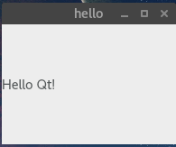

# MFC 对比 QT

<!-- @import "[TOC]" {cmd="toc" depthFrom=1 depthTo=6 orderedList=false} -->
<!-- code_chunk_output -->

* [MFC 对比 QT](#mfc-对比-qt)
	* [MFC 简单介绍](#mfc-简单介绍)
		* [MFC 程序的运行过程](#mfc-程序的运行过程)
		* [MFC 的示例 1](#mfc-的示例-1)
		* [消息映射](#消息映射)
	* [QT 简单介绍](#qt-简单介绍)
		* [QT 简单示例 1](#qt-简单示例-1)
		* [QT 简单示例 2](#qt-简单示例-2)
		* [QT 信号和槽](#qt-信号和槽)
			* [元对象系统](#元对象系统)
	* [一些学习资料](#一些学习资料)

<!-- /code_chunk_output -->


## MFC 简单介绍

[MFC(微软) wikipedia](https://zh.wikipedia.org/wiki/MFC_(%E5%BE%AE%E8%BB%9F))

Microsoft 基础类库（MFC）是用于在 Microsoft Windows中进行编程的“应用程序框架”。MFC提供了很多代码，这些代码是以下所需的 :
* 管理Windows。
* 菜单和对话框。
* 执行基本输入/输出。
* 存储数据对象的集合等
* 通过将特定于应用程序的代码添加到MFC框架中，您可以轻松扩展或覆盖 C++ 应用程序中的MFC框架的基本功能。

MFC 框架：

* MFC框架提供了一组可重用类，旨在简化Windows编程。

* MFC为许多基本对象提供了类，例如日常编程中使用的字符串，文件和集合。

* 它还提供了常用Windows API和数据结构（如窗口，控件和设备上下文）的类。

* 该框架还为更高级的功能（如ActiveX和文档视图处理）提供了坚实的基础。

* 另外，MFC提供了一个应用程序框架，包括组成应用程序体系结构层次结构的类。

MFC优点：

* 它缩短了开发时间。

* 它使代码更加便携。

* 它还提供了巨大的支持，而不会降低编程的自由度和灵活性。

* 它可以轻松访问“难以编程”的用户界面元素和技术。

* MFC通过数据访问对象（DAO）和开放式数据库连接（ODBC）简化了数据库编程，并通过Windows套接字进行了网络编程。

[原文链接](https://www.tutorialspoint.com/mfc/mfc_overview.htm)

MFC 缺点：
* 虽然MFC的源代码对用户是完全开放的，但是MFC的一些封装过程过于复杂，以致于新用户很难迅速掌握MFC的应用程序框架，以及在调试中定位问题的位置。同时，很多MFC对象不是线程安全的，致使在跨线程访问MFC对象时需要编写额外的代码。另外，MFC的很多类依赖于应用程序向导生成的代码，使得在使用Visual C++中其他类型的应用程序向导生成的工程中添加MFC支持的难度大大增加。


### MFC 程序的运行过程

基于MFC开发的应用程序在启动时，Windows操作系统：

```highlight
1. 首先调用WinMain函数（位于appmodul.cpp中，封装到mfc80.dll（VS2005版）），WinMain函数内调用了AfxWinMain函数。
	2.  AfxWinMain函数（位于WinMain.cpp中）调用了
		1. 该应用程序自定义的App类（这个类派生于CWinApp的，CWinApp又是派生于CWinThread，因此代表了应用程序的主线程）的InitInstance函数，该函数注册并创建窗口（通过AppUI2.cpp中的ProcessShellCommmand函数)，然后ShowWindow、UpdateWindow;
		2. CWinThread的InitInstance函数；
		3. CWinThread的Run函数（位于thrdcore.cpp中）。该函数内部是Windows的消息循环。 当应用程序收到WM_QUIT消息后，CWinThread::Run函数返回，紧接着CWinThread::ExitInstance被调用，该函数可被覆盖。程序至此退出运行。 消息循环是一个for(;;)的死循环，该死循环内部包含了一个do...while的循环结构。while循环条件是调用PeekMessage函数的返回值，如果当前UI线程消息队列为空就返回到外层的死循环；while循环体内做两件事：
			1. PumpMessage()。实际调用AfxInternalPumpMessage函数实现其功能：GetMessage()、AfxPreTranslateMessage()、TranslateMessage()、DispatchMessage().即：从UI线程消息队列移除一条消息、遍历该消息的CWnd类直到该窗口的各级别父窗口的CWnd类以提供预处理该消息的机会、如果该消息是按键消息则翻译为WM_CHAR消息、把该消息给相应的窗口函数。
			2. IsIdleMessage()：实际调用了AfxInternalIsIdleMessage函数，对于WM_PAINT、WM_SYSTIMER、以及光标位置没有变化的WM_MOUSEMOVE或WM_NCMOUSEMOVE，为Idle Message。
		4. 各个窗口函数（WndProc）内部首先获取对应当前窗口句柄的CWnd类的指针，然后调用AfxCallWndProc函数。
```

[MFC 运行过程 wikipedia](https://zh.wikipedia.org/wiki/MFC_(%E5%BE%AE%E8%BB%9F)#%E5%BA%94%E7%94%A8%E7%A8%8B%E5%BA%8F%E5%90%AF%E5%8A%A8)

### MFC 的示例 1

```c++
#include <afxwin.h>

class CMyFrame :public CFrameWnd
{
public:
	CMyFrame()
	{
		Create(NULL, _ T("MFC Application Tutorial"));

	}
};


class CExample : public CWinApp {
	BOOL InitInstance() {
		CMyFrame * Frame = new CMyFrame();
		m_pMainWnd = Frame;

		Frame->ShowWindow(SW_NORMAL);
		Frame->UpdateWindow();

		return TRUE;
	}
};

CExample theApp;
```

### 消息映射
```c++
BEGIN_MESSAGE_MAP(CMFCApplicationApp, CWinApp)
	ON_COMMAND(ID_HELP, &CWinApp::OnHelp)
END_MESSAGE_MAP()
```

[消息映射宏 Message Mapping Macros (MFC)](https://msdn.microsoft.com/zh-cn/library/s9k6yh5b.aspx)

## QT 简单介绍

Qt 是一个著名的 C++ 应用程序框架。你并不能说它只是一个 GUI 库，因为 Qt 十分庞大，并不仅仅是 GUI 组件。

使用 Qt，在一定程度上你获得的是一个“一站式”的解决方案：
* 不再需要研究 STL，
* 不再需要 C++ 的 \<string>，
* 不再需要到处去找解析 XML、连接数据库、访问网络的各种第三方库

Qt 和 wxWidgets 一样，也是一个标准的 C++ 库。但是它的语法类似于 Java 的 Swing，十分清晰，而且使用信号槽（signal/slot）机制，让程序看起来很明白——这也是很多人优先选择 Qt 的一个很重要的原因。

不过，所谓“成也萧何，败也萧何”。这种机制虽然很清楚，但是它所带来的后果是你需要使用 Qt 的 moc 对程序进行预处理，才能够再使用标准的 make 或者 nmake 进行正常的编译，并且信号槽的调用要比普通的函数调用慢大约一个数量级（Qt 4 文档中说明该数据，但 Qt 5 尚未有官方说明）。

Qt 的界面也不是原生风格的，尽管 Qt 使用 style 机制十分巧妙地模拟了原生界面。另外值得一提的是，Qt 不仅仅能够运行在桌面环境中，还可以运行在嵌入式平台以及手机平台。

注：
* wxWidget，是一个跨平台的标准的C++库，和Qt一样庞大。它的语法看上去和MFC类似，有大量的宏。据说，一个MFC程序员可以很容易的转换到wxWidget上面来。wxWidget有一个很大的优点，就是它的界面都是原生风格的。这是其他的库所不能做到的。wxWidget的运行效率很高，据说在Windows平台上比起微软自家的MFC也不相上下

[Qt 学习之路 2/QT 简介](https://www.devbean.net/2012/08/qt-study-road-2-qt-intro/)

### QT 简单示例 1
```c++
#include <QApplication>
#include <QLabel>

int main(int argc, char * argv[])
{
    QApplication app(argc, argv);
    QLabel * label = new QLabel("Hello Qt!");
    label->show();
    return app.exec();
}
```

[Qt事件循环的一些理解（exec、eventloop）](http://blog.chinaunix.net/uid-27685749-id-3847998.html)

在 fedora 27 上运行的结果：



### QT 简单示例 2

```c++
#include <QApplication>
#include <QHBoxLayout>
#include <QSlider>
#include <QSpinBox>

int main(int argc, char *argv[])
{
    QApplication app(argc, argv);

    QWidget * window = new QWidget;
    window->setWindowTitle("Enter Your Age");

    QSpinBox * spinBox = new QSpinBox;
    QSlider * slider = new QSlider(Qt::Horizontal);
    spinBox->setRange(0, 130);
    slider->setRange(0, 130);

    QObject::connect(spinBox, SIGNAL(valueChanged(int)),
                     slider, SLOT(setValue(int)));
    QObject::connect(slider, SIGNAL(valueChanged(int)),
                     spinBox, SLOT(setValue(int)));
    spinBox->setValue(35);

    QHBoxLayout * layout = new QHBoxLayout;
    layout->addWidget(spinBox);
    layout->addWidget(slider);
    window->setLayout(layout);

    window->show();

    return app.exec();
}
```

[该示例详解](https://github.com/dopenw/blog/blob/master/Qt/1_hello_qt.md)

### QT 信号和槽

[对话框、信号和槽的一些讲解](https://github.com/dopenw/blog/blob/master/Qt/2_creat_dialog.md)


#### 元对象系统
QT 的主要成就之一就是使用了一种机制队 C++ 进行了扩展，并且使用这种机制创建了独立的软件组件。这些组件可以绑定在一起，但任何一个组件对于它所要连接的组件的情况事先一无所知。这种机制被称为元对象系统（meta-object system），它提供了关键的两项技术：信号 - 槽 以及 内省(introspection)。

## 一些学习资料

* 《C++ GUI QT 4 编程第二版》
* [《Qt 学习之路 2》](https://www.devbean.net/2012/08/qt-study-road-2-catelog/)
* 《VC孙鑫深入详解》
* [tutorialspoint.com/mfc](https://www.tutorialspoint.com/mfc/index.htm)


[上一级](README.md)
[上一篇](C++Primer.md)
[下一篇](Preprocessor.md)
